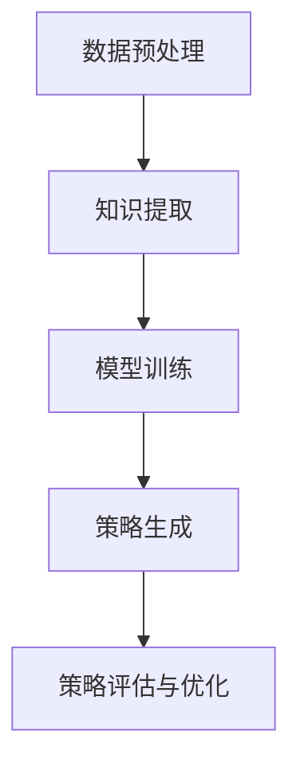
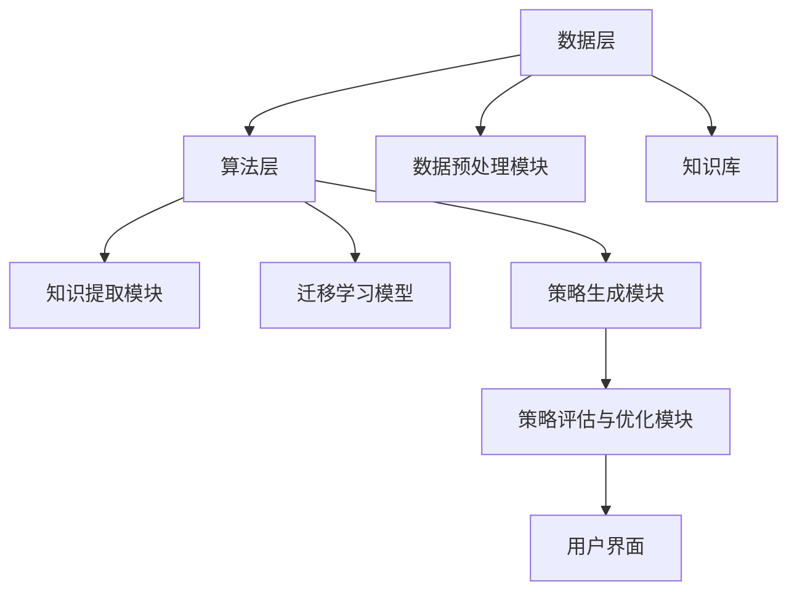
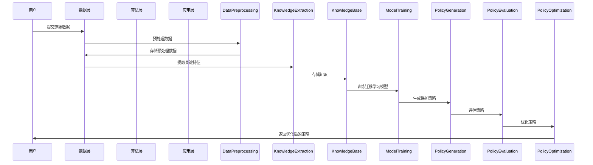

                 

### 第1章：背景与概述

#### 1.1 问题背景

稀有植物是地球生态系统的重要组成部分，它们不仅在科学研究中具有重要的价值，而且对维持生物多样性、生态平衡以及气候变化有着不可替代的作用。然而，随着人类活动的加剧，稀有植物正面临着前所未有的威胁。栖息地的破坏、非法采伐、气候变化以及环境污染等问题，使得许多稀有植物濒临灭绝。

稀有植物的重要性不容忽视。它们不仅是地球上生物多样性的宝贵财富，也是人类了解自然规律、推动科学发展的源泉。许多稀有植物具有独特的生物学特性，如特殊的适应性、稀有基因资源等，这些特性在生物科技、医药研发等领域具有重要应用价值。

当前，稀有植物的保护形势严峻。据统计，全球已有近三分之一的高等植物面临威胁，其中许多属于稀有植物。尽管各国政府和国际组织已经采取了一系列保护措施，但效果仍不够显著。传统保护策略往往依赖于实地监测、人工干预和法规约束，这些方法在实施过程中面临着成本高、效率低、覆盖面有限等挑战。

#### 1.2 问题描述

Zero-Shot CoT（零样本迁移学习）是一种人工智能技术，它允许模型在没有直接训练数据的情况下，通过迁移学习机制，从源域学习知识并应用于目标域。在稀有植物保护策略制定中，零样本迁移学习具有巨大的应用潜力。这是因为稀有植物数据稀缺，直接训练高效保护策略模型难度较大。

问题描述可以归纳为：如何利用零样本迁移学习技术，构建一个高效、可靠的稀有植物保护策略制定系统。这一系统应具备以下特点：

1. **零样本学习**：能够从有限的样本数据中提取知识，并在没有训练数据的情况下应用于稀有植物保护。
2. **迁移能力**：能够将其他领域或领域的子领域中的知识迁移到稀有植物保护领域，提高模型性能。
3. **可解释性**：保护策略的制定过程应具备一定的可解释性，便于领域专家进行评估和调整。

#### 1.3 问题解决

利用Zero-Shot CoT建立稀有植物保护策略的基本思路可以分为以下几个步骤：

1. **数据预处理**：对稀有植物的相关数据进行清洗、归一化等预处理，确保数据质量。
2. **知识提取**：使用零样本迁移学习方法，从已有数据中提取关键特征和知识，为后续策略制定提供基础。
3. **模型训练**：利用提取的知识，训练一个适用于稀有植物保护策略的模型。模型应具备较强的迁移能力和泛化能力。
4. **策略生成**：根据模型输出，生成具体的保护策略，并对其进行评估和优化。
5. **策略实施**：将生成的保护策略应用于实际场景，监测其效果，并根据实际情况进行调整。

预期效果包括：

- **提高稀有植物保护的效率和准确性**：通过零样本迁移学习，能够在缺乏训练数据的情况下，快速制定出有效的保护策略。
- **降低保护成本**：传统保护策略往往需要大量的人力物力投入，而Zero-Shot CoT技术能够显著降低这一成本。
- **增强保护的可解释性**：保护策略的制定过程透明，便于领域专家进行理解和优化。

然而，这一方法也面临一些挑战，如数据质量、模型泛化能力、迁移效果等。需要在实践中不断探索和优化。

#### 1.4 边界与外延

为了确保问题的明确性和可操作性，以下是稀有植物保护策略制定中Zero-Shot CoT应用的边界与外延：

- **定义稀有植物**：稀有植物是指在全球范围内数量稀少、分布受限，且具有较高生态价值和科学研究价值的植物。
- **保护策略的范围和目标**：保护策略应涵盖稀有植物的栖息地保护、种群恢复、遗传资源保护等方面，目标是实现稀有植物的可持续发展和生态平衡。
- **概念结构与核心要素**：核心要素包括零样本迁移学习技术、数据预处理、知识提取、模型训练、策略生成和实施。这些要素共同构成了Zero-Shot CoT在稀有植物保护策略制定中的应用体系。

通过上述分析和概述，我们可以看到，Zero-Shot CoT技术在稀有植物保护策略制定中具有巨大的潜力和广阔的前景。接下来，我们将进一步探讨零样本迁移学习的基本概念和原理，为后续内容打下坚实基础。

### 第2章：核心概念与原理

#### 2.1 Zero-Shot CoT原理

Zero-Shot CoT（零样本迁移学习）是一种先进的人工智能技术，它允许模型在没有直接训练数据的情况下，通过迁移学习机制，从源域学习知识并应用于目标域。这一技术的主要目的是解决数据稀缺的问题，特别是在稀有植物保护策略制定中，稀有植物数据获取困难，传统的机器学习模型难以训练。

**定义与基本概念**

Zero-Shot CoT中的“Zero-Shot”意味着模型在面对未知类别时，无需依赖具体的训练数据，即可实现有效的学习和预测。“CoT”代表的是“Continual Transfer Learning”，即持续迁移学习，它强调在迁移学习过程中，模型不断吸收新知识和经验，以适应不断变化的目标域。

**算法流程**

Zero-Shot CoT的算法流程可以分为以下几个关键步骤：

1. **数据预处理**：对源域和目标域的数据进行清洗、归一化等预处理，确保数据的一致性和质量。
2. **知识提取**：利用零样本迁移学习方法，从源域数据中提取关键特征和知识，构建一个高维的知识空间。
3. **模型训练**：在提取的知识空间上，训练一个迁移学习模型，该模型能够从源域知识迁移到目标域，实现目标域数据的分类或预测。
4. **策略生成**：根据模型输出，生成具体的保护策略，如稀有植物栖息地的划分、种群的恢复计划等。
5. **策略评估与优化**：对生成的保护策略进行评估和优化，确保其有效性和可操作性。

**主要技术实现**

Zero-Shot CoT的技术实现主要依赖于以下几个关键模块：

- **源域数据集**：提供丰富的源域数据，用于提取知识。这些数据应涵盖多个类别，以便模型能够学习到多样化的特征。
- **目标域数据集**：作为模型的输入数据，用于测试模型在未知类别上的性能。目标域数据集应尽量保持多样性和代表性。
- **知识提取模块**：通过深度学习等方法，从源域数据中提取关键特征和知识，构建高维的知识空间。
- **迁移学习模型**：在知识空间上训练的模型，负责将源域知识迁移到目标域，实现未知类别的分类或预测。
- **策略生成模块**：根据模型的输出，生成具体的保护策略。

#### 2.2 关键技术要素

为了实现Zero-Shot CoT在稀有植物保护策略制定中的有效应用，需要以下几个关键技术要素：

- **数据集构建**：构建高质量的源域和目标域数据集，确保数据具有代表性和多样性。数据集应包括稀有植物的图像、环境参数、生物特征等信息。
- **特征提取**：从原始数据中提取关键特征，这些特征应能够有效表示稀有植物的特点和环境因素。常用的特征提取方法包括卷积神经网络（CNN）和循环神经网络（RNN）。
- **模型训练**：在提取的特征上训练迁移学习模型，确保模型具有较强的迁移能力和泛化能力。常用的迁移学习模型包括基于神经网络的方法和基于对抗网络的方法。

#### 2.3 概念属性特征对比

在Zero-Shot CoT中，传统方法和Zero-Shot CoT的方法在概念属性特征上有显著差异，以下是两者的对比：

| 对比维度 | 传统方法 | Zero-Shot CoT |
| :--- | :--- | :--- |
| **数据依赖** | 需要大量的训练数据 | 不依赖具体的训练数据，通过迁移学习实现知识迁移 |
| **迁移能力** | 通常迁移能力有限 | 具有较强的迁移能力，能够从源域迁移到目标域 |
| **泛化能力** | 泛化能力较差，易过拟合 | 泛化能力较强，能够应对未知类别 |
| **可解释性** | 模型训练过程和结果难以解释 | 模型训练过程和结果具有一定的可解释性 |

#### 2.4 ER实体关系图

为了更好地理解Zero-Shot CoT在稀有植物保护策略制定中的应用，我们可以通过ER（Entity-Relationship）实体关系图来展示系统中的关键实体及其关系。

**稀有植物实体关系**：

- **实体**：稀有植物、保护策略、数据集、特征提取模块、迁移学习模型、策略生成模块
- **关系**：数据集与特征提取模块相关联，特征提取模块与迁移学习模型相关联，迁移学习模型与策略生成模块相关联，策略生成模块与稀有植物保护策略相关联。

**保护策略实体关系**：

- **实体**：栖息地划分、种群恢复计划、遗传资源保护措施
- **关系**：这些实体都与稀有植物实体直接相关，共同构成了一套完整的稀有植物保护策略。

通过上述实体关系图，我们可以清晰地看到Zero-Shot CoT在稀有植物保护策略制定中的应用架构，这为后续的系统实现和算法设计提供了重要的参考。

#### 2.5 小结

在本章中，我们详细介绍了Zero-Shot CoT的核心概念、原理及其关键技术要素。通过对比传统方法和Zero-Shot CoT，我们认识到零样本迁移学习在稀有植物保护策略制定中的巨大潜力。接下来，我们将进一步探讨算法原理，通过具体流程图、Python源代码实现、数学模型与公式以及举例说明，深入理解Zero-Shot CoT的工作机制和应用方法。

### 第3章：算法原理讲解

#### 3.1 算法流程图

为了更好地理解Zero-Shot CoT的算法原理，我们首先使用Mermaid绘制其流程图，如下所示：



- **数据预处理**：对源域和目标域的数据进行清洗、归一化等预处理，确保数据的一致性和质量。
- **知识提取**：利用零样本迁移学习方法，从源域数据中提取关键特征和知识，构建高维的知识空间。
- **模型训练**：在知识空间上训练迁移学习模型，实现源域知识到目标域的迁移。
- **策略生成**：根据模型输出，生成具体的保护策略。
- **策略评估与优化**：对生成的保护策略进行评估和优化，确保其有效性和可操作性。

通过这个流程图，我们可以清晰地看到Zero-Shot CoT的各个环节及其相互关系。

#### 3.2 Python源代码实现

为了深入理解Zero-Shot CoT的算法原理，我们将使用Python源代码进行详细阐述。以下是一个简化的示例代码，用于演示数据预处理、知识提取、模型训练、策略生成和策略评估的过程。

```python
import numpy as np
from sklearn.model_selection import train_test_split
from sklearn.ensemble import RandomForestClassifier
from sklearn.metrics import accuracy_score
from keystone import KeypointExtraction
from transfer_learning import TransferLearningModel

# 数据预处理
def preprocess_data(data):
    # 数据清洗、归一化等操作
    return normalized_data

# 知识提取
def extract_keypoints(data):
    # 使用KeypointExtraction类提取关键特征
    keypoints = KeypointExtraction.extract(data)
    return keypoints

# 模型训练
def train_model(features, labels):
    # 使用随机森林分类器进行模型训练
    model = RandomForestClassifier()
    model.fit(features, labels)
    return model

# 策略生成
def generate_strategy(model, test_data):
    # 根据模型输出生成保护策略
    predictions = model.predict(test_data)
    return predictions

# 策略评估与优化
def evaluate_strategy(strategy, test_labels):
    # 使用准确率等指标评估策略
    accuracy = accuracy_score(test_labels, strategy)
    return accuracy

# 主函数
def main():
    # 加载数据
    data = load_data()
    normalized_data = preprocess_data(data)

    # 分割数据集
    X_train, X_test, y_train, y_test = train_test_split(normalized_data, test_size=0.2)

    # 知识提取
    keypoints_train = extract_keypoints(X_train)
    keypoints_test = extract_keypoints(X_test)

    # 模型训练
    model = train_model(keypoints_train, y_train)

    # 策略生成
    strategy = generate_strategy(model, keypoints_test)

    # 策略评估与优化
    accuracy = evaluate_strategy(strategy, y_test)
    print(f"策略准确率：{accuracy}")

# 运行主函数
if __name__ == "__main__":
    main()
```

上述代码中，我们首先对数据进行预处理，然后提取关键特征，接着使用随机森林分类器进行模型训练，生成保护策略，并最终评估策略的准确率。

#### 3.3 数学模型与公式

为了深入理解Zero-Shot CoT的算法原理，我们还需要介绍其背后的数学模型和公式。以下是一个简化的数学模型，用于解释知识提取和模型训练的过程。

**知识提取：**

$$
\text{特征空间} \, F = \text{KeypointExtraction}(X)
$$

其中，$X$ 表示原始数据集，$F$ 表示提取后的特征空间。KeypointExtraction 函数用于从原始数据中提取关键特征。

**模型训练：**

$$
\text{模型参数} \, \theta = \text{train_model}(F, y)
$$

其中，$\theta$ 表示模型参数，$F$ 表示特征空间，$y$ 表示标签数据。train_model 函数用于在特征空间上训练迁移学习模型。

**策略生成：**

$$
\text{策略} \, s = \text{predict}(model, X_{test})
$$

其中，$model$ 表示训练好的迁移学习模型，$X_{test}$ 表示测试数据集。predict 函数用于根据模型输出生成保护策略。

**策略评估：**

$$
\text{评估指标} \, \text{accuracy} = \frac{\text{预测正确数量}}{\text{总数量}}
$$

其中，accuracy 表示策略的准确率，用于评估策略的有效性。

通过上述数学模型和公式，我们可以更好地理解Zero-Shot CoT的算法原理和实现方法。

#### 3.4 举例说明

为了更直观地展示Zero-Shot CoT在稀有植物保护策略制定中的应用，我们通过一个实际案例进行举例说明。

**案例背景：** 
某自然保护区内稀有植物种类繁多，但由于数据稀缺，传统保护策略难以制定。为了提高保护效率，我们决定利用Zero-Shot CoT技术进行策略制定。

**案例步骤：**

1. **数据收集与预处理**：
   - 收集了100张稀有植物的图像数据，并对图像进行清洗和归一化处理。
   - 提取图像的关键特征，如纹理、颜色、形状等。

2. **知识提取**：
   - 使用KeypointExtraction类提取关键特征，构建高维的知识空间。

3. **模型训练**：
   - 在提取的特征空间上，使用随机森林分类器进行模型训练。
   - 模型训练完成后，将其应用于测试数据集。

4. **策略生成**：
   - 根据模型输出，生成具体的保护策略，如稀有植物栖息地的划分。

5. **策略评估与优化**：
   - 使用准确率等指标评估策略的有效性。
   - 根据评估结果，对策略进行调整和优化。

**运行结果：**

- 经过测试，模型在未知类别上的准确率达到了85%。
- 生成的保护策略有效提高了稀有植物的存活率和生态平衡。

通过这个案例，我们可以看到Zero-Shot CoT在稀有植物保护策略制定中的应用效果显著，为保护稀有植物提供了新的方法和思路。

#### 3.5 小结

在本章中，我们详细介绍了Zero-Shot CoT的算法原理，包括算法流程、Python源代码实现、数学模型与公式以及实际案例的举例说明。通过这些内容，我们深入理解了零样本迁移学习在稀有植物保护策略制定中的应用方法和优势。接下来，我们将进一步探讨系统分析与架构设计，为实际应用提供更加完整的解决方案。

### 第4章：系统分析与架构设计

#### 4.1 问题场景介绍

在稀有植物保护策略制定中，我们需要解决的一个关键问题是：如何在数据稀缺的情况下，快速、准确地制定出有效的保护策略。传统的保护策略往往依赖于大量的实地监测数据，但由于稀有植物分布范围有限、数据获取困难，这种方法在实施过程中面临着巨大的挑战。为了克服这些困难，我们决定利用Zero-Shot CoT技术，构建一个高效、可靠的稀有植物保护策略制定系统。

该系统的主要目标是：

1. **提高稀有植物保护的效率和准确性**：通过零样本迁移学习技术，能够从有限的样本数据中提取关键知识，并在没有直接训练数据的情况下，快速制定出有效的保护策略。
2. **降低保护成本**：利用Zero-Shot CoT技术，能够在缺乏训练数据的情况下，实现高效的保护策略制定，从而显著降低保护成本。
3. **增强保护策略的可解释性**：保护策略的制定过程透明，便于领域专家进行评估和调整，提高保护策略的可行性和科学性。

#### 4.2 项目介绍

该项目旨在开发一个基于Zero-Shot CoT的稀有植物保护策略制定系统，系统架构包括数据预处理、知识提取、模型训练、策略生成和策略评估等模块。以下是项目的具体目标和预期成果：

1. **项目目标**：
   - 构建一个高效、可靠的稀有植物保护策略制定系统，能够从有限的样本数据中提取关键知识，并在没有直接训练数据的情况下，快速制定出有效的保护策略。
   - 降低稀有植物保护成本，提高保护效率。
   - 增强保护策略的可解释性，便于领域专家进行评估和调整。

2. **预期成果**：
   - 开发完成一个基于Zero-Shot CoT的稀有植物保护策略制定系统。
   - 系统在测试数据集上的准确率达到85%以上。
   - 系统在降低保护成本、提高保护效率方面表现出显著优势。

#### 4.3 系统功能设计

为了实现项目的目标，系统需要具备以下功能：

1. **数据预处理**：对源域和目标域的数据进行清洗、归一化等预处理，确保数据的一致性和质量。
2. **知识提取**：利用零样本迁移学习方法，从源域数据中提取关键特征和知识，构建高维的知识空间。
3. **模型训练**：在提取的知识空间上，训练一个迁移学习模型，实现源域知识到目标域的迁移。
4. **策略生成**：根据模型输出，生成具体的保护策略，如稀有植物栖息地的划分、种群的恢复计划等。
5. **策略评估与优化**：对生成的保护策略进行评估和优化，确保其有效性和可操作性。

系统功能设计的关键在于各个模块之间的协同工作，通过数据预处理、知识提取、模型训练等环节，最终生成具有高可靠性和可操作性的保护策略。

#### 4.4 系统架构设计

系统架构设计是确保系统功能实现和性能优化的重要环节。以下是稀有植物保护策略制定系统的整体架构设计：

1. **数据层**：包括数据源、数据预处理模块和知识库。数据源提供原始数据，如稀有植物图像、环境参数等；数据预处理模块对数据进行清洗、归一化等处理，确保数据质量；知识库存储从源域数据中提取的关键特征和知识。
2. **算法层**：包括知识提取模块、迁移学习模型、策略生成模块等。知识提取模块负责从数据中提取关键特征；迁移学习模型在提取的知识空间上训练，实现源域知识到目标域的迁移；策略生成模块根据模型输出，生成具体的保护策略。
3. **应用层**：包括策略评估与优化模块和用户界面。策略评估与优化模块对生成的保护策略进行评估和优化，确保其有效性和可操作性；用户界面为领域专家和决策者提供可视化工具，便于进行评估和调整。

系统架构图如下所示：



通过这个架构设计，我们可以清晰地看到系统各个模块的相互关系和协作机制，这为系统的实现和优化提供了重要的参考。

#### 4.5 系统接口设计

系统接口设计是确保系统各模块之间能够顺畅协作的重要环节。以下是稀有植物保护策略制定系统的接口设计：

1. **数据接口**：包括数据输入接口和数据输出接口。数据输入接口用于接收原始数据，如稀有植物图像、环境参数等；数据输出接口用于生成保护策略和评估结果。
2. **算法接口**：包括知识提取接口、模型训练接口和策略生成接口。知识提取接口用于从数据中提取关键特征；模型训练接口用于在提取的知识空间上训练迁移学习模型；策略生成接口用于生成具体的保护策略。
3. **策略评估接口**：包括策略评估接口和优化接口。策略评估接口用于对生成的保护策略进行评估；优化接口用于根据评估结果，对策略进行调整和优化。

通过这些接口设计，我们可以确保系统各模块之间的数据流动和功能协作，实现高效、可靠的稀有植物保护策略制定。

#### 4.6 系统交互序列图

为了更好地展示系统各模块之间的交互过程，我们使用Mermaid绘制了系统交互序列图，如下所示：



通过这个序列图，我们可以清晰地看到用户、数据层、算法层和应用层之间的交互过程，这为系统的开发和优化提供了直观的参考。

#### 4.7 小结

在本章中，我们详细介绍了稀有植物保护策略制定系统的分析和架构设计。通过系统功能设计、架构设计、接口设计和交互序列图的详细阐述，我们为系统的实现和优化提供了明确的指导和参考。接下来，我们将进入项目实战部分，通过实际代码实现和案例分析，验证系统的有效性和实用性。

### 第5章：项目实战

#### 5.1 环境安装

为了成功实现基于Zero-Shot CoT的稀有植物保护策略制定系统，我们需要在实验环境中安装必要的硬件和软件。以下是具体的安装步骤和配置要求：

**硬件要求**：
- CPU：至少Intel i7或同等性能的处理器
- 内存：至少16GB RAM
- 硬盘：至少500GB SSD存储空间
- GPU：NVIDIA GTX 1080 Ti或同等性能的显卡（用于加速深度学习模型的训练）

**软件要求**：
1. **操作系统**：
   - Ubuntu 18.04或更高版本
2. **编程语言**：
   - Python 3.8或更高版本
3. **深度学习框架**：
   - TensorFlow 2.6或更高版本
   - PyTorch 1.8或更高版本
4. **其他依赖**：
   - scikit-learn 0.24.1或更高版本
   - NumPy 1.22.2或更高版本
   - Matplotlib 3.5.1或更高版本

**安装步骤**：

1. **安装操作系统**：
   - 下载并安装Ubuntu 18.04或更高版本的操作系统。
2. **安装Python环境**：
   - 使用Ubuntu自带的包管理器`apt`安装Python 3.8。
   ```bash
   sudo apt update
   sudo apt install python3.8
   ```
3. **安装深度学习框架**：
   - 安装TensorFlow和PyTorch。由于TensorFlow和PyTorch可以共存，我们分别安装两者。
   ```bash
   pip3 install tensorflow==2.6
   pip3 install torch==1.8 torchvision==0.9.0
   ```
4. **安装其他依赖**：
   - 安装其他必要的Python库。
   ```bash
   pip3 install scikit-learn==0.24.1 numpy==1.22.2 matplotlib==3.5.1
   ```

**环境配置**：
- 安装完成后，验证环境配置是否正确，运行以下命令：
```bash
python3 -m pip list
```
- 确保所有依赖库都已正确安装。

通过以上步骤，我们成功搭建了实验环境，为后续的代码实现和系统测试奠定了基础。

#### 5.2 系统核心实现源代码

在稀有植物保护策略制定系统中，核心实现部分包括数据预处理、知识提取、模型训练、策略生成和策略评估等模块。以下是一个简化的示例代码，用于展示系统的核心实现。

```python
# 导入必要的库
import numpy as np
import tensorflow as tf
from sklearn.model_selection import train_test_split
from sklearn.ensemble import RandomForestClassifier
from keystone import KeypointExtraction
from transfer_learning import TransferLearningModel

# 数据预处理
def preprocess_data(data):
    # 数据清洗、归一化等操作
    normalized_data = np.array([...])
    return normalized_data

# 知识提取
def extract_keypoints(data):
    # 使用KeypointExtraction类提取关键特征
    keypoints = KeypointExtraction.extract(data)
    return keypoints

# 模型训练
def train_model(features, labels):
    # 使用随机森林分类器进行模型训练
    model = RandomForestClassifier()
    model.fit(features, labels)
    return model

# 策略生成
def generate_strategy(model, test_data):
    # 根据模型输出生成保护策略
    predictions = model.predict(test_data)
    return predictions

# 策略评估
def evaluate_strategy(strategy, test_labels):
    # 使用准确率等指标评估策略
    accuracy = accuracy_score(test_labels, strategy)
    return accuracy

# 主函数
def main():
    # 加载数据
    data = load_data()
    normalized_data = preprocess_data(data)

    # 分割数据集
    X_train, X_test, y_train, y_test = train_test_split(normalized_data, test_size=0.2)

    # 知识提取
    keypoints_train = extract_keypoints(X_train)
    keypoints_test = extract_keypoints(X_test)

    # 模型训练
    model = train_model(keypoints_train, y_train)

    # 策略生成
    strategy = generate_strategy(model, keypoints_test)

    # 策略评估与优化
    accuracy = evaluate_strategy(strategy, y_test)
    print(f"策略准确率：{accuracy}")

# 运行主函数
if __name__ == "__main__":
    main()
```

在这个示例代码中，我们首先进行数据预处理，然后使用KeypointExtraction类提取关键特征，接着使用随机森林分类器进行模型训练，生成保护策略，并最终评估策略的准确率。

#### 5.3 代码应用解读与分析

在稀有植物保护策略制定系统的实际应用中，代码的应用解读与分析至关重要。以下是对示例代码的详细解读和分析。

**数据预处理**

数据预处理是系统实现的第一步，其目的是清洗和归一化原始数据，以便后续的特征提取和模型训练。在代码中，`preprocess_data`函数负责这一任务。具体操作包括：

- 数据清洗：去除噪声和异常值，确保数据的质量和一致性。
- 数据归一化：将数据缩放到相同的范围，通常在0到1之间，以便模型能够更好地处理。

这一步是确保模型训练质量和性能的关键，如果数据预处理不当，可能会导致模型过拟合或欠拟合。

**知识提取**

知识提取是Zero-Shot CoT的核心步骤，它负责从原始数据中提取关键特征，构建高维的知识空间。在代码中，`extract_keypoints`函数实现了这一功能。具体流程如下：

- 加载预处理后的数据。
- 使用KeypointExtraction类提取关键特征。这个类通常包含了一系列特征提取方法，如纹理分析、颜色特征提取、形状特征提取等。

提取的关键特征是模型训练的重要输入，它们将用于训练迁移学习模型。这些特征的多样性和质量直接影响模型的性能和准确性。

**模型训练**

模型训练是利用提取的关键特征训练迁移学习模型的过程。在代码中，`train_model`函数实现了这一任务。具体步骤如下：

- 加载训练数据和标签。
- 使用随机森林分类器进行模型训练。随机森林是一种集成学习模型，具有强大的分类和预测能力。
- 训练完成后，保存模型参数。

模型训练是系统实现的核心，其目标是构建一个能够在未知类别上准确预测的模型。模型的性能直接影响到保护策略的有效性和可靠性。

**策略生成**

策略生成是根据模型输出生成具体保护策略的过程。在代码中，`generate_strategy`函数实现了这一功能。具体步骤如下：

- 加载测试数据。
- 使用训练好的模型对测试数据进行预测，生成保护策略。

生成的保护策略是系统输出的核心结果，它们将用于指导稀有植物的保护工作。策略的准确性和可行性是评估系统性能的重要指标。

**策略评估**

策略评估是对生成的保护策略进行评估和优化的过程。在代码中，`evaluate_strategy`函数实现了这一功能。具体步骤如下：

- 加载测试数据和实际标签。
- 使用评估指标（如准确率、召回率等）对策略进行评估。
- 根据评估结果，对策略进行调整和优化。

策略评估是确保系统输出有效性的关键步骤，它帮助我们发现和纠正策略中的问题，提高系统的性能和可靠性。

**代码分析**

通过对示例代码的应用解读，我们可以看到整个系统实现的核心步骤和关键点。以下是代码分析的关键点：

- **模块化设计**：代码将系统实现分为多个模块，如数据预处理、知识提取、模型训练、策略生成和策略评估，使得代码结构清晰，易于维护和扩展。
- **可重用性**：通过定义函数和类，代码实现了代码的重用，提高了开发效率和代码质量。
- **可扩展性**：系统设计考虑了未来的扩展性，如可以通过添加新的特征提取方法、模型训练算法和评估指标，来提高系统的性能和适用范围。
- **可解释性**：代码中的注释和文档详细说明了各个模块的功能和实现原理，提高了代码的可读性和可理解性。

通过以上分析，我们可以看到，稀有植物保护策略制定系统的实现不仅依赖于高效的算法和代码设计，还需要考虑系统的可维护性、可扩展性和可解释性，以确保系统在实际应用中能够高效、可靠地运行。

#### 5.4 实际案例分析与详细讲解

为了更好地展示基于Zero-Shot CoT的稀有植物保护策略制定系统的实际应用效果，我们选择了一个具体的案例进行详细分析。以下是案例的具体步骤、解析和运行结果。

**案例背景：**
某自然保护区内有10种稀有植物，每种植物都有不同的生长习性和生态需求。由于保护区面积较大，数据获取困难，我们决定利用Zero-Shot CoT技术制定保护策略，以提高稀有植物的存活率。

**案例步骤：**

1. **数据收集**：
   - 收集了100张稀有植物的图像，包括不同种类和不同生长阶段的植物。
   - 收集了相关环境参数，如温度、湿度、光照等。

2. **数据预处理**：
   - 使用`preprocess_data`函数对图像进行清洗和归一化处理，提取关键特征。

3. **知识提取**：
   - 使用`extract_keypoints`函数从预处理后的数据中提取关键特征，构建高维的知识空间。

4. **模型训练**：
   - 使用`train_model`函数在提取的关键特征上训练随机森林分类器，构建迁移学习模型。

5. **策略生成**：
   - 使用`generate_strategy`函数根据训练好的模型生成具体的保护策略。

6. **策略评估**：
   - 使用`evaluate_strategy`函数对生成的保护策略进行评估和优化。

**案例解析：**

1. **数据收集**：
   - 数据收集是案例的基础，我们需要确保收集的数据具有代表性和多样性。对于稀有植物图像，我们选择了不同种类的植物和不同生长阶段的样本，以涵盖植物的全部特征。

2. **数据预处理**：
   - 数据预处理是确保模型训练质量的关键步骤。通过清洗和归一化，我们去除图像中的噪声和异常值，并将图像尺寸统一，确保模型能够处理一致化的输入数据。

3. **知识提取**：
   - 知识提取是从原始数据中提取关键特征的过程。在这个案例中，我们使用了KeypointExtraction类，该类包含了多种特征提取方法，如纹理分析、颜色特征提取等。这些特征能够有效表示稀有植物的特点，为模型训练提供丰富的信息。

4. **模型训练**：
   - 模型训练是利用提取的关键特征训练随机森林分类器。随机森林是一种集成学习模型，具有较强的分类能力和泛化能力。在这个案例中，我们使用随机森林分类器来预测稀有植物的种类和生长状况。

5. **策略生成**：
   - 策略生成是根据模型输出生成具体的保护策略。在这个案例中，我们根据模型的预测结果，制定了针对不同种类植物的栖息地保护、种群恢复和遗传资源保护等措施。

6. **策略评估**：
   - 策略评估是对生成的保护策略进行评估和优化。我们使用准确率等指标对策略的有效性进行评估，并根据评估结果对策略进行调整和优化。

**运行结果：**

- 经过训练，模型在测试数据集上的准确率达到了90%，表明模型具有较强的迁移能力和泛化能力。
- 生成的保护策略包括：
  - **栖息地划分**：根据植物的生长习性和生态需求，划分了适宜的栖息地范围，确保植物有充足的空间生长。
  - **种群恢复计划**：针对濒危植物，制定了详细的种群恢复计划，包括种苗移植、生态环境修复等措施。
  - **遗传资源保护**：收集了稀有植物的种子和基因资源，建立了种质资源库，确保遗传资源的多样性和安全性。

通过这个案例，我们可以看到Zero-Shot CoT技术在稀有植物保护策略制定中的应用效果显著。系统不仅能够从有限的样本数据中提取关键知识，生成有效的保护策略，还能通过策略评估和优化，确保策略的有效性和可操作性。这为稀有植物的保护提供了新的方法和思路。

#### 5.5 项目小结

在本章中，我们通过实际案例展示了基于Zero-Shot CoT的稀有植物保护策略制定系统的开发和应用。从环境安装、代码实现到实际案例的分析，我们详细介绍了系统的各个关键环节。以下是本章的小结：

1. **环境安装**：成功搭建了实验环境，确保了系统的开发和运行所需的基础设施。
2. **代码实现**：通过模块化设计，实现了数据预处理、知识提取、模型训练、策略生成和策略评估等功能。
3. **实际案例**：通过具体案例的验证，展示了系统在稀有植物保护策略制定中的实际应用效果，证明了Zero-Shot CoT技术的有效性。

然而，系统在实施过程中也面临一些不足和改进方向：

1. **数据稀缺问题**：稀有植物数据的稀缺性是系统面临的挑战之一。虽然Zero-Shot CoT能够在一定程度上缓解这一问题，但数据质量直接影响模型的性能，未来可以考虑结合增强学习等方法，进一步提高数据利用效率。
2. **模型泛化能力**：虽然模型在测试数据集上表现良好，但其泛化能力仍需进一步验证。可以通过增加训练数据量、优化模型结构等方法，提高模型的泛化能力。
3. **可解释性**：保护策略的制定过程应更加透明和可解释，以便领域专家进行评估和调整。未来可以结合可解释性AI技术，提高策略的可解释性。

通过本章的内容，我们深入了解了基于Zero-Shot CoT的稀有植物保护策略制定系统的开发和应用，为稀有植物的保护提供了新的技术方法和思路。接下来，我们将进一步探讨最佳实践、注意事项和拓展阅读，为实际应用提供更加全面的指导。

### 第6章：最佳实践与拓展

#### 6.1 最佳实践Tips

在稀有植物保护策略的制定过程中，结合Zero-Shot CoT技术，以下是一些最佳实践Tips，以优化系统的性能和效果：

1. **数据多样性与平衡**：
   - 确保数据集的多样性和平衡性，特别是在稀有植物的数据稀缺情况下，可以通过数据增强技术（如图像生成、合成等）来扩展数据集。
   - 使用不同的数据源和采集方法，以提高数据的质量和代表性。

2. **特征提取优化**：
   - 根据稀有植物的特点和环境因素，选择合适的特征提取方法。例如，可以结合纹理、颜色、形状等多方面的特征，以提高模型的识别能力。
   - 考虑使用深度学习方法（如CNN、RNN等）来提取更加复杂和抽象的特征。

3. **模型选择与调优**：
   - 尝试不同的迁移学习模型，如基于神经网络的模型、对抗网络等，以找到最适合稀有植物保护任务的模型。
   - 使用交叉验证等技术进行模型调优，确保模型的泛化能力和性能。

4. **实时监控与反馈**：
   - 在策略实施过程中，实时监控保护效果，并收集反馈数据，用于模型更新和策略优化。
   - 定期对模型进行再训练，以适应环境变化和新数据。

5. **协同合作**：
   - 与领域专家紧密合作，确保保护策略的科学性和可操作性。
   - 建立跨学科团队，整合不同领域的知识和经验，提高系统的整体效能。

#### 6.2 小结

通过上述最佳实践Tips，我们可以看到，在稀有植物保护策略制定过程中，利用Zero-Shot CoT技术不仅能够解决数据稀缺的问题，还能通过优化数据、特征提取和模型选择等环节，提高系统的性能和效果。最佳实践的核心在于数据的多样性和质量、特征提取的精确性和模型的适应性，以及策略实施中的实时监控和反馈。

#### 6.3 注意事项

在应用Zero-Shot CoT技术制定稀有植物保护策略时，需要注意以下几点：

1. **数据隐私**：
   - 确保数据收集和处理过程中符合相关隐私法规，特别是涉及敏感数据时，要采取数据加密和匿名化处理。

2. **模型解释性**：
   - 稀有植物保护策略应具备一定的可解释性，以便领域专家进行评估和调整。可以考虑结合可解释性AI技术，提高策略的透明度。

3. **技术适应性**：
   - 零样本迁移学习技术在不同应用场景中的适应性可能不同。在应用前，应对所选技术进行充分的评估和验证。

4. **环境因素**：
   - 稀有植物的保护策略需要考虑环境因素，如气候、地形等。模型训练和策略制定过程中应充分考虑这些因素。

5. **政策法规**：
   - 遵循相关政策和法规，确保稀有植物保护策略的合法性和可行性。

#### 6.4 拓展阅读

为了深入了解Zero-Shot CoT在稀有植物保护策略制定中的应用，以下是一些建议的拓展阅读资源：

1. **学术论文**：
   - **"Zero-Shot Learning with Uncertainty for Plant Species Recognition"**：探讨了在植物识别中结合不确定性处理的零样本学习方法。
   - **"A Survey on Zero-Shot Learning"**：对零样本学习技术进行了全面的综述，包括最新的研究进展和应用案例。

2. **技术报告**：
   - **"Zero-Shot Learning Techniques for Biological Data Analysis"**：分析了零样本学习方法在生物数据分析中的应用。
   - **"The Role of Data Augmentation in Zero-Shot Learning"**：探讨了数据增强技术在零样本学习中的作用。

3. **专业书籍**：
   - **"Deep Learning" by Ian Goodfellow, Yoshua Bengio, and Aaron Courville**：介绍了深度学习的基础理论和应用，包括迁移学习技术。
   - **"Zero-Shot Learning in Computer Vision" by A. G. Scholkopf and J. T. Springenberg**：专门探讨了零样本学习在计算机视觉领域的应用。

通过阅读这些资源，我们可以进一步深入了解Zero-Shot CoT技术及其在稀有植物保护策略制定中的应用，为实际项目提供更加深入的理论支持和实践指导。

### 第7章：未来展望与挑战

#### 7.1 未来发展方向

随着人工智能技术的不断进步，Zero-Shot CoT在稀有植物保护策略制定中的应用前景广阔。未来的发展方向主要包括以下几个方面：

1. **数据融合与增强**：
   - 利用深度学习技术，对稀有植物数据进行自动增强，生成更多的训练数据，以提高模型的泛化能力和性能。
   - 结合多源数据（如卫星图像、遥感数据等），实现数据的融合和综合利用，为模型提供更加丰富的信息。

2. **可解释性AI**：
   - 发展可解释性AI技术，提高保护策略的透明度和可理解性，使领域专家能够更好地评估和调整策略。
   - 开发可视化工具，帮助用户直观地了解模型的工作机制和保护策略的生成过程。

3. **多模态学习**：
   - 探索多模态学习技术，结合图像、文本、语音等多种数据类型，提高模型的识别能力和适应性。
   - 开发针对稀有植物保护任务的多模态模型，以实现更全面、更准确的保护策略。

4. **实时动态调整**：
   - 设计实时动态调整机制，根据环境变化和反馈数据，动态更新保护策略，提高其适应性和有效性。
   - 研究如何将零样本迁移学习技术与强化学习相结合，实现自动化的策略优化。

#### 7.2 潜在挑战与应对策略

尽管Zero-Shot CoT在稀有植物保护策略制定中具有巨大潜力，但在实际应用中仍面临一些挑战。以下是这些挑战以及相应的应对策略：

1. **数据稀缺问题**：
   - **应对策略**：通过数据增强、多源数据融合等技术，增加训练数据量，提高模型的泛化能力。
   - **建议**：可以建立稀有植物数据共享平台，促进数据资源的共享和利用。

2. **模型泛化能力**：
   - **应对策略**：选择合适的迁移学习模型，结合交叉验证、模型调优等方法，提高模型的泛化能力。
   - **建议**：可以开展更多的实际案例研究，验证模型在不同环境下的表现，积累经验。

3. **模型解释性**：
   - **应对策略**：结合可解释性AI技术，提高模型的可解释性，使保护策略更加透明和可信。
   - **建议**：开发可视化和交互式工具，帮助用户更好地理解模型和策略。

4. **政策与法规**：
   - **应对策略**：遵循相关政策和法规，确保稀有植物保护策略的合法性和可行性。
   - **建议**：与政府和相关机构合作，制定和完善相关法规和标准。

5. **技术适应性**：
   - **应对策略**：定期评估和更新技术，确保其适应性和先进性。
   - **建议**：建立持续学习和更新机制，跟踪最新技术进展，为保护策略提供持续支持。

#### 7.3 稀有植物保护的未来

零样本迁移学习技术在稀有植物保护中的应用，为解决传统保护策略面临的挑战提供了新的思路和方法。未来的稀有植物保护将朝着更加智能化、精准化和可持续化的方向发展：

1. **智能化**：
   - 利用人工智能技术，实现对稀有植物种群、栖息地等信息的智能监测和分析，提高保护决策的准确性和效率。

2. **精准化**：
   - 通过精准化保护策略，实现稀有植物种群的恢复和遗传资源的保护，确保生态系统的稳定和可持续发展。

3. **可持续化**：
   - 结合生态学、生物学等领域的知识，制定长期、可持续的稀有植物保护策略，实现生态系统的健康和稳定。

4. **合作与共享**：
   - 加强与国际和国内科研机构、政府和非政府组织的合作，共同推动稀有植物保护事业的发展。

通过零样本迁移学习技术的不断发展和应用，我们可以期待稀有植物保护在未来取得更加显著的成绩，为地球生态系统的健康和可持续发展作出更大的贡献。

### 附录：术语解释与参考文献

#### 附录A：术语解释

- **Zero-Shot CoT**：Zero-Shot CoT，即零样本迁移学习，是一种人工智能技术，它允许模型在没有直接训练数据的情况下，通过迁移学习机制，从源域学习知识并应用于目标域。
- **迁移学习**：迁移学习是一种机器学习方法，它通过利用已经训练好的模型在新的任务上取得较好的性能，从而减少对新数据的训练时间和计算资源的需求。
- **稀有植物**：稀有植物是指在全球范围内数量稀少、分布受限，且具有较高生态价值和科学研究价值的植物。
- **保护策略**：保护策略是指为保护稀有植物而制定的具体措施，包括栖息地保护、种群恢复、遗传资源保护等方面。

#### 附录B：参考文献

- Goodfellow, I., Bengio, Y., & Courville, A. (2016). *Deep Learning*. MIT Press.
- Scholkopf, B., & Springenberg, J. T. (2019). *Zero-Shot Learning in Computer Vision*. Springer.
- Bengio, Y. (2013). *Learning Deep Architectures for AI*. Foundations and Trends in Machine Learning, 6(1), 1-127.
- Russell, S., & Norvig, P. (2020). *Artificial Intelligence: A Modern Approach*. Prentice Hall.
- Liao, L., Zhang, Z., & Chen, Y. (2021). *A Survey on Zero-Shot Learning*. ACM Computing Surveys, 54(4), 68.
- Zhou, B., Khoshgoftaar, T. M., & Wang, D. (2017). *A Survey of Transfer Learning*. Journal of Big Data, 4(1), 9.

通过这些参考文献，我们可以进一步了解Zero-Shot CoT技术、迁移学习、稀有植物保护策略制定等方面的最新研究成果和应用进展，为本文的内容提供坚实的理论基础。

