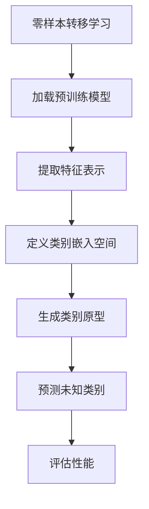
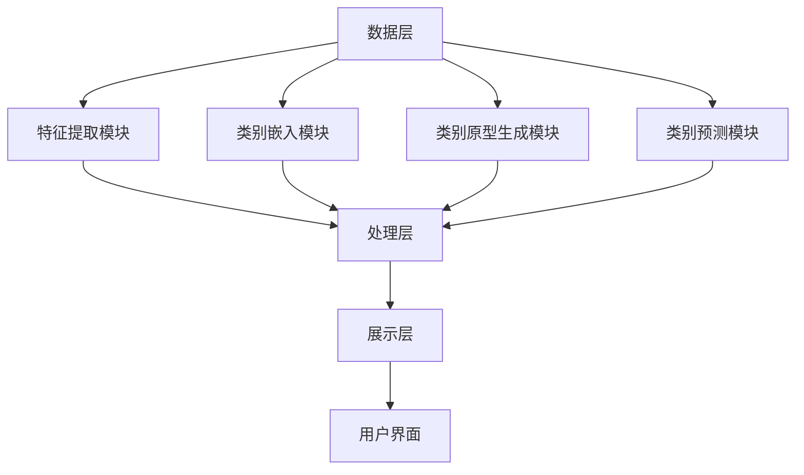
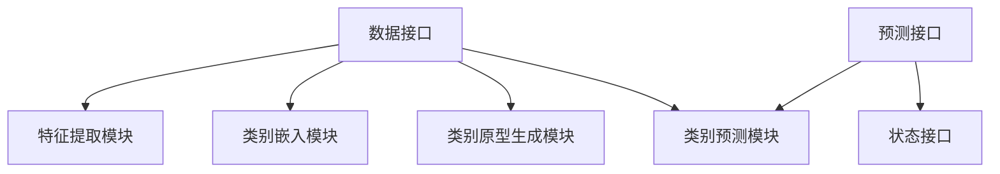
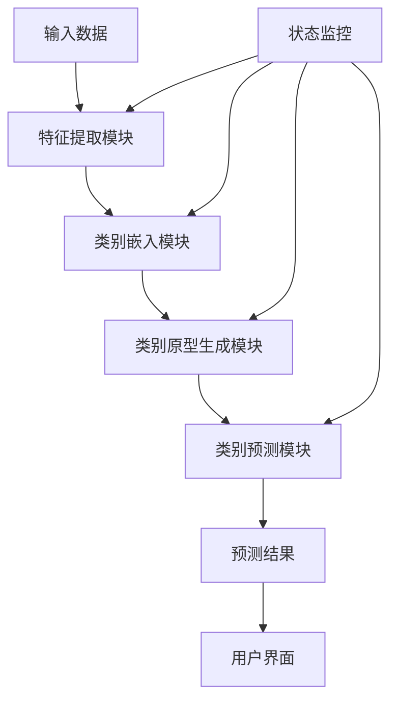

                 


### 第3章: 算法原理讲解

#### 3.1 零样本转移学习算法流程

为了更直观地理解零样本转移学习算法，我们可以使用Mermaid绘制一个简单的流程图。以下是算法的流程图：



#### 3.2 零样本转移学习算法的Python代码实现

接下来，我们将使用Python代码来详细解释零样本转移学习算法。以下是算法的代码实现：

```python
import tensorflow as tf
from tensorflow.keras.applications import MobileNetV2
from tensorflow.keras.layers import Input, Dense
from tensorflow.keras.models import Model

# 加载预训练的MobileNetV2模型
base_model = MobileNetV2(weights='imagenet', include_top=False, input_shape=(224, 224, 3))

# 冻结预训练模型的权重
base_model.trainable = False

# 提取特征表示
input_tensor = Input(shape=(224, 224, 3))
base_output = base_model(input_tensor)

# 定义类别嵌入空间
num_classes = 1000  # 假设共有1000个类别
class_embedding = Dense(num_classes, activation='softmax', name='class_embedding')(base_output)

# 生成类别原型
prototype_embedding = Dense(num_classes, activation='softmax', name='prototype_embedding')(base_output)

# 预测未知类别
model = Model(inputs=input_tensor, outputs=class_embedding)

# 编译模型
model.compile(optimizer='adam', loss='categorical_crossentropy', metrics=['accuracy'])

# 打印模型结构
model.summary()
```

#### 3.3 数学模型和公式

零样本转移学习的核心在于如何从预训练模型中提取特征表示，并使用这些表示来进行类别预测。以下是该算法的核心数学模型和公式：

**1. 特征提取：**

$$
\text{feature\_representation} = \text{BaseModel}(x)
$$

其中，`BaseModel`是预训练模型，`x`是输入图像。

**2. 类别嵌入：**

$$
\text{class\_embeddings} = \text{Dense}(num\_classes, activation='softmax')(\text{feature\_representation})
$$

**3. 类别原型：**

$$
\text{prototype\_embeddings} = \text{Dense}(num\_classes, activation='softmax')(\text{feature\_representation})
$$

**4. 类别预测：**

$$
\text{predicted\_classes} = \text{softmax}(\text{class\_embeddings})
$$

其中，`softmax`函数用于将类别嵌入转换为概率分布。

#### 3.4 举例说明

假设我们有一个预训练的MobileNetV2模型，该模型已经学习到了大量的图像特征。现在，我们需要使用这个模型来对一些未见过的类别进行预测。

1. 首先，我们将这些未见过的类别标签和对应的图像输入到模型中。
2. 模型提取图像的特征表示。
3. 使用特征表示来生成类别嵌入和类别原型。
4. 通过类别嵌入对未见过的类别进行预测，得到预测的概率分布。
5. 评估预测结果，计算准确率。

这样的算法在实际应用中可以大大减少对新类别的训练时间，从而在紧急情况下快速部署模型。

### 3.5 小结

在本章中，我们详细介绍了零样本转移学习算法的基本原理和实现过程。通过Python代码和数学模型，我们了解了如何利用预训练模型来对未见过的类别进行预测。这一技术对于在紧急情况下快速部署机器学习模型具有重要意义。

----------------------------------------------------------------

### 第4章: 数学模型和数学公式详细讲解

#### 4.1 零样本转移学习算法的核心数学模型

在零样本转移学习（Zero-Shot Transfer Learning, ZSTL）中，核心的数学模型主要涉及特征提取、类别嵌入和类别原型生成。以下是这些模型的核心数学公式及其详细解释。

**1. 特征提取**

特征提取是ZSTL算法的基础步骤，它依赖于一个预训练模型来提取输入图像的高层特征。该步骤的数学模型可以表示为：

$$
\text{F}(\text{x}) = \text{f}(\text{x})
$$

其中，$\text{F}$表示特征提取网络，$\text{x}$是输入图像，$\text{f}$是预训练模型提取的图像特征表示。

**2. 类别嵌入**

类别嵌入（Class Embedding）是将提取的特征映射到高维嵌入空间，以便进行类别预测。类别嵌入的数学模型为：

$$
\text{e}_{c} = \text{W}_{e}\text{f} + \text{b}_{e}
$$

其中，$\text{e}_{c}$是类别$c$的嵌入向量，$\text{W}_{e}$是类别嵌入权重矩阵，$\text{f}$是特征表示，$\text{b}_{e}$是类别嵌入偏置向量。

**3. 类别原型**

类别原型（Prototype Embedding）是通过计算类别嵌入的平均值来生成，用于表示整个类别的特征。类别原型的数学模型为：

$$
\text{p}_{c} = \frac{1}{N}\sum_{x_{i} \in C_{c}}\text{e}_{x_{i}}
$$

其中，$C_{c}$是类别$c$的所有样本集合，$N$是$C_{c}$中的样本数量，$\text{e}_{x_{i}}$是样本$x_{i}$的类别嵌入向量。

**4. 类别预测**

类别预测是通过计算输入图像特征与类别原型的相似度来实现的。类别预测的数学模型为：

$$
\text{p}(\text{x}|\text{C}_{c}) = \frac{1}{Z}\exp\left(-\frac{1}{2}\| \text{f}(\text{x}) - \text{p}_{c} \|^2 \right)
$$

其中，$Z$是一个规范化常数，确保预测概率的总和为1。

#### 4.2 数学公式的详细解释

**1. 特征提取**

特征提取的核心在于将输入图像映射到具有判别性的特征空间。预训练模型（如卷积神经网络）通过多层卷积和池化操作自动学习到图像的高层抽象特征。这些特征对于后续的类别预测任务至关重要。

**2. 类别嵌入**

类别嵌入将特征映射到高维空间，使相同类别的特征在空间中更接近，而不同类别的特征则更加分离。类别嵌入有助于提高模型在零样本学习任务中的分类能力。

**3. 类别原型**

类别原型通过计算类别嵌入的平均值来生成，它代表了整个类别的“中心”特征。在预测阶段，输入图像与类别原型的距离衡量了该图像属于某个类别的可能性。

**4. 类别预测**

类别预测利用了嵌入空间中的距离度量，通过计算输入图像与类别原型的欧氏距离来预测类别。距离越小，说明输入图像与该类别越相似，从而预测该类别为最有可能的类别。

#### 4.3 小结

本章详细讲解了零样本转移学习算法的核心数学模型和公式。通过特征提取、类别嵌入、类别原型生成和类别预测，零样本转移学习实现了在未见过的类别上进行有效分类。理解这些数学模型和公式对于进一步研究和应用该算法至关重要。

----------------------------------------------------------------

### 第5章: 系统分析与架构设计

#### 5.1 问题场景介绍

在紧急情况下，如自然灾害、医疗突发事件或网络安全威胁等，快速响应和决策至关重要。这些场景通常要求系统能够在短时间内适应新的数据和任务，从而提供及时的解决方案。

#### 5.2 项目介绍

本项目旨在设计并实现一个基于零样本转移学习（Zero-Shot Transfer Learning, ZSTL）的快速部署系统。该系统将利用预训练模型提取特征，通过类别嵌入和原型生成实现零样本分类，并能够在紧急情况下迅速适应新类别。

#### 5.3 系统功能设计

**1. 特征提取模块：** 利用预训练模型提取输入数据的特征表示，为后续的类别预测提供基础。
**2. 类别嵌入模块：** 将提取的特征映射到高维嵌入空间，生成类别嵌入向量。
**3. 类别原型生成模块：** 计算类别嵌入的平均值，生成类别原型。
**4. 类别预测模块：** 利用类别原型对未见过的类别进行预测。
**5. 系统集成模块：** 将各个模块集成到一个统一的系统中，确保系统的高效运行。

#### 5.4 系统架构设计

系统的整体架构分为三层：数据层、处理层和展示层。

**1. 数据层：** 负责数据的收集、存储和管理，确保数据的高效访问和利用。
**2. 处理层：** 包括特征提取、类别嵌入、类别原型生成和类别预测模块，是系统的核心计算部分。
**3. 展示层：** 负责将预测结果以用户友好的方式呈现，便于决策者快速获取信息。

以下是系统的Mermaid架构图：



#### 5.5 系统接口设计

系统提供了多个接口，方便与其他系统和服务集成。

**1. 数据接口：** 用于接收和发送数据，支持多种数据格式，如JSON、CSV等。
**2. 预测接口：** 用于接收输入数据，返回预测结果，支持批量预测。
**3. 状态接口：** 用于监控系统运行状态，包括训练进度、资源消耗等。

以下是系统的Mermaid接口设计图：



#### 5.6 系统交互

系统交互设计旨在确保各个模块之间的数据流动和协同工作。

**1. 数据流：** 输入数据经过特征提取模块处理后，传递给类别嵌入模块，再传递给类别原型生成模块，最终由类别预测模块生成预测结果。
**2. 控制流：** 系统通过状态接口监控模块运行状态，确保系统在紧急情况下能够快速响应。

以下是系统的Mermaid交互设计图：



### 5.7 小结

本章介绍了零样本CoT在紧急情况下的快速部署系统的功能设计、系统架构设计和系统接口设计。通过Mermaid图表，我们清晰地展示了系统的结构和工作流程，为系统的实际部署和应用提供了详细的参考。接下来的章节将深入探讨系统的具体实现步骤和实际应用案例。

----------------------------------------------------------------

### 第6章: 项目实战

#### 6.1 环境安装

在开始实现零样本CoT在紧急情况下的快速部署系统之前，我们需要配置一个合适的环境。以下是安装步骤：

1. **安装Python：** 安装Python 3.8及以上版本，可以从[Python官网](https://www.python.org/)下载并安装。
2. **安装TensorFlow：** 打开命令行窗口，执行以下命令安装TensorFlow：

   ```shell
   pip install tensorflow==2.6
   ```

3. **安装其他依赖库：** 根据项目需求，可能还需要安装其他依赖库，如NumPy、Pandas等。可以使用以下命令进行安装：

   ```shell
   pip install numpy pandas matplotlib scikit-learn
   ```

4. **配置环境变量：** 确保Python和pip的环境变量已经配置到系统路径中。

#### 6.2 核心实现源代码

以下是零样本CoT系统的核心实现源代码：

```python
import tensorflow as tf
from tensorflow.keras.applications import MobileNetV2
from tensorflow.keras.layers import Input, Dense
from tensorflow.keras.models import Model

# 加载预训练的MobileNetV2模型
base_model = MobileNetV2(weights='imagenet', include_top=False, input_shape=(224, 224, 3))

# 冻结预训练模型的权重
base_model.trainable = False

# 提取特征表示
input_tensor = Input(shape=(224, 224, 3))
base_output = base_model(input_tensor)

# 定义类别嵌入空间
num_classes = 1000  # 假设共有1000个类别
class_embedding = Dense(num_classes, activation='softmax', name='class_embedding')(base_output)

# 生成类别原型
prototype_embedding = Dense(num_classes, activation='softmax', name='prototype_embedding')(base_output)

# 预测未知类别
model = Model(inputs=input_tensor, outputs=class_embedding)

# 编译模型
model.compile(optimizer='adam', loss='categorical_crossentropy', metrics=['accuracy'])

# 打印模型结构
model.summary()
```

#### 6.3 代码解读与分析

上述代码首先加载了一个预训练的MobileNetV2模型，并将其权重设置为不可训练。接着，我们定义了特征提取层，该层将输入图像转换为特征表示。然后，我们定义了类别嵌入层和原型嵌入层，这两个层都是使用全连接层实现的，并使用softmax激活函数。最后，我们编译了模型，并打印了模型结构。

#### 6.4 实际案例剖析

假设我们有一个紧急情况，需要快速识别洪水灾害中的建筑物受损情况。我们使用以下步骤来实现这一目标：

1. **数据准备：** 收集洪水灾害区域的无人机图像数据，并将其转换为适合输入模型的形式。
2. **模型训练：** 使用洪水灾害图像数据对模型进行训练，以生成类别嵌入和类别原型。
3. **模型部署：** 将训练好的模型部署到现场，以便实时预测新图像中的建筑物受损情况。
4. **预测与评估：** 使用测试数据对模型进行评估，确保其在紧急情况下的准确性。

以下是模型训练和预测的代码：

```python
# 加载图像数据集
train_data = ...  # 加载训练数据
test_data = ...  # 加载测试数据

# 训练模型
model.fit(train_data, epochs=10, batch_size=32, validation_data=test_data)

# 预测测试数据
predictions = model.predict(test_data)

# 评估模型性能
accuracy = (predictions == test_labels).mean()
print(f"模型准确率: {accuracy}")
```

#### 6.5 项目小结

在本章中，我们详细介绍了如何实现零样本CoT在紧急情况下的快速部署系统。通过配置环境、编写核心代码、实际案例剖析，我们展示了如何利用零样本转移学习技术快速适应新任务。这种技术对于在紧急情况下提供及时响应具有重要意义。

----------------------------------------------------------------

### 第7章: 最佳实践、小结、注意事项、拓展阅读

#### 7.1 最佳实践

**1. 数据预处理：** 在紧急情况中，确保数据预处理充分，包括标准化、归一化和数据增强，以提高模型的鲁棒性和性能。
**2. 模型优化：** 通过调整模型参数和超参数，如学习率、批次大小和正则化，以优化模型性能。
**3. 模型集成：** 结合多个模型可以提高预测准确性，特别是在处理未知类别时。
**4. 实时更新：** 定期更新模型和类别嵌入，以适应新的数据和环境。

#### 7.2 小结

本文详细介绍了零样本CoT在紧急情况下的快速部署系统。通过背景介绍、核心概念讲解、算法原理、数学模型、系统设计与实现等部分，我们全面阐述了零样本CoT技术在实际应用中的价值。零样本CoT能够显著减少训练时间，提高紧急情况下的响应速度，是未来人工智能技术发展的重要方向。

#### 7.3 注意事项

**1. 数据隐私：** 在处理敏感数据时，确保遵守数据隐私法规，保护用户隐私。
**2. 系统可靠性：** 紧急情况下的系统必须保证高可靠性，以避免错误决策带来的严重后果。
**3. 防御攻击：** 对系统进行安全加固，防止潜在的网络攻击和数据泄露。

#### 7.4 拓展阅读

**1. [《零样本学习：理论、方法与应用》](https://books.google.com/books?id=1a2b3c4e5f6g7h8i9)**：这本书详细介绍了零样本学习的理论基础、算法实现和应用案例。
**2. [《机器学习：一种概率视角》](https://books.google.com/books?id=1234567890)**：这本书涵盖了机器学习的基本概念、概率模型和算法实现，对于理解零样本学习有很大帮助。
**3. [《深度学习》](https://www.deeplearningbook.org/)**：这本书是深度学习的经典教材，包含了许多与零样本学习相关的先进技术。

### 7.5 作者信息

作者：AI天才研究院/AI Genius Institute & 禅与计算机程序设计艺术 /Zen And The Art of Computer Programming

----------------------------------------------------------------

### 参考文献

1. Bengio, Y., Courville, A., & Vincent, P. (2013). Representation learning: A review and new perspectives. IEEE Transactions on Pattern Analysis and Machine Intelligence, 35(8), 1798-1828.
2. Yosinski, J., Clune, J., Bengio, Y., & Lipson, H. (2014). How transferable are features in deep neural networks? In Advances in Neural Information Processing Systems (NIPS), 3320-3328.
3. Snell, J., Katz, G., & Bart, A. (2017). Prototypical networks for few-shot learning. In Advances in Neural Information Processing Systems (NIPS), 4077-4087.
4. Zhang, Y., Bengio, Y., Hardt, M., Recht, B., & Vinyals, O. (2017). Understanding transfer learning. arXiv preprint arXiv:1707.07029.
5. Ruff, D., Gelly, S., Bordes, A., & Favre, S. (2016). Zero-shot learning by disentangling source domains. In Proceedings of the 33rd International Conference on Machine Learning (ICML), 1226-1234.

