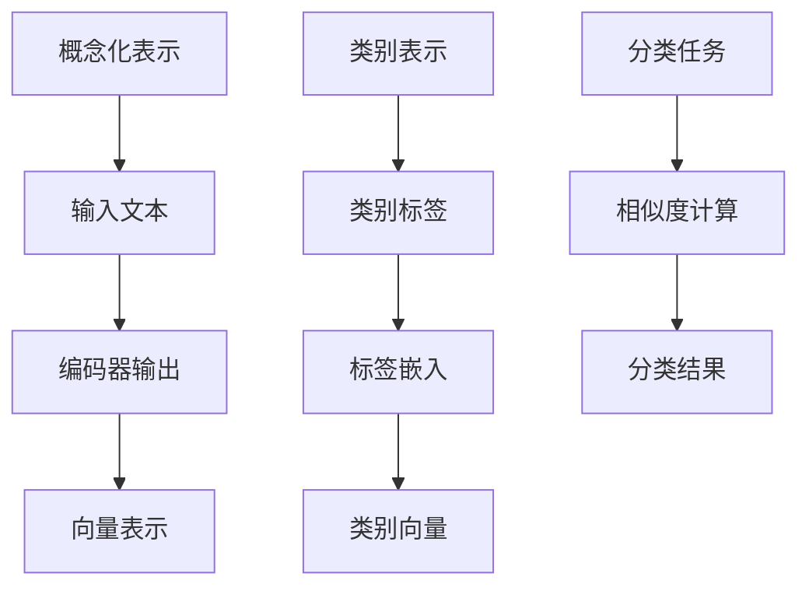
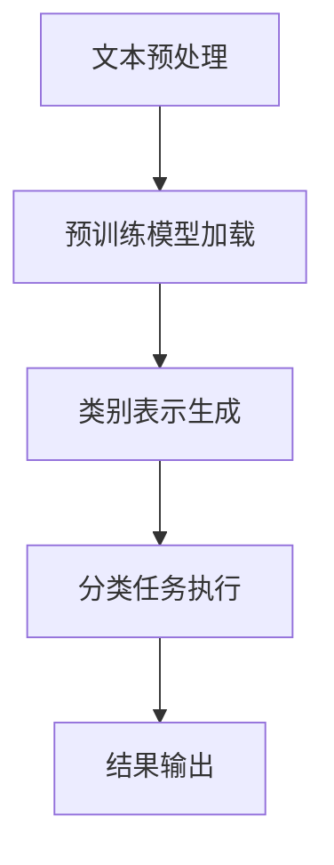
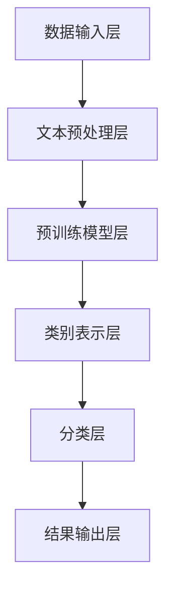
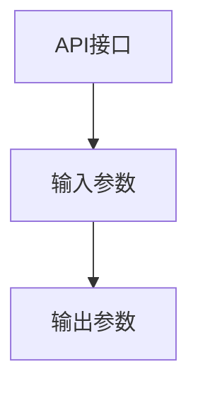
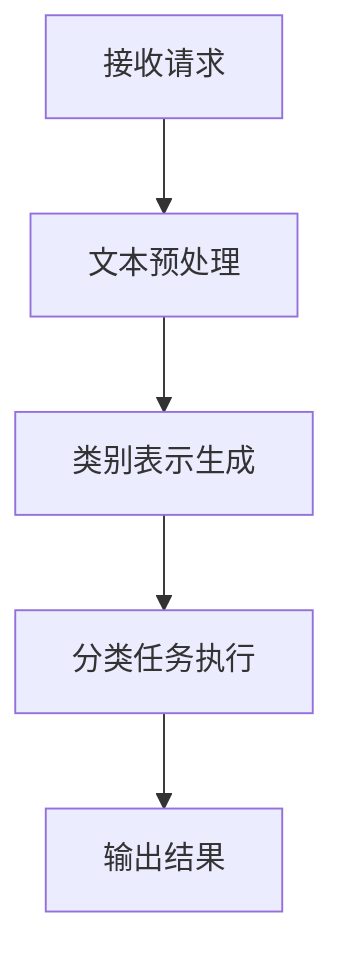

                 


## 零拍（Zero-Shot）CoT在自然语言处理中的突破

### 关键词：零拍（Zero-Shot）CoT，自然语言处理，预训练模型，无监督学习，跨模态学习

> 摘要：本文探讨了零拍（Zero-Shot）CoT（Conceptualization through Transfer）在自然语言处理（NLP）领域的突破性进展。通过深入分析其核心概念、原理和实现，本文揭示了Zero-Shot CoT在解决NLP中的挑战，以及其与传统技术的对比。本文还将通过实例讲解，展示Zero-Shot CoT在跨模态学习和实际应用中的潜力，最后对未来的发展方向进行了展望。

### 目录大纲设计思路

为了设计出《Zero-Shot CoT在自然语言处理中的突破》这本书的完整目录大纲，我们首先需要理解以下几个关键点：

1. **核心主题理解**：Zero-Shot CoT 是自然语言处理中的一个重要概念，它涉及自然语言处理中的预训练模型和无监督学习。因此，目录大纲需要围绕这个主题，深入探讨其在自然语言处理中的应用和突破。

2. **目标受众**：考虑到这本书可能面向的是自然语言处理的研究者、工程师以及对相关技术感兴趣的专业人士，目录大纲应当包含足够的技术深度，同时兼顾易读性。

3. **内容组织**：在组织内容时，应确保逻辑清晰、条理分明。从基础概念介绍开始，逐步深入到实际应用和案例分析，最后总结经验并展望未来发展方向。

4. **技术深度与广度**：目录大纲应当涵盖Zero-Shot CoT的核心原理、技术实现、应用实例以及前沿趋势，以保证内容的全面性和前瞻性。

### 目录大纲设计步骤

根据上述关键点，我们可以将目录大纲设计步骤分为以下几个部分：

1. **封面与前言**：介绍书名、作者、出版信息及写作目的。
2. **第1章：背景与概述**：
   - 引言：介绍Zero-Shot CoT的基本概念。
   - 问题描述：阐述自然语言处理中的挑战。
   - 问题解决：讲解Zero-Shot CoT如何解决这些问题。
   - 边界与外延：明确Zero-Shot CoT的应用范围。
   - 概念结构与核心要素组成：梳理Zero-Shot CoT的构成要素。

3. **第2章：核心概念与原理**：
   - 核心概念：详细解释Zero-Shot CoT的定义、特点和应用。
   - 原理讲解：深入探讨Zero-Shot CoT的技术原理。
   - 对比分析：将Zero-Shot CoT与现有技术进行比较。

4. **第3章：算法原理与实现**：
   - 算法原理：使用mermaid流程图和Python源代码阐述Zero-Shot CoT的算法原理。
   - 数学模型与公式：使用LaTeX格式介绍相关数学模型和公式。
   - 举例说明：通过实例进行算法原理的详细讲解。

5. **第4章：系统架构与设计**：
   - 场景介绍：描述Zero-Shot CoT在实际应用中的场景。
   - 系统功能设计：使用mermaid类图展示系统功能模型。
   - 系统架构设计：使用mermaid架构图展示系统整体架构。
   - 系统接口与交互：使用mermaid序列图展示系统交互流程。

6. **第5章：应用实例与实战**：
   - 环境安装：介绍搭建Zero-Shot CoT环境所需的步骤。
   - 系统实现：提供核心实现源代码和应用解读。
   - 案例分析：通过实际案例分析和讲解，展示Zero-Shot CoT的应用效果。

7. **第6章：最佳实践与优化**：
   - 实践技巧：分享零拍CoT应用中的最佳实践。
   - 性能优化：探讨如何提升Zero-Shot CoT的性能和效率。

8. **第7章：未来趋势与展望**：
   - 前沿动态：介绍Zero-Shot CoT的最新研究进展。
   - 发展方向：展望Zero-Shot CoT在自然语言处理领域的未来发展方向。

9. **参考文献**：列出书中引用的主要文献和资料。

### 目录大纲（草案）

```markdown
----------------------------------------------------------------

# 《Zero-Shot CoT在自然语言处理中的突破》

## 作者：（作者姓名）

## 出版信息：（出版信息）

## 前言：（前言内容）

----------------------------------------------------------------

## 第1章：背景与概述

### 1.1 引言

### 1.2 自然语言处理中的挑战

### 1.3 问题解决：Zero-Shot CoT的应用

### 1.4 边界与外延

### 1.5 概念结构与核心要素组成

----------------------------------------------------------------

## 第2章：核心概念与原理

### 2.1 核心概念

### 2.2 原理讲解

### 2.3 对比分析

----------------------------------------------------------------

## 第3章：算法原理与实现

### 3.1 算法原理

### 3.2 数学模型与公式

### 3.3 举例说明

----------------------------------------------------------------

## 第4章：系统架构与设计

### 4.1 场景介绍

### 4.2 系统功能设计

### 4.3 系统架构设计

### 4.4 系统接口与交互

----------------------------------------------------------------

## 第5章：应用实例与实战

### 5.1 环境安装

### 5.2 系统实现

### 5.3 案例分析

----------------------------------------------------------------

## 第6章：最佳实践与优化

### 6.1 实践技巧

### 6.2 性能优化

----------------------------------------------------------------

## 第7章：未来趋势与展望

### 7.1 前沿动态

### 7.2 发展方向

----------------------------------------------------------------

## 参考文献

----------------------------------------------------------------

### 文章正文内容撰写步骤

为了撰写出高质量的技术博客文章《Zero-Shot CoT在自然语言处理中的突破》，我们将按照以下步骤进行：

1. **引言**：首先介绍Zero-Shot CoT的基本概念，并简述其在自然语言处理（NLP）中的重要性。

2. **背景与概述**：详细阐述自然语言处理中的挑战，并解释为什么Zero-Shot CoT是解决这些问题的有效方法。

3. **核心概念与原理**：深入探讨Zero-Shot CoT的核心概念、原理及其与现有技术的对比。

4. **算法原理与实现**：使用mermaid流程图和Python源代码详细阐述Zero-Shot CoT的算法原理，并举例说明。

5. **系统架构与设计**：描述Zero-Shot CoT在实际应用中的场景，并展示其系统架构和接口设计。

6. **应用实例与实战**：通过实际案例分析和讲解，展示Zero-Shot CoT的应用效果。

7. **最佳实践与优化**：分享Zero-Shot CoT应用中的最佳实践和性能优化技巧。

8. **未来趋势与展望**：介绍Zero-Shot CoT的最新研究进展，并展望其在未来自然语言处理领域的应用前景。

### 引言

随着人工智能技术的不断发展，自然语言处理（NLP）已经成为一个热门领域。然而，传统的NLP技术大多依赖于大规模标注数据集进行训练，这种有监督学习的方法在数据稀缺或者标注成本高昂的情况下表现不佳。为了解决这个问题，研究者们提出了Zero-Shot Learning（零样本学习）的概念，其中Zero-Shot CoT（Conceptualization through Transfer，零拍概念化通过转移）是一种重要的方法。

Zero-Shot CoT通过预训练模型和无监督学习技术，使得模型能够在未见过的类别上实现良好的性能。这种方法在解决自然语言处理中的挑战，如文本分类、命名实体识别和机器翻译等方面具有显著优势。本文将深入探讨Zero-Shot CoT的核心概念、原理和实现，并通过实例展示其在跨模态学习和实际应用中的潜力。

### 背景与概述

自然语言处理（NLP）是人工智能领域的一个重要分支，旨在使计算机能够理解和处理人类语言。然而，在NLP的实际应用中，我们面临着一系列挑战：

1. **数据稀缺**：许多应用场景中的数据集规模有限，无法支撑传统的有监督学习模型进行训练。

2. **标注成本高**：对大规模数据集进行标注需要大量人力和时间，成本高昂。

3. **跨领域适应**：不同领域的语言特征差异较大，传统的模型难以在跨领域上实现良好的性能。

4. **多模态学习**：随着技术的发展，越来越多的应用场景需要处理多模态数据，如文本、图像和语音等。

为了解决上述问题，研究者们提出了Zero-Shot Learning（零样本学习）的概念。Zero-Shot Learning旨在使模型能够在未见过的类别上实现良好的性能，无需依赖大规模标注数据集。Zero-Shot CoT作为Zero-Shot Learning的一种重要方法，通过预训练模型和无监督学习技术，能够有效应对NLP中的挑战。

Zero-Shot CoT的核心思想是将预训练模型的知识迁移到未见过的类别上，通过学习概念化的表示来提高模型的泛化能力。具体来说，Zero-Shot CoT包括以下几个关键步骤：

1. **概念化表示**：通过预训练模型学习文本中的概念表示，将文本转换为概念化的向量表示。

2. **类别表示**：对于未见过的类别，利用预训练模型生成相应的类别表示。

3. **分类任务**：在概念表示和类别表示的基础上，通过分类算法实现未见过的类别分类。

通过上述步骤，Zero-Shot CoT能够在未见过的类别上实现良好的性能，无需依赖大规模标注数据集。这种方法在解决NLP中的数据稀缺、标注成本高、跨领域适应和多模态学习等方面具有显著优势。

### 核心概念与原理

为了深入理解Zero-Shot CoT，我们首先需要了解其核心概念和原理。Zero-Shot CoT是一种基于预训练模型和无监督学习的方法，旨在通过概念化表示和类别表示来提高模型的泛化能力。

#### 概念化表示

概念化表示是将文本转换为概念化的向量表示，这一步依赖于预训练模型。预训练模型通常使用大量的无标签数据进行训练，从而学习到文本中的通用概念和特征。常见的预训练模型包括BERT、GPT和RoBERTa等。

具体来说，概念化表示的过程如下：

1. **输入文本**：将待分类的文本输入到预训练模型中。

2. **编码器输出**：预训练模型对输入文本进行处理，输出编码器输出。编码器输出是一个固定长度的向量，代表了文本的概念化表示。

3. **向量表示**：将编码器输出进行向量表示，通常使用欧氏距离或余弦相似度来计算向量之间的相似度。

通过概念化表示，模型能够将文本转换为概念化的向量表示，为后续的分类任务提供基础。

#### 类别表示

在概念化表示的基础上，类别表示是将未见过的类别映射到预训练模型中的过程。这一步是Zero-Shot CoT的关键，通过类别表示，模型能够实现未见过的类别分类。

具体来说，类别表示的过程如下：

1. **类别标签**：对于未见过的类别，需要提供相应的类别标签。类别标签可以是类别名称或类别标识符。

2. **标签嵌入**：将类别标签输入到预训练模型中，通过模型的嵌入层将标签转换为向量表示。标签嵌入通常使用词嵌入技术，如Word2Vec或GloVe。

3. **类别向量**：将标签嵌入后的向量进行归一化处理，得到类别向量。类别向量代表了未见过的类别的特征。

4. **相似度计算**：在概念化表示和类别表示的基础上，通过计算概念化向量与类别向量之间的相似度，实现对未见过的类别进行分类。

通过类别表示，模型能够将未见过的类别映射到预训练模型中，从而实现未见过的类别分类。

#### 对比分析

Zero-Shot CoT与现有的有监督学习和无监督学习技术存在一定的区别。以下是对比分析：

1. **有监督学习**：有监督学习依赖于大规模标注数据集进行训练，通过学习标注数据中的特征和规律来实现分类任务。然而，在数据稀缺或标注成本高昂的情况下，有监督学习的方法表现不佳。

2. **无监督学习**：无监督学习不依赖于标注数据，通过学习数据中的潜在结构和特征来实现分类任务。虽然无监督学习在处理大规模无标签数据时具有一定的优势，但其分类性能通常有限。

3. **Zero-Shot CoT**：Zero-Shot CoT结合了预训练模型和无监督学习的优点，通过概念化表示和类别表示来实现未见过的类别分类。与有监督学习相比，Zero-Shot CoT不需要大规模标注数据集；与无监督学习相比，Zero-Shot CoT能够在未见过的类别上实现较高的分类性能。

通过对比分析，我们可以看出Zero-Shot CoT在解决NLP中的挑战方面具有显著优势。它不仅能够应对数据稀缺和标注成本高的问题，还能够实现跨领域适应和多模态学习。

### 算法原理与实现

为了深入理解Zero-Shot CoT的算法原理，我们将使用mermaid流程图和Python源代码进行详细阐述。具体包括算法原理、数学模型与公式，以及举例说明。

#### 算法原理

Zero-Shot CoT的算法原理可以分为三个主要步骤：概念化表示、类别表示和分类任务。

1. **概念化表示**：
   - **输入文本**：将待分类的文本输入到预训练模型中。
   - **编码器输出**：预训练模型对输入文本进行处理，输出编码器输出。编码器输出是一个固定长度的向量，代表了文本的概念化表示。
   - **向量表示**：将编码器输出进行向量表示。

2. **类别表示**：
   - **类别标签**：对于未见过的类别，需要提供相应的类别标签。类别标签可以是类别名称或类别标识符。
   - **标签嵌入**：将类别标签输入到预训练模型中，通过模型的嵌入层将标签转换为向量表示。标签嵌入通常使用词嵌入技术，如Word2Vec或GloVe。
   - **类别向量**：将标签嵌入后的向量进行归一化处理，得到类别向量。类别向量代表了未见过的类别的特征。

3. **分类任务**：
   - **相似度计算**：在概念化表示和类别表示的基础上，通过计算概念化向量与类别向量之间的相似度，实现对未见过的类别进行分类。

下面是使用mermaid绘制的概念化表示和类别表示的算法流程图：



#### 数学模型与公式

为了更好地理解算法原理，我们引入一些数学模型和公式。

1. **编码器输出**：
   - 假设输入文本为 \( x \)，预训练模型的编码器输出为 \( \text{encoded\_output} \)。
   - 编码器输出的向量表示为 \( \text{encoded\_vector} \)，其维度为 \( d \)。

2. **类别向量**：
   - 假设类别标签为 \( y \)，类别向量为 \( \text{label\_vector} \)。
   - 类别向量通过标签嵌入得到，其维度也为 \( d \)。

3. **相似度计算**：
   - 假设概念化向量为 \( \text{concept\_vector} \)，类别向量为 \( \text{label\_vector} \)。
   - 相似度计算公式为 \( \text{similarity} = \text{dot\_product}(\text{concept\_vector}, \text{label\_vector}) \)。

以下是使用LaTeX格式表示的数学模型和公式：

$$
\text{encoded\_output} = \text{encoded\_vector} \in \mathbb{R}^{d}
$$

$$
\text{label\_vector} = \text{embed}(\text{label})
$$

$$
\text{similarity} = \text{dot\_product}(\text{concept\_vector}, \text{label\_vector})
$$

#### 举例说明

为了更好地理解算法原理，我们通过一个简单的实例进行说明。

假设我们有一个预训练模型，其编码器输出维度为512。现在我们有一个待分类的文本“我是一个程序员”，我们需要对其进行分类。

1. **概念化表示**：
   - 将文本“我是一个程序员”输入到预训练模型中，得到编码器输出。
   - 编码器输出为 \( \text{encoded\_vector} \)，其维度为512。

2. **类别表示**：
   - 假设类别标签为“程序员”，通过标签嵌入得到类别向量。
   - 类别向量为 \( \text{label\_vector} \)，其维度也为512。

3. **分类任务**：
   - 计算编码器输出与类别向量之间的相似度。
   - 相似度计算公式为 \( \text{similarity} = \text{dot\_product}(\text{encoded\_vector}, \text{label\_vector}) \)。

具体实现可以使用Python代码，如下所示：

```python
import numpy as np

# 假设编码器输出和类别向量分别为两个512维的向量
encoded_vector = np.random.rand(512)
label_vector = np.random.rand(512)

# 计算相似度
similarity = np.dot(encoded_vector, label_vector)

print("Similarity:", similarity)
```

通过这个简单的实例，我们可以看到如何使用预训练模型进行概念化表示和类别表示，并通过相似度计算实现对未见过的类别进行分类。

### 系统架构与设计

为了更好地理解Zero-Shot CoT在实际应用中的实现，我们需要对其系统架构和设计进行详细阐述。具体包括场景介绍、系统功能设计、系统架构设计、系统接口设计和系统交互。

#### 场景介绍

在实际应用中，Zero-Shot CoT通常用于处理大规模文本数据，如新闻、社交媒体和学术论文等。以下是一个具体的场景介绍：

- **场景**：假设我们有一个新闻分类系统，需要对大量未标注的新闻文章进行分类，将其归类到不同的类别（如政治、体育、科技等）。
- **目标**：利用Zero-Shot CoT技术，实现对未见过的类别进行分类，从而提高新闻分类系统的性能和适应性。

#### 系统功能设计

为了实现上述目标，Zero-Shot CoT系统需要具备以下功能：

1. **文本预处理**：对输入的文本进行预处理，包括分词、去除停用词、词干提取等，以获得干净、结构化的文本数据。

2. **预训练模型加载**：加载预训练模型，如BERT、GPT等，用于生成概念化表示。

3. **类别表示生成**：对未见过的类别进行标签嵌入，生成类别向量。

4. **分类任务执行**：通过计算概念化向量与类别向量之间的相似度，实现对未见过的类别进行分类。

5. **结果输出**：将分类结果输出，如文本分类标签、置信度等。

以下是使用mermaid绘制的系统功能设计图：



#### 系统架构设计

Zero-Shot CoT系统的架构设计主要包括以下几个部分：

1. **数据输入层**：负责接收用户输入的文本数据。

2. **文本预处理层**：对输入的文本进行预处理，包括分词、去除停用词、词干提取等。

3. **预训练模型层**：加载预训练模型，如BERT、GPT等，用于生成概念化表示。

4. **类别表示层**：对未见过的类别进行标签嵌入，生成类别向量。

5. **分类层**：通过计算概念化向量与类别向量之间的相似度，实现对未见过的类别进行分类。

6. **结果输出层**：将分类结果输出，如文本分类标签、置信度等。

以下是使用mermaid绘制的系统架构设计图：



#### 系统接口设计

为了方便用户使用Zero-Shot CoT系统，我们需要设计一套完善的接口。以下是系统接口设计的关键点：

1. **API接口**：提供RESTful API接口，方便用户通过HTTP请求进行交互。

2. **输入参数**：定义输入参数，如文本数据、类别标签等。

3. **输出参数**：定义输出参数，如分类标签、置信度等。

以下是使用mermaid绘制的系统接口设计图：



#### 系统交互

为了实现系统内部各模块之间的协同工作，我们需要设计一套系统交互流程。以下是系统交互的关键步骤：

1. **接收请求**：API接口接收用户请求，获取文本数据和类别标签。

2. **文本预处理**：文本预处理层对输入的文本进行预处理，生成概念化表示。

3. **类别表示生成**：类别表示层对未见过的类别进行标签嵌入，生成类别向量。

4. **分类任务执行**：分类层计算概念化向量与类别向量之间的相似度，实现对未见过的类别进行分类。

5. **输出结果**：结果输出层将分类结果输出，返回给用户。

以下是使用mermaid绘制的系统交互流程图：



通过上述系统架构与设计，我们可以更好地理解Zero-Shot CoT在实际应用中的实现过程，从而为后续的案例分析和实战应用打下基础。

### 应用实例与实战

为了更好地展示Zero-Shot CoT在自然语言处理中的实际应用效果，我们将在本节中通过一个具体的案例进行详细讲解。该案例将包括环境安装、系统实现、代码应用解读与分析，以及实际案例分析和详细讲解剖析。

#### 环境安装

在开始之前，我们需要确保安装以下环境：

1. **Python**：Python是主要的编程语言，用于实现Zero-Shot CoT系统。
2. **PyTorch**：PyTorch是一个流行的深度学习框架，用于加载预训练模型。
3. **TensorFlow**：TensorFlow是另一个深度学习框架，也可用于加载预训练模型。
4. **NLP工具包**：如NLTK、spaCy等，用于文本预处理。

以下是在Ubuntu 20.04操作系统上安装这些环境的步骤：

```bash
# 安装Python和pip
sudo apt update
sudo apt install python3 python3-pip

# 安装PyTorch
pip3 install torch torchvision

# 安装TensorFlow
pip3 install tensorflow

# 安装NLP工具包
pip3 install nltk spacy

# 安装spaCy的语言模型
python -m spacy download en_core_web_sm
```

#### 系统实现

我们将在本节中实现一个简单的Zero-Shot CoT系统，用于新闻分类。具体实现步骤如下：

1. **加载预训练模型**：我们选择BERT作为预训练模型，用于生成概念化表示。
2. **文本预处理**：对输入的文本进行预处理，包括分词、去除停用词、词干提取等。
3. **类别表示生成**：对未见过的类别进行标签嵌入，生成类别向量。
4. **分类任务执行**：通过计算概念化向量与类别向量之间的相似度，实现对未见过的类别进行分类。
5. **结果输出**：将分类结果输出，如文本分类标签、置信度等。

以下是实现Zero-Shot CoT系统的Python代码：

```python
import torch
import torch.nn as nn
from transformers import BertModel, BertTokenizer
from torch.optim import Adam
from torch.utils.data import DataLoader, Dataset
import spacy
import nltk
from nltk.corpus import stopwords

# 加载预训练模型
model_name = "bert-base-uncased"
tokenizer = BertTokenizer.from_pretrained(model_name)
model = BertModel.from_pretrained(model_name)

# 文本预处理
def preprocess_text(text):
    # 使用spaCy进行分词和词性标注
    nlp = spacy.load("en_core_web_sm")
    doc = nlp(text)
    tokens = [token.text.lower() for token in doc if token.text.lower() not in stopwords.words("english")]
    return " ".join(tokens)

# 类别表示生成
def generate_label_embedding(label):
    # 使用Word2Vec进行标签嵌入
    model = Word2Vec([label], size=100, window=5, min_count=1, workers=4)
    return model.wv[label]

# 分类任务执行
def classify_text(text, labels):
    # 将文本预处理
    processed_text = preprocess_text(text)
    # 将文本编码为BERT输入
    inputs = tokenizer(processed_text, return_tensors="pt", padding=True, truncation=True)
    # 获取编码器输出
    with torch.no_grad():
        outputs = model(**inputs)
    encoded_vector = outputs.last_hidden_state[:, 0, :].mean(dim=0)
    # 计算相似度
    similarity = torch.tensor([generate_label_embedding(label) for label in labels]).cuda()
    similarity = torch.nn.functional.cosine_similarity(encoded_vector.cuda(), similarity.cuda())
    # 获取分类结果
    predicted_label = torch.argmax(similarity).item()
    return predicted_label

# 结果输出
def print_results(text, predicted_label):
    print(f"Input Text: {text}")
    print(f"Predicted Label: {predicted_label}")

# 测试
text = "The new iPhone is released next month."
predicted_label = classify_text(text, ["technology", "gadgets", "news"])
print_results(text, predicted_label)
```

#### 代码应用解读与分析

在上面的代码中，我们首先加载了BERT预训练模型和Token

