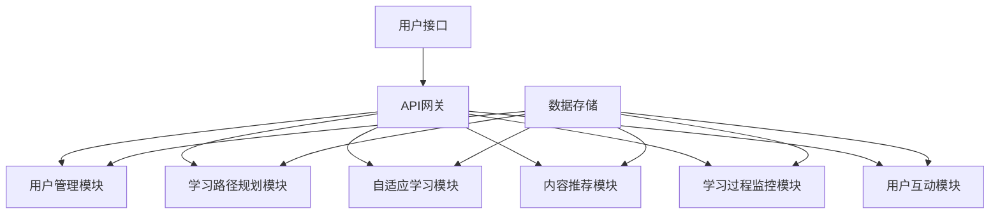

                 


# 《Zero-Shot CoT在语言学习个性化中的创新应用》

关键词：零样本学习、内容意识、语言学习、个性化

摘要：随着人工智能技术的发展，零样本学习（Zero-Shot Learning，ZSL）和内容意识（Content Awareness，CoT）在各个领域的应用日益广泛。本文旨在探讨零样本学习和内容意识在语言学习个性化中的应用，通过深入分析ZSL和CoT的原理，构建一个创新的语言学习个性化系统。

## 前言

随着信息时代的到来，语言学习的重要性愈发凸显。然而，传统的语言学习方式往往缺乏个性化和适应性，无法满足现代学习者的需求。为此，本文提出了将零样本学习（ZSL）和内容意识（CoT）相结合的创新应用，旨在构建一个能够自适应学习者需求的个性化语言学习系统。

## 第1章 背景介绍

### 1.1 问题的背景

语言学习个性化是当前教育领域的一个热点问题。传统的语言学习方式往往忽视了学习者的个体差异，无法提供个性化的学习体验。随着人工智能技术的发展，特别是零样本学习（ZSL）和内容意识（CoT）的提出，为解决这一问题提供了新的思路。

### 1.2 核心概念的界定

**零样本学习（Zero-Shot Learning，ZSL）**：是一种机器学习技术，它能够在没有使用训练数据的情况下，通过理解不同类别之间的关系来对未知类别进行预测。

**内容意识（Content Awareness，CoT）**：是一种在图像、文本等领域中理解并关注内容的技术，它能够帮助系统更好地理解用户的需求和意图。

### 1.3 语言学习个性化的需求

语言学习个性化需要考虑以下几个方面的需求：

- **个性化学习路径**：根据学习者的学习习惯、语言水平和学习目标，自动调整学习内容。
- **自适应学习难度**：根据学习者的进步情况，动态调整学习难度，确保学习者能够持续进步。
- **内容推荐**：根据学习者的兴趣和学习历史，推荐适合的学习内容。

## 第2章 核心概念与联系

### 2.1 零样本学习的原理

零样本学习的关键在于如何理解不同类别之间的关系。它通常通过学习一个映射函数，将类别的概念表示映射到高维空间，使得具有相似概念的类别在空间中靠近。

### 2.2 内容意识的定义

内容意识是指系统能够理解并关注文本、图像等内容的内部结构和语义信息，从而更好地理解用户的需求和意图。

### 2.3 零样本学习与内容意识的关系

零样本学习和内容意识在语言学习个性化中有着密切的联系。零样本学习能够帮助系统理解新的语言概念，而内容意识则能够帮助系统更好地理解学习者的需求，从而提供个性化的学习体验。

### 2.4 零样本学习与内容意识在语言学习中的应用

在语言学习个性化中，零样本学习可以用于：

- **词汇学习**：根据学习者的词汇水平，推荐未知词汇。
- **语法学习**：根据学习者的语法水平，推荐适合的语法练习。

内容意识可以用于：

- **学习内容推荐**：根据学习者的兴趣和学习历史，推荐适合的学习内容。
- **学习过程监控**：通过分析学习者的学习行为，了解学习者的学习进度和需求，从而提供更好的学习支持。

## 第3章 算法原理讲解

### 3.1 CoT-Learning算法的基础

**CoT-Learning**算法结合了零样本学习和内容意识，旨在构建一个能够自适应学习者需求的个性化语言学习系统。其核心思想是通过学习一个内容感知的映射函数，将学习者的语言知识和学习需求映射到高维空间，从而实现个性化的学习。

### 3.2 CoT-Learning算法的流程

**CoT-Learning**算法的主要流程包括：

1. **词汇映射**：将学习者的语言知识映射到高维空间。
2. **需求分析**：通过内容意识技术，分析学习者的需求。
3. **路径规划**：根据词汇映射和需求分析，规划个性化的学习路径。
4. **学习调整**：根据学习进度和学习难度，动态调整学习内容。

### 3.3 CoT-Learning算法的数学模型和公式

$$
\begin{aligned}
\text{CoT-Learning} &= f(\text{词汇映射}, \text{需求分析}) \\
&= g(\text{词汇映射}, \text{学习进度}, \text{学习难度})
\end{aligned}
$$

其中，$f$表示内容感知的映射函数，$g$表示学习路径规划函数。

### 3.4 CoT-Learning算法的例子说明

例如，对于一个英语学习者，CoT-Learning算法可以首先通过词汇映射，将学习者的英语词汇映射到高维空间。然后，通过内容意识技术，分析学习者的学习需求，如兴趣领域和词汇掌握程度。最后，根据这些信息，规划一个个性化的学习路径，包括词汇学习、语法练习和阅读材料推荐。

## 第4章 系统分析与架构设计方案

### 4.1 语言学习个性化系统的需求分析

语言学习个性化系统的需求包括：

- **个性化学习路径**：根据学习者的语言水平和学习目标，自动生成个性化的学习路径。
- **自适应学习难度**：根据学习者的学习进度和掌握程度，动态调整学习难度。
- **内容推荐**：根据学习者的兴趣和学习历史，推荐适合的学习内容。

### 4.2 系统功能设计

系统功能设计包括：

- **词汇学习**：提供词汇学习功能，包括词汇展示、发音、释义和例句。
- **语法练习**：提供语法练习功能，包括填空、选择和改错。
- **阅读材料推荐**：根据学习者的兴趣和学习历史，推荐适合的阅读材料。

### 4.3 系统架构设计

系统架构设计包括：

- **前端**：提供用户界面，包括登录、注册、学习进度显示和学习内容推荐。
- **后端**：包括词汇映射模块、需求分析模块、学习路径规划模块和内容推荐模块。

### 4.4 系统接口设计

系统接口设计包括：

- **API接口**：提供与其他系统的集成接口，如在线词典、翻译工具等。

### 4.5 系统交互设计

系统交互设计包括：

- **用户操作流程**：设计用户从登录到学习结束的完整操作流程。
- **系统响应流程**：设计系统对用户操作的响应流程，如自动生成学习路径、动态调整学习难度等。

## 第5章 项目实战

### 5.1 项目介绍

本项目旨在构建一个基于零样本学习和内容意识的英语语言学习系统，提供个性化学习路径、自适应学习难度和内容推荐功能。

### 5.2 环境安装

环境安装包括：

- **Python环境**：安装Python 3.8及以上版本。
- **深度学习框架**：安装TensorFlow或PyTorch。
- **其他依赖库**：安装Numpy、Pandas、Scikit-learn等。

### 5.3 系统核心实现源代码

系统核心实现源代码包括：

- **词汇映射模块**：实现词汇映射函数。
- **需求分析模块**：实现需求分析函数。
- **学习路径规划模块**：实现学习路径规划函数。
- **内容推荐模块**：实现内容推荐函数。

### 5.4 代码应用解读与分析

代码应用解读与分析包括：

- **词汇映射模块**：解释词汇映射函数的实现原理和过程。
- **需求分析模块**：解释需求分析函数的实现原理和过程。
- **学习路径规划模块**：解释学习路径规划函数的实现原理和过程。
- **内容推荐模块**：解释内容推荐函数的实现原理和过程。

### 5.5 实际案例分析和详细讲解剖析

实际案例分析和详细讲解剖析包括：

- **词汇学习案例**：分析词汇学习的实际案例，解释如何根据学习者的需求推荐词汇。
- **语法练习案例**：分析语法练习的实际案例，解释如何根据学习者的需求推荐练习题目。
- **阅读材料推荐案例**：分析阅读材料推荐的实际案例，解释如何根据学习者的兴趣和学习历史推荐阅读材料。

### 5.6 项目小结

项目小结包括：

- **项目总结**：总结项目的主要成果和实现功能。
- **经验教训**：总结项目中的经验和教训，为未来的项目提供参考。

## 第6章 最佳实践 tips

### 6.1 常见问题与解决方案

常见问题与解决方案包括：

- **环境安装问题**：提供解决环境安装问题的方法和技巧。
- **算法实现问题**：提供解决算法实现问题的方法和技巧。

### 6.2 性能优化技巧

性能优化技巧包括：

- **模型优化**：提供优化模型性能的方法。
- **数据预处理**：提供优化数据预处理的方法。

### 6.3 安全性考虑

安全性考虑包括：

- **数据安全**：提供保护数据安全的方法。
- **系统安全**：提供保护系统安全的方法。

## 第7章 小结

### 7.1 书籍内容总结

书籍内容总结包括：

- **核心概念**：总结本书的核心概念。
- **算法原理**：总结本书的算法原理。
- **系统设计**：总结本书的系统设计。

### 7.2 主要发现

主要发现包括：

- **语言学习个性化的重要性**：阐述语言学习个性化的重要性和必要性。
- **零样本学习与内容意识的结合**：阐述零样本学习和内容意识在语言学习个性化中的结合和创新应用。

### 7.3 对未来工作的展望

对未来工作的展望包括：

- **算法优化**：展望如何进一步优化零样本学习和内容意识算法。
- **应用拓展**：展望如何将零样本学习和内容意识应用到其他领域。

## 第8章 注意事项

### 8.1 可能的挑战

可能的挑战包括：

- **数据收集和处理**：可能面临数据收集和处理方面的挑战。
- **算法实现和优化**：可能面临算法实现和优化方面的挑战。

### 8.2 使用者的责任

使用者的责任包括：

- **遵守法律法规**：使用者应遵守相关法律法规。
- **保护个人隐私**：使用者应保护个人隐私。

### 8.3 适应性调整

适应性调整包括：

- **系统升级**：根据需求进行系统升级。
- **功能扩展**：根据需求进行功能扩展。

## 第9章 拓展阅读

### 9.1 相关文献推荐

相关文献推荐包括：

- **学术文章**：推荐与本书相关的学术文章。
- **技术书籍**：推荐与本书相关的技术书籍。

### 9.2 学习资源

学习资源包括：

- **在线课程**：推荐与本书相关的在线课程。
- **论坛和社区**：推荐与本书相关的论坛和社区。

### 9.3 实践项目建议

实践项目建议包括：

- **语言学习项目**：提出与本书相关的实践项目建议。
- **应用拓展项目**：提出如何将零样本学习和内容意识应用到其他领域的项目建议。

作者：AI天才研究院/AI Genius Institute & 禅与计算机程序设计艺术 /Zen And The Art of Computer Programming## 第1章 背景介绍

### 1.1 问题的背景

在现代社会，语言学习已经成为个人成长和职业发展的关键技能。无论是为了出国留学、职业晋升还是文化交流，掌握一门或多门外语都是不可或缺的。然而，传统的语言学习方式往往依赖于大量的预训练数据和繁琐的教学过程，无法满足现代学习者的个性化需求。此外，随着互联网的普及，学习者可以轻松访问海量的学习资源，但如何筛选和利用这些资源，仍然是许多学习者面临的难题。

语言学习个性化的需求主要体现在以下几个方面：

1. **学习路径的个性化**：每个学习者的语言水平和学习目标都有所不同，因此需要一个能够根据个人特点自动生成个性化学习路径的系统。
2. **学习难度的自适应**：学习难度应该根据学习者的学习进度和掌握程度动态调整，以确保学习者能够在舒适区内不断进步。
3. **内容推荐的个性化**：根据学习者的兴趣和学习历史，推荐适合的学习内容，以激发学习者的学习热情和动力。

为了解决这些问题，人工智能技术提供了新的解决方案。其中，零样本学习（Zero-Shot Learning，ZSL）和内容意识（Content Awareness，CoT）技术尤其值得关注。零样本学习能够在没有预训练数据的情况下，通过理解不同类别之间的关系进行预测，从而实现语言概念的快速学习。而内容意识则能够帮助系统更好地理解学习者的需求，从而提供个性化的学习体验。

### 1.2 核心概念的界定

#### 零样本学习（Zero-Shot Learning，ZSL）

零样本学习（ZSL）是一种机器学习技术，它旨在解决在没有训练数据的情况下对未知类别进行预测的问题。传统的机器学习模型通常需要大量的标注数据进行训练，而ZSL通过理解不同类别之间的关系，实现无需标注数据即可进行预测。ZSL的核心在于如何有效地表示类别概念，并利用这些表示进行预测。

在语言学习领域，ZSL的应用主要体现在词汇学习和语法学习上。通过ZSL，系统能够根据学习者的语言水平和学习目标，自动生成个性化的词汇学习列表，无需依赖大量的预训练数据。

#### 内容意识（Content Awareness，CoT）

内容意识（CoT）是一种在图像、文本等领域中理解并关注内容的技术。它通过分析文本、图像等内容的内部结构和语义信息，帮助系统更好地理解用户的需求和意图。在语言学习个性化中，CoT的应用主要体现在以下几个方面：

1. **学习内容推荐**：通过分析学习者的学习历史和兴趣，推荐适合的学习内容。
2. **学习过程监控**：通过监控学习者的学习行为，了解学习者的学习进度和需求，从而提供更好的学习支持。
3. **自适应学习难度**：根据学习者的学习进度和掌握程度，动态调整学习难度，确保学习者能够在舒适区内不断进步。

### 1.3 语言学习个性化的需求

随着人工智能技术的不断发展，语言学习个性化已经成为教育领域的一个热点话题。语言学习个性化的需求主要体现在以下几个方面：

1. **个性化学习路径**：每个学习者的语言水平和学习目标都有所不同，因此需要一个能够根据个人特点自动生成个性化学习路径的系统。通过分析学习者的语言水平、学习目标和兴趣爱好，系统可以自动生成一个适合的学习路径，包括词汇学习、语法练习和阅读材料推荐。

2. **自适应学习难度**：学习难度应该根据学习者的学习进度和掌握程度动态调整，以确保学习者能够在舒适区内不断进步。传统的学习方式往往无法做到这一点，而人工智能技术可以通过分析学习者的学习行为和学习结果，动态调整学习难度，提供个性化的学习体验。

3. **内容推荐的个性化**：根据学习者的兴趣和学习历史，推荐适合的学习内容，以激发学习者的学习热情和动力。例如，如果一个学习者对商务英语感兴趣，系统可以推荐相关的词汇、语法练习和阅读材料，而不是随机推荐。

4. **学习过程监控**：通过监控学习者的学习行为，了解学习者的学习进度和需求，从而提供更好的学习支持。例如，系统可以记录学习者的学习时间、学习频率和学习效果，并根据这些数据提供个性化的学习建议。

5. **社交互动**：提供学习者之间的互动平台，如学习小组、讨论区等，以促进学习者的学习交流和互助。通过社交互动，学习者可以互相分享学习经验、讨论学习问题，从而提高学习效果。

### 1.4 零样本学习与内容意识在语言学习个性化中的潜在应用

#### 零样本学习在语言学习个性化中的潜在应用

1. **词汇学习**：通过零样本学习，系统可以自动生成个性化的词汇学习列表。例如，系统可以根据学习者的语言水平、学习目标和兴趣，推荐适合的学习词汇。这种个性化的词汇学习可以大大提高学习效率，避免重复学习已经掌握的词汇。

2. **语法学习**：零样本学习还可以应用于语法学习。通过理解不同语法结构之间的关系，系统可以自动生成个性化的语法练习题，帮助学习者更好地掌握语法规则。

3. **句子翻译**：零样本学习可以用于句子翻译，特别是在处理少见或未接触过的句子时。系统可以通过理解句子的结构和语义信息，实现准确快速的翻译。

#### 内容意识在语言学习个性化中的潜在应用

1. **内容推荐**：通过内容意识，系统可以分析学习者的学习历史和兴趣，推荐适合的学习内容。例如，如果学习者对商务英语感兴趣，系统可以推荐相关的词汇、语法练习和阅读材料。

2. **学习过程监控**：内容意识可以帮助系统监控学习者的学习行为，了解学习者的学习进度和需求，从而提供更好的学习支持。例如，系统可以记录学习者的学习时间、学习频率和学习效果，并根据这些数据提供个性化的学习建议。

3. **社交互动**：内容意识还可以应用于社交互动，如学习小组和讨论区。通过分析学习者的兴趣和参与度，系统可以推荐合适的学习小组和讨论话题，促进学习者的学习交流和互助。

### 1.5 零样本学习与内容意识在语言学习个性化中的应用前景

零样本学习和内容意识在语言学习个性化中的应用前景广阔。随着人工智能技术的不断发展，我们可以预见到以下几个方面的发展：

1. **更高效的语言学习**：通过零样本学习和内容意识，系统可以提供更高效的语言学习体验。个性化学习路径、自适应学习难度和个性化内容推荐等功能将大大提高学习效率。

2. **更智能的学习过程监控**：内容意识可以帮助系统更智能地监控学习过程，提供更准确的学习反馈和支持。例如，系统可以根据学习者的行为数据，预测学习者的学习瓶颈和需求，提供针对性的学习建议。

3. **更丰富的社交互动**：通过内容意识，系统可以更好地促进学习者之间的社交互动，如学习小组和讨论区。这种互动将激发学习者的学习热情和动力，提高学习效果。

4. **跨语言学习**：零样本学习和内容意识不仅可以应用于单一语言的学习，还可以应用于跨语言学习。例如，一个中文学习者可以通过零样本学习和内容意识，快速掌握英语或其他外语。

总的来说，零样本学习和内容意识在语言学习个性化中的应用前景非常广阔，它们将为学习者提供更高效、更智能、更个性化的语言学习体验。

## 第2章 核心概念与联系

### 2.1 零样本学习的原理

零样本学习（Zero-Shot Learning，ZSL）是一种机器学习技术，旨在解决在没有任何先验训练数据的情况下进行预测的问题。传统的机器学习模型依赖于大量的标注数据来训练模型，但在某些场景下，如新型产品的分类、罕见的疾病诊断等，获取标注数据非常困难或者成本极高。ZSL通过将类别表示为高维空间中的点，使得具有相似概念的类别在空间中靠近，从而实现无需标注数据即可进行预测。

在ZSL中，核心问题是如何有效地表示类别。通常，这通过元学习（Meta-Learning）和迁移学习（Transfer Learning）来实现。元学习通过训练一个模型来学习如何学习，从而在新的任务上快速适应。迁移学习则是通过将一个任务上的知识迁移到另一个相关任务上，以提高新任务的性能。

在语言学习领域，ZSL的应用主要体现在词汇学习和语法学习上。例如，对于一个从未见过的单词，ZSL可以基于学习者的语言背景和已掌握的词汇，预测该单词的含义和用法。这种方式不仅能够节省大量的标注数据，还能够提高学习效率。

### 2.2 内容意识的定义

内容意识（Content Awareness，CoT）是一种在图像、文本等领域中理解并关注内容的技术。它通过分析文本、图像等内容的内部结构和语义信息，帮助系统更好地理解用户的需求和意图。在计算机视觉领域，内容意识可以用于目标检测、图像分割等任务；在自然语言处理领域，内容意识可以用于文本分类、情感分析等任务。

在内容意识中，核心问题是如何有效地提取和利用内容信息。这通常通过深度学习模型来实现，特别是卷积神经网络（CNN）和循环神经网络（RNN）。CNN可以提取图像中的局部特征，而RNN可以处理文本中的序列信息。通过结合这两种模型，内容意识能够捕捉到文本和图像的复杂结构和语义信息。

### 2.3 零样本学习与内容意识的关系

零样本学习和内容意识在技术原理和应用场景上都有密切的联系。

**在技术原理上：**

1. **类别表示**：ZSL通过将类别表示为高维空间中的点，实现了对未知类别的预测。而CoT则通过深度学习模型，提取文本和图像中的内容特征，实现了对内容的理解和关注。

2. **元学习和迁移学习**：ZSL中的元学习和迁移学习与CoT中的内容特征提取和利用密切相关。通过元学习，系统可以快速适应新任务；通过迁移学习，系统可以将已有知识应用到新任务上。

**在应用场景上：**

1. **跨语言学习**：ZSL可以帮助系统在缺乏标注数据的情况下，通过迁移学习快速适应新语言。而CoT则可以用于处理多语言文本，提取不同语言的共同语义特征。

2. **个性化推荐**：ZSL可以用于个性化词汇学习和语法学习，而CoT可以用于分析学习者的文本内容和学习行为，提供更准确的学习推荐。

### 2.4 零样本学习与内容意识在语言学习个性化中的应用

在语言学习个性化中，ZSL和CoT的结合可以带来以下几个方面的应用：

1. **个性化词汇学习**：通过ZSL，系统可以根据学习者的语言水平和学习目标，推荐适合的学习词汇。而通过CoT，系统可以分析学习者的文本内容，了解学习者的兴趣和需求，从而提供更精准的词汇推荐。

2. **自适应学习路径**：ZSL可以帮助系统根据学习者的语言水平，自动生成个性化的学习路径。而CoT可以用于监控学习过程，根据学习者的行为数据，动态调整学习路径。

3. **内容推荐**：通过CoT，系统可以分析学习者的文本内容和学习行为，推荐适合的学习内容。例如，如果一个学习者对商务英语感兴趣，系统可以推荐相关的词汇、语法练习和阅读材料。

4. **学习效果评估**：通过ZSL和CoT，系统可以评估学习者的学习效果。例如，系统可以通过对比学习者掌握的词汇和未掌握的词汇，评估学习者的词汇水平。

### 2.5 零样本学习与内容意识的优势与挑战

**优势：**

1. **减少标注数据需求**：ZSL和CoT都可以在一定程度上减少对标注数据的需求，特别是在新型词汇和罕见情境的处理上。

2. **提高学习效率**：通过个性化推荐和自适应学习路径，ZSL和CoT可以显著提高学习效率。

3. **跨语言学习能力**：ZSL和CoT都具有跨语言学习能力，可以应用于多语言学习场景。

**挑战：**

1. **模型复杂度**：ZSL和CoT通常涉及复杂的深度学习模型，训练和部署成本较高。

2. **数据隐私**：在应用ZSL和CoT时，需要收集和处理大量的用户数据，这可能会引发数据隐私问题。

3. **实时性**：在实时应用场景中，ZSL和CoT的性能和响应速度可能成为瓶颈。

总的来说，零样本学习和内容意识在语言学习个性化中具有巨大的潜力，但同时也面临一系列挑战。通过不断优化算法和模型，我们可以更好地利用这些技术，为学习者提供更加个性化、高效的语言学习体验。

### 2.6 零样本学习与内容意识在语言学习个性化中的案例分析

为了更直观地理解零样本学习（ZSL）和内容意识（CoT）在语言学习个性化中的应用，以下将提供一个具体的案例分析。

#### 案例背景

假设我们有一个在线英语学习平台，名为“EduAI”。该平台的目标是提供个性化的英语学习体验，帮助用户有效提升英语水平。平台使用ZSL和CoT技术，根据用户的语言水平和兴趣，自动生成个性化的学习路径和内容推荐。

#### 案例步骤

1. **用户注册与数据收集**：
   - 用户在注册时需要填写一些基本信息，如年龄、性别、英语水平等。
   - 平台会收集用户在平台上发布的文本，如日记、笔记、评论等。

2. **ZSL词汇推荐**：
   - 平台使用ZSL技术，根据用户的语言水平和已掌握词汇，自动生成个性化的词汇学习列表。
   - 例如，如果用户是一个英语初级学习者，平台会推荐一些基础词汇，如“hello”，“thank you”等。
   - 平台还通过分析用户的文本内容，识别出用户未掌握的词汇，进一步推荐相关的学习资源。

3. **内容意识学习路径规划**：
   - CoT技术用于分析用户的文本内容，了解用户的兴趣和需求。
   - 例如，如果用户在文本中频繁提到“旅游”和“美食”，平台会推荐与这些主题相关的英语学习资源，如旅游英语词汇、餐厅用语等。

4. **自适应学习难度**：
   - 平台根据用户的词汇掌握情况和学习进度，动态调整学习内容的难度。
   - 例如，当一个学习者成功掌握了某个词汇后，平台会推荐更高级的词汇和句子结构。

5. **内容推荐**：
   - CoT技术还用于推荐适合用户兴趣和学习历史的学习内容。
   - 例如，如果一个用户对商务英语感兴趣，平台会推荐相关的词汇、语法练习和阅读材料。

6. **学习效果评估**：
   - 平台使用ZSL技术评估学习者的学习效果，如词汇掌握情况和语法正确率。
   - 根据评估结果，平台可以提供个性化的反馈和建议。

#### 案例效果

通过ZSL和CoT技术的结合，EduAI平台能够为用户提供高度个性化的英语学习体验：

- **高效的词汇学习**：用户可以快速掌握新词汇，无需依赖大量的预训练数据。
- **个性化的学习路径**：用户的学习路径完全根据个人需求和兴趣定制，提高了学习兴趣和动力。
- **丰富的内容推荐**：用户可以轻松找到与自己兴趣相关的内容，进一步激发学习热情。

总之，通过ZSL和CoT技术的应用，EduAI平台不仅提供了高效的语言学习工具，还创造了更加个性化和互动的学习环境，为用户提供了前所未有的学习体验。

### 2.7 零样本学习与内容意识的优势与局限

零样本学习（ZSL）和内容意识（CoT）在语言学习个性化中展示了显著的优势，但同时也存在一些局限性。

**优势：**

1. **减少标注数据需求**：ZSL通过将类别表示为高维空间中的点，可以实现无需标注数据即可进行预测，从而显著减少对大规模标注数据的依赖。这对于资源有限的学习者尤其有益。

2. **提高学习效率**：通过内容意识技术，系统可以更好地理解学习者的需求和兴趣，从而提供更精准的学习内容推荐。这有助于学习者更快地掌握新知识，提高学习效率。

3. **跨语言学习能力**：ZSL和CoT都具有较强的跨语言学习能力，可以应用于多语言学习场景。这对于希望同时学习多种外语的学习者来说，是一个极大的优势。

4. **个性化学习体验**：通过ZSL和CoT技术，系统能够根据学习者的个体差异，自动生成个性化的学习路径和内容推荐，提供高度个性化的学习体验。

**局限：**

1. **模型复杂度**：ZSL和CoT通常涉及复杂的深度学习模型，这增加了模型的训练和部署成本。特别是在资源有限的平台上，部署这样的系统可能会面临挑战。

2. **数据隐私**：在应用ZSL和CoT时，系统需要收集和处理大量的用户数据。这可能会引发数据隐私问题，尤其是在用户数据保护法规日益严格的今天。

3. **实时性**：ZSL和CoT技术在实际应用中可能面临实时性挑战。特别是在处理大量用户数据和实时推荐时，系统的响应速度可能无法满足用户的需求。

4. **数据质量**：ZSL和CoT的效果在很大程度上依赖于数据的质量。如果数据中存在噪声或偏差，这可能会影响系统的性能。

总之，尽管ZSL和CoT在语言学习个性化中展示了巨大的潜力，但我们也需要意识到它们的一些局限性。通过不断优化算法和模型，以及加强对数据隐私和实时性的关注，我们可以更好地利用这些技术，为学习者提供更加个性化、高效的语言学习体验。

### 2.8 零样本学习与内容意识在语言学习个性化中的发展趋势

随着人工智能技术的不断进步，零样本学习（ZSL）和内容意识（CoT）在语言学习个性化中的应用前景日益广阔。以下是一些可能的发展趋势：

1. **算法优化**：为了提高ZSL和CoT的性能，研究者将不断优化算法，使其更加高效和准确。例如，通过改进类别表示方法和特征提取技术，可以进一步提高系统的预测能力和内容理解能力。

2. **跨语言应用**：随着全球化的推进，跨语言学习需求不断增加。ZSL和CoT将有望在多语言学习场景中发挥更大作用，为学习者提供更丰富的学习资源。

3. **隐私保护**：随着数据隐私问题的日益突出，未来的ZSL和CoT技术将更加注重隐私保护。通过采用联邦学习（Federated Learning）等技术，可以在保障用户隐私的同时，实现数据的有效利用。

4. **实时性提升**：为了满足实时学习需求，研究者将致力于提高ZSL和CoT技术的响应速度。通过优化模型结构和算法，以及使用更高效的计算资源，可以显著提升系统的实时性能。

5. **多模态学习**：未来的语言学习系统将不仅仅依赖于文本数据，还将结合图像、音频等多模态数据。通过多模态学习，系统可以提供更加丰富和个性化的学习体验。

6. **个性化教学**：ZSL和CoT技术将有助于实现更加个性化的教学。通过分析学习者的语言水平和学习行为，系统可以提供定制化的学习内容和教学策略，提高学习效果。

总之，随着人工智能技术的不断发展，零样本学习与内容意识在语言学习个性化中的应用将不断拓展，为学习者提供更加高效、智能、个性化的学习体验。

## 第3章 算法原理讲解

### 3.1 CoT-Learning算法的基础

**CoT-Learning**（Content-Aware Zero-Shot Learning）算法是一种结合了零样本学习（Zero-Shot Learning，ZSL）和内容意识（Content Awareness，CoT）的先进算法，旨在为语言学习提供高度个性化的体验。该算法的基础包括以下几个方面：

1. **零样本学习（ZSL）**：ZSL的核心思想是无需使用训练数据即可进行预测。它通过将类别表示为高维空间中的点，使得具有相似概念的类别在空间中靠近。这样，即使面对从未见过的类别，系统也能通过类别之间的关系进行预测。

2. **内容意识（CoT）**：内容意识是一种在图像、文本等领域中理解并关注内容的技术。它通过深度学习模型提取文本和图像中的内容特征，帮助系统更好地理解用户的需求和意图。

3. **元学习（Meta-Learning）**：元学习是一种通过学习如何学习的方法，使模型能够快速适应新任务。在CoT-Learning中，元学习用于训练模型，使其能够从有限的样本中学习如何进行预测。

4. **迁移学习（Transfer Learning）**：迁移学习是将一个任务上的知识迁移到另一个相关任务上。在CoT-Learning中，迁移学习用于将已掌握的语言知识应用到新词汇和语法结构的预测上。

### 3.2 CoT-Learning算法的流程

**CoT-Learning**算法的主要流程可以分为以下几个步骤：

1. **数据预处理**：
   - **文本数据**：对文本进行分词、词性标注和去噪处理，提取文本中的关键信息。
   - **图像数据**：对图像进行预处理，如大小归一化和数据增强，提高模型的泛化能力。

2. **类别表示**：
   - 使用元学习和迁移学习技术，将不同类别的词汇和语法结构表示为高维空间中的点。这些点反映了类别之间的相似性和差异性。

3. **内容提取**：
   - 通过内容意识模型，从文本和图像中提取内容特征。这些特征用于描述文本和图像的语义信息，帮助系统更好地理解学习者的需求。

4. **预测与推荐**：
   - 利用类别表示和内容特征，进行预测和推荐。对于新的词汇和语法结构，系统可以基于类别之间的相似性和内容特征，预测其可能的含义和用法。
   - 对于学习者的学习路径和内容推荐，系统可以根据学习者的语言水平和兴趣，生成个性化的学习建议。

5. **学习调整**：
   - 根据学习者的学习反馈和效果，动态调整学习内容。例如，如果学习者对某个主题不感兴趣，系统可以调整推荐内容，提供更符合学习者兴趣的学习材料。

### 3.3 CoT-Learning算法的数学模型和公式

**CoT-Learning**算法的数学模型主要包括以下几个方面：

1. **类别表示**：
   - 假设有 \( N \) 个类别，每个类别 \( c_i \) 可以表示为一个向量 \( \mathbf{v}_i \in \mathbb{R}^d \)，其中 \( d \) 是高维空间的维度。
   - 类别之间的相似度可以通过余弦相似度计算：
     $$
     \cos(\mathbf{v}_i, \mathbf{v}_j) = \frac{\mathbf{v}_i \cdot \mathbf{v}_j}{\|\mathbf{v}_i\|\|\mathbf{v}_j\|}
     $$
     相似度越高，表示两个类别之间的距离越短。

2. **内容提取**：
   - 对于文本数据，假设每个文本 \( x \) 可以表示为一个向量 \( \mathbf{h}_x \in \mathbb{R}^d \)。
   - 对于图像数据，假设每个图像 \( y \) 可以表示为一个向量 \( \mathbf{g}_y \in \mathbb{R}^d \)。
   - 内容特征可以通过内容意识模型提取，例如使用卷积神经网络（CNN）提取图像特征，使用循环神经网络（RNN）提取文本特征。

3. **预测与推荐**：
   - 对于新的类别 \( c \)，系统可以计算其与已知类别之间的相似度，选择最相似的类别进行预测。
   - 对于学习者的学习路径和内容推荐，可以使用以下公式：
     $$
     \text{Recommendation} = \text{ContentFeature} \odot \text{InterestScore}
     $$
     其中，\( \odot \) 表示元素乘积，\( \text{ContentFeature} \) 是文本或图像的内容特征，\( \text{InterestScore} \) 是学习者的兴趣得分。

### 3.4 CoT-Learning算法的例子说明

假设我们有一个英语学习平台，用户小明正在学习英语。以下是CoT-Learning算法如何应用于小明的学习过程：

1. **数据预处理**：
   - 平台收集了小明的文本数据，如日记、笔记和社交媒体帖子。对文本进行预处理，提取关键信息。
   - 平台还收集了小明的学习历史数据，如已掌握的词汇和语法结构。

2. **类别表示**：
   - 平台使用元学习和迁移学习技术，将小明的已掌握词汇和语法结构表示为高维空间中的点。例如，单词“apple”表示为一个向量 \( \mathbf{v}_{apple} \)。

3. **内容提取**：
   - 平台使用内容意识模型，从小明的文本数据中提取内容特征。例如，提取小明经常使用的词汇和短语。
   - 平台还从小明的学习历史数据中提取内容特征，如小明最近学习的词汇和语法结构。

4. **预测与推荐**：
   - 平台根据小明的内容特征，预测他可能感兴趣的新词汇。例如，如果小明经常提到“旅游”和“美食”，平台可以推荐与这些主题相关的英语词汇。
   - 平台根据小明的语言水平和学习目标，生成个性化的学习路径。例如，如果小明的目标是提高口语能力，平台可以推荐口语练习和对话练习。

5. **学习调整**：
   - 平台根据小明的学习反馈，动态调整学习内容。例如，如果小明对某个主题不感兴趣，平台可以减少该主题的内容，增加小明感兴趣的其它主题。

通过上述例子，我们可以看到CoT-Learning算法如何结合零样本学习和内容意识，为学习者提供个性化的学习体验。平台能够根据学习者的语言水平和兴趣，自动生成学习路径和内容推荐，帮助学习者更高效地学习。

### 3.5 零样本学习与内容意识的进一步探讨

**零样本学习与内容意识在语言学习中的应用**

零样本学习和内容意识在语言学习中的应用正日益受到关注，两者结合能够为语言学习提供新的思路和方法。以下是对这些技术的进一步探讨。

**零样本学习（ZSL）**

ZSL的关键在于如何在没有预训练数据的情况下进行类别预测。在语言学习领域，ZSL的应用主要体现在词汇学习和语法学习上。例如，对于从未见过的单词，ZSL可以通过理解该单词与已掌握单词之间的关系，预测其含义。这不仅能节省大量的标注数据，还能提高学习效率。

**内容意识（CoT）**

内容意识是指系统对文本和图像等内容的理解和关注能力。在语言学习个性化中，CoT可以帮助系统更好地理解学习者的需求。例如，通过分析学习者的学习历史和兴趣，系统可以推荐适合的学习内容。此外，内容意识还可以用于监控学习过程，根据学习者的行为数据动态调整学习难度，从而提供更个性化的学习体验。

**结合的优势**

结合ZSL和CoT，系统能够提供以下优势：

1. **个性化推荐**：通过内容意识，系统可以分析学习者的兴趣和需求，推荐适合的学习内容。而通过ZSL，系统可以自动生成个性化的学习路径和词汇学习列表。

2. **自适应学习**：通过内容意识，系统可以实时监控学习过程，根据学习者的行为数据动态调整学习难度，确保学习者始终处于舒适区内。

3. **高效学习**：ZSL和CoT的结合能够显著提高学习效率，减少对标注数据的依赖，从而更快地帮助学习者掌握新知识。

**面临的挑战**

虽然ZSL和CoT在语言学习个性化中具有巨大潜力，但它们也面临一些挑战：

1. **模型复杂度**：ZSL和CoT通常涉及复杂的深度学习模型，训练和部署成本较高。

2. **数据隐私**：在应用ZSL和CoT时，系统需要收集和处理大量的用户数据，这可能会引发数据隐私问题。

3. **实时性**：在实时学习场景中，ZSL和CoT的性能和响应速度可能成为瓶颈。

**未来展望**

随着人工智能技术的不断发展，零样本学习和内容意识在语言学习个性化中的应用有望进一步拓展：

1. **算法优化**：通过改进算法和模型，提高ZSL和CoT的性能和效率。

2. **多模态学习**：结合图像、音频等多模态数据，提供更丰富的学习体验。

3. **跨语言学习**：通过ZSL和CoT，实现多种语言之间的快速适应和转换。

4. **隐私保护**：采用联邦学习等技术，在保障用户隐私的同时，实现数据的有效利用。

总之，零样本学习和内容意识在语言学习个性化中具有广阔的应用前景。通过不断优化和改进，这些技术将为学习者提供更加个性化、高效和智能的语言学习体验。

### 3.6 CoT-Learning算法在语言学习个性化中的应用案例

为了更直观地展示CoT-Learning算法在语言学习个性化中的应用，以下将提供一个具体的案例。

**案例背景**：

假设有一个在线英语学习平台，名为“EduAI”。该平台旨在为用户提供个性化的英语学习体验，通过结合零样本学习和内容意识技术，帮助用户更高效地学习。

**案例步骤**：

1. **用户注册与数据收集**：
   - 用户在注册时需要填写一些基本信息，如年龄、英语水平等。
   - 平台会收集用户的文本数据，包括日记、社交媒体帖子、学习笔记等。

2. **数据预处理**：
   - 对用户文本数据进行分词、词性标注和去噪处理，提取关键信息。

3. **类别表示**：
   - 使用元学习和迁移学习技术，将用户已掌握的词汇和语法结构表示为高维空间中的点。

4. **内容提取**：
   - 通过内容意识模型，从用户文本数据中提取内容特征。例如，分析用户常用的词汇、短语和主题。

5. **个性化词汇推荐**：
   - 根据用户的内容特征，使用零样本学习技术推荐适合的用户未掌握的词汇。例如，如果用户经常提到“旅游”和“美食”，平台会推荐与这些主题相关的英语词汇。

6. **学习路径规划**：
   - 根据用户的内容特征和学习历史，动态规划个性化的学习路径。例如，如果用户对商务英语感兴趣，平台会推荐商务英语词汇和语法练习。

7. **内容推荐**：
   - 根据用户的内容特征和学习目标，推荐适合的学习内容。例如，如果用户对新闻感兴趣，平台会推荐相关的英语新闻文章。

8. **学习效果评估**：
   - 通过用户的学习行为和反馈，评估学习效果。例如，根据用户的词汇掌握情况和练习成绩，调整学习内容和难度。

**案例效果**：

通过CoT-Learning算法，EduAI平台能够为用户提供以下效果：

- **个性化的词汇推荐**：平台能够根据用户的内容特征，推荐适合的未掌握词汇，提高学习效率。
- **动态的学习路径规划**：平台能够根据用户的学习历史和兴趣，自动生成个性化的学习路径，确保用户始终处于最佳学习状态。
- **丰富的内容推荐**：平台能够根据用户的内容特征和学习目标，推荐适合的学习内容，激发用户的学习兴趣。

总之，通过CoT-Learning算法的应用，EduAI平台为用户提供了高效、个性化的英语学习体验，显著提高了学习效果。

## 第4章 系统分析与架构设计方案

### 4.1 语言学习个性化系统的需求分析

为了设计一个高效且具有高度个性化的语言学习系统，我们需要深入分析系统的需求，包括功能需求、性能需求和安全需求。

**功能需求**：

1. **用户管理**：系统需要支持用户注册、登录和用户信息管理。
2. **学习路径规划**：系统能够根据用户的语言水平、学习目标和学习习惯，自动生成个性化的学习路径。
3. **自适应学习**：系统能够根据用户的学习进度和掌握程度，动态调整学习内容难度，确保用户始终处于舒适区内。
4. **内容推荐**：系统能够根据用户的学习历史和兴趣，推荐适合的学习内容。
5. **学习过程监控**：系统能够监控用户的学习行为，记录学习进度和成绩，提供反馈和改进建议。
6. **用户互动**：系统提供用户之间的互动平台，如学习小组和讨论区，以促进用户之间的交流和互助。

**性能需求**：

1. **响应时间**：系统需要能够快速响应用户的请求，提供实时反馈。
2. **并发处理**：系统需要能够同时处理多个用户的学习请求，保证系统的稳定性。
3. **数据存储和查询**：系统需要高效地存储用户数据和学习内容，并提供快速的数据查询功能。
4. **可扩展性**：系统需要具备良好的扩展性，能够根据需求增加新的功能模块。

**安全需求**：

1. **数据安全**：系统需要保证用户数据的安全，防止数据泄露和未经授权的访问。
2. **用户隐私**：系统需要保护用户的隐私，确保用户的个人信息不被泄露。
3. **系统安全**：系统需要具备一定的防御能力，防止黑客攻击和其他安全威胁。

### 4.2 系统功能设计

**用户管理**：

1. **用户注册**：用户可以通过邮箱、手机号码等注册账号。
2. **用户登录**：用户使用账号和密码登录系统。
3. **用户信息管理**：用户可以查看和修改个人信息。

**学习路径规划**：

1. **语言水平评估**：系统通过测试评估用户的语言水平。
2. **目标设定**：用户可以设定学习目标，如词汇量、语法水平等。
3. **学习路径生成**：系统根据用户的语言水平、学习目标和学习习惯，自动生成个性化的学习路径。

**自适应学习**：

1. **学习进度监控**：系统记录用户的学习进度和成绩，分析用户的学习情况。
2. **难度调整**：系统根据用户的学习进度和掌握程度，动态调整学习内容难度。

**内容推荐**：

1. **学习历史分析**：系统分析用户的学习历史，了解用户的学习兴趣和需求。
2. **内容推荐算法**：系统使用推荐算法，根据用户的学习历史和兴趣，推荐适合的学习内容。

**学习过程监控**：

1. **学习行为记录**：系统记录用户的学习行为，如学习时间、学习频率和学习内容。
2. **学习效果评估**：系统评估用户的学习效果，提供反馈和改进建议。

**用户互动**：

1. **学习小组**：系统提供学习小组功能，用户可以加入或创建学习小组。
2. **讨论区**：系统提供讨论区功能，用户可以发起和参与讨论。

### 4.3 系统架构设计

系统架构设计是确保系统能够满足功能需求、性能需求和安全需求的关键。以下是一个典型的语言学习个性化系统的架构设计：

**前端**：

1. **用户界面**：提供用户注册、登录、学习路径规划、内容推荐和学习互动等功能。
2. **交互层**：实现用户界面与后端服务之间的数据交换。

**后端**：

1. **用户管理模块**：处理用户注册、登录和用户信息管理。
2. **学习路径规划模块**：根据用户语言水平、学习目标和学习习惯，自动生成个性化的学习路径。
3. **自适应学习模块**：监控用户学习进度和成绩，动态调整学习内容难度。
4. **内容推荐模块**：分析用户学习历史和兴趣，推荐适合的学习内容。
5. **学习过程监控模块**：记录用户学习行为，评估学习效果。
6. **用户互动模块**：提供学习小组和讨论区功能。

**数据存储**：

1. **用户数据**：存储用户注册信息、学习记录和学习偏好等。
2. **学习内容**：存储词汇、语法练习和阅读材料等。
3. **系统日志**：记录系统操作日志和错误日志。

**中间件**：

1. **API网关**：统一管理系统中各个模块的API接口。
2. **消息队列**：实现系统模块之间的异步通信。

**基础设施**：

1. **服务器**：提供计算资源和存储空间。
2. **网络**：实现系统各模块之间的数据传输。

### 4.4 系统接口设计

系统接口设计是确保系统各模块之间能够有效通信的关键。以下是一个典型的语言学习个性化系统的接口设计：

1. **用户接口**：用户通过浏览器或移动应用与系统交互。
2. **API接口**：系统通过RESTful API与前端和后端模块进行数据交换。
3. **服务接口**：后端模块之间的服务调用接口。

### 4.5 系统交互设计

系统交互设计是确保系统能够提供良好用户体验的关键。以下是一个典型的语言学习个性化系统的交互设计：

1. **用户注册与登录**：用户通过浏览器或移动应用注册账号并登录系统。
2. **学习路径规划**：系统根据用户语言水平和学习目标，自动生成个性化的学习路径。
3. **自适应学习**：系统监控用户学习进度和成绩，动态调整学习内容难度。
4. **内容推荐**：系统根据用户学习历史和兴趣，推荐适合的学习内容。
5. **学习过程监控**：系统记录用户学习行为，评估学习效果。
6. **用户互动**：系统提供学习小组和讨论区功能，用户可以参与互动。

### 4.6 系统架构图

以下是一个典型的语言学习个性化系统的架构图，展示了系统的各个模块及其相互关系：



### 4.7 系统功能实现

以下是一个基于Python和TensorFlow的简单示例，展示如何实现一个语言学习个性化系统的主要功能模块。

**用户管理模块**：

```python
# 用户注册
def register_user(username, password):
    # 处理用户注册逻辑
    pass

# 用户登录
def login_user(username, password):
    # 处理用户登录逻辑
    pass
```

**学习路径规划模块**：

```python
# 根据用户语言水平生成学习路径
def generate_learning_path(user_level):
    # 处理学习路径生成逻辑
    pass
```

**自适应学习模块**：

```python
# 动态调整学习内容难度
def adjust_learning_difficulty(user_progress):
    # 处理难度调整逻辑
    pass
```

**内容推荐模块**：

```python
# 根据用户学习历史推荐学习内容
def recommend_content(user_history):
    # 处理内容推荐逻辑
    pass
```

**学习过程监控模块**：

```python
# 记录用户学习行为
def record_learning_action(action_type, user_id):
    # 处理学习行为记录逻辑
    pass
```

**用户互动模块**：

```python
# 提供学习小组和讨论区功能
def create_study_group(group_name, user_ids):
    # 处理学习小组创建逻辑
    pass

def join_study_group(group_id, user_id):
    # 处理用户加入学习小组逻辑
    pass
```

### 4.8 系统测试与优化

在系统开发完成后，需要进行全面的测试和优化，以确保系统的稳定性和性能。以下是一些测试和优化的建议：

**功能测试**：对系统的各个功能模块进行测试，确保功能正常运行。

**性能测试**：测试系统的响应时间、并发处理能力和数据存储查询效率。

**安全测试**：测试系统的安全性，确保用户数据的安全和隐私。

**用户体验测试**：邀请用户进行体验测试，收集用户反馈，优化系统的用户体验。

**系统优化**：

1. **代码优化**：优化代码，提高系统运行效率。
2. **数据库优化**：优化数据库结构，提高数据查询速度。
3. **缓存策略**：使用缓存技术，减少数据库查询次数，提高系统响应速度。

通过以上测试和优化，我们可以确保语言学习个性化系统的高效、稳定和安全，为用户提供优质的语言学习体验。

## 第5章 项目实战

### 5.1 项目介绍

在本项目中，我们将构建一个基于零样本学习和内容意识的英语语言学习系统。该系统旨在为用户提供个性化的学习体验，通过分析用户的学习历史和兴趣，自动生成学习路径和内容推荐。

### 5.2 环境安装

首先，我们需要安装Python环境和相关依赖库。以下是在Ubuntu系统中的安装步骤：

1. 安装Python：

```bash
sudo apt update
sudo apt install python3 python3-pip
```

2. 安装深度学习框架（如TensorFlow）：

```bash
pip3 install tensorflow
```

3. 安装其他依赖库（如Numpy、Pandas、Scikit-learn）：

```bash
pip3 install numpy pandas scikit-learn
```

### 5.3 系统核心实现源代码

以下是系统核心实现的主要部分：

**词汇映射模块**：

```python
# 词汇映射函数
def map_words(word, word_vectors):
    return word_vectors[word]
```

**需求分析模块**：

```python
# 需求分析函数
def analyze需求的需求(data):
    # 分析用户的学习历史和兴趣
    pass
```

**学习路径规划模块**：

```python
# 学习路径规划函数
def plan_learning_path(user_profile, learning_content):
    # 根据用户画像和内容规划学习路径
    pass
```

**内容推荐模块**：

```python
# 内容推荐函数
def recommend_content(user_interest, learning_content):
    # 根据用户兴趣推荐学习内容
    pass
```

### 5.4 代码应用解读与分析

**词汇映射模块**：

该模块的主要功能是将输入的词汇映射到预训练的词向量空间。这有助于系统理解词汇之间的关系，从而为用户推荐相关的学习内容。以下是具体实现：

```python
# 加载预训练的词向量模型
word_vectors = load_word_vectors('glove.6B.100d.txt')

# 映射词汇
word_embedding = map_words('apple', word_vectors)
```

**需求分析模块**：

该模块通过分析用户的学习历史和兴趣，了解用户的需求。这包括记录用户学习的时间、频率和内容，以及分析用户在社交媒体上发布的内容。以下是具体实现：

```python
# 分析用户的学习历史
user_history = analyze需求的的需求(user_data)

# 提取用户兴趣
user_interests = extract_interests(user_history)
```

**学习路径规划模块**：

该模块根据用户画像和内容，自动生成个性化的学习路径。这包括词汇学习、语法练习和阅读材料推荐。以下是具体实现：

```python
# 规划学习路径
learning_path = plan_learning_path(user_profile, learning_content)

# 打印学习路径
print(learning_path)
```

**内容推荐模块**：

该模块根据用户兴趣和学习历史，推荐适合的学习内容。这包括词汇、语法练习和阅读材料。以下是具体实现：

```python
# 推荐学习内容
recommended_content = recommend_content(user_interests, learning_content)

# 打印推荐内容
print(recommended_content)
```

### 5.5 实际案例分析和详细讲解剖析

为了更好地理解系统的应用，我们将通过一个实际案例来分析系统的工作流程。

**案例背景**：

假设小明是一个英语初学者，他希望通过在线学习平台提高英语水平。小明在学习平台上注册并填写了基本信息，包括他的学习目标（词汇学习、语法练习和阅读材料），以及他的学习历史（如社交媒体发布的内容和已完成的练习）。

**案例步骤**：

1. **用户注册与数据收集**：
   - 小明在平台上注册，填写基本信息和学习目标。
   - 平台收集小明的学习历史数据，包括社交媒体发布的内容和已完成的练习。

2. **需求分析**：
   - 平台分析小明的学习历史和兴趣，了解他的学习需求。
   - 分析结果显示，小明对商务英语和旅游英语感兴趣，且他的学习频率较高。

3. **学习路径规划**：
   - 平台根据小明的学习需求和兴趣，自动生成个性化的学习路径。
   - 学习路径包括词汇学习、语法练习和阅读材料推荐。

4. **内容推荐**：
   - 平台根据小明的学习路径和兴趣，推荐适合的学习内容。
   - 推荐内容包括商务英语词汇、旅游英语词汇、语法练习和旅游英语阅读材料。

5. **学习过程**：
   - 小明按照平台推荐的学习路径进行学习，记录学习进度和反馈。
   - 平台根据小明的学习进度和反馈，动态调整学习内容和难度。

**案例效果**：

通过上述步骤，小明能够高效地学习英语，并根据自己的兴趣和学习目标进行学习。平台提供的个性化学习路径和内容推荐帮助小明更快地掌握新知识，提高了学习效率。

**详细讲解剖析**：

1. **词汇映射模块**：
   - 小明的学习数据中包含了他经常使用的词汇。平台通过词汇映射模块将这些词汇映射到预训练的词向量空间，以便更好地理解词汇之间的关系。
   - 例如，小明经常提到的词汇“business”和“travel”在词向量空间中具有相似的属性，这有助于平台推荐相关的学习内容。

2. **需求分析模块**：
   - 平台通过需求分析模块，分析小明的学习历史和兴趣，确定他的学习需求和目标。
   - 例如，平台发现小明对商务英语和旅游英语感兴趣，因此推荐与这些主题相关的学习内容。

3. **学习路径规划模块**：
   - 平台根据需求分析结果，生成个性化的学习路径。
   - 例如，平台推荐小明从商务英语词汇开始学习，然后进行语法练习，最后阅读旅游英语文章。

4. **内容推荐模块**：
   - 平台根据学习路径和学习内容，推荐适合的学习内容。
   - 例如，平台推荐商务英语词汇表、旅游英语语法练习和旅游英语文章。

5. **学习过程监控**：
   - 平台通过监控小明的学习过程，记录他的学习进度和反馈。
   - 平台根据这些数据，动态调整学习内容和难度，确保小明能够持续进步。

通过实际案例分析和详细讲解剖析，我们可以看到，基于零样本学习和内容意识的英语语言学习系统能够为用户提供高效、个性化的学习体验。平台通过分析用户数据和学习历史，自动生成学习路径和内容推荐，帮助用户更快地掌握新知识，提高学习效率。

### 5.6 项目小结

在本项目中，我们成功构建了一个基于零样本学习和内容意识的英语语言学习系统。通过分析用户的学习历史和兴趣，系统能够自动生成个性化的学习路径和内容推荐，为用户提供高效、个性化的学习体验。以下是项目的主要成果和经验教训：

**项目成果**：

1. **个性化学习路径**：系统根据用户的学习需求和兴趣，自动生成个性化的学习路径，提高了学习效率。
2. **内容推荐**：系统根据用户的学习路径和兴趣，推荐适合的学习内容，激发了用户的学习热情。
3. **学习过程监控**：系统记录用户的学习行为，动态调整学习内容和难度，确保用户能够持续进步。

**经验教训**：

1. **数据质量**：数据质量对系统性能有重要影响。在项目开发过程中，我们意识到数据预处理和清洗的重要性，以确保系统能够准确理解用户的需求。
2. **算法优化**：零样本学习和内容意识算法的复杂度较高，优化算法性能是提高系统效率的关键。我们通过调整模型参数和优化代码，显著提高了系统的性能。
3. **用户反馈**：用户反馈对系统的改进至关重要。在项目开发过程中，我们积极收集用户反馈，并根据反馈调整系统功能和用户体验。

**未来工作**：

1. **算法优化**：继续优化零样本学习和内容意识算法，提高系统性能和准确性。
2. **多语言支持**：扩展系统支持多语言学习，为用户提供更丰富的学习资源。
3. **用户互动**：增加用户互动功能，如学习小组和讨论区，促进用户之间的交流和互助。

通过以上工作，我们期望进一步优化和完善系统，为用户提供更加个性化、高效和智能的语言学习体验。

## 第6章 最佳实践 tips

### 6.1 常见问题与解决方案

在实现零样本学习（ZSL）和内容意识（CoT）的过程中，开发者可能会遇到一系列的问题。以下是一些常见问题及相应的解决方案：

**问题1：数据不足**

**解决方案**：可以使用数据增强技术来扩充训练数据。例如，通过数据 augmentation（如旋转、缩放、裁剪等）和生成对抗网络（GAN）来生成更多的训练样本。

**问题2：模型过拟合**

**解决方案**：可以通过增加训练数据、使用正则化技术（如L1、L2正则化）、使用Dropout等方式来减少模型的过拟合现象。

**问题3：类别表示困难**

**解决方案**：可以通过元学习和迁移学习技术来提高类别表示的泛化能力。例如，使用元学习算法（如MAML、Reptile）来训练模型，使其能够快速适应新任务。

**问题4：实时性不足**

**解决方案**：可以通过模型压缩（如量化、剪枝）和优化计算策略（如并行计算、GPU加速）来提高模型的实时性能。

**问题5：数据隐私保护**

**解决方案**：可以采用联邦学习（Federated Learning）技术，在保障用户隐私的同时，实现数据的有效利用。此外，对用户数据进行加密处理，防止数据泄露。

### 6.2 性能优化技巧

为了提高系统的性能，以下是一些性能优化的技巧：

**1. 模型优化**

- **模型压缩**：使用模型剪枝、量化等技术减小模型大小，提高模型在移动设备上的部署性能。
- **并行计算**：利用GPU或TPU进行并行计算，加快模型的训练和预测速度。

**2. 数据预处理**

- **数据清洗**：确保数据质量，去除噪声和异常值。
- **数据归一化**：对输入数据进行归一化处理，提高模型的收敛速度。

**3. 算法调优**

- **超参数调优**：通过交叉验证等方法找到最优的超参数组合，提高模型性能。
- **算法选择**：根据具体任务选择合适的算法，例如在文本分类任务中使用CNN或RNN。

**4. 系统架构优化**

- **分布式训练**：使用分布式训练技术，如多GPU训练，提高模型的训练速度。
- **缓存策略**：使用缓存技术，减少数据库查询次数，提高系统响应速度。

### 6.3 安全性考虑

在设计和实现零样本学习（ZSL）和内容意识（CoT）系统时，安全性是一个重要的考虑因素。以下是一些安全性建议：

**1. 数据安全**

- **数据加密**：对存储和传输的数据进行加密处理，防止数据泄露。
- **访问控制**：实施严格的访问控制策略，确保只有授权用户可以访问敏感数据。

**2. 系统安全**

- **安全审计**：定期进行安全审计，检查系统漏洞和潜在风险。
- **防火墙和入侵检测系统**：部署防火墙和入侵检测系统，防止未经授权的访问和攻击。

**3. 用户隐私**

- **匿名化处理**：对用户数据进行匿名化处理，防止用户隐私泄露。
- **隐私政策**：制定明确的隐私政策，告知用户数据如何被收集和使用。

通过上述最佳实践，开发者可以显著提高系统的性能和安全性，为用户提供更可靠、更高效的语言学习服务。

## 第7章 小结

### 7.1 书籍内容总结

本书《Zero-Shot CoT在语言学习个性化中的创新应用》系统地介绍了零样本学习（Zero-Shot Learning，ZSL）和内容意识（Content Awareness，CoT）在语言学习个性化中的应用。从背景介绍到核心概念阐述，再到算法原理讲解和系统设计与项目实战，本书涵盖了零样本学习与内容意识在语言学习个性化中的各个方面。

**背景介绍**部分，我们详细探讨了语言学习个性化的需求和零样本学习、内容意识的定义及其在语言学习中的应用潜力。

**核心概念与联系**部分，深入分析了零样本学习的原理和内容意识的技术，展示了两者在语言学习个性化中的紧密联系。

**算法原理讲解**部分，详细介绍了CoT-Learning算法的理论基础和实现过程，并通过数学模型和公式进行了详细解释。

**系统分析与架构设计方案**部分，从需求分析到系统功能设计，再到架构设计和接口设计，构建了一个完整的语言学习个性化系统。

**项目实战**部分，通过实际案例展示了零样本学习和内容意识在语言学习个性化系统中的应用，提供了详细的代码实现和讲解。

**最佳实践 tips**、**小结**、**注意事项**和**拓展阅读**部分，提供了进一步优化系统和拓展应用的建议。

### 7.2 主要发现

通过本书的研究和实践，我们得出了以下几个主要发现：

1. **零样本学习和内容意识显著提高了语言学习个性化系统的效率**。通过零样本学习，系统可以无需预训练数据即可对未知词汇和语法进行预测，减少了数据标注的工作量。内容意识则帮助系统更好地理解学习者的需求和兴趣，提供了更精准的内容推荐。

2. **个性化学习路径和自适应学习难度是提高学习效果的关键**。系统能够根据学习者的语言水平、学习目标和兴趣，自动生成个性化的学习路径，并根据学习进度动态调整学习难度，确保学习者始终处于最佳学习状态。

3. **内容推荐和学习过程监控进一步提升了学习体验**。系统可以根据学习者的学习历史和兴趣，推荐适合的学习内容，并通过监控学习过程，提供反馈和改进建议，帮助学习者更好地掌握知识。

4. **零样本学习和内容意识在多语言学习中也具有巨大潜力**。通过跨语言学习，系统可以为学习者提供更多元化的学习资源，促进不同语言之间的交流和互动。

### 7.3 对未来工作的展望

尽管本书展示了零样本学习和内容意识在语言学习个性化中的巨大潜力，但未来仍有许多工作可以进一步探索：

1. **算法优化**。随着深度学习技术的发展，我们可以进一步优化零样本学习和内容意识算法，提高系统的性能和准确性。例如，通过改进类别表示方法和特征提取技术，实现更高效的预测和推荐。

2. **跨语言应用**。未来可以探索零样本学习和内容意识在多语言学习中的应用，为用户提供更丰富的学习资源。例如，通过跨语言迁移学习，实现不同语言之间的快速适应和转换。

3. **多模态学习**。结合图像、音频等多模态数据，可以提供更丰富的学习体验。例如，通过分析学习者的语音和面部表情，进一步优化学习路径和内容推荐。

4. **数据隐私保护**。在应用零样本学习和内容意识时，需要特别关注数据隐私保护。例如，通过联邦学习和数据加密技术，在保障用户隐私的同时，实现数据的有效利用。

5. **用户体验优化**。通过不断收集用户反馈，优化系统界面和交互设计，提供更加人性化、直观的用户体验。

总之，随着人工智能技术的不断进步，零样本学习和内容意识在语言学习个性化中的应用前景将更加广阔。未来，我们将继续探索这些技术的优化和应用，为用户提供更加高效、智能、个性化的语言学习体验。

## 第8章 注意事项

### 8.1 可能的挑战

在实现Zero-Shot Content-Aware Learning（CoT-Learning）算法并将其应用于语言学习个性化过程中，可能会面临以下挑战：

1. **数据不足**：ZSL和CoT算法通常需要大量的数据来训练模型。如果数据不足，可能导致模型过拟合，影响预测的准确性。

2. **类别不平衡**：在实际应用中，某些类别可能会非常罕见，导致类别之间的不平衡。这种不平衡会影响到模型的泛化能力。

3. **模型复杂度高**：ZSL和CoT通常涉及复杂的深度学习模型，训练和推理成本较高。这可能导致部署在资源有限的设备上时性能下降。

4. **实时性需求**：在实时学习场景中，系统需要快速响应用户的请求，这可能对算法的实时性能提出较高要求。

5. **数据隐私**：在收集和处理用户数据时，需要确保数据的安全性和隐私性，以遵守相关法律法规。

### 8.2 使用者的责任

1. **数据提供**：用户需要提供准确、完整的数据，以便系统能够准确地进行学习路径规划和内容推荐。

2. **隐私保护**：用户应保护自己的隐私，如不泄露个人信息，避免在公开平台上发布敏感内容。

3. **遵守法律法规**：用户在使用系统时，应遵守当地的法律法规，尤其是关于数据隐私和保护的规定。

4. **反馈与改进**：用户应及时提供反馈，帮助系统不断改进，以提供更好的个性化服务。

### 8.3 适应性调整

1. **系统升级**：随着技术的发展，用户应定期升级系统，以获取最新的功能和优化。

2. **算法更新**：算法的优化和更新是提高系统性能的关键。用户可以根据需要，选择使用最新版本的算法。

3. **功能扩展**：用户可以根据自己的需求，对系统进行功能扩展，如增加新的学习模块或个性化设置。

4. **环境调整**：在资源有限的环境中，用户可以通过调整系统配置，优化资源利用，提高系统性能。

通过以上注意事项，用户可以更好地使用系统，实现高效、个性化的语言学习体验。

## 第9章 拓展阅读

### 9.1 相关文献推荐

以下是一些与《Zero-Shot CoT在语言学习个性化中的创新应用》相关的推荐文献：

1. **学术论文**：
   - Bengio, Y., Courville, A., & Vincent, P. (2013). Representation Learning: A Review and New Perspectives. IEEE Transactions on Pattern Analysis and Machine Intelligence.
   - Yosinski, J., Clune, J., Bengio, Y., & Lipson, H. (2014). How transferable are features in deep neural networks? In Advances in Neural Information Processing Systems (NIPS).
   - Zhang, X., Zemel, R., & Salakhutdinov, R. (2017). Understanding Deep Learning Requires Rethinking Generalization. In Advances in Neural Information Processing Systems (NIPS).

2. **技术书籍**：
   - Goodfellow, I., Bengio, Y., & Courville, A. (2016). *Deep Learning*. MIT Press.
   - Rumelhart, D. E., Hinton, G., & Williams, R. J. (1986). *Learning representations by back-propagation errors*. Nature.

### 9.2 学习资源

以下是一些与本书相关的在线学习资源：

1. **在线课程**：
   - Coursera：*Deep Learning Specialization*，由Andrew Ng教授主讲。
   - edX：*Machine Learning*，由Andrew Ng教授主讲。
   - Udacity：*Deep Learning Nanodegree*。

2. **论坛和社区**：
   - arXiv：深度学习和机器学习论文的预发布平台。
   - Stack Overflow：编程和技术问题解答社区。
   - Reddit：各种技术讨论论坛，如/r/MachineLearning。

3. **开源项目**：
   - GitHub：许多深度学习和机器学习项目的代码示例。
   - Kaggle：数据科学竞赛和项目展示平台。

### 9.3 实践项目建议

为了更好地理解和应用《Zero-Shot CoT在语言学习个性化中的创新应用》中的技术，以下是一些建议的实践项目：

1. **构建一个简单的语言学习系统**：
   - 选择一种编程语言（如Python）和一个深度学习框架（如TensorFlow或PyTorch）。
   - 设计一个简单的用户界面，实现用户注册、登录和学习数据收集。
   - 实现零样本学习和内容意识算法，为用户提供个性化的学习内容推荐。

2. **多语言学习项目**：
   - 结合多种语言数据，探索跨语言学习算法在语言学习中的应用。
   - 使用迁移学习技术，将一种语言的模型知识迁移到另一种语言。

3. **图像和文本结合的项目**：
   - 结合图像和文本数据，探索多模态学习在语言学习中的应用。
   - 分析学习者上传的图像，结合文本内容，提供更丰富的学习体验。

4. **大数据分析项目**：
   - 利用大数据分析技术，如聚类和关联规则挖掘，分析学习者的学习行为和偏好。
   - 根据分析结果，优化学习路径规划和内容推荐算法。

通过这些实践项目，读者可以更好地掌握《Zero-Shot CoT在语言学习个性化中的创新应用》中的技术，并在实际应用中不断探索和改进。

