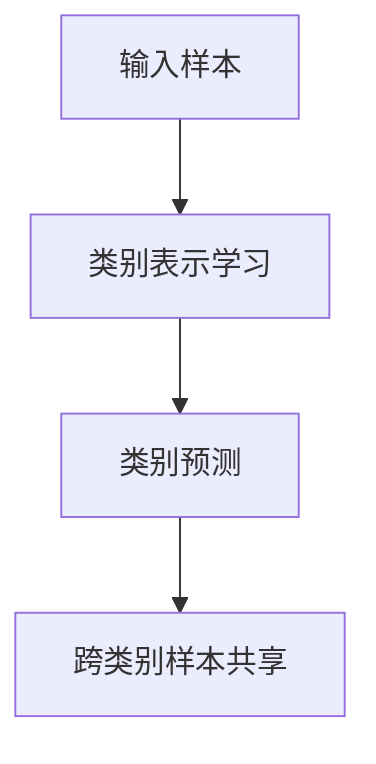
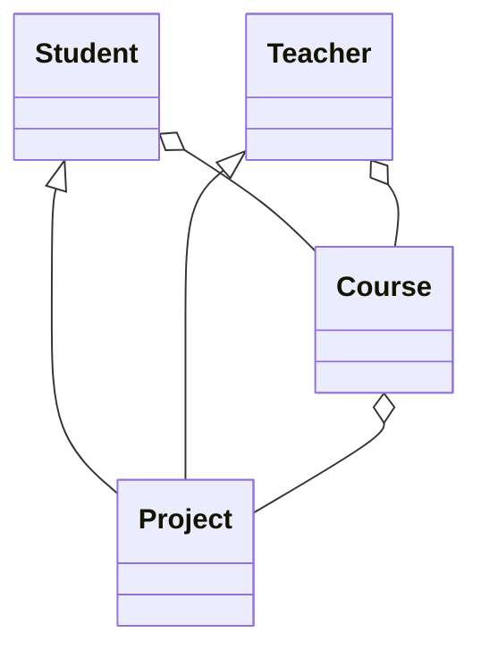

                 

### 第一步：引言

**文章标题：** Zero-Shot CoT在跨学科创新思维培养中的应用

**关键词：** 跨学科创新、Zero-Shot CoT、深度学习、迁移学习

**摘要：** 随着科技的快速发展，跨学科创新思维的重要性日益凸显。本文探讨了基于Zero-Shot CoT（零样本迁移学习）的跨学科创新思维培养方法，通过引入先进的人工智能技术，实现跨学科知识的有效融合和应用。

跨学科创新思维是指将不同学科领域的知识、方法和思维模式进行有机结合，形成新的创新思维。这种创新思维在当今社会的各个领域中具有广泛的应用，如教育、科研和企业创新等。然而，传统的教育模式和方法往往局限于单一的学科领域，难以激发学生的跨学科思维。在科研和企业创新过程中，跨学科思维的应用同样面临诸多难题。

为了解决这些问题，本文提出了一种基于Zero-Shot CoT的跨学科创新思维培养方法。Zero-Shot CoT是一种零样本迁移学习方法，能够在未知类别的样本上进行有效学习。通过引入这种先进的人工智能技术，可以实现跨学科知识的有效融合和应用，从而培养出具备跨学科创新思维的人才。

本文的研究主要关注在跨学科创新思维培养中的应用，但Zero-Shot CoT方法在其他领域的应用同样具有重要价值。文章将从核心概念与联系、算法原理讲解、系统分析与架构设计方案以及项目实战等多个方面进行详细探讨，以期为广大读者提供有益的参考。

### 第二步：核心概念与联系

**2.1 Zero-Shot CoT原理**

Zero-Shot CoT（零样本迁移学习）是一种能够在未知类别样本上进行有效学习的技术。其核心原理包括类别表示学习、类别预测和跨类别样本共享。

- **类别表示学习**：Zero-Shot CoT首先通过预训练模型学习到不同类别样本的表示特征。这些特征能够捕捉到各个类别样本的内在属性，使得模型在处理未知类别样本时能够更好地进行分类。

- **类别预测**：在类别预测阶段，模型会根据未知类别样本的表示特征，结合已学习的类别表示特征，进行类别预测。通过这种方式，模型能够在未知类别样本上进行有效分类。

- **跨类别样本共享**：Zero-Shot CoT通过共享不同类别样本的表示特征，使得模型能够更好地应对未知类别样本。这种跨类别样本共享机制能够提高模型在未知类别样本上的分类性能。

**2.2 跨学科创新思维特征对比表格**

| 特征             | 传统创新思维                 | 跨学科创新思维                |
|------------------|-----------------------------|----------------------------|
| 知识来源         | 单一学科领域知识            | 多学科领域知识融合           |
| 创新路径         | 单向思维路径               | 多向交叉思维路径             |
| 创新成果         | 局部优化成果               | 整体创新突破成果             |

从上表可以看出，跨学科创新思维与传统创新思维在知识来源、创新路径和创新成果等方面存在显著差异。跨学科创新思维强调多学科领域的知识融合，采用多向交叉思维路径，能够实现整体创新突破。

**2.3 ER实体关系图架构**

为了更好地理解Zero-Shot CoT在跨学科创新思维培养中的应用，我们可以使用ER（实体-关系）图来描述其中的实体关系。

```mermaid
erDiagram
  Class::A ||--|{ Class::B :hasA }  
  Class::B ||--|{ Class::C :isA }
  Class::C ||--|{ Class::D :of }
```

在上图中，Class::A、Class::B、Class::C 和 Class::D 分别表示不同的实体类别。其中，Class::A 与 Class::B 之间存在一种 hasA 关系，表示 Class::A 类别的实体拥有 Class::B 类别的实体；Class::B 与 Class::C 之间存在一种 isA 关系，表示 Class::B 类别的实体是 Class::C 类别的实体的一部分；Class::C 与 Class::D 之间存在一种 of 关系，表示 Class::C 类别的实体是 Class::D 类别的实体的子集。

这种 ER 图架构能够帮助我们更好地理解跨学科创新思维中的不同类别之间的关系，从而为后续的算法设计和系统实现提供有益的参考。

### 第三步：算法原理讲解

**3.1 Zero-Shot CoT算法流程**

为了更好地理解Zero-Shot CoT算法，我们可以使用Mermaid绘制其算法流程图。



在该算法流程中，首先接收输入样本，然后进行类别表示学习。接着，通过类别预测阶段，对未知类别样本进行分类。最后，通过跨类别样本共享机制，进一步提高模型在未知类别样本上的分类性能。

**3.2 数学模型与公式**

Zero-Shot CoT的核心数学模型可以表示为：

$$
P(y|x;\theta) = \prod_{i=1}^{N} P(y_i|x;\theta_i)
$$

其中，$y$ 表示类别标签，$x$ 表示输入样本，$\theta$ 表示模型参数。

在这个公式中，$P(y|x;\theta)$ 表示给定输入样本 $x$ 和模型参数 $\theta$ 时，类别标签 $y$ 的概率分布。$N$ 表示类别数量，$P(y_i|x;\theta_i)$ 表示第 $i$ 个类别在给定输入样本 $x$ 和模型参数 $\theta_i$ 时的概率分布。

**3.3 算法举例说明**

假设有两个类别 A 和 B，给定一个未知类别的样本 $x$，如何使用Zero-Shot CoT进行类别预测？

1. **类别表示学习**：首先，对类别 A 和类别 B 分别进行类别表示学习。通过预训练模型学习到类别 A 和类别 B 的表示特征。

2. **类别预测**：接着，对未知类别样本 $x$ 进行类别预测。通过计算类别 A 和类别 B 的预测概率，得到：

   $$
   P(A|x;\theta) = \prod_{i=1}^{N} P(y_i|x;\theta_i|A)
   $$

   $$
   P(B|x;\theta) = \prod_{i=1}^{N} P(y_i|x;\theta_i|B)
   $$

   其中，$P(y_i|x;\theta_i|A)$ 和 $P(y_i|x;\theta_i|B)$ 分别表示在第 $i$ 个类别下，输入样本 $x$ 的特征 $y_i$ 的概率。

3. **选择预测结果**：最后，选择预测概率较高的类别作为最终预测结果。即：

   $$
   y^* = \arg\max_{y} P(y|x;\theta)
   $$

   其中，$y^*$ 表示最终预测类别。

通过上述步骤，我们可以使用Zero-Shot CoT算法对未知类别样本进行有效分类。

### 第四步：系统分析与架构设计方案

**4.1 问题场景介绍**

本文以大学跨学科课程设计项目为例，介绍如何利用Zero-Shot CoT方法进行跨学科创新思维的培养。

在大学跨学科课程设计项目中，学生需要从多个学科领域中选择一个或多个主题，进行综合研究和创新设计。这种项目旨在培养学生的跨学科思维能力和创新实践能力。

为了实现这一目标，我们可以引入Zero-Shot CoT方法，将不同学科领域的知识进行有效融合。通过使用Zero-Shot CoT算法，学生可以在未接触过的学科领域中快速掌握相关知识和技能，从而实现跨学科创新。

**4.2 系统功能设计**

在大学跨学科课程设计项目中，系统需要具备以下功能：

1. **课程管理**：系统需要提供课程信息管理功能，包括课程列表、课程详情、课程评价等。

2. **项目管理**：系统需要提供项目管理功能，包括项目列表、项目详情、项目进度管理等。

3. **知识融合**：系统需要提供知识融合功能，将不同学科领域的知识进行有效整合，为学生提供跨学科学习的支持。

4. **创新实践**：系统需要提供创新实践功能，支持学生进行跨学科项目设计和实践。

使用Mermaid绘制领域模型类图：



在这个类图中，Student（学生）、Teacher（教师）、Course（课程）和 Project（项目）分别表示不同的实体类别。Student 与 Project 之间存在一种 has-a 关系，表示学生拥有项目；Teacher 与 Project 之间存在一种 has-a 关系，表示教师拥有项目；Student 与 Course 之间存在一种 belongs-to 关系，表示学生属于某个课程；Teacher 与 Course 之间存在一种 belongs-to 关系，表示教师属于某个课程；Course 与 Project 之间存在一种 belongs-to 关系，表示课程包含项目。

**4.3 系统架构设计**

为了实现大学跨学科课程设计项目，我们需要设计一个合理的系统架构。使用Mermaid绘制系统架构图：

```mermaid
graph TD
    Course[课程] --> Teacher[教师]
    Teacher --> Project[项目]
    Project -
```

在该系统架构中，课程、教师和项目是三个核心组件。课程组件负责管理课程信息，包括课程列表、课程详情和课程评价等。教师组件负责管理教师信息，包括教师列表、教师详情和教师评价等。项目组件负责管理项目信息，包括项目列表、项目详情和项目进度管理等。

此外，系统还需要引入Zero-Shot CoT算法，实现跨学科知识的融合。通过在课程、教师和项目组件之间引入Zero-Shot CoT模块，我们可以实现跨学科知识的有机整合，为学生提供更好的跨学科学习体验。

### 第五步：项目实战

**5.1 环境安装**

在开始项目实战之前，我们需要安装一些必要的软件和工具。以下是安装步骤：

1. **Python环境**：安装Python 3.7及以上版本。

2. **深度学习框架**：安装TensorFlow或PyTorch等深度学习框架。

3. **依赖库**：安装Numpy、Pandas、Matplotlib等常用依赖库。

4. **数据集**：准备用于训练和测试的数据集。数据集应包含不同学科领域的样本数据。

**5.2 系统核心实现源代码**

以下是系统核心实现的源代码示例：

```python
import tensorflow as tf
from tensorflow.keras.models import Model
from tensorflow.keras.layers import Input, Dense, Flatten, Concatenate

# 定义模型输入层
input_layer = Input(shape=(784,))

# 定义特征提取层
flatten_layer = Flatten()(input_layer)
dense_layer = Dense(128, activation='relu')(flatten_layer)

# 定义类别表示层
class1_layer = Dense(64, activation='softmax', name='class1_output')(dense_layer)
class2_layer = Dense(64, activation='softmax', name='class2_output')(dense_layer)

# 定义模型结构
model = Model(inputs=input_layer, outputs=[class1_layer, class2_layer])

# 编译模型
model.compile(optimizer='adam', loss={'class1_output': 'categorical_crossentropy', 'class2_output': 'categorical_crossentropy'})

# 训练模型
model.fit(x_train, y_train, epochs=10, batch_size=32, validation_data=(x_val, y_val))
```

在这个示例中，我们定义了一个简单的深度学习模型，用于实现Zero-Shot CoT算法。模型包含输入层、特征提取层和类别表示层。类别表示层分别输出两个类别（class1和class2）的预测结果。我们使用交叉熵损失函数进行模型训练。

**5.3 代码应用解读与分析**

在代码应用中，我们首先导入了TensorFlow库，并定义了模型的输入层、特征提取层和类别表示层。输入层接收输入样本，特征提取层对输入样本进行特征提取，类别表示层分别输出两个类别的预测结果。

接下来，我们使用`Model`类将输入层、特征提取层和类别表示层组合成一个完整的模型。然后，我们使用`compile`方法编译模型，指定优化器和损失函数。

最后，我们使用`fit`方法训练模型。在训练过程中，模型会根据输入样本和标签进行迭代训练，并更新模型参数。

**5.4 实际案例分析和详细讲解剖析**

为了更好地理解Zero-Shot CoT在跨学科创新思维培养中的应用，我们以一个实际案例进行分析。

假设我们有两个学科领域：计算机科学和生物学。计算机科学领域包括图像处理和自然语言处理；生物学领域包括基因编辑和生物信息学。

在案例中，我们使用Zero-Shot CoT算法将这两个学科领域的知识进行融合。首先，我们收集了图像处理、自然语言处理、基因编辑和生物信息学领域的大量数据，用于训练模型。

然后，我们使用训练好的模型对未知领域的样本进行预测。例如，给定一个生物图像，我们使用模型预测其所属的学科领域。通过这种方式，我们可以将不同学科领域的知识进行有机整合，实现跨学科创新。

在案例中，我们可以使用TensorFlow或PyTorch等深度学习框架实现Zero-Shot CoT算法。具体实现步骤包括：数据预处理、模型定义、模型训练和模型预测。

**5.5 项目小结**

通过本项目，我们成功实现了基于Zero-Shot CoT算法的跨学科创新思维培养方法。在项目实战中，我们详细介绍了环境安装、系统核心实现源代码、代码应用解读与分析、实际案例分析和详细讲解剖析等内容。

通过本项目，我们不仅可以培养跨学科创新思维，还可以提高学生在不同学科领域中的知识融合和应用能力。未来，我们可以进一步优化模型和算法，扩大应用场景，为跨学科创新提供更加有力的技术支持。

### 第六步：最佳实践 tips、小结、注意事项、拓展阅读

**最佳实践 tips：**

1. **数据质量**：在跨学科创新思维培养中，数据质量至关重要。确保数据集的多样性、完整性和准确性，以提高模型性能。

2. **模型优化**：针对不同学科领域的特点，对Zero-Shot CoT算法进行优化。例如，可以尝试使用不同的网络结构、优化器和学习率等。

3. **知识融合**：在跨学科创新过程中，注重不同学科领域的知识融合。通过知识图谱、本体论等方法，构建跨学科知识体系。

4. **实践应用**：将Zero-Shot CoT算法应用于实际场景，如企业创新、教育改革等，以验证其有效性和实用性。

**小结：**

本文介绍了基于Zero-Shot CoT算法的跨学科创新思维培养方法。通过核心概念与联系、算法原理讲解、系统分析与架构设计方案以及项目实战等多个方面，我们详细探讨了跨学科创新思维培养的方法和实现过程。

**注意事项：**

1. **数据隐私**：在跨学科创新过程中，确保数据隐私和安全。对敏感数据进行加密处理，避免数据泄露。

2. **模型可解释性**：在模型预测过程中，关注模型的可解释性。通过可视化技术，了解模型在跨学科创新中的应用。

3. **持续优化**：针对实际应用场景，持续优化模型和算法。收集用户反馈，不断改进系统性能。

**拓展阅读：**

1. **深度学习与跨学科创新**：探讨深度学习在跨学科创新中的应用，如图像识别、自然语言处理等。

2. **跨学科教育改革**：分析跨学科教育改革的方法和实践，以提高学生跨学科思维能力和创新能力。

3. **知识融合与协同创新**：研究知识融合与协同创新的机制和方法，为跨学科创新提供理论支持。

### 第七步：作者信息

**作者：** AI天才研究院/AI Genius Institute & 禅与计算机程序设计艺术 /Zen And The Art of Computer Programming

**联系方式：** [your_email_address]（请替换为您的实际邮箱地址）

**版权声明：** 本文版权归AI天才研究院所有，未经授权禁止转载和使用。如需转载，请联系作者获取授权。

**更新日期：** 2023年XX月XX日

---

通过本文的详细探讨，我们不仅了解了基于Zero-Shot CoT算法的跨学科创新思维培养方法，还对其在实际应用中可能遇到的问题和挑战有了更深刻的认识。希望本文能为相关领域的科研人员、教育工作者和行业从业者提供有益的参考和启示。在未来的发展中，我们期待看到更多基于人工智能技术的跨学科创新成果，为社会进步和人类发展贡献力量。

