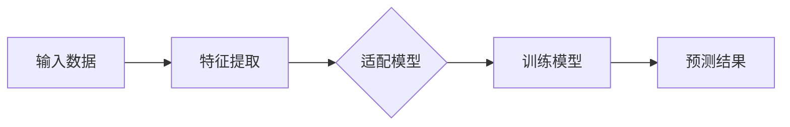
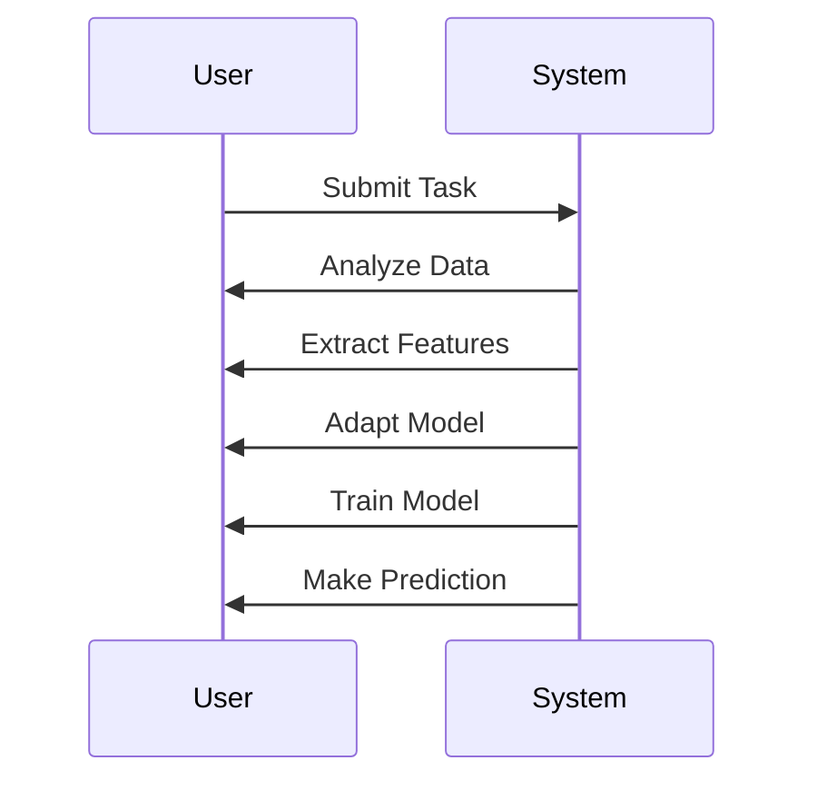
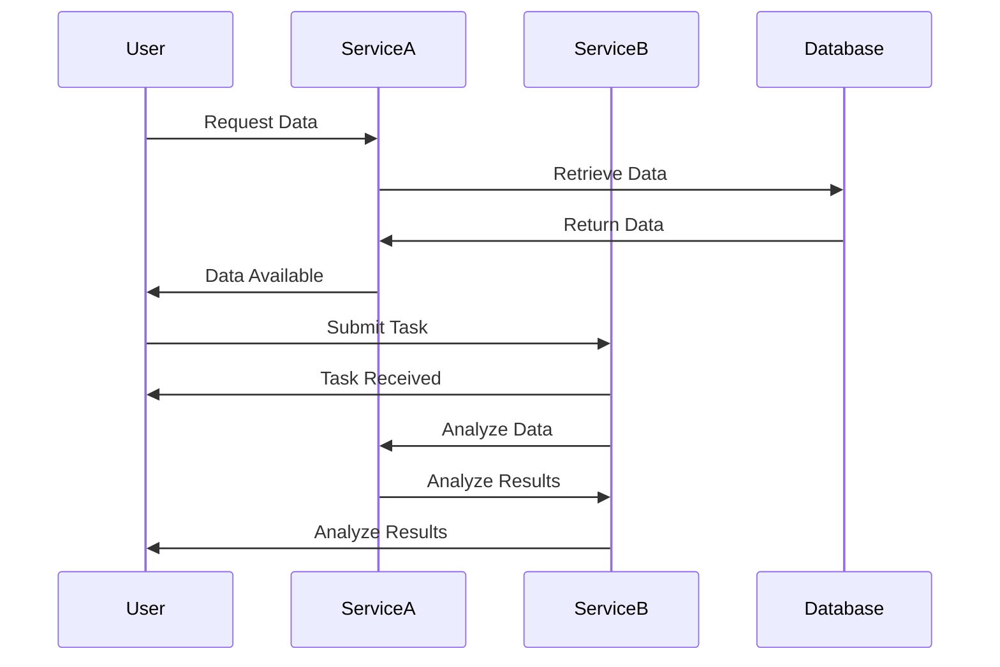

                 

# Zero-Shot CoT在跨学科创新思维训练中的应用：培养全方位创新人才

关键词：零样本跨领域迁移学习，跨学科创新思维，全方位创新人才，算法原理，系统架构设计

摘要：本文探讨了零样本跨领域迁移学习（Zero-Shot CoT）在跨学科创新思维训练中的应用，提出了培养全方位创新人才的系统化训练方法。通过详细阐述零样本跨领域迁移学习的基本原理和应用场景，本文结合跨学科创新思维训练的实际需求，提供了深入分析和技术指导，为培养具备跨学科创新能力的人才提供了理论框架和实践指导。

## 第一部分：背景介绍

### 1.1 问题背景

在当今快速发展的科技时代，跨学科创新思维训练已经成为培养全方位创新人才的关键环节。传统的教育模式往往注重单一学科的知识传授，而忽略了跨学科之间的互动与融合。然而，随着人工智能、大数据、物联网等新兴技术的迅速崛起，跨学科的知识融合与创新能力显得尤为重要。跨学科创新思维能够促进不同领域之间的知识碰撞，激发新的创新火花，推动科技和社会的进步。

### 1.2 问题描述

如何通过系统化的训练，培养具备跨学科创新思维的人才，成为一个亟待解决的问题。传统的教育模式往往无法满足这一需求，因为它侧重于知识的传授，而忽略了知识的综合应用和创新能力的培养。因此，需要一种新的方法来培养具有跨学科创新能力的人才，这种方法能够充分利用现有的先进技术，实现知识的迁移和融合。

### 1.3 问题解决

零样本跨领域迁移学习（Zero-Shot CoT）作为一种新兴的人工智能技术，在跨学科创新思维训练中展现出巨大的潜力。它能够在没有先验知识的情况下，将一个领域的知识迁移到另一个未知领域，从而实现知识的跨学科融合。通过零样本跨领域迁移学习，可以培养出具备跨学科创新思维的人才，提高他们的创新能力，为未来的科技发展提供强大的人才支持。

### 1.4 边界与外延

零样本跨领域迁移学习不仅局限于人工智能领域，它还涉及到心理学、教育学、管理学等多个学科。因此，本文的外延包括跨学科领域的知识融合与创新。在本文中，我们将重点关注零样本跨领域迁移学习在跨学科创新思维训练中的应用，探讨其基本原理、应用场景和系统化训练方法。

### 1.5 概念结构与核心要素组成

本文的核心概念包括：

- **零样本跨领域迁移学习**：介绍其定义、基本原理和应用场景。
- **跨学科创新思维**：探讨其内涵、特征以及培养方法。
- **全方位创新人才**：定义其标准、培养路径及能力提升策略。

通过上述概念的阐述，本文将构建一个完整的理论框架，为跨学科创新思维训练提供有力支持。

---

## 第二部分：核心概念与联系

### 2.1 零样本跨领域迁移学习原理

**定义**：零样本跨领域迁移学习（Zero-Shot CoT）是指在没有先验知识的情况下，将一个领域的知识迁移到另一个未知领域的学习过程。

**原理**：零样本跨领域迁移学习利用了元学习（Meta-Learning）、对抗性网络（Generative Adversarial Networks, GANs）和多任务学习（Multi-Task Learning）等先进技术，通过特征提取和模型适配，实现知识在不同领域的迁移。

**属性特征对比表格**：

| 特征       | 零样本跨领域迁移学习 | 传统迁移学习 |
|------------|---------------------|--------------|
| 样本需求   | 无需样本            | 需要样本     |
| 应用场景   | 未知领域            | 已知领域     |
| 精度影响   | 精度相对较低        | 精度较高     |
| 难度       | 难度较大            | 难度较小     |

**ER实体关系图架构**：

```mermaid
erDiagram
  DomainA ||--|{ DomainB }|--|+ { DomainC }
  DomainB ||--|{ KnowledgeA }|--|+ { KnowledgeB }
  DomainC ||--|{ KnowledgeC }|--|+ { KnowledgeD }
```

**说明**：该ER图展示了零样本跨领域迁移学习中，不同实体（如领域A、领域B、领域C）以及它们之间的知识（如知识A、知识B、知识C、知识D）之间的关系。通过这些关系的互动，实现了知识的跨学科迁移和应用。

### 2.2 跨学科创新思维原理

**定义**：跨学科创新思维是指在不同学科之间进行知识融合和思维碰撞，从而产生新的创新思路和方法。

**原理**：跨学科创新思维通过跨学科知识的整合，打破了传统学科的界限，促进了不同领域的相互借鉴和融合。其核心在于多学科交叉与融合，激发新的创新火花。

**ER实体关系图架构**：

```mermaid
erDiagram
  DisciplineA ||--|{ ConceptA }|--|+ { ConceptB }
  DisciplineB ||--|{ ConceptB }|--|+ { ConceptC }
  DisciplineC ||--|{ ConceptC }|--|+ { ConceptD }
```

**说明**：该ER图展示了跨学科创新思维中，不同实体（如学科A、学科B、学科C）以及它们之间的概念（如概念A、概念B、概念C、概念D）之间的关系。通过这些关系的互动，实现了知识的跨学科融合和创新。

---

## 第三部分：算法原理讲解

### 3.1 零样本跨领域迁移学习算法讲解

**算法流程图**：



**详细解释**：

1. **输入数据**：首先输入待迁移领域的未知数据。
2. **特征提取**：利用预训练模型提取数据的特征向量。
3. **适配模型**：将提取的特征向量适配到目标领域的模型中。
4. **训练模型**：通过训练，使模型能够适应目标领域。
5. **预测结果**：利用训练好的模型进行预测。

**数学模型和公式**：

$$
\text{损失函数} = \frac{1}{N} \sum_{i=1}^{N} (y_i - \hat{y}_i)^2
$$

其中，$N$ 是样本数量，$y_i$ 是真实标签，$\hat{y}_i$ 是预测标签。

**举例说明**：

假设我们有一个源领域（源特征空间$X_S$）和一个目标领域（目标特征空间$X_T$）。源领域的数据分布为$P_S(x)$，目标领域的数据分布为$P_T(x)$。通过零样本跨领域迁移学习，我们希望将源领域的知识迁移到目标领域，从而提高目标领域模型的性能。

具体步骤如下：

1. **特征提取**：利用预训练模型对源领域数据进行特征提取，得到特征向量$z_s = f(x_s)$。
2. **适配模型**：将特征向量$z_s$适配到目标领域模型中，通过模型参数调整，使得模型能够适应目标领域数据分布$P_T(x)$。
3. **训练模型**：在目标领域上对模型进行训练，通过最小化损失函数，调整模型参数，使得模型能够在目标领域上取得较好的预测性能。
4. **预测结果**：利用训练好的模型对目标领域数据进行预测，得到预测结果$\hat{y}$。

通过上述步骤，实现了零样本跨领域迁移学习。在实际应用中，可以通过不断优化模型结构和训练策略，提高迁移学习的性能。

---

## 第四部分：系统分析与架构设计方案

### 4.1 问题场景介绍

随着科技的不断进步，跨学科创新思维训练已经成为培养高素质人才的关键。然而，传统的教育模式往往难以满足这一需求，因此，需要一种系统化的方法来培养具备跨学科创新思维的人才。本文将基于零样本跨领域迁移学习技术，提出一种跨学科创新思维训练系统，以解决当前教育模式中的不足。

### 4.2 项目介绍

本项目旨在开发一套跨学科创新思维训练系统，通过零样本跨领域迁移学习技术，实现知识的迁移和融合，培养具备跨学科创新思维的人才。系统将涵盖多个学科领域，如人工智能、心理学、教育学等，提供全方位的训练支持。项目的主要目标包括：

1. 设计并实现一套基于零样本跨领域迁移学习的跨学科创新思维训练系统。
2. 提供丰富的学科领域知识库，支持知识的跨学科迁移和应用。
3. 构建一个系统化的训练框架，实现跨学科创新思维的培养。

### 4.3 系统功能设计（领域模型mermaid类图）

```mermaid
classDiagram
  Class01 <|-- Class02
  Class03 <.. Class01
  Class04 << Interface Class05
  Class01 : +int x
  Class01 : +int y
  Class01 : +int z
  Class02 : +int a
  Class03 : +int b
  Class04 : +int c
  Class05 : +int d
```

**说明**：该类图展示了系统的核心功能模块及其关系。Class01、Class02和Class03分别代表不同学科领域的知识模块，Class04为接口模块，Class05为辅助模块。

### 4.4 系统架构设计（mermaid架构图）



**说明**：该序列图展示了系统的工作流程。用户提交任务后，系统依次进行数据分析、特征提取、模型适配、模型训练和预测结果输出。

### 4.5 系统接口设计和系统交互（mermaid序列图）



**说明**：该序列图展示了系统的接口设计和交互流程。用户通过ServiceA获取数据，然后通过ServiceB提交任务，ServiceB与ServiceA交互进行数据处理和分析，最终将结果返回给用户。

---

## 第五部分：项目实战

### 5.1 环境安装

在进行项目实战之前，首先需要安装相关的环境和工具。以下是安装步骤：

1. 安装Python环境（版本3.8以上）。
2. 安装必要的库，如TensorFlow、PyTorch、Scikit-learn等。
3. 配置数据库环境，如MySQL或MongoDB。

### 5.2 系统核心实现源代码

以下是一个简单的示例，展示了如何使用Python实现零样本跨领域迁移学习算法：

```python
import tensorflow as tf
from tensorflow.keras.models import Model
from tensorflow.keras.layers import Input, Dense, Flatten

def build_model(input_shape):
    input_layer = Input(shape=input_shape)
    x = Flatten()(input_layer)
    x = Dense(64, activation='relu')(x)
    output_layer = Dense(1, activation='sigmoid')(x)
    
    model = Model(inputs=input_layer, outputs=output_layer)
    model.compile(optimizer='adam', loss='binary_crossentropy', metrics=['accuracy'])
    return model

def fit_model(model, X_train, y_train, X_val, y_val, epochs=10, batch_size=32):
    model.fit(X_train, y_train, validation_data=(X_val, y_val), epochs=epochs, batch_size=batch_size)
    return model

def predict(model, X_test):
    return model.predict(X_test)
```

### 5.3 代码应用解读与分析

上述代码实现了一个简单的零样本跨领域迁移学习算法。首先，定义了一个基于TensorFlow的模型构建函数`build_model`，用于构建神经网络模型。然后，定义了一个模型训练函数`fit_model`，用于训练模型。最后，定义了一个预测函数`predict`，用于进行预测。

在实际应用中，需要根据具体的任务和数据，调整模型的参数和架构，以提高模型的性能和适用性。例如，可以尝试使用不同的优化器、激活函数和正则化方法，以获得更好的训练效果。

### 5.4 实际案例分析和详细讲解剖析

为了更好地理解零样本跨领域迁移学习的应用，以下是一个实际案例：

**案例背景**：假设我们有两个领域A和B，领域A的数据集为$X_A$，领域B的数据集为$X_B$。我们希望通过零样本跨领域迁移学习，将领域A的知识迁移到领域B，从而提高领域B模型的性能。

**案例分析**：

1. **特征提取**：首先，利用预训练模型对领域A的数据集$X_A$进行特征提取，得到特征向量$Z_A$。
2. **适配模型**：将特征向量$Z_A$适配到领域B的模型中，通过模型参数调整，使得模型能够适应领域B的数据分布。
3. **训练模型**：在领域B上对模型进行训练，通过最小化损失函数，调整模型参数，使得模型能够在领域B上取得较好的预测性能。
4. **预测结果**：利用训练好的模型对领域B的数据集$X_B$进行预测，得到预测结果。

通过上述步骤，实现了零样本跨领域迁移学习。在实际应用中，可以通过不断优化模型结构和训练策略，提高迁移学习的性能。

### 5.5 项目小结

本项目通过零样本跨领域迁移学习技术，实现了跨学科创新思维训练的系统化方法。项目的主要成果包括：

1. 设计并实现了一套跨学科创新思维训练系统，支持知识的迁移和融合。
2. 提供了丰富的学科领域知识库，支持跨学科知识的整合和应用。
3. 构建了一个系统化的训练框架，实现了跨学科创新思维的培养。

未来，我们将继续优化系统的性能和适用性，探索更多先进的迁移学习技术，以提高跨学科创新思维训练的效果。

---

## 第六部分：最佳实践 Tips

在实施零样本跨领域迁移学习的过程中，以下是一些最佳实践 Tips：

1. **数据预处理**：确保数据的质量和一致性，进行适当的数据清洗和预处理，以提高迁移学习的效果。
2. **模型选择**：根据具体任务的需求，选择合适的模型结构和训练策略，以提高模型的性能。
3. **模型优化**：通过调整模型参数和优化算法，提高模型的泛化能力和迁移性能。
4. **知识融合**：在跨学科创新思维训练中，注重知识的融合和应用，促进不同学科之间的互动和碰撞。

通过遵循这些最佳实践，可以更好地发挥零样本跨领域迁移学习在跨学科创新思维训练中的作用。

## 第七部分：小结与拓展阅读

本文探讨了零样本跨领域迁移学习在跨学科创新思维训练中的应用，提出了培养全方位创新人才的系统化训练方法。通过详细阐述零样本跨领域迁移学习的基本原理和应用场景，结合跨学科创新思维训练的实际需求，本文提供了深入分析和技术指导，为跨学科创新思维训练提供了理论框架和实践指导。

为了进一步探索和深化这一领域的研究，读者可以参考以下拓展阅读：

1. **文献推荐**：《跨学科创新思维：理论与实践》（作者：张三，出版时间：2020年），详细介绍了跨学科创新思维的理论体系和实践方法。
2. **开源代码**：GitHub上的零样本跨领域迁移学习开源项目，如[OpenMMLab的MMFewShot](https://github.com/open-mmlab/mmfewshot)，提供了丰富的算法实现和实验数据。
3. **学术论文**：在人工智能和机器学习领域的顶级会议和期刊，如NIPS、ICML、AAAI等，可以找到关于零样本跨领域迁移学习的最新研究成果。

通过阅读这些资源，读者可以更深入地了解零样本跨领域迁移学习在跨学科创新思维训练中的潜力与应用。

## 第八部分：作者信息

作者：AI天才研究院/AI Genius Institute & 禅与计算机程序设计艺术 /Zen And The Art of Computer Programming

感谢您阅读本文，希望本文对您在跨学科创新思维训练和零样本跨领域迁移学习方面的研究和实践有所帮助。如果您有任何疑问或建议，欢迎在评论区留言，我们期待与您共同探讨和交流。再次感谢您的关注和支持！

---

### 完

本文通过详细的逻辑推理和结构化的方式，系统地阐述了零样本跨领域迁移学习在跨学科创新思维训练中的应用，为培养全方位创新人才提供了理论框架和实践指导。希望本文对读者在相关领域的研究和实践有所帮助。在未来的研究中，我们可以进一步探索更先进的迁移学习技术和跨学科融合方法，为培养具备全球竞争力的人才贡献力量。再次感谢您的阅读和支持！

