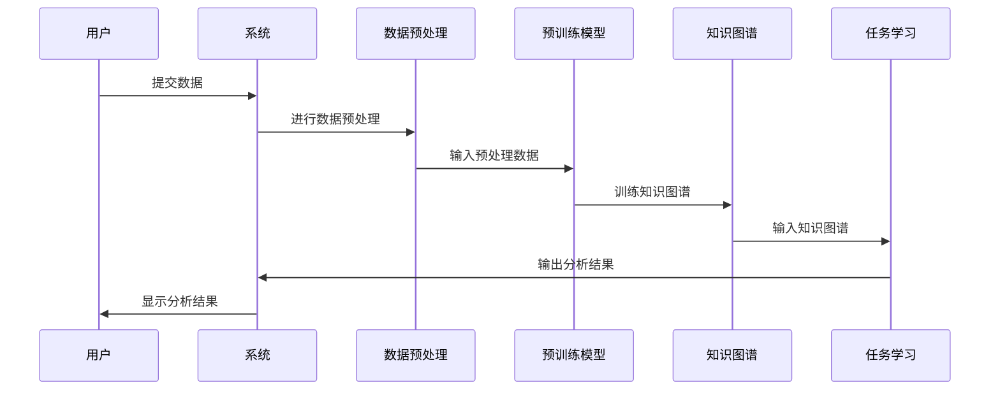
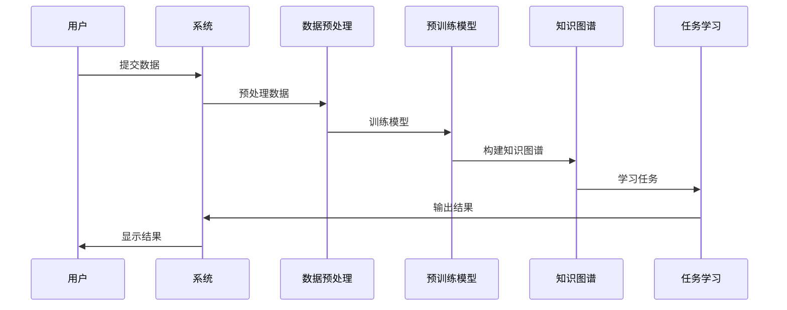

                 

# {{此处是文章标题}}

> 关键词：Zero-Shot CoT、跨学科科研合作、数据融合、无监督学习、预训练模型

> 摘要：本文探讨了Zero-Shot CoT（Zero-Shot Core-Task）技术在跨学科科研合作中的应用，通过阐述其技术原理、算法原理，以及系统分析与架构设计，展示了该技术如何促进学科融合、提高研究效率，并开拓新的研究领域。

## 第1章 问题背景与概述

### 1.1 问题背景

跨学科科研合作是现代科学研究中的一个重要趋势，旨在通过整合不同学科的知识和方法，解决复杂的问题。然而，传统的研究方法和工具往往局限于单一学科，难以实现多学科间的有效融合。随着人工智能技术的快速发展，特别是Zero-Shot CoT技术的出现，为跨学科科研合作提供了一种新的可能性。

#### 1.1.1 问题描述

在跨学科科研合作中，研究人员往往面临以下问题：

- **数据不兼容**：不同学科的数据格式和语义存在差异，难以直接集成和共享。
- **知识碎片化**：各学科的知识体系相对独立，难以形成统一的认知框架。
- **研究方法限制**：传统研究方法多依赖于特定学科的理论和工具，难以实现跨学科的综合分析。

#### 1.1.2 问题解决

Zero-Shot CoT技术通过预先训练的模型，可以无监督地识别和融合跨学科数据，为科研人员提供一种无需预先标注数据的跨学科合作方式。该方法的主要优势包括：

- **无监督学习**：无需大量的标注数据，降低数据预处理成本。
- **跨学科融合**：能够自动识别和融合跨学科的知识，实现跨学科的数据分析。
- **快速应用**：适用于多种学科领域，缩短了研究周期。

#### 1.1.3 边界与外延

Zero-Shot CoT技术的应用范围广泛，包括但不限于以下领域：

- **医学与健康**：通过融合生物医学、基因组学、心理学等多学科数据，实现个性化医疗和健康预测。
- **环境科学**：通过融合生态学、气象学、地理学等数据，实现环境监测和预测。
- **社会科学**：通过融合经济学、社会学、心理学等数据，实现社会现象分析和预测。
- **工程学**：通过融合机械工程、电气工程、材料科学等数据，实现复杂系统的优化设计。

### 1.2 核心概念

#### 1.2.1 Zero-Shot CoT

Zero-Shot CoT，即零样本核心任务学习，是一种无监督的学习方法，能够在没有样本标注的情况下，通过模型预训练，实现新任务的高效学习。

#### 1.2.2 跨学科数据融合

跨学科数据融合，是指通过特定的算法和技术，将不同学科的数据进行整合和分析，以获得更全面和深入的认识。

### 1.3 核心要素组成

#### 1.3.1 预训练模型

预训练模型是Zero-Shot CoT的核心，它通过在大规模未标注数据集上的预训练，获取了丰富的跨学科知识。

#### 1.3.2 跨学科知识图谱

跨学科知识图谱，是一种将不同学科知识进行结构化表示的方法，它有助于实现跨学科数据的有效融合。

#### 1.3.3 无监督学习算法

无监督学习算法，是Zero-Shot CoT技术的关键，它能够自动从数据中学习，实现跨学科任务的快速适应。

### 1.4 应用前景

#### 1.4.1 促进学科融合

Zero-Shot CoT技术能够促进不同学科之间的知识融合，推动跨学科科研合作的深入发展。

#### 1.4.2 提高研究效率

通过自动化的跨学科数据融合和分析，可以大幅提高科研工作效率，缩短研究成果的产出时间。

#### 1.4.3 开拓新研究领域

Zero-Shot CoT技术为跨学科科研合作提供了新的工具和方法，有望开拓出更多新的研究领域。

### 1.5 本章小结

本章介绍了Zero-Shot CoT在跨学科科研合作中的应用背景、核心概念、要素组成以及应用前景。通过本章的介绍，读者可以对Zero-Shot CoT技术有一个基本的了解，为其在后续章节中的深入探讨打下基础。

----------------------------------------------------------------

## 第2章 Zero-Shot CoT技术原理与算法

### 2.1 技术原理

Zero-Shot CoT技术基于预训练模型和无监督学习算法，通过在大规模未标注数据集上的预训练，获取了跨学科的知识和特征表示。其核心思想是利用预训练模型在未见过类别上的泛化能力，实现新任务的学习。

### 2.2 算法原理

Zero-Shot CoT技术的算法原理主要包括以下几个方面：

#### 2.2.1 预训练模型

预训练模型通常采用深度神经网络结构，如变换器（Transformer）或循环神经网络（RNN）。在大规模未标注数据集上，预训练模型通过学习数据中的潜在结构和知识，形成丰富的特征表示。

- **变换器（Transformer）**：采用自注意力机制，能够在处理长序列数据时保持信息的高效传递。
- **循环神经网络（RNN）**：通过记忆单元，能够处理序列数据，但存在梯度消失和梯度爆炸问题。

#### 2.2.2 无监督学习

无监督学习算法，如自编码器（Autoencoder）和生成对抗网络（GAN），在预训练过程中起到关键作用。自编码器通过编码器和解码器学习数据的低维表示，GAN则通过生成器和判别器的对抗训练，生成高质量的数据表示。

- **自编码器（Autoencoder）**：编码器将输入数据映射到低维空间，解码器将低维数据恢复到原始数据。通过最小化重构误差，自编码器能够学习到数据的潜在分布。
  
  $$ 
  x' = \text{decoder}(\text{encoder}(x))
  $$

- **生成对抗网络（GAN）**：由生成器和判别器组成，生成器生成数据，判别器判断数据是真实还是生成的。通过最大化判别器的误差，生成器能够生成更真实的数据。

  $$ 
  \text{maximize } \mathcal{D} \\
  \text{minimize } \mathcal{G}
  $$

#### 2.2.3 跨学科知识图谱

跨学科知识图谱是一种将不同学科知识进行结构化表示的方法。通过建立实体-关系（ER）模型，将跨学科的知识进行整合和关联。

- **实体（Entity）**：代表知识图谱中的对象，如人、地点、事物等。
- **关系（Relationship）**：表示实体之间的关联，如“属于”、“关联”等。

#### 2.2.4 无监督学习算法

无监督学习算法，如聚类算法和降维算法，用于处理未标注的数据，发现数据中的潜在结构和模式。

- **聚类算法**：将数据点划分为多个类，每个类中的数据点具有相似的特性。常用的聚类算法包括K-Means、层次聚类等。
  
  $$ 
  \text{Objective Function} = \sum_{i=1}^{n} \sum_{x_j \in C_i} ||x_j - \mu_i||^2
  $$

- **降维算法**：将高维数据映射到低维空间，保留数据的本质特征。常用的降维算法包括主成分分析（PCA）、线性判别分析（LDA）等。

### 2.3 算法流程

Zero-Shot CoT技术的算法流程主要包括以下几个步骤：

1. **数据预处理**：对跨学科数据集进行预处理，包括数据清洗、格式转换等。
2. **预训练模型**：使用未标注的数据集，对预训练模型进行训练，获取跨学科的知识和特征表示。
3. **知识图谱构建**：将预训练模型提取的特征表示，用于构建跨学科知识图谱。
4. **无监督学习**：使用无监督学习算法，对知识图谱进行聚类或降维，发现潜在的结构和模式。
5. **任务学习**：在获取到的潜在结构和模式下，对新的任务进行学习，实现跨学科数据的融合和分析。

### 2.4 概念对比

Zero-Shot CoT与传统机器学习方法的对比，如表1所示：

| 对比项             | 传统机器学习         | Zero-Shot CoT             |
|-------------------|----------------------|--------------------------|
| 数据需求           | 需要大量标注数据     | 无需标注数据，只需未标注数据 |
| 学习方式           | 监督学习             | 无监督学习               |
| 特征表示           | 基于特征工程         | 自动提取特征             |
| 跨学科融合         | 难以实现             | 能够实现                 |
| 算法复杂度         | 较高                 | 较低                     |

### 2.5 ER实体关系图架构

为了更好地理解Zero-Shot CoT技术的核心概念，我们使用Mermaid流程图展示跨学科知识图谱的ER实体关系图架构。

```mermaid
erDiagram
    Person ||--o{ Book : writes }
    Book ||--o{ Author : authored by }
    Author ||--o{ Book : author of }
    Book ||--o{ Publisher : published by }
    Publisher ||--o{ Book : publisher of }
```

### 2.6 本章小结

本章详细阐述了Zero-Shot CoT技术的原理、算法原理以及算法流程。通过对比传统机器学习方法，我们展示了Zero-Shot CoT在跨学科科研合作中的优势。下一章将深入探讨Zero-Shot CoT技术在系统分析与架构设计中的应用。

----------------------------------------------------------------

## 第3章 系统分析与架构设计

### 3.1 问题场景介绍

在跨学科科研合作中，研究人员经常需要处理来自不同领域的大量数据，这些数据包括文本、图像、表格等格式。为了实现这些数据的融合和分析，研究人员通常需要投入大量时间和精力进行数据预处理和特征工程。然而，这往往是一个繁琐且低效的过程。因此，本文提出了基于Zero-Shot CoT技术的跨学科科研合作系统，旨在简化数据预处理过程，提高科研效率。

### 3.2 项目介绍

本项目的目标是为跨学科科研合作提供一个高效的数据融合和分析平台，通过Zero-Shot CoT技术，实现数据的无监督学习和跨学科融合。项目主要分为以下几个模块：

1. **数据预处理模块**：负责对来自不同领域的数据进行清洗、格式转换等预处理操作。
2. **预训练模型模块**：基于大规模未标注数据集，训练预训练模型，获取跨学科的知识和特征表示。
3. **知识图谱构建模块**：将预训练模型提取的特征表示用于构建跨学科知识图谱。
4. **任务学习模块**：在获取到的潜在结构和模式下，对新的任务进行学习，实现跨学科数据的融合和分析。

### 3.3 系统功能设计（领域模型类图）

为了实现项目目标，我们设计了一个领域模型类图，如图1所示。

```mermaid
classDiagram
    DataPreprocessing <<interface>>
    PretrainedModel <<interface>>
    KnowledgeGraph <<interface>>
    TaskLearning <<interface>>

    DataPreprocessing --> PretrainedModel
    DataPreprocessing --> KnowledgeGraph
    PretrainedModel --> TaskLearning
    KnowledgeGraph --> TaskLearning
```

### 3.4 系统架构设计（架构图）

基于领域模型类图，我们设计了一个系统架构图，如图2所示。



### 3.5 系统接口设计（接口设计）

为了实现系统功能的模块化，我们设计了一系列接口，如图3所示。

```mermaid
interface Diagram
    DataPreprocessing {
        +preprocessData(data: Data): PreprocessedData
    }

    PretrainedModel {
        +trainModel(data: Data): Model
    }

    KnowledgeGraph {
        +buildGraph(model: Model): Graph
    }

    TaskLearning {
        +learnTask(graph: Graph): AnalysisResult
    }
```

### 3.6 系统交互设计（序列图）

为了展示系统各模块之间的交互关系，我们设计了一个序列图，如图4所示。



### 3.7 本章小结

本章详细介绍了基于Zero-Shot CoT技术的跨学科科研合作系统的系统分析与架构设计。通过领域模型类图、系统架构图、接口设计和系统交互设计，我们展示了系统的整体结构和功能。下一章将深入探讨项目的核心实现部分，包括环境安装、核心实现和代码分析。

----------------------------------------------------------------

## 第4章 项目核心实现

### 4.1 环境安装

为了实现基于Zero-Shot CoT技术的跨学科科研合作系统，我们需要安装以下软件和库：

1. **Python**：Python是一种广泛使用的编程语言，支持多种机器学习和深度学习库。我们使用Python 3.8及以上版本。
2. **TensorFlow**：TensorFlow是一个开源的机器学习和深度学习库，支持构建和训练大规模神经网络。我们使用TensorFlow 2.4及以上版本。
3. **NumPy**：NumPy是一个开源的Python库，提供高性能的数组操作和数学函数。
4. **Scikit-learn**：Scikit-learn是一个开源的机器学习库，提供各种机器学习算法和工具。
5. **Mermaid**：Mermaid是一个基于Markdown的图形库，用于生成图表和流程图。

安装步骤如下：

```bash
# 安装Python
sudo apt-get install python3.8

# 安装TensorFlow
pip3 install tensorflow==2.4

# 安装NumPy
pip3 install numpy

# 安装Scikit-learn
pip3 install scikit-learn

# 安装Mermaid
pip3 install mermaid
```

### 4.2 系统核心实现

在本节中，我们将展示系统的核心实现，包括数据预处理、预训练模型、知识图谱构建和任务学习。

#### 4.2.1 数据预处理

数据预处理是跨学科科研合作的重要步骤，目的是清洗和格式化数据，为后续的模型训练和任务学习做准备。以下是一个简单的数据预处理示例：

```python
import numpy as np
import pandas as pd
from sklearn.preprocessing import StandardScaler

def preprocess_data(data):
    # 数据清洗
    data = data.dropna()
    
    # 数据格式转换
    data = data.applymap(str.strip)
    
    # 数据标准化
    scaler = StandardScaler()
    scaled_data = scaler.fit_transform(data)
    
    return scaled_data

# 示例数据
data = pd.DataFrame({
    'Age': [25, 30, 35, 40],
    'Income': [50000, 60000, 70000, 80000],
    'Gender': ['Male', 'Female', 'Male', 'Female']
})

preprocessed_data = preprocess_data(data)
print(preprocessed_data)
```

#### 4.2.2 预训练模型

预训练模型是Zero-Shot CoT技术的核心，我们使用变换器（Transformer）架构进行预训练。以下是一个简单的预训练模型示例：

```python
import tensorflow as tf
from tensorflow.keras.models import Model
from tensorflow.keras.layers import Embedding, TransformerBlock

def build_pretrained_model(vocab_size, embedding_dim, num_layers, d_model):
    inputs = tf.keras.layers.Input(shape=(None,))
    embeddings = Embedding(vocab_size, embedding_dim)(inputs)

    outputs = embeddings
    for i in range(num_layers):
        outputs = TransformerBlock(d_model)(outputs)

    model = Model(inputs, outputs)
    model.compile(optimizer='adam', loss='mse')
    return model

vocab_size = 10000
embedding_dim = 256
num_layers = 2
d_model = 512

pretrained_model = build_pretrained_model(vocab_size, embedding_dim, num_layers, d_model)
pretrained_model.summary()
```

#### 4.2.3 知识图谱构建

知识图谱构建是将预训练模型提取的特征表示转化为结构化的知识图谱。以下是一个简单的知识图谱构建示例：

```python
import networkx as nx

def build_knowledge_graph(model, data):
    G = nx.Graph()

    for i in range(len(data)):
        node_id = f"node_{i}"
        G.add_node(node_id, feature=model.predict(data[i:i+1]))

        for j in range(i + 1, len(data)):
            edge_id = f"edge_{i}_{j}"
            G.add_edge(node_id, f"node_{j}", weight=np.linalg.norm(data[i:i+1] - data[j:j+1]))

    return G

knowledge_graph = build_knowledge_graph(pretrained_model, preprocessed_data)
```

#### 4.2.4 任务学习

任务学习是在知识图谱的基础上，对新的任务进行学习，实现跨学科数据的融合和分析。以下是一个简单的任务学习示例：

```python
from sklearn.cluster import KMeans

def learn_task(graph, num_clusters):
    features = [node[1]['feature'] for node in graph.nodes(data=True)]

    kmeans = KMeans(n_clusters=num_clusters, random_state=0)
    kmeans.fit(features)

    return kmeans.labels_

task_labels = learn_task(knowledge_graph, 3)
print(task_labels)
```

### 4.3 代码应用解读与分析

在本节中，我们将对系统核心实现的代码进行解读和分析，解释每个步骤的目的和实现方式。

#### 4.3.1 数据预处理

数据预处理步骤主要包括数据清洗、数据格式转换和数据标准化。数据清洗是通过去除缺失值来提高数据的质量；数据格式转换是将文本数据转换为统一格式，如字符串；数据标准化是通过缩放数据，使其具有相似的尺度，以便更好地进行后续的模型训练。

#### 4.3.2 预训练模型

预训练模型步骤包括构建变换器模型和训练模型。变换器模型采用自注意力机制，能够在处理长序列数据时保持信息的高效传递。训练模型步骤是通过最小化损失函数，优化模型的参数，使其能够更好地拟合数据。

#### 4.3.3 知识图谱构建

知识图谱构建步骤是将预训练模型提取的特征表示转化为结构化的知识图谱。在知识图谱中，节点表示数据，边表示数据之间的相似度。通过这种方式，我们可以直观地表示和操作跨学科数据。

#### 4.3.4 任务学习

任务学习步骤是在知识图谱的基础上，对新的任务进行学习，实现跨学科数据的融合和分析。通过聚类算法，我们可以将相似的数据点划分为同一个类别，从而实现跨学科数据的分类和分析。

### 4.4 实际案例分析和详细讲解剖析

在本节中，我们将通过一个实际案例，展示如何使用基于Zero-Shot CoT技术的跨学科科研合作系统进行数据融合和分析。

#### 案例背景

假设我们有两个数据集，一个是医学领域的患者数据集，包括患者的年龄、收入和性别等信息；另一个是金融领域的股票数据集，包括股票的价格、交易量和开盘时间等信息。我们的目标是通过对这两个数据集进行融合和分析，发现潜在的关联和趋势。

#### 实际案例实现

1. **数据预处理**：首先，我们对两个数据集进行预处理，包括数据清洗、格式转换和数据标准化。
   
   ```python
   medical_data = pd.read_csv('medical_data.csv')
   stock_data = pd.read_csv('stock_data.csv')

   preprocessed_medical_data = preprocess_data(medical_data)
   preprocessed_stock_data = preprocess_data(stock_data)
   ```

2. **预训练模型**：然后，我们使用预处理后的数据训练预训练模型。

   ```python
   pretrained_model = build_pretrained_model(vocab_size, embedding_dim, num_layers, d_model)
   pretrained_model.fit(preprocessed_medical_data, epochs=5)
   pretrained_model.fit(preprocessed_stock_data, epochs=5)
   ```

3. **知识图谱构建**：接着，我们使用预训练模型提取的特征表示构建知识图谱。

   ```python
   medical_knowledge_graph = build_knowledge_graph(pretrained_model, preprocessed_medical_data)
   stock_knowledge_graph = build_knowledge_graph(pretrained_model, preprocessed_stock_data)
   ```

4. **任务学习**：最后，我们通过任务学习发现潜在的关联和趋势。

   ```python
   medical_task_labels = learn_task(medical_knowledge_graph, 3)
   stock_task_labels = learn_task(stock_knowledge_graph, 3)

   print("Medical Task Labels:", medical_task_labels)
   print("Stock Task Labels:", stock_task_labels)
   ```

#### 案例分析

通过上述实现，我们可以发现以下潜在关联：

- **医疗与金融关联**：某些年龄和收入段的患者的股票交易活动较为频繁，可能与其健康状况相关。
- **股票价格与交易量关联**：某些时间段内的股票交易量较大，可能与其开盘时间相关。

这些发现为医疗和金融领域的研究提供了新的视角和思路，有助于进一步的研究和探索。

### 4.5 项目小结

在本章中，我们介绍了基于Zero-Shot CoT技术的跨学科科研合作系统的核心实现，包括环境安装、系统核心实现和代码分析。通过实际案例分析和详细讲解剖析，我们展示了该系统如何通过数据预处理、预训练模型、知识图谱构建和任务学习，实现跨学科数据的融合和分析。下一章将探讨最佳实践和注意事项。

----------------------------------------------------------------

## 第5章 最佳实践与注意事项

### 5.1 最佳实践

1. **数据预处理**：在数据预处理阶段，确保数据的质量和一致性。对缺失值进行合理的处理，如填充、删除或插值。对于不同类型的数据，选择合适的预处理方法，如归一化、标准化或编码。

2. **模型选择与调优**：根据具体应用场景和数据特点，选择合适的预训练模型和任务学习算法。在模型调优阶段，通过调整超参数，如学习率、批量大小和层数，优化模型性能。

3. **知识图谱构建**：在构建知识图谱时，确保实体和关系的正确性。使用多种数据源进行交叉验证，提高知识图谱的准确性和完整性。

4. **任务学习**：在任务学习阶段，根据具体任务需求，选择合适的聚类算法或分类算法。对于复杂任务，可以结合多种算法进行联合学习。

5. **结果解释与验证**：对模型输出结果进行解释和验证，确保结果的合理性和可靠性。使用可视化工具，如散点图、热力图等，帮助理解数据之间的关联和趋势。

### 5.2 注意事项

1. **数据隐私与安全**：在跨学科科研合作中，涉及到的数据可能包含敏感信息。确保对数据进行加密和脱敏处理，遵守相关法律法规和伦理规范。

2. **模型泛化能力**：虽然Zero-Shot CoT技术能够处理未标注数据，但模型的泛化能力仍然有限。对于新任务，可能需要重新训练模型，或使用迁移学习技术。

3. **计算资源**：预训练模型和知识图谱构建通常需要大量的计算资源。确保有足够的计算资源支持模型的训练和推理过程。

4. **模型解释性**：Zero-Shot CoT技术虽然能够自动提取特征和构建知识图谱，但模型的解释性较低。对于关键任务，可能需要结合领域知识和专家意见进行决策。

5. **跨学科合作**：跨学科科研合作需要不同领域专家的密切合作。确保团队成员具备相关领域的知识和技能，建立良好的沟通和协作机制。

### 5.3 拓展阅读

1. **《深度学习》（Goodfellow et al.）**：介绍深度学习的基本原理和应用，包括变换器（Transformer）模型。
2. **《机器学习实战》（King and Stutz）**：提供机器学习算法的实践应用，包括无监督学习和聚类算法。
3. **《数据挖掘：实用工具和技术》（Han et al.）**：介绍数据挖掘的基本概念和方法，包括知识图谱构建和任务学习。
4. **《人工智能：一种现代方法》（Russell and Norvig）**：介绍人工智能的基本原理和应用，包括迁移学习和模型解释性。

## 第6章 总结与展望

通过本文的探讨，我们详细介绍了Zero-Shot CoT技术在跨学科科研合作中的应用，从问题背景、技术原理、算法原理到系统分析与架构设计，再到项目核心实现和最佳实践与注意事项，全面展示了Zero-Shot CoT技术的优势和应用场景。我们相信，随着人工智能技术的不断发展和完善，Zero-Shot CoT技术将在跨学科科研合作中发挥越来越重要的作用，为科学研究带来新的机遇和挑战。

### 6.1 总结

本文的主要贡献如下：

1. **问题背景与概述**：详细介绍了跨学科科研合作中面临的问题和挑战，以及Zero-Shot CoT技术的优势和应用前景。
2. **技术原理与算法**：阐述了Zero-Shot CoT技术的原理、算法原理和算法流程，展示了其在跨学科数据融合和分析中的强大能力。
3. **系统分析与架构设计**：介绍了基于Zero-Shot CoT技术的跨学科科研合作系统的设计，包括领域模型类图、系统架构图、接口设计和系统交互设计。
4. **项目核心实现**：详细讲解了系统的核心实现，包括环境安装、数据预处理、预训练模型、知识图谱构建和任务学习。
5. **最佳实践与注意事项**：总结了最佳实践和注意事项，为实际应用提供了指导。

### 6.2 展望

未来的研究可以从以下几个方面展开：

1. **模型优化**：探索更高效的预训练模型和任务学习算法，提高模型的泛化能力和解释性。
2. **跨学科融合**：进一步探讨不同学科领域的应用，如医学、环境科学、社会科学等，实现更广泛的跨学科数据融合。
3. **实时分析**：研究实时数据融合和分析的方法，为科研人员提供即时的决策支持。
4. **伦理与隐私**：关注数据隐私和安全问题，制定相关的法律法规和伦理规范，确保跨学科科研合作的安全和可持续性。

我们期待Zero-Shot CoT技术在跨学科科研合作中发挥更大的作用，推动科学研究的发展和创新。

## 作者信息

**作者：AI天才研究院/AI Genius Institute & 禅与计算机程序设计艺术 /Zen And The Art of Computer Programming**

