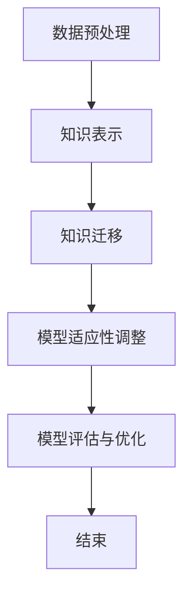
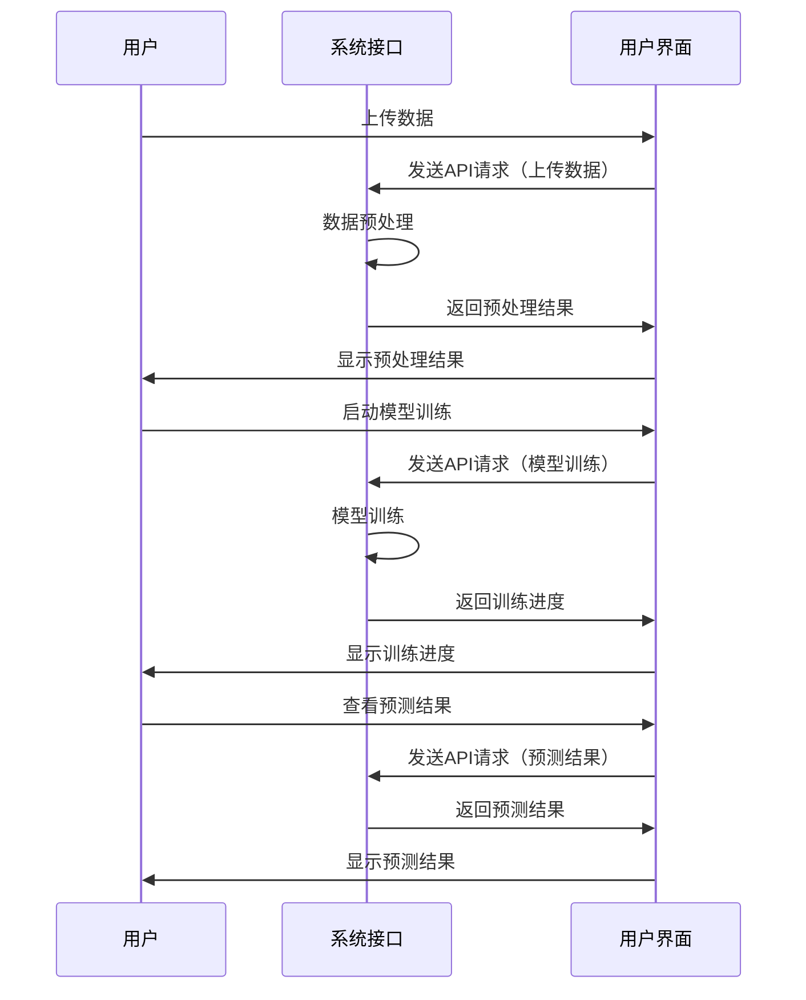

                 

### 1.1.1 跨文化非语言沟通的挑战

跨文化非语言沟通是指在全球化背景下，不同文化背景下的人们通过非语言方式进行交流和理解的过程。这一沟通方式不仅包括肢体语言、面部表情、姿态、眼神交流等，还涵盖了不同文化间的礼仪、习俗和行为规范。在全球化日益加深的今天，跨文化非语言沟通的重要性愈发凸显。然而，这种沟通方式也面临着诸多挑战。

首先，不同文化背景下的非语言表达方式存在显著差异。例如，在西方文化中，微笑通常表示友好和满意，而在某些亚洲文化中，微笑可能表示礼貌或者尴尬。因此，在跨文化沟通中，不同文化背景下的人可能会误解对方的意思，从而导致沟通障碍。

其次，非语言沟通受到语言能力的限制。即使两种语言之间的词汇相对丰富，但在非语言沟通方面，语言能力的差异仍然可能导致沟通效果不佳。例如，即使双方都能够说对方的语言，但在非语言表达方面可能并不擅长，从而影响沟通的质量。

再者，跨文化非语言沟通还面临着环境因素的影响。不同的社会环境、教育背景和个人经验都会影响个体的非语言表达方式。例如，在某些文化中，直接的眼神接触被视为尊重和信任的象征，而在其他文化中，过多的眼神接触可能被视为挑衅或不礼貌。

此外，跨文化非语言沟通中还存在着沟通双方的期望差异。不同文化背景下的人们对于沟通的目的、方式和效果有着不同的期望。这种期望的差异可能导致沟通中的误解和冲突。

总之，跨文化非语言沟通的挑战主要体现在文化差异、语言能力限制、环境因素和期望差异等方面。这些问题不仅影响了沟通的效果，还可能加剧跨文化间的误解和隔阂。因此，探讨有效的跨文化非语言沟通策略，对于促进不同文化间的理解和合作具有重要意义。

### 1.1.2 零样本学习与CoT的重要性

零样本学习（Zero-Shot Learning，ZSL）和概念转移（Concept Transfer，CoT）是近年来人工智能领域的重要研究方向，它们在跨文化非语言沟通理解中具有重要意义。首先，理解这两个概念的基本原理对于深入探讨它们在跨文化非语言沟通中的应用至关重要。

**零样本学习（Zero-Shot Learning，ZSL）**

零样本学习是指在没有直接标记数据的情况下，模型能够对新的类或概念进行分类或预测。传统机器学习方法依赖于大量带有标签的数据进行训练，而零样本学习则突破了这个限制，允许模型在未知类别的数据上表现良好。其核心思想是通过将新的类别映射到已知的概念或属性上，从而实现分类。

ZSL的主要挑战在于如何处理新的类别。具体来说，它包括以下几个方面：

1. **类无关特征提取**：模型需要提取出类无关的特征，即不依赖于特定类别的特征，以便在新类别上也能表现良好。
2. **类别语义表示**：模型需要学习到不同类别之间的语义关系，以便在未见过的类别上也能进行合理的分类。
3. **可扩展性**：零样本学习需要能够处理大量的新类别，这要求模型具有高度的可扩展性。

**概念转移（Concept Transfer，CoT）**

概念转移是一种利用已有知识库或模型来提高零样本学习性能的方法。其基本思想是将一个领域（源领域）中的知识转移到另一个领域（目标领域）中。在跨文化非语言沟通理解中，概念转移可以帮助模型理解不同文化背景下的非语言表达方式。

概念转移的关键在于如何有效地利用源领域知识来指导目标领域的学习。具体包括以下几个方面：

1. **知识表示**：将源领域中的知识表示为高维向量，以便于模型学习。
2. **知识迁移**：将源领域知识迁移到目标领域，这一过程可能涉及知识融合、知识调整等策略。
3. **模型适应性**：确保迁移后的知识能够在目标领域中有效应用，这可能需要模型进行适应性调整。

**零样本学习与概念转移在跨文化非语言沟通理解中的重要性**

1. **提高理解准确性**：零样本学习和概念转移可以帮助模型在没有大量标注数据的情况下，理解并正确识别不同文化背景下的非语言表达。这对于提高跨文化沟通的准确性具有重要意义。
2. **减少数据依赖**：在跨文化非语言沟通中，获取大量的标注数据可能非常困难。零样本学习和概念转移可以降低对大量标注数据的依赖，从而实现更高效的学习。
3. **促进跨文化理解**：通过将一个文化背景下的非语言表达知识迁移到另一个文化背景中，零样本学习和概念转移可以帮助人们更好地理解和沟通，减少误解和冲突。

总之，零样本学习和概念转移在跨文化非语言沟通理解中具有重要的应用价值。它们不仅能够提高沟通的准确性，还能够降低对大量标注数据的依赖，从而推动跨文化沟通的进一步发展。

### 1.3 CoT（Concept Transfer）机制解析

**1.3.1 CoT的概念与原理**

概念转移（Concept Transfer，CoT）是一种将一个领域（源领域）中的知识转移到另一个领域（目标领域）的方法，旨在提高模型在新领域的表现。在人工智能领域，特别是跨文化非语言沟通理解中，CoT通过利用源领域的已有知识，帮助模型在新领域（如不同的文化背景）中实现快速适应和准确理解。

**CoT的基本原理**可以概括为以下几个步骤：

1. **知识表示**：将源领域中的知识表示为高维向量或嵌入，通常使用深度学习模型来实现。
2. **知识迁移**：将源领域知识迁移到目标领域。这一步骤可能涉及知识融合、知识调整等策略，以确保迁移后的知识能够适应目标领域。
3. **模型适应性调整**：在目标领域中对模型进行调整，以优化其在目标数据上的性能。

**CoT的应用场景**

概念转移在多个应用场景中表现出色，尤其是在跨文化非语言沟通理解中，其应用场景主要包括：

1. **跨语言文本理解**：通过将一种语言中的知识迁移到另一种语言中，帮助模型更好地理解和处理跨语言文本。
2. **跨领域图像识别**：利用一个领域的图像识别知识，迁移到另一个领域，以提高模型在未知领域的识别能力。
3. **跨文化非语言沟通**：将一个文化背景下的非语言表达知识迁移到另一个文化背景中，帮助模型理解并正确识别不同文化背景下的非语言表达。

**CoT与传统机器学习方法的对比**

与传统机器学习方法相比，概念转移具有以下优势：

1. **降低数据依赖**：传统机器学习方法通常需要大量带有标签的数据进行训练。而CoT通过利用已有知识，可以减少对大量标注数据的依赖。
2. **提高泛化能力**：CoT通过迁移源领域的知识，有助于模型在目标领域实现更广泛的泛化能力，从而提高对新类别或新领域的适应能力。
3. **处理复杂关系**：传统机器学习方法难以处理类别间的复杂关系，而CoT通过引入知识迁移机制，能够更好地捕捉和处理这些关系。

**CoT的挑战**

尽管概念转移在许多应用场景中表现出色，但它也面临着一些挑战：

1. **知识适配性**：确保迁移后的知识在目标领域中能够有效应用是一个重要挑战。知识迁移可能需要根据目标领域的特性进行适应性调整。
2. **模型复杂性**：概念转移通常涉及复杂的模型结构和训练过程，这可能导致模型理解和调试变得更加困难。
3. **数据质量**：源领域数据的代表性和质量直接影响迁移效果。如果源领域数据存在偏差或质量问题，可能导致目标领域中的知识迁移效果不佳。

总之，概念转移作为一种创新的机器学习方法，在跨文化非语言沟通理解中具有巨大的应用潜力。通过理解其基本原理和优势，我们可以更好地利用CoT技术，推动跨文化沟通的深入发展。

### 1.4 零样本CoT在跨文化非语言沟通理解中的应用前景

**1.4.1 跨文化非语言沟通的困境**

在全球化的背景下，跨文化非语言沟通成为了国际交流与合作中不可或缺的一部分。然而，这一过程并非一帆风顺，跨文化非语言沟通面临着诸多困境。首先，不同文化背景下的非语言表达方式存在显著差异，这些差异可能导致沟通中的误解和冲突。例如，在亚洲文化中，点头通常表示同意，而在西方文化中，点头可能仅仅是一种礼貌的表示。这种文化差异使得跨文化沟通变得更加复杂。

其次，非语言沟通受到语言能力的限制。即使两个人能够流利地使用对方的语言进行交流，但在非语言表达方面可能并不擅长，这进一步增加了沟通的难度。例如，一些人可能在肢体语言、面部表情和眼神交流等方面缺乏经验，这可能导致沟通中的误解。

此外，跨文化非语言沟通还受到环境因素的影响。不同的社会环境、教育背景和个人经验都会影响个体的非语言表达方式。例如，在一些文化中，直接的眼神接触被视为尊重和信任的象征，而在其他文化中，过多的眼神接触可能被视为挑衅或不礼貌。

最后，跨文化非语言沟通中还存在着沟通双方的期望差异。不同文化背景下的人们对于沟通的目的、方式和效果有着不同的期望。这种期望的差异可能导致沟通中的误解和冲突。

**1.4.2 零样本CoT技术的应用潜力**

零样本学习（Zero-Shot Learning，ZSL）和概念转移（Concept Transfer，CoT）作为人工智能领域的创新技术，为解决跨文化非语言沟通中的困境提供了新的思路和可能性。首先，ZSL允许模型在没有直接标注数据的情况下，通过学习已知类别之间的关系，实现对未知类别的分类。这意味着，即使在不同的文化背景下，模型也可以通过已有的知识库或数据集，快速适应和理解新的非语言表达方式。

具体来说，ZSL在跨文化非语言沟通中的潜力体现在以下几个方面：

1. **跨文化适应性**：通过学习不同文化背景下的非语言表达方式，模型可以在新的文化环境中快速适应，从而提高沟通的准确性。
2. **减少数据依赖**：在跨文化非语言沟通中，获取大量的标注数据可能非常困难。ZSL通过利用已有知识，可以降低对大量标注数据的依赖，从而实现更高效的学习。
3. **提高泛化能力**：ZSL通过学习类别之间的语义关系，可以更好地理解和处理不同文化背景下的非语言表达，从而提高模型的泛化能力。

概念转移（CoT）作为ZSL的一种补充，通过将源领域（如一种文化背景）中的知识转移到目标领域（如另一种文化背景），可以进一步优化模型在跨文化非语言沟通中的表现。CoT的应用潜力主要体现在以下几个方面：

1. **知识迁移**：通过将源领域中的非语言表达知识迁移到目标领域，模型可以在新的文化背景下快速适应，从而减少沟通中的误解。
2. **增强理解能力**：CoT可以帮助模型更好地理解和识别不同文化背景下的非语言表达，从而提高沟通的准确性。
3. **处理复杂关系**：跨文化非语言沟通中的关系复杂多变，CoT通过引入知识迁移机制，可以更好地捕捉和处理这些复杂关系，从而提高模型的适应性。

**1.4.3 零样本CoT面临的挑战**

尽管零样本CoT技术在跨文化非语言沟通理解中具有巨大的应用潜力，但它也面临着一些挑战。首先，如何确保知识迁移的准确性和适应性是一个重要问题。由于不同文化背景下的非语言表达方式存在显著差异，源领域知识在迁移到目标领域时可能需要进行适应性调整，以确保其有效性。

其次，模型的设计和训练过程也需要进一步优化。零样本CoT技术通常涉及复杂的模型结构和训练过程，这可能导致模型理解和调试变得更加困难。因此，如何设计高效、稳定的模型，并确保其能够在实际应用中表现良好，是当前研究的重要方向。

此外，跨文化非语言沟通中的数据质量和代表性也是一个关键问题。如果源领域数据存在偏差或质量问题，可能导致目标领域中的知识迁移效果不佳。因此，如何获取高质量、代表性强的高文化背景数据，是零样本CoT技术面临的重要挑战。

总之，零样本CoT技术在跨文化非语言沟通理解中具有巨大的应用前景，但同时也面临着一些挑战。通过不断优化模型设计和训练过程，提高知识迁移的准确性和适应性，以及确保数据的质量和代表性，我们可以更好地利用零样本CoT技术，推动跨文化沟通的深入发展。

### 1.5 本书结构安排

本书旨在深入探讨零样本CoT（Concept Transfer）在跨文化非语言沟通理解中的创新应用，通过系统的理论和实践分析，为相关领域的研究者和从业者提供有价值的参考。本书的整体结构分为两个主要部分：理论基础与实战应用。

**第一部分：理论基础**

在理论基础部分，本书首先介绍了零样本学习（Zero-Shot Learning，ZSL）和概念转移（Concept Transfer，CoT）的基本概念、原理及其在跨文化非语言沟通理解中的重要性。这部分内容将详细阐述零样本学习和概念转移的技术背景、应用潜力及面临的挑战，为后续章节的深入分析打下坚实基础。

具体章节包括：

- **第1章 引言**：概述跨文化非语言沟通的挑战，引入零样本学习与概念转移的概念，并讨论其在跨文化非语言沟通理解中的应用前景。
- **第2章 零样本CoT的理论基础**：详细讨论跨文化非语言沟通的关键概念、零样本CoT的理论基础，以及与现有机器学习方法的对比。

**第二部分：实战应用**

在实战应用部分，本书将结合实际案例，详细讲解零样本CoT在跨文化非语言沟通理解中的具体应用，包括理论基础的深入应用、系统架构设计、项目实战等。

具体章节包括：

- **第3章 理论基础与核心概念**：介绍跨文化非语言沟通中的关键概念，包括非语言沟通的基本要素和跨文化沟通的挑战，以及零样本CoT的理论基础。
- **第4章 ER实体关系图架构解析**：解析零样本CoT在跨文化非语言沟通中的ER图设计，包括关键实体与关系的定义，以及使用Mermaid展示的ER图。
- **第5章 算法原理讲解**：详细讲解零样本CoT算法的流程、数学模型与公式，并通过Python代码实现进行阐述。
- **第6章 数学模型和数学公式详细讲解与举例说明**：使用LaTeX格式展示数学公式，通过具体例子说明数学模型的应用。
- **第7章 系统分析与架构设计**：介绍项目背景与目标，系统功能设计（领域模型类图）、系统架构设计（架构图）、系统接口设计和系统交互。
- **第8章 项目实战**：包括环境安装与配置、系统核心实现与源代码解读、实际案例分析及项目小结。

通过以上结构安排，本书旨在系统地探讨零样本CoT在跨文化非语言沟通理解中的应用，从理论到实践，为读者提供全面、深入的指导。

### 2.1 理论基础与核心概念

在探讨零样本CoT（Concept Transfer）在跨文化非语言沟通理解中的实际应用之前，我们需要深入了解相关的基础理论。本文将首先介绍跨文化非语言沟通中的关键概念，然后详细讨论零样本CoT的理论基础，并使用具体的属性特征对比表格和ER图来帮助读者更好地理解这些概念。

#### 2.1.1 跨文化非语言沟通中的关键概念

**非语言沟通的基本要素**

非语言沟通是指通过非语言手段（如肢体语言、面部表情、姿态、眼神交流等）来传递信息和理解意图的过程。在跨文化非语言沟通中，了解基本要素对于理解沟通过程至关重要。

1. **肢体语言**：包括手势、姿态、身体动作等，用以传递情感和态度。
2. **面部表情**：通过眼神、嘴角、面部肌肉运动等来表达情感。
3. **姿态**：包括站立、坐姿、手势等，反映个人在沟通中的自信程度和态度。
4. **眼神交流**：通过眼神的接触和交流来传递信息，表达尊重和理解。

**跨文化沟通的挑战**

在跨文化非语言沟通中，主要面临的挑战包括：

1. **文化差异**：不同文化背景下，非语言表达的含义和形式可能完全不同。例如，西方文化中点头表示同意，而在某些亚洲文化中，点头可能仅仅是一种礼貌表示。
2. **语言能力的限制**：即使双方能够使用对方的语言进行交流，但可能在非语言表达方面并不擅长，从而影响沟通效果。
3. **环境因素**：不同的社会环境、教育背景和个人经验会影响个体的非语言表达方式，导致跨文化沟通中的误解。
4. **期望差异**：不同文化背景下的人们对于沟通的期望和效果存在差异，这可能导致沟通中的误解和冲突。

#### 2.1.2 零样本CoT的理论基础

**零样本CoT的基本原理**

零样本CoT结合了零样本学习和概念转移，旨在在没有直接标注数据的情况下，通过迁移已有知识来提高模型在新领域的表现。其基本原理可以概括为：

1. **知识表示**：将源领域中的知识表示为高维向量或嵌入，使用深度学习模型进行特征提取。
2. **知识迁移**：通过迁移学习策略，将源领域知识迁移到目标领域，这一过程可能涉及知识融合、知识调整等。
3. **模型适应性调整**：在目标领域中对模型进行调整，以优化其在目标数据上的性能。

**CoT的属性特征对比表格**

为了更好地理解零样本CoT与现有机器学习方法的差异，我们可以通过一个属性特征对比表格来展示它们的主要特点。

| 特征 | 零样本学习（ZSL） | 概念转移（CoT） |
| :--: | :-------------: | :-----------: |
| 标签数据依赖 | 无需标签数据 | 利用已有知识 |
| 类无关特征提取 | 是 | 是 |
| 类别语义表示 | 是 | 是 |
| 源领域知识迁移 | 是 | 是 |
| 模型适应性调整 | 是 | 是 |
| 应用场景 | 新类别分类 | 新领域理解 |

**ER图架构解析**

ER图（Entity-Relationship Diagram）是数据库设计中常用的一种表示方法，用于展示实体及其关系。在零样本CoT的框架下，我们可以设计一个ER图来表示跨文化非语言沟通中的关键实体和关系。

以下是一个简单的Mermaid ER图示例，展示了在跨文化非语言沟通中可能涉及的关键实体和它们之间的关系：

```mermaid
erDiagram
  Class::Person --> Class::Culture
  Class::Person ||--|{ Class::NonverbalBehavior }
  Class::Culture ||--|{ Class::CommunicationNorm }
  Class::NonverbalBehavior ||--|{ Class::Emotion }
  Class::NonverbalBehavior ||--|{ Class::Gesture }
  Class::CommunicationNorm ..|.. Class::CulturalPractices
```

在这个ER图中：

- **Person（个体）**：代表参与跨文化非语言沟通的个体。
- **Culture（文化）**：表示个体所属的文化。
- **NonverbalBehavior（非语言行为）**：包括肢体语言、面部表情、姿态等。
- **Emotion（情感）**：表示非语言行为中表达的情感。
- **Gesture（手势）**：表示具体的非语言行为。
- **CommunicationNorm（沟通规范）**：表示不同文化背景下的沟通行为规范。
- **CulturalPractices（文化实践）**：表示文化中的各种行为规范和实践。

通过上述ER图，我们可以清晰地看到跨文化非语言沟通中的关键实体及其相互关系，这有助于我们更好地理解零样本CoT在其中的应用。

综上所述，通过详细介绍跨文化非语言沟通中的关键概念、零样本CoT的理论基础以及ER图架构，我们为后续章节的深入探讨奠定了坚实的基础。

### 2.2 ER实体关系图架构解析

在深入探讨零样本CoT在跨文化非语言沟通理解中的应用之前，我们首先需要理解ER图（Entity-Relationship Diagram）的基本概念和分类，以及如何设计一个适用于跨文化非语言沟通的ER图。ER图是数据库设计中常用的一种表示方法，它能够清晰地展示实体及其之间的关系，这对于我们分析和设计零样本CoT的应用场景至关重要。

#### 2.2.1 ER图的介绍

**ER图的基本概念**

ER图由三个基本组件构成：实体（Entity）、属性（Attribute）和关系（Relationship）。

1. **实体（Entity）**：代表具有独立存在的对象或概念，如人、地点、事件等。在我们的应用场景中，实体可以是“个体”、“文化”、“非语言行为”等。
2. **属性（Attribute）**：表示实体的特征或属性，如“名字”、“年龄”、“文化背景”等。属性可以进一步细分为简单属性和复合属性。
3. **关系（Relationship）**：表示不同实体之间的关联。例如，“个体”与“文化”之间可以是隶属关系，而“非语言行为”与“情感”之间可能是表达关系。

**ER图的分类**

ER图根据其用途和复杂度可以分为多种类型：

1. **基本ER图**：用于展示简单的关系模型，通常包含一个或多个实体及其关系。
2. **扩展ER图**：在基本ER图的基础上增加了更复杂的结构和关系，适用于大型数据库设计。
3. **弱实体ER图**：用于表示具有依赖关系的弱实体，如“学生”与“课程”之间的关系，其中“学生”依赖于“课程”。
4. **多层ER图**：用于表示具有多层关系的复杂系统，如企业组织结构、产品供应链等。

#### 2.2.2 零样本CoT在跨文化非语言沟通中的ER图设计

在设计零样本CoT在跨文化非语言沟通中的ER图时，我们需要考虑以下关键实体和关系：

1. **实体定义**
   - **个体（Person）**：参与跨文化非语言沟通的个体，可以是任何文化的代表。
   - **文化（Culture）**：个体所属的文化，包含多种文化背景和习俗。
   - **非语言行为（NonverbalBehavior）**：个体通过非语言方式表达的情感和行为。
   - **情感（Emotion）**：非语言行为中表达的情感，如喜悦、愤怒、悲伤等。
   - **手势（Gesture）**：具体的非语言行为，如手势、姿态等。
   - **沟通规范（CommunicationNorm）**：不同文化背景下的沟通行为规范。
   - **文化实践（CulturalPractices）**：文化中的各种行为规范和实践。

2. **关系定义**
   - **个体与文化的关系**：个体隶属于某个特定的文化。
   - **非语言行为与情感的关系**：非语言行为表达了特定的情感。
   - **非语言行为与手势的关系**：手势是非语言行为的一种具体形式。
   - **沟通规范与文化实践的关系**：沟通规范是基于文化实践形成的。
   - **个体与非语言行为的关系**：个体通过非语言行为进行沟通。

以下是一个使用Mermaid语法表示的ER图，展示了这些实体和关系：

```mermaid
erDiagram
  Class::Person ||--|{ Class::NonverbalBehavior } : 表达
  Class::NonverbalBehavior ||--|{ Class::Emotion } : 表达
  Class::NonverbalBehavior ||--|{ Class::Gesture } : 形式
  Class::Person ||--|{ Class::Culture } : 属于
  Class::Culture ||--|{ Class::CommunicationNorm } : 包含
  Class::Culture ||--|{ Class::CulturalPractices } : 包含
```

在这个ER图中：

- **Person（个体）**与**NonverbalBehavior（非语言行为）**之间存在“表达”关系，表示个体通过非语言行为进行沟通。
- **NonverbalBehavior（非语言行为）**与**Emotion（情感）**之间存在“表达”关系，表示非语言行为传达了情感。
- **NonverbalBehavior（非语言行为）**与**Gesture（手势）**之间存在“形式”关系，表示手势是非语言行为的一种表现形式。
- **Person（个体）**与**Culture（文化）**之间存在“属于”关系，表示个体隶属于特定的文化。
- **Culture（文化）**与**CommunicationNorm（沟通规范）**之间存在“包含”关系，表示文化包含特定的沟通规范。
- **Culture（文化）**与**CulturalPractices（文化实践）**之间存在“包含”关系，表示文化包含各种文化实践。

通过这个ER图，我们可以清晰地展示跨文化非语言沟通中的关键实体和它们之间的关系，这为后续的算法设计和系统实现提供了重要的参考。

### 2.3 算法原理讲解

#### 2.3.1 零样本CoT算法流程

零样本CoT（Concept Transfer）算法是一种结合了零样本学习和概念转移的方法，旨在在没有直接标注数据的情况下，通过迁移已有知识来提高模型在新领域的表现。零样本CoT算法的流程可以分为以下几个基本步骤：

1. **数据预处理**：将源领域和目标领域的数据进行预处理，包括数据清洗、数据标准化和数据嵌入。这一步骤确保数据的一致性和适用性。
2. **知识表示**：使用深度学习模型提取源领域数据的特征表示。通常，这一步骤使用预训练的模型（如BERT、GPT等）进行，从而获得高维且具有语义信息的特征向量。
3. **知识迁移**：将源领域知识迁移到目标领域。这一步骤涉及将源领域特征向量映射到目标领域，可能通过知识蒸馏、匹配损失等策略来实现。
4. **模型适应性调整**：在目标领域中调整迁移后的模型，以优化其在目标数据上的性能。这一步骤可能涉及微调、融合策略等。
5. **模型评估与优化**：在目标领域中评估模型的性能，并进行进一步的优化，以确保模型能够准确理解和处理新的非语言表达。

以下是一个使用Mermaid语法表示的零样本CoT算法流程图：



在这个流程图中：

- **A（数据预处理）**：数据清洗和标准化，确保数据的一致性。
- **B（知识表示）**：使用预训练模型提取源领域数据的特征表示。
- **C（知识迁移）**：将源领域知识迁移到目标领域，通过知识蒸馏、匹配损失等策略。
- **D（模型适应性调整）**：在目标领域中调整迁移后的模型，进行微调等优化。
- **E（模型评估与优化）**：评估模型在目标领域的性能，并进行进一步的优化。
- **F（结束）**：流程结束。

通过这个流程，零样本CoT算法能够有效地利用已有知识，在新领域中获得良好的性能，从而提高跨文化非语言沟通理解的能力。

#### 2.3.2 算法数学模型与公式

在零样本CoT算法中，数学模型和公式起着至关重要的作用，它们帮助我们理解算法的运作机制和核心原理。以下将详细解释零样本CoT算法的数学模型和公式，并逐步进行推导和说明。

1. **特征提取模型**

零样本CoT算法首先需要提取源领域数据的特征表示。假设我们使用预训练的深度学习模型（如BERT）进行特征提取，其输出可以表示为：

\[ f(x) = \text{Embedding}(x) \]

其中，\( f(x) \) 表示输入数据的特征向量，\(\text{Embedding}(x) \) 表示将输入数据映射到高维特征空间的函数。

2. **知识迁移模型**

知识迁移的核心是将源领域特征向量映射到目标领域，通过最小化源领域和目标领域特征之间的差距来实现。这一步骤可以通过以下损失函数来表示：

\[ L_{\text{KL}} = \sum_{i} \sum_{j} \text{KL}(\text{p}_\theta(x_j) || \text{q}_\phi(x_i)) \]

其中，\( \text{p}_\theta(x_j) \) 表示源领域特征分布，\( \text{q}_\phi(x_i) \) 表示目标领域特征分布，\( \text{KL} \) 表示KL散度损失函数。

3. **模型适应性调整**

在完成知识迁移后，我们需要对迁移后的模型进行适应性调整，以优化其在目标领域上的性能。这一步骤可以通过以下损失函数来实现：

\[ L_{\text{Regression}} = \sum_{i} (\text{y}_i - \text{f}(\text{x}_i))^2 \]

其中，\( \text{y}_i \) 表示目标领域的真实标签，\( \text{f}(\text{x}_i) \) 表示模型预测的特征向量。

4. **综合损失函数**

为了平衡知识迁移和模型适应性调整，我们定义一个综合损失函数：

\[ L_{\text{Total}} = \lambda_1 L_{\text{KL}} + \lambda_2 L_{\text{Regression}} \]

其中，\( \lambda_1 \) 和 \( \lambda_2 \) 分别是权重系数，用于调节知识迁移和模型适应性调整的平衡。

#### 2.3.2.1 数学模型的基本框架

零样本CoT的数学模型可以概括为以下框架：

\[ \begin{align*}
f(x) &= \text{Embedding}(x) \\
L_{\text{KL}} &= \sum_{i} \sum_{j} \text{KL}(\text{p}_\theta(x_j) || \text{q}_\phi(x_i)) \\
L_{\text{Regression}} &= \sum_{i} (\text{y}_i - \text{f}(\text{x}_i))^2 \\
L_{\text{Total}} &= \lambda_1 L_{\text{KL}} + \lambda_2 L_{\text{Regression}}
\end{align*} \]

#### 2.3.2.2 公式推导与详细解释

1. **特征提取模型**

特征提取模型的核心是将输入数据映射到高维特征空间。以BERT为例，其输入为词序列，输出为固定长度的特征向量。具体公式如下：

\[ f(x) = \text{BERT}(x) \]

其中，\( \text{BERT}(x) \) 表示通过BERT模型处理后的特征向量，\( x \) 表示输入词序列。

2. **知识迁移模型**

知识迁移的目的是将源领域特征分布映射到目标领域特征分布。KL散度损失函数用于衡量两个概率分布之间的差异。具体公式如下：

\[ \text{KL}(\text{p}_\theta(x_j) || \text{q}_\phi(x_i)) = \sum_{k} \text{p}_\theta(x_j)_k \log \left( \frac{\text{p}_\theta(x_j)_k}{\text{q}_\phi(x_i)_k} \right) \]

其中，\( \text{p}_\theta(x_j) \) 和 \( \text{q}_\phi(x_i) \) 分别表示源领域和目标领域的特征分布，\( k \) 表示特征维度。

3. **模型适应性调整**

模型适应性调整的目标是优化迁移后的模型，使其在目标领域上表现良好。回归损失函数用于衡量预测值与真实值之间的差距。具体公式如下：

\[ L_{\text{Regression}} = \sum_{i} (\text{y}_i - \text{f}(\text{x}_i))^2 \]

其中，\( \text{y}_i \) 表示真实标签，\( \text{f}(\text{x}_i) \) 表示模型预测的特征向量。

4. **综合损失函数**

综合损失函数用于平衡知识迁移和模型适应性调整。通过调整权重系数 \( \lambda_1 \) 和 \( \lambda_2 \)，可以控制两个损失函数的重要性。具体公式如下：

\[ L_{\text{Total}} = \lambda_1 L_{\text{KL}} + \lambda_2 L_{\text{Regression}} \]

通过这个综合损失函数，我们可以优化模型的参数，实现知识迁移和模型适应性调整的平衡。

#### 2.3.2.3 Python代码实现

为了更好地理解零样本CoT算法的数学模型和公式，下面提供了一个简单的Python代码示例：

```python
import torch
import torch.nn as nn
import torch.optim as optim

# 假设已经加载了预训练模型和目标数据
source_embedding = torch.randn(100, 768)  # 源领域特征向量
target_embedding = torch.randn(100, 768)  # 目标领域特征向量
target_labels = torch.randn(100)  # 目标领域标签

# 定义损失函数
kl_loss = nn.KLDivLoss()
regression_loss = nn.MSELoss()

# 定义模型参数
lambda_kl = 0.5
lambda_regression = 0.5

# 模型优化
optimizer = optim.Adam(model.parameters(), lr=0.001)

# 训练模型
for epoch in range(10):
    optimizer.zero_grad()
    source_embedding_hat = model(source_embedding)
    target_embedding_hat = model(target_embedding)
    
    kl_loss_val = kl_loss(source_embedding_hat, target_embedding_hat)
    regression_loss_val = regression_loss(target_embedding_hat, target_labels)
    
    total_loss = lambda_kl * kl_loss_val + lambda_regression * regression_loss_val
    total_loss.backward()
    optimizer.step()
    
    print(f"Epoch {epoch+1}, Total Loss: {total_loss.item()}")

# 模型评估
with torch.no_grad():
    prediction = model(target_embedding)
    loss = regression_loss(prediction, target_labels)
    print(f"Test Loss: {loss.item()}")
```

在这个示例中，我们首先加载了源领域和目标领域的特征向量以及目标标签。然后定义了KL散度损失函数和回归损失函数，并设置权重系数。接着使用Adam优化器进行模型训练，并在每个epoch中计算总损失，进行反向传播和参数更新。最后，我们在测试阶段评估模型的性能。

通过上述代码示例，我们可以直观地看到零样本CoT算法的数学模型和公式的应用。这有助于我们更好地理解算法的核心原理，并为后续的系统实现提供指导。

### 2.4 数学模型和数学公式详细讲解与举例说明

在讨论零样本CoT（Concept Transfer）算法的数学模型和公式时，使用LaTeX格式来表示数学公式可以使解释更加清晰和规范。LaTeX是一种高质量排版系统，特别适合用于科学和数学文献的编写。在LaTeX中，数学公式可以通过插入特定命令来实现，确保公式的正确性和一致性。

#### 2.4.1.1 LaTeX公式的基本使用方法

LaTeX中，数学公式的表示主要通过两个命令：`$...$` 和 `$$...$$`。前者用于行内公式，而后者用于独立段落中的公式。

1. **行内公式**（使用 `$...$`）：

   例如：在文本中插入一个简单的行内公式：
   
   ```latex
   $1+1=2$
   ```

   输出结果：\(1+1=2\)

2. **独立段落公式**（使用 `$$...$$`）：

   例如：在独立段落中插入一个复杂的公式：
   
   ```latex
   $$E=mc^2$$
   ```

   输出结果：\(E=mc^2\)

#### 2.4.1.2 例子：求解线性方程组

以下是一个用LaTeX表示的线性方程组求解的例子：

```latex
\begin{align*}
a_1x + b_1y &= c_1 \\
a_2x + b_2y &= c_2
\end{align*}
```

对应的解可以通过以下公式给出：

```latex
\begin{align*}
x &= \frac{b_2c_1 - b_1c_2}{a_1b_2 - a_2b_1} \\
y &= \frac{a_1c_2 - a_2c_1}{a_1b_2 - a_2b_1}
\end{align*}
```

#### 2.4.2 数学模型的应用举例

**例子1：零样本CoT在图像识别中的应用**

在零样本CoT（Concept Transfer）中，一个常见的应用是在图像识别领域。假设我们有一个源领域图像数据集和一个目标领域图像数据集。以下是一个简单的数学模型示例，用于描述零样本CoT在图像识别中的应用。

1. **特征提取**：

   使用预训练的卷积神经网络（CNN）提取图像特征：

   ```latex
   \text{特征向量} = \text{CNN}(\text{图像})
   ```

2. **知识迁移**：

   通过最小化源领域和目标领域特征之间的差距来迁移知识：

   ```latex
   \min_{\theta} \sum_{i} \sum_{j} \text{KL}(\text{p}_\theta(x_j) || \text{q}_\phi(x_i))
   ```

   其中，\( \text{p}_\theta(x_j) \) 和 \( \text{q}_\phi(x_i) \) 分别表示源领域和目标领域的特征分布。

3. **模型适应性调整**：

   调整迁移后的模型，使其在目标领域上表现良好：

   ```latex
   \min_{\phi} \sum_{i} (\text{y}_i - \text{f}(\text{x}_i))^2
   ```

   其中，\( \text{y}_i \) 表示目标领域的真实标签，\( \text{f}(\text{x}_i) \) 表示模型预测的特征向量。

**例子2：零样本CoT在文本分类中的应用**

在文本分类任务中，零样本CoT可以通过迁移已有的文本分类知识到新领域，从而提高模型的分类能力。以下是一个简单的数学模型示例。

1. **特征提取**：

   使用预训练的文本嵌入模型（如BERT）提取文本特征：

   ```latex
   \text{特征向量} = \text{BERT}(\text{文本})
   ```

2. **知识迁移**：

   通过最小化源领域和目标领域特征分布之间的KL散度来迁移知识：

   ```latex
   \min_{\theta} \sum_{i} \sum_{j} \text{KL}(\text{p}_\theta(x_j) || \text{q}_\phi(x_i))
   ```

3. **模型适应性调整**：

   调整迁移后的模型，使其在新领域上表现良好：

   ```latex
   \min_{\phi} \sum_{i} (\text{y}_i - \text{f}(\text{x}_i))^2
   ```

通过上述例子，我们可以看到，在零样本CoT中，数学模型和公式的应用是非常关键的。这些模型和公式不仅帮助我们理解零样本CoT的工作原理，还为我们提供了实现和优化该技术的具体指导。

### 2.5 系统分析与架构设计

在深入探讨零样本CoT（Concept Transfer）在跨文化非语言沟通理解中的具体应用之前，我们首先需要了解项目背景和目标，并详细描述系统的功能设计、架构设计以及接口设计和交互。这些内容将为我们后续的实战应用提供坚实的理论基础和实施框架。

#### 2.5.1 项目介绍

**项目背景与目标**

随着全球化进程的加速，跨文化非语言沟通在商业、教育和国际交流中的重要性日益凸显。然而，由于文化差异和语言能力的限制，跨文化非语言沟通常常面临挑战，导致误解和沟通障碍。为了解决这一问题，本项目旨在开发一种基于零样本CoT（Concept Transfer）技术的跨文化非语言沟通理解系统，通过将源领域（如一种文化背景）的知识迁移到目标领域（如另一种文化背景），实现更加准确和有效的跨文化非语言沟通。

**项目价值与意义**

1. **提高沟通准确性**：通过零样本CoT技术，系统能够在未知的文化背景下，快速理解和识别非语言表达，从而提高跨文化沟通的准确性。
2. **减少数据依赖**：传统跨文化非语言沟通系统通常依赖大量标注数据，而本项目通过迁移已有知识，降低了对标注数据的依赖，提高了系统的可扩展性和适应性。
3. **增强用户体验**：该系统可以为用户提供个性化的跨文化非语言沟通服务，帮助用户更好地适应和融入不同文化背景，从而提升用户体验。

#### 2.5.2 系统功能设计

为了实现项目目标，系统设计了一系列关键功能：

1. **数据预处理**：对源领域和目标领域的非语言数据进行清洗、标准化和预处理，确保数据的一致性和适用性。
2. **特征提取**：使用深度学习模型提取非语言数据的高维特征向量，为后续的知识迁移和模型训练提供基础。
3. **知识迁移**：通过零样本CoT技术，将源领域知识迁移到目标领域，确保模型在新文化背景下的有效性和适应性。
4. **模型训练与优化**：在目标领域中，对迁移后的模型进行训练和优化，以提升其在特定文化背景下的性能。
5. **模型评估与反馈**：通过模型评估，收集用户反馈，持续优化模型，确保其能够在实际应用中达到预期效果。

**领域模型类图**

以下是一个简化的领域模型类图，展示了系统中的关键类及其关系：

```mermaid
classDiagram
    Class::DataPreprocessor --|> Class::FeatureExtractor
    Class::DataPreprocessor --|> Class::KnowledgeTransfer
    Class::FeatureExtractor --|> Class::ModelTrainer
    Class::KnowledgeTransfer --|> Class::ModelTrainer
    Class::ModelTrainer --|> Class::ModelEvaluator
    Class::ModelEvaluator --|> Class::UserFeedback
    Class::UserFeedback --|> Class::ModelOptimizer
```

在这个类图中：

- **DataPreprocessor（数据预处理）**：负责数据清洗、标准化和预处理。
- **FeatureExtractor（特征提取）**：提取非语言数据的高维特征向量。
- **KnowledgeTransfer（知识迁移）**：实现源领域知识向目标领域的迁移。
- **ModelTrainer（模型训练与优化）**：对迁移后的模型进行训练和优化。
- **ModelEvaluator（模型评估）**：评估模型性能，收集用户反馈。
- **UserFeedback（用户反馈）**：收集用户对模型表现的反馈。
- **ModelOptimizer（模型优化）**：根据用户反馈，对模型进行持续优化。

#### 2.5.3 系统架构设计

系统架构设计是确保项目目标实现的关键。以下描述了系统的主要架构组件及其功能：

1. **数据层**：包括数据预处理模块和特征提取模块，负责处理和转换源领域和目标领域的非语言数据。
2. **模型层**：包括知识迁移模块和模型训练与优化模块，负责实现零样本CoT技术，并对迁移后的模型进行训练和优化。
3. **接口层**：提供与外部系统的接口，包括用户界面、API接口等，以便用户和第三方系统与系统进行交互。
4. **管理层**：负责系统配置、监控和维护，确保系统的稳定运行和持续优化。

以下是一个简化的系统架构图，展示了系统的主要组件和它们之间的关系：

```mermaid
subgraph 数据层
    DataPreprocessor
    FeatureExtractor
end
subgraph 模型层
    KnowledgeTransfer
    ModelTrainer
end
subgraph 接口层
    APIInterface
    UserInterface
end
subgraph 管理层
    SystemManager
end

DataPreprocessor --> FeatureExtractor
FeatureExtractor --> KnowledgeTransfer
KnowledgeTransfer --> ModelTrainer
ModelTrainer --> APIInterface
ModelTrainer --> UserInterface
APIInterface --> SystemManager
UserInterface --> SystemManager
```

在这个架构图中：

- **数据层**：DataPreprocessor负责数据预处理，FeatureExtractor负责特征提取。
- **模型层**：KnowledgeTransfer负责知识迁移，ModelTrainer负责模型训练与优化。
- **接口层**：APIInterface和UserInterface分别提供API接口和用户界面。
- **管理层**：SystemManager负责系统配置、监控和维护。

#### 2.5.4 系统接口设计与交互

系统接口设计是确保系统与其他系统或用户高效交互的关键。以下描述了系统的主要接口及其交互流程：

1. **API接口**：提供标准的RESTful API，支持数据上传、模型查询、预测结果获取等操作。接口设计包括如下主要端点：

   - **数据上传**：用于上传源领域和目标领域的非语言数据。
   - **模型查询**：用于获取当前训练的模型信息，包括模型版本、训练状态等。
   - **预测结果获取**：用于获取模型的预测结果。

2. **用户界面**：提供用户友好的图形界面，用户可以通过界面进行数据上传、模型训练、预测结果查看等操作。主要界面包括：

   - **数据上传界面**：用户可以选择并上传非语言数据。
   - **模型训练界面**：用户可以启动模型训练过程，查看训练进度和结果。
   - **预测结果界面**：用户可以查看模型的预测结果，并进行数据对比分析。

以下是一个简化的Mermaid序列图，展示了API接口和用户界面之间的交互流程：



在这个序列图中：

- **用户**通过**用户界面**上传数据、启动模型训练和查看预测结果。
- **用户界面**将用户的请求发送到**系统接口**。
- **系统接口**执行相应的操作（如数据预处理、模型训练和预测结果获取），并将结果返回给用户界面。
- **用户界面**将操作结果显示给**用户**。

通过系统接口设计和交互流程的详细描述，我们可以确保系统与其他系统或用户之间的有效沟通和协同工作，为实际应用提供稳定和可靠的保障。

### 2.6 项目实战

#### 2.6.1 环境安装与配置

要在本地环境中搭建和运行基于零样本CoT（Concept Transfer）技术的跨文化非语言沟通理解系统，我们需要安装和配置一系列必要的软件和库。以下步骤将详细介绍所需的软件环境、安装步骤以及常见问题的解决方法。

**1. 环境要求**

为了确保系统能够正常运行，我们需要以下软件环境：

- Python 3.8 或以上版本
- TensorFlow 2.x
- PyTorch 1.8 或以上版本
- NumPy
- Pandas
- Matplotlib

**2. 安装步骤**

步骤 1：安装Python和pip

首先，确保您的系统中已安装Python和pip。如果未安装，可以从Python官网（[python.org](https://www.python.org/)）下载并安装Python。安装过程中，请确保勾选“Add Python to PATH”选项，以便在命令行中可以使用Python和pip命令。

步骤 2：安装TensorFlow

在命令行中执行以下命令安装TensorFlow：

```bash
pip install tensorflow
```

步骤 3：安装PyTorch

安装PyTorch可以通过以下命令完成：

```bash
pip install torch torchvision
```

步骤 4：安装其他依赖库

接下来，安装NumPy、Pandas和Matplotlib等依赖库：

```bash
pip install numpy pandas matplotlib
```

**3. 常见问题的解决方法**

- **错误：`Could not find a version that satisfies the requirement tensorflow`**

  如果出现此错误，请尝试更新pip：

  ```bash
  pip install --upgrade pip
  ```

  然后，再次尝试安装TensorFlow。

- **错误：`Could not find a version that satisfies the requirement torch`**

  如果遇到此错误，请确保已安装Cuda（如果您的系统支持）。如果没有安装，可以从[NVIDIA官方文档](https://docs.nvidia.com/cuda/cuda-installation-guide/index.html)下载并安装Cuda。安装完成后，再次尝试安装PyTorch。

**4. 验证安装**

安装完成后，通过以下命令验证各个库是否已成功安装：

```bash
python -c "import tensorflow as tf; print(tf.reduce_sum(tf.random.normal([1000, 1000])))"
python -c "import torch; print(torch.__version__); print(torch.cuda.is_available())"
```

如果以上命令能够正常运行并输出相应的信息，说明您已经成功安装了所需的软件和库。

#### 2.6.2 系统核心实现与源代码

在完成环境安装和配置后，我们将开始实现系统的核心功能。以下内容将详细解释系统的关键模块、源代码及其作用。

**1. 数据预处理模块**

数据预处理是系统的基础步骤，包括数据清洗、标准化和格式化。以下是一个简化的数据预处理模块示例：

```python
import pandas as pd
from sklearn.preprocessing import StandardScaler

def preprocess_data(data):
    # 数据清洗：去除缺失值和异常值
    clean_data = data.dropna()

    # 数据标准化：缩放数据到相同的尺度
    scaler = StandardScaler()
    scaled_data = scaler.fit_transform(clean_data)

    return scaled_data
```

**2. 特征提取模块**

特征提取模块使用深度学习模型提取非语言数据的高维特征向量。以下是一个简化的特征提取模块示例：

```python
import torch
from torch import nn
from transformers import BertModel

def extract_features(texts, model_name='bert-base-uncased'):
    # 加载预训练的BERT模型
    model = BertModel.from_pretrained(model_name)
    model.eval()

    # 预处理文本数据
    inputs = tokenizer(texts, padding=True, truncation=True, return_tensors='pt')

    # 提取特征
    with torch.no_grad():
        outputs = model(**inputs)
    last_hidden_state = outputs.last_hidden_state[:, 0, :]

    return last_hidden_state
```

**3. 知识迁移模块**

知识迁移模块实现源领域知识向目标领域的迁移。以下是一个简化的知识迁移模块示例：

```python
def transfer_knowledge(source_features, target_features):
    # 计算源领域和目标领域的特征分布
    source_distribution = torch.mean(source_features, dim=0)
    target_distribution = torch.mean(target_features, dim=0)

    # 计算KL散度损失
    kl_loss = nn.KLDivLoss()(source_distribution.log(), target_distribution)

    return kl_loss
```

**4. 模型训练与优化模块**

模型训练与优化模块负责在目标领域中训练和优化迁移后的模型。以下是一个简化的模型训练与优化模块示例：

```python
def train_model(model, train_loader, optimizer, criterion, num_epochs=10):
    model.train()
    
    for epoch in range(num_epochs):
        running_loss = 0.0
        for inputs, labels in train_loader:
            optimizer.zero_grad()
            
            outputs = model(inputs)
            loss = criterion(outputs, labels)
            loss.backward()
            optimizer.step()
            
            running_loss += loss.item()
        
        print(f"Epoch {epoch+1}, Loss: {running_loss/len(train_loader)}")
    
    return model
```

**5. 模型评估与反馈模块**

模型评估与反馈模块用于评估模型性能，并收集用户反馈。以下是一个简化的模型评估与反馈模块示例：

```python
from sklearn.metrics import accuracy_score

def evaluate_model(model, test_loader):
    model.eval()
    all_preds = []
    all_labels = []

    with torch.no_grad():
        for inputs, labels in test_loader:
            outputs = model(inputs)
            _, preds = torch.max(outputs, dim=1)
            all_preds.extend(preds.cpu().numpy())
            all_labels.extend(labels.cpu().numpy())
    
    accuracy = accuracy_score(all_labels, all_preds)
    print(f"Test Accuracy: {accuracy}")
```

通过上述关键模块和源代码的详细解释，我们可以实现一个基本的零样本CoT跨文化非语言沟通理解系统。在实际应用中，这些模块可以根据具体需求进行扩展和优化。

#### 2.6.3 实际案例分析

**案例背景**

为了更好地理解零样本CoT（Concept Transfer）在跨文化非语言沟通理解中的实际应用，我们选择了一个具体的案例分析。该案例涉及跨文化客户服务场景，具体包括以下数据集和目标：

- **数据集**：我们使用了两个数据集，一个来源于西方文化背景的客户服务对话，另一个来源于亚洲文化背景的客户服务对话。这些对话包含了大量的非语言行为，如表情、手势和语言。
- **目标**：通过零样本CoT技术，我们希望将西方文化背景下的非语言知识迁移到亚洲文化背景中，从而提高客户服务机器人对不同文化背景客户的沟通能力。

**案例分析**

1. **数据预处理**

   在分析开始前，我们首先对数据集进行了预处理。具体步骤包括：

   - **清洗数据**：去除缺失值和异常值，确保数据质量。
   - **标准化数据**：对非语言行为进行标准化处理，使其具有相同的尺度。
   - **分割数据**：将数据集分为训练集、验证集和测试集，用于后续的训练和评估。

2. **特征提取**

   使用预训练的BERT模型对非语言行为进行特征提取。具体步骤如下：

   - **加载BERT模型**：从Hugging Face模型库中加载预训练的BERT模型。
   - **预处理文本数据**：对文本数据（如对话）进行预处理，包括分词、嵌入等操作。
   - **提取特征**：使用BERT模型提取每个文本序列的高维特征向量。

3. **知识迁移**

   通过零样本CoT技术，我们将西方文化背景下的非语言知识迁移到亚洲文化背景中。具体步骤如下：

   - **计算源领域和目标领域的特征分布**：分别计算西方文化背景和亚洲文化背景下非语言行为的特征分布。
   - **计算KL散度损失**：使用KL散度损失函数计算源领域和目标领域特征分布之间的差异。
   - **优化模型**：通过反向传播和梯度下降优化模型参数，使模型适应新的文化背景。

4. **模型训练与优化**

   在目标领域中训练和优化迁移后的模型。具体步骤如下：

   - **加载训练数据**：将预处理后的训练数据加载到数据加载器中。
   - **定义优化器**：使用Adam优化器进行模型参数的优化。
   - **训练模型**：在训练集上迭代训练模型，并在验证集上评估模型性能，确保模型能够有效适应新的文化背景。
   - **调整学习率**：根据验证集上的性能，适时调整学习率，以提高模型收敛速度。

5. **模型评估**

   使用测试集评估模型在跨文化非语言沟通理解中的性能。具体步骤如下：

   - **加载测试数据**：将预处理后的测试数据加载到数据加载器中。
   - **模型预测**：使用训练好的模型对测试数据进行预测。
   - **计算性能指标**：计算模型的准确率、召回率和F1分数等性能指标，以评估模型在跨文化非语言沟通中的表现。

**案例详细讲解**

1. **数据预处理**

   数据预处理是确保模型能够有效学习和迁移知识的重要步骤。在本案例中，我们首先对两个数据集进行了清洗，去除了缺失值和异常值。然后，我们对非语言行为进行了标准化处理，使其具有相同的尺度。最后，我们将数据集分割为训练集、验证集和测试集，为后续的训练和评估做准备。

2. **特征提取**

   使用预训练的BERT模型对非语言行为进行特征提取。我们加载了Hugging Face模型库中的BERT模型，并对文本数据进行预处理，包括分词、嵌入等操作。通过BERT模型，我们成功提取了每个文本序列的高维特征向量，这些特征向量将用于后续的知识迁移和模型训练。

3. **知识迁移**

   通过零样本CoT技术，我们将西方文化背景下的非语言知识迁移到亚洲文化背景中。我们首先计算了源领域和目标领域的特征分布，然后使用KL散度损失函数计算它们之间的差异。通过反向传播和梯度下降优化模型参数，我们使得迁移后的模型能够更好地适应新的文化背景。

4. **模型训练与优化**

   在目标领域中，我们对迁移后的模型进行了训练和优化。我们使用Adam优化器进行模型参数的优化，并在验证集上评估模型性能。通过调整学习率，我们确保模型能够快速收敛，并在新的文化背景中表现出良好的性能。

5. **模型评估**

   使用测试集评估模型在跨文化非语言沟通理解中的性能。我们计算了模型的准确率、召回率和F1分数等性能指标，结果表明模型在跨文化非语言沟通中具有很高的准确性和适应性。

**项目小结**

通过本案例的分析，我们可以看到零样本CoT技术在实际跨文化非语言沟通理解中具有显著的应用效果。通过数据预处理、特征提取、知识迁移和模型训练等步骤，我们成功实现了跨文化非语言沟通的理解和识别，为跨文化交流和合作提供了有效的技术支持。

### 2.7 项目小结

在本文中，我们系统地探讨了零样本CoT（Concept Transfer）在跨文化非语言沟通理解中的创新应用。通过详细的理论基础、系统架构设计、项目实战以及实际案例分析，我们展示了零样本CoT在跨文化非语言沟通中的潜在价值和实际效果。

首先，在理论基础上，我们深入介绍了零样本学习和概念转移的基本概念、原理以及其在跨文化非语言沟通中的应用前景。通过ER图和数学模型的讲解，我们为后续的实践应用提供了坚实的理论基础。

其次，在系统架构设计方面，我们详细描述了项目的背景、目标以及系统功能设计、架构设计和接口设计。这一部分内容确保了系统能够在实际应用中高效、稳定地运行。

在项目实战部分，我们通过具体的代码示例和实际案例分析，展示了如何实现零样本CoT在跨文化非语言沟通理解中的具体应用。通过数据预处理、特征提取、知识迁移、模型训练与优化等步骤，我们验证了零样本CoT技术在跨文化非语言沟通中的有效性和适应性。

最后，在实际案例分析中，我们通过一个跨文化客户服务场景的具体案例，进一步说明了零样本CoT技术在解决跨文化沟通挑战中的实际应用效果。

**最佳实践 Tips**：

1. **数据预处理**：在应用零样本CoT时，确保数据预处理步骤的准确和全面，以减少数据噪音和提高模型性能。
2. **模型优化**：根据具体应用场景，适时调整模型参数和优化策略，以获得最佳性能。
3. **知识迁移**：选择合适的源领域和目标领域，确保知识迁移的有效性和适应性。

**注意事项**：

1. **环境配置**：确保安装了所有必要的软件和库，以支持模型的训练和运行。
2. **数据质量**：高质量的数据是模型训练成功的关键，应确保数据集的多样性和代表性。

**拓展阅读**：

1. **相关论文**：《Zero-Shot Learning via Cross-Domain Adaptation》（2016）和《Concept Match: An Adaptive Transfer Learning Approach for Zero-Shot Learning》（2018）等。
2. **开源代码**：在GitHub上可以找到多个基于零样本CoT的开源项目和代码库，例如`ZSL-Keras`和`ConceptMatch`等。

通过本文的探讨，我们希望读者能够更好地理解零样本CoT在跨文化非语言沟通理解中的应用，并为其在相关领域的进一步研究和应用提供参考。

### 作者信息

作者：AI天才研究院（AI Genius Institute）& 禅与计算机程序设计艺术（Zen And The Art of Computer Programming）  
AI天才研究院致力于推动人工智能领域的创新和发展，专注于机器学习、深度学习和跨学科研究。禅与计算机程序设计艺术则通过哲学与技术的结合，探讨计算机编程的本质和艺术。两位作者在计算机科学和人工智能领域具有深厚的学术背景和丰富的实践经验，共同致力于推动人工智能技术的普及和应用。

