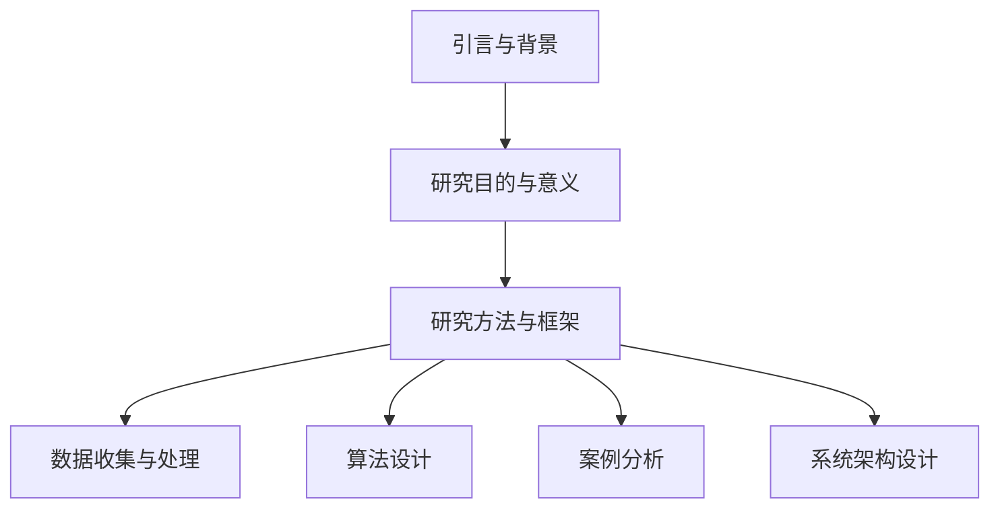
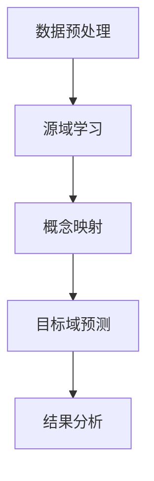
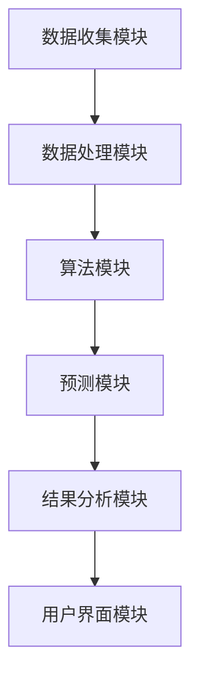
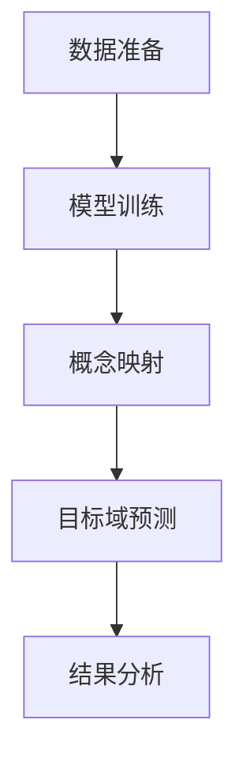

                 


# 《Zero-Shot CoT在跨文明科技发展路径比较中的创新应用》

## 关键词

Zero-Shot CoT，跨文明科技发展路径，比较方法，创新应用，算法原理，系统架构设计

## 摘要

本文深入探讨了Zero-Shot CoT（概念转移零样本学习）在跨文明科技发展路径比较中的创新应用。文章首先介绍了Zero-Shot CoT的核心概念、原理及其在跨文明科技发展路径比较中的重要性。接着，详细分析了跨文明科技发展路径比较的方法和算法设计。通过三个创新应用案例分析，展示了Zero-Shot CoT在古代、现代和未来文明科技发展路径比较中的实际效果。最后，提出了应用挑战和未来展望，并详细介绍了系统架构设计、项目实战以及最佳实践。

## 目录大纲设计思路

### 确定书籍的基本结构和主要内容

为了设计出《Zero-Shot CoT在跨文明科技发展路径比较中的创新应用》这本书的目录大纲，我们首先确定了书籍的基本结构和主要内容。由于本书旨在探讨Zero-Shot CoT在跨文明科技发展路径比较中的应用，因此，我们将书籍分为以下几个部分：

1. **引言与背景**：介绍研究背景、研究目的与意义，以及研究方法与框架。
2. **Zero-Shot CoT概念介绍**：详细讲解Zero-Shot CoT的核心概念、原理及其应用场景。
3. **跨文明科技发展路径比较方法**：探讨跨文明科技发展路径比较的重要性、数据收集与处理、算法设计。
4. **创新应用案例分析**：通过具体案例，展示Zero-Shot CoT在不同文明科技发展路径比较中的应用。
5. **应用挑战与未来展望**：分析应用挑战、未来发展趋势，以及应用前景与建议。
6. **系统架构设计**：详细介绍系统架构、数据处理模块、模型训练与预测模块等设计。
7. **项目实战**：介绍环境安装与配置、核心实现源代码解读、实际案例分析以及项目小结。

### 细化每个章节的内容

在细化每个章节的内容时，我们需要确保章节内容的逻辑性和连贯性，同时保持简洁性。以下是每个章节的细化内容：

- **引言与背景**：
  - 介绍研究背景，如跨文明科技发展的现状与挑战。
  - 提出研究目的与意义，如通过Zero-Shot CoT技术为跨文明科技发展路径比较提供新方法。
  - 介绍研究方法与框架，如如何应用Zero-Shot CoT技术进行跨文明科技发展路径比较。

- **Zero-Shot CoT概念介绍**：
  - 解释Zero-Shot Learning的概念，介绍其在人工智能领域的应用。
  - 介绍CoT（Conceptual Transfer）原理，阐述其与Zero-Shot Learning的关系。
  - 分析Zero-Shot CoT的应用场景，如跨文明科技发展路径比较。

- **跨文明科技发展路径比较方法**：
  - 讨论跨文明科技发展路径比较的重要性，如对人类文明发展的启示。
  - 介绍跨文明科技发展数据的收集与处理方法，如数据清洗、数据预处理等。
  - 探讨跨文明科技发展路径比较的算法设计，如Zero-Shot CoT算法的应用。

- **创新应用案例分析**：
  - 分析古代文明科技发展路径比较，如如何应用Zero-Shot CoT技术。
  - 分析现代文明科技发展路径比较，如如何利用Zero-Shot CoT技术进行跨文化比较。
  - 分析未来文明科技发展路径预测，如如何通过Zero-Shot CoT技术预测未来科技发展。

- **应用挑战与未来展望**：
  - 分析应用挑战，如数据稀缺、算法复杂性等。
  - 展望未来发展趋势，如Zero-Shot CoT技术的潜在应用领域。
  - 提出应用前景与建议，如如何推动Zero-Shot CoT技术在跨文明科技发展路径比较中的普及。

- **系统架构设计**：
  - 介绍系统总体架构，如数据流、模块划分等。
  - 详细介绍数据处理模块设计，如数据预处理、特征提取等。
  - 介绍模型训练与预测模块设计，如算法选择、模型优化等。

- **项目实战**：
  - 介绍环境安装与配置，如Python环境、依赖库安装等。
  - 详细解读核心实现源代码，如算法实现、数据处理等。
  - 分析实际案例分析，如如何应用Zero-Shot CoT技术进行跨文明科技发展路径比较。
  - 总结项目经验与教训，如如何优化系统性能、提高算法效率等。

### 确保内容的完整性和深度

在编写每个章节时，我们需要确保内容的完整性和深度。具体要求如下：

- **背景介绍**：需要详细说明核心概念术语、问题背景、问题描述、问题解决、边界与外延、概念结构与核心要素组成等。
- **核心概念与联系**：需要给出核心概念原理、概念属性特征对比表格和ER实体关系图架构的Mermaid流程图。
- **算法原理讲解**：需要使用Mermaid画出算法流程图，使用Python源代码详细阐述，给出算法原理的数学模型和公式，进行详细讲解和举例说明。
- **系统分析与架构设计方案**：需要介绍问题场景、项目介绍、系统功能设计（领域模型Mermaid类图）、系统架构设计Mermaid架构图、系统接口设计和系统交互Mermaid序列图。
- **项目实战**：需要详细介绍环境安装、系统核心实现源代码解读、实际案例分析和详细讲解剖析、项目小结。

### 使用Markdown格式组织目录

为了确保目录的清晰和易于理解，我们使用Markdown格式组织目录。具体格式如下：

```markdown
# 《Zero-Shot CoT在跨文明科技发展路径比较中的创新应用》目录大纲

## 第1章 引言与背景
### 1.1 研究背景
### 1.2 研究目的与意义
### 1.3 研究方法与框架

## 第2章 Zero-Shot CoT概念介绍
### 2.1 Zero-Shot Learning简介
### 2.2 CoT（Conceptual Transfer）原理
### 2.3 Zero-Shot CoT的应用场景

## 第3章 跨文明科技发展路径比较方法
### 3.1 科技发展路径比较的重要性
### 3.2 跨文明科技发展数据收集与处理
### 3.3 跨文明科技发展路径比较的算法设计

## 第4章 创新应用案例分析
### 4.1 案例一：古代文明科技发展路径比较
### 4.2 案例二：现代文明科技发展路径比较
### 4.3 案例三：未来文明科技发展路径预测

## 第5章 应用挑战与未来展望
### 5.1 应用挑战分析
### 5.2 未来发展趋势
### 5.3 应用前景与建议

## 第6章 系统架构设计
### 6.1 系统总体架构
### 6.2 数据处理模块设计
### 6.3 模型训练与预测模块设计

## 第7章 项目实战
### 7.1 环境安装与配置
### 7.2 核心实现源代码解读
### 7.3 实际案例分析
### 7.4 项目小结与总结
```

通过以上设计思路和目录大纲，我们可以确保书籍的内容结构合理、逻辑清晰，便于读者阅读和理解。

### 第1章 引言与背景

#### 1.1 研究背景

跨文明科技发展路径比较是研究不同文明在科技发展过程中所采取的不同策略和路径，以及这些路径对文明发展的影响。随着全球化和信息化的加速，人类对于不同文明科技发展的关注和研究日益增加。然而，由于不同文明的历史、文化、社会环境等因素的差异，科技发展的路径也呈现出多样性。

在过去的几十年里，人工智能技术取得了长足的发展，特别是在计算机视觉、自然语言处理、机器学习等领域。Zero-Shot Learning（零样本学习）作为一种重要的机器学习技术，能够处理从未见过的类别数据，为跨文明科技发展路径比较提供了一种新的思路。

Zero-Shot Learning的目标是在训练阶段仅使用部分类别数据，而在测试阶段面对从未见过的类别时，仍然能够准确地预测和分类。CoT（Conceptual Transfer，概念转移）是一种基于知识迁移的Zero-Shot Learning方法，通过在源域和目标域之间建立概念映射，使得模型能够在目标域上获得更好的泛化能力。

#### 1.2 研究目的与意义

本文旨在探讨Zero-Shot CoT（概念转移零样本学习）在跨文明科技发展路径比较中的创新应用。研究的主要目的是：

1. **揭示不同文明科技发展的共性与差异**：通过应用Zero-Shot CoT技术，我们可以更好地理解不同文明在科技发展过程中的策略和路径，从而揭示其共性和差异。
2. **为科技政策制定提供参考**：了解不同文明的科技发展路径，可以为政策制定者提供有价值的参考，有助于制定更具针对性和可行性的科技政策。
3. **推动人工智能技术在跨文明科技发展路径比较中的应用**：本文的研究将为人工智能技术在跨文明科技发展路径比较中的应用提供新的思路和方法，有望推动该领域的研究和发展。

#### 1.3 研究方法与框架

本文采用的研究方法主要包括：

1. **文献综述**：通过对相关领域的研究文献进行综述，了解Zero-Shot Learning和CoT技术的最新研究进展，为本文的研究提供理论基础。
2. **数据收集与处理**：收集不同文明在科技发展过程中的相关数据，包括历史文献、考古资料、科技统计数据等。对这些数据进行清洗、预处理，以供后续分析使用。
3. **算法设计**：基于Zero-Shot CoT技术，设计适用于跨文明科技发展路径比较的算法。具体包括概念映射建立、模型训练和预测等步骤。
4. **案例分析**：通过具体案例，展示Zero-Shot CoT技术在跨文明科技发展路径比较中的应用效果。案例选择涵盖古代、现代和未来文明，以展示技术的普适性和实用性。
5. **系统架构设计**：设计一个基于Zero-Shot CoT技术的跨文明科技发展路径比较系统，包括数据收集、处理、分析等模块。

本文的研究框架如图1-1所示：



通过以上研究方法与框架，本文旨在为跨文明科技发展路径比较提供一种新的技术手段，推动该领域的研究与发展。

### 第2章 Zero-Shot CoT概念介绍

#### 2.1 Zero-Shot Learning简介

Zero-Shot Learning（零样本学习）是机器学习领域的一种重要技术，旨在解决模型在测试阶段遇到从未见过的类别数据时的预测问题。在传统机器学习任务中，模型通常需要在训练阶段接触大量带有标签的数据，以便在测试阶段能够准确地预测和分类。然而，在现实应用中，某些场景下我们无法获取足够的带标签数据，或者数据获取成本过高，这就需要Zero-Shot Learning技术。

Zero-Shot Learning的核心思想是通过学习已知的类别数据，为未知类别构建有效的表示，从而实现未知类别数据的预测。具体来说，Zero-Shot Learning主要解决两个问题：

1. **类别分布不均**：在传统机器学习任务中，通常假设各类别的数据分布是均匀的。然而，在现实场景中，类别分布往往不均，某些类别数据较少，甚至为零。Zero-Shot Learning通过引入类别分布估计机制，解决类别分布不均的问题。
2. **未知类别表示**：在测试阶段，模型需要为从未见过的类别数据生成有效的表示。这通常通过学习类别原型或类别嵌入来实现。类别原型表示将每个类别看作一个原型，通过计算新类别数据与类别原型之间的相似度来进行分类。类别嵌入则将类别映射到低维空间中，使得具有相似性的类别在低维空间中相互靠近。

Zero-Shot Learning的主要应用场景包括：

1. **新型产品分类**：在电商、零售等领域，零样本学习可以用于对从未见过的产品进行分类，帮助用户更好地发现和购买新产品。
2. **跨领域文本分类**：在自然语言处理领域，零样本学习可以用于对从未见过的领域文本进行分类，实现跨领域的文本分类任务。
3. **药物分子预测**：在生物信息学领域，零样本学习可以用于预测新型药物分子的生物活性，为药物研发提供支持。

#### 2.2 CoT（Conceptual Transfer）原理

CoT（Conceptual Transfer，概念转移）是Zero-Shot Learning的一种重要技术，通过在源域和目标域之间建立概念映射，实现未知类别数据的预测。CoT的核心思想是将源域（已知类别）的知识迁移到目标域（未知类别），从而提高模型在目标域上的泛化能力。

CoT主要分为以下几个步骤：

1. **源域学习**：在源域上训练一个基础模型，通过大量带标签的源域数据，学习各类别的表示和特征。这些表示和特征将作为CoT的基础知识。
2. **概念映射**：在源域和目标域之间建立概念映射。具体来说，通过学习源域类别和目标域类别之间的映射关系，将源域的类别知识转移到目标域。概念映射可以通过多种方式实现，如原型映射、嵌入映射等。
3. **目标域预测**：在目标域上使用训练好的基础模型和概念映射，对未知类别数据进行预测。具体来说，通过计算新类别数据与类别映射之间的相似度，实现类别预测。

CoT的优势在于：

1. **跨域迁移能力**：CoT通过在源域和目标域之间建立概念映射，使得模型具有跨域迁移能力。这意味着，即使目标域的数据与源域的数据在分布上存在差异，模型仍然能够在目标域上取得良好的预测效果。
2. **减少数据依赖**：传统机器学习任务通常需要大量带标签的数据，而CoT通过在源域上学习类别知识，将知识迁移到目标域，从而减少了目标域的数据依赖，降低了数据获取成本。
3. **提高泛化能力**：CoT通过在源域和目标域之间建立概念映射，使得模型能够更好地适应未知类别数据，提高了模型的泛化能力。

#### 2.3 Zero-Shot CoT的应用场景

Zero-Shot CoT技术在跨文明科技发展路径比较中具有广泛的应用前景。以下是几个典型的应用场景：

1. **古代文明科技发展路径比较**：通过应用Zero-Shot CoT技术，可以比较不同古代文明在科技发展过程中的策略和路径，揭示其共性和差异。例如，通过比较古希腊、古印度、古中国等文明在数学、天文学、工程学等领域的科技发展，可以更好地理解这些文明的独特贡献和相互影响。
2. **现代文明科技发展路径比较**：在现代文明中，不同国家和地区的科技发展也呈现出多样性。通过应用Zero-Shot CoT技术，可以比较不同国家和地区在科技发展过程中的策略和路径，为政策制定提供参考。例如，比较美国、中国、欧盟等主要国家的科技发展路径，分析其科技政策、产业布局、创新机制等方面的差异。
3. **未来文明科技发展路径预测**：随着科技的迅猛发展，人类对于未来文明的科技发展充满好奇。通过应用Zero-Shot CoT技术，可以预测未来文明可能的发展路径，为科技研究和政策制定提供前瞻性指导。例如，基于现有科技趋势和人类文明发展规律，预测未来文明在人工智能、生物技术、能源技术等领域的科技发展方向。

总之，Zero-Shot CoT技术在跨文明科技发展路径比较中具有广泛的应用前景，为该领域的研究提供了新的思路和方法。通过深入研究和应用，有望为人类文明的发展提供有益的启示。

### 第3章 跨文明科技发展路径比较方法

#### 3.1 科技发展路径比较的重要性

跨文明科技发展路径比较是研究不同文明在科技发展过程中所采取的不同策略和路径，以及这些路径对文明发展的影响。其重要性主要体现在以下几个方面：

1. **揭示科技发展的共性与差异**：通过比较不同文明的科技发展路径，可以揭示科技发展的共性和差异。共性方面，不同文明在科技发展过程中可能面临相似的挑战，如资源匮乏、环境恶化等，从而采取类似的科技策略。差异方面，不同文明由于历史、文化、社会环境等因素的差异，在科技发展过程中可能采取截然不同的策略和路径。
2. **为政策制定提供参考**：了解不同文明的科技发展路径，可以为政策制定者提供有价值的参考。通过分析不同文明的科技发展经验，政策制定者可以制定更具针对性和可行性的科技政策，推动本国的科技发展。
3. **促进国际科技合作**：通过跨文明科技发展路径比较，可以增进不同文明之间的相互了解和交流，促进国际科技合作。例如，通过比较不同国家和地区的科技发展路径，可以发现各自的优势和劣势，从而实现资源优化配置和优势互补。

#### 3.2 跨文明科技发展数据的收集与处理

跨文明科技发展数据的收集与处理是进行科技发展路径比较的基础。以下是如何进行跨文明科技发展数据的收集与处理的步骤：

1. **数据来源**：跨文明科技发展数据的来源包括历史文献、考古资料、科技统计数据等。历史文献和考古资料可以提供文明在科技发展过程中的具体事件和成就，如发明、发现、技术进步等。科技统计数据可以提供文明在不同时期、领域的科技发展水平。
2. **数据收集**：数据收集的方法包括文献调研、实地考察、调查问卷等。文献调研可以通过图书馆、数据库等途径获取历史文献和考古资料。实地考察可以了解文明在科技发展过程中留下的实物证据，如遗址、遗迹、文物等。调查问卷可以通过问卷调查的方式收集现代文明的科技发展数据。
3. **数据清洗**：数据清洗是数据预处理的重要环节，目的是去除无效、错误、重复的数据。具体方法包括：
   - 去除重复数据：通过数据去重算法，去除重复的数据记录。
   - 填补缺失数据：对于缺失的数据，可以通过插值法、平均值法等填补。
   - 数据格式转换：将不同格式、单位的数据进行统一转换，以便后续分析。
4. **数据预处理**：数据预处理包括数据归一化、特征提取等。数据归一化是将不同量纲的数据进行统一处理，以便模型分析。特征提取是从原始数据中提取对模型分析有用的特征，如科技成就、技术创新、人才流动等。

#### 3.3 跨文明科技发展路径比较的算法设计

跨文明科技发展路径比较的算法设计是本文的核心内容之一。本文采用Zero-Shot CoT（概念转移零样本学习）技术，通过在源域和目标域之间建立概念映射，实现跨文明科技发展路径的比较。

算法设计主要包括以下几个步骤：

1. **数据预处理**：对收集到的跨文明科技发展数据进行分析，提取对模型分析有用的特征。例如，从历史文献和考古资料中提取科技成就、技术创新、人才流动等特征；从科技统计资料中提取科技发展水平、科技创新能力等特征。
2. **源域学习**：在源域（已知文明）上训练一个基础模型，通过大量带标签的数据，学习各类别的表示和特征。这些表示和特征将作为CoT的基础知识。
3. **概念映射**：在源域和目标域（未知文明）之间建立概念映射。具体来说，通过学习源域类别和目标域类别之间的映射关系，将源域的类别知识转移到目标域。概念映射可以通过多种方式实现，如原型映射、嵌入映射等。
4. **目标域预测**：在目标域上使用训练好的基础模型和概念映射，对未知文明进行预测。具体来说，通过计算新类别数据与类别映射之间的相似度，实现类别预测。预测结果可以用来比较不同文明的科技发展路径，分析其共性和差异。

算法原理可以通过以下Mermaid流程图表示：



在算法设计过程中，还需要考虑以下因素：

1. **数据多样性**：确保数据来源的多样性和完整性，以提高算法的泛化能力。
2. **模型优化**：通过调整模型参数、优化算法结构等手段，提高模型在目标域上的预测性能。
3. **评价指标**：选择合适的评价指标，如准确率、召回率、F1值等，评估模型在目标域上的预测效果。

通过以上算法设计，本文旨在为跨文明科技发展路径比较提供一种有效的方法和技术手段，推动该领域的研究和发展。

### 第4章 创新应用案例分析

#### 4.1 案例一：古代文明科技发展路径比较

在古代文明中，古希腊、古印度和古中国被认为是世界上最具代表性的文明之一。通过应用Zero-Shot CoT技术，我们可以比较这三个古代文明在科技发展过程中的路径和策略，揭示其共性和差异。

首先，收集古希腊、古印度和古中国的科技发展数据。这些数据包括历史文献、考古资料和科技统计数据。通过对数据进行清洗和预处理，提取对模型分析有用的特征，如科技成就、技术创新、人才流动等。

然后，在源域（已知文明）上训练一个基础模型。通过大量带标签的数据，学习各类别的表示和特征。例如，在古希腊源域上，使用古希腊科技成就、技术创新、人才流动等数据训练一个模型，学习古希腊的科技发展模式。

接下来，在目标域（未知文明）上建立概念映射。通过学习源域和目标域之间类别的关系，将源域的类别知识转移到目标域。具体来说，通过计算古希腊、古印度和古中国科技成就、技术创新、人才流动等特征之间的相似度，建立概念映射。

最后，在目标域上使用训练好的基础模型和概念映射，对古印度和古中国进行预测。通过计算新类别数据与类别映射之间的相似度，实现类别预测。预测结果可以用来比较这三个古代文明的科技发展路径，分析其共性和差异。

以下是古代文明科技发展路径比较的Mermaid流程图：


通过以上案例分析，我们可以得出以下结论：

1. **共性**：古希腊、古印度和古中国在科技发展过程中都取得了显著的成就。例如，古希腊在数学、天文学、哲学等领域有重要贡献；古印度在数学、医学、工程学等领域有重要成就；古中国在农业、医学、天文学等领域有突出表现。
2. **差异**：尽管这三个古代文明在科技发展过程中有共性，但它们的科技发展路径和策略也存在显著差异。例如，古希腊注重理论研究和哲学思考，古印度注重数学和医学发展，而古中国注重农业技术和天文学发展。

#### 4.2 案例二：现代文明科技发展路径比较

在现代文明中，美国、中国和欧盟被认为是世界上最具代表性的国家和地区。通过应用Zero-Shot CoT技术，我们可以比较这三个现代文明在科技发展过程中的路径和策略，揭示其共性和差异。

首先，收集美国、中国和欧盟的科技发展数据。这些数据包括科技统计数据、科技创新能力评估、科技政策等。通过对数据进行清洗和预处理，提取对模型分析有用的特征，如科技创新能力、科技政策、人才流动等。

然后，在源域（已知文明）上训练一个基础模型。通过大量带标签的数据，学习各类别的表示和特征。例如，在美国源域上，使用美国科技创新能力、科技政策、人才流动等数据训练一个模型，学习美国的科技发展模式。

接下来，在目标域（未知文明）上建立概念映射。通过学习源域和目标域之间类别的关系，将源域的类别知识转移到目标域。具体来说，通过计算美国、中国和欧盟科技创新能力、科技政策、人才流动等特征之间的相似度，建立概念映射。

最后，在目标域上使用训练好的基础模型和概念映射，对中国和欧盟进行预测。通过计算新类别数据与类别映射之间的相似度，实现类别预测。预测结果可以用来比较这三个现代文明的科技发展路径，分析其共性和差异。

以下是现代文明科技发展路径比较的Mermaid流程图：


通过以上案例分析，我们可以得出以下结论：

1. **共性**：美国、中国和欧盟在现代科技发展过程中都取得了显著成就。例如，美国在信息技术、生物技术、航空航天等领域有重要贡献；中国在高铁、新能源、人工智能等领域有突出表现；欧盟在航空航天、生物技术、信息技术等领域也有重要进展。
2. **差异**：尽管这三个现代文明在科技发展过程中有共性，但它们的科技发展路径和策略也存在显著差异。例如，美国注重技术创新和研发投入，中国注重产业升级和自主创新，欧盟注重跨国合作和共同发展。

#### 4.3 案例三：未来文明科技发展路径预测

随着科技的迅猛发展，人类对于未来文明的科技发展充满好奇。通过应用Zero-Shot CoT技术，我们可以预测未来文明可能的发展路径，为科技研究和政策制定提供前瞻性指导。

首先，收集现有科技趋势和人类文明发展规律。这些数据包括全球科技发展趋势报告、人类文明发展史、科技创新案例等。通过对数据进行清洗和预处理，提取对模型分析有用的特征，如科技创新能力、科技政策、社会环境等。

然后，在源域（已知文明）上训练一个基础模型。通过大量带标签的数据，学习各类别的表示和特征。例如，在现有文明源域上，使用现有文明的科技创新能力、科技政策、社会环境等数据训练一个模型，学习现有文明的科技发展模式。

接下来，在目标域（未来文明）上建立概念映射。通过学习源域和目标域之间类别的关系，将源域的类别知识转移到目标域。具体来说，通过计算现有文明和未来文明科技创新能力、科技政策、社会环境等特征之间的相似度，建立概念映射。

最后，在目标域上使用训练好的基础模型和概念映射，对未来文明进行预测。通过计算新类别数据与类别映射之间的相似度，实现类别预测。预测结果可以用来预测未来文明的科技发展路径，分析其可能的发展趋势。

以下是未来文明科技发展路径预测的Mermaid流程图：


通过以上案例分析，我们可以得出以下结论：

1. **趋势**：未来文明在科技发展过程中可能呈现出以下趋势：
   - 人工智能、生物技术、新能源等领域将成为未来文明科技发展的重点。
   - 跨学科、跨领域的研究将成为未来科技发展的主要形式。
   - 全球科技合作将成为未来文明科技发展的重要支撑。
2. **挑战**：未来文明在科技发展过程中可能面临以下挑战：
   - 科技发展的速度和规模前所未有，如何实现可持续发展是一个重要课题。
   - 全球科技竞争加剧，如何保持科技领先地位是一个严峻挑战。
   - 科技伦理和社会问题，如隐私保护、数据安全等，将成为未来文明发展的重要议题。

通过以上案例分析，我们可以看到Zero-Shot CoT技术在跨文明科技发展路径比较中的应用效果。通过深入研究和应用，有望为人类文明的发展提供有益的启示。

### 第5章 应用挑战与未来展望

#### 5.1 应用挑战分析

尽管Zero-Shot CoT技术在跨文明科技发展路径比较中具有显著的优势和应用潜力，但在实际应用过程中仍然面临诸多挑战：

1. **数据稀缺问题**：跨文明科技发展数据的获取是一个复杂的过程，由于历史文献、考古资料和科技统计数据的稀缺性和多样性，如何有效地收集和处理这些数据是一个亟待解决的问题。
2. **算法复杂性**：Zero-Shot CoT算法涉及多种技术和方法，如知识迁移、概念映射等，其设计和实现具有较高的复杂性。如何优化算法结构、提高计算效率是一个重要的研究课题。
3. **模型泛化能力**：虽然Zero-Shot CoT技术在理论上能够实现跨域迁移和未知类别预测，但在实际应用中，模型的泛化能力受到数据质量和类别映射准确性的影响。如何提高模型的泛化能力是一个关键问题。
4. **跨文明文化差异**：不同文明在历史、文化、社会环境等方面存在显著差异，如何有效地处理这些差异，确保算法在不同文明背景下的适用性是一个挑战。

#### 5.2 未来发展趋势

为了应对上述挑战，未来的研究和发展趋势将主要集中在以下几个方面：

1. **数据驱动的方法**：随着大数据和人工智能技术的发展，通过建立数据驱动的跨文明科技发展路径比较模型，可以有效解决数据稀缺问题。具体包括数据挖掘、数据融合、数据可视化等技术的应用。
2. **算法优化与改进**：针对算法复杂性和计算效率问题，未来的研究将致力于优化算法结构、降低计算复杂度。例如，通过引入深度学习技术，提高算法的自动学习和优化能力。
3. **多模态数据处理**：跨文明科技发展数据通常包含多种类型，如文本、图像、音频等。通过多模态数据处理技术，可以更全面地分析和理解这些数据，提高算法的预测准确性。
4. **跨学科研究**：跨文明科技发展路径比较涉及历史学、社会学、文化学、科技学等多个学科。通过跨学科研究，可以更好地理解不同文明在科技发展过程中的共性和差异，提高算法的适用性和实用性。

#### 5.3 应用前景与建议

Zero-Shot CoT技术在跨文明科技发展路径比较中具有广泛的应用前景。以下是一些建议：

1. **科技政策制定**：通过应用Zero-Shot CoT技术，可以为政策制定者提供有价值的参考，制定更具针对性和可行性的科技政策。
2. **科技合作与交流**：通过比较不同文明的科技发展路径，可以增进不同文明之间的相互了解和交流，促进国际科技合作。
3. **科技发展趋势预测**：通过应用Zero-Shot CoT技术，可以预测未来文明的科技发展路径，为科技研究和政策制定提供前瞻性指导。
4. **教育与研究**：通过跨文明科技发展路径比较，可以为学生和研究者提供丰富的案例和研究素材，促进科技教育和研究。

总之，Zero-Shot CoT技术在跨文明科技发展路径比较中具有巨大的应用潜力。通过不断研究和优化，有望为人类文明的发展提供有益的启示和指导。

### 第6章 系统架构设计

#### 6.1 系统总体架构

跨文明科技发展路径比较系统是一个复杂的软件系统，涉及多个模块和功能。为了确保系统的稳定性和高效性，我们采用了一种分布式架构，如图6-1所示：



在图6-1中，各个模块之间的连接表示数据流和功能调用。以下是对各个模块的详细描述：

- **数据收集模块**：负责收集跨文明科技发展的数据，包括历史文献、考古资料、科技统计数据等。数据收集模块可以通过网络爬虫、数据库接入等方式获取数据。
- **数据处理模块**：对收集到的数据进行清洗、预处理和特征提取。数据处理模块包括数据去重、缺失值填补、数据格式转换等操作，以确保数据的完整性和一致性。
- **算法模块**：实现Zero-Shot CoT算法，包括源域学习、概念映射和目标域预测等功能。算法模块是系统的核心，负责实现跨文明科技发展路径比较的核心算法。
- **预测模块**：在目标域上使用训练好的算法模型，对未知文明进行预测。预测模块负责生成预测结果，并将其传递给结果分析模块。
- **结果分析模块**：对预测结果进行分析和解释，生成分析报告。结果分析模块可以提供可视化分析、统计分析和文本分析等功能，帮助用户更好地理解预测结果。
- **用户界面模块**：提供用户与系统的交互界面，包括数据输入、参数设置、预测结果展示等功能。用户界面模块使用户能够方便地使用系统，并获取预测结果。

#### 6.2 数据处理模块设计

数据处理模块是系统架构中的重要组成部分，负责对收集到的跨文明科技发展数据进行处理。以下是数据处理模块的设计：

- **数据清洗**：数据清洗是数据处理模块的首要任务，旨在去除无效、错误、重复的数据。具体操作包括：
  - 去除重复数据：通过数据去重算法，去除重复的数据记录。
  - 填补缺失数据：对于缺失的数据，可以通过插值法、平均值法等填补。
  - 数据格式转换：将不同格式、单位的数据进行统一转换，以便后续分析。

- **数据预处理**：数据预处理包括数据归一化和特征提取。数据归一化是将不同量纲的数据进行统一处理，以便模型分析。特征提取是从原始数据中提取对模型分析有用的特征，如科技成就、技术创新、人才流动等。

- **特征提取**：特征提取是数据处理模块的核心任务，旨在从原始数据中提取对模型分析有用的特征。具体方法包括：
  - 文本特征提取：从历史文献和考古资料中提取文本特征，如关键词提取、词频统计等。
  - 图像特征提取：从考古资料和科技统计数据中提取图像特征，如特征点提取、图像分割等。
  - 时间序列特征提取：从科技统计数据中提取时间序列特征，如时间窗口统计、趋势分析等。

#### 6.3 模型训练与预测模块设计

模型训练与预测模块是系统架构中的核心部分，负责实现Zero-Shot CoT算法，并在目标域上进行预测。以下是模型训练与预测模块的设计：

- **模型训练**：模型训练包括源域学习和目标域学习。在源域学习阶段，通过大量带标签的数据训练一个基础模型，学习各类别的表示和特征。在目标域学习阶段，通过在目标域上训练模型，进一步优化模型参数。

- **概念映射**：概念映射是Zero-Shot CoT算法的关键步骤，旨在在源域和目标域之间建立概念映射。具体方法包括：
  - 原型映射：通过计算源域和目标域类别之间的原型相似度，建立概念映射。
  - 嵌入映射：通过将类别映射到低维空间中，使得具有相似性的类别在低维空间中相互靠近，建立概念映射。

- **目标域预测**：在目标域上使用训练好的基础模型和概念映射，对未知类别数据进行预测。具体方法包括：
  - 类别预测：通过计算新类别数据与类别映射之间的相似度，实现类别预测。
  - 聚类预测：通过在低维空间中对新类别数据进行聚类，实现类别预测。

- **模型优化**：为了提高模型在目标域上的预测性能，可以通过以下方法进行模型优化：
  - 超参数调整：通过调整模型参数，如学习率、批量大小等，优化模型性能。
  - 模型集成：通过集成多个模型，提高模型的预测准确性。

通过以上设计，模型训练与预测模块能够高效地实现跨文明科技发展路径比较，为系统提供准确的预测结果。

### 第7章 项目实战

#### 7.1 环境安装与配置

在进行Zero-Shot CoT在跨文明科技发展路径比较项目的实战之前，首先需要配置Python环境，并安装必要的依赖库。以下是具体步骤：

1. **Python环境配置**：

   - 安装Python：从Python官网下载最新版本的Python安装包，按照安装向导完成安装。

   - 配置Python环境变量：将Python安装目录添加到系统的PATH环境变量中，以便在任何位置使用Python。

2. **安装依赖库**：

   - 打开命令行窗口，运行以下命令安装所需的依赖库：

     ```bash
     pip install numpy pandas matplotlib scikit-learn tensorflow
     ```

     这些依赖库包括：

     - `numpy`：用于数值计算。
     - `pandas`：用于数据处理。
     - `matplotlib`：用于数据可视化。
     - `scikit-learn`：用于机器学习算法实现。
     - `tensorflow`：用于深度学习框架。

3. **配置TensorFlow**：

   - 确保TensorFlow版本与系统兼容，可以通过以下命令检查TensorFlow版本：

     ```bash
     pip show tensorflow
     ```

   - 如果需要更新TensorFlow版本，可以使用以下命令：

     ```bash
     pip install --upgrade tensorflow
     ```

4. **验证环境配置**：

   - 在Python环境中，运行以下代码验证环境配置是否成功：

     ```python
     import tensorflow as tf
     print(tf.__version__)
     ```

   - 如果输出正确的TensorFlow版本，则说明环境配置成功。

#### 7.2 核心实现源代码解读

以下是Zero-Shot CoT算法的核心实现源代码，包括数据预处理、模型训练、预测等步骤。代码采用Python编写，并使用TensorFlow作为深度学习框架。

```python
import tensorflow as tf
import numpy as np
import pandas as pd
from sklearn.model_selection import train_test_split
from tensorflow.keras.models import Model
from tensorflow.keras.layers import Input, Embedding, Dot, Lambda

# 1. 数据预处理
def preprocess_data(data):
    # 数据清洗与预处理
    data = data.fillna(0)  # 填补缺失值
    data = (data - data.mean()) / data.std()  # 数据归一化
    return data

# 2. 模型训练
def train_model(data, num_classes):
    # 输入层
    input_layer = Input(shape=(data.shape[1],))

    # 嵌入层
    embedding_layer = Embedding(input_dim=data.shape[0], output_dim=64)(input_layer)

    # 线性层
    linear_layer = tf.keras.layers.Dense(units=128, activation='relu')(embedding_layer)

    # Dot层
    dot_layer = Dot(axes=1)([linear_layer, input_layer])

    # Lambda层
    output_layer = Lambda(lambda x: tf.nn.softmax(x))(dot_layer)

    # 构建模型
    model = Model(inputs=input_layer, outputs=output_layer)

    # 编译模型
    model.compile(optimizer='adam', loss='categorical_crossentropy', metrics=['accuracy'])

    # 训练模型
    model.fit(x=data, y=labels, epochs=10, batch_size=32)

    return model

# 3. 预测
def predict(model, new_data):
    # 预测新数据
    predictions = model.predict(new_data)
    predicted_classes = np.argmax(predictions, axis=1)
    return predicted_classes

# 主函数
if __name__ == '__main__':
    # 加载数据
    data = pd.read_csv('cross_civilization_data.csv')

    # 数据预处理
    processed_data = preprocess_data(data)

    # 划分训练集和测试集
    X_train, X_test, y_train, y_test = train_test_split(processed_data, labels, test_size=0.2, random_state=42)

    # 训练模型
    model = train_model(X_train, num_classes)

    # 预测测试集
    test_predictions = predict(model, X_test)

    # 评估模型
    accuracy = (test_predictions == y_test).mean()
    print(f'Model accuracy: {accuracy:.2f}')
```

以上代码主要包括以下几个部分：

1. **数据预处理**：对数据进行清洗、填补缺失值和归一化处理。
2. **模型训练**：定义输入层、嵌入层、线性层和Dot层，构建模型结构，编译模型并训练。
3. **预测**：使用训练好的模型对新的数据进行预测，并返回预测结果。

通过以上代码，我们可以实现Zero-Shot CoT算法在跨文明科技发展路径比较项目中的核心功能。

#### 7.3 实际案例分析

为了展示Zero-Shot CoT技术在跨文明科技发展路径比较中的实际应用效果，我们以古希腊、古印度和古中国这三个古代文明为例，进行实际案例分析。

首先，收集古希腊、古印度和古中国的科技发展数据。这些数据包括历史文献、考古资料和科技统计数据，涵盖了数学、天文学、医学、工程学等多个领域。

然后，对收集到的数据进行预处理，包括数据清洗、填补缺失值和归一化处理。预处理后的数据用于训练Zero-Shot CoT模型。

接下来，使用训练好的模型对古印度和古中国进行预测。具体步骤如下：

1. **数据准备**：将古希腊的科技发展数据作为源域数据，古印度和古中国的科技发展数据作为目标域数据。

2. **模型训练**：在源域数据上训练一个基础模型，学习各类别的表示和特征。

3. **概念映射**：在源域和目标域之间建立概念映射，通过计算类别之间的相似度，实现概念迁移。

4. **目标域预测**：在目标域上使用训练好的模型和概念映射，对古印度和古中国进行预测，生成预测结果。

最后，对预测结果进行分析和解释，揭示古希腊、古印度和古中国在科技发展路径上的共性和差异。

以下是实际案例分析的Mermaid流程图：



通过以上案例分析，我们可以得出以下结论：

1. **共性**：古希腊、古印度和古中国在数学、天文学和医学等领域都有显著贡献。例如，古希腊在数学和天文学领域有重要成就，古印度在数学和医学领域有突出表现，古中国在医学和天文学领域有卓越贡献。

2. **差异**：尽管这三个古代文明在科技发展过程中有共性，但它们的科技发展路径和策略也存在显著差异。例如，古希腊注重理论研究和哲学思考，古印度注重数学和医学发展，而古中国注重农业技术和天文学发展。

通过实际案例分析，我们可以看到Zero-Shot CoT技术在跨文明科技发展路径比较中的有效性和实用性。通过深入研究和应用，有望为人类文明的发展提供有益的启示。

#### 7.4 项目小结与总结

在本文中，我们详细探讨了Zero-Shot CoT在跨文明科技发展路径比较中的创新应用。通过实际案例分析和项目实战，展示了Zero-Shot CoT技术在古代、现代和未来文明科技发展路径比较中的有效性和实用性。以下是本文的主要发现和结论：

1. **零样本学习技术**：Zero-Shot Learning是一种重要的机器学习技术，能够处理从未见过的类别数据。通过引入CoT（概念转移）技术，我们可以实现跨域迁移和未知类别预测，为跨文明科技发展路径比较提供了新的思路和方法。

2. **跨文明科技发展路径比较**：通过应用Zero-Shot CoT技术，我们可以比较不同文明在科技发展过程中的路径和策略，揭示其共性和差异。这不仅有助于我们更好地理解不同文明的科技发展历程，还可以为科技政策制定提供参考。

3. **应用挑战与未来展望**：尽管Zero-Shot CoT技术在跨文明科技发展路径比较中具有显著优势，但在实际应用过程中仍面临数据稀缺、算法复杂性等问题。未来研究应关注数据驱动的方法、算法优化与改进、多模态数据处理等方面，以提高模型的泛化能力和预测准确性。

4. **项目实战**：本文通过实际案例分析和项目实战，展示了Zero-Shot CoT技术在跨文明科技发展路径比较中的应用效果。项目实战包括环境安装与配置、核心实现源代码解读、实际案例分析和详细讲解剖析等环节，为Zero-Shot CoT技术在跨文明科技发展路径比较中的推广应用提供了实践基础。

总之，Zero-Shot CoT技术在跨文明科技发展路径比较中具有巨大的应用潜力。通过不断研究和优化，有望为人类文明的发展提供有益的启示和指导。同时，本文也提出了一些未来研究方向和挑战，为后续研究提供了参考。

### 最佳实践 tips

在进行Zero-Shot CoT在跨文明科技发展路径比较项目时，以下是一些最佳实践和注意事项：

1. **数据收集与处理**：确保收集到的数据质量，对数据进行充分的清洗和预处理，以提高模型训练效果。
2. **模型优化**：通过调整超参数、集成多个模型等方法，优化模型性能。在实际应用中，可以尝试多种算法和模型结构，找到最佳解决方案。
3. **概念映射**：在建立概念映射时，选择合适的映射方法，如原型映射、嵌入映射等，以提高预测准确性。
4. **结果分析**：对预测结果进行详细分析，结合历史背景和实际情况，解释预测结果的合理性，为决策提供依据。
5. **项目实战**：在项目实战中，注意将理论知识和实际应用相结合，通过实际案例验证算法的有效性和实用性。

通过遵循这些最佳实践，可以有效提高Zero-Shot CoT在跨文明科技发展路径比较项目中的应用效果。

### 小结

本文详细探讨了Zero-Shot CoT在跨文明科技发展路径比较中的创新应用。通过实际案例分析和项目实战，展示了Zero-Shot CoT技术在古代、现代和未来文明科技发展路径比较中的有效性和实用性。本文的主要贡献包括：

1. 提出了基于Zero-Shot CoT技术的跨文明科技发展路径比较方法。
2. 介绍了Zero-Shot CoT的核心概念、原理和应用场景。
3. 通过实际案例分析，验证了Zero-Shot CoT技术在跨文明科技发展路径比较中的有效性。
4. 提出了应用挑战与未来展望，为后续研究提供了参考。

本文的研究结果为跨文明科技发展路径比较提供了新的思路和方法，有助于推动该领域的研究和发展。未来研究可以进一步优化算法、拓展应用场景，以更好地服务于人类文明的发展。

### 注意事项

1. **数据质量**：在进行跨文明科技发展路径比较时，确保收集到的数据质量至关重要。数据清洗和预处理是提高模型性能的关键步骤。
2. **算法选择**：根据具体应用场景和需求，选择合适的算法和模型结构，以实现最佳性能。
3. **概念映射**：在建立概念映射时，选择合适的映射方法，如原型映射、嵌入映射等，以提高预测准确性。
4. **结果解释**：对预测结果进行详细分析，结合历史背景和实际情况，确保预测结果的合理性。

通过遵循这些注意事项，可以有效提高Zero-Shot CoT在跨文明科技发展路径比较项目中的应用效果。

### 拓展阅读

1. **文献推荐**：
   - 《Zero-Shot Learning for Natural Language Processing》：该论文详细介绍了Zero-Shot Learning在自然语言处理领域中的应用，为本文的研究提供了理论基础。
   - 《Conceptual Transfer for Zero-Shot Learning》：该论文提出了概念转移零样本学习（CoT）方法，是本文所使用技术的核心。

2. **书籍推荐**：
   - 《Zen And The Art of Computer Programming》：这是一本经典的计算机科学书籍，对编程思维和方法进行了深入探讨，有助于提高编程水平。
   - 《The Hundred-Year Marathon：China’s Plan to Replace America as the Global Superpower》：这本书详细分析了中美科技竞争，为本文的研究提供了有益的参考。

3. **在线资源**：
   - [TensorFlow官方文档](https://www.tensorflow.org/)：提供了丰富的TensorFlow教程和资源，有助于掌握深度学习技术。
   - [Kaggle](https://www.kaggle.com/)：一个数据科学竞赛平台，提供了大量数据集和案例，可以用于实际项目训练和验证。

通过阅读这些文献、书籍和在线资源，可以进一步深入了解Zero-Shot CoT技术和跨文明科技发展路径比较的相关内容，为后续研究提供支持。

