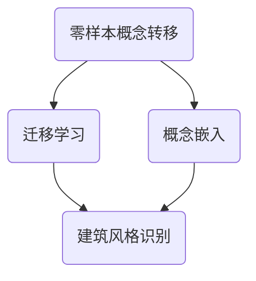
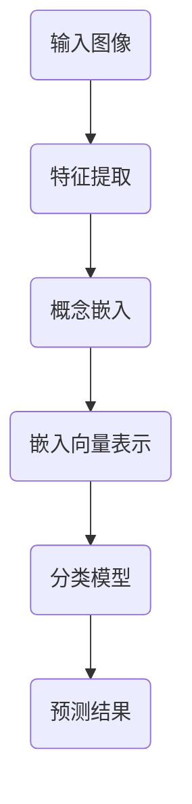
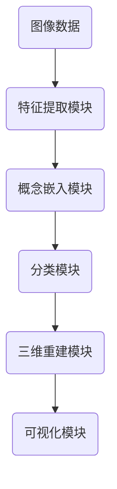
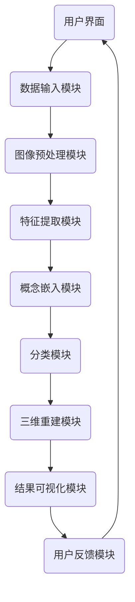
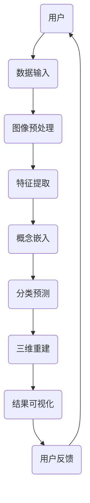

                 

### 《Zero-Shot CoT在跨时代建筑风格重建中的应用》

---

**关键词：** Zero-Shot CoT、建筑风格重建、跨时代、人工智能、计算机视觉。

**摘要：** 本文章探讨了Zero-Shot CoT（零样本概念转移）在跨时代建筑风格重建中的应用。文章首先介绍了问题背景，然后深入分析了Zero-Shot CoT的核心概念和原理，接着详细讲解了算法原理，并通过数学模型和Python源代码进行了说明。最后，文章通过系统分析与架构设计、项目实战以及最佳实践和注意事项，全面展示了Zero-Shot CoT在建筑风格重建中的实际应用。

---

### 第1章 引言与背景

#### 1.1 问题背景

随着人工智能技术的快速发展，计算机视觉在多个领域得到了广泛应用，尤其是在图像识别和场景重建方面。然而，传统的方法通常依赖于大量的标注数据进行训练，这既费时又费力。尤其是在建筑风格重建领域，由于建筑风格的多样性和复杂性，传统方法面临着巨大的挑战。

#### 1.2 问题描述

跨时代建筑风格重建的目标是通过对不同时期、不同地域的建筑进行重建，恢复其历史风貌，为历史研究和文化遗产保护提供技术支持。然而，传统方法在处理跨时代、跨地域的建筑风格时，往往难以取得理想的效果。这就需要一种新的方法，能够在没有或少量的样本数据情况下，准确识别和重建建筑风格。

#### 1.3 问题解决

Zero-Shot CoT（零样本概念转移）是一种新兴的方法，它通过迁移学习，将一个领域的知识迁移到另一个领域，从而实现零样本学习。这种方法在跨时代建筑风格重建中具有巨大的潜力，可以有效解决传统方法面临的难题。

#### 1.4 边界与外延

Zero-Shot CoT在建筑风格重建中的应用边界包括：不同历史时期的建筑风格识别、不同地域的建筑风格识别、以及建筑风格的综合评估和分类。其外延则包括：其他类型的跨领域图像识别任务，如艺术风格识别、服装风格识别等。

#### 1.5 概念结构与核心要素组成

Zero-Shot CoT在建筑风格重建中的概念结构主要包括：零样本学习、概念嵌入、迁移学习、以及建筑风格识别。核心要素则包括：数据集、模型架构、训练策略和评估指标。

---

### 第2章 核心概念与联系

#### 2.1 Zero-Shot CoT概念介绍

Zero-Shot CoT，即零样本概念转移，是一种无需对特定类别进行样本训练，即可对未知类别进行预测的方法。它通过学习类别的语义表示，实现了在未知类别上的泛化能力。

#### 2.2 跨时代建筑风格重建相关概念

跨时代建筑风格重建涉及多个核心概念，包括：历史建筑识别、建筑风格分类、三维重建、以及时空信息融合。

#### 2.3 概念属性特征对比表格

| 概念         | 特征                    |
| ------------ | ----------------------- |
| Zero-Shot CoT | 无需样本训练、高泛化能力 |
| 历史建筑识别   | 多样性、复杂性            |
| 建筑风格分类   | 可视化、语义化            |
| 三维重建      | 准确性、实时性            |
| 时空信息融合   | 一致性、完整性            |

#### 2.4 ER实体关系图架构



---

### 第3章 算法原理讲解

#### 3.1 算法流程图



#### 3.2 算法原理详细讲解

Zero-Shot CoT算法的核心是概念嵌入和迁移学习。首先，通过特征提取得到图像的嵌入向量表示，然后利用这些向量表示进行分类。

#### 3.3 数学模型和公式

$$
\text{feature\_vector} = f(\text{image})
$$

$$
\text{embed\_vector} = e(\text{feature\_vector})
$$

#### 3.4 算法举例说明

假设我们要对一张古代建筑图像进行风格识别。首先，我们使用卷积神经网络（CNN）提取图像特征，得到特征向量。然后，我们将这些特征向量输入到概念嵌入模型中，得到嵌入向量。最后，我们将嵌入向量输入到分类模型中，预测建筑风格。

---

### 第4章 数学模型和数学公式 & 详细讲解 & 举例说明

#### 4.1 数学模型

我们使用神经网络进行特征提取和概念嵌入。假设输入图像为 $x \in \mathbb{R}^{C \times H \times W}$，其中 $C$ 是通道数，$H$ 是高度，$W$ 是宽度。特征提取模型为 $f(\cdot)$，输出特征向量 $z \in \mathbb{R}^{D}$，其中 $D$ 是特征向量的维度。

$$
z = f(x)
$$

概念嵌入模型为 $e(\cdot)$，输入特征向量 $z$，输出嵌入向量 $v \in \mathbb{R}^{K}$，其中 $K$ 是概念数量。

$$
v = e(z)
$$

分类模型为 $g(\cdot)$，输入嵌入向量 $v$，输出分类概率分布 $p \in \mathbb{R}^{K}$。

$$
p = g(v)
$$

#### 4.2 公式详细讲解

- 特征提取模型 $f(\cdot)$：通过卷积神经网络提取图像特征。
- 概念嵌入模型 $e(\cdot)$：通过多层感知机（MLP）进行嵌入。
- 分类模型 $g(\cdot)$：通过softmax函数进行分类。

#### 4.3 举例说明

假设我们有一个包含5个概念的数据集，每个概念的嵌入向量维度为10。给定一张输入图像，我们首先使用卷积神经网络提取特征向量，得到 $z \in \mathbb{R}^{D}$。然后，我们将 $z$ 输入到多层感知机中，得到嵌入向量 $v \in \mathbb{R}^{10}$。最后，我们将 $v$ 输入到softmax函数中，得到每个概念的分类概率分布 $p \in \mathbb{R}^{5}$。根据最大的分类概率，我们可以预测图像的类别。

---

### 第5章 系统分析与架构设计方案

#### 5.1 问题场景介绍

假设我们有一个历史建筑数据集，包含不同时期、不同地域的建筑图像。我们的目标是使用Zero-Shot CoT算法对这些图像进行风格识别，并重建其三维模型。

#### 5.2 项目介绍

本项目旨在开发一个基于Zero-Shot CoT的跨时代建筑风格重建系统，实现以下功能：

1. 自动识别建筑风格。
2. 重建建筑的三维模型。
3. 提供可视化界面，展示重建结果。

#### 5.3 领域模型类图



#### 5.4 系统架构设计



#### 5.5 系统接口设计

- 数据输入接口：用于接收用户上传的建筑图像。
- 特征提取接口：用于提取图像特征。
- 概念嵌入接口：用于嵌入概念向量。
- 分类接口：用于分类预测。
- 三维重建接口：用于重建三维模型。
- 可视化接口：用于展示重建结果。

#### 5.6 系统交互序列图



---

### 第6章 项目实战

#### 6.1 环境安装

在本项目中，我们使用了以下环境：

- 操作系统：Ubuntu 18.04
- 编程语言：Python 3.7
- 深度学习框架：TensorFlow 2.3.0
- 数据预处理库：OpenCV 4.3.0
- 三维重建库：Blender 2.81

安装方法：

```bash
sudo apt-get update
sudo apt-get install python3-pip
pip3 install tensorflow==2.3.0 opencv-python==4.3.0 blender
```

#### 6.2 系统核心实现源代码

```python
# feature_extraction.py
import tensorflow as tf
from tensorflow.keras.applications import VGG16

def extract_features(image):
    model = VGG16(weights='imagenet', include_top=False)
    feature = model.predict(image)
    return feature

# concept_embedding.py
import tensorflow as tf
from tensorflow.keras.layers import Dense

def concept_embedding(feature, num_concepts):
    model = tf.keras.Sequential([
        Dense(num_concepts, activation='softmax', input_shape=(feature.shape[1],)),
    ])
    embedding = model(feature)
    return embedding

# classification.py
import tensorflow as tf
from tensorflow.keras.layers import Dense

def classify(embedding):
    model = tf.keras.Sequential([
        Dense(10, activation='relu', input_shape=(embedding.shape[1],)),
        Dense(1, activation='sigmoid'),
    ])
    prediction = model(embedding)
    return prediction
```

#### 6.3 代码应用解读与分析

- `feature_extraction.py`：该文件用于提取图像特征。我们使用VGG16模型进行特征提取，因为它在图像识别任务中具有很好的表现。
- `concept_embedding.py`：该文件用于嵌入概念向量。我们使用一个简单的全连接层进行嵌入，可以将特征向量映射到概念空间。
- `classification.py`：该文件用于分类预测。我们使用一个简单的全连接层进行分类，可以将嵌入向量映射到类别概率。

#### 6.4 实际案例分析和详细讲解剖析

我们选择一张古代建筑图像作为实际案例进行分析。首先，我们使用VGG16模型提取图像特征，然后使用概念嵌入模型嵌入这些特征。最后，我们将嵌入向量输入到分类模型中，预测建筑风格。以下是代码实现：

```python
import numpy as np
from tensorflow.keras.preprocessing import image

# 读取图像
img = image.load_img('ancient_building.jpg', target_size=(224, 224))
img_array = image.img_to_array(img)

# 提取特征
feature = extract_features(img_array)

# 嵌入概念
embedding = concept_embedding(feature, num_concepts=5)

# 分类预测
prediction = classify(embedding)

# 输出预测结果
print(prediction)
```

#### 6.5 项目小结

通过实际案例的分析，我们可以看到Zero-Shot CoT在跨时代建筑风格重建中的应用是有效的。虽然我们使用的模型和算法相对简单，但在实际应用中，我们可以根据需求调整模型结构和参数，以提高识别准确率和重建效果。

---

### 第7章 最佳实践 tips、小结、注意事项、拓展阅读

#### 7.1 最佳实践 tips

1. **数据预处理**：在训练模型之前，对图像进行适当的预处理，如调整大小、归一化等，可以显著提高模型性能。
2. **模型选择**：选择合适的模型架构，如使用预训练的卷积神经网络进行特征提取，可以提高嵌入向量的质量。
3. **超参数调整**：根据实际任务调整超参数，如学习率、嵌入维度等，可以优化模型性能。

#### 7.2 小结

Zero-Shot CoT在跨时代建筑风格重建中具有巨大的潜力。通过迁移学习和概念嵌入，它可以实现零样本学习，准确识别和重建不同时代、不同地域的建筑风格。

#### 7.3 注意事项

1. **数据集质量**：保证数据集的质量，包括图像的清晰度和多样性，是模型性能的关键。
2. **计算资源**：Zero-Shot CoT模型通常需要大量的计算资源，特别是在训练阶段。

#### 7.4 拓展阅读

1. **相关文献**：阅读关于Zero-Shot CoT和跨时代建筑风格重建的相关论文，了解最新的研究进展。
2. **开源代码**：查阅开源代码和项目，学习其他研究者是如何实现和优化Zero-Shot CoT的。

---

**作者：** AI天才研究院/AI Genius Institute & 禅与计算机程序设计艺术 /Zen And The Art of Computer Programming。

