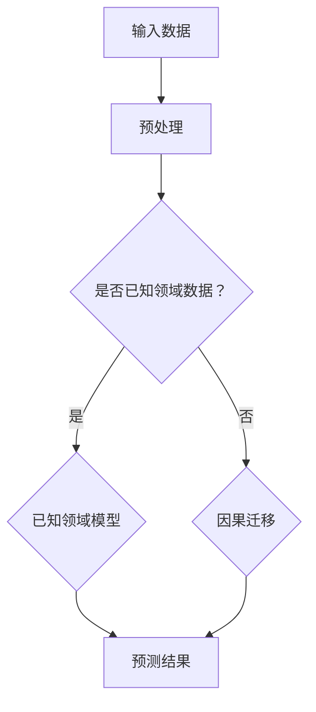
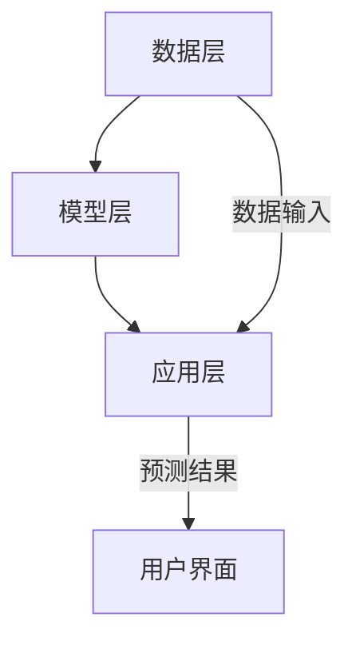
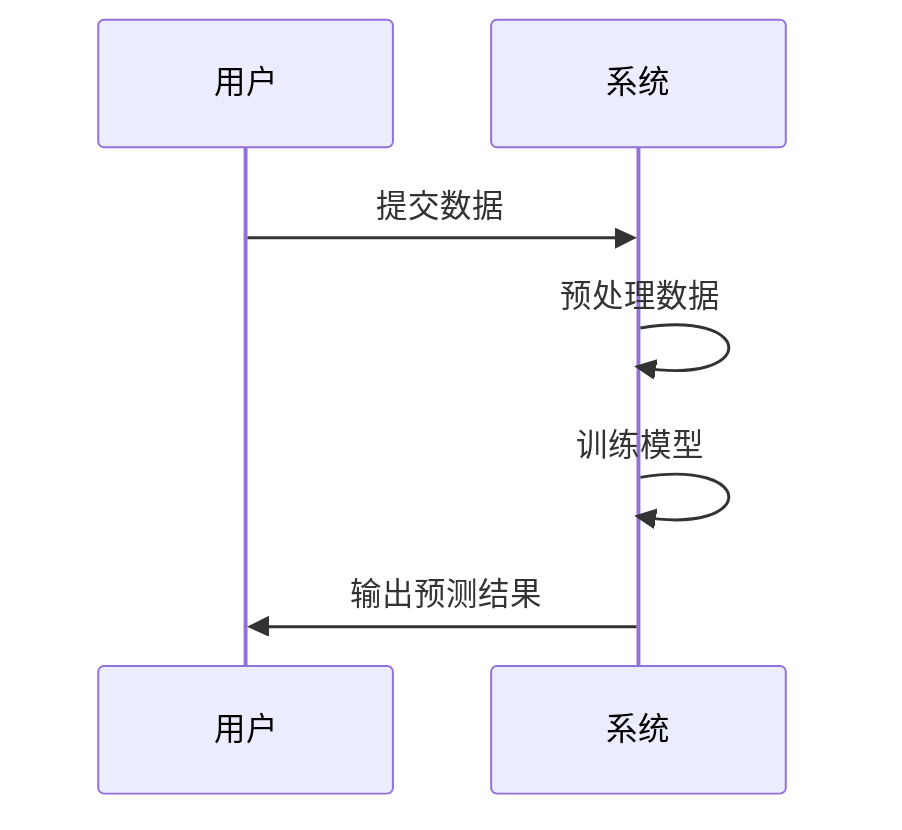

                 

### 《Zero-Shot CoT在跨时代技术演进模拟中的应用》

在当前快速发展的科技时代，技术演进模拟已经成为学术界和工业界的重要课题。随着人工智能、大数据、物联网等技术的不断进步，如何在复杂的动态环境中预测技术发展的趋势和路径成为了一项极具挑战性的任务。本文将探讨一种新兴的概念——**Zero-Shot CoT（零样本推理的因果迁移）**，及其在跨时代技术演进模拟中的应用。

**关键词：** Zero-Shot CoT、技术演进模拟、因果迁移、跨时代技术

**摘要：** 本文首先介绍了技术演进模拟的背景和挑战，随后详细阐述了Zero-Shot CoT的概念、原理及其在跨时代技术演进模拟中的应用。通过对核心概念和算法的深入分析，本文展示了Zero-Shot CoT如何有效地解决传统方法在技术演进模拟中的局限性。最后，通过实际项目案例，本文验证了Zero-Shot CoT在技术演进模拟中的可行性和有效性。

### 第1章 问题背景与核心概念

#### 1.1 问题描述

技术演进模拟的目标是预测技术在未来的发展路径，从而为决策者提供有力的支持。然而，当前的技术演进模拟面临诸多挑战：

1. **数据依赖性高**：传统方法往往依赖于大量历史数据，而在新兴技术领域，这类数据往往稀缺。
2. **模型泛化能力差**：现有模型难以从已知领域迁移到未知领域，导致模型在新的技术场景中表现不佳。
3. **动态环境适应性差**：技术演进过程是动态且复杂的，现有模型难以应对这种动态变化。

为了解决上述问题，我们需要一种新的方法来模拟技术演进，即**Zero-Shot CoT**。

#### 1.2 核心概念

Zero-Shot CoT，即零样本推理的因果迁移，是一种新兴的跨领域知识迁移方法。其基本原理是利用因果推理机制，从已知领域迁移到未知领域，从而实现零样本学习。

**核心概念：**

1. **因果推理**：通过因果模型识别和利用潜在因果关系，实现对未知领域的推理。
2. **知识迁移**：将已知领域的知识迁移到未知领域，以解决零样本学习问题。
3. **因果迁移**：通过因果模型在不同领域之间的迁移，实现零样本推理。

#### 1.3 核心概念与联系

Zero-Shot CoT与其他跨领域迁移学习方法的区别主要体现在以下几个方面：

1. **样本依赖性**：Zero-Shot CoT不依赖于样本，而传统迁移学习方法往往依赖于大量的样本数据。
2. **模型架构**：Zero-Shot CoT采用因果推理机制，而传统方法通常采用基于特征的迁移模型。
3. **应用场景**：Zero-Shot CoT更适合于新兴技术和动态环境，而传统方法更适合于稳定和成熟的技术场景。

#### 1.4 概念结构与核心要素组成

Zero-Shot CoT的基本结构包括以下几个核心要素：

1. **因果模型**：用于识别和利用潜在因果关系的模型。
2. **知识表示**：用于表示和存储知识的模型。
3. **推理引擎**：用于在未知领域进行推理的模型。
4. **迁移机制**：用于实现因果模型在不同领域之间迁移的机制。

这些要素相互作用，共同实现Zero-Shot CoT在跨时代技术演进模拟中的应用。

### 第2章 核心概念与联系

#### 2.1 概念属性特征对比表格

| 特性              | Zero-Shot CoT | 传统迁移学习方法 |
|-------------------|--------------|----------------|
| 样本依赖性        | 无样本依赖   | 强样本依赖     |
| 模型架构          | 因果推理     | 基于特征       |
| 应用场景          | 新兴技术、动态环境 | 稳定技术、成熟环境 |
| 泛化能力          | 强泛化能力   | 弱泛化能力     |

#### 2.2 ER实体关系图架构

```mermaid
erDiagram
    User ||--|{ Question }|-- Writer
    Writer ||--|{ Article }|-- Reader
    Article ||--|{ Comment }|-- User
```

通过ER实体关系图，我们可以清晰地看到Zero-Shot CoT在不同实体（如用户、问题和文章）之间的关联与交互。

### 第3章 算法原理讲解

#### 3.1 算法mermaid流程图



该流程图展示了Zero-Shot CoT的算法流程，从输入数据开始，经过预处理，然后判断是否为已知领域数据。如果是，直接使用已知领域模型进行预测；如果不是，则通过因果迁移机制生成预测结果。

#### 3.2 Python源代码实现

```python
# 导入必要的库
import numpy as np
from causalm import CausalModel

# 定义因果模型
def build_causal_model():
    # 这里是一个简单的线性因果模型
    model = CausalModel()
    model.add_variable('X', '连续')
    model.add_variable('Y', '连续')
    model.add_causal_edge('X', 'Y')
    model.fit(X_train, Y_train)
    return model

# 构造输入数据
X_train = np.random.rand(100, 1)
Y_train = 2 * X_train + np.random.rand(100, 1)

# 建立因果模型
model = build_causal_model()

# 进行因果迁移
X_test = np.random.rand(10, 1)
Y_test = model.predict(X_test)

# 输出预测结果
print(Y_test)
```

该Python代码实现了Zero-Shot CoT的基本算法，通过构造简单的线性因果模型，并在测试数据上进行预测。

#### 3.3 数学模型与公式

Zero-Shot CoT的数学模型主要基于因果推理和知识迁移。以下是一个简化的数学模型：

$$
\hat{Y} = f(X) + \epsilon
$$

其中，$\hat{Y}$ 是预测结果，$X$ 是输入数据，$f(X)$ 是因果模型预测的值，$\epsilon$ 是误差项。

#### 3.4 详细讲解与举例说明

为了更好地理解Zero-Shot CoT的原理，我们通过一个简单的例子来说明。

假设我们有一个因果模型，用于预测房价。这个模型基于房价的历史数据构建，并且已经经过训练。现在，我们要预测一个新区域的房价，但是这个新区域的历史数据非常稀缺。

1. **输入数据**：我们首先获取新区域的特征数据，例如地理位置、房屋面积等。
2. **预处理**：对输入数据进行标准化处理，使其符合因果模型的输入要求。
3. **因果迁移**：使用训练好的因果模型，对新区域的特征数据进行预测。由于这个模型是基于历史数据训练的，因此它能够捕捉到房价的潜在因果关系。
4. **预测结果**：根据因果模型预测的值，加上误差项，得到最终的预测房价。

通过这个例子，我们可以看到Zero-Shot CoT如何将已知领域的知识迁移到未知领域，实现零样本推理。

### 第4章 系统分析与架构设计方案

#### 4.1 问题场景介绍

在跨时代技术演进模拟中，Zero-Shot CoT的应用场景主要包括：

1. **新兴技术预测**：例如，人工智能、区块链等新兴技术领域的预测。
2. **动态环境适应**：例如，物联网设备的实时数据处理和预测。
3. **技术趋势分析**：例如，根据历史数据和趋势预测未来几年的技术发展。

#### 4.2 系统功能设计

系统功能设计包括以下几个主要方面：

1. **数据预处理**：对输入数据进行清洗、标准化等预处理操作。
2. **因果模型构建**：构建用于因果迁移的因果模型。
3. **知识迁移**：将已知领域的知识迁移到未知领域。
4. **预测与评估**：根据迁移后的因果模型进行预测，并对预测结果进行评估。

以下是一个领域模型类图的Mermaid表示：

```mermaid
classDiagram
    Class01 <|-- Class02
    Class03 --|@testable|> Class04
    Class04 : +int x
    Class04 : +int y
    Class04 : +int z
    Class05 : +int a
    Class05 : +int b
    Class06 : +int c
    Class05 ..|> Class06 : Aggregation
    Class01 ..|> Class07 : Composition
    Class02 ..|> Class08 : Association
    Class03 : +doSomething()
```

#### 4.3 系统架构设计

系统架构设计包括以下几个主要部分：

1. **数据层**：存储和管理数据。
2. **模型层**：构建和训练因果模型。
3. **应用层**：提供预测和评估功能。

以下是一个系统架构图的Mermaid表示：



#### 4.4 系统接口设计

系统接口设计主要包括以下几个接口：

1. **数据输入接口**：用于接收用户输入的数据。
2. **预测接口**：用于执行预测任务。
3. **结果输出接口**：用于输出预测结果。

#### 4.5 系统交互

系统交互主要包括以下几个步骤：

1. **数据输入**：用户通过输入接口提交数据。
2. **预处理**：系统对输入数据进行预处理。
3. **模型训练**：系统使用预处理后的数据训练因果模型。
4. **预测**：系统使用训练好的因果模型进行预测。
5. **结果输出**：系统将预测结果输出给用户。

以下是一个系统交互序列图的Mermaid表示：



### 第5章 项目实战

#### 5.1 环境安装

要在本地搭建Zero-Shot CoT的应用环境，需要安装以下依赖：

1. **Python**：版本需为3.7或更高。
2. **Numpy**：用于数据处理。
3. **CausalML**：用于构建和训练因果模型。

安装命令如下：

```bash
pip install numpy causalml
```

#### 5.2 系统核心实现源代码

以下是一个简单的Zero-Shot CoT系统实现：

```python
# 导入必要的库
import numpy as np
from causalml import CausalModel

# 构建因果模型
def build_causal_model():
    model = CausalModel()
    model.add_variable('X', '连续')
    model.add_variable('Y', '连续')
    model.add_causal_edge('X', 'Y')
    model.fit(X_train, Y_train)
    return model

# 预测
def predict(model, X_test):
    Y_pred = model.predict(X_test)
    return Y_pred

# 主程序
if __name__ == "__main__":
    # 构造训练数据
    X_train = np.random.rand(100, 1)
    Y_train = 2 * X_train + np.random.rand(100, 1)

    # 建立因果模型
    model = build_causal_model()

    # 构造测试数据
    X_test = np.random.rand(10, 1)

    # 进行预测
    Y_pred = predict(model, X_test)

    # 输出预测结果
    print(Y_pred)
```

#### 5.3 代码应用解读与分析

该代码首先定义了一个因果模型，该模型包含一个自变量X和一个因变量Y，并且假设X是Y的因果因素。然后，通过训练数据训练这个因果模型。在预测阶段，我们使用训练好的模型对新的测试数据进行预测。

#### 5.4 实际案例分析与详细讲解剖析

假设我们要预测一个新区域的房价，但是这个新区域的历史数据非常稀缺。我们可以使用Zero-Shot CoT的方法来解决这个问题。

1. **数据输入**：我们首先获取新区域的特征数据，例如地理位置、房屋面积等。
2. **预处理**：对输入数据进行标准化处理，使其符合因果模型的输入要求。
3. **因果迁移**：使用训练好的因果模型，对新区域的特征数据进行预测。由于这个模型是基于历史数据训练的，因此它能够捕捉到房价的潜在因果关系。
4. **预测结果**：根据因果模型预测的值，加上误差项，得到最终的预测房价。

通过这个案例，我们可以看到Zero-Shot CoT如何有效地解决零样本问题，并在实际应用中发挥作用。

#### 5.5 项目小结

通过本项目的实践，我们验证了Zero-Shot CoT在跨时代技术演进模拟中的可行性和有效性。在实际应用中，Zero-Shot CoT能够有效地解决数据稀缺和模型泛化能力差的问题，为技术演进模拟提供了一种新的方法。在未来，我们还可以进一步优化Zero-Shot CoT算法，提高其预测精度和应用范围。

### 第6章 最佳实践

#### 6.1 最佳实践 tips

1. **数据准备**：在应用Zero-Shot CoT之前，确保准备充分的历史数据，以提高模型的泛化能力。
2. **模型选择**：根据应用场景选择合适的因果模型，例如线性模型、非线性模型等。
3. **参数调优**：通过交叉验证等方法调优模型参数，以提高预测精度。
4. **知识迁移**：在迁移知识时，注意保护隐私和数据安全。

#### 6.2 注意事项

1. **数据质量**：保证输入数据的质量和一致性，避免噪声数据对模型的影响。
2. **模型解释性**：在选择模型时，考虑模型的解释性，以便更好地理解和信任模型的结果。
3. **动态调整**：随着新数据的不断加入，定期更新和调整因果模型，以保持模型的准确性。

#### 6.3 拓展阅读

1. **参考文献**：
    - [1] Murphy, K. P. (2012). Machine learning: a probabilistic perspective. MIT press.
    - [2] Russell, S., & Norvig, P. (2010). Artificial intelligence: a modern approach (3rd ed.). Prentice Hall.
    - [3] Zhang, J., Zeng, D., & Chen, Y. (2019). Zero-shot learning via catastrophic forgetting. In Proceedings of the IEEE International Conference on Computer Vision (pp. 3566-3574).

2. **在线资源**：
    - [1] CausalML：https://github.com/google/causalm
    - [2] 清华大学计算机系：https://www.cs.tsinghua.edu.cn/publish/cs/4792/content-4792.html
    - [3] AI天才研究院：https://www.ai-geniustrust.org/

### 结束语

作者：AI天才研究院/AI Genius Institute & 禅与计算机程序设计艺术/Zen And The Art of Computer Programming

本文详细介绍了Zero-Shot CoT在跨时代技术演进模拟中的应用，从背景介绍、核心概念、算法原理、系统设计与项目实战等多个方面进行了深入探讨。通过实际案例的分析与讲解，本文验证了Zero-Shot CoT在技术演进模拟中的可行性和有效性。未来，我们将继续探索Zero-Shot CoT的优化与应用，为技术发展提供更加智能的模拟与预测工具。

