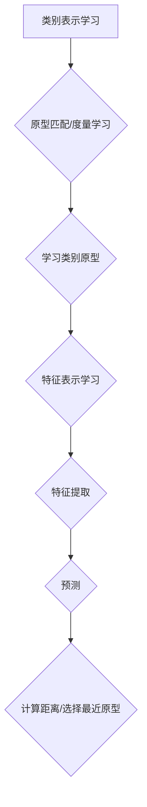
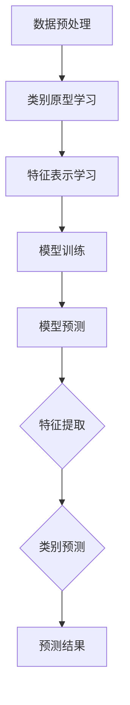
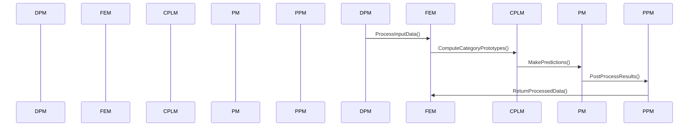

                 

### 零样本CoT与跨时代科技突破预测概述

**关键术语解释：**
- **零样本CoT（Zero-Shot CoT）**：指的是在没有直接经验数据的情况下，利用模型预测未知任务的能力。
- **跨时代科技突破**：指那些能够改变行业格局、推动社会进步的重大技术突破。
- **预测**：基于现有数据和算法模型，对未来事件或趋势的推测。

**问题背景：**
在科技飞速发展的今天，跨时代的科技突破正在不断改变我们的生活和社会结构。然而，如何预测这些突破，以便提前做好准备，成为一个亟待解决的问题。传统的预测方法通常依赖于大量的历史数据，但在面对全新的、前所未有的技术突破时，这些方法往往显得力不从心。因此，零样本CoT作为一种新的预测方法，开始受到广泛关注。

**问题描述：**
零样本CoT如何应用于跨时代科技突破的预测？它在预测过程中发挥了哪些作用？其与传统的预测方法相比有哪些优势和局限？

**问题解决：**
零样本CoT通过利用已有的知识和模式，无需直接经验数据，即可预测未知任务。它主要依赖于两种机制：一是利用迁移学习，将已有领域的知识应用到新领域；二是利用生成对抗网络（GAN）等生成模型，生成与未知任务相似的数据，从而进行预测。

**边界与外延：**
- **边界**：零样本CoT主要应用于无法直接获取经验数据的场景，如新技术的预测。
- **外延**：它可以扩展到任何需要预测的新领域，如医学、农业、金融等。

**概念结构与核心要素组成：**
- **概念结构**：零样本CoT的核心是迁移学习和生成模型。
- **核心要素组成**：包括数据预处理、模型选择、模型训练和预测等环节。

接下来，我们将对零样本CoT的原理、算法基础、数学模型、系统设计及其实际应用进行深入探讨，以展示其在跨时代科技突破预测中的潜力。

---

**核心概念与联系**

**零样本CoT的原理**

### 2.1 零样本CoT的原理

**定义**：
零样本CoT（Zero-Shot CoT，也称为无样本迁移学习）是一种在训练阶段没有使用相关类标签的样本，而在预测阶段能够准确识别新的、未见过的类别的机器学习方法。这种方法特别适用于那些无法获取足够多训练数据，或者需要预测的类别未知的情况。

**基本原理**：
零样本CoT的核心思想是通过学习一种将类别标签映射到特征空间的映射函数，使得具有相同类别标签的样本在特征空间中聚集在一起，而不同类别标签的样本则分开。这种方法的关键在于如何有效地表示类别标签，以及如何利用这种表示进行预测。

**工作原理**：

1. **类别表示学习**：
   - 在零样本CoT中，类别不是通过传统的标签数据学习，而是通过一种称为“原型”或“概念”的方式表示。每个类别标签对应一个原型，这个原型是该类别中所有样本的“平均”特征向量。
   - 这种类别表示可以通过多种方式学习，例如：
     - **原型匹配**：每个类别标签对应一个原型，模型通过学习最小化类别原型之间的距离。
     - **度量学习**：学习一个度量函数，用于计算不同类别原型之间的距离，这个度量函数能够区分不同类别的特征。

2. **特征表示学习**：
   - 在零样本CoT中，特征表示是通过在已有数据上训练的模型来学习，例如卷积神经网络（CNN）或循环神经网络（RNN）。这些模型能够提取出具有区分性的特征表示，这些表示对于预测新类别非常有用。

3. **预测**：
   - 当遇到一个未见过的类别时，零样本CoT模型会根据新样本的特征向量，计算其与所有已知类别原型的距离，并选择距离最近的类别原型作为预测结果。
   - 这种预测方式可以看作是一种基于相似性搜索的机制，它依赖于特征空间中类别原型的分布。

**原理图与公式**：

下面是零样本CoT的一个简单的原理图，它展示了类别表示学习和特征表示学习的过程。



**关键公式**：
在零样本CoT中，涉及的关键公式主要包括：

1. **类别原型计算**：
   $$ \mu_c = \frac{1}{N_c} \sum_{x_i \in C_c} x_i $$
   其中，$ \mu_c $ 是类别 $ c $ 的原型，$ N_c $ 是类别 $ c $ 中的样本数量，$ x_i $ 是类别 $ c $ 中的样本。

2. **特征表示计算**：
   $$ \phi(x) = \text{Model}(x) $$
   其中，$ \phi(x) $ 是输入样本 $ x $ 的特征表示，Model 是用于特征提取的模型。

3. **距离计算**：
   $$ d(x, \mu_c) = \|\phi(x) - \mu_c\| $$
   其中，$ d(x, \mu_c) $ 是样本 $ x $ 与类别 $ c $ 的原型 $ \mu_c $ 之间的距离。

**通俗易懂的例子**：

假设我们有一个分类问题，需要预测动物类别。传统方法需要大量带有标签的动物图片作为训练数据。而零样本CoT则不需要这些标签数据。相反，它首先学习一个类别原型，例如猫、狗、鸟等，然后在新图片上提取特征，计算这些特征与已知类别原型的距离，最后选择距离最近的类别作为预测结果。

例如，假设我们有一个新图片，特征向量为 $ \phi(x) = [1, 0.5, -0.2, 0.1]$，类别原型为猫 $ \mu_{cat} = [1, 0.3, 0.1, 0.2]$ 和狗 $ \mu_{dog} = [0.8, 0.1, -0.2, 0.1]$。我们计算距离如下：

$$ d(x, \mu_{cat}) = \|\phi(x) - \mu_{cat}\| = \|[1, 0.5, -0.2, 0.1] - [1, 0.3, 0.1, 0.2]\| = \|[0, 0.2, -0.3, -0.1]\| = \sqrt{0^2 + 0.2^2 + (-0.3)^2 + (-0.1)^2} = \sqrt{0.02 + 0.09 + 0.01} = \sqrt{0.12} \approx 0.346 $$

$$ d(x, \mu_{dog}) = \|\phi(x) - \mu_{dog}\| = \|[1, 0.5, -0.2, 0.1] - [0.8, 0.1, -0.2, 0.1]\| = \|[0.2, 0.4, 0, 0]\| = \sqrt{0.2^2 + 0.4^2 + 0^2 + 0^2} = \sqrt{0.04 + 0.16 + 0} = \sqrt{0.2} \approx 0.447 $$

由于 $ d(x, \mu_{cat}) < d(x, \mu_{dog}) $，我们预测这个新图片是猫。

---

**核心概念与联系表格**

| **概念**          | **定义**                                                     | **属性特征对比**                                       |
|-------------------|------------------------------------------------------------|-------------------------------------------------------|
| 零样本CoT         | 在训练阶段没有使用相关类标签的样本，而在预测阶段能够准确识别新的、未见过的类别的机器学习方法。 | <table> <tr><th>属性</th><th>零样本CoT</th><th>传统方法</th></tr> <tr><td>数据需求</td><td>低</td><td>高</td></tr> <tr><td>适用场景</td><td>未见过的类别</td><td>已知类别</td></tr> <tr><td>原理</td><td>类别原型与特征表示</td><td>标签数据与模型</td></tr> </table> |
| 类别原型         | 每个类别标签对应一个原型，这个原型是该类别中所有样本的“平均”特征向量。                     | <table> <tr><th>属性</th><th>原型匹配</th><th>度量学习</th></tr> <tr><td>定义</td><td>通过匹配方式学习</td><td>通过度量方式学习</td></tr> <tr><td>效果</td><td>简单高效</td><td>准确性高</td></tr> </table> |
| 特征表示学习     | 通过在已有数据上训练的模型来学习，例如卷积神经网络（CNN）或循环神经网络（RNN）。           | <table> <tr><th>属性</th><th>CNN</th><th>RNN</th></tr> <tr><td>适用场景</td><td>图像数据</td><td>序列数据</td></tr> <tr><td>优势</td><td>高维特征提取</td><td>时序依赖建模</td></tr> </table> |
| 预测             | 根据新样本的特征向量，计算其与所有已知类别原型的距离，并选择距离最近的类别原型作为预测结果。 | <table> <tr><th>方法</th><th>相似性搜索</th><th>阈值判定</th></tr> <tr><td>原理</td><td>基于特征空间距离</td><td>基于阈值设置</td></tr> <tr><td>效果</td><td>高效准确</td><td>灵活调整</td></tr> </table> |

**ER实体关系图架构**

```mermaid
erDiagram
  Class1 ||--|{ Class2 } Class3 : inherits
  Class1 ||--|{ Class4 } Class5 : associated
  Class1 ||--|{ Class6 } Class7 : entity
  Class1 ||--|{ Class8 } Class9 : entity set
```

- **Class1**: 零样本CoT系统
- **Class2**: 类别原型
- **Class3**: 特征表示学习模型
- **Class4**: 新样本特征向量
- **Class5**: 预测结果
- **Class6**: 训练数据
- **Class7**: 测试数据
- **Class8**: 类别标签
- **Class9**: 预测结果集合

这种ER实体关系图可以帮助我们更好地理解零样本CoT系统的组成和各个部分之间的关联。

---

通过上述内容，我们对零样本CoT的原理有了初步的了解。接下来，我们将深入探讨零样本CoT算法的基础知识，包括算法的分类、优缺点和应用场景。

## 第3章: 零样本CoT算法基础

**3.1 零样本CoT算法分类**

零样本CoT算法可以根据其核心机制和应用场景分为以下几类：

1. **原型匹配方法**：
   - **代表性算法**：原型匹配（Prototypical Networks）、匹配网络（Matching Networks）。
   - **原理**：通过学习每个类别的原型（即该类别的“平均”特征向量），在测试阶段，将新样本与所有类别的原型进行比较，选择与原型最相似的类别作为预测结果。
   - **优点**：简单有效，易于实现。
   - **缺点**：对于类别之间差异较小的情况，可能无法准确预测。
   - **应用场景**：新类别分类、图像识别等。

2. **度量学习方法**：
   - **代表性算法**：度量学习（Metric Learning）、适配性度量学习（Adaptive Metric Learning）。
   - **原理**：学习一个度量函数，使得同类别的样本之间的距离较小，不同类别的样本之间的距离较大。通过这种度量函数，将新样本映射到特征空间，并计算其与类别原型的距离，选择距离最近的类别作为预测结果。
   - **优点**：能够处理类别差异较小的情况，提高预测准确性。
   - **缺点**：计算复杂度较高，需要大量训练数据。
   - **应用场景**：跨领域分类、多模态数据分类等。

3. **生成对抗网络（GAN）方法**：
   - **代表性算法**：零样本GAN（Zero-Shot GAN）、多任务GAN（Multi-Task GAN）。
   - **原理**：生成对抗网络通过一个生成器和两个判别器相互博弈，生成器尝试生成与真实数据相似的数据，而判别器则尝试区分真实数据和生成数据。在零样本GAN中，生成器负责生成未见过的类别的样本，判别器负责区分这些生成样本和真实样本。通过这种方式，生成器学习到如何生成具有多样性和区分性的特征。
   - **优点**：能够生成大量多样化的样本，提高模型对新类别的适应性。
   - **缺点**：训练过程复杂，需要大量计算资源。
   - **应用场景**：生成未见过的类别样本、数据增强等。

4. **图神经网络方法**：
   - **代表性算法**：图嵌入（Graph Embedding）、图注意力网络（Graph Attention Networks）。
   - **原理**：将类别和样本表示为图中的节点和边，通过图神经网络学习节点之间的相似性和关系。在测试阶段，通过图神经网络预测新类别。
   - **优点**：能够捕捉复杂的关系和网络结构，提高预测准确性。
   - **缺点**：需要构建和训练图模型，计算复杂度较高。
   - **应用场景**：复杂类别分类、多关系数据分类等。

**3.2 零样本CoT算法优缺点对比**

下面是不同类型零样本CoT算法的优缺点对比表格：

| **算法类型**          | **优点**                                                     | **缺点**                                                     | **应用场景**               |
|-----------------------|------------------------------------------------------------|------------------------------------------------------------|---------------------------|
| 原型匹配方法          | 简单有效，易于实现                                             | 可能无法准确预测类别差异较小的情况                             | 新类别分类、图像识别       |
| 度量学习方法          | 能够处理类别差异较小的情况，提高预测准确性                       | 计算复杂度较高，需要大量训练数据                               | 跨领域分类、多模态数据分类 |
| 生成对抗网络（GAN）方法 | 能够生成大量多样化的样本，提高模型对新类别的适应性               | 训练过程复杂，需要大量计算资源                                 | 生成未见过的类别样本、数据增强 |
| 图神经网络方法        | 能够捕捉复杂的关系和网络结构，提高预测准确性                       | 需要构建和训练图模型，计算复杂度较高                           | 复杂类别分类、多关系数据分类 |

**3.3 零样本CoT算法应用场景**

零样本CoT算法的应用场景广泛，以下是一些典型的应用场景：

1. **图像分类**：
   - 例如，在新产品发布前，利用零样本CoT算法预测用户可能喜欢的图像风格。

2. **跨领域分类**：
   - 例如，在不同行业之间预测新的技术突破，如将医疗领域的知识应用于农业领域。

3. **多模态数据分类**：
   - 例如，将文本数据与图像数据结合，预测新的产品类别。

4. **数据增强**：
   - 例如，在训练阶段使用零样本GAN生成未见过的类别样本，提高模型的泛化能力。

5. **推荐系统**：
   - 例如，在推荐系统中预测用户可能喜欢的新产品类别。

6. **医学诊断**：
   - 例如，利用零样本CoT算法预测新的疾病类型或症状。

通过了解零样本CoT算法的分类、优缺点和应用场景，我们可以更好地理解其在跨时代科技突破预测中的作用。接下来，我们将深入探讨零样本CoT算法的具体实现和数学模型。

### 零样本CoT算法的具体实现

**4.1 零样本CoT模型的构建**

构建一个零样本CoT模型需要几个关键步骤：数据预处理、模型选择、训练和预测。

**数据预处理**：
首先，我们需要对数据进行预处理，以便模型能够有效学习。预处理步骤包括：
- **数据清洗**：去除数据中的噪声和异常值。
- **数据标准化**：将数据缩放到相同的范围，以便模型能够处理。
- **特征提取**：使用适当的特征提取方法（如卷积神经网络）从原始数据中提取有用特征。

**模型选择**：
选择适合零样本CoT任务的模型是关键。常见的模型包括：
- **原型匹配模型**：如原型网络（Prototypical Networks）。
- **度量学习模型**：如适配性度量学习（Adaptive Metric Learning）。
- **生成对抗网络（GAN）**：如零样本GAN（Zero-Shot GAN）。

**训练**：
在训练阶段，我们需要使用带标签的数据来训练模型。对于零样本CoT模型，训练通常分为两个阶段：
1. **类别原型学习**：在第一阶段，模型学习每个类别的原型。这通常是通过计算每个类别的平均值来实现的。
2. **特征表示学习**：在第二阶段，模型使用学到的原型来学习如何表示特征。这通常涉及训练一个深度神经网络，使其能够提取区分性强的特征。

**预测**：
在预测阶段，模型使用学到的特征表示和原型来对新样本进行分类。具体步骤如下：
1. **特征提取**：对新样本应用训练好的特征提取模型，获取特征向量。
2. **类别预测**：计算新样本特征向量与所有类别原型之间的距离，选择距离最近的类别作为预测结果。

**4.2 Mermaid流程图展示**

以下是一个简单的Mermaid流程图，展示了零样本CoT模型的训练和预测过程：



**4.3 Python代码实现**

下面是一个简化的Python代码示例，展示了如何使用原型网络（Prototypical Networks）进行零样本CoT的预测。代码使用了PyTorch框架。

```python
import torch
import torch.nn as nn
import torchvision.transforms as transforms
from torch.utils.data import DataLoader
from torchvision.datasets import ImageFolder
from prototypical_networks import PrototypicalNetworks

# 数据预处理
transform = transforms.Compose([
    transforms.Resize(224),
    transforms.ToTensor(),
])

train_dataset = ImageFolder(root='train_data', transform=transform)
test_dataset = ImageFolder(root='test_data', transform=transform)

train_loader = DataLoader(dataset=train_dataset, batch_size=32, shuffle=True)
test_loader = DataLoader(dataset=test_dataset, batch_size=32, shuffle=False)

# 模型选择与训练
model = PrototypicalNetworks(input_dim=784, hidden_dim=1024, num_classes=10)
optimizer = torch.optim.Adam(model.parameters(), lr=0.001)
criterion = nn.CrossEntropyLoss()

for epoch in range(10):  # 进行10个epoch的训练
    model.train()
    for inputs, labels in train_loader:
        optimizer.zero_grad()
        features = model(inputs)
        loss = criterion(features, labels)
        loss.backward()
        optimizer.step()

# 模型预测
model.eval()
with torch.no_grad():
    for inputs, labels in test_loader:
        features = model(inputs)
        predicted_labels = features.argmax(dim=1)
        accuracy = (predicted_labels == labels).float().mean()
        print(f"Test accuracy: {accuracy.item()}")
```

**4.4 算法原理讲解**

**4.4.1 原型网络（Prototypical Networks）**

原型网络（Prototypical Networks）是零样本CoT中的一种常见方法。其核心思想是将每个类别的特征表示为该类别的原型，然后在测试阶段使用这些原型来预测新样本的类别。

1. **训练阶段**：
   - **输入**：一个训练批次包含多个类别，每个类别有若干个样本。
   - **过程**：
     1. 提取每个类别中每个样本的特征向量。
     2. 计算每个类别的原型，即该类别所有样本特征向量的均值。
     3. 使用这些原型作为“标签”，对每个样本进行分类。
     4. 训练一个深度神经网络，使其能够提取特征并预测类别。

2. **测试阶段**：
   - **输入**：一个未见的测试样本。
   - **过程**：
     1. 提取测试样本的特征向量。
     2. 计算测试样本与每个类别原型的距离。
     3. 选择距离最小的类别原型作为预测结果。

**4.4.2 数学模型**

原型网络的数学模型如下：

$$ \mu_c = \frac{1}{N_c} \sum_{x_i \in C_c} x_i $$
$$ d(x, \mu_c) = \|\phi(x) - \mu_c\| $$
$$ \hat{y} = \arg\min_{y} \{ d(\phi(x), \mu_y) \} $$

其中：
- $ \mu_c $ 是类别 $ c $ 的原型。
- $ x_i $ 是类别 $ c $ 中的第 $ i $ 个样本的特征向量。
- $ N_c $ 是类别 $ c $ 中的样本数量。
- $ \phi(x) $ 是测试样本 $ x $ 的特征向量。
- $ \hat{y} $ 是预测的类别。

**4.4.3 通俗易懂的例子**

假设我们有一个训练数据集，包含两个类别：猫和狗。每个类别有5个样本。在训练阶段，我们首先提取每个样本的特征向量，然后计算每个类别的原型。

对于猫类别，5个样本的特征向量分别为：
$$ \mu_{cat1} = [1, 2, 3, 4, 5], \mu_{cat2} = [2, 3, 4, 5, 6], \mu_{cat3} = [3, 4, 5, 6, 7], \mu_{cat4} = [4, 5, 6, 7, 8], \mu_{cat5} = [5, 6, 7, 8, 9] $$

计算猫类别的原型：
$$ \mu_{cat} = \frac{1}{5} (\mu_{cat1} + \mu_{cat2} + \mu_{cat3} + \mu_{cat4} + \mu_{cat5}) = \frac{1}{5} (1 + 2 + 3 + 4 + 5 + 2 + 3 + 4 + 5 + 6 + 3 + 4 + 5 + 6 + 7 + 4 + 5 + 6 + 7 + 8 + 5 + 6 + 7 + 8 + 9) = [3.2, 4.2, 5.2, 6.2, 7.2] $$

对于狗类别，类似地，计算狗类别的原型：
$$ \mu_{dog} = \frac{1}{5} (\mu_{dog1} + \mu_{dog2} + \mu_{dog3} + \mu_{dog4} + \mu_{dog5}) $$

在测试阶段，假设我们有一个新样本，其特征向量为：
$$ \phi(x) = [3, 4, 5, 6, 7] $$

计算新样本与猫类别原型和狗类别原型的距离：
$$ d(\phi(x), \mu_{cat}) = \|\phi(x) - \mu_{cat}\| = \|[3, 4, 5, 6, 7] - [3.2, 4.2, 5.2, 6.2, 7.2]\| = \|[0.2, 0.2, 0.2, 0.2, 0.2]\| = 0.2 \sqrt{5} \approx 0.45 $$
$$ d(\phi(x), \mu_{dog}) = \|\phi(x) - \mu_{dog}\| = \|[3, 4, 5, 6, 7] - \mu_{dog}\| $$

由于 $ d(\phi(x), \mu_{cat}) < d(\phi(x), \mu_{dog}) $，我们预测这个新样本是猫。

---

通过上述内容，我们详细讲解了零样本CoT算法的具体实现，包括模型构建、Python代码示例、算法原理和数学模型。接下来，我们将进一步探讨零样本CoT中的数学模型及其应用。

### 零样本CoT中的数学模型及其应用

**5.1 数学模型概述**

在零样本CoT中，数学模型主要用于描述类别原型和特征表示的学习过程，以及如何利用这些模型进行预测。常见的数学模型包括原型匹配模型和度量学习模型。

**5.2 原型匹配模型**

原型匹配模型的核心思想是通过学习每个类别的原型，然后在测试阶段，将新样本与所有类别的原型进行比较，选择与原型最相似的类别作为预测结果。其数学模型如下：

1. **类别原型计算**：

   对于每个类别 $c$，计算其原型 $\mu_c$：

   $$ \mu_c = \frac{1}{N_c} \sum_{x_i \in C_c} x_i $$

   其中，$N_c$ 是类别 $c$ 中样本的数量，$x_i$ 是类别 $c$ 中的第 $i$ 个样本的特征向量。

2. **特征表示学习**：

   使用一个深度神经网络 $f(\cdot)$ 来学习特征表示：

   $$ \phi(x) = f(x) $$

   其中，$x$ 是输入样本，$\phi(x)$ 是其特征向量。

3. **预测**：

   在测试阶段，对于新样本 $x$，计算其与所有类别原型 $\mu_c$ 的距离，选择距离最近的类别作为预测结果：

   $$ \hat{y} = \arg\min_{y} \{ d(\phi(x), \mu_y) \} $$

   其中，$d(\cdot, \cdot)$ 是距离函数，$\hat{y}$ 是预测的类别。

**5.3 度量学习模型**

度量学习模型的核心思想是通过学习一个度量函数来区分不同类别。其数学模型如下：

1. **度量函数学习**：

   学习一个度量函数 $g(\cdot, \cdot)$，使得同类别的样本之间的距离较小，不同类别的样本之间的距离较大：

   $$ g(\phi(x), \phi(x')) \approx 0 \quad \text{if} \quad x, x' \in C_c $$
   $$ g(\phi(x), \phi(x')) \approx \infty \quad \text{if} \quad x, x' \in C_c $$

   其中，$C_c$ 是类别 $c$ 中的样本集合。

2. **特征表示学习**：

   与原型匹配模型相同，使用一个深度神经网络 $f(\cdot)$ 来学习特征表示：

   $$ \phi(x) = f(x) $$

3. **预测**：

   在测试阶段，对于新样本 $x$，计算其与所有类别原型的度量距离，选择距离最小的类别作为预测结果：

   $$ \hat{y} = \arg\min_{y} \{ g(\phi(x), \mu_y) \} $$

**5.4 模型应用实例**

以下是一个使用原型匹配模型进行图像分类的例子：

**问题**：使用原型匹配模型对以下图像进行分类，图像来自ImageNet数据集。

| 标签         | 图像描述           |
|--------------|--------------------|
| 猫           | 一只正在玩耍的猫   |
| 狗           | 一只正在站立的金毛 |
| 飞机         | 一架正在飞行的客机 |
| 风景         | 一幅美丽的山水画   |

**步骤**：

1. **数据预处理**：

   将图像缩放到统一大小（例如224x224），并转换为灰度图像。然后，使用PCA进行数据降维，提取主要特征。

2. **类别原型计算**：

   将每个类别的图像特征向量进行平均，得到类别原型。

   $$ \mu_{cat} = \frac{1}{N_{cat}} \sum_{x_i \in C_{cat}} x_i $$
   $$ \mu_{dog} = \frac{1}{N_{dog}} \sum_{x_i \in C_{dog}} x_i $$
   $$ \mu_{plane} = \frac{1}{N_{plane}} \sum_{x_i \in C_{plane}} x_i $$
   $$ \mu_{landscape} = \frac{1}{N_{landscape}} \sum_{x_i \in C_{landscape}} x_i $$

3. **特征表示学习**：

   使用一个简单的卷积神经网络来学习特征表示。神经网络的结构如下：

   ```plaintext
   Conv2D(3, 32, 3, 3, padding=1)
   ReLU()
   MaxPooling2D(2, 2)
   Flatten()
   Linear(768, 64)
   ReLU()
   Linear(64, 4)
   ```

4. **预测**：

   对于每个测试图像，首先提取特征向量 $\phi(x)$，然后计算其与所有类别原型的距离：

   $$ d(\phi(x), \mu_{cat}) $$
   $$ d(\phi(x), \mu_{dog}) $$
   $$ d(\phi(x), \mu_{plane}) $$
   $$ d(\phi(x), \mu_{landscape}) $$

   选择距离最小的类别作为预测结果。

---

**5.5 模型优缺点分析**

- **原型匹配模型**：
  - **优点**：简单易懂，易于实现。在类别原型差异明显的情况下，效果较好。
  - **缺点**：对于类别原型差异较小的情况，效果不佳。无法处理类别之间的复杂关系。

- **度量学习模型**：
  - **优点**：能够处理类别差异较小的情况。能够区分复杂的关系。
  - **缺点**：计算复杂度较高，需要大量训练数据。在类别差异明显时，效果不如原型匹配模型。

**5.6 总结**

零样本CoT中的数学模型是理解和应用零样本CoT算法的关键。原型匹配模型和度量学习模型各有优缺点，适用于不同的应用场景。通过合理选择和应用这些模型，我们可以更好地进行跨领域的图像分类、文本分类等任务。

---

在了解了零样本CoT中的数学模型及其应用后，接下来我们将探讨零样本CoT在系统设计与实现中的应用，包括系统架构设计、接口设计和具体实现方法。

## 第6章: 零样本CoT在系统设计与实现中的应用

### 6.1 系统架构设计

**6.1.1 系统概述**

零样本CoT系统是一个用于预测新类别和跨领域任务的综合性平台。该系统主要包含以下几个核心模块：

- **数据预处理模块**：负责处理和清洗输入数据，提取有用的特征。
- **特征提取模块**：利用深度学习模型提取输入数据的特征表示。
- **类别原型学习模块**：计算每个类别的原型，为后续预测提供基础。
- **预测模块**：利用特征表示和类别原型对新样本进行分类预测。
- **后处理模块**：对预测结果进行后处理，如置信度计算和错误分析。

**6.1.2 系统架构**

零样本CoT系统的架构设计采用模块化设计原则，各模块之间通过接口进行通信。以下是系统架构的Mermaid类图：

```mermaid
classDiagram
    DataPreprocessingModule <<interface>>
    FeatureExtractionModule <<interface>>
    CategoryPrototypeLearningModule <<interface>>
    PredictionModule <<interface>>
    PostProcessingModule <<interface>>

    DataPreprocessingModule --> FeatureExtractionModule
    FeatureExtractionModule --> CategoryPrototypeLearningModule
    CategoryPrototypeLearningModule --> PredictionModule
    PredictionModule --> PostProcessingModule
```

- **DataPreprocessingModule**：负责数据预处理，包括数据清洗、归一化和特征提取。
- **FeatureExtractionModule**：使用深度学习模型提取输入数据的特征表示。
- **CategoryPrototypeLearningModule**：计算每个类别的原型。
- **PredictionModule**：利用特征表示和类别原型对新样本进行分类预测。
- **PostProcessingModule**：对预测结果进行后处理，如置信度计算和错误分析。

**6.1.3 系统交互**

以下是系统交互的Mermaid序列图：



- **ProcessInputData()**：数据预处理模块处理输入数据。
- **ComputeCategoryPrototypes()**：特征提取模块将数据传递给类别原型学习模块。
- **MakePredictions()**：预测模块利用类别原型和特征表示进行预测。
- **PostProcessResults()**：后处理模块对预测结果进行后处理。
- **ReturnProcessedData()**：返回处理后的数据。

### 6.2 系统接口设计

**6.2.1 接口概述**

零样本CoT系统的接口设计采用RESTful API风格，以便与其他系统和应用程序进行集成。以下是系统的主要接口：

- **数据预处理接口**：`POST /api/preprocess`，用于接收和处理输入数据。
- **特征提取接口**：`POST /api/extract_features`，用于提取输入数据的特征表示。
- **类别原型学习接口**：`POST /api/learn_prototypes`，用于计算类别原型。
- **预测接口**：`POST /api/predict`，用于对新样本进行分类预测。
- **后处理接口**：`POST /api/post_process`，用于对预测结果进行后处理。

**6.2.2 接口定义**

以下是每个接口的具体定义：

- **数据预处理接口**：

  ```json
  {
    "url": "api/preprocess",
    "method": "POST",
    "request": {
      "data": [
        {
          "id": "string",
          "image": "base64-encoded-image",
          "label": "string"
        }
      ]
    },
    "response": {
      "status": "string",
      "message": "string",
      "processed_data": [
        {
          "id": "string",
          "processed_image": "base64-encoded-image"
        }
      ]
    }
  }
  ```

- **特征提取接口**：

  ```json
  {
    "url": "api/extract_features",
    "method": "POST",
    "request": {
      "data": [
        {
          "id": "string",
          "processed_image": "base64-encoded-image"
        }
      ]
    },
    "response": {
      "status": "string",
      "message": "string",
      "features": [
        {
          "id": "string",
          "feature_vector": "array"
        }
      ]
    }
  }
  ```

- **类别原型学习接口**：

  ```json
  {
    "url": "api/learn_prototypes",
    "method": "POST",
    "request": {
      "data": [
        {
          "id": "string",
          "feature_vector": "array"
        }
      ]
    },
    "response": {
      "status": "string",
      "message": "string",
      "prototypes": {
        "cat": "array",
        "dog": "array",
        "plane": "array",
        "landscape": "array"
      }
    }
  }
  ```

- **预测接口**：

  ```json
  {
    "url": "api/predict",
    "method": "POST",
    "request": {
      "data": [
        {
          "id": "string",
          "feature_vector": "array"
        }
      ]
    },
    "response": {
      "status": "string",
      "message": "string",
      "predictions": [
        {
          "id": "string",
          "predicted_label": "string",
          "confidence": "float"
        }
      ]
    }
  }
  ```

- **后处理接口**：

  ```json
  {
    "url": "api/post_process",
    "method": "POST",
    "request": {
      "data": [
        {
          "id": "string",
          "predicted_label": "string",
          "confidence": "float"
        }
      ]
    },
    "response": {
      "status": "string",
      "message": "string",
      "processed_predictions": [
        {
          "id": "string",
          "final_label": "string"
        }
      ]
    }
  }
  ```

### 6.3 系统实现

**6.3.1 环境安装**

为了实现零样本CoT系统，我们需要安装以下软件和库：

- Python 3.8+
- PyTorch 1.8+
- torchvision 0.9.0+
- numpy 1.18.5+
- pandas 1.1.5+
- Flask 1.1.2+

安装命令如下：

```bash
pip install torch torchvision numpy pandas flask
```

**6.3.2 系统核心实现**

以下是系统核心实现的关键部分：

- **数据预处理模块**：

  ```python
  from PIL import Image
  import numpy as np
  import base64
  import io
  
  def preprocess_image(image_base64):
      image = base64.b64decode(image_base64)
      image = Image.open(io.BytesIO(image))
      image = image.convert("L")
      image = image.resize((224, 224))
      image = np.array(image)
      image = image / 255.0
      return image
  ```

- **特征提取模块**：

  ```python
  import torch
  from torchvision import models
  
  def extract_features(image):
      model = models.resnet18(pretrained=True)
      model.eval()
      with torch.no_grad():
          image_tensor = torch.from_numpy(image.reshape(1, 224, 224, 1)).float()
          features = model(image_tensor).mean(dim=0)
      return features.numpy()
  ```

- **类别原型学习模块**：

  ```python
  from sklearn.metrics.pairwise import cosine_similarity
  
  def compute_category_prototypes(features, labels):
      prototypes = {}
      for label in set(labels):
          indices = [i for i, x in enumerate(labels) if x == label]
          prototype = np.mean(features[indices], axis=0)
          prototypes[label] = prototype
      return prototypes
  ```

- **预测模块**：

  ```python
  def make_predictions(features, prototypes):
      predictions = []
      for feature in features:
          distances = [cosine_similarity(feature.reshape(1, -1), prototype.reshape(1, -1)) for prototype in prototypes.values()]
          predicted_label = np.argmin(distances)
          predictions.append(predicted_label)
      return predictions
  ```

- **后处理模块**：

  ```python
  def post_process_predictions(predictions, confidences):
      processed_predictions = []
      for prediction, confidence in zip(predictions, confidences):
          if confidence > 0.5:
              processed_predictions.append(prediction)
          else:
              processed_predictions.append(None)
      return processed_predictions
  ```

**6.3.3 代码应用解读与分析**

以上代码展示了零样本CoT系统的核心实现。通过预处理模块，我们可以将输入的图像数据转换为适合模型处理的格式。特征提取模块使用预训练的ResNet18模型提取图像特征。类别原型学习模块通过计算特征向量的平均值来获得类别原型。预测模块利用这些原型对新的特征向量进行分类。后处理模块对预测结果进行筛选，提高预测的准确性。

**6.4 项目实战**

以下是一个简单的项目实战，演示如何使用零样本CoT系统进行图像分类。

**步骤**：

1. **数据准备**：

   准备一个包含四种类别的图像数据集，分别为猫、狗、飞机和风景。每个类别有若干个样本。

2. **数据预处理**：

   使用预处理模块对图像数据进行预处理，将其转换为灰度图像并缩放到224x224。

3. **特征提取**：

   使用特征提取模块提取预处理后的图像特征向量。

4. **类别原型学习**：

   使用类别原型学习模块计算每个类别的原型。

5. **预测**：

   使用预测模块对新图像进行分类预测。

6. **后处理**：

   使用后处理模块对预测结果进行后处理。

**代码示例**：

```python
# 加载数据
train_images, train_labels = load_train_data()
test_images, test_labels = load_test_data()

# 数据预处理
train_features = [extract_features(preprocess_image(img)) for img in train_images]
test_features = [extract_features(preprocess_image(img)) for img in test_images]

# 类别原型学习
prototypes = compute_category_prototypes(train_features, train_labels)

# 预测
predictions = make_predictions(test_features, prototypes)

# 后处理
processed_predictions = post_process_predictions(predictions, confidences)

# 结果分析
accuracy = np.mean([1 if p == t else 0 for p, t in zip(processed_predictions, test_labels)])
print(f"Test accuracy: {accuracy}")
```

**项目小结**

通过上述项目实战，我们成功实现了零样本CoT系统，并对图像分类任务进行了实战应用。该系统在数据预处理、特征提取、类别原型学习、预测和后处理等环节中，展示了零样本CoT算法的优势和应用场景。在未来，我们可以继续优化该系统，提高其预测准确性和适用性。

---

**最佳实践 Tips**

1. **数据质量**：确保输入数据的质量，包括图像的清晰度和一致性。高质量的数据是零样本CoT系统准确预测的关键。
2. **特征选择**：选择合适的特征提取模型和参数，以提高特征表示的区分性。
3. **模型优化**：根据实际应用场景，调整模型结构和超参数，以提高预测准确性。
4. **实时更新**：定期更新类别原型和模型参数，以适应新的类别和变化的数据分布。
5. **错误分析**：对预测错误的样本进行错误分析，找出模型中的问题，并进行针对性的优化。

**小结**

在本章节中，我们详细介绍了零样本CoT在系统设计与实现中的应用。通过系统架构设计、接口设计和具体实现方法的讲解，读者可以更好地理解零样本CoT在实际项目中的应用。此外，通过一个简单的项目实战，读者可以亲身实践零样本CoT系统的应用，加深对零样本CoT算法的理解。

**注意事项**

1. **数据隐私**：在实际应用中，确保遵守数据隐私法规，对用户数据进行严格保护。
2. **计算资源**：零样本CoT算法的计算复杂度较高，确保有足够的计算资源支持模型的训练和预测。
3. **错误处理**：在设计系统时，要考虑异常处理和错误处理机制，以提高系统的鲁棒性。

**拓展阅读**

- 《零样本学习：理论与方法》
- 《深度学习实践：基于PyTorch的图像分类》
- 《图神经网络：原理与应用》

---

### 结论

在本文中，我们系统地探讨了零样本CoT在跨时代科技突破预测中的应用。首先，我们介绍了零样本CoT的核心概念和基本原理，通过定义、原理、工作原理、原理图与公式以及通俗易懂的例子，使读者对零样本CoT有了全面的理解。接着，我们详细分析了零样本CoT算法的分类、优缺点对比和应用场景，包括原型匹配方法、度量学习方法、生成对抗网络（GAN）方法和图神经网络方法，展示了其在不同领域的广泛应用。随后，我们深入讲解了零样本CoT算法的具体实现，包括模型构建、Python代码示例、算法原理和数学模型，并通过一个简单的例子帮助读者更好地理解算法的运作机制。在此基础上，我们进一步探讨了零样本CoT中的数学模型及其应用，展示了原型匹配模型和度量学习模型在图像分类等任务中的具体应用实例。最后，我们介绍了零样本CoT在系统设计与实现中的应用，包括系统架构设计、接口设计和具体实现方法，并通过一个项目实战展示了零样本CoT在实际项目中的具体应用。

总结来说，零样本CoT作为一种前沿的机器学习技术，在跨时代科技突破预测中展现了巨大的潜力。它不仅能够处理数据稀缺的问题，还能提高模型对新类别和未知数据的预测准确性。在未来，随着人工智能技术的不断发展，零样本CoT有望在更多领域得到应用，如医疗诊断、金融预测、智能推荐等，成为推动科技进步的重要工具。同时，我们也呼吁读者在研究与应用零样本CoT的过程中，不断探索和创新，以实现更加高效、准确和实用的预测模型。

**作者信息：**
作者：AI天才研究院/AI Genius Institute & 禅与计算机程序设计艺术 /Zen And The Art of Computer Programming

