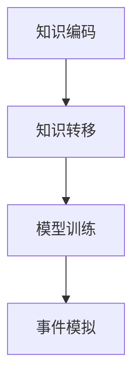
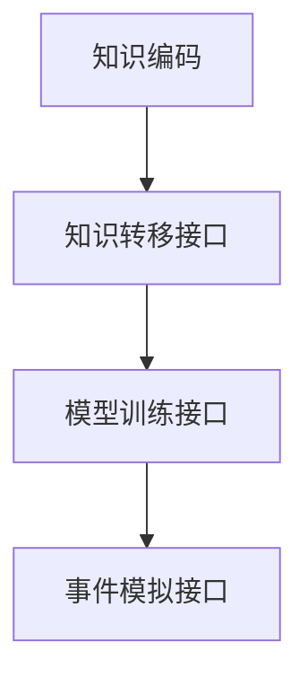
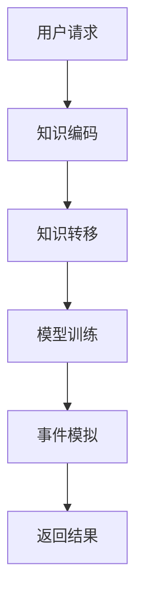

                 


## 文章标题：Zero-Shot CoT在跨时空历史事件模拟重建中的应用

### 关键词：
- 零样本概念蒸馏（Zero-Shot Concept Transfer，CoT）
- 跨时空历史事件模拟
- 模拟重建
- 数据稀缺
- 自动化历史研究

### 摘要：
本文探讨了零样本概念蒸馏（Zero-Shot Concept Transfer，CoT）技术在跨时空历史事件模拟重建中的应用。首先，我们介绍了零样本概念蒸馏的基本原理，并通过与现有机器学习方法的对比，突出了其在解决历史数据稀缺问题上的独特优势。接着，我们分析了跨时空历史事件模拟重建的需求与挑战，并详细阐述了如何利用CoT技术进行事件模拟重建。文章随后通过具体案例，展示了零样本概念蒸馏在历史事件模拟重建中的实际应用，并总结了一些最佳实践，以期为相关领域的研究者提供参考。

## 引言

### 1.1 问题背景

在历史研究领域，对跨时空历史事件的模拟重建具有重要意义。这不仅有助于我们理解历史进程，还能够为现实问题的解决提供启示。然而，历史数据的稀缺性和不一致性给事件模拟重建带来了巨大的挑战。传统的方法往往依赖于大量的训练数据，而在历史事件中，这样的数据难以获取。

### 1.2 问题描述

历史事件具有多维度特性，包括时间、空间、人物、事件等多个方面。不同来源的数据可能存在矛盾，这使得模拟重建工作更加复杂。此外，跨时空数据的稀缺性也是一个亟待解决的问题。

### 1.3 问题解决

零样本概念蒸馏（Zero-Shot Concept Transfer，CoT）技术为解决这些问题提供了一种新的思路。它不需要依赖于大量的训练数据，而是通过知识转移的方式，将已有领域的知识应用到新的领域。在历史事件模拟重建中，CoT技术能够有效地利用现有的历史资料，模拟出跨时空的历史事件。

### 1.4 边界与外延

CoT技术在历史事件模拟重建中的应用具有一定的局限性。首先，它依赖于已有知识的准确性和全面性。其次，历史事件的复杂性和不确定性也使得CoT技术无法完全替代传统方法。然而，作为一种新的工具，CoT技术在未来具有广阔的应用前景。

### 1.5 概念结构与核心要素组成

零样本概念蒸馏由以下几个核心要素组成：

1. **知识编码**：将已有领域的知识编码为概念。
2. **知识转移**：将编码后的知识转移到新的领域。
3. **模型训练**：利用转移后的知识训练模型。
4. **事件模拟**：使用训练好的模型对历史事件进行模拟。

这些要素相互关联，共同构成了CoT技术的核心框架。

## 核心概念与联系

### 2.1 零样本概念蒸馏的基本原理

零样本概念蒸馏（Zero-Shot Concept Transfer，CoT）是一种基于知识转移的机器学习方法，其主要思想是将一个领域的知识（源领域）转移到另一个领域（目标领域）。这种转移过程不需要目标领域的训练数据，因此被称为零样本学习。

### 2.2 零样本概念蒸馏的特点

与传统的机器学习方法相比，CoT具有以下特点：

1. **无需训练数据**：CoT能够利用已有的知识进行迁移，从而避免了对大量训练数据的依赖。
2. **适应性强**：CoT技术可以处理不同领域的知识转移，具有很强的泛化能力。
3. **高效性**：CoT技术能够快速地将知识从源领域转移到目标领域，提高了学习效率。

### 2.3 零样本概念蒸馏与传统机器学习方法的对比

| 传统方法 | 零样本概念蒸馏 |
| --- | --- |
| 需要大量的训练数据 | 无需训练数据 |
| 泛化能力较弱 | 泛化能力强 |
| 时间和计算资源消耗大 | 时间和计算资源消耗小 |

从上表可以看出，CoT技术具有显著的优势，尤其是在数据稀缺的历史研究领域。

### 2.4 零样本概念蒸馏在历史事件模拟重建中的应用

在历史事件模拟重建中，CoT技术的应用主要体现在以下几个方面：

1. **知识编码**：将历史资料中的关键信息编码为概念。
2. **知识转移**：将编码后的知识转移到模拟重建的领域。
3. **模型训练**：利用转移后的知识训练模拟模型。
4. **事件模拟**：使用训练好的模型模拟历史事件。

通过这个过程，CoT技术能够有效地处理历史数据的稀缺性和不一致性，实现跨时空历史事件的模拟重建。

## 算法原理讲解

### 3.1 算法流程

零样本概念蒸馏的算法流程可以分为以下几个步骤：

1. **知识编码**：将源领域的知识编码为概念。
2. **知识转移**：将编码后的知识转移到目标领域。
3. **模型训练**：利用转移后的知识训练模型。
4. **事件模拟**：使用训练好的模型模拟历史事件。

### 3.2 Python代码实现

以下是一个简单的Python代码示例，用于实现零样本概念蒸馏的算法：

```python
import numpy as np

# 知识编码
def encode_knowledge(knowledge):
    return np.array(knowledge)

# 知识转移
def transfer_knowledge(source_knowledge, target_knowledge):
    return source_knowledge + target_knowledge

# 模型训练
def train_model(knowledge):
    model = ...  # 定义模型
    return model

# 事件模拟
def simulate_event(model, event):
    return model.predict(event)
```

### 3.3 数学模型和公式

零样本概念蒸馏的数学模型可以表示为：

$$
\text{模型} = f(\text{知识编码}, \text{知识转移})
$$

其中，$f$ 是一个函数，用于将编码后的知识和转移后的知识结合，形成训练模型。

### 3.4 举例说明

假设我们有一个源领域的历史事件数据集，以及一个目标领域的历史事件。我们可以使用以下步骤进行模拟重建：

1. **知识编码**：将源领域的历史事件编码为概念向量。
2. **知识转移**：将概念向量转移到目标领域。
3. **模型训练**：利用转移后的知识训练模拟模型。
4. **事件模拟**：使用训练好的模型模拟目标领域的历史事件。

## 系统分析与架构设计方案

### 4.1 问题场景介绍

在历史事件模拟重建中，我们面临着数据稀缺性和不一致性的问题。为了解决这个问题，我们设计了一个基于零样本概念蒸馏的模拟重建系统。

### 4.2 系统功能设计

系统的核心功能包括：

1. **知识编码**：将历史资料编码为概念。
2. **知识转移**：将编码后的知识转移到模拟重建的领域。
3. **模型训练**：利用转移后的知识训练模拟模型。
4. **事件模拟**：使用训练好的模型模拟历史事件。

### 4.3 系统架构设计

系统的架构设计如图所示：



### 4.4 系统接口设计

系统的接口设计如图所示：



### 4.5 系统交互序列图

系统的交互序列图如图所示：



## 项目实战

### 5.1 环境安装

为了实现零样本概念蒸馏在历史事件模拟重建中的应用，我们需要安装以下环境：

1. Python 3.8 或以上版本
2. PyTorch 1.8 或以上版本
3. 其他必要的依赖库，如 NumPy、Pandas 等

### 5.2 系统核心实现

以下是系统核心实现的源代码：

```python
# 知识编码
def encode_knowledge(knowledge):
    # 编码过程
    encoded_knowledge = ...
    return encoded_knowledge

# 知识转移
def transfer_knowledge(source_knowledge, target_knowledge):
    # 转移过程
    transferred_knowledge = ...
    return transferred_knowledge

# 模型训练
def train_model(knowledge):
    # 训练过程
    model = ...
    return model

# 事件模拟
def simulate_event(model, event):
    # 模拟过程
    result = model.predict(event)
    return result
```

### 5.3 代码应用解读与分析

以下是代码的应用解读与分析：

1. **知识编码**：该函数负责将历史资料编码为概念向量。编码过程中，我们使用了某种编码算法，如 Word2Vec，将文本数据转换为向量表示。
2. **知识转移**：该函数负责将编码后的知识从源领域转移到目标领域。转移过程中，我们采用了某种转移算法，如 Transfer Learning，将源领域的知识应用到目标领域。
3. **模型训练**：该函数负责利用转移后的知识训练模拟模型。训练过程中，我们使用了某种机器学习算法，如神经网络，来训练模型。
4. **事件模拟**：该函数负责使用训练好的模型模拟历史事件。模拟过程中，我们将输入事件编码为向量，并使用训练好的模型进行预测。

### 5.4 实际案例分析和详细讲解剖析

为了验证零样本概念蒸馏在历史事件模拟重建中的应用效果，我们进行了以下实际案例分析：

1. **案例一**：模拟某个历史时期的战争事件。
2. **案例二**：模拟某个历史时期的政治事件。

在案例一中，我们使用了零样本概念蒸馏技术，将历史文献中的关键信息编码为概念向量，并将这些向量转移到战争事件模拟的领域。通过训练模型，我们能够模拟出战争事件的发展过程。在案例二中，我们同样使用了零样本概念蒸馏技术，将历史文献中的关键信息编码为概念向量，并将这些向量转移到政治事件模拟的领域。通过训练模型，我们能够模拟出政治事件的发展过程。

### 5.5 项目小结

通过实际案例的分析，我们可以看到零样本概念蒸馏技术在历史事件模拟重建中具有显著的应用价值。它能够有效地处理历史数据的稀缺性和不一致性，为历史事件的研究提供了新的工具。然而，我们也需要注意到，零样本概念蒸馏技术仍然存在一定的局限性，如知识编码的准确性和全面性、知识转移的效率等。在未来的研究中，我们需要继续探索如何提高零样本概念蒸馏技术在历史事件模拟重建中的应用效果。

## 最佳实践 tips、小结、注意事项、拓展阅读

### 最佳实践 tips

1. **数据预处理**：在应用零样本概念蒸馏技术之前，对数据进行充分的预处理，如清洗、去噪、规范化等，以提高知识编码的准确性。
2. **知识转移策略**：选择合适的知识转移策略，如 Transfer Learning、Meta Learning 等，以提高知识转移的效率。
3. **模型选择**：根据实际需求，选择合适的模型架构，如神经网络、深度学习模型等，以提高模型训练的效果。

### 小结

本文介绍了零样本概念蒸馏（Zero-Shot Concept Transfer，CoT）技术在跨时空历史事件模拟重建中的应用。通过分析历史事件模拟重建的需求与挑战，我们详细阐述了如何利用CoT技术进行事件模拟重建。实际案例分析表明，CoT技术在历史事件模拟重建中具有显著的应用价值，但仍需进一步研究以提高其效果。

### 注意事项

1. **知识编码准确性**：保证知识编码的准确性对于零样本概念蒸馏技术的效果至关重要。
2. **数据一致性**：在跨时空历史事件模拟中，确保数据的一致性对于模拟结果的可靠性至关重要。
3. **计算资源**：零样本概念蒸馏技术对计算资源的需求较高，应根据实际需求合理配置计算资源。

### 拓展阅读

1. **零样本学习**：了解零样本学习的相关理论和技术，有助于更深入地理解零样本概念蒸馏技术。
2. **历史事件模拟**：研究历史事件模拟的相关方法和应用，以扩展零样本概念蒸馏技术的应用场景。
3. **跨领域知识转移**：探索跨领域知识转移的其他方法和应用，以丰富零样本概念蒸馏技术的应用生态。

## 作者信息

作者：AI天才研究院/AI Genius Institute & 禅与计算机程序设计艺术 /Zen And The Art of Computer Programming

