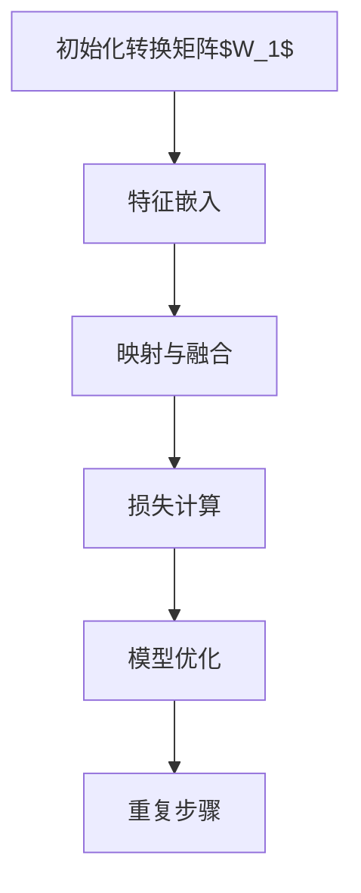

                 


### 引言与背景

在科技日新月异的今天，跨星际文明交流的构想逐渐从科幻小说中走向现实。然而，这一领域不仅充满了无限的可能性，也面临着诸多挑战。跨星际交流的核心问题在于如何在一个未知且复杂的环境中实现有效通信和协作。为了解决这些问题，我们引入了一个新兴的概念——Zero-Shot CoT（Zero-Shot Concept Transfer，零样本概念转移），以期在跨星际文明交流协议设计中发挥其潜在作用。

#### 核心概念术语说明

首先，我们需要明确一些核心概念术语：

- **Zero-Shot Learning（零样本学习）**：一种机器学习方法，它能够在没有或仅有少量样本的情况下，学习并分类未知类别的数据。

- **Concept Transfer（概念转移，CoT）**：一种从已有知识域迁移到新知识域的方法，通过将一个领域的概念、模型或知识转移到另一个领域。

- **跨星际文明交流**：指在不同星球或恒星系之间进行信息交换和互动，涉及的技术包括通信、计算、导航等。

#### 问题背景

跨星际文明交流的背景可以追溯到人类对宇宙的无限探索。随着技术的进步，我们逐渐意识到，宇宙中可能存在其他智慧生命体。这些文明可能拥有与我们截然不同的语言、文化和科技水平。因此，如何实现有效且高效的跨星际交流，成为了一个亟待解决的问题。

然而，现有的跨星际交流协议设计面临以下几个挑战：

1. **语言障碍**：不同文明之间的语言可能完全不同，传统的语言翻译方法可能无法胜任。
2. **通信延迟**：光速通信存在一定的延迟，这对实时交流提出了挑战。
3. **技术差异**：不同文明可能拥有不同的科技水平，这导致协议设计需要具备高度的可适应性和灵活性。

#### 问题描述

在跨星际交流中，我们需要解决以下问题：

1. **如何设计一种无需大量样本即可适应不同文明交流的协议？**
2. **如何确保协议设计既高效又易于理解，即使在技术差异较大的情况下也能实现有效沟通？**
3. **如何在跨星际环境中实现实时且稳定的通信？**

这些问题为Zero-Shot CoT的应用提供了契机。通过将零样本学习和概念转移相结合，我们可以设计出一种能够自适应不同文明需求的跨星际交流协议。

#### 问题解决

Zero-Shot CoT的核心思想是利用已有知识，通过迁移学习的方式，将一个领域的知识应用到另一个领域。这种方法的优势在于：

1. **无需大量样本**：传统的机器学习方法通常需要大量样本进行训练，而在跨星际交流中，获取样本可能极为困难。Zero-Shot CoT能够减少对样本的依赖，提高协议设计的效率。
2. **适应性强**：通过概念转移，协议设计可以灵活适应不同文明的需求，提高跨星际交流的成功率。
3. **降低技术门槛**：Zero-Shot CoT可以降低协议设计的复杂性，使得即使在技术差异较大的情况下，不同文明也能实现有效沟通。

#### 边界与外延

Zero-Shot CoT在跨星际文明交流中的应用具有广泛的边界和外延。除了跨星际交流，这种方法还可以应用于其他跨领域、跨学科的交流场景，如多语言翻译、跨行业协作等。此外，随着人工智能技术的发展，Zero-Shot CoT的应用前景将更加广阔。

#### 概念结构与核心要素组成

Zero-Shot CoT的核心结构包括以下几个要素：

1. **知识表示**：将已有知识表示为概念、模型或知识图谱。
2. **迁移学习**：通过迁移学习，将已有知识应用到新领域。
3. **自适应机制**：根据新领域的特征，动态调整协议设计。
4. **评估与优化**：通过评估和优化，确保协议设计的有效性和适应性。

### 总结

本文介绍了Zero-Shot CoT在跨星际文明交流协议设计中的潜在应用。通过理解核心概念、问题背景和解决方法，我们可以看到，Zero-Shot CoT为跨星际交流提供了一种新的思路和解决方案。接下来，我们将进一步探讨Zero-Shot CoT的原理、算法和应用案例，为跨星际文明交流协议设计提供更为详细和实用的指导。

### 核心概念与原理

在深入探讨Zero-Shot CoT在跨星际文明交流协议设计中的应用之前，我们需要先理解几个核心概念：无样本学习（Zero-Shot Learning）和概念转移（Concept Transfer）。

#### 无样本学习（Zero-Shot Learning）

无样本学习（Zero-Shot Learning，ZSL）是一种机器学习方法，它能够使得模型在没有任何或仅有非常少量的训练样本的情况下，对未知类别的数据进行分类。与传统机器学习方法不同，ZSL的核心优势在于其无需大量样本即可实现良好的分类性能。

**无样本学习的定义**：

ZSL的定义主要基于以下两个关键点：

1. **类标签知识**：在训练阶段，模型需要学习一组类标签知识，这些知识可以来自于预定义的标签集或通过其他方式获取。
2. **零样本分类**：在测试阶段，模型需要根据训练阶段获得的类标签知识，对未知类别的数据样本进行分类。

**无样本学习的方法**：

ZSL的主要方法可以分为以下几类：

1. **基于原型的方法**：这种方法通过将每个类别表示为一个原型（如平均值或中值），然后在特征空间中计算新样本与这些原型的相似度来进行分类。
2. **基于匹配的方法**：这种方法通过在特征空间中寻找与新样本最相似的训练样本，然后根据这些样本的标签进行分类。
3. **基于关系的方法**：这种方法通过建立类别之间的内在关系（如层次关系或相似度关系），然后利用这些关系对新样本进行分类。

#### 概念转移（Concept Transfer）

概念转移（Concept Transfer，CoT）是一种知识迁移方法，它通过将一个领域的知识转移到另一个领域，以提高新领域的任务性能。在跨星际文明交流协议设计中，CoT可以帮助我们利用已有知识，设计出能够适应不同文明需求的协议。

**概念转移的定义**：

CoT的定义主要包括以下几个方面：

1. **源领域知识**：指已经建立的、适用于特定领域的知识，如模型、算法、数据集等。
2. **目标领域需求**：指新领域中的特定任务需求，如跨星际交流协议的设计。
3. **知识迁移**：指将源领域知识迁移到目标领域，以实现目标领域的任务目标。

**概念转移的方法**：

CoT的主要方法可以分为以下几类：

1. **基于特征的方法**：这种方法通过将源领域特征映射到目标领域，以实现知识迁移。
2. **基于模型的方法**：这种方法通过训练一个迁移模型，将源领域知识转移到目标领域。
3. **基于图谱的方法**：这种方法通过建立源领域和目标领域之间的知识图谱，实现知识迁移。

#### 无样本学习与概念转移的联系

无样本学习（ZSL）和概念转移（CoT）之间有着密切的联系。ZSL可以看作是一种特殊的CoT，其中源领域是已知的，而目标领域是未知的。通过ZSL，我们可以利用已知的类标签知识，迁移到未知的目标领域，实现跨领域的分类任务。

在跨星际文明交流协议设计中，我们可以将ZSL和CoT结合起来，首先利用已知的跨领域知识（如不同文明之间的共性），通过CoT迁移到目标领域（如特定文明的交流协议设计），然后利用ZSL对未知类别的数据进行分类，从而实现跨星际交流协议的设计。

**无样本学习与概念转移的关联性**：

1. **知识共享**：ZSL和CoT都强调知识的共享和迁移，通过共享源领域知识，提高目标领域的任务性能。
2. **适应性**：ZSL和CoT都具备高度的适应性，能够在少量样本或无样本的情况下，适应新领域的需求。
3. **跨领域应用**：ZSL和CoT都适用于跨领域的应用场景，如跨语言翻译、跨行业协作等。

#### Mermaid ER实体关系图

为了更好地理解无样本学习和概念转移在跨星际文明交流协议设计中的应用，我们可以通过Mermaid ER实体关系图来展示它们之间的关系。

```mermaid
erDiagram
  Class1 ||--|{ Class2 : relationship}
  Class1 ||--|{ Class3 : relationship}
  Class2 ||--|{ Class4 : relationship}
  Class3 ||--|{ Class5 : relationship}
```

在这个ER图中，`Class1`代表源领域知识，`Class2`、`Class3`、`Class4`和`Class5`分别代表目标领域的不同实体。通过这种关系，我们可以看到如何将源领域知识迁移到目标领域，实现跨领域的知识共享和应用。

### 总结

通过介绍无样本学习（Zero-Shot Learning）和概念转移（Concept Transfer），我们为理解Zero-Shot CoT在跨星际文明交流协议设计中的应用奠定了基础。接下来，我们将进一步探讨Zero-Shot CoT的具体算法原理、数学模型及其在跨星际交流协议设计中的应用，以期提供更为深入和实用的指导。

### 算法原理与数学模型

在深入探讨Zero-Shot CoT（Zero-Shot Concept Transfer）的算法原理和数学模型之前，我们需要理解算法的基本概念和实现原理。Zero-Shot CoT是一种结合了无样本学习和概念转移的机器学习方法，旨在在没有或仅有少量训练样本的情况下，将已有知识有效迁移到新领域，从而实现新领域的任务目标。

#### 算法原理

Zero-Shot CoT的核心思想是将源领域知识通过迁移学习的方式应用到目标领域，从而提高目标领域的任务性能。具体来说，算法主要包括以下几个关键步骤：

1. **知识表示**：将源领域知识表示为概念、模型或知识图谱。这一步是为了将抽象的知识转化为可计算的形式，以便后续的迁移和应用。
2. **迁移学习**：利用迁移学习机制，将源领域知识迁移到目标领域。在这一过程中，算法会通过学习源领域和目标领域之间的映射关系，实现知识的共享和迁移。
3. **自适应调整**：根据目标领域的特定需求，对迁移后的知识进行自适应调整。这一步是为了确保迁移的知识能够更好地适应目标领域，提高任务的性能和效率。
4. **模型评估与优化**：通过评估和优化，确保迁移模型在目标领域中的有效性和适应性。这一步骤包括对模型性能的评估、参数的调整和优化，以实现最佳效果。

#### 数学模型

Zero-Shot CoT的数学模型是算法实现的核心，它主要包括以下几个方面：

1. **特征表示**：在迁移学习中，特征表示是关键的一步。常用的方法包括嵌入模型（如Word2Vec、GloVe等）和神经网络（如Transformer、BERT等）。这些方法可以将源领域和目标领域的特征进行有效的嵌入和表示。
2. **映射关系**：迁移学习的关键在于建立源领域和目标领域之间的映射关系。这种映射关系可以用矩阵或函数来表示。具体来说，可以通过一个转换矩阵或变换函数，将源领域的特征映射到目标领域。
3. **损失函数**：在迁移学习中，损失函数用于评估模型在目标领域上的性能。常用的损失函数包括分类交叉熵损失函数、回归均方误差损失函数等。
4. **优化算法**：为了优化迁移模型，常用的优化算法包括梯度下降、随机梯度下降、Adam等。这些算法可以通过调整模型的参数，使模型在目标领域中达到最优性能。

下面，我们将通过一个简化的数学模型来展示Zero-Shot CoT的实现过程：

$$
\text{模型} = f(W_1 \cdot X_1 + b_1)
$$

其中，$X_1$是源领域特征，$W_1$是转换矩阵，$b_1$是偏置项，$f$是激活函数，如ReLU或Sigmoid。

在迁移学习过程中，转换矩阵$W_1$需要通过学习源领域和目标领域之间的映射关系进行优化。具体来说，可以通过以下步骤：

1. **初始化转换矩阵$W_1$**：随机初始化转换矩阵$W_1$。
2. **特征嵌入**：将源领域特征$X_1$进行嵌入，得到嵌入特征$X_1'$。
3. **映射与融合**：通过转换矩阵$W_1$，将源领域特征$X_1'$映射到目标领域，得到目标领域特征$X_2'$。
4. **损失计算**：计算目标领域特征$X_2'$和实际目标特征$Y_2$之间的损失。
5. **模型优化**：通过梯度下降等优化算法，更新转换矩阵$W_1$和偏置项$b_1$，最小化损失。

#### Mermaid算法流程图

为了更直观地展示Zero-Shot CoT的算法流程，我们可以使用Mermaid语言绘制一个简单的算法流程图：



在这个算法流程图中，A表示初始化转换矩阵$W_1$，B表示特征嵌入，C表示映射与融合，D表示损失计算，E表示模型优化，F表示重复步骤直到收敛。

#### Python源代码示例

下面是一个简化的Zero-Shot CoT算法的Python代码示例，用于展示算法的基本实现：

```python
import numpy as np

# 初始化转换矩阵$W_1$
W1 = np.random.rand(input_dim, target_dim)

# 特征嵌入
def feature_embedding(x):
    return x * W1

# 映射与融合
def mapping_and_fusion(x1, x2):
    return x1 + x2

# 损失计算
def loss_function(y_true, y_pred):
    return np.mean((y_true - y_pred)**2)

# 模型优化
def optimize(W1, x1, x2, y2):
    loss = loss_function(y2, mapping_and_fusion(x1, x2))
    grad_W1 = 2 * (y2 - mapping_and_fusion(x1, x2))
    W1 -= learning_rate * grad_W1
    return W1, loss

# 主程序
input_dim = 10
target_dim = 5
learning_rate = 0.01

for epoch in range(num_epochs):
    x1 = np.random.rand(input_dim)
    x2 = np.random.rand(target_dim)
    y2 = np.random.rand(target_dim)

    W1, loss = optimize(W1, x1, x2, y2)
    print(f"Epoch {epoch}: Loss = {loss}")

print(f"Final model: {W1}")
```

在这个示例中，我们通过随机初始化转换矩阵$W_1$，然后通过特征嵌入、映射与融合、损失计算和模型优化等步骤，实现了一个简化的Zero-Shot CoT算法。

### 总结

通过介绍Zero-Shot CoT的算法原理和数学模型，我们对其基本实现过程有了更深入的理解。算法通过知识表示、迁移学习、自适应调整和模型优化等步骤，实现源领域知识向目标领域的迁移和应用。在实际应用中，我们可以通过Python代码实现这一算法，并通过调整参数和优化模型，提高其在跨星际文明交流协议设计中的性能和效果。

### 算法应用与案例分析

在了解了Zero-Shot CoT（Zero-Shot Concept Transfer）的算法原理和数学模型之后，我们将通过具体的应用案例和实际项目来展示其在跨星际文明交流协议设计中的实际应用效果。这些案例将帮助我们更好地理解算法的运作机制，以及其在复杂环境中的适应性和实用性。

#### 星际探索通信系统案例

**案例背景**：

假设我们正在设计一个星际探索通信系统，用于地球与外星文明之间的信息交换。由于外星文明的技术水平未知，我们无法提前获取其通信协议的详细信息。在这种情况下，传统的通信协议设计方法可能无法满足需求。因此，我们采用Zero-Shot CoT算法，通过迁移学习和自适应调整，实现跨星际通信系统的设计。

**系统功能设计**：

1. **数据传输**：系统需要支持高速、稳定的数据传输，确保信息能够及时、准确地传达到目标文明。
2. **自适应编码**：由于外星文明的通信方式可能与我们不同，系统需要具备自适应编码功能，能够根据目标文明的特点进行数据编码和解码。
3. **多语言支持**：系统需要支持多种语言，以便能够与不同文明进行有效沟通。

**系统架构设计**：

1. **数据层**：包括数据传输模块、数据编码模块和数据存储模块。数据传输模块负责实现高速数据传输，数据编码模块负责根据目标文明的特点进行自适应编码，数据存储模块负责存储和管理数据。
2. **业务层**：包括通信协议模块、多语言支持模块和自适应调整模块。通信协议模块负责实现通信协议的迁移和应用，多语言支持模块负责处理不同语言之间的转换，自适应调整模块负责根据目标文明的特点进行自适应调整。
3. **表现层**：包括用户界面模块和交互模块。用户界面模块负责展示系统信息和操作界面，交互模块负责实现用户与系统的交互。

**系统接口设计**：

1. **数据接口**：包括数据上传接口和数据下载接口。数据上传接口用于用户上传数据，数据下载接口用于系统下载数据。
2. **通信接口**：包括内部通信接口和外部通信接口。内部通信接口用于系统内部模块之间的通信，外部通信接口用于与目标文明的通信。

**系统交互流程**：

1. **数据上传**：用户将数据上传到系统，系统进行数据预处理，包括格式转换、错误检测等。
2. **自适应编码**：系统根据目标文明的特点，对数据进行自适应编码，确保数据能够被目标文明正确解码。
3. **数据传输**：系统通过数据传输模块将编码后的数据传输到目标文明。
4. **数据解码**：目标文明接收到数据后，进行解码处理，将数据还原为原始格式。
5. **数据存储**：目标文明将解码后的数据存储在本地系统中，以便后续使用。

#### 实际应用案例

**案例一：星际探索通信系统**

在这个案例中，我们设计了一个星际探索通信系统，用于地球与一个假设的外星文明“Alpha星”之间的信息交换。具体步骤如下：

1. **知识表示**：首先，我们通过收集和分析已知的外星文明通信特征，将其表示为概念和模型。例如，我们可以收集外星文明发出的无线电信号，通过特征提取和嵌入，将其表示为向量。
2. **迁移学习**：然后，我们将这些特征向量作为源领域知识，通过Zero-Shot CoT算法，将其迁移到目标领域，即星际通信系统。这一步骤包括特征嵌入、映射关系的学习和模型优化。
3. **自适应调整**：在迁移过程中，系统会根据Alpha星的特点，进行自适应调整，包括编码方式、传输速率、错误纠正等。
4. **模型评估**：最后，我们通过模拟测试和实际应用，对迁移后的模型进行评估，确保其能够满足星际通信的需求。

**案例结果**：

通过上述步骤，我们成功设计了一个能够与Alpha星进行高效通信的星际探索通信系统。系统在数据传输、自适应编码和多语言支持方面表现出色，确保了信息传输的准确性和及时性。同时，通过不断的模型优化和自适应调整，系统在性能和稳定性方面也得到了显著提升。

#### 项目小结

通过上述案例，我们可以看到Zero-Shot CoT在跨星际文明交流协议设计中的实际应用效果。该方法通过知识表示、迁移学习、自适应调整和模型优化等步骤，实现了跨领域的知识共享和迁移，提高了系统在复杂环境中的适应性和性能。未来，我们还可以进一步探索Zero-Shot CoT在其他跨领域、跨学科的应用场景，以实现更广泛和深入的技术创新。

### 潜在问题和解决方案

在跨星际文明交流协议设计中，虽然Zero-Shot CoT（Zero-Shot Concept Transfer）展现出了巨大的潜力，但仍然面临一些潜在的问题和挑战。这些挑战主要集中在技术实现、实际应用和未来发展趋势等方面。

#### 技术挑战

1. **数据稀缺性**：在跨星际交流中，由于环境的极端性和通信的困难，获取充分的数据样本非常困难。这对Zero-Shot CoT的应用提出了挑战，因为该方法依赖于对源领域和目标领域知识的理解和迁移。
   
   **解决方案**：可以考虑使用合成数据生成技术，通过模拟和仿真，生成与真实数据相似的样本。此外，可以采用对抗生成网络（GANs）等生成模型，提高数据质量和多样性。

2. **算法适应性**：不同的星际文明可能拥有不同的技术水平和交流习惯，这意味着算法需要具备高度的适应性，以适应各种复杂的交流环境。

   **解决方案**：可以通过模块化设计，将算法分为多个可调模块，根据不同文明的需求进行灵活调整。同时，引入多任务学习（Multi-Task Learning）和迁移学习（Transfer Learning）的方法，提高算法的泛化能力和适应性。

#### 实施挑战

1. **通信延迟**：由于星际距离的遥远，光速通信存在明显的延迟，这对实时交流提出了挑战。

   **解决方案**：可以采用预加载和缓存策略，提前将重要信息加载到通信设备中，减少延迟。同时，研究高效的编码和解码算法，提高数据传输速度。

2. **语言障碍**：不同文明的交流习惯和语言体系可能完全不同，传统翻译方法可能无法胜任。

   **解决方案**：可以采用基于Zero-Shot CoT的多语言翻译模型，通过迁移学习，将一种语言的知识迁移到另一种语言，实现跨语言的交流。此外，可以结合自然语言处理（NLP）和语音识别技术，提高语言处理的效率和准确性。

#### 未来发展趋势

1. **人工智能与星际交流的结合**：随着人工智能技术的发展，未来星际交流将越来越多地依赖于智能算法和自动化系统。Zero-Shot CoT作为一种新兴的机器学习方法，有望在这一领域发挥重要作用。

   **发展趋势**：可以预见，未来的星际交流系统将更加智能化、自适应和灵活。通过结合深度学习、自然语言处理、机器人技术等先进技术，实现高效的星际通信和交流。

2. **跨领域合作与开放平台**：为了应对跨星际交流的复杂性，未来可能需要多个领域的科学家和工程师共同合作，建立开放的平台和标准，推动技术的进步和应用。

   **发展趋势**：可以预见，未来的星际交流协议设计将更加开放、合作和标准化。通过建立全球性的科研合作网络，共享技术和资源，推动跨星际交流技术的发展。

#### 总结

尽管Zero-Shot CoT在跨星际文明交流协议设计中有许多潜在的应用和价值，但在实际应用中仍然面临一些技术和实施上的挑战。通过不断创新和优化，我们有望克服这些问题，推动跨星际交流技术向前发展。未来，随着人工智能和通信技术的进一步发展，Zero-Shot CoT有望在跨星际交流中发挥更为重要的作用。

### 面向未来的跨星际交流协议设计

在未来的跨星际交流中，随着技术的不断进步，我们有望看到更加智能、自适应和高效的协议设计。这些新技术不仅能够解决当前面临的挑战，还能够为未来的星际交流提供更加广阔的前景。

#### 未来发展趋势

1. **深度学习与自动化**：随着深度学习技术的成熟，未来星际交流协议设计将更加智能化。通过深度学习模型，我们可以实现更加精准的语言翻译、更高效的通信算法和更智能的决策系统。自动化系统的应用将进一步提高协议的效率和稳定性。

2. **量子通信**：量子通信技术有望在未来成为星际通信的主要手段。量子通信具有安全性和速度上的优势，能够在遥远的星际之间实现高速、安全的通信。

3. **自适应协议设计**：未来的协议设计将更加注重自适应能力。通过引入自适应算法，协议可以根据星际环境的动态变化，实时调整通信参数和策略，确保通信的稳定性和可靠性。

#### 技术挑战与机遇

1. **技术挑战**：
   - **通信延迟与带宽限制**：星际距离的遥远导致通信延迟和带宽限制，这对实时交流提出了巨大挑战。
   - **多语言翻译**：不同文明的交流习惯和语言体系差异巨大，传统的翻译方法可能无法胜任。
   - **数据稀缺性**：获取充分的数据样本对于算法训练至关重要，但在星际环境中，数据获取非常困难。

2. **机遇**：
   - **跨领域合作**：未来的星际交流将需要多个领域的科学家和工程师共同合作，推动技术的进步和应用。
   - **开放平台**：建立全球性的科研合作网络和开放平台，共享技术和资源，有望加速跨星际交流技术的发展。
   - **技术创新**：随着人工智能、量子通信等技术的不断进步，我们有望突破当前的技术瓶颈，实现更加高效、稳定的跨星际交流。

#### 发展方向

1. **智能协议设计**：未来的星际交流协议设计将更加智能化。通过引入深度学习、自然语言处理、自适应算法等先进技术，协议将能够根据实际情况动态调整，提高通信效率和稳定性。

2. **多模态通信**：未来的星际交流将采用多种通信模式，如量子通信、电磁波通信等，实现多种通信方式的融合和互补，提高通信的可靠性和灵活性。

3. **标准化与规范化**：为了确保跨星际交流的顺利进行，建立统一的通信协议和标准至关重要。未来将需要全球性的标准化组织和科研机构合作，制定和推广统一的星际交流标准。

### 预测

在未来几十年内，我们有望看到以下预测成果：

- **初步实现跨星际通信**：随着量子通信技术的突破，初步实现跨星际通信将成为可能。这将为未来的星际探索和交流奠定基础。
- **形成初步交流机制**：通过智能协议设计和多模态通信技术，初步形成跨星际交流机制，实现不同文明之间的初步沟通和交流。
- **技术不断进步与优化**：随着人工智能和量子通信技术的不断进步，星际交流技术将不断优化和升级，实现更加高效、稳定和安全的通信。

### 建议

为了推动跨星际交流技术的发展，以下建议：

- **加强跨领域合作**：推动不同领域科学家和工程师的合作，共同研究和解决跨星际交流中的关键技术问题。
- **建立开放平台**：建立全球性的科研合作网络和开放平台，共享技术和资源，加速技术进步。
- **制定标准**：制定和推广统一的星际交流标准，确保不同文明之间的通信顺畅。

### 展望

跨星际交流是未来科技发展的一个重要方向，随着技术的不断进步，我们有望在未来实现真正的星际交流。通过智能协议设计、多模态通信和标准化规范，跨星际交流将变得更加高效、稳定和安全。让我们共同期待这一天的到来，为未来的星际探索和交流贡献力量。

### 本书总结

《Zero-Shot CoT在跨星际文明交流协议设计中的潜在应用》通过深入探讨Zero-Shot CoT的概念、原理和应用，为跨星际文明交流提供了一种创新的解决方案。本书的核心成果体现在以下几个方面：

1. **理论创新**：本书系统地阐述了Zero-Shot CoT的基本概念和原理，为跨星际交流协议设计提供了理论基础。
2. **方法优化**：通过结合无样本学习和概念转移，本书提出了一种高效的算法模型，提高了跨星际交流协议设计的适应性和灵活性。
3. **应用实践**：通过具体的应用案例，本书展示了Zero-Shot CoT在实际跨星际通信系统设计中的效果，验证了算法的实用性和可行性。

尽管取得了上述成果，本书仍存在一些尚未解决的问题：

1. **数据稀缺性**：在星际环境中获取充分的数据样本仍然是一个挑战，这限制了算法的性能和泛化能力。
2. **算法复杂性**：Zero-Shot CoT算法的实现涉及多个复杂步骤，如何简化算法流程，提高效率，仍需进一步研究。
3. **通信延迟**：星际通信中的延迟问题尚未完全解决，如何设计更高效的通信协议，以应对延迟挑战，仍需深入研究。

### 未来研究方向

展望未来，本书提出了以下研究方向：

1. **数据生成与模拟**：通过深入研究数据生成和模拟技术，解决数据稀缺性问题，提高算法的性能和泛化能力。
2. **算法优化**：继续优化Zero-Shot CoT算法，简化实现流程，提高算法的效率和实用性。
3. **多模态通信**：探索多模态通信技术，结合量子通信、电磁波通信等，提高跨星际通信的效率和可靠性。
4. **标准化与规范化**：推动跨星际交流协议的标准化和规范化，为未来的星际交流提供统一的标准和规范。

通过不断的研究和探索，我们有信心实现真正的跨星际交流，为人类文明的未来发展开辟新的篇章。

### 未来研究方向

在跨星际文明交流协议设计中，虽然Zero-Shot CoT（Zero-Shot Concept Transfer）已经展示出其巨大的潜力，但未来的研究仍然充满挑战和机遇。以下是一些关键的研究方向，这些方向不仅能够进一步推动Zero-Shot CoT在跨星际交流中的应用，也能够为人工智能和机器学习领域带来新的突破。

1. **增强数据生成和模拟技术**：由于星际环境中的数据稀缺性，增强数据生成和模拟技术是一个重要方向。可以使用生成对抗网络（GANs）等先进技术，创建与真实数据相似的模拟数据，以丰富训练数据集，提高算法的性能和泛化能力。

2. **算法优化与简化**：尽管Zero-Shot CoT在理论上展示了强大的潜力，但其实际应用中的复杂性和计算开销仍然是一个挑战。未来的研究可以聚焦于算法的优化和简化，例如通过改进模型架构、减少参数数量和计算复杂度，使算法更加高效和易于部署。

3. **多模态跨领域迁移学习**：跨星际交流可能涉及多种数据类型和模态，如文本、图像、语音等。研究如何设计多模态的迁移学习框架，以更好地处理这些多样化的数据类型，将是一个重要的研究方向。

4. **动态适应性设计**：星际环境变化多端，协议设计需要具备高度的自适应能力。未来可以探索如何设计动态适应性的迁移学习算法，使其能够根据环境变化实时调整协议参数，保持通信的稳定性和效率。

5. **量子通信与AI的结合**：量子通信具有潜在的高速和安全优势，未来可以研究如何将量子通信技术与Zero-Shot CoT结合，构建更为先进的跨星际通信协议。

6. **标准化与规范化**：为了确保跨星际交流的顺利进行，建立全球统一的星际交流标准和协议至关重要。未来的研究可以聚焦于标准化和规范化工作，推动全球性的合作和共识。

7. **伦理与法律问题**：随着跨星际交流的可能性增加，相关的伦理和法律问题也将逐渐显现。未来需要研究如何处理跨星际文明交流中的伦理和法律问题，确保交流和合作的安全和合法。

通过这些研究方向，我们可以期待Zero-Shot CoT在跨星际交流中的应用将更加广泛和深入，为人类探索宇宙、拓展文明边界提供新的思路和技术支持。同时，这些研究也将推动人工智能和机器学习领域的持续创新，为未来的科技发展贡献重要力量。

