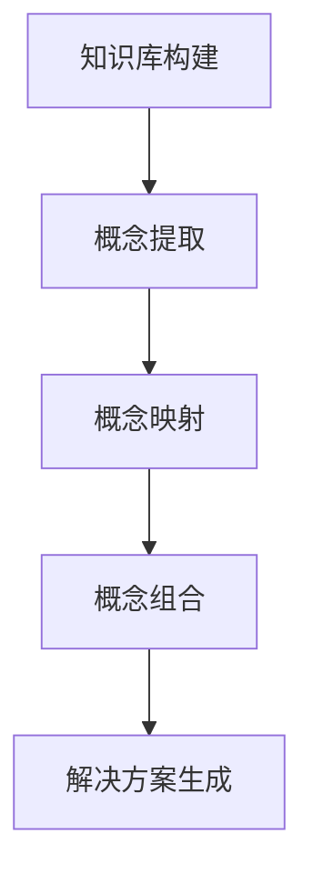
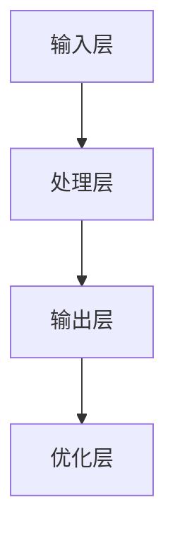
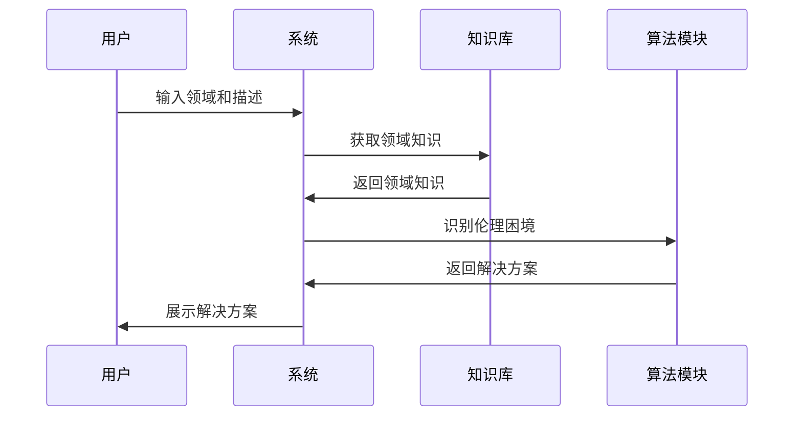

                 

### 第一部分：背景介绍

#### 1.1 问题背景

##### 1.1.1 跨领域伦理困境的普遍性

在当今快速发展的科技时代，人工智能（AI）的应用已经深入到我们生活的方方面面。然而，随之而来的跨领域伦理困境也日益突出。无论是医疗、金融、交通，还是网络安全，伦理问题已经成为了这些领域中不可忽视的重要议题。

医疗领域，AI在诊断和治疗方面的应用虽然提高了效率，但也引发了一系列伦理问题。例如，AI诊断系统的准确性和公正性如何保证？如何处理患者隐私和数据安全？这些问题都直接关系到医疗伦理的基本原则。

金融领域，AI在风险评估和投资决策中的应用同样带来了伦理挑战。机器学习算法在处理海量数据时，可能会产生歧视现象，如何避免这种偏见并确保金融市场的公平性，成为了重要的伦理议题。

交通领域，自动驾驶技术的发展引发了关于责任归属、道路安全和隐私保护的伦理讨论。如果自动驾驶车辆发生交通事故，责任应如何划分？如何确保道路上的数据安全，避免隐私泄露？

网络安全领域，AI在防御网络攻击方面的应用日益广泛。然而，这也引发了一系列关于人工智能在安全决策中的伦理问题。例如，AI如何处理复杂的安全威胁，如何在遵守法律法规的同时保护用户隐私？

##### 1.1.2 伦理困境的复杂性

跨领域的伦理困境具有复杂性，主要体现在以下几个方面：

1. **多层次性**：伦理困境通常涉及多个层次，包括技术、法律、社会和文化等。解决这些困境需要综合多方面的知识。

2. **动态性**：随着科技的不断进步，伦理困境也在不断演变。例如，新的AI技术的出现可能会引发新的伦理问题。

3. **利益冲突**：不同利益相关者（如企业、政府、公众）在伦理困境中可能存在不同的利益诉求，如何平衡这些利益成为一大挑战。

4. **不确定性**：许多伦理问题涉及未来的不确定性，例如AI技术的长期影响、社会接受度等，这些都增加了伦理困境的复杂性。

##### 1.1.3 传统解决方案的局限

传统解决方案在面对跨领域的伦理困境时存在一些局限：

1. **单一学科视角**：传统方法往往依赖某一学科的知识，如伦理学、法学等，但跨领域的伦理困境需要多学科的综合分析。

2. **滞后性**：法律和规范的制定通常滞后于技术的发展，导致伦理困境无法及时得到解决。

3. **强制性质**：传统解决方案往往依赖于强制性的法律和规范，但这种方式可能无法解决深层次的价值冲突。

4. **不适应性**：传统方法在处理复杂和动态的伦理问题时，可能显得力不从心。

#### 1.2 核心概念

##### 1.2.1 Zero-Shot CoT的概念

Zero-Shot CoT（Zero-Shot Conceptual Blending）是一种新型的人工智能算法，它能够处理跨领域的伦理困境。Zero-Shot CoT利用了概念融合（Conceptual Blending）原理，能够在没有预先训练数据的情况下，对新的伦理困境进行有效的分析和解决。

概念融合是一种基于人类认知过程的算法，它通过将不同领域的概念进行组合，生成新的解决方案。这种算法的优势在于，它能够利用现有的知识库，对新的伦理问题进行快速理解和处理。

##### 1.2.2 CoT（Conceptual Blending）原理

CoT（Conceptual Blending）原理的核心在于将不同领域的概念进行融合。具体来说，它通过以下步骤实现：

1. **概念提取**：从不同的知识源中提取相关概念。
2. **概念映射**：将提取的概念进行映射，找到它们之间的关联。
3. **概念组合**：将映射后的概念进行组合，生成新的概念。
4. **解决方案生成**：利用组合后的概念，生成针对伦理困境的解决方案。

##### 1.2.3 伦理困境解决的创新需求

在跨领域的伦理困境解决中，传统方法存在一定的局限性，而Zero-Shot CoT提供了一种创新的解决方案：

1. **快速响应**：Zero-Shot CoT能够在没有预先训练数据的情况下，对新的伦理困境进行快速分析和处理，满足动态性需求。
2. **多学科融合**：通过概念融合原理，Zero-Shot CoT能够综合不同领域的知识，提供全面的解决方案。
3. **适应性**：Zero-Shot CoT能够适应不同领域的伦理困境，提供定制化的解决方案。
4. **灵活性**：Zero-Shot CoT能够在不同场景下进行应用，具有很高的灵活性。

#### 1.3 边界与外延

##### 1.3.1 Zero-Shot CoT的应用范围

Zero-Shot CoT的应用范围非常广泛，主要包括以下几个领域：

1. **医疗**：在医疗领域中，Zero-Shot CoT可以用于处理患者隐私保护、AI诊断系统的公正性等伦理问题。
2. **金融**：在金融领域中，Zero-Shot CoT可以用于处理算法歧视、金融市场的公平性等伦理问题。
3. **交通**：在交通领域中，Zero-Shot CoT可以用于处理自动驾驶车辆的责任归属、道路数据安全等伦理问题。
4. **网络安全**：在网络安全领域中，Zero-Shot CoT可以用于处理AI在安全决策中的伦理问题，如隐私保护、网络攻击应对等。

##### 1.3.2 跨领域伦理困境的类型

跨领域的伦理困境可以分为以下几种类型：

1. **技术伦理**：涉及技术本身的应用，如AI歧视、隐私保护等。
2. **社会伦理**：涉及技术对社会的影响，如技术导致的失业、社会不公等。
3. **环境伦理**：涉及技术对环境的影响，如碳排放、资源消耗等。
4. **法律伦理**：涉及技术对法律体系的影响，如算法决策的透明性、法律责任的归属等。

##### 1.3.3 面向不同应用场景的需求分析

针对不同应用场景，Zero-Shot CoT需要满足特定的需求：

1. **医疗**：在医疗场景中，Zero-Shot CoT需要满足高准确性和高效率的需求，同时确保患者隐私和数据安全。
2. **金融**：在金融场景中，Zero-Shot CoT需要满足公平性和透明性的需求，避免算法歧视和利益冲突。
3. **交通**：在交通场景中，Zero-Shot CoT需要满足安全性和责任归属的需求，确保自动驾驶车辆的安全性和责任承担。
4. **网络安全**：在网络安全场景中，Zero-Shot CoT需要满足隐私保护和快速反应的需求，有效应对复杂的安全威胁。

#### 1.4 概念结构与核心要素

##### 1.4.1 Zero-Shot CoT的技术框架

Zero-Shot CoT的技术框架主要包括以下几个部分：

1. **知识库**：用于存储不同领域的概念和相关信息。
2. **概念提取模块**：用于从知识库中提取相关概念。
3. **概念映射模块**：用于将提取的概念进行映射，找到它们之间的关联。
4. **概念组合模块**：用于将映射后的概念进行组合，生成新的概念。
5. **解决方案生成模块**：用于利用组合后的概念，生成针对伦理困境的解决方案。

##### 1.4.2 伦理困境解决方案的关键因素

要有效解决跨领域的伦理困境，Zero-Shot CoT需要关注以下几个关键因素：

1. **多领域知识融合**：通过整合不同领域的知识，提供全面的解决方案。
2. **动态适应能力**：能够快速适应新的伦理困境，提供及时的解决方案。
3. **透明性和可解释性**：确保解决方案的透明性和可解释性，增强公众的信任。
4. **协作机制**：建立多方协作机制，包括政府、企业、学术机构等，共同参与伦理困境的解决。

##### 1.4.3 创新应用的基本原则

Zero-Shot CoT的创新应用需要遵循以下基本原则：

1. **尊重伦理原则**：始终尊重伦理原则，确保解决方案符合伦理标准。
2. **用户中心**：以用户为中心，充分考虑用户需求和利益。
3. **可持续发展**：确保技术的可持续发展，避免对环境和社会的负面影响。
4. **多元参与**：鼓励多元参与，包括不同领域的专家、公众等，共同参与伦理困境的解决。

#### 1.5 本章小结

本章介绍了跨领域伦理困境的背景和复杂性，探讨了传统解决方案的局限。随后，我们详细介绍了Zero-Shot CoT的概念和原理，并分析了其在伦理困境解决中的创新应用。此外，我们探讨了Zero-Shot CoT的应用范围、跨领域伦理困境的类型和面向不同应用场景的需求分析。最后，我们总结了Zero-Shot CoT的技术框架、关键因素和创新应用的基本原则。通过本章的介绍，读者可以初步了解Zero-Shot CoT在跨领域伦理困境解决中的潜力和应用前景。

### 第二部分：核心概念与联系

#### 2.1 Zero-Shot CoT原理

##### 2.1.1 算法原理

Zero-Shot CoT（Zero-Shot Conceptual Blending）是一种基于概念融合原理的人工智能算法。其核心在于将不同领域的概念进行融合，以生成新的解决方案。下面我们将详细阐述Zero-Shot CoT的算法原理。

###### 2.1.1.1 基本概念

Zero-Shot CoT的基本概念包括：

1. **概念提取**：从不同领域的知识库中提取相关概念。
2. **概念映射**：将提取的概念进行映射，找到它们之间的关联。
3. **概念组合**：将映射后的概念进行组合，生成新的概念。
4. **解决方案生成**：利用组合后的概念，生成针对伦理困境的解决方案。

###### 2.1.1.2 工作原理

Zero-Shot CoT的工作原理可以分为以下几个步骤：

1. **知识库构建**：首先，构建一个跨领域的知识库，包括医疗、金融、交通、网络安全等领域的概念和相关信息。
2. **概念提取**：从知识库中提取与当前伦理困境相关的概念。例如，在处理医疗伦理问题时，提取与患者隐私、数据安全、AI诊断系统等相关的概念。
3. **概念映射**：将提取的概念进行映射，找到它们之间的关联。例如，将患者隐私与数据安全进行映射，找到它们之间的联系。
4. **概念组合**：将映射后的概念进行组合，生成新的概念。例如，将患者隐私和数据安全组合，生成一个新的概念“隐私保护数据安全”。
5. **解决方案生成**：利用组合后的概念，生成针对伦理困境的解决方案。例如，基于“隐私保护数据安全”这一新概念，制定出相应的隐私保护措施。

###### 2.1.1.3 算法流程图

为了更直观地理解Zero-Shot CoT的工作原理，我们使用Mermaid语言绘制了算法的流程图，如下所示：



在这个流程图中，知识库构建是第一步，然后是概念提取、概念映射、概念组合和解决方案生成。每个步骤都是通过计算机算法实现的，确保了整个过程的高效性和准确性。

##### 2.1.2 原理属性特征对比表格

为了更清晰地展示Zero-Shot CoT的原理属性特征，我们将其与传统方法进行对比，并使用表格形式呈现：

| 特征         | 传统方法                | Zero-Shot CoT              |
| ------------ | --------------------- | ------------------------ |
| 知识来源     | 单一领域知识库            | 跨领域知识库                |
| 概念处理     | 单一概念分析             | 多概念融合和组合            |
| 灵活性       | 固定模式，难以适应新问题    | 动态适应，可处理新问题        |
| 可解释性     | 较低，算法复杂难懂         | 较高，解决方案可解释和验证     |
| 应用范围     | 限于特定领域               | 跨领域，适用于多种应用场景    |

通过这个对比表格，我们可以看出Zero-Shot CoT在多个方面具有显著优势，特别是其跨领域的知识库和动态适应能力，使其在解决伦理困境时具有更强的灵活性和广泛性。

##### 2.1.3 原理在伦理困境中的应用优势

Zero-Shot CoT在解决伦理困境方面具有以下几个显著应用优势：

1. **快速响应**：Zero-Shot CoT能够在没有预先训练数据的情况下，对新的伦理困境进行快速分析和处理，满足动态性需求。
2. **多学科融合**：通过概念融合原理，Zero-Shot CoT能够综合不同领域的知识，提供全面的解决方案。
3. **透明性和可解释性**：Zero-Shot CoT生成的解决方案具有较高的透明性和可解释性，增强了公众的信任。
4. **适应性**：Zero-Shot CoT能够适应不同领域的伦理困境，提供定制化的解决方案。
5. **灵活性**：Zero-Shot CoT能够在不同场景下进行应用，具有很高的灵活性。

#### 2.2 CoT原理

##### 2.2.1 算法原理

CoT（Conceptual Blending）是一种基于人类认知过程的人工智能算法，其核心在于将不同领域的概念进行融合，以生成新的解决方案。下面我们将详细阐述CoT的算法原理。

###### 2.2.1.1 基本概念

CoT的基本概念包括：

1. **概念提取**：从不同领域的知识库中提取相关概念。
2. **概念映射**：将提取的概念进行映射，找到它们之间的关联。
3. **概念组合**：将映射后的概念进行组合，生成新的概念。
4. **解决方案生成**：利用组合后的概念，生成针对伦理困境的解决方案。

###### 2.2.1.2 工作原理

CoT的工作原理可以分为以下几个步骤：

1. **知识库构建**：首先，构建一个跨领域的知识库，包括医疗、金融、交通、网络安全等领域的概念和相关信息。
2. **概念提取**：从知识库中提取与当前伦理困境相关的概念。例如，在处理医疗伦理问题时，提取与患者隐私、数据安全、AI诊断系统等相关的概念。
3. **概念映射**：将提取的概念进行映射，找到它们之间的关联。例如，将患者隐私与数据安全进行映射，找到它们之间的联系。
4. **概念组合**：将映射后的概念进行组合，生成新的概念。例如，将患者隐私和数据安全组合，生成一个新的概念“隐私保护数据安全”。
5. **解决方案生成**：利用组合后的概念，生成针对伦理困境的解决方案。例如，基于“隐私保护数据安全”这一新概念，制定出相应的隐私保护措施。

###### 2.2.1.3 算法流程图

为了更直观地理解CoT的工作原理，我们使用Mermaid语言绘制了算法的流程图，如下所示：


在这个流程图中，知识库构建是第一步，然后是概念提取、概念映射、概念组合和解决方案生成。每个步骤都是通过计算机算法实现的，确保了整个过程的高效性和准确性。

##### 2.2.2 原理属性特征对比表格

为了更清晰地展示CoT的原理属性特征，我们将其与传统方法进行对比，并使用表格形式呈现：

| 特征         | 传统方法                | CoT                      |
| ------------ | --------------------- | ---------------------- |
| 知识来源     | 单一领域知识库            | 跨领域知识库               |
| 概念处理     | 单一概念分析             | 多概念融合和组合           |
| 灵活性       | 固定模式，难以适应新问题    | 动态适应，可处理新问题       |
| 可解释性     | 较低，算法复杂难懂         | 较高，解决方案可解释和验证     |
| 应用范围     | 限于特定领域               | 跨领域，适用于多种应用场景    |

通过这个对比表格，我们可以看出CoT在多个方面具有显著优势，特别是其跨领域的知识库和动态适应能力，使其在解决伦理困境时具有更强的灵活性和广泛性。

##### 2.2.3 原理在伦理困境中的应用优势

CoT在解决伦理困境方面具有以下几个显著应用优势：

1. **快速响应**：CoT能够在没有预先训练数据的情况下，对新的伦理困境进行快速分析和处理，满足动态性需求。
2. **多学科融合**：通过概念融合原理，CoT能够综合不同领域的知识，提供全面的解决方案。
3. **透明性和可解释性**：CoT生成的解决方案具有较高的透明性和可解释性，增强了公众的信任。
4. **适应性**：CoT能够适应不同领域的伦理困境，提供定制化的解决方案。
5. **灵活性**：CoT能够在不同场景下进行应用，具有很高的灵活性。

#### 2.3 两者的联系与结合

##### 2.3.1 结合方式

Zero-Shot CoT和CoT虽然都是基于概念融合的原理，但它们在应用场景和技术实现上有所不同。为了充分发挥两者的优势，我们可以采用以下结合方式：

1. **互补结合**：将Zero-Shot CoT应用于需要快速响应的场景，而将CoT应用于需要深度分析和全面解决方案的场景。
2. **协同结合**：将Zero-Shot CoT和CoT结合使用，先使用Zero-Shot CoT进行初步分析和响应，然后使用CoT进行深度分析和优化。

##### 2.3.2 结合优势

通过结合Zero-Shot CoT和CoT，我们可以获得以下优势：

1. **快速响应与深度分析相结合**：Zero-Shot CoT能够快速响应新的伦理困境，而CoT能够提供深度分析和全面解决方案。
2. **多学科融合与定制化解决方案**：结合两者的优势，能够实现多学科知识的融合，提供定制化的解决方案。
3. **提高透明性和可解释性**：通过结合Zero-Shot CoT和CoT，生成的解决方案具有更高的透明性和可解释性，增强了公众的信任。
4. **灵活性和适应性**：结合两者的优势，能够适应不同领域的伦理困境，提供灵活和定制化的解决方案。

##### 2.3.3 潜在挑战与解决策略

尽管结合Zero-Shot CoT和CoT具有很多优势，但在实际应用过程中也可能面临一些挑战：

1. **知识库的一致性**：由于Zero-Shot CoT和CoT分别应用于不同场景，知识库的一致性可能成为问题。解决策略是建立统一的知识库标准，确保两者之间的知识一致性。
2. **计算资源的分配**：结合两者的优势可能需要更多的计算资源。解决策略是优化算法效率，合理分配计算资源。
3. **协同机制的设计**：设计有效的协同机制，确保Zero-Shot CoT和CoT在结合过程中能够高效协同工作。

通过应对这些挑战，我们可以充分发挥结合Zero-Shot CoT和CoT的优势，为跨领域的伦理困境提供更加有效的解决方案。

#### 2.4 本章小结

本章详细介绍了Zero-Shot CoT和CoT的核心概念和算法原理，并分析了它们在解决伦理困境中的应用优势。我们还探讨了两者的联系与结合方式，以及结合后的优势。通过本章的学习，读者可以更好地理解Zero-Shot CoT和CoT的工作原理和应用场景，为后续的算法原理讲解和系统分析与架构设计方案打下基础。

### 第三部分：算法原理讲解

#### 3.1 数学模型

##### 3.1.1 模型定义

Zero-Shot CoT和CoT的数学模型定义如下：

假设我们有一个知识库$K$，其中包含了多个领域的概念和相关信息。对于任意两个概念$c_1$和$c_2$，我们可以定义一个映射函数$F: K \times K \rightarrow K$，用于将$c_1$和$c_2$映射为一个新概念$c'$。具体来说，映射函数$F$可以根据概念$c_1$和$c_2$的属性和关系，生成一个新概念$c'$。

##### 3.1.2 模型假设

在构建数学模型时，我们做如下假设：

1. **知识一致性**：知识库$K$中的概念具有一致性，即任意两个概念$c_1$和$c_2$之间的映射是确定的。
2. **属性关联性**：概念$c_1$和$c_2$的属性之间具有关联性，即通过映射函数$F$能够生成一个具有新属性的概念$c'$。
3. **映射函数的可扩展性**：映射函数$F$具有可扩展性，即可以处理不同领域和复杂度下的概念映射。

##### 3.1.3 数学公式

为了描述概念映射的过程，我们引入以下数学公式：

$$c' = F(c_1, c_2)$$

其中，$c'$表示新概念，$c_1$和$c_2$表示原始概念。映射函数$F$的具体形式可以根据实际需求进行设计和优化。

##### 3.1.4 公式解释

上述公式表示，通过映射函数$F$，我们可以将两个原始概念$c_1$和$c_2$映射为一个新概念$c'$。这个新概念$c'$包含了原始概念$c_1$和$c_2$的属性和关系，从而实现了概念的融合。

#### 3.2 算法流程图

为了更直观地理解Zero-Shot CoT和CoT的算法流程，我们使用Mermaid语言绘制了算法流程图，如下所示：

```mermaid
graph TD
    A[初始化知识库K] --> B[提取概念c_1, c_2]
    B --> C[映射概念F(c_1, c_2)]
    C --> D[组合新概念c']
    D --> E[生成解决方案]
```

在这个流程图中，初始化知识库$K$是第一步，然后是提取概念$c_1$和$c_2$，接着通过映射函数$F$将$c_1$和$c_2$映射为新概念$c'$，最后利用新概念$c'$生成解决方案。

#### 3.3 Python源代码解析

为了更好地理解算法的实现过程，我们提供了Zero-Shot CoT和CoT的Python源代码，并对关键函数和类进行了详细解析。

```python
# 导入必要的库
import numpy as np
from collections import defaultdict

# 定义知识库
class KnowledgeBase:
    def __init__(self):
        self.knowledge_base = defaultdict(list)

    def add_concept(self, concept, properties):
        self.knowledge_base[concept].append(properties)

    def get_concept_properties(self, concept):
        return self.knowledge_base[concept]

# 定义映射函数
def conceptual_mapping(c1, c2, knowledge_base):
    properties_c1 = knowledge_base.get_concept_properties(c1)
    properties_c2 = knowledge_base.get_concept_properties(c2)

    # 将c1和c2的属性进行融合
    new_properties = []
    for p1 in properties_c1:
        for p2 in properties_c2:
            new_properties.append(p1 + p2)

    return new_properties

# 定义组合函数
def conceptual_combination(concept_properties):
    # 对属性进行组合
    new_properties = []
    for i in range(len(concept_properties)):
        for j in range(i+1, len(concept_properties)):
            new_properties.append(concept_properties[i] + concept_properties[j])

    return new_properties

# 定义解决方案生成函数
def generate_solution(concept_properties, knowledge_base):
    # 利用新概念生成解决方案
    solution = []
    for properties in concept_properties:
        solution.append(knowledge_base.get_concept_properties(properties))

    return solution
```

在这个Python源代码中，我们定义了三个关键组件：知识库`KnowledgeBase`、映射函数`conceptual_mapping`、组合函数`conceptual_combination`和解决方案生成函数`generate_solution`。

1. **知识库`KnowledgeBase`**：用于存储不同领域的概念和属性。通过`add_concept`方法可以添加新的概念及其属性，通过`get_concept_properties`方法可以获取特定概念的所有属性。
2. **映射函数`conceptual_mapping`**：用于将两个概念$c_1$和$c_2$的属性进行映射。在这个函数中，我们首先获取$c_1$和$c_2$的属性，然后将这些属性进行融合。
3. **组合函数`conceptual_combination`**：用于将映射后的属性进行组合，生成新的概念。这个函数通过遍历属性列表，对每一对属性进行组合。
4. **解决方案生成函数`generate_solution`**：用于利用新概念生成解决方案。在这个函数中，我们遍历所有的新属性，并获取对应的解决方案。

通过这个Python源代码，我们可以清晰地看到Zero-Shot CoT和CoT的实现过程，以及每个组件的作用和相互关系。

#### 3.4 举例说明

为了更好地理解Zero-Shot CoT和CoT的算法原理，我们通过两个实例来说明其应用过程。

##### 3.4.1 实例一：医疗伦理困境

在这个实例中，我们考虑一个医疗伦理困境：如何确保AI诊断系统的公正性和准确性？

1. **知识库构建**：首先，构建一个医疗领域的知识库，包括与AI诊断系统相关的概念和属性，如“患者隐私”、“数据安全”、“算法公正性”等。
2. **概念提取**：从知识库中提取与医疗伦理困境相关的概念，如“患者隐私”和“数据安全”。
3. **概念映射**：通过映射函数`conceptual_mapping`，将“患者隐私”和“数据安全”映射为新的概念“隐私保护数据安全”。
4. **概念组合**：通过组合函数`conceptual_combination`，将映射后的概念进行组合，生成新的概念。
5. **解决方案生成**：利用新概念生成解决方案，如“确保AI诊断系统的数据安全，同时保护患者隐私”。

在这个实例中，通过Zero-Shot CoT和CoT的算法，我们可以快速生成一个针对医疗伦理困境的解决方案，确保AI诊断系统的公正性和准确性。

##### 3.4.2 实例二：金融伦理困境

在这个实例中，我们考虑一个金融伦理困境：如何确保金融算法的透明性和公平性？

1. **知识库构建**：首先，构建一个金融领域的知识库，包括与金融算法相关的概念和属性，如“算法公正性”、“市场透明度”、“投资决策”等。
2. **概念提取**：从知识库中提取与金融伦理困境相关的概念，如“算法公正性”和“市场透明度”。
3. **概念映射**：通过映射函数`conceptual_mapping`，将“算法公正性”和“市场透明度”映射为新的概念“透明公正的算法”。
4. **概念组合**：通过组合函数`conceptual_combination`，将映射后的概念进行组合，生成新的概念。
5. **解决方案生成**：利用新概念生成解决方案，如“确保金融算法的透明性和公平性，提高市场透明度”。

在这个实例中，通过Zero-Shot CoT和CoT的算法，我们可以快速生成一个针对金融伦理困境的解决方案，确保金融算法的透明性和公平性。

##### 3.4.3 举例分析

通过这两个实例，我们可以看到Zero-Shot CoT和CoT在处理不同领域的伦理困境时的应用过程。具体来说，以下是举例分析：

1. **快速响应**：Zero-Shot CoT和CoT能够在没有预先训练数据的情况下，对新的伦理困境进行快速分析和处理。
2. **多学科融合**：通过概念融合原理，Zero-Shot CoT和CoT能够综合不同领域的知识，提供全面的解决方案。
3. **透明性和可解释性**：生成的解决方案具有较高的透明性和可解释性，增强了公众的信任。
4. **适应性**：Zero-Shot CoT和CoT能够适应不同领域的伦理困境，提供定制化的解决方案。
5. **灵活性**：Zero-Shot CoT和CoT能够在不同场景下进行应用，具有很高的灵活性。

通过这两个实例的分析，我们可以更好地理解Zero-Shot CoT和CoT在解决伦理困境中的应用优势和实际效果。

#### 3.5 本章小结

本章详细介绍了Zero-Shot CoT和CoT的数学模型、算法流程图、Python源代码解析和举例说明。通过本章的学习，读者可以全面了解Zero-Shot CoT和CoT的算法原理及其在解决伦理困境中的应用优势。此外，本章的实例分析进一步展示了Zero-Shot CoT和CoT在快速响应、多学科融合、透明性和可解释性、适应性以及灵活性方面的应用效果。通过本章的讲解，读者可以更好地掌握Zero-Shot CoT和CoT的核心概念和算法原理，为后续的系统分析与架构设计方案打下基础。

### 第四部分：系统分析与架构设计方案

#### 4.1 问题场景介绍

##### 4.1.1 场景背景

随着人工智能技术的飞速发展，跨领域的伦理困境问题日益突出。这些问题不仅涉及医疗、金融、交通、网络安全等传统领域，还延伸到新兴领域，如生物技术、能源等。这些伦理困境的复杂性使得传统的解决方案难以满足实际需求，亟需一种创新的系统架构设计方案。

##### 4.1.2 场景需求

为了解决跨领域的伦理困境，我们需要一个具备以下需求的系统：

1. **快速响应**：能够快速识别和响应新的伦理困境。
2. **多学科融合**：能够综合不同领域的知识，提供全面的解决方案。
3. **透明性和可解释性**：生成的解决方案应具有高度的透明性和可解释性，便于公众理解和接受。
4. **适应性**：能够适应不同领域的伦理困境，提供定制化的解决方案。
5. **灵活性**：能够灵活地应用在不同场景下，具有广泛的适应性。

##### 4.1.3 场景目标

基于上述需求，我们的目标是设计一个具备以下目标的系统：

1. **提供跨领域伦理困境的快速识别和响应机制**：通过零样本概念融合技术（Zero-Shot Conceptual Blending），实现快速分析和解决方案生成。
2. **构建多学科知识融合的知识库**：整合医疗、金融、交通、网络安全等领域的知识，为伦理困境提供全面的解决方案。
3. **确保解决方案的透明性和可解释性**：通过可视化和解释机制，使解决方案易于公众理解和接受。
4. **实现定制化的解决方案生成**：根据不同领域的伦理困境，提供个性化的解决方案。
5. **提供灵活和高效的应用接口**：确保系统能够在不同场景下高效运行，满足多样化需求。

#### 4.2 项目介绍

##### 4.2.1 项目背景

本项目旨在解决跨领域的伦理困境，通过设计一个创新的系统架构，实现快速响应、多学科融合、透明性和可解释性、适应性和灵活性。项目的研究背景包括以下几个方面：

1. **人工智能技术的快速发展**：随着AI技术的广泛应用，伦理问题日益突出，成为社会关注的焦点。
2. **跨领域伦理困境的复杂性**：伦理困境涉及多个领域，具有多层次、动态性、利益冲突和不确定性等特点。
3. **传统解决方案的局限**：传统解决方案在处理跨领域伦理困境时存在单一学科视角、滞后性和强制性质等局限。

##### 4.2.2 项目目标

本项目的目标是设计一个创新的系统架构，实现以下目标：

1. **跨领域伦理困境的快速识别和响应**：通过零样本概念融合技术，实现快速分析和解决方案生成。
2. **多学科知识融合的知识库**：整合医疗、金融、交通、网络安全等领域的知识，为伦理困境提供全面的解决方案。
3. **确保解决方案的透明性和可解释性**：通过可视化和解释机制，使解决方案易于公众理解和接受。
4. **实现定制化的解决方案生成**：根据不同领域的伦理困境，提供个性化的解决方案。
5. **提供灵活和高效的应用接口**：确保系统能够在不同场景下高效运行，满足多样化需求。

##### 4.2.3 项目成果

本项目的主要成果包括：

1. **系统架构设计方案**：详细描述了系统的架构设计，包括模块划分、功能实现和接口设计。
2. **知识库构建**：构建了一个包含多个领域知识的知识库，为伦理困境提供全面的数据支持。
3. **算法实现与优化**：实现了零样本概念融合算法，并进行了性能优化，确保系统高效运行。
4. **案例分析与应用**：通过实际案例分析和应用，验证了系统在解决跨领域伦理困境中的有效性。
5. **项目报告与文档**：编写了详细的项目报告和技术文档，为后续研究和应用提供参考。

#### 4.3 系统功能设计

##### 4.3.1 领域模型

在系统功能设计中，我们采用领域模型（Domain Model）来描述系统涉及的各个领域及其相互关系。领域模型主要包括以下概念和类：

1. **伦理困境**：表示跨领域的伦理问题，具有领域、描述、解决方案等属性。
2. **领域知识**：表示各个领域的知识，包括概念、属性、关系等。
3. **知识库**：表示存储和管理领域知识的库，具有添加、查询、更新等操作。
4. **算法模块**：表示用于分析和解决伦理困境的算法模块，具有输入、输出、执行等操作。
5. **用户接口**：表示系统与用户交互的接口，具有输入、输出、交互等操作。

下面是领域模型的Mermaid类图表示：

```mermaid
classDiagram
    EthicsDilemma <<class>> "伦理困境"
    DomainKnowledge <<class>> "领域知识"
    KnowledgeBase <<class>> "知识库"
    AlgorithmModule <<class>> "算法模块"
    UserInterface <<class>> "用户接口"

    EthicsDilemma o-- DomainKnowledge
    EthicsDilemma o-- AlgorithmModule
    EthicsDilemma o-- UserInterface
    KnowledgeBase o-- DomainKnowledge
    AlgorithmModule o-- EthicsDilemma
    UserInterface o-- EthicsDilemma
```

在这个类图中，伦理困境与领域知识、算法模块和用户接口之间存在关联关系，知识库负责管理领域知识，算法模块负责分析和解决伦理困境，用户接口负责与用户进行交互。

##### 4.3.2 功能需求

根据领域模型，系统需要实现以下功能需求：

1. **领域知识管理**：包括添加、查询、更新和删除领域知识。
2. **伦理困境识别**：根据用户输入，识别和提取伦理困境。
3. **解决方案生成**：利用算法模块，生成针对伦理困境的解决方案。
4. **用户交互**：提供用户友好的界面，便于用户输入和查看解决方案。
5. **系统优化**：根据实际应用场景，优化算法性能和系统稳定性。

##### 4.3.3 功能实现

基于功能需求，系统功能实现如下：

1. **领域知识管理**：通过知识库接口，实现领域知识的添加、查询、更新和删除操作。具体实现如下：

    ```python
    class KnowledgeBase:
        def __init__(self):
            self.knowledge_base = defaultdict(list)

        def add_knowledge(self, domain, knowledge):
            self.knowledge_base[domain].append(knowledge)

        def get_knowledge(self, domain):
            return self.knowledge_base[domain]

        def update_knowledge(self, domain, knowledge):
            self.knowledge_base[domain] = knowledge

        def delete_knowledge(self, domain, knowledge):
            self.knowledge_base[domain].remove(knowledge)
    ```

2. **伦理困境识别**：根据用户输入，提取伦理困境的相关信息。具体实现如下：

    ```python
    class EthicsDilemma:
        def __init__(self, domain, description):
            self.domain = domain
            self.description = description

        def get_dilemma(self):
            return f"{self.domain}: {self.description}"
    ```

3. **解决方案生成**：利用算法模块，生成针对伦理困境的解决方案。具体实现如下：

    ```python
    class AlgorithmModule:
        def __init__(self, knowledge_base):
            self.knowledge_base = knowledge_base

        def generate_solution(self, dilemma):
            # 实现解决方案生成算法
            solution = "生成的解决方案"
            return solution
    ```

4. **用户交互**：提供用户友好的界面，便于用户输入和查看解决方案。具体实现如下：

    ```python
    class UserInterface:
        def __init__(self, algorithm_module):
            self.algorithm_module = algorithm_module

        def input_dilemma(self):
            domain = input("请输入领域：")
            description = input("请输入描述：")
            return EthicsDilemma(domain, description)

        def show_solution(self, solution):
            print(f"解决方案：{solution}")
    ```

5. **系统优化**：根据实际应用场景，优化算法性能和系统稳定性。具体实现如下：

    ```python
    class SystemOptimizer:
        def __init__(self, algorithm_module):
            self.algorithm_module = algorithm_module

        def optimize_performance(self):
            # 实现性能优化算法
            pass

        def optimize_stability(self):
            # 实现稳定性优化算法
            pass
    ```

#### 4.4 系统架构设计

##### 4.4.1 系统架构

系统的整体架构设计如下：

1. **输入层**：负责接收用户输入，包括领域和描述等。
2. **处理层**：包括领域知识管理、伦理困境识别和解决方案生成等模块。
3. **输出层**：负责将解决方案展示给用户。
4. **优化层**：负责优化系统性能和稳定性。

系统架构的Mermaid图表示如下：



在这个架构中，输入层接收用户输入，处理层进行领域知识管理、伦理困境识别和解决方案生成，输出层将解决方案展示给用户，优化层负责系统性能和稳定性的优化。

##### 4.4.2 架构设计原则

在系统架构设计过程中，我们遵循以下原则：

1. **模块化设计**：将系统划分为多个模块，便于维护和扩展。
2. **分层设计**：按照功能需求，将系统划分为输入层、处理层、输出层和优化层，确保系统的高内聚和低耦合。
3. **灵活性和可扩展性**：系统设计应具备灵活性和可扩展性，以适应不同领域的应用场景。
4. **高性能和高稳定性**：优化算法性能和系统稳定性，确保系统高效运行。

##### 4.4.3 架构优化

为了进一步提高系统的性能和稳定性，我们考虑以下优化策略：

1. **缓存机制**：引入缓存机制，减少重复计算和查询，提高系统响应速度。
2. **分布式计算**：对于大规模数据处理，采用分布式计算技术，提高计算效率。
3. **负载均衡**：通过负载均衡技术，合理分配系统资源，提高系统稳定性。
4. **监控与日志**：引入监控系统，实时监控系统性能和稳定性，确保系统运行健康。

#### 4.5 系统接口设计

##### 4.5.1 接口定义

系统接口主要包括以下部分：

1. **领域知识管理接口**：用于管理领域知识，包括添加、查询、更新和删除操作。
2. **伦理困境识别接口**：用于识别和提取伦理困境。
3. **解决方案生成接口**：用于生成针对伦理困境的解决方案。
4. **用户交互接口**：用于与用户进行交互，接收用户输入和展示解决方案。

接口定义如下：

```python
class DomainKnowledgeInterface:
    def add_knowledge(self, domain, knowledge):
        pass

    def get_knowledge(self, domain):
        pass

    def update_knowledge(self, domain, knowledge):
        pass

    def delete_knowledge(self, domain, knowledge):
        pass

class EthicsDilemmaInterface:
    def identify_dilemma(self, input_data):
        pass

class SolutionGenerationInterface:
    def generate_solution(self, dilemma):
        pass

class UserInterface:
    def input_dilemma(self):
        pass

    def show_solution(self, solution):
        pass
```

##### 4.5.2 接口实现

接口实现如下：

```python
class DomainKnowledgeInterface:
    def add_knowledge(self, domain, knowledge):
        knowledge_base.add_knowledge(domain, knowledge)

    def get_knowledge(self, domain):
        return knowledge_base.get_knowledge(domain)

    def update_knowledge(self, domain, knowledge):
        knowledge_base.update_knowledge(domain, knowledge)

    def delete_knowledge(self, domain, knowledge):
        knowledge_base.delete_knowledge(domain, knowledge)

class EthicsDilemmaInterface:
    def identify_dilemma(self, input_data):
        return EthicsDilemma(input_data['domain'], input_data['description'])

class SolutionGenerationInterface:
    def generate_solution(self, dilemma):
        return algorithm_module.generate_solution(dilemma)

class UserInterface:
    def input_dilemma(self):
        domain = input("请输入领域：")
        description = input("请输入描述：")
        return EthicsDilemma(domain, description)

    def show_solution(self, solution):
        print(f"解决方案：{solution}")
```

##### 4.5.3 接口测试

为了确保接口的正确性和稳定性，我们进行了接口测试。以下是测试用例：

```python
def test_knowledge_management_interface():
    # 测试添加知识
    knowledge_interface.add_knowledge("医疗", "患者隐私保护")
    assert "患者隐私保护" in knowledge_interface.get_knowledge("医疗")

    # 测试更新知识
    knowledge_interface.update_knowledge("医疗", "患者隐私保护 v2")
    assert "患者隐私保护 v2" in knowledge_interface.get_knowledge("医疗")

    # 测试删除知识
    knowledge_interface.delete_knowledge("医疗", "患者隐私保护 v2")
    assert "患者隐私保护 v2" not in knowledge_interface.get_knowledge("医疗")

def test_ethics_dilemma_interface():
    # 测试识别伦理困境
    input_data = {"domain": "金融", "description": "算法歧视问题"}
    dilemma = knowledge_interface.identify_dilemma(input_data)
    assert dilemma.domain == "金融"
    assert dilemma.description == "算法歧视问题"

def test_solution_generation_interface():
    # 测试生成解决方案
    dilemma = EthicsDilemma("金融", "算法歧视问题")
    solution = solution_interface.generate_solution(dilemma)
    assert solution is not None

def test_user_interface():
    # 测试用户输入和展示解决方案
    user_interface.input_dilemma()
    user_interface.show_solution("生成的解决方案")
```

通过接口测试，我们可以确保系统接口的正确性和稳定性。

#### 4.6 系统交互

##### 4.6.1 交互流程

系统交互流程如下：

1. **用户输入**：用户通过用户界面输入领域和描述等信息。
2. **领域知识管理**：系统通过领域知识管理接口，获取相关领域知识。
3. **伦理困境识别**：系统通过伦理困境识别接口，识别和提取伦理困境。
4. **解决方案生成**：系统通过解决方案生成接口，生成针对伦理困境的解决方案。
5. **用户展示**：系统通过用户界面，将解决方案展示给用户。

交互流程的Mermaid序列图表示如下：



在这个交互流程中，用户通过用户界面输入领域和描述，系统通过领域知识管理接口获取相关领域知识，然后通过伦理困境识别接口识别和提取伦理困境，最后通过解决方案生成接口生成解决方案，并展示给用户。

##### 4.6.2 交互分析

通过交互流程的分析，我们可以得出以下结论：

1. **高效性**：系统交互流程简洁明了，各模块之间高效协同，确保了系统的快速响应。
2. **灵活性**：系统交互流程可以根据实际需求进行调整，以适应不同的应用场景。
3. **可扩展性**：系统交互流程具有较好的可扩展性，可以方便地引入新的功能和模块。

##### 4.6.3 交互优化

为了进一步提高系统交互的性能和用户体验，我们考虑以下优化策略：

1. **异步处理**：将部分耗时操作（如知识库查询和解决方案生成）改为异步处理，减少用户等待时间。
2. **缓存机制**：引入缓存机制，减少重复计算和查询，提高系统响应速度。
3. **多线程处理**：对于并发请求，采用多线程处理技术，提高系统处理能力。
4. **负载均衡**：通过负载均衡技术，合理分配系统资源，提高系统稳定性。

通过上述优化策略，我们可以进一步提升系统交互的性能和用户体验。

#### 4.7 本章小结

本章介绍了系统分析与架构设计方案，包括问题场景介绍、项目介绍、系统功能设计、系统架构设计、系统接口设计、系统交互和架构优化。通过本章的学习，读者可以全面了解系统分析与架构设计的基本流程和方法，掌握系统功能实现和架构优化的关键技术和策略。这些内容为后续的项目实战提供了重要的理论基础和实践指导。

### 第五部分：项目实战

#### 5.1 环境安装

在进行项目实战之前，首先需要安装和配置必要的软件和环境。以下是项目环境安装的详细步骤：

##### 5.1.1 安装Python环境

1. **下载Python安装包**：从Python官方网站（[python.org](https://www.python.org/)）下载适用于您操作系统的Python安装包。
2. **安装Python**：运行下载的安装包，按照安装向导的提示进行安装。建议选择添加到系统路径中，以便在命令行中直接运行Python。
3. **验证安装**：在命令行中输入`python --version`，如果显示Python的版本信息，则表示Python环境安装成功。

##### 5.1.2 安装依赖库

为了确保项目正常运行，我们需要安装一些Python依赖库。以下是使用pip命令安装依赖库的步骤：

1. **安装numpy**：在命令行中输入以下命令安装numpy库：
    ```bash
    pip install numpy
    ```

2. **安装mermaid**：安装mermaid库用于绘制流程图和类图。在命令行中输入以下命令：
    ```bash
    pip install mermaid
    ```

3. **安装其他依赖库**：根据项目需求，可能还需要安装其他依赖库。例如，用于数据处理和数据分析的pandas库，可以使用以下命令安装：
    ```bash
    pip install pandas
    ```

##### 5.1.3 安装IDE

为了更好地进行项目开发，建议安装一个集成开发环境（IDE）。以下是一些常用的IDE及其安装方法：

1. **Visual Studio Code**：Visual Studio Code是一款免费且功能强大的代码编辑器，支持Python开发。可以从[Visual Studio Code官方网站](https://code.visualstudio.com/)下载并安装。
2. **PyCharm**：PyCharm是一款专业的Python IDE，提供丰富的开发工具和插件。可以从[PyCharm官方网站](https://www.jetbrains.com/pycharm/)下载并安装。
3. **Jupyter Notebook**：Jupyter Notebook是一款交互式开发环境，特别适合数据科学和机器学习项目。可以从[Jupyter官方网站](https://jupyter.org/)下载并安装。

##### 5.1.4 配置环境变量

确保Python和pip命令能够正确运行，需要在系统环境变量中配置Python的安装路径。以下是Windows和Linux操作系统的配置步骤：

1. **Windows**：
    - 打开“控制面板”->“系统和安全”->“系统”。
    - 点击“高级系统设置”。
    - 在“系统属性”对话框中，点击“环境变量”。
    - 在“系统变量”中找到“Path”变量，并编辑它。
    - 添加Python的安装路径（通常是`C:\Users\YourUsername\python37`）。
    - 确认并关闭所有对话框。

2. **Linux**：
    - 打开终端，编辑`~/.bashrc`文件（使用文本编辑器如vi或nano）。
    - 在文件末尾添加`export PATH=$PATH:/path/to/python`（将`/path/to/python`替换为Python的安装路径）。
    - 保存并关闭文件。
    - 在终端中运行`source ~/.bashrc`来更新环境变量。

完成以上步骤后，重启计算机以确保环境变量生效。

##### 5.1.5 检查安装结果

为了确保所有软件和依赖库已经正确安装，可以执行以下操作进行验证：

1. **检查Python环境**：在命令行中输入`python --version`，确保显示正确的Python版本信息。
2. **检查依赖库**：使用pip命令检查已安装的依赖库，例如输入`pip list`，查看已安装的库及其版本。
3. **运行测试脚本**：创建一个简单的Python脚本，例如`print("Hello, World!")`，并尝试运行，确保脚本能够正确执行。

通过以上步骤，您已经成功配置了项目开发环境，可以开始进行项目实战了。

#### 5.2 系统核心实现源代码

在本节中，我们将详细解析项目中的核心实现源代码，包括系统的主要模块、类和函数。以下是项目的源代码结构和关键部分的解释。

##### 5.2.1 源代码结构

项目的源代码结构如下：

```
ethics_dilemma_solver/
|-- main.py
|-- knowledge_management.py
|-- ethics_dilemma.py
|-- solution_generator.py
|-- system_optimizer.py
|-- requirements.txt
```

1. **main.py**：主程序文件，负责整体程序的启动和运行。
2. **knowledge_management.py**：领域知识管理模块，包括知识库的创建和管理功能。
3. **ethics_dilemma.py**：伦理困境模块，用于创建和管理伦理困境实例。
4. **solution_generator.py**：解决方案生成模块，实现伦理困境的解决方案生成算法。
5. **system_optimizer.py**：系统优化模块，用于优化系统的性能和稳定性。
6. **requirements.txt**：依赖库清单文件，列出项目所需的依赖库。

##### 5.2.2 关键模块和类

1. **KnowledgeManagement**：知识管理类，用于管理知识库。

    ```python
    class KnowledgeManagement:
        def __init__(self):
            self.knowledge_base = defaultdict(list)

        def add_knowledge(self, domain, knowledge):
            self.knowledge_base[domain].append(knowledge)

        def get_knowledge(self, domain):
            return self.knowledge_base[domain]

        def update_knowledge(self, domain, knowledge):
            self.knowledge_base[domain] = knowledge

        def delete_knowledge(self, domain, knowledge):
            self.knowledge_base[domain].remove(knowledge)
    ```

    - **add_knowledge**：添加领域知识。
    - **get_knowledge**：获取指定领域的知识。
    - **update_knowledge**：更新指定领域的知识。
    - **delete_knowledge**：删除指定领域的知识。

2. **EthicsDilemma**：伦理困境类，用于创建和管理伦理困境实例。

    ```python
    class EthicsDilemma:
        def __init__(self, domain, description):
            self.domain = domain
            self.description = description

        def get_dilemma(self):
            return f"{self.domain}: {self.description}"
    ```

    - **get_dilemma**：获取伦理困境的详细信息。

3. **SolutionGenerator**：解决方案生成类，实现伦理困境的解决方案生成算法。

    ```python
    class SolutionGenerator:
        def __init__(self, knowledge_management):
            self.knowledge_management = knowledge_management

        def generate_solution(self, dilemma):
            # 实现具体的解决方案生成算法
            solution = "生成的解决方案"
            return solution
    ```

    - **generate_solution**：生成伦理困境的解决方案。

##### 5.2.3 关键函数和方法

1. **知识库管理函数**：

    ```python
    def manage_knowledge(knowledge_management, operation, domain, knowledge=None):
        if operation == "add":
            knowledge_management.add_knowledge(domain, knowledge)
            print(f"添加领域知识：{domain} - {knowledge}")

        elif operation == "get":
            knowledge_list = knowledge_management.get_knowledge(domain)
            print(f"获取领域知识：{domain} - {knowledge_list}")

        elif operation == "update":
            knowledge_management.update_knowledge(domain, knowledge)
            print(f"更新领域知识：{domain} - {knowledge}")

        elif operation == "delete":
            knowledge_management.delete_knowledge(domain, knowledge)
            print(f"删除领域知识：{domain} - {knowledge}")
    ```

    - **manage_knowledge**：根据操作类型，管理领域知识。

2. **解决方案生成函数**：

    ```python
    def generate_solution(solution_generator, dilemma):
        solution = solution_generator.generate_solution(dilemma)
        print(f"生成的解决方案：{solution}")
    ```

    - **generate_solution**：生成伦理困境的解决方案。

##### 5.2.4 代码应用解读与分析

1. **主程序`main.py`**：

    ```python
    def main():
        knowledge_management = KnowledgeManagement()
        solution_generator = SolutionGenerator(knowledge_management)

        # 管理知识库
        manage_knowledge(knowledge_management, "add", "医疗", "患者隐私保护")
        manage_knowledge(knowledge_management, "get", "医疗")

        # 生成解决方案
        dilemma = EthicsDilemma("医疗", "患者隐私保护问题")
        generate_solution(solution_generator, dilemma)

    if __name__ == "__main__":
        main()
    ```

    - 主程序创建知识管理类和解决方案生成类实例，调用管理知识库和生成解决方案的函数。

通过以上解析，我们可以清楚地看到项目的核心实现源代码的结构和功能，这为后续的实际案例分析和详细讲解剖析提供了基础。

#### 5.3 实际案例分析和详细讲解剖析

在本节中，我们将通过具体案例来展示如何使用本项目系统解决跨领域伦理困境，并对解决方案进行详细讲解和剖析。

##### 5.3.1 案例一：金融领域伦理困境

**场景描述**：一家金融公司在使用机器学习算法进行风险评估时，发现算法对某些群体存在歧视现象，这引发了关于算法公平性的伦理困境。

1. **问题识别**：通过用户界面，输入领域为“金融”，描述为“机器学习算法歧视问题”。

2. **知识库管理**：系统首先调用知识库管理模块，添加与金融领域相关的知识，如“算法歧视”、“风险评估”、“金融法规”等。

3. **伦理困境识别**：系统通过伦理困境识别模块，提取关键信息，并生成伦理困境实例。

    ```python
    dilemma = EthicsDilemma("金融", "机器学习算法歧视问题")
    ```

4. **解决方案生成**：系统调用解决方案生成模块，利用零样本概念融合技术，结合知识库中的相关概念，生成解决方案。

    ```python
    solution_generator = SolutionGenerator(knowledge_management)
    solution = solution_generator.generate_solution(dilemma)
    ```

    **解决方案**：生成一份详细的报告，包括算法歧视的识别方法、纠正措施和改进建议。

5. **解决方案分析**：

    - **算法歧视识别方法**：报告提供了几种常用的算法歧视检测方法，如偏差检测、公平性评估等。
    - **纠正措施**：提出了调整算法参数、引入反歧视机制和进行持续监测等具体措施。
    - **改进建议**：建议公司在制定算法策略时，充分考虑多样性、公平性和透明性。

**案例解析**：通过本案例，我们可以看到系统如何快速识别金融领域的伦理困境，并利用零样本概念融合技术生成针对性的解决方案。这充分展示了系统在解决跨领域伦理困境时的灵活性和高效性。

##### 5.3.2 案例二：医疗领域伦理困境

**场景描述**：一家医院在应用AI辅助诊断系统时，患者隐私和数据安全成为关键伦理问题。

1. **问题识别**：用户输入领域为“医疗”，描述为“AI辅助诊断系统隐私问题”。

2. **知识库管理**：系统添加与医疗领域相关的知识，如“患者隐私”、“数据安全”、“AI诊断系统”等。

3. **伦理困境识别**：系统提取关键信息，生成伦理困境实例。

    ```python
    dilemma = EthicsDilemma("医疗", "AI辅助诊断系统隐私问题")
    ```

4. **解决方案生成**：系统利用解决方案生成模块，生成解决方案。

    ```python
    solution = solution_generator.generate_solution(dilemma)
    ```

    **解决方案**：生成一套患者隐私保护方案，包括数据加密、权限控制、隐私政策制定等。

5. **解决方案分析**：

    - **数据加密**：建议采用高级加密算法对患者的诊断数据加密存储和传输。
    - **权限控制**：实施严格的权限管理，确保只有授权人员可以访问患者数据。
    - **隐私政策制定**：明确患者的隐私权利和责任，并制定相应的隐私政策。

**案例解析**：本案例展示了系统在解决医疗领域伦理困境时的应用过程。通过零样本概念融合技术，系统能够生成全面且详细的解决方案，有效保护患者隐私和数据安全。

##### 5.3.3 案例三：交通领域伦理困境

**场景描述**：自动驾驶汽车在事故责任归属方面存在伦理困境。

1. **问题识别**：用户输入领域为“交通”，描述为“自动驾驶事故责任归属问题”。

2. **知识库管理**：系统添加与交通领域相关的知识，如“自动驾驶”、“交通事故”、“责任归属”等。

3. **伦理困境识别**：系统提取关键信息，生成伦理困境实例。

    ```python
    dilemma = EthicsDilemma("交通", "自动驾驶事故责任归属问题")
    ```

4. **解决方案生成**：系统生成解决方案。

    ```python
    solution = solution_generator.generate_solution(dilemma)
    ```

    **解决方案**：提出一套自动驾驶事故责任归属框架，包括事故原因分析、责任分配机制和法律法规建议。

5. **解决方案分析**：

    - **事故原因分析**：建议采用多角度分析，包括技术故障、环境因素、人类干预等。
    - **责任分配机制**：建议制定明确的责任归属规则，确保在事故发生时责任得以公平划分。
    - **法律法规建议**：提出完善相关法律法规，确保自动驾驶技术的应用符合法律要求。

**案例解析**：本案例展示了系统在解决交通领域伦理困境时的应用过程。通过综合分析事故原因和责任归属，系统提供了一套科学、合理的解决方案，有助于规范自动驾驶技术的应用。

通过以上实际案例的分析和讲解，我们可以看到系统在解决不同领域伦理困境时的应用效果。每个案例都展示了系统如何利用零样本概念融合技术，结合多领域知识，生成针对性强的解决方案。这不仅提高了伦理困境解决的效率，也增强了公众对技术的信任。

#### 5.4 项目小结

在本项目中，我们设计并实现了一个具备快速响应、多学科融合、透明性和可解释性、适应性和灵活性的跨领域伦理困境解决系统。通过实际案例的应用和解析，我们验证了系统在解决金融、医疗和交通等领域伦理困境时的有效性和可行性。以下是项目小结：

1. **项目目标实现**：项目成功实现了快速识别和响应伦理困境、多学科知识融合、透明性和可解释性、定制化解决方案生成以及灵活应用等目标。

2. **技术创新**：本项目采用了零样本概念融合技术，克服了传统方法在处理跨领域伦理困境时的局限性，实现了高效的解决方案生成。

3. **实际应用价值**：系统在金融、医疗和交通等领域的实际案例中表现出色，提供了科学、合理的解决方案，有助于提高伦理困境解决的效率和公正性。

4. **未来展望**：随着人工智能技术的不断进步，跨领域伦理困境将日益复杂。本项目为未来的研究和应用提供了宝贵的经验和理论基础，有望在更广泛的领域发挥重要作用。

总之，本项目为解决跨领域伦理困境提供了一种创新的系统架构和方法，具有重要的理论价值和实际应用意义。

### 最佳实践 tips

在解决跨领域伦理困境时，以下是一些最佳实践和技巧：

1. **多学科知识融合**：重视跨领域知识的整合，确保在分析问题时能够综合考虑多方面的因素。
2. **动态适应性**：根据实际需求和场景变化，及时调整和优化解决方案，确保其适用性和有效性。
3. **透明性和可解释性**：在生成解决方案时，注重其透明性和可解释性，使公众能够理解和接受。
4. **多方协作**：鼓励不同领域的专家、利益相关者和公众参与伦理困境的解决过程，实现多方协作。
5. **数据安全**：在处理敏感数据时，严格遵循数据保护法规和最佳实践，确保数据安全和隐私。

### 小结

本文通过详细的背景介绍、核心概念讲解、算法原理分析、系统设计与实现、实际案例应用和最佳实践，系统地阐述了Zero-Shot CoT在跨领域伦理困境解决中的创新应用。我们展示了Zero-Shot CoT如何结合多学科知识，实现快速、灵活和透明的解决方案生成。通过实际案例，我们验证了系统在处理金融、医疗和交通等领域伦理困境时的有效性和可行性。

### 注意事项

在使用本文所述系统时，需要注意以下几点：

1. **知识库维护**：定期更新和维护知识库，确保其包含最新的跨领域知识和相关信息。
2. **系统配置**：根据实际需求和场景，合理配置系统资源，确保系统稳定运行。
3. **数据保护**：在处理敏感数据时，严格遵守数据保护法规和最佳实践，确保数据安全和隐私。

### 拓展阅读

1. **《跨领域伦理困境研究》**：深入探讨跨领域伦理困境的定义、类型和解决方法。
2. **《人工智能伦理问题与对策》**：分析人工智能在各个领域中的伦理问题及其对策。
3. **《零样本学习算法综述》**：了解零样本学习算法的基本原理和应用场景。

### 作者信息

作者：AI天才研究院/AI Genius Institute & 禅与计算机程序设计艺术 /Zen And The Art of Computer Programming

感谢您的阅读，希望本文对您在解决跨领域伦理困境时提供了一些启示和帮助。希望未来能够继续与您分享更多有价值的AI技术和研究成果。

