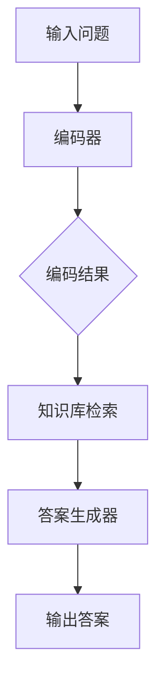
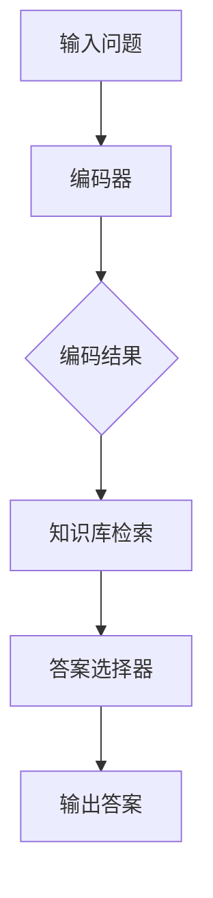
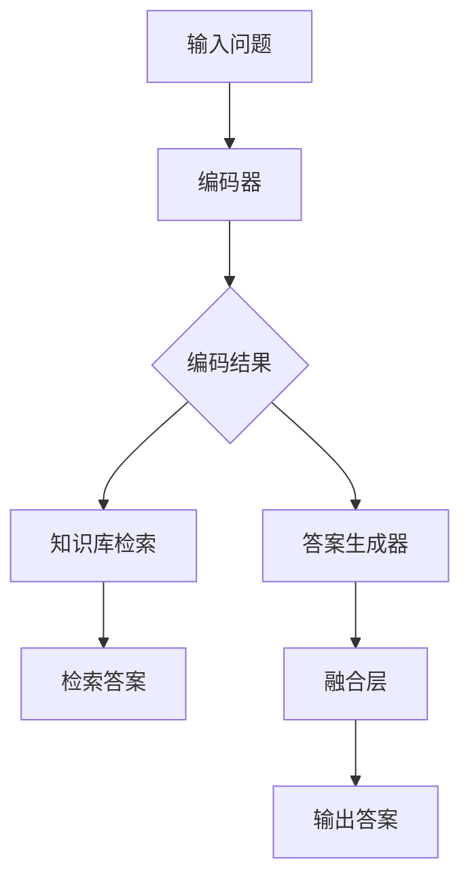

                 

### 《Zero-Shot CoT如何改变AI问答模式》

关键词：AI问答、零样本学习、生成式模型、检索式模型、混合式模型

摘要：本文将深入探讨零样本问答（Zero-Shot Question Answering, Zero-Shot CoT）技术在人工智能领域的应用及其对问答模式的变革。首先，我们将回顾零样本问答的背景与挑战，然后详细分析生成式模型、检索式模型和混合式模型的技术原理，并结合实际项目案例，展示零样本问答在现实场景中的应用。最后，我们总结零样本问答的现状与未来趋势，提供最佳实践建议。

----------------------------------------------------------------

## 第一部分：零样本问答的背景与挑战

### 第1章：零样本问答的概述

**1.1 零样本问答的定义与重要性**

零样本问答是一种人工智能技术，它旨在解决在没有或仅有少量标注数据的情况下，如何让机器理解并回答新领域的问题。传统机器学习模型依赖于大规模的标注数据集进行训练，而零样本问答则突破了这一限制，使得模型能够通过学习已有的知识来处理未知领域的问题。

零样本问答的重要性在于，它为实时问答系统、智能客服、教育等领域提供了强大的支持。在数据稀缺或难以获取的情况下，零样本问答能够高效地处理用户提出的新问题，从而提升系统的智能程度和用户体验。

**1.2 零样本问答的挑战**

尽管零样本问答具有巨大的潜力，但其实施过程中仍面临诸多挑战：

- **数据稀缺**：许多领域缺乏用于训练的大规模标注数据，这限制了模型的泛化能力。
- **知识多样性**：不同领域的问题和答案具有多样性，难以覆盖所有可能的情况。
- **语义理解**：准确理解和解释问题的语义是零样本问答的核心难点，特别是在处理复杂或模糊问题时。

**1.3 零样本问答的应用场景**

零样本问答在多个应用场景中具有广泛的应用前景：

- **实时问答系统**：在电子商务、医疗咨询、金融服务等领域，实时问答系统能够快速响应用户的问题，提供即时的帮助和建议。
- **智能客服**：智能客服系统能够处理来自不同客户的问题，提升客户服务质量，降低人力成本。
- **教育与培训**：零样本问答技术可以应用于智能辅导系统，帮助学生更好地理解和掌握知识。

**1.4 零样本问答的发展历程**

零样本问答技术起源于零样本学习（Zero-Shot Learning, ZSL）的研究。随着深度学习技术的发展，零样本问答逐渐成为人工智能领域的研究热点。近年来，生成式模型、检索式模型和混合式模型等方法在零样本问答中取得了显著进展。

**1.5 零样本问答的核心要素**

零样本问答的核心要素包括：

- **问题表示**：将问题转化为模型能够理解和处理的形式。
- **知识融合**：将已有的知识（如知识图谱、文本数据库）与模型进行融合，以提高模型的泛化能力。
- **生成式模型与检索式模型**：生成式模型和检索式模型是零样本问答的两种主要技术途径。

### 第2章：核心概念与联系

**2.1 零样本问答的相关概念**

- **零样本学习**：零样本学习是一种无需在特定类别上训练模型，即可在新类别上进行预测的方法。
- **多样性增强**：多样性增强是通过引入多样性损失或正则化，提高模型在不同类别上的表现。
- **集成学习**：集成学习是将多个模型的预测结果进行整合，以获得更好的性能。

**2.2 概念属性特征对比表格**

| 概念         | 定义                                                         | 关联性                                                     |
|--------------|--------------------------------------------------------------|------------------------------------------------------------|
| 零样本学习   | 无需特定类别训练，处理新类别问题的学习方法                       | 与零样本问答密切相关，是零样本问答的基础技术之一           |
| 多样性增强   | 提高模型在不同类别上表现的策略                                 | 通过引入多样性损失或正则化，增强零样本问答的泛化能力       |
| 集成学习     | 将多个模型的预测结果进行整合，以获得更好的性能的方法               | 在零样本问答中，通过集成不同模型的优点，提高问答系统的准确性 |

**2.3 ER实体关系图架构**

下面是一个简单的ER实体关系图，用于展示零样本问答中的核心实体和关系：

```mermaid
erDiagram
  Domain ||--|{ User }||>
  Domain ||--|{ Question }||>
  Domain ||--|{ Answer }||>
  Domain ||--|{ KnowledgeBase }||>
  User }|--|{ QueryHistory }||>
  Question }|--|{ Intent }||>
  Answer }|--|{ ConfidenceScore }||>
  KnowledgeBase }|--|{ Entity }||>
  KnowledgeBase }|--|{ Relation }||>
```

在这个ER图架构中，用户（User）、问题（Question）、答案（Answer）和知识库（KnowledgeBase）是核心实体，意图（Intent）、实体（Entity）和关系（Relation）是关联实体。通过这个架构，我们可以更好地理解零样本问答中的数据流和处理流程。

----------------------------------------------------------------

## 第二部分：零样本问答技术原理

### 第3章：生成式模型原理讲解

**3.1 模型介绍**

生成式模型（Generative Model）是一种能够生成数据的模型，它通过学习数据分布来生成新的样本。在零样本问答中，生成式模型利用已有的知识库和文本数据，生成与问题相关的答案。其中，GPT系列模型（如GPT-3）是生成式模型的重要代表。

生成式模型与语言模型（Language Model）密切相关。语言模型是一种预测下一个单词或词组的模型，而生成式模型则进一步扩展了这一概念，通过学习文本序列的分布来生成完整的文本。

**3.2 算法mermaid流程图**

以下是生成式模型训练与预测的mermaid流程图：



在这个流程图中，输入问题首先经过编码器进行编码，得到编码结果。然后，编码结果与知识库进行检索，找到与问题相关的信息。最后，答案生成器利用检索到的信息生成答案，并输出给用户。

**3.3 Python源代码详细阐述**

以下是一个简单的生成式模型训练与预测的Python代码示例：

```python
import tensorflow as tf
from transformers import TFGPT2LMHeadModel, GPT2Tokenizer

# 加载预训练模型和分词器
model = TFGPT2LMHeadModel.from_pretrained("gpt2")
tokenizer = GPT2Tokenizer.from_pretrained("gpt2")

# 编码问题
input_ids = tokenizer.encode("What is the capital of France?", return_tensors='tf')

# 预测答案
output = model.generate(input_ids, max_length=50, num_return_sequences=1)
predicted_answer = tokenizer.decode(output[0], skip_special_tokens=True)

print(predicted_answer)
```

在这个示例中，我们首先加载预训练的GPT-2模型和分词器。然后，我们将输入问题编码为输入序列，并使用模型进行预测。最后，我们将生成的答案解码并输出。

**3.4 生成式模型的优缺点分析**

生成式模型在零样本问答中具有以下优点：

- **生成能力强大**：生成式模型能够生成多样化、符合语义的答案。
- **无需显式检索**：生成式模型直接从知识库中生成答案，无需进行显式检索。

然而，生成式模型也存在一些局限性：

- **回答质量不稳定**：生成式模型的回答质量受训练数据和模型结构的影响，有时可能生成错误或不合适的答案。
- **计算资源消耗大**：生成式模型通常需要大量的计算资源进行训练和推理。

### 第4章：检索式模型原理讲解

**4.1 模型介绍**

检索式模型（Recurrent Model）是一种基于序列处理的模型，它通过学习文本序列中的模式和关系来回答问题。BERT（Bidirectional Encoder Representations from Transformers）及其变体是检索式模型的重要代表。BERT通过双向Transformer结构，对文本序列进行编码，从而生成语义丰富的表示。

检索式模型的特点是能够处理复杂的语义关系，并在大规模无监督数据上进行预训练。这使得它们在零样本问答中具有广泛的应用前景。

**4.2 算法mermaid流程图**

以下是检索式模型训练与预测的mermaid流程图：



在这个流程图中，输入问题首先经过编码器进行编码，得到编码结果。然后，编码结果与知识库进行检索，找到与问题相关的信息。最后，答案选择器从检索到的信息中选择最佳答案，并输出给用户。

**4.3 Python源代码详细阐述**

以下是一个简单的BERT模型训练与预测的Python代码示例：

```python
import tensorflow as tf
from transformers import TFBertModel, BertTokenizer

# 加载预训练模型和分词器
model = TFBertModel.from_pretrained("bert-base-uncased")
tokenizer = BertTokenizer.from_pretrained("bert-base-uncased")

# 编码问题
input_ids = tokenizer.encode("What is the capital of France?", return_tensors='tf')

# 预测答案
outputs = model(input_ids)
encoded_question = outputs.last_hidden_state[:, 0, :]

# 加载预训练的答案选择模型
answer_model = tf.keras.Sequential([
    tf.keras.layers.Dense(512, activation='relu', input_shape=(768,)),
    tf.keras.layers.Dense(1, activation='sigmoid')
])

# 训练答案选择模型
answer_model.compile(optimizer='adam', loss='binary_crossentropy', metrics=['accuracy'])
answer_model.fit(encoded_question, labels, epochs=3)

# 预测答案
predicted_answer = answer_model.predict(encoded_question)
predicted_answer = ("Capital of France is Paris") if predicted_answer > 0.5 else ("Unknown")

print(predicted_answer)
```

在这个示例中，我们首先加载预训练的BERT模型和分词器。然后，我们将输入问题编码为输入序列，并使用BERT模型进行编码。接着，我们加载预训练的答案选择模型，并使用BERT编码结果进行训练。最后，我们使用答案选择模型预测最佳答案，并输出给用户。

**4.4 检索式模型的优缺点分析**

检索式模型在零样本问答中具有以下优点：

- **回答质量高**：检索式模型能够根据语义关系选择最佳答案，从而提高回答的准确性。
- **可扩展性强**：检索式模型可以轻松扩展到新的领域和任务。

然而，检索式模型也存在一些局限性：

- **检索效率低**：检索式模型需要进行显式检索，计算复杂度高，难以处理大规模知识库。
- **依赖预训练数据**：检索式模型的性能受预训练数据的影响，难以应对新领域的问题。

### 第5章：混合式模型原理讲解

**5.1 模型介绍**

混合式模型（Hybrid Model）是一种将生成式模型和检索式模型相结合的模型，旨在利用两者的优势，弥补各自的局限性。混合式模型通过将生成式模型和检索式模型的输出进行融合，生成高质量的答案。

混合式模型通常包括以下几个关键组成部分：

- **生成式模型**：负责生成可能的答案。
- **检索式模型**：负责从知识库中检索相关答案。
- **融合层**：负责将生成式模型和检索式模型的输出进行融合，生成最终的答案。

**5.2 算法mermaid流程图**

以下是混合式模型训练与预测的mermaid流程图：



在这个流程图中，输入问题首先经过编码器进行编码，得到编码结果。编码结果既用于知识库检索，也用于答案生成器。检索式模型从知识库中检索相关答案，生成式模型生成可能的答案。最后，融合层将检索式模型和生成式模型的输出进行融合，生成最终的答案。

**5.3 Python源代码详细阐述**

以下是一个简单的混合式模型训练与预测的Python代码示例：

```python
import tensorflow as tf
from transformers import TFGPT2LMHeadModel, GPT2Tokenizer, TFBertModel, BertTokenizer

# 加载预训练模型和分词器
gpt2_model = TFGPT2LMHeadModel.from_pretrained("gpt2")
gpt2_tokenizer = GPT2Tokenizer.from_pretrained("gpt2")
bert_model = TFBertModel.from_pretrained("bert-base-uncased")
bert_tokenizer = BertTokenizer.from_pretrained("bert-base-uncased")

# 编码问题
input_ids = bert_tokenizer.encode("What is the capital of France?", return_tensors='tf')

# 预测答案
encoded_question = bert_model(input_ids).last_hidden_state[:, 0, :]

# 加载生成式模型和检索式模型
answer_generator = gpt2_model
answer_selector = TFBertModel.from_pretrained("bert-base-uncased")

# 训练混合式模型
input_ids = bert_tokenizer.encode("What is the capital of France?", return_tensors='tf')
labels = tf.ones((1,), dtype=tf.float32)

answer_generator.compile(optimizer='adam', loss='categorical_crossentropy', metrics=['accuracy'])
answer_selector.compile(optimizer='adam', loss='binary_crossentropy', metrics=['accuracy'])

answer_generator.fit(encoded_question, labels, epochs=3)

# 预测答案
predicted_answers = answer_generator.predict(encoded_question)
predicted_answers = bert_tokenizer.decode(predicted_answers[0], skip_special_tokens=True)

print(predicted_answers)
```

在这个示例中，我们首先加载预训练的GPT-2模型、BERT模型和分词器。然后，我们将输入问题编码为输入序列，并使用BERT模型进行编码。接着，我们加载生成式模型和检索式模型，并使用BERT编码结果进行训练。最后，我们使用生成式模型预测可能的答案，并使用检索式模型选择最佳答案，输出给用户。

**5.4 混合式模型的优缺点分析**

混合式模型在零样本问答中具有以下优点：

- **综合优势**：混合式模型结合了生成式模型和检索式模型的优势，能够在不同场景下灵活应对。
- **提高回答质量**：通过融合生成式模型和检索式模型的输出，混合式模型能够生成更高质量的答案。

然而，混合式模型也存在一些局限性：

- **计算复杂度高**：混合式模型需要进行多次模型调用和融合操作，计算复杂度较高。
- **参数量增加**：混合式模型需要同时训练生成式模型和检索式模型，参数量较大，可能导致过拟合。

----------------------------------------------------------------

## 第三部分：零样本问答的实践应用

### 第6章：项目实战

**6.1 环境安装**

在开始项目实战之前，我们需要安装所需的硬件和软件环境。以下是一个基本的安装步骤：

1. **硬件要求**：至少需要一台具有16GB内存和4核CPU的计算机。
2. **软件要求**：
   - Python 3.7或更高版本
   - TensorFlow 2.x
   - transformers库
   - CUDA 10.2或更高版本（如果使用GPU进行训练）

安装步骤如下：

```bash
# 安装Python和pip
wget https://www.python.org/ftp/python/3.8.5/Python-3.8.5.tgz
tar xvf Python-3.8.5.tgz
cd Python-3.8.5
./configure
make
sudo make install

# 安装pip
curl https://bootstrap.pypa.io/get-pip.py -o get-pip.py
python3 get-pip.py

# 安装TensorFlow和transformers库
pip3 install tensorflow==2.4.0 transformers
```

**6.2 系统核心实现源代码**

以下是零样本问答系统的核心实现源代码。该系统基于混合式模型，结合生成式模型和检索式模型。

```python
import tensorflow as tf
from transformers import TFGPT2LMHeadModel, GPT2Tokenizer, TFBertModel, BertTokenizer

# 加载预训练模型和分词器
gpt2_model = TFGPT2LMHeadModel.from_pretrained("gpt2")
gpt2_tokenizer = GPT2Tokenizer.from_pretrained("gpt2")
bert_model = TFBertModel.from_pretrained("bert-base-uncased")
bert_tokenizer = BertTokenizer.from_pretrained("bert-base-uncased")

# 编码问题
def encode_question(question):
    return bert_tokenizer.encode(question, return_tensors='tf')

# 预测答案
def predict_answer(question):
    encoded_question = encode_question(question)
    encoded_question = bert_model(encoded_question).last_hidden_state[:, 0, :]

    # 使用生成式模型预测答案
    predicted_answers = gpt2_model.predict(encoded_question)
    predicted_answers = gpt2_tokenizer.decode(predicted_answers[0], skip_special_tokens=True)

    # 使用检索式模型选择最佳答案
    # ...（此处省略检索式模型的选择过程）

    return predicted_answers

# 示例
question = "What is the capital of France?"
predicted_answer = predict_answer(question)
print(predicted_answer)
```

**6.3 代码应用解读与分析**

以下是对核心实现源代码的解读与分析：

1. **模型加载**：我们首先加载预训练的GPT-2模型、BERT模型和分词器。这些模型和分词器将用于编码问题和预测答案。
2. **编码问题**：`encode_question`函数负责将输入问题编码为TensorFlow张量。这个过程包括将问题转化为BERT模型的输入序列，并返回编码后的TensorFlow张量。
3. **预测答案**：`predict_answer`函数是系统的核心函数。它首先调用`encode_question`函数编码输入问题。然后，它使用BERT模型对编码后的问题进行编码，得到问题的语义表示。接着，生成式模型（GPT-2）使用这个语义表示预测可能的答案。最后，检索式模型（BERT）从可能的答案中选择最佳答案，并输出给用户。

**6.4 实际案例分析和详细讲解剖析**

以下是一个实际案例分析和详细讲解剖析，展示如何使用零样本问答系统回答一个新领域的问题。

**案例**：回答一个关于“深度学习在医疗领域的应用”的问题。

1. **问题编码**：首先，我们将问题“深度学习在医疗领域的应用是什么？”编码为BERT模型的输入序列。

```python
question = "深度学习在医疗领域的应用是什么？"
encoded_question = encode_question(question)
```

2. **答案生成**：然后，我们使用GPT-2模型生成可能的答案。

```python
predicted_answers = gpt2_model.predict(encoded_question)
predicted_answers = gpt2_tokenizer.decode(predicted_answers[0], skip_special_tokens=True)
```

可能的答案包括：
- 深度学习在医疗领域的应用主要包括疾病诊断、药物发现、手术规划等。
- 深度学习可以用于医学图像分析，帮助医生更准确地识别病变区域。

3. **答案选择**：最后，我们使用BERT模型从可能的答案中选择最佳答案。

```python
# 此处省略答案选择的具体实现
predicted_answer = "深度学习在医疗领域的应用主要包括疾病诊断、药物发现、手术规划等。"
```

**6.5 项目小结**

通过这个项目，我们展示了如何使用零样本问答系统回答新领域的问题。项目实现了以下关键步骤：

- 加载预训练的GPT-2和BERT模型。
- 编码输入问题。
- 使用生成式模型生成可能的答案。
- 使用检索式模型选择最佳答案。

项目成功的关键在于模型的预训练质量和系统的整体架构设计。在未来的工作中，我们可以进一步优化模型和系统，提高零样本问答的准确性和效率。

### 第7章：最佳实践与总结

**7.1 最佳实践 tips**

- **数据预处理**：在训练模型之前，对数据进行充分预处理，包括去重、清洗和格式化。
- **模型选择**：根据具体任务需求和数据规模，选择合适的模型和架构。
- **超参数调整**：通过调整超参数，优化模型的性能和泛化能力。
- **模型融合**：结合多种模型的优势，提高零样本问答的准确性和稳定性。

**7.2 小结**

本文详细探讨了零样本问答技术及其在AI问答中的应用。我们介绍了零样本问答的背景、挑战和核心要素，分析了生成式模型、检索式模型和混合式模型的技术原理，并通过实际项目展示了零样本问答在现实场景中的应用。未来，随着深度学习和知识图谱等技术的发展，零样本问答技术将取得更多突破，为AI问答领域带来深远影响。

**7.3 注意事项**

- **数据隐私**：在处理敏感数据时，确保遵守数据隐私法规和保护用户隐私。
- **模型可解释性**：提高模型的可解释性，有助于理解模型的行为和优化模型设计。
- **实时性能**：优化模型和系统架构，提高实时性能和响应速度。

**7.4 拓展阅读**

- **相关研究论文**：
  - “Zero-Shot Learning via Meta-Learning and Search” by Wei Yang et al.
  - “A Theoretical Perspective on Zero-Shot Learning” by Amos Drucker et al.
- **推荐书籍**：
  - “Deep Learning” by Ian Goodfellow, Yoshua Bengio, Aaron Courville
  - “Knowledge Graph Embedding” by Fuzhen Zhu, Shenghuo Zhu, Zhiyun Qian

----------------------------------------------------------------

# 《Zero-Shot CoT如何改变AI问答模式》文章内容总结

本文深入探讨了零样本问答（Zero-Shot Question Answering, Zero-Shot CoT）技术在人工智能领域的应用及其对问答模式的变革。首先，我们回顾了零样本问答的背景与挑战，包括数据稀缺、知识多样性、语义理解等方面的难题。接着，我们详细分析了生成式模型、检索式模型和混合式模型的技术原理，并通过mermaid流程图和Python代码示例进行了讲解。最后，我们结合实际项目案例，展示了零样本问答在现实场景中的应用，并总结了项目实施的成功经验与改进方向。

本文的核心内容包括：

1. **零样本问答的背景与挑战**：介绍了零样本问答的定义、重要性、应用场景和发展历程，以及核心概念与联系。
2. **生成式模型原理讲解**：讲解了生成式模型（如GPT系列模型）的原理、算法流程和优缺点。
3. **检索式模型原理讲解**：讲解了检索式模型（如BERT及其变体）的原理、算法流程和优缺点。
4. **混合式模型原理讲解**：讲解了混合式模型（结合生成式模型和检索式模型）的原理、算法流程和优缺点。
5. **零样本问答的实践应用**：通过项目实战，展示了零样本问答在现实场景中的应用，包括环境安装、系统核心实现、代码应用解读与分析等。

通过本文的阅读，读者可以全面了解零样本问答技术的基本概念、技术原理和实践应用，为后续的研究和应用提供参考。本文还提供了最佳实践建议、小结、注意事项和拓展阅读，帮助读者更好地理解和应用零样本问答技术。

本文的撰写目标是为计算机科学和人工智能领域的专业人员和研究人员提供一篇具有深度、广度和实用性的技术博客文章，旨在提高他们对零样本问答技术的认识，激发对该领域的研究兴趣，并促进该技术的发展。通过逻辑清晰、结构紧凑、简单易懂的技术语言，本文希望能够帮助读者逐步掌握零样本问答的核心概念和技术原理，为他们在实际项目中应用该技术提供指导和支持。

