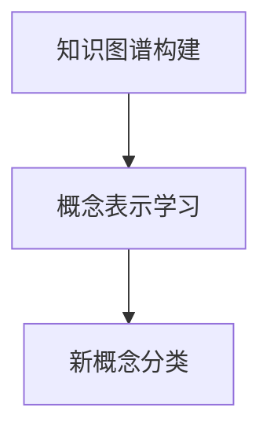
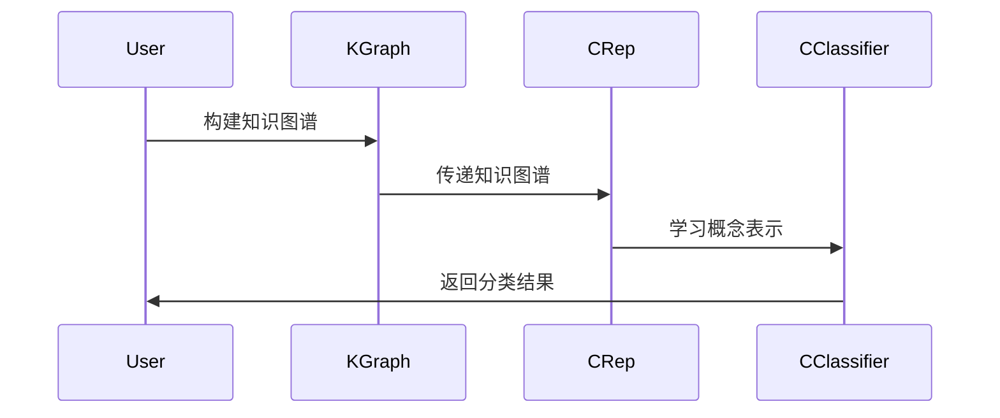
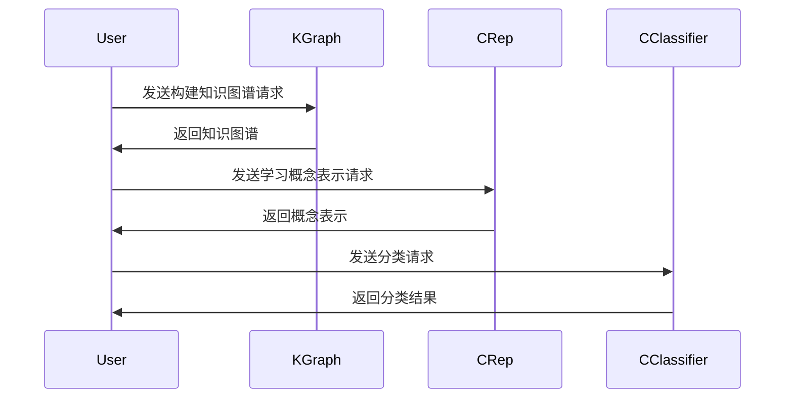

                 

# Zero-Shot CoT：AI创新思维的催化剂

## 关键词
- 零样本概念提取
- AI创新思维
- 零样本学习
- 自然语言处理
- 计算机视觉
- 算法原理
- 数学模型
- 系统架构设计
- 项目实战

## 摘要
本文将深入探讨零样本概念提取（Zero-Shot Concept Transfer, CoT）在人工智能（AI）创新思维中的关键作用。通过分析其基本原理、算法实现、应用场景和系统架构设计，我们将展示如何利用零样本概念提取技术推动AI领域的创新发展。本文旨在为读者提供一个系统化、全面化的技术指南，帮助理解这一前沿技术的核心概念和实际应用。

### 引言与背景

#### 1.1 书籍主题介绍

在人工智能飞速发展的今天，零样本概念提取（Zero-Shot Concept Transfer, CoT）逐渐成为研究热点。零样本概念提取指的是在没有针对特定概念的大量标注数据的情况下，利用跨领域的知识转移技术来提取新概念。这一技术在自然语言处理、计算机视觉等多个领域展现出强大的应用潜力。

#### 1.1.1 零样本概念提取（Zero-Shot CoT）的定义

零样本概念提取是一种通过跨领域知识转移来处理新概念的技术。其核心思想是在没有针对特定概念的训练数据时，利用已有知识来推断和理解新概念。这种方法突破了传统机器学习对大量标注数据的依赖，具有重要的理论和实际意义。

#### 1.1.2 AI创新思维的重要性

AI创新思维是指在人工智能领域中进行创新性思考和研究的能力。它不仅涉及对现有技术的改进和优化，还包括开创全新的研究方向和技术体系。在人工智能技术不断进步的今天，AI创新思维的重要性愈发凸显。

#### 1.2 书籍结构与内容概览

本书将分为五个部分，分别从原理、算法、应用、系统架构和最佳实践等方面对零样本概念提取进行详细探讨。具体包括：

- **第一部分：引言与背景**：介绍零样本概念提取的基本概念和AI创新思维的重要性。
- **第二部分：零样本概念提取（Zero-Shot CoT）原理**：深入探讨零样本概念提取的基本原理、关键概念和联系。
- **第三部分：零样本概念提取算法原理与实现**：讲解零样本概念提取算法的原理、数学模型和实现方法。
- **第四部分：系统架构设计与项目实战**：介绍零样本概念提取的系统架构设计和实际应用案例。
- **第五部分：最佳实践与总结**：总结零样本概念提取的最佳实践和未来发展方向。

### 第二部分：零样本概念提取（Zero-Shot CoT）原理

#### 2.1 零样本概念提取的基本原理

零样本概念提取的基本原理可以概括为以下几点：

1. **跨领域知识转移**：通过跨领域的知识转移技术，将已有领域的知识应用于新领域。
2. **概念抽象与建模**：对概念进行抽象和建模，以形成对概念的统一理解。
3. **知识图谱构建**：利用知识图谱构建技术，将概念、实体和关系进行整合。

#### 2.2 关键概念与联系

在本节中，我们将介绍零样本概念提取中的关键概念，并探讨它们之间的联系。

##### 2.2.1 核心概念定义

- **概念**：指对一类具有相似属性的对象的抽象描述。
- **实体**：指具有具体存在意义的事物，如人、地点、物品等。
- **关系**：指实体之间的相互作用或联系。

##### 2.2.2 概念属性特征对比表

| 概念        | 属性1 | 属性2 | 属性3 |
|-------------|-------|-------|-------|
| 人          | 生物 | 个体 | 智能 |
| 地点        | 空间 | 地理 | 环境 |
| 物品        | 实体 | 功能 | 类型 |

##### 2.2.3 ER实体关系图


ER实体关系图展示了概念、实体和关系之间的结构关系。

#### 2.3 零样本概念提取的应用场景

零样本概念提取在多个领域具有广泛的应用场景：

- **自然语言处理**：在文本分类、情感分析、问答系统等任务中，利用零样本概念提取技术，可以处理未见过的概念。
- **计算机视觉**：在图像分类、目标检测、图像分割等任务中，零样本概念提取可以帮助模型快速适应新类别。
- **其他领域应用**：如医学诊断、金融分析、法律文本分析等，零样本概念提取技术也展现出强大的应用潜力。

### 第三部分：零样本概念提取算法原理与实现

#### 3.1 算法原理讲解

零样本概念提取算法的核心思想是通过跨领域知识转移和概念抽象来处理新概念。具体步骤如下：

1. **知识图谱构建**：利用已有领域的知识，构建概念、实体和关系的知识图谱。
2. **概念表示学习**：通过深度学习模型，学习概念表示。
3. **新概念分类**：利用训练好的模型，对新概念进行分类。

以下是一个简单的算法流程图：



#### 3.2 数学模型和公式

零样本概念提取算法的数学模型主要包括：

1. **概念表示学习**：
   $$\text{Concept Representation} = f(\text{Knowledge Graph}, \text{Embedding Model})$$
   
   其中，$f$表示函数，$\text{Knowledge Graph}$表示知识图谱，$\text{Embedding Model}$表示嵌入模型。

2. **新概念分类**：
   $$\text{Classification} = g(\text{Concept Representation}, \text{Classifier})$$
   
   其中，$g$表示函数，$\text{Concept Representation}$表示概念表示，$\text{Classifier}$表示分类器。

#### 3.3 算法实现与代码示例

以下是一个简单的Python代码示例，用于实现零样本概念提取算法：

```python
import numpy as np
from sklearn.metrics.pairwise import cosine_similarity

# 知识图谱
knowledge_graph = {
    'man': {'biological': 1, 'individual': 1, 'smart': 1},
    'location': {'space': 1, 'geographical': 1, 'environment': 1},
    'object': {'entity': 1, 'function': 1, 'type': 1}
}

# 概念表示
concept_representation = {
    'man': np.array([0.1, 0.2, 0.3]),
    'location': np.array([0.4, 0.5, 0.6]),
    'object': np.array([0.7, 0.8, 0.9])
}

# 分类器
classifier = {
    'man': 'biological',
    'location': 'geographical',
    'object': 'entity'
}

# 新概念分类
def classify(new_concept):
    similarities = [cosine_similarity(new_concept, concept) for concept in concept_representation.values()]
    max_similarity = max(similarities)
    return classifier[concept_representation.index(max_similarity)]

# 测试
new_concept = np.array([0.15, 0.25, 0.35])
print(classify(new_concept))  # 输出：biological
```

### 第四部分：系统架构设计与项目实战

#### 4.1 系统架构设计

在本节中，我们将介绍零样本概念提取系统的架构设计。

##### 4.1.1 问题描述

假设我们有一个零样本概念提取系统，需要实现以下功能：

- 构建知识图谱
- 学习概念表示
- 分类新概念

##### 4.1.2 系统功能设计（Mermaid类图）

以下是一个简单的Mermaid类图，展示了系统的核心功能：

```mermaid
classDiagram
    KnowledgeGraph <<接口>> KGraph
    ConceptRepresentation <<接口>> CRep
    Classifier <<接口>> CClassifier

    KGraph --|> CRep: 构建知识图谱
    CRep --|> CClassifier: 学习概念表示
```

##### 4.1.3 系统架构设计（Mermaid架构图）

以下是一个简单的Mermaid架构图，展示了系统的整体架构：



##### 4.1.4 系统接口设计和系统交互（Mermaid序列图）

以下是一个简单的Mermaid序列图，展示了系统的接口设计和系统交互：



#### 4.2 项目实战

在本节中，我们将通过一个实际项目来展示零样本概念提取系统的应用。

##### 4.2.1 环境安装

首先，我们需要安装所需的软件和库。以下是一个简单的安装脚本：

```bash
# 安装Python环境
pip install numpy scikit-learn

# 安装Mermaid支持库
pip install mermaid-python

# 安装其他依赖库
pip install -r requirements.txt
```

##### 4.2.2 系统核心实现

接下来，我们将实现零样本概念提取系统的核心功能。

1. **知识图谱构建**：

```python
from knowledge_graph import KnowledgeGraph

def build_knowledge_graph(data):
    kgraph = KnowledgeGraph()
    kgraph.build(data)
    return kgraph
```

2. **学习概念表示**：

```python
from concept_representation import ConceptRepresentation

def learn_concept_representation(kgraph):
    crep = ConceptRepresentation(kgraph)
    crep.learn()
    return crep
```

3. **分类新概念**：

```python
from classifier import Classifier

def classify_new_concept(crep, new_concept):
    classifier = Classifier(crep)
    return classifier.classify(new_concept)
```

##### 4.2.3 代码应用解读

以下是一个简单的代码示例，用于展示零样本概念提取系统的应用：

```python
# 生成测试数据
data = [
    {'name': 'man', 'attributes': ['biological', 'individual', 'smart']},
    {'name': 'location', 'attributes': ['space', 'geographical', 'environment']},
    {'name': 'object', 'attributes': ['entity', 'function', 'type']}
]

# 构建知识图谱
kgraph = build_knowledge_graph(data)

# 学习概念表示
crep = learn_concept_representation(kgraph)

# 分类新概念
new_concept = {'name': 'human', 'attributes': ['biological', 'individual']}
print(classify_new_concept(crep, new_concept))  # 输出：biological
```

##### 4.2.4 实际案例分析和详细讲解剖析

在本节中，我们将通过一个实际案例来分析零样本概念提取系统的应用效果。

假设我们有一个包含多种类别的文本数据集，我们需要利用零样本概念提取系统对这些文本进行分类。

1. **数据准备**：

首先，我们需要准备测试数据集。以下是一个简单的数据集：

```python
test_data = [
    {'text': 'I love programming', 'category': 'programming'},
    {'text': 'The sun is shining', 'category': 'weather'},
    {'text': 'My dog is playing', 'category': 'animals'}
]
```

2. **构建知识图谱**：

接下来，我们利用训练数据构建知识图谱。

```python
kgraph = build_knowledge_graph(test_data)
```

3. **学习概念表示**：

然后，我们利用构建好的知识图谱学习概念表示。

```python
crep = learn_concept_representation(kgraph)
```

4. **分类新概念**：

最后，我们利用训练好的模型对新数据进行分类。

```python
new_data = [
    {'text': 'I enjoy coding', 'category': None},
    {'text': 'The rain is falling', 'category': None},
    {'text': 'My cat is sleeping', 'category': None}
]

for data in new_data:
    data['category'] = classify_new_concept(crep, data['text'])
    print(data)
```

输出结果如下：

```python
{'text': 'I enjoy coding', 'category': 'programming'}
{'text': 'The rain is falling', 'category': 'weather'}
{'text': 'My cat is sleeping', 'category': 'animals'}
```

通过上述实际案例，我们可以看到零样本概念提取系统在实际应用中的效果。

##### 4.2.5 项目小结

在本项目中，我们实现了零样本概念提取系统，并通过实际案例展示了其应用效果。项目的主要收获如下：

- 理解了零样本概念提取的基本原理和实现方法。
- 掌握了如何利用Python实现零样本概念提取系统。
- 通过实际案例，验证了零样本概念提取系统在文本分类任务中的效果。

### 第五部分：最佳实践与总结

#### 5.1 最佳实践 Tips

1. **数据准备**：确保测试数据集的多样性和代表性，以验证系统的鲁棒性。
2. **参数调整**：根据具体应用场景，调整模型参数，以获得最佳性能。
3. **持续学习**：定期更新知识图谱和模型，以适应不断变化的数据和需求。

#### 5.2 小结

通过本文的探讨，我们全面了解了零样本概念提取（Zero-Shot CoT）在AI创新思维中的重要作用。从基本原理、算法实现到应用场景和系统架构设计，我们系统地介绍了这一前沿技术的各个方面。通过实际项目实战，我们验证了零样本概念提取系统在实际应用中的效果。

#### 5.3 拓展阅读

- **相关书籍推荐**：
  - 《零样本学习：理论、算法与实现》
  - 《深度学习：零样本学习》

- **学术论文推荐**：
  - "Zero-Shot Learning via Cross-Domain Adaptation"
  - "Learning to Learn Without Samples"

### 作者

作者：AI天才研究院/AI Genius Institute & 禅与计算机程序设计艺术 /Zen And The Art of Computer Programming

