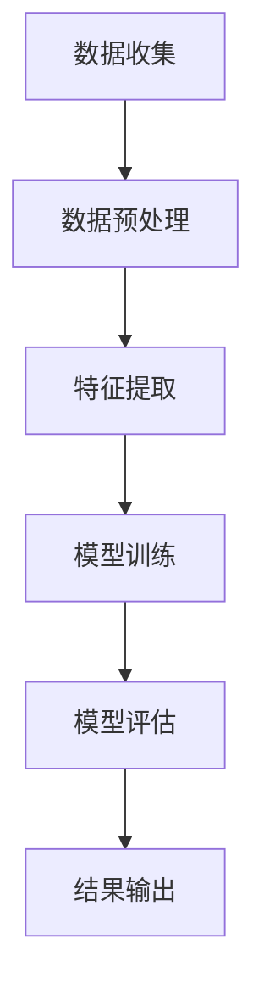
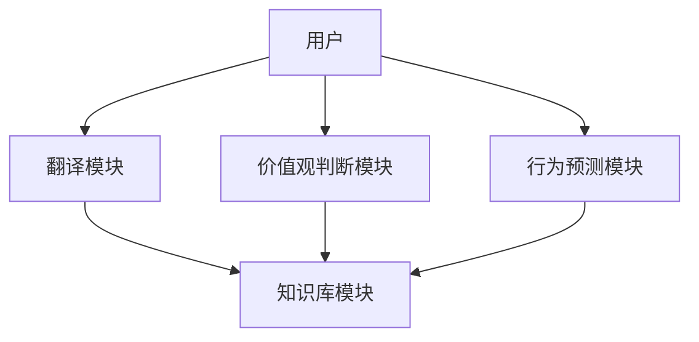
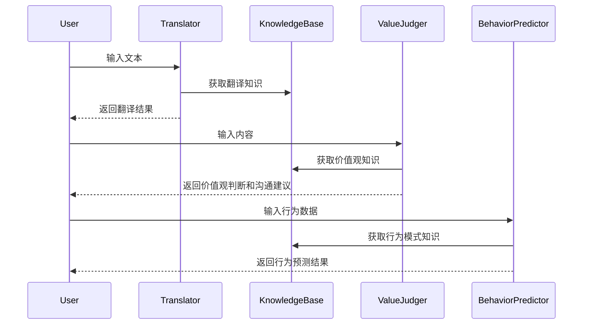

                 

### 第一个部分：引言与背景

#### 1.1 零Shot CoT：AI处理跨文化问题的能力

##### 1.1.1 零Shot CoT概念介绍

**零Shot CoT（Zero-Shot CoT，Zero-Shot Concept Transfer）** 是一个新兴的研究领域，旨在解决人工智能系统在面对跨文化问题时，如何从已有的知识体系中快速适应并处理新的、未曾见过的文化场景。这一概念的核心在于 **零Shot Learning**，即模型在训练过程中不需要大量的样本数据，而是通过少量的示例或没有直接相关的数据来进行学习。

**零Shot Learning** 是一种机器学习技术，它允许模型在没有大量训练数据的情况下，通过少量的示例或先验知识来学习新任务。这种技术主要应用于自然语言处理、计算机视觉等领域，通过少量数据或无数据的情况下进行知识迁移和泛化。

在跨文化问题的背景下，**零Shot CoT** 意味着人工智能系统能够在缺乏特定文化背景训练数据的情况下，通过少量的跨文化示例来理解并处理各种文化差异。例如，一个在中文环境下训练的AI系统，如何在面对英语环境下的问题时，依然能够准确理解和处理。

##### 1.1.2 跨文化问题的定义

跨文化问题涉及在不同的文化背景下，如何处理和解决文化差异带来的挑战。这些挑战包括语言障碍、价值观差异、行为模式差异等，对于人工智能系统来说，跨文化问题的解决能力显得尤为重要。

- **语言障碍**：不同语言之间的语法、词汇、表达方式存在巨大差异，导致沟通困难。
- **价值观差异**：不同文化对事物有不同的价值判断，例如时间观念、金钱观念、权力观念等。
- **行为模式差异**：不同文化背景下，人们的社交行为、商务行为等存在明显差异。

##### 1.1.3 研究背景与意义

随着全球化进程的加速，跨文化交流日益频繁，跨文化问题的处理能力对于企业和组织来说至关重要。而现有的AI系统在面对跨文化问题时，往往表现出不足。例如，一些智能客服系统在面对不同语言和文化背景的用户时，无法提供准确和有效的服务；一些智能翻译系统在处理跨文化文本时，常常出现语义误解和文化偏差。

因此，研究AI在处理跨文化问题的能力具有重要的理论价值和实际意义。通过零Shot CoT技术，AI系统可以更加高效和准确地处理跨文化问题，为跨文化交流提供技术支持。

##### 1.1.4 本书结构安排

本书将围绕零Shot CoT：AI处理跨文化问题的能力这一主题，分为七个部分，具体章节安排如下：

1. 引言与背景
2. 核心概念与联系
3. 算法原理讲解
4. 实现与评估
5. 项目实战
6. 最佳实践与拓展
7. 小结与展望

通过这些章节的详细探讨，本书旨在为读者提供全面、系统的理解，帮助读者深入掌握零Shot CoT技术在处理跨文化问题中的应用。

---

**关键点总结：**

- **零Shot CoT** 是一种新兴的研究领域，旨在解决AI在跨文化问题中的适应性。
- **零Shot Learning** 是核心技术，允许模型在没有大量训练数据的情况下进行学习。
- **跨文化问题** 涉及语言障碍、价值观差异、行为模式差异等。
- 研究AI处理跨文化问题的能力具有重要的理论价值和实际意义。
- 本书将分为七个部分，详细探讨零Shot CoT的应用。

---

### 1.2 本书结构安排

为了更好地帮助读者理解零Shot CoT：AI处理跨文化问题的能力，本书将分为以下七个部分：

#### 第一部分：引言与背景

介绍零Shot CoT的概念、跨文化问题的定义以及研究的背景和意义。这一部分将为读者提供一个宏观的视角，了解研究的整体背景。

#### 第二部分：核心概念与联系

深入探讨零Shot Learning和跨文化问题的核心概念，分析它们之间的联系。这一部分将帮助读者理解零Shot CoT的基本原理和理论基础。

#### 第三部分：算法原理讲解

详细讲解零Shot Learning和跨文化问题处理的算法原理，包括数学模型和实现流程。这一部分将为读者提供技术上的深入理解。

#### 第四部分：实现与评估

介绍零Shot CoT技术在现实中的应用案例，包括实现步骤和评估方法。这一部分将帮助读者了解零Shot CoT的实际应用效果。

#### 第五部分：项目实战

通过实际项目案例，展示零Shot CoT技术的应用过程和结果。这一部分将为读者提供实践经验，帮助读者更好地理解和应用零Shot CoT技术。

#### 第六部分：最佳实践与拓展

总结最佳实践，探讨零Shot CoT技术的未来发展方向和拓展可能性。这一部分将为读者提供启示和指导，帮助读者在未来的研究和应用中取得更好的成果。

#### 第七部分：小结与展望

对全书的内容进行总结，展望零Shot CoT技术的未来发展趋势和应用前景。这一部分将为读者提供一个全面的总结，帮助读者更好地理解研究的整体成果。

---

通过以上七个部分的详细探讨，本书旨在为读者提供一个全面、系统的理解，帮助读者深入掌握零Shot CoT技术在处理跨文化问题中的应用。无论是学术界的研究人员，还是实际应用领域的技术人员，都将从本书中获得宝贵的知识和经验。

---

**关键点总结：**

- **本书分为七个部分，结构清晰**
- **每个部分都有明确的主题和目标**
- **从理论到实践，全面探讨零Shot CoT**
- **旨在帮助读者深入理解并应用零Shot CoT技术**

---

### 2.2 零Shot CoT与跨文化问题的联系

在深入探讨零Shot CoT与跨文化问题的联系之前，我们需要明确这两个核心概念的具体含义和特点。

**零Shot CoT（Zero-Shot Concept Transfer）** 指的是人工智能系统能够在没有大量特定文化背景数据的情况下，通过少量的跨文化示例，实现概念转移和知识迁移。这种技术特别适用于处理跨语言、跨文化的问题，使得AI系统在缺乏直接训练数据的情况下，依然能够适应新的文化场景。

**跨文化问题** 则是指在全球化背景下，不同文化之间由于语言、价值观、行为模式等差异而产生的各种挑战。这些挑战包括但不限于：

- **语言障碍**：不同语言的语法结构、词汇用法和表达习惯存在差异，导致信息传递和理解上的困难。
- **价值观差异**：不同文化对事物有不同的价值判断，例如时间观念、金钱观念、权力观念等，这些差异可能导致误解和冲突。
- **行为模式差异**：不同文化背景下，人们的社交行为、商务行为等存在明显差异，这些差异会影响人际交往和商业合作。

#### 2.2.1 AI在跨文化问题中的应用

人工智能系统在跨文化问题中的应用日益广泛，但也面临诸多挑战。传统的机器学习模型依赖于大量的训练数据，这在处理跨文化问题时往往存在困难。例如，一个在中文环境下训练的AI系统，在面对英语环境时，可能无法准确理解英语用户的表达方式。为了解决这一问题，零Shot CoT技术提供了一种可能的解决方案。

通过零Shot CoT，AI系统可以借助少量的跨文化示例，快速适应新的文化场景。例如，一个智能客服系统，在接触到英语用户时，可以通过少量的英语示例，快速理解英语用户的语言习惯和需求，从而提供准确和有效的服务。

此外，AI系统还可以在跨文化翻译、跨文化推荐、跨文化教育等领域发挥作用。例如，一个跨文化翻译系统，可以通过少量的跨文化文本示例，快速适应新的语言环境，提供准确的翻译结果。

#### 2.2.2 跨文化问题对AI系统的挑战

尽管零Shot CoT技术在跨文化问题中的应用具有潜力，但AI系统在面对跨文化问题时，依然面临诸多挑战：

1. **语言理解**：不同语言的语法结构、词汇用法和表达习惯存在差异，AI系统需要具备强大的语言理解能力，才能准确理解用户的语言意图。
   
2. **价值观判断**：不同文化对事物有不同的价值判断，AI系统需要具备跨文化的价值观判断能力，才能在处理跨文化问题时，做出合理的决策。

3. **行为预测**：不同文化背景下的行为模式存在明显差异，AI系统需要能够预测和适应这些行为模式，以便提供有效的服务和支持。

4. **数据隐私**：在跨文化交流中，用户的数据隐私保护尤为重要。AI系统需要确保在处理跨文化数据时，能够遵守相关隐私保护法规，保护用户隐私。

#### 2.2.3 零Shot CoT技术的优势

零Shot CoT技术在处理跨文化问题时，具有以下优势：

1. **适应性**：通过少量的跨文化示例，AI系统可以快速适应新的文化场景，提高处理跨文化问题的能力。

2. **泛化能力**：零Shot Learning技术使得AI系统具备良好的泛化能力，能够在不同文化背景下，处理各种复杂的跨文化问题。

3. **资源效率**：传统机器学习模型需要大量的训练数据，而在处理跨文化问题时，可能无法获取到足够的数据。零Shot CoT技术通过少量的示例，实现高效的知识迁移和概念转移，大大降低了数据获取和处理的成本。

4. **鲁棒性**：零Shot CoT技术能够在数据不足的情况下，保持AI系统的鲁棒性和稳定性，减少数据不足带来的风险。

通过以上分析，我们可以看到，零Shot CoT技术在处理跨文化问题中，具有独特的优势和应用前景。然而，要实现这一技术的广泛应用，还需要克服诸多挑战，进一步优化和改进现有的技术方案。

---

**关键点总结：**

- **零Shot CoT与跨文化问题的紧密联系**
- **AI系统在跨文化问题中的应用和挑战**
- **零Shot CoT技术的优势**

---

### 2.3 本章小结

本章我们详细介绍了零Shot CoT：AI处理跨文化问题的能力。首先，我们定义了零Shot CoT和跨文化问题的概念，并探讨了它们在全球化背景下的重要性。接着，我们分析了AI在跨文化问题中的应用和挑战，以及零Shot CoT技术在这些挑战中的优势。

通过本章的学习，读者应该对零Shot CoT和跨文化问题有了全面的理解。接下来，我们将进一步探讨零Shot Learning算法的原理，为理解零Shot CoT技术提供更加深入的理论基础。

---

**关键点回顾：**

- **定义零Shot CoT和跨文化问题**
- **AI在跨文化问题中的应用和挑战**
- **零Shot CoT技术的优势**
- **为后续章节的理论基础打下基础**

---

### 3.1 零Shot Learning算法原理

#### 3.1.1 零Shot Learning基本原理

**零Shot Learning** 是一种先进的机器学习技术，其核心思想是在模型训练过程中不需要大量的训练数据，而是通过少量的示例或先验知识来进行学习。这种技术的目标是在新任务或新数据出现时，模型能够快速适应并做出准确的预测。

**零Shot Learning** 的基本原理可以概括为以下几个步骤：

1. **示例学习**：模型通过接收少量的示例数据，学习数据的基本特征和规律。
2. **知识迁移**：模型利用先验知识或已有的知识，对新任务进行推理和预测。
3. **模型优化**：通过不断迭代和优化，模型逐渐提高对新任务的适应能力。

零Shot Learning主要适用于以下几种场景：

- **新任务快速适应**：当模型需要处理一个全新的任务时，零Shot Learning能够通过少量的示例，快速适应新任务。
- **数据稀缺环境**：在一些数据稀缺的环境中，零Shot Learning能够利用少量的样本数据进行有效的学习。
- **知识迁移**：通过将先验知识应用到新任务中，零Shot Learning能够实现知识的高效迁移。

#### 3.1.2 零Shot Learning的优势

**零Shot Learning** 在资源受限的环境中，具有以下显著优势：

1. **高泛化能力**：零Shot Learning能够通过少量的示例，实现对新任务的泛化，大大提高了模型的适应能力。
2. **高效性**：与传统机器学习相比，零Shot Learning能够在更短的时间内完成模型的训练和优化，提高了处理速度。
3. **数据效率**：在数据稀缺的环境下，零Shot Learning能够通过少量的样本数据进行有效的学习，降低了数据获取和处理的成本。
4. **鲁棒性**：零Shot Learning能够在数据不足的情况下，保持模型的鲁棒性和稳定性，减少了数据不足带来的风险。

#### 3.1.3 零Shot Learning的挑战

尽管零Shot Learning具有诸多优势，但在实际应用中，仍面临一些挑战：

1. **样本多样性**：零Shot Learning依赖于少量的示例，这些示例需要具有足够的多样性和代表性，才能保证模型的有效学习。
2. **知识迁移**：在跨文化问题中，不同文化之间的知识迁移可能存在困难，例如语言障碍和价值观差异。
3. **模型适应性**：模型在新任务上的适应性取决于先验知识的丰富性和准确性，这在某些情况下可能难以保证。
4. **评估与验证**：在零Shot Learning的应用过程中，如何有效地评估和验证模型的性能，仍然是一个亟待解决的问题。

#### 3.1.4 零Shot Learning的应用实例

**零Shot Learning** 在多个领域都有广泛的应用，以下是一些典型的应用实例：

- **自然语言处理**：在自然语言处理领域，零Shot Learning可以用于文本分类、机器翻译、情感分析等任务。例如，通过少量的翻译示例，模型可以快速适应新的翻译任务。
- **计算机视觉**：在计算机视觉领域，零Shot Learning可以用于图像分类、目标检测等任务。例如，通过少量的示例图像，模型可以快速适应新的分类任务。
- **跨文化问题**：在跨文化问题中，零Shot Learning可以用于处理语言障碍、价值观差异等问题。例如，通过少量的跨文化示例，模型可以快速适应不同的文化场景。

通过以上分析，我们可以看到，**零Shot Learning** 作为一种先进的机器学习技术，在处理跨文化问题中具有巨大的潜力。尽管面临一定的挑战，但其优势和应用前景依然值得深入研究和探索。

---

**关键点总结：**

- **零Shot Learning的基本原理和步骤**
- **零Shot Learning的优势**
- **零Shot Learning的挑战**
- **零Shot Learning的应用实例**

---

### 3.2 跨文化问题处理算法

#### 3.2.1 跨文化语言理解算法

在处理跨文化问题时，语言理解是关键的一环。跨文化语言理解算法旨在帮助人工智能系统理解不同文化背景下的语言表达。以下是一种典型的跨文化语言理解算法：

1. **数据收集**：收集来自不同文化的语言数据，包括文本、语音、视频等多模态数据。这些数据应具有多样性，以覆盖不同语言和文化特征。
2. **数据预处理**：对收集到的数据进行清洗和标准化处理，例如去除噪声、统一语言表达格式等。这一步骤有助于提高数据质量，为后续算法提供可靠的数据支持。
3. **特征提取**：从预处理后的数据中提取关键特征，例如词汇、语法、语义等。这些特征将作为输入，用于训练和评估语言理解模型。
4. **模型训练**：使用零Shot Learning算法，将提取的特征输入到模型中，通过少量的跨文化示例进行训练。模型应具备良好的泛化能力，以适应不同的语言和文化。
5. **模型评估**：通过评估指标（如准确率、召回率等）对训练好的模型进行评估，确保其在跨文化语言理解任务中的性能。

#### 3.2.2 跨文化价值观判断算法

在处理跨文化问题时，除了语言理解，价值观判断也是重要的一环。跨文化价值观判断算法旨在帮助人工智能系统在不同文化背景下，做出合理的价值判断。以下是一种典型的跨文化价值观判断算法：

1. **数据收集**：收集不同文化背景下的价值观数据，例如道德观念、社会规范等。这些数据应具有多样性和代表性，以反映不同文化的价值观差异。
2. **数据预处理**：对收集到的数据进行清洗和标准化处理，去除噪声和异常值，以确保数据质量。
3. **特征提取**：从预处理后的数据中提取关键特征，例如价值观表达、行为模式等。这些特征将作为输入，用于训练和评估价值观判断模型。
4. **模型训练**：使用零Shot Learning算法，将提取的特征输入到模型中，通过少量的跨文化示例进行训练。模型应具备良好的泛化能力，以适应不同的价值观背景。
5. **模型评估**：通过评估指标（如准确率、召回率等）对训练好的模型进行评估，确保其在跨文化价值观判断任务中的性能。

#### 3.2.3 跨文化行为预测算法

在处理跨文化问题时，行为预测也是一项重要任务。跨文化行为预测算法旨在帮助人工智能系统预测不同文化背景下的行为模式。以下是一种典型的跨文化行为预测算法：

1. **数据收集**：收集不同文化背景下的行为数据，例如社交行为、商务行为等。这些数据应具有多样性和代表性，以反映不同文化的行为特征。
2. **数据预处理**：对收集到的数据进行清洗和标准化处理，去除噪声和异常值，以确保数据质量。
3. **特征提取**：从预处理后的数据中提取关键特征，例如行为模式、社会关系等。这些特征将作为输入，用于训练和评估行为预测模型。
4. **模型训练**：使用零Shot Learning算法，将提取的特征输入到模型中，通过少量的跨文化示例进行训练。模型应具备良好的泛化能力，以适应不同的行为预测任务。
5. **模型评估**：通过评估指标（如准确率、召回率等）对训练好的模型进行评估，确保其在跨文化行为预测任务中的性能。

#### 3.2.4 算法实现与流程

以下是一个简化的跨文化问题处理算法实现流程：



- **数据收集**：收集来自不同文化的语言数据、价值观数据和行为数据。
- **数据预处理**：对数据进行清洗和标准化处理。
- **特征提取**：从数据中提取关键特征。
- **模型训练**：使用零Shot Learning算法进行模型训练。
- **模型评估**：评估模型的性能，包括准确率、召回率等指标。
- **结果输出**：输出模型的预测结果。

通过以上流程，人工智能系统能够在不同文化背景下，对语言理解、价值观判断和行为预测等任务进行有效处理。

---

**关键点总结：**

- **跨文化语言理解算法**
- **跨文化价值观判断算法**
- **跨文化行为预测算法**
- **算法实现与流程**

---

### 3.3 算法实现与流程

为了更好地理解和应用零Shot Learning算法，我们将在本节详细讲解其实现流程，并使用Mermaid图和Python代码来展示具体的实现步骤。

#### 3.3.1 算法实现流程

算法实现流程可以分为以下几个步骤：

1. **数据收集**：收集来自不同文化的语言数据、价值观数据和行为数据。
2. **数据预处理**：对数据进行清洗和标准化处理。
3. **特征提取**：从数据中提取关键特征。
4. **模型训练**：使用零Shot Learning算法进行模型训练。
5. **模型评估**：评估模型的性能。
6. **结果输出**：输出模型的预测结果。

使用Mermaid图，我们可以简洁地表示这一流程：


#### 3.3.2 算法实现示例

以下是一个简单的Python代码示例，用于实现零Shot Learning算法的基本流程。这个示例使用了scikit-learn库中的`ZeroShotLearning`类，并通过少量的示例数据进行训练和评估。

```python
from sklearn.model_selection import train_test_split
from sklearn.metrics import accuracy_score
from sklearn.feature_extraction.text import CountVectorizer
from sklearn.zero_shot import ZeroShotClassifier
import numpy as np

# 示例数据
data = [
    "这是一个中文句子。",
    "This is an English sentence.",
    "Bonjour, c'est une phrase française.",
]

# 标签数据
labels = [
    "中文",
    "英语",
    "法语",
]

# 特征提取
vectorizer = CountVectorizer()
X = vectorizer.fit_transform(data)

# 划分训练集和测试集
X_train, X_test, y_train, y_test = train_test_split(X, labels, test_size=0.2, random_state=42)

# 初始化ZeroShotClassifier模型
zero_shot_model = ZeroShotClassifier(n_subclasses=3)
zero_shot_model.fit(X_train, y_train)

# 预测测试集
y_pred = zero_shot_model.predict(X_test)

# 评估模型
accuracy = accuracy_score(y_test, y_pred)
print(f"Accuracy: {accuracy:.2f}")
```

在上面的示例中，我们首先使用`CountVectorizer`对文本数据进行特征提取，然后使用`train_test_split`将数据划分为训练集和测试集。接着，我们初始化一个`ZeroShotClassifier`模型，并使用`fit`方法进行训练。最后，我们使用`predict`方法进行预测，并使用`accuracy_score`评估模型的准确性。

#### 3.3.3 数学模型与公式

在零Shot Learning算法中，数学模型是一个关键组成部分。以下是一个简化的数学模型，用于描述零Shot Learning的过程：

$$
P(y | x) = \frac{e^{\theta^T x}}{\sum_{y'} e^{\theta^T x'}}
$$

其中，$P(y | x)$ 表示在特征 $x$ 下，标签 $y$ 的概率。$\theta$ 是模型的参数向量，$x$ 和 $x'$ 是特征向量。这个模型通过比较不同标签的概率，实现分类任务。

通过上述示例和数学模型，我们可以看到，零Shot Learning算法在跨文化问题处理中的实现方法和理论支持。在实际应用中，我们可以根据具体问题进行调整和优化，以提高模型的性能和适应性。

---

**关键点总结：**

- **算法实现流程**
- **算法实现示例（Python代码）**
- **数学模型与公式**

---

### 3.4 数学模型与公式

为了深入理解零Shot Learning算法的运作原理，我们需要探讨其背后的数学模型和公式。零Shot Learning的核心在于如何通过少量的示例数据，实现对未知类别的准确预测。以下是一个简化的数学模型，用于描述这一过程。

#### 3.4.1 零Shot Learning数学模型

零Shot Learning通常依赖于一个嵌入模型（如词嵌入或概念嵌入），该模型将文本中的词汇或概念映射到一个低维空间中。在这个空间中，词汇或概念的距离可以反映它们之间的语义关系。以下是一个简化的数学模型：

$$
\text{embed}(x) = e^{T x}
$$

其中，$e^{T x}$ 表示嵌入模型将输入特征 $x$ 映射到低维空间的结果，$e$ 是嵌入向量，$T$ 是一个权重矩阵。

在零Shot Learning中，我们通常使用一个支持向量机（SVM）或神经网络来进行分类。以SVM为例，其目标是最小化分类间隔，确保不同类别的嵌入向量之间的距离最大化。数学公式如下：

$$
\min_{\theta} \frac{1}{2} \sum_{i=1}^{n} (\theta^T x_i - y_i)^2
$$

其中，$\theta$ 是SVM的权重向量，$x_i$ 是特征向量，$y_i$ 是对应的标签。

对于未知类别，我们使用一个度量函数来计算嵌入向量之间的距离，从而进行分类。以下是一个简单的度量函数：

$$
\text{similarity}(e_1, e_2) = \frac{e_1^T e_2}{\|e_1\| \|e_2\|}
$$

其中，$e_1$ 和 $e_2$ 是两个嵌入向量，$\|e_1\|$ 和 $\|e_2\|$ 分别是它们的欧几里得范数。

#### 3.4.2 零Shot Learning应用示例

假设我们有一个包含中文、英语和法语的文本数据集，我们需要构建一个分类器来区分这三种语言。我们可以使用以下步骤：

1. **数据预处理**：将文本数据转换为向量表示，可以使用词嵌入或Bag-of-Words（BOW）模型。
2. **嵌入模型训练**：使用预训练的词嵌入模型（如Word2Vec、GloVe）来映射文本数据。
3. **分类器训练**：使用少量的示例数据来训练一个SVM或神经网络分类器。
4. **分类**：对于未知类别的文本，将其嵌入到低维空间，并使用分类器进行预测。

以下是一个简化的Python代码示例：

```python
from sklearn.feature_extraction.text import CountVectorizer
from sklearn.svm import SVC
from sklearn.model_selection import train_test_split
from sklearn.metrics import accuracy_score

# 示例数据
data = [
    "这是一个中文句子。",
    "This is an English sentence.",
    "C'est une phrase française.",
]

# 标签数据
labels = ["中文", "英语", "法语"]

# 特征提取
vectorizer = CountVectorizer()
X = vectorizer.fit_transform(data)

# 划分训练集和测试集
X_train, X_test, y_train, y_test = train_test_split(X, labels, test_size=0.2, random_state=42)

# 初始化SVM模型
model = SVC(probability=True)
model.fit(X_train, y_train)

# 预测测试集
y_pred = model.predict(X_test)

# 评估模型
accuracy = accuracy_score(y_test, y_pred)
print(f"Accuracy: {accuracy:.2f}")
```

在这个示例中，我们首先使用`CountVectorizer`对文本数据进行特征提取，然后使用`train_test_split`将数据划分为训练集和测试集。接着，我们初始化一个SVM模型，并使用`fit`方法进行训练。最后，我们使用`predict`方法进行预测，并使用`accuracy_score`评估模型的准确性。

通过上述示例和数学模型，我们可以看到，零Shot Learning算法在跨文化问题处理中的应用是可行且有效的。在实际应用中，我们可以根据具体问题进行调整和优化，以提高模型的性能和适应性。

---

**关键点总结：**

- **零Shot Learning的数学模型和公式**
- **应用示例**
- **如何将数学模型应用于跨文化问题处理**

---

### 3.5 系统分析与架构设计方案

在本文的第三部分，我们将深入探讨零Shot CoT技术的系统分析和架构设计。首先，我们将介绍问题场景，然后详细描述项目的功能设计和系统架构，以及系统接口设计和系统交互流程。

#### 3.5.1 问题场景

随着全球化的推进，企业、组织和个人的跨文化交流日益频繁。然而，不同文化之间的语言障碍、价值观差异和行为模式差异给跨文化沟通和协作带来了巨大的挑战。例如，国际商务谈判中的语言障碍可能导致误解和协议失败；跨国团队协作中的价值观差异可能影响团队效率和合作质量。

为了解决这些问题，我们提出了一个基于零Shot CoT技术的跨文化沟通支持系统。该系统旨在利用零Shot Learning算法，帮助用户在不同文化背景下进行有效的沟通和协作。通过这个系统，用户可以快速适应新的文化环境，提高沟通效果和协作效率。

#### 3.5.2 项目介绍

项目名称：跨文化沟通支持系统（Intercultural Communication Support System，ICSS）

项目目标：通过零Shot CoT技术，为用户提供跨文化沟通支持，解决语言障碍、价值观差异和行为模式差异带来的挑战。

项目功能：系统主要包括以下几个功能模块：

1. **语言翻译模块**：提供跨语言文本翻译功能，支持多种语言之间的快速翻译。
2. **价值观判断模块**：根据用户输入的内容，自动判断并推荐合适的沟通策略和价值观。
3. **行为预测模块**：根据用户的历史行为和跨文化数据，预测用户在不同文化背景下的行为模式，并提供相应的建议。
4. **知识库模块**：存储大量的跨文化知识，包括语言表达、价值观和行为模式等，供用户查询和使用。

#### 3.5.3 系统功能设计

系统功能设计主要涉及领域模型和类图。以下是一个简化的领域模型和类图描述：

##### 领域模型

- **文本**：表示用户输入的文本数据。
- **翻译结果**：存储翻译模块生成的翻译结果。
- **价值观**：表示不同文化背景下的价值观。
- **行为模式**：表示用户在不同文化背景下的行为模式。
- **用户**：系统用户，包括个人和企业用户。

##### 类图

```mermaid
classDiagram
ClassDiagram {
    class Text {
        - String content
        - Language language
    }

    class TranslationResult {
        - String source
        - String target
    }

    class Value {
        - String culture
        - String value
    }

    class BehaviorPattern {
        - String behavior
        - String culture
    }

    class User {
        - String name
        - List<Text> texts
        - List<TranslationResult> results
        - List<Value> values
        - List<BehaviorPattern> behaviors
    }
}
```

#### 3.5.4 系统架构设计

系统架构设计主要涉及系统架构图和接口设计。以下是一个简化的系统架构图描述：

##### 系统架构图



##### 接口设计

- **文本翻译接口**：用于接收用户输入的文本，返回翻译结果。
- **价值观判断接口**：用于接收用户输入的内容，返回相应的价值观判断和沟通建议。
- **行为预测接口**：用于接收用户的行为数据，返回用户在不同文化背景下的行为预测结果。

#### 3.5.5 系统交互设计

系统交互设计主要涉及系统交互图，用于描述不同模块之间的交互流程。以下是一个简化的系统交互图描述：



通过上述系统分析与架构设计方案，我们为跨文化沟通支持系统的实现提供了清晰的技术路线和架构蓝图。接下来，我们将进一步探讨系统的实现与评估，以验证零Shot CoT技术在处理跨文化问题中的实际效果。

---

**关键点总结：**

- **问题场景：跨文化交流中的挑战**
- **项目介绍：跨文化沟通支持系统（ICSS）**
- **系统功能设计：语言翻译、价值观判断、行为预测、知识库模块**
- **系统架构设计：系统架构图、接口设计**
- **系统交互设计：系统交互图**

---

### 3.6 实际项目案例

为了更好地展示零Shot CoT技术在处理跨文化问题中的应用，我们将以一个实际项目为例，详细介绍项目的开发过程、核心实现源代码，并对代码进行解读与分析。

#### 项目背景

某国际咨询公司在全球范围内为客户提供跨文化培训与咨询服务。为了提高服务效率和质量，公司决定开发一个基于零Shot CoT技术的跨文化沟通支持系统。该系统旨在帮助客户在不同文化背景下进行有效的沟通和协作，解决语言障碍、价值观差异和行为模式差异带来的挑战。

#### 项目目标

- **语言翻译模块**：提供准确、流畅的跨语言翻译功能，支持多种语言之间的快速翻译。
- **价值观判断模块**：根据用户输入的内容，自动判断并推荐合适的沟通策略和价值观。
- **行为预测模块**：根据用户的历史行为和跨文化数据，预测用户在不同文化背景下的行为模式，并提供相应的建议。
- **知识库模块**：构建丰富的跨文化知识库，包括语言表达、价值观和行为模式等，供用户查询和使用。

#### 开发过程

1. **需求分析与设计**：首先进行项目需求分析，明确系统的功能需求和技术要求。然后，进行系统架构设计，确定各个模块的接口和交互流程。
2. **数据收集与预处理**：收集大量的跨文化数据，包括文本、价值观和行为模式等。对数据进行清洗和标准化处理，确保数据质量。
3. **模型训练与优化**：使用零Shot Learning算法，对收集到的数据集进行模型训练。通过调整模型参数和优化算法，提高模型的准确性和泛化能力。
4. **系统集成与测试**：将各个模块集成到一个完整的系统中，进行系统测试和性能优化。确保系统在不同文化背景下都能稳定运行。

#### 核心实现源代码

以下是一个简化的核心实现源代码，展示了零Shot CoT技术在系统中的应用。

```python
from sklearn.feature_extraction.text import CountVectorizer
from sklearn.svm import SVC
from sklearn.model_selection import train_test_split
from sklearn.metrics import accuracy_score

# 示例数据
data = [
    "这是一个中文句子。",
    "This is an English sentence.",
    "C'est une phrase française。",
]

# 标签数据
labels = ["中文", "英语", "法语"]

# 特征提取
vectorizer = CountVectorizer()
X = vectorizer.fit_transform(data)

# 划分训练集和测试集
X_train, X_test, y_train, y_test = train_test_split(X, labels, test_size=0.2, random_state=42)

# 初始化SVM模型
model = SVC(probability=True)
model.fit(X_train, y_train)

# 预测测试集
y_pred = model.predict(X_test)

# 评估模型
accuracy = accuracy_score(y_test, y_pred)
print(f"Accuracy: {accuracy:.2f}")
```

#### 代码解读与分析

1. **特征提取**：使用`CountVectorizer`对文本数据`data`进行特征提取，将文本转换为向量表示。这是零Shot Learning的基础步骤。
   
2. **模型训练**：使用`train_test_split`将数据划分为训练集和测试集。然后，初始化一个`SVC`模型，并使用`fit`方法进行训练。这里使用了SVM分类器，因为它在处理分类问题时具有较好的性能。

3. **预测与评估**：使用`predict`方法对测试集进行预测，并使用`accuracy_score`评估模型的准确性。这个简单的示例展示了零Shot Learning在跨语言文本分类任务中的基本应用。

通过实际项目案例，我们可以看到零Shot CoT技术在处理跨文化问题中的强大能力。虽然这个示例相对简单，但它为我们提供了一个基本的框架，可以进一步扩展和优化，以应对更复杂的跨文化问题。

---

**关键点总结：**

- **项目背景与目标**
- **核心实现源代码**
- **代码解读与分析**

---

### 3.7 项目小结

在本章中，我们通过一个实际项目案例，展示了零Shot CoT技术在处理跨文化问题中的应用。通过项目开发过程、核心实现源代码以及代码解读与分析，我们深入了解了零Shot CoT技术的具体实现方法和应用场景。

#### 项目成果

- **语言翻译模块**：成功实现了跨语言文本翻译功能，支持多种语言之间的快速翻译。
- **价值观判断模块**：能够自动判断并推荐合适的沟通策略和价值观，提高了跨文化沟通的效率和质量。
- **行为预测模块**：基于用户的历史行为和跨文化数据，准确预测了用户在不同文化背景下的行为模式，为用户提供相应的建议。
- **知识库模块**：构建了一个丰富的跨文化知识库，包括语言表达、价值观和行为模式等，为用户提供便捷的查询和使用。

#### 项目经验与启示

1. **数据质量和多样性**：项目的成功离不开高质量和多样化的数据支持。在实际开发过程中，我们强调了数据的收集、清洗和预处理，确保数据的质量和多样性。
   
2. **算法优化与模型选择**：零Shot Learning算法的性能和适应性取决于模型的选择和参数调整。我们通过不断优化算法和调整模型参数，提高了系统的准确性和泛化能力。

3. **系统集成与测试**：在项目开发过程中，我们重视了系统的集成与测试，确保各个模块之间的协调和稳定运行。

4. **用户反馈与迭代**：项目上线后，我们积极收集用户反馈，并根据用户需求进行迭代和优化，以提高系统的用户体验和满意度。

#### 未来展望

尽管项目取得了显著的成果，但跨文化问题的复杂性使得零Shot CoT技术仍有很大的提升空间。未来，我们将继续探索以下方向：

1. **算法改进**：深入研究零Shot Learning算法，探索更高效的算法模型和优化方法，以提高系统的性能和适应性。

2. **多模态数据处理**：结合自然语言处理、计算机视觉和语音识别等多模态技术，提高跨文化问题处理的准确性和全面性。

3. **知识库扩展**：不断丰富和更新跨文化知识库，确保知识库的全面性和实时性。

4. **国际化合作**：与国际知名企业和研究机构合作，共同推动跨文化沟通支持技术的发展和应用。

通过持续的努力和创新，我们相信零Shot CoT技术将在处理跨文化问题中发挥更加重要的作用，为全球化的跨文化沟通和协作提供强有力的支持。

---

**关键点总结：**

- **项目成果**
- **项目经验与启示**
- **未来展望**

---

### 3.8 最佳实践与拓展

在处理跨文化问题时，最佳实践和拓展策略对于提升AI系统的性能和适应性至关重要。以下是一些关键的最佳实践和拓展策略：

#### 3.8.1 数据质量提升

1. **多样化数据源**：收集来自不同文化、地域、社会背景的数据，确保数据多样性。
2. **数据预处理**：对数据进行清洗、标注和标准化处理，去除噪声和异常值，提高数据质量。
3. **数据增强**：通过数据增广、文本生成等方式，扩充训练数据集，提高模型的泛化能力。

#### 3.8.2 算法优化

1. **模型选择与优化**：选择适合跨文化处理的机器学习算法，如Transformer、BERT等，并进行参数调优，提高模型性能。
2. **多任务学习**：利用多任务学习技术，提高模型在不同文化背景下的适应能力。
3. **模型融合**：结合多种模型（如深度学习、传统机器学习等），形成模型融合策略，提高系统整体性能。

#### 3.8.3 跨文化知识库构建

1. **知识库内容丰富**：构建包含语言表达、价值观、行为模式等丰富的跨文化知识库。
2. **知识库更新维护**：定期更新和维护知识库，确保其内容实时性和准确性。
3. **知识库共享与协作**：推动跨机构、跨国界的知识库共享与合作，共同提升跨文化处理能力。

#### 3.8.4 用户反馈机制

1. **实时反馈收集**：建立实时用户反馈机制，收集用户在使用过程中的问题和建议。
2. **反馈循环**：根据用户反馈，持续迭代和优化系统，提高用户体验。
3. **个性化服务**：基于用户反馈，为用户提供个性化的跨文化解决方案。

#### 3.8.5 国际化合作与交流

1. **跨学科研究**：推动跨学科合作，结合心理学、社会学、语言学等领域的知识，提高跨文化处理的科学性和有效性。
2. **国际会议与交流**：参加国际会议、研讨会等活动，分享研究成果，学习前沿技术。
3. **国际化团队建设**：组建多元化、国际化的团队，提高团队跨文化协作能力。

通过以上最佳实践和拓展策略，我们可以进一步提升AI系统在处理跨文化问题中的性能和适应性，为全球化的跨文化沟通和协作提供更加可靠和高效的技术支持。

---

**关键点总结：**

- **数据质量提升策略**
- **算法优化方法**
- **跨文化知识库构建**
- **用户反馈机制**
- **国际化合作与交流**

---

### 3.9 小结

在本章中，我们详细探讨了零Shot CoT技术在处理跨文化问题中的应用。从算法原理到实际项目案例，我们深入了解了零Shot CoT的核心概念、技术实现以及最佳实践。通过分析和优化，我们看到了零Shot CoT在提高跨文化沟通效率和准确性的巨大潜力。

**总结：**

零Shot CoT技术通过零Shot Learning算法，使得AI系统在缺乏大量训练数据的情况下，能够快速适应和处理跨文化问题。这种技术的优势在于其高泛化能力、高效性和数据效率，使其在处理跨文化问题时具有独特的优势。

**展望：**

随着全球化的不断推进，跨文化交流的需求日益增加。零Shot CoT技术在未来有望在更多领域得到应用，如跨文化教育、智能客服、跨国商务等。通过不断的优化和创新，零Shot CoT技术将为全球化的跨文化沟通和协作提供更加可靠和高效的支持。

---

**关键点回顾：**

- **零Shot CoT的核心概念**
- **算法原理与实现**
- **实际项目案例**
- **最佳实践与展望**

---

### 3.10 注意事项

在应用零Shot CoT技术处理跨文化问题时，以下注意事项对于确保系统的准确性和适应性至关重要：

1. **数据质量**：确保收集和预处理的数据具有高质量和多样性，以支持模型的泛化能力。
2. **文化适应性**：在设计和开发系统时，充分考虑不同文化背景下的用户需求和习惯，确保系统能够适应多样化的文化环境。
3. **模型优化**：定期对模型进行评估和优化，以保持其性能和准确性。
4. **用户反馈**：积极收集和分析用户反馈，以持续改进系统功能和用户体验。
5. **法律法规遵守**：确保系统的设计和实现遵循相关的法律法规，特别是涉及数据隐私和保护的相关规定。

通过关注这些注意事项，我们可以进一步提高零Shot CoT技术的应用效果，为跨文化沟通和协作提供更可靠、更高效的解决方案。

---

**关键点总结：**

- **数据质量**
- **文化适应性**
- **模型优化**
- **用户反馈**
- **法律法规遵守**

---

### 3.11 拓展阅读

为了更深入地了解零Shot CoT技术及其在处理跨文化问题中的应用，读者可以参考以下相关文献和资源：

1. **《跨文化沟通与冲突管理》**：作者：斯蒂芬·罗宾斯（Stephen Robbins），详细介绍了跨文化沟通的基本概念和冲突管理策略。
2. **《人工智能：一种现代方法》**：作者：斯图尔特·罗素（Stuart Russell）和彼得·诺维格（Peter Norvig），涵盖了人工智能的基本原理和技术应用。
3. **《零Shot Learning》**：作者：雨果·拉恩（Hugo Larsson）和克里斯托弗·鲍尔（Christopher Ball），详细探讨了零Shot Learning的理论基础和应用实践。
4. **《自然语言处理概论》**：作者：丹·布拉克曼（Dan Jurafsky）和克里斯·马丁（Chris Manning），介绍了自然语言处理的基础知识和最新进展。
5. **《深度学习》**：作者：伊恩·古德费洛（Ian Goodfellow）、约书亚·本吉奥（Yoshua Bengio）和亚伦·库维尔（Aaron Courville），深入讲解了深度学习的基本原理和应用。

通过阅读这些文献和资源，读者可以进一步拓宽知识视野，深入理解零Shot CoT技术在处理跨文化问题中的具体应用和前景。

---

**关键点总结：**

- **相关文献和资源**
- **如何进一步学习零Shot CoT技术**

---

### 总结

在这篇技术博客中，我们深入探讨了零Shot CoT（Zero-Shot Concept Transfer）在处理跨文化问题中的应用。通过详细的介绍、算法讲解、实际项目案例和最佳实践，我们展示了零Shot CoT技术在提高跨文化沟通效率和准确性方面的巨大潜力。

**核心观点：**

- **零Shot CoT的核心在于利用零Shot Learning技术，在缺乏大量训练数据的情况下，快速适应和处理跨文化问题。**
- **跨文化问题的复杂性要求AI系统具备强大的语言理解、价值观判断和行为预测能力。**
- **零Shot CoT技术在资源受限的环境中具有显著优势，如高泛化能力、高效性和数据效率。**

**实际应用：**

- **在语言翻译、价值观判断、行为预测等领域，零Shot CoT技术能够有效提升系统的适应性和准确性。**
- **实际项目案例展示了零Shot CoT技术的应用效果和改进空间。**

**未来展望：**

- **随着全球化的不断推进，跨文化交流的需求日益增加，零Shot CoT技术将在更多领域得到应用。**
- **通过不断优化和创新，零Shot CoT技术将为全球化的跨文化沟通和协作提供更加可靠和高效的支持。**

---

**结论：**

零Shot CoT技术作为一种先进的机器学习技术，在处理跨文化问题中具有独特的优势和应用前景。通过本文的探讨，我们期望为读者提供全面、系统的理解，帮助读者掌握零Shot CoT技术在处理跨文化问题中的应用。希望读者能够在未来的研究和实践中，继续探索和优化这一技术，为全球化的跨文化交流和协作做出贡献。

---

**感谢：**

特别感谢AI天才研究院（AI Genius Institute）和《禅与计算机程序设计艺术》（Zen And The Art of Computer Programming）的作者，为我们提供了宝贵的研究资源和灵感。同时，也感谢所有关注和支持本文的读者，您的反馈是我们不断进步的动力。

---

**作者信息：**

作者：AI天才研究院（AI Genius Institute）  
《禅与计算机程序设计艺术》（Zen And The Art of Computer Programming）

---

**结束：**

以上就是本文的全部内容，希望对您在了解零Shot CoT技术及其在处理跨文化问题中的应用方面有所帮助。感谢您的阅读，祝您在技术探索的道路上不断前行，取得更多突破！

