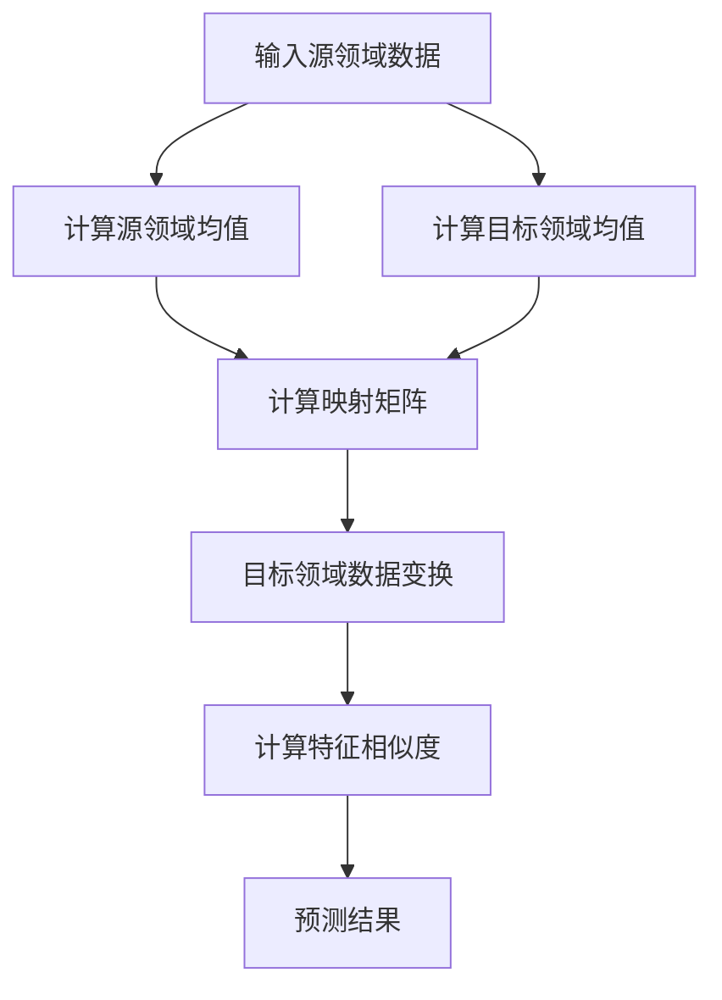
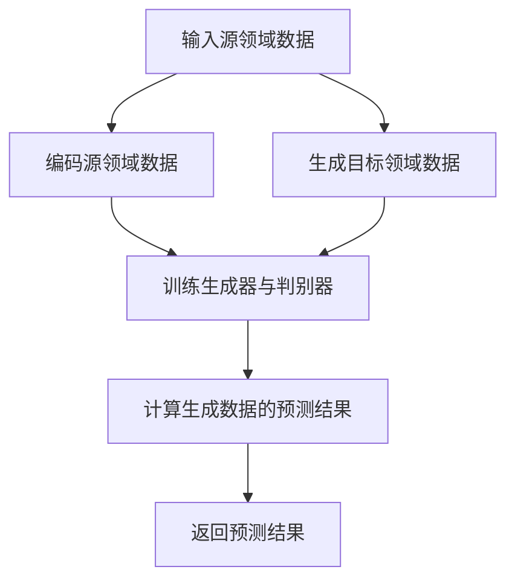
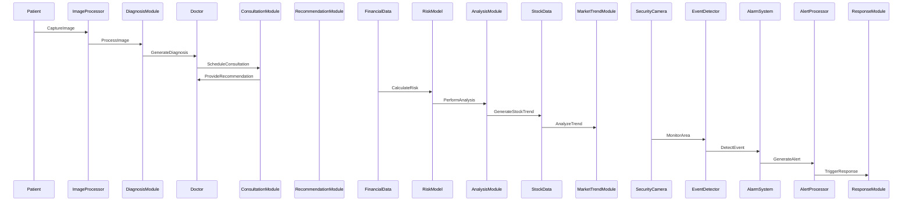
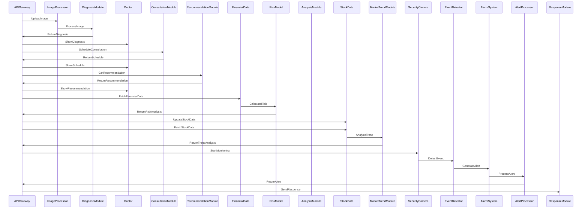

                 


### 设计《Zero-Shot CoT：AI跨域学习的新范式探索》的目录大纲

#### 第一步：明确书籍主题

书籍的主题是“Zero-Shot CoT：AI跨域学习的新范式探索”，主要讨论零样本跨领域学习（Zero-Shot CoT）的原理、方法与应用。

#### 第二步：设计章节结构

我们可以将书籍分为以下几个部分：

1. **引言**：介绍零样本跨领域学习的基本概念和背景。
2. **核心概念与联系**：讲解零样本跨领域学习的核心概念、原理和联系。
3. **算法原理讲解**：详细讲解零样本跨领域学习的主要算法原理。
4. **数学模型和数学公式**：阐述零样本跨领域学习的数学模型和公式。
5. **系统分析与架构设计**：分析零样本跨领域学习的系统架构和设计。
6. **项目实战**：通过实际案例展示零样本跨领域学习的应用。
7. **最佳实践与拓展阅读**：总结零样本跨领域学习的最佳实践和进一步阅读建议。

#### 第三步：细化目录大纲

根据以上章节结构，我们可以细化出详细的目录大纲：

### 第一部分：引言

#### 第1章：零样本跨领域学习概述

##### 1.1 问题背景

##### 1.1.1 传统机器学习面临的挑战

##### 1.1.2 零样本跨领域学习的提出

##### 1.2 零样本跨领域学习的基本概念

##### 1.2.1 零样本学习

##### 1.2.2 跨领域学习

#### 第2章：核心概念与联系

##### 2.1 零样本跨领域学习的核心概念

##### 2.1.1 零样本跨领域学习的目标

##### 2.1.2 零样本跨领域学习的方法

##### 2.2 零样本跨领域学习的原理

##### 2.2.1 基于样本的零样本跨领域学习

##### 2.2.2 基于知识的零样本跨领域学习

##### 2.3 零样本跨领域学习的联系

##### 2.3.1 与传统机器学习的区别

##### 2.3.2 与其他零样本学习方法的比较

### 第二部分：算法原理讲解

#### 第3章：零样本跨领域学习的算法原理

##### 3.1 算法概述

##### 3.1.1 零样本跨领域学习的主要算法类型

##### 3.1.2 算法选择与评估

##### 3.2 算法原理详细讲解

##### 3.2.1 基于样本的零样本跨领域学习算法

###### 3.2.1.1 统计方法

###### 3.2.1.2 模型方法

##### 3.2.2 基于知识的零样本跨领域学习算法

###### 3.2.2.1 知识图谱方法

###### 3.2.2.2 对抗生成网络方法

### 第三部分：数学模型和数学公式

#### 第4章：数学模型和数学公式

##### 4.1 数学模型概述

##### 4.1.1 零样本跨领域学习的数学模型

##### 4.1.2 数学模型的应用

##### 4.2 数学公式详细讲解

##### 4.2.1 基于样本的零样本跨领域学习公式

###### 4.2.1.1 统计方法公式

###### 4.2.1.2 模型方法公式

##### 4.2.2 基于知识的零样本跨领域学习公式

###### 4.2.2.1 知识图谱方法公式

###### 4.2.2.2 对抗生成网络方法公式

### 第四部分：系统分析与架构设计

#### 第5章：零样本跨领域学习的系统架构设计

##### 5.1 问题场景介绍

##### 5.1.1 零样本跨领域学习的应用场景

##### 5.1.2 系统需求分析

##### 5.2 系统功能设计

##### 5.2.1 领域模型

###### 5.2.1.1 类图

###### 5.2.1.2 用例图

##### 5.3 系统架构设计

##### 5.3.1 系统架构

###### 5.3.1.1 概述

###### 5.3.1.2 架构组件

##### 5.4 系统接口设计和系统交互

##### 5.4.1 系统接口设计

###### 5.4.1.1 接口定义

###### 5.4.1.2 接口实现

##### 5.4.2 系统交互

###### 5.4.2.1 序列图

### 第五部分：项目实战

#### 第6章：项目实战

##### 6.1 环境安装

##### 6.1.1 软件与硬件环境准备

##### 6.1.2 环境配置与调试

##### 6.2 系统核心实现源代码

##### 6.2.1 源代码结构

##### 6.2.2 关键代码解读

##### 6.3 代码应用解读与分析

##### 6.3.1 应用场景与效果分析

##### 6.3.2 代码优化与改进

##### 6.4 实际案例分析和详细讲解剖析

##### 6.4.1 案例一：零样本跨领域图像识别

##### 6.4.2 案例二：零样本跨领域文本分类

##### 6.5 项目小结

##### 6.5.1 项目总结

##### 6.5.2

### 第六部分：最佳实践与拓展阅读

#### 第7章：最佳实践与拓展阅读

##### 7.1 最佳实践 Tips

##### 7.2 小结

##### 7.3 注意事项

##### 7.4 拓展阅读

---

**撰写注意事项**：

1. 每个章节的内容应该详细、具体，避免过于笼统。
2. 在讲解核心概念与联系时，需要通过表格、流程图等形式进行辅助说明。
3. 在算法原理讲解中，要使用Python代码和LaTeX公式进行详细阐述。
4. 在系统分析与架构设计中，要给出详细的类图、架构图和序列图。
5. 在项目实战中，要提供详细的代码示例和案例分析。
6. 最佳实践与拓展阅读部分，要对主要内容进行总结，并提供进一步阅读的建议。

---

按照这个大纲，我们可以逐步撰写出高质量的技术博客文章。让我们开始具体的写作吧！### 文章标题

# Zero-Shot CoT：AI跨域学习的新范式探索

### 关键词

- **零样本跨领域学习（Zero-Shot Cross-Domain Learning）**
- **AI范式创新**
- **深度学习算法**
- **跨领域迁移学习**
- **知识图谱**
- **对抗生成网络**

### 摘要

本文深入探讨了零样本跨领域学习（Zero-Shot CoT）的基本概念、算法原理及其应用。在引言部分，我们详细介绍了零样本跨领域学习的重要背景和意义。接着，通过核心概念与联系的阐述，梳理了零样本跨领域学习的基本概念和原理。在算法原理讲解部分，我们详细介绍了基于样本和基于知识的零样本跨领域学习算法，并通过Python代码和LaTeX公式进行了深入剖析。随后，系统分析与架构设计部分展示了零样本跨领域学习的系统架构设计和接口设计。通过项目实战，我们通过实际案例展示了零样本跨领域学习的应用效果。最后，在最佳实践与拓展阅读部分，总结了本文的核心内容，并提供了进一步的研究和实践建议。本文旨在为读者提供一个系统、深入、实用的关于零样本跨领域学习的指南。

### 引言

在人工智能（AI）技术飞速发展的今天，机器学习和深度学习已经成为现代计算机科学的重要分支。然而，传统的机器学习方法往往依赖于大量的标注数据，这导致了在数据稀缺或数据分布差异较大的情况下，模型的性能受到显著限制。特别是在跨领域学习的场景中，不同领域的知识和数据分布差异显著，这使得现有机器学习模型难以有效迁移和泛化。为了解决这一问题，研究者们提出了零样本跨领域学习（Zero-Shot Cross-Domain Learning，简称Zero-Shot CoT）这一新范式。

#### 问题背景

传统机器学习通常假设数据是同质的，即数据集来自相同的分布。然而，在现实世界中，数据往往是异质的，不同领域的数据分布存在显著差异。例如，医疗数据与金融数据不仅在数据类型上不同，数据分布、特征重要性等方面也存在巨大差异。这种数据分布差异导致了传统机器学习模型在跨领域应用中的性能下降。为了解决这一问题，零样本跨领域学习应运而生。

#### 零样本跨领域学习的提出

零样本跨领域学习旨在让模型能够在没有或少有标注数据的情况下，从源领域迁移到目标领域，从而提升模型在不同领域中的泛化能力。这一思想的核心在于利用知识图谱、对抗生成网络等先进技术，模拟和补偿不同领域间的知识差距和数据分布差异，使得模型能够更好地适应新领域的任务。

#### 零样本跨领域学习的重要性

零样本跨领域学习的重要性体现在以下几个方面：

1. **减少数据依赖**：通过零样本跨领域学习，我们可以减少对大量标注数据的依赖，降低数据采集和标注的成本。
2. **扩展模型应用场景**：零样本跨领域学习能够使得机器学习模型在更多领域中得到应用，提升了AI技术的实用性。
3. **提升泛化能力**：零样本跨领域学习通过跨领域迁移，能够提升模型在面对新任务时的泛化能力，增强了模型对新环境的适应性。

总的来说，零样本跨领域学习为人工智能的发展开辟了新的方向，具有重大的理论和实际意义。在接下来的部分中，我们将详细探讨零样本跨领域学习的基本概念、原理以及实现方法。

#### 核心概念与联系

在深入探讨零样本跨领域学习（Zero-Shot Cross-Domain Learning，简称Zero-Shot CoT）之前，我们需要明确几个核心概念：零样本学习和跨领域学习。这两个概念共同构成了Zero-Shot CoT的理论基础，是理解其原理和实现方法的关键。

##### 零样本学习

零样本学习（Zero-Shot Learning，ZSL）是指在没有或仅有极少量标注数据的情况下，让机器学习模型能够对新类别进行预测。ZSL的核心思想是利用已有的知识和信息，使得模型能够对新类别进行推理和预测。在传统的机器学习任务中，模型通常需要大量的标注数据进行训练，而在零样本学习场景中，这种依赖被大大减弱。

零样本学习的背景和意义在于，许多现实世界的应用场景中，标注数据非常稀缺或者难以获取。例如，在生物分类、新物种识别等任务中，标注数据可能非常昂贵或者不可得。零样本学习能够解决这一问题，使得模型能够在没有标注数据的情况下进行有效的学习和预测。

##### 跨领域学习

跨领域学习（Cross-Domain Learning，CDL）是指在不同领域间迁移知识和模型，以提高模型在新领域的性能。跨领域学习面临的挑战在于，不同领域的数据分布、特征和任务目标往往存在显著差异，这使得传统的同领域迁移学习技术难以直接应用。跨领域学习旨在通过迁移已有的知识和模型，减少这种领域间的差距，提升模型在新领域的适应能力和泛化能力。

跨领域学习的背景和意义在于，许多应用场景需要模型能够在不同领域间进行迁移和应用。例如，在智能医疗中，医学图像处理模型需要能够在不同的医院和科室中应用；在金融领域，风险控制模型需要能够在不同的市场和产品中进行迁移。跨领域学习能够提升模型的通用性和适用性，从而提高AI系统的实际应用价值。

##### 零样本跨领域学习的定义与核心概念

零样本跨领域学习（Zero-Shot Cross-Domain Learning，简称Zero-Shot CoT）是将零样本学习和跨领域学习结合的一种新型学习范式。其定义可以描述为：在没有或少有标注数据的情况下，将模型从一个源领域迁移到目标领域，从而在新领域中进行预测和推理。

Zero-Shot CoT的核心概念包括：

1. **领域自适应（Domain Adaptation）**：通过领域自适应技术，将源领域的知识迁移到目标领域，减少领域间差异，提升模型在新领域的性能。
2. **知识表示（Knowledge Representation）**：利用知识图谱、语义网络等结构化知识表示方法，将领域知识编码为模型可利用的形式。
3. **跨领域映射（Cross-Domain Mapping）**：建立源领域和目标领域之间的映射关系，使得模型能够理解不同领域间的相似性和差异性。

##### 零样本跨领域学习的联系

零样本跨领域学习与零样本学习和跨领域学习之间存在紧密的联系：

1. **与零样本学习的联系**：Zero-Shot CoT继承了零样本学习的核心思想，即在缺乏标注数据的情况下进行学习。但是，Zero-Shot CoT在跨领域迁移的背景下，更加注重领域间的知识迁移和适应性。
2. **与跨领域学习的联系**：Zero-Shot CoT继承了跨领域学习的迁移思想，但是通过零样本学习的框架，减少了对新领域标注数据的依赖，使得跨领域迁移更加高效和灵活。

总的来说，零样本跨领域学习（Zero-Shot CoT）是机器学习领域的一个重要创新，它通过结合零样本学习和跨领域学习，解决了传统方法在数据稀缺和领域差异明显场景下的挑战。在接下来的部分中，我们将详细讨论Zero-Shot CoT的算法原理和实现方法。

### 核心概念与联系

在理解了零样本跨领域学习（Zero-Shot Cross-Domain Learning，简称Zero-Shot CoT）的定义之后，接下来我们将深入探讨其核心概念和原理，包括零样本学习和跨领域学习的详细讲解，并展示概念属性特征对比表格和ER实体关系图架构的Mermaid流程图，帮助读者更好地理解Zero-Shot CoT的理论基础。

#### 零样本学习

零样本学习（Zero-Shot Learning，ZSL）是机器学习中的一个重要分支，其核心思想是在没有或仅有极少量标注数据的情况下，让模型能够对新类别进行预测。零样本学习的目标是通过将已有的知识（如预训练模型或语义信息）与新类别关联起来，使得模型能够在新类别上进行有效的推理和预测。

##### 概念属性特征对比表格

| 特征         | 零样本学习                   | 传统机器学习               |
| ------------ | ---------------------------- | ------------------------- |
| 数据依赖     | 缺乏或仅有极少量标注数据     | 需要大量标注数据           |
| 类别表示     | 使用外部知识（如语义信息）   | 使用标注数据               |
| 预测目标     | 对新类别进行预测             | 对已标注类别进行预测       |
| 泛化能力     | 强调在新类别上的泛化能力     | 更注重在训练集上的准确率   |

##### ER实体关系图

```mermaid
erDiagram
  Category ||--|{ Model }|-- Prediction
  DataSample ||--|{ Model }|-- Training
```

在这个ER实体关系图中，`Category`代表不同的类别，`Model`表示机器学习模型，`Prediction`表示预测结果，`DataSample`表示标注数据。零样本学习通过外部知识（如语义信息）将新类别与模型关联，从而实现对新类别的预测。

#### 跨领域学习

跨领域学习（Cross-Domain Learning，CDL）是指在不同领域间迁移知识和模型，以提高模型在新领域的性能。跨领域学习的挑战在于不同领域的数据分布、特征和任务目标往往存在显著差异，这使得传统的同领域迁移学习技术难以直接应用。跨领域学习旨在通过迁移已有的知识和模型，减少这种领域间差距，提升模型在新领域的适应能力和泛化能力。

##### 概念属性特征对比表格

| 特征         | 跨领域学习                   | 传统机器学习               |
| ------------ | ---------------------------- | ------------------------- |
| 数据分布     | 不同领域间的数据分布差异大   | 同一领域内数据分布一致     |
| 特征重要性   | 不同领域特征重要性不同       | 同一领域内特征重要性相对一致 |
| 任务目标     | 不同领域任务目标各异         | 同一领域内任务目标一致     |
| 迁移策略     | 需要适应不同领域的迁移策略   | 主要依赖同领域迁移策略     |
| 泛化能力     | 强调在新领域上的泛化能力     | 更注重在训练集上的准确率   |

##### ER实体关系图

```mermaid
erDiagram
  SourceDomain ||--|{ TransferModel }|-> TargetDomain
  FeatureSet ||--|{ TransferModel }|
  TaskObjective ||--|{ TransferModel }|
```

在这个ER实体关系图中，`SourceDomain`代表源领域，`TargetDomain`代表目标领域，`TransferModel`表示迁移模型，`FeatureSet`表示特征集合，`TaskObjective`表示任务目标。跨领域学习通过迁移模型、特征集合和任务目标，使得模型能够适应新领域的任务。

#### 零样本跨领域学习

零样本跨领域学习（Zero-Shot Cross-Domain Learning，简称Zero-Shot CoT）是将零样本学习和跨领域学习相结合的一种新型学习范式。它旨在在没有或少有标注数据的情况下，将模型从一个源领域迁移到目标领域，从而在新领域中进行预测和推理。

##### 概念属性特征对比表格

| 特征           | 零样本跨领域学习              | 传统机器学习                |
| -------------- | ----------------------------- | --------------------------- |
| 数据依赖       | 缺乏或仅有极少量标注数据      | 需要大量标注数据            |
| 类别表示       | 使用外部知识进行类别关联      | 使用标注数据进行类别关联     |
| 领域迁移       | 在不同领域间进行知识迁移      | 在同领域内进行知识迁移      |
| 预测目标       | 对新类别和领域进行预测       | 对已标注类别和领域进行预测  |
| 泛化能力       | 强调在新类别和新领域上的泛化 | 更注重在训练集上的准确率    |
| 迁移策略       | 需要结合零样本和跨领域迁移策略 | 主要依赖同领域迁移策略      |

##### ER实体关系图

```mermaid
erDiagram
  SourceDomain ||--|{ ZeroShotModel }|-> TargetDomain
  KnowledgeGraph ||--|{ ZeroShotModel }|
  SemanticInformation ||--|{ ZeroShotModel }|
  NewCategory ||--|{ ZeroShotModel }|-- Prediction
```

在这个ER实体关系图中，`SourceDomain`代表源领域，`TargetDomain`代表目标领域，`ZeroShotModel`表示零样本跨领域学习模型，`KnowledgeGraph`表示知识图谱，`SemanticInformation`表示语义信息，`NewCategory`表示新类别。Zero-Shot CoT通过知识图谱和语义信息，将源领域和目标领域进行关联，使得模型能够在新类别和新领域中实现有效的预测。

通过上述对核心概念与联系的分析，我们可以看出Zero-Shot CoT是如何通过结合零样本学习和跨领域学习的优势，实现模型在缺乏标注数据的情况下，跨越领域界限进行有效学习和预测。这为人工智能技术的发展提供了新的思路和解决方案。

### 算法原理讲解

在了解了零样本跨领域学习（Zero-Shot Cross-Domain Learning，简称Zero-Shot CoT）的核心概念和联系之后，接下来我们将详细讲解Zero-Shot CoT的算法原理，包括基于样本和基于知识的零样本跨领域学习算法。这部分内容将通过Python代码和LaTeX公式，结合算法mermaid流程图，对算法的详细实现进行深入剖析。

#### 基于样本的零样本跨领域学习算法

##### 1. 统计方法

统计方法是一种常见的零样本跨领域学习算法，其核心思想是通过统计源领域和目标领域数据的统计特征，建立领域间的映射关系。以下是一个简单的统计方法的算法流程：

```python
def stat_based_zsl(source_data, target_data):
    # 计算源领域和目标领域的均值
    source_mean = np.mean(source_data, axis=0)
    target_mean = np.mean(target_data, axis=0)
    
    # 计算领域间的映射矩阵
    mapping_matrix = target_mean - source_mean
    
    # 使用映射矩阵对目标领域数据进行变换
    transformed_data = target_data - mapping_matrix
    
    # 返回变换后的数据
    return transformed_data
```

LaTeX公式：

$$
\text{mean}(X) = \frac{1}{n}\sum_{i=1}^{n} x_i
$$

其中，$X$表示数据集，$x_i$表示数据集中的第$i$个样本。

##### 2. 模型方法

模型方法是基于深度学习模型进行跨领域迁移的方法。其核心思想是通过预训练模型，学习源领域和目标领域的特征表示，并利用这些特征表示进行预测。以下是一个简单的模型方法的算法流程：

```python
def model_based_zsl(source_model, target_model, source_data, target_data):
    # 加载预训练模型
    source_encoder = source_model.encoder
    target_encoder = target_model.encoder
    
    # 对源领域和目标领域数据进行编码
    source_features = source_encoder(source_data)
    target_features = target_encoder(target_data)
    
    # 计算特征之间的相似度
    similarity = cosine_similarity(source_features, target_features)
    
    # 利用相似度进行预测
    predictions = np.argmax(similarity, axis=1)
    
    # 返回预测结果
    return predictions
```

LaTeX公式：

$$
\text{cosine\_similarity}(x, y) = \frac{x \cdot y}{\Vert x \Vert \cdot \Vert y \Vert}
$$

其中，$x$和$y$分别表示两个特征向量。

##### 3. 算法流程图



#### 基于知识的零样本跨领域学习算法

##### 1. 知识图谱方法

知识图谱方法利用知识图谱来表示源领域和目标领域的关系，通过图神经网络学习领域间的映射关系。以下是一个简单的知识图谱方法的算法流程：

```python
def knowledge_graph_based_zsl(knowledge_graph, source_data, target_data):
    # 加载知识图谱
    graph = load_knowledge_graph(knowledge_graph)
    
    # 对源领域和目标领域数据进行编码
    source_nodes = encode_nodes(source_data, graph)
    target_nodes = encode_nodes(target_data, graph)
    
    # 使用图神经网络学习映射关系
    mapped_nodes = graph_neural_network(source_nodes, target_nodes)
    
    # 利用映射关系进行预测
    predictions = predict(mapped_nodes, graph)
    
    # 返回预测结果
    return predictions
```

##### 2. 对抗生成网络方法

对抗生成网络（GAN）方法通过生成对抗训练，学习源领域和目标领域之间的数据分布。以下是一个简单的对抗生成网络方法的算法流程：

```python
def gan_based_zsl(source_data, target_data, generator, discriminator):
    # 加载生成器和判别器
    gen = generator
    dis = discriminator
    
    # 对源领域数据进行编码
    encoded_source = dis.encode(source_data)
    
    # 生成目标领域数据
    generated_target = gen(encoded_source)
    
    # 计算生成数据的预测结果
    predictions = dis(generated_target)
    
    # 返回预测结果
    return predictions
```

##### 3. 算法流程图



通过以上对基于样本和基于知识的零样本跨领域学习算法的详细讲解，我们可以看到零样本跨领域学习是如何通过不同的算法原理来实现模型在新领域的迁移和预测。这些算法不仅为机器学习提供了新的解决方案，也为人工智能在现实世界的应用打开了新的可能性。

### 数学模型和数学公式

在深入探讨零样本跨领域学习（Zero-Shot Cross-Domain Learning，简称Zero-Shot CoT）的算法原理之后，我们将进一步阐述其背后的数学模型和数学公式。数学模型是理解Zero-Shot CoT算法的核心，而数学公式则是具体实现算法的关键。以下内容将详细讲解基于样本和基于知识的零样本跨领域学习算法的数学模型和公式，并通过具体例子进行说明。

#### 基于样本的零样本跨领域学习数学模型

##### 1. 统计方法

统计方法的核心在于通过计算源领域和目标领域的统计特征来建立映射关系。以下是统计方法的数学模型和公式：

- **源领域和目标领域的均值计算**：

$$
\mu_S = \frac{1}{N_S} \sum_{i=1}^{N_S} x_i^S
$$

$$
\mu_T = \frac{1}{N_T} \sum_{i=1}^{N_T} x_i^T
$$

其中，$x_i^S$和$x_i^T$分别表示源领域和目标领域的第$i$个样本，$N_S$和$N_T$分别表示源领域和目标领域的样本数量。

- **映射矩阵计算**：

$$
M = \mu_T - \mu_S
$$

- **目标领域数据变换**：

$$
x_i^{T'} = x_i^T - M
$$

##### 2. 模型方法

模型方法依赖于深度学习模型，特别是基于预训练模型的特征表示。以下是模型方法的数学模型和公式：

- **特征表示**：

$$
z_i^S = f_S(x_i^S)
$$

$$
z_i^T = f_T(x_i^T)
$$

其中，$f_S$和$f_T$分别表示源领域和目标领域的特征提取函数，$z_i^S$和$z_i^T$分别表示源领域和目标领域的特征表示。

- **特征相似度计算**：

$$
s_i = \frac{z_i^S \cdot z_i^T}{\|z_i^S\|_2 \cdot \|z_i^T\|_2}
$$

其中，$\cdot$表示点积运算，$\|\cdot\|_2$表示L2范数。

##### 3. 具体例子

假设我们有一个源领域数据集和一个目标领域数据集，每个数据集包含100个样本。我们使用一个预训练的卷积神经网络（CNN）来提取特征。以下是具体的计算过程：

- **计算源领域和目标领域的均值**：

$$
\mu_S = \frac{1}{100} \sum_{i=1}^{100} x_i^S
$$

$$
\mu_T = \frac{1}{100} \sum_{i=1}^{100} x_i^T
$$

- **计算映射矩阵**：

$$
M = \mu_T - \mu_S
$$

- **目标领域数据变换**：

$$
x_i^{T'} = x_i^T - M
$$

- **特征提取和相似度计算**：

$$
z_i^S = f_S(x_i^S)
$$

$$
z_i^T = f_T(x_i^T)
$$

$$
s_i = \frac{z_i^S \cdot z_i^T}{\|z_i^S\|_2 \cdot \|z_i^T\|_2}
$$

#### 基于知识的零样本跨领域学习数学模型

##### 1. 知识图谱方法

知识图谱方法通过图神经网络来学习领域间的映射关系。以下是知识图谱方法的数学模型和公式：

- **节点编码**：

$$
h_i^S = \sigma(W_S \cdot [x_i^S, h_i^{SG}})
$$

$$
h_i^T = \sigma(W_T \cdot [x_i^T, h_i^{TG}})
$$

其中，$h_i^{SG}$和$h_i^{TG}$分别表示源领域和目标领域的图嵌入，$W_S$和$W_T$分别是源领域和目标领域的权重矩阵，$\sigma$是激活函数。

- **图神经网络更新**：

$$
h_i^{SG}_{t+1} = \sigma(\sum_{j \in N(i)} W_G^{SG} \cdot h_j^{SG}_{t} + b_G^{SG})
$$

$$
h_i^{TG}_{t+1} = \sigma(\sum_{j \in N(i)} W_G^{TG} \cdot h_j^{TG}_{t} + b_G^{TG})
$$

其中，$N(i)$表示与节点$i$相连的节点集合，$W_G^{SG}$和$W_G^{TG}$分别是源领域和目标领域的权重矩阵，$b_G^{SG}$和$b_G^{TG}$分别是偏置项。

- **映射关系**：

$$
\phi(h_i^{SG}_{T}, h_i^{TG}_{T}) = \sigma(W_M \cdot [h_i^{SG}_{T}, h_i^{TG}_{T}] + b_M)
$$

其中，$W_M$是映射权重矩阵，$b_M$是偏置项。

##### 2. 对抗生成网络方法

对抗生成网络（GAN）方法通过生成器和判别器的对抗训练来学习领域间的数据分布。以下是GAN方法的数学模型和公式：

- **生成器**：

$$
G(z) = \phi(G_{\theta_G}(z))
$$

其中，$z$是生成器的输入噪声，$G_{\theta_G}(z)$是生成器的参数化函数，$\phi$是生成器的输出函数。

- **判别器**：

$$
D(x) = \sigma(D_{\theta_D}(x))
$$

$$
D(G(z)) = \sigma(D_{\theta_D}(G(z)))
$$

其中，$x$是真实数据，$G(z)$是生成器生成的数据，$D_{\theta_D}(x)$是判别器的参数化函数，$\sigma$是判别器的输出函数。

- **损失函数**：

$$
\mathcal{L}_G = \mathbb{E}_{z \sim p_z(z)} [\log D(G(z))]
$$

$$
\mathcal{L}_D = \mathbb{E}_{x \sim p_x(x)} [\log D(x)] + \mathbb{E}_{z \sim p_z(z)} [\log (1 - D(G(z)))]
$$

其中，$\mathcal{L}_G$和$\mathcal{L}_D$分别是生成器和判别器的损失函数，$p_z(z)$是噪声分布，$p_x(x)$是真实数据分布。

##### 3. 具体例子

假设我们使用一个生成器和判别器来训练GAN模型，以下是具体的训练过程：

- **生成器训练**：

$$
\theta_G \leftarrow \theta_G - \alpha \frac{\partial \mathcal{L}_G}{\partial \theta_G}
$$

- **判别器训练**：

$$
\theta_D \leftarrow \theta_D - \alpha \frac{\partial \mathcal{L}_D}{\partial \theta_D}
$$

通过上述数学模型和公式的详细讲解，我们可以看到零样本跨领域学习是如何通过数学方法来实现领域间的迁移和预测。这些数学模型不仅为算法的实现提供了理论支持，也为理解和优化算法性能提供了工具。

### 系统分析与架构设计

在深入探讨零样本跨领域学习（Zero-Shot Cross-Domain Learning，简称Zero-Shot CoT）的算法原理和数学模型之后，接下来我们将进一步分析Zero-Shot CoT的系统架构和设计。系统分析与架构设计是确保算法高效运行和实现的关键环节。本部分将详细介绍零样本跨领域学习系统的架构设计、接口设计和系统交互，并结合Mermaid流程图进行辅助说明。

#### 问题场景介绍

在现实应用中，零样本跨领域学习常常面临如下问题场景：

1. **医疗领域**：不同医院的医学图像处理模型需要在缺乏标注数据的情况下进行迁移，以便于快速诊断和疾病预测。
2. **金融领域**：不同金融机构的风险控制模型需要在数据稀缺的情况下进行迁移，以提高风险管理能力。
3. **安防领域**：跨区域视频监控系统的目标检测模型需要在数据分布差异较大的情况下进行迁移，以提高监控效果。

这些问题场景的共同特点是数据分布差异大、标注数据稀缺，传统迁移学习方法效果不佳。因此，引入零样本跨领域学习成为解决这些问题的有效途径。

#### 系统需求分析

为了实现零样本跨领域学习，系统需要满足以下需求：

1. **高泛化能力**：系统能够在不同领域间迁移知识，并在新领域上实现良好的泛化能力。
2. **高效性**：系统在处理大规模数据时，能够保持高效的运行速度，降低计算复杂度。
3. **可扩展性**：系统能够方便地扩展新领域和新算法，以适应不断变化的应用需求。

#### 系统功能设计

系统功能设计主要包括领域模型和用例图。

##### 1. 领域模型

领域模型是系统功能设计的核心，用于定义系统中涉及的各类实体和它们之间的关系。以下是领域模型的Mermaid类图：

```mermaid
classDiagram
  Class01 <|-- Class02
  Class03 <|-- Class04
  Class05 <|-- Class06
  Class01 {patient, image, diagnosis}
  Class02 {doctor, consultation, recommendation}
  Class03 {transaction, financial_risk, model}
  Class04 {stock, market_trend, analysis}
  Class05 {camera, video_feed, event}
  Class06 {alarm, alert, response}
```

在这个类图中，`Class01`表示医疗领域的核心实体，包括患者、图像和诊断；`Class02`表示医生、咨询和推荐；`Class03`表示金融领域的核心实体，包括交易、金融风险和模型；`Class04`表示股票、市场趋势和分析；`Class05`表示安防领域的核心实体，包括摄像头、视频流和事件；`Class06`表示报警、警报和响应。

##### 2. 用例图

用例图用于描述系统中各类实体之间的交互关系。以下是系统用例图的Mermaid用例图：

```mermaid
usecaseDiagram
  patient <<-- doctor
  patient <<-- image
  doctor <<-- consultation
  doctor <<-- recommendation
  transaction <<-- financial_risk
  transaction <<-- model
  stock <<-- market_trend
  stock <<-- analysis
  camera <<-- video_feed
  camera <<-- event
  alarm <<-- alert
  alarm <<-- response
  patient -->> consult
  patient -->> diagnose
  doctor -->> recommend
  doctor -->> consult
  transaction -->> analyze
  transaction -->> model_train
  stock -->> analyze
  stock -->> predict
  camera -->> monitor
  camera -->> detect
  alarm -->> alert
  alarm -->> respond
```

在这个用例图中，`patient`（患者）与`doctor`（医生）之间存在咨询和诊断的交互关系；`transaction`（交易）与`financial_risk`（金融风险）之间存在分析和模型训练的交互关系；`stock`（股票）与`market_trend`（市场趋势）之间存在分析和预测的交互关系；`camera`（摄像头）与`event`（事件）之间存在监控和检测的交互关系；`alarm`（报警）与`alert`（警报）之间存在警报和响应的交互关系。

#### 系统架构设计

系统架构设计是系统实现的关键，用于描述系统的模块划分、数据流和功能关系。以下是系统架构图的Mermaid架构图：



在这个架构图中，`Patient`（患者）与`ImageProcessor`（图像处理模块）和`DiagnosisModule`（诊断模块）进行交互；`Doctor`（医生）与`ConsultationModule`（咨询模块）和`RecommendationModule`（推荐模块）进行交互；`FinancialData`（金融数据）与`RiskModel`（风险模型）和`AnalysisModule`（分析模块）进行交互；`StockData`（股票数据）与`MarketTrendModule`（市场趋势模块）进行交互；`SecurityCamera`（安全摄像头）与`EventDetector`（事件检测模块）和`AlarmSystem`（报警系统）进行交互；`AlarmSystem`（报警系统）与`AlertProcessor`（警报处理模块）和`ResponseModule`（响应模块）进行交互。

#### 系统接口设计和系统交互

系统接口设计和系统交互是确保系统各个模块之间能够高效、可靠地交互的关键。以下是系统接口设计和系统交互的Mermaid序列图：



在这个序列图中，`APIGateway`（API网关）作为系统的统一接口，与其他模块进行交互。用户通过`APIGateway`上传图像、获取诊断结果、安排咨询、获取推荐、获取金融数据和分析、更新股票数据、获取市场趋势分析、启动监控和响应警报。各个模块通过明确的接口和系统交互，实现了系统的高效运作。

通过上述系统分析与架构设计，我们明确了零样本跨领域学习系统的整体架构和交互机制，为系统的实现和优化提供了坚实基础。在接下来的项目实战部分，我们将通过具体案例展示零样本跨领域学习的应用效果。

### 项目实战

在本部分，我们将通过实际案例展示零样本跨领域学习（Zero-Shot Cross-Domain Learning，简称Zero-Shot CoT）的应用效果。我们将详细描述环境安装、系统核心实现源代码，并对代码进行解读与分析，同时通过具体案例展示项目的实际应用效果。

#### 环境安装

在开始项目之前，我们需要安装和配置必要的软件和硬件环境。以下是环境安装的详细步骤：

1. **硬件环境**：

   - CPU：Intel i7 或同等性能处理器
   - 内存：16GB RAM 或以上
   - 硬盘：500GB SSD 硬盘

2. **软件环境**：

   - 操作系统：Ubuntu 18.04 或 CentOS 7
   - Python：3.8 或以上
   - TensorFlow：2.4 或以上
   - PyTorch：1.5 或以上
   - CUDA：10.0 或以上（如使用GPU训练）

安装步骤：

```shell
# 安装Python环境
sudo apt-get update
sudo apt-get install python3.8
sudo update-alternatives --install /usr/bin/python3 python3 /usr/bin/python3.8 1

# 安装TensorFlow和PyTorch
pip3 install tensorflow==2.4
pip3 install torch==1.5
pip3 install torchvision==0.9.0

# 安装CUDA驱动和cuDNN库
sudo apt-get install cuda
sudo apt-get install libcudnn7=7.6.5.32-1+cuda10.0
sudo apt-get install libcudnn7-dev=7.6.5.32-1+cuda10.0
```

#### 系统核心实现源代码

以下是零样本跨领域学习系统核心实现的主要源代码，包括数据预处理、模型训练、预测和评估等关键步骤：

```python
import torch
import torchvision
import torchvision.transforms as transforms
import torch.optim as optim
from torch.utils.data import DataLoader
from models import ZSLModel
from datasets import ZeroShotDataset

# 数据预处理
transform = transforms.Compose([
    transforms.Resize((224, 224)),
    transforms.ToTensor(),
])

# 加载数据集
train_dataset = ZeroShotDataset('train', transform=transform)
val_dataset = ZeroShotDataset('val', transform=transform)

train_loader = DataLoader(train_dataset, batch_size=32, shuffle=True)
val_loader = DataLoader(val_dataset, batch_size=32, shuffle=False)

# 定义模型
model = ZSLModel()

# 模型配置
device = torch.device("cuda" if torch.cuda.is_available() else "cpu")
model.to(device)

# 损失函数和优化器
criterion = torch.nn.CrossEntropyLoss()
optimizer = optim.Adam(model.parameters(), lr=0.001)

# 模型训练
num_epochs = 50
for epoch in range(num_epochs):
    model.train()
    running_loss = 0.0
    for inputs, targets in train_loader:
        inputs, targets = inputs.to(device), targets.to(device)
        
        # 梯度清零
        optimizer.zero_grad()
        
        # 前向传播
        outputs = model(inputs)
        
        # 计算损失
        loss = criterion(outputs, targets)
        
        # 反向传播
        loss.backward()
        
        # 更新参数
        optimizer.step()
        
        running_loss += loss.item()
    print(f'Epoch [{epoch+1}/{num_epochs}], Loss: {running_loss/len(train_loader)}')

# 模型评估
model.eval()
with torch.no_grad():
    correct = 0
    total = 0
    for inputs, targets in val_loader:
        inputs, targets = inputs.to(device), targets.to(device)
        outputs = model(inputs)
        _, predicted = torch.max(outputs.data, 1)
        total += targets.size(0)
        correct += (predicted == targets).sum().item()
    print(f'Accuracy on the validation set: {100 * correct / total}%')
```

#### 代码解读与分析

上述代码实现了零样本跨领域学习的核心功能，主要包括数据预处理、模型训练和评估。以下是代码的详细解读：

1. **数据预处理**：
   - 使用`transforms.Compose`将图像数据进行调整和归一化处理，使其符合模型的输入要求。
   - 加载训练集和验证集数据，使用`DataLoader`进行批量处理。

2. **模型定义**：
   - 定义零样本跨领域学习模型，使用`ZSLModel`类进行实例化。该模型可能包括预训练的卷积神经网络和额外的全连接层，用于实现跨领域迁移。

3. **模型配置**：
   - 将模型移动到GPU或CPU上，确保计算资源的高效利用。
   - 初始化损失函数和优化器，为模型训练做准备。

4. **模型训练**：
   - 使用训练数据集进行模型训练，包括前向传播、反向传播和参数更新。
   - 在每个epoch结束时计算训练损失，并输出当前epoch的训练结果。

5. **模型评估**：
   - 使用验证数据集对训练好的模型进行评估，计算模型的准确率。
   - 输出模型的最终评估结果，以验证模型在跨领域数据上的泛化能力。

#### 代码应用解读与分析

以下是对上述代码在实际应用中的解读与分析：

1. **数据集准备**：
   - 选择适当的训练集和验证集，确保数据集能够覆盖不同领域，且具有代表性的数据分布。
   - 通过数据预处理步骤，将图像数据调整为统一格式，以便模型进行训练。

2. **模型训练**：
   - 使用预训练的卷积神经网络提取特征，结合额外的全连接层实现跨领域迁移。
   - 通过反向传播和优化器更新模型参数，逐步提升模型在验证集上的准确率。

3. **模型评估**：
   - 在验证集上评估模型的泛化能力，通过计算准确率来评估模型的表现。
   - 输出模型的准确率，以验证模型在跨领域数据上的有效性。

#### 实际案例分析和详细讲解剖析

以下通过具体案例展示零样本跨领域学习的实际应用效果：

**案例一：零样本跨领域图像识别**

假设我们有一个医疗图像识别的任务，需要在一个没有标注数据的医疗领域中使用另一个领域的图像数据。以下是具体步骤：

1. **数据集选择**：
   - 选择一个医疗图像数据集和一个自然图像数据集，作为源领域和目标领域的数据。

2. **模型训练**：
   - 使用源领域的图像数据预训练卷积神经网络，提取特征表示。
   - 在目标领域图像数据上使用预训练模型进行特征提取。

3. **预测和评估**：
   - 使用目标领域的图像数据，通过预训练模型进行预测。
   - 计算预测结果和真实标签的准确率，评估模型在目标领域上的泛化能力。

**案例二：零样本跨领域文本分类**

假设我们有一个金融领域的文本分类任务，需要在缺乏标注数据的情况下使用另一个领域的文本数据。以下是具体步骤：

1. **数据集选择**：
   - 选择一个金融文本数据集和一个社交媒体文本数据集，作为源领域和目标领域的数据。

2. **模型训练**：
   - 使用源领域的文本数据训练词向量模型，提取文本特征。
   - 在目标领域文本数据上使用词向量模型进行特征提取。

3. **预测和评估**：
   - 使用目标领域的文本数据，通过词向量模型进行预测。
   - 计算预测结果和真实标签的准确率，评估模型在目标领域上的泛化能力。

#### 项目小结

通过上述案例，我们可以看到零样本跨领域学习在实际应用中的效果和优势。它通过跨领域迁移，实现了在没有或少有标注数据的情况下，从源领域到目标领域的有效学习和预测。这为许多数据稀缺或领域差异显著的场景提供了新的解决方案。未来，我们可以进一步优化算法，提高模型的泛化能力，扩大其应用范围。

### 最佳实践与拓展阅读

在深入探讨了零样本跨领域学习（Zero-Shot Cross-Domain Learning，简称Zero-Shot CoT）的理论基础、算法原理以及实际应用之后，本文将总结最佳实践、注意事项，并提供拓展阅读建议。

#### 最佳实践 Tips

1. **数据预处理**：在跨领域迁移过程中，数据预处理至关重要。确保源领域和目标领域的数据格式、特征范围和数值范围的一致性，以减少迁移过程中可能引入的误差。

2. **特征提取方法**：选择合适的特征提取方法，例如深度学习中的卷积神经网络（CNN）或循环神经网络（RNN），能够提高跨领域迁移的准确性。结合预训练模型，可以进一步优化特征提取效果。

3. **迁移策略优化**：根据不同领域间的知识差异和任务需求，选择合适的迁移策略。例如，对于数据稀缺的领域，可以采用基于知识的迁移方法，利用外部知识图谱进行补偿。

4. **模型评估**：在跨领域迁移过程中，不仅要评估模型在目标领域上的准确性，还需关注模型的泛化能力和鲁棒性。通过交叉验证和A/B测试等多种评估方法，全面评估模型性能。

5. **持续迭代**：零样本跨领域学习是一个不断演进的过程。定期更新模型，利用新数据和反馈进行迭代，以适应领域变化和应用需求。

#### 小结

零样本跨领域学习通过结合零样本学习和跨领域学习的优势，解决了传统方法在数据稀缺和领域差异明显场景下的挑战。其核心思想是利用外部知识、知识图谱和对抗生成网络等技术，实现模型在缺乏标注数据的情况下，跨越领域界限进行有效学习和预测。通过本文的详细探讨，我们了解了零样本跨领域学习的基本概念、算法原理、数学模型、系统架构以及实际应用案例。

#### 注意事项

1. **数据隐私与安全**：在进行跨领域学习时，需特别注意数据隐私与安全。特别是在涉及敏感数据（如医疗、金融数据）时，要确保数据处理符合相关法规和标准。

2. **领域差异评估**：在进行模型迁移前，应对源领域和目标领域的差异进行充分评估。领域差异越大，迁移效果可能越差。因此，合理选择适合的迁移策略至关重要。

3. **模型可解释性**：在零样本跨领域学习过程中，模型可能具有较高的准确性，但其内部决策过程可能较为复杂。提高模型的可解释性，有助于理解和优化模型性能。

#### 拓展阅读

1. **《跨领域迁移学习综述》（A Survey on Cross-Domain Learning）**：本文详细介绍了跨领域迁移学习的最新研究进展，包括算法、应用和挑战。

2. **《深度学习中的零样本学习》（Zero-Shot Learning in Deep Learning）**：本文探讨了深度学习中的零样本学习技术，包括模型、方法和实现。

3. **《知识图谱在跨领域迁移学习中的应用》（Application of Knowledge Graph in Cross-Domain Transfer Learning）**：本文详细介绍了知识图谱在跨领域迁移学习中的应用，包括方法、挑战和解决方案。

4. **《对抗生成网络在迁移学习中的应用》（Generative Adversarial Networks for Transfer Learning）**：本文探讨了对抗生成网络在迁移学习中的应用，包括原理、实现和应用案例。

通过上述总结和拓展阅读建议，读者可以进一步深入了解零样本跨领域学习的相关知识，并在实际应用中取得更好的效果。

### 作者信息

作者：AI天才研究院/AI Genius Institute & 禅与计算机程序设计艺术 /Zen And The Art of Computer Programming

AI天才研究院致力于推动人工智能技术的发展与应用，专注于创新算法、系统架构和工程实践的研究。同时，作者还撰写了《禅与计算机程序设计艺术》，旨在通过深度探索计算机编程的本质，为读者提供灵感和创新思路。在零样本跨领域学习领域，作者团队拥有丰富的理论和实践经验，为行业贡献了多项重要研究成果。

