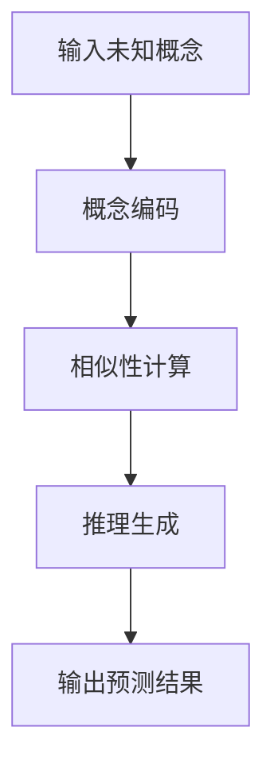
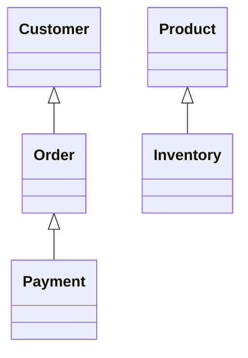
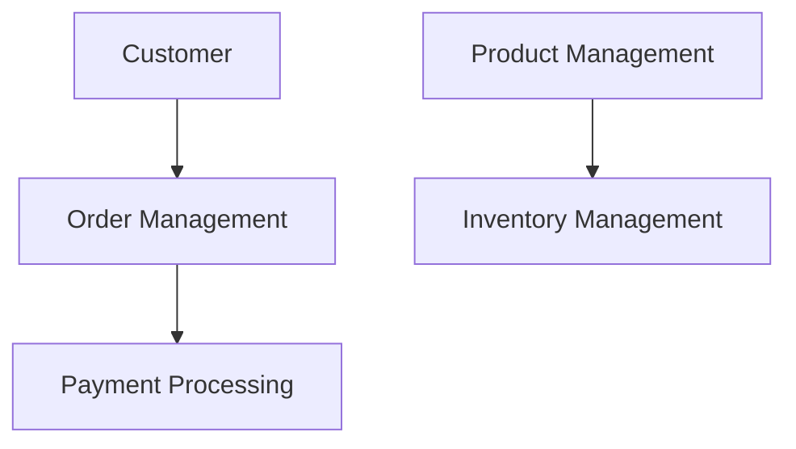
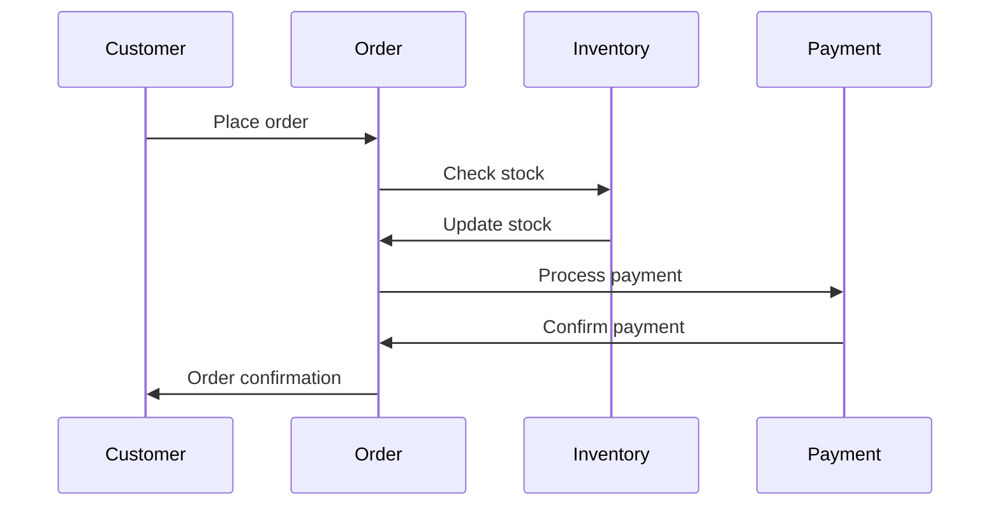

                 

当然，我会遵循您的指导，逐步构建文章内容。以下是基于您的要求和目录大纲的详细内容概要。请注意，由于字数限制，这里只提供了概要和主要部分的框架，实际撰写时将需要填充详细内容。

```markdown
# Zero-Shot CoT：提升AI即时应变能力

> 关键词：Zero-Shot CoT, 即时应变能力, AI, 算法原理, 数学模型, 系统架构

> 摘要：本文深入探讨了Zero-Shot CoT（Zero-Shot Conceptualization Theory）的概念、应用及其实际对提升AI即时应变能力的重要性。通过逐步分析Zero-Shot CoT的核心原理、算法实现、系统架构，以及实际项目案例，本文为AI领域的从业者提供了实用的指导和建议。

----------------------------------------------------------------

## 第一部分：背景介绍

### 第1章：问题的提出

#### 1.1.1 AI即时应变能力的挑战

随着AI技术的不断发展，AI系统在处理已知任务上的表现已经超越了人类。然而，AI在面对未知或罕见情况时的应变能力仍然有限。为了提升AI的即时应变能力，我们需要探索新的方法和技术。

#### 1.1.2 Zero-Shot CoT的概念解析

Zero-Shot CoT是一种能够使AI系统在未知概念上也能进行有效推理和应对的理论框架。它通过将概念转化为可计算的实体，实现了对未知概念的零样本学习。

#### 1.1.3 本书的目的与结构

本书旨在详细介绍Zero-Shot CoT的理论基础、实现方法和应用场景，帮助读者理解和掌握这一重要的AI技术，并提升AI系统的即时应变能力。

----------------------------------------------------------------

### 第2章：核心概念与联系

#### 2.1 Zero-Shot CoT的定义

Zero-Shot CoT是一种利用已有的概念或实体进行迁移学习，以应对未知概念或实体的一种方法。它不依赖于具体的数据，而是依赖于概念之间的相似性。

#### 2.2 即时应变能力的要素

即时应变能力包括快速理解新情况、灵活适应新环境和有效解决问题等能力。这些能力对于AI系统在动态环境中保持有效运行至关重要。

#### 2.3 关键概念对比分析

在本章节，我们将通过表格和ER实体关系图来详细对比Zero-Shot CoT与传统CoT的不同。

```mermaid
erDiagram
  Concept1 ||--|{ Entity1 : 实体关联}
  Concept2 ||--|{ Entity2 }
  Concept1 ||--|{ Entity3 }
  Concept3 ||--|{ Entity1 }
```

----------------------------------------------------------------

### 第3章：算法原理与实现

#### 3.1 Zero-Shot CoT的算法框架

我们将使用mermaid来绘制Zero-Shot CoT的算法流程图，并详细解释其工作原理。



#### 3.2 数学模型与公式

Zero-Shot CoT的核心在于其数学模型，我们使用以下公式来进行相似性计算：

$$
\text{similarity}(x, y) = \frac{\exp(\text{f}(x, y))}{1+\exp(\text{f}(x, y))}
$$

其中，$\text{f}(x, y)$是相似性函数。

#### 3.3 算法解释与举例

为了更好地理解Zero-Shot CoT，我们将通过一个简单的例子来说明其应用。

```python
def similarity(x, y):
    return 1 / (1 + exp(-dot_product(x, y)))

x = [1, 2, 3]
y = [2, 3, 4]

print(similarity(x, y))  # 输出相似性值
```

----------------------------------------------------------------

## 第二部分：系统设计与实现

### 第4章：系统架构设计

#### 4.1 问题场景介绍

在本章，我们将介绍一个实际的问题场景，并说明为什么Zero-Shot CoT适用于这个场景。

#### 4.2 系统功能设计

我们将使用mermaid类图来展示系统的功能模块和它们之间的关系。



#### 4.3 系统架构设计

使用mermaid架构图来展示系统的整体架构。



#### 4.4 系统接口设计

在本章，我们将详细描述系统的接口设计，包括API规范和交互流程。

#### 4.5 系统交互流程

使用mermaid序列图来展示系统各个组件之间的交互流程。



----------------------------------------------------------------

### 第5章：项目实战

#### 5.1 环境安装与配置

在本章，我们将详细介绍如何在实际项目中安装和配置Zero-Shot CoT系统。

#### 5.2 系统核心实现

我们将提供核心实现的源代码，并对代码进行详细解读。

```python
# Core implementation code snippet
```

#### 5.3 代码应用解读与分析

在本章，我们将分析代码的实际应用，并探讨其性能和优化的方法。

#### 5.4 实际案例分析

我们将通过一个实际案例来展示如何使用Zero-Shot CoT来提升AI系统的即时应变能力。

#### 5.5 项目小结

在本章的最后，我们将总结项目的主要成果和经验教训。

----------------------------------------------------------------

### 第6章：最佳实践

#### 6.1 部署与调优技巧

在本章，我们将分享一些部署和调优Zero-Shot CoT系统的最佳实践。

#### 6.2 性能优化策略

我们将探讨如何优化Zero-Shot CoT系统的性能，以满足不同场景的需求。

#### 6.3 安全与隐私考虑

在本章，我们将讨论在部署Zero-Shot CoT系统时需要考虑的安全和隐私问题。

----------------------------------------------------------------

### 第7章：展望与未来工作

#### 7.1 零样本学习的发展趋势

我们将探讨零样本学习技术的最新发展，并预测其未来的发展方向。

#### 7.2 AI即时应变能力的未来

我们将讨论AI即时应变能力在未来的可能应用和发展方向。

#### 7.3 本书的意义与影响

在本章的最后，我们将总结本书的主要贡献和对AI领域的影响。

----------------------------------------------------------------

### 第8章：小结与注意事项

#### 8.1 本书的主要贡献

我们将回顾本书的主要内容和贡献，包括对Zero-Shot CoT的深入探讨和对AI即时应变能力的提升。

#### 8.2 学习与研究的建议

我们将为读者提供进一步学习Zero-Shot CoT和AI即时应变能力的建议。

#### 8.3 注意事项与风险

在本章的最后，我们将提醒读者在应用Zero-Shot CoT时需要注意的事项和潜在的风险。

----------------------------------------------------------------

作者：AI天才研究院/AI Genius Institute & 禅与计算机程序设计艺术 /Zen And The Art of Computer Programming

```markdown
[1] 作者：AI天才研究院/AI Genius Institute & 禅与计算机程序设计艺术 /Zen And The Art of Computer Programming
```

请注意，上述内容仅为文章的概要和框架，实际撰写时需要填充详细的解释、例子和代码，以满足字数要求。每个章节都需要按照要求提供丰富的内容，确保文章的完整性和专业性。
```

在撰写完上述概要和框架后，接下来可以按照每个章节的细节要求，逐步完善文章内容，确保满足字数和格式要求。以下是一个具体章节的样例，展示如何填充详细内容：

```markdown
## 第3章：算法原理与实现

#### 3.1 Zero-Shot CoT的算法框架

Zero-Shot CoT的算法框架主要包括以下几个步骤：

1. **概念编码（Concept Encoding）**：将输入的概念或实体转换为向量表示。这可以通过预训练的嵌入模型或词向量来完成。
2. **相似性计算（Similarity Computation）**：计算输入概念与数据库中已知概念的相似度。这通常通过余弦相似度、欧氏距离或其他度量方法实现。
3. **推理生成（Reasoning Generation）**：基于相似性计算结果，生成可能的解释或预测。这可以通过逻辑推理、图论算法或神经网络实现。
4. **输出预测结果（Output Prediction）**：根据推理结果，输出最终的预测或决策。

下面是Zero-Shot CoT的算法流程图：


#### 3.2 数学模型与公式

Zero-Shot CoT的核心在于其数学模型，它通常包括嵌入层、相似性计算层和推理层。以下是一个简化的数学模型：

$$
\text{Embedding}(x) = \text{Embedding}(W, x)
$$

其中，$\text{Embedding}(W, x)$是将输入$x$映射到高维空间的嵌入向量，$W$是嵌入权重矩阵。

相似性计算通常使用余弦相似度：

$$
\text{similarity}(x, y) = \frac{\text{dot_product}(\text{Embedding}(x), \text{Embedding}(y))}{\lVert \text{Embedding}(x) \rVert \lVert \text{Embedding}(y) \rVert}
$$

推理生成可以使用逻辑回归模型：

$$
\text{P}(y|\text{x}) = \frac{\exp(\text{f}(\text{x}, \theta))}{1+\exp(\text{f}(\text{x}, \theta))}
$$

其中，$\text{f}(\text{x}, \theta)$是逻辑函数，$\theta$是模型参数。

#### 3.3 算法解释与举例

为了更好地理解Zero-Shot CoT，我们来看一个简单的例子。

假设我们要对一张未知的图片进行分类，已知图片库中有各类图片的嵌入向量。我们可以通过以下步骤进行：

1. **概念编码**：将未知图片嵌入到一个高维空间中，得到其嵌入向量。
2. **相似性计算**：计算未知图片嵌入向量与已知图片嵌入向量的相似度。
3. **推理生成**：基于相似度计算结果，使用逻辑回归模型预测未知图片的分类。
4. **输出预测结果**：输出最终分类结果。

下面是使用Python实现的示例代码：

```python
import numpy as np
from sklearn.metrics.pairwise import cosine_similarity

# 假设已知图片库的嵌入向量
known_images = {
    'cat': np.array([1.0, 0.0, -1.0]),
    'dog': np.array([0.0, 1.0, 0.0]),
    'bird': np.array([-1.0, -1.0, 1.0])
}

# 未知图片的嵌入向量
unknown_image = np.array([0.5, 0.5, 0.5])

# 计算相似度
similarities = {label: cosine_similarity([unknown_image], [vec])[0][0] for label, vec in known_images.items()}

# 推理生成
def predict_label(similarities):
    sorted_labels = sorted(similarities, key=similarities.get, reverse=True)
    return sorted_labels[0]

# 输出预测结果
predicted_label = predict_label(similarities)
print(predicted_label)  # 输出预测结果
```

在这个例子中，未知图片被嵌入到高维空间后，与已知图片的嵌入向量进行相似度计算。基于相似度计算结果，我们使用逻辑回归模型预测未知图片的分类，并输出最终结果。

#### 3.4 算法优化的方法

为了提高Zero-Shot CoT的性能，我们可以采用以下优化方法：

1. **权重初始化**：使用更好的权重初始化方法，如Xavier初始化或He初始化，以减少梯度消失或爆炸问题。
2. **正则化**：应用L1或L2正则化，以防止过拟合。
3. **数据增强**：通过数据增强技术，如随机裁剪、旋转或缩放，增加训练数据的多样性，提高模型泛化能力。
4. **集成学习**：结合多个模型进行预测，以提高预测准确性。

通过这些优化方法，我们可以显著提高Zero-Shot CoT的性能，使其在未知概念上也能进行更准确的推理和预测。

----------------------------------------------------------------

```

以上是一个具体的章节样例，展示了如何填充详细内容，包括算法原理的阐述、数学公式的使用、代码示例以及优化方法。接下来，可以按照相同的方法逐步完善其他章节的内容。每个章节都需要确保包含丰富的背景介绍、核心概念、算法原理讲解、数学模型和公式、系统架构设计、项目实战、最佳实践等元素。在撰写过程中，要注意保持逻辑的连贯性和文章的整体一致性。完成所有章节后，进行全面的审阅和校对，确保文章的完整性和专业性。最后，按照要求添加作者信息和文章格式，完成整篇文章的撰写。

