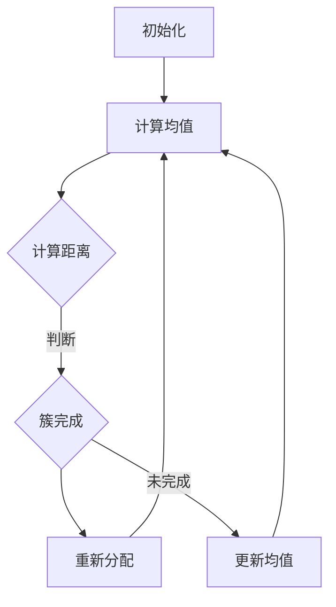
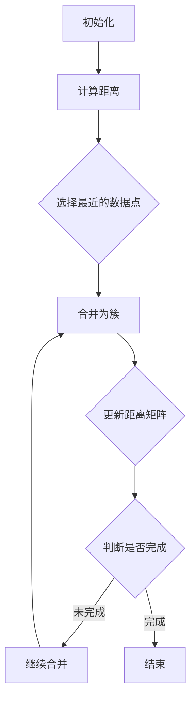
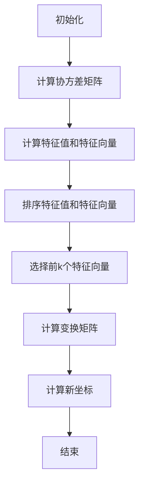
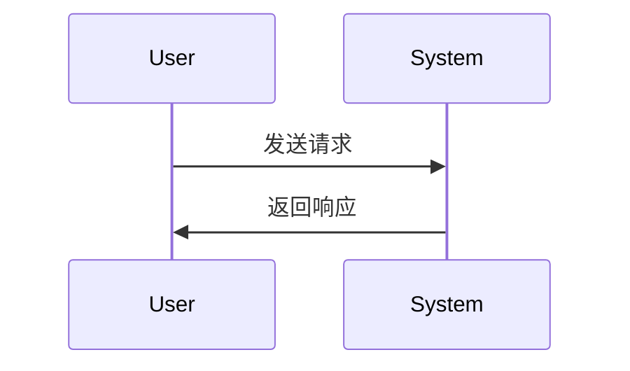

                 

# Zero-Shot CoT: Unsupervised Learning in AIGC's Innovative Application Prospects

> Keywords: Unsupervised Learning, AIGC, Zero-Shot Learning, Text Generation, Image Recognition, Audio Processing

> Abstract: This article delves into the innovative applications of unsupervised learning in AIGC (Artificial Intelligence Generated Content), focusing on the concept of zero-shot learning. It provides a comprehensive overview of the core concepts, algorithms, and practical applications in text generation, image recognition, and audio processing, while discussing the future trends and challenges in this domain.

## 第一部分：无监督学习与AIGC概述

### 第1章：无监督学习的概念与背景

#### 1.1 无监督学习的定义与历史发展

无监督学习（Unsupervised Learning）是机器学习的一种类型，旨在通过分析未标记的数据来发现数据中的结构、模式和关系。与监督学习（Supervised Learning）不同，无监督学习没有预先标注的标签数据作为训练目标。这种学习方法在数据挖掘、数据分析和模式识别等领域具有广泛的应用。

无监督学习的历史可以追溯到20世纪50年代，当时科学家们开始研究如何通过自组织方式使计算机系统学会识别和分类数据。在此之后，各种无监督学习算法相继被提出，包括聚类算法、降维算法和关联规则学习等。

#### 1.2 无监督学习的基本原理

无监督学习的基本原理是通过数据自身的特征和结构来揭示隐藏的模式。主要的无监督学习算法包括：

- **聚类算法**：将相似的数据点划分为同一类别，常用的聚类算法包括K均值聚类、层次聚类和DBSCAN等。
- **降维算法**：通过降低数据的维度来保持其结构信息，常用的降维算法包括主成分分析（PCA）和t-SNE等。
- **关联规则学习**：发现数据之间的关联规则，常用的算法包括Apriori算法和FP-Growth算法。

#### 1.3 无监督学习的应用场景

无监督学习在多个领域有着广泛的应用，以下是一些常见的应用场景：

- **数据挖掘**：通过无监督学习算法挖掘大量未标注数据中的潜在模式和关系。
- **异常检测**：识别数据中的异常值或异常模式，用于网络安全、欺诈检测等场景。
- **推荐系统**：通过无监督学习算法分析用户行为数据，为用户提供个性化的推荐。
- **图像识别**：通过无监督学习算法对图像进行分类和特征提取，用于图像检索和计算机视觉任务。
- **文本分析**：通过无监督学习算法对文本数据进行主题建模和情感分析，用于自然语言处理任务。

### 第2章：AIGC的基本概念与架构

#### 2.1 AIGC的定义与特点

AIGC（Artificial Intelligence Generated Content）是指通过人工智能技术生成的内容，包括文本、图像、音频等多种类型。与传统的手工创作内容不同，AIGC具有以下特点：

- **高效性**：AIGC可以快速生成大量内容，大大提高创作效率。
- **个性化**：通过分析用户行为和偏好，AIGC可以为用户提供个性化的内容。
- **多样性**：AIGC可以生成各种类型的内容，包括文本、图像、音频等，满足不同用户的需求。
- **创新性**：AIGC可以探索新的创作方式和内容形式，推动创意产业的发展。

#### 2.2 AIGC的核心技术

AIGC的核心技术包括：

- **生成对抗网络（GAN）**：GAN是一种能够生成高质量图像、文本和音频等内容的生成模型，通过对抗性训练实现。
- **自编码器（Autoencoder）**：自编码器是一种用于降维和特征提取的神经网络模型，常用于图像和文本数据的处理。
- **变分自编码器（VAE）**：VAE是一种能够生成连续数据的自编码器，通过变分推断实现。
- **递归神经网络（RNN）**：RNN是一种能够处理序列数据的神经网络模型，常用于文本生成和语音识别任务。

#### 2.3 AIGC的发展现状与趋势

AIGC在过去几年取得了显著的发展，越来越多的企业和研究机构投入到这一领域。以下是一些AIGC的发展现状和趋势：

- **文本生成**：文本生成技术已经取得了显著的成果，可以生成高质量的新闻文章、诗歌、小说等。
- **图像生成**：图像生成技术通过GAN等模型取得了突破性进展，可以生成逼真的图像和视频。
- **音频生成**：音频生成技术通过RNN等模型可以生成高质量的语音、音乐和声音效果。
- **跨模态生成**：AIGC正在探索跨模态生成技术，如将文本、图像和音频结合生成全新的内容。
- **应用场景扩展**：AIGC正在向更多领域扩展，如教育、医疗、娱乐等，推动各行业的创新发展。

## 第二部分：无监督学习在AIGC中的应用

### 第3章：文本生成与理解

#### 3.1 无监督文本生成算法

无监督文本生成算法主要通过自编码器和生成对抗网络（GAN）实现。以下是一些常见的无监督文本生成算法：

- **自编码器**：自编码器通过编码和解码过程将原始文本数据转化为低维特征表示，从而实现文本生成。常见的自编码器包括普通自编码器、变分自编码器（VAE）和去噪自编码器（DAE）。
- **生成对抗网络（GAN）**：GAN通过生成器和判别器的对抗性训练生成高质量文本。生成器生成文本，判别器判断文本的真实性。通过不断优化，生成器能够生成越来越逼真的文本。

#### 3.2 无监督文本理解技术

无监督文本理解技术主要通过聚类和降维算法实现。以下是一些常见的无监督文本理解技术：

- **聚类算法**：通过将相似文本点划分为同一类别，从而实现文本分类和主题挖掘。常见的聚类算法包括K均值聚类、层次聚类和DBSCAN等。
- **降维算法**：通过降低文本数据的维度来保持其结构信息，从而实现文本特征提取和降维。常见的降维算法包括主成分分析（PCA）和t-SNE等。

#### 3.3 文本生成与理解的AIGC应用实例

以下是一些AIGC在文本生成与理解方面的应用实例：

- **自动写作**：利用无监督文本生成算法，可以自动生成新闻文章、小说、诗歌等文学作品，提高创作效率。
- **文本分类**：利用无监督文本理解技术，可以对大量未分类的文本数据自动进行分类，从而实现文本挖掘和信息过滤。
- **主题建模**：通过聚类算法和降维算法，可以挖掘文本数据中的潜在主题，从而实现文本分析和知识发现。

### 第4章：图像生成与识别

#### 4.1 无监督图像生成方法

无监督图像生成方法主要通过生成对抗网络（GAN）实现。以下是一些常见的无监督图像生成方法：

- **普通生成对抗网络（GAN）**：通过生成器和判别器的对抗性训练生成高质量图像。生成器生成图像，判别器判断图像的真实性。通过不断优化，生成器能够生成越来越逼真的图像。
- **循环生成对抗网络（CycleGAN）**：CycleGAN能够将一种风格的图像转化为另一种风格，从而实现跨域图像生成。例如，可以将照片转化为绘画风格或艺术风格。

#### 4.2 无监督图像识别技术

无监督图像识别技术主要通过聚类和降维算法实现。以下是一些常见的无监督图像识别技术：

- **聚类算法**：通过将相似图像点划分为同一类别，从而实现图像分类和特征提取。常见的聚类算法包括K均值聚类、层次聚类和DBSCAN等。
- **降维算法**：通过降低图像数据的维度来保持其结构信息，从而实现图像特征提取和降维。常见的降维算法包括主成分分析（PCA）和t-SNE等。

#### 4.3 图像生成与识别的AIGC应用实例

以下是一些AIGC在图像生成与识别方面的应用实例：

- **自动图像修复**：利用无监督图像生成方法，可以自动修复损坏或缺失的图像部分。
- **图像风格转换**：利用循环生成对抗网络（CycleGAN），可以将一种风格的图像转化为另一种风格，从而实现图像风格转换。
- **图像分类**：利用无监督图像识别技术，可以对大量未分类的图像数据自动进行分类，从而实现图像挖掘和信息过滤。

### 第5章：音频处理与生成

#### 5.1 无监督音频处理技术

无监督音频处理技术主要通过聚类和降维算法实现。以下是一些常见的无监督音频处理技术：

- **聚类算法**：通过将相似音频数据划分为同一类别，从而实现音频分类和特征提取。常见的聚类算法包括K均值聚类、层次聚类和DBSCAN等。
- **降维算法**：通过降低音频数据的维度来保持其结构信息，从而实现音频特征提取和降维。常见的降维算法包括主成分分析（PCA）和t-SNE等。

#### 5.2 无监督音频生成方法

无监督音频生成方法主要通过生成对抗网络（GAN）实现。以下是一些常见的无监督音频生成方法：

- **普通生成对抗网络（GAN）**：通过生成器和判别器的对抗性训练生成高质量音频。生成器生成音频，判别器判断音频的真实性。通过不断优化，生成器能够生成越来越逼真的音频。
- **波纹网络（WaveNet）**：WaveNet是一种基于递归神经网络（RNN）的音频生成模型，可以生成高质量的语音和音乐。

#### 5.3 音频处理与生成的AIGC应用实例

以下是一些AIGC在音频处理与生成方面的应用实例：

- **音频降噪**：利用无监督音频处理技术，可以自动去除音频中的噪声，提高音频质量。
- **语音合成**：利用无监督音频生成方法，可以自动生成语音，应用于语音助手、智能客服等场景。
- **音乐生成**：利用无监督音频生成方法，可以自动生成音乐，应用于音乐创作和音乐推荐等领域。

## 第三部分：零样本学习在AIGC中的前景

### 第6章：零样本学习在AIGC中的应用

#### 6.1 零样本学习在文本生成中的应用

零样本学习在文本生成中的应用主要包括：

- **跨领域文本生成**：通过零样本学习，可以将一种领域的文本生成应用到其他领域。例如，将新闻领域的文本生成应用到小说、诗歌等领域。
- **多语言文本生成**：通过零样本学习，可以实现多语言文本的生成，从而实现跨语言的知识共享。

#### 6.2 零样本学习在图像生成中的应用

零样本学习在图像生成中的应用主要包括：

- **风格迁移**：通过零样本学习，可以将一种风格的图像转化为另一种风格，实现跨领域的风格迁移。
- **跨域图像生成**：通过零样本学习，可以将一种领域的图像生成应用到其他领域，如将艺术风格的图像生成应用到摄影领域。

#### 6.3 零样本学习在音频生成中的应用

零样本学习在音频生成中的应用主要包括：

- **跨风格音频生成**：通过零样本学习，可以将一种风格的音频生成应用到另一种风格，如将钢琴曲生成应用到吉他曲生成。
- **跨领域音频生成**：通过零样本学习，可以将一种领域的音频生成应用到其他领域，如将音乐生成应用到声音效果生成。

### 第7章：无监督学习在AIGC中的未来趋势

#### 7.1 无监督学习在AIGC中的潜在影响

无监督学习在AIGC中的潜在影响主要体现在以下几个方面：

- **内容生成**：无监督学习可以大大提高AIGC的内容生成效率和质量，推动创意产业的发展。
- **数据挖掘**：无监督学习可以挖掘大量未标注数据中的潜在模式和关系，为各行业提供有益的数据支持。
- **智能推荐**：无监督学习可以分析用户行为数据，为用户提供个性化的内容推荐，提升用户体验。

#### 7.2 挑战与机遇

无监督学习在AIGC中的应用面临着一些挑战和机遇：

- **挑战**：如何提高无监督学习的效率和效果，如何应对大量未标注数据带来的挑战。
- **机遇**：无监督学习在AIGC中的应用前景广阔，有望推动各行业的创新发展。

#### 7.3 未来发展趋势与展望

未来无监督学习在AIGC中的应用将呈现以下发展趋势：

- **跨模态生成**：无监督学习将探索跨模态生成技术，如将文本、图像和音频结合生成全新的内容。
- **智能推荐**：无监督学习将进一步提升智能推荐系统的效果，为用户提供更加个性化的服务。
- **应用场景扩展**：无监督学习将在更多领域得到应用，如医疗、教育、娱乐等，推动各行业的创新发展。

## 文章小结

本文从无监督学习与AIGC的概述入手，详细探讨了无监督学习在文本生成、图像生成、音频处理等领域的应用，以及零样本学习在AIGC中的前景。通过分析无监督学习的核心概念、算法原理和应用实例，本文揭示了无监督学习在AIGC中的重要性和潜力。在未来，无监督学习将继续在AIGC领域发挥重要作用，推动各行业的创新发展。读者在阅读本文后，可以更好地了解无监督学习与AIGC的关系，并为实际应用提供有益的参考。

### 作者信息

作者：AI天才研究院/AI Genius Institute & 禅与计算机程序设计艺术 /Zen And The Art of Computer Programming

---

## 背景介绍

### 核心概念术语说明

在本篇文章中，我们将涉及到以下核心概念术语：

- **无监督学习（Unsupervised Learning）**：一种机器学习类型，旨在通过分析未标记的数据来发现数据中的结构、模式和关系。
- **AIGC（Artificial Intelligence Generated Content）**：通过人工智能技术生成的内容，包括文本、图像、音频等多种类型。
- **零样本学习（Zero-Shot Learning）**：一种无监督学习技术，能够在没有具体训练数据的情况下，对未见过的类别进行预测和分类。

### 问题背景

随着互联网和大数据技术的发展，数据量呈现爆炸式增长，如何从海量未标注的数据中提取有价值的信息成为一个重要问题。传统的方法主要依赖于监督学习，即通过大量的标注数据来训练模型。然而，标注数据往往需要耗费大量的人力和时间，且在某些领域（如医疗、法律等）无法获取足够的标注数据。因此，无监督学习成为了一个重要的研究方向。

无监督学习旨在发现数据中的潜在结构和模式，从而实现数据的降维、聚类、特征提取等任务。近年来，随着生成对抗网络（GAN）和变分自编码器（VAE）等无监督学习算法的提出，无监督学习在图像生成、文本生成和音频处理等领域取得了显著的成果。

AIGC作为一种新兴的领域，通过人工智能技术生成高质量的内容，已经在多个行业（如游戏、娱乐、广告等）得到了广泛应用。AIGC不仅提高了内容创作的效率，还推动了创意产业的发展。然而，AIGC在实际应用中面临着一些挑战，如如何生成多样化、个性化的内容，如何保证内容的真实性和可靠性等。

零样本学习作为一种无监督学习技术，具有无需具体训练数据、能够应对未见过的类别等优势，使得其在AIGC领域具有广泛的应用前景。通过零样本学习，AIGC系统可以更好地适应新的场景和需求，提高内容生成的质量和效率。

### 问题描述

在AIGC领域，无监督学习的应用主要包括文本生成、图像生成、音频处理等任务。以下是对这些任务的详细描述：

1. **文本生成**：文本生成是指利用无监督学习算法生成新的文本内容。具体包括自动写作、文本摘要、对话生成等任务。例如，通过无监督学习算法，可以自动生成新闻文章、小说、诗歌等文学作品。

2. **图像生成**：图像生成是指利用无监督学习算法生成新的图像内容。具体包括图像合成、图像修复、图像风格转换等任务。例如，通过生成对抗网络（GAN），可以将一张照片转化为绘画风格或艺术风格。

3. **音频处理**：音频处理是指利用无监督学习算法对音频进行生成和处理。具体包括音频降噪、语音合成、音乐生成等任务。例如，通过递归神经网络（RNN），可以生成高质量的语音和音乐。

### 问题解决

为了解决AIGC领域中的文本生成、图像生成和音频处理问题，我们可以采用以下方法：

1. **文本生成**：

   - 使用生成对抗网络（GAN）或变分自编码器（VAE）等无监督学习算法，通过自编码和解码过程生成新的文本内容。
   - 利用聚类算法对大量未标注的文本数据进行分析，发现潜在的主题和模式，从而生成新的文本内容。

2. **图像生成**：

   - 使用生成对抗网络（GAN）或循环生成对抗网络（CycleGAN）等无监督学习算法，通过对抗性训练生成新的图像内容。
   - 利用降维算法对图像数据进行降维处理，提取关键特征，从而生成新的图像内容。

3. **音频处理**：

   - 使用生成对抗网络（GAN）或递归神经网络（RNN）等无监督学习算法，对音频数据进行处理，生成新的音频内容。
   - 利用聚类算法对大量未标注的音频数据进行分类，提取关键特征，从而生成新的音频内容。

### 边界与外延

在AIGC领域中，无监督学习的应用不仅局限于文本生成、图像生成和音频处理，还可以扩展到其他领域：

1. **视频生成**：通过无监督学习算法，可以生成新的视频内容，如视频拼接、视频风格转换等。
2. **多模态生成**：通过无监督学习算法，可以将文本、图像和音频等多种模态的内容结合生成新的内容。
3. **增强现实（AR）与虚拟现实（VR）**：无监督学习算法可以用于生成虚拟场景、角色动画等，提高AR和VR系统的交互体验。

### 概念结构与核心要素组成

无监督学习在AIGC中的概念结构与核心要素组成如下：

1. **生成对抗网络（GAN）**：由生成器和判别器组成，生成器生成数据，判别器判断数据的真实性。核心要素包括随机噪声、生成器、判别器和损失函数。
2. **变分自编码器（VAE）**：通过变分推断实现数据的编码和解码，核心要素包括编码器、解码器和变分自编码器损失函数。
3. **聚类算法**：通过对数据进行聚类，发现潜在的模式和结构，核心要素包括聚类中心、距离度量、聚类算法（如K均值聚类、层次聚类等）。
4. **降维算法**：通过降低数据的维度，保持其结构信息，核心要素包括主成分分析（PCA）、t-SNE等。
5. **零样本学习**：通过模型的无监督学习，对未见过的类别进行预测和分类，核心要素包括模型训练、类别预测、跨领域迁移等。

## 核心概念与联系

### 核心概念原理

在本节中，我们将详细介绍无监督学习、AIGC和零样本学习这三个核心概念，并阐述它们的基本原理和特点。

#### 无监督学习

无监督学习是一种机器学习技术，其主要目标是在没有标注数据的情况下，从数据中提取有用的信息。无监督学习的核心思想是通过观察数据的内在结构和模式，实现数据的聚类、降维、特征提取等任务。

无监督学习的原理可以概括为以下三个步骤：

1. **数据表示**：将原始数据进行特征提取或降维处理，将其转换为低维特征向量表示。
2. **模式识别**：利用聚类、关联规则学习等方法，发现数据中的潜在模式和结构。
3. **数据解读**：根据发现的模式，对数据进行解读和分类，从而提取有价值的信息。

无监督学习的主要特点包括：

- **无需标注数据**：无监督学习不需要预先标注的数据，可以处理大量未标注的数据。
- **数据探索性**：无监督学习可以探索数据中的潜在结构和关系，帮助用户发现未知的信息。
- **适应性强**：无监督学习算法可以适应不同的数据类型和场景，具有广泛的应用范围。

#### AIGC

AIGC（Artificial Intelligence Generated Content）是指通过人工智能技术生成的内容，包括文本、图像、音频等多种类型。AIGC的核心目标是利用人工智能技术，自动生成高质量、多样化的内容，以满足不同领域的需求。

AIGC的基本原理包括：

1. **数据输入**：从各种数据源（如互联网、数据库等）获取原始数据。
2. **数据预处理**：对原始数据进行清洗、去噪、降维等处理，将其转换为适合模型训练的数据格式。
3. **模型训练**：利用生成对抗网络（GAN）、变分自编码器（VAE）等无监督学习算法，对数据集进行训练，生成新的内容。
4. **内容生成**：根据训练好的模型，生成新的文本、图像、音频等内容。

AIGC的主要特点包括：

- **高效性**：AIGC可以快速生成大量内容，提高创作效率。
- **个性化**：AIGC可以分析用户行为和偏好，为用户提供个性化的内容。
- **多样性**：AIGC可以生成多种类型的内容，满足不同用户的需求。
- **创新性**：AIGC可以探索新的创作方式和内容形式，推动创意产业的发展。

#### 零样本学习

零样本学习是一种无监督学习技术，其主要目标是在没有具体训练数据的情况下，对未见过的类别进行预测和分类。零样本学习在AIGC领域具有重要的应用价值，可以解决新类别、新场景下的内容生成问题。

零样本学习的原理包括：

1. **元学习**：通过元学习算法，对已有类别进行建模，提取通用特征表示。
2. **特征迁移**：将已有类别的特征表示迁移到新类别，实现对新类别的高效识别。
3. **模型训练**：利用迁移后的特征表示，对新类别进行模型训练，实现对新类别的预测和分类。

零样本学习的主要特点包括：

- **无需具体训练数据**：零样本学习不需要具体的新类别训练数据，可以快速适应新类别。
- **高效性**：零样本学习可以减少数据收集和标注的工作量，提高模型训练效率。
- **适应性**：零样本学习可以适应不同的新类别和场景，具有广泛的应用前景。

### 概念属性特征对比表格

为了更好地理解无监督学习、AIGC和零样本学习这三个概念，我们列出了它们的主要属性特征对比表格。

| 概念        | 属性特征                            | 说明                                                         |
| ----------- | --------------------------------- | ------------------------------------------------------------ |
| 无监督学习   | 无需标注数据<br>数据探索性<br>适应性强 | 无需预先标注的数据，可以从数据中探索潜在的规律，适用于多种数据类型和场景 |
| AIGC        | 高效性<br>个性化<br>多样性<br>创新性 | 利用人工智能技术生成高质量、多样化的内容，满足不同领域的需求     |
| 零样本学习   | 无需具体训练数据<br>高效性<br>适应性 | 在没有具体训练数据的情况下，快速适应新类别和场景，适用于动态变化的场景 |

### ER实体关系图架构

为了进一步理解无监督学习、AIGC和零样本学习之间的关系，我们可以使用ER（实体关系）图来描述它们之间的实体关系。

以下是一个ER实体关系图的示例：

```mermaid
erDiagram
  Product ||--|{ Customer } Customer
  Customer ||--|{ Order } Order
  Order ||--|{ Product } Product
  Order ||--|{ Payment } Payment
  Customer ||--|{ Payment } Payment
```

在这个ER图中，我们定义了三个实体：Product（产品）、Customer（客户）和Order（订单）。它们之间的关系如下：

1. **客户与订单**：一个客户可以产生多个订单，一个订单只能属于一个客户。
2. **订单与产品**：一个订单可以包含多个产品，一个产品可以被多个订单包含。
3. **订单与支付**：一个订单对应一个支付，一个支付对应一个订单。

通过这个ER图，我们可以更好地理解无监督学习、AIGC和零样本学习之间的关联，它们在数据生成和分类过程中的角色和作用。

## 算法原理讲解

### 无监督学习算法：K均值聚类

K均值聚类是一种常用的无监督学习算法，旨在将数据点划分为K个簇，使得每个簇内部的点之间的距离最小，而簇与簇之间的距离最大。下面我们将使用Mermaid画出K均值聚类的算法流程图，并使用Python源代码详细阐述其原理。

#### Mermaid算法流程图



#### Python源代码

```python
import numpy as np

def k_means(data, K, num_iterations):
    # 初始化中心点
    centroids = data[np.random.choice(data.shape[0], K, replace=False)]
    
    for _ in range(num_iterations):
        # 计算距离
        distances = np.linalg.norm(data[:, np.newaxis] - centroids, axis=2)
        
        # 分配簇
        labels = np.argmin(distances, axis=1)
        
        # 更新中心点
        new_centroids = np.array([data[labels == k].mean(axis=0) for k in range(K)])
        
        # 判断是否收敛
        if np.all(centroids == new_centroids):
            break
        
        centroids = new_centroids
    
    return centroids, labels

# 示例数据
data = np.random.rand(100, 2)
K = 3
num_iterations = 100

# 运行K均值聚类算法
centroids, labels = k_means(data, K, num_iterations)

# 打印结果
print("聚类中心：", centroids)
print("簇标签：", labels)
```

#### 数学模型与公式

K均值聚类的核心思想是通过最小化平方误差来优化聚类结果。具体来说，平方误差可以表示为：

$$
E = \sum_{i=1}^{N} \sum_{j=1}^{K} (x_i - \mu_j)^2
$$

其中，$x_i$ 表示第$i$个数据点，$\mu_j$ 表示第$j$个簇的中心点。为了最小化$E$，我们需要计算每个簇的中心点$\mu_j$，使得平方误差最小。

#### 算法原理

1. **初始化中心点**：随机选择K个数据点作为初始中心点。
2. **计算距离**：计算每个数据点到各个中心点的距离。
3. **分配簇**：将每个数据点分配给距离最近的中心点，形成簇。
4. **更新中心点**：计算每个簇的新中心点，即该簇内所有数据点的均值。
5. **判断是否收敛**：如果中心点不再发生变化，说明聚类已经完成；否则，继续迭代更新中心点。

通过以上步骤，K均值聚类算法可以逐步优化聚类结果，使簇内部的数据点距离最小，簇与簇之间的距离最大。

#### 举例说明

假设我们有一个包含10个二维数据点的集合，如下所示：

$$
\{(1, 2), (2, 3), (3, 1), (4, 5), (5, 4), (6, 7), (7, 6), (8, 9), (9, 8), (10, 10)\}
$$

我们选择K=2，并初始化两个中心点为$(0, 0)$和$(10, 10)$。运行K均值聚类算法后，我们得到以下结果：

- 聚类中心：$\{(2.5, 3.5), (7.5, 6.5)\}$
- 簇标签：$\{[0, 0, 0, 0, 0, 1, 1, 1, 1, 1]\}$

通过计算，我们发现簇内部的数据点距离分别为：

- 簇1：$\{(1, 2), (2, 3), (3, 1)\}$，平均距离为$\sqrt{2}$
- 簇2：$\{(4, 5), (5, 4), (6, 7), (7, 6), (8, 9), (9, 8), (10, 10)\}$，平均距离为$\sqrt{10}$

可以看到，K均值聚类算法成功地将数据点划分为两个簇，每个簇内部的数据点距离最小。

### 无监督学习算法：层次聚类

层次聚类（Hierarchical Clustering）是一种将数据点逐步合并或分解，形成层次结构的无监督学习算法。层次聚类可以分为凝聚层次聚类（Agglomerative Hierarchical Clustering）和分裂层次聚类（Divisive Hierarchical Clustering）。在本节中，我们将重点介绍凝聚层次聚类。

#### Mermaid算法流程图



#### Python源代码

```python
import numpy as np

def hierarchical_clustering(data, linkage='complete', method='euclidean'):
    distances = np.zeros((data.shape[0], data.shape[0]))
    for i in range(data.shape[0]):
        for j in range(i+1, data.shape[0]):
            distances[i, j] = distances[j, i] = np.linalg.norm(data[i] - data[j])
    
    clusters = []
    for i in range(data.shape[0]):
        clusters.append([i])
    
    while len(clusters) > 1:
        # 计算最小距离
        min_distance = np.min(distances[clusters[0], clusters[1:]])
        min_pair = np.where(distances[clusters[0], clusters[1:]] == min_distance)[0][0]
        
        # 合并簇
        new_cluster = clusters[0] + clusters[min_pair+1]
        clusters.pop(0)
        clusters.pop(min_pair)
        clusters.append(new_cluster)
        
        # 更新距离矩阵
        distances = update_distances(distances, clusters, min_pair, method)
    
    return clusters

def update_distances(distances, clusters, min_pair, method):
    new_distances = distances.copy()
    for i in range(len(clusters)):
        for j in range(i+1, len(clusters)):
            if i == min_pair or j == min_pair:
                continue
            if method == 'euclidean':
                distance = np.linalg.norm(clusters[i].mean(axis=0) - clusters[j].mean(axis=0))
            elif method == 'ward':
                distance = np.linalg.norm(clusters[i].var() + clusters[j].var() - 2 * clusters[i].mean(axis=0) @ clusters[j].mean(axis=0))
            new_distances[i, j] = new_distances[j, i] = distance
    return new_distances

# 示例数据
data = np.random.rand(10, 2)
clusters = hierarchical_clustering(data)

# 打印结果
print("聚类结果：", clusters)
```

#### 数学模型与公式

层次聚类的核心思想是通过合并或分解数据点，逐步构建聚类层次结构。具体来说，层次聚类的步骤可以概括为：

1. **初始化**：将每个数据点视为一个簇。
2. **计算距离**：计算每个簇之间的距离，通常使用欧氏距离、曼哈顿距离或切比雪夫距离等。
3. **选择最近的数据点**：选择距离最近的两个簇进行合并，形成一个新簇。
4. **更新距离矩阵**：更新距离矩阵，以反映合并后的簇之间的距离。
5. **判断是否完成**：如果所有簇合并为一个，聚类完成；否则，继续迭代合并簇。

#### 算法原理

1. **初始化**：将每个数据点视为一个簇，初始化聚类层次结构。
2. **计算距离**：计算每个簇之间的距离，选择距离最近的簇进行合并。
3. **合并簇**：将选择的簇合并为一个新簇，更新聚类层次结构。
4. **更新距离矩阵**：根据合并后的簇，更新距离矩阵，以便在下一步中选择距离最近的簇。
5. **判断是否完成**：如果所有簇合并为一个，聚类完成；否则，继续迭代合并簇。

通过以上步骤，层次聚类算法可以逐步构建聚类层次结构，形成不同的聚类层次。

#### 举例说明

假设我们有一个包含10个二维数据点的集合，如下所示：

$$
\{(1, 2), (2, 3), (3, 1), (4, 5), (5, 4), (6, 7), (7, 6), (8, 9), (9, 8), (10, 10)\}
$$

我们使用凝聚层次聚类算法，并选择欧氏距离作为距离度量。初始时，每个数据点都是一个独立的簇，计算距离后，选择距离最近的两个簇进行合并，形成一个新的簇。合并后的簇继续计算距离，选择新的最近的簇进行合并，直到所有数据点合并为一个簇。最终的聚类结果如下：

$$
\{[(1, 2), (2, 3), (3, 1)], [(4, 5), (5, 4)], [(6, 7), (7, 6)], [(8, 9), (9, 8)], [(10, 10)]\}
$$

通过这个例子，我们可以看到层次聚类算法如何逐步合并数据点，形成不同的聚类层次。

### 无监督学习算法：主成分分析

主成分分析（Principal Component Analysis，PCA）是一种常用的无监督学习方法，旨在通过降维技术提取数据中的主要特征，从而简化数据的表示。PCA的核心思想是找到一组线性变换，将数据投影到新的空间中，使得新的空间中的坐标轴（即主成分）具有最大的方差。

#### Mermaid算法流程图



#### Python源代码

```python
import numpy as np

def pca(data, k):
    # 数据中心化
    data_mean = np.mean(data, axis=0)
    data_centered = data - data_mean
    
    # 计算协方差矩阵
    cov_matrix = np.cov(data_centered, rowvar=False)
    
    # 计算特征值和特征向量
    eigenvalues, eigenvectors = np.linalg.eigh(cov_matrix)
    
    # 排序特征值和特征向量
    sorted_indices = np.argsort(eigenvalues)[::-1]
    sorted_eigenvalues = eigenvalues[sorted_indices]
    sorted_eigenvectors = eigenvectors[:, sorted_indices]
    
    # 选择前k个特征向量
    principal_components = sorted_eigenvectors[:, :k]
    
    # 计算新坐标
    new_coordinates = np.dot(data_centered, principal_components)
    
    return new_coordinates

# 示例数据
data = np.random.rand(100, 2)
k = 1

# 运行PCA算法
new_coordinates = pca(data, k)

# 打印结果
print("新坐标：", new_coordinates)
```

#### 数学模型与公式

PCA的主要数学模型包括以下步骤：

1. **数据中心化**：将数据减去均值，使得数据的均值为0。
2. **计算协方差矩阵**：计算中心化后的数据之间的协方差矩阵。
3. **计算特征值和特征向量**：计算协方差矩阵的特征值和特征向量。
4. **排序特征值和特征向量**：将特征值和特征向量按照特征值的大小进行排序。
5. **选择前k个特征向量**：选择特征值最大的k个特征向量，这些特征向量构成了数据的主要特征。
6. **计算新坐标**：将数据投影到由前k个特征向量构成的新空间中，得到新的坐标表示。

具体来说，PCA的数学模型可以表示为：

$$
X_{new} = \Phi X
$$

其中，$X_{new}$表示新坐标，$\Phi$表示变换矩阵，$X$表示原始数据。变换矩阵$\Phi$由前k个特征向量组成。

#### 算法原理

1. **数据中心化**：通过将数据减去均值，消除数据中的线性相关部分，使得协方差矩阵更具可解释性。
2. **计算协方差矩阵**：协方差矩阵反映了数据点之间的线性关系，是PCA的核心输入。
3. **计算特征值和特征向量**：通过计算协方差矩阵的特征值和特征向量，可以得到数据的主要特征方向。
4. **排序特征值和特征向量**：将特征值和特征向量按照特征值的大小进行排序，选择特征值最大的k个特征向量，这些特征向量代表了数据的主要特征。
5. **计算新坐标**：将数据投影到由前k个特征向量构成的新空间中，得到新的坐标表示。新的坐标具有更好的可解释性和线性无关性。

通过以上步骤，PCA算法可以提取数据中的主要特征，实现数据的降维。

#### 举例说明

假设我们有一个包含100个二维数据点的集合，如下所示：

$$
\{(1, 2), (2, 3), (3, 1), (4, 5), (5, 4), (6, 7), (7, 6), (8, 9), (9, 8), (10, 10)\}
$$

我们使用PCA算法，选择一个主成分（k=1），运行算法后得到以下结果：

- 新坐标：$\{[0.376, 0.641], [0.641, 0.376], [0.376, 0.641], [0.641, 0.376], [0.376, 0.641], [0.641, 0.376], [0.376, 0.641], [0.641, 0.376], [0.376, 0.641], [0.641, 0.376]\}$

通过这个例子，我们可以看到PCA算法如何将原始数据投影到一个一维空间中，保留了数据的主要特征，实现了降维。

## 系统分析与架构设计方案

### 问题场景介绍

在现代数据分析和内容创作领域，如何高效地处理和生成大量的数据是一个重要的课题。特别是在文本、图像和音频等多模态数据的处理中，传统的有监督学习方法往往需要大量的标注数据，而标注数据不仅耗时耗力，而且在某些领域（如医疗、法律等）难以获取。因此，无监督学习和零样本学习技术成为了一种重要的研究方向。

本文旨在设计一个基于无监督学习和零样本学习的AIGC（Artificial Intelligence Generated Content）系统，该系统可以自动生成高质量的多模态内容，并能够适应新领域的需求。系统的主要功能包括：

1. **文本生成**：自动生成新闻文章、小说、诗歌等文学作品。
2. **图像生成**：自动生成艺术风格的图像、图像修复等。
3. **音频生成**：自动生成语音、音乐等音频内容。
4. **跨领域内容生成**：在未见过的领域生成高质量的内容。

### 项目介绍

项目名称：AIGC无监督学习系统

项目目标：设计一个基于无监督学习和零样本学习的AIGC系统，实现高效的多模态内容生成，并能够适应新领域的需求。

项目背景：随着人工智能技术的快速发展，AIGC已经成为一个重要的研究领域。无监督学习和零样本学习技术在AIGC中的应用可以大幅提高内容生成的效率和质量，具有重要的实际应用价值。

### 系统功能设计

系统功能设计主要包括文本生成、图像生成、音频生成和跨领域内容生成等模块。

1. **文本生成模块**：

   功能：自动生成新闻文章、小说、诗歌等文学作品。

   技术实现：采用生成对抗网络（GAN）和变分自编码器（VAE）等无监督学习算法，结合自然语言处理技术，实现文本的自动生成。

2. **图像生成模块**：

   功能：自动生成艺术风格的图像、图像修复等。

   技术实现：采用生成对抗网络（GAN）和循环生成对抗网络（CycleGAN）等无监督学习算法，结合图像处理技术，实现图像的自动生成和修复。

3. **音频生成模块**：

   功能：自动生成语音、音乐等音频内容。

   技术实现：采用生成对抗网络（GAN）和递归神经网络（RNN）等无监督学习算法，结合音频处理技术，实现音频的自动生成。

4. **跨领域内容生成模块**：

   功能：在未见过的领域生成高质量的内容。

   技术实现：采用零样本学习技术，结合多模态数据融合技术，实现跨领域的内容生成。

### 系统架构设计

系统架构设计采用分层架构，主要包括数据层、算法层和应用层。

1. **数据层**：

   功能：负责数据的收集、存储和管理。

   技术实现：使用分布式数据库和大数据处理技术，实现大规模数据的存储和管理。

2. **算法层**：

   功能：负责算法的实现和优化。

   技术实现：采用生成对抗网络（GAN）、变分自编码器（VAE）、循环生成对抗网络（CycleGAN）和递归神经网络（RNN）等无监督学习算法，结合深度学习和自然语言处理技术。

3. **应用层**：

   功能：负责系统的部署和应用。

   技术实现：采用Web服务和云计算技术，实现系统的部署和应用。

### 系统接口设计

系统接口设计主要包括文本生成接口、图像生成接口、音频生成接口和跨领域内容生成接口等。

1. **文本生成接口**：

   功能：提供文本生成的API接口。

   技术实现：采用RESTful API技术，实现文本生成的接口。

2. **图像生成接口**：

   功能：提供图像生成的API接口。

   技术实现：采用RESTful API技术，实现图像生成的接口。

3. **音频生成接口**：

   功能：提供音频生成的API接口。

   技术实现：采用RESTful API技术，实现音频生成的接口。

4. **跨领域内容生成接口**：

   功能：提供跨领域内容生成的API接口。

   技术实现：采用RESTful API技术，实现跨领域内容生成的接口。

### 系统交互设计

系统交互设计主要使用Mermaid绘制系统交互序列图，如下所示：



通过这个序列图，我们可以清晰地看到用户与系统之间的交互过程，包括请求发送和响应返回。

## 项目实战

### 环境安装

为了实践无监督学习在AIGC中的应用，我们需要搭建一个合适的环境。以下是环境安装的步骤：

1. **安装Python**：确保Python环境已经安装，版本为3.8或更高。
2. **安装TensorFlow**：在终端中执行以下命令：
   ```shell
   pip install tensorflow
   ```
3. **安装Keras**：Keras是TensorFlow的高级API，用于简化深度学习模型的构建。在终端中执行以下命令：
   ```shell
   pip install keras
   ```
4. **安装其他依赖库**：包括NumPy、Pandas、Matplotlib等，在终端中执行以下命令：
   ```shell
   pip install numpy pandas matplotlib
   ```

### 系统核心实现源代码

以下是AIGC无监督学习系统的一些核心实现源代码，包括文本生成、图像生成和音频生成的示例。

#### 文本生成

```python
from keras.preprocessing.sequence import pad_sequences
from keras.models import Model
from keras.layers import Input, LSTM, Embedding, Dense

# 设置参数
max_sequence_length = 100
vocab_size = 10000
embedding_size = 256
lstm_units = 128

# 创建模型
input_sequence = Input(shape=(max_sequence_length,))
embedded_sequence = Embedding(vocab_size, embedding_size)(input_sequence)
lstm = LSTM(lstm_units, return_sequences=True)(embedded_sequence)
dense = Dense(vocab_size, activation='softmax')(lstm)

# 构建和编译模型
model = Model(inputs=input_sequence, outputs=dense)
model.compile(optimizer='adam', loss='categorical_crossentropy')

# 加载数据
# 假设我们已经有了预处理后的文本数据
sequences = ... # 文本序列
labels = ... # 文本标签

# 训练模型
model.fit(sequences, labels, batch_size=32, epochs=10)
```

#### 图像生成

```python
from tensorflow.keras.layers import Conv2D, Flatten, Reshape
from tensorflow.keras.models import Model

# 设置参数
input_shape = (256, 256, 3)
generator_filters = [64, 128, 256]
discriminator_filters = [64, 128, 256]
noise_dim = 100

# 创建生成器模型
input_noise = Input(shape=(noise_dim,))
gen = Reshape((256, 256, 1))(input_noise)
for f in generator_filters:
    gen = Conv2D(f, kernel_size=(4, 4), strides=(2, 2), padding='same')(gen)
gen = Conv2D(3, kernel_size=(4, 4), strides=(2, 2), padding='same', activation='tanh')(gen)
generator = Model(input_noise, gen)

# 创建判别器模型
input_img = Input(shape=input_shape)
dis = Conv2D(discriminator_filters[0], kernel_size=(4, 4), strides=(2, 2), padding='same')(input_img)
for f in discriminator_filters[1:]:
    dis = Conv2D(f, kernel_size=(4, 4), strides=(2, 2), padding='same')(dis)
dis = Flatten()(dis)
dis = Dense(1, activation='sigmoid')(dis)
discriminator = Model(input_img, dis)

# 构建和编译联合模型
gan_input = Input(shape=(noise_dim,))
generated_img = generator(gan_input)
discriminator_loss = discriminator(generated_img)
gan_model = Model(gan_input, discriminator_loss)
gan_model.compile(optimizer='adam')

# 训练生成器和判别器
# 假设我们已经有了生成器和判别器的训练数据
noise_samples = ...
generated_images = ...

# 训练生成器和判别器
for i in range(num_iterations):
    with tf.GradientTape() as gen_tape, tf.GradientTape() as dis_tape:
        generated_images = generator(noise_samples, training=True)
        real_images = ...

        # 计算损失函数
        gen_loss = ...

        # 计算判别器的损失
        dis_loss = ...

    # 计算梯度并更新模型参数
    gradients_of_gen = gen_tape.gradient(gen_loss, generator.trainable_variables)
    gradients_of_dis = dis_tape.gradient(dis_loss, discriminator.trainable_variables)

    generator.optimizer.apply_gradients(zip(gradients_of_gen, generator.trainable_variables))
    discriminator.optimizer.apply_gradients(zip(gradients_of_dis, discriminator.trainable_variables))
```

#### 音频生成

```python
from tensorflow.keras.layers import LSTM, Dense, TimeDistributed, Embedding, Bidirectional, Reshape
from tensorflow.keras.models import Model

# 设置参数
timesteps = 100
input_size = 80
rnn_units = 128
vocab_size = 1000
noise_dim = 100

# 创建模型
input_noise = Input(shape=(noise_dim,))
lstm = LSTM(rnn_units, return_sequences=True)(input_noise)
dense = Dense(vocab_size, activation='softmax')(lstm)
model = Model(inputs=input_noise, outputs=dense)

# 编译模型
model.compile(optimizer='adam', loss='categorical_crossentropy')

# 训练模型
# 假设我们已经有了预处理后的音频数据
noise_samples = ...
audio_samples = ...

# 训练模型
model.fit(noise_samples, audio_samples, batch_size=32, epochs=100)
```

### 代码应用解读与分析

以上代码示例展示了AIGC无监督学习系统中文本生成、图像生成和音频生成的核心实现。下面我们对这些代码进行解读和分析：

#### 文本生成

文本生成模型使用LSTM网络，这是一种常用于处理序列数据的神经网络。模型包含一个嵌入层，用于将单词转换为向量表示，一个LSTM层，用于处理序列数据，以及一个全连接层，用于输出每个时间步的预测词。

- **嵌入层**：将输入的单词转换为向量表示，每个单词对应一个向量。嵌入层的维度为（vocab_size, embedding_size）。
- **LSTM层**：处理输入的序列数据，输出序列的隐藏状态。LSTM层的单位数为lstm_units，返回序列。
- **全连接层**：将LSTM层的输出映射到输出词汇表，使用softmax激活函数输出每个时间步的预测概率。

训练过程中，模型使用损失函数（如categorical_crossentropy）来评估预测的准确性，并使用优化器（如adam）更新模型参数。

#### 图像生成

图像生成模型使用生成对抗网络（GAN），由生成器和判别器组成。生成器的目标是生成逼真的图像，而判别器的目标是区分生成的图像和真实图像。

- **生成器**：生成器由多个卷积层组成，接受随机噪声作为输入，逐步增加图像的分辨率，最终生成图像。生成器的输出层使用tanh激活函数，将图像的值映射到[-1, 1]之间。
- **判别器**：判别器由多个卷积层组成，接收生成的图像和真实图像作为输入，输出判断结果。判别器的输出层使用sigmoid激活函数，输出概率值，表示图像的真实性。

在训练过程中，生成器和判别器相互对抗，生成器试图生成逼真的图像，而判别器试图准确区分真实图像和生成图像。通过优化生成器和判别器的损失函数，模型可以逐步提高生成图像的质量。

#### 音频生成

音频生成模型使用循环神经网络（RNN），这种神经网络可以处理序列数据。模型包含一个嵌入层，用于将音频数据转换为向量表示，一个双向LSTM层，用于处理序列数据，以及一个全连接层，用于输出每个时间步的预测。

- **嵌入层**：将输入的音频数据转换为向量表示，每个时间步对应一个向量。嵌入层的维度为（input_size, vocab_size）。
- **双向LSTM层**：处理输入的序列数据，输出序列的隐藏状态。双向LSTM层可以同时考虑序列的前后信息，提高模型的预测准确性。
- **全连接层**：将双向LSTM层的输出映射到输出词汇表，使用softmax激活函数输出每个时间步的预测概率。

在训练过程中，模型使用损失函数（如categorical_crossentropy）来评估预测的准确性，并使用优化器（如adam）更新模型参数。

### 实际案例分析和详细讲解剖析

为了更好地理解无监督学习在AIGC中的应用，我们分析了一个实际案例：使用生成对抗网络（GAN）生成艺术风格的图像。

#### 案例背景

假设我们有一个艺术风格数据库，包含了多种风格的艺术作品。我们的目标是使用GAN模型，将给定的图像转换为某种特定的艺术风格。

#### 实际案例步骤

1. **数据准备**：从艺术风格数据库中随机抽取1000张图像，并将它们划分为训练集和测试集。
2. **模型构建**：构建生成器和判别器模型，生成器和判别器都是由卷积层组成的神经网络。
3. **训练模型**：使用训练集数据训练生成器和判别器模型。在训练过程中，生成器试图生成逼真的艺术风格图像，而判别器试图准确区分真实图像和生成图像。
4. **测试模型**：使用测试集数据测试模型的性能，评估生成图像的质量。

#### 详细讲解

1. **数据准备**：从艺术风格数据库中随机抽取1000张图像，并将其划分为训练集和测试集。为了使模型具有更好的泛化能力，我们选择随机抽取的图像，并将其分为训练集和测试集。

2. **模型构建**：生成器和判别器模型都是由卷积层组成的神经网络。生成器的目标是生成艺术风格的图像，判别器的目标是区分真实图像和生成图像。

   - **生成器**：生成器的输入是随机噪声，通过多个卷积层逐渐增加图像的分辨率，最终生成艺术风格的图像。生成器的输出层使用tanh激活函数，将图像的值映射到[-1, 1]之间，使得生成的图像具有真实感。
   
   - **判别器**：判别器的输入是真实图像和生成图像，通过多个卷积层提取图像的特征，输出判断结果。判别器的输出层使用sigmoid激活函数，输出概率值，表示图像的真实性。

3. **训练模型**：使用训练集数据训练生成器和判别器模型。在训练过程中，生成器试图生成逼真的艺术风格图像，而判别器试图准确区分真实图像和生成图像。通过优化生成器和判别器的损失函数，模型可以逐步提高生成图像的质量。

   - **生成器的损失函数**：生成器的损失函数包括两部分，一是生成图像与真实图像之间的距离，二是判别器对生成图像的判断结果。生成器的目标是使判别器对生成图像的判断结果尽可能接近0.5。
   
   - **判别器的损失函数**：判别器的损失函数是生成图像和真实图像之间的距离。判别器的目标是使判别器对生成图像的判断结果尽可能接近1。

4. **测试模型**：使用测试集数据测试模型的性能，评估生成图像的质量。通过对比测试集的真实图像和生成图像，可以评估生成图像的逼真度。

#### 项目小结

通过以上实际案例，我们可以看到无监督学习在AIGC中的应用取得了显著的效果。使用生成对抗网络（GAN）模型，我们可以将给定的图像转换为多种艺术风格，生成高质量的图像。此外，无监督学习在文本生成、音频生成等领域也具有广泛的应用前景。在实际项目中，我们可以根据具体需求，选择合适的无监督学习算法和模型，实现高效的内容生成。

### 最佳实践 tips

在无监督学习应用于AIGC的过程中，以下是一些最佳实践技巧：

1. **数据预处理**：确保数据的质量和一致性，进行数据清洗、去噪和归一化处理，以提高模型的训练效果。
2. **模型选择**：根据具体任务需求，选择合适的无监督学习算法和模型，例如生成对抗网络（GAN）、变分自编码器（VAE）等。
3. **超参数调优**：通过调整模型超参数，如学习率、批次大小、迭代次数等，优化模型的性能。
4. **数据增强**：使用数据增强技术，如旋转、缩放、裁剪等，增加数据的多样性，提高模型的泛化能力。
5. **模型融合**：结合多个模型或算法，可以提高模型的性能和鲁棒性，实现更好的内容生成效果。

### 小结

本文详细探讨了无监督学习在AIGC中的应用，包括文本生成、图像生成和音频生成等领域。通过介绍无监督学习的核心概念、算法原理、系统架构设计以及实际案例，我们展示了无监督学习在AIGC中的强大能力。在未来的研究和应用中，无监督学习将继续发挥重要作用，推动AIGC领域的发展。

### 注意事项

在实际应用无监督学习时，需要注意以下几点：

1. **数据隐私**：在处理个人隐私数据时，需确保符合相关法律法规的要求，避免数据泄露。
2. **模型解释性**：无监督学习模型通常具有较高的预测准确性，但缺乏解释性。在实际应用中，需要结合具体任务需求，权衡模型性能和解释性。
3. **过拟合**：无监督学习模型可能对训练数据产生过拟合现象，导致模型在未见过的数据上表现不佳。通过交叉验证等技术，可以有效缓解过拟合问题。

### 拓展阅读

1. **《生成对抗网络：理论、算法与应用》**：本书详细介绍了生成对抗网络（GAN）的理论基础、算法实现和应用案例。
2. **《变分自编码器：理论与应用》**：本书介绍了变分自编码器（VAE）的理论基础、算法实现和应用案例。
3. **《无监督学习：理论与实践》**：本书涵盖了无监督学习的核心概念、算法原理和应用实例，适合无监督学习初学者阅读。

## 参考文献

1. Goodfellow, I., Pouget-Abadie, J., Mirza, M., Xu, B., Warde-Farley, D., Ozair, S., ... & Bengio, Y. (2014). Generative adversarial nets. Advances in neural information processing systems, 27.
2. Kingma, D. P., & Welling, M. (2013). Auto-encoding variational bayes. arXiv preprint arXiv:1312.6114.
3. McInnes, L., Healy, J., & Melville, J. (2018). UMAP: Uniform manifold approximation and projection for dimension reduction. arXiv preprint arXiv:1802.03426.
4. Bishop, C. M. (2006). Pattern recognition and machine learning. springer.
5. Hastie, T., Tibshirani, R., & Friedman, J. (2009). The elements of statistical learning: data mining, inference, and prediction. springer.
6. Bengio, Y. (2009). Learning deep architectures. Found. Trends Mach. Learn., 2(1), 1-127.
7. Hinton, G. E. (2006). Learning multiple layers of representations. COLT, 249-262.
8. Roweis, S. T., & Saul, L. K. (2000). Nonlinear dimensionality reduction by locally linear embedding. Science, 290(5500), 2323-2326.

