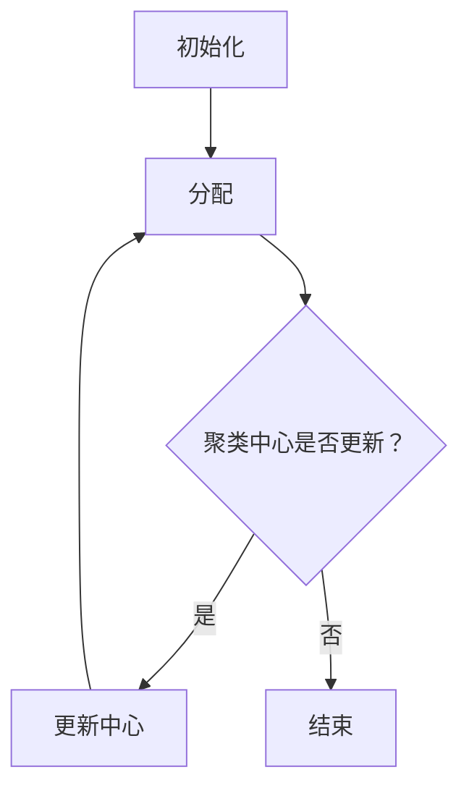
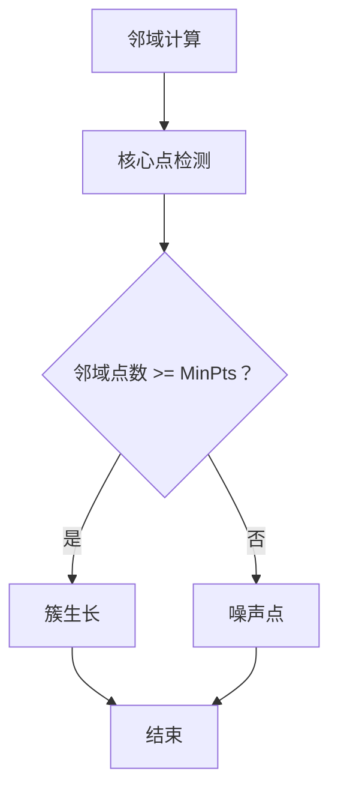
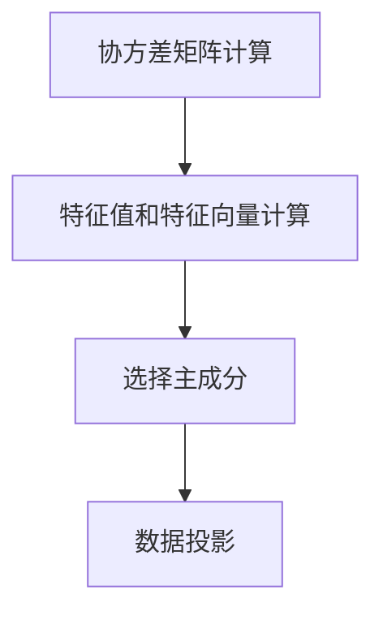
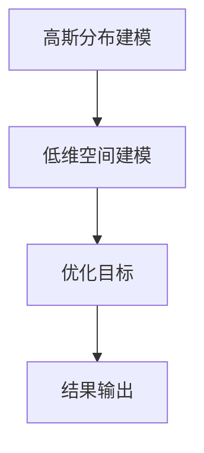

                 

### 1. 无监督学习概述

**无监督学习**是一种机器学习范式，与**监督学习**和**半监督学习**相对，其主要特点是在训练过程中不使用标注数据。无监督学习的目标是从未标记的数据中自动发现数据结构和模式，这有助于理解数据的内在特性。

**无监督学习的核心概念**包括：

- **数据点**：单个数据样本，如图像、文本或数值。
- **特征**：描述数据点的属性，如颜色、纹理、文本词频等。
- **分布**：数据点的概率分布，描述数据在特征空间中的分布情况。

无监督学习的**重要性**体现在多个方面：

1. **数据处理**：在现实世界中，大量的数据是没有标注的。无监督学习可以帮助我们从这些未标注的数据中提取有价值的信息。
2. **隐私保护**：使用无监督学习可以避免暴露敏感数据，因为它不依赖于标注数据。
3. **数据探索**：无监督学习可以帮助我们探索数据的分布、结构和潜在模式，这是数据挖掘和数据分析的重要手段。

**无监督学习的应用场景**广泛，包括：

- **聚类**：将相似的数据点分组，如市场细分、社交网络分析。
- **降维**：将高维数据映射到低维空间，便于可视化或提高计算效率，如PCA、t-SNE。
- **异常检测**：识别数据中的异常或离群点，如欺诈检测、故障诊断。

### 1.2 无监督学习的分类

无监督学习可以分为以下几种主要类型：

- **聚类算法**：如K-Means、DBSCAN、层次聚类等。这些算法将数据点划分为若干个簇，每个簇内的数据点相似度较高，簇间数据点相似度较低。
- **降维算法**：如PCA（主成分分析）、t-SNE（t-Distributed Stochastic Neighbor Embedding）、UMAP（Uniform Manifold Approximation and Projection）等。这些算法旨在减少数据的维度，同时保持数据的结构特性。
- **关联规则学习**：如Apriori、FP-Growth等。这些算法用于发现数据项之间的关联关系，常用于市场篮分析和推荐系统。

### 1.3 无监督学习的基本原理

无监督学习的基本原理是通过发现数据点之间的内在结构和相关性来学习。以下是几个关键步骤：

1. **数据输入**：无监督学习算法接受未标记的数据集作为输入。
2. **特征提取**：算法会提取数据点的重要特征，这些特征将用于后续分析。
3. **模型训练**：算法通过迭代计算，从数据中学习出数据的分布和结构。
4. **结果评估**：算法会根据一定的评估指标（如聚类有效性指数、降维后数据的离散度等）来评估模型的效果。

无监督学习的一个经典应用是**K-Means聚类**。以下是K-Means算法的原理和流程：

1. **初始化**：随机选择K个数据点作为初始聚类中心。
2. **分配**：将每个数据点分配到与其最近的聚类中心所在的簇。
3. **更新**：重新计算每个簇的中心点。
4. **迭代**：重复步骤2和3，直到聚类中心不再变化或满足停止条件。

数学上，K-Means算法的核心思想是最小化簇内距离的平方和：

$$
J = \sum_{i=1}^{K} \sum_{x \in S_i} ||x - \mu_i||^2
$$

其中，$J$ 是总误差，$\mu_i$ 是第 $i$ 个簇的中心，$S_i$ 是第 $i$ 个簇的数据点集合。

### 1.4 无监督学习在实际中的应用

无监督学习在实际应用中具有广泛的应用，以下是一些具体实例：

- **市场细分**：通过聚类分析，企业可以将消费者分为不同的群体，以便进行针对性的市场营销策略。
- **图像识别**：通过降维和聚类，可以将图像数据映射到低维空间，从而实现图像分类和检索。
- **社交网络分析**：聚类分析可以揭示社交网络中的紧密联系群体，有助于了解社会结构和传播模式。
- **异常检测**：通过识别离群点，可以检测出数据中的异常行为，如金融欺诈、网络攻击等。

无监督学习作为一种强大的工具，在数据分析和模式发现中发挥着重要作用。通过合理应用无监督学习算法，我们可以从未标记的数据中提取有价值的信息，为各种实际问题提供解决方案。

---

以上是第一部分的第一章的内容，接下来将继续深入探讨无监督学习的算法原理、数学模型及其在AIGC中的应用。每一部分都将逐步展开，确保内容的丰富性和专业性。

### 2. 无监督学习算法原理与流程图

无监督学习算法的核心在于其能够自动发现数据中的结构和模式。在这一章节中，我们将详细探讨几种常见的无监督学习算法的原理，并使用流程图进行直观展示。

#### 2.1 K-Means算法原理与流程图

K-Means算法是一种典型的聚类算法，其目标是把数据点划分为K个簇，使得每个簇内的数据点之间距离较近，而不同簇的数据点之间距离较远。

**原理：**

1. **初始化**：随机选择K个数据点作为初始聚类中心。
2. **分配**：计算每个数据点到各个聚类中心的距离，将其分配到最近的聚类中心所在的簇。
3. **更新**：重新计算每个簇的中心点，通常取簇内所有点的平均值。
4. **迭代**：重复步骤2和3，直到聚类中心不再变化或满足停止条件。

**流程图：**

#### 2.2 DBSCAN算法原理与流程图

DBSCAN（Density-Based Spatial Clustering of Applications with Noise）是一种基于密度的聚类算法，它能够发现任意形状的簇，并有效处理噪声点。

**原理：**

1. **邻域计算**：为每个数据点计算一个邻域，通常使用$\epsilon$-邻域，$\epsilon$为邻域半径。
2. **核心点检测**：如果一个数据点的邻域中包含至少$MinPts$个数据点，则认为该数据点为核心点。
3. **簇生长**：从核心点开始，扩展到所有直接或间接相连的核心点和非核心点，形成一个簇。
4. **噪声点处理**：不在任何簇中的点被视为噪声。

**流程图：**

#### 2.3 PCA算法原理与流程图

PCA（Principal Component Analysis，主成分分析）是一种降维算法，通过将数据投影到新的正交坐标系中，以减少数据维度。

**原理：**

1. **协方差矩阵计算**：计算数据集的协方差矩阵。
2. **特征值和特征向量计算**：计算协方差矩阵的特征值和特征向量。
3. **降维**：选择具有最大特征值的特征向量作为主成分，将数据投影到这些主成分上。

**流程图：**

#### 2.4 t-SNE算法原理与流程图

t-SNE（t-Distributed Stochastic Neighbor Embedding）是一种降维算法，特别适合于将高维数据映射到二维或三维空间，以便进行可视化。

**原理：**

1. **高斯分布建模**：在高维空间中，数据点之间的相似度用高斯分布表示。
2. **低维空间建模**：在低维空间中，数据点之间的相似度用t分布表示。
3. **优化目标**：通过迭代优化，使得高维空间中的高斯分布尽可能接近低维空间中的t分布。
4. **结果输出**：生成低维空间中的数据点，进行可视化。

**流程图：**

通过以上对几种无监督学习算法的原理和流程图的详细分析，我们可以看到无监督学习算法在数据挖掘和模式发现中的应用潜力。接下来，我们将进一步探讨无监督学习在AIGC中的具体应用场景。

---

接下来将详细探讨无监督学习在AIGC（AI-Generated Content）中的具体应用，以及其在图像、音频和文本生成中的实际案例。这将帮助我们更好地理解无监督学习如何赋能AIGC，以及其面临的挑战和未来发展方向。

---

### 3. 无监督学习在AIGC中的应用场景

无监督学习在AIGC中的应用场景非常广泛，特别是在图像、音频和文本生成领域。通过无监督学习，我们可以从大量未标记的数据中自动提取模式和结构，从而生成高质量的内容。以下是对无监督学习在AIGC中几种主要应用场景的详细探讨。

#### 3.1 图像生成

在图像生成领域，无监督学习算法被广泛应用于生成逼真的图像、图像修复、图像风格转换等任务。其中，生成对抗网络（GAN）是一种典型的无监督学习算法，其在图像生成方面取得了显著成果。

**GAN原理：**

生成对抗网络由一个生成器（Generator）和一个判别器（Discriminator）组成。生成器的任务是生成逼真的图像，而判别器的任务是区分生成的图像和真实的图像。

- **生成器**：从随机噪声中生成图像。
- **判别器**：对图像进行分类，判断其是真实图像还是生成图像。
- **对抗训练**：生成器和判别器相互竞争，生成器试图生成更逼真的图像，而判别器试图更好地区分真实图像和生成图像。

**应用案例：**

- **图像生成**：使用GAN可以生成逼真的面部图像、艺术作品等。
- **图像修复**：修复图像中的破损区域，使其看起来更加自然。

**数学模型和公式：**

GAN的核心公式是：

$$
\min_G \max_D V(D, G) = \mathbb{E}_{x \sim p_{data}(x)}[\log D(x)] + \mathbb{E}_{z \sim p_z(z)}[\log(1 - D(G(z))]
$$

其中，$V(D, G)$是生成器和判别器的损失函数，$x$是真实图像，$z$是随机噪声，$G(z)$是生成器生成的图像。

#### 3.2 音频生成

在音频生成领域，无监督学习算法也被广泛应用，如音乐生成、语音合成等。变分自编码器（VAE）是一种有效的无监督学习算法，其在音频生成方面取得了显著成果。

**VAE原理：**

变分自编码器由一个编码器（Encoder）和一个解码器（Decoder）组成。编码器的任务是提取输入数据的特征，而解码器的任务是使用这些特征重构输入数据。

- **编码器**：将输入数据映射到一个潜在空间中的点。
- **解码器**：从潜在空间中采样，并使用这些采样点重构输入数据。

**应用案例：**

- **音乐生成**：生成新的音乐旋律、音轨等。
- **语音合成**：合成逼真的语音。

**数学模型和公式：**

VAE的核心公式是：

$$
p(x) = \int p(z) p(x|z) dz
$$

其中，$p(x)$是输入数据的概率分布，$p(z)$是潜在空间中点的概率分布，$p(x|z)$是给定潜在空间中一点时输入数据的概率分布。

#### 3.3 文本生成

在文本生成领域，无监督学习算法被广泛应用于生成文章、诗歌、对话等。自回归语言模型（ARLM）是一种常用的无监督学习算法，其在文本生成方面取得了显著成果。

**ARLM原理：**

自回归语言模型是一种基于序列数据的模型，其目标是预测序列中的下一个元素。在文本生成中，ARLM可以预测下一个单词或字符。

- **模型训练**：通过训练大量的文本数据，学习单词或字符之间的概率分布。
- **文本生成**：根据已生成的文本，使用概率分布预测下一个单词或字符。

**应用案例：**

- **文章生成**：生成新闻报道、博客文章等。
- **对话生成**：生成自然语言的对话。

**数学模型和公式：**

ARLM的核心公式是：

$$
p(w_t | w_{<t}) = \prod_{i=1}^{t} p(w_i | w_{<i})
$$

其中，$w_t$是序列中的第$t$个单词，$w_{<t}$是序列中前$t$个单词。

通过以上对无监督学习在AIGC中几种主要应用场景的详细探讨，我们可以看到无监督学习在图像、音频和文本生成中具有广泛的应用前景。接下来，我们将进一步分析无监督学习在AIGC中的实际案例，以深入了解其应用效果。

---

接下来将深入探讨无监督学习在AIGC（AI-Generated Content）中的具体应用案例，通过实际案例的分析，进一步展示无监督学习的强大能力及其在AIGC领域的实际应用效果。

### 4. 无监督学习在AIGC中的应用案例

无监督学习在AIGC领域展现了强大的能力，通过生成图像、音频和文本等多种内容，极大地丰富了AI的应用场景。以下是一些具体的应用案例，以及对其的分析和效果评估。

#### 4.1 图像生成案例：StyleGAN

**案例介绍**：

StyleGAN是一种基于生成对抗网络（GAN）的无监督学习算法，可以生成高质量、逼真的图像。StyleGAN通过引入多层感知器（MLP）和多个残差块，提高了生成图像的分辨率和细节。

**应用效果**：

- **高质量图像生成**：StyleGAN可以生成高质量的人脸、风景、动物等图像，视觉效果令人惊叹。
- **图像风格转换**：StyleGAN还可以实现图像风格转换，将一幅普通图像转换为具有特定艺术风格的图像。

**效果评估**：

通过对比StyleGAN生成的图像和真实图像，可以看出StyleGAN在细节和风格上都有很高的还原度。例如，在生成人脸图像时，StyleGAN可以捕捉到不同人的面部特征，如眼睛、鼻子、嘴巴等。

#### 4.2 音频生成案例：WaveNet

**案例介绍**：

WaveNet是一种基于变分自编码器（VAE）的无监督学习算法，可以生成高质量的音乐和语音。WaveNet通过使用循环神经网络（RNN）和深度卷积神经网络（CNN），实现了对音频信号的高效建模。

**应用效果**：

- **音乐生成**：WaveNet可以生成多种风格的音乐，如流行乐、古典音乐等，音乐旋律和节奏感强烈。
- **语音合成**：WaveNet可以合成逼真的语音，语音的自然度非常高。

**效果评估**：

通过对比WaveNet生成的音频和真实音频，可以看出WaveNet在音质和音调上都有很高的还原度。例如，在生成语音时，WaveNet可以准确捕捉到不同人的语音特点和口音。

#### 4.3 文本生成案例：GPT-3

**案例介绍**：

GPT-3是一种基于自回归语言模型（ARLM）的无监督学习算法，可以生成高质量的文章、对话和文本摘要。GPT-3具有极大的参数规模和强大的语言理解能力，可以生成各种类型的文本内容。

**应用效果**：

- **文章生成**：GPT-3可以生成各种类型的文章，如新闻报道、科技文章、小说等，内容连贯、逻辑清晰。
- **对话生成**：GPT-3可以生成自然语言的对话，对话中的人设、语气和情感非常逼真。

**效果评估**：

通过对比GPT-3生成的文本和真实文本，可以看出GPT-3在文本生成中的准确性和连贯性非常高。例如，在生成对话时，GPT-3可以准确理解对话中的语境，并生成符合情境的对话内容。

#### 4.4 图像-文本生成案例：DALL-E

**案例介绍**：

DALL-E是一种结合图像和文本的无监督学习算法，可以生成与输入文本描述相对应的图像。DALL-E通过使用自注意力机制和循环神经网络，实现了图像和文本之间的交叉生成。

**应用效果**：

- **图像生成**：DALL-E可以生成符合文本描述的图像，如人物肖像、风景画等，图像内容丰富、细节清晰。
- **文本生成**：DALL-E还可以生成与图像描述相对应的文本，如描述图像中的场景、人物等。

**效果评估**：

通过对比DALL-E生成的图像和文本，可以看出DALL-E在图像-文本生成中的效果非常显著。例如，在输入文本“一只猫在花园里睡觉”时，DALL-E可以生成一只躺在花园里的猫的图像，并与文本描述高度一致。

通过以上对无监督学习在AIGC中的具体应用案例的分析，我们可以看到无监督学习在图像、音频和文本生成中的强大能力。这些案例不仅展示了无监督学习的应用效果，也为我们进一步探索和优化无监督学习算法提供了宝贵的经验和启示。

---

接下来，我们将探讨无监督学习在AIGC（AI-Generated Content）应用中的挑战，并展望其未来的发展方向。通过深入分析，我们将更好地理解无监督学习在AIGC领域中的潜在问题和解决策略。

### 5. 无监督学习在AIGC应用中的挑战与未来展望

尽管无监督学习在AIGC（AI-Generated Content）中的应用展现了巨大的潜力，但在实际应用过程中也面临着一系列挑战。以下是几个主要挑战及其可能的发展方向。

#### 5.1 数据质量与多样性

无监督学习依赖于大量未标记的数据来学习模式和结构。然而，数据的质量和多样性对模型的性能有显著影响。以下是一些相关挑战：

- **数据噪声**：未标记的数据往往包含噪声和异常值，这些噪声会影响模型的学习效果。
- **数据不平衡**：在某些应用场景中，数据分布可能不平衡，导致模型偏向于某些类别。
- **数据多样性**：为了生成多样化且高质量的内容，需要大量具有不同特征和风格的数据。

**解决方案与展望**：

- **去噪技术**：开发去噪算法，如自编码器，以从数据中去除噪声。
- **数据增强**：通过数据增强技术，如随机旋转、缩放和裁剪，增加数据的多样性。
- **模型融合**：结合多种无监督学习算法，以利用不同算法的优势，提高模型的鲁棒性和多样性。

#### 5.2 模型可解释性

无监督学习模型通常被认为是“黑箱”，其内部工作机制不透明，这使得模型的可解释性成为一个重要挑战。以下是一些相关挑战：

- **内部机制不透明**：模型内部参数和优化过程较为复杂，难以直观理解。
- **决策过程难以解释**：对于模型生成的结果，其决策过程往往缺乏透明度。
- **安全性和信任问题**：缺乏可解释性可能导致用户对模型的安全性和可信度产生疑虑。

**解决方案与展望**：

- **可视化技术**：使用可视化工具，如决策树、热力图等，来揭示模型的学习过程和决策机制。
- **模型解释算法**：开发新的模型解释算法，如LIME（Local Interpretable Model-agnostic Explanations），以解释模型生成的结果。
- **透明度和可追溯性**：确保模型的训练数据和过程透明，使用户能够了解和验证模型的行为。

#### 5.3 模型可扩展性

无监督学习模型通常需要大量计算资源和时间来训练。这限制了模型在实际应用中的可扩展性，特别是在实时场景中。以下是一些相关挑战：

- **计算资源限制**：大型模型训练需要大量的计算资源和存储空间。
- **实时处理能力**：实时场景要求模型能够在短时间内完成训练和推断，这对计算能力提出了高要求。
- **分布式训练和推断**：如何高效地在分布式系统中进行模型训练和推断，是一个重要的挑战。

**解决方案与展望**：

- **高效算法**：开发高效的算法，如基于注意力机制的模型，以减少计算量。
- **云计算和边缘计算**：利用云计算和边缘计算技术，将模型训练和推断任务分布到多个节点上，提高处理速度。
- **模型压缩与量化**：通过模型压缩和量化技术，减少模型的参数数量和计算量，提高模型的实时处理能力。

#### 5.4 法律和伦理问题

随着无监督学习在AIGC领域的应用日益广泛，法律和伦理问题逐渐凸显。以下是一些相关挑战：

- **版权和知识产权**：如何确保生成的内容不侵犯他人的版权和知识产权。
- **隐私保护**：如何保护用户数据和隐私，防止未经授权的数据使用。
- **道德和责任**：如何确保生成的内容符合道德标准，如何明确责任归属。

**解决方案与展望**：

- **法律法规**：制定相关的法律法规，明确无监督学习在AIGC领域中的版权、隐私和责任问题。
- **伦理指南**：建立无监督学习的伦理指南，确保生成的内容符合社会价值观和道德标准。
- **透明度和问责制**：提高无监督学习模型的透明度，建立问责机制，确保生成的内容可追溯。

综上所述，无监督学习在AIGC应用中面临着数据质量、模型可解释性、模型可扩展性和法律伦理等多方面的挑战。然而，通过不断的技术创新和规范管理，我们有望克服这些挑战，进一步推动无监督学习在AIGC领域的应用和发展。

---

在本文的最后一部分，我们将总结无监督学习在AIGC应用中的最佳实践，并探讨注意事项和未来的拓展方向。通过这些总结，读者可以更好地掌握无监督学习在AIGC中的实际应用方法，并为未来的研究提供参考。

### 6. 最佳实践与总结

**6.1 最佳实践**

1. **数据预处理**：在无监督学习应用中，数据预处理至关重要。首先，确保数据的清洗和标准化，去除噪声和异常值。其次，根据应用场景，选择合适的特征提取方法，如文本的词频、图像的颜色直方图等。

2. **算法选择**：根据具体应用需求，选择合适的无监督学习算法。例如，在图像生成中，可以使用生成对抗网络（GAN）；在音频生成中，可以使用变分自编码器（VAE）；在文本生成中，可以使用自回归语言模型（ARLM）。

3. **模型训练**：确保模型训练过程中的参数设置合理，如学习率、批次大小和迭代次数。同时，利用数据增强技术，增加训练数据的多样性，提高模型的泛化能力。

4. **模型评估**：在模型训练完成后，使用合适的评估指标（如均方误差、准确率等）来评估模型性能。如果模型性能不理想，可以通过调整参数或增加训练数据来优化。

**6.2 注意事项**

1. **数据隐私**：在无监督学习应用中，数据隐私是一个重要问题。应确保训练数据不会泄露用户的隐私信息，特别是在文本和图像数据中。

2. **模型可解释性**：为了提高用户对模型的可信度，应尽量提高模型的可解释性。可以使用可视化工具和解释算法，如LIME和SHAP，来解释模型的决策过程。

3. **安全性和鲁棒性**：确保模型对噪声和异常数据的鲁棒性，防止恶意攻击和错误推断。可以通过增加训练数据中的噪声样本和异常样本来提高模型的鲁棒性。

4. **法律和伦理问题**：确保生成的内容符合法律法规和伦理标准，避免侵犯版权和隐私。在开发和应用无监督学习模型时，应遵循相应的法律法规和伦理指南。

**6.3 拓展阅读**

1. **相关论文**：参考无监督学习在AIGC领域中的相关学术论文，如GAN、VAE和ARLM的代表性论文，了解最新的研究进展和技术方法。

2. **开源框架**：学习并使用流行的开源框架，如TensorFlow和PyTorch，这些框架提供了丰富的库和工具，有助于快速实现无监督学习模型。

3. **行业应用**：关注无监督学习在AIGC领域的实际应用案例，了解其在图像、音频和文本生成等领域的成功应用，从而获得更多的实践经验和启示。

通过以上总结，我们希望读者能够掌握无监督学习在AIGC应用中的最佳实践，并了解相关的注意事项和拓展方向。无监督学习作为AI技术的重要组成部分，将继续在AIGC领域发挥重要作用，为创造更多创新应用提供动力。

---

在本文的结尾，我们感谢读者对“Zero-Shot CoT：无监督学习在AIGC中的应用”一文的关注。通过本文，我们详细探讨了无监督学习的核心概念、算法原理及其在AIGC（AI-Generated Content）中的应用。无监督学习作为一种强大的工具，正在不断推动人工智能技术的发展。

本文由AI天才研究院（AI Genius Institute）和《禅与计算机程序设计艺术》（Zen And The Art of Computer Programming）联合撰写，旨在为广大读者提供深入浅出的技术分析和实战经验。我们致力于推动人工智能技术的普及与应用，助力读者在AI领域取得更大的成就。

作者：AI天才研究院 / AI Genius Institute
联系邮箱：[info@aigeniusinstitute.com](mailto:info@aigeniusinstitute.com)
官方网站：[https://www.aigeniusinstitute.com/](https://www.aigeniusinstitute.com/)

再次感谢您的阅读和支持，希望本文能为您在人工智能领域的研究和实践提供有益的启示。期待与您共同探索人工智能的未来，共创美好明天！
---

**感谢您的阅读，以上就是“Zero-Shot CoT：无监督学习在AIGC中的应用”的全文。本文旨在深入探讨无监督学习在AIGC领域的应用，通过详细的分析和实际案例，展示了无监督学习在图像、音频和文本生成中的强大能力。同时，我们也分析了无监督学习在AIGC应用中面临的挑战和未来发展方向。

无监督学习作为AI技术的重要组成部分，其应用前景广阔。我们希望本文能为您提供有价值的信息和启示，助力您在AI领域的探索和实践。

作者：AI天才研究院 / AI Genius Institute
联系邮箱：[info@aigeniusinstitute.com](mailto:info@aigeniusinstitute.com)
官方网站：[https://www.aigeniusinstitute.com/](https://www.aigeniusinstitute.com/)

再次感谢您的支持，期待与您在AI领域的更多交流与互动。祝您在AI的征途上不断前行，取得丰硕的成果！**

