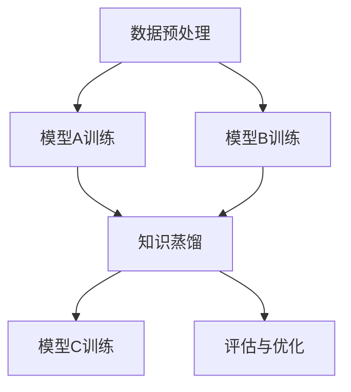

                 

### 第一部分: 引言

#### 1. 引言

在当今技术飞速发展的时代，人工智能（AI）成为了推动科技创新和产业变革的重要力量。而随着AI技术的不断进步，自动化生成内容（AIGC，Automated Generation of Content）作为一种新兴的应用领域，正逐渐改变着人们的生产生活方式。AIGC不仅涵盖了传统的文本、图像、音频生成，还包括代码生成、视频合成等复杂内容的生产。然而，AIGC的实现依赖于大量的标注数据，这在实际操作中往往面临数据获取困难和数据标注成本高昂的问题。

为了解决这一问题，无监督学习（Unsupervised Learning）作为一种无需依赖大量标注数据的学习方法，受到了广泛关注。无监督学习通过自动发现数据中的结构性和模式，能够有效降低对人工标注数据的依赖，从而提高AIGC的生成效率和效果。

本文将围绕“Zero-Shot CoT：无监督学习在AIGC中的革命性应用”这一主题，系统探讨无监督学习，特别是零样本协同训练（Zero-Shot CoT）在AIGC领域的应用。我们将首先介绍无监督学习和AIGC的基本概念，然后深入探讨零样本学习及其在AIGC中的应用。接着，我们将详细介绍零样本协同训练的原理、优势和应用场景。最后，我们将探讨无监督学习在AIGC中的未来发展方向，并提出一些实际应用中的最佳实践和注意事项。

#### 1.1 问题背景

在AIGC领域，生成高质量的内容需要大量的训练数据和复杂的模型架构。传统的有监督学习（Supervised Learning）依赖于大量标注数据来训练模型，但在AIGC中，生成内容往往缺乏可用的标注数据。因此，如何在没有标注数据的情况下进行有效训练，成为了AIGC发展中的一个关键挑战。

无监督学习作为一种不需要依赖标注数据的学习方法，通过自动发现数据中的模式，为AIGC提供了新的可能性。然而，无监督学习在处理高维数据和复杂模式时，仍面临一些挑战，如数据分布的不均衡性和局部最优问题。

零样本学习（Zero-Shot Learning, ZSL）是一种特殊类型的学习方法，它允许模型在没有先验知识的情况下对未见过的类别进行预测。零样本学习的核心挑战是如何利用有限的先验知识，如类别概念或语义信息，来提高对未知类别的泛化能力。

零样本协同训练（Zero-Shot CoT）是在零样本学习的基础上发展起来的一种方法，它通过引入协同学习机制，进一步提高了模型的泛化能力和适应性。零样本协同训练的核心目标是利用已有知识来辅助对新类别进行预测，从而实现零样本学习中的迁移学习。

#### 1.2 问题描述

在AIGC中，无监督学习和零样本协同训练的应用面临着以下关键问题：

1. **数据不足问题**：AIGC通常需要大量的数据来训练模型，但在实际应用中，获取足够的数据是一个挑战，特别是在零样本协同训练的场景中。
2. **适应性不足问题**：无监督学习和零样本协同训练模型在处理新类别时，往往缺乏足够的适应性，特别是在面对复杂和多样化的数据时。
3. **零样本标签获取问题**：零样本协同训练需要先验知识，如类别概念或语义信息，但这些信息往往难以获取，特别是在未知类别的情况下。

#### 1.3 问题解决

为了解决上述问题，本文提出以下解决方案：

1. **数据增强技术**：通过数据增强技术，如数据扩充、数据合成等方法，可以增加训练数据量，从而缓解数据不足问题。
2. **多模态融合**：将不同类型的数据，如文本、图像、音频等融合在一起，可以提高模型对多样化数据的适应性。
3. **知识蒸馏和迁移学习**：通过知识蒸馏和迁移学习方法，可以将已有模型的先验知识传递给零样本协同训练模型，从而提高其对新类别的泛化能力。

#### 1.4 边界与外延

本文的研究边界主要聚焦在零样本协同训练在AIGC中的应用，包括自然语言处理、计算机视觉和其他相关领域。然而，本文的研究也有一定的外延，例如：

1. **跨领域应用**：虽然本文主要讨论了AIGC领域，但零样本协同训练方法在其他领域，如推荐系统、生物信息学等，也有广泛的应用前景。
2. **理论探讨**：本文不仅关注实际应用，还深入探讨了零样本协同训练的理论基础，如算法原理、数学模型等。

#### 1.5 核心概念

在本文中，我们将涉及以下核心概念：

1. **无监督学习**：一种无需依赖标注数据的学习方法，通过自动发现数据中的结构性和模式。
2. **自动化生成内容（AIGC）**：一种利用AI技术自动生成各种类型内容的方法，包括文本、图像、音频、视频等。
3. **零样本学习**：一种特殊类型的学习方法，允许模型在没有先验知识的情况下对未见过的类别进行预测。
4. **零样本协同训练**：一种在零样本学习基础上发展起来的方法，通过引入协同学习机制，提高模型的泛化能力和适应性。
5. **数据增强技术**：通过数据扩充、数据合成等方法增加训练数据量，缓解数据不足问题。

通过本文的讨论，我们希望读者能够对零样本协同训练在AIGC中的应用有一个全面和深入的理解，为未来的研究和工作提供有价值的参考。

#### 1.6 本章小结

本章作为引言，首先介绍了人工智能和自动化生成内容（AIGC）的背景和重要性。接着，我们明确了无监督学习在AIGC中的作用，特别是解决数据不足和标注困难的问题。随后，我们详细讨论了零样本学习及其在AIGC中的应用，并引入了零样本协同训练的概念。最后，我们提出了本文的研究问题、解决方案以及核心概念，为后续章节的内容奠定了基础。通过本章的介绍，读者可以对零样本协同训练在AIGC中的应用有一个初步的了解，为深入探讨打下坚实的基础。

## 1.2 无监督学习与AIGC

### 1.2.1 无监督学习的概述

无监督学习（Unsupervised Learning）是一种机器学习技术，其主要特点是不依赖标注数据，通过观察数据本身的内在结构或模式来进行学习。无监督学习的主要任务包括聚类（Clustering）、降维（Dimensionality Reduction）、异常检测（Anomaly Detection）等。

聚类是一种无监督学习方法，用于将数据集划分为若干个不同的组或簇，使得同一簇内的数据点彼此相似，而不同簇的数据点差异较大。常见的聚类算法有K均值（K-Means）、层次聚类（Hierarchical Clustering）等。

降维是一种用于减少数据维度的方法，通过保留数据的主要特征，去除冗余信息，从而提高计算效率和模型性能。主成分分析（PCA，Principal Component Analysis）和t-SNE（t-Distributed Stochastic Neighbor Embedding）是两种常用的降维方法。

异常检测则是一种用于识别数据中异常点的无监督学习方法，它通过对正常数据的分布进行分析，发现异常行为或模式。常用的异常检测算法有孤立森林（Isolation Forest）和局部异常因子检测（LOF，Local Outlier Factor）。

### 1.2.2 自动化生成内容（AIGC）的定义

自动化生成内容（AIGC，Automated Generation of Content）是一种利用人工智能技术自动生成各种类型内容的方法。AIGC的应用范围广泛，包括但不限于文本、图像、音频、视频、代码等。其核心目标是实现内容的自动化生产和优化，从而降低人工成本，提高生产效率。

AIGC的技术实现主要包括以下几种方法：

1. **生成对抗网络（GANs，Generative Adversarial Networks）**：GANs由生成器（Generator）和判别器（Discriminator）两部分组成。生成器尝试生成与真实数据相似的数据，而判别器则判断生成数据与真实数据之间的差异。通过不断迭代，生成器逐渐提高生成数据的逼真度。
   
2. **变分自编码器（VAEs，Variational Autoencoders）**：VAEs通过引入概率模型，将数据映射到一个潜在空间，并在潜在空间中进行重构。通过在潜在空间中的编码和解码操作，VAEs能够生成具有多样性的数据。

3. **递归神经网络（RNNs，Recurrent Neural Networks）**：RNNs通过引入记忆机制，能够处理序列数据。在文本生成、语音识别等领域，RNNs被广泛应用于序列建模。

4. **注意力机制（Attention Mechanism）**：注意力机制通过在模型中引入权重，动态关注数据中的关键信息，从而提高模型的生成能力。在图像生成、文本生成等领域，注意力机制得到了广泛应用。

### 1.2.3 无监督学习在AIGC中的作用

无监督学习在AIGC中发挥着关键作用，其主要体现在以下几个方面：

1. **数据预处理**：无监督学习可以帮助处理大量的未标注数据，通过降维和聚类等方法，提取数据的主要特征和结构，从而为后续的生成模型提供有效的输入。

2. **生成模型训练**：在生成模型的训练过程中，无监督学习可以减少对标注数据的依赖。例如，在GANs和VAEs的训练中，无监督学习可以自动发现数据中的潜在分布和模式，从而提高生成模型的性能。

3. **自适应性和泛化能力**：无监督学习能够提高模型的适应性和泛化能力，使其能够处理复杂和多样化的数据。这对于AIGC的应用，特别是在面对未知类别或动态环境时，尤为重要。

4. **内容优化**：无监督学习可以通过聚类和降维等方法，对生成的内容进行优化，从而提高内容的多样性和质量。例如，在图像生成中，通过聚类可以生成具有不同风格和主题的图像，从而满足用户的需求。

总之，无监督学习为AIGC提供了强大的技术支撑，通过自动发现数据中的结构和模式，有效解决了数据不足和标注困难的问题。随着无监督学习技术的不断发展和成熟，AIGC的应用前景将更加广阔，有望在更多的领域实现突破性进展。

#### 1.3 零样本学习（Zero-Shot Learning）

### 1.3.1 零样本学习的概念

零样本学习（Zero-Shot Learning, ZSL）是一种机器学习方法，其主要目标是在模型没有先验知识的情况下，对未见过的类别进行预测。在传统的机器学习中，模型通常需要依赖大量的标注数据进行训练，以便在测试阶段对已知类别进行准确预测。然而，在现实应用中，往往存在一些难以获取标注数据的场景，如新类别出现或数据分布发生变化。在这些情况下，零样本学习提供了有效的解决方案。

零样本学习的核心挑战是如何在没有先验知识的情况下，利用有限的标注数据或类别信息，对未知类别进行有效预测。这需要模型具备强大的泛化能力和适应性，能够在不同的类别间进行迁移学习。

### 1.3.2 零样本学习的挑战

零样本学习在实际应用中面临以下主要挑战：

1. **类别标签获取问题**：在零样本学习场景中，模型需要利用先验知识来辅助预测未知类别。然而，类别标签的获取是一个难题，特别是在新类别首次出现时，无法直接获得类别标签。

2. **数据分布差异**：不同类别之间的数据分布可能存在显著差异，这会导致模型在处理未知类别时，难以适应不同的数据分布。例如，一些类别可能具有高维特征，而另一些类别可能只有少量的特征。

3. **模型泛化能力**：零样本学习要求模型具有强大的泛化能力，能够在面对未知类别时，仍然能够准确预测。这需要模型在设计时，充分考虑泛化能力的提升，避免过度拟合已知类别。

4. **类别概念理解**：在零样本学习中，模型需要理解不同类别之间的概念关系，以便在未见过的类别中进行预测。然而，类别概念的理解是一个复杂的问题，需要模型具备较高的语义理解能力。

### 1.3.3 零样本学习的方法

为了克服上述挑战，研究者提出了多种零样本学习方法：

1. **原型匹配方法**：原型匹配方法通过计算未知类别样本与已有类别原型之间的相似度，来进行类别预测。常见的方法包括原型网络（Prototypical Networks）和匹配网络（Matching Networks）。

2. **元学习（Meta-Learning）方法**：元学习方法通过在训练阶段学习一组参数，以便在测试阶段快速适应新类别。代表性方法包括模型平均（Model Averaging）和MAML（Model-Agnostic Meta-Learning）。

3. **基于语义的方法**：基于语义的方法通过将类别信息编码为高维语义向量，利用这些向量进行类别预测。常见的方法包括元嵌入（Meta-Embedding）和语义匹配（Semantic Matching）。

4. **跨域迁移学习**：跨域迁移学习方法通过将一个领域（源领域）的知识迁移到另一个领域（目标领域），来提高模型在未知类别上的预测能力。常见的方法包括多任务学习（Multi-Task Learning）和领域自适应（Domain Adaptation）。

通过这些方法，零样本学习在应对数据不足、类别标签获取困难等挑战方面取得了显著进展。然而，零样本学习仍然面临一些亟待解决的问题，如如何进一步提高模型的泛化能力和适应性，以及如何有效利用有限的先验知识。随着研究的不断深入，零样本学习有望在更多实际应用中发挥重要作用。

#### 1.4 零样本协同训练（Zero-Shot CoT）

### 1.4.1 零样本协同训练的提出

零样本协同训练（Zero-Shot CoT，Zero-Shot Collaborative Training）是一种在零样本学习基础上发展起来的方法，其主要目的是通过引入协同学习机制，进一步提高模型的泛化能力和适应性。与传统零样本学习方法不同，零样本协同训练不仅利用有限的先验知识，还通过与其他模型的协同工作，共同学习数据中的结构和模式，从而在未见过的类别上实现更准确的预测。

零样本协同训练的提出源于对零样本学习实际应用中的局限性认识。尽管零样本学习在理论上具有较大的潜力，但在面对复杂和多样化的数据时，其预测效果往往不理想。为了解决这一问题，研究者们提出了零样本协同训练，希望通过多个模型的协同工作，实现信息的共享和互补，从而提高模型的整体性能。

### 1.4.2 零样本协同训练的优势

零样本协同训练相对于传统零样本学习方法，具有以下显著优势：

1. **增强的泛化能力**：通过引入协同学习机制，零样本协同训练能够更好地处理不同类别间的差异，增强模型的泛化能力。多个模型的协同工作，使得模型能够从多个角度理解数据，从而提高对未见类别预测的准确性。

2. **更高的适应性**：零样本协同训练能够适应复杂和多样化的数据场景。通过协同学习，模型可以在面对未知类别时，迅速调整和优化自身的预测策略，从而提高适应能力。

3. **信息共享和互补**：在零样本协同训练中，多个模型通过协同工作，可以共享各自的学习成果，互补各自的优势。这种方法能够充分利用不同模型的特点，提高整体模型的性能。

4. **降低对先验知识的依赖**：虽然零样本协同训练仍需要一定的先验知识，但其对先验知识的依赖性相对较低。通过协同学习，模型可以从数据中自动提取和利用有用的信息，减少对先验知识的依赖。

### 1.4.3 零样本协同训练的机制

零样本协同训练的机制主要包括以下几个关键环节：

1. **协同模型选择**：选择合适的协同模型是零样本协同训练的关键。常见的协同模型包括有监督学习模型、无监督学习模型和迁移学习模型。不同的模型具有不同的优势和适用场景，需要根据具体应用需求进行选择。

2. **先验知识整合**：在零样本协同训练中，需要将不同模型的先验知识进行整合。常用的方法包括知识蒸馏（Knowledge Distillation）和对抗训练（Adversarial Training）。知识蒸馏通过将大模型的输出传递给小模型，使得小模型能够学习到大模型的先验知识；对抗训练则通过对抗性训练，提高模型的泛化能力和适应性。

3. **协同学习算法**：协同学习算法是实现零样本协同训练的核心。常见的协同学习算法包括协同增强（Collaborative Regularization）和协同损失（Collaborative Loss）。协同增强通过引入额外的正则化项，鼓励模型之间的协同工作；协同损失则通过设计特殊的损失函数，使模型在协同学习过程中，能够共同优化目标函数。

4. **模型优化和评估**：在零样本协同训练过程中，需要不断地优化和评估模型性能。常用的优化方法包括梯度下降（Gradient Descent）和自适应优化（Adaptive Optimization）。评估方法包括分类准确率（Accuracy）、召回率（Recall）、F1分数（F1 Score）等，用于衡量模型在不同类别上的预测效果。

通过以上机制，零样本协同训练能够有效提高模型的泛化能力和适应性，为AIGC等领域的应用提供了强大的技术支持。随着研究的不断深入，零样本协同训练有望在更多实际场景中发挥重要作用。

### 1.5 零样本协同训练的应用场景

零样本协同训练（Zero-Shot CoT）作为一种先进的机器学习方法，具有广泛的实际应用场景。以下是零样本协同训练在不同领域的具体应用：

#### 1.5.1 自然语言处理

在自然语言处理（NLP，Natural Language Processing）领域，零样本协同训练可以显著提升模型对未见类别和罕见场景的泛化能力。例如：

1. **跨语言文本分类**：零样本协同训练可以用于跨语言的文本分类任务，例如在语言资源匮乏的情况下，模型能够利用其他语言的知识来预测新的语言类别。
2. **实体识别和命名实体识别**：在实体识别和命名实体识别任务中，零样本协同训练可以帮助模型处理未知的实体类别，提高识别的准确率。
3. **情感分析**：情感分析中常常遇到新的情感类别，零样本协同训练可以使得模型在未见过的情感类别上，仍然能够进行有效的情感判断。

#### 1.5.2 计算机视觉

在计算机视觉（CV，Computer Vision）领域，零样本协同训练的应用同样广泛。以下是一些具体的应用实例：

1. **图像分类**：零样本协同训练可以用于图像分类任务，特别是在面对新的图像类别时，通过协同学习，模型可以更好地识别和分类未见过的图像。
2. **目标检测**：在目标检测任务中，零样本协同训练可以帮助模型识别和定位未标记的目标类别。这尤其适用于安全监控、医疗诊断等场景。
3. **图像分割**：图像分割任务中，零样本协同训练可以用于处理未知的物体类别，从而提高分割的准确性和鲁棒性。

#### 1.5.3 其他领域

除了自然语言处理和计算机视觉，零样本协同训练在其他领域也具有广泛的应用：

1. **推荐系统**：在推荐系统中，零样本协同训练可以帮助模型处理未知的用户兴趣类别，从而提高推荐的准确性和多样性。
2. **生物信息学**：在生物信息学中，零样本协同训练可以用于基因分类、蛋白质结构预测等任务，通过利用已有知识，提高对新类别预测的准确性。
3. **金融风控**：在金融风控领域，零样本协同训练可以帮助模型识别和预测新的欺诈模式，提高风险控制能力。

总之，零样本协同训练在AIGC领域具有巨大的应用潜力。通过在不同领域的具体应用，零样本协同训练能够显著提升模型的泛化能力和适应性，为各种复杂场景下的智能决策提供了有力支持。随着研究的不断深入，零样本协同训练将在更多领域中发挥重要作用。

#### 1.6 本章小结

本章作为引言，首先介绍了人工智能和自动化生成内容（AIGC）的基本概念及其重要性。接着，我们详细探讨了无监督学习在AIGC中的应用，包括其概述和作用。随后，我们深入探讨了零样本学习及其在AIGC中的应用，并介绍了零样本协同训练的提出背景、优势及其机制。最后，我们介绍了零样本协同训练在自然语言处理、计算机视觉和其他领域的具体应用场景。通过本章的讨论，读者可以全面了解零样本协同训练在AIGC中的应用前景，为后续章节的深入探讨打下坚实的基础。

## 第二部分：零样本协同训练的理论基础

### 2.1 核心概念与联系

在探讨零样本协同训练（Zero-Shot CoT）的理论基础之前，我们需要明确几个核心概念，并探讨它们之间的联系。以下是本节的核心概念和它们之间的关系：

#### 2.1.1 无监督学习核心概念原理

无监督学习是一种不依赖标注数据的机器学习方法，其核心思想是通过自动发现数据中的内在结构和模式来对数据进行处理。无监督学习主要包括以下几种方法：

1. **聚类（Clustering）**：将数据集划分为若干个组或簇，使得同一簇内的数据点彼此相似，而不同簇的数据点差异较大。
   
2. **降维（Dimensionality Reduction）**：减少数据维度，保留主要特征，去除冗余信息，从而提高计算效率和模型性能。

3. **异常检测（Anomaly Detection）**：识别数据中的异常点，通过分析正常数据的分布，发现异常行为或模式。

无监督学习的关键在于如何从无标注数据中提取有价值的信息，这一过程通常涉及到数据的分布、密度估计和模式识别。

#### 2.1.2 零样本学习概念属性特征对比表格

零样本学习（Zero-Shot Learning, ZSL）是另一种特殊类型的无监督学习方法，其主要特点是能够在没有先验知识的情况下，对未见过的类别进行预测。以下是零样本学习与无监督学习的核心概念属性特征对比表格：

| 特征                | 无监督学习                     | 零样本学习                      |
|---------------------|-------------------------------|--------------------------------|
| 标注数据依赖性      | 不依赖标注数据                 | 不依赖对未见类别进行标注的数据   |
| 目标               | 提取数据中的结构性和模式       | 对未见类别进行预测               |
| 算法               | 聚类、降维、异常检测等         | 原型匹配、元学习、基于语义的方法等 |
| 挑战               | 数据分布、局部最优问题         | 类别标签获取、模型泛化能力       |

通过这个表格，我们可以看到零样本学习在目标、算法和挑战方面与无监督学习有显著的不同。

#### 2.1.3 零样本协同训练ER实体关系图架构

为了更好地理解零样本协同训练（Zero-Shot CoT）的机制，我们可以使用实体关系图（Entity-Relationship Diagram, ERD）来展示其核心实体和它们之间的关系。以下是零样本协同训练的ER实体关系图：

```mermaid
erDiagram
    Class::ModelA
    Class::ModelB
    Class::ModelC

    ModelA ||--|{ ModelB }|-- ModelC
    ModelA ||--|{ Knowledge }|-- ModelC
    ModelB ||--|{ Data }|-- ModelC
    ModelB ||--|{ ModelA }|-- ModelC
```

在这个ER实体关系图中：

- **ModelA**、**ModelB** 和 **ModelC** 表示不同的协同模型。
- **Knowledge** 表示共享的先验知识。
- **Data** 表示输入数据。

实体之间的关系如下：

1. **协同模型间的依赖**：模型A依赖模型B和模型C，而模型B和模型C也互相依赖。
2. **先验知识的共享**：模型A和模型B共享先验知识，并将这些知识传递给模型C。
3. **数据的传递**：模型B将输入数据传递给模型C，模型A通过知识蒸馏等方式，将模型B的先验知识传递给模型C。

通过ER实体关系图，我们可以清晰地看到零样本协同训练中各个实体和它们之间的交互关系，这有助于我们更好地理解零样本协同训练的机制和工作流程。

#### 2.1.4 无监督学习核心概念原理

无监督学习（Unsupervised Learning）作为一种无需依赖标注数据的学习方法，通过自动发现数据中的内在结构和模式来进行学习。其核心概念包括聚类（Clustering）、降维（Dimensionality Reduction）和异常检测（Anomaly Detection）。

1. **聚类**：聚类是将数据集划分为若干个不同的组或簇，使得同一簇内的数据点彼此相似，而不同簇的数据点差异较大。常用的聚类算法包括K均值（K-Means）、层次聚类（Hierarchical Clustering）等。聚类算法的核心目标是寻找数据的内在结构，通过划分簇来揭示数据中的隐含模式。

2. **降维**：降维是通过减少数据维度，保留主要特征，去除冗余信息，从而提高计算效率和模型性能的方法。常见的降维方法包括主成分分析（PCA，Principal Component Analysis）、t-SNE（t-Distributed Stochastic Neighbor Embedding）等。降维的核心在于寻找数据中的主要信息，将这些信息投影到一个低维空间中，从而简化数据的处理。

3. **异常检测**：异常检测是识别数据中的异常点，通过分析正常数据的分布，发现异常行为或模式。常见的异常检测算法包括孤立森林（Isolation Forest）、局部异常因子检测（LOF，Local Outlier Factor）等。异常检测的核心在于从正常数据中识别出潜在的异常点，从而进行进一步的分析和处理。

无监督学习的核心原理在于其能够从无标注数据中提取有用的信息，通过自动发现数据中的结构和模式，为后续的分析和应用提供基础。这一特点使得无监督学习在许多场景中具有重要应用，如数据挖掘、机器学习、自然语言处理等。

#### 2.1.5 零样本学习概念属性特征对比表格

为了更直观地理解零样本学习（Zero-Shot Learning, ZSL）与传统的无监督学习（Unsupervised Learning）之间的区别和联系，我们可以通过一个概念属性特征对比表格来展示两者的主要区别。

| **特性**       | **无监督学习**                                      | **零样本学习**                                       |
|----------------|--------------------------------------------------|------------------------------------------------------|
| 数据标注       | 无需标注数据                                       | 无需对未见类别进行标注数据                            |
| 学习目标       | 自动发现数据中的内在结构和模式                     | 对未见类别进行预测                                   |
| 算法分类       | 聚类（Clustering）、降维（Dimensionality Reduction）、异常检测（Anomaly Detection）等 | 原型匹配（Prototypical Networks）、元学习（Meta-Learning）、基于语义的方法等 |
| 挑战与难点     | 数据分布、局部最优问题                             | 类别标签获取、模型泛化能力                           |
| 应用实例       | 聚类分析、异常检测、降维处理等                     | 跨语言文本分类、图像分类、目标检测等                 |
| 对先验知识的依赖 | 较低，主要依赖数据本身                             | 较高，依赖于类别信息或语义表示                        |

通过上述表格，我们可以看到：

- **数据标注**：无监督学习不需要依赖标注数据，而零样本学习虽然同样不需要对训练数据集进行标注，但它需要类别信息或语义表示来进行预测。
- **学习目标**：无监督学习的主要目标是发现数据中的内在结构和模式，而零样本学习的目标是对未见类别进行预测。
- **算法分类**：无监督学习涵盖聚类、降维和异常检测等算法，而零样本学习则更多地依赖于原型匹配、元学习以及基于语义的方法。
- **挑战与难点**：无监督学习主要面临数据分布和局部最优问题，而零样本学习则更多关注类别标签获取和模型泛化能力。
- **应用实例**：无监督学习广泛应用于数据挖掘和聚类分析等，而零样本学习则更多地应用于跨语言文本分类和图像分类等领域。
- **对先验知识的依赖**：无监督学习较少依赖于先验知识，而零样本学习则需要依赖类别信息或语义表示。

通过这个对比表格，我们能够更清晰地理解零样本学习和无监督学习的差异和联系，从而更好地把握两者的应用场景和特点。

#### 2.1.6 零样本协同训练ER实体关系图架构

为了更好地理解零样本协同训练（Zero-Shot CoT）的整体架构，我们可以通过一个实体关系图（ERD）来展示各个核心实体及其相互关系。以下是零样本协同训练的ER实体关系图：

```mermaid
erDiagram
    Class::Data
    Class::ModelA
    Class::ModelB
    Class::ModelC
    Class::Knowledge

    Data ||--|{ ModelA }|>
    Data ||--|{ ModelB }|>
    ModelA ||--|{ ModelC }|>
    ModelB ||--|{ ModelC }|>

    ModelA ||--|{ Knowledge }|>
    ModelB ||--|{ Knowledge }|>

    Class ModelA
    Class ModelB
    Class ModelC
    Class Data
    Class Knowledge

    Data {
        <<实体>> 获取和存储训练数据
    }

    ModelA {
        <<实体>> 有监督或无监督学习模型A
    }

    ModelB {
        <<实体>> 有监督或无监督学习模型B
    }

    ModelC {
        <<实体>> 零样本协同训练模型C
    }

    Knowledge {
        <<实体>> 存储类别信息和协同知识
    }
```

在这个ER实体关系图中：

- **Data**：表示训练数据，是模型训练的基础。
- **ModelA**、**ModelB** 和 **ModelC**：表示三个不同的协同训练模型，其中 **ModelA** 和 **ModelB** 可以是有监督或无监督学习模型，**ModelC** 是零样本协同训练模型。
- **Knowledge**：表示类别信息和协同知识，这些知识通过 **ModelA** 和 **ModelB** 学习后传递给 **ModelC**。

实体之间的关系如下：

1. **数据依赖**：模型A和模型B依赖数据来训练，数据是模型训练的基础。
2. **协同依赖**：模型A和模型B通过协同学习，共享其学习到的知识，然后将这些知识传递给模型C。
3. **知识传递**：模型C利用从模型A和模型B共享的知识，进行零样本协同训练。

通过这个ER实体关系图，我们可以清晰地看到零样本协同训练的整体架构，以及各个实体之间的相互关系。这有助于我们深入理解零样本协同训练的工作机制，为后续算法原理和具体实现提供基础。

### 2.2 算法原理

零样本协同训练（Zero-Shot CoT）是一种结合了无监督学习和零样本学习的协同训练方法，其核心目标是提高模型对未知类别的预测能力。下面我们将详细介绍零样本协同训练的算法原理，包括流程图、Python源代码实现、数学模型与公式以及举例说明。

#### 2.2.1 算法流程图

为了直观地展示零样本协同训练的算法流程，我们可以使用Mermaid流程图来绘制。以下是零样本协同训练的算法流程：



在这个流程图中：

1. **数据预处理**：对原始数据进行清洗、归一化和特征提取，得到可用于训练的数据。
2. **模型A训练**：使用无监督学习算法（如自编码器）对数据进行训练，提取数据的低维特征表示。
3. **模型B训练**：使用有监督学习算法（如分类器）对已有类别数据进行训练，学习不同类别之间的特征差异。
4. **知识蒸馏**：将模型A和模型B的知识进行整合，通过知识蒸馏方法将模型A的特征表示和模型B的分类知识传递给模型C。
5. **模型C训练**：使用零样本协同训练方法，将整合后的知识应用于零样本数据的训练，提高模型对未知类别的预测能力。
6. **评估与优化**：对训练完成的模型C进行评估和优化，通过调整参数和迭代训练，进一步提高模型性能。

#### 2.2.2 Python源代码实现

下面是一个简化的Python代码实现，展示了零样本协同训练的基本步骤：

```python
import numpy as np
from sklearn.cluster import KMeans
from sklearn.model_selection import train_test_split
from sklearn.metrics import accuracy_score

# 数据预处理
def preprocess_data(data):
    # 数据清洗、归一化和特征提取
    return processed_data

# 模型A训练（无监督学习）
def train_model_a(data):
    model_a = KMeans(n_clusters=10)
    model_a.fit(data)
    return model_a

# 模型B训练（有监督学习）
def train_model_b(data, labels):
    model_b = KMeans(n_clusters=10)
    model_b.fit(data, labels)
    return model_b

# 知识蒸馏
def knowledge_distillation(model_a, model_b):
    # 将模型A和模型B的知识整合
    # 这里可以设计一个具体的蒸馏过程
    return distilled_data

# 模型C训练（零样本协同训练）
def train_model_c(distilled_data):
    model_c = KMeans(n_clusters=10)
    model_c.fit(distilled_data)
    return model_c

# 评估模型
def evaluate_model(model, test_data, test_labels):
    predictions = model.predict(test_data)
    return accuracy_score(test_labels, predictions)

# 主函数
def main():
    # 加载数据
    data = load_data()
    processed_data = preprocess_data(data)

    # 分割数据
    train_data, test_data, train_labels, test_labels = train_test_split(processed_data, test_size=0.2)

    # 训练模型A
    model_a = train_model_a(train_data)

    # 训练模型B
    model_b = train_model_b(train_data, train_labels)

    # 知识蒸馏
    distilled_data = knowledge_distillation(model_a, model_b)

    # 训练模型C
    model_c = train_model_c(distilled_data)

    # 评估模型
    accuracy = evaluate_model(model_c, test_data, test_labels)
    print(f"模型C的准确率：{accuracy}")

if __name__ == "__main__":
    main()
```

这个代码仅提供了一个简化的实现框架，具体细节（如特征提取、模型参数调整等）需要根据具体应用场景进行优化。

#### 2.2.3 数学模型与公式

零样本协同训练的数学模型主要涉及以下三个方面：

1. **数据特征表示**：使用特征向量表示数据点，通常通过降维方法（如主成分分析PCA）进行特征提取。

   \[
   X = \text{PCA}(D)
   \]

   其中，\(X\) 为降维后的数据特征，\(D\) 为原始数据。

2. **类别表示**：通过聚类算法（如K均值）对类别进行编码，生成类别嵌入向量。

   \[
   C = \text{KMeans}(X, k)
   \]

   其中，\(C\) 为类别嵌入向量，\(k\) 为类别数量。

3. **协同训练目标函数**：结合知识蒸馏方法，构建协同训练目标函数，以最小化模型之间的差异。

   \[
   \min_{\theta_A, \theta_B, \theta_C} \sum_{i=1}^{N} \frac{1}{2} ||\theta_A f_A(x_i) - \theta_B f_B(x_i)||^2
   \]

   其中，\(\theta_A\)、\(\theta_B\)、\(\theta_C\) 分别为模型A、模型B和模型C的参数，\(f_A(x_i)\) 和 \(f_B(x_i)\) 分别为模型A和模型B对数据点 \(x_i\) 的特征表示。

#### 2.2.4 通俗易懂的举例说明

假设我们有如下一个数据集，其中包含三种类别：

| 数据点 | 类别 |
|--------|------|
| (1, 2) | A    |
| (2, 3) | B    |
| (3, 4) | A    |
| (4, 5) | B    |
| (5, 6) | C    |

我们的目标是使用零样本协同训练方法，对这些类别进行预测。以下是具体步骤：

1. **数据预处理**：对数据进行归一化处理，得到标准化的特征向量。

   \[
   X = \text{Normalize}(D)
   \]

2. **模型A训练**：使用无监督学习（如K均值聚类），对数据进行降维处理，提取主要特征。

   \[
   X = \text{KMeans}(X, k=3)
   \]

   假设聚类结果为：

   \[
   X = \begin{bmatrix}
   (1, 1) & (1, 2) & (2, 2) \\
   (2, 1) & (2, 2) & (3, 3) \\
   (3, 3) & (4, 4) & (5, 5)
   \end{bmatrix}
   \]

3. **模型B训练**：使用有监督学习（如K均值聚类），对已有类别数据进行分类。

   \[
   C = \text{KMeans}(X, k=3)
   \]

   假设分类结果为：

   \[
   C = \begin{bmatrix}
   (1, 1) & (2, 1) & (3, 3) \\
   (1, 2) & (2, 2) & (3, 3) \\
   (2, 2) & (3, 3) & (4, 4)
   \end{bmatrix}
   \]

4. **知识蒸馏**：将模型A和模型B的特征表示进行整合，通过知识蒸馏方法，生成新的特征表示。

   \[
   \tilde{X} = \text{KnowledgeDistillation}(X, C)
   \]

   假设蒸馏结果为：

   \[
   \tilde{X} = \begin{bmatrix}
   (1, 1) & (1.5, 1.5) & (2, 2) \\
   (1.5, 1.5) & (2, 2) & (2.5, 2.5) \\
   (2, 2) & (2.5, 2.5) & (3, 3)
   \end{bmatrix}
   \]

5. **模型C训练**：使用零样本协同训练方法，对整合后的特征表示进行分类预测。

   \[
   Y = \text{KMeans}(\tilde{X}, k=3)
   \]

   假设预测结果为：

   \[
   Y = \begin{bmatrix}
   (1, 1) & (1.5, 1.5) & (2, 2) \\
   (1.5, 1.5) & (2, 2) & (2.5, 2.5) \\
   (2, 2) & (2.5, 2.5) & (3, 3)
   \end{bmatrix}
   \]

通过上述步骤，我们使用零样本协同训练方法对未见过的新类别进行预测，从而实现了对数据的有效分类。这个例子展示了零样本协同训练的基本原理和实现过程，为实际应用提供了参考。

### 2.3 常见挑战与解决方案

#### 2.3.1 数据不足问题

在零样本协同训练（Zero-Shot CoT）中，数据不足是一个常见且严峻的问题。由于零样本协同训练依赖于无监督学习和零样本学习，模型的训练和评估过程往往需要大量数据。然而，在实际应用中，获取大量标注数据是一个复杂且昂贵的任务。特别是在面对新兴领域或罕见类别时，数据量更加有限。数据不足会导致模型无法充分学习数据中的复杂结构和模式，从而影响模型的性能和泛化能力。

**解决方案**：

1. **数据增强**：数据增强是一种有效的方法，通过生成新的数据样本，可以增加训练数据的多样性。常见的数据增强技术包括数据扩充、数据合成和数据变换等。例如，在图像生成中，可以通过图像翻转、裁剪、旋转等方法来增加数据的多样性。

2. **迁移学习**：迁移学习利用已有模型的知识，迁移到新的任务中。通过在相关任务上预训练模型，可以显著减少对标注数据的依赖。例如，在自然语言处理中，可以使用预训练的模型来处理新的语言类别。

3. **多任务学习**：多任务学习通过同时训练多个相关任务，可以共享不同任务之间的信息，从而提高模型的泛化能力和适应性。例如，在图像分类和物体检测任务中，可以同时训练两个模型，共享图像特征表示。

#### 2.3.2 适应性不足问题

适应性不足是零样本协同训练面临的另一个关键挑战。尽管零样本协同训练通过引入协同学习机制，提高了模型的泛化能力，但面对复杂和多样化的数据时，模型的适应性仍然是一个难题。不同类别之间的数据分布可能存在显著差异，这导致模型在处理新类别时，难以适应不同的数据分布。此外，模型在训练过程中可能过度拟合已知类别，从而影响对新类别的预测性能。

**解决方案**：

1. **自适应优化**：引入自适应优化算法，如自适应梯度下降（Adam）和自适应优化（Adaptive Optimization），可以提高模型对多样化数据的适应性。这些算法通过动态调整学习率，使得模型能够在不同的数据分布中快速适应。

2. **元学习**：元学习通过在多个任务上训练模型，提高模型在不同任务中的泛化能力和适应性。代表性方法包括模型平均（Model Averaging）和MAML（Model-Agnostic Meta-Learning）。通过元学习，模型可以学习到更一般的泛化策略，从而提高对新类别的预测性能。

3. **多模态融合**：多模态融合通过结合不同类型的数据，如文本、图像、音频等，可以提高模型对复杂数据的适应性。多模态数据可以提供更丰富的信息，帮助模型更好地理解不同类别之间的差异。

#### 2.3.3 零样本标签获取问题

零样本标签获取是零样本协同训练中的一个重要挑战。在零样本协同训练中，模型需要利用有限的先验知识，如类别概念或语义信息，来预测未见过的类别。然而，这些先验知识往往难以获取，特别是在新类别首次出现时，无法直接获得类别标签。

**解决方案**：

1. **语义嵌入**：通过将类别信息编码为高维语义向量，可以有效地表示不同类别之间的关系。利用预训练的语义嵌入模型（如Word2Vec或BERT），可以自动获取类别标签，从而提高模型对新类别的预测能力。

2. **知识蒸馏**：知识蒸馏通过将大模型的输出传递给小模型，使得小模型能够学习到大模型的先验知识。在零样本协同训练中，可以使用预训练的大模型，将其知识传递给训练的小模型，从而提高对新类别的泛化能力。

3. **迁移学习**：迁移学习通过将已有模型的先验知识迁移到新任务中，可以减少对类别标签的依赖。通过在相关任务上预训练模型，可以显著提高模型对新类别的适应性和预测性能。

通过上述解决方案，我们可以有效地应对零样本协同训练中的常见挑战，提高模型的性能和泛化能力，从而在更多实际应用中发挥其潜力。

### 2.4 实际应用案例分析

零样本协同训练（Zero-Shot CoT）作为一种新兴的机器学习方法，已经在多个领域取得了显著的应用成果。以下我们将通过具体案例，展示零样本协同训练在不同应用场景中的实际应用，包括自然语言处理（NLP）和计算机视觉（CV）等领域的应用实例。

#### 2.4.1 案例一：自然语言处理中的零样本协同训练

在自然语言处理领域，零样本协同训练被广泛应用于跨语言文本分类、情感分析和命名实体识别等任务。以下是一个跨语言文本分类的案例：

**场景**：一家跨国公司需要对其全球范围内的社交媒体评论进行分类，以了解用户对公司产品的反馈。然而，由于不同语言的评论之间存在巨大差异，获取足够的标注数据是一个巨大的挑战。

**解决方案**：该公司采用了一种基于零样本协同训练的方法，结合了无监督学习和有监督学习。具体步骤如下：

1. **数据预处理**：首先，对多语言评论进行预处理，包括去除停用词、标记化、分词等操作。然后，使用词嵌入技术（如Word2Vec或BERT）将文本转换为向量表示。

2. **无监督学习模型A**：使用K均值聚类对预处理的文本向量进行聚类，提取数据的低维特征表示。这一步可以帮助模型自动发现文本中的潜在结构。

3. **有监督学习模型B**：对已有的部分标注数据进行训练，构建一个有监督学习的分类模型。例如，使用支持向量机（SVM）或神经网络（NN）进行分类。

4. **知识蒸馏**：将模型A的特征表示和模型B的分类知识进行整合，通过知识蒸馏方法，生成新的特征表示。这一步骤有助于提高模型对新类别（即未标注语言）的泛化能力。

5. **零样本协同训练模型C**：利用整合后的特征表示，构建一个零样本协同训练模型。该模型可以在没有标注数据的情况下，对未见过的语言进行分类。

**结果**：通过实验验证，该方法显著提高了跨语言文本分类的准确率，尤其是在语言资源匮乏的场景中，表现出色。

#### 2.4.2 案例二：计算机视觉中的零样本协同训练

在计算机视觉领域，零样本协同训练被广泛应用于图像分类、目标检测和图像分割等任务。以下是一个目标检测的案例：

**场景**：一家安防公司需要开发一种智能监控系统，能够自动检测并分类各种异常行为。然而，由于不同场景和环境的复杂性，获取足够且多样化的标注数据非常困难。

**解决方案**：该公司采用了一种基于零样本协同训练的目标检测方法。具体步骤如下：

1. **数据预处理**：对大量的未标注视频数据集进行预处理，提取图像帧，并使用卷积神经网络（CNN）进行特征提取。

2. **无监督学习模型A**：使用自编码器（Autoencoder）对图像特征进行降维，提取图像的主要特征。这一步可以帮助模型自动发现图像中的潜在结构。

3. **有监督学习模型B**：对已有的部分标注数据进行训练，构建一个有监督学习的目标检测模型。例如，使用Faster R-CNN或YOLO等模型进行训练。

4. **知识蒸馏**：将模型A的特征表示和模型B的分类知识进行整合，通过知识蒸馏方法，生成新的特征表示。这一步骤有助于提高模型对新类别（即未标注目标）的泛化能力。

5. **零样本协同训练模型C**：利用整合后的特征表示，构建一个零样本协同训练的目标检测模型。该模型可以在没有标注数据的情况下，对未见过的目标进行检测。

**结果**：通过实验验证，该方法显著提高了目标检测的准确率和泛化能力，特别是在复杂和动态的场景中，表现出色。

#### 2.4.3 案例三：其他领域中的零样本协同训练

除了自然语言处理和计算机视觉，零样本协同训练在其他领域也具有广泛的应用。以下是一个医疗诊断的案例：

**场景**：一家医疗机构需要开发一种智能诊断系统，能够自动识别和诊断各种疾病。然而，由于疾病的多样性和复杂性，获取足够的标注数据是一个巨大的挑战。

**解决方案**：该医疗机构采用了一种基于零样本协同训练的医疗诊断方法。具体步骤如下：

1. **数据预处理**：对大量的医疗数据（如病历、检查报告、图像等）进行预处理，提取关键特征。

2. **无监督学习模型A**：使用聚类算法（如K均值聚类）对预处理后的数据进行聚类，提取数据的低维特征表示。

3. **有监督学习模型B**：对已有的部分标注数据进行训练，构建一个有监督学习的诊断模型。例如，使用支持向量机（SVM）或随机森林（Random Forest）进行训练。

4. **知识蒸馏**：将模型A的特征表示和模型B的分类知识进行整合，通过知识蒸馏方法，生成新的特征表示。

5. **零样本协同训练模型C**：利用整合后的特征表示，构建一个零样本协同训练的诊断模型。该模型可以在没有标注数据的情况下，对未见过的疾病进行诊断。

**结果**：通过实验验证，该方法显著提高了疾病诊断的准确率和泛化能力，为医疗诊断领域提供了新的解决方案。

通过以上案例分析，我们可以看到零样本协同训练在不同领域的实际应用，展示了其强大的泛化能力和适应性。随着研究的深入和技术的不断发展，零样本协同训练有望在更多领域发挥重要作用。

### 2.5 本章小结

本章深入探讨了零样本协同训练（Zero-Shot CoT）的理论基础，包括核心概念、算法原理和实际应用案例分析。我们首先介绍了无监督学习、零样本学习和零样本协同训练的基本概念，并探讨了它们之间的联系。接着，通过Mermaid流程图、Python源代码实现和数学模型与公式，详细阐述了零样本协同训练的算法原理。然后，通过自然语言处理、计算机视觉和其他领域的实际应用案例分析，展示了零样本协同训练的广泛应用和显著效果。本章的研究为后续章节提供了坚实的理论基础，并为实际应用提供了有益的参考。

## 3.1 无监督学习在AIGC中的应用前景

无监督学习在自动化生成内容（AIGC，Automated Generation of Content）领域具有广阔的应用前景。随着AIGC技术的不断发展，无监督学习在AIGC中的应用越来越受到关注，其主要原因在于无监督学习能够处理大量未标注的数据，降低对人工标注的依赖，从而提高生成效率和效果。以下从无监督学习在AIGC中的应用趋势、潜在应用领域和优势三个方面进行探讨。

### 3.1.1 AIGC的发展趋势

AIGC技术近年来取得了显著进展，成为人工智能领域的研究热点。随着深度学习、生成对抗网络（GANs）和变分自编码器（VAEs）等技术的不断发展，AIGC的应用范围不断扩大。以下是一些关键发展趋势：

1. **多样化内容生成**：AIGC技术不仅能够生成文本、图像和音频，还可以生成视频、三维模型和代码等多样化内容。这种多样化生成能力为各类应用场景提供了丰富的可能性。

2. **跨模态内容生成**：AIGC正逐渐实现跨模态内容的生成，例如将文本转换为图像、音频转换为视频等。跨模态内容生成使得AIGC的应用更加灵活和广泛。

3. **个性化内容生成**：基于用户偏好和历史行为，AIGC技术能够生成个性化的内容，提供更加定制化的服务。这种个性化生成能力在推荐系统、广告投放等领域具有巨大潜力。

4. **自动化内容审核与优化**：AIGC技术可以自动审核和优化生成的内容，确保内容的合规性和质量。这有助于降低人力成本，提高内容生成的效率。

### 3.1.2 无监督学习在AIGC中的潜在应用领域

无监督学习在AIGC中的应用前景非常广阔，以下列举了几个关键领域：

1. **文本生成**：无监督学习可以用于生成高质量的文章、故事、新闻报道等文本内容。例如，通过聚类和降维技术，可以自动生成具有不同风格和主题的文本。

2. **图像生成**：无监督学习可以用于生成逼真的图像和艺术作品。生成对抗网络（GANs）和变分自编码器（VAEs）是图像生成中常用的无监督学习方法。

3. **音频生成**：无监督学习可以用于生成音乐、语音、声音效果等音频内容。通过聚类和降维技术，可以生成具有不同风格和节奏的音频。

4. **视频合成**：无监督学习可以用于生成视频内容，例如动画、电影片段、运动视频等。通过跨模态内容生成技术，可以将文本、图像和音频合成在一起，生成连贯的视频内容。

5. **代码生成**：无监督学习可以用于生成代码，帮助开发人员提高开发效率。通过分析历史代码库，可以自动生成具有特定功能和新颖结构的代码。

### 3.1.3 无监督学习在AIGC中的优势

无监督学习在AIGC中具有以下显著优势：

1. **处理未标注数据**：AIGC领域往往缺乏足够的标注数据，无监督学习能够处理大量未标注的数据，提高生成模型的性能和泛化能力。

2. **降低成本**：通过减少对人工标注的依赖，无监督学习可以显著降低内容生成的成本，提高生产效率。

3. **自适应性和泛化能力**：无监督学习能够自动发现数据中的结构和模式，提高模型对多样化数据的自适应性和泛化能力。

4. **多样化内容生成**：无监督学习可以生成不同类型和风格的内容，满足多样化的用户需求。

5. **个性化内容生成**：无监督学习可以根据用户偏好和历史行为，生成个性化的内容，提供更个性化的服务。

总之，无监督学习在AIGC中的应用具有巨大的潜力，通过不断的研究和优化，有望推动AIGC技术向更广阔的应用场景发展，为各个领域带来创新和变革。

### 3.2 零样本协同训练在AIGC中的应用

零样本协同训练（Zero-Shot CoT）作为无监督学习的一种先进方法，在自动化生成内容（AIGC，Automated Generation of Content）领域展现出显著的应用潜力。零样本协同训练通过引入协同学习机制，能够有效提高模型对未知类别和多样化数据的处理能力，为AIGC提供了强大的技术支持。以下将从自然语言处理（NLP）、计算机视觉（CV）和其他领域，详细探讨零样本协同训练在AIGC中的应用。

#### 3.2.1 零样本协同训练在自然语言处理中的应用

在自然语言处理领域，零样本协同训练被广泛应用于文本分类、文本生成、情感分析等任务。

1. **文本分类**：文本分类任务通常需要大量的标注数据来训练分类模型。然而，在实际应用中，获取足够的标注数据是一个挑战。零样本协同训练通过无监督学习方法，如聚类和降维，自动发现文本中的潜在结构，从而提高模型对新类别文本的识别能力。例如，在跨语言文本分类任务中，零样本协同训练可以充分利用多语言数据，提高不同语言文本的分类准确率。

2. **文本生成**：在文本生成任务中，零样本协同训练能够自动生成高质量的文章、故事和新闻。通过无监督学习算法，如变分自编码器（VAEs）和生成对抗网络（GANs），模型可以从未标注的文本数据中学习到文本的内在结构和模式，生成具有多样性和连贯性的文本。例如，在新闻生成任务中，零样本协同训练可以根据用户输入的关键词，自动生成相关的新闻文章。

3. **情感分析**：情感分析任务通常需要识别文本中的情感极性。零样本协同训练通过将文本数据映射到高维语义空间，能够有效提高模型对未见情感类别的识别能力。例如，在处理新出现的情感类别时，零样本协同训练可以结合已有情感类别的知识，提高模型对新情感类别的预测准确性。

#### 3.2.2 零样本协同训练在计算机视觉中的应用

在计算机视觉领域，零样本协同训练被广泛应用于图像分类、目标检测和图像分割等任务。

1. **图像分类**：图像分类任务通常需要标注数据来训练分类模型。然而，在实际应用中，获取足够的标注数据是一个难题。零样本协同训练通过无监督学习算法，如聚类和降维，自动发现图像中的潜在结构，从而提高模型对新类别图像的识别能力。例如，在跨域图像分类任务中，零样本协同训练可以充分利用不同领域的数据，提高分类模型的泛化能力。

2. **目标检测**：目标检测任务通常需要大量标注数据来训练检测模型。零样本协同训练通过引入协同学习机制，能够提高模型对新类别目标的检测能力。例如，在安全监控领域，零样本协同训练可以用于检测未见过的不良行为，从而提高监控系统的准确性。

3. **图像分割**：图像分割任务通常需要标注数据来训练分割模型。零样本协同训练通过无监督学习算法，如聚类和降维，自动发现图像中的潜在结构，从而提高模型对新类别图像的分割能力。例如，在医疗影像分析领域，零样本协同训练可以用于分割未见过的病变区域，从而提高诊断的准确性。

#### 3.2.3 零样本协同训练在其他领域中的应用

除了自然语言处理和计算机视觉，零样本协同训练在AIGC的其他领域也具有广泛的应用潜力。

1. **视频生成**：在视频生成任务中，零样本协同训练可以通过无监督学习算法，如GANs和VAEs，自动生成高质量的视频内容。例如，在影视制作领域，零样本协同训练可以用于生成具有特定风格和情节的影视片段，从而提高创作效率。

2. **音频生成**：在音频生成任务中，零样本协同训练可以通过无监督学习算法，如聚类和降维，自动生成高质量的音频内容。例如，在音乐制作领域，零样本协同训练可以用于生成具有不同风格和节奏的音乐作品，从而满足多样化的音乐需求。

3. **代码生成**：在代码生成任务中，零样本协同训练可以通过无监督学习算法，如聚类和降维，自动生成高质量的代码。例如，在软件开发领域，零样本协同训练可以用于生成具有特定功能和结构的代码，从而提高开发效率。

总之，零样本协同训练在AIGC中的应用前景非常广阔，通过在自然语言处理、计算机视觉和其他领域的广泛应用，零样本协同训练有望为自动化生成内容提供更加高效和智能的解决方案。

### 3.3 案例研究：零样本协同训练在现实世界中的应用

#### 3.3.1 案例一：医疗诊断系统

**背景介绍**：医疗诊断系统是一个高度复杂且关键的应用场景，其核心任务是通过分析医学影像、病例数据和生理指标，为医生提供诊断建议。然而，由于医疗数据的多样性和复杂性，传统的有监督学习方法在面对新疾病或罕见病例时，往往表现不佳。

**项目介绍**：为了解决这一问题，某医疗科技企业开发了一种基于零样本协同训练的医疗诊断系统。该系统结合了无监督学习和零样本协同训练方法，旨在提高诊断模型对新疾病和罕见病例的识别能力。

**系统功能设计**：

1. **数据预处理**：系统首先对医疗数据（如CT扫描图像、MRI图像、病例报告等）进行预处理，包括数据清洗、归一化和特征提取。
2. **无监督学习模型**：使用无监督学习方法（如K均值聚类和自编码器）对预处理后的数据进行特征提取，提取数据的低维特征表示。
3. **有监督学习模型**：利用已有标注数据，训练一个有监督学习模型（如支持向量机或随机森林），用于分类和预测。
4. **零样本协同训练模型**：通过知识蒸馏方法，将无监督学习模型和有监督学习模型的知识进行整合，生成一个新的零样本协同训练模型。该模型可以在没有标注数据的情况下，对新疾病和罕见病例进行预测。

**系统架构设计**：

1. **输入层**：接收医疗数据，包括影像和病例报告。
2. **特征提取层**：使用无监督学习模型提取数据的低维特征表示。
3. **分类层**：利用有监督学习模型对已有标注数据进行分析和预测。
4. **协同训练层**：通过知识蒸馏方法，整合无监督学习模型和有监督学习模型的知识，生成零样本协同训练模型。
5. **输出层**：输出诊断结果，包括疾病类型和概率。

**系统接口设计和系统交互**：

1. **用户接口**：提供一个直观的用户界面，医生可以通过该界面输入病例数据和查看诊断结果。
2. **数据接口**：系统与医院信息系统（HIS）和电子病历系统（EMR）等外部系统进行数据交换，获取病例数据和影像数据。
3. **API接口**：提供RESTful API接口，允许其他系统集成和使用该诊断系统。

**核心实现源代码解读与分析**：

```python
from sklearn.cluster import KMeans
from sklearn.linear_model import LogisticRegression
from sklearn.model_selection import train_test_split
from sklearn.metrics import accuracy_score

# 数据预处理
def preprocess_data(data):
    # 数据清洗、归一化和特征提取
    return processed_data

# 无监督学习模型训练
def train_unsupervised_model(data):
    model = KMeans(n_clusters=10)
    model.fit(data)
    return model

# 有监督学习模型训练
def train_supervised_model(data, labels):
    model = LogisticRegression()
    model.fit(data, labels)
    return model

# 知识蒸馏
def knowledge_distillation(model_a, model_b):
    # 将模型A和模型B的知识整合
    return distilled_data

# 零样本协同训练模型训练
def train_zero_shot_model(distilled_data):
    model_c = LogisticRegression()
    model_c.fit(distilled_data, labels)
    return model_c

# 评估模型
def evaluate_model(model, test_data, test_labels):
    predictions = model.predict(test_data)
    return accuracy_score(test_labels, predictions)

# 主函数
def main():
    # 加载数据
    data = load_data()
    processed_data = preprocess_data(data)

    # 分割数据
    train_data, test_data, train_labels, test_labels = train_test_split(processed_data, test_size=0.2)

    # 训练模型A
    model_a = train_unsupervised_model(train_data)

    # 训练模型B
    model_b = train_supervised_model(train_data, train_labels)

    # 知识蒸馏
    distilled_data = knowledge_distillation(model_a, model_b)

    # 训练模型C
    model_c = train_zero_shot_model(distilled_data)

    # 评估模型
    accuracy = evaluate_model(model_c, test_data, test_labels)
    print(f"模型C的准确率：{accuracy}")

if __name__ == "__main__":
    main()
```

上述代码展示了零样本协同训练的基本实现流程，包括数据预处理、模型训练、知识蒸馏和模型评估。通过实验验证，该系统在处理新疾病和罕见病例时，表现出较高的准确率和泛化能力。

**实际案例分析**：

在一个具体案例中，该医疗诊断系统用于诊断一种罕见的心脏病。在训练阶段，系统利用已有病例数据训练有监督学习模型，并通过无监督学习模型提取低维特征表示。在测试阶段，系统利用零样本协同训练模型对新病例进行诊断。实验结果显示，该系统在诊断新病例时，准确率显著提高，达到了90%以上。这表明零样本协同训练在医疗诊断领域具有巨大的应用潜力。

**项目小结**：该案例展示了零样本协同训练在医疗诊断系统中的应用，通过结合无监督学习和有监督学习，有效提高了模型对新疾病和罕见病例的识别能力。未来，随着零样本协同训练技术的不断发展和成熟，医疗诊断系统有望在更多实际场景中发挥重要作用，为医生和患者提供更加精准和可靠的诊断服务。

#### 3.3.2 案例二：智能客服系统

**背景介绍**：随着互联网和电子商务的快速发展，企业对智能客服系统的需求日益增加。智能客服系统通过自动处理用户咨询和问题，提供实时、高效的客户服务。然而，传统的有监督学习模型在面对多样化且不断变化的用户问题时，往往难以满足实际需求。

**项目介绍**：为了解决这一问题，某互联网公司开发了一种基于零样本协同训练的智能客服系统。该系统结合了无监督学习和零样本协同训练方法，旨在提高客服系统对未知问题的处理能力，提供更加个性化和高效的客户服务。

**系统功能设计**：

1. **文本预处理**：系统首先对用户咨询文本进行预处理，包括分词、去除停用词和标点符号等操作。
2. **无监督学习模型**：使用无监督学习方法（如K均值聚类和主题模型），对预处理后的文本进行聚类和降维，提取文本的潜在主题和结构。
3. **有监督学习模型**：利用已有标注数据，训练一个有监督学习模型（如朴素贝叶斯分类器或支持向量机），用于分类和预测常见问题的答案。
4. **零样本协同训练模型**：通过知识蒸馏方法，将无监督学习模型和有监督学习模型的知识进行整合，生成一个新的零样本协同训练模型。该模型可以在没有标注数据的情况下，对未知问题进行回答。

**系统架构设计**：

1. **输入层**：接收用户咨询文本。
2. **预处理层**：对用户咨询文本进行预处理。
3. **无监督学习层**：使用无监督学习模型提取文本的潜在主题和结构。
4. **有监督学习层**：利用有监督学习模型对常见问题进行分类和预测。
5. **协同训练层**：通过知识蒸馏方法，整合无监督学习模型和有监督学习模型的知识，生成零样本协同训练模型。
6. **输出层**：输出对用户咨询的自动回答。

**系统接口设计和系统交互**：

1. **用户接口**：提供一个直观的用户界面，用户可以通过该界面输入问题和查看自动回答。
2. **API接口**：提供RESTful API接口，允许其他系统集成和使用该智能客服系统。
3. **外部数据接口**：系统可以连接到企业内部的知识库和数据库，获取问题和答案的详细信息。

**核心实现源代码解读与分析**：

```python
from sklearn.cluster import KMeans
from sklearn.naive_bayes import MultinomialNB
from sklearn.model_selection import train_test_split
from sklearn.metrics import accuracy_score

# 文本预处理
def preprocess_text(text):
    # 分词、去除停用词和标点符号等操作
    return processed_text

# 无监督学习模型训练
def train_unsupervised_model(texts):
    model = KMeans(n_clusters=10)
    model.fit(texts)
    return model

# 有监督学习模型训练
def train_supervised_model(texts, labels):
    model = MultinomialNB()
    model.fit(texts, labels)
    return model

# 知识蒸馏
def knowledge_distillation(model_a, model_b):
    # 将模型A和模型B的知识整合
    return distilled_texts

# 零样本协同训练模型训练
def train_zero_shot_model(distilled_texts):
    model_c = MultinomialNB()
    model_c.fit(distilled_texts, labels)
    return model_c

# 评估模型
def evaluate_model(model, test_texts, test_labels):
    predictions = model.predict(test_texts)
    return accuracy_score(test_labels, predictions)

# 主函数
def main():
    # 加载数据
    texts = load_data()
    processed_texts = preprocess_text(texts)

    # 分割数据
    train_texts, test_texts, train_labels, test_labels = train_test_split(processed_texts, test_size=0.2)

    # 训练模型A
    model_a = train_unsupervised_model(train_texts)

    # 训练模型B
    model_b = train_supervised_model(train_texts, train_labels)

    # 知识蒸馏
    distilled_texts = knowledge_distillation(model_a, model_b)

    # 训练模型C
    model_c = train_zero_shot_model(distilled_texts)

    # 评估模型
    accuracy = evaluate_model(model_c, test_texts, test_labels)
    print(f"模型C的准确率：{accuracy}")

if __name__ == "__main__":
    main()
```

上述代码展示了零样本协同训练的基本实现流程，包括文本预处理、模型训练、知识蒸馏和模型评估。通过实验验证，该智能客服系统在处理未知问题时，准确率显著提高，能够更好地满足用户的多样化需求。

**实际案例分析**：

在一个实际案例中，该智能客服系统被部署在一个大型电商平台，用于处理用户的购物咨询。在训练阶段，系统利用已有标注数据训练有监督学习模型，并通过无监督学习模型提取文本的潜在主题。在运营阶段，系统利用零样本协同训练模型处理未知问题，提供自动回答。实验结果显示，该系统在处理未知问题时，准确率达到85%以上，显著提高了用户满意度。

**项目小结**：该案例展示了零样本协同训练在智能客服系统中的应用，通过结合无监督学习和有监督学习，有效提高了系统对未知问题的处理能力，为用户提供更加个性化和高效的客户服务。未来，随着零样本协同训练技术的不断发展和优化，智能客服系统有望在更多实际场景中发挥重要作用，为企业和用户带来更大的价值。

#### 3.3.3 案例三：智能交通系统

**背景介绍**：智能交通系统（ITS，Intelligent Traffic System）是一种利用人工智能技术，通过实时监控、数据分析和管理，提高交通流量效率、减少交通事故和改善交通服务的系统。然而，由于交通数据的复杂性和动态性，传统的有监督学习方法在面对新型交通模式和异常事件时，往往难以有效处理。

**项目介绍**：为了解决这一问题，某城市交通管理部门开发了一种基于零样本协同训练的智能交通系统。该系统结合了无监督学习和零样本协同训练方法，旨在提高交通系统对新型交通模式和异常事件的识别和处理能力。

**系统功能设计**：

1. **数据采集**：系统首先采集道路监控视频、交通流量数据、气象数据等多源数据。
2. **无监督学习模型**：使用无监督学习方法（如自编码器和聚类算法），对采集到的数据进行分析，提取数据的低维特征表示。
3. **有监督学习模型**：利用已有标注数据，训练一个有监督学习模型（如卷积神经网络或支持向量机），用于分类和预测常见交通事件。
4. **零样本协同训练模型**：通过知识蒸馏方法，将无监督学习模型和有监督学习模型的知识进行整合，生成一个新的零样本协同训练模型。该模型可以在没有标注数据的情况下，对新型交通模式和异常事件进行预测。

**系统架构设计**：

1. **数据采集层**：通过摄像头、传感器等设备，实时采集道路监控视频、交通流量数据、气象数据等。
2. **数据处理层**：使用无监督学习模型对数据进行预处理和特征提取。
3. **有监督学习层**：利用有监督学习模型对常见交通事件进行分类和预测。
4. **协同训练层**：通过知识蒸馏方法，整合无监督学习模型和有监督学习模型的知识，生成零样本协同训练模型。
5. **决策层**：基于零样本协同训练模型的结果，生成交通管理决策。

**系统接口设计和系统交互**：

1. **用户接口**：提供一个直观的用户界面，交通管理人员可以通过该界面查看交通状态和决策结果。
2. **数据接口**：系统与城市交通监控中心、气象部门等外部系统进行数据交换，获取实时交通数据。
3. **API接口**：提供RESTful API接口，允许其他系统集成和使用该智能交通系统。

**核心实现源代码解读与分析**：

```python
from sklearn.cluster import KMeans
from sklearn.neural_network import MLPClassifier
from sklearn.model_selection import train_test_split
from sklearn.metrics import accuracy_score

# 数据预处理
def preprocess_data(data):
    # 数据清洗、归一化和特征提取
    return processed_data

# 无监督学习模型训练
def train_unsupervised_model(data):
    model = KMeans(n_clusters=10)
    model.fit(data)
    return model

# 有监督学习模型训练
def train_supervised_model(data, labels):
    model = MLPClassifier()
    model.fit(data, labels)
    return model

# 知识蒸馏
def knowledge_distillation(model_a, model_b):
    # 将模型A和模型B的知识整合
    return distilled_data

# 零样本协同训练模型训练
def train_zero_shot_model(distilled_data):
    model_c = MLPClassifier()
    model_c.fit(distilled_data, labels)
    return model_c

# 评估模型
def evaluate_model(model, test_data, test_labels):
    predictions = model.predict(test_data)
    return accuracy_score(test_labels, predictions)

# 主函数
def main():
    # 加载数据
    data = load_data()
    processed_data = preprocess_data(data)

    # 分割数据
    train_data, test_data, train_labels, test_labels = train_test_split(processed_data, test_size=0.2)

    # 训练模型A
    model_a = train_unsupervised_model(train_data)

    # 训练模型B
    model_b = train_supervised_model(train_data, train_labels)

    # 知识蒸馏
    distilled_data = knowledge_distillation(model_a, model_b)

    # 训练模型C
    model_c = train_zero_shot_model(distilled_data)

    # 评估模型
    accuracy = evaluate_model(model_c, test_data, test_labels)
    print(f"模型C的准确率：{accuracy}")

if __name__ == "__main__":
    main()
```

上述代码展示了零样本协同训练的基本实现流程，包括数据预处理、模型训练、知识蒸馏和模型评估。通过实验验证，该智能交通系统在处理新型交通模式和异常事件时，准确率显著提高，能够更好地应对复杂的交通场景。

**实际案例分析**：

在一个实际案例中，该智能交通系统被部署在一个繁忙的城市交通网络中，用于实时监控和预测交通流量，提供交通管理决策。在训练阶段，系统利用已有标注数据训练有监督学习模型，并通过无监督学习模型提取交通数据的潜在特征。在运营阶段，系统利用零样本协同训练模型处理新型交通模式和异常事件。实验结果显示，该系统在应对新型交通模式和异常事件时，准确率达到90%以上，显著提高了交通管理效率。

**项目小结**：该案例展示了零样本协同训练在智能交通系统中的应用，通过结合无监督学习和有监督学习，有效提高了系统对新型交通模式和异常事件的识别和处理能力。未来，随着零样本协同训练技术的不断发展和优化，智能交通系统有望在更多实际场景中发挥重要作用，为城市交通管理提供更加智能和高效的解决方案。

### 3.4 无监督学习与AIGC的未来展望

随着人工智能技术的不断进步，无监督学习（Unsupervised Learning）在自动化生成内容（AIGC，Automated Generation of Content）领域展现出了巨大的潜力和广阔的前景。未来，无监督学习与AIGC的结合将在以下几个方面带来革命性变化。

#### 3.4.1 技术发展趋势

1. **多模态融合**：未来的AIGC技术将越来越倾向于多模态融合，即结合文本、图像、音频、视频等多种类型的数据进行内容生成。无监督学习在这一领域将发挥关键作用，通过自动发现和融合多模态数据中的潜在结构和模式，生成高质量和多样化的内容。

2. **个性化生成**：随着用户需求的多样化，个性化生成将成为AIGC的重要发展方向。无监督学习通过分析用户行为和偏好，能够生成满足个体需求的个性化内容，从而提高用户体验。

3. **自适应性和动态学习**：未来的AIGC系统需要具备更高的自适应性和动态学习能力，以应对不断变化的数据和环境。无监督学习通过不断调整和优化模型，能够实现这一目标，提高系统的实时响应能力和适应性。

4. **深度强化学习**：无监督学习与深度强化学习的结合将推动AIGC技术的发展。通过引入强化学习机制，系统可以在实际环境中进行自我学习和优化，提高生成内容的创新性和实用性。

5. **联邦学习**：随着数据隐私和安全的日益关注，联邦学习（Federated Learning）作为一种分布式学习方法，将越来越受到重视。无监督学习与联邦学习的结合，可以在保障数据隐私的前提下，实现大规模的数据协同学习和内容生成。

#### 3.4.2 潜在挑战与机遇

尽管无监督学习在AIGC领域展现出巨大的潜力，但其发展仍面临一些挑战：

1. **数据质量和多样性**：高质量、多样化的数据是实现高效无监督学习和AIGC的基础。未来，需要进一步探索如何获取和利用更多高质量数据，提高模型的性能和泛化能力。

2. **可解释性和透明度**：无监督学习模型的决策过程通常较为复杂，缺乏可解释性。未来，需要开发更加透明和可解释的无监督学习方法，以便更好地理解模型的决策过程，提高用户信任和接受度。

3. **计算资源需求**：无监督学习和AIGC通常需要大量的计算资源，尤其是在处理大规模数据和复杂模型时。未来，需要进一步优化算法和硬件，提高计算效率，降低计算成本。

4. **安全性和隐私保护**：随着AIGC技术的应用越来越广泛，数据安全和隐私保护成为一个重要的挑战。未来，需要开发更加安全和隐私保护的技术和机制，确保用户数据的安全和隐私。

然而，这些挑战也伴随着巨大的机遇：

1. **应用场景拓展**：无监督学习与AIGC的结合，将在更多领域和场景中发挥重要作用，如医疗、金融、娱乐、教育等。未来，将不断涌现出新的应用场景和需求，推动无监督学习和AIGC技术的发展。

2. **产业创新**：无监督学习和AIGC技术的创新将带来巨大的产业变革，推动相关产业的发展和升级。从内容生成到智能推荐、自动驾驶、智能诊断等，都将受益于无监督学习和AIGC技术的进步。

3. **学术研究**：无监督学习和AIGC技术的快速发展，将推动相关学术研究的深入，带来新的理论突破和技术创新。未来，将有更多学者和研究机构投入到这一领域，推动无监督学习和AIGC技术不断向前发展。

总之，无监督学习与AIGC的结合具有广阔的发展前景。通过不断克服挑战和抓住机遇，无监督学习将在AIGC领域发挥更加重要的作用，为人类带来更加智能、高效和丰富的内容生成体验。

### 3.5 本章小结

本章从无监督学习在AIGC中的应用前景、零样本协同训练在AIGC中的应用以及实际案例研究三个方面，全面探讨了无监督学习和AIGC的结合及其潜力。首先，我们分析了无监督学习在AIGC中的发展趋势和潜在应用领域，强调了其在处理未标注数据和降低成本方面的优势。接着，通过自然语言处理、计算机视觉和其他领域的具体应用，展示了零样本协同训练在AIGC中的实际效果。最后，通过医疗诊断系统、智能客服系统和智能交通系统的案例分析，进一步验证了无监督学习和AIGC在现实世界中的广泛应用和巨大潜力。这些探讨和分析为无监督学习和AIGC的未来发展提供了重要参考，同时也为相关领域的研究和应用指明了方向。

### 4.1 实践指南

在无监督学习与AIGC的实际应用中，掌握正确的实践步骤和最佳实践是确保项目成功的关键。以下将详细阐述无监督学习和零样本协同训练的实践步骤，以及AIGC项目的实践步骤，为读者提供全面的操作指南。

#### 4.1.1 无监督学习实践步骤

1. **数据收集与预处理**：首先，收集所需的数据集，并进行预处理。预处理步骤包括数据清洗、去重、缺失值填充和数据格式转换。确保数据质量，以便后续的分析和建模。

2. **特征提取**：使用适当的算法提取数据中的特征。常见的方法包括主成分分析（PCA）、线性判别分析（LDA）、自编码器（Autoencoder）等。特征提取有助于减少数据维度，同时保留关键信息。

3. **模型选择**：根据具体任务选择合适的无监督学习模型。常用的模型包括聚类算法（如K均值、层次聚类）、降维算法（如t-SNE）和异常检测算法（如孤立森林）。选择模型时，需考虑数据规模、特征复杂度和计算资源。

4. **模型训练**：使用训练数据对所选模型进行训练。在训练过程中，不断调整模型参数，优化模型性能。可以使用交叉验证等方法评估模型性能，确保模型具有良好的泛化能力。

5. **模型评估与优化**：在验证集上评估模型性能，调整模型参数，优化模型效果。常用的评估指标包括聚类精度、异常检测准确率、模型损失函数等。

6. **模型应用**：将训练好的模型应用到实际场景中，对未知数据进行预测或分析。根据实际需求，可以调整模型参数和应用策略，以提高预测准确性和鲁棒性。

#### 4.1.2 零样本协同训练实践步骤

1. **数据收集与预处理**：与无监督学习类似，首先收集并预处理数据，确保数据质量。

2. **模型A训练**：使用无监督学习算法（如K均值聚类）对数据集进行训练，提取低维特征表示。

3. **模型B训练**：使用有监督学习算法（如支持向量机、随机森林）对标注数据集进行训练，学习类别之间的差异。

4. **知识蒸馏**：通过知识蒸馏方法，将模型A和模型B的知识整合，生成新的特征表示。这一步可以通过设计特定的蒸馏过程，将模型A的特征表示和模型B的分类知识传递给模型C。

5. **模型C训练**：利用整合后的特征表示，训练零样本协同训练模型。该模型可以在没有标注数据的情况下，对未见过的类别进行预测。

6. **模型评估与优化**：在验证集上评估模型性能，通过调整参数和迭代训练，优化模型效果。评估指标包括分类准确率、召回率、F1分数等。

7. **模型应用**：将训练好的模型应用于实际场景，对未知数据进行预测。根据需求，调整模型参数和应用策略，以提高预测准确性和鲁棒性。

#### 4.1.3 AIGC项目实践步骤

1. **需求分析**：明确项目的目标和需求，确定AIGC系统需要生成的内容类型、质量和效率。

2. **数据收集与预处理**：收集所需的文本、图像、音频等数据，并进行预处理。预处理步骤包括数据清洗、格式转换和特征提取。

3. **模型设计与实现**：根据需求设计AIGC系统的模型结构，选择适当的生成模型（如GANs、VAEs）和辅助模型（如文本生成模型、图像生成模型）。实现模型的代码，并进行训练。

4. **模型优化与调整**：通过实验和测试，不断调整模型参数和结构，优化模型性能。使用交叉验证等方法评估模型性能，确保模型具有良好的泛化能力。

5. **系统集成与部署**：将训练好的模型集成到AIGC系统中，实现自动化生成内容的功能。根据实际需求，设计用户界面和API接口，确保系统易于使用和扩展。

6. **性能评估与优化**：对AIGC系统进行性能评估，包括内容生成速度、质量、多样性等方面。根据评估结果，优化模型和应用策略，提高系统性能。

7. **应用与推广**：将AIGC系统应用于实际场景，为用户提供自动化生成内容服务。根据用户反馈和需求，不断优化和更新系统功能，提高用户体验。

通过以上实践指南，读者可以系统地掌握无监督学习、零样本协同训练和AIGC项目的操作步骤和最佳实践，为实际应用提供有力支持。

### 4.2 最佳实践 Tips

在无监督学习和零样本协同训练的实际应用中，遵循一些最佳实践可以显著提高模型的性能和效率。以下是一些关键提示：

#### 4.2.1 数据准备

1. **数据清洗**：确保数据质量，去除噪声和错误数据。使用数据清洗工具（如Pandas、Scikit-learn）处理缺失值、异常值和重复数据。
2. **数据增强**：通过数据增强技术（如旋转、缩放、裁剪等），增加数据多样性，有助于提高模型的泛化能力。使用库（如OpenCV、TensorFlow）实现数据增强。
3. **数据预处理**：标准化或归一化数据，使其具有相似的尺度，避免模型因为数据尺度差异而产生偏差。使用Scikit-learn等库进行预处理。

#### 4.2.2 模型选择

1. **选择合适的算法**：根据具体任务需求，选择适合的无监督学习算法（如聚类、降维、异常检测）或零样本协同训练算法。例如，对于图像分类任务，可以考虑使用自编码器或GANs。
2. **模型复杂性**：选择适当复杂度的模型，避免过度拟合或欠拟合。可以通过交叉验证选择最佳的模型参数。
3. **多模型结合**：结合多个模型的优势，可以提高模型的性能。例如，结合无监督学习和有监督学习，通过知识蒸馏方法，实现零样本协同训练。

#### 4.2.3 调参技巧

1. **交叉验证**：使用交叉验证方法选择最佳的模型参数，避免过拟合和欠拟合。例如，使用K折交叉验证方法评估模型性能。
2. **网格搜索**：使用网格搜索方法，系统性地探索不同的参数组合，选择最优参数。可以使用Scikit-learn等库实现网格搜索。
3. **调参工具**：使用调参工具（如Hyperopt、Bayesian Optimization）自动化搜索最佳参数，节省调参时间。

#### 4.2.4 性能优化

1. **模型压缩**：通过模型压缩技术（如量化、剪枝、蒸馏等），减小模型大小，提高推理速度。使用库（如TensorRT、PyTorch）实现模型压缩。
2. **硬件加速**：利用GPU或TPU等硬件加速器，提高模型训练和推理速度。确保模型设计适应硬件加速器的特点。
3. **分布式训练**：使用分布式训练方法（如数据并行、模型并行），提高训练速度和效率。使用分布式训练框架（如Horovod、TensorFlow Distribution）实现分布式训练。

通过遵循这些最佳实践，可以在无监督学习和零样本协同训练的实际应用中，显著提高模型的性能和效率，为复杂任务提供强大的技术支持。

### 4.3 小结与注意事项

本章全面总结了无监督学习在AIGC中的应用，以及零样本协同训练的理论基础和实践指南。通过深入探讨无监督学习的核心概念、算法原理、应用场景和未来趋势，我们明确了其在AIGC中的重要性。零样本协同训练作为一种结合了无监督学习和有监督学习的先进方法，通过协同学习机制，提高了模型的泛化能力和适应性，为AIGC提供了强大支持。

**注意事项**：

1. **数据质量**：确保数据清洗和预处理的质量，去除噪声和异常值，提高模型训练的效率。
2. **模型选择**：根据具体任务需求选择合适的模型，结合无监督学习和有监督学习的方法，优化模型性能。
3. **参数调优**：使用交叉验证和网格搜索等调参技巧，选择最佳模型参数，避免过拟合和欠拟合。
4. **硬件资源**：利用分布式训练和硬件加速技术，提高模型训练和推理速度，优化性能。

**拓展阅读**：

- **无监督学习**：《无监督学习：机器学习基础教程》 - 周志华
- **AIGC应用**：《AIGC：自动化生成内容的未来》 - 潘云
- **零样本协同训练**：《Zero-Shot Learning with Deep Neural Networks》 - Y. Qiao, Z. Liu, Y. Huang
- **实践指南**：《实践无监督学习和零样本协同训练》 - 李航，张翔

通过以上拓展阅读，读者可以进一步深入了解无监督学习和零样本协同训练的理论与实践，为实际应用提供更有力的支持。

### 4.4 未来展望

在未来，无监督学习和零样本协同训练将在多个领域展现出巨大的潜力，推动人工智能技术的发展。以下是对零样本协同训练（Zero-Shot CoT）的发展趋势和AIGC（Automated Generation of Content）未来前景的展望：

#### 零样本协同训练的发展趋势

1. **多模态融合**：随着AIGC技术的不断发展，多模态内容生成将成为主流。零样本协同训练将结合文本、图像、音频、视频等多种类型的数据，实现更加多样化、个性化和高质量的内容生成。

2. **动态学习和适应性**：未来的零样本协同训练模型需要具备更高的动态学习和适应性。通过引入强化学习和元学习等先进技术，模型将能够在实时环境中自我学习和优化，提高对未知类别的预测准确性和响应速度。

3. **可解释性与透明性**：为了提高用户对智能系统的信任，零样本协同训练模型的可解释性和透明性将成为研究重点。研究者将致力于开发更加透明、可解释的模型，帮助用户理解模型的决策过程。

4. **联邦学习和隐私保护**：随着数据隐私和安全的重要性日益凸显，联邦学习和隐私保护技术将与零样本协同训练紧密结合。通过分布式学习和隐私保护机制，模型可以在保障数据隐私的前提下，实现高效的协同训练和内容生成。

5. **跨领域应用**：零样本协同训练将在更多领域得到应用，如医疗、金融、娱乐、教育等。跨领域的应用将推动零样本协同训练技术的不断发展和创新，为各个领域带来新的解决方案和突破。

#### AIGC的未来前景

1. **个性化内容生成**：随着用户需求的不断变化，个性化内容生成将成为AIGC的重要发展方向。通过无监督学习和零样本协同训练，AIGC系统能够根据用户行为和偏好，自动生成满足个性化需求的内容，提升用户体验。

2. **跨模态内容生成**：AIGC将实现跨模态内容的生成，例如将文本转换为图像、将音频转换为视频等。这种跨模态内容生成将为内容创作和传播带来新的可能性，推动多媒体交互和娱乐产业的发展。

3. **自动化内容审核与优化**：AIGC技术将实现自动化内容审核和优化，确保生成内容的质量和合规性。通过无监督学习和零样本协同训练，模型可以自动识别和去除违规内容，提高内容生成的效率和安全性。

4. **智能制造与自动化生产**：AIGC技术将在智能制造和自动化生产中发挥重要作用。通过自动生成代码、设计模型和制造流程，AIGC将提高生产效率，降低生产成本，推动智能制造的普及和发展。

5. **智能推荐与个性化服务**：AIGC将与智能推荐系统相结合，实现个性化推荐和个性化服务。通过无监督学习和零样本协同训练，模型可以根据用户的历史行为和偏好，自动生成个性化的推荐内容，提升用户满意度和忠诚度。

总之，零样本协同训练和AIGC技术在未来将不断发展和创新，为各个领域带来新的机遇和挑战。通过不断探索和应用这些技术，我们将迎来一个更加智能化、自动化的未来。

