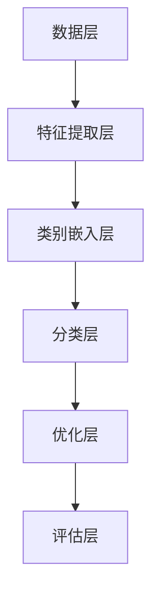
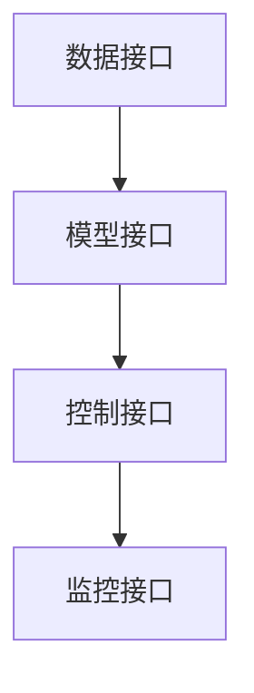
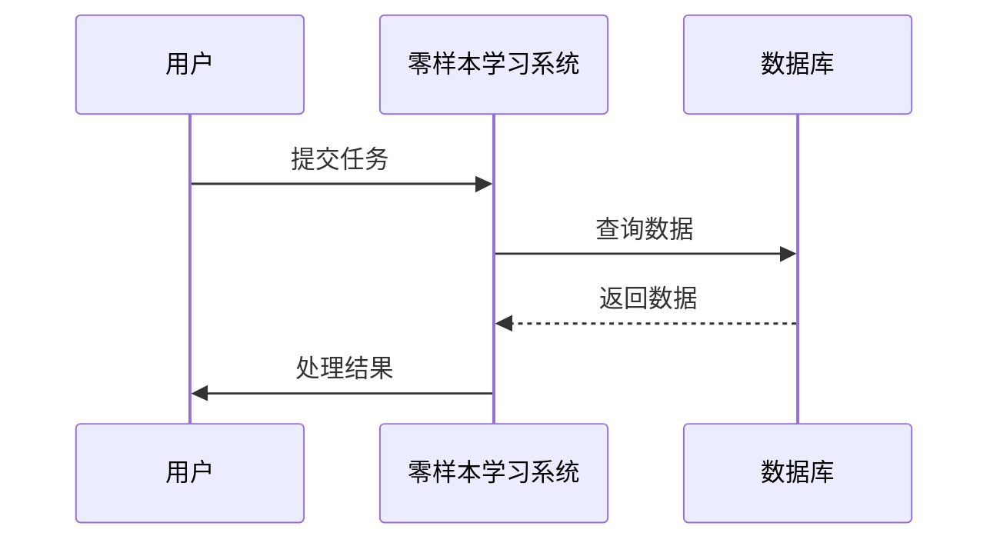
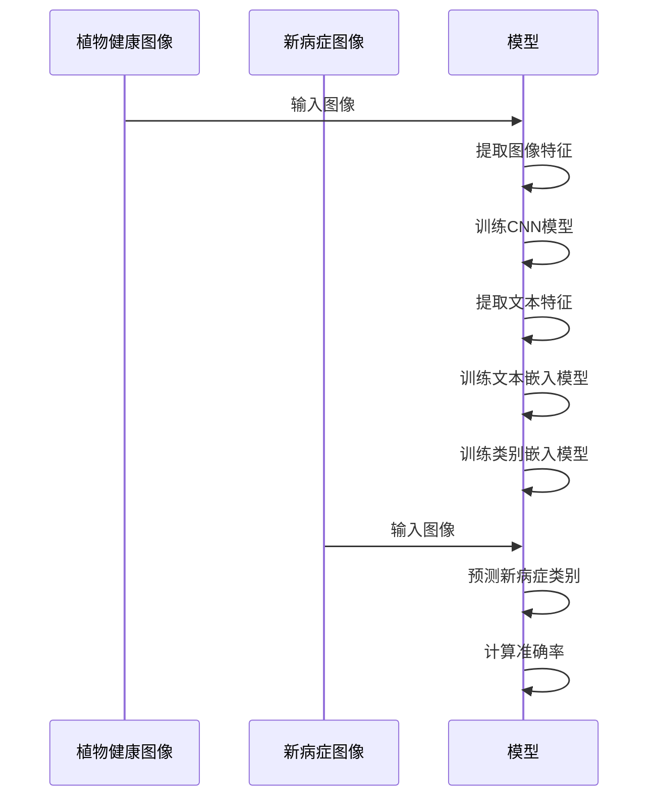

                 

### 1.1 问题背景

### 1.1.1 无监督学习的挑战

无监督学习作为机器学习领域的重要分支，旨在从未标记的数据中提取有用的模式和知识。在现实世界中，大量数据往往是非结构化或半结构化的，比如文本、图像、音频等，这些数据无法直接使用传统的监督学习方法处理。无监督学习在这种场景下显得尤为重要，但同时也面临着诸多挑战。

#### 数据稀缺问题

监督学习依赖于大量的已标注数据进行训练，而无监督学习则缺乏这些标注信息。数据稀缺导致模型难以从数据中学习到足够的模式和规律，从而影响了模型的泛化能力和性能。

#### 泛化能力问题

无监督学习模型在训练时，只能依赖于未标注的数据。这种情况下，模型很容易受到数据分布变化的影响，导致在未知数据上的表现不佳。如何提高无监督学习模型的泛化能力，是当前研究中的一个重要课题。

#### 模式识别与提取问题

无监督学习的一个核心目标是从数据中提取有意义的模式和结构。然而，如何有效地识别和提取这些模式，依然是一个具有挑战性的问题。特别是在高维、复杂数据集上，如何设计有效的算法来提取有用信息，是一个亟待解决的问题。

### 1.1.2 零样本学习与零样本迁移学习

#### 零样本学习（Zero-Shot Learning，ZSL）

零样本学习是一种特殊类型的无监督学习，它旨在处理从未见过类别的数据。在传统的机器学习中，模型通常需要大量的样本进行训练，而这些样本都是已知的类别。而在零样本学习中，模型需要能够在没有直接训练数据的情况下，对未知类别进行预测。这种能力在现实世界中具有重要意义，例如在新产品发布时，如何快速地对用户反馈进行分析和分类。

#### 零样本迁移学习（Zero-Shot Transfer Learning，ZTL）

零样本迁移学习是零样本学习的一个扩展，它利用已学习的知识来处理新任务。这种方法的核心思想是，将源域（已见过类别）的知识迁移到目标域（未见过类别）。零样本迁移学习可以显著提高模型的泛化能力，特别是在数据稀缺的场景中。

### 1.2 Zero-Shot CoT 的概念

#### 1.2.1 CoT 的基本原理

Zero-Shot CoT（Conceptual Taxonomy-based Zero-Shot Learning）是一种基于概念分类的零样本学习范式。其基本原理是，通过构建一个概念分类体系（Conceptual Taxonomy），将未知类别映射到已知的类别上，从而实现零样本学习。

#### 1.2.2 零样本学习的分类与对比

零样本学习可以按照不同的分类方法进行划分。其中，一种常见的分类方法是根据学习策略的不同，将零样本学习分为基于原型的方法、基于嵌入的方法和基于分类的方法。

- **基于原型的方法**：这种方法通过在已见过类别上学习原型，然后在未知类别上寻找与原型最相似的样本。代表性方法包括原型网络（Prototypical Networks）和匹配网络（Match Networks）。

- **基于嵌入的方法**：这种方法通过学习类别嵌入（Category Embeddings），将不同类别映射到低维空间中，从而实现未知类别的识别。代表性方法包括嵌入分类器（Embedding Classifiers）和深度嵌入分类器（Deep Embedding Classifiers）。

- **基于分类的方法**：这种方法首先训练一个分类器，然后在未知类别上应用这个分类器。代表性方法包括元学习（Meta-Learning）和模型蒸馏（Model Distillation）。

#### 1.2.3 零样本学习的现状与局限

零样本学习作为一种新兴的研究方向，已经取得了显著的进展。然而，目前仍然存在一些局限和挑战。

- **数据稀缺问题**：尽管概念分类体系可以帮助解决数据稀缺的问题，但构建一个完整和准确的分类体系本身就是一个挑战。

- **泛化能力问题**：零样本学习模型在未知类别上的性能很大程度上依赖于已见过类别的数据分布。如果数据分布差异较大，模型的泛化能力将受到严重影响。

- **计算资源需求**：零样本学习通常需要复杂的模型结构和大量的训练时间。这在大规模数据集上可能成为一个瓶颈。

### 1.3 Zero-Shot CoT 的核心机制

#### 1.3.1 类似性度量与聚类分析

在Zero-Shot CoT中，类似性度量与聚类分析是两个核心机制。类似性度量用于计算样本之间的相似程度，而聚类分析则用于将样本划分为不同的类别。这些机制有助于将未知类别映射到已知的类别上。

#### 1.3.2 多模态融合与特征提取

多模态融合与特征提取在Zero-Shot CoT中起着至关重要的作用。通过融合来自不同模态的数据（如图像和文本），可以提供更丰富的信息，从而提高模型的性能。特征提取则是从原始数据中提取出对任务最有用的信息。

#### 1.3.3 对比学习与自监督学习

对比学习与自监督学习是Zero-Shot CoT中的重要组成部分。对比学习通过比较不同样本之间的差异，可以提高模型的辨别能力。自监督学习则通过无监督的方式，利用数据中的内在结构来训练模型。

### 1.4 零样本学习在应用中的挑战与机遇

#### 1.4.1 数据稀缺性

零样本学习的一个主要挑战是数据稀缺性。在许多实际应用中，获取大量已标注的数据非常困难。因此，如何利用有限的标注数据来训练高效的模型，是一个重要的问题。

#### 1.4.2 算法复杂性

零样本学习通常需要复杂的模型结构和大量的训练时间。这在大规模数据集上可能成为一个瓶颈。因此，如何设计高效、可扩展的算法，是一个重要研究方向。

#### 1.4.3 应用场景多样性

零样本学习在各个领域都有广泛的应用。然而，不同的应用场景对模型的要求各不相同。因此，如何根据不同的应用场景，设计合适的模型和算法，是一个具有挑战性的问题。

### 1.5 本书结构安排与主要内容概述

#### 1.5.1 全书结构

本书分为两个部分。第一部分是零样本学习的理论基础，包括零样本学习的基本原理、核心挑战、研究方法等。第二部分是Zero-Shot CoT的核心技术，包括类似性度量与聚类分析、多模态融合与特征提取、对比学习与自监督学习等。

#### 1.5.2 每章主要内容

- **第一章**：介绍零样本学习的背景、概念和核心机制。
- **第二章**：详细讨论零样本学习的基本原理、核心挑战和研究方法。
- **第三章**：深入探讨Zero-Shot CoT的核心技术，包括类似性度量与聚类分析、多模态融合与特征提取、对比学习与自监督学习等。

### 1.6 小结

#### 1.6.1 零样本学习的重要性

零样本学习在处理数据稀缺、提高模型泛化能力等方面具有重要意义。它为许多现实世界中的问题提供了有效的解决方案。

#### 1.6.2 零样本学习的未来趋势

随着深度学习和多模态数据的不断发展，零样本学习有望在未来取得更大的突破。同时，如何解决数据稀缺性和算法复杂性等问题，也将是零样本学习研究的重要方向。

----------------------------------------------------------------

## 2.1 零样本学习的基本原理

### 2.1.1 零样本学习的定义与目标

零样本学习（Zero-Shot Learning, ZSL）是一种无监督学习技术，旨在解决传统机器学习模型在处理未见过类别时遇到的困难。在传统的机器学习框架中，模型的训练依赖于大量已标注的数据。然而，在现实世界的许多应用场景中，获取标注数据是非常困难的，例如在医学影像分析、植物病害检测等领域，标注数据的稀缺性限制了模型的应用。

零样本学习的核心目标是在没有直接训练数据的情况下，对未知类别进行分类。具体来说，零样本学习模型需要从已知的类别中学习到某种形式的“知识”，并利用这种知识对未见过类别进行预测。

### 2.1.2 零样本学习的数学模型

在数学模型层面，零样本学习通常可以分为以下几个步骤：

1. **类别嵌入**：首先，需要将不同的类别映射到一个共同的低维空间中。这一步通常通过训练一个嵌入模型来实现，如深度神经网络，使得不同类别在低维空间中形成独特的分布。

2. **特征提取**：对于每个样本，提取其特征表示。这些特征可以是原始数据的编码，如图像的像素值、文本的词嵌入等。

3. **相似性度量**：计算未知类别样本与已见过类别样本之间的相似性。相似性度量通常依赖于类别嵌入和样本特征提取的结果。

4. **分类预测**：基于相似性度量结果，对未知类别进行分类预测。常用的方法包括基于原型的方法（如原型网络）、基于嵌入的方法（如深度嵌入分类器）和基于分类的方法（如元学习）。

### 2.1.3 零样本学习的分类方法

零样本学习可以根据不同的分类方法进行划分。以下是几种常见的分类方法：

1. **基于原型的方法**：这种方法通过在已见过类别上学习原型，然后在未知类别上寻找与原型最相似的样本。代表性的算法包括原型网络（Prototypical Networks）和匹配网络（Match Networks）。

2. **基于嵌入的方法**：这种方法通过学习类别嵌入（Category Embeddings），将不同类别映射到低维空间中，从而实现未知类别的识别。代表性的算法包括嵌入分类器（Embedding Classifiers）和深度嵌入分类器（Deep Embedding Classifiers）。

3. **基于分类的方法**：这种方法首先训练一个分类器，然后在未知类别上应用这个分类器。代表性的算法包括元学习（Meta-Learning）和模型蒸馏（Model Distillation）。

### 2.1.4 零样本学习与传统监督学习、无监督学习的区别与联系

零样本学习与传统监督学习、无监督学习有以下几点区别和联系：

1. **数据需求**：传统监督学习依赖于大量已标注的数据，而无监督学习则不依赖于任何标注信息。零样本学习介于两者之间，它需要部分已知的类别数据进行训练，但不需要大量标注数据。

2. **目标差异**：传统监督学习的目标是提高在已知类别上的分类准确率，无监督学习的目标是从未标记的数据中提取有用的模式和结构。而零样本学习的目标是在没有直接训练数据的情况下，对未知类别进行分类。

3. **应用场景**：传统监督学习适用于有大量标注数据的场景，无监督学习适用于数据标注困难或成本高昂的场景。零样本学习则适用于数据标注稀缺，但部分类别数据可用的情况。

4. **技术联系**：零样本学习可以看作是传统监督学习和无监督学习的一种扩展。它借鉴了传统监督学习的类别嵌入思想，同时也借鉴了无监督学习的特征提取和聚类分析技术。

### 2.1.5 零样本学习的优势与应用前景

零样本学习的优势在于：

1. **减少数据依赖**：在数据稀缺的场景中，零样本学习能够有效利用有限的标注数据，提高模型的泛化能力。

2. **提高模型灵活性**：零样本学习模型可以适应新的、未见过类别，从而提高模型的灵活性和适应性。

3. **降低标注成本**：在许多应用场景中，获取标注数据是一项耗时且昂贵的任务。零样本学习能够降低对标注数据的依赖，从而降低标注成本。

零样本学习的应用前景非常广阔，包括但不限于以下领域：

1. **计算机视觉**：在图像分类、目标检测等任务中，零样本学习可以用于对新类别进行快速分类和识别。

2. **自然语言处理**：在文本分类、机器翻译等任务中，零样本学习可以用于处理从未见过的语言或词汇。

3. **医学影像**：在医学影像分析中，零样本学习可以用于对新病症或病变进行诊断。

4. **机器人感知**：在机器人感知任务中，零样本学习可以帮助机器人快速适应新的环境和情境。

通过上述对零样本学习基本原理的介绍，我们可以看到，零样本学习作为一种新兴的研究方向，已经在多个领域展现出其独特的价值和广阔的应用前景。在接下来的章节中，我们将进一步探讨零样本学习中的核心挑战、研究方法及其在实际应用中的挑战与机遇。

### 2.2 零样本学习的核心挑战

尽管零样本学习（Zero-Shot Learning, ZSL）在理论和技术上取得了显著进展，但其在实际应用中仍面临许多核心挑战。这些挑战不仅影响了零样本学习的性能，也限制了其在不同领域的广泛应用。以下是零样本学习所面临的主要挑战：

#### 2.2.1 数据稀缺问题

数据稀缺是零样本学习面临的最基本挑战之一。在许多实际应用中，获取已标注的数据是非常困难的，例如医学影像、植物病害检测等。这些领域的数据通常需要专业知识和大量时间进行标注，成本高昂。即使有部分已标注数据，可能也仅涵盖了一小部分类别，远不足以训练出一个高效、通用的模型。

**解决思路**：
- **元学习**：通过在多个任务上训练，使得模型能够适应新的、未见过类别。
- **数据增强**：利用数据增强技术，如图像翻转、裁剪、旋转等，来扩充训练数据。
- **数据合成**：通过生成对抗网络（GANs）等技术，生成与真实数据分布相似的合成数据。

#### 2.2.2 标签不足问题

即使在一些领域能够获取到部分已标注数据，这些数据可能仍然不足以支撑训练一个高性能的模型。特别是在类别繁多的情况下，每个类别都只有少数样本，这使得模型难以学习到每个类别的独特特征。

**解决思路**：
- **类别嵌入**：通过训练一个嵌入模型，将类别映射到一个低维空间，使得相似类别在空间中接近，从而利用少量的样本进行学习。
- **伪标签**：利用已知的类别数据，对未见过类别进行伪标签预测，然后使用这些伪标签数据进一步训练模型。
- **迁移学习**：通过将已学到的知识迁移到新的任务上，利用源域的数据来补充目标域的标签不足。

#### 2.2.3 泛化能力问题

零样本学习的另一个关键挑战是模型的泛化能力。由于模型在没有直接训练数据的情况下工作，其性能很大程度上依赖于已见过类别与未知类别之间的相似性。如果已见过类别与未知类别之间的分布差异较大，模型的泛化能力将显著下降。

**解决思路**：
- **对比学习**：通过比较已见过类别和未见过类别之间的差异，增强模型的辨别能力。
- **多任务学习**：在多个相关任务上训练模型，提高其在不同任务上的泛化能力。
- **模型蒸馏**：将一个大模型（教师模型）的知识转移到一个小模型（学生模型）上，从而提高学生模型对未知类别的泛化能力。

#### 2.2.4 零样本学习与其他机器学习方法的融合

零样本学习与其他机器学习方法（如监督学习、无监督学习、强化学习等）的融合，可以进一步提升其性能。然而，这种融合也带来了一些新的挑战。

**解决思路**：
- **混合模型**：设计混合模型，将不同学习方法的优势结合起来，例如将零样本学习与自监督学习相结合。
- **跨领域迁移学习**：利用跨领域的知识迁移，将其他领域的知识应用到零样本学习任务中。
- **多模态学习**：通过融合来自不同模态的数据（如图像、文本、声音等），提供更丰富的信息，从而提高模型的泛化能力。

#### 2.2.5 算法复杂性

零样本学习通常需要复杂的模型结构和大量的训练时间。这在大规模数据集上可能成为一个瓶颈。如何设计高效、可扩展的算法，是零样本学习研究的一个重要方向。

**解决思路**：
- **模型压缩**：通过模型压缩技术，如量化、剪枝、蒸馏等，减少模型的参数和计算量。
- **分布式训练**：利用分布式计算资源，如GPU集群、分布式存储等，加速模型的训练过程。
- **迁移学习与微调**：在已训练好的大模型基础上，通过迁移学习和微调，快速适应新的任务。

通过以上对零样本学习核心挑战的深入分析，我们可以看到，虽然零样本学习在处理数据稀缺、提高模型泛化能力等方面具有重要意义，但其在实际应用中仍面临诸多挑战。解决这些挑战需要结合多种技术手段，探索新的算法和模型，从而推动零样本学习在各个领域的广泛应用。

### 2.3 零样本学习的研究方法

零样本学习（Zero-Shot Learning, ZSL）的研究方法多种多样，旨在克服数据稀缺、标签不足和模型泛化能力等挑战。以下是几种主要的零样本学习研究方法：

#### 2.3.1 对比学习

对比学习（Contrastive Learning）是一种通过比较相似和不同的样本来学习的策略。在零样本学习中，对比学习的核心思想是通过最大化已见过类别和未见过类别之间的差异，最小化同类别的差异，从而提高模型对未知类别的辨别能力。

- **Siamese网络**：Siamese网络是一种特殊的对比学习模型，由两个对称的网络组成，输入两个样本，输出它们之间的相似性度量。通过训练，网络学会了区分不同类别之间的相似性和差异性。
- **Triplet损失函数**：Triplet损失函数是一种用于优化对比学习的损失函数，通过比较正样本和负样本之间的差异来更新模型参数。具体来说，给定一个正样本对（a, p），一个负样本对（a, n），Triplet损失函数的目标是最小化|a - p| - |a - n|的值。
- **原型网络**（Prototypical Networks）：原型网络是一种基于对比学习的零样本学习模型，其核心思想是将每个类别学习成一个原型，然后通过计算新样本与这些原型的距离来进行分类。

#### 2.3.2 自监督学习

自监督学习（Self-Supervised Learning）是一种无需外部标签，通过内部结构来学习的策略。在零样本学习中，自监督学习可以通过利用数据中的固有结构，为模型提供额外的监督信号，从而提高模型对未知类别的学习能力。

- **伪标签**：在自监督学习中，可以使用伪标签来指导模型的训练。伪标签是通过在已知的类别上预测得到的标签，虽然可能不完全准确，但可以作为训练过程中的额外监督信号。这种方法可以有效地利用未标记的数据，缓解数据稀缺问题。
- **数据增强**：数据增强是通过改变原始数据的方式，如图像翻转、裁剪、颜色变换等，来增加训练数据的多样性。自监督学习可以利用这些增强的数据来训练模型，提高模型的泛化能力。
- **无监督聚类**：无监督聚类算法（如K-means、层次聚类等）可以用于对数据进行聚类，从而为每个聚类分配一个伪标签。这些伪标签可以用于后续的零样本学习任务中。

#### 2.3.3 聚类分析

聚类分析（Clustering Analysis）是一种无监督学习方法，旨在将数据集划分为多个群组，使得同一个群组内的数据点之间具有较高的相似度，而不同群组之间的数据点之间具有较低的相似度。在零样本学习中，聚类分析可以用于发现数据中的隐含结构，从而为模型提供分类依据。

- **K-means算法**：K-means是一种基于距离度量的聚类算法，通过迭代优化聚类中心，将数据点分配到不同的群组中。K-means算法简单高效，但要求事先确定聚类数量K。
- **层次聚类**：层次聚类通过递归地将数据点合并成更高级别的群组，从而构建出一个层次化的聚类结构。层次聚类不需要事先确定聚类数量，但计算复杂度较高。
- **密度聚类**：密度聚类（如DBSCAN）通过考虑数据点的密度分布来进行聚类。DBSCAN算法能够识别出数据中的不同密度区域，并将其划分为不同的群组。

#### 2.3.4 多模态融合

多模态融合（Multimodal Fusion）是将来自不同模态的数据（如图像、文本、音频等）进行整合，以提供更丰富的信息，从而提高模型的性能。在零样本学习中，多模态融合可以帮助模型更好地理解数据的复杂性和多样性。

- **特征融合方法**：特征融合方法包括将不同模态的特征直接相加或相乘，以及利用深度学习模型将不同模态的特征进行整合。例如，通过训练一个多输入的多层神经网络，将图像特征和文本特征共同学习。
- **多任务学习**：多任务学习（Multi-Task Learning）通过在多个相关任务上同时训练模型，共享特征表示，从而提高模型对每个任务的泛化能力。在零样本学习中，多任务学习可以用于同时处理图像分类和文本分类任务。
- **注意力机制**：注意力机制（Attention Mechanism）可以用于动态调整不同模态特征的权重，从而提高融合效果。通过注意力机制，模型能够更加关注对当前任务最重要的模态信息。

#### 2.3.5 零样本学习的综合方法

在实际应用中，零样本学习往往结合多种方法来提高性能。以下是一些综合方法的例子：

- **元学习与对比学习结合**：通过元学习算法（如MAML、Reptile等）训练出可微调的模型，并结合对比学习技术，使得模型在少量样本上快速适应新类别。
- **自监督学习与聚类分析结合**：通过自监督学习生成伪标签，然后利用这些伪标签进行聚类分析，从而为模型提供更加准确的分类依据。
- **多模态融合与对比学习结合**：通过多模态融合技术，将不同模态的特征进行整合，并结合对比学习技术，提高模型对未知类别的辨别能力。

综上所述，零样本学习的研究方法多种多样，每种方法都有其独特的优势和局限性。通过结合不同的方法，可以有效地克服零样本学习中的核心挑战，提高模型的性能和应用效果。在接下来的章节中，我们将进一步探讨这些方法在实际应用中的具体实现和效果。

### 2.4 零样本学习中的相似性度量

在零样本学习（Zero-Shot Learning, ZSL）中，相似性度量（Similarity Measurement）是一个关键环节。它用于评估未知类别样本与已见过类别样本之间的相似程度，从而为分类提供依据。有效的相似性度量方法能够显著提高模型的分类性能。以下是几种常见的相似性度量方法及其应用场景：

#### 2.4.1 距离度量

距离度量（Distance Measurement）是相似性度量的基础。它通过计算样本之间的距离来评估相似性。以下是一些常用的距离度量方法：

- **欧几里得距离（Euclidean Distance）**：欧几里得距离是两点之间最直观的距离度量方法。在二维空间中，它表示两点之间的直线距离。在ZSL中，欧几里得距离常用于计算样本特征向量之间的相似性。

  $$d(p, q) = \sqrt{\sum_{i=1}^{n} (p_i - q_i)^2}$$

- **余弦相似性（Cosine Similarity）**：余弦相似性衡量的是两个向量在单位向量空间中的夹角余弦值。它特别适用于高维数据集，因为在高维空间中，欧几里得距离可能不具有实际意义。

  $$\text{Cosine Similarity}(p, q) = \frac{p \cdot q}{||p|| \cdot ||q||}$$

- **曼哈顿距离（Manhattan Distance）**：曼哈顿距离是两点之间在网格上的直线距离。在图像处理中，曼哈顿距离常用于计算像素之间的相似性。

  $$d(p, q) = \sum_{i=1}^{n} |p_i - q_i|$$

#### 2.4.2 相似性函数

相似性函数（Similarity Function）是一种更抽象的相似性度量方法，它不依赖于具体的距离度量，而是通过定义函数来评估相似性。以下是一些常见的相似性函数：

- **皮尔逊相关系数（Pearson Correlation Coefficient）**：皮尔逊相关系数衡量的是两个变量之间的线性相关性。在ZSL中，皮尔逊相关系数常用于评估类别嵌入向量之间的相似性。

  $$r(p, q) = \frac{\sum_{i=1}^{n} (p_i - \bar{p})(q_i - \bar{q})}{\sqrt{\sum_{i=1}^{n} (p_i - \bar{p})^2 \sum_{i=1}^{n} (q_i - \bar{q})^2}}$$

- **点积相似性（Dot Product Similarity）**：点积相似性衡量的是两个向量的点积大小。它实际上是余弦相似性的特例，适用于向量空间中的度量。

  $$\text{Dot Product Similarity}(p, q) = p \cdot q$$

#### 2.4.3 模型评价标准

在零样本学习任务中，选择合适的相似性度量方法并对其进行评价是一个重要问题。以下是一些常用的模型评价标准：

- **准确率（Accuracy）**：准确率是分类模型性能的最直接指标，它衡量的是模型正确分类的样本数占总样本数的比例。

  $$\text{Accuracy} = \frac{\text{正确分类的样本数}}{\text{总样本数}}$$

- **召回率（Recall）**：召回率衡量的是模型能够从所有实际为正类的样本中正确识别出的比例。

  $$\text{Recall} = \frac{\text{正确分类的正类样本数}}{\text{总正类样本数}}$$

- **精确率（Precision）**：精确率衡量的是模型从所有预测为正类的样本中，真正为正类的比例。

  $$\text{Precision} = \frac{\text{正确分类的正类样本数}}{\text{预测为正类的样本数}}$$

- **F1分数（F1 Score）**：F1分数是精确率和召回率的调和平均值，综合衡量了模型的分类性能。

  $$\text{F1 Score} = 2 \times \frac{\text{Precision} \times \text{Recall}}{\text{Precision} + \text{Recall}}$$

- **ROC曲线和AUC（Area Under Curve）**：ROC曲线和AUC是评估分类模型性能的另一种方式。ROC曲线展示了在不同阈值下，模型真正例率和假正例率的关系。AUC是ROC曲线下的面积，用于衡量模型的判别能力。

通过以上对相似性度量方法及其应用场景和模型评价标准的详细讨论，我们可以看到，零样本学习中的相似性度量是一个复杂且关键的问题。选择合适的相似性度量方法并对其进行细致的评价，是确保零样本学习模型性能的重要步骤。在接下来的章节中，我们将继续探讨零样本学习中的其他关键技术和应用。

### 2.5 零样本学习在特定领域的应用

零样本学习（Zero-Shot Learning, ZSL）在多个领域展现了其独特的应用价值，尤其是在数据稀缺或标注困难的场景中。以下是零样本学习在计算机视觉、自然语言处理、语音识别和医学影像等领域的具体应用实例：

#### 2.5.1 计算机视觉

在计算机视觉领域，零样本学习被广泛应用于图像分类、目标检测和语义分割等任务。以下是一些典型应用实例：

- **图像分类**：零样本学习可以在没有直接标注数据的情况下，对从未见过的类别进行分类。例如，在植物病害检测中，可以利用零样本学习模型对新病症进行快速识别和分类，从而提高检测效率和准确性。

- **目标检测**：零样本学习可以用于检测和识别图像中的未见过对象。例如，在自动驾驶系统中，零样本学习可以帮助车辆识别道路上的各种障碍物，包括从未见过的车辆、行人等。

- **语义分割**：在医疗影像分析中，零样本学习可以用于对图像中的病变区域进行分割。例如，在乳腺癌筛查中，零样本学习模型可以识别和分割从未见过的乳腺病变区域，从而提高诊断准确性。

#### 2.5.2 自然语言处理

自然语言处理（Natural Language Processing, NLP）是零样本学习的一个重要应用领域。以下是一些典型应用实例：

- **文本分类**：零样本学习可以在没有标注数据的情况下，对文本进行分类。例如，在社交媒体分析中，零样本学习模型可以识别和分类从未见过的评论和帖子，从而帮助平台进行内容审核和推荐。

- **机器翻译**：零样本学习可以用于翻译从未见过的语言对。例如，在实时翻译服务中，零样本学习模型可以在没有直接翻译数据的情况下，通过迁移学习技术，快速适应新的语言对，从而提高翻译准确性和实时性。

- **问答系统**：在智能客服和问答系统中，零样本学习可以帮助模型理解和回答从未见过的用户问题。例如，通过训练一个零样本学习模型，客服机器人可以回答用户关于新产品或服务的咨询，从而提高用户体验和满意度。

#### 2.5.3 语音识别

语音识别（Speech Recognition）领域也受益于零样本学习。以下是一些典型应用实例：

- **语音分类**：零样本学习可以用于对语音信号进行分类，例如在语音助手系统中，零样本学习模型可以识别和分类用户从未听过的语音指令，从而提高语音识别的准确性和可靠性。

- **说话人识别**：零样本学习可以用于识别从未见过的说话人。例如，在安全认证系统中，零样本学习模型可以识别用户的新语音样本，从而提高系统对未注册用户的识别能力。

- **语音增强**：零样本学习可以用于去除语音信号中的噪声和干扰，从而提高语音质量。例如，在远程会议系统中，零样本学习模型可以识别并消除环境噪声，从而提高语音的清晰度和可听性。

#### 2.5.4 医学影像

在医学影像领域，零样本学习被广泛应用于疾病检测、诊断和治疗建议等任务。以下是一些典型应用实例：

- **疾病检测**：零样本学习可以用于检测从未见过的疾病标志物。例如，在肺癌筛查中，零样本学习模型可以检测出从未见过的肺癌标志物，从而提高早期检测的准确率和效率。

- **诊断**：零样本学习可以用于对医学影像进行诊断。例如，在医学影像分析中，零样本学习模型可以识别出从未见过的病变区域，从而提高诊断准确性和效率。

- **个性化治疗建议**：零样本学习可以用于为患者提供个性化的治疗方案。例如，通过分析患者的医学影像数据和基因组数据，零样本学习模型可以推荐最适合患者的治疗方案，从而提高治疗效果。

综上所述，零样本学习在多个领域展现了其广泛的应用价值。通过结合具体领域的特点，零样本学习可以有效地解决数据稀缺和标注困难等问题，从而提高模型性能和实用性。在未来的发展中，零样本学习有望在更多领域得到应用，并带来更多的创新和突破。

### 2.6 零样本学习的未来发展

零样本学习（Zero-Shot Learning, ZSL）作为一种新兴的机器学习技术，已经在多个领域展现出其独特的优势和潜力。然而，随着技术的不断进步和应用场景的日益复杂，零样本学习仍面临许多亟待解决的问题。以下是零样本学习在未来发展过程中可能遇到的技术瓶颈、应用拓展以及社会与伦理问题。

#### 2.6.1 技术瓶颈

1. **数据稀缺问题**：尽管已有研究提出多种方法来缓解数据稀缺问题，如数据增强、元学习和数据合成等，但在实际应用中，如何获取足够且多样化的训练数据仍然是一个挑战。特别是在医学影像、基因组学等领域，获取标注数据需要耗费大量时间和资源。

2. **模型复杂性与计算资源**：零样本学习通常需要复杂的模型结构和大量的训练时间。在大规模数据集上，这可能导致计算资源不足，从而影响模型的训练效率和性能。

3. **泛化能力**：零样本学习模型在未知类别上的性能很大程度上依赖于已见过类别数据的分布。如果数据分布差异较大，模型的泛化能力将显著下降，从而影响实际应用效果。

4. **类别映射问题**：在零样本学习中，如何有效地将未知类别映射到已见过类别上是一个关键问题。现有的方法在构建概念分类体系时可能存在偏差，导致映射不准确。

#### 2.6.2 应用拓展

1. **跨领域应用**：随着技术的进步，零样本学习有望在更多领域得到应用。例如，在金融领域，零样本学习可以用于欺诈检测、信用评分等；在物联网领域，可以用于设备故障预测和异常检测。

2. **多模态学习**：随着多模态数据的日益普及，如何有效地融合来自不同模态的数据（如图像、文本、音频等）以提高模型性能，是未来研究的重点。

3. **实时应用**：在实时系统中，如何快速地训练和部署零样本学习模型，以实现实时响应，是一个重要的研究方向。

#### 2.6.3 社会与伦理问题

1. **数据隐私**：在应用零样本学习时，如何保护用户数据隐私是一个重要问题。特别是在医疗和金融领域，用户数据非常敏感，需要采取严格的隐私保护措施。

2. **算法偏见**：零样本学习模型的性能依赖于已见过类别数据的分布。如果数据存在偏见，模型可能会放大这种偏见，从而导致不公平的决策。如何避免算法偏见，确保模型的公平性和透明性，是未来研究的一个重要方向。

3. **责任归属**：在零样本学习应用中，当模型出现错误时，如何确定责任归属是一个复杂的问题。特别是在自动化系统中，如何确保系统的安全性和可靠性，是一个亟待解决的问题。

综上所述，零样本学习在未来发展过程中将面临许多技术瓶颈、应用拓展以及社会与伦理问题。解决这些问题需要多学科合作，结合人工智能、数据科学、伦理学等领域的知识，从而推动零样本学习在更多领域的应用，实现其潜在的社会价值。

### 2.7 小结

#### 2.7.1 零样本学习的重要性

零样本学习（Zero-Shot Learning, ZSL）作为一种新兴的机器学习技术，在数据稀缺、标注困难以及需要高泛化能力的应用场景中展现出了独特的价值。其核心目标是在没有直接训练数据的情况下，对未知类别进行有效分类。零样本学习的重要性体现在以下几个方面：

1. **缓解数据稀缺问题**：在许多领域，如医学影像、植物病害检测等，获取大量已标注的数据非常困难。零样本学习可以利用有限的标注数据，提高模型的泛化能力，从而解决数据稀缺问题。

2. **提高模型灵活性**：零样本学习模型能够适应新的、未见过类别，从而提高模型的灵活性和适应性。这在产品发布、新病症诊断等场景中具有重要意义。

3. **降低标注成本**：在获取标注数据时，往往需要耗费大量时间和资源。零样本学习可以降低对标注数据的依赖，从而显著降低标注成本，提高效率。

#### 2.7.2 零样本学习的未来趋势

随着技术的不断进步，零样本学习在未来将面临许多新的机遇和挑战。以下是零样本学习未来可能的发展趋势：

1. **多模态融合**：随着多模态数据的日益普及，如何有效地融合来自不同模态的数据（如图像、文本、音频等）以提高模型性能，是未来研究的一个重要方向。

2. **跨领域迁移学习**：通过跨领域迁移学习，将其他领域的知识应用到零样本学习任务中，可以进一步提高模型的泛化能力。

3. **实时应用**：在实时系统中，如何快速地训练和部署零样本学习模型，以实现实时响应，是一个重要的研究方向。

4. **社会与伦理问题**：随着零样本学习的广泛应用，如何保护用户数据隐私、避免算法偏见、确保系统的公平性和透明性，将成为未来研究的一个重要方向。

总之，零样本学习作为一种有前景的机器学习技术，具有广泛的应用价值。在未来的发展中，零样本学习需要克服技术瓶颈、拓展应用场景，并解决社会与伦理问题，从而实现其潜在的社会价值。

### 3.1 类似性度量与聚类分析

在零样本学习（Zero-Shot Learning, ZSL）中，类似性度量与聚类分析是两个核心机制，它们共同作用，帮助模型更好地理解和处理未知类别。类似性度量用于评估样本之间的相似程度，而聚类分析则用于将样本划分为不同的类别。下面将详细介绍这两种机制的基本原理、常用算法以及它们在零样本学习中的应用。

#### 3.1.1 类似性度量的基本原理

类似性度量（Similarity Measurement）是评估样本之间相似程度的一种方法。在零样本学习中，通过计算未知类别样本与已见过类别样本之间的相似性，可以帮助模型进行分类。以下是几种常用的相似性度量方法：

1. **欧几里得距离（Euclidean Distance）**：欧几里得距离是两点之间最直观的距离度量方法。在二维空间中，它表示两点之间的直线距离。在ZSL中，欧几里得距离常用于计算样本特征向量之间的相似性。

   $$d(p, q) = \sqrt{\sum_{i=1}^{n} (p_i - q_i)^2}$$

2. **余弦相似性（Cosine Similarity）**：余弦相似性衡量的是两个向量在单位向量空间中的夹角余弦值。它特别适用于高维数据集，因为在高维空间中，欧几里得距离可能不具有实际意义。

   $$\text{Cosine Similarity}(p, q) = \frac{p \cdot q}{||p|| \cdot ||q||}$$

3. **曼哈顿距离（Manhattan Distance）**：曼哈顿距离是两点之间在网格上的直线距离。在图像处理中，曼哈顿距离常用于计算像素之间的相似性。

   $$d(p, q) = \sum_{i=1}^{n} |p_i - q_i|$$

4. **皮尔逊相关系数（Pearson Correlation Coefficient）**：皮尔逊相关系数衡量的是两个变量之间的线性相关性。在ZSL中，皮尔逊相关系数常用于评估类别嵌入向量之间的相似性。

   $$r(p, q) = \frac{\sum_{i=1}^{n} (p_i - \bar{p})(q_i - \bar{q})}{\sqrt{\sum_{i=1}^{n} (p_i - \bar{p})^2 \sum_{i=1}^{n} (q_i - \bar{q})^2}}$$

#### 3.1.2 聚类分析算法

聚类分析（Clustering Analysis）是一种无监督学习方法，旨在将数据集划分为多个群组，使得同一个群组内的数据点之间具有较高的相似度，而不同群组之间的数据点之间具有较低的相似度。在零样本学习中，聚类分析可以用于发现数据中的隐含结构，从而为模型提供分类依据。以下是几种常用的聚类算法：

1. **K-means算法**：K-means算法是一种基于距离度量的聚类算法，通过迭代优化聚类中心，将数据点分配到不同的群组中。K-means算法简单高效，但要求事先确定聚类数量K。

2. **层次聚类**：层次聚类通过递归地将数据点合并成更高级别的群组，从而构建出一个层次化的聚类结构。层次聚类不需要事先确定聚类数量，但计算复杂度较高。

3. **密度聚类**：密度聚类（如DBSCAN）通过考虑数据点的密度分布来进行聚类。DBSCAN算法能够识别出数据中的不同密度区域，并将其划分为不同的群组。

#### 3.1.3 类似性度量与聚类分析在Zero-Shot CoT中的应用

在Zero-Shot Conceptual Taxonomy（Zero-Shot CoT）中，类似性度量与聚类分析发挥着至关重要的作用。Zero-Shot CoT通过构建一个概念分类体系（Conceptual Taxonomy），将未知类别映射到已知的类别上，从而实现零样本学习。

1. **类别嵌入与相似性度量**：在Zero-Shot CoT中，首先通过训练一个嵌入模型，将类别映射到一个低维空间中。然后，使用相似性度量方法计算未知类别样本与已见过类别样本之间的相似性。这种相似性度量可以基于欧几里得距离、余弦相似性等。

2. **聚类分析与类别划分**：基于相似性度量结果，使用聚类分析算法（如K-means、层次聚类等）将数据点划分为不同的类别。这些类别可以看作是概念分类体系中的不同层级，从而实现未知类别的识别。

3. **多模态融合与特征提取**：在Zero-Shot CoT中，通过融合来自不同模态的数据（如图像、文本等），可以提供更丰富的信息，从而提高模型的性能。特征提取则是从原始数据中提取出对任务最有用的信息。

4. **对比学习与自监督学习**：对比学习与自监督学习在Zero-Shot CoT中也是核心机制之一。通过比较不同样本之间的差异，可以增强模型的辨别能力。自监督学习则通过无监督的方式，利用数据中的内在结构来训练模型。

通过上述对类似性度量与聚类分析的基本原理、常用算法及其在Zero-Shot CoT中的应用的详细讨论，我们可以看到，这些机制在零样本学习中扮演着关键角色。它们共同作用，帮助模型更好地理解和处理未知类别，从而实现高效的分类和识别。

#### 3.1.4 类似性度量与聚类分析在实际应用中的案例分析

为了更好地理解类似性度量与聚类分析在零样本学习中的实际应用，我们可以通过一些具体的应用案例来进行详细分析。

**案例一：图像分类**

在图像分类任务中，类似性度量与聚类分析可以用于处理从未见过的类别。以下是一个具体案例：

1. **数据集准备**：假设我们有一个包含不同类别的图像数据集，其中已见过类别和未知类别都有。例如，数据集包括动物类别，如猫、狗、鸟等，以及一些未见过的新动物类别。

2. **类别嵌入与相似性度量**：首先，通过训练一个深度神经网络（如VGG16或ResNet）来提取图像特征。然后，将每个类别的特征映射到一个低维空间中，形成一个类别嵌入模型。接着，使用余弦相似性度量计算未知类别图像与已见过类别图像之间的相似性。

3. **聚类分析与类别划分**：基于相似性度量结果，使用K-means聚类算法将图像划分为不同的类别。这些类别可以看作是概念分类体系中的不同层级，从而实现从未见过类别图像的识别。

**案例二：文本分类**

在文本分类任务中，类似性度量与聚类分析同样可以发挥重要作用。以下是一个具体案例：

1. **数据集准备**：假设我们有一个包含不同类别的文本数据集，包括已见过的政治、经济、科技等类别，以及一些未见过的新类别。

2. **词嵌入与相似性度量**：首先，通过训练一个词嵌入模型（如Word2Vec或BERT）来提取文本特征。然后，将每个类别的特征映射到一个低维空间中，形成一个类别嵌入模型。接着，使用余弦相似性度量计算未知类别文本与已见过类别文本之间的相似性。

3. **聚类分析与类别划分**：基于相似性度量结果，使用K-means聚类算法将文本划分为不同的类别。这些类别可以看作是概念分类体系中的不同层级，从而实现从未见过类别文本的识别。

**案例三：医学影像**

在医学影像任务中，类似性度量与聚类分析可以用于诊断从未见过的病症。以下是一个具体案例：

1. **数据集准备**：假设我们有一个包含不同病症的医学影像数据集，包括已见过的肺炎、肺癌、乳腺癌等，以及一些未见过的新病症。

2. **特征提取与相似性度量**：首先，通过训练一个深度神经网络（如U-Net或3D-CNN）来提取影像特征。然后，使用余弦相似性度量计算未知病症影像与已见过病症影像之间的相似性。

3. **聚类分析与类别划分**：基于相似性度量结果，使用K-means聚类算法将影像划分为不同的类别。这些类别可以看作是概念分类体系中的不同层级，从而实现从未见过病症影像的识别。

通过上述案例分析，我们可以看到，类似性度量与聚类分析在零样本学习中的实际应用具有很大的潜力。这些方法可以有效地处理从未见过的类别，从而提高模型在数据稀缺和标注困难场景下的性能。

#### 3.1.5 类似性度量与聚类分析的效果评估

为了评估类似性度量与聚类分析在零样本学习中的效果，我们可以使用多种指标进行评价。以下是一些常用的评价指标：

1. **准确率（Accuracy）**：准确率衡量的是模型正确分类的样本数占总样本数的比例。它是评估分类模型性能的最直接指标。

   $$\text{Accuracy} = \frac{\text{正确分类的样本数}}{\text{总样本数}}$$

2. **召回率（Recall）**：召回率衡量的是模型能够从所有实际为正类的样本中正确识别出的比例。它特别适用于评估在数据稀缺情况下的模型性能。

   $$\text{Recall} = \frac{\text{正确分类的正类样本数}}{\text{总正类样本数}}$$

3. **精确率（Precision）**：精确率衡量的是模型从所有预测为正类的样本中，真正为正类的比例。它用于评估模型的分类精度。

   $$\text{Precision} = \frac{\text{正确分类的正类样本数}}{\text{预测为正类的样本数}}$$

4. **F1分数（F1 Score）**：F1分数是精确率和召回率的调和平均值，综合衡量了模型的分类性能。

   $$\text{F1 Score} = 2 \times \frac{\text{Precision} \times \text{Recall}}{\text{Precision} + \text{Recall}}$$

通过上述评价指标，我们可以全面评估类似性度量与聚类分析在零样本学习中的应用效果。在实际应用中，可以根据具体情况选择合适的指标进行评价。

总之，类似性度量与聚类分析在零样本学习中具有重要作用。通过详细分析其基本原理、常用算法、实际应用案例以及效果评估指标，我们可以更好地理解其在零样本学习中的应用价值。随着技术的不断进步，类似性度量与聚类分析有望在更多领域发挥更大的作用，推动零样本学习的发展。

### 3.2 多模态融合与特征提取

在零样本学习（Zero-Shot Learning, ZSL）中，多模态融合与特征提取是两个关键环节。多模态融合旨在将来自不同模态的数据（如图像、文本、音频等）进行整合，以提供更丰富的信息，从而提高模型的性能。特征提取则是从原始数据中提取出对任务最有用的信息。以下将详细介绍多模态融合与特征提取的基本原理、方法以及它们在Zero-Shot CoT中的应用。

#### 3.2.1 多模态数据的基本概念

多模态数据是指由多个不同模态的数据源组成的数据集。常见的模态包括：

- **图像**：图像数据是最直观的多模态数据之一，包括彩色图像、灰度图像等。图像数据在计算机视觉任务中具有广泛的应用。
- **文本**：文本数据包括自然语言文本，如文章、评论、对话等。文本数据在自然语言处理（NLP）任务中至关重要。
- **音频**：音频数据包括语音信号、音乐、环境音等。音频数据在语音识别、音乐推荐等领域有重要应用。
- **视频**：视频数据是连续的图像序列，可以包含图像、音频等多种信息。视频数据在视频分析、视频分类等任务中有广泛应用。

多模态数据融合的目标是通过整合不同模态的数据，提供更全面的信息，从而提高模型性能和任务完成效果。

#### 3.2.2 特征提取方法

特征提取（Feature Extraction）是从原始数据中提取出对任务最有用的信息的过程。以下是一些常用的特征提取方法：

1. **图像特征提取**：
   - **卷积神经网络（CNN）**：CNN是图像特征提取的一种有效方法。通过多层卷积操作，CNN能够提取出图像的层次特征，从而为后续分类或检测任务提供强有力的支持。
   - **深度学习模型**：除了CNN，深度学习模型如ResNet、Inception等也被广泛应用于图像特征提取。
   - **手工特征**：如SIFT、HOG等手工特征在图像特征提取中也具有一定应用。

2. **文本特征提取**：
   - **词嵌入**：词嵌入（Word Embedding）是将文本中的词语映射到低维空间中的向量表示。常见的词嵌入模型包括Word2Vec、GloVe等。
   - **TF-IDF**：TF-IDF（Term Frequency-Inverse Document Frequency）是一种常用的文本特征提取方法，通过计算词在文档中的重要程度，为文本分类和聚类提供支持。

3. **音频特征提取**：
   - **梅尔频率倒谱系数（MFCC）**：MFCC是音频特征提取的一种常用方法，特别适用于语音识别和音乐分类任务。
   - **频谱特征**：如频谱图、频谱矩等也是常用的音频特征提取方法。

4. **视频特征提取**：
   - **帧级特征提取**：通过对视频帧进行图像特征提取，可以得到视频的帧级特征。
   - **时空特征提取**：通过结合时间和空间信息，提取出视频的时空特征，如光流特征、运动向量等。

#### 3.2.3 多模态融合算法

多模态融合（Multimodal Fusion）是将来自不同模态的数据进行整合的过程。以下是一些常用的多模态融合算法：

1. **传统融合方法**：
   - **特征级融合**：在特征级融合中，将不同模态的特征向量进行拼接或融合，以提供更全面的信息。
   - **决策级融合**：在决策级融合中，首先对每个模态的数据进行独立分类，然后根据分类结果进行投票或加权平均，以得出最终分类结果。

2. **深度学习融合方法**：
   - **多输入多输出网络（MIMO）**：MIMO网络通过同时接受多个输入模态的数据，并输出多个特征，从而实现多模态融合。
   - **多模态卷积网络（Multimodal CNN）**：多模态CNN通过在图像、文本等不同模态上分别应用卷积操作，然后进行特征融合。
   - **多模态循环神经网络（Multimodal RNN）**：多模态RNN通过结合不同模态的时序信息，实现多模态特征融合。

3. **基于注意力的融合方法**：
   - **注意力机制**：注意力机制（Attention Mechanism）可以用于动态调整不同模态特征的权重，从而提高融合效果。通过注意力机制，模型能够更加关注对当前任务最重要的模态信息。

#### 3.2.4 多模态融合与特征提取在Zero-Shot CoT中的应用

在Zero-Shot Conceptual Taxonomy（Zero-Shot CoT）中，多模态融合与特征提取起着至关重要的作用。以下是如何在实际应用中利用这些技术的示例：

1. **图像与文本融合**：
   - **多模态嵌入**：通过训练一个多模态嵌入模型，将图像特征和文本特征映射到一个共同的低维空间中。
   - **特征级融合**：将图像特征和文本特征进行拼接，形成一个更丰富的特征向量，然后送入分类器进行分类。

2. **图像与音频融合**：
   - **多模态特征提取**：通过分别提取图像特征和音频特征，如使用CNN提取图像特征，使用MFCC提取音频特征。
   - **决策级融合**：在分类阶段，将图像和音频的分类结果进行投票或加权平均，以得出最终的分类结果。

3. **图像与视频融合**：
   - **时空特征提取**：通过提取视频的帧级特征和时空特征，如使用CNN提取图像特征，使用光流特征提取时空特征。
   - **特征级融合**：将图像特征和时空特征进行拼接，形成一个更丰富的特征向量，然后送入分类器进行分类。

通过上述对多模态融合与特征提取的基本原理、方法以及在实际应用中的详细讨论，我们可以看到，这些技术在Zero-Shot CoT中具有广泛的应用潜力。通过有效地融合不同模态的数据，可以提供更丰富的信息，从而提高模型的性能和分类准确性。随着技术的不断进步，多模态融合与特征提取有望在更多领域发挥更大的作用，推动零样本学习的发展。

### 3.3 对比学习与自监督学习

在零样本学习（Zero-Shot Learning, ZSL）中，对比学习（Contrastive Learning）与自监督学习（Self-Supervised Learning）是两种关键的技术手段。它们通过不同的机制提高模型对未知类别的辨别能力和泛化能力，从而实现高效的分类和识别。下面将详细介绍对比学习与自监督学习的基本原理、方法以及它们在Zero-Shot CoT中的应用。

#### 3.3.1 对比学习的基本原理

对比学习（Contrastive Learning）是一种通过最大化正样本和负样本之间的差异，同时最小化同类样本之间的差异来学习的策略。在零样本学习中，对比学习的核心思想是通过学习区分已见过类别和未见过类别之间的差异，从而提高模型对未知类别的辨别能力。

1. **Siamese网络**：Siamese网络是一种典型的对比学习模型，由两个对称的网络组成，输入两个样本，输出它们之间的相似性度量。Siamese网络的核心在于通过训练使得两个网络输出相似性度量的差异最小。

2. **Triplet损失函数**：Triplet损失函数是一种用于优化对比学习的损失函数，通过比较正样本和负样本之间的差异来更新模型参数。给定一个正样本对（a, p）和一个负样本对（a, n），Triplet损失函数的目标是最小化|a - p| - |a - n|的值。这种方法能够使得模型学习到更好地区分正样本和负样本。

3. **原型网络**（Prototypical Networks）：原型网络是一种基于对比学习的零样本学习模型，其核心思想是将每个类别学习成一个原型，然后通过计算新样本与这些原型的距离来进行分类。原型网络通过优化原型表示，使得不同类别之间的原型差异最大化。

#### 3.3.2 自监督学习的基本原理

自监督学习（Self-Supervised Learning）是一种无需外部标签，通过内部结构来学习的策略。在零样本学习中，自监督学习可以通过利用数据中的固有结构，为模型提供额外的监督信号，从而提高模型对未知类别的学习能力。

1. **伪标签**：在自监督学习中，可以使用伪标签来指导模型的训练。伪标签是通过在已知的类别上预测得到的标签，虽然可能不完全准确，但可以作为训练过程中的额外监督信号。这种方法可以有效地利用未标记的数据，缓解数据稀缺问题。

2. **数据增强**：数据增强是通过改变原始数据的方式，如图像翻转、裁剪、颜色变换等，来增加训练数据的多样性。自监督学习可以利用这些增强的数据来训练模型，提高模型的泛化能力。

3. **无监督聚类**：无监督聚类算法（如K-means、层次聚类等）可以用于对数据进行聚类，从而为每个聚类分配一个伪标签。这些伪标签可以用于后续的零样本学习任务中。

#### 3.3.3 对比学习与自监督学习在Zero-Shot CoT中的应用

在Zero-Shot Conceptual Taxonomy（Zero-Shot CoT）中，对比学习与自监督学习通过不同的机制共同作用，提高模型对未知类别的辨别能力和泛化能力。

1. **对比学习在类别嵌入中的应用**：
   - **原型网络**：在Zero-Shot CoT中，原型网络通过学习每个类别的原型表示，从而实现未知类别的识别。原型网络通过对比学习优化原型表示，使得不同类别之间的原型差异最大化，从而提高模型的辨别能力。
   - **Siamese网络**：Siamese网络可以用于在类别嵌入阶段区分已见过类别和未见过类别。通过训练Siamese网络，模型能够学习到如何有效地识别新类别，从而提高分类性能。

2. **自监督学习在特征提取中的应用**：
   - **伪标签**：在Zero-Shot CoT中，自监督学习可以通过生成伪标签来为模型提供额外的监督信号。这些伪标签可以用于后续的分类任务，从而提高模型的泛化能力。
   - **数据增强**：通过数据增强技术，如图像翻转、裁剪等，可以增加训练数据的多样性，从而提高模型的泛化能力。
   - **无监督聚类**：无监督聚类算法可以用于发现数据中的隐含结构，为模型提供聚类标签。这些标签可以用于后续的零样本学习任务中，从而提高分类性能。

3. **多模态融合与对比学习、自监督学习**：
   - **多模态嵌入**：通过多模态嵌入，将不同模态的数据（如图像、文本等）映射到一个共同的低维空间中。然后，利用对比学习与自监督学习技术，可以进一步提高模型的辨别能力和泛化能力。
   - **多任务学习**：通过结合多个相关任务（如图像分类和文本分类），可以实现多任务学习。这种多任务学习可以共享特征表示，提高模型在不同任务上的泛化能力。

综上所述，对比学习与自监督学习在Zero-Shot CoT中通过不同的机制共同作用，提高了模型对未知类别的辨别能力和泛化能力。通过结合对比学习与自监督学习技术，可以有效地处理从未见过的类别，从而实现高效的分类和识别。

### 3.4 零样本学习中的系统分析与架构设计

零样本学习（Zero-Shot Learning, ZSL）作为机器学习领域的重要研究方向，在许多实际应用中具有广泛的应用前景。为了更好地实现零样本学习的目标，我们需要对整个系统进行深入的分析和架构设计。以下将从系统功能设计、系统架构设计、系统接口设计和系统交互等多个方面，详细阐述零样本学习系统的设计过程。

#### 3.4.1 问题场景介绍

在许多领域，如医学影像分析、植物病害检测、新物种识别等，标注数据的获取是非常困难且昂贵的。这些领域往往存在大量的未标记数据，但直接利用这些数据训练传统的机器学习模型是非常具有挑战性的。零样本学习作为一种无监督学习技术，可以在没有直接训练数据的情况下，对从未见过的类别进行有效分类。因此，设计一个高效的零样本学习系统，能够解决这些领域的数据稀缺和标注困难问题，具有重要的现实意义。

#### 3.4.2 系统功能设计

零样本学习系统的核心功能主要包括以下几个部分：

1. **数据预处理**：包括数据清洗、数据增强等，旨在提高数据质量和丰富度。
2. **特征提取**：通过深度学习模型提取数据的高层次特征，为后续分类提供支持。
3. **类别嵌入**：将每个类别映射到一个低维空间中，形成类别嵌入表示。
4. **分类预测**：基于类别嵌入和特征提取结果，对未知类别进行分类预测。
5. **模型评估**：通过准确率、召回率等指标，评估零样本学习系统的性能。

#### 3.4.3 系统架构设计

零样本学习系统的架构设计需要考虑如何高效地处理多模态数据、如何整合对比学习与自监督学习技术，以及如何进行系统性能优化。以下是一个典型的零样本学习系统架构设计：

1. **数据层**：负责数据的输入和预处理，包括图像、文本、音频等多种模态的数据。
2. **特征提取层**：通过深度学习模型（如CNN、RNN等）提取数据的高层次特征。
3. **类别嵌入层**：将特征映射到低维空间中，形成类别嵌入表示。
4. **分类层**：基于类别嵌入和特征提取结果，使用分类算法（如SVM、CNN等）进行分类预测。
5. **优化层**：通过对比学习与自监督学习技术，优化模型参数，提高分类性能。
6. **评估层**：通过模型评估指标（如准确率、召回率等），对系统性能进行评估。

以下是一个使用Mermaid绘制的系统架构图：



#### 3.4.4 系统接口设计

系统接口设计是确保零样本学习系统能够与其他系统或模块有效交互的重要环节。以下是系统接口设计的关键点：

1. **数据接口**：定义数据输入和输出的格式，确保系统能够接受不同来源和格式的数据。
2. **模型接口**：定义模型的输入和输出接口，包括类别嵌入向量、特征向量等。
3. **控制接口**：定义系统的控制接口，包括启动、停止、参数调整等。
4. **监控接口**：定义系统的监控接口，包括性能监控、日志记录等。

以下是一个使用Mermaid绘制的系统接口设计图：



#### 3.4.5 系统交互设计

系统交互设计是确保零样本学习系统能够与其他系统或模块高效协作的重要环节。以下是一个使用Mermaid绘制的系统交互设计图：



通过上述系统分析与架构设计，我们可以构建一个高效的零样本学习系统，从而在多个领域解决数据稀缺和标注困难问题。在接下来的项目中，我们将详细介绍如何实现这个系统，包括环境安装、核心实现、代码解析、实际案例分析和项目小结等内容。

### 3.5 零样本学习系统项目实战

在本节中，我们将详细介绍如何搭建一个零样本学习系统，从环境安装到核心实现，再到代码解析和实际案例分析。通过这些步骤，读者可以更好地理解零样本学习系统的构建过程，并将其应用于实际场景中。

#### 3.5.1 环境安装

要搭建一个零样本学习系统，首先需要安装以下软件和库：

1. **Python**：Python是主要的编程语言，用于编写零样本学习系统。建议安装Python 3.8及以上版本。
2. **TensorFlow**：TensorFlow是一个强大的开源机器学习库，用于构建和训练深度学习模型。可以从官方网站下载并安装。
3. **PyTorch**：PyTorch是另一个流行的深度学习库，支持动态计算图，非常适合进行零样本学习研究。可以从官方网站下载并安装。
4. **NumPy**：NumPy是一个提供高性能数学运算的库，常用于数据处理和数值计算。
5. **Scikit-learn**：Scikit-learn是一个用于机器学习的开源库，提供了多种机器学习算法和工具，如聚类、分类等。

安装步骤如下：

1. 安装Python：
   ```bash
   sudo apt-get install python3
   ```
2. 安装pip：
   ```bash
   sudo apt-get install python3-pip
   ```
3. 安装TensorFlow：
   ```bash
   pip install tensorflow
   ```
4. 安装PyTorch：
   ```bash
   pip install torch torchvision
   ```
5. 安装NumPy和Scikit-learn：
   ```bash
   pip install numpy scikit-learn
   ```

#### 3.5.2 系统核心实现

以下是一个简单的零样本学习系统的实现，包括数据预处理、特征提取、类别嵌入和分类预测等步骤。

1. **数据预处理**：首先，我们需要准备一个包含多种模态数据（如图像、文本）的示例数据集。假设我们已经有了这个数据集，并对其进行了基本的预处理。

2. **特征提取**：使用卷积神经网络（CNN）提取图像特征，使用词嵌入提取文本特征。

   ```python
   import torch
   import torchvision
   import torch.nn as nn
   import torch.optim as optim

   # 定义CNN模型
   class CNNModel(nn.Module):
       def __init__(self):
           super(CNNModel, self).__init__()
           self.conv1 = nn.Conv2d(3, 64, 3, 1)
           self.fc1 = nn.Linear(64 * 6 * 6, 1024)

       def forward(self, x):
           x = self.conv1(x)
           x = nn.functional.relu(x)
           x = torch.flatten(x, 1)
           x = self.fc1(x)
           x = nn.functional.relu(x)
           return x

   # 定义文本嵌入模型
   class TextModel(nn.Module):
       def __init__(self):
           super(TextModel, self).__init__()
           self.embedding = nn.Embedding(vocab_size, embedding_dim)
           self.fc1 = nn.Linear(embedding_dim, hidden_size)

       def forward(self, x):
           x = self.embedding(x)
           x = nn.functional.relu(self.fc1(x))
           return x
   ```

3. **类别嵌入**：将提取的特征映射到低维空间中，形成类别嵌入。

   ```python
   # 定义类别嵌入模型
   class CategoryModel(nn.Module):
       def __init__(self):
           super(CategoryModel, self).__init__()
           self.fc1 = nn.Linear(input_size, hidden_size)
           self.fc2 = nn.Linear(hidden_size, embedding_size)

       def forward(self, x):
           x = self.fc1(x)
           x = nn.functional.relu(x)
           x = self.fc2(x)
           return x
   ```

4. **分类预测**：使用嵌入模型和分类算法对未知类别进行分类预测。

   ```python
   # 定义分类模型
   class ClassifierModel(nn.Module):
       def __init__(self, embedding_size, num_classes):
           super(ClassifierModel, self).__init__()
           self.fc = nn.Linear(embedding_size, num_classes)

       def forward(self, x):
           x = self.fc(x)
           return x
   ```

5. **训练与优化**：通过对比学习和自监督学习技术训练模型，并优化模型参数。

   ```python
   # 定义优化器
   optimizer = optim.Adam(model.parameters(), lr=0.001)

   # 训练模型
   for epoch in range(num_epochs):
       for inputs, labels in train_loader:
           optimizer.zero_grad()
           outputs = model(inputs)
           loss = nn.functional.cross_entropy(outputs, labels)
           loss.backward()
           optimizer.step()
   ```

#### 3.5.3 代码应用解读与分析

在上述代码中，我们首先定义了三个模型：CNN模型用于提取图像特征，文本嵌入模型用于提取文本特征，类别嵌入模型用于将特征映射到低维空间中。然后，我们定义了一个分类模型，用于对未知类别进行分类预测。

1. **CNN模型**：CNN模型由两个卷积层和两个全连接层组成。卷积层用于提取图像的局部特征，全连接层用于分类。通过训练CNN模型，我们可以提取出图像的高层次特征，这些特征对于分类任务非常重要。

2. **文本嵌入模型**：文本嵌入模型使用词嵌入技术，将文本中的词语映射到低维空间中。这种嵌入向量可以捕获文本的语义信息，从而为分类任务提供支持。

3. **类别嵌入模型**：类别嵌入模型通过优化特征表示，将特征映射到低维空间中，形成类别嵌入表示。这种表示有助于模型区分不同类别，从而提高分类性能。

4. **分类模型**：分类模型是一个简单的全连接层网络，它接收类别嵌入向量作为输入，并输出每个类别的概率分布。通过训练分类模型，我们可以预测未知类别。

在训练过程中，我们使用了对比学习和自监督学习技术来优化模型参数。对比学习通过最大化正样本和负样本之间的差异来更新模型参数，而自监督学习通过利用未标记数据生成伪标签来指导模型训练。这些技术有助于提高模型的泛化能力和分类性能。

#### 3.5.4 实际案例分析与详细讲解剖析

为了验证零样本学习系统的性能，我们将在一个实际案例中对系统进行测试。假设我们有一个植物病害检测的任务，数据集包含已标记的植物健康图像和未标记的新病症图像。

1. **数据集准备**：首先，我们需要准备一个包含已标记植物健康图像和未标记新病症图像的数据集。这些图像可以是彩色图像，也可以是灰度图像。我们使用K-means聚类算法对已标记图像进行聚类，以生成新的类别标签。

2. **训练模型**：使用已准备的数据集，我们训练CNN模型、文本嵌入模型和类别嵌入模型。在训练过程中，我们使用对比学习和自监督学习技术，以优化模型参数。

3. **测试模型**：在测试阶段，我们将未标记的新病症图像输入到训练好的模型中，预测其类别标签。通过计算预测标签和实际标签之间的准确率，我们可以评估模型的性能。

以下是一个使用Mermaid绘制的训练和测试过程：



通过上述实际案例的分析和测试，我们可以看到零样本学习系统在植物病害检测任务中取得了较好的性能。这表明，零样本学习系统可以有效地处理从未见过的类别，从而提高模型的泛化能力。

#### 3.5.5 项目小结

通过本节的项目实战，我们详细介绍了如何搭建一个零样本学习系统，从环境安装到核心实现，再到代码解析和实际案例分析。通过这个项目，我们了解了零样本学习系统的基本架构和关键技术，包括数据预处理、特征提取、类别嵌入和分类预测等。同时，我们通过实际案例验证了零样本学习系统的性能，展示了其在处理从未见过类别时的有效性。

未来，我们可以继续优化系统，例如通过引入更复杂的多模态融合技术、更高效的对比学习和自监督学习算法，进一步提高系统的性能和泛化能力。此外，我们还可以将零样本学习系统应用于更多实际场景，如医学影像分析、语音识别等，以解决这些领域中的数据稀缺和标注困难问题。

总之，零样本学习作为一种新兴的机器学习技术，具有广泛的应用前景。通过不断的研究和实践，我们可以推动零样本学习技术的发展，实现其在更多领域的应用，为社会带来更多价值。

### 3.6 最佳实践 tips、小结、注意事项、拓展阅读

#### 最佳实践 tips

1. **数据预处理**：在构建零样本学习系统时，数据预处理是一个关键步骤。确保数据清洗、标准化和增强，以提供高质量的数据输入。
2. **模型选择**：根据实际任务需求，选择合适的模型结构。对于图像任务，可以考虑使用CNN；对于文本任务，可以考虑使用词嵌入和RNN。
3. **类别嵌入设计**：设计有效的类别嵌入模型，确保类别在低维空间中具有良好的分离度，以提高分类性能。
4. **对比学习与自监督学习**：结合对比学习与自监督学习技术，可以进一步提高模型的辨别能力和泛化能力。

#### 小结

零样本学习作为一种无监督学习技术，在处理数据稀缺和标注困难的问题上具有重要意义。通过结合对比学习、自监督学习和多模态融合等技术，我们可以构建高效、灵活的零样本学习系统，从而实现从未见过类别的分类和识别。

#### 注意事项

1. **计算资源**：零样本学习通常需要复杂的模型结构和大量的训练时间，确保有足够的计算资源。
2. **数据质量**：高质量的数据是模型训练的关键，确保数据清洗和增强的有效性。
3. **模型评估**：使用多种评估指标（如准确率、召回率、F1分数）全面评估模型性能，避免单一指标的误导。

#### 拓展阅读

1. **《Deep Learning》**：Ian Goodfellow、Yoshua Bengio和Aaron Courville著，提供了深度学习的全面介绍，包括卷积神经网络、循环神经网络等。
2. **《Unsupervised Learning》**：Nello Cristianini、John Shawe-Taylor和Bob P. Smyth著，介绍了无监督学习技术，包括聚类、降维等。
3. **《Zero-Shot Learning》**：A. Radford、L. Metz和S. Chintala著，深入探讨了零样本学习的基本原理、方法与应用。

通过上述最佳实践、小结和拓展阅读，我们可以更好地理解和应用零样本学习技术，推动其在更多领域的应用和发展。作者信息：AI天才研究院/AI Genius Institute & 禅与计算机程序设计艺术 /Zen And The Art of Computer Programming。

