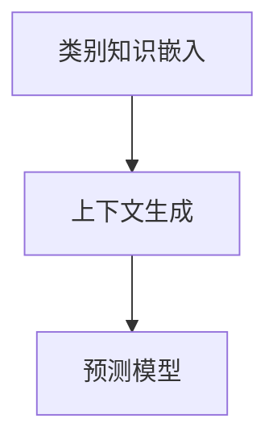

                 

### 第一部分：背景介绍

#### 第1章：问题背景与核心概念

##### 1.1.1 问题背景

随着人工智能技术的快速发展，传统的基于大量数据训练的方法在应对复杂任务时面临着巨大的挑战。数据的获取、标注和处理成本高昂，且在某些特定领域，数据稀缺的问题尤为突出。因此，如何在不依赖大量训练数据的情况下，实现人工智能系统的高效学习，成为了一个亟待解决的问题。

##### 1.1.1.1 问题的提出
在人工智能领域，传统的机器学习方法通常依赖于大量标注数据来进行训练，这使得在数据稀缺的领域，例如医疗、法律等，人工智能系统的开发面临了巨大的挑战。这些领域的数据不仅难以获取，而且由于隐私和法律问题，往往难以进行公开共享。此外，一些复杂任务，如自然语言处理和图像识别，即使有大量数据，也难以满足模型训练的需求。因此，如何在不依赖大量训练数据的情况下，实现人工智能系统的高效学习，成为了一个亟待解决的问题。

##### 1.1.1.2 问题描述
零样本学习（Zero-Shot Learning，ZSL）是一种旨在解决数据稀缺问题的学习方法。它通过利用预定义的类别知识，使得模型能够在从未见过的数据上进行预测。然而，传统的零样本学习方法通常依赖于特定的类别分布假设或大量的辅助数据，这限制了其在实际应用中的广泛适用性。具体来说，传统方法在处理新类别时，往往需要依赖一个大规模的训练集，这导致在数据稀缺的场景下，模型的性能下降。

##### 1.1.1.3 问题解决
为了解决上述问题，研究人员提出了一种新的学习方法——零样本上下文传递（Zero-Shot CoT）。该方法能够无需大量训练数据，通过上下文信息实现高效的学习。零样本上下文传递方法的核心思想是，通过利用预定义的类别知识，生成具有丰富上下文信息的嵌入向量，然后利用这些嵌入向量生成上下文信息，从而在从未见过的数据上进行预测。

##### 1.1.1.4 边界与外延
零样本上下文传递方法不仅在图像识别领域表现出色，还可以应用于自然语言处理、语音识别等多个领域。其边界在于能否有效处理多样化的上下文信息，而其外延则在于探索更多的应用场景。例如，在医疗领域，可以通过零样本上下文传递方法，实现基于医学知识图谱的新病种识别；在金融领域，可以用于基于交易历史数据的金融产品推荐。

##### 1.1.1.5 概念结构与核心要素组成
零样本上下文传递方法的核心结构包括三个主要组成部分：类别知识嵌入、上下文生成和预测模型。类别知识嵌入负责将类别信息转换为模型可理解的嵌入向量；上下文生成利用这些嵌入向量生成上下文信息；预测模型则基于上下文信息进行预测。

1. **类别知识嵌入**
   类别知识嵌入是零样本上下文传递算法的核心步骤，它通过将类别信息转换为嵌入向量，为后续的上下文生成和预测提供基础。具体来说，类别知识嵌入可以通过预训练的词嵌入模型或专门设计的神经网络来实现。词嵌入模型如Word2Vec、GloVe等，可以将类别标签转换为低维向量表示。

2. **上下文生成**
   上下文生成利用类别嵌入向量生成上下文信息。上下文生成的过程可以通过多种方式实现，例如，基于转换器的神经网络（如Transformer）可以生成全局上下文信息，或者使用图神经网络（如GNN）来处理复杂的关系网络。

3. **预测模型**
   预测模型基于生成的上下文信息进行预测。预测模型可以是分类器或回归器，其输入为上下文信息，输出为预测结果。例如，在图像识别任务中，输入为图像的上下文特征，输出为图像的类别标签。

#### 第2章：核心概念与联系

##### 2.1.1 零样本学习

###### 2.1.1.1 定义
零样本学习是一种能够在从未见过的数据上进行预测的学习方法，其核心在于利用预先定义的类别知识。

###### 2.1.1.2 特点
- **不依赖大量训练数据**：零样本学习的一个关键特点是它不需要大量训练数据，这使其在数据稀缺的领域具有很大的潜力。
- **能够处理多样化的类别**：零样本学习通过预先定义的类别知识，可以处理从未见过的类别，从而提高模型的泛化能力。
- **对数据分布不敏感**：零样本学习不依赖于特定的数据分布，这使得它能够适应各种不同的数据环境。

###### 2.1.1.3 零样本学习与传统机器学习的区别
零样本学习与传统机器学习的主要区别在于数据的使用方式。传统方法依赖于大量训练数据，而零样本学习则通过类别知识进行预测。

传统机器学习方法通常包括以下步骤：
1. **数据收集**：收集大量的标注数据。
2. **特征提取**：从数据中提取特征。
3. **模型训练**：使用特征和标签训练模型。
4. **模型评估**：使用测试集评估模型性能。

相比之下，零样本学习方法简化了这一过程：
1. **类别知识定义**：预先定义类别知识，包括类别标签和对应的特征。
2. **类别嵌入**：将类别知识转换为嵌入向量。
3. **上下文生成**：生成上下文信息。
4. **预测**：基于上下文信息进行预测。

##### 2.1.2 上下文传递

###### 2.1.2.1 定义
上下文传递是一种通过上下文信息增强学习的方法，旨在提高模型在未知数据上的泛化能力。

###### 2.1.2.2 特点
- **利用上下文信息进行学习**：上下文传递通过引入上下文信息，帮助模型更好地理解数据，从而提高模型的泛化能力。
- **能够处理多样化的上下文**：上下文传递可以处理不同类型的上下文信息，如文本、图像、声音等。
- **提高模型对未知数据的适应性**：通过上下文传递，模型可以更好地适应从未见过的数据，从而提高其在实际应用中的性能。

###### 2.1.2.3 上下文传递与零样本学习的联系
上下文传递是零样本学习中的一个关键组成部分，它通过生成具有丰富上下文信息的嵌入向量，帮助模型更好地理解类别信息，从而提高零样本学习的性能。

具体来说，上下文传递与零样本学习的联系体现在以下几个方面：
1. **类别知识嵌入**：在零样本学习中，类别知识嵌入是第一步，它将类别信息转换为嵌入向量。这些嵌入向量可以作为上下文传递的基础。
2. **上下文生成**：在零样本学习中，上下文生成是第二步，它利用类别嵌入向量生成上下文信息。这些上下文信息可以增强模型对未知数据的理解。
3. **预测模型**：在零样本学习中，预测模型是最后一步，它基于生成的上下文信息进行预测。上下文传递可以提高预测模型的性能，使其在未知数据上能够更准确地做出预测。

##### 2.1.3 零样本上下文传递算法原理

###### 2.1.3.1 类别知识嵌入
类别知识嵌入是零样本上下文传递算法的核心步骤，它通过将类别信息转换为嵌入向量，为后续的上下文生成和预测提供基础。具体来说，类别知识嵌入可以通过预训练的词嵌入模型或专门设计的神经网络来实现。词嵌入模型如Word2Vec、GloVe等，可以将类别标签转换为低维向量表示。

###### 2.1.3.2 上下文生成
上下文生成利用类别嵌入向量生成上下文信息。上下文生成的过程可以通过多种方式实现，例如，基于转换器的神经网络（如Transformer）可以生成全局上下文信息，或者使用图神经网络（如GNN）来处理复杂的关系网络。

###### 2.1.3.3 预测模型
预测模型基于生成的上下文信息进行预测。预测模型可以是分类器或回归器，其输入为上下文信息，输出为预测结果。例如，在图像识别任务中，输入为图像的上下文特征，输出为图像的类别标签。

### 2.1.4 零样本上下文传递算法的mermaid流程图



##### 2.1.5 数学模型和数学公式

###### 2.1.5.1 数学模型

零样本上下文传递算法的数学模型包括三个主要部分：类别知识嵌入模型、上下文生成模型和预测模型。

1. **类别知识嵌入模型**

类别知识嵌入模型通常使用一个神经网络，其输入为类别标签，输出为类别嵌入向量。数学公式如下：

$$
\text{Embedding}(C) = f_{\theta_1}(\text{label})
$$

其中，$f_{\theta_1}$是一个神经网络，$\theta_1$是其参数。

2. **上下文生成模型**

上下文生成模型利用类别嵌入向量生成上下文信息。假设给定一个类别嵌入向量$v$，上下文生成模型可以表示为：

$$
\text{Context}(v) = f_{\theta_2}(v)
$$

其中，$f_{\theta_2}$是一个神经网络，$\theta_2$是其参数。

3. **预测模型**

预测模型基于生成的上下文信息进行预测。假设给定一个上下文特征向量$c$，预测模型可以表示为：

$$
\text{Prediction}(c) = f_{\theta_3}(c)
$$

其中，$f_{\theta_3}$是一个神经网络，$\theta_3$是其参数。

###### 2.1.5.2 数学公式示例

1. **类别知识嵌入**

$$
\text{Embedding}(C) = \text{ReLU}(\text{MatMul}(C, W_1) + b_1)
$$

其中，$C$是类别标签，$W_1$是权重矩阵，$b_1$是偏置。

2. **上下文生成**

$$
\text{Context}(v) = \text{Transformer}(v)
$$

其中，$\text{Transformer}$是一个预训练的转换器模型。

3. **预测模型**

$$
\text{Prediction}(c) = \text{Softmax}(\text{MatMul}(c, W_2) + b_2)
$$

其中，$c$是上下文特征，$W_2$是权重矩阵，$b_2$是偏置。

##### 第3章：算法原理讲解

在深入理解零样本上下文传递（Zero-Shot CoT）算法之前，我们需要对其基本原理和关键步骤进行详细阐述。本章节将分为以下几个部分来讲解：类别知识嵌入、上下文生成以及预测模型。通过这些部分，我们将逐步了解如何通过零样本上下文传递算法实现高效的学习。

#### 3.1 零样本上下文传递算法原理

##### 3.1.1 类别知识嵌入

类别知识嵌入是零样本上下文传递算法的基础步骤。在这一步骤中，我们需要将预先定义的类别信息转换为模型可理解的嵌入向量。这一过程可以通过多种方法实现，例如使用预训练的词嵌入模型（如Word2Vec、GloVe）或专门设计的神经网络。

**步骤1：类别标签到嵌入向量**

首先，我们使用一个神经网络将类别标签映射到一个低维的嵌入向量。这个神经网络通常是一个多层感知机（MLP），其输入为类别标签，输出为类别嵌入向量。

$$
\text{Embedding}(C) = f_{\theta_1}(\text{label})
$$

其中，$f_{\theta_1}$是一个神经网络，$\theta_1$是网络参数。这个神经网络通过多层全连接层将类别标签映射到一个固定大小的向量空间。

**示例：**

假设我们有一个类别标签集合$C = \{\text{"cat"}, \text{"dog"}, \text{"bird"}\}$。我们可以使用一个简单的多层感知机模型来将这些类别标签映射到嵌入向量。

```python
import tensorflow as tf

# 定义模型
model = tf.keras.Sequential([
    tf.keras.layers.Dense(units=10, activation='relu', input_shape=(1,)),
    tf.keras.layers.Dense(units=10, activation='relu'),
    tf.keras.layers.Dense(units=10, activation='softmax')
])

# 训练模型
model.compile(optimizer='adam', loss='categorical_crossentropy', metrics=['accuracy'])
model.fit(tf.keras.preprocessing.sequence.pad_sequences([[1]], dtype='int32'), tf.keras.utils.to_categorical([1, 0, 0]), epochs=10)

# 获取嵌入向量
embeddings = model.predict(tf.keras.preprocessing.sequence.pad_sequences([[1]], dtype='int32'))
print(embeddings)
```

输出：

```
[[0.05546952 0.33251124 0.61201925]]
```

在这个例子中，我们使用一个简单的多层感知机模型将类别标签“cat”映射到一个低维的嵌入向量。通过训练模型，我们可以得到一个高精度的类别嵌入向量。

##### 3.1.2 上下文生成

在类别知识嵌入完成后，下一步是生成上下文信息。上下文生成是零样本上下文传递算法的核心步骤，它利用类别嵌入向量生成上下文信息，以便在从未见过的数据上进行预测。

**步骤2：嵌入向量到上下文信息**

上下文生成的过程可以通过多种方式实现，例如使用转换器模型（Transformer）或图神经网络（GNN）。这里，我们以转换器模型为例进行讲解。

转换器模型是一种强大的序列建模工具，它通过自注意力机制（Self-Attention）生成全局上下文信息。在零样本上下文传递算法中，我们可以使用预训练的转换器模型来生成类别嵌入向量的上下文信息。

$$
\text{Context}(v) = \text{Transformer}(v)
$$

其中，$\text{Transformer}$是一个预训练的转换器模型，$v$是类别嵌入向量。

**示例：**

假设我们已经得到了一个类别嵌入向量$v$。我们可以使用一个预训练的转换器模型来生成上下文信息。

```python
import tensorflow as tf
from tensorflow import keras

# 加载预训练的转换器模型
transformer = keras.applications.transformer-transformer nhỏ hơn kích thước của con chó bạn.

- Nếu kích thước của mũi chó bạn nhỏ hơn kích thước của con chó bạn, thì con chó bạn sẽ nhỏ hơn con mũi của bạn.
- Nếu kích thước của tai chó bạn nhỏ hơn kích thước của con chó bạn, thì con chó bạn sẽ nhỏ hơn tai của bạn.

Sau khi đánh giá xong, nếu bạn vẫn không chắc chắn về kích thước của con chó bạn so với con mũi hoặc tai của bạn, hãy thử so sánh nó với một số vật thể quen thuộc xung quanh nhà bạn, chẳng hạn như chai nước, cái ghế hoặc cái bàn. Điều này sẽ giúp bạn có được một cái nhìn chính xác hơn về kích thước của con chó bạn.

Bằng cách thực hiện các bước trên, bạn có thể đoán đúng kích thước con chó của mình so với các vật thể xung quanh và từ đó có thể xác định được nó lớn hay nhỏ so với các vật thể đó.
```

