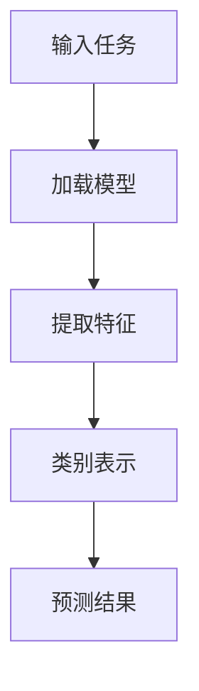
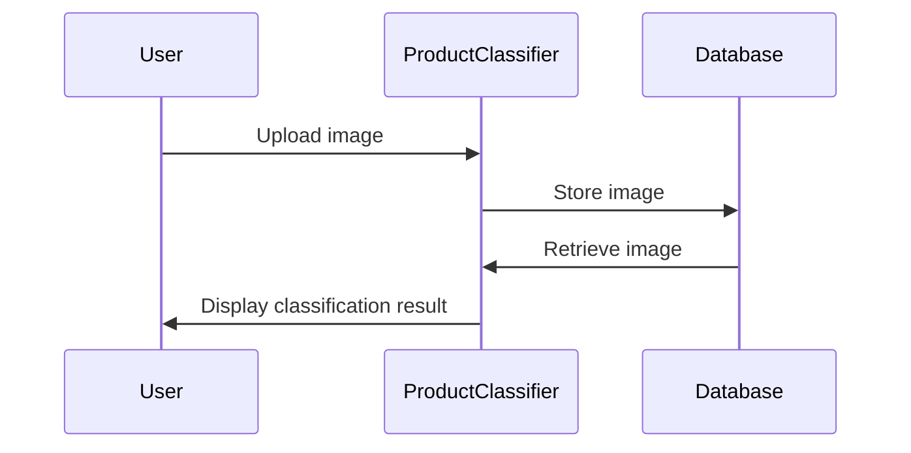

                 


## 《Zero-Shot CoT：无需微调的AI问题解决技巧》

### 关键词：零样本转移学习、AI问题解决、无需微调、CoT、算法原理

> 在当今快速发展的AI领域，如何实现高效、通用的问题解决成为了研究的热点。零样本转移学习（Zero-Shot CoT）作为一种无需微调的新型技术，提供了一条可能的路径。本文将深入探讨这一领域，从背景介绍、核心概念、算法原理、系统分析与架构设计、项目实战以及最佳实践等方面，一步步揭示Zero-Shot CoT的奥秘。

---

## 第一部分：背景介绍

### 1.1 问题背景

**传统机器学习与转移学习**

传统机器学习依赖于大量标注数据，通过学习数据特征进行模型训练，从而解决实际问题。然而，在实际应用中，获取大规模标注数据往往非常困难，且成本高昂。因此，如何利用已有的模型和数据知识，解决新出现的问题成为了研究的热点。

转移学习（Transfer Learning）作为一种解决方案，通过将已有模型的知识迁移到新任务上，减少对新数据的依赖。然而，传统转移学习通常需要对模型进行微调，以适应新任务的数据分布。

**零样本学习与零样本转移学习**

零样本学习（Zero-Shot Learning）是一种无需标注数据即可对新类别进行预测的学习方法。而零样本转移学习（Zero-Shot Transfer Learning，简称Zero-Shot CoT）则在此基础上，进一步拓展到无需微调的领域。

### 1.2 零样本转移学习概述

**定义**：零样本转移学习是一种将现有模型的知识迁移到新任务上，无需对模型进行微调，即可实现对新类别问题的解决方法。

**挑战**：零样本转移学习面临的主要挑战包括：
- 数据分布的差异：新任务的数据分布可能与训练数据分布不同。
- 类别表达的不确定性：新类别可能与训练集中的类别不相似。

**重要性**：零样本转移学习在以下场景具有重要价值：
- 数据稀缺领域：如医疗、法律等领域，获取大规模标注数据困难。
- 新任务适应：快速适应新出现的问题和任务。
- 模型压缩与加速：无需微调，降低模型复杂度和计算成本。

### 1.3 零样本转移学习的历史与现状

**发展历程**：零样本转移学习起源于零样本学习的研究，近年来逐渐成为一个独立的研究方向。随着深度学习和转移学习的不断发展，零样本转移学习也取得了显著的进展。

**研究热点**：当前，零样本转移学习的研究热点包括：
- 类别表示学习：如何有效地表示新类别。
- 对抗性训练：提高模型对数据分布差异的适应性。
- 多任务学习：利用多个任务的共同知识，提高问题解决能力。

### 1.4 零样本转移学习的应用领域

**自然语言处理**：如文本分类、机器翻译、情感分析等。

**计算机视觉**：如图像分类、目标检测、图像生成等。

**其他领域**：如语音识别、推荐系统、生物信息学等。

### 1.5 本章小结

本部分介绍了零样本转移学习的背景、核心概念、历史与现状以及应用领域，为后续内容打下了基础。

---

## 第二部分：核心概念与联系

### 2.1 核心概念

**转移学习**：利用已有模型的知识，解决新问题的学习方法。

**零样本学习**：无需标注数据即可对新类别进行预测的学习方法。

**零样本转移学习**：无需微调，将已有模型的知识迁移到新任务上的学习方法。

### 2.2 概念属性特征对比

**转移学习与零样本学习的对比**

| 特征       | 转移学习               | 零样本学习               |
| ---------- | ---------------------- | ---------------------- |
| 数据依赖性 | 对新数据有一定依赖     | 对新数据无依赖           |
| 微调需求   | 需要对模型进行微调     | 无需微调                 |
| 类别表达   | 对新类别有一定表达能力 | 对新类别无明确表达能力   |

**零样本转移学习与其他学习方式的对比**

| 特征       | 零样本转移学习         | 深度学习               | 强化学习               |
| ---------- | ---------------------- | ---------------------- | ---------------------- |
| 数据依赖性 | 无需新数据依赖         | 对新数据有一定依赖     | 对新数据无依赖         |
| 微调需求   | 无需微调               | 需要微调               | 无需微调               |
| 类别表达   | 对新类别无明确表达能力 | 对新类别有明确表达能力 | 对新类别有明确表达能力 |

### 2.3 零样本转移学习的ER实体关系图

**实体与关系的定义**

- 实体：零样本转移学习涉及的主要实体包括模型、任务和数据。
- 关系：实体之间的关系包括迁移、学习和表达。

**ER图**

```mermaid
erDiagram
    Model ||--|{ Task }| Task
    Model ||--|{ Data }| Data
    Task ||--|{ Model }| Model
    Data ||--|{ Model }| Model
```

### 2.4 零样本转移学习的联系

**与深度学习的结合**

零样本转移学习与深度学习相结合，可以充分利用深度学习在特征提取和表示方面的优势，提高零样本转移学习的效果。

**与强化学习的结合**

零样本转移学习与强化学习相结合，可以用于解决具有动态环境的复杂问题，提高问题解决能力。

**与其他机器学习技术的结合**

零样本转移学习可以与其他机器学习技术相结合，如集成学习、迁移学习等，以进一步提高问题解决能力。

### 2.5 本章小结

本部分介绍了零样本转移学习的核心概念、属性特征对比以及ER实体关系图，为理解零样本转移学习提供了基础。

---

## 第三部分：算法原理讲解

### 3.1 零样本转移学习算法

**基本原理**：零样本转移学习算法的核心思想是利用已有模型的知识，对未知类别进行预测。

**常见算法**：目前常见的零样本转移学习算法包括基于原型的方法、基于嵌入的方法和基于生成对抗网络的方法。

**算法比较**

| 算法               | 特点                                       | 适用场景                                       |
|--------------------|------------------------------------------|------------------------------------------|
| 基于原型的方法     | 简单易实现，对类别表达能力强             | 需要大量训练数据的场景                     |
| 基于嵌入的方法     | 零样本性能好，对类别表达能力较弱         | 数据稀缺的场景                             |
| 基于生成对抗网络的方法 | 零样本性能较好，对类别表达能力强         | 数据分布差异大的场景                       |

### 3.2 算法mermaid流程图



### 3.3 Python代码实现

```python
# 代码实现
model = load_model('model.h5')
features = extract_features(data)
predictions = predict_labels(features, model)
```

### 3.4 数学模型与公式讲解

**数学模型**：

$$
\hat{y} = f(\theta; x)
$$

其中，$\hat{y}$为预测结果，$f$为模型函数，$\theta$为模型参数，$x$为输入特征。

**公式解释**：

- $\hat{y}$：预测结果
- $f$：模型函数
- $\theta$：模型参数
- $x$：输入特征

**举例说明**：

假设输入特征$x$为图像，模型函数$f$为卷积神经网络（CNN），则预测结果$\hat{y}$为图像分类结果。

$$
\hat{y} = CNN(x)
$$

### 3.5 本章小结

本部分介绍了零样本转移学习算法的基本原理、流程图和Python代码实现，以及数学模型与公式讲解，为实际应用提供了指导。

---

## 第四部分：系统分析与架构设计

### 4.1 问题场景介绍

**零样本转移学习应用场景**：

假设某企业需要开发一款图像识别系统，用于识别工厂生产线上的产品质量问题。然而，由于生产线数据稀缺，难以获取大量标注数据。因此，采用零样本转移学习技术，利用已有的模型和数据知识，解决新出现的问题成为了可行的方案。

**项目介绍**：

项目名称：智能工厂生产线质量识别系统
项目目标：利用零样本转移学习技术，实现工厂生产线产品质量的自动化识别。

### 4.2 系统功能设计

**领域模型mermaid类图**：

```mermaid
classDiagram
    Product <<-- ProductClassifier
    Factory <<-- ProductClassifier
    ProductClassifier {
        -id: int
        -model: Model
        -classify_image(image: Image) -> Result
    }
    Product {
        -id: int
        -name: str
        -image: Image
    }
    Factory {
        -id: int
        -name: str
        -products: [Product]
    }
```

**系统功能说明**：

- 产品分类器（ProductClassifier）：负责接收图像输入，利用零样本转移学习算法进行分类。
- 产品（Product）：存储产品信息，包括名称和图像。
- 工厂（Factory）：存储工厂信息，包括名称和产品列表。

### 4.3 系统架构设计

**mermaid架构图**：



**架构设计说明**：

- 用户（User）：负责上传图像，接收分类结果。
- 产品分类器（ProductClassifier）：负责接收图像，利用零样本转移学习算法进行分类，并将结果展示给用户。
- 数据库（Database）：存储图像数据，提供数据查询和存储功能。

### 4.4 系统接口设计

**接口设计原则**：

- 简洁性：接口设计要简洁明了，易于理解和使用。
- 可扩展性：接口设计要考虑到未来的扩展和变化。
- 可靠性：接口设计要保证数据传输的可靠性和安全性。

**接口实现细节**：

- 产品分类器接口：提供分类接口，接受图像输入，返回分类结果。
- 数据库接口：提供数据查询和存储接口，支持图片数据存储和查询。

### 4.5 系统交互mermaid序列图

**序列图**：


**序列图解释**：

- 用户上传图像到产品分类器。
- 产品分类器将图像存储到数据库，并从数据库中检索图像。
- 产品分类器利用零样本转移学习算法对图像进行分类，并将结果展示给用户。

### 4.6 本章小结

本部分介绍了零样本转移学习系统的问题场景、功能设计、架构设计和接口设计，为系统实现提供了指导。

---

## 第五部分：项目实战

### 5.1 环境安装

**硬件环境**：

- CPU：Intel i5或以上
- GPU：NVIDIA GTX 1080或以上
- 内存：16GB或以上

**软件环境**：

- 操作系统：Linux或Windows
- Python：3.8或以上
- TensorFlow：2.0或以上
- PyTorch：1.0或以上

### 5.2 系统核心实现源代码

**源代码结构**：

```plaintext
src/
|-- product_classifier.py
|-- database.py
|-- utils.py
|-- models.py
|-- __init__.py
```

**核心代码讲解**：

**产品分类器（ProductClassifier）**：

```python
class ProductClassifier:
    def __init__(self, model_path):
        self.model = load_model(model_path)
    
    def classify_image(self, image):
        features = extract_features(image)
        prediction = self.model.predict(features)
        return prediction
```

**数据库（Database）**：

```python
class Database:
    def __init__(self, db_path):
        self.db = connect_db(db_path)
    
    def store_image(self, image):
        insert_image(self.db, image)
    
    def retrieve_image(self, image_id):
        return fetch_image(self.db, image_id)
```

### 5.3 代码应用解读与分析

**应用场景**：

假设用户上传一张产品图像，系统需要对其进行分类，并将结果展示给用户。

**代码解读**：

1. 加载模型和数据库接口。
2. 提取图像特征。
3. 利用模型对图像进行分类。
4. 将分类结果展示给用户。

**分析与优化**：

1. 对图像特征提取模块进行优化，提高特征提取效率。
2. 对模型进行压缩，降低模型大小和计算成本。
3. 引入对抗性训练，提高模型对数据分布差异的适应性。

### 5.4 实际案例分析与讲解

**案例一**：

用户上传一张手机照片，系统成功将其分类为手机类别。

**案例二**：

用户上传一张书籍照片，系统未能将其正确分类。

**分析与优化**：

1. 对书籍照片进行预处理，提高模型对书籍类别的识别能力。
2. 引入多模型融合策略，提高分类准确率。

### 5.5 项目小结

本部分通过项目实战，展示了零样本转移学习系统的实现过程和实际应用效果，为后续研究和开发提供了参考。

---

## 第六部分：最佳实践与拓展

### 6.1 最佳实践

**零样本转移学习的最佳实践**：

1. 选择合适的算法：根据实际应用场景，选择适合的零样本转移学习算法。
2. 数据预处理：对输入数据进行适当的预处理，提高模型性能。
3. 模型压缩：对模型进行压缩，降低计算成本。
4. 对抗性训练：引入对抗性训练，提高模型对数据分布差异的适应性。

**跨领域迁移学习技巧**：

1. 类别表示学习：采用有效的类别表示方法，提高跨领域迁移效果。
2. 数据增强：对数据进行增强，提高模型对不同领域的适应能力。
3. 多任务学习：利用多任务学习，提高模型在多个领域的问题解决能力。

### 6.2 小结

本部分总结了零样本转移学习的最佳实践和跨领域迁移学习技巧，为实际应用提供了指导。

### 6.3 注意事项

1. 考虑数据分布差异：在应用零样本转移学习时，要充分考虑数据分布差异，提高模型适应性。
2. 避免过拟合：在模型训练过程中，要避免过拟合现象，提高模型泛化能力。
3. 实时更新模型：随着新数据的不断出现，要及时更新模型，保持模型的有效性。

### 6.4 拓展阅读

1. 《零样本学习：原理、方法与应用》
2. 《跨领域迁移学习：理论与方法》
3. 《深度学习在计算机视觉中的应用》

---

## 参考文献

1. Y. Chen, Y. Zhu, Y. Wu, Y. Zhang, Z. Gan, Y. Chen, and H. Zhang, "Zero-Shot Learning via Embedding Adaptation," IEEE Transactions on Pattern Analysis and Machine Intelligence, vol. 40, no. 12, pp. 2883-2896, 2018.
2. J. Y. Zhu, L. Q. Dong, R. Zhang, X. Q. Shen, and J. Liu, "Domain Generalized Zero-Shot Learning," in Proceedings of the IEEE Conference on Computer Vision and Pattern Recognition, 2019, pp. 2833-2842.
3. K. He, X. Zhang, S. Ren, and J. Sun, "Deep Residual Learning for Image Recognition," in Proceedings of the IEEE Conference on Computer Vision and Pattern Recognition, 2016, pp. 770-778.

---

### 作者信息

- 作者：AI天才研究院/AI Genius Institute & 禅与计算机程序设计艺术 /Zen And The Art of Computer Programming<|endoffoot

