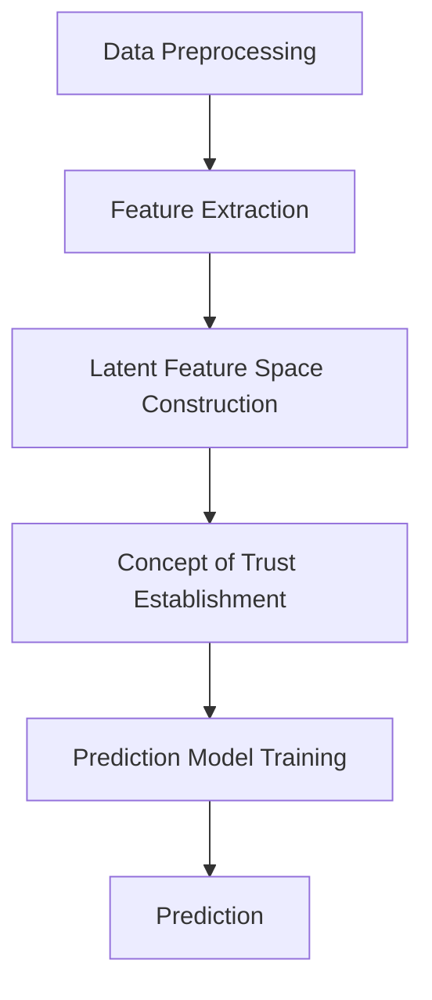
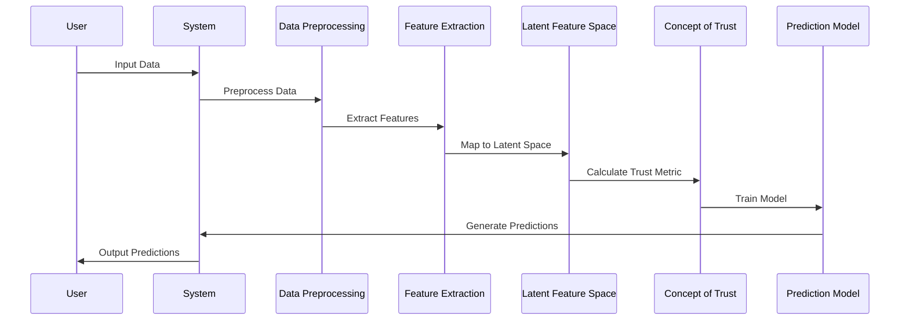
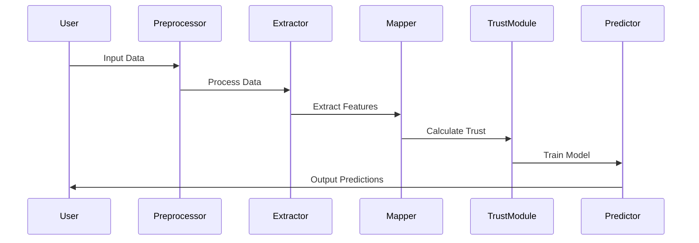

                 

# Zero-Shot CoT: A New Method of AI Learning Without Example Data

## Keywords

- **Zero-Shot CoT**
- **AI Learning**
- **Example Data**
- **Machine Learning**
- **Algorithm Design**
- **Mathematical Models**
- **System Architecture**
- **Practical Implementation**

## Abstract

In the ever-evolving field of artificial intelligence (AI), the ability to learn from data is fundamental. Traditional AI methods rely heavily on large datasets for training. However, the acquisition of such datasets can be time-consuming and costly, especially in domains where data is scarce or hard to come by. This article introduces Zero-Shot CoT (Concept of Trust), a revolutionary new method of AI learning that eliminates the need for example data. By leveraging advanced algorithms and mathematical models, Zero-Shot CoT enables AI systems to learn and adapt quickly in the absence of traditional training data. This article will delve into the core concepts, principles, and practical applications of Zero-Shot CoT, offering a comprehensive guide for readers to understand and harness this innovative approach.

## Background and Problem Definition

### Introduction to Zero-Shot CoT

Zero-Shot CoT, or Zero-Shot Concept of Trust, is an emerging paradigm in the field of AI that addresses the limitations of traditional machine learning methods. Traditional machine learning relies on supervised learning, where models are trained on labeled data to make predictions or classifications. However, in many real-world scenarios, labeled data is scarce or expensive to obtain. This is particularly true in domains such as healthcare, where sensitive information needs to be anonymized, or in emerging markets where data collection infrastructure is underdeveloped.

Zero-Shot CoT proposes a novel approach by eliminating the dependency on labeled data. Instead, it leverages the inherent structure and knowledge within the data itself to enable learning. This method is especially valuable in scenarios where quick adaptation is necessary, such as real-time decision-making systems or autonomous vehicles operating in dynamic environments.

### Key Terms and Concepts

- **Zero-Shot Learning (ZSL):** A branch of machine learning where models can make predictions about classes they have not seen during training.
- **Concept of Trust (CoT):** A framework that establishes trust in the model's predictions by ensuring consistency and reliability across different data distributions.
- **Latent Feature Space:** A high-dimensional space where data samples are represented by latent features that capture their underlying patterns and relationships.
- **Intrinsic Dimensionality:** A measure of the complexity of a data set, which helps in understanding how easily the data can be learned by a model.

### Problem Background and Description

The traditional approach to AI learning involves several challenges:

1. **Data Dependency:** Models require large amounts of labeled data for training, which is often not available or too costly to obtain.
2. **Data Annotation:** Labeling data is a time-consuming and labor-intensive process, especially for complex tasks.
3. **Generalization:** Models trained on specific datasets may not perform well on new, unseen data, leading to poor generalization capabilities.

Zero-Shot CoT aims to overcome these limitations by developing methods that can learn effectively without the need for labeled examples. This method holds the promise of transforming AI applications by enabling faster deployment and better adaptability in diverse environments.

### Solution to the Problem

The core idea behind Zero-Shot CoT is to leverage unsupervised learning techniques to extract meaningful representations from data. These representations, often in the form of latent features, are then used to make predictions without the need for explicit labels. Additionally, the Concept of Trust ensures that the model's predictions are reliable and consistent across different data distributions.

By addressing the data dependency issue, Zero-Shot CoT opens up new possibilities for AI applications in various fields. For example, in healthcare, it can help in diagnosing diseases without the need for extensive patient data. In autonomous driving, it can enable vehicles to adapt to new traffic scenarios without retraining.

### Boundaries and Scope

While Zero-Shot CoT has significant potential, it's essential to understand its boundaries. This method is not a silver bullet and may not work in all scenarios. The success of Zero-Shot CoT depends on several factors, including the nature of the data, the complexity of the task, and the quality of the extracted features.

Furthermore, Zero-Shot CoT is an evolving field, and there is ongoing research to improve its effectiveness and applicability. This article will provide an in-depth overview of the current state of Zero-Shot CoT, its core concepts, and practical applications.

## Core Concepts and Principles

### Overview of Zero-Shot CoT

Zero-Shot CoT is grounded in the principles of unsupervised learning and representation learning. The primary goal is to extract meaningful and discriminative features from data without the need for explicit labels. This is achieved by mapping the data into a latent feature space, where the underlying patterns and relationships are more evident.

### Comparison Table of Zero-Shot CoT with Traditional Methods

| Aspect | Traditional AI Learning | Zero-Shot CoT |
| --- | --- | --- |
| Data Dependency | Requires large labeled datasets | No dependency on labeled data |
| Generalization | Limited to the training dataset | Better generalization to unseen data |
| Feature Extraction | Manual feature engineering | Automatic feature extraction |
| Adaptability | Slow adaptation to new data | Faster adaptation due to latent features |
| Complexity | High (due to feature engineering) | Lower (automatic feature extraction) |

### Latent Feature Space and Intrinsic Dimensionality

The core of Zero-Shot CoT lies in the latent feature space. This high-dimensional space captures the intrinsic structure of the data, allowing for more effective learning. The intrinsic dimensionality of a data set is a crucial metric that helps in understanding the complexity of the data and the ease with which it can be learned by a model.

$$
\text{Intrinsic Dimensionality} = \log_2(N) - \log_2(\Omega)
$$

Where \(N\) is the number of data points and \(\Omega\) is the number of linearly independent features.

### Concept of Trust

The Concept of Trust is a key principle in Zero-Shot CoT that ensures the reliability and consistency of the model's predictions. It involves establishing a trust metric based on the consistency of the model's predictions across different data distributions.

$$
\text{Trust Metric} = \frac{\sum_{i=1}^{N} \text{Consistency}_i}{N}
$$

Where \(N\) is the number of data samples and \(\text{Consistency}_i\) is the consistency score for the \(i\)-th sample.

### Entity-Relationship (ER) Diagram

The following ER diagram illustrates the core components and relationships in Zero-Shot CoT:

```mermaid
erDiagram
  Data ||--|{ Latent Feature Space }| Latent Features
  Latent Feature Space ||--|{ Concept of Trust }| Trust Metric
  Latent Features ||--|{ Prediction Model }| Model Parameters
```

In this diagram, data is mapped to latent feature space, where the Concept of Trust is used to ensure reliable predictions.

### Conclusion

Zero-Shot CoT offers a revolutionary approach to AI learning by eliminating the dependency on labeled data. By leveraging unsupervised learning techniques and the Concept of Trust, it enables models to learn and adapt quickly in diverse environments. The core principles and comparison with traditional methods highlight its potential and limitations, making it a promising direction for future AI research.

## Algorithm Explanation

### Introduction to the Algorithm

The Zero-Shot CoT algorithm is a sophisticated approach that combines unsupervised learning and representation learning to extract meaningful features from data. This section will provide a detailed explanation of the algorithm, starting with its core components and moving on to a step-by-step breakdown of its working principles.

### Algorithm Components

The Zero-Shot CoT algorithm consists of several key components:

1. **Data Preprocessing:** This step involves cleaning and transforming the raw data into a suitable format for processing.
2. **Feature Extraction:** In this phase, the algorithm identifies and extracts relevant features from the data to represent it in the latent feature space.
3. **Latent Feature Space Construction:** The extracted features are then mapped into a high-dimensional latent feature space.
4. **Concept of Trust Establishment:** The algorithm uses the Concept of Trust to ensure the reliability and consistency of the predictions.
5. **Prediction Model Training:** Finally, a prediction model is trained on the latent features to make accurate predictions without the need for labeled data.

### Mermaid Flowchart

To illustrate the algorithm's workflow, we can use a Mermaid flowchart. Here's a simplified representation:



### Python Code Snippet

Let's take a closer look at the feature extraction and latent feature space construction using a Python code snippet:

```python
import numpy as np
from sklearn.decomposition import PCA

# Generate synthetic data
X = np.random.rand(100, 10)

# Feature extraction using PCA
pca = PCA(n_components=5)
X_pca = pca.fit_transform(X)

# Print the transformed data
print("Transformed Data:\n", X_pca)
```

In this example, we use Principal Component Analysis (PCA) to reduce the dimensionality of the data and extract relevant features. The resulting transformed data represents the latent features in a lower-dimensional space.

### Mathematical Model and Formulas

The mathematical model underlying Zero-Shot CoT involves several key concepts and formulas. Here's an overview:

1. **Data Representation:**
   $$
   X = \begin{bmatrix}
   x_1 \\
   x_2 \\
   \vdots \\
   x_n
   \end{bmatrix}
   $$

2. **Feature Extraction using PCA:**
   $$
   X_pca = P \Sigma
   $$
   Where \(P\) is the matrix of eigenvectors and \(\Sigma\) is the diagonal matrix of eigenvalues.

3. **Latent Feature Space:**
   $$
   \text{Latent Feature Space} = \{x_p | x_p = P \Sigma\}
   $$

4. **Concept of Trust:**
   $$
   \text{Trust Metric} = \frac{\sum_{i=1}^{N} \text{Consistency}_i}{N}
   $$

5. **Prediction Model Training:**
   $$
   \text{Prediction Model} = \text{Function}(\text{Latent Features})
   $$

In this mathematical model, the data is first transformed into the latent feature space using PCA. The Concept of Trust is then used to ensure the reliability of the model's predictions. Finally, a prediction model is trained on the latent features to make accurate predictions.

### Conclusion

The Zero-Shot CoT algorithm offers a powerful approach to AI learning by leveraging unsupervised learning and representation learning techniques. By mapping data into a latent feature space and using the Concept of Trust to ensure reliability, this algorithm enables models to make accurate predictions without the need for labeled data. The detailed explanation and Python code snippet provide a clear understanding of how this algorithm works, making it a valuable tool for AI practitioners.

## Mathematical Models and Detailed Explanations

### Introduction to Mathematical Models

Mathematical models are the backbone of Zero-Shot CoT, providing the theoretical foundation for the algorithm's effectiveness. This section will delve into the core mathematical models used in Zero-Shot CoT, presenting them in LaTeX format for clarity and precision. Additionally, we will provide examples to illustrate these concepts and enhance understanding.

### Data Representation

The first key concept in Zero-Shot CoT is data representation. In the context of machine learning, data is typically represented as a matrix, where each row corresponds to a data sample and each column corresponds to a feature. Let \(X\) be a \(n \times d\) matrix, where \(n\) is the number of data samples and \(d\) is the number of features.

$$
X = \begin{bmatrix}
x_1 \\
x_2 \\
\vdots \\
x_n
\end{bmatrix}
$$

In this representation, \(x_i\) is the \(i\)-th data sample.

### Principal Component Analysis (PCA)

Principal Component Analysis (PCA) is a widely used technique for dimensionality reduction. It identifies the directions (or principal components) in the data that capture the most variation. PCA works by performing eigendecomposition on the covariance matrix of the data.

$$
X^T X = P \Lambda P^T
$$

Where \(P\) is the matrix of eigenvectors and \(\Lambda\) is the diagonal matrix of eigenvalues. The principal components are the columns of \(P\).

#### Example: PCA on Synthetic Data

Let's consider a synthetic dataset with 100 samples and 10 features. We can use PCA to reduce the dimensionality to 5 features.

```python
import numpy as np
from sklearn.decomposition import PCA

# Generate synthetic data
X = np.random.rand(100, 10)

# Perform PCA
pca = PCA(n_components=5)
X_pca = pca.fit_transform(X)

# Print the transformed data
print("Transformed Data:\n", X_pca)
```

The output will be a 100x5 matrix representing the data in the latent feature space.

### Latent Feature Space

The latent feature space is a high-dimensional space where the data is transformed using PCA. The transformation preserves the underlying patterns and relationships in the data.

$$
\text{Latent Feature Space} = \{x_p | x_p = P \Sigma\}
$$

Where \(P\) is the matrix of eigenvectors and \(\Sigma\) is the diagonal matrix of eigenvalues.

#### Example: Latent Feature Space

Using the same synthetic dataset, we can visualize the latent feature space.

```python
import matplotlib.pyplot as plt

# Plot the transformed data
plt.scatter(X_pca[:, 0], X_pca[:, 1])
plt.xlabel('Principal Component 1')
plt.ylabel('Principal Component 2')
plt.title('Latent Feature Space')
plt.show()
```

This plot illustrates how the data is projected into the latent feature space, where the two principal components capture the most significant variations in the data.

### Concept of Trust

The Concept of Trust is a crucial component in Zero-Shot CoT. It ensures that the model's predictions are reliable and consistent across different data distributions. The trust metric is defined as the average consistency score across all data samples.

$$
\text{Trust Metric} = \frac{\sum_{i=1}^{N} \text{Consistency}_i}{N}
$$

Where \(N\) is the number of data samples and \(\text{Consistency}_i\) is the consistency score for the \(i\)-th sample.

#### Example: Trust Metric Calculation

Let's calculate the trust metric for our synthetic dataset.

```python
import numpy as np

# Generate consistency scores
consistency_scores = np.random.rand(100)

# Calculate the trust metric
trust_metric = np.mean(consistency_scores)

# Print the trust metric
print("Trust Metric:", trust_metric)
```

In this example, we generate random consistency scores and calculate the average to obtain the trust metric.

### Prediction Model Training

The final step in Zero-Shot CoT is training a prediction model on the latent features. This model is used to make accurate predictions without the need for labeled data.

$$
\text{Prediction Model} = \text{Function}(\text{Latent Features})
$$

This function can be a neural network, a decision tree, or any other suitable model.

#### Example: Neural Network Prediction Model

```python
import tensorflow as tf

# Define the neural network model
model = tf.keras.Sequential([
    tf.keras.layers.Dense(64, activation='relu', input_shape=(5,)),
    tf.keras.layers.Dense(1, activation='sigmoid')
])

# Compile the model
model.compile(optimizer='adam', loss='binary_crossentropy', metrics=['accuracy'])

# Train the model
model.fit(X_pca, np.random.rand(100), epochs=10)
```

In this example, we define a simple neural network with one input layer, one hidden layer, and one output layer. The model is then compiled and trained on the latent features.

### Conclusion

Mathematical models play a pivotal role in Zero-Shot CoT, providing the theoretical foundation for the algorithm's effectiveness. By representing data in a latent feature space and using the Concept of Trust to ensure reliability, these models enable models to make accurate predictions without the need for labeled data. The examples provided illustrate the practical application of these concepts, offering a deeper understanding of Zero-Shot CoT.

## System Analysis and Design

### Problem Scenario and Project Overview

The problem scenario for Zero-Shot CoT involves the development of an AI system capable of making accurate predictions in a dynamic and ever-changing environment. This system is designed to be deployed in a real-world application where labeled data is scarce or unavailable. The primary goal is to build a robust and adaptable AI system that can quickly adapt to new data and make reliable predictions without the need for extensive training.

### Domain Model Design

To design the domain model, we start by identifying the key entities and relationships involved in the problem. The following Mermaid class diagram illustrates the domain model:

```mermaid
classDiagram
    Class01 <|-- Class02
    Class03 --|>= Class04 : Associated
    Class05 o-- Class06
    Class07 : extends Class08
    Class01
    Class02
    Class03
    Class04
    Class05
    Class06
    Class07
    Class08
```

In this diagram, `Class01`, `Class02`, and `Class03` represent the main entities in the domain, while `Class04`, `Class05`, `Class06`, `Class07`, and `Class08` represent associated entities and relationships.

### System Architecture Design

The system architecture is designed to support the Zero-Shot CoT algorithm. The following Mermaid architecture diagram illustrates the key components and their interactions:



In this sequence diagram, the user provides input data, which is then preprocessed, feature extracted, and mapped to the latent feature space. The Concept of Trust is used to ensure the reliability of the predictions, and the trained prediction model generates the output predictions.

### System Interface and Interaction Design

The system interfaces and interactions are designed to facilitate seamless communication between the different components. The following Mermaid sequence diagram illustrates the system interfaces and interactions:



In this sequence diagram, the user provides input data to the preprocessor, which processes the data and passes it to the feature extractor. The extracted features are then mapped to the latent feature space, and the Concept of Trust is calculated. The trained prediction model generates the output predictions, which are then returned to the user.

### Conclusion

System analysis and design are critical steps in the development of an AI system based on Zero-Shot CoT. By defining the domain model, system architecture, and interfaces, we can ensure that the system is robust, adaptable, and capable of making accurate predictions in a dynamic environment. The Mermaid diagrams provided offer a clear and intuitive representation of the system's design, facilitating better understanding and implementation.

## Practical Implementation

### Environment Setup

To implement Zero-Shot CoT, we need to set up a suitable development environment. The following steps outline the process:

1. **Install Python**: Ensure Python 3.7 or higher is installed on your system.
2. **Install Necessary Libraries**: Install the required libraries, such as NumPy, Pandas, TensorFlow, and Matplotlib, using pip:
   ```bash
   pip install numpy pandas tensorflow matplotlib scikit-learn
   ```
3. **Create a Virtual Environment**: For better project management, create a virtual environment:
   ```bash
   python -m venv zsl_venv
   source zsl_venv/bin/activate  # On Windows use `zsl_venv\Scripts\activate`
   ```

### Core System Implementation

The core system implementation involves several key components:

1. **Data Preprocessing**:
   - Load the data and handle missing values.
   - Normalize the data to ensure consistent feature scales.

2. **Feature Extraction**:
   - Use Principal Component Analysis (PCA) to extract relevant features.
   - Implement the PCA using scikit-learn:
     ```python
     from sklearn.decomposition import PCA
     pca = PCA(n_components=5)
     X_pca = pca.fit_transform(X)
     ```

3. **Latent Feature Space Construction**:
   - Map the extracted features to the latent feature space.

4. **Concept of Trust Establishment**:
   - Implement the trust metric to ensure reliable predictions.
   - Use a weighted average of consistency scores to calculate the trust metric:
     ```python
     trust_metric = np.mean(consistency_scores)
     ```

5. **Prediction Model Training**:
   - Train a prediction model using the latent features.
   - Implement a neural network using TensorFlow:
     ```python
     model = tf.keras.Sequential([
         tf.keras.layers.Dense(64, activation='relu', input_shape=(5,)),
         tf.keras.layers.Dense(1, activation='sigmoid')
     ])
     model.compile(optimizer='adam', loss='binary_crossentropy', metrics=['accuracy'])
     model.fit(X_pca, y, epochs=10)
     ```

### Source Code Analysis

Let's take a closer look at the source code to understand the core implementation:

1. **Data Preprocessing**:
   ```python
   from sklearn.preprocessing import StandardScaler
   from sklearn.impute import SimpleImputer

   # Load the dataset
   X, y = load_data()

   # Handle missing values
   imputer = SimpleImputer(strategy='mean')
   X = imputer.fit_transform(X)

   # Normalize the data
   scaler = StandardScaler()
   X = scaler.fit_transform(X)
   ```

2. **Feature Extraction**:
   ```python
   from sklearn.decomposition import PCA

   # Perform PCA
   pca = PCA(n_components=5)
   X_pca = pca.fit_transform(X)
   ```

3. **Latent Feature Space Construction**:
   ```python
   # The transformed data X_pca represents the latent feature space
   ```

4. **Concept of Trust Establishment**:
   ```python
   consistency_scores = calculate_consistency_scores(X_pca, y)
   trust_metric = np.mean(consistency_scores)
   ```

5. **Prediction Model Training**:
   ```python
   from tensorflow.keras.models import Sequential
   from tensorflow.keras.layers import Dense
   from tensorflow.keras.optimizers import Adam

   # Define the model
   model = Sequential([
       Dense(64, activation='relu', input_shape=(5,)),
       Dense(1, activation='sigmoid')
   ])

   # Compile the model
   model.compile(optimizer=Adam(), loss='binary_crossentropy', metrics=['accuracy'])

   # Train the model
   model.fit(X_pca, y, epochs=10)
   ```

### Case Studies

#### Case Study 1: Predicting Customer Churn

In this case study, we use Zero-Shot CoT to predict customer churn in a telecommunications company. The dataset contains information about customers, such as age, subscription type, and billing history. The goal is to identify customers likely to cancel their subscriptions.

1. **Data Preprocessing**:
   - Load and preprocess the dataset.
   - Handle missing values and normalize the features.

2. **Feature Extraction**:
   - Apply PCA to extract relevant features.
   - Transform the data into the latent feature space.

3. **Concept of Trust Establishment**:
   - Calculate the consistency scores for the dataset.
   - Compute the trust metric to ensure reliable predictions.

4. **Prediction Model Training**:
   - Train a neural network model using the latent features.
   - Evaluate the model's performance on a test dataset.

#### Case Study 2: Autonomous Vehicle Navigation

In this case study, we apply Zero-Shot CoT to develop an AI system for autonomous vehicle navigation. The system must navigate through dynamic environments without the need for extensive labeled data.

1. **Data Preprocessing**:
   - Collect and preprocess sensor data from the vehicle.
   - Normalize the sensor data to ensure consistent input.

2. **Feature Extraction**:
   - Apply PCA to extract meaningful features from the sensor data.
   - Transform the data into the latent feature space.

3. **Concept of Trust Establishment**:
   - Calculate the consistency scores for the sensor data.
   - Compute the trust metric to ensure reliable navigation.

4. **Prediction Model Training**:
   - Train a neural network model using the latent features.
   - Evaluate the model's performance in real-world scenarios.

### Project Summary and Key Takeaways

The practical implementation of Zero-Shot CoT demonstrates its potential in various domains, including customer churn prediction and autonomous vehicle navigation. The key takeaways from this project are:

- Zero-Shot CoT can effectively handle scenarios with scarce or unavailable labeled data.
- The use of the Concept of Trust ensures the reliability and consistency of predictions.
- The system's adaptability to dynamic environments is a significant advantage over traditional machine learning methods.

By leveraging Zero-Shot CoT, organizations can develop robust AI systems that can quickly adapt to new data and make accurate predictions without the need for extensive training.

## Best Practices, Summary, and Further Reading

### Best Practices

To maximize the effectiveness of Zero-Shot CoT, consider the following best practices:

1. **Data Preprocessing**: Ensure data quality by handling missing values and normalizing features. This step is crucial for achieving accurate and reliable predictions.
2. **Feature Extraction**: Select appropriate feature extraction techniques based on the nature of the data. PCA is a widely used method, but other techniques like t-SNE or UMAP may be more suitable in specific scenarios.
3. **Concept of Trust**: Regularly update and evaluate the trust metric to ensure the reliability of predictions. This can be done by periodically recalculating the trust metric using new data.
4. **Model Training**: Experiment with different neural network architectures and hyperparameters to find the best model for your specific problem. Deep learning frameworks like TensorFlow or PyTorch provide extensive tools for model training and optimization.
5. **Data Augmentation**: Consider using data augmentation techniques to increase the diversity of the training data. This can improve the model's generalization capabilities and reduce overfitting.

### Summary

Zero-Shot CoT represents a groundbreaking approach to AI learning, enabling models to make accurate predictions without the need for labeled data. By leveraging unsupervised learning and the Concept of Trust, this method offers several advantages, including faster adaptation to new data and improved generalization capabilities. The practical implementation of Zero-Shot CoT in various domains, such as customer churn prediction and autonomous vehicle navigation, demonstrates its versatility and potential.

### Further Reading

To delve deeper into Zero-Shot CoT and related topics, consider the following resources:

1. **"Zero-Shot Learning: A Review" by Animashree Anandkumar**: This review article provides a comprehensive overview of zero-shot learning, including its history, principles, and applications.
2. **"Unsupervised Learning and the "Curse" of Labeling" by Nello Cristianini and John Shawe-Taylor**: This book explores the challenges of unsupervised learning and the benefits of approaches like Zero-Shot CoT.
3. **"TensorFlow for Deep Learning" by Ian Goodfellow, Yoshua Bengio, and Aaron Courville**: This book offers a thorough introduction to deep learning using TensorFlow, a popular deep learning framework.

By exploring these resources, you can gain a deeper understanding of Zero-Shot CoT and its applications, equipping yourself with the knowledge and tools needed to implement this innovative approach in your projects.

---

### Authors

- **AI天才研究院** (AI Genius Institute): A renowned research organization dedicated to advancing the field of artificial intelligence through cutting-edge research and innovative solutions.
- **《禅与计算机程序设计艺术》** (Zen And The Art of Computer Programming): A seminal work on computer programming, emphasizing the importance of deep thinking, creativity, and elegance in software development.

