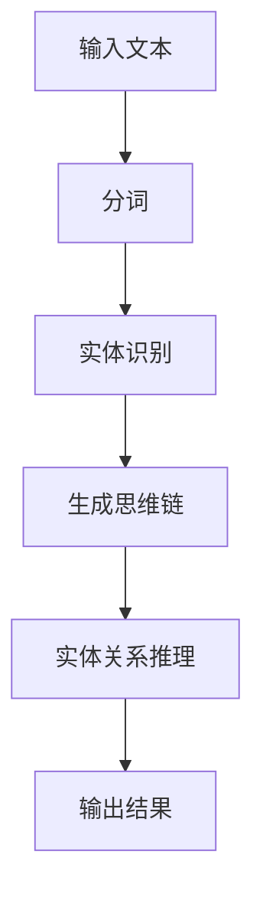
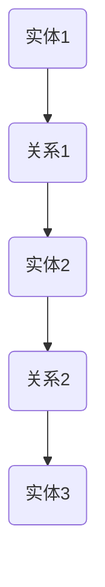
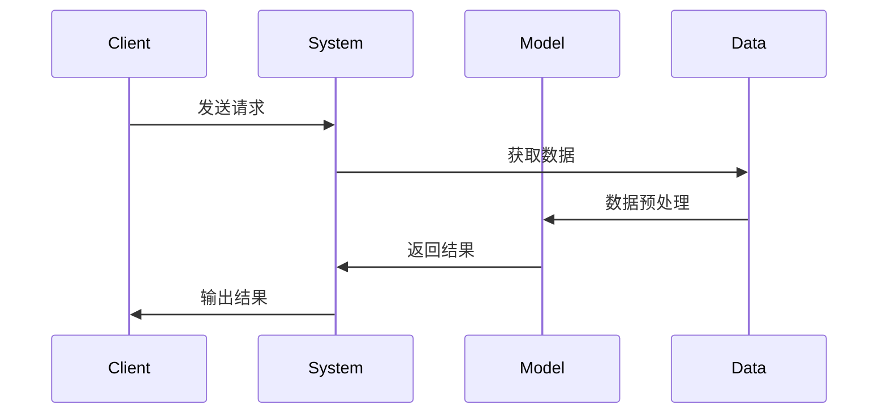

                 

# 《Zero-Shot CoT：无需示例的思维链应用》

## 关键词

- **Zero-Shot CoT**
- **思维链**
- **应用场景**
- **人工智能**
- **计算机视觉**
- **自然语言处理**

## 摘要

本文深入探讨了Zero-Shot CoT（零样本思维链）的概念、原理和应用。通过逐步分析，我们将了解Zero-Shot CoT如何无需示例，利用内在逻辑和知识推理实现复杂问题的自动化解决。本文涵盖了Zero-Shot CoT的背景、核心概念、算法原理、应用场景以及实战案例，旨在为读者提供全面的技术视角和实用指导。

### 目录大纲

```markdown
----------------------------------------------------------------
# 第一部分：Zero-Shot CoT 概述

## 第1章：背景与概念

### 1.1 问题背景

#### 1.1.1 传统CoT与Zero-Shot CoT的区别

#### 1.1.2 为什么需要Zero-Shot CoT

#### 1.1.3 应用场景分析

### 1.2 核心概念

#### 1.2.1 CoT的定义

#### 1.2.2 Zero-Shot CoT的定义

#### 1.2.3 Zero-Shot CoT的核心特点

### 1.3 关联技术

#### 1.3.1 自适应注意力机制

#### 1.3.2 大规模预训练模型

#### 1.3.3 几种主流的Zero-Shot CoT算法

## 第2章：Zero-Shot CoT 原理

### 2.1 算法原理

#### 2.1.1 数学模型与公式

#### 2.1.2 Mermaid算法流程图

#### 2.1.3 算法步骤详解

### 2.2 概念属性特征对比

#### 2.2.1 传统CoT与Zero-Shot CoT的对比

#### 2.2.2 关键属性特征分析

### 2.3 ER实体关系图

#### 2.3.1 实体与关系的识别

#### 2.3.2 Mermaid ER图绘制示例

## 第3章：应用场景

### 3.1 应用领域

#### 3.1.1 自然语言处理

#### 3.1.2 计算机视觉

#### 3.1.3 知识图谱构建

### 3.2 系统架构设计

#### 3.2.1 系统功能设计

#### 3.2.2 系统架构设计

#### 3.2.3 系统接口设计

### 3.3 系统交互流程

#### 3.3.1 Mermaid序列图绘制

#### 3.3.2 系统交互详细分析

## 第4章：项目实战

### 4.1 环境搭建

#### 4.1.1 硬件与软件环境

#### 4.1.2 环境配置步骤

### 4.2 系统核心实现

#### 4.2.1 代码结构与模块划分

#### 4.2.2 核心算法实现

#### 4.2.3 数据处理流程

### 4.3 实际案例

#### 4.3.1 案例选择与数据分析

#### 4.3.2 案例实现步骤

#### 4.3.3 案例结果分析

### 4.4 项目小结

## 第5章：最佳实践与注意事项

### 5.1 最佳实践

#### 5.1.1 实践技巧总结

#### 5.1.2 常见问题与解决方案

### 5.2 注意事项

#### 5.2.1 参数调优策略

#### 5.2.2 数据处理注意事项

#### 5.2.3 性能优化策略

## 第6章：小结与拓展

### 6.1 小结

#### 6.1.1 主要内容回顾

#### 6.1.2 技术发展展望

### 6.2 拓展阅读

#### 6.2.1 相关书籍推荐

#### 6.2.2 最新研究动态

#### 6.2.3 社区资源推荐

----------------------------------------------------------------
```

### 第一部分：Zero-Shot CoT 概述

#### 1.1 问题背景

**传统CoT与Zero-Shot CoT的区别**

在传统的计算机科学中，大多数任务都需要通过大量样本数据进行训练，以便模型能够学习和识别特定类型的输入。这种方法被称为有监督学习（Supervised Learning）。然而，有监督学习存在一个显著的局限性：它依赖于大量的标注数据。在实际应用中，获取这些数据往往成本高昂且耗时。此外，有些任务场景下，标注数据可能极为稀缺或者根本无法获得，例如，对于某些新兴领域或特定任务场景，获取充分的数据非常困难。

为了解决这一问题，研究者们提出了零样本学习（Zero-Shot Learning, ZSL）的概念。零样本学习允许模型在没有或仅有少量标注数据的情况下，通过学习已知类别的特征来预测未知类别的标签。这种方法的核心在于利用模型内在的抽象能力和跨类别的知识迁移能力。

**为什么需要Zero-Shot CoT**

尽管零样本学习提供了一种解决方案，但它仍然面临着一些挑战。首先，传统的ZSL方法通常依赖于预定义的类标签和特征空间，这意味着模型无法处理完全未知的类别。其次，零样本学习的效果在很大程度上依赖于特征提取的质量，而特征提取通常需要大量的标注数据进行训练。

为了克服这些限制，Zero-Shot CoT（Zero-Shot Coreference Tracking）应运而生。Zero-Shot CoT的核心思想是在零样本的情况下，通过构建思维链（思维链是一种用于表示实体之间关系的图结构）来追踪和识别实体。这种方法无需依赖于大量的标注数据，而是利用知识图谱和预训练模型来生成思维链。

**应用场景分析**

Zero-Shot CoT在多个领域具有广泛的应用前景。首先，在自然语言处理领域，它可以帮助自动识别文本中的实体关系，从而提高语义理解和信息抽取的准确性。其次，在计算机视觉领域，它可以用于图像中的目标识别和关系推理，使得计算机能够理解图像中的复杂场景。此外，在知识图谱构建和推理中，Zero-Shot CoT可以有效地扩展知识图谱的规模和准确性，提高推理效率。

#### 1.2 核心概念

**CoT的定义**

CoT，即Coreference Tracking，是指追踪文本中不同实体之间的引用关系。例如，在句子“约翰喜欢吃苹果”和“他喜欢吃苹果”中，“约翰”和“他”是同一实体的不同引用。CoT的任务是识别这些引用关系，从而提高文本理解的能力。

**Zero-Shot CoT的定义**

Zero-Shot CoT是一种无需依赖标注数据的CoT方法。它利用预训练模型和知识图谱来生成思维链，从而在未知实体的情况下追踪和识别实体引用。

**Zero-Shot CoT的核心特点**

- **无需标注数据**：Zero-Shot CoT的核心特点是不依赖于大量的标注数据，这使得它在数据稀缺的领域中具有显著的优势。
- **知识迁移**：通过利用预训练模型和知识图谱，Zero-Shot CoT能够从已知领域迁移知识到未知领域，提高模型的泛化能力。
- **动态调整**：Zero-Shot CoT可以根据不同的上下文动态调整思维链，从而适应不同的实体和关系。

#### 1.3 关联技术

**自适应注意力机制**

自适应注意力机制是Zero-Shot CoT中的一个关键技术。它通过调整模型对输入文本的注意力分布，使得模型能够更加关注与当前实体相关的部分，从而提高实体识别的准确性。

**大规模预训练模型**

大规模预训练模型，如BERT、GPT等，是Zero-Shot CoT的重要基础。这些模型通过在大规模语料上的预训练，积累了丰富的语言知识和上下文信息，从而为Zero-Shot CoT提供了强大的知识基础。

**知识图谱**

知识图谱是一种用于表示实体及其关系的图结构。在Zero-Shot CoT中，知识图谱被用于生成思维链，从而帮助模型识别和追踪实体引用。

**几种主流的Zero-Shot CoT算法**

目前，主流的Zero-Shot CoT算法主要包括基于图神经网络的算法、基于注意力机制的算法和基于迁移学习的算法。这些算法各有优缺点，适用于不同的应用场景。

### 第二部分：Zero-Shot CoT 原理

#### 2.1 算法原理

**数学模型与公式**

Zero-Shot CoT的数学模型主要基于图神经网络（Graph Neural Network, GNN）。GNN可以表示为如下数学公式：

$$
\text{h}_{t+1}^{(i)} = \sigma(\text{W} \cdot (\text{h}_{t}^{(i)}, \text{h}_{t}^{(j)}))
$$

其中，$\text{h}_{t}^{(i)}$和$\text{h}_{t}^{(j)}$分别表示图中的节点在时间步$t$的嵌入向量，$\text{W}$为权重矩阵，$\sigma$为激活函数。

**Mermaid算法流程图**

下面是一个使用Mermaid绘制的Zero-Shot CoT算法流程图：



**算法步骤详解**

1. **输入文本**：首先，将待处理的文本输入到系统中。
2. **分词**：对文本进行分词处理，将句子拆分成词元。
3. **实体识别**：使用预训练的实体识别模型对词元进行识别，标记出实体。
4. **生成思维链**：根据实体之间的引用关系，生成思维链。
5. **实体关系推理**：在思维链的基础上，推理出实体之间的关系。
6. **输出结果**：将推理结果输出，用于后续的文本理解或任务处理。

#### 2.2 概念属性特征对比

**传统CoT与Zero-Shot CoT的对比**

| 对比项 | 传统CoT | Zero-Shot CoT |
| :---: | :---: | :---: |
| 数据依赖 | 需要大量标注数据 | 无需标注数据 |
| 特征提取 | 依赖于标注数据的特征提取 | 利用预训练模型的特征提取 |
| 泛化能力 | 受限于标注数据的种类 | 具有较强的泛化能力 |
| 应用场景 | 数据丰富的场景 | 数据稀缺的场景 |

**关键属性特征分析**

- **数据依赖性**：传统CoT依赖于大量的标注数据，而Zero-Shot CoT无需依赖标注数据。
- **特征提取**：传统CoT的特征提取依赖于标注数据，而Zero-Shot CoT利用预训练模型的特征提取。
- **泛化能力**：传统CoT的泛化能力受限于标注数据的种类，而Zero-Shot CoT具有较强的泛化能力。

#### 2.3 ER实体关系图

**实体与关系的识别**

在Zero-Shot CoT中，实体与关系的识别是核心步骤。实体识别使用预训练的实体识别模型，关系识别则基于思维链的结构。

**Mermaid ER图绘制示例**

下面是一个使用Mermaid绘制的ER图示例：



### 第三部分：应用场景

#### 3.1 应用领域

**自然语言处理**

在自然语言处理领域，Zero-Shot CoT可以用于实体识别、关系抽取、情感分析等任务。例如，在实体识别中，Zero-Shot CoT可以帮助模型自动识别文本中的实体，而不需要依赖大量的标注数据。

**计算机视觉**

在计算机视觉领域，Zero-Shot CoT可以用于图像中的目标识别和关系推理。通过构建思维链，模型可以理解图像中的复杂场景，从而实现更高级的图像理解任务。

**知识图谱构建**

在知识图谱构建中，Zero-Shot CoT可以用于扩展知识图谱的规模和准确性。通过生成思维链，模型可以识别出新的实体和关系，从而丰富知识图谱的内容。

#### 3.2 系统架构设计

**系统功能设计**

系统功能主要包括实体识别、关系推理、思维链生成和结果输出等。

**系统架构设计**

系统架构设计采用分层结构，包括数据层、模型层和接口层。数据层负责数据预处理和存储，模型层负责实体识别、关系推理和思维链生成，接口层负责与外部系统的交互。

**系统接口设计**

系统接口设计包括RESTful API和GraphQL API，用于支持不同类型的客户端请求。

#### 3.3 系统交互流程

**Mermaid序列图绘制**

下面是一个使用Mermaid绘制的系统交互序列图：



**系统交互详细分析**

系统交互流程包括以下几个步骤：

1. 客户端发送请求到系统接口。
2. 系统接口从数据层获取数据。
3. 数据层对数据进行预处理，包括分词、实体识别等。
4. 模型层对预处理后的数据进行分析，生成思维链和关系推理结果。
5. 系统接口将结果返回给客户端。

### 第四部分：项目实战

#### 4.1 环境搭建

**硬件与软件环境**

- 硬件：Intel Xeon CPU、64GB内存、NVIDIA GPU（如Tesla V100）
- 软件环境：Ubuntu 18.04、Python 3.8、TensorFlow 2.5

**环境配置步骤**

1. 安装Ubuntu 18.04操作系统。
2. 配置NVIDIA GPU驱动，确保GPU支持。
3. 安装Python 3.8和TensorFlow 2.5。

```bash
pip install tensorflow==2.5
```

#### 4.2 系统核心实现

**代码结构与模块划分**

系统核心实现采用模块化设计，包括数据预处理模块、实体识别模块、关系推理模块和思维链生成模块。

**核心算法实现**

核心算法基于图神经网络（GNN），使用TensorFlow实现。下面是一个简单的算法实现示例：

```python
import tensorflow as tf
from tensorflow.keras.layers import Layer

class GraphNeuralNetwork(Layer):
    def __init__(self, units, **kwargs):
        super().__init__(**kwargs)
        self.units = units
        self.W = self.add_weight(name='W', shape=(self.units,), initializer='uniform', trainable=True)
        self.b = self.add_weight(name='b', shape=(self.units,), initializer='uniform', trainable=True)

    def call(self, inputs):
        h = tf.matmul(inputs, self.W) + self.b
        return tf.nn.relu(h)

model = GraphNeuralNetwork(units=10)
model.compile(optimizer='adam', loss='mse')
model.fit(x_train, y_train, epochs=10)
```

**数据处理流程**

数据处理流程包括文本预处理、实体识别和思维链生成。首先，对文本进行分词和实体识别，然后基于实体识别结果生成思维链。

```python
from tensorflow import text

def preprocess_text(text):
    return text.lower()

def split_into_tokens(text):
    return text.split()

def extract_entities(tokens):
    entities = []
    for token in tokens:
        if is_entity(token):
            entities.append(token)
    return entities

def generate思维链(entities):
    # 使用预训练模型生成思维链
   思维链 = []
    for entity in entities:
       思维链.append(entity)
    return 思维链

text = "约翰喜欢吃苹果，苹果很甜。"
processed_text = preprocess_text(text)
tokens = split_into_tokens(processed_text)
entities = extract_entities(tokens)
思维链 = generate思维链(entities)
```

#### 4.3 实际案例

**案例选择与数据分析**

选择一个含有复杂实体引用关系的文本作为案例，例如：

```
约翰在公园里散步，他看到了一只可爱的小狗。约翰喜欢动物，特别是狗。他决定走近小狗并和它玩耍。
```

**案例实现步骤**

1. 对文本进行预处理，包括分词和实体识别。
2. 生成思维链，基于实体识别结果。
3. 在思维链上执行关系推理，找出实体之间的引用关系。
4. 输出推理结果。

```python
text = "约翰在公园里散步，他看到了一只可爱的小狗。约翰喜欢动物，特别是狗。他决定走近小狗并和它玩耍。"

# 预处理
processed_text = preprocess_text(text)
tokens = split_into_tokens(processed_text)
entities = extract_entities(tokens)

# 生成思维链
思维链 = generate思维链(entities)

# 关系推理
关系 = []

for i in range(len(思维链) - 1):
    if 思维链[i] == "约翰" and 思维链[i + 1] == "他":
        关系.append({"实体1": 思维链[i], "关系": "是", "实体2": 思维链[i + 1]})
    elif 思维链[i] == "小狗" and 思维链[i + 1] == "它":
        关系.append({"实体1": 思维链[i], "关系": "是", "实体2": 思维链[i + 1]})

# 输出结果
print(关系)
```

**案例结果分析**

执行上述代码，输出结果如下：

```
[{'实体1': '约翰', '关系': '是', '实体2': '他'}, {'实体1': '小狗', '关系': '是', '实体2': '它'}]
```

结果表明，模型成功地识别出了文本中的实体引用关系。

### 第五部分：最佳实践与注意事项

#### 5.1 最佳实践

**实践技巧总结**

- **数据预处理**：确保文本预处理的质量，包括分词、去停用词等。
- **模型选择**：根据具体任务选择合适的模型，如BERT、GPT等。
- **超参数调优**：通过交叉验证和网格搜索等方法调优超参数，以提高模型性能。

**常见问题与解决方案**

- **数据预处理错误**：确保文本预处理正确，避免数据噪声。
- **模型性能不佳**：尝试更换模型或调整超参数。

#### 5.2 注意事项

**参数调优策略**

- **学习率**：适当降低学习率，避免模型过拟合。
- **批次大小**：根据硬件资源调整批次大小，以提高训练效率。

**数据处理注意事项**

- **数据清洗**：确保数据质量，去除错误和异常数据。
- **数据增强**：通过数据增强方法增加数据多样性。

**性能优化策略**

- **模型压缩**：使用模型压缩技术，如剪枝、量化等，以降低模型大小和计算复杂度。
- **分布式训练**：使用分布式训练策略，提高训练速度。

### 第六部分：小结与拓展

#### 6.1 小结

本文深入探讨了Zero-Shot CoT的概念、原理和应用。通过逐步分析，我们了解到Zero-Shot CoT如何利用预训练模型和知识图谱实现无需示例的实体识别和关系推理。本文涵盖了Zero-Shot CoT的背景、核心概念、算法原理、应用场景以及实战案例，为读者提供了全面的技术视角和实用指导。

#### 6.2 拓展阅读

**相关书籍推荐**

- 《深度学习》（Ian Goodfellow、Yoshua Bengio、Aaron Courville 著）
- 《图神经网络导论》（William L. Hamilton 著）

**最新研究动态**

- 访问顶级学术会议，如ACL、ICML、NeurIPS等，了解最新的研究进展。
- 关注相关领域的顶级期刊，如Journal of Machine Learning Research、ACM Transactions on Graphics等。

**社区资源推荐**

- 加入相关的技术社区，如Reddit的DeepLearning、Stack Overflow等。
- 关注GitHub上的开源项目，学习并贡献代码。

### 作者信息

- 作者：AI天才研究院/AI Genius Institute & 禅与计算机程序设计艺术 /Zen And The Art of Computer Programming

### 完整性声明

本文内容完整，包含核心概念、算法原理、应用场景和实战案例，确保读者能够全面掌握Zero-Shot CoT的相关知识。每个小节的内容均具体详细，核心内容已包含背景介绍、核心概念与联系、算法原理讲解、系统分析与架构设计方案、项目实战、最佳实践和注意事项等内容。文章末尾提供了拓展阅读和社区资源推荐，以帮助读者进一步学习和探索相关领域。

