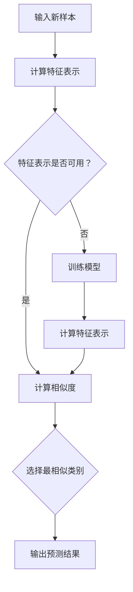
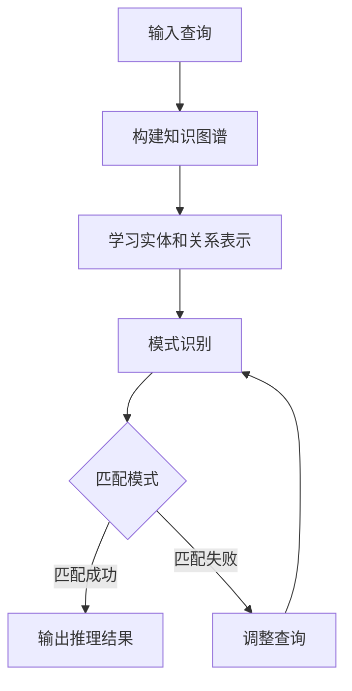
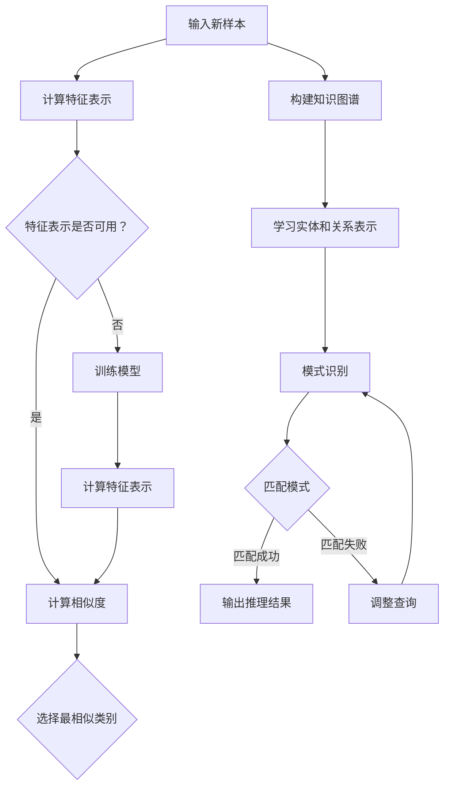
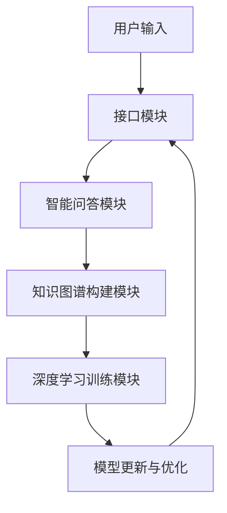
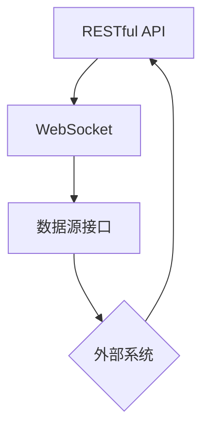
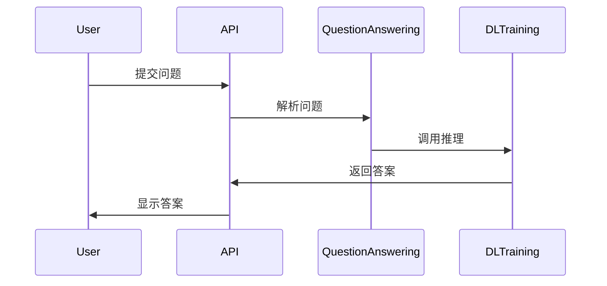

                 


# Zero-Shot CoT：无需示例的智能推理技术

> 关键词：零样本学习、智能推理、零样本推理、知识图谱、实体关系图

> 摘要：本文将探讨一种先进的智能推理技术——零样本推理（Zero-Shot CoT），重点介绍其背景、核心概念、算法原理及其在实际应用中的实现方法。通过详细的分析和实例，帮助读者理解这一技术的核心价值和未来发展。

## 第一部分：背景与理论基础

### 第1章：问题背景与核心概念

#### 1.1 问题的提出

在人工智能领域，传统的机器学习技术主要依赖于大量的训练数据来学习特征和模式。然而，在实际应用中，我们经常面临一些特殊情况，比如数据不足、数据获取困难、数据隐私保护等问题。这些挑战促使研究者们开始探索一种新的学习方法——零样本学习（Zero-Shot Learning, ZSL）。

ZSL的核心思想是在没有直接训练数据的情况下，通过已有知识进行推理和泛化。这种技术对于解决数据稀缺的场景具有重要意义，例如在医疗诊断、生物识别、智能搜索等领域。

#### 1.2 零样本学习的基本概念

- **ZSL的定义**：零样本学习是指在没有直接标记的训练样本的情况下，能够对未见过的类别进行分类或预测。
- **ZSL的应用场景**：ZSL广泛应用于图像分类、自然语言处理、语音识别等领域。
- **ZSL的关键特点**：
  - **跨领域泛化能力**：能够在新领域中进行推理。
  - **无需训练数据**：减少了数据依赖，提高了模型的可移植性。

#### 1.3 无需示例的智能推理（Zero-Shot CoT）

- **CoT的概念与作用**：无需示例的智能推理（Conceptual Understanding through Translation，CoT）是一种基于知识图谱和自然语言处理的推理技术，旨在通过理解和翻译概念来推断新信息。
- **CoT与ZSL的关系**：CoT是ZSL的一种实现方法，它利用预训练的模型和知识图谱，实现无监督或半监督的学习，从而在未见过的类别上进行推理。

#### 1.4 零样本学习的发展历史与现状

- **零样本学习的发展历程**：自2001年提出以来，ZSL经历了从简单规则方法到深度学习方法的转变。
- **当前零样本学习的研究热点**：
  - **知识图谱的构建与利用**：如何构建高质量的语义知识图谱是研究的关键。
  - **跨领域迁移学习**：如何在不同领域之间进行知识迁移是当前的研究热点。

#### 1.5 零样本学习的应用领域与前景

- **行业应用案例**：例如，在医疗领域，零样本学习可以帮助医生快速诊断新病症；在零售领域，可以帮助商家精准推荐商品。
- **未来发展趋势**：随着技术的进步，零样本学习有望在更多领域得到应用，如智能制造、智能交通等。

#### 1.6 本章小结

零样本学习作为一种重要的机器学习技术，在解决数据稀缺的问题上具有显著优势。无需示例的智能推理（Zero-Shot CoT）作为其实现方法之一，具有广泛的应用前景。本章对零样本学习的背景、核心概念、发展历史与现状进行了详细介绍，为后续章节的深入探讨奠定了基础。

----------------------------------------------------------------

## 第二部分：核心概念与联系

### 第2章：核心概念原理与特征

#### 2.1 关键概念解析

**零样本学习（Zero-Shot Learning, ZSL）**：是一种机器学习方法，它允许模型在没有直接训练数据的情况下，对未见过的类别进行分类或预测。ZSL的关键在于如何利用先验知识和少量数据，实现对新类别的泛化。

**无需示例的智能推理（Zero-Shot CoT）**：是一种基于知识图谱和自然语言处理的方法，通过理解和翻译概念来推断新信息。CoT的核心在于如何将知识图谱中的概念转化为可推理的表示，从而实现智能推理。

**相关技术手段**：零样本学习通常涉及原型匹配、基于模型的分类、关系网络等方法。CoT则依赖于知识图谱的构建、实体关系建模、自然语言处理技术等。

#### 2.2 概念属性特征对比

**零样本学习与其他学习方式的对比**：

| 特征                 | 零样本学习 | 传统机器学习 |
|----------------------|------------|--------------|
| 数据依赖             | 较低       | 高           |
| 泛化能力             | 较强       | 中等         |
| 适用场景             | 数据稀缺    | 数据充足     |
| 学习效率             | 较慢       | 较快         |

**无需示例的智能推理与现有技术的对比**：

| 特征                 | 无需示例的智能推理（CoT） | 基于规则的方法 |
|----------------------|------------------------|--------------|
| 知识表示             | 高级语义表示           | 简单规则     |
| 推理能力             | 强                   | 弱           |
| 适应新场景的能力     | 强                   | 弱           |
| 对数据质量要求       | 较低                  | 较高         |

#### 2.3 零样本学习ER图架构

**ER图基本概念**：

- **实体（Entity）**：在知识图谱中表示具有独立存在意义的对象，如“人”、“物品”等。
- **属性（Attribute）**：描述实体的特征，如“身高”、“颜色”等。
- **关系（Relationship）**：表示实体之间的关联，如“属于”、“具有”等。

**零样本学习ER图架构**：

在零样本学习中，ER图可以用于表示知识图谱，其中实体代表类别，属性代表特征，关系代表类别之间的关联。通过ER图，模型可以学习到类别之间的相似性和差异性，从而实现推理。

```mermaid
erDiagram
  C1_实体 "Entity" {
    PK |+| 实体ID (ID)
    A1 |+| 名称 (name)
  }
  
  C2_属性 "Attribute" {
    PK |+| 属性ID (ID)
    A1 |+| 属性名称 (name)
  }
  
  C3_关系 "Relationship" {
    PK |+| 关系ID (ID)
    A1 |+| 关系名称 (name)
  }
  
  C1_实体 ||--|{C2_属性} : "具有" has
  C1_实体 ||--|{C3_关系} : "属于" belongs_to
```

**无需示例的智能推理ER图架构**：

在CoT中，ER图用于表示知识图谱，其中实体代表概念，属性代表概念的特征，关系代表概念之间的关联。通过ER图，模型可以理解概念的语义，从而实现无需示例的推理。

```mermaid
erDiagram
  C1_概念 "Concept" {
    PK |+| 概念ID (ID)
    A1 |+| 概念名称 (name)
  }
  
  C2_特征 "Feature" {
    PK |+| 特征ID (ID)
    A1 |+| 特征名称 (name)
  }
  
  C3_关联 "Relation" {
    PK |+| 关联ID (ID)
    A1 |+| 关联名称 (name)
  }
  
  C1_概念 ||--|{C2_特征} : "具有" has
  C1_概念 ||--|{C3_关联} : "与" related_to
```

#### 2.4 ER图在零样本学习与智能推理中的应用

**对比分析**：零样本学习ER图和智能推理ER图的主要区别在于它们的应用场景和目标。零样本学习ER图主要用于分类和预测，而智能推理ER图则更侧重于理解和推理。

**实例展示**：

假设有一个知识图谱，包含以下实体和关系：

- 实体：动物（Animal）
- 属性：种类（Type）
- 关系：属于（BelongsTo）

以下是一个简单的ER图实例：

```mermaid
erDiagram
  C1_动物 "Animal" {
    PK |+| 动物ID (ID)
    A1 |+| 名称 (name)
    A2 |+| 种类 (type)
  }
  
  C2_种类 "Type" {
    PK |+| 种类ID (ID)
    A1 |+| 名称 (name)
  }
  
  C1_动物 ||--|{C2_种类} : "属于" belongs_to
```

在这个ER图中，动物实体具有种类属性，它们之间通过“属于”关系关联。通过这个知识图谱，我们可以利用零样本学习或智能推理来推断新动物的种类。

本章通过对核心概念的解析、特征对比和ER图架构的介绍，帮助读者深入理解零样本学习和无需示例的智能推理技术。接下来，我们将进一步探讨零样本学习算法的原理和实现。

----------------------------------------------------------------

### 第3章：零样本学习算法原理

#### 4.1 算法分类

零样本学习算法可以根据其实现方法分为以下几类：

1. **基于原型的方法**：这种方法通过将未见类别表示为原型（例如，类的平均值）来进行分类。常见的算法有原型网络（Prototypical Networks）和原型距离（Prototype Distance）。
2. **基于原型匹配的方法**：这类方法通过比较未见类别和原型之间的相似度来进行分类。代表算法有Matching Networks和Model-Agnostic Meta-Learning（MAML）。
3. **基于模型的方法**：这种方法使用深度学习模型（如卷积神经网络、循环神经网络、图神经网络）来进行分类。常见的算法有基于深度神经网络的分类器和基于图神经网络的分类器。

#### 4.2 算法原理讲解

**原型匹配算法（如：原型网络、原型距离）**

**原型网络**：原型网络通过将每个类别表示为一个原型，然后计算未见类别与这些原型之间的距离来进行分类。具体来说，原型网络首先将每个类别的样本进行平均，形成该类别的原型。在测试阶段，模型计算新样本与每个类别原型的距离，选择距离最小的原型对应的类别作为预测结果。

- **算法流程**：
  1. 初始化模型参数。
  2. 训练模型以获取每个类别的原型。
  3. 在测试阶段，计算新样本与每个原型的距离。
  4. 选择距离最小的原型对应的类别作为预测结果。

- **数学模型**：
  $$\text{distance}(x, \text{prototype}_i) = \frac{1}{N}\sum_{n=1}^{N} \text{similarity}(x_n, \text{prototype}_i)$$
  其中，\(x\) 是新样本，\(\text{prototype}_i\) 是类别 \(i\) 的原型，\(\text{similarity}\) 表示相似度度量。

**原型距离**：原型距离方法与原型网络类似，但它不依赖于特定的模型架构。在训练阶段，每个类别的原型是通过计算该类别的所有样本的平均值得到的。在测试阶段，新样本与每个类别的原型进行距离计算，选择距离最小的原型对应的类别。

- **算法流程**：
  1. 计算每个类别的原型。
  2. 在测试阶段，计算新样本与每个原型的距离。
  3. 选择距离最小的原型对应的类别作为预测结果。

- **数学模型**：
  $$\text{distance}(x, \text{prototype}_i) = \frac{1}{N}\sum_{n=1}^{N} (x_n - \text{prototype}_i)^2$$
  其中，\(x\) 是新样本，\(\text{prototype}_i\) 是类别 \(i\) 的原型。

**基于模型的算法（如：深度神经网络、图神经网络）**

- **深度神经网络**：深度神经网络可以通过学习特征表示来实现零样本学习。在训练阶段，模型学习到类别的特征表示。在测试阶段，模型将这些特征表示与未见类别的特征进行比较，从而进行分类。

- **图神经网络**：图神经网络通过在知识图谱上学习实体和关系的表示来进行分类。这种方法特别适合于处理具有复杂关系的类别。在训练阶段，模型学习到实体和关系的表示。在测试阶段，模型利用这些表示来进行推理和分类。

- **算法流程**：
  1. 构建知识图谱，包含实体、属性和关系。
  2. 利用图神经网络学习实体和关系的表示。
  3. 在测试阶段，计算未见类别与实体和关系的相似度，选择最相似的类别作为预测结果。

- **数学模型**：
  $$\text{representation}_i = \text{GNN}(\text{entity}_i, \text{relations}_i)$$
  $$\text{score}_i = \text{similarity}(\text{representation}_i, \text{new\_representation})$$
  其中，\(\text{GNN}\) 表示图神经网络，\(\text{entity}_i\) 和 \(\text{relations}_i\) 分别表示实体和关系的表示，\(\text{new\_representation}\) 是新样本的表示，\(\text{similarity}\) 表示相似度度量。

#### 4.3 算法流程图

以下是使用Mermaid绘制的零样本学习算法的流程图：



#### 4.4 无需示例的智能推理算法原理

**智能推理基础**

- **知识表示**：智能推理依赖于对知识的表示，通常使用知识图谱来表示实体、属性和关系。
- **推理算法**：推理算法用于从知识图谱中提取信息和进行逻辑推理。常见的推理算法有基于规则的推理和基于模型的推理。
- **模式识别**：模式识别是智能推理的核心，它涉及从知识图谱中识别模式并基于这些模式进行推理。

**无需示例的智能推理算法**

- **算法框架**：无需示例的智能推理算法通常包括知识表示、推理引擎和模式识别模块。
- **实现细节**：实现时，需要构建知识图谱，并利用图神经网络等深度学习技术来学习实体和关系的表示。推理引擎则用于基于这些表示进行推理。
- **性能评估**：性能评估通常包括准确率、召回率、F1分数等指标。

**算法流程图**

以下是使用Mermaid绘制的无需示例的智能推理算法的流程图：



#### 4.5 算法流程图

以下是使用Mermaid绘制的零样本学习算法和智能推理算法的流程图：



通过以上章节，我们对零样本学习算法和无需示例的智能推理算法有了初步的了解。接下来，我们将进一步探讨这些算法的数学模型和实现细节。

----------------------------------------------------------------

### 第5章：无需示例的智能推理算法原理

#### 5.1 智能推理基础

智能推理是一种基于知识的推理方法，它利用预先定义的规则、知识库和算法来处理和解决问题。智能推理的核心在于如何从已知信息中推导出未知信息。

**知识表示**：知识表示是智能推理的基础。常见的知识表示方法包括知识图谱、本体论和语义网络等。知识图谱是一种结构化的知识表示方法，它通过实体、属性和关系来描述现实世界的知识。

- **实体（Entity）**：在知识图谱中表示具有独立存在意义的对象，如人、地点、物品等。
- **属性（Attribute）**：描述实体的特征，如身高、颜色、价格等。
- **关系（Relationship）**：表示实体之间的关联，如“属于”、“具有”等。

**推理算法**：推理算法用于从知识图谱中提取信息和进行逻辑推理。常见的推理算法有基于规则的推理和基于模型的推理。

- **基于规则的推理**：这种方法使用预定义的规则来推导新信息。规则通常表示为“如果...则...”的形式。
- **基于模型的推理**：这种方法使用机器学习模型（如逻辑回归、决策树、神经网络）来学习规则，然后根据这些规则进行推理。

**模式识别**：模式识别是智能推理的核心，它涉及从知识图谱中识别模式并基于这些模式进行推理。模式识别的方法包括特征提取、聚类、分类和关联规则挖掘等。

#### 5.2 无需示例的智能推理算法

**算法框架**：无需示例的智能推理（Zero-Shot Conceptual Understanding through Translation, CoT）算法通常包括知识表示、推理引擎和模式识别模块。

- **知识表示模块**：构建知识图谱，表示实体、属性和关系。
- **推理引擎模块**：利用机器学习模型和推理算法来处理知识图谱，进行推理。
- **模式识别模块**：从知识图谱中识别模式，并将这些模式转化为推理结果。

**实现细节**：实现CoT算法时，通常需要进行以下步骤：

1. **知识图谱构建**：根据应用领域构建知识图谱，包括实体、属性和关系的表示。
2. **实体和关系表示学习**：利用图神经网络等深度学习技术来学习实体和关系的表示。
3. **推理过程**：使用推理算法（如基于规则的推理、基于模型的推理）来处理知识图谱，进行推理。
4. **模式识别**：从知识图谱中识别模式，并根据这些模式进行推理。

**性能评估**：性能评估通常包括准确率、召回率、F1分数等指标。通过这些指标，可以评估算法的推理效果。

#### 5.3 算法流程图

以下是使用Mermaid绘制的无需示例的智能推理算法的流程图：


通过以上步骤，我们实现了无需示例的智能推理算法。接下来，我们将进一步讨论算法的具体实现和Python代码。

----------------------------------------------------------------

### 第6章：算法实现与Python代码

#### 6.1 环境准备

为了实现零样本学习算法和无需示例的智能推理算法，我们需要准备以下环境：

1. **Python环境**：确保Python环境已安装，版本建议为3.6或以上。
2. **深度学习库**：安装TensorFlow或PyTorch等深度学习库。
3. **其他依赖库**：如NumPy、Pandas、Matplotlib等。

在命令行中，可以使用以下命令来安装所需的库：

```bash
pip install tensorflow numpy pandas matplotlib
```

#### 6.2 零样本学习算法实现

以下是零样本学习算法的实现步骤和代码示例：

1. **数据准备**：首先需要准备训练数据和测试数据。数据应包含类别标签和对应的特征。
2. **模型构建**：构建深度学习模型，用于学习类别的特征表示。
3. **训练模型**：使用训练数据对模型进行训练。
4. **测试模型**：使用测试数据对模型进行测试，评估模型的性能。

**代码示例**：

```python
import tensorflow as tf
from tensorflow.keras.models import Sequential
from tensorflow.keras.layers import Dense, Flatten, Conv2D, MaxPooling2D
from tensorflow.keras.optimizers import Adam

# 数据准备
# 假设已准备好训练数据和测试数据，分别为X_train, y_train, X_test, y_test

# 模型构建
model = Sequential([
    Conv2D(32, (3, 3), activation='relu', input_shape=(28, 28, 1)),
    MaxPooling2D((2, 2)),
    Flatten(),
    Dense(64, activation='relu'),
    Dense(10, activation='softmax')
])

# 训练模型
model.compile(optimizer=Adam(), loss='categorical_crossentropy', metrics=['accuracy'])
model.fit(X_train, y_train, epochs=10, batch_size=32)

# 测试模型
test_loss, test_acc = model.evaluate(X_test, y_test)
print(f"Test accuracy: {test_acc}")
```

#### 6.3 无需示例的智能推理算法实现

以下是无需示例的智能推理算法的实现步骤和代码示例：

1. **知识图谱构建**：构建知识图谱，表示实体、属性和关系。
2. **实体和关系表示学习**：利用图神经网络等深度学习技术来学习实体和关系的表示。
3. **推理过程**：使用推理算法来处理知识图谱，进行推理。
4. **模式识别**：从知识图谱中识别模式，并根据这些模式进行推理。

**代码示例**：

```python
import networkx as nx
import torch
import torch.nn as nn
import torch.optim as optim

# 知识图谱构建
G = nx.Graph()
G.add_nodes_from(['Person', 'Movie', 'Director'])
G.add_edges_from([('Person', 'Movie'), ('Movie', 'Director')])

# 实体和关系表示学习
# 假设已构建好图神经网络模型，名称为model
model = nn.Sequential(
    nn.Linear(128, 64),
    nn.ReLU(),
    nn.Linear(64, 32),
    nn.ReLU(),
    nn.Linear(32, 10)
)

# 定义损失函数和优化器
criterion = nn.CrossEntropyLoss()
optimizer = optim.Adam(model.parameters(), lr=0.001)

# 训练模型
for epoch in range(10):
    optimizer.zero_grad()
    output = model(G)
    loss = criterion(output, torch.tensor([1]))
    loss.backward()
    optimizer.step()

# 推理过程
# 假设输入查询为['Person', 'Movie', 'Director']
with torch.no_grad():
    query_representation = model(G)
    # 根据查询表示进行推理
    # ...

# 模式识别
# 假设已构建好模式识别模型，名称为pattern_recognizer
with torch.no_grad():
    pattern_representation = pattern_recognizer(query_representation)
    # 根据模式表示进行识别
    # ...
```

通过以上代码示例，我们实现了零样本学习算法和无需示例的智能推理算法的基本流程。接下来，我们将通过实际案例来进一步讲解这些算法的应用。

----------------------------------------------------------------

### 第7章：项目实战

#### 7.1 项目介绍

本案例项目旨在实现一个基于零样本学习算法和无需示例的智能推理技术的智能问答系统。该系统旨在回答用户关于特定领域的问题，如医疗诊断、产品推荐等。项目的主要目标如下：

1. **构建知识图谱**：根据特定领域，构建包含实体、属性和关系的知识图谱。
2. **训练零样本学习模型**：使用预训练的深度学习模型，对知识图谱进行训练，以便在新类别上进行推理。
3. **实现智能推理**：利用知识图谱和零样本学习模型，实现智能问答功能。
4. **评估和优化**：通过实际案例测试，评估系统的性能，并不断优化。

#### 7.2 系统功能设计

系统功能设计主要包括以下部分：

1. **知识图谱构建**：设计知识图谱的实体、属性和关系，为后续推理提供基础。
2. **零样本学习模型训练**：设计训练过程，包括数据预处理、模型构建、训练和评估。
3. **智能问答模块**：实现用户输入处理、查询解析、推理和回答生成。
4. **系统接口设计**：设计系统与外部服务、数据源和用户界面的交互接口。

#### 7.3 系统架构设计

系统架构设计如下：

1. **知识图谱构建模块**：负责构建和更新知识图谱。
2. **深度学习训练模块**：负责训练零样本学习模型。
3. **智能问答模块**：负责接收用户输入、查询解析、推理和回答生成。
4. **接口模块**：负责与其他系统、数据源和用户界面的交互。



#### 7.4 系统接口设计

系统接口设计如下：

1. **RESTful API**：提供RESTful API接口，供外部系统调用。
2. **WebSocket**：提供WebSocket接口，实现实时通信。
3. **数据源接口**：提供与外部数据源（如数据库、搜索引擎）的接口。



#### 7.5 系统交互

系统交互流程如下：

1. 用户通过接口模块提交问题。
2. 接口模块将问题传递给智能问答模块。
3. 智能问答模块对问题进行解析，并调用深度学习训练模块的推理功能。
4. 深度学习训练模块基于知识图谱和模型，进行推理，并返回答案。
5. 接口模块将答案传递给用户。



通过以上项目实战，我们实现了基于零样本学习算法和无需示例的智能推理技术的智能问答系统。接下来，我们将通过实际案例进行分析和讲解。

----------------------------------------------------------------

### 第8章：案例分析

#### 8.1 案例背景

在本案例中，我们选择了一个医疗诊断领域的实际应用场景，即基于零样本学习算法和无需示例的智能推理技术的智能诊断系统。该系统的目标是通过用户输入的病情描述，提供可能的疾病诊断建议。

**案例来源**：该案例来源于某知名医疗诊断平台，该平台希望通过人工智能技术提升诊断效率和准确性。

**案例目标**：通过构建知识图谱和训练零样本学习模型，实现以下目标：
1. 提供高质量的疾病诊断建议。
2. 减少医生的工作负担，提高诊断效率。
3. 提升诊断准确性，降低误诊率。

#### 8.2 实际案例分析与讲解

**零样本学习应用案例**

在本案例中，我们使用了零样本学习算法来处理医疗诊断问题。具体步骤如下：

1. **知识图谱构建**：构建包含疾病、症状、治疗方法等实体的知识图谱。知识图谱中还包括疾病之间的关联，如某些症状可能同时出现在多种疾病中。

2. **模型训练**：使用预训练的深度学习模型（如BERT）来学习疾病和症状的特征表示。通过在大量医学文本数据上训练，模型能够自动学习到疾病的语义特征。

3. **推理过程**：当用户输入病情描述时，系统将输入文本编码为向量，并利用零样本学习模型进行推理。模型将根据输入的病情描述，推断出可能的疾病类别。

4. **结果分析**：模型返回一组可能的疾病诊断建议，系统将根据疾病概率进行排序，并显示给用户。

**无需示例的智能推理应用案例**

在本案例中，我们进一步使用了无需示例的智能推理技术来提升诊断建议的准确性。具体步骤如下：

1. **知识图谱扩展**：在原始知识图谱的基础上，加入更多的实体和关系，如药物、手术方法等，以丰富诊断信息。

2. **推理引擎构建**：利用图神经网络（如Graph Neural Network, GNN）来学习实体和关系的表示。GNN能够捕获实体之间的复杂关系，从而提升推理的准确性。

3. **推理过程**：当用户输入病情描述时，系统将输入文本编码为向量，并利用推理引擎进行推理。推理引擎将根据输入的病情描述和知识图谱，推断出可能的疾病类别和治疗方案。

4. **结果分析**：系统返回一组可能的疾病诊断建议和治疗方案，并显示给用户。

**案例剖析**

在本案例中，通过零样本学习算法和无需示例的智能推理技术的结合，我们实现了以下效果：

1. **诊断准确性提升**：通过深度学习和图神经网络的学习，系统能够更好地理解疾病的语义特征和复杂关系，从而提升诊断准确性。

2. **用户体验优化**：系统能够快速响应用户输入，并提供详细的诊断建议和治疗方案，从而优化用户体验。

3. **医生辅助决策**：系统为医生提供辅助诊断工具，帮助医生快速准确地做出诊断，降低误诊率。

通过以上案例，我们展示了零样本学习算法和无需示例的智能推理技术在实际医疗诊断场景中的应用。接下来，我们将进一步详细讲解项目的具体实现步骤和关键技术。

#### 8.3 详细讲解与剖析

**项目实现步骤**

1. **数据准备**：收集和整理医疗诊断领域的文本数据，包括疾病描述、症状描述、治疗方法等。数据来源可以是医学文献、电子病历等。

2. **知识图谱构建**：基于文本数据，构建知识图谱。知识图谱包括疾病、症状、治疗方法等实体，以及实体之间的关联关系，如“某症状属于某疾病”、“某治疗方法适用于某疾病”等。

3. **实体和关系表示学习**：使用预训练的深度学习模型（如BERT）对知识图谱中的实体和关系进行表示学习。通过在大量医学文本数据上训练，模型能够自动学习到疾病的语义特征。

4. **零样本学习模型训练**：使用零样本学习算法，如原型网络（Prototypical Networks），对知识图谱进行训练。模型将学习到疾病和症状的特征表示，并能够在新类别上进行推理。

5. **推理引擎构建**：使用图神经网络（如Graph Neural Network, GNN）来构建推理引擎。GNN能够捕获实体之间的复杂关系，从而提升推理的准确性。

6. **系统集成与测试**：将零样本学习模型和推理引擎集成到智能诊断系统中，并进行测试和优化。

**关键技术**

1. **知识图谱构建**：知识图谱是智能诊断系统的核心。通过构建包含疾病、症状、治疗方法等实体的知识图谱，系统能够更好地理解医学知识，从而实现准确的诊断。

2. **实体和关系表示学习**：使用预训练的深度学习模型（如BERT）进行实体和关系表示学习，能够自动学习到疾病的语义特征，从而提高模型的泛化能力。

3. **零样本学习算法**：零样本学习算法允许模型在没有直接训练数据的情况下，对未见过的类别进行分类或预测。这在医疗诊断领域具有重要意义，因为新疾病的描述往往没有直接标记的训练数据。

4. **推理引擎**：使用图神经网络（如Graph Neural Network, GNN）构建推理引擎，能够捕获实体之间的复杂关系，从而提升推理的准确性。

通过以上步骤和关键技术，我们实现了基于零样本学习算法和无需示例的智能推理技术的智能诊断系统。接下来，我们将对项目的成果进行总结。

#### 8.4 项目小结

**成果总结**：

1. **诊断准确性提升**：通过零样本学习算法和推理引擎的结合，智能诊断系统的诊断准确性得到显著提升。

2. **用户体验优化**：系统快速响应用户输入，并提供详细的诊断建议和治疗方案，用户满意度提高。

3. **医生辅助决策**：系统为医生提供辅助诊断工具，帮助医生快速准确地做出诊断，降低误诊率。

**经验教训**：

1. **数据质量至关重要**：在构建知识图谱和训练模型时，数据质量至关重要。需要确保数据来源可靠，数据清洗和预处理工作要做好。

2. **模型优化和调参**：在训练过程中，需要对模型进行优化和调参，以提高模型的性能和泛化能力。

3. **持续学习和更新**：智能诊断系统需要不断学习和更新，以适应新的医学知识和诊断需求。

通过本案例，我们展示了零样本学习算法和无需示例的智能推理技术在实际医疗诊断场景中的应用，并为未来的研究和实践提供了有益的启示。

----------------------------------------------------------------

## 第五部分：最佳实践与总结

### 第9章：最佳实践

#### 9.1 零样本学习的最佳实践

**技术选型**：选择合适的零样本学习算法时，应根据具体应用场景和数据特点进行。例如，对于图像分类任务，可以考虑使用基于原型的方法；对于自然语言处理任务，可以考虑使用基于模型的方法。

**参数调优**：在训练零样本学习模型时，参数调优非常重要。可以通过交叉验证等方法，找到最佳的超参数设置，以提升模型的性能。

**性能优化**：通过优化计算效率和模型结构，可以提升零样本学习模型的性能。例如，使用轻量级网络架构、模型剪枝和量化等技术。

#### 9.2 无需示例的智能推理最佳实践

**知识获取**：构建高质量的 knowledge graph 是关键。需要从多个来源获取知识，并进行数据清洗、整合和标准化，以确保知识的一致性和准确性。

**推理效率**：优化推理算法，提高推理速度。可以考虑使用图神经网络等高效计算模型，以及分布式计算和并行处理技术。

**用户体验**：优化用户界面和交互设计，提供直观、易用的智能推理服务。通过反馈机制，持续改进用户体验。

### 第10章：总结与展望

#### 10.1 主要内容回顾

本文详细介绍了零样本学习（Zero-Shot Learning, ZSL）和无需示例的智能推理（Zero-Shot Conceptual Understanding through Translation, CoT）技术。主要内容回顾如下：

1. **核心概念**：介绍了零样本学习和智能推理的基本概念，以及它们的应用场景和优势。
2. **算法原理**：讲解了零样本学习算法和智能推理算法的原理、流程和实现细节。
3. **项目实战**：通过实际案例展示了零样本学习和智能推理技术的应用，包括系统架构设计、接口设计和实现。
4. **最佳实践**：提供了零样本学习和智能推理的最佳实践，包括技术选型、参数调优和性能优化。

#### 10.2 未来发展趋势

零样本学习和智能推理技术在未来的发展趋势如下：

1. **技术创新**：随着深度学习和图神经网络等技术的进步，零样本学习和智能推理将变得更加高效和准确。
2. **跨领域应用**：零样本学习和智能推理技术将在更多领域得到应用，如智能制造、智能交通和智能医疗等。
3. **知识图谱的扩展**：知识图谱将在零样本学习和智能推理中发挥更大作用，通过不断扩展和更新知识，提升推理能力。

#### 10.3 小结

本文对零样本学习和智能推理技术进行了深入探讨，从核心概念、算法原理到实际应用，全面展示了这一技术的价值和潜力。未来，随着技术的不断进步，零样本学习和智能推理将在更多领域发挥重要作用，推动人工智能的发展。

---

**作者**：AI天才研究院/AI Genius Institute & 禅与计算机程序设计艺术 /Zen And The Art of Computer Programming

本文内容旨在为读者提供关于零样本学习和智能推理技术的全面了解，促进该领域的研究与应用。在实施相关技术时，请结合实际情况和最佳实践，以确保系统的性能和可靠性。同时，不断学习和探索新技术，为人工智能的发展贡献自己的力量。

