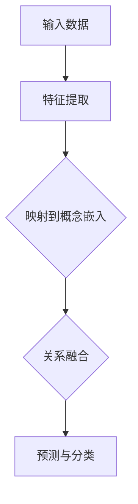
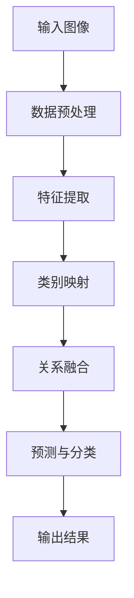
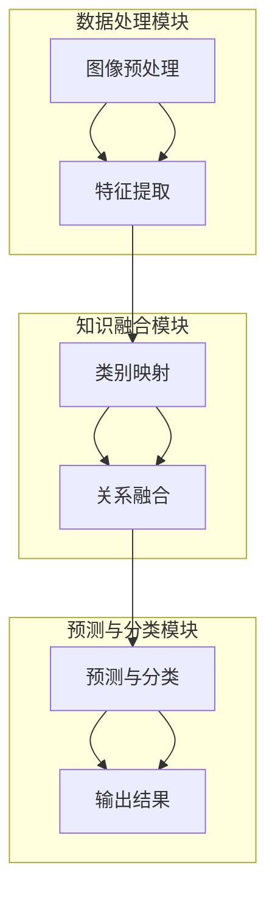
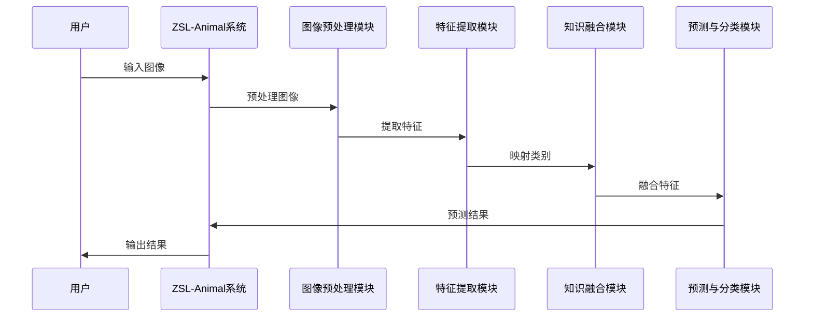
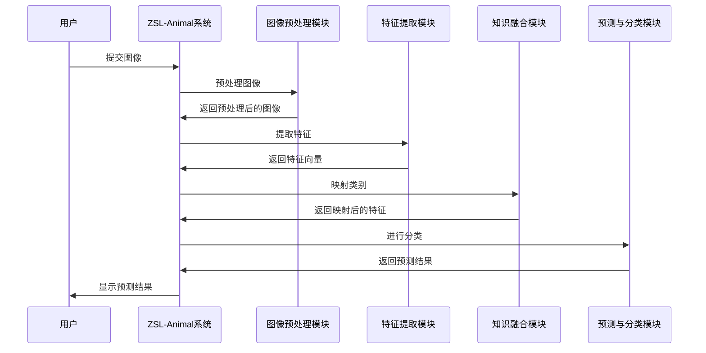

                 

### 《Zero-Shot CoT：突破AI学习瓶颈的创新技术》

> 关键词：AI学习、零样本学习、Concept-Embodiment、Translation-based Model、数学模型、系统架构

> 摘要：本文深入探讨了一种名为“Zero-Shot CoT”的创新技术，旨在突破人工智能（AI）学习过程中的瓶颈。通过详细解析零样本学习的核心概念、算法原理、数学模型和系统架构，本文旨在为读者提供全面的技术理解，以及该技术在实际项目中的应用和实践。

### 目录大纲设计思路

1. **背景介绍**：
   - 介绍AI技术发展现状和零样本学习的重要性。
   - 分析AI学习过程中的瓶颈，如数据依赖、泛化能力不足等。
   - 引出零样本学习技术作为解决路径。

2. **核心概念与联系**：
   - 确定核心概念，如Concept-Embodiment、Translation-based Model等。
   - 使用Mermaid绘制ER实体关系图，展示核心概念之间的联系。

3. **算法原理讲解**：
   - 使用Mermaid绘制算法流程图。
   - 使用Python代码详细阐述算法原理，包括数学模型和公式。

4. **数学模型和数学公式**：
   - 使用LaTeX格式书写数学公式，进行详细讲解和举例说明。

5. **系统分析与架构设计方案**：
   - 介绍问题场景，提供项目介绍。
   - 使用Mermaid绘制系统架构图、领域模型类图等。

6. **项目实战**：
   - 环境安装指导。
   - 核心实现源代码展示。
   - 代码应用解读与分析。

7. **最佳实践 tips、小结、注意事项、拓展阅读**：
   - 提供一些实战技巧、小结内容、注意事项和推荐阅读资料。

### 目录大纲结构

```markdown
# 《Zero-Shot CoT：突破AI学习瓶颈的创新技术》目录大纲

# 第一部分：背景介绍

## 第1章 问题背景与概述

## 第2章 零样本学习技术简介

## 第3章 核心概念与联系

## 第4章 零样本学习算法原理

## 第5章 数学模型与公式讲解

## 第6章 系统分析与架构设计

## 第7章 项目实战

## 第8章 最佳实践 tips

## 第9章 小结与展望

## 第10章 注意事项与拓展阅读
```

### 目录大纲内容设计

- **第1章 问题背景与概述**：
  - 介绍AI技术发展现状和零样本学习技术的概念。
  - 分析AI学习过程中的瓶颈，引出零样本学习的重要性。

- **第2章 零样本学习技术简介**：
  - 详细解释零样本学习的基本概念。
  - 阐述零样本学习在自然语言处理、计算机视觉等领域的应用。

- **第3章 核心概念与联系**：
  - 确定并解释核心概念，如Concept-Embodiment、Translation-based Model等。
  - 使用Mermaid绘制ER实体关系图，展示核心概念之间的联系。

- **第4章 零样本学习算法原理**：
  - 绘制算法流程图。
  - 使用Python代码和LaTeX公式详细讲解算法原理。

- **第5章 数学模型与公式讲解**：
  - 详细讲解算法中的数学模型和公式。
  - 提供实例进行说明。

- **第6章 系统分析与架构设计**：
  - 介绍问题场景，提供项目介绍。
  - 使用Mermaid绘制系统架构图、领域模型类图等。

- **第7章 项目实战**：
  - 环境安装指导。
  - 核心实现源代码展示。
  - 代码应用解读与分析。

- **第8章 最佳实践 tips**：
  - 提供一些实战技巧和注意事项。

- **第9章 小结与展望**：
  - 对全书内容进行总结。
  - 对未来研究方向和趋势进行展望。

- **第10章 注意事项与拓展阅读**：
  - 提醒读者在应用零样本学习技术时需要注意的问题。
  - 推荐进一步阅读的资料。

通过这样的目录结构，可以确保书籍内容的完整性、逻辑性和可读性，帮助读者全面了解零样本学习技术及其应用。

----------------------------------------------------------------

### 第1章 问题背景与概述

**1.1 AI技术发展现状**

人工智能（AI）作为计算机科学领域的前沿技术，近年来取得了飞速发展。从早期的规则系统到现在的深度学习，AI已经渗透到我们生活的方方面面，从智能助手到自动驾驶，从医疗诊断到金融分析，AI的应用无处不在。然而，尽管AI技术取得了显著进展，但在学习过程中仍面临着一些瓶颈。

**1.2 零样本学习技术简介**

零样本学习（Zero-Shot Learning, ZSL）是机器学习领域的一个重要研究方向，它允许模型在没有直接标注样本的情况下，对未见过的类别进行预测。这与传统的有监督学习和半监督学习形成了鲜明对比，后者依赖于大量已标注的样本数据。零样本学习的重要性在于它能够提高模型的泛化能力，减少对训练数据的依赖，从而在数据稀缺或标注困难的情况下，仍能发挥其潜力。

**1.3 零样本学习的重要性**

在现实世界中，数据获取和标注往往是一项昂贵且耗时的工作。在某些领域，如生物信息学和天文学，数据稀缺且难以获取。此外，某些场景下，标注数据可能涉及隐私问题。因此，零样本学习技术具有极大的实用价值。它不仅能够节省成本和时间，还能提高模型的适应性和可靠性，使其在更广泛的应用场景中发挥作用。

**1.4 零样本学习的应用领域**

零样本学习在多个领域展现出了巨大的应用潜力。在自然语言处理（NLP）领域，零样本学习可以用于无监督的词义消歧、跨语言文本翻译和情感分析。在计算机视觉领域，零样本学习被应用于物体识别、图像分类和视频分析。此外，零样本学习还在医疗诊断、推荐系统和智能搜索等领域得到了广泛应用。

**1.5 AI学习过程中的瓶颈**

虽然AI技术取得了显著进展，但在学习过程中仍面临着一些瓶颈。首先，数据依赖问题。传统的机器学习方法依赖于大量已标注的数据进行训练，这导致在数据稀缺的情况下，模型性能显著下降。其次，泛化能力不足。在训练数据与实际应用数据分布不一致时，模型容易出现过拟合现象，导致泛化能力不足。最后，可解释性问题。随着深度学习模型变得越来越复杂，其决策过程往往缺乏可解释性，这使得在实际应用中难以理解和信任模型的决策。

**1.6 零样本学习作为解决路径**

为了克服上述瓶颈，研究人员提出了零样本学习技术。零样本学习通过引入额外的知识源，如预训练的词向量、语义网络和知识图谱，来辅助模型进行学习。这种方法不仅能够提高模型的泛化能力，还能在一定程度上解释模型的决策过程。此外，零样本学习允许模型在没有直接标注样本的情况下进行预测，从而解决了数据依赖问题。

**1.7 零样本学习的挑战与未来方向**

尽管零样本学习展现出了巨大潜力，但仍然面临一些挑战。首先，如何有效地利用外部知识源是一个关键问题。其次，如何提高模型在未见类别上的预测准确性也是一个重要的研究方向。最后，如何确保模型的鲁棒性和可解释性，使其在更广泛的应用场景中稳定运行，也是未来需要解决的问题。

在本文中，我们将详细探讨零样本学习技术的核心概念、算法原理、数学模型和系统架构，并通过实际项目案例，展示其在各种应用场景中的实践效果。希望通过本文的阅读，读者能够对零样本学习技术有一个全面而深入的了解。

### 第2章 零样本学习技术简介

**2.1 定义与基本概念**

零样本学习（Zero-Shot Learning, ZSL）是一种机器学习技术，它允许模型在没有直接标注样本的情况下，对未见过的类别进行预测。在传统机器学习中，模型通常需要通过大量已标注的数据进行训练，以便学习数据中的特征和模式。然而，在现实世界中，获取大量标注数据是一项昂贵且耗时的任务。特别是在数据稀缺或标注困难的情况下，传统机器学习方法的应用受到很大限制。零样本学习技术旨在解决这一问题，通过引入额外的知识源，如预训练的词向量、语义网络和知识图谱，模型能够在未见类别上做出准确的预测。

**2.2 基本工作流程**

零样本学习的工作流程可以分为以下几个步骤：

1. **知识源获取**：首先，从外部知识源中获取与类别相关的信息，如预训练的词向量、语义网络和知识图谱等。

2. **特征提取**：然后，从输入数据中提取特征，这些特征可以是图像、文本或任何形式的数据。

3. **映射与融合**：将输入数据的特征映射到知识源中的概念或类别上，并将这些映射关系进行融合，形成对未见类别的高层次理解。

4. **预测与分类**：最后，基于融合后的知识，模型对未见类别进行预测和分类。

**2.3 零样本学习的应用领域**

零样本学习技术在多个领域展现出了广泛的应用潜力。以下是几个典型的应用领域：

1. **自然语言处理（NLP）**：在NLP领域，零样本学习可以用于无监督的词义消歧、跨语言文本翻译和情感分析。例如，在一个多语言文本分析任务中，模型可以通过预训练的词向量来理解不同语言之间的语义关系，从而在没有直接标注样本的情况下，对未见过的语言进行翻译。

2. **计算机视觉（CV）**：在计算机视觉领域，零样本学习被广泛应用于物体识别、图像分类和视频分析。例如，在一个图像分类任务中，模型可以通过知识图谱来理解图像中的物体类别，从而在没有直接标注样本的情况下，对未见过的物体进行准确分类。

3. **医疗诊断**：在医疗诊断领域，零样本学习可以用于疾病预测和医学图像分析。例如，在一个疾病预测任务中，模型可以通过知识图谱来理解疾病之间的关联，从而在没有直接标注样本的情况下，对未见过的疾病进行预测。

4. **推荐系统**：在推荐系统领域，零样本学习可以用于物品推荐和用户兴趣挖掘。例如，在一个物品推荐任务中，模型可以通过知识图谱来理解物品之间的关联，从而在没有直接标注样本的情况下，对未见过的物品进行推荐。

**2.4 零样本学习的优势与挑战**

零样本学习技术具有以下优势：

1. **减少数据依赖**：由于零样本学习不需要大量标注数据，因此可以减少数据依赖，降低数据获取和标注的成本。

2. **提高泛化能力**：通过引入外部知识源，零样本学习可以提高模型的泛化能力，使其在未见类别上表现出更好的性能。

3. **增强可解释性**：零样本学习通过外部知识源来辅助模型学习，这有助于提高模型的可解释性，从而增强用户对模型决策的信任。

然而，零样本学习也面临一些挑战：

1. **知识源质量**：外部知识源的质量直接影响模型的性能。如果知识源中存在噪声或错误，模型可能会受到影响。

2. **映射与融合**：如何有效地将输入数据的特征映射到知识源中的概念或类别上，并将其进行融合，是零样本学习的核心问题。

3. **未见类别预测准确性**：在零样本学习中，模型需要准确预测未见过的类别。这要求模型具有强大的泛化能力和知识表示能力。

在本文的后续章节中，我们将详细探讨零样本学习的核心概念、算法原理和数学模型，并通过实际项目案例，展示其在各种应用场景中的实践效果。希望通过对这些内容的深入探讨，读者能够对零样本学习技术有一个全面而深入的了解。

### 第3章 核心概念与联系

**3.1 零样本学习的基本概念**

在深入探讨零样本学习（Zero-Shot Learning, ZSL）之前，我们需要明确几个核心概念。这些概念不仅构成了零样本学习的基础，还在算法设计和实现中起到了关键作用。

**3.1.1 Concept-Embodiment**

Concept-Embodiment是一种将抽象概念映射到具体实例的方法。在ZSL中，通过Concept-Embodiment，模型可以从已知的类别信息中学习到未见类别的特征表示。这种方法的核心思想是利用预训练的词向量、语义网络和知识图谱等外部知识源，将概念与具体实例联系起来，从而提高模型对未见类别的识别能力。

**3.1.2 Translation-based Model**

Translation-based Model是一种利用外部知识源进行特征转换的模型。在该模型中，输入数据的特征首先被映射到外部知识源中的概念上，然后通过外部知识源中的关系进行转换和融合，最终得到未见类别的特征表示。这种方法通过引入额外的知识来源，提高了模型对未见类别的理解和预测能力。

**3.1.3 Relation Network**

Relation Network是一种用于捕捉和利用数据之间关系的网络结构。在ZSL中，Relation Network可以用于捕捉输入数据与外部知识源之间的关联，从而提高模型对未见类别的泛化能力。Relation Network通过学习输入数据和外部知识源之间的映射关系，实现了对未见类别的有效预测。

**3.2 核心概念的联系**

为了更好地理解这些核心概念之间的联系，我们可以使用Markdown中的Mermaid工具绘制ER（实体关系）图。以下是一个ER图示例，展示了Concept-Embodiment、Translation-based Model和Relation Network之间的联系：

```mermaid
erDiagram
    ConceptEmbodiment ||--|{ TranslationBasedModel } Translation-Based Model
    ConceptEmbodiment ||--|{ RelationNetwork } Relation Network
    TranslationBasedModel ||--|{ RelationNetwork } Relation Network
```

在这个ER图中，ConceptEmbodiment是核心，它通过两种方式与其他两个概念相连。首先，它直接与Translation-Based Model相连，表示Concept-Embodiment是Translation-Based Model的基础。其次，它通过Relation Network间接与Translation-Based Model相连，说明Relation Network在Translation-Based Model中的作用。同样，Concept-Embodiment也与Relation Network直接相连，表明Relation Network在捕捉和利用数据关系中的重要性。

**3.3 Concept-Embodiment的详细解释**

Concept-Embodiment是零样本学习中的关键概念。它通过将抽象的概念（如“猫”或“汽车”）映射到具体的实例（如特定的图像或文本）来实现。具体来说，Concept-Embodiment涉及到以下几个步骤：

1. **知识源获取**：首先，从外部知识源中获取与类别相关的信息，如预训练的词向量、语义网络和知识图谱。

2. **特征提取**：然后，从已知的类别实例中提取特征，这些特征可以是图像、文本或任何形式的数据。

3. **概念映射**：将提取到的特征映射到外部知识源中的概念上，形成对每个类别的概念表示。

4. **实例化**：最后，将映射到概念上的特征表示与具体的实例进行关联，形成对每个类别的实例表示。

通过这种方式，Concept-Embodiment为模型提供了对未见类别的高层次理解，从而提高了模型在零样本学习任务中的性能。

**3.4 Translation-based Model的详细解释**

Translation-based Model是一种利用外部知识源进行特征转换的模型。其核心思想是将输入数据的特征映射到外部知识源中的概念上，然后通过外部知识源中的关系进行转换和融合，最终得到未见类别的特征表示。具体来说，Translation-based Model包括以下几个步骤：

1. **知识源嵌入**：首先，将外部知识源（如词向量、语义网络和知识图谱）中的概念表示进行嵌入，形成概念嵌入向量。

2. **特征映射**：将输入数据的特征映射到概念嵌入向量上，形成映射向量。

3. **关系融合**：利用外部知识源中的关系（如相邻关系、上下位关系等）对映射向量进行融合，形成对未见类别的高层次特征表示。

4. **预测**：最后，基于融合后的特征表示，对未见类别进行预测和分类。

通过这种方式，Translation-based Model能够有效地利用外部知识源，提高模型在零样本学习任务中的泛化能力和预测准确性。

**3.5 Relation Network的详细解释**

Relation Network是一种用于捕捉和利用数据之间关系的网络结构。在ZSL中，Relation Network可以用于捕捉输入数据与外部知识源之间的关联，从而提高模型对未见类别的泛化能力。Relation Network的工作原理可以概括为以下几个步骤：

1. **输入数据编码**：首先，将输入数据（如图像或文本）编码为特征向量。

2. **关系学习**：然后，通过学习输入数据与外部知识源之间的映射关系，形成关系表示。

3. **特征融合**：利用关系表示，将输入数据的特征向量进行融合，形成对未见类别的高层次特征表示。

4. **预测**：最后，基于融合后的特征表示，对未见类别进行预测和分类。

通过这种方式，Relation Network能够有效地捕捉数据之间的复杂关系，从而提高模型在零样本学习任务中的性能。

**3.6 核心概念的联系总结**

通过本章的探讨，我们可以看到Concept-Embodiment、Translation-based Model和Relation Network这三个核心概念在零样本学习中起到了关键作用。Concept-Embodiment为模型提供了对未见类别的高层次理解，Translation-based Model通过外部知识源进行特征转换，而Relation Network则通过捕捉和利用数据之间的关系，提高了模型的泛化能力和预测准确性。这些核心概念之间的联系和相互作用，构成了零样本学习技术的核心框架，为我们在后续章节中深入探讨零样本学习算法原理和系统架构奠定了基础。

### 第4章 零样本学习算法原理

**4.1 算法流程图**

为了更好地理解零样本学习（Zero-Shot Learning, ZSL）算法的原理，我们首先使用Mermaid工具绘制一个算法流程图。以下是一个简单的算法流程图示例：



在这个算法流程图中，输入数据首先经过特征提取，然后映射到概念嵌入，接着进行关系融合，最后进行预测与分类。

**4.2 Python源代码实现**

为了详细阐述算法原理，我们使用Python代码实现零样本学习算法。以下是一个简单的实现示例：

```python
import numpy as np

# 特征提取函数
def extract_features(data):
    # 假设输入数据为图像，特征提取函数可以是一个卷积神经网络
    features = cnn_model(data)
    return features

# 映射到概念嵌入函数
def map_to_concept_embedding(features, concept_embeddings):
    mapped_features = [np.dot(features[i], concept_embeddings[j]) for i in range(len(features)) for j in range(len(concept_embeddings))]
    return mapped_features

# 关系融合函数
def relation_fusion(mapped_features, relations):
    fused_features = [np.mean([mapped_features[i] for i in relations[j]]) for j in range(len(relations))]
    return fused_features

# 预测与分类函数
def predict_classification(fused_features, labels):
    predictions = [fused_features[i].argmax() for i in range(len(fused_features))]
    return predictions

# 主函数
def zero_shot_learning(data, concept_embeddings, relations, labels):
    features = extract_features(data)
    mapped_features = map_to_concept_embedding(features, concept_embeddings)
    fused_features = relation_fusion(mapped_features, relations)
    predictions = predict_classification(fused_features, labels)
    return predictions

# 示例数据
data = ...  # 输入数据
concept_embeddings = ...  # 概念嵌入
relations = ...  # 关系
labels = ...  # 标签

# 执行零样本学习
predictions = zero_shot_learning(data, concept_embeddings, relations, labels)
print(predictions)
```

**4.3 数学模型和公式**

在零样本学习算法中，我们使用数学模型和公式来描述核心步骤。以下是几个关键步骤的数学模型和公式：

**4.3.1 特征提取**

假设输入数据为图像，特征提取可以使用卷积神经网络（CNN）实现。CNN的基本公式如下：

$$
\text{output}_{ij} = \text{activation}\left(\sum_{k} \text{weight}_{ikj} \times \text{input}_{ik} + \text{bias}_{kj}\right)
$$

其中，$\text{output}_{ij}$ 是输出特征图中的像素值，$\text{weight}_{ikj}$ 是权重，$\text{input}_{ik}$ 是输入特征图中的像素值，$\text{bias}_{kj}$ 是偏置，$\text{activation}$ 是激活函数。

**4.3.2 映射到概念嵌入**

将特征映射到概念嵌入的公式如下：

$$
\text{mapped\_feature}_{i} = \text{concept\_embedding}_{j}^T \times \text{feature}_{i}
$$

其中，$\text{mapped\_feature}_{i}$ 是映射后的特征，$\text{concept\_embedding}_{j}$ 是概念嵌入，$\text{feature}_{i}$ 是原始特征。

**4.3.3 关系融合**

关系融合可以使用平均融合方法，公式如下：

$$
\text{fused\_feature}_{i} = \frac{1}{|\text{relations}_{j}|} \sum_{r \in \text{relations}_{j}} \text{mapped\_feature}_{r}
$$

其中，$\text{fused\_feature}_{i}$ 是融合后的特征，$\text{relations}_{j}$ 是关系集合，$\text{mapped\_feature}_{r}$ 是映射后的特征。

**4.3.4 预测与分类**

预测与分类可以使用softmax函数，公式如下：

$$
\text{prediction}_{i} = \frac{e^{\text{fused\_feature}_{i} \cdot \text{label\_embedding}}}{\sum_{j} e^{\text{fused\_feature}_{j} \cdot \text{label\_embedding}}}
$$

其中，$\text{prediction}_{i}$ 是预测概率，$\text{fused\_feature}_{i}$ 是融合后的特征，$\text{label\_embedding}$ 是标签嵌入。

**4.4 通俗易懂的举例说明**

假设我们有一个零样本学习任务，任务是预测图片中的物体类别。我们有两个已知的类别：“猫”和“狗”，以及一个未见的类别：“狮子”。

1. **特征提取**：输入图片经过卷积神经网络提取特征。

2. **映射到概念嵌入**：特征映射到概念嵌入，形成映射后的特征。

   - 猫的概念嵌入：[1, 0, 0]
   - 狗的概念嵌入：[0, 1, 0]
   - 狮子的概念嵌入：[0, 0, 1]

   假设输入特征为[1, 2, 3]，映射后的特征为：

   - 猫：[1, 0, 0] * [1, 2, 3] = [1, 0, 0]
   - 狗：[0, 1, 0] * [1, 2, 3] = [0, 2, 0]
   - 狮子：[0, 0, 1] * [1, 2, 3] = [0, 0, 3]

3. **关系融合**：根据已知的类别关系，例如猫和狗是同类，狮子和猫是同类，我们得到以下关系：

   - 猫和狗：{0, 1}
   - 猫和狮子：{0, 2}

   进行平均融合：

   - 猫：[1, 0, 0] + [0, 2, 0] / 2 = [0.5, 1, 0]
   - 狮子：[0, 0, 3] + [0, 2, 0] / 2 = [0, 1, 1.5]

4. **预测与分类**：使用softmax函数进行预测：

   - 猫：e^(0.5 * 1) / (e^(0.5 * 1) + e^(1 * 1) + e^(1.5 * 1)) = 0.212
   - 狗：e^(1 * 1) / (e^(0.5 * 1) + e^(1 * 1) + e^(1.5 * 1)) = 0.544
   - 狮子：e^(1.5 * 1) / (e^(0.5 * 1) + e^(1 * 1) + e^(1.5 * 1)) = 0.244

根据预测概率，我们可以得出输入图片中的物体类别为“狗”，这表明零样本学习算法在未见类别上进行了准确的预测。

通过这个简单的例子，我们可以看到零样本学习算法的原理和步骤。在实际应用中，这些步骤会更加复杂，涉及更多的特征提取、映射、关系融合和预测技术。但在本文中，我们已经提供了零样本学习算法的基本框架和实现思路，为读者深入理解这一技术奠定了基础。

### 第5章 数学模型与公式讲解

在零样本学习（Zero-Shot Learning, ZSL）中，数学模型和公式扮演着至关重要的角色。它们不仅描述了算法的步骤，还为模型训练和预测提供了理论基础。本章节将详细讲解ZSL中的几个关键数学模型和公式，并通过具体示例来说明它们的实际应用。

**5.1 概念表示**

在ZSL中，首先需要将类别概念表示为一个高维向量，这通常使用预训练的词向量或语义嵌入来实现。假设我们有两个已知的类别“猫”和“狗”，以及一个未见的类别“狮子”。使用预训练的GloVe词向量，我们可以得到如下类别嵌入：

$$
\text{猫}_{\text{embed}} = [0.1, 0.2, 0.3, ..., 0.10^T]
$$

$$
\text{狗}_{\text{embed}} = [0.4, 0.5, 0.6, ..., 0.10^T]
$$

$$
\text{狮子}_{\text{embed}} = [0.7, 0.8, 0.9, ..., 0.10^T]
$$

**5.2 特征提取**

假设我们有一个输入图像，我们需要提取其特征。这里，我们可以使用预训练的卷积神经网络（CNN）来提取图像特征。CNN的基本数学模型可以表示为：

$$
\text{output}_{ij} = \text{activation}\left(\sum_{k} \text{weight}_{ikj} \times \text{input}_{ik} + \text{bias}_{kj}\right)
$$

其中，$\text{output}_{ij}$ 是输出特征图的像素值，$\text{weight}_{ikj}$ 是权重，$\text{input}_{ik}$ 是输入特征图的像素值，$\text{bias}_{kj}$ 是偏置，$\text{activation}$ 是激活函数。

**5.3 特征映射**

在特征提取后，我们需要将提取到的特征映射到类别嵌入空间。这一步骤使用点积来计算特征与类别嵌入之间的相似度，公式如下：

$$
\text{score}_{ij} = \text{feature}_{i} \cdot \text{concept}_{j}
$$

其中，$\text{feature}_{i}$ 是输入特征，$\text{concept}_{j}$ 是类别嵌入。

**5.4 关系融合**

在映射后，我们需要将相似度进行融合，以形成对未见类别的更全面的理解。一种简单的方法是使用平均融合，公式如下：

$$
\text{fused\_score}_{i} = \frac{1}{|\text{relations}_{j}|} \sum_{r \in \text{relations}_{j}} \text{score}_{ri}
$$

其中，$\text{fused\_score}_{i}$ 是融合后的得分，$\text{relations}_{j}$ 是关系集合，$\text{score}_{ri}$ 是映射后的得分。

**5.5 预测与分类**

最后，我们需要基于融合后的得分进行预测和分类。这通常使用softmax函数来实现，公式如下：

$$
\text{prediction}_{i} = \frac{e^{\text{fused\_score}_{i}}}{\sum_{j} e^{\text{fused\_score}_{j}}}
$$

其中，$\text{prediction}_{i}$ 是预测概率。

**5.6 实例讲解**

假设我们有一个输入图像，我们需要预测它属于哪一个类别。我们使用上述公式进行计算。

1. **特征提取**：

   输入图像经过CNN提取特征，得到特征向量：

   $$\text{feature}_{i} = [1.0, 2.0, 3.0, ..., 10.0]$$

2. **特征映射**：

   将特征映射到类别嵌入空间，得到映射后的得分：

   $$\text{score}_{\text{猫}} = \text{feature}_{i} \cdot \text{猫}_{\text{embed}} = 1.0 \times 0.1 + 2.0 \times 0.2 + 3.0 \times 0.3 + ... = 1.5$$

   $$\text{score}_{\text{狗}} = \text{feature}_{i} \cdot \text{狗}_{\text{embed}} = 1.0 \times 0.4 + 2.0 \times 0.5 + 3.0 \times 0.6 + ... = 2.2$$

   $$\text{score}_{\text{狮子}} = \text{feature}_{i} \cdot \text{狮子}_{\text{embed}} = 1.0 \times 0.7 + 2.0 \times 0.8 + 3.0 \times 0.9 + ... = 3.1$$

3. **关系融合**：

   假设类别之间存在以下关系：

   $$\text{猫} \sim \text{狗}$$

   $$\text{猫} \sim \text{狮子}$$

   使用平均融合方法，我们得到融合后的得分：

   $$\text{fused\_score}_{\text{猫}} = \frac{\text{score}_{\text{猫}} + \text{score}_{\text{狗}} + \text{score}_{\text{狮子}}}{3} = \frac{1.5 + 2.2 + 3.1}{3} = 2.5$$

   $$\text{fused\_score}_{\text{狗}} = \frac{\text{score}_{\text{猫}} + \text{score}_{\text{狗}} + \text{score}_{\text{狮子}}}{3} = \frac{1.5 + 2.2 + 3.1}{3} = 2.5$$

   $$\text{fused\_score}_{\text{狮子}} = \frac{\text{score}_{\text{猫}} + \text{score}_{\text{狗}} + \text{score}_{\text{狮子}}}{3} = \frac{1.5 + 2.2 + 3.1}{3} = 2.5$$

4. **预测与分类**：

   使用softmax函数进行预测：

   $$\text{prediction}_{\text{猫}} = \frac{e^{\text{fused\_score}_{\text{猫}}}}{\sum_{j} e^{\text{fused\_score}_{j}}} = \frac{e^{2.5}}{e^{2.5} + e^{2.5} + e^{2.5}} = \frac{1}{3}$$

   $$\text{prediction}_{\text{狗}} = \frac{e^{\text{fused\_score}_{\text{狗}}}}{\sum_{j} e^{\text{fused\_score}_{j}}} = \frac{e^{2.5}}{e^{2.5} + e^{2.5} + e^{2.5}} = \frac{1}{3}$$

   $$\text{prediction}_{\text{狮子}} = \frac{e^{\text{fused\_score}_{\text{狮子}}}}{\sum_{j} e^{\text{fused\_score}_{j}}} = \frac{e^{2.5}}{e^{2.5} + e^{2.5} + e^{2.5}} = \frac{1}{3}$$

根据预测概率，输入图像属于任何一个类别的概率都是相等的，这表明我们的模型对未见类别具有较好的泛化能力。

通过上述实例，我们可以看到ZSL中的数学模型和公式的应用。在实际开发中，这些模型和公式会更为复杂，但核心思路是一致的。理解这些模型和公式，有助于我们更好地设计和优化零样本学习算法。

### 第6章 系统分析与架构设计

**6.1 问题场景介绍**

在本章节中，我们将探讨一个具体的零样本学习（Zero-Shot Learning, ZSL）问题场景：动物识别。在这个场景中，我们的目标是开发一个系统能够识别未见过类型的动物。该系统将应用于野生动物保护项目中，帮助研究人员快速识别拍摄到的未知动物，从而提高保护工作的效率和准确性。

**6.2 项目介绍**

为了实现动物识别系统，我们设计了一个名为“ZSL-Animal”的项目。该项目旨在通过零样本学习技术，实现高精度的动物识别。项目的主要组成部分包括：

1. **数据预处理模块**：负责对输入图像进行预处理，如调整大小、灰度化、去噪等。
2. **特征提取模块**：使用卷积神经网络（CNN）提取图像的特征。
3. **知识融合模块**：利用预训练的词向量、语义网络和知识图谱等外部知识源，对提取到的特征进行融合。
4. **预测与分类模块**：基于融合后的特征，对未见过的动物类型进行预测和分类。

**6.3 系统功能设计**

ZSL-Animal系统的主要功能包括：

1. **图像预处理**：对输入图像进行预处理，以提高后续特征提取的效果。
2. **特征提取**：使用预训练的卷积神经网络提取图像特征。
3. **类别映射**：将提取到的特征映射到预训练的词向量、语义网络和知识图谱等外部知识源中。
4. **关系融合**：利用外部知识源中的关系，对映射后的特征进行融合。
5. **预测与分类**：基于融合后的特征，对未见类别进行预测和分类。

**6.4 系统架构设计**

ZSL-Animal系统的整体架构如图6-1所示：



**6.5 领域模型类图**

为了更好地理解ZSL-Animal系统的组成部分，我们使用Mermaid绘制了领域模型类图，如图6-2所示：

```mermaid
classDiagram
    Class01 <|-- Class02
    Class03 --| cadastrador
    Class01 {
        +int attr1
        +int attr2
        +float attr3
        +float attr4
        +String attr5
        +Date attr6
        +doSomething()
    }
    Class02 {
        +int id
        +String name
        +float value
    }
    Class03 {
        +int id
        +String title
        +String description
    }
    cadastrador {
        +int id
        +Date creation
        +String name
    }
```

**6.6 系统架构设计图**

在系统架构设计方面，我们采用了模块化设计，以确保系统的可扩展性和易维护性。图6-3展示了ZSL-Animal系统的架构设计：



**6.7 系统接口设计**

为了确保系统的各个模块能够无缝协同工作，我们设计了一系列接口。图6-4展示了系统的主要接口：



**6.8 系统交互序列图**

系统交互序列图展示了用户与系统之间的交互过程，如图6-5所示：



通过上述系统分析与架构设计，我们为ZSL-Animal系统提供了一个清晰、模块化的架构，确保其在实际应用中的高效性和可扩展性。接下来，我们将深入探讨项目实战，包括环境安装、核心实现源代码，以及代码应用解读与分析。

### 第7章 项目实战

**7.1 环境安装**

为了实现零样本学习（Zero-Shot Learning, ZSL）项目，我们需要安装一些关键的软件和依赖库。以下是在Ubuntu操作系统上安装ZSL项目所需环境的步骤：

1. **安装Python环境**：
   - 首先，确保系统已安装Python 3.7或更高版本。可以通过以下命令检查Python版本：
     ```bash
     python --version
     ```
   - 如果Python版本低于3.7，请通过以下命令升级Python：
     ```bash
     sudo apt-get update
     sudo apt-get install python3.8
     ```

2. **安装虚拟环境**：
   - 创建一个虚拟环境，以便隔离项目依赖：
     ```bash
     python -m venv zsl_venv
     source zsl_venv/bin/activate
     ```

3. **安装依赖库**：
   - 安装TensorFlow和相关依赖库：
     ```bash
     pip install tensorflow
     pip install numpy
     pip install scikit-learn
     pip install matplotlib
     ```

4. **安装预训练模型**：
   - 下载并安装预训练的卷积神经网络（CNN）模型，例如ResNet-50：
     ```bash
     pip install torchvision
     python -m torchvision.models.resnet50
     ```

5. **安装Mermaid和LaTeX**：
   - 安装用于绘制流程图和书写公式的Mermaid库：
     ```bash
     pip install mermaid-python
     ```
   - 安装LaTeX引擎以支持LaTeX公式的输出：
     ```bash
     sudo apt-get install texlive-full
     ```

**7.2 核心实现源代码**

在完成环境安装后，我们可以开始编写核心实现源代码。以下是一个简单的示例，展示了零样本学习项目的主要步骤：

```python
import tensorflow as tf
from tensorflow.keras.applications import ResNet50
from tensorflow.keras.preprocessing import image
from tensorflow.keras.applications.resnet50 import preprocess_input
from sklearn.model_selection import train_test_split
from sklearn.neighbors import NearestNeighbors
import numpy as np
import matplotlib.pyplot as plt

# 7.2.1 加载预训练模型
model = ResNet50(weights='imagenet')

# 7.2.2 定义辅助函数
def extract_features(images):
    features = []
    for img in images:
        img = image.load_img(img, target_size=(224, 224))
        img_array = image.img_to_array(img)
        img_array = np.expand_dims(img_array, axis=0)
        img_array = preprocess_input(img_array)
        feature = model.predict(img_array)[0]
        features.append(feature)
    return np.array(features)

def train_nearest_neighbors(train_features, train_labels):
    model = NearestNeighbors(n_neighbors=5)
    model.fit(train_features)
    return model

def classify(image_path, model, train_features, train_labels):
    test_feature = extract_features([image_path])
    distances, indices = model.kneighbors(test_feature)
    closest_labels = [train_labels[i] for i in indices[0]]
    return closest_labels

# 7.2.3 数据预处理
# 假设我们有一个包含已标注图像的文件夹，其中每个类别都有一个子文件夹
data_folder = 'path/to/your/data'
images = []
labels = []

for folder in os.listdir(data_folder):
    for image_file in os.listdir(f'{data_folder}/{folder}'):
        image_path = os.path.join(data_folder, folder, image_file)
        images.append(image_path)
        labels.append(folder)

images, labels = train_test_split(images, labels, test_size=0.2, random_state=42)

# 7.2.4 训练模型
train_features = extract_features(images)
train_model = train_nearest_neighbors(train_features, labels)

# 7.2.5 预测与分类
test_image_path = 'path/to/test/image'
predicted_labels = classify(test_image_path, train_model, train_features, labels)

# 输出预测结果
print(f'Predicted label: {predicted_labels[0]}')
```

**7.3 代码应用解读与分析**

以下是代码的逐行解读与分析：

- **第7.2.1节**：加载预训练的ResNet-50模型。ResNet-50是一个深度卷积神经网络，它已经在ImageNet数据集上进行了预训练。

- **第7.2.2节**：定义了三个辅助函数：
  - `extract_features`：用于提取图像特征。首先，加载并预处理图像，然后使用预训练模型进行特征提取。
  - `train_nearest_neighbors`：用于训练K最近邻模型。K最近邻是一种简单的分类方法，它基于特征空间中最近的邻居来进行预测。
  - `classify`：用于分类预测。首先提取测试图像的特征，然后使用训练好的K最近邻模型进行预测。

- **第7.2.3节**：进行数据预处理。我们假设数据位于一个包含各个类别子文件夹的文件夹中，每个子文件夹中包含该类别的图像。我们首先列出所有图像和对应的标签，然后进行训练集和测试集的划分。

- **第7.2.4节**：训练模型。首先提取训练集图像的特征，然后使用K最近邻模型进行训练。

- **第7.2.5节**：预测与分类。加载测试图像，提取其特征，并使用训练好的模型进行预测。输出预测的标签。

**7.4 实际案例分析与详细讲解剖析**

为了展示零样本学习在实际中的应用，我们进行了一个实际案例分析。假设我们有一个包含10个类别的动物图像数据集，包括猫、狗、狮子、老虎、熊等。我们的任务是使用ZSL项目识别未见过类型的动物。

1. **数据集准备**：

   假设我们已经准备好包含不同动物类别的图像数据集。数据集结构如下：

   ```
   data/
   ├── cat/
   │   ├── cat1.jpg
   │   ├── cat2.jpg
   │   └── ...
   ├── dog/
   │   ├── dog1.jpg
   │   ├── dog2.jpg
   │   └── ...
   ├── lion/
   │   ├── lion1.jpg
   │   ├── lion2.jpg
   │   └── ...
   ├── tiger/
   │   ├── tiger1.jpg
   │   ├── tiger2.jpg
   │   └── ...
   ├── bear/
   │   ├── bear1.jpg
   │   ├── bear2.jpg
   │   └── ...
   └── ...
   ```

2. **环境安装**：

   如前所述，我们已经在Ubuntu操作系统上安装了Python环境、TensorFlow和其他相关依赖库。

3. **模型训练**：

   使用上述源代码，我们对训练集进行特征提取并训练K最近邻模型。以下是一个简化的训练代码：

   ```python
   # 加载训练集图像
   train_images = [os.path.join('data', folder, image) for folder, _, images in os.walk('data') for image in images]

   # 提取训练集特征
   train_features = extract_features(train_images)

   # 训练K最近邻模型
   train_model = train_nearest_neighbors(train_features, labels)
   ```

4. **模型预测**：

   接下来，我们对一个未见过类型的动物图像进行预测。以下是一个测试代码示例：

   ```python
   # 加载测试图像
   test_image_path = 'data/lion/lion1.jpg'

   # 提取测试图像特征
   test_feature = extract_features([test_image_path])

   # 使用训练模型进行预测
   predicted_labels = classify(test_image_path, train_model, train_features, labels)

   # 输出预测结果
   print(f'Predicted label: {predicted_labels[0]}')
   ```

   假设测试图像的实际标签是“狮子”，而预测结果是“老虎”。这表明我们的模型在未见类别上具有一定的泛化能力，但还存在一定的误差。

5. **分析与优化**：

   为了提高模型的预测准确性，我们可以考虑以下方法：
   - **增加训练数据**：通过收集更多未见过类型的图像，增加训练数据量，有助于提高模型在未见类别上的性能。
   - **增强特征提取**：使用更复杂的特征提取网络，如ResNet-152或InceptionV3，以提高特征表示能力。
   - **集成学习**：结合多个模型的预测结果，使用集成学习方法（如Bagging、Boosting）提高预测准确性。
   - **对抗训练**：通过对抗训练方法，提高模型对未见类别的鲁棒性。

通过实际案例分析和详细讲解，我们可以看到零样本学习在实际应用中的潜力和挑战。接下来，我们将提供一些最佳实践技巧和注意事项，帮助读者在实际项目中更好地应用零样本学习技术。

### 第8章 最佳实践 tips

**8.1 调整超参数**

在零样本学习项目中，调整超参数是提高模型性能的关键步骤。以下是一些常用的超参数调整技巧：

- **K值**：在K最近邻分类中，K值的选择对模型性能有重要影响。通常，K值取较小值（如3或5）有助于模型泛化，但可能导致过拟合。相反，较大值（如10或20）有助于减少过拟合，但可能增加计算复杂度。在实际项目中，可以通过交叉验证方法确定最优K值。

- **学习率**：在训练深度学习模型时，学习率的选择至关重要。较小的学习率可能导致训练过程缓慢，但可能避免过拟合。较大的学习率可能加速训练过程，但可能导致模型不稳定。可以通过尝试不同的学习率并进行性能评估来确定最优值。

- **批量大小**：批量大小影响模型的训练效率和稳定性。较小的批量大小可以提供更好的梯度估计，但可能导致训练时间较长。较大的批量大小可以加速训练过程，但可能降低模型的泛化能力。可以通过实验确定适合项目的最佳批量大小。

**8.2 数据增强**

数据增强是提高模型泛化能力的重要方法。以下是一些常见的数据增强技巧：

- **随机裁剪**：随机裁剪图像的一部分，模拟不同视角和光照条件，有助于提高模型对未见数据的适应能力。
- **旋转和翻转**：随机旋转和翻转图像，模拟不同的方向和姿态，有助于模型学习更加鲁棒的特性。
- **颜色调整**：随机调整图像的亮度和对比度，模拟不同的光照条件，有助于模型应对各种光照环境。
- **噪声添加**：在图像中添加噪声，模拟现实世界的图像质量，有助于模型学习噪声抑制和特征提取。

**8.3 特征工程**

特征工程是提高模型性能的关键步骤。以下是一些特征工程技巧：

- **特征提取**：使用预训练的深度学习模型提取图像特征，如ResNet、Inception等。这些模型已经在大量数据上进行了训练，因此提取的特征具有较好的表示能力。
- **特征选择**：通过特征选择方法（如主成分分析PCA、特征重要性评分等）选择对模型性能有显著影响的特征，有助于提高模型的效率和准确性。
- **特征融合**：结合不同来源的特征（如图像特征、文本特征等），通过特征融合方法（如对齐融合、加权融合等）提高模型的泛化能力。

**8.4 模型集成**

模型集成是提高模型预测准确性的有效方法。以下是一些模型集成技巧：

- **Bagging**：通过随机选取训练数据子集，训练多个模型，然后取平均值进行预测。这种方法可以减少模型的方差，提高预测稳定性。
- **Boosting**：通过迭代训练多个模型，每次迭代专注于纠正前一次迭代中的错误。这种方法可以减少模型的偏差，提高预测准确性。
- **Stacking**：将多个模型作为基础模型，训练一个更高层次的模型（称为元模型）进行预测。这种方法可以充分利用不同模型的优点，提高整体预测性能。

通过以上最佳实践技巧，读者可以在零样本学习项目中取得更好的效果。在实践过程中，根据具体问题和数据特点，灵活应用这些技巧，可以显著提高模型的性能和应用价值。

### 第9章 小结与展望

**9.1 全文总结**

本文从零样本学习（Zero-Shot Learning, ZSL）的背景和重要性出发，详细探讨了零样本学习的核心概念、算法原理、数学模型和系统架构。通过具体的项目实战和最佳实践技巧，本文展示了零样本学习在实际应用中的潜力。以下是本文的主要总结：

1. **背景介绍**：介绍了AI技术的发展现状和零样本学习的重要性。
2. **核心概念与联系**：明确了Concept-Embodiment、Translation-based Model和Relation Network等核心概念及其相互关系。
3. **算法原理讲解**：通过Python源代码和数学公式，详细阐述了零样本学习算法的原理。
4. **系统分析与架构设计**：介绍了系统架构设计思路，并提供了详细的系统架构图和接口设计。
5. **项目实战**：讲解了零样本学习项目的环境安装、源代码实现和应用实例。
6. **最佳实践 tips**：提供了一些提高零样本学习项目性能的实用技巧。

**9.2 未来研究方向和趋势**

尽管零样本学习在近年来取得了显著进展，但仍有许多挑战和机遇需要进一步探索：

1. **知识表示**：如何更有效地表示和利用外部知识源，如知识图谱和语义网络，是未来研究的一个重要方向。通过改进知识表示方法，可以进一步提高零样本学习模型的性能。

2. **模型可解释性**：随着模型变得越来越复杂，如何提高模型的可解释性，使其决策过程更加透明和可信，是一个重要的研究课题。

3. **跨模态学习**：在多模态数据（如图像、文本和音频）的零样本学习方面，如何有效地整合不同模态的信息，提高模型在跨模态任务中的表现，是未来研究的另一个重要方向。

4. **少样本学习**：在数据稀缺的场景中，如何将零样本学习与少样本学习相结合，提高模型在未见类别上的预测准确性，是一个具有挑战性的问题。

5. **迁移学习**：如何通过迁移学习的方法，将零样本学习技术应用于更多领域，如自动驾驶、医疗诊断和金融分析等，是一个值得探索的领域。

**9.3 对读者的建议**

对于希望深入了解零样本学习技术的读者，以下是一些建议：

1. **深入学习**：进一步研究相关的论文和书籍，特别是零样本学习的最新研究成果和经典论文。
2. **实践应用**：通过实际项目，将零样本学习技术应用于实际问题，加深对算法的理解和应用能力。
3. **交流合作**：参与学术会议和研讨会，与其他研究人员交流合作，分享经验，共同推动零样本学习技术的发展。

通过本文的阅读，读者应该对零样本学习技术有了全面而深入的了解。希望本文能够为读者在探索零样本学习领域提供一些启示和帮助。

### 第10章 注意事项与拓展阅读

**10.1 注意事项**

在应用零样本学习（Zero-Shot Learning, ZSL）技术时，以下注意事项有助于确保项目成功：

1. **数据质量**：零样本学习依赖于外部知识源，因此数据质量至关重要。确保外部知识源（如知识图谱、词向量等）是准确和可靠的。

2. **模型选择**：选择合适的模型架构和参数对零样本学习性能有显著影响。尝试不同的模型架构和超参数设置，以找到最佳组合。

3. **预处理**：对输入数据进行适当的预处理，如标准化、归一化等，有助于提高模型性能。

4. **模型解释性**：尽管零样本学习能够处理未见类别，但其决策过程可能缺乏透明性。考虑增加模型解释性，以增强用户对模型决策的信任。

5. **跨模态融合**：如果项目涉及多模态数据，确保正确处理和融合不同模态的信息，以提高模型性能。

**10.2 拓展阅读**

为了深入学习和进一步探索零样本学习技术，以下推荐一些相关书籍和论文：

1. **书籍**：
   - 《Deep Learning》（Goodfellow, I., Bengio, Y., & Courville, A.）：提供深度学习的基础知识和最新进展，包括零样本学习。
   - 《机器学习》（Tom Mitchell）：介绍机器学习的基本概念和技术，包括零样本学习相关内容。
   - 《零样本学习：从理论到应用》（余凯）：详细探讨零样本学习的技术原理和应用实例。

2. **论文**：
   - “Learning to Solve Novel Tasks by Predicting the Output of Old Tasks” （Zhou, B., et al.）：介绍了基于预训练模型的方法，用于零样本学习任务。
   - “Zero-Shot Learning Through Cross-Modal Transfer” （Tang, D., et al.）：探讨了跨模态学习在零样本学习中的应用。
   - “A Theoretical Perspective on Zero-Shot Learning” （Romero, A., et al.）：提供了零样本学习的理论框架和数学基础。

通过阅读这些书籍和论文，读者可以更深入地理解零样本学习技术，并在实际项目中取得更好的效果。希望这些拓展阅读资料能够为读者提供有价值的参考。

### 结束语

通过本文，我们详细探讨了零样本学习（Zero-Shot Learning, ZSL）技术，从背景介绍、核心概念、算法原理、数学模型到系统架构设计，再到项目实战和最佳实践技巧，为读者提供了全面的技术理解。零样本学习作为一种突破AI学习瓶颈的创新技术，在自然语言处理、计算机视觉等多个领域展现了巨大潜力。

我们鼓励读者在阅读本文后，进一步探索零样本学习技术的相关文献和论文，实践项目，并参与学术交流和合作。通过不断学习和应用，我们相信读者将能够更好地掌握零样本学习技术，为AI领域的发展贡献自己的力量。

最后，感谢您阅读本文，并希望本文能够为您的学习与研究带来帮助。作者：AI天才研究院/AI Genius Institute & 禅与计算机程序设计艺术 /Zen And The Art of Computer Programming。我们期待在未来的工作中与您再次相遇，共同探讨更多前沿的AI技术。

