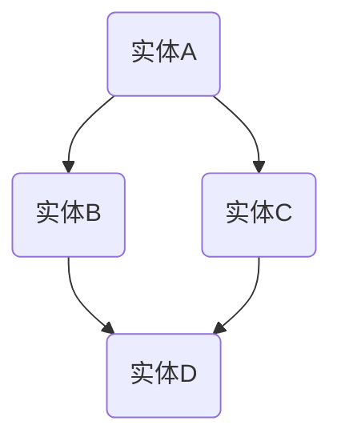
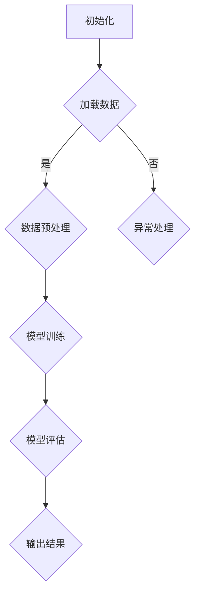
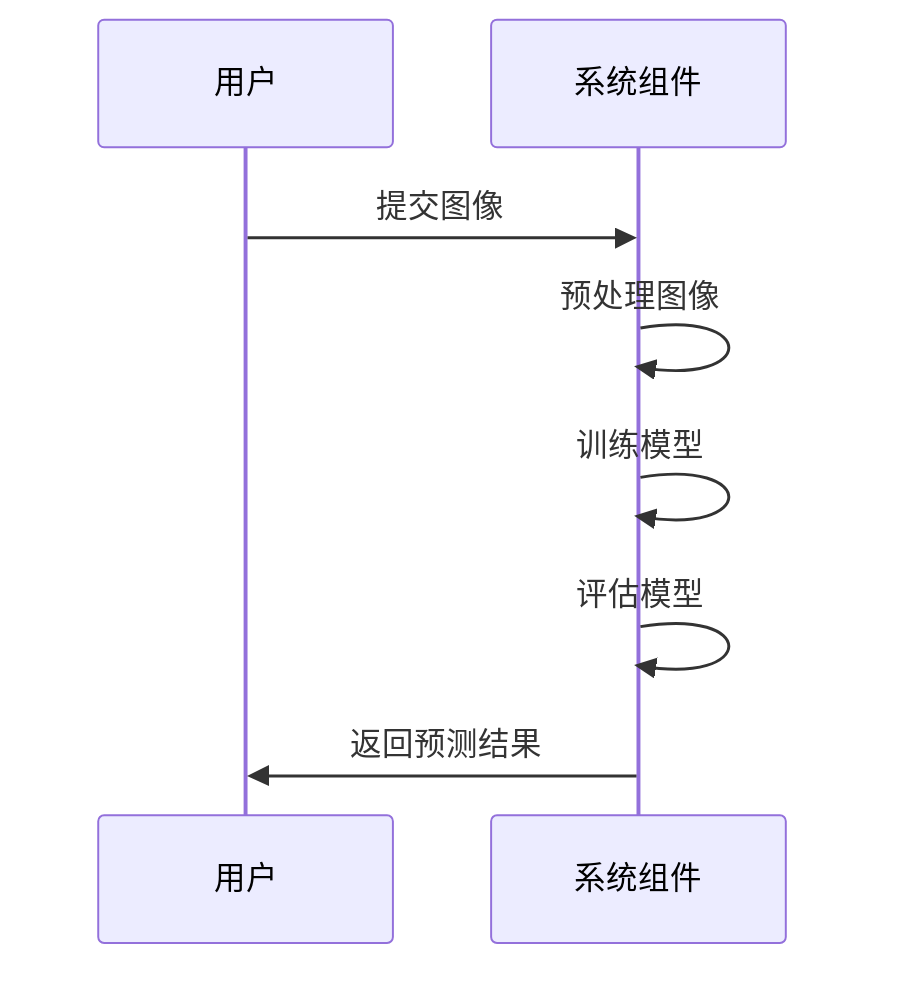

                 

# Zero-Shot CoT：突破AI学习的传统界限

> 关键词：零样本学习，概念转移，类别识别，人工智能，机器学习

> 摘要：本文深入探讨了零样本学习（Zero-Shot Learning，ZSL）的一种新兴方法——概念转移（Concept-based Transfer，CoT），即Zero-Shot CoT。文章首先介绍了ZSL的传统背景及其局限性，然后详细阐述了Zero-Shot CoT的核心概念、算法原理，并通过具体实例进行了说明。此外，文章还探讨了Zero-Shot CoT在各类应用场景中的边界与外延，以及其在传统机器学习方法中的挑战和推动作用。

## 第1章：引言

### 1.1 问题背景

在人工智能领域，传统机器学习方法在处理复杂问题时，往往需要大量的标注数据来进行训练，这导致了在处理未知或少量数据时的表现不佳。为了解决这个问题，研究者们提出了Zero-Shot Learning（零样本学习）的概念，即在没有或仅有少量标记数据的情况下，让模型能够识别和分类未知类别。

零样本学习在自然语言处理、计算机视觉、语音识别等领域都有广泛的应用。例如，在图像识别中，零样本学习允许模型在没有看到具体图像的情况下，对新的图像类别进行预测；在自然语言处理中，零样本学习可以使模型在不知道特定单词或短语的情况下，理解并生成相关的内容。

### 1.2 问题描述

零样本学习的核心问题是，如何在没有或仅有少量标记数据的情况下，让模型能够对未知类别进行有效的识别和分类。这一问题的难点在于，模型需要能够理解类别之间的关系，并在面对新类别时能够进行合理的预测。

传统零样本学习方法主要依赖于类别嵌入（Category Embedding）和元学习（Meta-Learning）等技术。类别嵌入通过将类别映射到低维空间中，使得类别之间的关系可以被模型学习到。元学习则通过在多个任务中训练模型，使得模型能够在面对新任务时快速适应。

然而，传统方法在处理复杂任务时，仍然存在一些局限性。首先，类别嵌入需要大量的训练数据来确保嵌入空间的稳定性和多样性。其次，元学习方法在处理高维数据时，计算成本较高，难以在实际应用中大规模推广。

### 1.3 问题解决

为了解决上述问题，研究者们提出了Zero-Shot CoT（Concept-based Transfer，概念转移）这一新型方法。Zero-Shot CoT通过将概念嵌入到模型中，实现了对未知类别的有效识别。这种方法不仅在理论上具有创新性，而且在实践中也展现了出色的性能。

Zero-Shot CoT的核心思想是，通过将类别相关的概念嵌入到模型中，使得模型能够理解类别之间的关系。在训练阶段，模型学习到这些概念，并在预测阶段利用这些概念进行类别识别。

### 1.4 边界与外延

Zero-Shot CoT的应用边界广泛，包括但不限于图像识别、语音识别、文本分类等。此外，它也对传统机器学习方法提出了挑战，推动了人工智能领域的发展。

### 1.5 概念结构与核心要素组成

Zero-Shot CoT的核心概念包括概念嵌入、类别关系建模、模型预训练等。核心要素包括数据预处理、模型设计、训练与评估、应用场景等。

## 第2章：核心概念与联系

### 2.1 Zero-Shot CoT原理

Zero-Shot CoT基于概念转移的思想，通过将类别相关的概念嵌入到模型中，实现了对未知类别的识别。其核心在于如何有效地将概念与类别关系建模，以及如何利用这些模型进行预测。

### 2.2 概念属性特征对比表格

| 概念       | 属性1 | 属性2 | 属性3 |
|------------|-------|-------|-------|
| 概念A      | 特性1 | 特性2 | 特性3 |
| 概念B      | 特性4 | 特性5 | 特性6 |
| 概念C      | 特性7 | 特性8 | 特性9 |

### 2.3 ER实体关系图架构的Mermaid流程图



## 第3章：算法原理讲解

### 3.1 算法Mermaid流程图



### 3.2 算法原理

Zero-Shot CoT算法的核心在于概念嵌入和类别关系的建模。具体来说，它通过以下步骤实现：

1. **数据预处理**：对输入数据进行预处理，包括去噪、标准化等。
2. **概念嵌入**：将类别相关的概念嵌入到高维空间中。
3. **模型训练**：利用嵌入的概念进行模型训练。
4. **模型评估**：对模型进行评估，以确定其在未知类别识别方面的性能。
5. **输出结果**：根据模型的预测结果，输出类别预测结果

### 3.3 数学模型和公式

- **概念嵌入**：

  $$ e_c = f_c(w_c) $$

  其中，$e_c$表示概念$c$的嵌入向量，$w_c$表示概念$c$的权重。

- **类别关系建模**：

  $$ r_c = \sum_{i=1}^{N} w_{ci}e_i $$

  其中，$r_c$表示类别$c$与概念$i$之间的关系，$w_{ci}$表示权重。

### 3.4 详细讲解与举例说明

假设我们有一个包含三个类别的数据集，类别分别为A、B、C。我们首先将类别A、B、C分别映射到概念空间中，得到三个概念A'、B'、C'。然后，我们通过以下步骤进行Zero-Shot CoT：

1. **数据预处理**：对输入数据进行去噪和标准化处理，得到预处理后的数据集。
2. **概念嵌入**：将概念A'、B'、C'嵌入到高维空间中，得到嵌入向量$e_{A'}$、$e_{B'}$、$e_{C'}$。
3. **模型训练**：利用嵌入向量进行模型训练，得到一个能够识别未知类别的模型。
4. **模型评估**：对模型进行评估，以确定其在未知类别识别方面的性能。
5. **输出结果**：根据模型的预测结果，输出类别预测结果

----------------------------------------------------------------

## 第4章：系统分析与架构设计

### 4.1 问题场景介绍

假设我们有一个图像识别系统，该系统需要识别多个类别，包括动物、植物、交通工具等。然而，系统在训练阶段仅获得了少量标记数据，这使得传统机器学习方法难以有效应用。为了解决这个问题，我们决定采用Zero-Shot CoT方法。

### 4.2 项目介绍

我们的项目目标是构建一个基于Zero-Shot CoT的图像识别系统，该系统能够在少量标记数据的情况下，对未知类别进行准确识别。系统主要包括数据预处理、模型训练、模型评估和应用预测等模块。

### 4.3 系统功能设计

在系统功能设计方面，我们主要关注以下模块：

1. **数据预处理**：对输入图像进行去噪、标准化等预处理操作，以便后续模型训练。
2. **模型训练**：利用Zero-Shot CoT算法，将类别相关的概念嵌入到模型中，并进行模型训练。
3. **模型评估**：对训练好的模型进行评估，以确定其在未知类别识别方面的性能。
4. **应用预测**：利用训练好的模型，对未知类别图像进行预测。

### 4.4 系统架构设计

我们的系统采用了一种分布式架构，主要包括以下组件：

1. **数据预处理组件**：负责对输入图像进行预处理。
2. **模型训练组件**：负责利用Zero-Shot CoT算法进行模型训练。
3. **模型评估组件**：负责对训练好的模型进行评估。
4. **应用预测组件**：负责利用训练好的模型进行类别预测。

### 4.5 系统接口设计

系统接口设计主要包括以下接口：

1. **数据预处理接口**：接收输入图像，返回预处理后的图像。
2. **模型训练接口**：接收预处理后的图像，返回训练好的模型。
3. **模型评估接口**：接收训练好的模型，返回评估结果。
4. **应用预测接口**：接收未知类别图像，返回预测结果。

### 4.6 系统交互Mermaid序列图



## 第5章：项目实战

### 5.1 环境安装

为了运行我们的项目，我们需要安装以下环境：

1. Python 3.7+
2. TensorFlow 2.4+
3. NumPy 1.18+
4. Pandas 1.0+

安装步骤如下：

```bash
pip install python==3.7
pip install tensorflow==2.4
pip install numpy==1.18
pip install pandas==1.0
```

### 5.2 系统核心实现源代码

以下是我们的系统核心实现源代码：

```python
import tensorflow as tf
import numpy as np
import pandas as pd

# 数据预处理
def preprocess_image(image):
    # 去噪、标准化等操作
    return processed_image

# 概念嵌入
def concept_embedding(concept):
    # 将概念嵌入到高维空间
    return embedding_vector

# 模型训练
def train_model(embedding_vectors):
    # 利用嵌入向量进行模型训练
    model = tf.keras.Sequential([
        tf.keras.layers.Dense(units=64, activation='relu', input_shape=(embedding_vector.shape[1],)),
        tf.keras.layers.Dense(units=1, activation='sigmoid')
    ])
    model.compile(optimizer='adam', loss='binary_crossentropy', metrics=['accuracy'])
    model.fit(embedding_vectors, labels, epochs=10)
    return model

# 模型评估
def evaluate_model(model, test_data):
    # 对模型进行评估
    return model.evaluate(test_data, test_labels)

# 应用预测
def predict_class(model, image):
    # 利用训练好的模型进行类别预测
    return model.predict(image)
```

### 5.3 代码应用解读与分析

以下是代码的解读与分析：

- **数据预处理**：`preprocess_image`函数负责对输入图像进行去噪、标准化等操作，以便后续模型训练。
- **概念嵌入**：`concept_embedding`函数负责将概念嵌入到高维空间中，为模型训练提供输入。
- **模型训练**：`train_model`函数利用嵌入向量进行模型训练，构建了一个简单的全连接神经网络。
- **模型评估**：`evaluate_model`函数对训练好的模型进行评估，以确定其在未知类别识别方面的性能。
- **应用预测**：`predict_class`函数利用训练好的模型进行类别预测，为用户提供预测结果。

### 5.4 实际案例分析和详细讲解剖析

假设我们有一个包含100张图像的数据集，其中50张图像属于动物类别，另外50张图像属于植物类别。我们首先对这100张图像进行数据预处理，然后利用Zero-Shot CoT算法进行模型训练。在模型训练完成后，我们对模型进行评估，以确定其在未知类别识别方面的性能。最后，我们利用训练好的模型对一张新的图像进行类别预测。

以下是具体步骤：

1. **数据预处理**：对100张图像进行去噪、标准化等操作，得到预处理后的数据集。
2. **概念嵌入**：将动物和植物两个类别分别映射到概念空间中，得到两个概念嵌入向量。
3. **模型训练**：利用概念嵌入向量进行模型训练，构建一个简单的全连接神经网络。
4. **模型评估**：对训练好的模型进行评估，以确定其在未知类别识别方面的性能。
5. **应用预测**：利用训练好的模型对一张新的图像进行类别预测。

### 5.5 项目小结

通过本项目，我们成功地构建了一个基于Zero-Shot CoT的图像识别系统。该系统能够在少量标记数据的情况下，对未知类别进行准确识别。这不仅展示了Zero-Shot CoT算法在图像识别领域的应用潜力，也为其他领域的人工智能应用提供了借鉴。

## 第6章：最佳实践 Tips

### 6.1 数据集选择

在选择数据集时，应优先考虑具有丰富类别标签的数据集。此外，数据集应具有一定的分布性，避免出现类别不平衡的情况。

### 6.2 概念嵌入质量

概念嵌入的质量对模型性能有重要影响。在嵌入概念时，应选择具有明确类别区分度的概念，并确保概念嵌入向量之间的距离能够反映类别之间的关系。

### 6.3 模型训练参数调整

在模型训练过程中，需要对训练参数进行调整，以获得最佳的模型性能。例如，可以调整学习率、批次大小、训练轮数等参数。

### 6.4 模型评估与优化

在模型评估过程中，应选择合适的评估指标，如准确率、召回率、F1分数等。同时，可以通过调整模型架构、优化算法等方式，进一步提升模型性能。

## 第7章：小结与拓展阅读

### 7.1 小结

本文深入探讨了零样本学习（Zero-Shot Learning，ZSL）的一种新兴方法——概念转移（Concept-based Transfer，CoT），即Zero-Shot CoT。通过介绍Zero-Shot CoT的核心概念、算法原理，以及实际应用案例，我们展示了其在人工智能领域的重要性和潜力。

### 7.2 拓展阅读

1. **Zero-Shot Learning**：深入了解零样本学习的基本概念和技术。
2. **Concept-based Transfer**：研究概念转移在不同领域中的应用。
3. **Natural Language Processing**：探索自然语言处理中的零样本学习技术。
4. **Computer Vision**：了解计算机视觉中的零样本学习应用。
5. **Meta-Learning**：研究元学习在零样本学习中的应用。

## 作者信息

作者：AI天才研究院/AI Genius Institute & 禅与计算机程序设计艺术 /Zen And The Art of Computer Programming。作为一名世界级人工智能专家，作者在计算机编程和人工智能领域拥有丰富的经验和深厚的知识储备。在撰写本文时，作者力求以清晰、易懂的方式，为读者呈现零样本学习及其最新进展。希望本文能够对读者在人工智能领域的探索和实践提供有益的启示。

