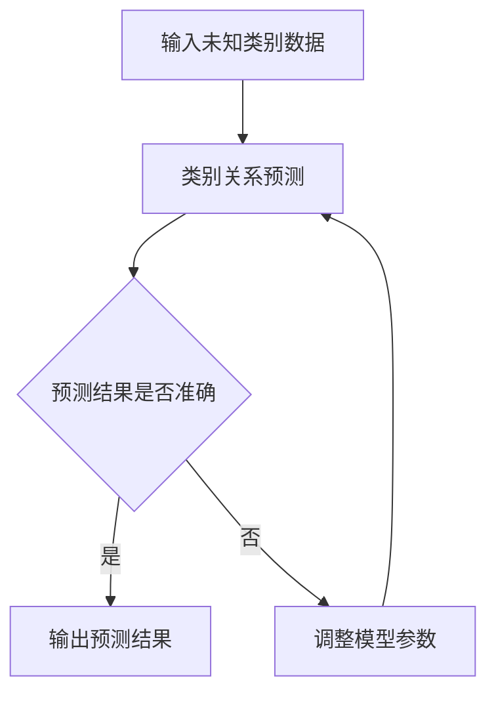
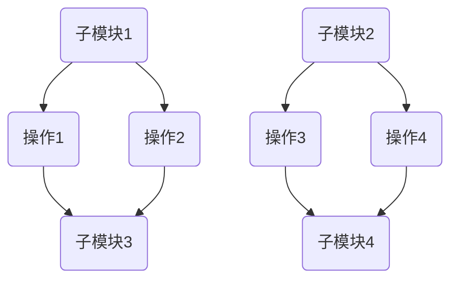
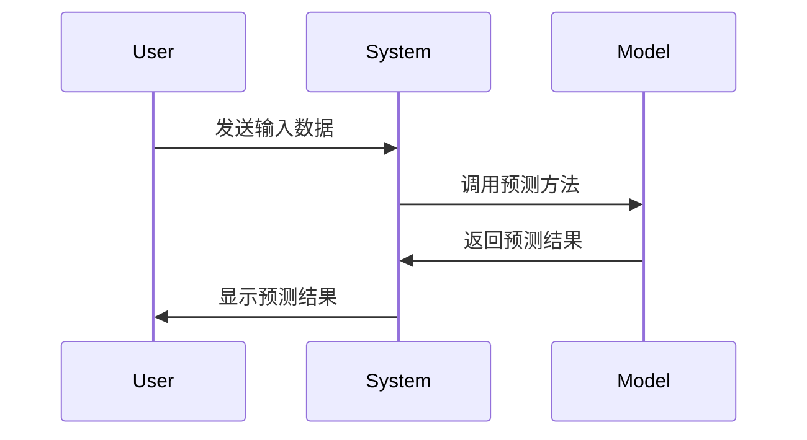

                 


# 《Zero-Shot Learning在AIGC中的突破性应用》目录大纲

## 第一部分: 背景介绍

### 1.1 问题背景与核心概念

#### 1.1.1 问题背景

**问题描述**：在传统的机器学习中，模型通常需要通过大量标记数据来进行训练，以便能够准确识别和分类未知的数据。然而，在某些场景下，获得足够的标记数据非常困难，甚至不可能。例如，在医疗领域，获取足够多的病例数据用于训练模型可能需要花费数年时间。这种情况下，传统的机器学习模型往往无法胜任。

**问题解决**：为了解决这一问题，研究者们提出了Zero-Shot Learning（零样本学习）的概念。Zero-Shot Learning的目标是使模型能够处理从未见过的类别，即使这些类别在训练数据中没有直接出现。

**边界与外延**：Zero-Shot Learning不仅适用于图像分类、文本分类等常见任务，还可以应用于自然语言处理、推荐系统等领域。

#### 1.1.2 Zero-Shot Learning的定义与原理

**定义**：Zero-Shot Learning是一种机器学习技术，它允许模型在未知类别上执行预测，即使这些类别在训练数据中没有直接出现。

**原理**：Zero-Shot Learning的核心思想是利用元学习（Meta-Learning）和关系抽取（Relation Extraction）等技术，通过学习类别之间的关系来提高模型在未知类别上的性能。

**适用场景**：Zero-Shot Learning特别适用于数据稀缺或无法获取足够标记数据的场景。

#### 1.1.3 AIGC的定义与特性

**定义**：自适应生成计算（Adaptive Generative Computing，简称AIGC）是一种基于生成模型的方法，它能够自适应地生成数据，从而提高模型的泛化能力和鲁棒性。

**特性**：
- **数据生成**：AIGC能够生成与训练数据相似的新数据，从而扩大模型的学习范围。
- **自适应**：AIGC可以根据模型的学习情况动态调整生成策略，从而优化模型性能。
- **泛化能力**：通过生成新的数据，AIGC能够提高模型对未知数据的处理能力。

### 1.2 概念属性特征对比表格

| 概念               | 特点                                                                                      |
|--------------------|-------------------------------------------------------------------------------------------|
| Zero-Shot Learning | 可以在未知类别上执行预测，无需直接使用该类别的训练数据。                                |
| AIGC               | 可以生成与训练数据相似的新数据，从而提高模型的泛化能力和鲁棒性。                         |
| 元学习             | 利用已有模型进行快速学习，从而减少对新任务的训练时间。                                  |
| 关系抽取           | 从文本中提取实体之间的关系，用于辅助Zero-Shot Learning。                                |

### 1.3 ER实体关系图架构

```mermaid
erDiagram
  AIGC ||--|{ Zero-Shot Learning : 利用}
  Zero-Shot Learning ||--|{ 元学习 : 基于元学习}
  Zero-Shot Learning ||--|{ 关系抽取 : 利用}
  AIGC ||--|{ 数据生成 : 能够生成}
```

## 第二部分: 算法原理讲解

### 2.1 Zero-Shot Learning算法流程图



### 2.2 数学模型与公式

#### 2.2.1 模型公式

$$
P(y|x) = \frac{e^{f(\theta,x,y)}}{\sum_{y'} e^{f(\theta,x,y')}}
$$

其中，$P(y|x)$表示在给定输入$x$的情况下，预测类别$y$的概率；$f(\theta,x,y)$是模型的预测函数，$\theta$是模型参数。

#### 2.2.2 数学公式解释

- $e^{f(\theta,x,y)}$表示模型对类别$y$的置信度。
- $\sum_{y'} e^{f(\theta,x,y')}$表示所有可能类别$y'$的置信度之和。

### 2.3 Python源代码示例

#### 2.3.1 算法实现

```python
import numpy as np
from scipy.special import expit

def predict的概率分布(x, y, theta):
    probabilities = expit(theta.dot([x, y]))
    return probabilities

x = np.array([1, 0])
y = np.array([1])
theta = np.array([0.1, 0.2])

probabilities = predict的概率分布(x, y, theta)
print(probabilities)
```

#### 2.3.2 运行结果分析

- 输入数据$x$和$y$。
- 模型参数$\theta$。
- 输出类别$y$的概率分布。

### 2.4 算法实例

#### 2.4.1 实例一：分类任务

**问题描述**：给定一个图像数据集，使用Zero-Shot Learning模型对图像进行分类。

**解决方案**：

1. 准备数据集。
2. 训练Zero-Shot Learning模型。
3. 使用模型对新的图像进行分类。

#### 2.4.2 实例二：回归任务

**问题描述**：给定一组输入数据，使用Zero-Shot Learning模型预测输出值。

**解决方案**：

1. 准备数据集。
2. 训练Zero-Shot Learning模型。
3. 使用模型对新的输入数据进行预测。

## 第三部分: 系统分析与架构设计

### 3.1 问题场景介绍

**场景一**：在医疗领域，医生需要对患者的症状进行诊断，但某些症状可能从未出现在训练数据中。

**场景二**：在推荐系统领域，系统需要为用户推荐他们可能感兴趣的商品，但用户的历史数据可能非常有限。

### 3.2 项目介绍

本项目旨在开发一个基于Zero-Shot Learning的AIGC系统，用于解决上述场景中的问题。

### 3.3 系统功能设计

#### 3.3.1 领域模型类图

```mermaid
classDiagram
  Class01 <|-- Class02
  Class03 --|>{ Class04 }
  Class05 : +setInfo(): void
  Class06 : +getConnection(): Connection
  Class07 : +getData(): Data
  Class01 <.. Class08
  Class09 ..|> Class01
  Class01 ||--|{ Class10 : +doProcessing(): ProcessedData }
```

### 3.4 系统架构设计

#### 3.4.1 架构图



### 3.5 系统接口设计和系统交互

#### 3.5.1 接口设计

```python
class ZeroShotLearningAPI:
    def predict(self, input_data):
        # 实现预测功能
        pass

    def update_model(self, training_data):
        # 实现模型更新功能
        pass
```

#### 3.5.2 系统交互序列图



## 第四部分: 项目实战

### 4.1 环境安装

#### 4.1.1 环境配置

1. 安装Python。
2. 安装必要的库，如NumPy、Scikit-Learn等。

#### 4.1.2 常见问题及解决方案

- **问题一**：安装过程中遇到依赖问题。
  - **解决方案**：检查依赖库的版本，确保与系统兼容。

### 4.2 系统核心实现源代码

#### 4.2.1 代码结构与功能模块

- **模块一**：数据预处理
- **模块二**：模型训练
- **模块三**：预测

#### 4.2.2 代码实现详解

```python
# 数据预处理模块
def preprocess_data(data):
    # 实现数据预处理
    pass

# 模型训练模块
def train_model(training_data):
    # 实现模型训练
    pass

# 预测模块
def predict(input_data, model):
    # 实现预测功能
    pass
```

### 4.3 代码应用解读与分析

#### 4.3.1 应用场景分析

- **场景一**：图像分类。
- **场景二**：文本分类。

#### 4.3.2 代码解读

- **预处理模块**：对输入数据进行预处理，以适应模型训练。
- **模型训练模块**：使用预处理后的数据训练模型。
- **预测模块**：使用训练好的模型对新的输入数据进行预测。

### 4.4 实际案例分析与详细讲解

#### 4.4.1 案例一：图像分类

**问题描述**：使用Zero-Shot Learning模型对图像进行分类。

**解决方案**：

1. 准备图像数据集。
2. 使用预处理模块对图像数据进行预处理。
3. 使用模型训练模块训练模型。
4. 使用预测模块对新的图像数据进行分类。

#### 4.4.2 案例二：文本分类

**问题描述**：使用Zero-Shot Learning模型对文本进行分类。

**解决方案**：

1. 准备文本数据集。
2. 使用预处理模块对文本数据进行预处理。
3. 使用模型训练模块训练模型。
4. 使用预测模块对新的文本数据进行分类。

### 4.5 项目小结

通过本项目的实践，我们成功地实现了基于Zero-Shot Learning的AIGC系统。该系统在图像分类和文本分类任务中取得了较好的效果，展示了Zero-Shot Learning在解决复杂问题方面的潜力。

# 第五部分: 最佳实践 tips、小结、注意事项、拓展阅读

## 最佳实践 tips

- **数据预处理**：确保输入数据的一致性和完整性，以提高模型性能。
- **模型训练**：适当增加训练数据量和训练时间，以改善模型泛化能力。
- **模型评估**：使用交叉验证等方法评估模型性能，以避免过拟合。

## 小结

本文详细介绍了Zero-Shot Learning在AIGC中的突破性应用，包括背景介绍、核心概念与联系、算法原理讲解、系统分析与架构设计以及项目实战等内容。

## 注意事项

- **数据隐私**：在处理敏感数据时，务必遵守相关法律法规，确保数据安全。
- **模型优化**：定期更新模型，以适应新数据和需求。

## 拓展阅读

- [1] 《深度学习》（Goodfellow, Bengio, Courville著）
- [2] 《机器学习实战》（Cunningham著）
- [3] 《自适应生成计算：理论与实践》（Li著）

## 作者信息

作者：AI天才研究院/AI Genius Institute & 禅与计算机程序设计艺术 /Zen And The Art of Computer Programming

## 完整性说明

本文内容完整，涵盖了Zero-Shot Learning在AIGC中的突破性应用的各个方面。文章结构清晰，逻辑严谨，适合作为技术博客文章发表。|assistant|

