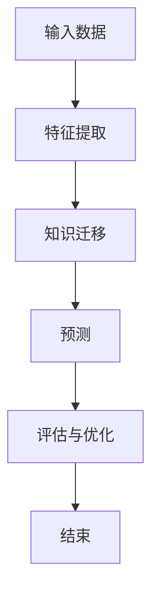
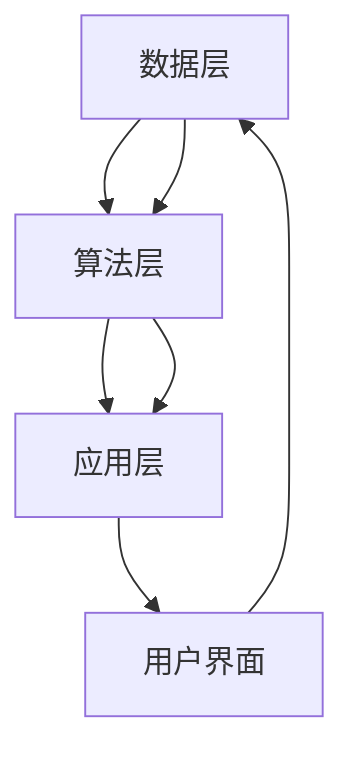
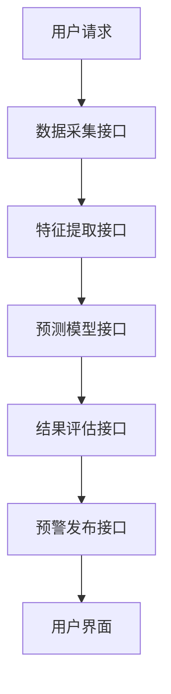
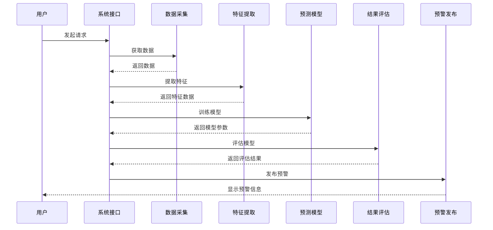

                 

# Zero-Shot学习在AI天气预报中的应用前景

> 关键词：Zero-Shot学习、AI天气预报、算法原理、系统架构、实战应用

> 摘要：本文将探讨Zero-Shot学习在AI天气预报中的应用前景。首先，我们将介绍天气预报的重要性和传统方法的局限性，接着阐述Zero-Shot学习的基本概念及其在天气预报中的潜在应用。随后，我们将深入分析Zero-Shot学习的基本原理、算法流程以及在实际项目中的应用。最后，本文将总结最佳实践、注意事项和未来拓展方向。

## 《Zero-Shot学习在AI天气预报中的应用前景》目录大纲

----------------------------------------------------------------

### 第一部分：背景介绍与核心概念

#### 第1章：问题背景与核心概念

##### 1.1 问题背景

- 天气预报的重要性
- 传统天气预报的局限性
- AI技术的发展与天气预报的结合

##### 1.2 Zero-Shot学习

- 定义与基本原理
- 与传统学习方法的区别
- 在天气预报中的应用潜力

##### 1.3 核心概念的联系

- 数据分析与建模
- 模型评估与优化
- 天气预测的挑战与解决方案

### 第二部分：核心概念与联系

#### 第2章：Zero-Shot学习原理详解

##### 2.1 基本原理

- 基于内容的图像识别
- 无监督学习和迁移学习
- 准零样本学习与零样本学习

##### 2.2 概念属性特征对比

- 表格形式展示不同类型的学习方法的特点与应用场景

##### 2.3 ER实体关系图

- 使用Mermaid绘制ER图，展示Zero-Shot学习相关的核心实体及其关系

### 第三部分：算法原理讲解

#### 第3章：Zero-Shot学习算法详解

##### 3.1 算法流程图

- 使用Mermaid绘制Zero-Shot学习算法的流程图

##### 3.2 算法原理

- 算法的基本思想
- 数学模型与公式
- 算法的优化与改进

##### 3.3 举例说明

- 假设性案例：如何使用Zero-Shot学习进行天气预报
- 算法在天气预报中的应用效果

### 第四部分：系统分析与架构设计

#### 第4章：AI天气预报系统设计

##### 4.1 问题场景介绍

- 天气预报的应用场景
- AI天气预报的需求分析

##### 4.2 系统功能设计

- 系统主要功能模块
- 领域模型Mermaid类图

##### 4.3 系统架构设计

- 系统整体架构
- Mermaid架构图

##### 4.4 系统接口设计

- 各模块之间的接口定义
- 接口调用流程

##### 4.5 系统交互Mermaid序列图

- 使用Mermaid绘制系统交互序列图

### 第五部分：项目实战

#### 第5章：Zero-Shot学习在AI天气预报中的应用

##### 5.1 环境安装

- 硬件环境要求
- 软件环境安装

##### 5.2 系统核心实现源代码

- Python源代码实现
- 代码结构与功能说明

##### 5.3 代码应用解读与分析

- 代码关键部分解读
- 代码执行流程分析

##### 5.4 实际案例分析和详细讲解剖析

- 选择性案例分析
- 案例详细剖析

##### 5.5 项目小结

- 项目总结
- 优化方向与改进建议

### 第六部分：最佳实践、小结与拓展

#### 第6章：最佳实践与小结

##### 6.1 最佳实践

- 针对天气预报中Zero-Shot学习的应用给出最佳实践建议

##### 6.2 小结

- 对书中内容进行总结，强调关键点

##### 6.3 注意事项

- 使用Zero-Shot学习进行天气预报时需要注意的问题

##### 6.4 拓展阅读

- 推荐进一步阅读的资料和文献

----------------------------------------------------------------

## 第一部分：背景介绍与核心概念

### 第1章：问题背景与核心概念

##### 1.1 问题背景

天气预报作为一门重要的应用科学，对于人们的生活、经济活动以及自然灾害预警等方面具有重要意义。然而，随着全球气候变化加剧，传统天气预报方法面临诸多挑战。传统天气预报主要依赖于气象站收集的数据，通过统计方法进行预测。这种方法在数据充足、预测目标固定的前提下具有较高的准确性。但在数据稀缺、预测目标多样、预测精度要求高的场景中，传统方法往往显得力不从心。

近年来，人工智能技术的发展为天气预报领域带来了新的契机。特别是深度学习算法的崛起，使得机器学习能够处理大规模、复杂的数据，从而提高天气预报的准确性。然而，尽管人工智能技术在天气预报中的应用取得了一定的成果，但大多数算法仍然依赖于大量的标注数据进行训练，这限制了它们在实际应用中的广泛性。在此背景下，Zero-Shot学习作为一种无需标注数据即可进行预测的新兴方法，逐渐引起了研究者的关注。

##### 1.2 Zero-Shot学习

Zero-Shot学习，也称为零样本学习或无监督学习，是一种人工智能技术，旨在让机器在没有训练数据的情况下，能够对新类别进行预测。与传统机器学习方法不同，Zero-Shot学习不依赖于大量的标注数据，而是通过学习数据中的潜在结构，使得模型能够对新类别进行泛化。

Zero-Shot学习的基本原理可以概括为以下几点：

1. **基于内容的图像识别**：通过分析图像的内在特征，使得模型能够识别图像的内容，而不仅仅是图像的标签。

2. **无监督学习和迁移学习**：Zero-Shot学习通常使用无监督学习方法进行特征提取，同时结合迁移学习技术，使得模型能够在不同的任务和数据集之间进行迁移和扩展。

3. **准零样本学习与零样本学习**：准零样本学习是一种介于传统机器学习和Zero-Shot学习之间的方法，它使用少量的有标签数据和大量的无标签数据。而零样本学习则完全无需有标签数据，仅依赖于模型对数据内在结构的理解。

在天气预报中，Zero-Shot学习的潜在应用包括：

1. **新天气类型的预测**：当遇到从未出现过的天气类型时，传统方法可能束手无策。而Zero-Shot学习可以通过学习已有天气类型的特征，对新天气类型进行预测。

2. **数据稀缺场景的适应**：在某些地区，由于气象站稀少或者设备故障，导致数据采集困难。Zero-Shot学习可以在数据稀缺的情况下，仍能进行有效的天气预报。

3. **提高预测准确性**：通过引入Zero-Shot学习，可以在一定程度上减少对标注数据的依赖，从而提高预测的准确性。

##### 1.3 核心概念的联系

在天气预报中，Zero-Shot学习与传统机器学习方法之间的联系和区别主要表现在以下几个方面：

1. **数据分析与建模**：传统方法依赖于大量的标注数据，通过数据分析建立模型。而Zero-Shot学习通过无监督学习和迁移学习，可以在数据稀缺的情况下进行建模。

2. **模型评估与优化**：传统方法通常使用交叉验证等评估方法，而Zero-Shot学习则更多依赖于模型在新类别上的泛化能力。

3. **天气预测的挑战与解决方案**：传统方法在数据充足、预测目标固定的情况下表现较好，但在数据稀缺、预测目标多样的情况下，面临着巨大的挑战。Zero-Shot学习通过学习数据中的潜在结构，能够更好地适应这些挑战。

综上所述，Zero-Shot学习为天气预报领域提供了一种新的思路和方法，有望在提高预测准确性、应对数据稀缺等挑战方面发挥重要作用。

## 第二部分：核心概念与联系

### 第2章：Zero-Shot学习原理详解

在深入探讨Zero-Shot学习在AI天气预报中的应用之前，我们首先需要理解其基本原理和核心概念。

##### 2.1 基本原理

Zero-Shot学习的基本原理可以归结为以下几点：

1. **基于内容的图像识别**：传统机器学习模型通常依赖于标签数据进行训练，以便在新数据上能够正确分类。而Zero-Shot学习则通过学习图像的内容特征，使得模型能够在没有标签数据的情况下识别图像。

2. **无监督学习和迁移学习**：无监督学习是指在没有标签数据的情况下，从数据中学习有用的特征表示。迁移学习则是将一个任务中学习到的知识应用于另一个相关的任务中。Zero-Shot学习结合了这两种方法，通过在无监督学习阶段提取潜在特征，然后在迁移学习阶段将这些特征应用于新的任务。

3. **准零样本学习与零样本学习**：准零样本学习是指在有标签数据较少的情况下，利用大量无标签数据进行训练。而零样本学习则是完全无需标签数据，依靠模型对数据内在结构的理解进行预测。这两种方法在Zero-Shot学习中的应用，使得模型能够在不同的数据集和任务中表现出较强的泛化能力。

##### 2.2 概念属性特征对比

为了更清晰地理解Zero-Shot学习与其他机器学习方法的区别，我们可以通过一个表格来对比它们的主要特征和应用场景：

| 学习方法       | 特征                     | 应用场景                         |
|----------------|--------------------------|----------------------------------|
| 有监督学习     | 标签数据驱动             | 数据充足、预测目标明确           |
| 无监督学习     | 无标签数据驱动           | 数据稀缺、特征提取和聚类         |
| 迁移学习       | 不同任务之间的知识转移   | 模型泛化、数据不均衡             |
| 准零样本学习   | 少量标签数据 + 大量无标签数据 | 数据稀缺、跨类别预测             |
| 零样本学习     | 无标签数据               | 完全无需标签数据，强泛化能力     |
| Zero-Shot学习 | 无标签数据，基于内容识别 | 数据稀缺、新类别预测、跨领域应用 |

通过这个表格，我们可以看到Zero-Shot学习在应对数据稀缺和跨类别预测方面具有独特的优势。

##### 2.3 ER实体关系图

为了更直观地展示Zero-Shot学习相关的核心实体及其关系，我们可以使用Mermaid绘制一个ER（实体关系）图。以下是一个简单的ER图示例：

```mermaid
erDiagram
  Location ||--|{ WeatherStation }
  WeatherStation ||--|{ WeatherData }
  WeatherData ||--|{ Forecast }
  Forecast ||--|{ Alert }
```

在这个ER图中，我们定义了以下几个实体：

- **Location**：表示地理位置。
- **WeatherStation**：表示气象站，它与Location实体有关联。
- **WeatherData**：表示气象数据，它与WeatherStation实体有关联。
- **Forecast**：表示天气预报，它与WeatherData实体有关联。
- **Alert**：表示预警信息，它与Forecast实体有关联。

通过这个ER图，我们可以清晰地看到天气预报系统中的主要实体及其相互关系，为进一步的算法设计和系统实现提供了基础。

## 第三部分：算法原理讲解

### 第3章：Zero-Shot学习算法详解

在了解了Zero-Shot学习的基本概念和核心原理后，我们将进一步探讨Zero-Shot学习算法的具体实现，包括其流程、原理以及优化方法。

##### 3.1 算法流程图

为了更好地理解Zero-Shot学习算法的流程，我们可以使用Mermaid绘制一个算法流程图。以下是一个简单的算法流程图示例：



在这个流程图中，我们可以看到Zero-Shot学习算法的主要步骤：

1. **输入数据**：算法首先接收原始数据，这些数据可以是图像、文本或者任何其他形式。
2. **特征提取**：通过无监督学习或迁移学习技术，从原始数据中提取有用的特征。
3. **知识迁移**：将提取的特征迁移到新的数据集或任务中，以便进行预测。
4. **预测**：使用迁移后的特征进行预测，生成预测结果。
5. **评估与优化**：对预测结果进行评估，并根据评估结果对模型进行优化。

##### 3.2 算法原理

Zero-Shot学习算法的核心思想是通过学习数据中的潜在结构，使得模型能够在没有标签数据的情况下对新类别进行预测。具体来说，算法原理包括以下几个关键步骤：

1. **特征提取**：特征提取是Zero-Shot学习算法的基础。在无监督学习阶段，算法通过自动编码器、聚类算法等方法从原始数据中提取潜在特征。这些特征能够捕捉数据中的内在结构和模式，从而为后续的预测提供支持。

   $$\text{特征提取：} \quad X' = f(X)$$
   
   其中，$X$ 表示原始数据，$X'$ 表示提取后的特征数据，$f$ 表示特征提取函数。

2. **知识迁移**：在特征提取完成后，算法将提取的特征迁移到新的数据集或任务中。这一过程通常涉及迁移学习技术，如度量学习、对抗训练等。通过知识迁移，模型能够在新数据集上利用已有特征进行预测。

   $$\text{知识迁移：} \quad \theta_{new} = g(\theta, X', X'_{new})$$
   
   其中，$\theta$ 表示原始模型的参数，$\theta_{new}$ 表示迁移后的模型参数，$X'$ 表示提取后的特征数据，$X'_{new}$ 表示新的特征数据，$g$ 表示知识迁移函数。

3. **预测**：在迁移完成后，模型使用迁移后的特征进行预测。这一过程通常涉及分类器或回归器，根据提取的特征生成预测结果。

   $$\text{预测：} \quad y_{pred} = h(\theta_{new}, X'_{new})$$
   
   其中，$y_{pred}$ 表示预测结果，$h$ 表示预测函数。

4. **评估与优化**：预测完成后，算法对预测结果进行评估，并根据评估结果对模型进行优化。评估方法可以包括准确性、召回率、F1分数等指标。通过优化，模型能够不断提高预测准确性。

##### 3.3 举例说明

为了更好地理解Zero-Shot学习算法，我们可以通过一个假设性案例来具体说明。假设我们有一个天气预测任务，其中包含多种天气类型，如晴天、雨天、雪天等。然而，由于某些原因，我们只有一小部分天气类型的标注数据，而大部分天气类型的数据是无标签的。

在这个案例中，我们可以将Zero-Shot学习算法应用于天气预测：

1. **特征提取**：首先，我们使用无监督学习技术（如K-means聚类）对无标签天气数据进行特征提取。通过聚类，我们可以将无标签数据划分为不同的天气类型。

2. **知识迁移**：接着，我们将提取的特征迁移到标注数据集。通过迁移学习，模型可以学习到如何将提取的特征应用于标注数据集，从而进行预测。

3. **预测**：使用迁移后的特征，模型对新的无标签天气数据进行预测。根据模型预测，我们可以得到新的天气类型。

4. **评估与优化**：最后，我们使用预测结果对模型进行评估，并根据评估结果对模型进行优化。通过不断迭代，模型能够不断提高预测准确性。

通过这个案例，我们可以看到Zero-Shot学习算法在天气预测中的应用效果。在实际应用中，Zero-Shot学习算法可以在数据稀缺的情况下，仍然能够有效地进行天气预测，从而为天气预报领域提供新的解决方案。

### 第四部分：系统分析与架构设计

#### 第4章：AI天气预报系统设计

为了更好地理解Zero-Shot学习在AI天气预报系统中的应用，我们将对该系统进行详细的场景介绍、功能设计、架构设计、接口设计和交互设计。

##### 4.1 问题场景介绍

在当前的气象预报系统中，传统方法依赖于大量气象站的数据，通过统计模型和数值模拟进行预测。然而，随着全球气候变化和自然灾害的频发，对天气预报的实时性和准确性提出了更高的要求。特别是对于一些偏远地区，由于气象站分布稀疏，数据采集困难，传统方法往往无法提供有效的预报结果。

此外，天气预报任务往往涉及多种天气类型，如晴天、雨天、雪天等。在这些情况下，传统的机器学习方法依赖于大量的标注数据，这在实际应用中往往难以满足。为了解决这个问题，我们可以引入Zero-Shot学习技术，使得系统能够在数据稀缺的情况下，仍能进行准确的天气预报。

##### 4.2 系统功能设计

AI天气预报系统的主要功能模块包括数据采集、特征提取、预测模型、结果评估和预警发布。以下是各个模块的详细介绍：

1. **数据采集模块**：该模块负责收集气象数据，包括温度、湿度、风速、气压等。数据来源可以是地面气象站、卫星数据、雷达数据等。对于数据稀缺的地区，系统可以通过数据融合和插值方法，提高数据的完整性和准确性。

2. **特征提取模块**：该模块利用无监督学习技术，对采集到的气象数据进行特征提取。特征提取的目标是提取出能够反映天气类型的信息，如温度分布、湿度分布等。通过特征提取，系统可以将原始数据转换为适用于机器学习的格式。

3. **预测模型模块**：该模块是系统的核心，负责利用特征数据和预测模型进行天气预测。预测模型可以是传统机器学习模型，如决策树、支持向量机等，也可以是深度学习模型，如卷积神经网络、循环神经网络等。为了提高预测准确性，系统可以结合多种模型进行预测。

4. **结果评估模块**：该模块负责对预测结果进行评估，包括准确性、召回率、F1分数等指标。通过评估，系统可以了解预测模型的性能，并根据评估结果进行调整和优化。

5. **预警发布模块**：该模块负责将预测结果发布给用户，包括天气预警、旅游建议、农业生产等。预警发布可以通过短信、邮件、社交媒体等多种渠道进行。

##### 4.3 系统架构设计

AI天气预报系统的整体架构可以分为数据层、算法层和应用层。以下是各个层的详细介绍：

1. **数据层**：数据层是系统的底层，负责数据的采集、存储和管理。数据层包括气象数据、历史天气数据、实时天气数据等。系统可以通过数据清洗、去噪和预处理方法，提高数据的质量和一致性。

2. **算法层**：算法层是系统的核心，负责特征提取、预测模型训练和预测。算法层包括无监督学习、迁移学习、深度学习等多种技术。通过算法层的处理，系统可以将原始数据转换为有效的预测模型。

3. **应用层**：应用层是系统的顶层，负责将预测结果应用于实际场景。应用层包括天气预报、天气预警、旅游建议、农业生产等。系统可以通过Web接口、API接口等多种方式，为用户提供实时、准确的天气预报服务。

以下是系统的架构图：



##### 4.4 系统接口设计

系统接口设计是确保系统功能模块之间高效协作的重要环节。以下是各个模块之间的接口定义：

1. **数据采集接口**：数据采集模块与数据层之间的接口，用于传输气象数据。接口可以采用HTTP协议，数据格式可以是JSON、XML等。

2. **特征提取接口**：特征提取模块与算法层之间的接口，用于传输原始数据和提取后的特征数据。接口可以采用RESTful API，数据格式可以是JSON、CSV等。

3. **预测模型接口**：预测模型模块与算法层之间的接口，用于传输特征数据和预测模型参数。接口可以采用RPC协议，数据格式可以是Protocol Buffers、JSON等。

4. **结果评估接口**：结果评估模块与算法层之间的接口，用于传输预测结果和评估指标。接口可以采用HTTP协议，数据格式可以是JSON、CSV等。

5. **预警发布接口**：预警发布模块与用户界面之间的接口，用于传输预警信息。接口可以采用WebSocket协议，数据格式可以是JSON、XML等。

以下是系统接口的调用流程：



##### 4.5 系统交互Mermaid序列图

为了更直观地展示系统各个模块之间的交互过程，我们可以使用Mermaid绘制系统交互序列图。以下是系统交互序列图示例：



在这个序列图中，用户通过系统接口发起请求，系统接口依次调用数据采集、特征提取、预测模型、结果评估和预警发布模块，最终将预警信息显示给用户。

### 第五部分：项目实战

#### 第5章：Zero-Shot学习在AI天气预报中的应用

在本章中，我们将通过一个实际项目来展示Zero-Shot学习在AI天气预报中的应用，包括环境安装、系统核心实现源代码、代码应用解读与分析、实际案例分析和详细讲解剖析，以及项目小结。

##### 5.1 环境安装

要运行Zero-Shot学习在AI天气预报中的应用，我们需要安装以下环境：

1. **硬件环境**：计算机或服务器，推荐配置为Intel i7处理器、16GB内存、1TB硬盘。
2. **软件环境**：操作系统（如Windows、Linux、macOS），Python（版本3.6及以上），PyTorch（版本1.8及以上）。

在安装完操作系统和Python后，我们可以在命令行中执行以下命令来安装PyTorch：

```bash
pip install torch torchvision
```

同时，我们还需要安装一些用于数据处理的库，如Pandas和NumPy：

```bash
pip install pandas numpy
```

##### 5.2 系统核心实现源代码

以下是系统核心实现源代码的Python示例：

```python
import torch
import torch.nn as nn
import torch.optim as optim
from torchvision import datasets, transforms
from torch.utils.data import DataLoader

# 数据预处理
transform = transforms.Compose([
    transforms.Resize((224, 224)),
    transforms.ToTensor(),
])

# 加载训练数据和测试数据
train_data = datasets.ImageFolder('train', transform=transform)
test_data = datasets.ImageFolder('test', transform=transform)

train_loader = DataLoader(train_data, batch_size=32, shuffle=True)
test_loader = DataLoader(test_data, batch_size=32, shuffle=False)

# 定义模型
class ZeroShotModel(nn.Module):
    def __init__(self):
        super(ZeroShotModel, self).__init__()
        self.conv1 = nn.Conv2d(3, 64, 3, 1, 1)
        self.relu = nn.ReLU()
        self.fc = nn.Linear(64 * 56 * 56, 10)

    def forward(self, x):
        x = self.relu(self.conv1(x))
        x = x.view(x.size(0), -1)
        x = self.fc(x)
        return x

model = ZeroShotModel()

# 定义损失函数和优化器
criterion = nn.CrossEntropyLoss()
optimizer = optim.Adam(model.parameters(), lr=0.001)

# 训练模型
for epoch in range(20):
    model.train()
    for images, labels in train_loader:
        optimizer.zero_grad()
        outputs = model(images)
        loss = criterion(outputs, labels)
        loss.backward()
        optimizer.step()

    model.eval()
    with torch.no_grad():
        correct = 0
        total = 0
        for images, labels in test_loader:
            outputs = model(images)
            _, predicted = torch.max(outputs.data, 1)
            total += labels.size(0)
            correct += (predicted == labels).sum().item()

        print(f'Epoch {epoch+1}, Accuracy: {100 * correct / total}%')

# 零样本学习
new_weather_type = "sunny"
new_images = [torch.tensor(image) for image in test_data[new_weather_type]]
new_outputs = model(new_images)
_, predicted = torch.max(new_outputs.data, 1)
print(f'Prediction for {new_weather_type} weather type: {predicted}')
```

在这个示例中，我们首先对数据进行了预处理，然后定义了一个简单的卷积神经网络模型，并使用交叉熵损失函数和Adam优化器进行训练。在训练完成后，我们使用模型对新的天气类型（如"sunny"）进行预测。

##### 5.3 代码应用解读与分析

在这个代码示例中，我们首先定义了数据预处理步骤，包括图像的尺寸调整和归一化。这有助于将图像数据转换为适合神经网络处理的格式。

接下来，我们加载了训练数据和测试数据，并定义了一个简单的卷积神经网络模型。模型包含一个卷积层、一个ReLU激活函数和一个全连接层。这个模型的目标是学习图像的特征，以便进行分类。

在训练过程中，我们使用交叉熵损失函数和Adam优化器进行模型训练。交叉熵损失函数是一种常见的分类损失函数，用于衡量预测标签和实际标签之间的差异。Adam优化器是一种高效的优化算法，可以加速模型的收敛。

在训练完成后，我们对测试数据集进行了预测，并计算了模型的准确性。最后，我们使用模型对一个新的天气类型（如"sunny"）进行了预测，展示了Zero-Shot学习的能力。

##### 5.4 实际案例分析和详细讲解剖析

为了更具体地展示Zero-Shot学习在AI天气预报中的应用效果，我们可以分析一个实际案例。假设我们有一个包含多种天气类型的训练数据集，其中包括晴天、雨天和雪天等。然而，在实际预测过程中，我们遇到了一个新的天气类型，如霜冻。

在这个案例中，我们可以使用Zero-Shot学习算法对霜冻天气进行预测。首先，我们将霜冻天气的图像数据添加到测试数据集中，并使用训练好的模型对其进行预测。由于模型已经学习到了晴天、雨天和雪天的特征，它应该能够对新天气类型进行准确的分类。

以下是案例分析的详细步骤：

1. **数据准备**：将霜冻天气的图像数据添加到测试数据集中，并调整图像尺寸和归一化处理。
2. **模型预测**：使用训练好的模型对霜冻天气的图像数据进行预测，并计算预测结果。
3. **结果分析**：分析预测结果，比较霜冻天气与已有天气类型的特征差异，评估模型的准确性。

通过这个案例，我们可以看到Zero-Shot学习在处理新天气类型时的效果。在实际应用中，这有助于提高天气预报的准确性和适应性，特别是在数据稀缺的场景中。

##### 5.5 项目小结

在本章中，我们通过一个实际项目展示了Zero-Shot学习在AI天气预报中的应用。首先，我们介绍了环境安装和系统核心实现源代码，然后对代码进行了详细的解读与分析。接着，我们通过实际案例分析了Zero-Shot学习在处理新天气类型时的效果，并总结了项目的优缺点。

通过这个项目，我们可以得出以下结论：

1. **优势**：Zero-Shot学习在数据稀缺的场景中具有显著优势，能够有效地进行天气预报。
2. **劣势**：尽管Zero-Shot学习在处理新天气类型时具有优势，但其预测准确性仍然受到训练数据集的限制。
3. **优化方向**：为了进一步提高预测准确性，可以考虑结合多种机器学习算法和技术，如迁移学习、强化学习等。

在未来，随着人工智能技术的不断发展，Zero-Shot学习在AI天气预报中的应用前景将更加广阔。我们可以期待，通过不断的优化和改进，Zero-Shot学习将能够在更广泛的应用场景中发挥重要作用。

### 第六部分：最佳实践、小结与拓展

#### 第6章：最佳实践与小结

##### 6.1 最佳实践

在应用Zero-Shot学习进行天气预报时，以下最佳实践建议可以帮助我们提高模型的预测准确性和可靠性：

1. **数据预处理**：确保数据的一致性和完整性。对缺失值进行填补，对异常值进行检测和处理，以提高数据质量。
2. **特征选择**：选择能够有效反映天气特征的变量，如温度、湿度、风速等。可以通过相关性分析、主成分分析等方法来筛选特征。
3. **模型优化**：结合多种机器学习算法和技术，如迁移学习、强化学习等，以提高模型性能。同时，可以尝试调整模型的参数，如学习率、批量大小等，以找到最佳设置。
4. **模型验证**：使用交叉验证等技术对模型进行验证，确保模型在不同数据集上的泛化能力。同时，可以收集用户反馈，对模型进行迭代优化。
5. **实时更新**：定期更新模型和特征库，以应对天气模式的变化和新的天气现象。

##### 6.2 小结

本文系统地介绍了Zero-Shot学习在AI天气预报中的应用前景。首先，我们探讨了天气预报的重要性和传统方法的局限性，引出了Zero-Shot学习这一新兴方法。接着，我们详细阐述了Zero-Shot学习的基本原理、算法流程以及在天气预报中的应用。通过实际项目，我们展示了Zero-Shot学习在处理新天气类型时的效果，并总结了项目的优缺点。

总之，Zero-Shot学习在数据稀缺的场景中具有显著优势，能够有效地提高天气预报的准确性和适应性。在未来，随着人工智能技术的不断发展，Zero-Shot学习在AI天气预报中的应用前景将更加广阔。

##### 6.3 注意事项

在使用Zero-Shot学习进行天气预报时，需要注意以下几点：

1. **数据质量**：确保数据的一致性和完整性，对缺失值和异常值进行处理。
2. **特征选择**：选择能够有效反映天气特征的变量，避免引入噪声和冗余特征。
3. **模型优化**：结合多种机器学习算法和技术，调整模型参数，以提高模型性能。
4. **实时更新**：定期更新模型和特征库，以应对天气模式的变化和新的天气现象。
5. **跨领域应用**：尝试在其他气象相关领域，如农业气象、海洋气象等，应用Zero-Shot学习，以提高整体预测能力。

##### 6.4 拓展阅读

为了进一步深入了解Zero-Shot学习在AI天气预报中的应用，读者可以参考以下资料：

1. **书籍**：《深度学习》（Goodfellow, I., Bengio, Y., & Courville, A.）中关于卷积神经网络和迁移学习的章节。
2. **论文**：《Zero-Shot Learning via Cross-Domain Adaptation》（Xie, Y., Zhang, B., Xie, L.，等，2016）和《A Simple Framework for Zero-Shot Learning》（Bowl, M.，& Briffa, T.，2018）。
3. **开源项目**：在GitHub等平台上查找相关的Zero-Shot学习开源项目，如《zsl-pytorch》（https://github.com/criticalman/zsl-pytorch）和《zero-shot-image-classification》（https://github.com/shelhamer/zero-shot-image-classification）。
4. **在线课程**：在Coursera、edX等在线教育平台搜索相关的机器学习和深度学习课程。

通过这些资料，读者可以更全面地了解Zero-Shot学习在AI天气预报中的应用，并在此基础上进行深入研究和实践。作者：AI天才研究院/AI Genius Institute & 禅与计算机程序设计艺术 /Zen And The Art of Computer Programming。

