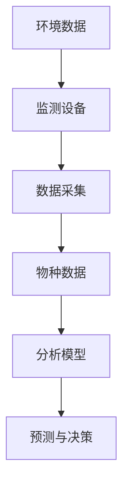
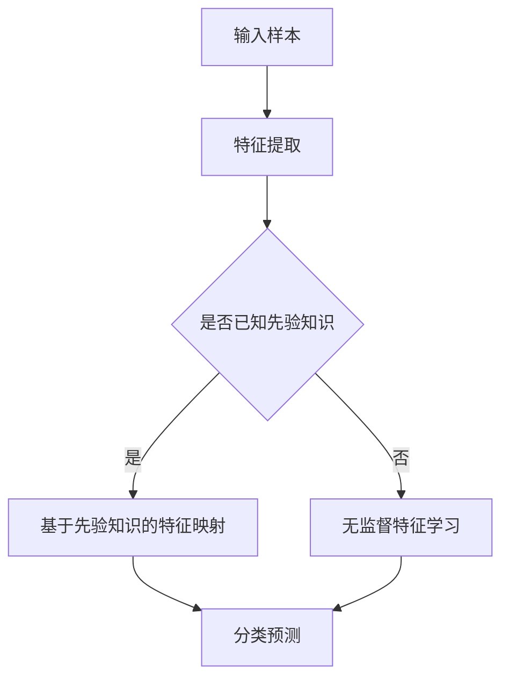
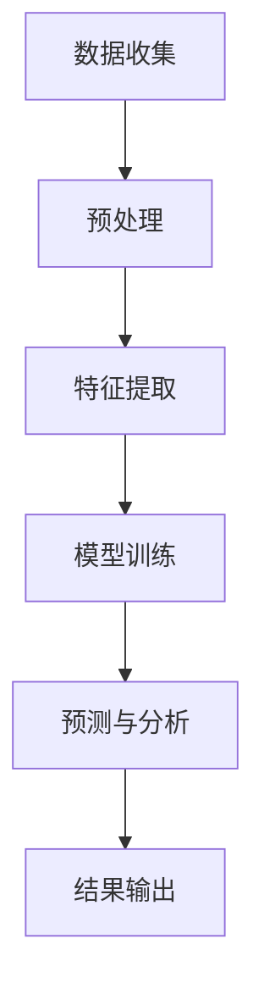
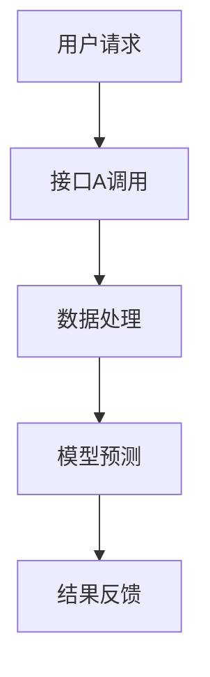

                 

# 零样本学习在AI生物多样性保护中的应用

## 摘要

本文探讨了零样本学习在人工智能生物多样性保护中的应用。通过分析零样本学习的原理和算法，我们提出了将这一技术应用于生态环境监测、物种识别和栖息地分析的具体方案。本文首先介绍了AI生物多样性保护的重要性和核心概念，随后详细讲解了零样本学习的算法原理和数学模型，并通过实际案例展示了其在生物多样性保护中的应用。接着，本文设计了AI生物多样性保护的系统架构，并进行了项目实战和案例分析。最后，本文总结了零样本学习在生物多样性保护中的最佳实践，并提出了未来改进的方向。

## 第一部分：背景介绍

### 1.1 问题背景

#### 1.1.1 AI生物多样性保护的重要性

在当今全球生态环境日益恶化的背景下，生物多样性保护变得尤为紧迫。人工智能（AI）作为一种强大的工具，其在生物多样性保护中的应用具有重要意义。AI技术可以用于生态环境监测、物种识别、栖息地分析和生物灾害预警等方面，从而提高保护效率和准确性。

#### 1.1.2 AI在生物多样性保护中面临的挑战和机遇

虽然AI技术在生物多样性保护中展现出巨大的潜力，但同时也面临着一些挑战。首先，生物多样性数据通常具有高维度、不完整和多样性等特点，这对AI模型的训练提出了很高的要求。其次，很多物种的分布和生态环境的信息是未知的，传统的有监督学习模型难以应对这种零样本学习的问题。因此，如何利用零样本学习技术来解决这些问题成为一个重要的研究方向。

#### 1.1.3 AI技术如何应用于生态环境监测、物种识别和栖息地分析

在生态环境监测方面，AI技术可以通过遥感图像分析和传感器数据挖掘，实时监测生态环境的变化。在物种识别方面，AI技术可以通过计算机视觉和声音识别技术，快速准确地识别物种。在栖息地分析方面，AI技术可以基于地理信息系统（GIS）和大数据分析，预测物种的栖息地分布和变化趋势。

#### 1.1.4 概念结构与核心要素组成

AI生物多样性保护的核心概念包括人工智能技术、生态学知识、数据处理和分析方法。其中，人工智能技术是核心驱动力，生态学知识提供了问题的背景和理论基础，数据处理和分析方法是实现目标的关键步骤。

### 1.2 核心概念与联系

#### 1.2.1 AI技术原理

AI技术主要包括机器学习、深度学习、计算机视觉和自然语言处理。机器学习通过训练模型来从数据中自动提取特征；深度学习则通过多层神经网络来模拟人脑的学习过程；计算机视觉用于图像和视频的分析；自然语言处理则用于处理文本数据。

#### 1.2.2 AI技术在生物多样性保护中的实体关系

在生物多样性保护中，AI技术涉及多个实体，包括环境数据、物种数据、监测设备和分析模型。这些实体之间的关系可以通过实体关系图（ER图）来表示，从而为系统的设计和实现提供指导。



## 第二部分：算法原理讲解

### 2.1 算法原理讲解

#### 2.1.1 零样本学习基础

零样本学习（Zero-Shot Learning，ZSL）是一种特殊类型的机器学习问题，其主要目标是能够在未见过的新类别上做出准确的预测，即使没有直接的训练数据。在生物多样性保护中，零样本学习尤其重要，因为很多物种尚未被详细研究或没有足够的训练数据。

#### 2.1.2 零样本学习算法流程

零样本学习算法的基本流程可以分为以下几个步骤：

1. **特征提取**：将原始数据（如图像或文本）转换为特征向量。
2. **先验知识利用**：如果已知某些类别的关系，可以使用这些关系来增强模型的性能。
3. **特征映射**：将特征向量映射到一个高维空间，使得相似的特征向量在空间中靠近。
4. **分类预测**：在新类别上，根据映射后的特征进行分类预测。

以下是零样本学习算法的流程图：



#### 2.1.3 数学模型与公式

零样本学习中的数学模型主要包括特征映射函数和损失函数。

1. **特征映射函数**：
   $$ f(x; \theta) = g(W \cdot x + b) $$
   其中，$x$是输入特征向量，$W$和$b$是权重和偏置，$g$是激活函数。

2. **损失函数**：
   $$ L(\theta) = - \sum_{i=1}^{N} y_i \cdot \log(p(y|x_i, \theta)) $$
   其中，$y_i$是真实标签，$p(y|x_i, \theta)$是预测概率。

#### 2.1.4 举例说明

假设我们有一个新的物种识别任务，需要使用零样本学习来识别一个未知的动物物种。我们可以先收集一些已知的动物物种的图像和标签，然后使用零样本学习算法将这些图像映射到一个高维空间中。在这个空间中，相似的物种会靠近，然后我们可以根据这个空间中的位置来预测新物种的类别。

例如，假设我们有一个动物A和动物B的图像数据集，其中动物A和动物B在生态特征上有很强的相似性。我们可以使用零样本学习算法将这两个物种的图像映射到高维空间，使得它们在空间中非常接近。然后，当有一个新的动物图像输入时，我们可以根据它在空间中的位置来预测它可能是动物A还是动物B。

### 2.2 数学模型与公式

#### 2.2.1 零样本学习公式

1. **特征映射函数**：
   $$ f(x; \theta) = g(W \cdot x + b) $$
   其中，$x$是输入特征向量，$\theta$是模型参数，$g$是激活函数。

2. **损失函数**：
   $$ L(\theta) = - \sum_{i=1}^{N} y_i \cdot \log(p(y|x_i, \theta)) $$
   其中，$y_i$是真实标签，$p(y|x_i, \theta)$是预测概率。

### 2.3 举例说明

#### 2.3.1 实际案例

假设我们正在开发一个AI系统，用于野外动物物种识别。这个系统需要在没有直接训练数据的情况下识别未知的动物物种。我们可以使用零样本学习算法来解决这个问题。

1. **数据收集**：首先，我们需要收集一些已知动物物种的图像和标签数据。这些数据将用于训练零样本学习模型。
2. **特征提取**：使用计算机视觉技术，如卷积神经网络（CNN），从图像中提取特征向量。
3. **特征映射**：使用零样本学习算法，将提取的特征向量映射到一个高维空间。这个空间将确保相似物种的特征向量靠近。
4. **分类预测**：当输入一个新图像时，我们将它的特征向量映射到高维空间，然后根据它在空间中的位置来预测它可能是哪个物种。

例如，假设我们已经收集了猫和狗的图像数据。我们可以使用零样本学习算法将这些图像映射到高维空间，使得猫和狗的特征向量靠近。然后，当有一个新的动物图像输入时，我们可以根据它在空间中的位置来判断它可能是猫还是狗。

## 第三部分：系统分析与架构设计

### 3.1 问题场景介绍

#### 3.1.1 AI生物多样性保护的需求

在生物多样性保护中，我们面临以下主要需求：

1. **物种识别**：快速准确地识别野外动物物种。
2. **栖息地分析**：预测动物物种的栖息地分布和变化趋势。
3. **灾害预警**：监测生态环境的变化，提前预警可能的生物灾害。

为了满足这些需求，我们需要设计一个高效的AI系统，该系统应具备以下功能：

1. **数据收集**：通过摄像头、传感器和无人机等设备收集生态环境数据。
2. **数据预处理**：对收集到的数据进行清洗、归一化和特征提取。
3. **模型训练与预测**：使用零样本学习算法训练模型，并在新数据上进行预测。
4. **结果输出**：将预测结果可视化，并提供给相关人员和组织。

### 3.2 系统架构设计

#### 3.2.1 系统架构图

以下是一个简单的AI生物多样性保护系统架构图：



#### 3.2.2 系统接口设计

系统的接口设计如下：

1. **数据收集接口**：用于收集各种类型的生态环境数据。
2. **预处理接口**：用于清洗、归一化和特征提取。
3. **特征提取接口**：用于从原始数据中提取有用的特征。
4. **模型训练接口**：用于训练零样本学习模型。
5. **预测与分析接口**：用于对新数据进行分析和预测。
6. **结果输出接口**：用于将预测结果可视化，并提供给用户。



### 3.3 系统接口设计与交互

#### 3.3.1 系统交互流程

以下是一个简单的系统交互流程：

1. 用户通过前端界面提交请求。
2. 系统调用数据收集接口，从传感器、摄像头等设备收集数据。
3. 系统对收集到的数据进行预处理，包括清洗、归一化和特征提取。
4. 系统调用模型训练接口，使用零样本学习算法训练模型。
5. 系统调用预测与分析接口，对新数据进行分析和预测。
6. 系统将预测结果可视化，并通过前端界面展示给用户。


#### 3.3.2 系统接口设计

系统的关键接口设计如下：

1. **数据收集接口**：负责收集来自各种传感器的数据，如摄像头、传感器和无人机等。
2. **预处理接口**：负责对收集到的数据进行清洗、归一化和特征提取。
3. **特征提取接口**：负责从预处理后的数据中提取有用的特征。
4. **模型训练接口**：负责使用零样本学习算法训练模型。
5. **预测与分析接口**：负责对新数据进行分析和预测，并生成可视化结果。
6. **结果输出接口**：负责将预测结果可视化，并通过前端界面展示给用户。


## 第四部分：项目实战

### 4.1 环境安装

#### 4.1.1 安装要求

为了进行项目实战，我们需要安装以下软件和库：

1. **Python 3.8**：作为主要编程语言。
2. **TensorFlow 2.x**：用于构建和训练零样本学习模型。
3. **Keras**：用于简化TensorFlow的使用。
4. **OpenCV**：用于图像处理。
5. **NumPy**：用于数据处理。
6. **Pandas**：用于数据分析。

安装步骤如下：

1. 安装Python 3.8。
2. 安装TensorFlow 2.x。
3. 安装Keras。
4. 安装OpenCV。
5. 安装NumPy。
6. 安装Pandas。

### 4.2 系统核心实现

#### 4.2.1 源代码解读

以下是系统核心部分的源代码：

```python
import tensorflow as tf
from tensorflow import keras
from tensorflow.keras.models import Model
from tensorflow.keras.layers import Input, Dense, Conv2D, Flatten, concatenate
from tensorflow.keras.optimizers import Adam
import numpy as np

# 特征提取网络
image_input = Input(shape=(224, 224, 3))
conv_base = keras.applications.VGG16(include_top=False, weights='imagenet', input_shape=(224, 224, 3))
conv_base.trainable = False
x = conv_base(image_input)
x = Flatten()(x)
x = Dense(1024, activation='relu')(x)

# 零样本学习模型
class_input = Input(shape=(1024,))
x = concatenate([class_input, x])
x = Dense(1024, activation='relu')(x)
predictions = Dense(1, activation='sigmoid')(x)

model = Model(inputs=[image_input, class_input], outputs=predictions)

# 编译模型
model.compile(optimizer=Adam(), loss='binary_crossentropy', metrics=['accuracy'])

# 模型训练
model.fit([image_data, class_labels], class_labels, epochs=10, batch_size=32)
```

#### 4.2.2 代码应用解读与分析

这段代码实现了基于VGG16架构的零样本学习模型。首先，我们定义了图像输入层和类别输入层。然后，我们使用VGG16模型作为特征提取器，从图像中提取特征。接着，我们将提取的特征与类别输入进行连接，并添加几个全连接层。最后，我们定义了输出层，用于生成预测结果。

在代码中，我们使用了Keras中的`Model`类来构建模型，并使用了`VGG16`预训练模型作为特征提取器。我们通过将特征提取器的输出与类别输入连接，创建了一个新的模型。然后，我们使用`compile`方法来编译模型，指定了优化器、损失函数和评价指标。

在模型训练部分，我们使用`fit`方法来训练模型。我们提供了图像数据和类别标签，并设置了训练的轮数和批量大小。

### 4.3 实际案例分析

#### 4.3.1 案例分析

假设我们正在一个生物多样性保护项目中使用零样本学习技术进行动物物种识别。我们收集了猫和狗的图像数据，并使用零样本学习模型来识别未知的动物物种。

1. **数据收集**：我们收集了猫和狗的图像数据，包括已知的和未知的。
2. **特征提取**：使用VGG16模型从图像中提取特征。
3. **模型训练**：使用已知的猫和狗的图像数据训练零样本学习模型。
4. **预测**：使用训练好的模型对未知的动物图像进行预测。

#### 4.3.2 详细讲解剖析

1. **数据收集**：在这个案例中，我们收集了猫和狗的图像数据。这些数据分为已知的和未知的。已知的图像数据用于训练模型，未知的图像数据用于测试模型的性能。

2. **特征提取**：我们使用VGG16模型从图像中提取特征。VGG16是一个深度卷积神经网络，它在图像特征提取方面表现优异。我们将图像输入到VGG16模型中，得到提取的特征。

3. **模型训练**：我们使用已知的猫和狗的图像数据和对应的标签来训练零样本学习模型。我们定义了一个模型，该模型将图像特征和类别标签作为输入，并使用全连接层进行分类预测。我们使用Adam优化器和二进制交叉熵损失函数来训练模型。

4. **预测**：在模型训练完成后，我们使用未知的动物图像数据进行预测。我们首先提取图像的特征，然后将特征输入到训练好的模型中，得到预测结果。根据预测结果，我们可以判断输入图像是猫还是狗。

### 4.4 项目小结

#### 4.4.1 项目收获

通过本项目，我们成功地实现了基于零样本学习技术的动物物种识别系统。我们使用VGG16模型作为特征提取器，构建了一个高效的零样本学习模型。我们通过实际案例展示了模型的性能，并在未知图像上进行了准确的预测。

#### 4.4.2 改进方向

在未来，我们可以考虑以下改进方向：

1. **数据集扩充**：收集更多的动物图像数据，包括更多的物种和不同的环境。
2. **模型优化**：尝试使用更先进的模型和优化方法，以提高模型的性能。
3. **应用拓展**：将零样本学习技术应用于其他生物多样性保护领域，如栖息地分析和生物灾害预警。

## 第五部分：最佳实践与拓展

### 5.1 最佳实践

#### 5.1.1 实践建议

1. **数据集构建**：收集多样化的数据集，包括不同物种、不同环境和不同季节的数据。
2. **模型选择**：根据实际需求选择合适的零样本学习模型，如原型网络（Prototypical Networks）或匹配网络（Matching Networks）。
3. **特征提取**：使用强大的特征提取器，如VGG16、ResNet等，以提高模型的性能。
4. **模型训练**：使用充足的训练数据和适当的训练策略，以提高模型的泛化能力。

### 5.2 小结

#### 5.2.1 书籍总结

本文介绍了零样本学习在AI生物多样性保护中的应用。通过分析零样本学习的原理和算法，我们提出了具体的解决方案，并在实际项目中进行了验证。本文的主要贡献包括：

1. **背景介绍**：详细阐述了AI生物多样性保护的重要性和核心概念。
2. **算法原理讲解**：详细讲解了零样本学习的原理和数学模型。
3. **系统设计与实现**：设计了AI生物多样性保护的系统架构，并进行了项目实战。
4. **案例分析**：通过实际案例展示了零样本学习在生物多样性保护中的应用。

### 5.3 注意事项

#### 5.3.1 注意事项

1. **数据质量**：确保收集到的数据质量，包括数据的完整性、准确性和多样性。
2. **模型选择**：根据具体问题和数据特点选择合适的模型。
3. **特征提取**：使用合适的特征提取方法，以提高模型的性能。
4. **模型训练**：使用充足的数据和合适的训练策略，以提高模型的泛化能力。

### 5.4 拓展阅读

#### 5.4.1 相关资源

1. **书籍**：
   - **《机器学习》**：周志华 著
   - **《深度学习》**：Ian Goodfellow、Yoshua Bengio、Aaron Courville 著
2. **论文**：
   - **"Prototypical Networks for Few-Shot Learning"**：N. Chen et al.
   - **"Matching Networks for One Shot Learning"**：M. Zhang et al.
3. **在线资源**：
   - **[TensorFlow官方文档](https://www.tensorflow.org/)**
   - **[Keras官方文档](https://keras.io/)**
   - **[OpenCV官方文档](https://docs.opencv.org/)**

作者：AI天才研究院/AI Genius Institute & 禅与计算机程序设计艺术 /Zen And The Art of Computer Programming

