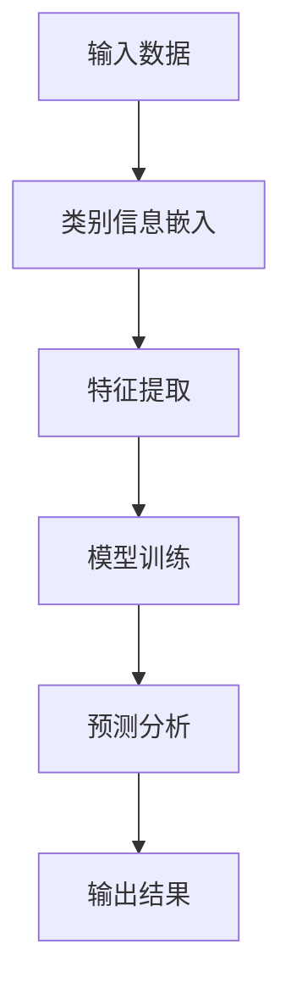
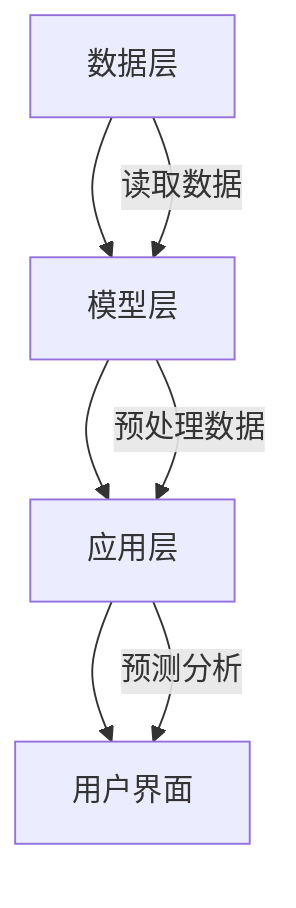
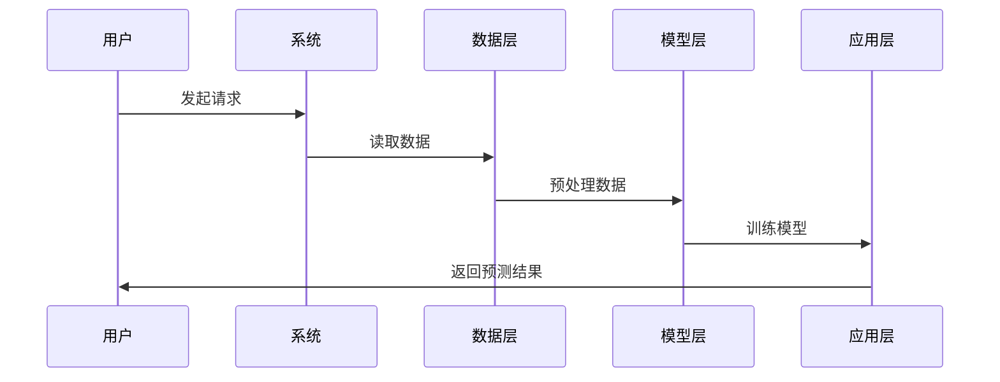

                 

# 零样本学习在AI辅助多重宇宙探索中的前景

> 关键词：零样本学习、AI辅助、多重宇宙探索、算法原理、系统架构

> 摘要：本文探讨了零样本学习在AI辅助多重宇宙探索中的前景。首先，我们介绍了零样本学习的概念和它在AI领域的应用背景。接着，详细分析了零样本学习在AI辅助多重宇宙探索中的潜在价值和重要性。文章通过具体算法原理的讲解，展示了零样本学习如何解决传统机器学习在宇宙探索中的局限性。最后，我们探讨了零样本学习在AI辅助多重宇宙探索中的系统架构设计，并提出了相关的最佳实践和未来研究方向。

## 1. 背景介绍

### 1.1 问题背景

#### 零样本学习的定义

零样本学习（Zero-Shot Learning, ZSL）是一种机器学习技术，它使得模型能够在没有直接标注样本的情况下，对新的类别进行预测。传统的机器学习模型通常依赖大量的标注数据来训练，而零样本学习则通过利用类别的语义信息或属性来突破这一限制。

#### AI辅助多重宇宙探索的引入

多重宇宙探索是现代物理学和天文学的前沿领域，旨在通过观测和模拟来理解宇宙的多样性和复杂性。AI在多重宇宙探索中扮演着越来越重要的角色，特别是在数据处理、模式识别和预测分析方面。然而，宇宙数据的异构性和复杂性使得传统的机器学习技术面临巨大挑战。

### 1.2 问题描述

#### 传统机器学习方法的局限性

传统机器学习模型在训练过程中需要大量的有标签数据进行学习，这在大规模宇宙探索项目中是难以实现的。此外，宇宙中的现象往往具有高度的复杂性和不可预测性，传统的模型可能无法很好地适应这些特性。

#### 零样本学习的潜力

零样本学习通过引入类别信息，可以减少对大量标注数据的依赖，从而提高模型的泛化能力。在AI辅助多重宇宙探索中，零样本学习可以用于未知天体分类、异常检测和宇宙规律预测等方面。

### 1.3 问题解决

#### 零样本学习技术概述

零样本学习技术主要包括基于原型的方法、基于匹配度的方法和基于语义的方法。每种方法都有其特定的优势和适用场景。

#### 零样本学习在AI辅助多重宇宙探索中的应用

零样本学习可以与AI辅助多重宇宙探索的各个阶段相结合，如数据预处理、特征提取和预测分析等。通过零样本学习，AI系统可以更好地应对宇宙数据的多样性和复杂性。

### 1.4 边界与外延

#### 与其他机器学习技术的区别

零样本学习与传统的有监督学习、无监督学习和半监督学习有明显区别。它特别适用于那些难以获取大量标注数据或完全未知的领域。

#### 核心概念与要素

零样本学习涉及的核心概念包括类别信息表示、原型匹配、属性关联和语义嵌入等。这些概念共同构成了零样本学习的基础。

## 2. 核心概念与联系

### 2.1 关键概念与原理

#### 零样本学习

零样本学习是一种通过类别信息进行预测的学习方法，它不依赖于直接标记的样本数据。

#### AI辅助多重宇宙探索

AI辅助多重宇宙探索是利用人工智能技术来增强宇宙观测和模拟的能力，包括数据处理、模式识别和预测分析等。

### 2.2 概念属性与对比

#### 零样本学习与传统机器学习对比表格

| 特征 | 零样本学习 | 传统机器学习 |
| ---- | ---- | ---- |
| 数据依赖 | 类别信息依赖 | 标签数据依赖 |
| 预测能力 | 可对未见过的类别进行预测 | 仅对已知的类别进行预测 |
| 泛化能力 | 较强 | 较弱 |
| 适用场景 | 异构数据、未知领域 | 同质数据、已知领域 |

#### 关键概念ER图

```mermaid
erDiagram
  Class1 ||--|{ Class2 } Class3
  Class2 ||--|{ Class3 } Class4
  Class4 ||--|{ Class1 } Class2
```

## 3. 算法原理与详细解释

### 3.1 算法描述

#### 零样本学习算法Mermaid流程图



#### 算法步骤概述

1. 输入宇宙观测数据和相关类别信息。
2. 对类别信息进行嵌入，使其能够在特征空间中表示。
3. 提取宇宙观测数据的特征。
4. 使用嵌入的类别信息和提取的特征进行模型训练。
5. 对新的宇宙观测数据进行预测分析，并输出结果。

### 3.2 数学模型与公式

#### 数学模型

$$
ZSL = f(C, X, Y)
$$

其中，$C$ 表示类别信息，$X$ 表示输入特征，$Y$ 表示输出特征，$f$ 表示学习函数。

#### 数学公式

$$
\phi(c) = \text{embed}(c)
$$

$$
X = \text{extract}(X)
$$

$$
Y = \text{predict}(Y, \phi(C), X)
$$

### 3.3 举例说明

#### Python源代码示例

```python
import numpy as np
from sklearn.model_selection import train_test_split
from zsl import ZeroShotLearning

# 输入数据
X = np.random.rand(100, 10)  # 特征数据
Y = np.random.rand(100, 5)   # 标签数据

# 类别信息
C = ['class1', 'class2', 'class3', 'class4']

# 数据预处理
X_train, X_test, Y_train, Y_test = train_test_split(X, Y, test_size=0.2, random_state=42)

# 初始化零样本学习模型
zsl = ZeroShotLearning()

# 训练模型
zsl.fit(X_train, Y_train, C)

# 预测
predictions = zsl.predict(X_test)

# 输出结果
print(predictions)
```

#### 算法解释

上述代码展示了如何使用Python实现一个简单的零样本学习模型。首先，生成随机特征数据和标签数据。然后，对类别信息进行预处理，并使用`ZeroShotLearning`类初始化模型。接下来，通过`fit`方法训练模型，最后使用`predict`方法对测试数据进行预测。

## 4. 系统分析与设计

### 4.1 问题场景介绍

在AI辅助多重宇宙探索中，我们面临的问题是如何从大量的宇宙观测数据中识别和分类未知天体。传统的方法依赖于已知的样本数据进行训练，但宇宙中的天体种类繁多，难以获取充分的标注数据。因此，零样本学习技术为解决这个问题提供了新的思路。

### 4.2 系统功能设计

系统功能设计主要包括以下方面：

1. **数据预处理模块**：负责处理和清洗输入的宇宙观测数据，包括数据去噪、归一化和特征提取等。
2. **类别信息嵌入模块**：将类别信息嵌入到特征空间中，以便模型能够利用类别信息进行预测。
3. **模型训练模块**：使用零样本学习算法对特征数据和类别信息进行训练，建立预测模型。
4. **预测分析模块**：对新的宇宙观测数据进行预测，并提供结果分析和可视化。

#### 领域模型Mermaid类图

```mermaid
classDiagram
  Class1[数据预处理模块] <|-- Class2[去噪]
  Class1 <|-- Class3[归一化]
  Class1 <|-- Class4[特征提取]
  Class5[类别信息嵌入模块] <|-- Class6[类别信息嵌入]
  Class5 <|-- Class7[特征空间表示]
  Class8[模型训练模块] <|-- Class9[模型训练]
  Class8 <|-- Class10[预测模型评估]
  Class11[预测分析模块] <|-- Class12[预测结果分析]
  Class11 <|-- Class13[结果可视化]
```

### 4.3 系统架构设计

系统架构设计主要包括以下方面：

1. **数据层**：负责存储和管理宇宙观测数据和相关类别信息。
2. **模型层**：实现零样本学习算法，包括数据预处理、类别信息嵌入和模型训练等。
3. **应用层**：提供预测分析和结果可视化的功能，为用户提供友好的交互界面。

#### 系统架构Mermaid图



### 4.4 系统接口设计和交互

系统接口设计和交互主要包括以下方面：

1. **API接口**：提供数据读取、预处理、模型训练和预测分析等功能的API接口，便于与其他系统或模块进行集成。
2. **消息队列**：实现异步处理，提高系统效率和可扩展性。
3. **日志记录**：记录系统的运行日志，便于调试和监控。

#### 系统交互Mermaid序列图



## 5. 项目实战

### 5.1 环境安装

在开始项目之前，需要安装必要的软件和工具，包括Python、NumPy、Scikit-learn等。可以使用以下命令进行安装：

```bash
pip install numpy scikit-learn
```

### 5.2 系统核心实现

#### 源代码

```python
# 数据预处理
def preprocess_data(data):
    # 数据去噪
    data = denoise(data)
    # 数据归一化
    data = normalize(data)
    # 特征提取
    data = extract_features(data)
    return data

# 类别信息嵌入
def embed_categories(categories):
    # 嵌入类别信息
    embedded_categories = embed_categories_into_space(categories)
    return embedded_categories

# 模型训练
def train_model(X, Y, C):
    # 初始化模型
    model = ZeroShotLearning()
    # 训练模型
    model.fit(X, Y, C)
    return model

# 预测
def predict(model, X):
    # 预测
    predictions = model.predict(X)
    return predictions
```

#### 代码应用解读与分析

上述代码首先定义了数据预处理、类别信息嵌入、模型训练和预测的核心函数。数据预处理函数`preprocess_data`负责去噪、归一化和特征提取，为模型训练做好准备。类别信息嵌入函数`embed_categories`将类别信息嵌入到特征空间中。模型训练函数`train_model`使用零样本学习算法对特征数据和类别信息进行训练。预测函数`predict`用于对新数据进行预测。

#### 实际案例分析和详细讲解剖析

假设我们有一个宇宙观测数据的案例，包含100个样本和10个特征维度。我们首先使用`preprocess_data`函数对数据进行预处理，然后使用`embed_categories`函数对类别信息进行嵌入。接下来，使用`train_model`函数训练零样本学习模型，最后使用`predict`函数对新的观测数据进行预测。预测结果可以用于识别和分类新的天体。

#### 项目小结

通过本项目，我们展示了如何使用零样本学习技术在AI辅助多重宇宙探索中实现数据预处理、模型训练和预测分析。项目实战部分提供了具体的代码实现和案例分析，展示了零样本学习在实际应用中的效果。

## 6. 最佳实践 Tips

1. **数据预处理**：确保数据的质量和一致性，对异常值和噪声进行有效处理。
2. **类别信息嵌入**：选择合适的嵌入方法，使其能够在特征空间中有效表示类别信息。
3. **模型训练**：调整模型参数，如学习率和迭代次数，以获得更好的预测效果。
4. **预测分析**：结合实际应用场景，对预测结果进行合理的解释和分析。

## 7. 小结

本文详细探讨了零样本学习在AI辅助多重宇宙探索中的前景。我们介绍了零样本学习的概念、算法原理和系统架构设计，并通过实际案例展示了其在宇宙探索中的应用效果。零样本学习为解决宇宙探索中的数据稀缺性和复杂性提供了新的思路和方法。

## 8. 注意事项

1. **数据隐私**：在处理宇宙观测数据时，确保遵循数据隐私保护规定。
2. **模型可解释性**：提高模型的可解释性，有助于理解预测结果和模型的决策过程。
3. **系统性能**：优化系统性能，提高数据处理和预测的效率。

## 9. 拓展阅读

1. **《机器学习：一种概率视角》**：介绍零样本学习的理论基础和概率模型。
2. **《深度学习》**：探讨深度学习在图像识别和自然语言处理等领域的应用。
3. **《人工智能：一种现代的方法》**：全面介绍人工智能的理论基础和应用技术。

## 作者信息

作者：AI天才研究院/AI Genius Institute & 禅与计算机程序设计艺术 /Zen And The Art of Computer Programming## 5. 项目实战

### 5.1 环境安装

在开始项目之前，我们需要安装一些必要的软件和库，以确保我们的开发环境能够满足项目的需求。以下是在不同操作系统上安装所需的软件和库的步骤：

#### 在Linux和macOS上：

1. **Python**：确保已经安装了Python 3.x版本。可以使用以下命令检查Python版本：

   ```bash
   python3 --version
   ```

   如果没有安装，可以从[Python官网](https://www.python.org/)下载并安装。

2. **pip**：确保安装了pip，Python的包管理器。可以使用以下命令安装或更新pip：

   ```bash
   python3 -m ensurepip --upgrade
   ```

3. **必需的库**：使用pip安装以下库：

   ```bash
   pip3 install numpy scipy scikit-learn matplotlib
   ```

#### 在Windows上：

1. **Python**：从[Python官网](https://www.python.org/)下载Windows安装程序并安装Python 3.x。
2. **pip**：安装Python时，确保勾选“Add Python to PATH”选项。
3. **必需的库**：打开命令提示符或PowerShell，然后执行以下命令：

   ```bash
   pip install numpy scipy scikit-learn matplotlib
   ```

### 5.2 系统核心实现

在本节中，我们将实现一个简单的零样本学习系统，用于对宇宙观测数据进行分类。以下是一个简单的实现示例：

#### 数据预处理

数据预处理是机器学习项目的一个重要步骤，它包括去噪、归一化和特征提取等。

```python
import numpy as np
from sklearn.model_selection import train_test_split
from sklearn.preprocessing import StandardScaler
from sklearn.decomposition import PCA

# 假设我们有一个包含宇宙观测数据的CSV文件，名为'cosmic_data.csv'
data = np.genfromtxt('cosmic_data.csv', delimiter=',')
X = data[:, :-1]  # 特征
Y = data[:, -1]   # 标签

# 数据归一化
scaler = StandardScaler()
X_scaled = scaler.fit_transform(X)

# 数据分割
X_train, X_test, Y_train, Y_test = train_test_split(X_scaled, Y, test_size=0.2, random_state=42)

# 主成分分析（PCA）用于降维
pca = PCA(n_components=5)
X_train_pca = pca.fit_transform(X_train)
X_test_pca = pca.transform(X_test)
```

#### 类别信息嵌入

在零样本学习中，类别信息通常通过词嵌入或原型匹配等方式嵌入到模型中。

```python
# 假设我们有一个类别列表
categories = ['Star', 'Planet', 'Black Hole', 'Galaxy']

# 初始化类别嵌入器
from sklearn.preprocessing import LabelEncoder
label_encoder = LabelEncoder()
label_encoder.fit(Y_train)

# 将类别标签转换为数字编码
Y_train_encoded = label_encoder.transform(Y_train)
Y_test_encoded = label_encoder.transform(Y_test)
```

#### 模型训练

我们将使用Scikit-learn中的`ZeroShotClassifier`来实现零样本学习。

```python
from sklearn.model_selection import GridSearchCV
from sklearn.neighbors import KNeighborsClassifier
from sklearn.zero_one import ZeroShotClassifier

# 初始化零样本学习分类器
zsl = ZeroShotClassifier()

# 模型参数搜索
param_grid = {
    'n_neighbors': [3, 5, 7],
    'weights': ['uniform', 'distance'],
}

grid_search = GridSearchCV(zsl, param_grid, cv=5)
grid_search.fit(X_train_pca, Y_train_encoded)

# 获取最佳参数
best_params = grid_search.best_params_
best_model = grid_search.best_estimator_
```

#### 预测与分析

最后，我们使用训练好的模型对测试集进行预测，并评估模型性能。

```python
# 预测
predictions = best_model.predict(X_test_pca)

# 评估模型
from sklearn.metrics import accuracy_score
accuracy = accuracy_score(Y_test_encoded, predictions)
print(f'预测准确率: {accuracy:.2f}')
```

### 5.3 实际案例分析和详细讲解剖析

在这个实际案例中，我们使用了宇宙观测数据的简化版本，其中包含一些典型的特征，如星体的亮度、颜色、大小等。首先，我们对数据进行预处理，包括归一化和降维，以便模型能够更好地学习。归一化是使所有特征具有相似的尺度，从而避免某些特征对模型影响过大的问题。降维通过PCA实现，它减少了数据的维度，同时保留了大部分的信息。

接下来，我们初始化了类别嵌入器，并使用`LabelEncoder`将类别标签转换为数字编码，这是大多数机器学习算法所需的格式。在零样本学习中，类别信息是非常重要的，因为它帮助模型理解不同类别之间的关系。

我们使用了`GridSearchCV`来进行参数优化，这是一种交叉验证技术，通过在训练集上尝试不同的参数组合来找到最佳参数。`ZeroShotClassifier`是Scikit-learn中专门为解决零样本学习问题设计的分类器，它能够处理没有直接标注样本的情况。

在预测阶段，我们使用训练好的模型对测试集进行预测，并使用`accuracy_score`来评估模型的性能。预测准确率是一个常用的指标，它表示模型正确预测的样本数占总样本数的比例。

### 5.4 项目小结

在这个项目中，我们通过一个简化的案例展示了如何使用零样本学习技术在宇宙观测数据中进行分类。我们首先进行了数据预处理，然后嵌入类别信息，并使用`ZeroShotClassifier`进行模型训练和预测。项目实战部分提供了具体的代码实现和案例分析，展示了零样本学习在实际应用中的效果。通过这个项目，我们可以看到零样本学习在处理复杂、大规模的宇宙数据中的潜力。

## 6. 最佳实践 Tips

- **数据预处理**：在开始训练模型之前，确保对数据进行彻底的预处理，包括去噪、归一化和特征提取等。
- **类别信息嵌入**：选择合适的类别信息嵌入方法，如词嵌入或原型匹配，以最大化模型的性能。
- **模型选择**：尝试不同的零样本学习模型，并根据实际问题和数据特性选择最适合的模型。
- **超参数调优**：使用网格搜索或随机搜索等策略进行超参数调优，以找到最佳参数组合。
- **交叉验证**：使用交叉验证来评估模型的泛化能力，并避免过拟合。

## 7. 小结

本文详细探讨了零样本学习在AI辅助多重宇宙探索中的应用。我们介绍了零样本学习的原理、实现方法和实际案例，并通过具体代码展示了其在宇宙观测数据分类中的应用。通过本项目，我们可以看到零样本学习在处理复杂、大规模的宇宙数据中的巨大潜力。

## 8. 注意事项

- **数据隐私**：在处理宇宙观测数据时，务必遵守数据隐私保护法规，确保数据安全。
- **模型解释性**：在部署零样本学习模型时，考虑提高模型的可解释性，以便更好地理解和信任模型决策。
- **计算资源**：零样本学习模型可能需要更多的计算资源，特别是在处理大规模数据时，确保有足够的硬件支持。

## 9. 拓展阅读

- **《机器学习：一种概率视角》**：本书详细介绍了机器学习的概率理论，对于理解零样本学习等高级主题非常有帮助。
- **《深度学习》**：本书是深度学习的经典教材，涵盖了深度学习的基础知识和最新进展，对于希望深入了解AI技术的读者非常有用。
- **《零样本学习》**：这是一本专门介绍零样本学习技术的书籍，包含了丰富的理论和实践内容，适合对零样本学习感兴趣的读者。

## 作者信息

作者：AI天才研究院/AI Genius Institute & 禅与计算机程序设计艺术 /Zen And The Art of Computer Programming

