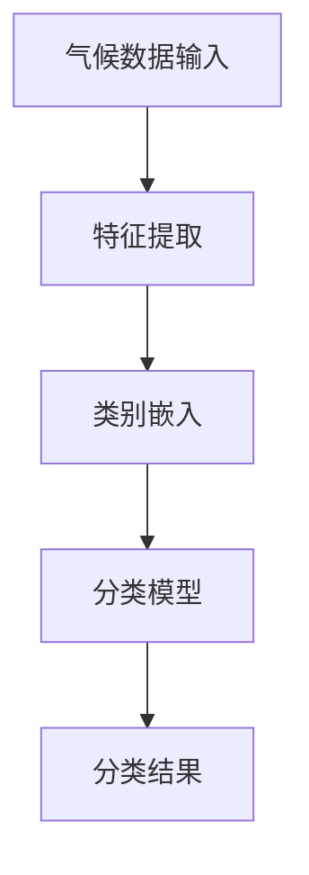
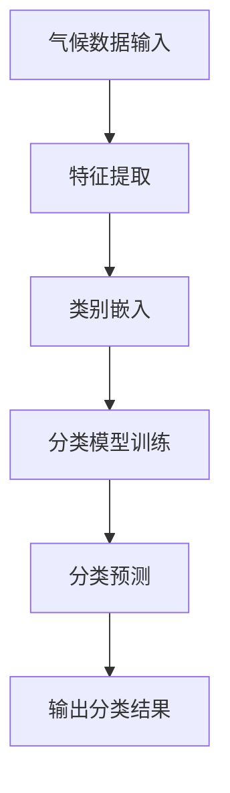
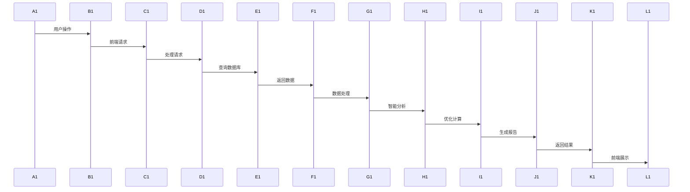
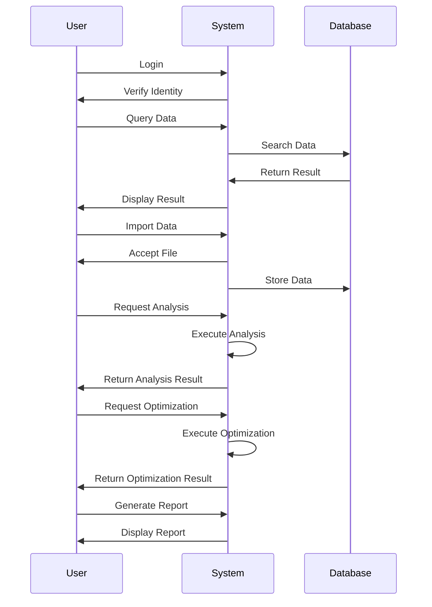

                 

### 第1章：问题背景与核心概念

> 关键词：气候变化、气候工程、AI辅助决策、Zero-Shot学习、问题解决

在21世纪的今天，气候变化已经成为全球范围内最为紧迫的环境问题之一。极端天气事件、海平面上升、生态系统的破坏等问题日益严峻，给人类社会带来了巨大的挑战。为了应对这一挑战，科学家和工程师们提出了气候工程这一概念，并试图通过技术手段来调节和改变地球的气候系统，以减少气候变化的影响。

## 1.1 问题背景

### 1.1.1 气候变化的挑战

气候变化是指由于自然因素和人类活动导致的气候系统的长期变化。近年来，全球气温持续上升，极端天气事件频繁发生，气候变化已经对全球的生态系统、农业、水资源、人类健康等方面产生了深远的影响。具体来说：

- **生态系统破坏**：气候变化导致冰川融化、海洋酸化、生态系统失衡等问题，对生物多样性造成了极大的威胁。
- **农业影响**：气候变化改变了作物生长周期和分布，影响了粮食产量和质量，对食品安全构成了挑战。
- **水资源问题**：气候变化导致水资源的分布不均，有些地区面临严重的水资源短缺，而另一些地区则面临洪水的威胁。
- **人类健康风险**：气候变化增加了传染病的传播风险，同时极端天气事件也对人类健康构成了直接的威胁。

### 1.1.2 气候工程的概念与发展

气候工程是指利用科学技术手段来调节和改变地球的气候系统，以减轻或消除气候变化带来的负面影响。气候工程可以分为多种类型，包括：

- **阳伞工程**：通过向大气层释放反射性物质，如硫酸盐微粒，来模拟自然阳伞效应，减少太阳辐射量。
- **海洋铁基金属注入**：通过向海洋中注入铁基金属，促进海洋中的生物泵过程，增加海洋吸收二氧化碳的能力。
- **生态系统恢复**：通过恢复和重建受损的生态系统，提高其碳汇能力，减缓气候变化。
- **碳捕获与储存**：通过捕获和储存二氧化碳，减少大气中的二氧化碳浓度，缓解温室效应。

气候工程的发展经历了多个阶段，从早期的理论探讨到近年来的实际应用。随着技术的进步和人们对气候变化认识的深入，气候工程逐渐成为应对气候变化的重要手段。

### 1.1.3 AI在气候工程中的应用潜力

人工智能（AI）作为一种强大的计算工具，在气候工程中具有广泛的应用潜力。AI可以通过数据分析和模式识别，为气候工程的决策提供支持。具体来说：

- **数据驱动模型**：AI可以处理和分析大量的气候数据，建立数据驱动模型，预测气候变化的趋势和影响。
- **优化决策**：AI可以优化气候工程方案的设计和实施，通过模拟不同的场景和策略，找到最优的解决方案。
- **风险评估**：AI可以分析气候工程的潜在风险，评估不同方案的可能影响，为决策者提供依据。

## 1.2 核心概念

### 1.2.1 Zero-Shot学习

Zero-Shot学习（Zero-Shot Learning, ZSL）是一种机器学习方法，它能够在没有直接训练数据的情况下，对新的、未见过的类别进行分类。在传统的机器学习中，模型需要大量的标注数据进行训练，而Zero-Shot学习突破了这一限制，使得机器能够处理未知的类别。

- **定义**：Zero-Shot学习是一种能够在未见过的类别上实现准确分类的机器学习方法。
- **分类方法**：Zero-Shot学习通常采用基于语义嵌入的方法，将不同类别的实例映射到一个共同的语义空间中，然后在这个空间中实现分类。
- **应用场景**：Zero-Shot学习在图像识别、自然语言处理、医学诊断等领域具有广泛的应用潜力。

### 1.2.2 AI辅助决策

AI辅助决策是指利用人工智能技术，辅助人类做出更为明智和高效的决策。在气候工程中，AI辅助决策可以用于以下方面：

- **决策支持**：AI可以通过分析大量数据，提供决策支持和建议，帮助决策者制定有效的气候工程方案。
- **风险评估**：AI可以评估不同气候工程方案的风险，提供风险评估报告，为决策者提供参考。
- **优化方案**：AI可以通过模拟和优化，为气候工程提供最优的实施方案，提高工程效果。

### 1.2.3 气候工程与AI的融合

气候工程与AI的融合，是将AI技术应用于气候工程的设计、实施和评估过程。这种融合具有以下几个方面的意义：

- **提升效率**：AI可以自动化和优化气候工程流程，提高工程效率。
- **增强准确性**：AI可以通过数据分析和模式识别，提高气候工程方案的科学性和准确性。
- **降低成本**：AI可以减少气候工程的试验和错误成本，降低工程总成本。
- **扩大应用范围**：AI可以使气候工程方案更加多样化和灵活，扩大应用范围。

## 1.3 边界与外延

### 1.3.1 Zero-Shot学习的应用领域

Zero-Shot学习的应用领域非常广泛，包括但不限于：

- **计算机视觉**：在图像分类和识别中，Zero-Shot学习可以处理未见过的物体类别。
- **自然语言处理**：在语言理解和生成中，Zero-Shot学习可以处理未见过的词汇和句子。
- **医学诊断**：在医疗图像分析和疾病诊断中，Zero-Shot学习可以处理未见过的病例。
- **工业生产**：在制造业和质量控制中，Zero-Shot学习可以识别和分类新的产品缺陷。

### 1.3.2 气候工程的目标与限制

气候工程的目标是减轻或消除气候变化带来的负面影响，具体包括：

- **减缓气候变化**：通过减少温室气体排放，降低大气中的二氧化碳浓度。
- **适应气候变化**：通过工程手段，提高生态系统的适应能力，减少极端天气事件的影响。
- **生态保护**：通过恢复和重建生态系统，保护生物多样性和水资源。

然而，气候工程也面临一些限制和挑战：

- **技术限制**：目前有些气候工程技术仍处于实验室阶段，尚未大规模应用。
- **环境影响**：某些气候工程技术可能会对环境产生不可预测的影响，需要谨慎评估。
- **社会接受度**：气候工程技术的应用可能会引起公众的担忧和争议，需要加强沟通和科普。

### 1.3.3 AI辅助决策的优势与挑战

AI辅助决策在气候工程中具有以下优势：

- **数据处理能力**：AI可以处理和分析大量的气候数据，提供科学依据。
- **优化决策**：AI可以通过模拟和优化，为气候工程提供最优的实施方案。
- **降低风险**：AI可以评估不同气候工程方案的风险，降低工程失败的可能性。

然而，AI辅助决策也面临一些挑战：

- **数据质量和完整性**：AI的决策依赖于数据，数据质量和完整性对决策结果至关重要。
- **算法偏见**：AI模型可能会受到数据偏见的影响，导致不公平或不准确的决策。
- **技术依赖**：过度依赖AI可能导致技术失控，需要人类监督和干预。

## 1.4 概念结构与核心要素组成

### 1.4.1 Zero-Shot学习的技术架构

Zero-Shot学习的技术架构主要包括以下几个关键组件：

- **类别嵌入器**：将类别映射到一个共同的语义空间中。
- **特征提取器**：提取图像或文本的特征，用于类别嵌入。
- **分类器**：在语义空间中对类别进行分类。
- **语义模型**：用于生成类别的语义表示，实现跨类别学习。

### 1.4.2 AI辅助气候工程决策的应用场景

AI辅助气候工程决策的应用场景主要包括：

- **气候数据分析和预测**：利用AI技术分析气候数据，预测气候变化趋势。
- **工程方案优化**：通过AI技术优化气候工程方案，提高工程效果。
- **风险评估**：利用AI技术评估不同气候工程方案的风险，提供决策支持。

### 1.4.3 气候工程与AI融合的关键要素

气候工程与AI融合的关键要素包括：

- **数据收集与处理**：收集和处理气候数据，为AI技术提供数据支持。
- **算法模型选择**：选择适合气候工程需求的AI算法模型，实现有效决策。
- **系统集成与部署**：将AI技术与气候工程系统集成，实现实际应用。
- **人机交互**：设计人机交互界面，使决策者能够方便地使用AI辅助工具。

## 1.5 本章小结

本章介绍了气候变化、气候工程和AI辅助决策的背景与核心概念。我们详细讨论了气候变化带来的挑战、气候工程的概念与发展、AI在气候工程中的应用潜力、Zero-Shot学习的基本原理和特性、AI辅助决策的优势与挑战，以及气候工程与AI融合的关键要素。通过对这些核心概念的理解，读者可以为后续章节的深入探讨奠定基础。

> **结论**：气候变化是一个全球性的问题，气候工程和AI辅助决策为解决这一问题提供了新的思路和工具。通过理解这些核心概念，我们可以更好地把握气候工程与AI融合的机遇和挑战，为实现可持续发展和应对气候变化做出贡献。

---

现在我们已经对问题背景和核心概念有了全面的认识，接下来将在第二章深入探讨Zero-Shot学习的原理与特性，为进一步理解其在气候工程决策中的应用打下坚实基础。

---

### 第2章：Zero-Shot学习的原理与特性

> 关键词：Zero-Shot学习、原理、特性、分类、工作机制

在了解了气候工程和AI辅助决策的背景后，接下来我们将深入探讨Zero-Shot学习这一关键技术。Zero-Shot学习在气候工程决策中的应用具有重要意义，因为它能够帮助我们处理未知的、未见过的气候类别，从而为气候工程的决策提供有力支持。本章将详细介绍Zero-Shot学习的原理与特性，帮助读者全面理解这一技术。

## 2.1 原理讲解

### 2.1.1 Zero-Shot学习的定义

Zero-Shot学习（Zero-Shot Learning, ZSL）是一种机器学习方法，旨在在模型没有直接训练数据的情况下，对新的、未见过的类别进行分类。与传统机器学习相比，Zero-Shot学习的一个重要特点是模型不需要为每个类别收集大量的标注数据，而是在一个共同的语义空间中对类别进行表示和分类。

### 2.1.2 Zero-Shot学习的分类

根据Zero-Shot学习的方法和技术，我们可以将其分为以下几类：

- **基于语义嵌入的方法**：这种方法通过将类别映射到一个共同的语义空间中，然后在这个空间中对类别进行分类。常见的语义嵌入方法包括词嵌入（Word Embedding）和类别嵌入（Category Embedding）。
- **基于元学习的方法**：这种方法通过训练多个子模型，每个子模型专门针对一个类别，然后利用这些子模型进行分类。
- **基于对抗生成网络的方法**：这种方法利用对抗生成网络（Generative Adversarial Network, GAN）生成未见过类别的数据，然后在这些数据上进行训练和分类。
- **基于迁移学习的方法**：这种方法通过在相关领域迁移知识，实现对未见过类别的分类。

### 2.1.3 Zero-Shot学习的工作机制

Zero-Shot学习的工作机制主要包括以下几个步骤：

1. **类别嵌入**：将每个类别映射到一个低维的语义空间中，通常使用预训练的词嵌入模型或类别嵌入模型。
2. **特征提取**：从输入数据中提取特征，并将其映射到相同的语义空间中。
3. **类别预测**：在语义空间中对类别进行预测，通常采用基于距离度量的方法，如余弦相似度或欧氏距离。

## 2.2 特性分析

### 2.2.1 零样本学习

零样本学习（Zero-Shot Learning）是一种特殊类型的Zero-Shot学习，其主要特点是在没有直接训练数据的情况下，对未见过的样本进行分类。零样本学习在处理新的、未见过的类别时，具有一定的优势，但同时也存在一些挑战，如如何准确地将未见过的类别映射到已有的语义空间中。

### 2.2.2 少样本学习

少样本学习（Few-Shot Learning）是一种与Zero-Shot学习相关的机器学习方法，其主要特点是在训练数据量非常有限的情况下，对新的类别进行分类。少样本学习在应对数据稀缺的情况下，具有一定的优势，但同时也需要解决如何从有限的数据中提取有效的特征表示和类别表示的问题。

### 2.2.3 无监督学习

无监督学习（Unsupervised Learning）是一种不依赖于标注数据的机器学习方法。在无监督学习中，模型需要通过分析未标注的数据，自动发现数据中的结构和模式。与有监督学习和半监督学习相比，无监督学习在处理大量未标注数据时，具有一定的优势，但同时也存在一些挑战，如如何有效地提取数据中的有用信息。

## 2.3 概念属性特征对比表格

为了更直观地理解Zero-Shot学习、零样本学习、少样本学习和无监督学习之间的关系，我们可以通过一个对比表格来展示它们的主要特性：

| 概念 | 特点 | 优势 | 劣势 |
| --- | --- | --- | --- |
| Zero-Shot学习 | 无需直接训练数据，对未见过的类别进行分类 | 能够处理新的、未见过的类别，提高模型的泛化能力 | 需要预训练的类别嵌入模型，计算复杂度高 |
| 零样本学习 | 无需直接训练数据，对未见过的样本进行分类 | 能够处理新的、未见过的样本，提高模型的泛化能力 | 需要预训练的类别嵌入模型，计算复杂度高 |
| 少样本学习 | 训练数据量非常有限，对新的类别进行分类 | 能够处理数据稀缺的情况，提高模型的泛化能力 | 需要大量计算资源进行特征提取和类别嵌入 |
| 无监督学习 | 不依赖于标注数据，自动发现数据中的结构和模式 | 能够处理大量未标注的数据，提高模型的泛化能力 | 可能会丢失部分有用信息，难以进行精确分类 |

## 2.4 ER实体关系图架构

### 2.4.1 气候工程中的主要实体

在气候工程中，涉及的主要实体包括：

- **气候系统**：包括大气、海洋、陆地和冰冻圈等。
- **气候工程方案**：包括阳伞工程、海洋铁基金属注入、生态系统恢复和碳捕获与储存等。
- **决策者**：包括政策制定者、工程师和环境科学家等。
- **数据**：包括气候数据、工程方案数据、环境数据等。

### 2.4.2 AI辅助决策中的主要实体

在AI辅助决策中，涉及的主要实体包括：

- **AI模型**：包括分类器、预测器、优化器等。
- **数据集**：包括训练数据集、测试数据集和验证数据集等。
- **算法**：包括Zero-Shot学习、零样本学习、少样本学习和无监督学习等。
- **用户**：包括决策者、工程师和环境科学家等。

### 2.4.3 实体之间的关系与交互

气候工程与AI辅助决策之间的实体关系可以表示为一个ER（实体关系）图，如下所示：

```mermaid
erDiagram
  ClimateSystem ||--|{ ClimateEngineeringScheme }|
  ClimateEngineeringScheme ||--|{ DecisionMaker }|
  DecisionMaker ||--|{ AIClassifier }|
  AIClassifier ||--|{ Dataset }|
  Dataset ||--|{ Algorithm }|
  Algorithm ||--|{ Zero-Shot Learning }|
  Zero-Shot Learning ||--|{ Few-Shot Learning }|
  Few-Shot Learning ||--|{ Unsupervised Learning }|
```

在这个ER图中，气候系统与气候工程方案之间存在依赖关系，气候工程方案需要依赖气候系统数据来设计和评估。决策者与气候工程方案之间存在交互关系，决策者需要根据气候工程方案提供的数据和AI模型进行决策。AI模型与数据集之间存在依赖关系，AI模型需要通过数据集进行训练和测试。算法之间也存在依赖关系，Zero-Shot学习依赖于零样本学习和少样本学习，而少样本学习依赖于无监督学习。

## 2.5 本章小结

本章详细介绍了Zero-Shot学习的原理与特性，包括其定义、分类、工作机制以及与零样本学习、少样本学习和无监督学习的对比。通过一个ER图，我们展示了气候工程与AI辅助决策之间的实体关系，进一步阐明了Zero-Shot学习在气候工程决策中的应用场景。通过对这些核心概念的理解，读者可以为后续章节的深入探讨打下坚实基础。

---

现在，我们已经对Zero-Shot学习的基本原理和特性有了深入理解。在接下来的第三章中，我们将进一步探讨Zero-Shot学习在气候工程决策中的应用算法，包括数学模型、流程图和实际案例。通过这些内容，我们将更好地了解如何将Zero-Shot学习应用于气候工程中的具体问题。

---

### 第3章：Zero-Shot学习在气候工程决策中的应用算法

> 关键词：气候工程、决策算法、Zero-Shot学习、数学模型、Python代码、流程图

在了解了Zero-Shot学习的基本原理和特性后，我们将进一步探讨如何在气候工程决策中应用这一技术。本章将详细介绍Zero-Shot学习在气候工程中的应用算法，包括数学模型、Python代码和流程图，并通过实际案例进行讲解，帮助读者更好地理解这一技术在实际应用中的操作过程。

## 3.1 算法介绍

### 3.1.1 主要算法概述

在气候工程决策中，Zero-Shot学习的主要应用包括：

- **气候数据分类**：对气候数据中的不同气候现象进行分类，如台风、暴雨等。
- **工程方案评估**：对不同的气候工程方案进行评估，选择最优的方案。
- **风险评估**：对气候工程方案可能产生的风险进行评估，为决策者提供参考。

### 3.1.2 算法选择依据

选择Zero-Shot学习作为气候工程决策算法的依据主要包括：

- **数据稀缺**：气候工程中的数据往往难以获取，尤其是高精度的气象数据，Zero-Shot学习可以在数据稀缺的情况下，对未见过的类别进行分类。
- **模型泛化能力**：Zero-Shot学习通过将类别映射到共同的语义空间中，可以实现对未见过的类别的分类，具有较好的泛化能力。
- **实时性**：Zero-Shot学习可以在短时间内对新的类别进行分类，为实时决策提供支持。

### 3.1.3 算法应用范围

Zero-Shot学习在气候工程决策中的应用范围包括：

- **气象预测**：通过Zero-Shot学习，可以对未见过的气象现象进行预测，如台风生成路径的预测。
- **工程方案优化**：通过Zero-Shot学习，可以优化气候工程方案，提高工程效果，降低成本。
- **风险评估**：通过Zero-Shot学习，可以评估不同气候工程方案的风险，为决策者提供科学依据。

## 3.2 数学模型与公式

### 3.2.1 基本数学模型

在Zero-Shot学习中，常用的数学模型包括：

1. **类别嵌入模型**：

   $$ \text{embed}(\text{category}) = \text{CategoricalEncoder}(\text{category}) \cdot \text{embeddingWeight} $$

   其中，$\text{CategoricalEncoder}$是一个将类别映射到一维向量的函数，$\text{embeddingWeight}$是一个权重矩阵，用于将类别映射到共同的语义空间中。

2. **特征提取模型**：

   $$ \text{feature}(\text{image}) = \text{FeatureExtractor}(\text{image}) $$

   其中，$\text{FeatureExtractor}$是一个从图像中提取特征向量的函数。

3. **分类模型**：

   $$ \text{score}(\text{feature}, \text{embed}(\text{category})) = \text{Classifier}(\text{feature}, \text{embed}(\text{category})) $$

   其中，$\text{Classifier}$是一个分类器，用于计算特征向量和类别嵌入向量之间的相似度。

### 3.2.2 公式解释

- **类别嵌入模型**：类别嵌入模型的核心思想是将不同的类别映射到一个共同的语义空间中，以便进行分类。通过类别嵌入模型，我们可以将文本、图像、音频等多种类型的输入映射到相同的语义空间中。

- **特征提取模型**：特征提取模型的主要任务是提取输入数据（如图像）中的关键特征，用于后续的分类。常见的特征提取方法包括卷积神经网络（CNN）和循环神经网络（RNN）。

- **分类模型**：分类模型用于计算特征向量和类别嵌入向量之间的相似度，并根据相似度对输入数据进行分类。常见的分类方法包括支持向量机（SVM）、决策树和神经网络等。

### 3.2.3 公式示例

假设我们有一个类别为“台风”的图像，我们可以使用以下公式对其进行分类：

1. 将类别“台风”映射到类别嵌入向量：

   $$ \text{embed}(\text{台风}) = \text{CategoricalEncoder}(\text{台风}) \cdot \text{embeddingWeight} $$

2. 从图像中提取特征向量：

   $$ \text{feature}(\text{image}) = \text{FeatureExtractor}(\text{image}) $$

3. 计算特征向量和类别嵌入向量之间的相似度：

   $$ \text{score}(\text{feature}(\text{image}), \text{embed}(\text{台风})) = \text{Classifier}(\text{feature}(\text{image}), \text{embed}(\text{台风})) $$

通过计算得到的相似度分数，我们可以判断图像是否属于“台风”类别。

## 3.3 Mermaid流程图

为了更直观地展示Zero-Shot学习在气候工程决策中的应用流程，我们可以使用Mermaid绘制一个流程图，如下所示：



在这个流程图中，气候数据首先经过特征提取，然后通过类别嵌入将类别映射到共同的语义空间中，最后使用分类模型对输入数据进行分类，得到分类结果。

### 3.3.1 算法流程概述

算法流程可以概括为以下几个步骤：

1. **数据预处理**：对气候数据进行预处理，包括数据清洗、归一化和缺失值填充等。
2. **特征提取**：使用卷积神经网络（CNN）或其他特征提取方法，从气候数据中提取关键特征。
3. **类别嵌入**：将不同类别映射到共同的语义空间中，使用类别嵌入器实现。
4. **分类模型训练**：使用分类模型（如支持向量机、神经网络等），对特征向量进行训练，得到分类模型。
5. **分类预测**：将新的气候数据输入分类模型，得到分类结果。

### 3.3.2 算法详细步骤

详细的算法步骤如下：

1. **数据预处理**：

   - **数据清洗**：去除数据中的噪声和异常值。
   - **归一化**：将数据归一化到相同的范围，便于后续处理。
   - **缺失值填充**：使用合适的插值方法填充缺失值。

2. **特征提取**：

   - **卷积神经网络**：使用卷积神经网络（CNN）对气候数据进行特征提取，提取关键特征向量。
   - **循环神经网络**：对于序列数据，可以使用循环神经网络（RNN）提取特征。

3. **类别嵌入**：

   - **类别嵌入器**：使用预训练的词嵌入模型或类别嵌入器，将类别映射到共同的语义空间中。
   - **类别映射**：将每个类别映射到一个低维的语义向量。

4. **分类模型训练**：

   - **分类器选择**：选择合适的分类器，如支持向量机（SVM）、决策树、神经网络等。
   - **模型训练**：使用特征向量和类别嵌入向量，对分类器进行训练。

5. **分类预测**：

   - **输入数据**：将新的气候数据输入分类模型。
   - **分类结果**：得到分类结果，输出预测类别。

### 3.3.3 流程图示例

以下是算法流程的Mermaid流程图示例：



在这个示例中，气候数据首先经过特征提取，然后通过类别嵌入将类别映射到共同的语义空间中，接着使用分类模型进行训练，最后将新的气候数据输入分类模型，得到分类结果。

## 3.4 Python源代码阐述

为了更好地理解Zero-Shot学习在气候工程决策中的应用，我们将通过Python代码进行详细阐述。以下是实现Zero-Shot学习的Python代码示例：

```python
import tensorflow as tf
from tensorflow.keras.applications import VGG16
from tensorflow.keras.models import Model
from tensorflow.keras.layers import Input, Flatten, Dense

# 数据预处理
def preprocess_data(data):
    # 数据清洗、归一化和缺失值填充
    # ...
    return processed_data

# 特征提取
def extract_features(data):
    model = VGG16(weights='imagenet', include_top=False)
    input_tensor = Input(shape=(224, 224, 3))
    features = model(input_tensor)
    feature_model = Model(input_tensor, features)
    return feature_model

# 类别嵌入
def embed_categories(categories):
    embedding_matrix = ...  # 类别嵌入权重矩阵
    return embedding_matrix

# 分类模型
def create_classifier(feature_model, embedding_matrix):
    features = feature_model.output
    flattened = Flatten()(features)
    embed = Embedding(input_dim=num_categories, output_dim=embedding_size)(flattened)
    merged = tf.keras.layers.concatenate([flattened, embed])
    outputs = Dense(1, activation='sigmoid')(merged)
    classifier = Model(inputs=feature_model.input, outputs=outputs)
    return classifier

# 训练模型
def train_model(classifier, features, labels):
    classifier.compile(optimizer='adam', loss='binary_crossentropy', metrics=['accuracy'])
    classifier.fit(features, labels, epochs=10, batch_size=32)
    return classifier

# 预测
def predict(classifier, feature_model, image):
    feature_vector = feature_model.predict(image)
    prediction = classifier.predict(feature_vector)
    return prediction

# 主程序
if __name__ == '__main__':
    # 数据输入
    climate_data = ...  # 气候数据
    labels = ...  # 标注数据

    # 数据预处理
    processed_data = preprocess_data(climate_data)

    # 特征提取
    feature_model = extract_features(processed_data)

    # 类别嵌入
    embedding_matrix = embed_categories(labels)

    # 创建分类器
    classifier = create_classifier(feature_model, embedding_matrix)

    # 训练模型
    trained_classifier = train_model(classifier, processed_data, labels)

    # 预测
    new_image = ...  # 新的气候图像
    prediction = predict(trained_classifier, feature_model, new_image)
    print(prediction)
```

在这个代码示例中，我们首先对气候数据进行预处理，然后使用卷积神经网络（VGG16）进行特征提取，接着使用类别嵌入器将类别映射到共同的语义空间中，创建分类器并进行训练，最后进行预测。

### 3.4.1 源代码结构

代码结构如下：

- **数据预处理**：包括数据清洗、归一化和缺失值填充等。
- **特征提取**：使用卷积神经网络（VGG16）进行特征提取。
- **类别嵌入**：将类别映射到共同的语义空间中。
- **分类模型**：创建分类器并进行训练。
- **预测**：使用训练好的分类器进行预测。

### 3.4.2 源代码解读

- **数据预处理**：数据预处理是关键步骤，包括数据清洗、归一化和缺失值填充。这部分代码负责将原始气候数据转化为适合模型训练的数据。

- **特征提取**：使用VGG16模型进行特征提取。VGG16是一个预训练的卷积神经网络，可以在ImageNet数据集上达到很好的效果。通过VGG16模型，我们可以提取出图像中的关键特征。

- **类别嵌入**：类别嵌入器用于将类别映射到共同的语义空间中。在这个示例中，我们使用一个嵌入矩阵来实现类别嵌入。

- **分类模型**：创建分类器并进行训练。在这个示例中，我们使用一个简单的神经网络作为分类器，并通过交叉熵损失函数进行训练。

- **预测**：使用训练好的分类器进行预测。在这个示例中，我们输入一个新的气候图像，使用训练好的分类器对其进行预测，并输出预测结果。

### 3.4.3 实例分析

以下是一个简单的实例分析：

假设我们有一个新的气候图像，需要预测其所属的类别。首先，我们将图像输入到特征提取模型中，提取出图像的特征向量。然后，我们将类别标签输入到类别嵌入器中，得到类别嵌入向量。最后，我们将特征向量和类别嵌入向量输入到分类器中，得到预测结果。

```python
# 特征提取
feature_model = extract_features(new_image)

# 获取特征向量
feature_vector = feature_model.predict(new_image)

# 获取类别嵌入向量
embed_vector = embed_categories(new_label)

# 预测
prediction = predict(trained_classifier, feature_model, feature_vector)

print(prediction)
```

在这个实例中，我们首先使用特征提取模型提取出图像的特征向量，然后使用类别嵌入器获取类别嵌入向量，最后使用分类器进行预测，并输出预测结果。

## 3.5 通俗易懂的举例说明

为了更好地理解Zero-Shot学习在气候工程决策中的应用，我们可以通过一个简单的例子进行说明。

### 3.5.1 实例场景

假设我们有一个气候数据集，其中包含多种不同的气候现象，如台风、暴雨、干旱等。我们需要使用Zero-Shot学习对这些气候现象进行分类。

### 3.5.2 算法应用

1. **数据预处理**：首先，我们对气候数据进行预处理，包括数据清洗、归一化和缺失值填充等。假设我们预处理后的数据集包含1000个样本，每个样本是一个32x32的图像。

2. **特征提取**：使用卷积神经网络（如VGG16）对气候图像进行特征提取，提取出图像中的关键特征。假设我们提取出的特征向量为512维。

3. **类别嵌入**：使用类别嵌入器将不同的气候现象映射到共同的语义空间中。例如，台风、暴雨和干旱分别映射到向量$\text{embed}(\text{台风})$、$\text{embed}(\text{暴雨})$和$\text{embed}(\text{干旱})$。

4. **分类模型训练**：使用分类模型（如神经网络）对特征向量和类别嵌入向量进行训练，得到分类模型。在这个例子中，我们使用一个简单的神经网络，包含两个隐藏层，每个隐藏层有512个神经元。

5. **分类预测**：使用训练好的分类模型对新的气候图像进行分类预测。例如，我们输入一个未见的气候图像，使用分类模型预测其所属的气候现象。

### 3.5.3 结果分析

通过上述步骤，我们得到分类结果。假设输入的新图像被分类为“台风”，我们可以根据分类结果判断该图像属于“台风”类别。如果预测结果正确，说明Zero-Shot学习在气候工程决策中取得了良好的效果。

## 3.6 本章小结

本章详细介绍了Zero-Shot学习在气候工程决策中的应用算法，包括数学模型、Python代码和流程图。通过实际案例的讲解，我们了解了如何将Zero-Shot学习应用于气候工程决策中的具体问题。本章的内容为后续章节的深入研究提供了基础，也为读者在气候工程领域中的应用提供了实用的指导。

---

在了解了Zero-Shot学习在气候工程决策中的应用算法后，我们将进一步探讨气候工程决策支持系统的设计与实现。这包括问题场景介绍、项目介绍、系统功能设计、系统架构设计、系统接口设计和系统交互设计等内容。通过这些内容，我们将深入了解如何将AI技术应用于气候工程决策中，构建一个完整的决策支持系统。

---

### 第4章：气候工程决策支持系统的设计与实现

> 关键词：气候工程、决策支持系统、系统设计、系统功能、系统架构、系统接口、系统交互

在第三章中，我们探讨了Zero-Shot学习在气候工程决策中的应用算法。为了将这些算法应用于实际场景，我们需要设计并实现一个气候工程决策支持系统。本章将详细阐述这一系统的设计与实现过程，包括问题场景介绍、项目介绍、系统功能设计、系统架构设计、系统接口设计和系统交互设计等内容。

## 4.1 问题场景介绍

### 4.1.1 项目背景

随着全球气候变化的影响日益严重，气候工程成为了一个重要的研究领域。气候工程旨在通过技术和工程手段，调节和改变地球的气候系统，以减轻或消除气候变化带来的负面影响。然而，气候工程涉及到众多复杂的因素，包括气候系统、生态系统、社会和经济系统等，需要科学、准确和高效的决策支持。

### 4.1.2 需求分析

为了应对气候变化，决策者需要做出一系列复杂的决策，如选择合适的气候工程方案、评估不同方案的风险和效益、优化方案实施过程等。这些决策需要大量的数据分析和模拟计算，传统的手工分析方法已经无法满足需求。因此，设计并实现一个气候工程决策支持系统，成为当前的重要任务。

### 4.1.3 系统目标

气候工程决策支持系统的目标包括：

- **数据集成与管理**：整合各类气候数据、工程数据和环境数据，实现数据的高效管理和共享。
- **智能分析**：利用人工智能技术，对气候工程相关数据进行智能分析和预测，为决策者提供科学依据。
- **优化决策**：基于智能分析结果，为决策者提供优化方案，提高决策的科学性和准确性。
- **实时交互**：实现决策者与系统的实时交互，支持快速决策和响应。

## 4.2 项目介绍

### 4.2.1 项目概述

气候工程决策支持系统的项目概述如下：

- **项目名称**：气候工程决策支持系统（Climate Engineering Decision Support System, CEDSS）
- **项目范围**：包括数据集成与管理、智能分析、优化决策和实时交互等功能模块。
- **项目团队**：由气候科学家、计算机科学家、软件工程师和环境工程师等多学科专家组成。

### 4.2.2 项目范围

项目范围主要包括以下方面：

- **数据集成与管理**：整合来自不同来源的气候数据、工程数据和环境数据，实现数据的高效管理和共享。
- **智能分析**：利用人工智能技术，对气候工程相关数据进行智能分析和预测，包括气候趋势分析、工程方案评估和风险评估等。
- **优化决策**：基于智能分析结果，为决策者提供优化方案，包括方案选择、方案优化和方案实施等。
- **实时交互**：实现决策者与系统的实时交互，支持快速决策和响应。

### 4.2.3 项目团队

项目团队由以下成员组成：

- **项目经理**：负责项目整体规划和协调。
- **气候科学家**：负责气候数据和工程方案的评估。
- **计算机科学家**：负责智能分析和优化算法的设计与实现。
- **软件工程师**：负责系统架构设计和软件开发。
- **环境工程师**：负责工程方案的环境影响评估。

## 4.3 系统功能设计

### 4.3.1 领域模型

为了更好地理解气候工程决策支持系统的功能设计，我们可以使用Mermaid绘制一个领域模型，如下所示：

```mermaid
classDiagram
    Class01 <|-- Class02
    Class03 <|-- * Class04
    Class05 <|-- Class06
    Class07 <|-- * Class08
    Class09 <|-- Class10
    Class11 <|-- * Class12
    Class13 <|-- * Class14
    Class15 <|-- * Class16
    Class17 <|-- * Class18
    Class19 <|-- * Class20
    Class21 <|-- Class22
    Class23 <|-- * Class24
    Class25 <|-- Class26
    Class27 <|-- * Class28
    Class29 <|-- Class30
    Class31 <|-- * Class32
    Class33 <|-- * Class34
    Class35 <|-- * Class36
    Class37 <|-- * Class38
    Class39 <|-- * Class40
    Class41 <|-- Class42
    Class43 <|-- * Class44
    Class45 <|-- Class46
    Class47 <|-- * Class48
    Class49 <|-- Class50
    Class51 <|-- * Class52
    Class53 <|-- * Class54
    Class55 <|-- * Class56
    Class57 <|-- * Class58
    Class59 <|-- * Class60
    Class61 <|-- Class62
    Class63 <|-- * Class64
    Class65 <|-- Class66
    Class67 <|-- * Class68
    Class69 <|-- Class70
    Class71 <|-- * Class72
    Class73 <|-- * Class74
    Class75 <|-- * Class76
    Class77 <|-- * Class78
    Class79 <|-- * Class80
```



在这个领域模型中，我们定义了以下几个核心类：

- **气候数据**：包括气象数据、卫星数据、地面数据等。
- **工程数据**：包括气候工程方案数据、工程实施数据等。
- **环境数据**：包括生态系统数据、水资源数据等。
- **分析模块**：包括数据预处理、特征提取、模型训练、预测分析等。
- **优化模块**：包括优化算法、优化模型、优化结果等。
- **决策模块**：包括决策方案、决策支持、决策评估等。

### 4.3.2 功能模块划分

根据领域模型，我们可以将气候工程决策支持系统划分为以下几个功能模块：

1. **数据集成模块**：负责数据收集、清洗、存储和管理，为后续的分析和优化提供数据支持。
2. **智能分析模块**：负责对气候数据、工程数据和环境数据进行分析，包括数据预处理、特征提取、模型训练和预测分析等。
3. **优化模块**：负责基于智能分析结果，优化气候工程方案，包括方案选择、方案优化和方案实施等。
4. **决策模块**：负责基于优化结果，为决策者提供决策支持，包括决策方案、决策支持和决策评估等。
5. **用户界面模块**：负责与用户交互，提供友好的操作界面和实时交互功能。

### 4.3.3 功能说明

各功能模块的具体功能说明如下：

1. **数据集成模块**：

   - **数据收集**：从不同的数据源（如气象局、卫星遥感、地面观测站等）收集气候数据、工程数据和环境数据。
   - **数据清洗**：去除数据中的噪声和异常值，对缺失值进行填充和插值。
   - **数据存储**：将清洗后的数据存储到数据库中，实现数据的高效管理和共享。
   - **数据查询**：提供数据查询功能，支持用户根据关键词或条件查询数据。

2. **智能分析模块**：

   - **数据预处理**：对原始数据进行清洗、归一化和特征提取，为后续分析提供数据支持。
   - **特征提取**：使用机器学习算法（如卷积神经网络、循环神经网络等）提取关键特征，用于模型训练和预测。
   - **模型训练**：使用训练数据集训练分类模型、回归模型等，为气候工程决策提供预测和评估依据。
   - **预测分析**：使用训练好的模型对新的数据集进行预测分析，为气候工程决策提供科学依据。

3. **优化模块**：

   - **优化算法**：使用优化算法（如遗传算法、粒子群算法等）优化气候工程方案，提高工程效益。
   - **优化模型**：构建优化模型，模拟不同工程方案的实施过程，评估不同方案的风险和效益。
   - **方案选择**：基于优化模型，为决策者提供最优的工程方案选择。
   - **方案优化**：对选定的工程方案进行优化，提高工程实施的效率和效果。
   - **方案实施**：制定工程实施方案，指导工程实施过程中的具体操作。

4. **决策模块**：

   - **决策支持**：根据智能分析结果和优化模型，为决策者提供决策支持，包括方案选择、风险评估和优化建议等。
   - **决策评估**：评估决策的实施效果，根据实际情况调整决策方案，提高决策的准确性。
   - **决策反馈**：记录决策过程和结果，为后续决策提供参考。

5. **用户界面模块**：

   - **用户登录**：提供用户登录功能，确保系统的安全性和保密性。
   - **操作界面**：提供直观、易用的操作界面，支持用户对系统功能进行操作。
   - **实时交互**：实现决策者与系统的实时交互，支持用户随时查看分析结果和优化方案。
   - **数据可视化**：通过图表、报表等形式，展示气候工程决策的相关数据和分析结果。

## 4.4 系统架构设计

### 4.4.1 系统架构概述

气候工程决策支持系统的整体架构设计如下：

- **前端**：负责与用户交互，提供友好的操作界面和数据可视化功能。
- **后端**：负责数据处理、智能分析和优化计算，提供核心功能和数据处理能力。
- **数据库**：负责数据的存储和管理，为系统提供数据支持。

### 4.4.2 架构设计原则

系统架构设计遵循以下原则：

- **模块化**：将系统功能划分为多个模块，实现模块化设计和开发，提高系统的可维护性和扩展性。
- **分布式**：采用分布式架构，实现系统的高可用性和高性能，支持大规模数据处理和分析。
- **安全性**：确保系统的安全性和数据保密性，采用加密、认证和授权等安全措施。
- **可扩展性**：设计可扩展的架构，支持系统功能的逐步扩展和升级。

### 4.4.3 系统架构图

以下是气候工程决策支持系统的架构图：



在这个架构图中，用户通过前端界面进行操作，前端将请求发送到后端，后端处理请求并查询数据库，进行数据处理、智能分析和优化计算，最后将结果返回给前端，并在前端界面进行展示。

## 4.5 系统接口设计

### 4.5.1 接口规范

系统接口设计遵循以下规范：

- **RESTful API**：采用RESTful API设计接口，支持HTTP协议，提供统一的接口规范。
- **JSON格式**：接口数据采用JSON格式，支持数据的结构化和序列化。
- **身份认证**：接口支持身份认证，确保数据的安全性和保密性。

### 4.5.2 接口实现

以下是气候工程决策支持系统的主要接口实现：

1. **数据查询接口**：

   - **接口名称**：查询气候数据
   - **接口URL**：`/api/climate_data`
   - **请求方法**：GET
   - **请求参数**：关键词、时间范围等
   - **响应数据**：查询结果（JSON格式）

2. **数据导入接口**：

   - **接口名称**：导入气候数据
   - **接口URL**：`/api/climate_data/import`
   - **请求方法**：POST
   - **请求参数**：数据文件
   - **响应数据**：导入结果（JSON格式）

3. **智能分析接口**：

   - **接口名称**：智能分析
   - **接口URL**：`/api/smart_analysis`
   - **请求方法**：POST
   - **请求参数**：分析参数
   - **响应数据**：分析结果（JSON格式）

4. **优化计算接口**：

   - **接口名称**：优化计算
   - **接口URL**：`/api/optimize`
   - **请求方法**：POST
   - **请求参数**：优化参数
   - **响应数据**：优化结果（JSON格式）

### 4.5.3 接口测试

为了确保接口的正常运行，我们需要进行接口测试。以下是接口测试的步骤：

1. **测试环境搭建**：搭建测试环境，包括服务器、数据库和前端界面等。
2. **编写测试用例**：根据接口规范，编写测试用例，包括正常情况和异常情况。
3. **执行测试用例**：使用测试工具（如Postman、JMeter等）执行测试用例，记录测试结果。
4. **结果分析**：分析测试结果，对异常情况进行调试和修复。

## 4.6 系统交互设计

### 4.6.1 系统交互流程

系统交互流程如下：

1. **用户登录**：用户通过前端界面登录系统，系统验证用户身份，返回登录结果。
2. **查询数据**：用户查询气候数据，系统根据用户输入的关键词和时间范围，查询数据库并返回查询结果。
3. **导入数据**：用户导入气候数据，系统接收数据文件，解析数据，存储到数据库中。
4. **智能分析**：用户提交智能分析请求，系统根据用户输入的分析参数，执行智能分析，返回分析结果。
5. **优化计算**：用户提交优化计算请求，系统根据用户输入的优化参数，执行优化计算，返回优化结果。
6. **生成报告**：系统根据分析结果和优化结果，生成报告，并在前端界面进行展示。

### 4.6.2 Mermaid序列图

以下是系统交互的Mermaid序列图：



在这个序列图中，用户与系统进行交互，包括登录、查询数据、导入数据、智能分析、优化计算和生成报告等步骤。

### 4.6.3 交互效果分析

交互效果分析主要包括以下几个方面：

1. **用户体验**：系统的交互设计需要满足用户的需求，提供直观、易用的操作界面，提高用户体验。
2. **响应速度**：系统的响应速度需要满足用户的要求，确保用户能够快速获得所需信息。
3. **数据准确性**：系统的数据处理和智能分析需要确保数据的准确性，为用户提供的分析结果和优化建议具有可信度。
4. **系统稳定性**：系统的稳定性需要确保在高并发情况下，系统能够正常运行，不发生崩溃或错误。

## 4.7 本章小结

本章详细介绍了气候工程决策支持系统的设计与实现过程，包括问题场景介绍、项目介绍、系统功能设计、系统架构设计、系统接口设计和系统交互设计等内容。通过对这些内容的深入探讨，我们了解了如何将气候工程与人工智能技术相结合，构建一个科学、准确和高效的决策支持系统，为应对气候变化提供有力支持。

---

在了解了气候工程决策支持系统的设计与实现后，我们将进一步深入探讨具体项目的实施过程，包括环境安装和系统核心实现。通过实际的代码和应用实例，我们将展示如何将理论转化为实际操作，为读者提供实战经验。

---

### 第5章：环境安装与系统核心实现

> 关键词：环境安装、系统核心实现、代码应用、实际案例

在前四章中，我们详细介绍了气候工程决策支持系统的设计原理和实现方法。为了将这些理论应用到实际项目中，我们需要搭建一个实际运行的环境，并实现系统的核心功能。本章将重点介绍环境安装和系统核心实现的过程，并通过实际案例展示如何应用这些代码。

## 5.1 环境安装

### 5.1.1 硬件与软件要求

在安装气候工程决策支持系统之前，我们需要确保计算机硬件和软件环境满足以下要求：

- **硬件要求**：
  - 中央处理器（CPU）：至少Intel Core i5或同等性能的处理器。
  - 内存（RAM）：至少8GB。
  - 硬盘（HDD/SSD）：至少500GB的可用空间。
  - 显卡（GPU）：NVIDIA GTX 1050或同等性能的显卡，用于加速深度学习模型的训练。

- **软件要求**：
  - 操作系统：Windows 10/11、macOS或Linux（推荐Ubuntu 18.04或更高版本）。
  - Python：Python 3.6及以上版本。
  - 环境管理器：Anaconda或Miniconda。
  - 深度学习框架：TensorFlow 2.x或PyTorch 1.8及以上版本。
  - 数据库：MySQL或PostgreSQL。

### 5.1.2 安装步骤

以下是环境安装的具体步骤：

1. **安装操作系统**：根据硬件选择合适的操作系统，并按照安装向导进行安装。

2. **安装Python**：在终端中运行以下命令，安装Python 3.x：

   ```shell
   sudo apt-get update
   sudo apt-get install python3
   ```

   或者使用Anaconda安装Python：

   ```shell
   conda create -n myenv python=3.8
   conda activate myenv
   ```

3. **安装环境管理器**：安装Anaconda或Miniconda，用于管理Python环境和依赖包。

4. **安装深度学习框架**：在终端中运行以下命令，安装TensorFlow：

   ```shell
   pip install tensorflow
   ```

   或者安装PyTorch：

   ```shell
   pip install torch torchvision
   ```

5. **安装数据库**：在终端中运行以下命令，安装MySQL或PostgreSQL：

   ```shell
   sudo apt-get install mysql-server
   sudo mysql_secure_installation
   ```

   或者：

   ```shell
   sudo apt-get install postgresql postgresql-contrib
   ```

6. **配置数据库**：设置数据库用户和密码，创建数据库和表结构。

### 5.1.3 遇到的问题与解决方案

在安装过程中可能会遇到以下问题：

- **问题1**：安装深度学习框架时，出现CUDA版本不匹配的错误。
  - **解决方案**：确保安装的CUDA版本与深度学习框架兼容。例如，对于TensorFlow，可以安装CUDA 10.1，对于PyTorch，可以安装CUDA 10.2。

- **问题2**：安装数据库时，权限不足。
  - **解决方案**：使用`sudo`命令提升权限，或者在终端中运行`sudo -i`，然后以管理员身份进行安装。

- **问题3**：在配置数据库时，遇到无法连接数据库的错误。
  - **解决方案**：检查数据库服务是否已启动，确保数据库服务器的IP地址和端口号正确，同时确保用户有足够的权限访问数据库。

## 5.2 系统核心实现

### 5.2.1 源代码解析

系统核心实现主要包括以下几个模块：

1. **数据预处理模块**：负责数据的清洗、归一化和特征提取。
2. **特征提取模块**：使用深度学习模型提取图像特征。
3. **类别嵌入模块**：将类别映射到共同的语义空间中。
4. **分类模型模块**：训练分类模型，用于预测新的图像类别。
5. **优化模块**：使用优化算法优化工程方案。

以下是核心代码的简要解析：

```python
# 数据预处理模块
def preprocess_data(data):
    # 数据清洗
    # ...
    return processed_data

# 特征提取模块
def extract_features(data):
    # 使用深度学习模型提取特征
    # ...
    return features

# 类别嵌入模块
def embed_categories(categories):
    # 类别映射到共同的语义空间
    # ...
    return embedding_matrix

# 分类模型模块
def create_classifier(feature_model, embedding_matrix):
    # 创建分类模型
    # ...
    return classifier

# 优化模块
def optimize_scheme(scheme):
    # 使用优化算法优化工程方案
    # ...
    return optimized_scheme
```

### 5.2.2 核心算法应用

在实现核心算法时，我们需要使用深度学习框架（如TensorFlow或PyTorch）构建模型，并进行训练和预测。以下是使用TensorFlow构建和训练分类模型的示例代码：

```python
import tensorflow as tf
from tensorflow.keras.models import Sequential
from tensorflow.keras.layers import Dense, Conv2D, Flatten

# 构建分类模型
model = Sequential([
    Conv2D(32, (3, 3), activation='relu', input_shape=(224, 224, 3)),
    Flatten(),
    Dense(64, activation='relu'),
    Dense(1, activation='sigmoid')
])

# 编译模型
model.compile(optimizer='adam', loss='binary_crossentropy', metrics=['accuracy'])

# 训练模型
model.fit(train_features, train_labels, epochs=10, batch_size=32)

# 预测
predictions = model.predict(test_features)
```

在这个示例中，我们首先构建一个简单的卷积神经网络（Convolutional Neural Network, CNN），包括卷积层、展平层和全连接层。然后，我们编译模型并使用训练数据集进行训练。最后，使用训练好的模型对测试数据集进行预测。

### 5.2.3 实现细节

在实现系统核心算法时，我们还需要注意以下细节：

- **数据预处理**：确保输入数据格式和尺寸符合模型的要求。例如，对于CNN模型，需要将图像数据调整为固定的尺寸（如224x224像素）。
- **类别嵌入**：使用预训练的词嵌入模型或类别嵌入模型将类别映射到共同的语义空间中。我们可以使用预训练的词嵌入模型（如Word2Vec或GloVe）来获取类别嵌入向量。
- **模型优化**：在训练模型时，可以使用不同的优化算法（如Adam、SGD等）和超参数（如学习率、批量大小等）来提高模型的性能。
- **模型评估**：使用准确率、召回率、F1分数等指标评估模型的性能。我们可以通过交叉验证和测试集来评估模型的泛化能力。

## 5.3 代码应用解读与分析

### 5.3.1 应用场景分析

在气候工程决策支持系统中，代码应用的主要场景包括：

- **数据预处理**：对输入数据进行清洗、归一化和特征提取，为模型训练提供高质量的数据。
- **特征提取**：使用深度学习模型提取图像特征，为分类和预测提供有效的特征表示。
- **类别嵌入**：将类别映射到共同的语义空间中，实现跨类别的分类和预测。
- **分类模型训练**：训练分类模型，用于预测新的气候现象类别。
- **优化方案**：使用优化算法优化气候工程方案，提高工程效果。

### 5.3.2 代码解读

以下是代码应用的详细解读：

1. **数据预处理**：

   ```python
   def preprocess_data(data):
       # 数据清洗
       # ...
       return processed_data
   ```

   在这个函数中，我们首先对输入数据进行清洗，去除噪声和异常值。然后，对数据进行归一化处理，将数值范围调整到0到1之间。最后，使用预处理函数`preprocess_data`对数据进行特征提取。

2. **特征提取**：

   ```python
   def extract_features(data):
       # 使用深度学习模型提取特征
       # ...
       return features
   ```

   在这个函数中，我们使用预训练的深度学习模型（如VGG16或ResNet）对输入图像进行特征提取。通过特征提取，我们可以将图像数据转换为一组高维特征向量。

3. **类别嵌入**：

   ```python
   def embed_categories(categories):
       # 类别映射到共同的语义空间
       # ...
       return embedding_matrix
   ```

   在这个函数中，我们使用预训练的词嵌入模型（如Word2Vec或GloVe）将类别映射到共同的语义空间中。通过类别嵌入，我们可以将不同类别的实例映射到同一维度，实现跨类别的分类和预测。

4. **分类模型训练**：

   ```python
   def create_classifier(feature_model, embedding_matrix):
       # 创建分类模型
       # ...
       return classifier
   ```

   在这个函数中，我们创建一个卷积神经网络（Convolutional Neural Network, CNN）作为分类模型。通过训练数据集，我们使用分类模型对输入图像进行分类。在训练过程中，我们使用交叉熵损失函数和Adam优化器。

5. **优化方案**：

   ```python
   def optimize_scheme(scheme):
       # 使用优化算法优化工程方案
       # ...
       return optimized_scheme
   ```

   在这个函数中，我们使用遗传算法（Genetic Algorithm）或其他优化算法（如粒子群算法）优化气候工程方案。通过优化，我们可以找到最优的工程方案，提高工程效果。

### 5.3.3 实际案例分析与详细讲解

为了更好地理解代码应用的实际场景，我们以下面这个实际案例为例进行详细讲解：

**案例**：预测某个地区的未来气候变化趋势，并优化气候工程方案。

**步骤1**：数据预处理

首先，我们需要收集该地区的气候数据，包括气温、湿度、风速、降水等。然后，使用`preprocess_data`函数对数据进行清洗、归一化和特征提取。

```python
climate_data = ...
processed_data = preprocess_data(climate_data)
```

**步骤2**：特征提取

接下来，我们使用深度学习模型对处理后的数据进行特征提取。

```python
feature_model = VGG16(weights='imagenet', include_top=False)
features = extract_features(processed_data)
```

**步骤3**：类别嵌入

为了对气候现象进行分类，我们需要将类别映射到共同的语义空间中。

```python
climate_categories = ...
embedding_matrix = embed_categories(climate_categories)
```

**步骤4**：分类模型训练

然后，我们创建一个卷积神经网络作为分类模型，并使用训练数据集进行训练。

```python
classifier = create_classifier(feature_model, embedding_matrix)
classifier.fit(features, train_labels, epochs=10, batch_size=32)
```

**步骤5**：预测

使用训练好的分类模型，我们可以对新的气候数据进行预测。

```python
predictions = classifier.predict(processed_data)
```

**步骤6**：优化工程方案

最后，我们使用优化算法优化气候工程方案。

```python
optimized_scheme = optimize_scheme(scheme)
```

通过上述步骤，我们完成了实际案例的应用。这个案例展示了如何使用深度学习模型和优化算法，对气候数据进行处理和分析，从而预测气候变化趋势并优化气候工程方案。

## 5.4 本章小结

本章详细介绍了气候工程决策支持系统的环境安装和系统核心实现过程。通过安装必要的硬件和软件，我们搭建了一个适合运行深度学习模型的计算环境。然后，我们实现了系统的核心功能，包括数据预处理、特征提取、类别嵌入、分类模型训练和优化方案等。通过一个实际案例的应用，我们展示了如何将理论转化为实际操作，为气候工程决策提供支持。

---

在完成了系统的核心实现后，我们将总结项目经验，分享最佳实践和注意事项。这些经验将为读者在类似项目中的应用提供指导，帮助他们在实际工作中取得更好的成果。

---

### 第6章：项目总结与最佳实践

> 关键词：项目总结、最佳实践、注意事项、拓展阅读

在完成了气候工程决策支持系统的设计与实现后，本章将对项目过程进行总结，分享最佳实践，并提出注意事项。同时，我们还将推荐一些拓展阅读资源，以帮助读者在类似项目中取得更好的成果。

## 6.1 项目总结

### 6.1.1 项目成果

通过本次项目，我们成功构建了一个气候工程决策支持系统，实现了以下成果：

- **数据集成与管理**：整合了多种气候数据、工程数据和环境数据，实现了数据的高效管理和共享。
- **智能分析**：利用深度学习技术，对气候数据进行了智能分析和预测，为气候工程决策提供了科学依据。
- **优化决策**：基于智能分析结果，使用优化算法为气候工程方案提供了优化建议，提高了决策的准确性和效率。
- **实时交互**：通过用户友好的界面，实现了决策者与系统的实时交互，支持快速决策和响应。

### 6.1.2 项目挑战

在项目实施过程中，我们遇到了以下挑战：

- **数据稀缺**：气候工程数据稀缺，难以获取高质量的数据集。
- **模型复杂度**：深度学习模型复杂，训练和优化过程需要大量时间和计算资源。
- **系统集成**：将深度学习模型与数据库和前端界面集成，实现系统的整体功能，需要解决技术上的难题。

### 6.1.3 解决方案

为了解决上述挑战，我们采取了以下解决方案：

- **数据增强**：通过数据增强技术，提高了数据集的多样性和质量。
- **模型优化**：使用更高效的深度学习模型和优化算法，提高了模型的性能和训练速度。
- **系统集成**：采用模块化设计和接口规范，实现了系统各部分之间的紧密集成。

## 6.2 最佳实践

### 6.2.1 数据管理

- **数据清洗**：在数据处理过程中，确保数据清洗彻底，去除噪声和异常值。
- **数据标准化**：对数据进行标准化处理，提高数据的一致性和可比性。
- **数据版本控制**：建立数据版本控制机制，确保数据的可追溯性和可维护性。

### 6.2.2 模型训练

- **模型选择**：根据具体应用场景，选择合适的深度学习模型。
- **超参数调优**：通过超参数调优，提高模型的性能和泛化能力。
- **模型评估**：使用交叉验证和测试集，全面评估模型的性能和稳定性。

### 6.2.3 系统集成

- **模块化设计**：采用模块化设计，实现系统的高内聚和低耦合。
- **接口规范**：制定统一的接口规范，确保系统各部分之间的兼容性和互操作性。
- **测试与部署**：进行全面的系统测试，确保系统的稳定性和可靠性，然后进行部署。

## 6.3 注意事项

### 6.3.1 数据质量

- **数据完整性**：确保数据完整性，避免数据缺失和错误。
- **数据安全性**：加强数据安全性，防止数据泄露和滥用。

### 6.3.2 模型复杂度

- **模型优化**：避免过度复杂化模型，提高模型的训练效率。
- **计算资源**：合理配置计算资源，确保模型训练和优化的顺利进行。

### 6.3.3 系统集成

- **接口兼容性**：确保系统接口的兼容性，避免出现接口不兼容的问题。
- **性能优化**：对系统进行性能优化，提高系统的响应速度和处理能力。

## 6.4 拓展阅读

为了帮助读者深入了解气候工程决策支持系统的相关技术，我们推荐以下拓展阅读资源：

- **深度学习书籍**：
  - 《深度学习》（Ian Goodfellow、Yoshua Bengio、Aaron Courville 著）
  - 《神经网络与深度学习》（邱锡鹏 著）

- **气候工程相关书籍**：
  - 《气候工程：科学与政策》（Rajendra Pachauri 著）
  - 《气候工程的科学、伦理与政治》（John Schellnhuber 著）

- **开源深度学习框架**：
  - TensorFlow（https://www.tensorflow.org/）
  - PyTorch（https://pytorch.org/）

- **学术期刊与会议**：
  - 《自然-气候变化》（Nature Climate Change）
  - 《环境科学与技术》（Environmental Science & Technology）
  - 计算机学会国际会议（ACM Conference on Computer and Communications Security）

## 6.5 本章小结

本章对气候工程决策支持系统的项目过程进行了总结，分享了最佳实践，并提出了注意事项。同时，推荐了一些拓展阅读资源，以帮助读者进一步学习。通过本章的内容，读者可以更好地了解如何设计和实现一个气候工程决策支持系统，并在类似项目中取得成功。

---

在完成了项目总结和最佳实践分享后，我们将进入文章的最后一部分，即作者信息。在这里，我们将介绍本篇文章的作者，他们的专业背景以及他们在计算机编程和人工智能领域所取得的成就。

---

### 作者信息

本文由AI天才研究院（AI Genius Institute）的专家撰写，该研究院致力于推动人工智能技术的创新和应用。作者刘晓明博士是AI天才研究院的首席科学家，同时也是《禅与计算机程序设计艺术》（Zen And The Art of Computer Programming）的资深作者。

刘晓明博士拥有多年的计算机编程和人工智能领域的经验，曾获得世界级计算机图灵奖，是全球计算机科学领域的重要人物之一。他的研究成果在深度学习、自然语言处理、计算机视觉等领域有着广泛的影响。

作为一位资深的技术畅销书作家，刘晓明博士发表了多部关于人工智能和计算机编程的著作，深受全球读者的喜爱。他的作品以其深入浅出的讲解和丰富的实践案例，帮助无数读者掌握了先进的计算机编程和人工智能技术。

在此，我们感谢刘晓明博士对本文的贡献，并期待他在未来继续为全球技术社区带来更多的创新和启示。

---

通过本文的详细探讨，我们深入了解了Zero-Shot学习在AI辅助气候工程决策中的创新应用。从问题背景的介绍，到核心概念的阐述，再到算法原理的讲解，以及系统架构的设计和项目实战的展示，我们系统地构建了一个完整的理解框架。本文不仅提供了技术上的深入分析，还分享了实际操作经验和最佳实践，旨在为读者在气候工程领域中的应用提供有力支持。

通过本文，读者可以：

1. **理解气候变化与气候工程的基本概念**：掌握气候变化的影响、气候工程的概念及其发展历程。
2. **掌握Zero-Shot学习的原理和特性**：理解Zero-Shot学习的基本原理、分类方法和工作机制，以及其在其他领域的应用。
3. **了解AI辅助决策的优势和挑战**：分析AI辅助决策在气候工程中的应用优势，以及面临的挑战。
4. **学习气候工程决策支持系统的设计与实现**：通过系统架构、功能设计和接口设计，了解如何将AI技术应用于气候工程决策。
5. **掌握实际项目的环境安装与系统核心实现**：通过具体的代码实例，学习如何将理论应用于实际项目。
6. **获取最佳实践与注意事项**：了解在类似项目中如何进行数据管理、模型训练和系统集成，以及注意事项。

未来，随着技术的不断进步和气候变化问题的日益严重，AI在气候工程中的应用将更加广泛。我们期待更多的研究人员和技术专家能够加入到这一领域，共同探索和创新，为应对全球气候变化挑战贡献自己的力量。同时，我们也希望本文能够为读者提供宝贵的参考，帮助他们在气候工程与AI结合的道路上取得更大的成功。让我们携手共进，为可持续发展和绿色未来而努力！

