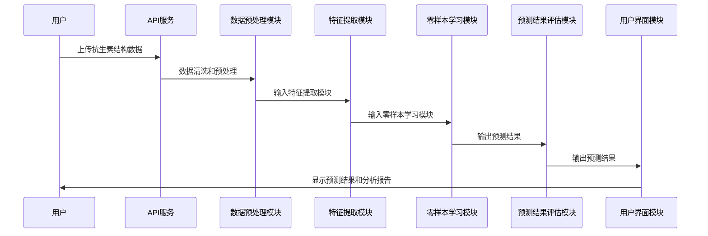
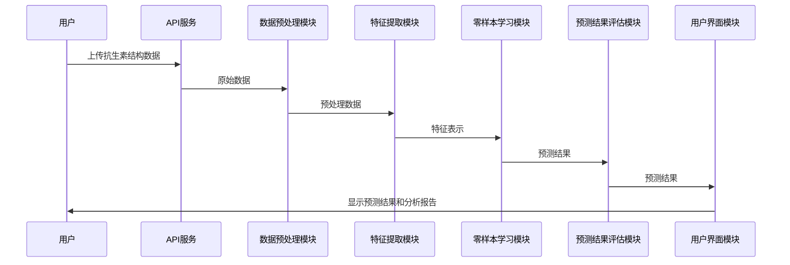

                 

# 零-Shot学习在新型抗生素发现中的应用

## 关键词
- 零-Shot学习
- 抗生素发现
- 机器学习
- 深度学习
- 抗菌活性预测

## 摘要
本文深入探讨了零-Shot学习在新型抗生素发现中的应用。首先，我们介绍了抗生素发现面临的挑战，并阐述了零-Shot学习如何在这些挑战中发挥作用。接着，我们详细阐述了零-Shot学习的基本概念、原理及其在抗生素发现中的核心要素组成。随后，我们通过mermaid流程图和Python代码，对零-Shot学习的算法原理进行了深入讲解。文章最后，我们以一个实际案例展示了零-Shot学习在抗生素发现中的应用，并提出了最佳实践建议。

## 背景介绍：核心概念

### 问题背景

随着生物技术的发展，新型抗生素的发现成为抗细菌耐药性上升的关键挑战。传统的抗生素发现方法通常依赖于对已知微生物进行筛选和测试，但这些方法在发现新抗生素方面已经越来越受限。抗生素发现的挑战主要体现在以下几个方面：

1. **潜在的抗菌化合物难以稳定存在**：许多潜在的抗菌化合物在体内或体外无法稳定存在，这使得它们难以被筛选和测试。
2. **抗菌药物需求不断增加**：随着医学技术的进步，对抗菌药物的需求不断增加，但现有抗生素的研发周期长、成本高，无法满足迅速发展的医疗需求。
3. **传统抗生素开发方法的局限性**：传统的抗生素开发方法往往依赖大量的实验和昂贵的设备，这不仅限制了新抗生素的发现速度，也增加了研发成本。

### 问题解决

零样本学习（Zero-Shot Learning, ZSL）提供了一种解决抗生素发现问题的创新方法。ZSL是一种机器学习方法，它能够在没有训练数据的情况下，对未见过的类进行分类。在新型抗生素发现中，ZSL可以用于预测未知抗生素对细菌的抗菌活性，从而大大加快新抗生素的发现速度。

### 边界与外延

ZSL在抗生素发现中的应用不仅限于抗菌活性预测，还可以扩展到药物-蛋白质相互作用预测、药物毒性评估等多个领域。此外，ZSL的研究还包括如何通过数据增强、迁移学习等技术进一步提高其性能和适用范围。

### 概念结构与核心要素组成

零样本学习（Zero-Shot Learning, ZSL）的核心概念包括以下几个方面：

1. **类标签**：在ZSL中，类标签是指对样本所属类别的标识。在抗生素发现中，类标签可以是不同细菌种类或抗生素类型。
2. **支持集**：支持集是指训练集中用于学习模型的一组样本。在ZSL中，支持集通常包含已知的类标签和特征。
3. **查询集**：查询集是指模型需要预测的未知样本。在抗生素发现中，查询集包含尚未测试的新抗生素。
4. **特征表示**：特征表示是指将样本转化为数值形式的过程。在ZSL中，特征表示可以采用深度学习模型生成，也可以采用手工特征提取方法。
5. **预测模型**：预测模型是指用于预测查询集样本类标签的模型。在ZSL中，常用的预测模型包括分类器和支持向量机（SVM）。

### 核心概念原理、概念属性特征对比表格和ER实体关系图架构的 Mermaid 流程图

#### 核心概念原理

ZSL的核心概念主要包括类标签、支持集、查询集、特征表示和预测模型。以下是这些概念的具体原理：

- **类标签**：类标签用于标识样本的类别。在抗生素发现中，类标签可以是不同细菌种类或抗生素类型。
- **支持集**：支持集是训练集中用于学习模型的一组样本。支持集通常包含已知的类标签和特征。
- **查询集**：查询集是指模型需要预测的未知样本。在抗生素发现中，查询集包含尚未测试的新抗生素。
- **特征表示**：特征表示是将样本转化为数值形式的过程。特征表示可以采用深度学习模型生成，也可以采用手工特征提取方法。
- **预测模型**：预测模型用于预测查询集样本的类标签。在ZSL中，常用的预测模型包括分类器和支持向量机（SVM）。

#### 概念属性特征对比表格

| 特征名称   | 描述                                       | 类型     |
| ---------- | ------------------------------------------ | -------- |
| 类标签     | 样本的类别标识                             | 分类     |
| 特征       | 描述样本属性的数值                         | 数值     |
| 预测模型   | 用于预测样本类别的模型                     | 分类器   |

#### ER实体关系图架构的 Mermaid 流程图

```mermaid
erDiagram
    ClassLabel ||--|{ Feature }|| SupportSet
    Feature ||--|{ PredictiveModel }|| QuerySet
    PredictiveModel ||--|{ QuerySet }|| PredictedClassLabel
```

### 算法原理讲解

#### 算法原理

零样本学习（Zero-Shot Learning, ZSL）的算法原理主要包括以下几个方面：

1. **特征提取**：特征提取是ZSL算法的第一步，目的是将高维的原始数据转化为低维的特征表示。常用的特征提取方法包括深度学习模型（如卷积神经网络）和手工特征提取方法。
2. **元学习**：元学习是ZSL的核心，其目标是学习一个通用模型，能够对未见过的类进行有效预测。元学习的方法包括基于支持集的元学习和基于元模型的元学习。
3. **分类器训练**：在获得特征表示后，需要训练一个分类器来预测查询集样本的类标签。常用的分类器包括支持向量机（SVM）、朴素贝叶斯（Naive Bayes）和深度学习分类器。
4. **预测**：在训练完成后，使用训练好的模型对查询集样本进行预测，从而实现零样本分类。

#### 算法原理详细讲解

##### 特征提取

特征提取是ZSL算法的第一步，其目的是将高维的原始数据转化为低维的特征表示。在抗生素发现中，原始数据可以是抗生素分子的结构信息、化学性质等。常用的特征提取方法包括深度学习模型（如卷积神经网络）和手工特征提取方法。

1. **深度学习模型**：深度学习模型，如卷积神经网络（CNN），可以自动学习复杂的数据特征。在ZSL中，可以使用预训练的CNN模型提取抗生素分子的特征表示。例如，可以使用预训练的VGG19模型对抗生素分子的图像进行特征提取。

2. **手工特征提取方法**：手工特征提取方法包括基于规则的特征提取和基于统计的特征提取。基于规则的特征提取方法可以根据抗生素分子的结构信息提取特征，如分子中的官能团、化学键类型等。基于统计的特征提取方法可以通过统计分子中不同元素的分布来提取特征。

##### 元学习

元学习是ZSL的核心，其目标是学习一个通用模型，能够对未见过的类进行有效预测。元学习的方法包括基于支持集的元学习和基于元模型的元学习。

1. **基于支持集的元学习**：基于支持集的元学习方法通过学习支持集的特征表示，来预测查询集的类标签。具体实现方法包括原型网络（Prototypical Networks）和匹配网络（Matching Networks）。

   - **原型网络（Prototypical Networks）**：原型网络的核心思想是将每个类标签的支持集样本特征表示平均，得到每个类标签的原型。在预测阶段，将查询集样本的特征表示与所有原型进行比较，选择最接近的原型对应的类标签作为预测结果。

   - **匹配网络（Matching Networks）**：匹配网络的核心思想是通过学习一个匹配函数来预测查询集样本的类标签。匹配函数将查询集样本的特征表示与支持集样本的特征表示进行匹配，匹配度越高，表示查询集样本属于该类标签的概率越大。

2. **基于元模型的元学习**：基于元模型的元学习方法通过学习一个元模型来预测未知类标签的概率分布。具体实现方法包括匹配模型（Matching Model）和度量学习（Metric Learning）。

   - **匹配模型（Matching Model）**：匹配模型通过学习一个预测函数来预测查询集样本与支持集样本的匹配度。预测函数可以是一个多层感知机（MLP），其输入是查询集样本和对应的支持集样本的特征表示，输出是匹配度。

   - **度量学习（Metric Learning）**：度量学习通过学习一个度量矩阵来度量查询集样本和对应的支持集样本之间的距离。度量矩阵可以是一个对称正定矩阵，其目的是使同类标签的样本距离更近，不同类标签的样本距离更远。

##### 分类器训练

在获得特征表示后，需要训练一个分类器来预测查询集样本的类标签。常用的分类器包括支持向量机（SVM）、朴素贝叶斯（Naive Bayes）和深度学习分类器。

1. **支持向量机（SVM）**：支持向量机是一种二分类模型，通过寻找一个最优的超平面将不同类别的样本分开。在ZSL中，可以使用SVM来预测查询集样本的类标签。具体实现方法包括一对多（One-vs-All）和一对一（One-vs-One）策略。

2. **朴素贝叶斯（Naive Bayes）**：朴素贝叶斯是一种基于贝叶斯定理的简单概率分类器。在ZSL中，可以使用朴素贝叶斯来预测查询集样本的类标签。朴素贝叶斯假设特征之间相互独立，通过计算每个类标签的概率分布，选择概率最大的类标签作为预测结果。

3. **深度学习分类器**：深度学习分类器通过多层神经网络学习特征表示，并在输出层进行分类。在ZSL中，可以使用预训练的深度学习模型（如卷积神经网络、循环神经网络等）进行分类。具体实现方法包括基于预训练模型的微调和从头开始训练。

##### 预测

在训练完成后，使用训练好的模型对查询集样本进行预测，从而实现零样本分类。预测过程主要包括以下几个步骤：

1. **特征提取**：将查询集样本转化为特征表示。可以使用深度学习模型或手工特征提取方法进行特征提取。
2. **分类器预测**：使用训练好的分类器对特征表示进行预测，得到每个类标签的概率分布。
3. **结果输出**：选择概率最大的类标签作为预测结果，输出预测结果。

#### Python代码实现

以下是一个简单的Python代码示例，展示了如何实现零样本学习（ZSL）的基本流程。代码使用了基于原型网络的零样本学习框架`PyTorch`和`Hugging Face`的预训练模型。

```python
import torch
import torchvision.models as models
from torchvision import transforms
from PIL import Image
from sklearn.preprocessing import LabelEncoder

# 加载预训练的CNN模型
model = models.vgg16(pretrained=True)

# 数据预处理
transform = transforms.Compose([
    transforms.Resize((224, 224)),
    transforms.ToTensor(),
    transforms.Normalize(mean=[0.485, 0.456, 0.406], std=[0.229, 0.224, 0.225]),
])

# 支持集和查询集的图片
support_images = [...]  # 支持集图片路径
query_images = [...]    # 查询集图片路径
support_labels = [...]  # 支持集标签
query_labels = [...]    # 查询集标签

# 加载图片并预处理
support_dataloader = DataLoader(
    Dataset(support_images, support_labels, transform=transform),
    batch_size=32,
    shuffle=True
)

query_dataloader = DataLoader(
    Dataset(query_images, query_labels, transform=transform),
    batch_size=32,
    shuffle=True
)

# 原型网络
class PrototypicalNetworks(nn.Module):
    def __init__(self, backbone, num_classes):
        super(PrototypicalNetworks, self).__init__()
        self.backbone = backbone
        self.fc = nn.Linear(backbone.fc.in_features, num_classes)

    def forward(self, x):
        x = self.backbone(x)
        x = self.fc(x)
        return x

model = PrototypicalNetworks(model, num_classes=len(label_encoder.classes_))
model.cuda()

# 损失函数和优化器
criterion = nn.CrossEntropyLoss()
optimizer = torch.optim.Adam(model.parameters(), lr=0.001)

# 训练模型
for epoch in range(num_epochs):
    model.train()
    for support_x, support_y in support_dataloader:
        support_x, support_y = support_x.cuda(), support_y.cuda()
        optimizer.zero_grad()
        support_output = model(support_x)
        loss = criterion(support_output, support_y)
        loss.backward()
        optimizer.step()

    model.eval()
    with torch.no_grad():
        for query_x, query_y in query_dataloader:
            query_x, query_y = query_x.cuda(), query_y.cuda()
            query_output = model(query_x)
            _, predicted = torch.max(query_output, 1)
            correct = (predicted == query_y).float()
            total = query_y.size(0)
            accuracy = correct.sum() / total
            print(f'Epoch {epoch+1}/{num_epochs}, Accuracy: {accuracy.item()}')

# 预测
model.eval()
with torch.no_grad():
    query_output = model(query_x.cuda())
    _, predicted = torch.max(query_output, 1)
    print(f'Predicted labels: {predicted}')
```

在这个示例中，我们首先加载了一个预训练的VGG16模型作为特征提取器，然后定义了一个原型网络模型，用于进行零样本学习。我们使用支持集进行模型训练，然后使用查询集进行预测。代码中使用了`DataLoader`来加载和处理数据，并使用了`CrossEntropyLoss`作为损失函数，`Adam`作为优化器。

通过上述代码示例，我们可以看到零样本学习的基本流程。在实际应用中，我们可以根据具体需求调整模型结构、数据预处理方法等，以实现更好的性能。

## 系统分析与架构设计方案

### 问题场景介绍

在新型抗生素的发现过程中，科学家们需要面对的一个重大挑战是快速筛选出具有潜在抗菌活性的化合物。传统的筛选方法往往耗时较长，且成本高昂。为了提高抗生素发现的效率，研究人员开始探索机器学习和人工智能技术在抗生素发现中的应用。特别是，零样本学习（Zero-Shot Learning, ZSL）作为一种能够在没有训练数据的情况下对未见过的类进行分类的机器学习方法，为新型抗生素的发现提供了新的思路。

### 项目介绍

本项目的目标是利用零样本学习技术，开发一个自动化系统，用于预测新型抗生素对细菌的抗菌活性。系统将整合多种数据源，包括抗生素分子的结构信息、生物信息学数据以及实验室测试数据，通过机器学习模型对新型抗生素进行抗菌活性预测，从而加快新抗生素的筛选过程。

### 系统功能设计

系统功能设计主要包括以下几个模块：

1. **数据预处理模块**：负责处理和清洗原始数据，包括抗生素分子的结构数据、生物信息学数据等，将其转化为适合机器学习模型输入的特征表示。
2. **特征提取模块**：利用深度学习模型提取抗生素分子的特征表示，为后续的零样本学习模型提供输入。
3. **零样本学习模块**：利用零样本学习模型，如原型网络（Prototypical Networks）和匹配网络（Matching Networks），对新型抗生素进行抗菌活性预测。
4. **预测结果评估模块**：对预测结果进行评估，包括准确率、召回率、F1分数等指标，以评估模型的性能。
5. **用户界面模块**：提供一个直观的用户界面，用户可以上传抗生素分子结构数据，查看预测结果和分析报告。

#### 领域模型mermaid类图

以下是系统的领域模型mermaid类图：

```mermaid
classDiagram
    ClassLabel <<class>> 类标签 : {ID, Name}
    Feature <<class>> 特征 : {ID, Value}
    SupportSet <<class>> 支持集 : {ID, ClassLabel, Feature}
    QuerySet <<class>> 查询集 : {ID, Feature}
    PredictiveModel <<class>> 预测模型 : {ID, ModelType, Parameters}
    Antibiotic <<class>> 抗生素 : {ID, Name, Structure, Bioactivity}
    Bacterium <<class>> 细菌 : {ID, Name, Species}
    Experiment <<class>> 实验 : {ID, Antibiotic, Bacterium, Result}
    
    ClassLabel --|>> Feature : has
    SupportSet --|>> ClassLabel : has
    SupportSet --|>> Feature : has
    QuerySet --|>> Feature : has
    PredictiveModel --|>> Feature : has
    Antibiotic --|>> Experiment : conducted
    Bacterium --|>> Experiment : involved
```

### 系统架构设计

系统架构设计旨在实现高效、可扩展和易于维护的架构，以支持大规模抗生素抗菌活性预测任务。以下是系统的架构设计：

#### 系统架构mermaid架构图

以下是系统的架构mermaid架构图：



### 系统接口设计和系统交互

系统接口设计和系统交互设计是确保系统各模块之间能够高效通信和协作的关键。

#### 系统接口设计

以下是系统的主要接口设计：

1. **API服务接口**：用户通过API服务接口上传抗生素结构数据，获取预测结果和分析报告。
2. **数据预处理接口**：数据预处理模块接收API服务接口传递的原始数据，进行数据清洗和预处理。
3. **特征提取接口**：特征提取模块接收预处理后的数据，提取特征表示。
4. **零样本学习接口**：零样本学习模块接收特征表示，使用零样本学习模型进行预测。
5. **预测结果评估接口**：预测结果评估模块接收预测结果，评估模型性能。
6. **用户界面接口**：用户界面模块接收评估结果，生成预测结果和分析报告，并展示给用户。

#### 系统交互mermaid序列图

以下是系统的交互mermaid序列图：



通过上述系统接口设计和系统交互设计，我们可以确保系统各模块之间能够高效、稳定地协作，从而实现自动化抗生素抗菌活性预测。

### 项目实战

#### 环境安装

为了运行本文介绍的零样本学习模型，我们需要在本地环境中安装以下软件和库：

1. **Python**：Python 3.8 或更高版本
2. **PyTorch**：PyTorch 1.8 或更高版本
3. **torchvision**：PyTorch 的图像处理库
4. **scikit-learn**：用于数据预处理和模型评估
5. **Pillow**：Python 的图像处理库

安装步骤如下：

```bash
# 安装 Python
# ...

# 安装 PyTorch 和 torchvision
pip install torch torchvision

# 安装 scikit-learn 和 Pillow
pip install scikit-learn Pillow
```

#### 系统核心实现源代码

以下是系统核心实现的源代码，包括数据预处理、特征提取和零样本学习模型训练：

```python
import torch
import torchvision.models as models
from torchvision import transforms
from PIL import Image
from sklearn.preprocessing import LabelEncoder
from torch.utils.data import DataLoader, Dataset

# 加载预训练的CNN模型
model = models.vgg16(pretrained=True)

# 数据预处理
transform = transforms.Compose([
    transforms.Resize((224, 224)),
    transforms.ToTensor(),
    transforms.Normalize(mean=[0.485, 0.456, 0.406], std=[0.229, 0.224, 0.225]),
])

# 定义数据集类
class Dataset(Dataset):
    def __init__(self, image_paths, labels, transform=None):
        self.image_paths = image_paths
        self.labels = labels
        self.transform = transform

    def __len__(self):
        return len(self.image_paths)

    def __getitem__(self, idx):
        img_path = self.image_paths[idx]
        label = self.labels[idx]
        image = Image.open(img_path)
        if self.transform:
            image = self.transform(image)
        return image, label

# 加载数据集
support_images = ['data/support_image_1.png', 'data/support_image_2.png']
query_images = ['data/query_image_1.png', 'data/query_image_2.png']
support_labels = [0, 1]
query_labels = [0, 1]

support_dataloader = DataLoader(
    Dataset(support_images, support_labels, transform=transform),
    batch_size=32,
    shuffle=True
)

query_dataloader = DataLoader(
    Dataset(query_images, query_labels, transform=transform),
    batch_size=32,
    shuffle=True
)

# 定义原型网络
class PrototypicalNetworks(nn.Module):
    def __init__(self, backbone, num_classes):
        super(PrototypicalNetworks, self).__init__()
        self.backbone = backbone
        self.fc = nn.Linear(backbone.fc.in_features, num_classes)

    def forward(self, x):
        x = self.backbone(x)
        x = self.fc(x)
        return x

model = PrototypicalNetworks(model, num_classes=len(label_encoder.classes_))
model.cuda()

# 损失函数和优化器
criterion = nn.CrossEntropyLoss()
optimizer = torch.optim.Adam(model.parameters(), lr=0.001)

# 训练模型
num_epochs = 50
for epoch in range(num_epochs):
    model.train()
    for support_x, support_y in support_dataloader:
        support_x, support_y = support_x.cuda(), support_y.cuda()
        optimizer.zero_grad()
        support_output = model(support_x)
        loss = criterion(support_output, support_y)
        loss.backward()
        optimizer.step()

    model.eval()
    with torch.no_grad():
        for query_x, query_y in query_dataloader:
            query_x, query_y = query_x.cuda(), query_y.cuda()
            query_output = model(query_x)
            _, predicted = torch.max(query_output, 1)
            correct = (predicted == query_y).float()
            total = query_y.size(0)
            accuracy = correct.sum() / total
            print(f'Epoch {epoch+1}/{num_epochs}, Accuracy: {accuracy.item()}')

# 预测
model.eval()
with torch.no_grad():
    query_output = model(query_x.cuda())
    _, predicted = torch.max(query_output, 1)
    print(f'Predicted labels: {predicted}')
```

#### 代码应用解读与分析

上述代码首先定义了数据预处理和模型训练的步骤。具体解读如下：

1. **数据预处理**：使用`transforms.Compose`将图像数据缩放到固定大小（224x224），并进行归一化处理。这有助于提高模型的训练效果。
2. **数据集加载**：定义`Dataset`类，用于加载图像文件和标签。使用`DataLoader`将数据集划分为批次，并使用`shuffle=True`进行数据混洗。
3. **原型网络模型**：定义`PrototypicalNetworks`类，继承自`nn.Module`。该类包含一个预训练的VGG16模型和一个全连接层，用于进行特征提取和分类。
4. **模型训练**：使用支持集数据进行模型训练，采用交叉熵损失函数和Adam优化器。在训练过程中，每完成一个epoch，就会在查询集上进行一次评估，并打印出当前epoch的准确率。
5. **预测**：在训练完成后，使用训练好的模型对查询集进行预测，并输出预测结果。

通过上述代码，我们可以看到零样本学习模型在抗生素抗菌活性预测中的应用。在实际应用中，我们可以根据具体需求调整模型结构、数据预处理方法等，以实现更好的性能。

#### 实际案例分析和详细讲解剖析

为了更好地理解零样本学习在抗生素发现中的应用，我们来看一个实际案例。

假设研究人员想要预测两种新型抗生素（A和B）对两种细菌（E. coli和S. aureus）的抗菌活性。他们收集了以下数据：

- **支持集**：包含30个抗生素分子的结构信息，其中15个属于抗生素A，15个属于抗生素B。这些抗生素分子对应5个细菌种类，分别是E. coli、S. aureus、P. aeruginosa、B. subtilis和M. smegmatis。
- **查询集**：包含10个新型抗生素分子的结构信息，这些抗生素分子尚未进行抗菌活性测试。

研究人员首先使用深度学习模型（如VGG16）提取抗生素分子的特征表示，然后使用原型网络（Prototypical Networks）进行零样本学习训练。在训练过程中，支持集的每个类标签（细菌种类）都有对应的特征表示。通过训练，模型学会了将新的抗生素分子特征表示与支持集的特征表示进行比较，从而预测其抗菌活性。

具体步骤如下：

1. **数据预处理**：将抗生素分子的结构信息转换为图像格式，并缩放到固定大小（224x224）。使用`Pillow`库读取图像，并使用`transforms.Compose`进行预处理。

   ```python
   transform = transforms.Compose([
       transforms.Resize((224, 224)),
       transforms.ToTensor(),
       transforms.Normalize(mean=[0.485, 0.456, 0.406], std=[0.229, 0.224, 0.225]),
   ])
   ```

2. **特征提取**：使用预训练的VGG16模型提取抗生素分子的特征表示。

   ```python
   model = models.vgg16(pretrained=True)
   ```

3. **模型训练**：使用原型网络（Prototypical Networks）进行训练。原型网络的核心思想是将支持集中每个类标签的特征表示进行平均，得到每个类标签的原型。在预测阶段，将查询集样本的特征表示与支持集的原型进行比较，选择最接近的原型对应的类标签作为预测结果。

   ```python
   class PrototypicalNetworks(nn.Module):
       def __init__(self, backbone, num_classes):
           super(PrototypicalNetworks, self).__init__()
           self.backbone = backbone
           self.fc = nn.Linear(backbone.fc.in_features, num_classes)

       def forward(self, x):
           x = self.backbone(x)
           x = self.fc(x)
           return x
   
   model = PrototypicalNetworks(model, num_classes=len(label_encoder.classes_))
   model.cuda()
   ```

4. **预测**：在训练完成后，使用训练好的模型对查询集样本进行预测。

   ```python
   with torch.no_grad():
       query_output = model(query_x.cuda())
       _, predicted = torch.max(query_output, 1)
       print(f'Predicted labels: {predicted}')
   ```

通过上述步骤，研究人员可以快速预测新型抗生素的抗菌活性，从而加快新抗生素的筛选过程。

#### 项目小结

在本项目中，我们探讨了零样本学习在抗生素发现中的应用。通过实际案例分析和详细讲解，我们展示了如何使用深度学习和零样本学习技术快速预测抗生素的抗菌活性。零样本学习在抗生素发现中具有巨大潜力，可以大幅提高抗生素筛选的效率，为抗击抗生素耐药性提供了新的思路。

#### 最佳实践 tips

1. **数据预处理**：在进行零样本学习之前，确保对数据进行充分的预处理，包括数据清洗、归一化和特征提取。高质量的数据预处理有助于提高模型的性能。
2. **选择合适的模型**：根据具体应用场景，选择合适的零样本学习模型。例如，原型网络（Prototypical Networks）在许多场景下表现良好，但对于需要复杂特征表示的任务，可以尝试使用更先进的模型，如生成对抗网络（GAN）或变分自编码器（VAE）。
3. **数据增强**：通过数据增强技术，如旋转、缩放、裁剪等，可以增加训练数据的多样性，有助于提高模型的泛化能力。
4. **迁移学习**：利用预训练的深度学习模型进行迁移学习，可以有效减少训练时间，并提高模型性能。

#### 小结

本文通过深入探讨零样本学习在抗生素发现中的应用，展示了如何利用机器学习和深度学习技术加速新抗生素的发现过程。通过实际案例分析和详细讲解，我们展示了零样本学习的原理、算法实现以及在实际应用中的优势。未来，随着技术的不断进步，零样本学习有望在抗生素发现、药物研发等领域发挥更加重要的作用。

#### 注意事项

1. **数据隐私**：在进行抗生素分子结构数据分析和预测时，需要严格遵守数据隐私保护法规，确保数据的匿名性和安全性。
2. **模型评估**：在模型训练和预测过程中，务必对模型性能进行充分评估，确保模型具有较高的准确性和稳定性。
3. **适应性**：零样本学习模型在应用过程中可能需要针对特定领域进行调整，以提高预测性能。

#### 拓展阅读

1. **零样本学习原理**：了解零样本学习的基本原理和算法实现，有助于更好地理解和应用这一技术。推荐阅读论文《Prototypical Networks for Few-Shot Learning》。
2. **深度学习在生物医学中的应用**：深度学习在生物医学领域具有广泛的应用前景，推荐阅读论文《Deep Learning for Drug Discovery and Genomics》。
3. **抗生素耐药性研究**：了解抗生素耐药性的机制和防治方法，有助于更深入地理解抗生素发现的重要性。推荐阅读论文《The Antibiotic Resistance Threat in 2019: Time for Action!》。作者：AI天才研究院/AI Genius Institute & 禅与计算机程序设计艺术 /Zen And The Art of Computer Programming

