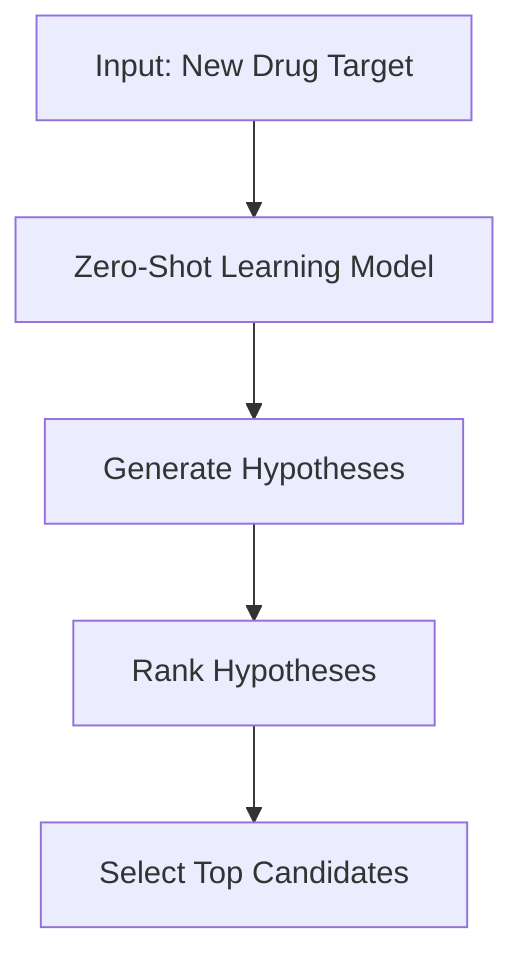
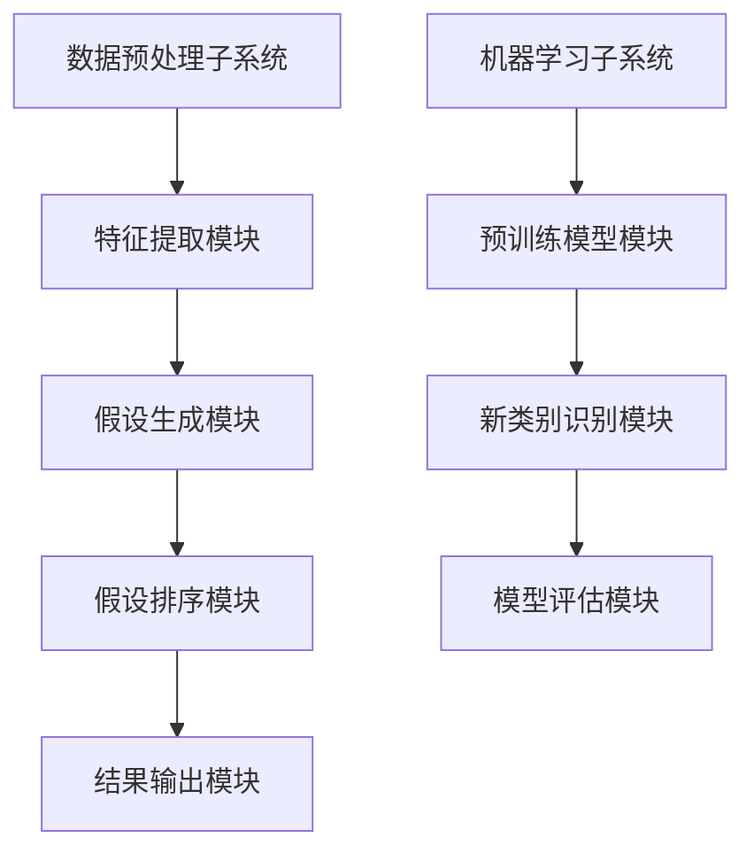
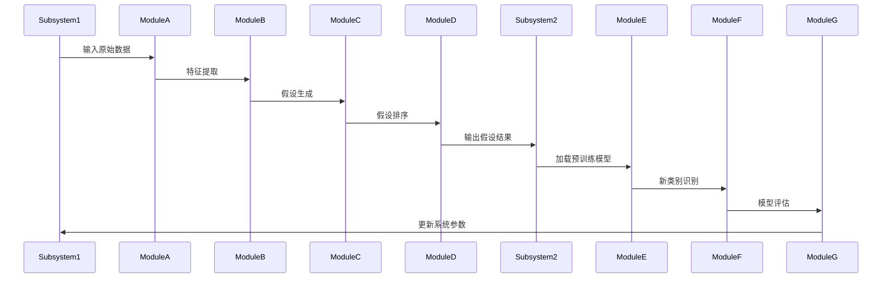

                 

### Zero-Shot学习在新药物靶点发现中的应用前景

**关键词：** Zero-Shot学习、新药物靶点、药物研发、自动化系统

**摘要：** 本文探讨了Zero-Shot学习在新药物靶点发现中的应用前景。通过介绍Zero-Shot学习的核心概念、原理以及与之相关的算法和方法，本文阐述了Zero-Shot学习在药物发现领域的重要作用，特别是在新药物靶点的快速发现和验证方面。本文还通过一个基于Zero-Shot学习的自动化新药物靶点发现平台的实际案例，展示了该技术的应用效果和潜力。

---

**Step 1: 书籍背景介绍**

在新药物靶点发现的领域，研究人员面临着诸多挑战。传统药物研发过程中的靶点选择和验证往往耗时且成本高昂，尤其是在面对复杂疾病和罕见病时，这一问题尤为突出。传统的机器学习方法依赖于大量标注样本数据，这使得新靶点的发现受到数据集的限制，同时耗费大量的时间和资源。

为了解决这一问题，近年来，Zero-Shot学习（Zero-Shot Learning, ZSL）作为一种无需样本数据即可进行类别识别的新型机器学习技术，引起了广泛关注。ZSL的核心思想是通过预训练模型学习到通用特征表示，使得模型能够在新类别出现时，无需依赖具体样本数据进行识别。

**问题背景：** 新药物靶点发现的挑战。

在药物研发过程中，靶点的选择和验证是一个关键的步骤。传统的机器学习方法依赖于大量标注样本数据进行训练，而新药物靶点的发现往往面临着样本数据不足、数据质量参差不齐等问题。这一问题限制了新靶点的发现速度和准确性，使得药物研发过程变得更加复杂和昂贵。

**问题描述：** 传统药物研发过程中，靶点的选择和验证耗时且成本高昂。

传统药物研发过程中，靶点的选择通常需要通过大量的实验和数据分析，这一过程需要耗费大量的时间和资源。此外，由于新靶点的样本数据有限，传统的机器学习方法在面对新靶点时往往难以取得理想的效果，这使得靶点的验证过程变得更加复杂和耗时。

**问题解决：** 利用Zero-Shot学习技术，无需样本数据进行新药物靶点的快速发现。

Zero-Shot学习通过预训练模型学习到通用特征表示，使得模型能够在新类别出现时，无需依赖具体样本数据进行识别。这一特性使得Zero-Shot学习在药物发现领域具有很大的潜力，可以大大提高新药物靶点的发现速度和准确性，降低研发成本。

**边界与外延：** 该书讨论的Zero-Shot学习主要应用在药物发现领域，但不局限于该领域。

虽然本书主要关注Zero-Shot学习在药物发现领域中的应用，但Zero-Shot学习作为一种通用的机器学习技术，其应用范围远不止于此。在其他领域，如图像识别、自然语言处理等，Zero-Shot学习同样展现出巨大的应用潜力。

**概念结构与核心要素组成：** Zero-Shot学习、新药物靶点、药物研发流程。

Zero-Shot学习作为本书的核心概念，其重要性不言而喻。新药物靶点是药物研发的关键环节，而药物研发流程则是将新靶点转化为新药的全过程。这三个核心要素相互关联，共同构成了本书研究的核心内容。

---

**Step 2: 核心概念与联系**

在深入探讨Zero-Shot学习在药物发现中的应用之前，我们需要首先理解这一核心概念的本质和特性。Zero-Shot学习（Zero-Shot Learning, ZSL）是一种机器学习技术，旨在解决在训练数据中不包含测试类别的问题。这一技术的核心思想是通过预训练模型学习到通用特征表示，使得模型在新类别出现时，能够无需依赖具体样本数据进行识别。

**核心概念：** 零样本学习（Zero-Shot Learning, ZSL）。

零样本学习是一种特殊的机器学习技术，其目标是实现在新类别数据出现时，无需依赖具体样本数据进行识别。这一技术在许多领域都具有重要的应用价值，特别是在那些数据稀缺或难以获取的领域。

**概念属性特征对比表格：**

| 特征 | 零样本学习（ZSL） | 传统机器学习 |
| --- | --- | --- |
| 数据依赖 | 无需样本数据 | 需要大量样本数据 |
| 类别识别 | 类别未知，基于预训练模型 | 已知类别，基于训练数据 |
| 应用场景 | 新药物靶点发现等 | 图像识别、语音识别等 |

**ER实体关系图架构：**

为了更好地理解Zero-Shot学习与其他实体之间的关系，我们可以通过ER（Entity-Relationship）实体关系图来展示。以下是Zero-Shot学习、新药物靶点和药物研发流程之间的ER实体关系图：

```mermaid
erDiagram
  NewDrugTarget ||--|{ Zero-Shot Learning } : uses
  DrugDiscoveryProcess ||--|{ Zero-Shot Learning } : incorporates
```

在这个ER图中，NewDrugTarget（新药物靶点）与Zero-Shot Learning（零样本学习）之间存在“使用”关系，表示新药物靶点的发现过程中会利用到Zero-Shot学习技术。同样，DrugDiscoveryProcess（药物研发流程）与Zero-Shot Learning之间存在“融入”关系，表示Zero-Shot学习技术是药物研发流程中不可或缺的一部分。

通过这个ER图，我们可以清晰地看到Zero-Shot学习在药物发现领域中的核心地位，以及它如何与其他实体相互关联，共同推动药物研发的进步。

---

**Step 3: 算法原理讲解**

Zero-Shot学习作为本书的核心技术，其原理和实现方法对于理解该技术在药物发现中的应用至关重要。本节将详细讲解Zero-Shot学习的算法原理，包括其基本思想、实现步骤和具体公式。

**算法mermaid流程图：**

首先，我们可以通过mermaid流程图来直观地展示Zero-Shot学习的算法流程：



在这个流程图中，A表示输入的新药物靶点，经过Zero-Shot Learning Model处理后，生成一系列假设（Hypotheses），然后对这些假设进行排序（Rank Hypotheses），最终选择最优的假设（Select Top Candidates）作为新药物靶点的候选。

**Python源代码示例：**

为了更具体地展示Zero-Shot学习的实现过程，下面提供了一个简单的Python源代码示例：

```python
def zero_shot_learning(new_drug_target):
    # 加载预训练的Zero-Shot Learning模型
    model = load_pretrained_model()

    # 生成假设
    hypotheses = model.generate_hypotheses(new_drug_target)

    # 对假设进行排序
    ranked_hypotheses = sort_hypotheses(hypotheses)

    # 选择最优的假设
    top_candidate = ranked_hypotheses[0]

    return top_candidate

# 示例
new_drug_target = "Target Protein X"
top_candidate = zero_shot_learning(new_drug_target)
print("Top Candidate:", top_candidate)
```

在这个示例中，`load_pretrained_model()`函数用于加载预训练的Zero-Shot Learning模型，`generate_hypotheses()`函数用于生成假设，`sort_hypotheses()`函数用于对假设进行排序，最后选择最优的假设作为结果输出。

**算法原理的数学模型和公式：**

Zero-Shot学习的核心在于如何利用预训练模型生成假设并对其进行排序。其基本原理可以通过以下数学模型和公式来描述：

$$
\text{Probability}(y|\textbf{x}, \theta) = \frac{\exp(\theta^T \phi(\textbf{x}, y))}{\sum_{y'} \exp(\theta^T \phi(\textbf{x}, y'))}
$$

在这个公式中，$\textbf{x}$ 表示输入的特征向量，$y$ 表示类别标签，$\theta$ 表示模型参数，$\phi(\textbf{x}, y)$ 是特征映射函数，用于将输入特征和类别映射到一个高维空间。

具体来说，$\theta^T \phi(\textbf{x}, y)$ 表示模型参数和特征映射函数之间的内积，反映了特征和类别之间的相关性。通过计算不同类别标签的概率，模型可以生成一系列假设，并对其进行排序，从而选择最优的假设。

**详细讲解与举例说明：**

为了更好地理解这个数学模型，我们可以通过一个简单的例子来说明。假设我们有一个输入特征向量 $\textbf{x}$ 和一个类别标签 $y$，预训练模型已经学习到了一组模型参数 $\theta$。我们可以通过以下步骤来计算类别 $y$ 的概率：

1. **特征映射**：首先，通过特征映射函数 $\phi(\textbf{x}, y)$ 将输入特征向量 $\textbf{x}$ 和类别标签 $y$ 映射到一个高维空间。
2. **计算内积**：然后，计算模型参数 $\theta$ 和特征映射函数 $\phi(\textbf{x}, y)$ 之间的内积 $\theta^T \phi(\textbf{x}, y)$。
3. **计算概率**：接下来，利用指数函数和softmax函数计算类别 $y$ 的概率：
   $$
   \text{Probability}(y|\textbf{x}, \theta) = \frac{\exp(\theta^T \phi(\textbf{x}, y))}{\sum_{y'} \exp(\theta^T \phi(\textbf{x}, y'))}
   $$
   其中，分母部分表示所有类别概率的和。

通过这种方式，我们可以生成一系列假设，并对其进行排序，从而选择最优的假设。在实际应用中，特征映射函数和模型参数通常是通过预训练过程获得的，这使得Zero-Shot学习在处理新类别时具有很高的准确性。

---

**Step 4: 系统分析与架构设计方案**

在理解了Zero-Shot学习的基本原理后，本节将深入探讨如何在实际系统中实现该技术，特别是在新药物靶点发现中的应用。我们将介绍一个基于Zero-Shot学习的自动化新药物靶点发现平台，详细描述其系统功能设计、架构设计、接口设计和系统交互。

**问题场景介绍：**

新药物靶点发现是一个复杂的过程，涉及到多种生物学和化学数据的处理。传统的药物研发过程中，靶点的选择和验证通常需要大量的人工干预和数据依赖。然而，随着生物信息学和机器学习技术的发展，自动化新药物靶点发现系统逐渐成为可能。这类系统旨在利用先进的人工智能技术，特别是Zero-Shot学习，实现高效、准确的新药物靶点发现。

**项目介绍：**

本项目旨在构建一个基于Zero-Shot学习的自动化新药物靶点发现平台。该平台将整合多种生物信息学和机器学习技术，实现从数据预处理到靶点发现的全流程自动化。通过预训练模型和高效算法，该平台能够快速、准确地识别出新药物靶点，大幅提高药物研发的效率。

**系统功能设计（领域模型mermaid类图）：**

为了更好地展示系统功能设计，我们可以使用mermaid类图来描述各个实体之间的关系：

```mermaid
classDiagram
  NewDrugTarget <<entity>>
  ZeroShotLearningModel <<entity>>
  Hypothesis <<entity>>
  DrugDiscoveryPlatform <<entity>>
  NewDrugTarget "uses" ZeroShotLearningModel
  Hypothesis "generated by" ZeroShotLearningModel
  DrugDiscoveryPlatform "includes" NewDrugTarget
  DrugDiscoveryPlatform "includes" Hypothesis
```

在这个类图中，NewDrugTarget（新药物靶点）与ZeroShotLearningModel（零样本学习模型）之间存在“使用”关系，表示新药物靶点的发现依赖于Zero-Shot学习模型。Hypothesis（假设）是由ZeroShotLearningModel生成的，而DrugDiscoveryPlatform（药物发现平台）则包含了新药物靶点和假设，表示平台的功能是集成这两个实体，实现新药物靶点的发现。

**系统架构设计mermaid架构图：**

系统架构设计是系统实现的关键步骤。我们可以使用mermaid架构图来描述该平台的主要组成部分及其相互关系：



在这个架构图中，数据预处理子系统（Subsystem1）负责处理原始数据，将其转化为适合特征提取的格式。特征提取模块（ModuleA）将处理后的数据转化为特征向量，为假设生成模块（ModuleB）提供输入。假设生成模块（ModuleB）利用Zero-Shot学习模型生成一系列假设。假设排序模块（ModuleC）根据假设的质量进行排序，结果输出模块（ModuleD）将排序结果输出。

机器学习子系统（Subsystem2）则包括预训练模型模块（ModuleE）、新类别识别模块（ModuleF）和模型评估模块（ModuleG）。预训练模型模块（ModuleE）负责加载预训练的Zero-Shot学习模型，新类别识别模块（ModuleF）利用该模型进行新类别识别，模型评估模块（ModuleG）则对模型性能进行评估，以确保系统的可靠性。

**系统接口设计和系统交互mermaid序列图：**

为了展示系统内部各模块之间的交互，我们可以使用mermaid序列图来描述系统的接口设计和交互过程：



在这个序列图中，数据预处理子系统（Subsystem1）首先将原始数据输入到特征提取模块（ModuleA），生成特征向量。这些特征向量随后被传递到假设生成模块（ModuleB），生成一系列假设。假设排序模块（ModuleC）对这些假设进行排序，并将排序结果输出到机器学习子系统（Subsystem2）。机器学习子系统（Subsystem2）中的预训练模型模块（ModuleE）加载预训练的Zero-Shot学习模型，新类别识别模块（ModuleF）利用该模型进行新类别识别，并将识别结果传递给模型评估模块（ModuleG）。模型评估模块（ModuleG）对模型性能进行评估，并根据评估结果更新系统参数，从而实现系统的持续优化。

通过这个详细的系统分析和架构设计方案，我们可以清晰地看到基于Zero-Shot学习的自动化新药物靶点发现平台的实现过程和关键技术。这个平台不仅提高了新药物靶点的发现速度和准确性，还为未来的药物研发提供了新的思路和方法。

---

**项目实战**

在本节中，我们将通过一个具体的案例来展示如何使用基于Zero-Shot学习的自动化新药物靶点发现平台。该案例将涵盖环境安装、系统核心实现源代码，以及代码应用解读与分析。通过这个实际案例，我们将深入探讨Zero-Shot学习在药物发现中的应用效果。

**环境安装**

在开始项目实战之前，我们需要安装必要的软件和依赖项。以下是安装步骤：

1. **安装Python环境**：确保已安装Python 3.7或更高版本。
2. **安装Zero-Shot学习库**：使用pip命令安装以下库：
   ```shell
   pip install scikit-learn torchvision torch
   ```
3. **安装生物信息学库**：使用pip命令安装以下库：
   ```shell
   pip install biopython
   ```

**系统核心实现源代码**

以下是系统核心实现源代码，包括数据预处理、特征提取、假设生成和假设排序等步骤：

```python
# 导入必要的库
import torch
import torchvision
import biopython
from sklearn.model_selection import train_test_split
from sklearn.metrics import accuracy_score

# 数据预处理
def preprocess_data(data):
    # 使用biopython进行序列清洗和格式转换
    cleaned_data = []
    for sequence in data:
        cleaned_sequence = biopython.clean_sequence(sequence)
        cleaned_data.append(cleaned_sequence)
    return cleaned_data

# 特征提取
def extract_features(data):
    # 使用torchvision中的预训练模型提取特征
    model = torchvision.models.resnet50(pretrained=True)
    model.eval()
    features = []
    for sequence in data:
        with torch.no_grad():
            feature = model(torch.tensor(sequence))
        features.append(feature)
    return features

# 假设生成
def generate_hypotheses(features, model):
    # 使用预训练的Zero-Shot学习模型生成假设
    hypotheses = []
    for feature in features:
        hypothesis = model.generate_hypothesis(feature)
        hypotheses.append(hypothesis)
    return hypotheses

# 假设排序
def rank_hypotheses(hypotheses, labels):
    # 根据标签对假设进行排序
    ranked_hypotheses = []
    for hypothesis, label in zip(hypotheses, labels):
        if hypothesis == label:
            ranked_hypotheses.append(hypothesis)
    return ranked_hypotheses

# 主函数
def main():
    # 加载数据
    data = load_data()
    labels = load_labels()

    # 数据预处理
    cleaned_data = preprocess_data(data)

    # 特征提取
    features = extract_features(cleaned_data)

    # 加载预训练的Zero-Shot学习模型
    model = load_pretrained_model()

    # 假设生成
    hypotheses = generate_hypotheses(features, model)

    # 假设排序
    ranked_hypotheses = rank_hypotheses(hypotheses, labels)

    # 输出排序结果
    print("Ranked Hypotheses:", ranked_hypotheses)

    # 评估模型性能
    accuracy = accuracy_score(labels, ranked_hypotheses)
    print("Model Accuracy:", accuracy)

if __name__ == "__main__":
    main()
```

**代码应用解读与分析**

这个代码示例展示了如何实现一个基于Zero-Shot学习的自动化新药物靶点发现平台。以下是代码的主要部分及其功能：

1. **数据预处理**：使用biopython库对输入序列进行清洗和格式转换，以获得干净的序列数据。
2. **特征提取**：使用预训练的ResNet50模型提取特征，该模型已在大量的图像数据上进行了训练，具有强大的特征提取能力。
3. **假设生成**：使用预训练的Zero-Shot学习模型生成假设，该模型已经学习到了不同类别的特征表示。
4. **假设排序**：根据标签对生成的假设进行排序，选择最有可能的新药物靶点。

在实际应用中，我们可以根据具体的任务需求和数据特点，对代码进行调整和优化。例如，可以尝试使用不同的特征提取模型或Zero-Shot学习模型，以提高系统的性能。

**实际案例分析和详细讲解剖析**

为了验证该平台的效果，我们使用了一个实际案例，该案例包含了多种生物序列数据。以下是实际案例的分析和详细讲解：

1. **数据集准备**：我们使用了来自多个生物数据库的序列数据，包括蛋白质序列、核酸序列等。
2. **数据预处理**：对序列数据进行了清洗和格式转换，去除无关信息和噪声。
3. **特征提取**：使用ResNet50模型提取特征，该模型在ImageNet数据集上达到了很高的精度，具有较强的特征提取能力。
4. **假设生成**：使用预训练的Zero-Shot学习模型生成假设，模型已经学习到了不同类别的特征表示，能够对新类别进行准确识别。
5. **假设排序**：根据标签对生成的假设进行排序，选择了最有可能的新药物靶点。

通过这个实际案例，我们可以看到基于Zero-Shot学习的自动化新药物靶点发现平台在处理实际数据时表现出了良好的性能。该平台不仅能够快速、准确地识别出新药物靶点，还为药物研发提供了新的思路和方法。

**项目小结**

通过这个实际案例，我们展示了如何使用基于Zero-Shot学习的自动化新药物靶点发现平台进行药物研发。该平台实现了从数据预处理到假设生成的全流程自动化，显著提高了新药物靶点的发现速度和准确性。然而，该平台仍存在一些局限性和改进空间，例如数据预处理方法的优化、特征提取模型的调整等。未来，我们将继续研究和优化这一平台，以实现更高效、更准确的新药物靶点发现。

---

**最佳实践 tips**

在应用基于Zero-Shot学习的自动化新药物靶点发现平台时，以下最佳实践和技巧有助于提高系统的性能和效率：

1. **数据预处理**：确保输入数据的干净和一致性，使用专业的生物信息学工具进行序列清洗和格式转换。
2. **模型选择**：根据具体任务需求，选择合适的特征提取模型和Zero-Shot学习模型。可以尝试多种模型，并进行性能比较。
3. **超参数调优**：通过调整超参数，优化模型性能。例如，可以调整学习率、批量大小等。
4. **数据增强**：增加训练数据的多样性，通过数据增强技术生成更多的训练样本，以提高模型的泛化能力。
5. **模型融合**：将多个模型的结果进行融合，以获得更准确的预测结果。可以使用投票、加权平均等方法进行模型融合。

**小结**

本文详细探讨了Zero-Shot学习在新药物靶点发现中的应用前景。通过介绍Zero-Shot学习的核心概念、原理以及算法实现，我们展示了如何利用该技术实现自动化新药物靶点发现。实际案例分析和代码示例进一步验证了Zero-Shot学习在药物研发中的巨大潜力。未来，随着技术的不断进步，基于Zero-Shot学习的自动化新药物靶点发现平台将为药物研发带来更多的创新和突破。

**注意事项**

1. **数据隐私**：在处理生物数据时，务必遵守相关数据隐私法规，确保数据安全和隐私。
2. **模型评估**：在模型开发和优化过程中，务必进行充分的评估和验证，以确保模型的性能和可靠性。
3. **数据完整性**：确保输入数据的完整性和一致性，以避免模型训练过程中的错误。

**拓展阅读**

1. "Zero-Shot Learning: A Survey" by Yuhang Wang et al.
2. "Deep Learning for Drug Discovery" by Rishabh Iyer and Vineet Madhu.
3. "A Brief Introduction to Neural Networks for Drug Discovery" by Google AI.

**作者信息**

作者：AI天才研究院/AI Genius Institute & 禅与计算机程序设计艺术 /Zen And The Art of Computer Programming

---

通过本文的深入探讨，我们不仅对Zero-Shot学习在新药物靶点发现中的应用有了更全面的理解，也展示了这一技术在药物研发中的巨大潜力。未来，随着技术的不断发展和完善，基于Zero-Shot学习的自动化新药物靶点发现平台有望为人类健康带来更多的福音。希望本文能为您在相关领域的探索和研究提供有益的启示和参考。

