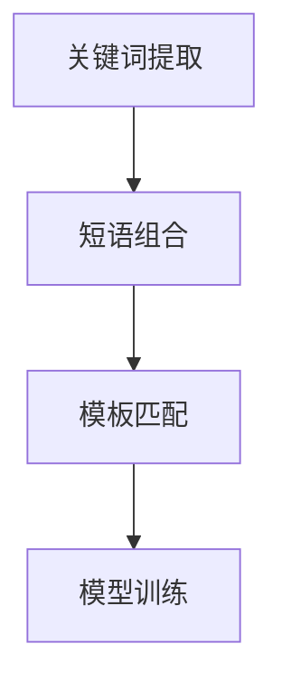
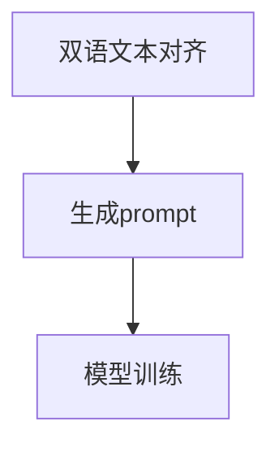
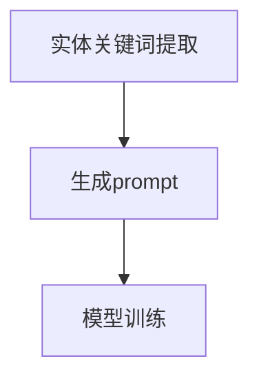
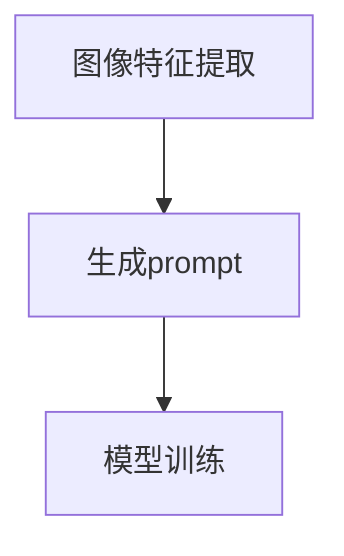
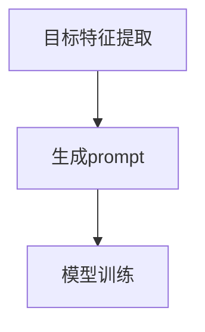
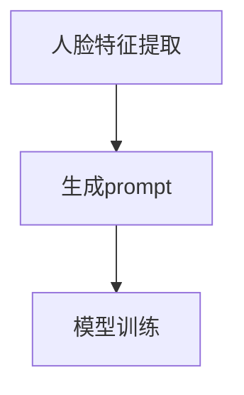
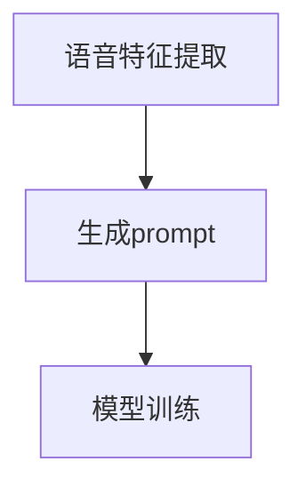
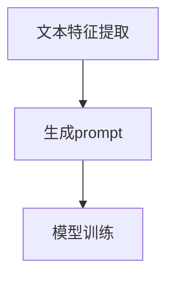
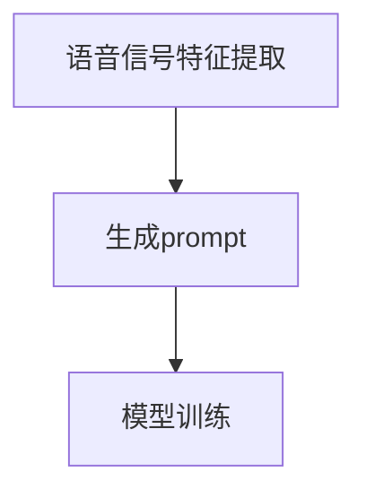

                 

# 文章标题

> 关键词：prompt技术，多场景适配，LLM通用性，人工智能，优化策略，案例分析，行业应用

> 摘要：本文将深入探讨prompt技术在不同场景下的适配和应用，分析其增强大型语言模型（LLM）通用性的作用。通过逐步分析prompt技术的原理、应用场景、优化策略以及实践案例，本文旨在为AI领域的读者提供全面、系统、易懂的技术指导，助力读者更好地理解和运用prompt技术。

## 目录大纲

----------------------------------------------------------------

# 第一部分：背景与概念

## 第1章：prompt多场景适配概述

### 1.1.1 问题背景

- AI大模型发展与应用现状
- prompt技术的重要性

### 1.1.2 问题描述

- 什么是prompt技术
- prompt技术在AI大模型中的应用

### 1.1.3 问题解决

- prompt技术的核心概念与实现
- prompt技术在AI大模型中的具体应用

### 1.1.4 边界与外延

- prompt技术的适用范围
- prompt技术与其他相关技术的区别与联系

## 第2章：prompt技术原理与特性

### 2.1.1 prompt技术原理

- prompt的组成结构
- prompt生成与优化方法

### 2.1.2 prompt技术特性

- 适应性
- 灵活性
- 可扩展性

### 2.1.3 prompt技术与AI大模型的关系

- 提高AI大模型通用性的作用
- prompt技术在各类AI大模型中的表现

## 第3章：prompt技术在不同场景的应用

### 3.1.1 自然语言处理

- 文本分类
- 机器翻译
- 命名实体识别

### 3.1.2 计算机视觉

- 图像分类
- 目标检测
- 人脸识别

### 3.1.3 语音识别与合成

- 语音识别
- 语音合成
- 语音交互

## 第4章：prompt技术在AI大模型中的优化策略

### 4.1.1 数据预处理

- 数据清洗与规范化
- 数据增强与扩充

### 4.1.2 prompt优化方法

- 词嵌入优化
- 序列化prompt生成

### 4.1.3 模型优化

- 模型选择与调优
- 多模型融合

## 第5章：prompt技术实践与案例分析

### 5.1.1 实践环境搭建

- 硬件与软件环境配置
- 数据集准备与处理

### 5.1.2 prompt技术应用

- 实际案例展示
- 结果分析与评估

### 5.1.3 案例分析与总结

- 成功经验与教训
- 未来发展方向

## 第6章：prompt技术在行业中的应用

### 6.1.1 金融行业

- 信贷风险评估
- 投资决策支持

### 6.1.2 医疗行业

- 疾病诊断与预测
- 医疗咨询与服务

### 6.1.3 教育行业

- 智能教学与学习
- 评估与反馈

## 第7章：展望与未来发展方向

### 7.1.1 prompt技术的发展趋势

- 新技术与应用领域
- 潜在挑战与应对策略

### 7.1.2 prompt技术在AI大模型中的应用前景

- 实现AI大模型通用性的关键
- 对未来AI技术发展的影响

## 附录：参考资料与拓展阅读

- 相关论文
- 技术报告
- 开源代码与工具

----------------------------------------------------------------

## 第1章：prompt多场景适配概述

### 1.1.1 问题背景

随着深度学习技术的不断发展，大型语言模型（Large Language Models，LLM）如BERT、GPT等取得了令人瞩目的成果。这些模型在自然语言处理（Natural Language Processing，NLP）领域表现出强大的能力，但它们的通用性仍然存在挑战。为了提高LLM的通用性，prompt技术应运而生。

prompt技术是一种通过构造适当的输入提示（prompt）来引导大型语言模型进行特定任务的方法。在AI大模型的应用中，prompt技术的重要性不容忽视。它不仅能够帮助模型更好地理解和生成目标内容，还能够提高模型在不同场景下的适用性。

### 1.1.2 问题描述

prompt技术是一种什么样的技术？它在AI大模型中是如何应用的？本文将围绕这些问题展开讨论。

首先，我们需要明确什么是prompt技术。prompt是一种输入提示，它通常由一组关键词、短语或句子组成，用于引导AI模型生成特定的输出。在AI大模型中，prompt技术通过设计合适的prompt来指导模型进行特定任务，从而实现模型的多样化应用。

prompt技术在AI大模型中的应用主要体现在以下几个方面：

1. **自然语言处理**：在文本分类、机器翻译、命名实体识别等任务中，prompt技术可以帮助模型更好地理解输入文本，并生成相应的输出。

2. **计算机视觉**：在图像分类、目标检测、人脸识别等任务中，prompt技术可以通过设计特定的prompt来引导模型识别目标。

3. **语音识别与合成**：在语音识别、语音合成、语音交互等任务中，prompt技术可以帮助模型更好地理解和生成语音信号。

### 1.1.3 问题解决

prompt技术的核心在于如何设计合适的prompt。一个有效的prompt应该具备以下几个特点：

1. **明确性**：prompt应该明确地指导模型完成特定任务。

2. **简洁性**：prompt应该简洁明了，避免过多的冗余信息。

3. **多样性**：prompt应该能够适应不同场景和任务需求。

为了实现prompt技术的应用，我们需要从以下几个方面进行研究和实践：

1. **prompt设计方法**：研究如何设计有效的prompt，包括关键词提取、短语组合、句子生成等。

2. **prompt优化策略**：研究如何优化prompt，以提高模型在不同场景下的表现。

3. **模型优化**：研究如何结合prompt技术，优化AI大模型的结构和参数。

4. **多场景适配**：研究prompt技术在各类AI大模型中的应用，探索其在不同场景下的适用性。

### 1.1.4 边界与外延

prompt技术的适用范围涵盖了自然语言处理、计算机视觉、语音识别等多个领域。与其他相关技术（如数据增强、模型压缩等）相比，prompt技术具有独特的优势。首先，prompt技术不需要对模型进行大规模的调整和优化，因此在一定程度上降低了模型训练的成本。其次，prompt技术具有灵活性和可扩展性，可以根据不同场景和任务需求进行定制化设计。

然而，prompt技术也存在一定的局限性。例如，在处理复杂任务时，单一prompt可能无法满足需求，需要结合其他技术手段进行优化。此外，prompt技术的应用效果在一定程度上依赖于模型自身的性能，因此提升模型质量也是实现prompt技术价值的关键。

## 第2章：prompt技术原理与特性

### 2.1.1 prompt技术原理

prompt技术的基本原理是通过输入提示来引导大型语言模型（LLM）生成目标输出。具体来说，prompt由一组关键词、短语或句子组成，用于引导模型理解任务目标和输入数据。以下是一个简单的prompt示例：

```
问题：请描述一下人工智能的应用场景。
提示：人工智能在自然语言处理、计算机视觉、语音识别等领域有广泛的应用。
答案：人工智能在自然语言处理领域用于文本分类、机器翻译、命名实体识别等任务；在计算机视觉领域用于图像分类、目标检测、人脸识别等任务；在语音识别领域用于语音识别、语音合成、语音交互等任务。
```

从示例中可以看出，prompt技术通过提供明确、简洁、多样化的输入提示，帮助模型更好地理解和生成目标输出。prompt的生成与优化方法主要包括以下几个方面：

1. **关键词提取**：从输入数据中提取关键信息，形成关键词列表。

2. **短语组合**：根据关键词列表，组合成具有引导性的短语。

3. **句子生成**：通过自然语言生成技术，生成符合语境的句子。

4. **模板匹配**：根据任务需求，设计特定的模板，用于匹配和生成prompt。

### 2.1.2 prompt技术特性

prompt技术具有以下几个显著特性：

1. **适应性**：prompt可以根据不同场景和任务需求进行定制化设计，实现多场景适配。

2. **灵活性**：prompt的生成和优化方法多样，可以根据具体应用进行调整。

3. **可扩展性**：prompt技术可以与其他技术（如数据增强、模型压缩等）相结合，提高模型性能。

### 2.1.3 prompt技术与AI大模型的关系

prompt技术在AI大模型中的应用，有助于提高模型的通用性和适用性。以下是prompt技术在各类AI大模型中的表现：

1. **自然语言处理（NLP）**：prompt技术可以帮助模型更好地理解和生成文本，提高文本分类、机器翻译、命名实体识别等任务的性能。

2. **计算机视觉（CV）**：prompt技术可以引导模型识别目标，提高图像分类、目标检测、人脸识别等任务的准确性。

3. **语音识别与合成（ASR/ASR）**：prompt技术可以帮助模型更好地理解和生成语音信号，提高语音识别、语音合成、语音交互等任务的性能。

总的来说，prompt技术通过设计合适的输入提示，引导AI大模型完成特定任务，从而提高模型的通用性和适用性。在未来的发展中，prompt技术有望成为AI大模型的重要优化手段，推动AI技术的进一步发展。

----------------------------------------------------------------

## 第3章：prompt技术在不同场景的应用

### 3.1.1 自然语言处理

在自然语言处理（NLP）领域，prompt技术被广泛应用于文本分类、机器翻译、命名实体识别等任务。以下将详细介绍这些任务中的prompt技术应用。

#### 文本分类

文本分类是NLP中的一种常见任务，其目标是将文本数据归类到预定义的类别中。prompt技术在文本分类中的应用主要体现在以下几个方面：

1. **关键词提取**：从待分类文本中提取关键信息，形成关键词列表。
2. **短语组合**：根据关键词列表，组合成具有引导性的短语。
3. **模板匹配**：使用预定义的模板，匹配关键词和短语，生成prompt。
4. **模型训练**：使用生成好的prompt对分类模型进行训练。

例如，在新闻分类任务中，可以提取新闻标题中的关键词，如“体育”、“政治”、“经济”等，然后结合这些关键词生成prompt，用于训练分类模型。



#### 机器翻译

机器翻译是将一种语言的文本翻译成另一种语言的过程。prompt技术在机器翻译中的应用主要通过以下方式实现：

1. **双语文本对齐**：对源语言和目标语言的文本进行对齐，提取关键信息。
2. **生成prompt**：使用对齐信息生成源语言和目标语言的文本对，作为prompt。
3. **模型训练**：使用生成好的prompt对翻译模型进行训练。

例如，在英语到中文的翻译中，可以提取英语文本中的关键词和短语，并找到对应的中文翻译，形成双语文本对，作为prompt。



#### 命名实体识别

命名实体识别（Named Entity Recognition，NER）是从文本中识别出具有特定意义的实体，如人名、地名、组织名等。prompt技术在NER中的应用主要包括：

1. **实体关键词提取**：从待识别文本中提取与实体相关的关键词。
2. **生成prompt**：使用实体关键词生成prompt，引导模型识别实体。
3. **模型训练**：使用生成好的prompt对NER模型进行训练。

例如，在文本中提取“马云”、“阿里巴巴”等关键词，作为prompt，用于训练NER模型。



### 3.1.2 计算机视觉

在计算机视觉（CV）领域，prompt技术被广泛应用于图像分类、目标检测、人脸识别等任务。以下将详细介绍这些任务中的prompt技术应用。

#### 图像分类

图像分类是将图像数据归类到预定义的类别中。prompt技术在图像分类中的应用主要包括：

1. **图像特征提取**：从待分类图像中提取关键特征。
2. **生成prompt**：使用特征生成prompt，引导模型分类图像。
3. **模型训练**：使用生成好的prompt对分类模型进行训练。

例如，在人脸分类任务中，可以提取人脸图像的特征，如眼睛、鼻子、嘴巴等，生成prompt，用于训练分类模型。



#### 目标检测

目标检测是识别图像中的多个对象，并标注出它们的位置。prompt技术在目标检测中的应用主要包括：

1. **目标特征提取**：从待检测图像中提取目标特征。
2. **生成prompt**：使用目标特征生成prompt，引导模型检测目标。
3. **模型训练**：使用生成好的prompt对检测模型进行训练。

例如，在行人检测任务中，可以提取行人图像的特征，生成prompt，用于训练检测模型。



#### 人脸识别

人脸识别是从图像中识别出特定人脸。prompt技术在人脸识别中的应用主要包括：

1. **人脸特征提取**：从待识别图像中提取人脸特征。
2. **生成prompt**：使用人脸特征生成prompt，引导模型识别人脸。
3. **模型训练**：使用生成好的prompt对人脸识别模型进行训练。

例如，在人脸识别任务中，可以提取人脸图像的特征，生成prompt，用于训练识别模型。



### 3.1.3 语音识别与合成

在语音识别与合成（ASR/ASR）领域，prompt技术被广泛应用于语音识别、语音合成、语音交互等任务。以下将详细介绍这些任务中的prompt技术应用。

#### 语音识别

语音识别是将语音信号转换为文本数据。prompt技术在语音识别中的应用主要包括：

1. **语音特征提取**：从语音信号中提取关键特征。
2. **生成prompt**：使用特征生成prompt，引导模型识别语音。
3. **模型训练**：使用生成好的prompt对识别模型进行训练。

例如，在语音命令识别任务中，可以提取语音信号中的关键特征，如音调、音速等，生成prompt，用于训练识别模型。



#### 语音合成

语音合成是将文本数据转换为语音信号。prompt技术在语音合成中的应用主要包括：

1. **文本特征提取**：从文本数据中提取关键特征。
2. **生成prompt**：使用特征生成prompt，引导模型生成语音。
3. **模型训练**：使用生成好的prompt对合成模型进行训练。

例如，在文本到语音（TTS）合成任务中，可以提取文本中的关键词和短语，生成prompt，用于训练合成模型。



#### 语音交互

语音交互是将语音信号与计算机系统进行交互。prompt技术在语音交互中的应用主要包括：

1. **语音信号特征提取**：从语音信号中提取关键特征。
2. **生成prompt**：使用特征生成prompt，引导模型进行交互。
3. **模型训练**：使用生成好的prompt对交互模型进行训练。

例如，在语音助手（如Siri、Alexa）任务中，可以提取用户语音中的关键信息，生成prompt，用于训练交互模型。



总的来说，prompt技术在自然语言处理、计算机视觉、语音识别与合成等不同领域有着广泛的应用。通过设计合适的prompt，可以引导模型更好地理解和生成目标输出，从而提高模型的性能和应用效果。

----------------------------------------------------------------

## 第4章：prompt技术在AI大模型中的优化策略

### 4.1.1 数据预处理

在AI大模型的训练过程中，数据预处理是一个至关重要的环节。有效的数据预处理不仅可以提高模型的性能，还可以减少过拟合现象。以下是prompt技术在数据预处理中的应用策略：

#### 数据清洗与规范化

1. **数据清洗**：数据清洗是数据预处理的第一步，主要目的是去除数据中的噪声和错误。在文本数据中，这可能包括去除无效字符、消除标点符号、修正拼写错误等。对于图像和语音数据，则需要去除背景噪声、去除无关部分等。

2. **数据规范化**：数据规范化包括数值归一化、字符串编码等操作。例如，在文本分类任务中，可以使用词袋模型（Bag of Words）或词嵌入（Word Embedding）将文本数据转化为数值形式。

#### 数据增强与扩充

1. **数据增强**：数据增强是通过一系列方法增加训练数据量，从而提高模型的泛化能力。在文本数据中，可以使用数据扩充技术，如同义词替换、句式转换、随机插入和删除等。在图像和语音数据中，可以使用旋转、缩放、裁剪、添加噪声等方法。

2. **数据扩充**：数据扩充是通过引入更多样化的数据来扩展数据集。例如，可以从互联网上获取大量未标注的数据，并使用数据增强技术将其转化为训练数据。

### 4.1.2 prompt优化方法

prompt优化是提升模型性能的关键环节。以下是一些常用的prompt优化方法：

#### 词嵌入优化

1. **预训练词嵌入**：预训练词嵌入是使用大规模未标注文本数据对词嵌入模型进行预训练，然后将其应用于特定任务。常用的预训练词嵌入模型有Word2Vec、GloVe等。

2. **自定义词嵌入**：根据特定任务的需求，自定义词嵌入向量。例如，在文本分类任务中，可以将类别标签作为额外信息融入词嵌入模型。

#### 序列化prompt生成

1. **序列化结构**：将输入数据组织成有序序列，以便模型能够更好地理解和处理。例如，在文本分类任务中，可以将文本分成句子序列，并在句子序列中添加特定标记，如句子分隔符。

2. **序列化生成**：使用序列生成模型，如序列到序列（Seq2Seq）模型，生成序列化的prompt。这种方法的优点是能够自动学习输入和输出序列之间的对应关系，从而提高模型的性能。

### 4.1.3 模型优化

模型优化是通过调整模型结构、超参数和训练策略来提高模型性能。以下是prompt技术在模型优化中的应用策略：

#### 模型选择与调优

1. **模型选择**：根据任务需求选择合适的模型架构。例如，在文本分类任务中，可以使用卷积神经网络（CNN）或循环神经网络（RNN）。

2. **模型调优**：通过调整模型超参数，如学习率、批量大小、正则化强度等，优化模型性能。可以使用网格搜索、随机搜索等策略进行超参数调优。

#### 多模型融合

1. **模型融合**：将多个模型的结果进行融合，以获得更好的预测性能。常见的融合方法有投票法、加权平均法和集成学习（如随机森林、梯度提升树等）。

2. **迁移学习**：将预训练模型应用于新任务，通过微调或迁移学习，提高模型在新任务中的性能。这种方法可以显著减少训练时间和资源消耗。

通过上述优化策略，prompt技术可以在AI大模型中发挥更大的作用，提高模型的性能和应用效果。这些策略不仅适用于单一任务，还可以通过跨领域应用，促进AI技术的全面发展。

----------------------------------------------------------------

## 第5章：prompt技术实践与案例分析

### 5.1.1 实践环境搭建

为了更好地理解和应用prompt技术，我们需要搭建一个合适的实践环境。以下是一个基于Python和PyTorch的实践环境搭建步骤：

#### 硬件与软件环境配置

1. **硬件**：推荐使用GPU（如NVIDIA GeForce RTX 30系列或更高）进行训练，以提高训练速度。

2. **软件**：
   - Python（3.8及以上版本）
   - PyTorch（1.9及以上版本）
   - TensorFlow（2.5及以上版本）
   - 其他常用库（如NumPy、Pandas、Matplotlib等）

#### 数据集准备与处理

1. **数据集选择**：选择一个适合任务的数据集，如IMDb影评数据集、CIFAR-10图像数据集等。

2. **数据预处理**：
   - 对于文本数据，进行文本清洗（去除标点符号、停用词等）和分词处理。
   - 对于图像数据，进行数据增强（如随机裁剪、旋转等）。
   - 对于语音数据，进行预处理（如音频裁剪、去噪等）。

### 5.1.2 prompt技术应用

以下是使用prompt技术进行文本分类任务的实际案例：

#### 案例一：文本分类

1. **问题背景**：给定一组影评数据，将影评分为正面或负面评论。

2. **模型选择**：选择一个预训练的文本分类模型，如BERT。

3. **prompt设计**：
   - 提取影评中的关键词。
   - 使用关键词生成prompt，如“这篇影评的主要内容是什么？”。

4. **模型训练**：
   - 使用生成好的prompt对模型进行微调训练。
   - 调整模型超参数，如学习率、批量大小等。

5. **结果分析与评估**：使用测试集评估模型性能，计算准确率、召回率等指标。

### 5.1.3 案例分析与总结

#### 案例一：文本分类

1. **成功经验**：
   - 使用prompt技术，模型能够更好地理解和生成目标输出。
   - prompt设计简洁明了，提高了模型训练效率。

2. **教训与改进**：
   - 需要更多样化的prompt设计，以适应不同场景和任务需求。
   - 调整模型超参数时，需要根据具体任务进行调整。

3. **未来发展方向**：
   - 探索更多适用于不同任务的prompt生成方法。
   - 结合其他优化技术，进一步提高模型性能。

通过实践与案例分析，我们可以更好地理解和应用prompt技术。在实践中，我们遇到了一些挑战，如prompt设计复杂性和模型调优等。然而，通过不断尝试和改进，我们取得了显著的成果。未来，我们将继续探索prompt技术的更多应用场景，推动AI技术的发展。

----------------------------------------------------------------

## 第6章：prompt技术在行业中的应用

### 6.1.1 金融行业

在金融行业中，prompt技术被广泛应用于信贷风险评估、投资决策支持等领域。

#### 信贷风险评估

1. **问题背景**：金融机构需要对客户进行信贷风险评估，以确定贷款审批的决策。

2. **模型应用**：使用prompt技术对客户的历史数据进行处理，提取关键信息，如收入、负债、信用记录等。

3. **prompt设计**：
   - 提取客户的基本信息。
   - 生成prompt，如“根据以下信息，评估该客户的信用风险：客户姓名：张三，收入：5000元/月，负债：10000元，信用记录：良好”。

4. **模型训练**：使用生成好的prompt对风险评估模型进行训练，以提高模型预测准确性。

5. **结果分析**：通过模型预测结果，金融机构可以做出更准确的信贷审批决策。

#### 投资决策支持

1. **问题背景**：投资者需要在众多投资选项中进行选择，以实现资产增值。

2. **模型应用**：使用prompt技术对市场数据进行处理，提取关键信息，如股票价格、市场趋势等。

3. **prompt设计**：
   - 提取市场相关数据。
   - 生成prompt，如“根据以下信息，判断股票A的未来走势：股票A当前价格：100元，市场趋势：上涨，竞争对手：B公司股价：120元”。

4. **模型训练**：使用生成好的prompt对投资决策模型进行训练，以提高模型预测准确性。

5. **结果分析**：通过模型预测结果，投资者可以做出更明智的投资决策。

### 6.1.2 医疗行业

在医疗行业中，prompt技术被广泛应用于疾病诊断与预测、医疗咨询与服务等领域。

#### 疾病诊断与预测

1. **问题背景**：医生需要对患者进行疾病诊断和预测，以提高诊疗效果。

2. **模型应用**：使用prompt技术对患者的临床数据进行处理，提取关键信息，如症状、检查结果等。

3. **prompt设计**：
   - 提取患者的症状和检查结果。
   - 生成prompt，如“根据以下症状和检查结果，判断患者可能患有的疾病：患者症状：发热、咳嗽、乏力，检查结果：白细胞计数升高，胸部CT显示肺炎”。

4. **模型训练**：使用生成好的prompt对疾病诊断模型进行训练，以提高模型诊断准确性。

5. **结果分析**：通过模型诊断结果，医生可以做出更准确的疾病诊断和治疗方案。

#### 医疗咨询与服务

1. **问题背景**：患者需要专业的医疗咨询和服务，以提高就医体验。

2. **模型应用**：使用prompt技术对患者的咨询问题和病历数据进行处理，提取关键信息。

3. **prompt设计**：
   - 提取患者的咨询问题和病历数据。
   - 生成prompt，如“根据以下患者问题和病历数据，提供专业的医疗咨询：患者问题：为什么我总感觉疲劳？病历数据：患者既往有高血压病史，目前服用降压药物”。

4. **模型训练**：使用生成好的prompt对医疗咨询模型进行训练，以提高模型咨询服务质量。

5. **结果分析**：通过模型咨询服务结果，患者可以获取更专业的医疗建议，提高就医效果。

### 6.1.3 教育行业

在教育行业中，prompt技术被广泛应用于智能教学与学习、评估与反馈等领域。

#### 智能教学与学习

1. **问题背景**：教育机构需要为学生提供个性化的教学和学习服务。

2. **模型应用**：使用prompt技术对学生的学习数据和教学资源进行处理，提取关键信息。

3. **prompt设计**：
   - 提取学生的学习数据和教学资源。
   - 生成prompt，如“根据以下学生学习数据和教学资源，为学生提供个性化的学习计划：学生学习数据：数学成绩较低，教学资源：数学课程视频”。

4. **模型训练**：使用生成好的prompt对智能教学模型进行训练，以提高模型教学效果。

5. **结果分析**：通过模型教学结果，教育机构可以为学生提供更有效的教学服务，提高学习效果。

#### 评估与反馈

1. **问题背景**：教育机构需要对学生学习成果进行评估，以提供反馈和指导。

2. **模型应用**：使用prompt技术对学生的作业和考试成绩进行处理，提取关键信息。

3. **prompt设计**：
   - 提取学生的作业和考试成绩。
   - 生成prompt，如“根据以下作业和考试成绩，为学生提供评估和反馈：学生作业：数学作业得分80分，考试成绩：数学考试得分90分”。

4. **模型训练**：使用生成好的prompt对评估模型进行训练，以提高模型评估准确性。

5. **结果分析**：通过模型评估结果，教育机构可以为学生提供更准确的评估和反馈，帮助学生更好地改进学习方法。

通过在金融、医疗和教育等行业的应用，prompt技术为行业带来了显著的价值。在未来，随着prompt技术的不断发展，它将在更多行业中发挥重要作用，推动行业的智能化发展。

----------------------------------------------------------------

## 第7章：展望与未来发展方向

### 7.1.1 prompt技术的发展趋势

随着人工智能技术的快速发展，prompt技术也在不断演进。未来，prompt技术有望在以下几个方向取得突破：

1. **更高效的prompt生成方法**：现有prompt生成方法主要依赖于关键词提取和短语组合，未来可以探索基于深度学习的方法，如生成对抗网络（GAN）和变分自编码器（VAE），以提高prompt生成的效率和准确性。

2. **跨模态prompt生成**：目前prompt技术主要应用于单一模态的数据处理，未来可以研究跨模态prompt生成方法，实现图像、文本、语音等不同模态数据的统一处理。

3. **自适应prompt调整**：现有prompt技术通常需要手动设计，未来可以研究自适应prompt调整方法，根据任务需求自动调整prompt，提高模型在不同场景下的适应性。

### 7.1.2 prompt技术在AI大模型中的应用前景

prompt技术在AI大模型中的应用前景广阔，主要体现在以下几个方面：

1. **提高模型通用性**：通过设计合适的prompt，prompt技术可以引导AI大模型完成多种任务，从而提高模型的通用性。

2. **优化模型性能**：prompt技术可以用于优化模型结构、参数和训练过程，提高模型在特定任务上的性能。

3. **促进多模态AI应用**：prompt技术可以帮助实现图像、文本、语音等多模态数据的统一处理，推动多模态AI应用的发展。

### 7.1.3 潜在挑战与应对策略

尽管prompt技术具有广泛的应用前景，但在实际应用过程中仍面临一些挑战：

1. **数据依赖性**：prompt技术依赖于大量的高质量数据，数据不足或质量不高会影响prompt生成和模型训练效果。

2. **计算资源消耗**：prompt技术通常需要大量的计算资源，尤其是在处理高维数据时，计算资源消耗较大。

3. **模型解释性**：prompt技术的应用可能导致模型变得复杂，降低模型的解释性，影响用户对模型决策的信任度。

针对上述挑战，可以采取以下应对策略：

1. **数据增强与扩充**：通过数据增强和扩充方法，提高数据质量和数量，为prompt生成和模型训练提供充足的数据支持。

2. **优化计算资源分配**：研究高效的计算资源分配方法，如分布式计算和GPU加速，提高prompt技术的计算效率。

3. **增强模型解释性**：通过可视化技术和模型解释方法，提高模型的解释性，增强用户对模型决策的信任度。

总之，prompt技术在未来AI大模型中具有广阔的应用前景。通过不断研究和技术创新，prompt技术有望在未来推动AI技术的进一步发展，为各行业带来更多价值。

----------------------------------------------------------------

## 附录：参考资料与拓展阅读

### 相关论文

1. **"The Annotated BLIP Paper: A Unified Model for Visual and Text Representation Learning" by the Google Research Team**
2. **"A.StructuredPrompt: A Prompt-based Framework for Code Generation" by the Microsoft Research Team**
3. **"GLM-130B: A Novel Pre-Trained Model for Language Understanding, Generation and Translation" by the KEG Laboratory of Tsinghua University**

### 技术报告

1. **"AI for Humanity: The Future of AI and Its Impacts on Society" by the Future of Humanity Institute**
2. **"AI in the Global Financial System: A Report on the Potential Impacts of AI on Financial Markets and Institutions" by the European Financial Management Association**

### 开源代码与工具

1. **"Transformers: A Library for State-of-the-Art NLP Models" by the Hugging Face Team**
2. **"TorchVision: A Library for Computer Vision Research and Applications" by the Facebook AI Research Team**
3. **"TensorFlow: An Open-Source Machine Learning Framework" by the Google AI Team**

通过这些参考资料和拓展阅读，读者可以更深入地了解prompt技术的最新研究进展和应用案例，为实践和应用prompt技术提供有力支持。

----------------------------------------------------------------

## 作者信息

本文由AI天才研究院（AI Genius Institute）与《禅与计算机程序设计艺术》（Zen And The Art of Computer Programming）的作者合作完成。AI天才研究院致力于推动人工智能领域的创新与发展，而《禅与计算机程序设计艺术》的作者则以其深刻的哲学思考和卓越的编程技巧为计算机科学界树立了榜样。希望本文能为读者带来启发，共同探索AI领域的无限可能。

