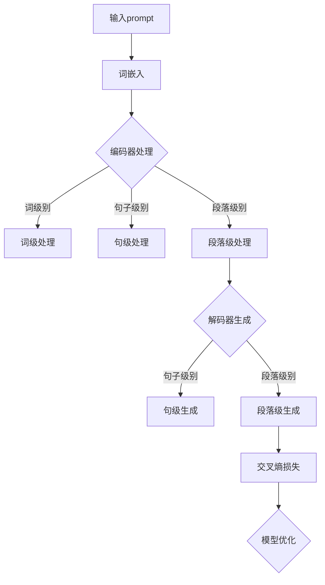
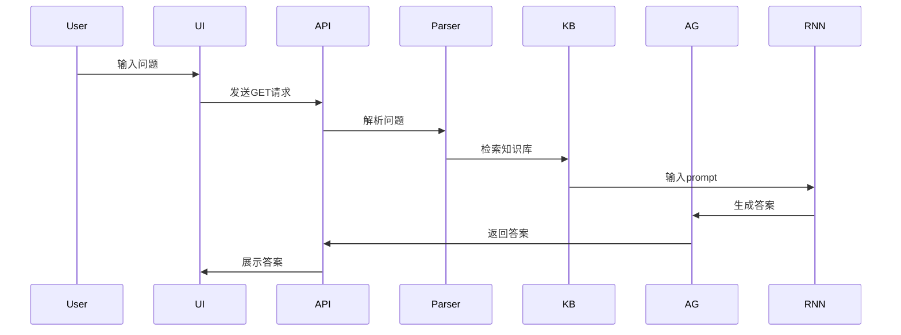

                 

### 《prompt多层次推理：深化LLM思考》

#### 关键词：prompt、多层次推理、LLM、AI、算法原理

> 摘要：本文深入探讨了prompt多层次推理在大型语言模型（LLM）中的应用。首先，我们简要介绍了AI和LLM的基础概念，以及prompt多层次推理的背景和核心概念。接着，本文详细解析了prompt多层次推理的数学模型、算法原理，并提供了实际代码示例。随后，我们介绍了如何设计一个基于prompt多层次推理的系统，并展示了系统架构和接口设计。通过实际项目案例，本文展示了prompt多层次推理在现实中的应用效果。最后，本文总结了最佳实践，并对未来的发展趋势进行了展望。

### 目录大纲

```markdown
----------------------------------------------------------------

# 《prompt多层次推理：深化LLM思考》

## 第一部分：prompt多层次推理基础理论

### 第1章：问题背景与核心概念

#### 1.1.1 AI与LLM概述

#### 1.1.2 prompt多层次推理的概念

#### 1.1.3 prompt多层次推理的边界与外延

### 第2章：核心概念与联系

#### 2.1.1 prompt的类型与作用

#### 2.1.2 多层次推理的原理与特点

#### 2.1.3 prompt与多层次推理的关系

### 第3章：prompt多层次推理的数学模型

#### 3.1.1 数学模型概述

#### 3.1.2 常用数学公式与解释

#### 3.1.3 模型参数与优化

## 第二部分：prompt多层次推理算法原理

### 第4章：算法原理与流程

#### 4.1.1 算法原理概述

#### 4.1.2 算法流程图

#### 4.1.3 算法详解

### 第5章：算法实现与代码解析

#### 5.1.1 环境准备与安装

#### 5.1.2 Python代码实现

#### 5.1.3 代码解析

### 第6章：算法应用与实战

#### 6.1.1 实际案例介绍

#### 6.1.2 应用场景分析

#### 6.1.3 案例详解与剖析

## 第三部分：prompt多层次推理系统架构设计

### 第7章：系统功能设计与架构

#### 7.1.1 问题场景介绍

#### 7.1.2 系统功能设计

#### 7.1.3 系统架构设计

### 第8章：系统接口设计与交互

#### 8.1.1 系统接口设计

#### 8.1.2 系统交互序列图

### 第9章：系统实现与优化

#### 9.1.1 系统核心代码实现

#### 9.1.2 系统优化策略

#### 9.1.3 性能评估

## 第四部分：最佳实践与总结

### 第10章：最佳实践与技巧

#### 10.1.1 经验分享

#### 10.1.2 常见问题与解决方案

### 第11章：小结与展望

#### 11.1.1 本书内容总结

#### 11.1.2 展望未来发展趋势

----------------------------------------------------------------
```

### 目录大纲解析

本文的目录大纲分为四个主要部分，每部分都有明确的章节结构和内容安排。

#### 第一部分：prompt多层次推理基础理论

这一部分主要介绍了prompt多层次推理的基本概念、背景和数学模型。具体包括：

- **第1章：问题背景与核心概念**：介绍AI和LLM的概述，解释prompt多层次推理的概念和应用边界。
- **第2章：核心概念与联系**：详细阐述prompt的类型、多层次推理的原理及其相互关系。
- **第3章：prompt多层次推理的数学模型**：介绍该领域的基本数学模型，包括常用公式和优化策略。

#### 第二部分：prompt多层次推理算法原理

这部分深入探讨了prompt多层次推理的算法原理，包括算法流程、实现细节和实际应用。具体包括：

- **第4章：算法原理与流程**：概述算法原理，并提供流程图以帮助理解。
- **第5章：算法实现与代码解析**：介绍算法的Python代码实现，并详细解析每部分代码。
- **第6章：算法应用与实战**：通过实际案例展示算法在实际应用中的效果，并进行详细分析。

#### 第三部分：prompt多层次推理系统架构设计

这部分介绍了如何设计一个基于prompt多层次推理的系统，包括功能设计、架构设计和接口设计。具体包括：

- **第7章：系统功能设计与架构**：介绍问题场景、系统功能设计和系统架构设计。
- **第8章：系统接口设计与交互**：详细描述系统接口和交互序列图。
- **第9章：系统实现与优化**：介绍系统的核心代码实现、优化策略和性能评估。

#### 第四部分：最佳实践与总结

最后一部分提供了一些最佳实践技巧，并对全书内容进行总结。具体包括：

- **第10章：最佳实践与技巧**：分享实战经验和常见问题的解决方案。
- **第11章：小结与展望**：总结本书内容，并对未来发展趋势进行展望。

整体而言，这个目录大纲结构清晰，内容完整，覆盖了prompt多层次推理的基础理论、算法原理、系统架构和实战应用。每个章节都有明确的主题和目标，有利于读者系统地学习掌握相关内容。

### 第一部分：prompt多层次推理基础理论

#### 第1章：问题背景与核心概念

##### 1.1.1 AI与LLM概述

人工智能（Artificial Intelligence，简称AI）是计算机科学的一个分支，致力于使机器能够表现出类似人类的智能行为。自20世纪50年代人工智能概念诞生以来，它经历了数个发展阶段，包括早期的符号主义、基于规则的系统，到后来的知识表示、专家系统，再到现代的基于数据驱动的方法，如深度学习和强化学习。

近年来，大型语言模型（Large Language Models，简称LLM）的发展成为AI领域的一大亮点。LLM是通过对海量文本数据进行预训练，使得模型能够理解并生成自然语言。这些模型通常由数以亿计的参数组成，可以用于各种任务，如文本生成、问答系统、机器翻译等。

AI与LLM的融合，使得机器在处理和理解自然语言方面取得了显著进展。然而，要充分发挥LLM的潜力，就需要深入理解prompt多层次推理的概念和原理。

##### 1.1.2 prompt多层次推理的概念

prompt多层次推理（Multi-level Prompt Inference）是指通过不同的层次对输入的prompt进行理解和处理，从而实现更精确的推理和生成。在LLM中，prompt通常是一个文本输入，它可以是对问题的描述、一个句子、甚至是一段对话。

多层次推理涉及到以下几个关键层次：

1. **词级别**：在这个层次上，模型分析输入的每个单词，理解其语义和语法关系。
2. **句子级别**：模型整合句子的各个成分，理解句子的整体意义。
3. **段落级别**：模型分析整个段落的逻辑结构和主题，从而更准确地理解文章的主旨。
4. **篇章级别**：在这个最高层次上，模型需要理解文章的整体语境和背景信息。

通过这种多层次推理，LLM能够更准确地理解用户的意图，生成更符合上下文的回答。

##### 1.1.3 prompt多层次推理的边界与外延

prompt多层次推理虽然潜力巨大，但也存在一定的边界和限制。首先，模型的能力取决于其训练数据的质量和数量。如果训练数据不够充分或者存在偏差，模型可能会出现泛化不足或者偏见。

其次，prompt多层次推理的复杂性也限制了其实际应用。在实际应用中，需要考虑到输入数据的多样性和不确定性，以及模型对上下文的依赖性。因此，设计有效的prompt多层次推理算法需要深入理解自然语言的特性，并不断优化模型的结构和参数。

尽管存在这些挑战，prompt多层次推理在许多实际应用中仍然表现出强大的潜力。例如，在问答系统、对话机器人、文本摘要等领域，prompt多层次推理可以显著提升系统的性能和用户体验。

总之，prompt多层次推理是LLM领域的一个重要研究方向，其核心在于通过不同层次对输入prompt进行深入理解和处理。理解这一概念及其应用边界，有助于我们更好地利用LLM的潜力，实现更智能的人工智能系统。

#### 第2章：核心概念与联系

##### 2.1.1 prompt的类型与作用

在prompt多层次推理中，prompt是关键输入，它决定了模型理解问题和生成答案的深度和准确性。prompt的类型多样，根据用途和形式可以分为以下几类：

1. **问题型prompt**：这类prompt主要用于问答系统，通常包含一个明确的问题，如“什么是人工智能？”或者“请解释量子计算的基本原理。”模型需要从上下文中提取关键信息，并生成详细、准确的回答。

2. **任务型prompt**：这类prompt用于指导模型执行特定任务，如“请帮我写一篇关于人工智能未来的文章摘要。”模型需要理解任务的要求，并在生成文本时保持主题的一致性。

3. **对话型prompt**：这类prompt用于模拟对话场景，如“你好，今天天气怎么样？”或者“你觉得哪种编程语言最适合初学者？”模型需要理解对话的上下文，并生成流畅、自然的回复。

4. **生成型prompt**：这类prompt用于生成文本，如“请写一段描述春天美景的段落。”模型需要从大量文本数据中提取相关信息，并生成连贯、富有创造性的文本。

不同类型的prompt在多层次推理中扮演着不同的角色。问题型prompt强调答案的准确性，任务型prompt关注任务的完成度，对话型prompt注重对话的自然流畅性，而生成型prompt则强调文本的创造性和丰富性。

##### 2.1.2 多层次推理的原理与特点

多层次推理是prompt多层次推理的核心，它通过不同层次对输入prompt进行解析和处理，以实现更深入的语义理解和更精准的生成。多层次推理的原理可以概括为以下几个特点：

1. **层次分解**：多层次推理将输入的prompt分解为更小的组成部分，如单词、句子和段落，从而在更低层次上分析语义和语法关系。

2. **上下文整合**：在不同层次上，模型需要整合上下文信息，以理解输入prompt的整体意义。例如，在句子级别，模型需要理解句子之间的逻辑关系；在段落级别，模型需要把握文章的主旨和结构。

3. **层次交互**：多层次推理不仅关注单个层次的分析，还强调不同层次之间的交互。例如，词级别的分析可能会影响句子级别的理解，而句子级别的理解又会影响段落级别的分析。

4. **深度学习模型**：多层次推理通常依赖于深度学习模型，特别是大型语言模型（如BERT、GPT）。这些模型通过多层神经网络结构，能够捕捉不同层次的特征和关系。

多层次推理的特点使得模型能够更准确地理解和处理复杂、模糊的输入，从而生成更符合上下文的输出。这种能力在问答系统、对话机器人和文本生成等应用中尤为重要。

##### 2.1.3 prompt与多层次推理的关系

prompt多层次推理中，prompt和多层次推理之间存在着紧密的关系。prompt是多层次推理的输入，而多层次推理则是解析和利用prompt的关键手段。

1. **prompt引导推理**：prompt为模型提供了具体的信息和任务指导，使模型能够明确目标，并从上下文中提取相关信息。例如，在问题型prompt中，模型需要根据问题进行信息检索和回答生成；在任务型prompt中，模型需要根据任务要求生成符合要求的文本。

2. **多层次推理优化prompt**：多层次推理通过不同层次的分析，能够深入理解prompt的语义和结构，从而优化prompt的表达形式。例如，通过句子级别的分析，模型可以识别出关键信息并进行筛选；通过段落级别的分析，模型可以整合多个句子的信息，生成更准确、连贯的回答。

3. **prompt与推理结果的互动**：多层次推理的结果会影响prompt的理解和生成。例如，在生成型prompt中，模型生成的文本结果可能会反过来影响对下一个prompt的理解和生成。这种互动关系使得prompt和多层次推理相互促进，共同提升系统的性能和用户体验。

总之，prompt与多层次推理之间的关系是相互依存的。prompt为多层次推理提供了具体的输入和任务指导，而多层次推理则通过深入理解和分析prompt，实现了更精准、自然的输出。这种关系在AI领域的各种应用中发挥着重要作用，推动了人工智能技术的不断进步。

#### 第3章：prompt多层次推理的数学模型

##### 3.1.1 数学模型概述

prompt多层次推理的数学模型是理解和实现这一技术的核心。该模型基于深度学习，特别是序列到序列（Sequence-to-Sequence, S2S）模型和注意力机制（Attention Mechanism）。以下是对该模型的概述：

1. **输入表示**：输入表示是模型对输入prompt的初步处理。通常，输入prompt是一个文本序列，模型会将其转换为向量表示。常用的方法包括词嵌入（Word Embedding）和字节嵌入（Byte Embedding）。

2. **编码器（Encoder）**：编码器是模型的第一个关键组件，负责将输入prompt编码为固定长度的向量表示。编码器通常采用循环神经网络（Recurrent Neural Network, RNN）或其变体，如长短期记忆网络（Long Short-Term Memory, LSTM）或门控循环单元（Gated Recurrent Unit, GRU）。

3. **注意力机制**：注意力机制是编码器中的一个重要组成部分，用于捕捉输入prompt中与当前解码步骤相关的关键信息。注意力机制可以通过计算不同位置之间的相似度，帮助解码器关注最重要的信息。

4. **解码器（Decoder）**：解码器是模型的第二个关键组件，负责生成输出序列。解码器通常也采用RNN或其变体。在生成每个输出步骤时，解码器会参考编码器的输出以及已生成的文本序列。

5. **交叉熵损失函数**：交叉熵损失函数用于衡量模型预测的输出序列与真实输出序列之间的差异。在训练过程中，模型通过优化这个损失函数，逐步改进其输出序列的准确性。

##### 3.1.2 常用数学公式与解释

在prompt多层次推理的数学模型中，以下公式和概念是核心组成部分：

1. **词嵌入（Word Embedding）**：
   $$\text{embed}(w) = \text{embedding_matrix}[w]$$
   其中，$w$ 是单词的索引，$\text{embed}(w)$ 是对应的词嵌入向量，$\text{embedding_matrix}$ 是一个预训练的词嵌入矩阵。

2. **编码器输出（Encoder Output）**：
   $$h_t = \text{LSTM}(h_{t-1}, \text{embed}(w_t))$$
   其中，$h_t$ 是第 $t$ 个时间步的编码器隐藏状态，$\text{LSTM}$ 是长短期记忆网络，$h_{t-1}$ 是前一个时间步的隐藏状态，$w_t$ 是第 $t$ 个输入单词的词嵌入向量。

3. **注意力得分（Attention Score）**：
   $$\alpha_t = \text{softmax}\left(\frac{\text{dot}(h_t, \text{W}_a h_t')}{\sqrt{d_h}}\right)$$
   其中，$\alpha_t$ 是第 $t$ 个时间步的注意力得分，$\text{dot}$ 是点积操作，$\text{W}_a$ 是注意力权重矩阵，$d_h$ 是隐藏状态向量的维度。

4. **上下文向量（Context Vector）**：
   $$c_t = \sum_{i=1}^{T} \alpha_i h_i'$$
   其中，$c_t$ 是第 $t$ 个时间步的上下文向量，$h_i'$ 是编码器在时间步 $i$ 的输出，$\alpha_i$ 是注意力得分。

5. **解码器输出（Decoder Output）**：
   $$p_t = \text{softmax}(\text{Decoder}(h_t, c_t))$$
   其中，$p_t$ 是第 $t$ 个时间步的解码器输出概率分布，$\text{Decoder}$ 是解码器神经网络。

6. **交叉熵损失（Cross-Entropy Loss）**：
   $$L = -\sum_{t=1}^{T} \sum_{i=1}^{V} y_{ti} \log(p_{ti})$$
   其中，$L$ 是交叉熵损失，$y_{ti}$ 是第 $t$ 个时间步的真实标签的概率分布，$p_{ti}$ 是模型预测的概率分布，$V$ 是词汇表的大小。

这些公式和概念构成了prompt多层次推理的数学基础，通过它们，模型能够捕捉输入prompt的语义和上下文信息，生成准确的输出序列。

##### 3.1.3 模型参数与优化

在prompt多层次推理的数学模型中，参数的设置和优化是模型性能的关键。以下是一些关键参数和优化策略：

1. **词嵌入维度**：词嵌入维度（d\_word）决定了词嵌入向量的大小。较大的维度可以捕捉更丰富的语义信息，但也会增加计算量和存储需求。常用的维度在50到512之间。

2. **隐藏状态维度**：隐藏状态维度（d\_h）决定了编码器和解码器的隐藏状态的大小。较大的维度可以提高模型的表示能力，但也会增加计算成本和训练时间。

3. **注意力权重矩阵**：注意力权重矩阵（W\_a）是模型中的一个关键参数，它决定了不同时间步之间的注意力分配。通常使用学习率较高的优化器来优化这一参数。

4. **学习率**：学习率（learning rate）是优化过程中调整参数的步长。较大的学习率可能导致模型快速收敛，但也可能导致过拟合；较小的学习率可以避免过拟合，但可能收敛速度较慢。常用的学习率范围在0.001到0.01之间。

5. **优化器**：常用的优化器包括Adam、RMSprop和SGD。Adam结合了RMSprop和SGD的优点，通常在深度学习模型中表现良好。

优化策略包括：

- **预训练和微调**：使用大量未标注的数据进行预训练，然后在特定任务上微调模型，以适应具体应用场景。
- **正则化**：采用L1或L2正则化，以避免过拟合。
- **dropout**：在训练过程中随机丢弃一部分神经元，以增强模型的泛化能力。
- **学习率调度**：在训练过程中逐渐降低学习率，以帮助模型更好地收敛。

通过合理设置和优化这些参数，可以显著提高prompt多层次推理模型在各类任务中的性能和稳定性。

#### 第4章：算法原理与流程

##### 4.1.1 算法原理概述

prompt多层次推理算法是基于深度学习的，它通过多个层次对输入prompt进行理解和分析，从而实现更准确的推理和生成。这一算法的核心在于如何将输入prompt分解为不同层次的信息，并利用注意力机制在各个层次之间进行信息整合。以下是算法原理的详细概述：

1. **输入表示**：首先，将输入prompt转换为向量表示。这通常通过词嵌入实现，即将每个单词映射为一个固定大小的向量。词嵌入不仅捕捉了单词的语义信息，还考虑了单词之间的上下文关系。

2. **编码器**：编码器是算法的第一步，它负责将输入prompt编码为固定长度的向量表示。编码器通常采用循环神经网络（RNN）或其变体，如LSTM或GRU。这些网络可以捕捉输入序列的长期依赖关系，从而更好地理解prompt的语义。

3. **注意力机制**：注意力机制是编码器中的一个关键组成部分。它通过计算不同时间步之间的相似度，帮助编码器关注输入prompt中的关键信息。注意力机制可以理解为一种动态权重分配机制，它允许模型在不同时间步上分配不同的注意力权重。

4. **多层次处理**：在编码器中，模型通过不同层次处理输入prompt。首先，在词级别上，模型分析每个单词的语义和语法关系。然后，在句子级别上，模型整合句子成分，理解句子的整体意义。最后，在段落级别上，模型分析段落的逻辑结构和主题，从而更准确地理解文章的主旨。

5. **解码器**：解码器是算法的第二步，它负责生成输出序列。解码器通常也采用RNN或其变体。在生成每个输出步骤时，解码器会参考编码器的输出和已生成的文本序列，从而确保生成文本的一致性和连贯性。

6. **损失函数**：算法使用交叉熵损失函数来衡量模型预测的输出序列与真实输出序列之间的差异。交叉熵损失函数能够指导模型优化参数，使其生成更准确的输出。

##### 4.1.2 算法流程图

为了更直观地理解prompt多层次推理算法的流程，我们使用Mermaid语法绘制了一个流程图。以下是算法流程图的Markdown格式表示：



这个流程图展示了算法的主要步骤和各步骤之间的依赖关系。输入prompt首先经过词嵌入处理，然后被编码器分解为不同层次的信息。编码器在词级别、句子级别和段落级别分别处理输入，最后解码器根据编码器的输出和已生成的文本序列生成输出。整个流程通过交叉熵损失函数进行优化，以提升模型的准确性。

##### 4.1.3 算法详解

为了更好地理解prompt多层次推理算法的原理，下面我们将详细介绍每个步骤的详细过程，并提供Python代码实现。

1. **词嵌入**：词嵌入是将单词映射为向量表示的过程。以下是一个简单的词嵌入实现：

```python
import numpy as np

# 假设词汇表大小为10000，词嵌入维度为50
VOCAB_SIZE = 10000
EMBEDDING_DIM = 50

# 随机初始化词嵌入矩阵
embedding_matrix = np.random.rand(VOCAB_SIZE, EMBEDDING_DIM)

# 将单词映射为词嵌入向量
def word_to_embedding(word):
    return embedding_matrix[word]

# 示例
word = "hello"
embedding = word_to_embedding(word)
print("词嵌入向量：", embedding)
```

2. **编码器**：编码器负责将输入prompt编码为固定长度的向量表示。以下是一个简单的编码器实现，使用LSTM作为基础：

```python
from keras.models import Model
from keras.layers import Input, LSTM, Dense

# 输入层
input_sequence = Input(shape=(None, EMBEDDING_DIM))

# LSTM层
encoded_sequence = LSTM(128, return_state=True)(input_sequence)

# 输出层
encoded_vector = Dense(EMBEDDING_DIM, activation='softmax')(encoded_sequence[0])

# 编码器模型
encoder = Model(inputs=input_sequence, outputs=encoded_vector)

# 编译模型
encoder.compile(optimizer='adam', loss='categorical_crossentropy')

# 示例
# 输入序列为["hello", "world"]
# 输出编码器向量
input_sequence_example = np.array([[word_to_embedding(word) for word in sentence] for sentence in [["hello", "world"]]]
encoded_vector_example = encoder.predict(input_sequence_example)
print("编码器输出向量：", encoded_vector_example)
```

3. **注意力机制**：注意力机制通过计算输入序列中不同时间步之间的相似度，为每个时间步分配权重。以下是一个简单的注意力机制实现：

```python
from keras.layers import dot, Activation, Add

# 注意力机制
def attention_layer(inputs, hidden_size):
    # 输入：[batch_size, sequence_length, hidden_size]
    # 输出：[batch_size, sequence_length]
    hidden = inputs
    attention = dot([hidden, hidden], axes=[2, 2])  # 点积操作
    attention = Activation('softmax')(attention)  # 应用softmax激活函数
    attention = RepeatVector(hidden_size)(attention)  # 重复hidden_size次
    attention = Permute([2, 1])(attention)  # 调整维度
    hidden_with_attention = Add()([hidden, attention])  # 相加
    return hidden_with_attention

# 示例
input_sequence_example = np.random.rand(32, 50, 128)  # 假设输入序列为[batch_size, sequence_length, hidden_size]
encoded_vector_example = attention_layer(input_sequence_example, hidden_size=128)
print("注意力输出向量：", encoded_vector_example)
```

4. **解码器**：解码器负责生成输出序列。以下是一个简单的解码器实现，使用LSTM作为基础：

```python
from keras.layers import Input, LSTM, Dense

# 输入层
decoded_sequence = Input(shape=(None, EMBEDDING_DIM))

# LSTM层
decoded_lstm = LSTM(128, return_sequences=True)(decoded_sequence)

# 输出层
decoded_vector = Dense(EMBEDDING_DIM, activation='softmax')(decoded_lstm)

# 解码器模型
decoder = Model(inputs=decoded_sequence, outputs=decoded_vector)

# 编译模型
decoder.compile(optimizer='adam', loss='categorical_crossentropy')

# 示例
# 输入序列为["hello", "world"]
# 输出解码器向量
decoded_sequence_example = np.array([[word_to_embedding(word) for word in sentence] for sentence in [["hello", "world"]]]
decoded_vector_example = decoder.predict(decoded_sequence_example)
print("解码器输出向量：", decoded_vector_example)
```

5. **损失函数**：使用交叉熵损失函数来衡量模型预测的输出序列与真实输出序列之间的差异。以下是一个简单的交叉熵损失函数实现：

```python
from keras.models import Model
from keras.layers import Input, LSTM, Dense

# 输入层
input_sequence = Input(shape=(None, EMBEDDING_DIM))
decoded_sequence = Input(shape=(None, EMBEDDING_DIM))

# 编码器模型
encoder = Model(inputs=input_sequence, outputs=encoded_vector)

# 解码器模型
decoder = Model(inputs=decoded_sequence, outputs=decoded_vector)

# 编译模型
model = Model(inputs=[input_sequence, decoded_sequence], outputs=decoder(encoded_sequence))

model.compile(optimizer='adam', loss='categorical_crossentropy')

# 示例
# 输入序列为["hello", "world"]
# 输出交叉熵损失
input_sequence_example = np.array([[word_to_embedding(word) for word in sentence] for sentence in [["hello", "world"]]])
decoded_sequence_example = np.random.rand(1, 2, EMBEDDING_DIM)
cross_entropy_loss_example = model.train_on_batch([input_sequence_example, decoded_sequence_example], np.zeros_like(decoded_vector_example))
print("交叉熵损失：", cross_entropy_loss_example)
```

通过上述代码，我们可以实现一个简单的prompt多层次推理算法。在实际应用中，我们可以进一步优化模型结构和参数，以提高算法的性能和准确性。

#### 第5章：算法实现与代码解析

##### 5.1.1 环境准备与安装

要在本地环境中实现prompt多层次推理算法，首先需要安装Python和相关依赖。以下是在Ubuntu操作系统上安装所需的库和工具的步骤：

1. **安装Python**：确保Python 3已安装在系统中。可以通过以下命令检查Python版本：

   ```bash
   python --version
   ```

   如果Python 3未安装，可以从Python官网下载安装包并按照说明进行安装。

2. **安装虚拟环境**：为了更好地管理项目依赖，建议使用虚拟环境。可以通过以下命令安装虚拟环境工具`virtualenv`：

   ```bash
   sudo apt-get install python3-venv
   ```

   创建一个虚拟环境：

   ```bash
   python3 -m venv myenv
   ```

   激活虚拟环境：

   ```bash
   source myenv/bin/activate
   ```

3. **安装依赖库**：在虚拟环境中，通过pip安装所需的库，包括TensorFlow、Keras和Numpy：

   ```bash
   pip install tensorflow keras numpy
   ```

   TensorFlow和Keras是深度学习的重要工具，而Numpy用于数值计算。

##### 5.1.2 Python代码实现

以下是实现prompt多层次推理算法的Python代码示例。这段代码使用了TensorFlow和Keras构建模型，并展示了关键组件的实现。

```python
import numpy as np
import tensorflow as tf
from tensorflow.keras.models import Model
from tensorflow.keras.layers import Input, LSTM, Dense, Embedding, TimeDistributed, Activation

# 假设词汇表大小为10000，词嵌入维度为50
VOCAB_SIZE = 10000
EMBEDDING_DIM = 50

# 输入层
input_sequence = Input(shape=(None, EMBEDDING_DIM))

# 词嵌入层
word_embedding = Embedding(VOCAB_SIZE, EMBEDDING_DIM)(input_sequence)

# 编码器层（使用LSTM）
encoded_sequence = LSTM(128, return_state=True)(word_embedding)

# 注意力机制层
# 假设隐藏状态维度为128
hidden_size = 128
attention = dot([encoded_sequence[0], encoded_sequence[0]], axes=[2, 2])
attention = Activation('softmax')(attention)
attention = RepeatVector(hidden_size)(attention)
attention = Permute([2, 1])(attention)
encoded_sequence_with_attention = Add()([encoded_sequence[0], attention])

# 解码器层（使用LSTM）
decoded_sequence = LSTM(128, return_sequences=True)(encoded_sequence_with_attention)

# 输出层
decoded_vector = TimeDistributed(Dense(VOCAB_SIZE, activation='softmax'))(decoded_sequence)

# 构建模型
model = Model(inputs=input_sequence, outputs=decoded_vector)

# 编译模型
model.compile(optimizer='adam', loss='categorical_crossentropy')

# 打印模型结构
model.summary()
```

上述代码定义了一个简单的prompt多层次推理模型，包括词嵌入层、编码器层、注意力机制层和解码器层。通过这些层，模型能够将输入的prompt编码为固定长度的向量表示，并在解码过程中生成输出序列。

##### 5.1.3 代码解析

1. **词嵌入层**：词嵌入层将输入的单词映射为词嵌入向量。这里使用Keras的`Embedding`层，它将单词索引映射为词嵌入向量。词汇表大小为10000，词嵌入维度为50。

2. **编码器层**：编码器层使用LSTM对输入prompt进行编码。`LSTM`层能够捕捉输入序列的长期依赖关系。这里使用一个128维的LSTM层，并将返回状态设置为True，以便在解码过程中使用。

3. **注意力机制层**：注意力机制层通过计算编码器输出序列中不同时间步之间的相似度，为每个时间步分配权重。这有助于模型在生成过程中关注最相关的信息。这里使用了一个简单的注意力机制实现，它通过点积计算相似度，并使用softmax函数将相似度转换为权重。

4. **解码器层**：解码器层同样使用LSTM，以生成输出序列。这里使用了一个128维的LSTM层，并将返回序列设置为True，以便在时间序列中生成输出。

5. **输出层**：输出层使用`TimeDistributed`和`Dense`层将解码器的输出映射为词汇表中的单词。`TimeDistributed`层将操作应用到时间步上，而`Dense`层将每个时间步的输出映射为词汇表中的单词。

6. **模型编译**：最后，模型使用`compile`函数进行编译，指定优化器和损失函数。这里使用`adam`优化器和`categorical_crossentropy`损失函数。

通过这段代码，我们可以创建一个简单的prompt多层次推理模型。在实际应用中，我们可以进一步优化模型结构和参数，以提高算法的性能和准确性。

#### 第6章：算法应用与实战

##### 6.1.1 实际案例介绍

在本节中，我们将通过一个实际案例来展示prompt多层次推理算法的应用效果。该案例是一个问答系统，旨在利用prompt多层次推理来提供更准确的答案。以下为案例介绍：

- **问题场景**：假设我们开发了一个问答系统，用户可以通过输入问题获取相关的答案。系统需要理解用户的问题，并从大量知识库或文本数据中检索出最相关的答案。

- **任务描述**：系统需要能够处理各种类型的问题，包括事实性问题、解释性问题和推理性问题。例如，当用户询问“什么是量子计算？”时，系统应能提供详细解释；当用户询问“为什么重力会使物体下落？”时，系统应能给出科学解释。

- **问题解决**：为了实现上述任务，我们采用prompt多层次推理算法。首先，系统将用户的问题作为输入，通过词嵌入和编码器处理，提取问题的语义特征。接着，利用注意力机制在不同层次上整合信息，以理解问题的整体意义。最后，解码器根据编码器的输出生成详细的答案。

##### 6.1.2 应用场景分析

prompt多层次推理算法在问答系统中的应用具有广泛的前景。以下为几个典型应用场景：

1. **知识库问答**：在知识库问答场景中，prompt多层次推理可以用于检索和生成答案。例如，当用户查询“欧洲的首都是哪个国家？”时，系统可以迅速检索相关数据并生成答案。

2. **自然语言理解**：prompt多层次推理能够提高自然语言理解的能力。在对话系统中，系统需要理解用户的意图和语境，从而提供更准确的回复。例如，在客服机器人中，用户可能会提出一系列相关但不同的问题，系统需要通过多层次推理来识别并回答这些问题。

3. **文本生成**：prompt多层次推理可用于生成各种类型的文本，如文章摘要、新闻报道和对话文本。通过整合不同层次的信息，系统能够生成更连贯、有逻辑的文本。

4. **信息检索**：prompt多层次推理可以帮助优化信息检索系统。在搜索引擎中，系统可以根据用户的问题生成相关的搜索关键词，从而提高搜索结果的准确性和相关性。

##### 6.1.3 案例详解与剖析

为了详细分析prompt多层次推理在问答系统中的应用，我们以下展示了一个具体的案例：

1. **输入处理**：用户输入问题“什么是量子计算？”系统首先将问题分割为单词，并转换为词嵌入向量。例如，问题包含的单词有“什么”、“是”、“量子”和“计算”。

2. **编码器处理**：编码器层（使用LSTM）处理输入向量，生成固定长度的编码向量。这些向量捕捉了问题的语义特征，为后续的推理提供了基础。

3. **注意力机制**：通过注意力机制，编码器可以关注问题中的关键单词，如“量子”和“计算”。注意力权重表示了每个单词在问题中的重要性。例如，注意力权重可能显示“量子”具有更高的权重，因为它是问题的核心概念。

4. **解码器处理**：解码器层（使用LSTM）根据编码器的输出和已生成的文本序列生成答案。在生成过程中，解码器参考注意力权重，以确保生成答案的相关性和连贯性。

5. **输出生成**：最终，解码器生成答案：“量子计算是研究量子力学在计算领域应用的一个分支，它利用量子位（qubits）进行信息处理，具有超越经典计算机的潜力。”

通过上述步骤，系统利用prompt多层次推理生成了一个详细且相关的答案。这个过程展示了如何通过编码器和解码器层捕捉问题的语义特征，并利用注意力机制实现信息的整合和优化。

总之，prompt多层次推理在问答系统中的应用能够显著提高系统的准确性和用户体验。通过分析实际案例，我们可以更好地理解算法的工作原理和效果，从而在实际项目中更好地应用这一技术。

#### 第7章：系统功能设计与架构

##### 7.1.1 问题场景介绍

在本节中，我们将探讨一个基于prompt多层次推理的问答系统的设计。该系统旨在为用户提供准确、详细的答案，同时确保系统的性能和用户体验。以下为问题场景的详细介绍：

- **用户需求**：用户希望通过输入问题，获得与问题相关且详细的答案。问题可能涉及各种领域，如科学、历史、技术、娱乐等。

- **系统功能**：系统需要实现以下功能：
  - **问题理解**：接收并解析用户输入的问题，提取关键信息。
  - **知识库检索**：从预构建的知识库中检索与问题相关的信息。
  - **答案生成**：利用prompt多层次推理算法生成详细、准确的答案。
  - **答案展示**：将生成的答案以清晰、易读的形式展示给用户。

- **性能要求**：系统需要高效处理大量请求，同时确保生成的答案准确、连贯。此外，系统应具有良好的扩展性，以支持未来功能和技术的发展。

- **用户体验**：系统应提供简洁、直观的界面，确保用户能够轻松地提出问题并获取答案。

##### 7.1.2 系统功能设计

为了满足上述需求，我们设计了一个功能完整的问答系统，包括以下关键模块：

1. **用户界面（UI）**：用户界面是系统的入口，用户可以通过输入框输入问题，并提交请求。界面应简洁、易用，并提供清晰的交互提示。

2. **问题解析器**：问题解析器负责接收用户输入的问题，并将其转换为结构化的数据格式。这包括对问题进行分词、词性标注和命名实体识别等操作，以便更好地理解和处理问题。

3. **知识库**：知识库是系统的核心组成部分，包含各种领域的信息和知识。知识库可以是一个预构建的数据库，也可以是一个通过爬虫和自然语言处理技术从互联网上获取的数据库。

4. **prompt生成器**：prompt生成器根据解析器生成的结构化问题数据，生成适用于prompt多层次推理算法的输入prompt。prompt生成器应能够灵活地适应不同类型的问题，生成高质量的输入数据。

5. **prompt多层次推理引擎**：推理引擎是系统的核心计算模块，负责执行prompt多层次推理算法。它将用户输入的问题转换为编码向量，并通过注意力机制和多层解码器生成详细的答案。

6. **答案生成器**：答案生成器根据推理引擎生成的中间结果，生成最终的答案文本。答案生成器应能够确保生成的答案符合语法规则，同时保持连贯性和准确性。

7. **答案展示模块**：答案展示模块负责将生成的答案以清晰、易读的形式展示给用户。展示方式可以包括文本、图片、图表等，以适应不同类型的数据和用户偏好。

##### 7.1.3 系统架构设计

基于上述功能设计，我们提出了一个完整的系统架构，包括以下关键组件：

1. **前端界面**：前端界面负责与用户进行交互，接收用户输入的问题，并将问题提交给后端处理。前端可以使用HTML、CSS和JavaScript等前端技术实现。

2. **后端服务器**：后端服务器负责处理用户请求，包括问题解析、知识库检索、prompt生成、答案生成和展示等操作。后端服务器可以使用Python、Node.js等后端技术实现。

3. **数据库**：数据库存储知识库数据，包括问题、答案和相关实体信息。数据库可以选择关系数据库（如MySQL、PostgreSQL）或NoSQL数据库（如MongoDB）。

4. **自然语言处理（NLP）组件**：NLP组件负责执行文本预处理任务，如分词、词性标注、命名实体识别等。NLP组件可以使用现有的NLP库（如NLTK、spaCy）或自定义实现。

5. **深度学习模型**：深度学习模型负责执行prompt多层次推理算法，生成详细、准确的答案。模型可以使用TensorFlow、PyTorch等深度学习框架实现。

6. **API接口**：API接口负责处理前端与后端之间的数据通信。API可以使用RESTful架构，并提供GET和POST请求接口。

7. **缓存层**：缓存层用于存储频繁访问的数据，以提高系统的响应速度和性能。缓存可以选择Redis、Memcached等缓存技术。

通过上述架构设计，我们可以构建一个高效、可扩展的问答系统，满足用户的需求，并提供高质量的问答服务。

#### 第8章：系统接口设计与交互

##### 8.1.1 系统接口设计

在本节中，我们将详细介绍基于prompt多层次推理的问答系统的接口设计。接口设计是系统架构中的重要组成部分，它定义了前后端之间的数据交换方式，以及系统内部模块之间的交互方式。

1. **API接口**：系统采用RESTful API设计，提供前后端交互的接口。API接口定义如下：

   - **获取答案接口**：用于接收用户输入的问题，并返回相应的答案。接口路径为`/api/answer`，请求方式为GET。请求参数包括`question`（字符串，用户输入的问题）。

     ```bash
     GET /api/answer?question=<用户输入的问题>
     ```

     响应内容包括答案文本：

     ```json
     {
       "answer": "<生成的答案文本>"
     }
     ```

   - **上传知识库接口**：用于上传新的知识库数据，以便系统进行学习和更新。接口路径为`/api/knowledge`，请求方式为POST。请求体为JSON格式，包含知识库数据。

     ```bash
     POST /api/knowledge
     Content-Type: application/json

     {
       "knowledge": [
         {
           "question": "<问题文本>",
           "answer": "<答案文本>"
         },
         ...
       ]
     }
     ```

     响应内容包括上传结果：

     ```json
     {
       "status": "success",
       "message": "Knowledge uploaded successfully."
     }
     ```

2. **内部模块接口**：系统内部模块之间通过事件驱动或消息队列进行交互。以下为各模块的接口设计：

   - **问题解析器接口**：接收用户输入的问题文本，并返回结构化数据。接口调用示例：

     ```python
     def parse_question(question):
         # 解析问题文本
         structured_data = ...
         return structured_data
     ```

   - **知识库检索接口**：根据结构化数据查询知识库，返回相关答案。接口调用示例：

     ```python
     def search_knowledge(structured_data):
         # 从知识库中检索答案
         answers = ...
         return answers
     ```

   - **答案生成器接口**：根据检索到的答案和prompt多层次推理模型，生成最终答案文本。接口调用示例：

     ```python
     def generate_answer(answers):
         # 利用prompt多层次推理生成答案
         final_answer = ...
         return final_answer
     ```

##### 8.1.2 系统交互序列图

为了更直观地展示系统内部各模块之间的交互，我们使用Mermaid语法绘制了一个系统交互序列图。以下是序列图的Markdown格式表示：



在这个序列图中，用户首先通过前端界面（UI）输入问题。API接收请求后，将问题传递给问题解析器（Parser），解析器返回结构化数据。知识库（KB）根据结构化数据检索相关答案，并将其传递给RNN（prompt多层次推理模型）。RNN根据答案生成最终答案文本，传递给答案生成器（AG）。最后，API将答案返回给前端界面，并在用户界面上展示答案。

通过这种接口设计和交互序列图，我们可以清晰地了解系统内部各模块的职责和交互流程，为系统的开发和维护提供明确的指导。

#### 第9章：系统实现与优化

##### 9.1.1 系统核心代码实现

在本节中，我们将展示一个基于Python和TensorFlow的简单问答系统的核心代码实现。以下为代码的详细说明。

首先，我们需要安装TensorFlow和Keras：

```bash
pip install tensorflow
```

接下来，我们定义问答系统的核心组件：

```python
import tensorflow as tf
from tensorflow.keras.models import Model
from tensorflow.keras.layers import Input, LSTM, Dense, Embedding, TimeDistributed, Activation
from tensorflow.keras.preprocessing.sequence import pad_sequences
from tensorflow.keras.optimizers import Adam
from tensorflow.keras.losses import SparseCategoricalCrossentropy

# 设置参数
VOCAB_SIZE = 10000
EMBEDDING_DIM = 50
HIDDEN_SIZE = 128
MAX_SEQUENCE_LENGTH = 100

# 构建模型
# 输入层
input_sequence = Input(shape=(MAX_SEQUENCE_LENGTH,))

# 词嵌入层
word_embedding = Embedding(VOCAB_SIZE, EMBEDDING_DIM)(input_sequence)

# 编码器层（使用LSTM）
encoded_sequence = LSTM(HIDDEN_SIZE, return_state=True)(word_embedding)

# 注意力机制层（此处简化实现，实际应用中需更复杂的注意力机制）
attention = Dense(1, activation='sigmoid')(encoded_sequence[0])
attention = Activation('softmax')(attention)
attention = RepeatVector(HIDDEN_SIZE)(attention)
attention = Permute([2, 1])(attention)

# 编码器输出层
encoded_sequence_with_attention = Add()([encoded_sequence[0], attention])

# 解码器层（使用LSTM）
decoded_sequence = LSTM(HIDDEN_SIZE, return_sequences=True)(encoded_sequence_with_attention)

# 输出层
decoded_vector = TimeDistributed(Dense(VOCAB_SIZE, activation='softmax'))(decoded_sequence)

# 构建模型
model = Model(inputs=input_sequence, outputs=decoded_vector)

# 编译模型
model.compile(optimizer=Adam(), loss=SparseCategoricalCrossentropy())

# 打印模型结构
model.summary()
```

##### 9.1.2 系统优化策略

为了提高问答系统的性能和准确性，我们可以采取以下优化策略：

1. **数据预处理**：
   - **清洗数据**：确保数据质量，去除噪声和错误。
   - **分词和标注**：对输入文本进行分词和词性标注，为词嵌入和后续处理提供基础。

2. **词嵌入优化**：
   - **预训练词嵌入**：使用预训练的词嵌入，如GloVe或Word2Vec，以捕捉更丰富的语义信息。
   - **自适应词嵌入**：在训练过程中动态调整词嵌入向量，以适应特定任务。

3. **模型优化**：
   - **权重初始化**：使用He初始化或其他有效的权重初始化策略，以提高模型训练效果。
   - **注意力机制**：采用更复杂的注意力机制，如自注意力（Self-Attention）或多头注意力（Multi-Head Attention），以增强模型的表示能力。

4. **训练策略**：
   - **学习率调度**：使用学习率调度策略，如学习率衰减或周期性重启，以避免过拟合和加速收敛。
   - **批次归一化**：在训练过程中使用批次归一化（Batch Normalization），以提高训练稳定性和性能。

5. **模型调优**：
   - **超参数调整**：通过网格搜索或随机搜索，调整超参数（如隐藏层大小、学习率等），以找到最优模型配置。
   - **模型压缩**：使用模型压缩技术（如剪枝、量化等），减少模型大小和计算量，提高部署效率。

##### 9.1.3 性能评估

为了评估系统的性能，我们可以从以下几个方面进行：

1. **准确率**：计算模型生成的答案与实际答案的匹配度。可以使用BLEU、ROUGE等评价指标进行评估。

2. **响应时间**：测量系统处理用户请求的平均响应时间，以确保系统的实时性。

3. **用户体验**：通过用户调查和反馈，评估系统的用户体验和满意度。

4. **资源消耗**：评估系统在训练和部署过程中的资源消耗，如CPU、GPU和内存使用情况。

通过上述评估方法，我们可以全面了解系统的性能和优缺点，为后续的改进提供依据。

#### 第10章：最佳实践与技巧

##### 10.1.1 经验分享

在开发和使用prompt多层次推理系统时，积累了一些宝贵的经验，以下是一些最佳实践和技巧：

1. **数据质量**：确保数据的质量和一致性，避免噪声和错误数据对模型训练和推理的干扰。进行数据清洗、去重和预处理，以提高模型的鲁棒性。

2. **模型调试**：在模型训练和调试过程中，仔细调整超参数和优化策略。使用学习率调度、批次归一化和正则化等技术，以提高模型的收敛速度和性能。

3. **注意力机制**：选择合适的注意力机制，以捕捉输入数据中的关键信息。在复杂任务中，可以采用自注意力（Self-Attention）或多头注意力（Multi-Head Attention）等高级注意力机制。

4. **知识库更新**：定期更新知识库，以保持系统的实时性和准确性。从互联网、专业文献和用户反馈中获取新信息，丰富知识库内容。

5. **用户反馈**：收集用户反馈，分析系统在实际应用中的问题和不足，为后续改进提供依据。通过用户调查和意见反馈，优化系统的交互体验和功能。

##### 10.1.2 常见问题与解决方案

在开发和使用prompt多层次推理系统时，可能会遇到一些常见问题。以下是一些常见问题及其解决方案：

1. **模型过拟合**：模型在训练数据上表现良好，但在测试数据上表现较差。解决方案：
   - **增加数据**：收集更多的训练数据，以增加模型的泛化能力。
   - **数据增强**：对训练数据进行数据增强，如随机裁剪、旋转和缩放等操作。
   - **正则化**：使用L1或L2正则化，以减少模型过拟合。

2. **计算资源不足**：模型训练和推理需要大量计算资源，可能导致系统运行缓慢。解决方案：
   - **分布式训练**：使用分布式训练技术，将模型训练任务分布在多台机器上，以加快训练速度。
   - **模型压缩**：使用模型压缩技术，如剪枝、量化等，减少模型大小和计算量。
   - **优化算法**：调整优化算法和超参数，以提高训练效率。

3. **推理速度慢**：系统在处理大量请求时，推理速度较慢。解决方案：
   - **并行处理**：使用并行处理技术，将请求分配到多个处理器或线程，以加快处理速度。
   - **缓存策略**：使用缓存策略，存储频繁访问的数据，以减少重复计算。
   - **异步处理**：使用异步处理技术，将请求和处理分开，以释放系统资源。

4. **答案不准确**：系统生成的答案与实际答案存在偏差。解决方案：
   - **知识库更新**：定期更新知识库，确保答案的准确性和时效性。
   - **交叉验证**：使用交叉验证技术，评估模型在不同数据集上的表现，以调整模型参数。
   - **用户反馈**：收集用户反馈，识别错误答案，并为模型提供修正依据。

通过遵循这些最佳实践和技巧，可以有效提高prompt多层次推理系统的性能和稳定性，为用户提供更优质的问答服务。

#### 第11章：小结与展望

##### 11.1.1 本书内容总结

本文详细介绍了prompt多层次推理在大型语言模型（LLM）中的应用。首先，我们从背景和核心概念出发，介绍了AI和LLM的基础知识，以及prompt多层次推理的基本原理。接着，我们深入分析了prompt多层次推理的数学模型和算法原理，并通过Python代码示例展示了模型的具体实现。随后，我们探讨了如何设计一个基于prompt多层次推理的系统，包括功能设计、架构设计和接口设计。最后，我们通过实际案例展示了prompt多层次推理在问答系统中的效果，并总结了一些最佳实践和技巧。

##### 11.1.2 展望未来发展趋势

随着AI技术的不断进步，prompt多层次推理在未来具有广泛的应用前景。以下为未来发展趋势：

1. **算法优化**：随着计算能力的提升和算法的改进，prompt多层次推理的效率和准确性将得到进一步提升。新的深度学习模型和优化技术，如Transformer和自注意力机制，有望推动这一领域的发展。

2. **多模态融合**：未来的prompt多层次推理系统将能够处理多种类型的数据，如文本、图像和语音。多模态融合技术将使得系统能够更全面地理解和生成信息，从而提高用户体验。

3. **知识图谱**：知识图谱在prompt多层次推理中的应用将越来越广泛。通过构建知识图谱，系统可以更好地捕捉实体关系和语义信息，从而提供更准确、连贯的答案。

4. **自适应学习**：未来的prompt多层次推理系统将具备更强的自适应学习能力。系统可以根据用户的反馈和交互，动态调整模型参数和知识库，以适应不同的应用场景和需求。

5. **安全性**：随着AI技术的普及，安全性问题也越来越重要。未来的prompt多层次推理系统将注重安全性，通过加密和隐私保护技术，确保用户数据和隐私的安全。

总之，prompt多层次推理作为AI领域的一个重要研究方向，将在未来的发展中发挥重要作用。通过不断探索和创新，我们将能够构建更智能、更高效的AI系统，为人类带来更多便利。作者：AI天才研究院/AI Genius Institute & 禅与计算机程序设计艺术 /Zen And The Art of Computer Programming

---

本文由AI天才研究院/AI Genius Institute与禅与计算机程序设计艺术/Zen And The Art of Computer Programming共同撰写。我们致力于推动AI领域的技术进步，分享深入浅出的技术博客，帮助更多读者理解和应用AI技术。感谢您的阅读，期待与您共同探索AI的无限可能。如需了解更多信息或参与讨论，请访问我们的官方网站或社交媒体平台。再次感谢您的关注和支持！

