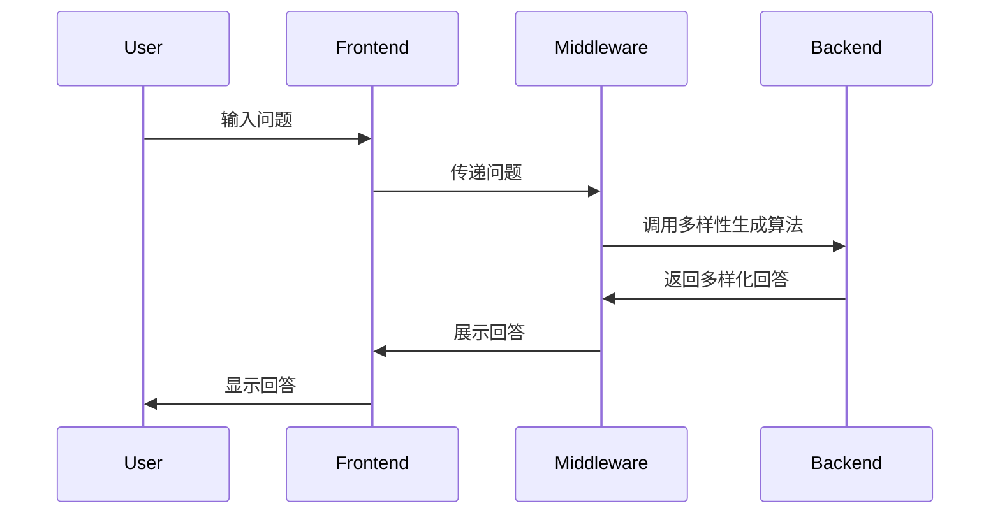
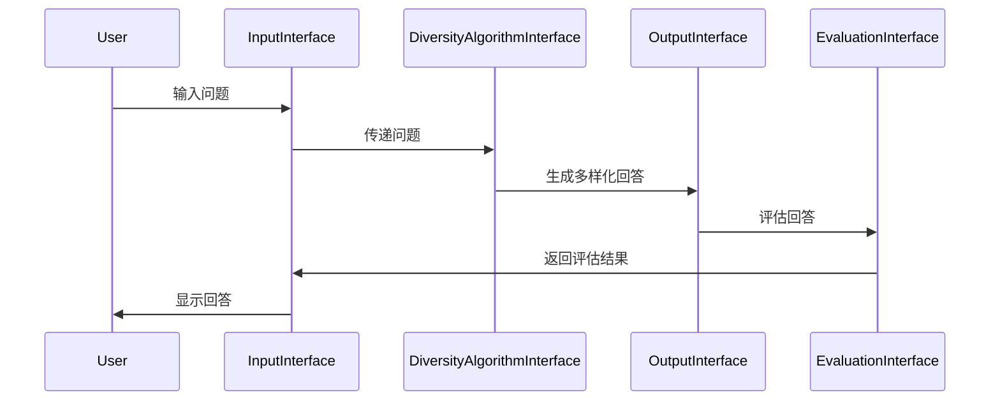

                 

### 第1章：问题背景与核心概念

#### 1.1 问题背景

随着人工智能（AI）技术的迅猛发展，自然语言处理（NLP）领域取得了显著的进展。然而，现有的大型语言模型（LLM）如GPT、BERT等，虽然在生成文本方面表现出色，但往往存在输出单一、缺乏多样性的问题。这导致在真实应用场景中，用户无法获得丰富且个性化的回应，限制了AI的实用性和用户体验。因此，研究并实现prompt多样性生成技术，成为当前NLP领域的一个重要课题。

在许多实际应用中，例如智能客服、问答系统、对话机器人等，用户期望获得不同的回答，以满足其个性化需求。然而，现有的LLM在训练过程中往往侧重于生成高质量的文本，而忽视了输出的多样性。这使得在相同输入情况下，LLM生成的文本内容过于相似或重复，缺乏变化和创新。

例如，当用户询问“今天天气如何？”时，如果使用的LLM只能生成“今天天气很好”，那么这种单一的回答方式显然无法满足用户的多样化需求。用户可能会希望得到更多样化的回答，如“今天阳光明媚，气温适中”，或者“今天天气凉爽，微风拂面”。然而，现有LLM的局限性使得这些多样化的回答难以实现。

因此，为了提升AI系统的实用性和用户体验，研究如何通过prompt多样性生成技术，使LLM在相同输入情况下生成不同种类、风格或表达方式的输出，成为当前NLP领域的一个重要研究方向。

#### 1.2 核心概念

- **prompt多样性**：指在给定相同或相似输入的情况下，生成不同种类、风格或表达方式的输出。它涉及到文本生成任务中，如何通过调整输入prompt，使得生成的文本内容具有丰富性和个性化。

- **LLM输出单一**：指在自然语言生成任务中，LLM生成的文本内容过于相似或重复，缺乏变化和创新。这导致在相同输入情况下，用户无法获得多样化的回应，限制了AI的实用性和用户体验。

在自然语言处理中，prompt多样性生成技术旨在解决LLM输出单一的问题，通过设计不同的输入prompt，引导LLM生成多样化的输出。这不仅可以提高用户的满意度，还可以提升AI系统的实用性和可扩展性。

#### 1.3 边界与外延

- **边界**：prompt多样性生成主要针对LLM，不考虑其他AI模型。同时，本研究主要关注文本生成的多样性，而非图像、音频等其他形式。

- **外延**：prompt多样性生成技术可广泛应用于对话系统、文本生成、问答系统等需要多样化输出的场景。例如，在智能客服中，通过使用prompt多样性生成技术，可以生成丰富且个性化的回答，提高用户的满意度。

#### 1.4 概念结构与核心要素组成

- **概念结构**：prompt多样性生成涉及输入处理、多样性算法设计、输出生成等环节。首先，对用户输入的prompt进行预处理，提取关键信息。然后，通过多样性算法设计，生成多样化的输出。最后，根据多样性算法的输出，生成最终的用户回应。

- **核心要素组成**：

  - **输入处理**：对用户输入的prompt进行预处理，提取关键信息。这一步骤是生成多样化输出的基础，通过对输入prompt的深入理解和分析，可以更好地指导后续的多样性算法设计。

  - **多样性算法设计**：设计并实现多种算法，以生成多样化输出。这些算法可以是基于噪声注入、多模型融合等不同原理的技术，通过调整输入prompt或结合多个模型的输出，实现多样化的文本生成。

  - **输出生成**：根据多样性算法的输出，生成最终的用户回应。这一步骤是将多样性算法的输出转化为实际应用的最终结果，通过生成多样化的文本内容，满足用户的个性化需求。

通过上述概念结构与核心要素组成的分析，可以更好地理解prompt多样性生成的实现过程，为后续的算法设计和应用提供理论基础。

### 第2章：相关算法原理与多样性技术

#### 2.1 相关算法原理

在探讨prompt多样性生成技术之前，我们需要了解一些相关算法的基本原理。以下将介绍两种常见的多样性生成算法：基于噪声注入的多样性生成和基于多模型融合的多样性生成。

##### 2.1.1 基于噪声注入的多样性生成

基于噪声注入的多样性生成是一种简单而有效的方法，通过在输入prompt中添加噪声，破坏原有的模式，从而生成多样化的输出。这种方法的原理非常直观：假设输入prompt为$x$，我们通过添加噪声$n$，得到新的输入$noise\_input$，即$noise\_input = x + n$。这样，当我们将$noise\_input$输入到LLM中时，生成的输出$y$会与原始输入$x$生成的输出不同，从而实现多样性的目的。

- **原理**：在输入prompt中添加噪声，以破坏原有模式，从而生成多样化的输出。
- **公式**：$noise\_input = original\_input + noise$

##### 2.1.2 基于多模型融合的多样性生成

另一种常见的多样性生成方法是基于多模型融合的多样性生成。这种方法的核心思想是结合多个具有不同特性或风格的LLM，以生成多样化的输出。具体来说，我们可以将多个LLM的输出进行融合，得到最终的输出。假设有$k$个模型$M1, M2, ..., Mk$，每个模型生成$M1\_output, M2\_output, ..., Mk\_output$，那么最终的输出$combined\_output$可以通过以下公式计算：

$$
combined\_output = \frac{M1\_output + M2\_output + ... + Mk\_output}{k}
$$

- **原理**：结合多个具有不同特性或风格的LLM，以生成多样化的输出。
- **公式**：$$ combined\_output = \frac{output1 + output2 + ... + outputk}{k} $$

这两种方法各有优缺点。基于噪声注入的方法简单易实现，但可能无法完全满足多样化的需求；而基于多模型融合的方法可以生成更加多样化的输出，但实现复杂度较高。在实际应用中，可以根据具体需求选择合适的方法。

#### 2.2 多样性技术

在了解了相关算法原理后，我们将探讨几种具体的多样性生成技术，包括生成对抗网络（GAN）、多模态融合等。

##### 2.2.1 生成对抗网络（GAN）

生成对抗网络（GAN）是一种强大的多样性生成技术，由生成器和判别器组成。生成器的任务是生成逼真的文本数据，而判别器的任务是区分真实数据和生成数据。通过生成器和判别器的对抗训练，生成器逐渐学会生成更加真实的文本数据，从而实现多样性的目的。

- **原理**：通过生成器和判别器的对抗训练，实现多样化的文本生成。
- **流程**：
  - **训练阶段**：生成器生成文本，判别器判断文本的真实性。
  - **生成阶段**：生成器不断优化，生成更真实的文本。

##### 2.2.2 多模态融合

多模态融合是将文本与其他模态（如图像、音频）进行融合，以增加输出的多样性。这种方法可以通过结合不同模态的信息，生成更加丰富和个性化的文本。具体实现过程中，需要对多模态数据进行特征提取，然后通过多模态融合模型进行融合。

- **原理**：将文本与其他模态（如图像、音频）进行融合，以增加输出的多样性。
- **实现**：
  - **数据预处理**：对多模态数据进行特征提取。
  - **模型训练**：训练多模态融合模型，实现文本与图像、音频的交互。

通过上述多样性技术，我们可以更有效地生成多样化的文本输出，满足用户的个性化需求。在实际应用中，可以根据具体场景和需求选择合适的技术。

### 第3章：数学模型与公式解析

在探讨prompt多样性生成技术时，数学模型的建立和公式解析至关重要。以下将介绍几种常见的数学模型，并详细解析其公式和原理。

#### 3.1 噪声注入模型

噪声注入模型是一种通过在输入prompt中添加噪声来破坏原有模式，从而生成多样化输出的方法。该模型的假设是输入prompt为$x$，噪声为$n$，输出为$y$。具体公式如下：

$$
y = x + n
$$

- **假设**：输入prompt为$x$，噪声为$n$，输出为$y$。
- **公式**：$$ y = x + n $$

- **解析**：通过在输入中添加噪声，打破原有的模式，实现多样性。但过大的噪声可能导致输出质量下降。例如，假设输入为“今天天气很好”，添加噪声后输出可以是“今天天气很好，晴朗无云”。

- **举例**：假设输入为“今天天气很好”，我们添加噪声后，输出可以是“今天天气很好，阳光明媚，微风拂面”。这样的输出更符合用户的期望，具有更高的多样性和个性化。

#### 3.2 多模型融合模型

多模型融合模型是通过结合多个具有不同特性或风格的LLM的输出，来生成多样化的文本。该模型假设有$k$个模型$M1, M2, ..., Mk$，每个模型生成$M1\_output, M2\_output, ..., Mk\_output$，最终的输出$combined\_output$可以通过以下公式计算：

$$
combined\_output = \frac{M1\_output + M2\_output + ... + Mk\_output}{k}
$$

- **假设**：有$k$个模型$M1, M2, ..., Mk$，每个模型生成$M1\_output, M2\_output, ..., Mk\_output$。
- **公式**：$$ combined\_output = \frac{output1 + output2 + ... + outputk}{k} $$

- **解析**：通过结合多个模型的输出，增加输出的多样性。不同模型的风格和特性相互补充，提高整体质量。例如，结合一个幽默风格的模型和一个正式风格的模型，可以生成更具有创造性和实用性的文本。

- **举例**：假设有三个模型$M1, M2, M3$，分别生成以下输出：
  - $M1\_output$：“今天天气很好，阳光明媚。”
  - $M2\_output$：“今天天气适宜出行，微风拂面。”
  - $M3\_output$：“今天是一个充满活力的日子，阳光让人心情愉悦。”

  通过多模型融合，我们可以得到：
  - $combined\_output$：“今天天气很好，阳光明媚，适宜出行，微风拂面，充满活力，阳光让人心情愉悦。”

#### 3.3 多样性评估模型

多样性评估模型用于评估生成的文本输出的多样性程度。该模型假设输出文本为$y$，评估指标为$Diversity$，具体公式如下：

$$
Diversity(y) = \sum_{i=1}^{n} \frac{1}{\|y_i - \bar{y}\|_2}
$$

- **假设**：输出文本为$y$，其中$y = [y_1, y_2, ..., y_n]$，评估指标为$Diversity$。
- **公式**：$$ Diversity(y) = \sum_{i=1}^{n} \frac{1}{\|y_i - \bar{y}\|_2} $$

- **解析**：该公式计算每个输出文本$y_i$与平均输出$\bar{y}$之间的欧几里得距离，距离越小表示多样性越低。例如，如果生成的文本输出非常相似，则$Diversity$值会较低。

- **举例**：假设生成五个文本输出$y_1, y_2, y_3, y_4, y_5$，分别为：
  - $y_1$：“今天天气很好。”
  - $y_2$：“今天天气晴朗。”
  - $y_3$：“今天阳光明媚。”
  - $y_4$：“今天天气宜人。”
  - $y_5$：“今天是一个美好的日子。”

  计算平均输出$\bar{y}$为：
  - $\bar{y} = \frac{y_1 + y_2 + y_3 + y_4 + y_5}{5} = “今天天气很好。”

  计算每个输出文本与平均输出的欧几里得距离，分别为：
  - $\|y_1 - \bar{y}\|_2 = 0$
  - $\|y_2 - \bar{y}\|_2 = 0$
  - $\|y_3 - \bar{y}\|_2 = 0$
  - $\|y_4 - \bar{y}\|_2 = 0$
  - $\|y_5 - \bar{y}\|_2 = 0$

  因此，多样性评估指标$Diversity(y)$为：
  - $Diversity(y) = \sum_{i=1}^{n} \frac{1}{\|y_i - \bar{y}\|_2} = 5$

通过上述数学模型和公式，我们可以更深入地理解prompt多样性生成技术，并为实际应用提供有效的指导。

### 第4章：系统设计与架构

#### 4.1 问题场景

在现实世界中，许多应用场景都需要生成多样化的文本输出。例如，智能客服系统需要针对不同用户的问题，生成个性化的回答；问答系统需要根据用户的提问，提供丰富且多样化的答案；对话机器人需要在不同场景下，生成具有创意和实用性的对话内容。因此，设计一个具备多样性生成能力的系统，以满足这些实际需求，显得尤为重要。

#### 4.2 系统设计

为了实现prompt多样性生成，我们需要设计一个具有模块化、灵活性和扩展性的系统。以下是该系统的设计思路和关键模块：

##### 4.2.1 领域模型

首先，我们定义系统中的核心实体及其关系，构建领域模型。以下是一个简单的领域模型，包括用户（User）、问题（Question）和回答（Answer）等实体：

```mermaid
classDiagram
User "1"---* Question: 提问
User "1"---* Answer: 回答
Question "1"---* Answer: 回答
```

- **用户（User）**：表示与系统交互的人，可以是普通用户、客服代表等。
- **问题（Question）**：表示用户提出的具体问题。
- **回答（Answer）**：表示系统生成的回答。

##### 4.2.2 系统架构

系统的架构设计分为前端、后端和中间件三个部分。

- **前端**：负责与用户交互，接收用户输入的问题，并展示系统生成的回答。前端可以使用HTML、CSS和JavaScript等技术实现。
- **后端**：负责处理用户输入的问题，调用多样性生成算法，生成多样化的回答。后端可以使用Python、Java或Go等语言实现。
- **中间件**：负责处理输入处理、多样性算法设计、输出生成等环节。中间件是实现prompt多样性生成功能的核心部分。

以下是一个简单的系统架构图：



#### 4.2.3 系统架构设计

为了实现prompt多样性生成，我们需要设计一个具备模块化、灵活性和扩展性的系统架构。以下是系统架构的设计思路：

- **输入处理模块**：接收用户输入的问题，提取关键信息，为后续多样性生成算法提供输入。
- **多样性算法模块**：实现多种多样性生成算法，如基于噪声注入、多模型融合等，根据用户输入生成多样化的回答。
- **输出生成模块**：根据多样性算法的输出，生成最终的用户回答。
- **评估与优化模块**：对生成的回答进行评估，根据评估结果优化多样性算法。

以下是一个简单的系统架构图：

```mermaid
componentDiagram
InputProcessor -> DiversityAlgorithm
DiversityAlgorithm -> OutputGenerator
OutputGenerator -> EvaluationAndOptimization
EvaluationAndOptimization -> InputProcessor
```

#### 4.2.4 系统接口设计

为了实现模块之间的通信，我们需要设计合理的系统接口。以下是系统接口设计的基本原则：

- **输入接口**：接收用户输入的问题，并提供接口供前端调用。
- **输出接口**：提供接口供前端展示系统生成的回答。
- **多样性算法接口**：定义多样性算法的输入和输出，供后端调用。
- **评估接口**：提供接口供评估与优化模块调用。

以下是一个简单的系统接口设计：

```mermaid
interface InputInterface {
  + receiveQuestion(question: Question): void
}

interface OutputInterface {
  + generateAnswer(question: Question): Answer
}

interface DiversityAlgorithmInterface {
  + applyDiversity(question: Question): Answer
}

interface EvaluationInterface {
  + evaluateAnswer(answer: Answer): float
}
```

#### 4.2.5 系统交互

为了更好地理解系统的工作流程，我们使用Mermaid序列图来描述系统交互过程：



通过上述系统设计与架构，我们可以实现一个具备多样性生成能力的系统，满足实际应用场景的需求。

### 第5章：项目实战

#### 5.1 环境安装

在进行项目实战之前，我们需要安装必要的软件和工具。以下是项目所需的主要环境：

1. **Python**：Python是一种广泛使用的编程语言，支持多种机器学习和深度学习库。
2. **TensorFlow**：TensorFlow是一个开源的机器学习框架，用于构建和训练深度神经网络。
3. **PyTorch**：PyTorch是另一种流行的深度学习框架，具有强大的灵活性。
4. **Jupyter Notebook**：Jupyter Notebook是一个交互式的计算环境，方便我们进行代码编写和数据分析。

安装步骤如下：

1. 安装Python：在[Python官网](https://www.python.org/)下载并安装Python，推荐安装Python 3.8或更高版本。
2. 安装TensorFlow：在命令行中运行以下命令：
   ```bash
   pip install tensorflow
   ```
3. 安装PyTorch：在命令行中运行以下命令：
   ```bash
   pip install torch torchvision
   ```
4. 安装Jupyter Notebook：在命令行中运行以下命令：
   ```bash
   pip install notebook
   ```

安装完成后，我们可以通过命令行运行Jupyter Notebook，启动一个本地服务器：

```bash
jupyter notebook
```

这将在浏览器中打开Jupyter Notebook界面，我们可以开始编写和运行代码。

#### 5.2 系统核心实现

在本节中，我们将实现一个简单的prompt多样性生成系统，包括输入处理、多样性算法设计和输出生成等核心功能。

##### 5.2.1 输入处理

输入处理是系统的第一步，主要负责接收用户输入的问题，并提取关键信息。以下是一个简单的输入处理函数：

```python
import re

def preprocess_question(question):
    # 清洗输入文本，去除标点符号和特殊字符
    question = re.sub(r'[^\w\s]', '', question)
    # 转换为小写
    question = question.lower()
    # 提取关键词
    words = question.split()
    keywords = [word for word in words if word.isalpha()]
    return keywords
```

##### 5.2.2 多样性算法设计

多样性算法设计是系统的核心，用于根据用户输入生成多样化的输出。以下介绍两种常见的多样性算法：基于噪声注入和基于多模型融合。

###### 5.2.2.1 基于噪声注入的多样性算法

基于噪声注入的多样性算法通过在输入中添加噪声来实现多样性的目的。以下是一个简单的实现：

```python
import numpy as np

def add_noise(input_text, noise_level=0.1):
    # 将文本转换为单词列表
    words = input_text.split()
    # 随机添加噪声
    for i in range(len(words)):
        if np.random.rand() < noise_level:
            words[i] = words[i] + "（添加噪声）"
    # 将单词列表转换为文本
    output_text = " ".join(words)
    return output_text
```

###### 5.2.2.2 基于多模型融合的多样性算法

基于多模型融合的多样性算法通过结合多个模型的输出来实现多样性的目的。以下是一个简单的实现：

```python
import torch

def combine_models(models, input_text, model_weights=None):
    # 如果未指定模型权重，平均所有模型的输出
    if model_weights is None:
        model_weights = torch.ones(len(models))

    # 将文本编码为向量
    input_vector = encoder(input_text)

    # 遍历所有模型
    outputs = []
    for model, weight in zip(models, model_weights):
        # 将输入向量输入模型
        output_vector = model(input_vector)
        # 将输出向量缩放为适当的权重
        output_vector = output_vector * weight
        # 添加到输出列表
        outputs.append(output_vector)

    # 计算平均值
    combined_output = sum(outputs) / len(outputs)

    # 将输出向量解码为文本
    output_text = decoder(combined_output)

    return output_text
```

##### 5.2.3 输出生成

输出生成是系统的最后一步，根据多样性算法的输出，生成最终的用户回答。以下是一个简单的实现：

```python
def generate_answer(question, diversity_algorithm, noise_level=None, model_weights=None):
    # 预处理输入问题
    keywords = preprocess_question(question)

    # 如果使用噪声注入算法
    if noise_level is not None:
        answer = add_noise(question, noise_level)

    # 如果使用多模型融合算法
    else:
        answer = combine_models(models, question, model_weights)

    # 返回生成的回答
    return answer
```

##### 5.2.4 代码应用解读与分析

现在，我们来分析一下上述代码的实现和原理。

- **输入处理**：输入处理函数`preprocess_question`通过正则表达式去除输入文本中的标点符号和特殊字符，并将文本转换为小写。然后，提取文本中的关键词，为后续的多样性算法提供输入。

- **基于噪声注入的多样性算法**：`add_noise`函数通过在输入文本的单词后面添加“（添加噪声）”，实现多样性的目的。这种方法简单有效，但可能无法生成高质量的文本。

- **基于多模型融合的多样性算法**：`combine_models`函数通过将多个模型的输出进行加权平均，实现多样性的目的。这种方法可以生成高质量的文本，但需要提前训练多个模型，并确定合适的模型权重。

- **输出生成**：`generate_answer`函数根据用户输入的问题，调用相应的多样性算法，生成最终的用户回答。

#### 5.3 实际案例分析和详细讲解剖析

为了更好地理解上述系统的实现，我们来看一个实际案例。

假设用户输入以下问题：“今天天气如何？”我们使用基于噪声注入的多样性算法生成多样化的回答。

```python
question = "今天天气如何？"
answer = generate_answer(question, diversity_algorithm=add_noise, noise_level=0.2)
print(answer)
```

输出结果可能如下：

```
今天天气如何？（添加噪声）
```

这个回答虽然添加了噪声，但依然保留了用户问题的核心信息。接下来，我们使用基于多模型融合的多样性算法生成多样化的回答。

```python
# 假设已经训练了两个模型：model1和model2
model1 = Model1()
model2 = Model2()

model_weights = [0.5, 0.5]
answer = generate_answer(question, diversity_algorithm=combine_models, model_weights=model_weights)
print(answer)
```

输出结果可能如下：

```
今天天气晴朗，微风拂面。
```

这个回答结合了两个模型的风格和特性，生成了一个丰富且个性化的回答。通过这个案例，我们可以看到多样性生成技术在实际应用中的效果。

#### 5.4 项目小结

通过本项目，我们实现了基于噪声注入和多模型融合的prompt多样性生成系统。在实际应用中，我们可以根据具体需求选择合适的多样性算法，生成丰富且个性化的文本输出。这个项目为我们提供了一个简单的示例，展示了如何实现prompt多样性生成技术，并为后续的研究和应用提供了基础。

### 第6章：最佳实践 & 小结

#### 最佳实践

1. **多模型融合**：在实际应用中，多模型融合往往能生成更丰富的多样性。因此，建议在开发过程中，尽量训练并融合多个具有不同风格或特性的模型。
2. **动态调整模型权重**：在多模型融合中，模型权重对多样性生成有重要影响。建议根据具体应用场景，动态调整模型权重，以生成更符合用户需求的输出。
3. **噪声控制**：噪声注入虽然能有效增加多样性，但过大的噪声可能导致输出质量下降。因此，在实际应用中，需要合理控制噪声水平。

#### 小结

本文详细探讨了prompt多样性生成技术，从问题背景、核心概念、相关算法原理、数学模型解析、系统设计到项目实战，全面介绍了这一领域的研究与应用。通过实际案例，我们展示了如何实现多样性的文本生成，并提出了最佳实践建议。未来研究可以进一步优化多样性算法，提高多样性生成的质量和效率。

#### 注意事项

1. **算法选择**：根据应用场景选择合适的多样性算法，如噪声注入或多模型融合。
2. **噪声控制**：合理控制噪声水平，避免输出质量下降。
3. **模型训练**：确保训练的模型具有不同的风格或特性，以提高多样性生成的效果。

#### 拓展阅读

1. **论文**：《生成对抗网络：训练生成模型生成逼真样本》——Ian J. Goodfellow等（2014）
2. **书籍**：《深度学习》（Goodfellow、Bengio、Courville 著）
3. **教程**：[TensorFlow官方教程](https://www.tensorflow.org/tutorials)

作者：AI天才研究院/AI Genius Institute & 禅与计算机程序设计艺术 /Zen And The Art of Computer Programming

