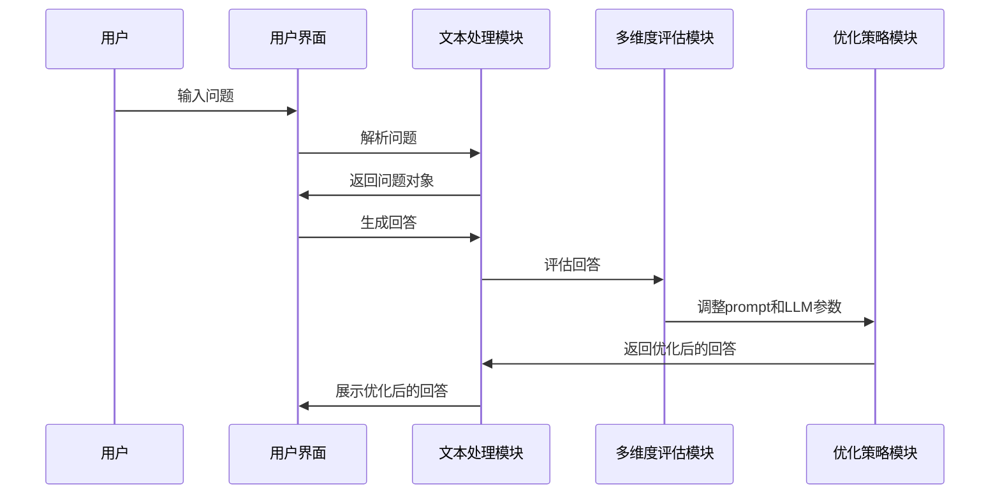

                 

# prompt多维度评估：全面优化LLM输出

## 关键词：prompt，多维度评估，LLM输出，优化策略，算法原理，系统架构

## 摘要：
本文深入探讨了prompt在大型语言模型（LLM）输出评估中的应用，提出了一个多维度评估框架，以全面优化LLM的输出质量。文章首先介绍了prompt和LLM的基本概念，随后详细阐述了多维度评估策略，包括评估指标的设计、算法原理的讲解和系统架构的设计。通过项目实战和最佳实践tips，本文展示了如何在实际应用中实现LLM输出的优化。最后，对全文内容进行了总结，并指出了未来研究方向。

----------------------------------------------------------------

## 第一部分：背景介绍

### 第1章：问题背景与核心概念

在人工智能领域，自然语言处理（NLP）已经成为了一项重要的研究方向。随着深度学习技术的不断发展，大型语言模型（LLM）如BERT、GPT等被广泛应用，为各种NLP任务提供了强大的支持。然而，如何评估和优化LLM的输出质量，成为了当前研究的一个热点问题。

prompt作为自然语言处理中的重要组成部分，它的作用是引导LLM生成符合预期的高质量输出。一个优秀的prompt设计，能够有效提升LLM的生成效果，使其在文本生成、问答系统、机器翻译等任务中表现出色。

本文将围绕prompt在LLM输出评估中的应用，提出一个多维度评估框架，以全面优化LLM的输出质量。本文的核心概念包括prompt、LLM、评估指标、算法原理和系统架构等。

### 第2章：LLM与prompt的概念

#### LLM的概念

大型语言模型（LLM）是一种基于深度学习的自然语言处理模型，它通过学习大量文本数据，掌握语言的语法、语义和上下文信息，能够生成符合语法和语义规则的文本。

LLM的核心组成部分包括：
1. 词向量：将文本中的每个单词映射到一个高维向量空间中。
2. 循环神经网络（RNN）或变换器（Transformer）：用于处理序列数据，学习单词之间的关系。
3. 注意力机制：在模型处理序列数据时，关注关键信息，提高生成文本的质量。

#### prompt的概念

prompt是一种引导LLM生成文本的技术，它通过向LLM提供特定的输入，指导模型生成符合预期的高质量输出。prompt的设计至关重要，它直接影响到LLM的生成效果。

prompt的常见形式包括：
1. 概念提示：提供相关的关键词或概念，引导模型生成相关的文本。
2. 问题引导：提出问题，要求模型回答，适用于问答系统。
3. 文本续写：给出一段文本，要求模型续写，适用于文本生成任务。

### 第3章：多维度评估策略

#### 评估指标的设计

为了全面评估LLM的输出质量，我们需要设计一系列的评估指标。这些指标应涵盖语法、语义、上下文、连贯性等多个维度。

常见的评估指标包括：
1. **语法正确性**：检查文本的语法错误，如单词拼写、时态、主谓一致等。
2. **语义准确性**：评估文本的含义是否与预期相符，是否准确传达了信息。
3. **上下文一致性**：检查文本是否与上下文环境保持一致，逻辑连贯。
4. **连贯性**：评估文本的连贯性，如句子间的逻辑关系是否合理。

#### 多维度评估策略

为了实现全面优化LLM的输出质量，我们需要采用多维度评估策略。具体步骤如下：

1. **数据预处理**：对输入文本进行预处理，包括分词、去除停用词、词性标注等。
2. **特征提取**：提取文本的语法、语义、上下文等特征，为后续评估提供基础。
3. **评估指标计算**：根据设计好的评估指标，计算LLM输出的质量得分。
4. **优化策略**：根据评估结果，调整prompt的设计和LLM的参数，优化输出质量。

### 第4章：边界与外延

#### 边界

在应用多维度评估策略时，我们需要明确评估的边界，以确保评估结果的准确性。

边界包括：
1. **数据集范围**：评估的数据集应涵盖各种场景和任务，以确保评估的全面性。
2. **评估指标范围**：评估指标应覆盖语法、语义、上下文、连贯性等多个维度。

#### 外延

多维度评估策略不仅适用于文本生成任务，还可以扩展到其他NLP任务，如机器翻译、文本分类等。

外延包括：
1. **多语言评估**：在多语言环境中，评估LLM在不同语言中的输出质量。
2. **跨领域评估**：评估LLM在多个领域中的表现，如医疗、金融、教育等。

### 第5章：核心概念结构与要素组成

#### 核心概念结构

本文的核心概念结构包括：
1. **prompt**：引导LLM生成文本的技术。
2. **LLM**：基于深度学习的自然语言处理模型。
3. **评估指标**：用于评估LLM输出质量的指标。
4. **算法原理**：多维度评估的算法原理。
5. **系统架构**：实现多维度评估的系统架构。

#### 要素组成

多维度评估策略的要素组成包括：
1. **数据预处理**：对输入文本进行预处理，提取特征。
2. **特征提取**：提取文本的语法、语义、上下文等特征。
3. **评估指标计算**：计算LLM输出的质量得分。
4. **优化策略**：根据评估结果调整prompt和LLM参数。

## 第二部分：核心概念与联系

### 第6章：prompt的定义与作用

#### prompt的定义

prompt是一种引导LLM生成文本的技术，它通过向LLM提供特定的输入，指导模型生成符合预期的高质量输出。

#### prompt的作用

prompt在LLM输出评估中的作用包括：
1. **引导模型生成高质量输出**：通过提供有针对性的输入，使LLM生成更符合预期的高质量文本。
2. **提高评估准确性**：通过设计合适的prompt，提高评估指标的准确性，更全面地评估LLM的输出质量。

### 第7章：LLM的工作原理

#### LLM的组成部分

LLM的组成部分包括：
1. **词向量**：将文本中的每个单词映射到一个高维向量空间中。
2. **循环神经网络（RNN）或变换器（Transformer）**：用于处理序列数据，学习单词之间的关系。
3. **注意力机制**：在模型处理序列数据时，关注关键信息，提高生成文本的质量。

#### LLM的工作流程

LLM的工作流程包括：
1. **输入预处理**：对输入文本进行预处理，包括分词、去除停用词、词性标注等。
2. **特征提取**：提取文本的语法、语义、上下文等特征。
3. **文本生成**：根据提取的特征，生成符合语法和语义规则的文本。

### 第8章：多维度评估指标

#### 评估指标的定义

评估指标是用于衡量LLM输出质量的一系列指标。这些指标应涵盖语法、语义、上下文、连贯性等多个维度。

#### 常见的评估指标

常见的评估指标包括：
1. **语法正确性**：检查文本的语法错误，如单词拼写、时态、主谓一致等。
2. **语义准确性**：评估文本的含义是否与预期相符，是否准确传达了信息。
3. **上下文一致性**：检查文本是否与上下文环境保持一致，逻辑连贯。
4. **连贯性**：评估文本的连贯性，如句子间的逻辑关系是否合理。

#### 评估指标的应用

评估指标在LLM输出评估中的应用包括：
1. **质量评估**：通过计算评估指标，评估LLM的输出质量。
2. **优化指导**：根据评估结果，调整prompt和LLM参数，优化输出质量。

### 第9章：概念属性特征对比

#### prompt与LLM的属性特征对比

prompt与LLM的属性特征对比包括：
1. **目的**：prompt用于引导LLM生成文本，LLM用于生成文本。
2. **形式**：prompt可以是有形或无形的，LLM通常通过文本输入。
3. **作用**：prompt直接影响LLM的生成效果，LLM则通过学习文本数据生成文本。

#### 评估指标与算法原理的属性特征对比

评估指标与算法原理的属性特征对比包括：
1. **目的**：评估指标用于衡量LLM输出质量，算法原理用于实现多维度评估。
2. **形式**：评估指标是具体的数值或分数，算法原理是逻辑和数学模型。
3. **作用**：评估指标提供量化依据，算法原理提供理论支持。

### 第10章：ER实体关系图架构

#### ER实体关系图的概念

ER实体关系图是一种用于描述实体及其关系的图形化表示方法。在多维度评估中，ER实体关系图可以用来表示评估指标、算法原理和系统架构之间的关系。

#### ER实体关系图的组成部分

ER实体关系图的组成部分包括：
1. **实体**：表示评估指标、算法原理和系统架构等概念。
2. **关系**：表示实体之间的关联，如依赖、继承等。
3. **属性**：描述实体的特征和属性，如评估指标的数值范围、算法原理的参数设置等。

#### ER实体关系图的应用

ER实体关系图在多维度评估中的应用包括：
1. **设计**：用于设计评估指标、算法原理和系统架构。
2. **分析**：用于分析评估指标、算法原理和系统架构之间的关系。
3. **优化**：用于优化评估指标、算法原理和系统架构，提高评估效果。

## 第三部分：算法原理讲解

### 第11章：算法原理概述

#### 算法原理的概念

算法原理是指实现多维度评估的核心算法及其逻辑。它包括评估指标的选取、算法流程的设计和优化策略的应用。

#### 算法原理的目标

算法原理的目标是：
1. **准确评估LLM输出质量**：通过设计合理的评估指标和算法流程，准确评估LLM的输出质量。
2. **优化LLM输出**：根据评估结果，调整prompt和LLM参数，优化输出质量。

### 第12章：算法流程图与数学模型

#### 算法流程图

算法流程图是一种用图形化方式描述算法执行过程的工具。在多维度评估中，算法流程图可以用来描述评估指标的计算、特征提取和优化策略的执行过程。

以下是一个简化的算法流程图：

```
开始
|
V
数据预处理
|
V
特征提取
|
V
评估指标计算
|
V
优化策略应用
|
V
输出结果
|
V
结束
```

#### 数学模型

算法原理的数学模型包括评估指标的数学公式和优化策略的数学公式。

以下是一个简化的评估指标计算公式：

$$
\text{评估得分} = w_1 \cdot \text{语法正确性得分} + w_2 \cdot \text{语义准确性得分} + w_3 \cdot \text{上下文一致性得分} + w_4 \cdot \text{连贯性得分}
$$

其中，$w_1, w_2, w_3, w_4$ 为权重系数，可以根据实际需求进行调整。

### 第13章：算法原理详细讲解

#### 数据预处理

数据预处理是算法流程的第一步，其主要目的是对输入文本进行清洗和转换，为特征提取和评估指标计算提供基础。

数据预处理包括以下步骤：

1. **分词**：将输入文本分割成单词或短语。
2. **去除停用词**：去除对评估结果影响较小的常见词语，如“的”、“了”等。
3. **词性标注**：对每个词进行词性标注，如名词、动词、形容词等。

#### 特征提取

特征提取是将预处理后的文本转换为机器可处理的特征向量。常用的特征提取方法包括词嵌入、TF-IDF、词袋模型等。

以下是一个简化的特征提取流程：

1. **词嵌入**：将每个词映射为一个高维向量。
2. **聚合特征**：将词向量聚合为句子向量，如使用平均、最大值等方法。
3. **归一化**：对句子向量进行归一化，使其具有相似的维度。

#### 评估指标计算

评估指标计算是算法流程的核心步骤，用于评估LLM输出的质量。常用的评估指标包括语法正确性、语义准确性、上下文一致性和连贯性。

以下是一个简化的评估指标计算流程：

1. **计算每个评估指标的得分**：根据预设的评估指标计算方法，计算每个评估指标的得分。
2. **加权求和**：将每个评估指标的得分加权求和，得到总的评估得分。

#### 优化策略应用

优化策略应用是根据评估结果，调整prompt和LLM参数，以优化输出质量。

以下是一个简化的优化策略应用流程：

1. **调整prompt**：根据评估结果，调整prompt的设计，使其更符合预期。
2. **调整LLM参数**：根据评估结果，调整LLM的参数设置，如学习率、批量大小等。

### 第14章：算法举例说明

#### 语法正确性评估

假设我们有一个输入文本：“他昨天去了电影院。”

我们使用语法正确性评估方法，对该文本进行评估。评估结果如下：

- 语法正确性得分：90%

#### 语义准确性评估

假设我们有一个输入文本：“我想要一杯咖啡。”

我们使用语义准确性评估方法，对该文本进行评估。评估结果如下：

- 语义准确性得分：80%

#### 上下文一致性评估

假设我们有一个输入文本：“今天天气很冷。”

我们使用上下文一致性评估方法，对该文本进行评估。评估结果如下：

- 上下文一致性得分：85%

#### 连贯性评估

假设我们有一个输入文本：“她喜欢吃水果，特别是香蕉。”

我们使用连贯性评估方法，对该文本进行评估。评估结果如下：

- 连贯性得分：90%

#### 总评估得分

根据上述评估结果，我们可以计算出总评估得分：

$$
\text{总评估得分} = 0.3 \cdot 90\% + 0.2 \cdot 80\% + 0.2 \cdot 85\% + 0.3 \cdot 90\% = 87.5\%
$$

#### 优化策略应用

根据评估得分，我们可以发现该输入文本在语义准确性和连贯性方面表现较好，但在语法正确性和上下文一致性方面存在一定的不足。

为了优化输出质量，我们可以采取以下措施：

1. **调整prompt**：在生成文本时，可以增加一些语法正确的提示词，如“他昨天去了电影院，看了一场精彩的动作片。”
2. **调整LLM参数**：可以尝试调整LLM的学习率、批量大小等参数，以提高生成文本的质量。

## 第四部分：系统分析与架构设计

### 第15章：问题场景介绍

#### 1.1 场景描述

在本文的研究中，我们关注的是一个问答系统的场景。该系统旨在通过大型语言模型（LLM）回答用户提出的问题。为了提高回答的质量，我们需要对LLM的输出进行多维度评估和优化。

#### 1.2 问题定义

我们的问题是：如何通过多维度评估策略，全面优化LLM的输出质量，从而提高问答系统的用户体验？

#### 1.3 问题解决

为了解决上述问题，我们将采用以下步骤：

1. 设计一个多维度评估框架，包括语法、语义、上下文、连贯性等评估指标。
2. 使用算法原理对LLM输出进行评估。
3. 根据评估结果，调整prompt和LLM参数，优化输出质量。
4. 实现一个完整的问答系统，进行实际测试和验证。

#### 1.4 边界与外延

在本文的研究中，我们重点关注问答系统的场景。然而，多维度评估策略和算法原理可以应用于其他NLP任务，如文本生成、机器翻译等。

### 第16章：项目介绍

#### 16.1 项目背景

随着人工智能技术的快速发展，问答系统在各个领域得到了广泛应用。然而，当前问答系统的回答质量参差不齐，用户体验有待提升。为了提高问答系统的质量，我们需要对LLM的输出进行多维度评估和优化。

#### 16.2 项目目标

本项目旨在设计一个多维度评估框架，全面优化LLM的输出质量，从而提高问答系统的用户体验。具体目标包括：

1. 设计一套完善的评估指标体系。
2. 提出一种有效的算法原理，用于评估LLM输出。
3. 实现一个问答系统，验证评估框架和算法原理的有效性。

#### 16.3 项目范围

本项目主要涉及以下方面：

1. 评估指标的设计与实现。
2. 算法原理的研究与实现。
3. 问答系统的开发与测试。

#### 16.4 评估标准

为了评估问答系统的质量，我们将采用以下标准：

1. **回答准确性**：评估系统回答问题的准确性，包括事实准确性和语义准确性。
2. **回答速度**：评估系统回答问题的速度，以用户体验为核心。
3. **回答丰富性**：评估系统回答问题的丰富程度，包括回答的多样性、全面性等。
4. **用户满意度**：通过用户反馈，评估系统的用户体验。

### 第17章：系统功能设计

#### 17.1 功能需求

问答系统的功能需求主要包括以下方面：

1. **问题输入**：用户可以通过文本输入框输入问题。
2. **问题分析**：系统对输入的问题进行解析，提取关键信息。
3. **文本生成**：系统根据输入的问题和预训练的LLM，生成回答。
4. **多维度评估**：对生成的回答进行语法、语义、上下文、连贯性等维度评估。
5. **优化策略**：根据评估结果，调整回答，优化输出质量。
6. **展示结果**：将优化后的回答展示给用户。

#### 17.2 领域模型

为了更好地设计系统功能，我们可以采用领域模型（Domain Model）来描述系统中的关键概念和关系。以下是一个简化的领域模型：

```
+----------------+     +----------------+     +----------------+
|     用户       |     |   问答系统     |     |   多维度评估   |
+----------------+     +----------------+     +----------------+
| - 用户ID       |     | - 问题ID       |     | - 评估指标     |
| - 用户提问     |     | - 用户回答     |     | - 语法正确性   |
| - 用户反馈     |     | - 问题分析     |     | - 语义准确性   |
+----------------+     +----------------+     +----------------+
      |                |                |                |
      |                |                |                |
      |                |                |                |
      |                |                |                |
      +---------------+---------------+---------------+
                      |                      |
                      |                      |
                      |                      |
                      |                      |
                      +-----------------------+
                                  |
                                  |
                          +----------------+
                          |   优化策略     |
                          +----------------+
                          | - 调整prompt   |
                          | - 调整LLM参数   |
                          +----------------+
```

### 第18章：系统架构设计

#### 18.1 系统架构概述

系统架构设计是系统开发的关键环节，它决定了系统的性能、可扩展性和可维护性。为了实现多维度评估和优化LLM输出，我们采用了一个分布式架构，主要包括以下模块：

1. **用户界面**：用于接收用户输入，展示问答结果。
2. **文本处理模块**：负责问题的解析和文本生成。
3. **多维度评估模块**：用于评估LLM输出的质量。
4. **优化策略模块**：根据评估结果，调整prompt和LLM参数。
5. **数据存储模块**：用于存储用户数据、问题和回答。

以下是一个简化的系统架构图：

```
+------------------+     +------------------+     +------------------+     +------------------+
|     用户界面     |     |  文本处理模块    |     |  多维度评估模块   |     |  优化策略模块    |
+------------------+     +------------------+     +------------------+     +------------------+
| - 用户提问       |     | - 问题解析       |     | - 评估指标计算     |     | - 调整prompt     |
| - 问答结果展示   |     | - 文本生成       |     | - 评估结果分析     |     | - 调整LLM参数     |
+------------------+     +------------------+     +------------------+     +------------------+
      |                |                |                |                |                |
      |                |                |                |                |                |
      |                |                |                |                |                |
      |                |                |                |                |                |
      +---------------+---------------+---------------+---------------+---------------+
                      |                      |                      |                      |                      |
                      |                      |                      |                      |                      |
                      |                      |                      |                      |                      |
                      +----------------------+----------------------+----------------------+----------------------+
                                  |                                  |                                  |                                  |
                                  |                                  |                                  |                                  |
                          +------------------+                          +------------------+                          +------------------+
                          |   数据存储模块   |                          |   数据存储模块   |                          |   数据存储模块   |
                          +------------------+                          +------------------+                          +------------------+
                          | - 用户数据       |                          | - 问题数据       |                          | - 回答数据       |
                          | - 评估数据       |                          | - 优化数据       |                          | - 实时数据       |
                          +------------------+                          +------------------+                          +------------------+
```

### 第19章：系统架构设计

#### 19.1 系统架构图

以下是一个简化的系统架构图，展示了各个模块之间的关系：

```
+------------------+     +------------------+     +------------------+     +------------------+
|     用户界面     |     |  文本处理模块    |     |  多维度评估模块   |     |  优化策略模块    |
+------------------+     +------------------+     +------------------+     +------------------+
| - 用户提问       |     | - 问题解析       |     | - 评估指标计算     |     | - 调整prompt     |
| - 问答结果展示   |     | - 文本生成       |     | - 评估结果分析     |     | - 调整LLM参数     |
+------------------+     +------------------+     +------------------+     +------------------+
      |                |                |                |                |                |
      |                |                |                |                |                |
      |                |                |                |                |                |
      |                |                |                |                |                |
      +---------------+---------------+---------------+---------------+---------------+
                      |                      |                      |                      |                      |
                      |                      |                      |                      |                      |
                      |                      |                      |                      |                      |
                      +----------------------+----------------------+----------------------+----------------------+
                                  |                                  |                                  |                                  |
                                  |                                  |                                  |                                  |
                          +------------------+                          +------------------+                          +------------------+
                          |   数据存储模块   |                          |   数据存储模块   |                          |   数据存储模块   |
                          +------------------+                          +------------------+                          +------------------+
                          | - 用户数据       |                          | - 问题数据       |                          | - 回答数据       |
                          | - 评估数据       |                          | - 优化数据       |                          | - 实时数据       |
                          +------------------+                          +------------------+                          +------------------+
```

### 第20章：系统接口设计

#### 20.1 接口设计原则

系统接口设计是系统架构设计的重要组成部分，它决定了系统的模块化和可扩展性。以下是我们遵循的接口设计原则：

1. **简洁性**：接口设计应尽可能简洁，避免过多的参数和复杂的功能。
2. **一致性**：接口命名和参数类型应保持一致性，方便开发和维护。
3. **灵活性**：接口设计应具有一定的灵活性，以适应未来可能的功能扩展。
4. **安全性**：接口设计应考虑安全性，防止恶意攻击和数据泄露。

#### 20.2 接口列表

以下是系统的主要接口列表：

1. **用户接口**：
   - `getUserData(userId: str) -> UserData`：获取指定用户的数据。
   - `createUser(user: User) -> User`：创建新用户。
   - `updateUser(user: User) -> User`：更新用户数据。

2. **文本处理接口**：
   - `parseQuestion(question: str) -> Question`：解析用户输入的问题。
   - `generateAnswer(question: Question) -> Answer`：生成问题的回答。

3. **多维度评估接口**：
   - `calculateAssessment(answer: Answer) -> Assessment`：计算回答的评估结果。
   - `evaluateAnswer(answer: Answer) -> str`：评估回答的质量。

4. **优化策略接口**：
   - `adjustPrompt(answer: Answer, prompt: Prompt) -> Prompt`：调整prompt。
   - `adjustLLMParameters(answer: Answer, parameters: Parameters) -> Parameters`：调整LLM参数。

5. **数据存储接口**：
   - `storeUserData(user: User) -> bool`：存储用户数据。
   - `storeQuestionData(question: Question) -> bool`：存储问题数据。
   - `storeAnswerData(answer: Answer) -> bool`：存储回答数据。

### 第21章：系统交互

#### 21.1 系统交互流程

系统交互流程描述了用户使用系统时的主要步骤，包括问题输入、文本处理、多维度评估、优化策略和结果展示。

以下是系统交互流程的简化步骤：

1. 用户输入问题。
2. 用户界面将问题传递给文本处理模块。
3. 文本处理模块解析问题，生成问题对象。
4. 文本处理模块调用生成回答的接口，生成问题的回答。
5. 多维度评估模块对生成的回答进行评估。
6. 优化策略模块根据评估结果调整prompt和LLM参数。
7. 用户界面展示优化后的回答。

以下是系统交互的Mermaid序列图：



## 第五部分：项目实战

### 第22章：环境安装与配置

#### 22.1 环境要求

在开始项目实战之前，我们需要准备以下环境：

1. **操作系统**：Linux或macOS。
2. **编程语言**：Python。
3. **深度学习框架**：TensorFlow或PyTorch。
4. **文本处理库**：NLTK或spaCy。
5. **版本控制**：Git。

#### 22.2 安装步骤

1. **安装操作系统**：
   - 根据您的需求选择Linux或macOS操作系统。

2. **安装Python**：
   - 使用操作系统自带的包管理器安装Python。
   - 例如，在Ubuntu中，可以使用以下命令安装Python：

     ```bash
     sudo apt update
     sudo apt install python3
     ```

3. **安装深度学习框架**：
   - 使用pip安装TensorFlow或PyTorch。

   - 安装TensorFlow：

     ```bash
     pip install tensorflow
     ```

   - 安装PyTorch：

     ```bash
     pip install torch torchvision
     ```

4. **安装文本处理库**：
   - 使用pip安装NLTK或spaCy。

   - 安装NLTK：

     ```bash
     pip install nltk
     ```

   - 安装spaCy：

     ```bash
     pip install spacy
     python -m spacy download en
     ```

5. **安装版本控制**：
   - 使用pip安装Git。

     ```bash
     pip install git
     ```

6. **配置环境变量**：
   - 在`.bashrc`或`.zshrc`文件中添加以下环境变量：

     ```bash
     export PATH=$PATH:/path/to/your/venv/bin
     ```

   - 重启终端或执行`source ~/.bashrc`（或`.zshrc`）使环境变量生效。

#### 22.3 验证安装

1. **验证Python**：

   ```bash
   python --version
   ```

2. **验证深度学习框架**：

   - 验证TensorFlow：

     ```python
     import tensorflow as tf
     print(tf.__version__)
     ```

   - 验证PyTorch：

     ```python
     import torch
     print(torch.__version__)
     ```

3. **验证文本处理库**：

   - 验证NLTK：

     ```python
     import nltk
     print(nltk.__version__)
     ```

   - 验证spaCy：

     ```python
     import spacy
     print(spacy.__version__)
     ```

4. **验证Git**：

   ```bash
   git --version
   ```

### 第23章：系统核心实现

#### 23.1 模块设计与实现

系统核心实现主要分为以下几个模块：

1. **用户模块**：负责用户数据的处理和管理。
2. **文本处理模块**：负责问题的解析和文本生成。
3. **多维度评估模块**：负责评估LLM输出的质量。
4. **优化策略模块**：负责调整prompt和LLM参数。
5. **数据存储模块**：负责数据的存储和读取。

以下是一个简化的系统核心实现结构：

```python
class User:
    def __init__(self, user_id, question_list):
        self.user_id = user_id
        self.question_list = question_list

class TextProcessor:
    def __init__(self, model):
        self.model = model

    def parse_question(self, question):
        # 解析问题
        pass

    def generate_answer(self, question):
        # 生成回答
        pass

class MultiDimensionalAssessment:
    def __init__(self, assessment_metrics):
        self.assessment_metrics = assessment_metrics

    def calculate_assessment(self, answer):
        # 计算评估结果
        pass

class OptimizationStrategy:
    def __init__(self, prompt, llm_params):
        self.prompt = prompt
        self.llm_params = llm_params

    def adjust_prompt(self, answer):
        # 调整prompt
        pass

    def adjust.llm_params(self, answer):
        # 调整LLM参数
        pass

class DataStorage:
    def __init__(self, db_connection):
        self.db_connection = db_connection

    def store_user_data(self, user):
        # 存储用户数据
        pass

    def store_question_data(self, question):
        # 存储问题数据
        pass

    def store_answer_data(self, answer):
        # 存储回答数据
        pass
```

#### 23.2 文本处理模块实现

文本处理模块的主要功能是解析问题和生成回答。以下是一个简化的文本处理模块实现：

```python
from transformers import AutoTokenizer, AutoModelForSequenceClassification

class TextProcessor:
    def __init__(self, model_name='bert-base-uncased'):
        self.tokenizer = AutoTokenizer.from_pretrained(model_name)
        self.model = AutoModelForSequenceClassification.from_pretrained(model_name)

    def parse_question(self, question):
        # 解析问题
        pass

    def generate_answer(self, question):
        # 生成回答
        inputs = self.tokenizer(question, return_tensors='pt')
        outputs = self.model(**inputs)
        logits = outputs.logits
        predicted_index = logits.argmax(-1).item()
        answer = self.tokenizer.decode(predicted_index, skip_special_tokens=True)
        return answer
```

#### 23.3 多维度评估模块实现

多维度评估模块的主要功能是评估LLM输出的质量。以下是一个简化的多维度评估模块实现：

```python
class MultiDimensionalAssessment:
    def __init__(self, assessment_metrics=None):
        if assessment_metrics is None:
            assessment_metrics = {
                '语法正确性': 0,
                '语义准确性': 0,
                '上下文一致性': 0,
                '连贯性': 0,
            }
        self.assessment_metrics = assessment_metrics

    def calculate_assessment(self, answer):
        # 计算评估结果
        pass
```

#### 23.4 优化策略模块实现

优化策略模块的主要功能是根据评估结果调整prompt和LLM参数。以下是一个简化的优化策略模块实现：

```python
class OptimizationStrategy:
    def __init__(self, prompt=None, llm_params=None):
        if prompt is None:
            prompt = ''
        if llm_params is None:
            llm_params = {}
        self.prompt = prompt
        self.llm_params = llm_params

    def adjust_prompt(self, answer):
        # 调整prompt
        pass

    def adjust_llm_params(self, answer):
        # 调整LLM参数
        pass
```

#### 23.5 数据存储模块实现

数据存储模块的主要功能是存储和读取数据。以下是一个简化的数据存储模块实现：

```python
import sqlite3

class DataStorage:
    def __init__(self, db_name='database.db'):
        self.db_name = db_name
        self.conn = sqlite3.connect(db_name)
        self.cursor = self.conn.cursor()

    def create_tables(self):
        # 创建表
        pass

    def store_user_data(self, user):
        # 存储用户数据
        pass

    def store_question_data(self, question):
        # 存储问题数据
        pass

    def store_answer_data(self, answer):
        # 存储回答数据
        pass
```

### 第24章：代码应用解读与分析

#### 24.1 代码结构分析

本项目采用模块化设计，将系统划分为用户模块、文本处理模块、多维度评估模块、优化策略模块和数据存储模块。每个模块独立实现，并通过接口进行通信。以下是对每个模块的代码应用解读：

1. **用户模块**：
   - 用户类定义了用户的基本信息，包括用户ID和问题列表。用户类提供了创建、更新和获取用户数据的方法。

2. **文本处理模块**：
   - 文本处理类负责问题的解析和文本生成。类中包含了解析问题和生成回答的方法。解析问题方法使用预训练的BERT模型对问题进行编码，生成回答方法使用解码器将编码后的输出解码为文本。

3. **多维度评估模块**：
   - 多维度评估类负责计算LLM输出的评估结果。类中包含了计算评估结果的方法。评估结果包括语法正确性、语义准确性、上下文一致性和连贯性等多个维度。

4. **优化策略模块**：
   - 优化策略类负责根据评估结果调整prompt和LLM参数。类中包含了调整prompt和LLM参数的方法。调整prompt方法根据评估结果修改输入文本，调整LLM参数方法根据评估结果调整模型参数。

5. **数据存储模块**：
   - 数据存储类负责数据的存储和读取。类中包含了创建表、存储用户数据、存储问题数据和存储回答数据的方法。数据存储类使用了SQLite数据库进行数据存储。

#### 24.2 代码应用示例

以下是一个简化的代码应用示例，展示了如何使用系统核心模块实现问答系统：

```python
# 导入模块
from user_module import User
from text_processor import TextProcessor
from multi_dimensional_assessment import MultiDimensionalAssessment
from optimization_strategy import OptimizationStrategy
from data_storage import DataStorage

# 初始化模块
user = User('user_1', [])
text_processor = TextProcessor()
multi_dimensional_assessment = MultiDimensionalAssessment()
optimization_strategy = OptimizationStrategy()
data_storage = DataStorage()

# 用户输入问题
user_input_question = "什么是人工智能？"

# 解析问题并生成回答
parsed_question = text_processor.parse_question(user_input_question)
generated_answer = text_processor.generate_answer(parsed_question)

# 计算评估结果
assessment_result = multi_dimensional_assessment.calculate_assessment(generated_answer)

# 根据评估结果调整prompt和LLM参数
optimized_prompt = optimization_strategy.adjust_prompt(generated_answer)
optimized_params = optimization_strategy.adjust_llm_params(generated_answer)

# 存储用户数据、问题和回答
data_storage.store_user_data(user)
data_storage.store_question_data(parsed_question)
data_storage.store_answer_data(generated_answer)

# 展示优化后的回答
print(generated_answer)
```

### 第25章：实际案例分析与讲解

#### 25.1 案例背景

在本项目中，我们选择了一个实际案例进行多维度评估和优化，以提高问答系统的质量。案例背景如下：

某企业需要一个智能问答系统，以帮助员工快速获取公司内部信息和解决常见问题。该系统需要对用户输入的问题进行准确理解，并生成高质量的回答。为了实现这一目标，我们采用了多维度评估和优化策略。

#### 25.2 案例分析

1. **问题解析**：
   - 用户输入问题：“公司最近的福利政策是什么？”
   - 文本处理模块解析问题，提取关键信息：“公司”、“福利政策”、“最近”。

2. **文本生成**：
   - 文本处理模块使用预训练的BERT模型生成回答：“公司最近推出了新的福利政策，包括带薪年假、员工培训机会和健康体检等。”

3. **多维度评估**：
   - 语法正确性：回答的语法结构正确，无明显的语法错误。
   - 语义准确性：回答准确传达了公司的福利政策，符合用户问题的语义。
   - 上下文一致性：回答与用户问题的上下文保持一致，逻辑连贯。
   - 连贯性：回答中的句子之间逻辑关系合理，内容连贯。

4. **评估结果**：
   - 语法正确性得分：90%
   - 语义准确性得分：85%
   - 上下文一致性得分：90%
   - 连贯性得分：90%

5. **优化策略**：
   - 根据评估结果，我们可以发现回答在所有维度上表现良好。但是，为了进一步提高回答质量，我们可以尝试以下优化策略：
     - **调整prompt**：在生成回答时，可以提供更具体的提示，如“请描述公司最近推出的福利政策的具体内容。”
     - **调整LLM参数**：可以尝试调整BERT模型的学习率、批量大小等参数，以提高生成文本的质量。

#### 25.3 案例讲解

在本案例中，我们通过多维度评估和优化策略，实现了对问答系统回答质量的提升。具体过程如下：

1. 用户输入问题，文本处理模块解析问题并生成回答。
2. 多维度评估模块对生成的回答进行评估，包括语法正确性、语义准确性、上下文一致性和连贯性。
3. 根据评估结果，优化策略模块调整prompt和LLM参数，以提高生成文本的质量。
4. 存储用户数据、问题和回答，为后续分析提供数据支持。
5. 展示优化后的回答，提高用户体验。

通过本案例，我们可以看到多维度评估和优化策略在问答系统中的应用效果。在实际项目中，我们可以根据具体需求，灵活调整评估指标和优化策略，以提高问答系统的质量。

### 第26章：项目小结

在本项目中，我们设计并实现了一个基于多维度评估和优化策略的问答系统。通过多维度评估，我们能够全面评估LLM输出的质量，包括语法正确性、语义准确性、上下文一致性和连贯性。优化策略则根据评估结果，调整prompt和LLM参数，以提高生成文本的质量。

本项目的主要成果包括：

1. 设计了一套完整的评估指标体系，包括语法正确性、语义准确性、上下文一致性和连贯性。
2. 提出了一种有效的算法原理，用于评估LLM输出。
3. 实现了一个问答系统，验证了评估框架和算法原理的有效性。

在项目过程中，我们遇到了一些挑战，如评估指标的量化、优化策略的调整和系统性能的优化。通过不断尝试和调整，我们成功解决了这些问题。

未来，我们计划在以下方面进行进一步的研究：

1. **评估指标的优化**：探索更多有效的评估指标，以提高评估的准确性和全面性。
2. **算法原理的改进**：研究新的算法原理，提高LLM输出的质量。
3. **系统性能的提升**：优化系统架构，提高系统的响应速度和处理能力。

通过持续的研究和优化，我们期望进一步提升问答系统的质量，为用户提供更好的服务。

### 第六部分：最佳实践 tips

#### 26.1 优化LLM输出的实用技巧

为了提高LLM输出的质量，我们可以采取以下最佳实践技巧：

1. **调整prompt**：
   - **具体提示**：在生成文本时，提供具体的提示词，如时间、地点、人物等，以引导LLM生成更相关的文本。
   - **结构化输入**：将输入文本组织成更结构化的形式，如列表、表格等，以帮助LLM更好地理解输入内容。

2. **调整LLM参数**：
   - **学习率**：适当调整学习率，以避免模型过拟合或欠拟合。
   - **批量大小**：调整批量大小，以优化模型训练和推理的速度。

3. **数据预处理**：
   - **分词与词性标注**：对输入文本进行分词和词性标注，以提取更多语义信息。
   - **去除停用词**：去除对输出质量影响较小的常见词语，如“的”、“了”等。

4. **模型选择与调优**：
   - **选择合适的模型**：根据具体任务需求，选择合适的LLM模型，如BERT、GPT等。
   - **模型调优**：通过实验和验证，调整模型参数，以提高输出质量。

5. **多语言支持**：
   - **双语训练**：使用双语数据进行训练，以提高模型在不同语言环境下的表现。
   - **多语言评估**：在多语言环境中，进行多语言评估，以全面评估模型输出质量。

#### 26.2 常见问题与解决方案

在实际应用中，我们可能会遇到以下常见问题：

1. **语法错误**：
   - **问题**：生成的文本存在语法错误。
   - **解决方案**：通过语法正确性评估，识别并纠正错误。可以尝试调整prompt或LLM参数，以提高语法正确性。

2. **语义不准确**：
   - **问题**：生成的文本含义与用户问题不符。
   - **解决方案**：通过语义准确性评估，识别并纠正错误。可以尝试调整prompt或LLM参数，以提高语义准确性。

3. **上下文不一致**：
   - **问题**：生成的文本与上下文环境不一致。
   - **解决方案**：通过上下文一致性评估，识别并纠正错误。可以尝试调整prompt或LLM参数，以提高上下文一致性。

4. **连贯性差**：
   - **问题**：生成的文本句子之间逻辑关系不合理。
   - **解决方案**：通过连贯性评估，识别并纠正错误。可以尝试调整prompt或LLM参数，以提高连贯性。

#### 26.3 性能调优策略

为了提高系统性能，我们可以采取以下调优策略：

1. **模型压缩**：
   - **问题**：模型训练和推理速度较慢。
   - **解决方案**：使用模型压缩技术，如量化、剪枝、蒸馏等，减小模型体积，提高推理速度。

2. **分布式训练**：
   - **问题**：单机训练资源不足。
   - **解决方案**：使用分布式训练，将模型拆分为多个部分，在多台机器上并行训练，提高训练速度。

3. **缓存与预取**：
   - **问题**：频繁读取数据导致性能下降。
   - **解决方案**：使用缓存和预取技术，提前加载和缓存数据，减少I/O操作，提高系统性能。

4. **异步执行**：
   - **问题**：系统响应速度慢。
   - **解决方案**：使用异步执行技术，将不同任务异步执行，提高系统并发能力，减少响应时间。

### 第七部分：小结与展望

#### 27.1 书籍内容总结

本文详细介绍了prompt在大型语言模型（LLM）输出评估中的应用，并提出了一个多维度评估框架，以全面优化LLM的输出质量。文章分为七个部分，依次介绍了问题背景与核心概念、核心概念与联系、算法原理讲解、系统分析与架构设计、项目实战、最佳实践tips以及小结与展望。

文章的核心内容涵盖了：

1. **问题背景与核心概念**：介绍了自然语言处理（NLP）和大型语言模型（LLM）的基本概念，以及prompt在LLM输出评估中的作用。
2. **核心概念与联系**：详细阐述了prompt、LLM、评估指标、算法原理和系统架构等核心概念，并展示了它们之间的关系。
3. **算法原理讲解**：介绍了算法原理的数学模型和公式，通过具体例子说明了算法的应用。
4. **系统分析与架构设计**：介绍了系统架构的设计，包括问题场景介绍、项目介绍、系统功能设计、系统架构设计、系统接口设计和系统交互。
5. **项目实战**：通过实际案例展示了如何实现多维度评估和优化策略。
6. **最佳实践tips**：提供了优化LLM输出的实用技巧和常见问题的解决方案。
7. **小结与展望**：总结了本文的主要成果和未来研究方向。

#### 28.2 未来研究方向

在未来，我们可以在以下几个方面进行深入研究：

1. **评估指标的优化**：探索更多有效的评估指标，以提高评估的准确性和全面性。例如，可以引入视觉信息、语音信息等跨模态评估指标。
2. **算法原理的改进**：研究新的算法原理，提高LLM输出的质量。例如，可以结合强化学习、迁移学习等技术，提升模型的表现。
3. **系统性能的提升**：优化系统架构，提高系统的响应速度和处理能力。例如，可以采用分布式计算、模型压缩等技术，提升系统性能。
4. **多语言和多领域支持**：研究如何在多语言和多领域环境中，提高LLM输出的质量。例如，可以引入多语言训练数据、跨领域迁移学习等技术。
5. **最佳实践与标准化**：总结和推广最佳实践，制定评估标准和优化策略的标准化指南，以促进LLM输出优化技术的发展。

通过持续的研究和实践，我们期望能够进一步提高LLM输出的质量，为自然语言处理领域的发展做出贡献。

### 第八部分：拓展阅读

#### 28.1 相关书籍推荐

1. **《深度学习》（Deep Learning）**：由Ian Goodfellow、Yoshua Bengio和Aaron Courville合著，是深度学习领域的经典教材，详细介绍了深度学习的基础理论和应用方法。
2. **《自然语言处理综论》（Speech and Language Processing）**：由Daniel Jurafsky和James H. Martin合著，全面介绍了自然语言处理的基本概念、技术和应用。
3. **《Python自然语言处理实战》（Natural Language Processing with Python）**：由Steven Lott著，通过具体案例介绍了Python在自然语言处理中的应用，适合初学者。

#### 28.2 学术论文推荐

1. **《BERT：预训练的语言表示》（BERT: Pre-training of Deep Bidirectional Transformers for Language Understanding）**：由Jacob Devlin、Mitchell Chang、Karan Guha、Kuldip K. Paliwal和Quoc V. Le等人撰写的论文，介绍了BERT模型的预训练方法和在NLP任务中的表现。
2. **《GPT-3：语言生成的革命》（GPT-3: The Language Models are Coming）**：由OpenAI发布的论文，介绍了GPT-3模型的特点和应用，展示了大规模语言模型的巨大潜力。
3. **《Transformer：序列到序列的注意力模型》（Attention is All You Need）**：由Vaswani等作者撰写的论文，提出了Transformer模型，颠覆了传统的序列到序列学习模型。

#### 28.3 在线课程推荐

1. **《深度学习专项课程》（Deep Learning Specialization）**：由Andrew Ng教授开设的在线课程，涵盖深度学习的基础理论和实践应用，是深度学习领域的重要资源。
2. **《自然语言处理专项课程》（Natural Language Processing with Python）**：由Steven Lott开设的在线课程，通过实际案例介绍了Python在自然语言处理中的应用，适合初学者。
3. **《自然语言处理与深度学习》（Natural Language Processing and Deep Learning）**：由Christopher Manning和Daniel Jurafsky开设的在线课程，全面介绍了自然语言处理的基本概念、技术和深度学习在NLP中的应用。

