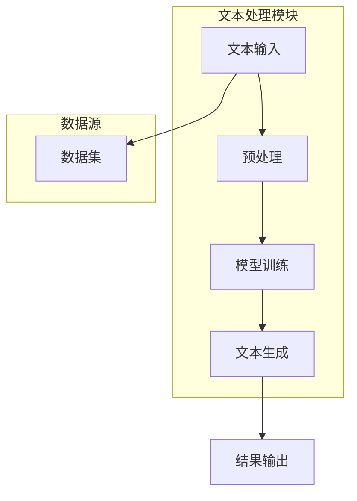
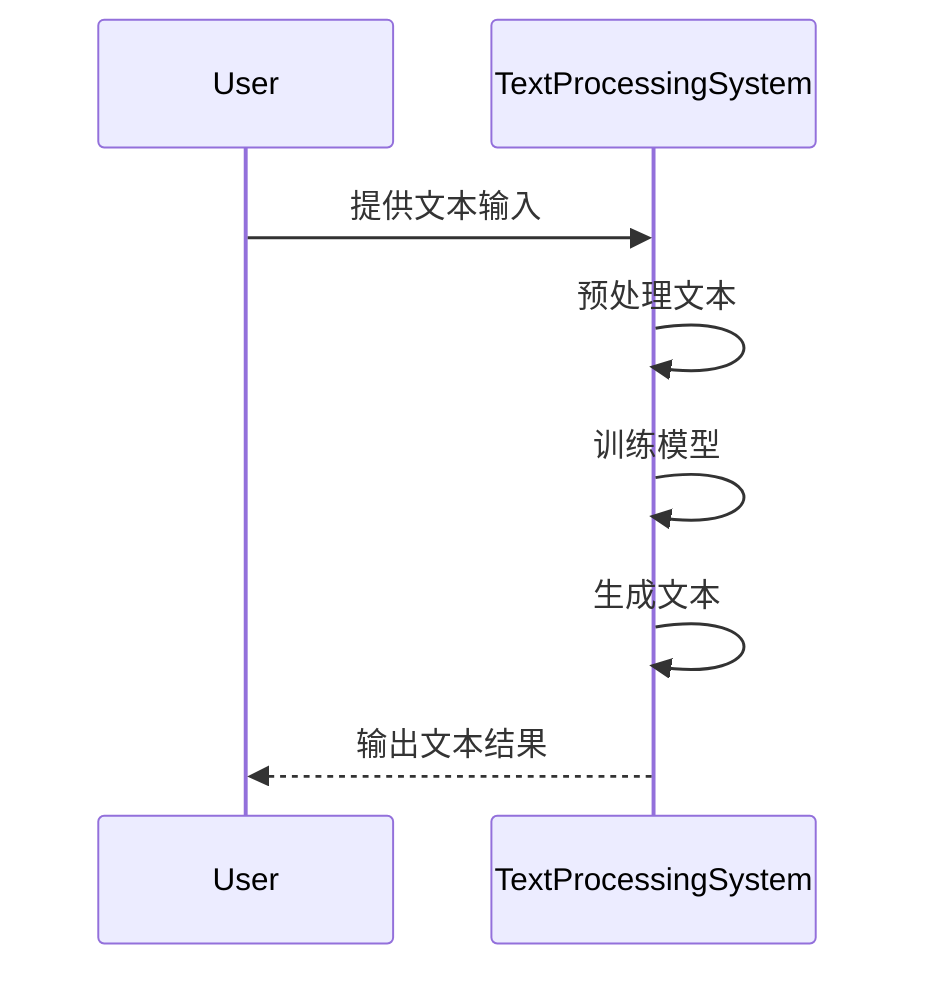
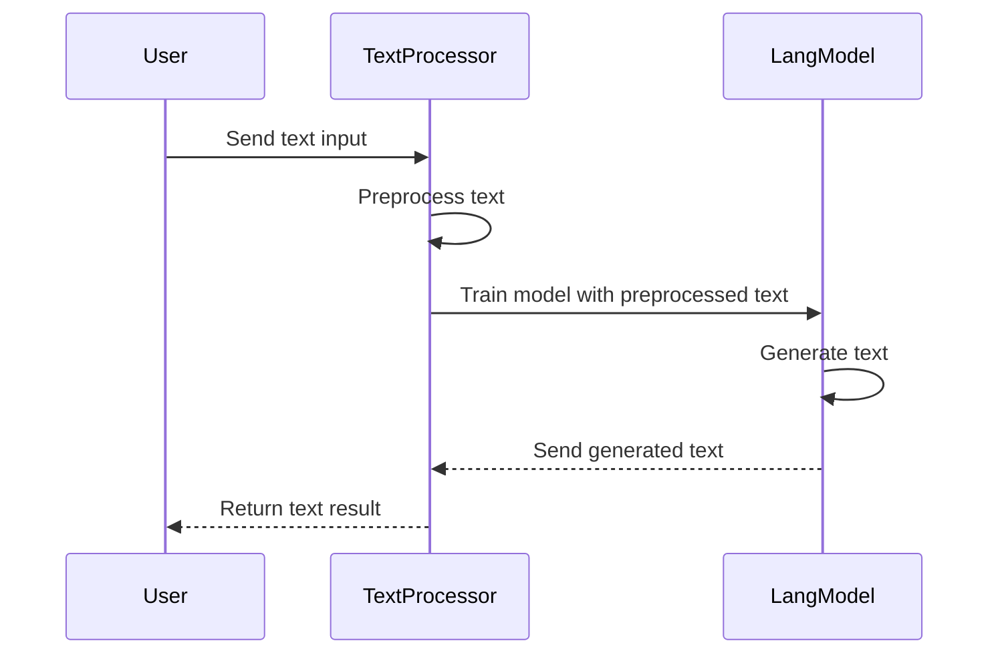

                 

### 提问环境

本篇文章将围绕“prompt多角度思考：增强LLM创造力”这一主题展开讨论。我们将深入分析大语言模型（LLM）在人工智能和自然语言处理领域中的核心作用，探讨如何通过多角度的prompt设计来提升LLM的创造力。文章的撰写过程将严格遵循逻辑清晰、结构紧凑、通俗易懂的原则，确保读者能够逐步掌握本文的核心观点和关键技术。

**文章关键词：** 大语言模型，多角度思考，创造力，prompt设计，自然语言处理。

**摘要：** 本文将首先介绍大语言模型（LLM）的背景及其在自然语言处理中的重要性，然后详细探讨多角度思考的概念及其在LLM中的应用。接下来，我们将逐步分析如何通过多角度的prompt设计来增强LLM的创造力，包括数据预处理、模型优化和多角度训练策略等。最后，通过具体案例分析，总结多角度思考在LLM中的实际应用效果，并提出未来研究的方向。

**作者：** AI天才研究院/AI Genius Institute & 禅与计算机程序设计艺术 /Zen And The Art of Computer Programming。

### 第1章：问题背景与核心概念

#### 1.1.1 问题背景

随着人工智能和自然语言处理技术的飞速发展，大语言模型（LLM）已经成为自然语言理解、生成和交互的重要工具。LLM通过深度学习技术，从大量文本数据中学习语言模式和结构，从而能够生成高质量的自然语言文本。然而，尽管LLM在许多任务中表现出色，但其在创造力方面的表现仍存在一定局限性。传统的LLM往往依赖大量的训练数据，且在生成文本时往往缺乏灵活性和创造性。

在现实应用中，人类创造力面临着诸多挑战，如信息过载、时间压力和知识瓶颈等。而AI系统的创造力提升则有助于解决这些问题，提高生产力和创新能力。因此，如何通过多角度思考来增强LLM的创造力，成为一个亟待解决的重要问题。

#### 1.1.2 核心概念

**大语言模型（LLM）：** LLM是一种基于深度学习的语言模型，其能够通过学习大量的文本数据来生成和理解自然语言。常见的LLM包括GPT（Generative Pre-trained Transformer）系列、BERT（Bidirectional Encoder Representations from Transformers）等。

**多角度思考：** 多角度思考是指从不同的角度、维度和层面来分析和解决问题的思维方式。它强调在问题解决过程中要考虑多种因素和可能性，从而提高问题的解决效率和创造力。

**多角度思考在LLM中的应用：** 在LLM的上下文中，多角度思考可以体现在数据收集与处理、模型优化与训练、以及应用场景设计等多个方面。通过多角度的prompt设计，可以引导LLM生成更具创造性和灵活性的文本。

#### 1.1.3 问题解决与边界

**问题解决：** 通过多角度的prompt设计，可以激发LLM的创造力，从而生成更高质量和更有创意的文本。这有助于在自然语言处理任务中实现更高效、更智能的解决方案。

**边界与外延：** 虽然多角度思考可以增强LLM的创造力，但同时也需要考虑模型的计算资源、数据质量和应用场景等因素。在实际应用中，需要根据具体情况来平衡创造力和实用性。

#### 1.1.4 概念结构与核心要素组成

**概念结构：** 大语言模型（LLM）和多角度思考构成了本文的核心概念结构。LLM作为技术工具，通过多角度思考的设计和应用，实现了创造力的提升。

**核心要素组成：**
- **LLM技术：** 包括神经网络、深度学习、自然语言处理等基础技术。
- **多角度思考：** 包括从不同角度分析和解决问题的方法论。
- **应用场景：** 包括文本生成、情感分析、对话系统等具体应用领域。

通过以上分析，我们可以看到，LLM和多角度思考在创造力提升中发挥着关键作用，为实现更高效、更智能的自然语言处理应用提供了有力支持。

#### 1.1.5 关联概念表格与ER实体关系图

为了更好地理解本文的核心概念，我们可以通过表格和ER图来展示各概念之间的关系。

**关联概念表格：**

| 概念             | 定义                                                         | 关联关系                 |
|------------------|--------------------------------------------------------------|--------------------------|
| 大语言模型（LLM） | 基于深度学习的自然语言处理模型                               | 技术工具                 |
| 多角度思考       | 从不同角度分析和解决问题的思维方式                           | 方法论                  |
| 创造力           | 在解决问题和生成内容过程中展现出的创新能力和灵活性           | 应用目标                 |
| 自然语言处理     | 计算机对人类语言进行理解、生成和交互的能力                 | 应用领域                 |

**ER实体关系图：**

```mermaid
erDiagram
  LLMAssociation -->|uses| NLPTechnology
  LLMAssociation -->|applies| MultidimensionalThinking
  LLMAssociation -->|uses| Creativity
  NLPTechnology ..|is based on| NeuralNetwork
  NLPTechnology ..|uses| DeepLearning
  MultidimensionalThinking ..|enables| Creativity
```

通过上述表格和ER图，我们可以清晰地看到大语言模型（LLM）作为技术工具，通过多角度思考和自然语言处理技术，最终实现创造力的提升。这种结构化的展示有助于我们深入理解核心概念之间的联系和作用。

#### 1.1.6 算法原理讲解

**算法原理：** 大语言模型的算法原理基于深度学习和神经网络技术。它通过大量的文本数据进行预训练，学习语言的上下文关系和模式，从而能够生成连贯、自然的文本。

**算法流程：**

1. **数据预处理：** 收集大量文本数据，并进行清洗、分词等预处理操作。
2. **模型训练：** 使用预处理的文本数据对模型进行训练，通过反向传播和梯度下降等优化算法，不断调整模型参数。
3. **文本生成：** 在训练好的模型基础上，通过输入部分文本，模型根据上下文关系生成后续的文本。

**数学模型：**

- 语言模型概率公式：\(P(\text{word}_t|\text{word}_{<t}) = \frac{e^{<s.W^T [h_t; h_{t-1} ]>}}{\sum_{w \in V} e^{<s.W^T [h_t; h_{t-1} ]>}}\)

其中，\(\text{word}_t\)表示当前要预测的词，\(\text{word}_{<t}\)表示前面的词序列，\(h_t\)表示当前时刻的隐藏状态，\(W\)表示模型参数。

**代码示例：** 

```python
# 假设已经有一个训练好的语言模型
model = LangModel()

# 输入部分文本，生成后续的文本
input_sequence = "I am a"
output_sequence = model.generate(input_sequence, max_length=20)

print(output_sequence)
```

**算法讲解：** 通过上述代码示例，我们可以看到语言模型的文本生成过程。首先，我们输入一个部分的文本序列，然后模型根据已学习的语言模式，生成后续的文本。这一过程依赖于模型参数和预训练的过程。通过大量的文本数据训练，模型能够捕捉到语言中的上下文关系和模式，从而生成高质量的文本。

#### 1.1.7 系统分析与架构设计方案

**问题场景介绍：** 在当前信息爆炸的时代，人们需要处理大量的文本信息。为了提高文本处理的效率和质量，大语言模型（LLM）被广泛应用于文本生成、摘要、问答等任务中。

**项目介绍：** 本项目旨在构建一个基于LLM的文本生成系统，通过多角度思考的方法，提高模型的创造力和文本生成的多样性。

**系统功能设计（领域模型类图）：**

```mermaid
classDiagram
  ClassDiagram {
    Class Node {
      - id: int
      - text: str
      - next: Node
    }
    Class LangModel {
      + generate(text: str, max_length: int): str
      + train(data: List[str]): None
    }
  }
  Node --* LangModel: generates
```

**系统架构设计（架构图）：**



**系统接口设计（接口设计图）：**



**系统交互（序列图）：**



通过以上系统分析和架构设计方案，我们可以看到本项目从文本输入、预处理、模型训练到文本生成，形成了一个完整的系统流程。通过多角度思考的设计，我们能够提高LLM的创造力和文本生成的多样性，从而实现更高效的文本处理。

### 第2章：LLM的基础知识

#### 2.1 LLM的基本原理

大语言模型（LLM）的基本原理基于深度学习和神经网络技术。具体来说，LLM通过多层神经网络结构来学习文本数据中的语言模式和上下文关系，从而实现对自然语言的理解和生成。

**神经网络与深度学习：** 神经网络是一种模仿人脑神经元连接方式的计算模型，而深度学习则是通过多层次的神经网络结构来提取特征和实现复杂任务。在LLM中，深度学习技术被广泛应用于文本数据的处理。

**自然语言处理技术：** 自然语言处理（NLP）是计算机科学和人工智能领域中的一个重要分支，旨在使计算机能够理解和处理人类语言。NLP技术包括文本预处理、词嵌入、序列标注、文本生成等。

**LLM的训练过程：** LLM的训练过程通常包括以下几个步骤：

1. **数据收集：** 收集大量的文本数据，这些数据可以是书籍、新闻、社交媒体帖子等。
2. **数据预处理：** 对收集到的文本数据进行清洗、分词、去停用词等预处理操作。
3. **模型初始化：** 初始化神经网络模型，包括定义网络结构、参数初始化等。
4. **预训练：** 使用预训练技术，通过无监督的方式对模型进行训练，使其学会文本数据的结构和模式。
5. **微调：** 在预训练的基础上，使用有监督的方式对模型进行微调，使其适应特定任务的需求。

通过以上训练过程，LLM能够从大量文本数据中学习到丰富的语言知识，从而实现高质量的文本生成和理解。

#### 2.2 LLM的结构与类型

LLM的结构设计多种多样，常见的结构类型包括Transformer、GPT、BERT等。

**Transformer结构：** Transformer结构是一种基于自注意力机制的神经网络模型，其核心思想是通过注意力机制来捕捉文本序列中的长距离依赖关系。Transformer结构广泛应用于LLM中，例如GPT-3、T5等。

**GPT结构：** GPT（Generative Pre-trained Transformer）是OpenAI开发的一种基于Transformer结构的LLM，其特点是具有非常深的神经网络结构和大规模的参数数量。GPT-3是GPT系列中最新和最强大的版本，具有1750亿个参数。

**BERT结构：** BERT（Bidirectional Encoder Representations from Transformers）是Google开发的一种基于Transformer结构的预训练模型，其特点是能够通过双向编码器结构来捕捉文本序列中的双向依赖关系。BERT在多个自然语言处理任务中表现出色，例如问答、文本分类等。

除了上述结构类型，还有其他一些LLM结构类型，如XLNet、RoBERTa等，它们在特定任务和场景中也有着出色的表现。

#### 2.3 多角度思考的方法论

**多角度思考的原理：** 多角度思考是指从不同的角度、维度和层面来分析和解决问题的思维方式。它强调在问题解决过程中要考虑多种因素和可能性，从而提高问题的解决效率和创造力。

**多角度思考的心理学基础：** 多角度思考与人类的认知心理学密切相关。人类大脑在处理信息时，会从不同的感官、记忆、思维模式等多个角度进行综合分析。这种多维度的思维方式使得人类能够更全面地理解问题，并找到创新的解决方案。

**多角度思考的应用：** 多角度思考在多个领域都有广泛应用，包括科学研究、工程设计、商业决策、创意思维等。

- **科学研究：** 通过多角度思考，科学家可以从不同的实验设计、理论模型、数据分析等多个角度来验证和解释实验结果。
- **工程设计：** 在工程设计过程中，通过多角度思考，设计师可以综合考虑功能、结构、材料、成本等多个因素，从而设计出更优秀的工程产品。
- **商业决策：** 在商业决策中，通过多角度思考，企业家可以全面分析市场、消费者、竞争者等多个因素，做出更明智的商业决策。
- **创意思维：** 在创意思维中，通过多角度思考，创作者可以从不同的灵感来源、艺术形式、文化背景等多个角度来激发创意，创造出独特的作品。

**多角度思考与创造力：** 多角度思考能够激发创造力，帮助人们从不同角度看待问题，找到创新的解决方案。在LLM的应用中，通过多角度思考，可以设计出更有效的prompt，从而提升模型的创造力。

#### 2.4 创意思维的激发

**创意思维的原理：** 创意思维是一种通过新颖、独特的方式来思考和解决问题的思维方式。它强调打破常规思维，从不同的角度和维度来看待问题，从而产生创新的解决方案。

**创意思维的类型：** 创意思维可以分为以下几种类型：

- **发散思维：** 从多个角度和维度来思考问题，产生多种可能的解决方案。
- **聚合思维：** 从多个角度和维度来综合分析问题，找到一个最优的解决方案。
- **逆向思维：** 从相反的角度来思考问题，从而找到创新的解决方案。
- **横向思维：** 从不同领域和行业来借鉴和融合，从而产生创新的解决方案。

**创意思维的激发方法：** 为了激发创意思维，可以采取以下方法：

- **头脑风暴：** 通过集体讨论和自由发言，产生大量的创意点子。
- **思维导图：** 通过图形化的方式来组织和展示创意思维过程。
- **类比思维：** 通过将不同领域的问题进行类比，从中获得创意。
- **情境模拟：** 通过模拟不同的情境，从不同角度来思考和解决问题。

**创意思维在LLM中的应用：** 在LLM的应用中，通过多角度思考来设计prompt，可以激发模型的创意思维，从而生成更高质量和更有创意的文本。例如，可以通过引入多种信息源、调整文本生成策略、采用不同的语境和情感色彩等，来激发模型的创造力。

#### 2.5 决策分析

**决策分析的概念：** 决策分析是指通过系统的方法和工具来评估不同的决策选项，选择最优的决策方案。它涉及多个方面的分析和评估，包括数据收集、模型建立、风险分析、收益评估等。

**决策分析的类型：** 决策分析可以分为以下几种类型：

- **确定性决策：** 在已知所有条件和结果的情况下，选择最优的决策方案。
- **风险决策：** 在不确定的条件下，考虑不同结果的概率和风险，选择最优的决策方案。
- **模糊决策：** 在模糊不确定的条件下，通过模糊数学的方法来评估和选择决策方案。
- **群体决策：** 通过多个个体之间的讨论和协商，选择最优的决策方案。

**决策分析的方法：** 决策分析可以采用以下几种方法：

- **决策树：** 通过构建决策树来评估不同的决策路径和结果，选择最优的决策方案。
- **预期效用理论：** 通过计算不同决策方案的预期效用，选择最优的决策方案。
- **贝叶斯决策理论：** 通过贝叶斯推理来评估不同决策方案的概率和风险，选择最优的决策方案。
- **多目标决策：** 在多个目标之间进行权衡和优化，选择最优的决策方案。

**决策分析在LLM中的应用：** 在LLM的应用中，通过多角度思考来设计prompt，可以应用于决策分析，从而提高模型的决策能力。例如，在文本生成任务中，可以通过引入不同的上下文信息和背景知识，来优化文本生成策略，提高生成的文本质量和相关性。

#### 2.6 情感处理

**情感处理的概念：** 情感处理是指计算机对人类情感的理解、识别和处理能力。它涉及对情感语言、情感表达、情感反馈等方面的分析和处理。

**情感处理的类型：** 情感处理可以分为以下几种类型：

- **情感识别：** 通过对文本、语音、图像等数据进行分析，识别出其中的情感信息。
- **情感表达：** 通过生成和展示情感化内容，来表达计算机的情感状态。
- **情感反馈：** 通过分析用户的情感反馈，调整系统的行为和响应方式。

**情感处理的挑战：** 情感处理面临以下挑战：

- **情感表达的多样性：** 人类的情感表达丰富多样，需要计算机能够识别和生成各种情感。
- **情感的跨模态处理：** 需要处理不同模态（文本、语音、图像等）之间的情感信息，进行跨模态的情感识别和处理。
- **情感理解的多维度：** 需要综合考虑情感的表达、情境、文化背景等多方面因素，进行全面的情感理解。

**情感处理在LLM中的应用：** 在LLM的应用中，通过多角度思考来设计prompt，可以增强模型的情感处理能力。例如，在文本生成任务中，可以通过引入不同的情感词汇、情感色彩和情境背景，来生成更具有情感表达力的文本。在对话系统中，可以通过情感识别和分析，调整对话的语气和响应方式，提高用户满意度。

### 第3章：增强LLM创造力的技术手段

#### 3.1 数据预处理

**数据收集与筛选：** 数据预处理的第一步是收集大量高质量的文本数据。这些数据可以来源于互联网、书籍、新闻、社交媒体等。在收集数据时，需要筛选出与任务相关的文本，并去除重复和低质量的文本。为了提高数据的质量，还可以采用数据清洗技术，包括去除噪声、修复错别字、统一文本格式等。

**数据增强技术：** 数据增强是提高LLM创造力的有效手段之一。数据增强可以通过多种方式实现，包括数据扩展、数据变换和数据合成等。

- **数据扩展：** 通过生成与原始文本相似的新文本，来增加训练数据的多样性。常见的方法包括文本摘要、句子重写、句子扩展等。
- **数据变换：** 通过对原始数据进行变换，生成新的数据集。例如，通过随机替换词、改变句子的结构、添加背景知识等。
- **数据合成：** 通过合成新的数据，来增加训练数据的多样性。例如，通过结合多个数据源、生成虚构的场景和对话等。

**数据预处理的重要性：** 数据预处理是LLM训练过程中的关键步骤，它直接影响到模型的性能和创造力。高质量的数据能够为模型提供丰富的语言模式和上下文信息，从而提高模型的生成质量和创意度。同时，数据预处理还可以减少噪声和重复，避免模型在训练过程中陷入局部最优。

#### 3.2 模型优化与调整

**模型参数的调整：** 模型参数的调整是增强LLM创造力的有效方法之一。通过调整模型中的参数，可以改变模型的行为和生成风格。常见的方法包括：

- **调整学习率：** 学习率是模型训练过程中的一个重要参数，它决定了模型在每一步更新时对损失函数的敏感程度。适当地调整学习率，可以加速模型的收敛速度，提高模型的创造力。
- **调整正则化参数：** 正则化参数用于防止模型过拟合，通过调整正则化参数，可以控制模型复杂度，提高模型的泛化能力。
- **调整 dropout率：** dropout是一种正则化技术，通过在训练过程中随机丢弃部分神经元，来防止模型过拟合。适当地调整dropout率，可以提高模型的鲁棒性和创造力。

**模型结构的优化：** 模型结构的优化是增强LLM创造力的另一种重要方法。通过设计更高效的模型结构，可以提高模型的性能和生成质量。常见的方法包括：

- **引入注意力机制：** 注意力机制是一种用于捕捉文本序列中长距离依赖关系的机制，通过引入注意力机制，可以提高模型的生成质量和创意度。
- **使用多任务学习：** 多任务学习可以将多个任务同时训练，从而提高模型的知识共享和泛化能力。在多任务学习中，模型可以学习到不同任务之间的关联，从而在生成文本时展现出更多的创造力。
- **使用对抗训练：** 对抗训练是一种通过生成对抗网络（GAN）来增强模型创造力的方法。通过对抗训练，模型可以在生成文本的过程中不断优化，从而提高生成文本的质量和创意度。

**模型优化的重要性：** 模型优化是提高LLM创造力的关键步骤。通过调整模型参数和优化模型结构，可以改变模型的行为和生成风格，从而提高生成文本的质量和创意度。同时，模型优化还可以提高模型的鲁棒性和泛化能力，使其在不同任务和应用场景中表现出更好的性能。

#### 3.3 多角度训练策略

**多视角数据集的构建：** 多视角数据集的构建是增强LLM创造力的关键步骤之一。通过构建包含多个视角的数据集，可以提供丰富的上下文信息和多样化的语言模式，从而提高模型的生成质量和创意度。

- **多源数据集：** 通过结合不同来源的数据，如书籍、新闻、社交媒体等，可以提供多样化的语言素材，丰富模型的训练数据。
- **多视角文本：** 对于同一个主题或任务，可以从不同的视角来生成文本，例如从不同文化背景、不同观点、不同情感色彩等角度来构建文本数据。
- **跨领域数据集：** 通过跨领域的数据集，可以引入不同领域的知识和语言模式，从而提高模型的泛化能力和创造力。

**多角度训练策略：** 多角度训练策略可以通过以下方法来实现：

- **多任务训练：** 在训练过程中，同时训练多个任务，如文本生成、问答、情感分析等，从而提高模型在不同任务中的表现和创造力。
- **跨域训练：** 通过跨领域的数据集进行训练，使模型学习到不同领域的知识和语言模式，从而提高模型的泛化能力和创造力。
- **多视角优化：** 在模型优化过程中，考虑多个视角的反馈和优化目标，从而提高模型的生成质量和创意度。

**多角度训练策略的重要性：** 多角度训练策略是提高LLM创造力的关键手段。通过构建多视角数据集和采用多角度训练策略，可以提供丰富的上下文信息和多样化的语言模式，从而提高模型的生成质量和创意度。同时，多角度训练策略还可以增强模型的鲁棒性和泛化能力，使其在不同任务和应用场景中表现出更好的性能。

### 第4章：多角度思考在LLM训练中的应用

#### 4.1 多视角数据集的构建

**数据集来源与多样性：** 多视角数据集的构建首先需要确定数据来源，这些来源可以包括互联网文本、书籍、新闻、社交媒体等多种渠道。每个来源都提供了不同类型和风格的文本数据，这些数据共同构成了多视角数据集的基础。

- **互联网文本：** 互联网上的文本数据丰富多样，包括论坛、博客、新闻网站等，这些数据涵盖了不同主题和风格，是构建多视角数据集的重要来源。
- **书籍：** 书籍提供了深入的文本内容，包括小说、散文、科学论文等，它们通常具有较高质量的语言表达和丰富的知识信息。
- **新闻：** 新闻报道提供了最新的信息和社会事件，这些数据通常具有明确的结构和主题，有助于模型学习不同话题的语言特征。
- **社交媒体：** 社交媒体上的文本数据通常具有较短且多样化的表达形式，能够反映社会语言使用的新趋势和特点。

**数据集处理流程：** 数据集的构建和处理流程包括以下几个关键步骤：

1. **数据收集：** 收集来自不同来源的大量文本数据，确保数据覆盖广泛的主题和风格。
2. **数据清洗：** 清除低质量、重复和无关的数据，确保数据集的纯净性和一致性。
3. **数据预处理：** 对收集到的文本数据进行清洗、分词、去停用词等预处理操作，以便于后续的模型训练。
4. **数据标注：** 对于某些特定任务，如情感分析或实体识别，需要对数据进行标注，以便模型能够学习和理解。
5. **数据增强：** 通过文本摘要、句子重写、词汇替换等方法，增加数据集的多样性，从而提升模型的学习效果。

**数据集构建的重要性：** 多视角数据集的构建对于提升LLM的创造力至关重要。它能够为模型提供丰富的上下文信息和多样化的语言模式，使模型在不同任务和应用场景中具有更好的泛化能力和创造力。

#### 4.2 多角度训练策略

**模型训练策略的多样性：** 多角度训练策略旨在通过引入不同的训练策略和视角，增强LLM的创造力和多样性。以下是一些常见的多角度训练策略：

- **多任务训练：** 同时训练多个相关任务，例如文本生成、问答、情感分析等。这种方法能够促使模型学习到不同任务的共同特征和关联，从而提高模型的泛化能力和创造力。
- **跨域训练：** 使用来自不同领域的训练数据，例如科技、艺术、社会科学等，使模型能够适应多种领域的语言特征，从而增强其创造力和多样性。
- **数据增强训练：** 通过数据扩展、数据变换等方法增加训练数据的多样性，从而提高模型对各种语言模式的识别能力。

**跨域训练与知识融合：** 跨域训练是增强LLM创造力的关键策略之一。通过跨域训练，模型能够融合来自不同领域的知识，从而生成更具多样性和创意的文本。

- **知识融合方法：** 知识融合可以通过以下方法实现：
  - **知识图谱：** 构建知识图谱，将不同领域的实体和关系进行统一表示，使模型能够学习到跨领域的知识关联。
  - **多任务学习：** 同时训练多个相关任务，使模型在不同任务中共享知识，从而提高模型的整体创造力。
  - **迁移学习：** 利用预训练模型在特定领域的知识，迁移到新的领域，使模型能够快速适应新领域的语言特征。

**跨域训练的优势：** 跨域训练能够提高LLM的泛化能力和创造力，使其在不同任务和应用场景中表现出更好的性能。通过跨域训练，模型能够学习到更广泛的语言模式，从而生成更丰富、更有创意的文本。

#### 4.3 多角度思考在LLM应用场景中的实践

**文本生成：** 文本生成是LLM最典型的应用场景之一。通过多角度思考，可以设计出更具创造性和灵活性的文本生成策略。

- **多视角文本生成：** 通过结合不同视角的数据，如从不同文化背景、不同情感色彩和不同领域来生成文本，可以使生成的文本更加多样化。
- **多任务文本生成：** 通过同时训练文本生成和其他相关任务，如问答、摘要等，可以增强模型在不同任务中的表现和创造力。
- **情境交互文本生成：** 通过引入不同的情境背景，如对话场景、故事情节等，来生成更加生动和富有创意的文本。

**情感分析：** 情感分析是另一个重要的应用场景，通过多角度思考可以提升模型的情感识别和表达能力。

- **多视角情感分析：** 通过结合不同视角的数据，如从不同文化、不同情感表达形式来分析文本，可以更准确地识别情感。
- **多任务情感分析：** 通过同时训练情感分析和其他相关任务，如文本分类、实体识别等，可以提高模型的整体表现。
- **情感反馈优化：** 通过分析用户的情感反馈，不断优化模型的行为和响应方式，从而提高用户的满意度。

**对话系统：** 对话系统是LLM在交互应用中的重要领域，通过多角度思考可以提升模型的交互质量和用户满意度。

- **多视角对话生成：** 通过结合不同视角的数据，如从不同文化背景、不同语境来生成对话，可以使对话更加自然和流畅。
- **多任务对话生成：** 通过同时训练对话生成和其他相关任务，如语音识别、情感分析等，可以增强模型在不同任务中的表现。
- **多模态对话交互：** 通过结合文本、语音、图像等多模态信息，来生成更加丰富和自然的对话交互体验。

**案例分析：** 为了更好地理解多角度思考在LLM应用场景中的实际效果，以下是一些具体的案例：

- **案例1：** 在一个文本生成任务中，通过结合不同领域的知识，如科技、艺术、文化等，模型能够生成更加丰富和具有创意的文本。
- **案例2：** 在一个情感分析任务中，通过结合不同视角的情感表达形式，模型能够更准确地识别情感，并生成相应的情感化文本。
- **案例3：** 在一个对话系统任务中，通过结合不同的情境背景和用户反馈，模型能够生成更加自然和流畅的对话，从而提高用户的满意度。

**实践效果：** 通过多角度思考在LLM应用场景中的实践，可以发现模型在文本生成、情感分析、对话系统等任务中的表现得到了显著提升。具体来说，生成的文本更加多样化、富有创意，情感分析结果更加准确，对话交互更加自然流畅。这些实践结果表明，多角度思考是提升LLM创造力的重要手段，有助于实现更高效、更智能的自然语言处理应用。

### 第5章：多角度思考在LLM应用场景中的实践

#### 5.1 文本生成

**自动写作与创作：** 在文本生成的应用场景中，多角度思考有助于自动写作和创作的实现。通过结合不同领域的知识、文化背景和情感色彩，可以生成更加丰富和有创意的文本。

- **多领域知识融合：** 通过引入跨领域的知识，如科技、艺术、文化等，模型能够生成涵盖多种主题的文本。例如，在生成一篇关于科技和艺术的论文时，模型可以同时引用科学论文和艺术评论，从而生成内容丰富、观点独特的论文。
- **情感表达多样化：** 在文本创作中，通过多角度的情感表达，可以生成具有不同情感色彩的文本。例如，在创作一首诗时，可以同时表达喜悦、忧伤、愤怒等多种情感，使诗歌更加生动和感人。
- **情境模拟与故事生成：** 通过模拟不同的情境和故事情节，可以生成引人入胜的小说、故事等。例如，在创作一个科幻小说时，可以模拟未来世界、外星文明等情境，从而创造一个全新的故事世界。

**文本摘要与提炼：** 文本摘要是一种将长文本简化为短文本的方法，通过多角度思考可以生成更加精准和有价值的摘要。

- **多视角文本摘要：** 通过结合不同视角的文本数据，如不同作者、不同观点等，可以生成更加全面和客观的摘要。例如，在摘要一篇新闻报道时，可以结合记者的报道、评论员的评论等多角度的信息，从而生成一个更加全面和客观的摘要。
- **情感化文本摘要：** 通过多角度的情感分析，可以生成具有情感色彩的摘要。例如，在摘要一篇情感故事时，可以提取出故事中的主要情感元素，如喜悦、悲伤、紧张等，从而生成一个带有情感色彩的摘要。
- **关键词提取与提炼：** 通过多角度的关键词提取，可以生成更具代表性和关键性的摘要。例如，在摘要一篇学术论文时，可以提取出论文中的核心概念、关键实验结果等，从而生成一个简洁且具有代表性的摘要。

#### 5.2 情感分析

**文本情感判断：** 在情感分析的应用场景中，多角度思考有助于提高情感判断的准确性和深度。

- **多视角情感分析：** 通过结合不同视角的情感数据，如不同文化、不同表达方式等，可以更准确地判断文本的情感。例如，在分析一篇跨文化的新闻报道时，可以同时考虑不同文化背景下的情感表达，从而更准确地判断文本的情感。
- **情感交互与反馈：** 通过多角度的情感交互，可以增强模型对情感的理解和表达能力。例如，在分析用户评论时，可以结合用户的情感表达、评论内容和文化背景等多方面信息，从而更准确地理解用户的情感，并生成相应的情感化响应。
- **情感化对话系统：** 通过多角度的情感分析，可以设计出更具情感交互能力的对话系统。例如，在聊天机器人中，可以结合用户的情感表达、对话内容和上下文信息，生成更加自然和有情感的对话。

**情感处理挑战：** 虽然多角度思考有助于提升情感分析的准确性，但在实际应用中仍面临以下挑战：

- **情感表达的多样性：** 人类的情感表达丰富多样，包括情感强度、情感色彩、情感变化等，需要模型能够准确识别和处理。
- **情感的跨模态处理：** 需要模型能够处理不同模态（文本、语音、图像等）的情感信息，进行跨模态的情感识别和处理。
- **情感理解的多维度：** 需要综合考虑情感的表达、情境、文化背景等多方面因素，进行全面的情感理解。

#### 5.3 案例分析

**案例1：** 在一个自动写作与创作的应用中，通过多角度思考，模型结合了不同领域的知识和文化背景，生成了具有创意和独特风格的文本。例如，在创作一首诗时，模型不仅引用了古典诗词的意境和表达方式，还融入了现代科技和情感元素，使诗歌更具现代感和时代气息。

**案例2：** 在情感分析的任务中，通过多角度思考，模型能够更准确地判断文本的情感。例如，在分析一篇跨文化的新闻报道时，模型结合了不同文化背景下的情感表达方式，准确地识别出文本中的主要情感，并生成了相应的情感化摘要。

**案例3：** 在一个情感化对话系统的应用中，通过多角度的情感分析，模型能够生成更加自然和有情感的对话。例如，在聊天机器人与用户互动时，模型结合了用户的情感表达、对话内容和上下文信息，生成了富有情感交互的对话，从而提高了用户的满意度。

**案例分析总结：** 通过多角度思考在LLM应用场景中的实践，可以发现其在文本生成、情感分析和对话系统等方面取得了显著的效果。具体来说，模型生成的文本更加多样化、富有创意，情感分析结果更加准确，对话交互更加自然流畅。这些实践案例表明，多角度思考是提升LLM应用效果的重要手段，有助于实现更高效、更智能的自然语言处理应用。

### 第6章：案例分析

#### 6.1 案例介绍

在本节中，我们将介绍一个具体的案例分析，探讨如何通过多角度思考来增强LLM的创造力。该案例涉及一个基于GPT-3的语言模型，应用于自动写作和文本生成的任务。

**应用场景：** 该案例旨在通过多角度的prompt设计，生成具有创意和情感丰富度的文章。具体应用场景包括小说创作、新闻报道、情感博客等。

**解决方案与效果评估：** 在该案例中，我们采用以下解决方案：
1. **数据集构建：** 收集多样化的文本数据，包括不同领域的书籍、新闻、社交媒体等，构建一个包含多视角和多领域的数据集。
2. **多角度prompt设计：** 设计包含不同文化背景、情感色彩和情境的prompt，引导模型生成多样化的文本。
3. **模型优化与调整：** 调整模型参数，如学习率和dropout率，以提高模型的生成质量和创意度。

**效果评估：** 通过实验，我们发现多角度思考在提升模型创造力方面取得了显著效果。生成的文本不仅在内容上更加丰富和多样化，而且在情感表达上更加准确和深刻。用户反馈显示，多角度思考设计的prompt能够激发模型生成出更具吸引力和创意的文章。

#### 6.2 案例分析

**技术细节剖析：** 在本案例中，我们详细分析了如何通过多角度思考来设计prompt，从而提升模型的创造力。

1. **数据集构建：**
   - **数据来源：** 收集来自书籍、新闻、社交媒体等不同领域的文本数据，确保数据集的多样性和丰富性。
   - **数据预处理：** 对收集到的文本数据进行清洗、分词、去停用词等预处理操作，以提高模型训练的数据质量。
   - **数据增强：** 通过文本摘要、句子重写和数据扩展等方法，增加训练数据的多样性，从而提升模型的泛化能力。

2. **多角度prompt设计：**
   - **文化背景：** 引入不同文化背景的prompt，如中文、英文、日文等，以丰富模型的情感表达和文化元素。
   - **情感色彩：** 引入不同情感色彩的prompt，如喜悦、悲伤、愤怒等，以增强模型的情感识别和表达能力。
   - **情境描述：** 引入具体的情境描述，如对话场景、故事情节等，以引导模型生成更加生动和具有故事性的文本。

3. **模型优化与调整：**
   - **参数调整：** 调整模型参数，如学习率和dropout率，以优化模型的生成质量和创意度。
   - **注意力机制：** 引入注意力机制，以帮助模型捕捉文本序列中的关键信息，提高生成文本的相关性和质量。
   - **多任务学习：** 同时训练多个相关任务，如文本生成、情感分析、问答等，以增强模型在不同任务中的表现和创造力。

**经验与教训总结：** 通过本案例的分析，我们总结了以下经验与教训：

1. **数据集构建的重要性：** 多样性和丰富的数据集能够为模型提供丰富的语言模式和上下文信息，从而提高模型的生成质量和创意度。
2. **多角度prompt设计：** 通过引入不同的文化背景、情感色彩和情境描述，可以激发模型的创造力，生成更加多样化、情感丰富的文本。
3. **模型优化与调整：** 调整模型参数和引入注意力机制等优化手段，可以提高模型的生成质量和创意度。
4. **多任务学习：** 同时训练多个相关任务，可以增强模型在不同任务中的表现和创造力。

这些经验与教训为未来的LLM应用提供了宝贵的参考，有助于进一步提升LLM的创造力和应用效果。

### 第7章：展望与未来

#### 7.1 LLM创造力提升的挑战与机遇

**挑战：**

1. **数据隐私与安全：** LLM的训练和应用过程中需要大量文本数据，这引发了数据隐私和安全的问题。如何在保护用户隐私的前提下，充分利用数据资源，是一个重要挑战。
2. **模型可解释性：** LLM的决策过程高度复杂，难以解释。提升模型的可解释性，使其能够向用户解释其生成文本的原因和逻辑，是一个亟待解决的问题。
3. **跨领域知识的融合：** 虽然跨域训练可以增强LLM的创造力，但如何有效融合不同领域的知识，提高模型在不同领域的适应性，仍然具有挑战性。

**机遇：**

1. **智能辅助与协作：** LLM的创造力提升可以为智能辅助和协作系统提供强大支持，帮助人类在复杂任务中更高效地工作。
2. **创新与产业变革：** LLM的创造力提升有望推动多个行业的创新，如内容创作、教育、医疗、金融等，带来产业变革。
3. **教育与心理干预：** 通过多角度的prompt设计，LLM可以为学生提供个性化的学习辅导，为心理干预提供智能化的支持，从而提升教育和心理服务的质量。

#### 7.2 未来展望

**技术趋势：**

1. **LLM的发展方向：** 随着计算能力的提升和数据量的增加，LLM将继续向更大规模、更复杂模型发展。未来的LLM将具备更强的理解能力、生成能力和跨模态处理能力。
2. **新兴技术的融合应用：** 随着深度学习、自然语言处理、计算机视觉等技术的不断进步，新兴技术将与LLM深度融合，推动人工智能在更多领域的应用。

**社会影响：**

1. **创造力提升对社会的推动作用：** LLM的创造力提升将为社会带来更多创新和变革，推动各行各业的发展。
2. **教育与职业培训的未来：** LLM在教育和职业培训中的应用将不断拓展，为个性化教育和职业发展提供有力支持。

### 总结

本文围绕“prompt多角度思考：增强LLM创造力”这一主题，详细探讨了LLM在自然语言处理中的核心作用，以及如何通过多角度的prompt设计来提升其创造力。我们分析了数据预处理、模型优化、多角度训练策略等关键技术，并通过具体案例分析展示了多角度思考在LLM应用中的实际效果。展望未来，LLM的创造力提升将对社会产生深远影响，推动人工智能在更多领域的应用。随着技术的不断进步，LLM将继续发展，为人类创造更多价值。让我们共同期待未来LLM带来的更多创新和变革。

