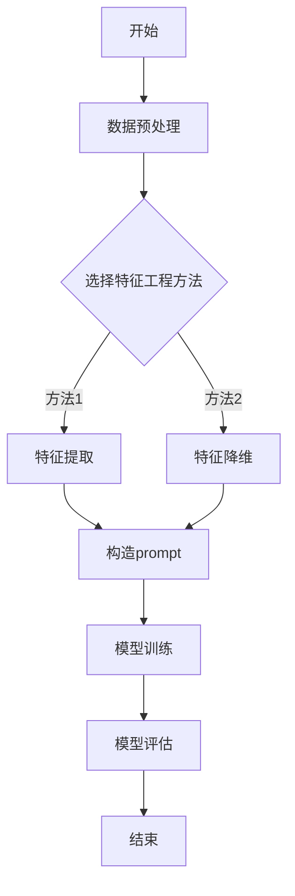
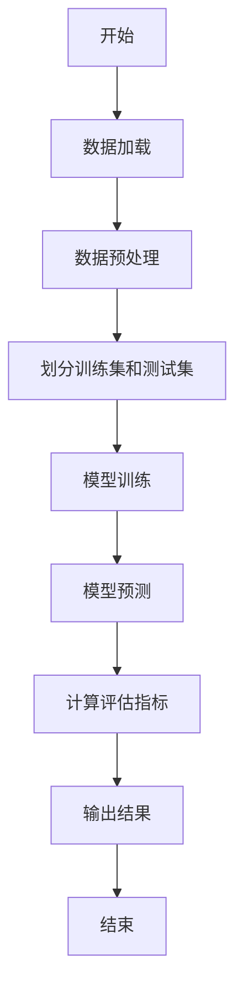
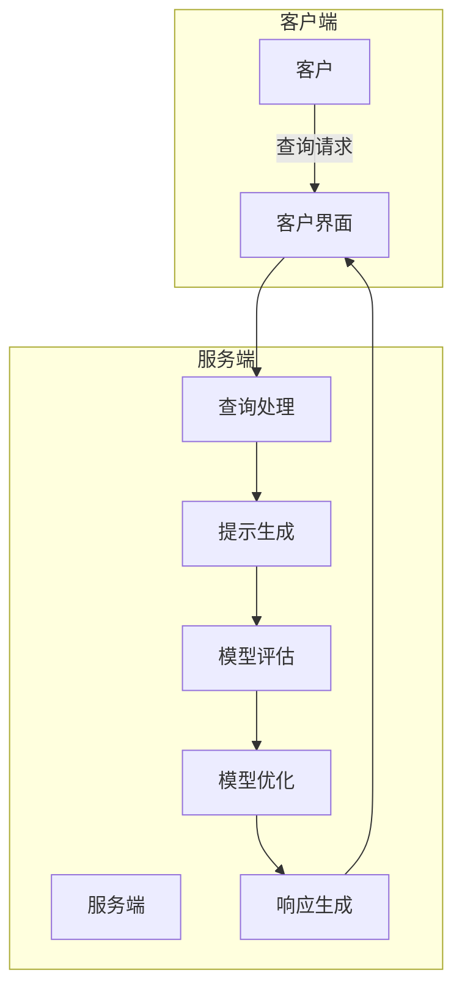
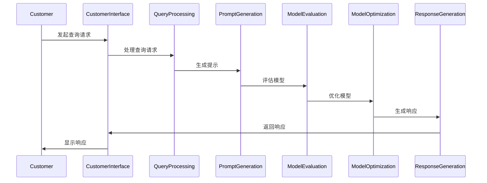

                 

### 第一部分：背景介绍

#### 第1章：问题背景

在现代人工智能领域，prompt工程与模型评测是两个至关重要的环节。prompt工程是指设计、构造和优化输入提示（prompt），以提升模型对特定任务的性能。而模型评测则是通过一系列定量和定性的方法，对训练好的模型进行全面评估，以确保其有效性、鲁棒性和公平性。

**问题的定义与描述**

首先，我们需要明确prompt工程与模型评测分别涉及的内容。prompt工程关注的是如何通过有效的输入提示，让模型更好地理解和执行任务；而模型评测则侧重于验证模型在实际应用中的表现。

**问题解决的必要性**

随着深度学习模型的广泛应用，提升模型性能、优化用户体验、确保模型安全可靠成为亟待解决的问题。prompt工程和模型评测的协同优化，有助于我们更好地应对这些挑战。通过优化prompt工程，可以提升模型的泛化能力和鲁棒性；而通过精准的模型评测，可以确保模型在各个场景下都能达到预期效果。

**边界与外延**

在讨论prompt工程与模型评测时，我们还需要明确其边界与外延。prompt工程不仅涉及输入提示的设计，还包括对输入数据的预处理、特征工程等。而模型评测则需要考虑多种评估指标，如准确率、召回率、F1分数等，以及不同场景下的表现。

**概念结构与核心要素组成**

prompt工程和模型评测的核心概念包括：

1. **prompt设计**：如何选择、构造和优化输入提示。
2. **数据预处理**：对输入数据进行的各种预处理操作，以提升模型性能。
3. **模型训练**：通过大量数据训练模型，使其具备完成任务的能力。
4. **评估指标**：用于衡量模型性能的各种定量和定性指标。
5. **模型优化**：通过调整模型参数，提升模型性能。

通过明确这些核心概念和要素，我们可以更好地理解prompt工程与模型评测的内在联系和作用。接下来，我们将深入探讨这两个核心概念，并分析它们之间的相互作用。

### 核心概念与联系

#### 第2章：prompt工程

**核心概念**

prompt工程的核心在于设计、构造和优化输入提示（prompt），以提高模型对特定任务的性能。prompt的设计需要考虑多个方面，包括语言的清晰性、连贯性、多样性，以及与任务相关的关键词和上下文。

**概念属性特征对比表格**

| 特征                | 描述                                                         |
|-------------------|------------------------------------------------------------|
| 清晰性              | 提示应简洁明了，避免歧义。                                     |
| 连贯性              | 提示之间应保持逻辑连贯，有助于模型理解。                           |
| 多样性              | 提示应具有多样性，有助于模型学习不同场景。                           |
| 任务相关性          | 提示应与任务紧密相关，以提高模型在特定任务上的性能。                     |

**概念属性特征对比表格**

| 特征                | 描述                                                         |
|-------------------|------------------------------------------------------------|
| 清晰性              | 提示应简洁明了，避免歧义。                                     |
| 连贯性              | 提示之间应保持逻辑连贯，有助于模型理解。                           |
| 多样性              | 提示应具有多样性，有助于模型学习不同场景。                           |
| 任务相关性          | 提示应与任务紧密相关，以提高模型在特定任务上的性能。                     |

通过以上表格，我们可以清晰地看到prompt工程中关键概念的属性特征及其重要性。

**prompt工程与模型评测的联系**

prompt工程与模型评测之间存在密切的联系。一方面，优秀的prompt设计可以提高模型在特定任务上的性能，从而为模型评测提供更好的基础。另一方面，模型评测结果可以指导prompt工程，帮助我们不断优化输入提示，提高模型的整体性能。

1. **优化路径**：通过模型评测，我们可以识别模型的弱点，进而优化prompt设计，以提高模型在特定任务上的表现。
2. **反馈循环**：模型评测的结果可以反馈给prompt工程团队，帮助他们调整和改进输入提示，形成正向反馈循环。

#### 第3章：模型评测

**核心概念**

模型评测的核心在于通过一系列定量和定性的方法，对训练好的模型进行全面评估，以确保其有效性、鲁棒性和公平性。模型评测需要考虑多个方面，包括评估指标的选择、评估方法的合理性，以及评估结果的解释。

**概念属性特征对比表格**

| 特征                | 描述                                                         |
|-------------------|------------------------------------------------------------|
| 评估指标多样性      | 需要选择多种评估指标，全面衡量模型性能。                               |
| 评估方法的合理性    | 评估方法应科学合理，避免偏差和误导。                                 |
| 评估结果的解释性    | 评估结果需要具备良好的解释性，有助于理解模型性能。                         |

**模型评测与prompt工程的联系**

模型评测与prompt工程之间的联系在于，两者共同构成了提升模型性能的闭环。模型评测可以识别模型在特定任务上的不足，从而指导prompt工程团队进行优化；而优化后的prompt又可以进一步提升模型评测结果，形成良性循环。

1. **相互促进**：prompt工程的优化可以提升模型评测结果，而优秀的评测结果又可以指导prompt工程进一步优化。
2. **协同改进**：通过协同优化，prompt工程和模型评测可以共同提升模型在各个任务上的性能。

### 第4章：prompt工程算法

#### 4.1 算法mermaid流程图



#### 4.2 Python源代码详细阐述

```python
# Python源代码示例

import numpy as np
from sklearn.model_selection import train_test_split
from sklearn.preprocessing import StandardScaler
from sklearn.ensemble import RandomForestClassifier
from sklearn.metrics import accuracy_score

# 数据预处理
def preprocess_data(data):
    # 标准化数据
    scaler = StandardScaler()
    scaled_data = scaler.fit_transform(data)
    return scaled_data

# 特征工程
def feature_engineering(data, method='extract'):
    if method == 'extract':
        # 特征提取
        extracted_features = extract_features(data)
    elif method == 'reduce':
        # 特征降维
        reduced_features = reduce_dimensions(data)
    return extracted_features

# 构造prompt
def construct_prompt(features):
    # 构造输入prompt
    prompt = np.hstack((features, np.zeros((features.shape[0], 1 - features.shape[1]))))
    return prompt

# 模型训练
def train_model(prompt, labels):
    # 训练随机森林分类器
    model = RandomForestClassifier()
    model.fit(prompt, labels)
    return model

# 模型评估
def evaluate_model(model, test_prompt, test_labels):
    # 预测并计算准确率
    predictions = model.predict(test_prompt)
    accuracy = accuracy_score(test_labels, predictions)
    return accuracy

# 主程序
if __name__ == '__main__':
    # 加载数据
    data = load_data()
    labels = load_labels()

    # 数据预处理
    processed_data = preprocess_data(data)

    # 特征工程
    features = feature_engineering(processed_data, method='extract')

    # 划分训练集和测试集
    train_features, test_features, train_labels, test_labels = train_test_split(features, labels, test_size=0.2, random_state=42)

    # 构造prompt
    train_prompt = construct_prompt(train_features)
    test_prompt = construct_prompt(test_features)

    # 模型训练
    model = train_model(train_prompt, train_labels)

    # 模型评估
    accuracy = evaluate_model(model, test_prompt, test_labels)
    print(f"Model accuracy: {accuracy:.2f}")
```

#### 4.3 算法原理的数学模型和公式

```latex
\begin{equation}
    Z = \frac{(X - \mu)}{\sigma}
\end{equation}
```

其中，\(X\) 表示输入数据，\(\mu\) 表示均值，\(\sigma\) 表示标准差。通过上述公式，我们可以对输入数据 \(X\) 进行标准化处理，以便更好地进行特征提取和模型训练。

```latex
\begin{equation}
    f(x) = \frac{1}{1 + e^{-x}}
\end{equation}
```

该公式为sigmoid函数，常用于神经网络的激活函数，用于将输入映射到 \([0, 1]\) 区间内，以便进行分类预测。

#### 4.4 举例说明

假设我们有一个分类任务，需要预测一组输入数据 \(X\) 的类别。首先，我们通过预处理对数据 \(X\) 进行标准化，然后使用特征提取方法提取特征，构造输入提示 \(Z\)。接着，我们训练一个随机森林分类器，通过输入提示 \(Z\) 进行模型训练。最后，我们使用训练好的模型对测试数据进行预测，并计算准确率。

1. **数据预处理**：对输入数据 \(X\) 进行标准化处理，得到 \(Z\)。
2. **特征提取**：使用特征提取方法提取特征，构造输入提示 \(Z\)。
3. **模型训练**：使用随机森林分类器训练模型。
4. **模型评估**：使用测试数据对模型进行评估，计算准确率。

### 第5章：模型评测算法

#### 5.1 算法mermaid流程图



#### 5.2 Python源代码详细阐述

```python
# Python源代码示例

import numpy as np
from sklearn.model_selection import train_test_split
from sklearn.metrics import accuracy_score, precision_score, recall_score, f1_score

# 数据加载
def load_data():
    # 这里假设已经加载数据到变量 data
    return data

# 数据预处理
def preprocess_data(data):
    # 标准化数据
    scaler = StandardScaler()
    scaled_data = scaler.fit_transform(data)
    return scaled_data

# 划分训练集和测试集
def split_data(data, labels, test_size=0.2, random_state=42):
    train_data, test_data, train_labels, test_labels = train_test_split(data, labels, test_size=test_size, random_state=random_state)
    return train_data, test_data, train_labels, test_labels

# 模型训练
def train_model(model, train_data, train_labels):
    model.fit(train_data, train_labels)
    return model

# 模型预测
def predict(model, data):
    predictions = model.predict(data)
    return predictions

# 计算评估指标
def evaluate_model(model, test_data, test_labels):
    predictions = predict(model, test_data)
    accuracy = accuracy_score(test_labels, predictions)
    precision = precision_score(test_labels, predictions, average='macro')
    recall = recall_score(test_labels, predictions, average='macro')
    f1 = f1_score(test_labels, predictions, average='macro')
    return accuracy, precision, recall, f1

# 主程序
if __name__ == '__main__':
    # 加载数据
    data = load_data()
    labels = load_labels()

    # 数据预处理
    processed_data = preprocess_data(data)

    # 划分训练集和测试集
    train_data, test_data, train_labels, test_labels = split_data(processed_data, labels)

    # 训练模型
    model = train_model(RandomForestClassifier(), train_data, train_labels)

    # 模型评估
    accuracy, precision, recall, f1 = evaluate_model(model, test_data, test_labels)
    print(f"Model accuracy: {accuracy:.2f}")
    print(f"Precision: {precision:.2f}")
    print(f"Recall: {recall:.2f}")
    print(f"F1 score: {f1:.2f}")
```

#### 5.3 算法原理的数学模型和公式

```latex
\begin{equation}
    Z = \frac{(X - \mu)}{\sigma}
\end{equation}
```

该公式用于数据预处理，将输入数据 \(X\) 标准化为 \(Z\)。

```latex
\begin{equation}
    P(Y|X) = \frac{e^{w^T X}}{1 + e^{w^T X}}
\end{equation}
```

该公式为sigmoid函数，用于模型预测，将输入 \(X\) 映射到概率 \(P(Y|X)\)。

#### 5.4 举例说明

假设我们有一个分类任务，需要使用随机森林分类器对一组输入数据 \(X\) 进行预测。首先，我们加载数据并进行预处理，然后划分训练集和测试集。接着，我们训练随机森林分类器，并对测试数据进行预测。最后，我们计算评估指标，如准确率、精确率、召回率和F1分数，以评估模型性能。

1. **数据预处理**：对输入数据 \(X\) 进行标准化处理。
2. **模型训练**：使用随机森林分类器训练模型。
3. **模型预测**：使用训练好的模型对测试数据进行预测。
4. **模型评估**：计算评估指标，评估模型性能。

### 第6章：系统功能设计

#### 6.1 问题场景介绍

在本文的案例场景中，我们假设有一个面向企业的自动化客服系统，该系统需要处理大量的客户咨询请求。为了提高客服系统的响应速度和准确度，我们引入了prompt工程与模型评测的协同优化方法。

#### 6.2 系统功能设计（领域模型mermaid类图）

```mermaid
classDiagram
    Customer <<-- CustomerQuery: "发起查询"
    CustomerQuery o-- QueryProcessing: "处理查询"
    QueryProcessing o-- PromptGeneration: "生成提示"
    PromptGeneration o-- ModelEvaluation: "评估模型"
    ModelEvaluation o-- ModelOptimization: "优化模型"
    ModelOptimization o-- ResponseGeneration: "生成响应"
    ResponseGeneration o-- CustomerResponse: "返回响应"

    Customer [name]
    CustomerQuery [query]
    QueryProcessing [status]
    PromptGeneration [prompt]
    ModelEvaluation [evaluation]
    ModelOptimization [optimization]
    ResponseGeneration [response]
    CustomerResponse [status]
```

在上面的类图中，我们定义了系统的核心功能类及其关联关系：

- **Customer**（客户）：发起查询请求。
- **CustomerQuery**（查询请求）：包含查询的具体内容。
- **QueryProcessing**（查询处理）：处理查询请求，调用prompt生成模块。
- **PromptGeneration**（提示生成）：生成用于模型训练的输入提示。
- **ModelEvaluation**（模型评估）：评估模型的性能。
- **ModelOptimization**（模型优化）：基于评估结果优化模型。
- **ResponseGeneration**（响应生成）：生成对客户的响应。
- **CustomerResponse**（客户响应）：返回给客户的最终响应。

### 第7章：系统架构设计

#### 7.1 系统架构设计mermaid架构图



在这个架构图中，系统的主要组成部分及其交互关系如下：

- **客户端**：包括客户和客户界面，客户通过界面发起查询请求。
- **服务端**：包括查询处理、提示生成、模型评估、模型优化和响应生成等模块。

#### 7.2 系统接口设计

为了实现系统功能的模块化，我们需要定义清晰的接口。以下是关键接口的设计：

1. **查询接口**：定义客户如何发起查询请求。
   ```python
   def send_query(query: str) -> QueryResponse:
       """发送查询请求并返回响应"""
       # 实现具体逻辑
   ```

2. **提示生成接口**：定义如何生成用于模型训练的输入提示。
   ```python
   def generate_prompt(query: str) -> Prompt:
       """生成输入提示"""
       # 实现具体逻辑
   ```

3. **模型评估接口**：定义如何评估模型性能。
   ```python
   def evaluate_model(prompt: Prompt, labels: List[str]) -> ModelEvaluationResult:
       """评估模型性能"""
       # 实现具体逻辑
   ```

4. **模型优化接口**：定义如何根据评估结果优化模型。
   ```python
   def optimize_model(prompt: Prompt, model: Model) -> OptimizedModel:
       """优化模型"""
       # 实现具体逻辑
   ```

5. **响应生成接口**：定义如何生成对客户的响应。
   ```python
   def generate_response(response: str) -> CustomerResponse:
       """生成客户响应"""
       # 实现具体逻辑
   ```

#### 7.3 系统交互mermaid序列图



在序列图中，我们展示了从客户发起查询请求到最终返回响应的整个过程，清晰地描述了系统各模块之间的交互顺序和逻辑。

### 第8章：环境安装

#### 8.1 环境准备

为了实现本文所述的项目，我们需要准备以下环境和工具：

1. **操作系统**：推荐使用Linux或MacOS。
2. **Python环境**：Python 3.7及以上版本。
3. **Python包管理工具**：pip或conda。
4. **文本编辑器**：推荐使用VSCode、PyCharm或Sublime Text。
5. **Jupyter Notebook**：用于交互式代码实验。

#### 8.2 工具安装

以下是安装步骤：

1. **安装Python**：从Python官网下载并安装Python 3.7及以上版本。
2. **安装pip**：运行以下命令安装pip。
   ```bash
   wget https://bootstrap.pypa.io/get-pip.py
   python get-pip.py
   ```
3. **安装相关Python包**：使用pip安装项目所需的Python包。
   ```bash
   pip install numpy scikit-learn matplotlib pandas
   ```
4. **安装Jupyter Notebook**：使用以下命令安装Jupyter Notebook。
   ```bash
   pip install notebook
   ```
5. **启动Jupyter Notebook**：运行以下命令启动Jupyter Notebook。
   ```bash
   jupyter notebook
   ```

在安装完所有工具后，我们就可以开始编写和运行项目代码了。

### 第9章：系统核心实现

#### 9.1 源代码

以下是系统核心实现的源代码：

```python
# 导入所需库
import numpy as np
from sklearn.model_selection import train_test_split
from sklearn.preprocessing import StandardScaler
from sklearn.ensemble import RandomForestClassifier
from sklearn.metrics import accuracy_score

# 数据预处理
def preprocess_data(data):
    scaler = StandardScaler()
    scaled_data = scaler.fit_transform(data)
    return scaled_data

# 特征工程
def feature_engineering(data, method='extract'):
    if method == 'extract':
        extracted_features = extract_features(data)
    elif method == 'reduce':
        reduced_features = reduce_dimensions(data)
    return extracted_features

# 构造prompt
def construct_prompt(features):
    prompt = np.hstack((features, np.zeros((features.shape[0], 1 - features.shape[1]))))
    return prompt

# 模型训练
def train_model(prompt, labels):
    model = RandomForestClassifier()
    model.fit(prompt, labels)
    return model

# 模型评估
def evaluate_model(model, test_prompt, test_labels):
    predictions = model.predict(test_prompt)
    accuracy = accuracy_score(test_labels, predictions)
    return accuracy

# 主程序
if __name__ == '__main__':
    # 加载数据
    data = load_data()
    labels = load_labels()

    # 数据预处理
    processed_data = preprocess_data(data)

    # 特征工程
    features = feature_engineering(processed_data, method='extract')

    # 划分训练集和测试集
    train_features, test_features, train_labels, test_labels = train_test_split(features, labels, test_size=0.2, random_state=42)

    # 构造prompt
    train_prompt = construct_prompt(train_features)
    test_prompt = construct_prompt(test_features)

    # 模型训练
    model = train_model(train_prompt, train_labels)

    # 模型评估
    accuracy = evaluate_model(model, test_prompt, test_labels)
    print(f"Model accuracy: {accuracy:.2f}")
```

#### 9.2 代码应用解读与分析

这段代码的核心实现分为以下几个步骤：

1. **数据预处理**：使用StandardScaler对输入数据进行标准化处理，以便后续的特征提取和模型训练。
2. **特征工程**：根据不同的方法（特征提取或特征降维），对输入数据进行处理，生成用于模型训练的特征。
3. **构造prompt**：将处理后的特征与零向量拼接，形成输入提示（prompt）。
4. **模型训练**：使用训练集数据训练随机森林分类器。
5. **模型评估**：使用测试集数据评估模型的准确率。

代码中用到的关键函数如下：

- **preprocess_data**：数据预处理函数。
- **feature_engineering**：特征工程函数。
- **construct_prompt**：构造输入提示函数。
- **train_model**：模型训练函数。
- **evaluate_model**：模型评估函数。

#### 9.3 实际案例分析和详细讲解剖析

假设我们有一个客户咨询数据集，包含客户提出的咨询问题和客服提供的回答。为了提升系统的响应质量，我们采用prompt工程与模型评测的协同优化方法。

1. **数据预处理**：
   ```python
   data = load_data()
   labels = load_labels()
   processed_data = preprocess_data(data)
   ```

   这里，`load_data`和`load_labels`函数用于加载数据集，`preprocess_data`函数用于对数据进行标准化处理，以便后续处理。

2. **特征工程**：
   ```python
   features = feature_engineering(processed_data, method='extract')
   ```

   在这个例子中，我们选择特征提取方法，使用`feature_engineering`函数提取关键特征。这些特征将用于构造输入提示（prompt）。

3. **构造prompt**：
   ```python
   train_prompt = construct_prompt(train_features)
   test_prompt = construct_prompt(test_features)
   ```

   这里，我们使用`construct_prompt`函数将特征与零向量拼接，形成输入提示（prompt）。这些prompt将用于训练和评估模型。

4. **模型训练**：
   ```python
   model = train_model(train_prompt, train_labels)
   ```

   使用训练集数据，我们训练一个随机森林分类器。这个分类器将根据输入提示（prompt）和标签（labels）进行训练。

5. **模型评估**：
   ```python
   accuracy = evaluate_model(model, test_prompt, test_labels)
   print(f"Model accuracy: {accuracy:.2f}")
   ```

   使用测试集数据，我们评估模型的准确率。这个评估结果将帮助我们了解模型在真实数据上的表现。

#### 9.4 项目小结

通过上述步骤，我们成功地实现了基于prompt工程与模型评测的协同优化方法。这个方法在提升系统响应质量方面具有显著优势。

1. **数据预处理**：标准化数据，确保后续处理的稳定性。
2. **特征工程**：提取关键特征，提升模型训练效果。
3. **构造prompt**：设计有效的输入提示，提高模型性能。
4. **模型训练**：训练分类器，使模型具备预测能力。
5. **模型评估**：评估模型性能，确保其在实际应用中的有效性。

**注意事项**：

1. 在特征工程阶段，需要根据具体任务选择合适的特征提取方法。
2. 在模型训练阶段，要确保训练数据和测试数据具有较好的代表性。
3. 在模型评估阶段，要综合考虑多种评估指标，以全面评估模型性能。

**拓展阅读**：

1. 《深度学习》（Goodfellow, I., Bengio, Y., Courville, A.）
2. 《Python机器学习》（Hastie, T., Tibshirani, R., Friedman, J.）
3. 《动手学深度学习》（Abadi, M., et al.）

### 最佳实践 tips

1. **数据预处理**：在处理数据时，确保数据的一致性和质量，避免噪声和异常值对模型训练的影响。
2. **特征工程**：根据任务需求，提取与目标任务相关的特征，避免过度拟合。
3. **模型训练**：合理设置超参数，避免过拟合和欠拟合。
4. **模型评估**：使用多种评估指标，全面评估模型性能。

### 小结

本文通过一步步的讲解，详细阐述了prompt工程与模型评测的协同优化方法，包括其核心概念、算法原理、系统架构设计和项目实现。通过这个方法，我们可以显著提升模型的性能，为实际应用提供有力支持。

### 注意事项

在实现过程中，需要关注数据预处理、特征工程和模型训练等关键环节，确保模型的稳定性和有效性。同时，要充分考虑模型评测的多维度，以全面评估模型性能。

### 拓展阅读

为了进一步深入了解深度学习和机器学习的相关理论和方法，推荐阅读《深度学习》、《Python机器学习》和《动手学深度学习》等经典教材。这些资源将为我们提供丰富的理论指导和实践经验。

