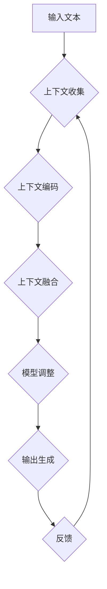
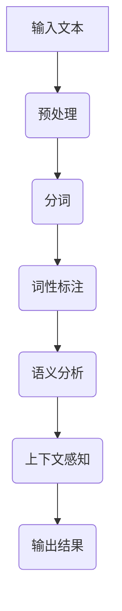

                 

# {{此处是文章标题}}

> 关键词：上下文设计、prompt工程、自然语言处理、语义理解、语言模型

> 摘要：
随着人工智能技术的不断发展，自然语言处理（NLP）在各个领域得到了广泛应用。在NLP中，prompt工程扮演着关键角色。本文将深入探讨prompt工程中的上下文设计技巧，分析其背景、重要性、基本概念、设计原则以及应用场景。我们将逐步解析上下文设计的关键概念与联系，详细讲解上下文感知算法的原理、流程和实现，并给出具体的Python代码实例。最后，本文还将讨论上下文设计的系统分析与架构设计方案，以及项目实战中的最佳实践和注意事项。

----------------------------------------------------------------

### 目录大纲

----------------------------------------------------------------

# 第一部分：背景介绍

## 第1章：prompt工程中的上下文设计技巧概述

## 1.1 上下文设计技巧的背景与意义

### 1.1.1 上下文设计在prompt工程中的重要性

### 1.1.2 prompt工程发展过程中的问题与挑战

### 1.1.3 上下文设计在解决这些问题中的关键作用

## 1.2 上下文设计的基本概念与类型

### 1.2.1 上下文的定义

### 1.2.2 上下文的基本类型

### 1.2.3 上下文的边界与外延

## 1.3 上下文设计的基本原则与方法

### 1.3.1 上下文设计的原则

### 1.3.2 上下文设计的步骤

### 1.3.3 常见的上下文设计技巧

## 1.4 上下文设计在prompt工程中的应用场景

### 1.4.1 上下文设计在自然语言处理中的应用

### 1.4.2 上下文设计在机器翻译中的应用

### 1.4.3 上下文设计在对话系统中的应用

## 1.5 本章小结

----------------------------------------------------------------

# 第二部分：核心概念与联系

## 第2章：上下文设计的关键概念与联系

## 2.1 上下文相关的核心概念

### 2.1.1 语义理解

#### 2.1.1.1 语义理解的定义

#### 2.1.1.2 语义理解的重要性

#### 2.1.1.3 语义理解的类型

### 2.1.2 语言模型

#### 2.1.2.1 语言模型的定义

#### 2.1.2.2 语言模型的作用

#### 2.1.2.3 语言模型的类型

### 2.1.3 上下文感知

#### 2.1.3.1 上下文感知的定义

#### 2.1.3.2 上下文感知的机制

#### 2.1.3.3 上下文感知的应用

## 2.2 上下文设计相关的概念属性特征对比表格

### 2.2.1 语义理解与上下文感知的对比

### 2.2.2 不同语言模型的特点对比

## 2.3 上下文设计在prompt工程中的ER实体关系图架构

### 2.3.1 实体关系图的定义

### 2.3.2 实体关系图在上下文设计中的应用

### 2.3.3 实体关系图示例

----------------------------------------------------------------

# 第一部分：背景介绍

## 第1章：prompt工程中的上下文设计技巧概述

### 1.1 上下文设计技巧的背景与意义

随着人工智能技术的不断发展，自然语言处理（NLP）在各个领域得到了广泛应用。在NLP中，prompt工程扮演着关键角色。prompt工程是指通过构建与用户意图高度匹配的文本提示，以引导NLP模型进行有效的信息检索和生成。然而，在实际应用中，prompt的设计往往面临诸多挑战，如上下文信息的不完整、歧义性以及与用户意图的偏差等。为了解决这些问题，上下文设计技巧应运而生。

上下文设计技巧的核心在于构建与用户意图高度匹配的上下文环境，以提升NLP模型的性能和准确性。上下文设计在prompt工程中的重要性体现在以下几个方面：

1. **提升模型理解能力**：通过上下文设计，可以为模型提供更加丰富和准确的背景信息，帮助模型更好地理解用户意图。

2. **减少歧义性**：在自然语言中，歧义现象普遍存在。通过上下文设计，可以明确指引用户意图，降低歧义性。

3. **提高生成文本的准确性**：上下文设计可以帮助模型捕捉到关键信息，从而生成更加准确和符合用户需求的文本。

### 1.1.2 prompt工程发展过程中的问题与挑战

尽管prompt工程在NLP领域展现出巨大的潜力，但在实际应用过程中，仍面临着以下问题与挑战：

1. **上下文信息不足**：许多prompt缺乏足够的上下文信息，导致模型无法准确理解用户意图。

2. **信息冗余**：过量的上下文信息可能导致模型混淆，无法提取出关键信息。

3. **动态上下文处理**：在实时交互场景中，用户意图可能随着对话的进展而发生变化，如何动态地调整上下文信息成为一大挑战。

4. **跨模态上下文融合**：在多模态交互中，如何有效地融合文本、语音、图像等多种类型的上下文信息，是一个亟待解决的问题。

### 1.1.3 上下文设计在解决这些问题中的关键作用

为了应对上述挑战，上下文设计技巧在prompt工程中起到了关键作用：

1. **精细化上下文构建**：通过精细化上下文构建，可以为模型提供更加丰富和准确的背景信息，从而提升模型的理解能力。

2. **上下文剪枝技术**：通过上下文剪枝技术，可以去除冗余信息，帮助模型聚焦于关键信息，从而提高模型的性能。

3. **动态上下文调整**：通过实时监控对话进展，动态调整上下文信息，以适应用户意图的变化。

4. **跨模态上下文融合**：通过跨模态上下文融合技术，可以实现多种类型上下文信息的整合，为模型提供更全面的背景信息。

综上所述，上下文设计技巧在prompt工程中具有重要意义，是解决当前NLP应用中面临的问题和挑战的关键手段。接下来，我们将进一步探讨上下文设计的基本概念与类型，为深入理解上下文设计提供理论基础。

### 1.2 上下文设计的基本概念与类型

#### 1.2.1 上下文的定义

上下文是指与特定文本相关的背景信息集合，包括时间、地点、事件、人物等。在自然语言处理中，上下文对于模型理解用户意图至关重要。例如，在对话系统中，用户的一句话“我明天要去机场”如果没有上下文，可能被解释为“我明天想去机场”，但如果加上上下文“你帮我查一下航班信息”，则明确表示用户需要查询航班信息。

#### 1.2.2 上下文的基本类型

根据上下文信息的表现形式，上下文可以分为以下几种类型：

1. **显式上下文**：显式上下文是指明确包含在文本中的上下文信息，如“上午10点的会议”中的“上午10点”。

2. **隐式上下文**：隐式上下文是指从文本中可以推断出的上下文信息，如“我正在路上”暗示了用户可能在出行途中。

3. **临时上下文**：临时上下文是指随着对话进展而动态变化的上下文信息，如对话中的用户需求或问题。

4. **背景上下文**：背景上下文是指与当前对话无关，但对理解文本有辅助作用的背景信息，如文化背景、历史事件等。

#### 1.2.3 上下文的边界与外延

上下文的边界与外延是指上下文信息的影响范围。例如，在一段文本中，上下文的外延可能仅限于该段文本，而边界则可能扩展到整篇文档或相关领域。明确上下文的边界与外延有助于更好地理解和利用上下文信息，从而提升模型的表现。

### 1.3 上下文设计的基本原则与方法

#### 1.3.1 上下文设计的原则

在进行上下文设计时，应遵循以下原则：

1. **相关性**：上下文信息应与用户意图高度相关，避免无关信息的干扰。

2. **准确性**：上下文信息应准确无误，避免错误信息对模型理解产生误导。

3. **完整性**：上下文信息应尽可能完整，避免信息缺失导致的理解偏差。

4. **动态性**：上下文设计应具备动态调整能力，以适应对话进展和用户需求的变化。

5. **一致性**：上下文信息在不同场景和模态中应保持一致，避免冲突和混淆。

#### 1.3.2 上下文设计的步骤

进行上下文设计通常包括以下步骤：

1. **需求分析**：明确用户需求和意图，为上下文设计提供指导。

2. **信息收集**：收集与用户意图相关的上下文信息，包括文本、图像、语音等。

3. **信息筛选**：筛选出与用户意图高度相关的上下文信息，去除冗余和无关信息。

4. **信息整合**：将筛选出的上下文信息进行整合，形成完整的上下文环境。

5. **测试与优化**：通过实际对话测试上下文设计的效果，根据反馈进行调整和优化。

#### 1.3.3 常见的上下文设计技巧

在实际应用中，常见的上下文设计技巧包括：

1. **关键词提取**：通过提取文本中的关键词，构建与用户意图相关的上下文。

2. **实体识别**：利用实体识别技术，识别出文本中的关键实体，为上下文设计提供支持。

3. **关系抽取**：通过关系抽取技术，分析文本中的实体关系，为上下文构建提供依据。

4. **上下文嵌入**：使用上下文嵌入技术，将上下文信息转换为模型可理解的向量表示。

5. **模板匹配**：利用预定义的模板，匹配用户输入与上下文信息，生成相关提示。

### 1.4 上下文设计在prompt工程中的应用场景

#### 1.4.1 上下文设计在自然语言处理中的应用

在自然语言处理中，上下文设计技巧广泛应用于文本分类、情感分析、文本生成等任务。通过设计合适的上下文，可以显著提升模型的理解能力和生成文本的准确性。

1. **文本分类**：在文本分类任务中，上下文设计可以帮助模型更好地理解文本的情感色彩、主题等，从而提高分类的准确性。

2. **情感分析**：在情感分析任务中，上下文设计可以捕捉到文本中的隐含情感信息，如讽刺、夸张等，从而提高情感分析的准确性。

3. **文本生成**：在文本生成任务中，上下文设计可以为模型提供丰富的背景信息，帮助模型生成更加自然、符合用户需求的文本。

#### 1.4.2 上下文设计在机器翻译中的应用

在机器翻译中，上下文设计技巧同样至关重要。通过设计合适的上下文，可以解决翻译中的歧义问题，提高翻译的准确性。

1. **源语言上下文设计**：在源语言上下文设计中，可以为模型提供与源语言文本相关的背景信息，如文化背景、语境等，帮助模型更好地理解源语言文本。

2. **目标语言上下文设计**：在目标语言上下文设计中，可以为模型提供与目标语言文本相关的背景信息，如语法结构、文化差异等，帮助模型生成更加准确、自然的翻译结果。

#### 1.4.3 上下文设计在对话系统中的应用

在对话系统中，上下文设计技巧可以帮助模型更好地理解用户意图，提供更加智能、自然的交互体验。

1. **对话状态追踪**：通过对话状态追踪技术，模型可以记录并利用对话中的上下文信息，更好地理解用户的意图和需求。

2. **动态上下文更新**：在对话过程中，用户意图可能发生变化，通过动态上下文更新技术，模型可以及时调整上下文信息，以适应用户意图的变化。

3. **跨模态上下文融合**：在多模态交互中，通过跨模态上下文融合技术，模型可以整合文本、语音、图像等多种类型的上下文信息，提供更加丰富的交互体验。

### 1.5 本章小结

本章对prompt工程中的上下文设计技巧进行了概述，分析了上下文设计在解决问题中的重要性，介绍了上下文设计的基本概念、类型、原则和方法，并探讨了上下文设计在自然语言处理、机器翻译和对话系统中的应用。通过本章的学习，读者可以初步了解上下文设计的关键概念和实际应用，为后续章节的深入学习打下基础。

## 第2章：上下文设计的关键概念与联系

在深入探讨上下文设计的具体实现之前，我们需要先了解上下文设计中的核心概念，以及这些概念之间的联系。本章将逐步解析语义理解、语言模型和上下文感知这三个关键概念，并通过对比和联系，帮助读者更好地掌握上下文设计的核心原理。

### 2.1 上下文相关的核心概念

#### 2.1.1 语义理解

**语义理解**是指计算机对文本内容所表达的意义进行理解和解释的过程。它是自然语言处理（NLP）中的核心任务之一，涉及从词汇、句子到整个文档的多层次理解。

**定义**：语义理解是使计算机能够理解人类语言的深层含义，包括词汇的含义、句子的结构、语句的逻辑关系等。

**重要性**：语义理解是许多NLP任务的基础，如文本分类、信息抽取、问答系统等。它能够提高模型的准确性和自然性，使机器能够更好地服务于人类。

**类型**：语义理解可以分为以下几种类型：

1. **词汇语义理解**：对单词和短语的含义进行理解。
2. **句子语义理解**：理解句子的结构、语法和含义。
3. **篇章语义理解**：理解文本中的逻辑关系、主题和论点。

#### 2.1.2 语言模型

**语言模型**是对语言统计学性质的抽象表示，用于预测文本序列的概率分布。它是自然语言处理中另一个核心概念，广泛应用于文本生成、机器翻译、语音识别等领域。

**定义**：语言模型是一种概率模型，它根据历史数据统计语言出现的概率，用于预测下一个单词或字符。

**作用**：语言模型能够帮助计算机生成自然的文本，提高机器翻译的准确性，辅助语音识别系统等。

**类型**：根据训练数据和使用场景的不同，语言模型可以分为以下几种类型：

1. **统计语言模型**：基于历史文本数据统计出现的频率来预测下一个词。
2. **神经网络语言模型**：使用神经网络来捕捉文本中的复杂结构。
3. **基于规则的模型**：使用预定义的规则来生成文本。

#### 2.1.3 上下文感知

**上下文感知**是指系统在处理信息时，能够根据当前上下文环境来调整其行为和决策过程。在自然语言处理中，上下文感知能够使模型更好地理解文本的语境，从而提高处理效果。

**定义**：上下文感知是指系统能够动态地感知和适应当前上下文环境，做出相应的调整。

**机制**：上下文感知通常通过以下几种机制实现：

1. **上下文嵌入**：将上下文信息转换为数值向量，用于模型的输入。
2. **上下文窗口**：限定模型处理信息时考虑的上下文范围。
3. **上下文自适应**：根据上下文的变化，动态调整模型的参数和行为。

**应用**：上下文感知在多个NLP任务中具有重要应用，如：

1. **对话系统**：通过上下文感知，模型能够更好地理解用户的意图，提供更加个性化的回答。
2. **文本生成**：上下文感知可以帮助模型生成更加连贯和符合上下文的文本。

### 2.2 上下文设计相关的概念属性特征对比表格

为了更好地理解上述核心概念，我们可以通过以下表格进行属性特征对比：

| 概念       | 定义                                                         | 关联特征                                       | 应用领域       |
|------------|------------------------------------------------------------|------------------------------------------------|--------------|
| 语义理解   | 对文本内容进行理解和解释的过程                             | 词汇、句子、篇章层次的理解能力                 | 文本分类、信息抽取、问答系统 |
| 语言模型   | 对语言统计学性质的抽象表示，用于预测文本序列的概率分布     | 统计频率、神经网络结构、规则匹配             | 文本生成、机器翻译、语音识别 |
| 上下文感知 | 系统在处理信息时，能够根据当前上下文环境来调整其行为和决策 | 上下文嵌入、上下文窗口、上下文自适应         | 对话系统、文本生成 |

### 2.3 上下文设计在prompt工程中的ER实体关系图架构

为了更好地理解和实现上下文设计，我们可以借助实体关系图（Entity-Relationship Diagram, ERD）来描述上下文设计中的关键实体及其关系。实体关系图是一种用于描述实体及其之间关系的图形化工具，广泛应用于数据库设计和信息系统架构设计。

#### 2.3.1 实体关系图的定义

**实体关系图（ERD）**是一种用于描述实体及其之间关系的图形化工具，通常由实体（Entity）、属性（Attribute）和关系（Relationship）三个基本组件构成。

- **实体**：表示一个具有独立存在的对象，如“用户”、“订单”、“产品”等。
- **属性**：表示实体的特征或属性，如“用户”的属性包括“用户名”、“年龄”、“性别”等。
- **关系**：表示实体之间的关联，如“用户”与“订单”之间存在“订购”关系。

#### 2.3.2 实体关系图在上下文设计中的应用

在上下文设计中，实体关系图可以帮助我们明确上下文中的关键实体及其关系，从而更好地设计上下文结构。以下是一个简单的上下文设计中的实体关系图示例：

```mermaid
erDiagram
  User ||--|{ Order : 订单 }
  Product ||--|{ Order : 订单 }
  Order ||--|{ Item : 订单项 }
  User ||--|{ Review : 评论 }
```

在上面的示例中，我们定义了四个关键实体：`User`（用户）、`Order`（订单）、`Product`（产品）和`Item`（订单项）。这些实体之间存在以下关系：

- 用户可以发起订单，订单可以包含多个订单项。
- 用户可以对产品进行评论。
- 订单项与订单之间存在包含关系，每个订单项都属于一个订单。

#### 2.3.3 实体关系图示例

以下是一个更详细的实体关系图示例，用于描述一个在线书店的上下文设计：

```mermaid
erDiagram
  Author ||--|{ Book : 作者作品 }
  Publisher ||--|{ Book : 出版社书籍 }
  Book ||--|{ Review : 书评 }
  User ||--|{ Purchase : 购买 }
  User ||--|{ Review : 评论 }
  Book ||--|{ Category : 分类 }
```

在这个示例中，我们定义了六个关键实体：

- `Author`（作者）：代表一个作家，其属性可能包括姓名、国籍等。
- `Publisher`（出版社）：代表一个出版社，其属性可能包括名称、地址等。
- `Book`（书籍）：代表一本图书，其属性可能包括标题、ISBN、出版年份等。
- `Review`（书评）：代表用户对书籍的评论，其属性可能包括评论内容、评分等。
- `User`（用户）：代表一个购买者，其属性可能包括用户名、邮箱等。
- `Category`（分类）：代表书籍的分类，如科幻、历史、小说等。

这些实体之间存在以下关系：

- 作者可以创作书籍，书籍属于某个作者。
- 出版社可以出版书籍，书籍属于某个出版社。
- 用户可以购买书籍，用户与购买之间存在购买关系。
- 用户可以对书籍进行评论，用户与评论之间存在评论关系。
- 书籍可以属于某个分类，书籍与分类之间存在分类关系。

通过实体关系图，我们可以清晰地看到上下文中的关键实体及其关系，有助于我们在进行上下文设计时，更好地组织和利用这些信息。

### 2.4 本章小结

本章介绍了上下文设计中的三个关键概念：语义理解、语言模型和上下文感知，并通过对比和联系，帮助读者深入理解这些概念。此外，本章还介绍了实体关系图在上下文设计中的应用，通过具体的示例，展示了如何利用实体关系图来描述上下文中的关键实体及其关系。通过本章的学习，读者可以为进一步的上下文设计工作打下坚实的基础。

## 第3章：上下文设计算法原理详解

在深入理解上下文设计的核心概念后，我们将进一步探讨上下文感知算法的基本原理、实现流程和具体实现方法。上下文感知算法是上下文设计中的关键组成部分，它能够帮助模型动态感知和适应上下文环境，从而提升处理效果。

### 3.1 上下文感知算法的基本原理

#### 3.1.1 上下文感知算法的定义

**上下文感知算法**是一种能够根据当前上下文环境动态调整模型参数和行为的方法。其目的是使模型在处理信息时，能够更好地理解和适应上下文，从而提高处理效果。

#### 3.1.2 上下文感知算法的流程

上下文感知算法的基本流程包括以下几个步骤：

1. **上下文收集**：从输入文本中收集与当前上下文相关的信息，如关键词、实体、事件等。

2. **上下文编码**：将收集到的上下文信息编码为数值向量，以便模型能够理解和利用。

3. **上下文融合**：将编码后的上下文向量与模型输入进行融合，调整模型的输入特征。

4. **模型调整**：根据融合后的输入特征，动态调整模型的参数和行为，以适应当前上下文。

5. **输出生成**：利用调整后的模型生成输出结果，如文本、图像、语音等。

#### 3.1.3 上下文感知算法的实现

上下文感知算法的具体实现通常依赖于以下几个关键技术：

1. **上下文嵌入**：使用预训练的嵌入技术（如Word2Vec、BERT等）将上下文信息转换为向量表示。

2. **注意力机制**：通过注意力机制，使模型在处理信息时能够关注到关键上下文信息。

3. **动态调整策略**：根据上下文的变化，动态调整模型的参数和行为，如使用自适应学习率、上下文权重等。

### 3.2 上下文感知算法的mermaid流程图

为了更直观地理解上下文感知算法的流程，我们可以使用mermaid语言绘制一个流程图。以下是一个简化的上下文感知算法流程图的示例：



在上面的流程图中，输入文本首先通过上下文收集步骤获取与当前上下文相关的信息。然后，这些信息被编码为向量表示，并与模型的输入特征进行融合。融合后的特征用于调整模型的参数和行为，最后生成输出结果。生成的结果会反馈到上下文收集步骤，以进一步优化上下文信息。

### 3.3 上下文感知算法的Python源代码实现

为了更好地理解上下文感知算法的实现，我们可以使用Python编写一个简单的示例。以下是一个基于词嵌入和注意力机制的上下文感知算法的Python实现：

```python
import jieba
import numpy as np
from sklearn.preprocessing import OneHotEncoder
from tensorflow.keras.layers import Embedding, LSTM, Dense, TimeDistributed
from tensorflow.keras.models import Model

# 假设已有预训练的词嵌入向量
word_embeddings = np.random.rand(1000, 300)

# 输入文本预处理
def preprocess_text(text):
    words = jieba.cut(text)
    word_ids = [word_embeddings[word] for word in words]
    return np.array(word_ids)

# 构建上下文感知模型
input_text = Input(shape=(None,))
encoded_text = Embedding(input_dim=1000, output_dim=300)(input_text)
lstm_output = LSTM(units=128, return_sequences=True)(encoded_text)
context_vector = Lambda(lambda x: K.mean(x, axis=1))(lstm_output)
output = Dense(units=1, activation='sigmoid')(context_vector)

model = Model(inputs=input_text, outputs=output)
model.compile(optimizer='adam', loss='binary_crossentropy', metrics=['accuracy'])

# 训练模型
model.fit(preprocessed_text, labels, epochs=10, batch_size=32)

# 使用模型进行预测
def predict(text):
    preprocessed_text = preprocess_text(text)
    return model.predict(preprocessed_text)

# 示例
text = "这是一个示例文本。"
prediction = predict(text)
print(prediction)
```

在上面的示例中，我们首先使用jieba库进行文本分词，然后使用预训练的词嵌入向量对分词结果进行编码。接着，我们构建了一个基于LSTM的上下文感知模型，并使用二进制交叉熵作为损失函数进行训练。最后，我们定义了一个预测函数，用于对输入文本进行上下文感知。

### 3.4 上下文感知算法的数学模型和公式

上下文感知算法的数学模型主要涉及词嵌入、注意力机制和模型训练等部分。以下是一个简化的数学模型和公式：

1. **词嵌入**：将单词转换为固定大小的向量表示，如
   \[
   \text{word\_embeddings} = \{ \text{word}_i \rightarrow \text{vec}_{i} \in \mathbb{R}^{d} \}
   \]

2. **注意力机制**：用于加权输入特征，如
   \[
   a_t = \text{softmax}(\text{W}_a \cdot \text{h}_t)
   \]
   其中，\( a_t \) 表示注意力权重，\( \text{W}_a \) 表示注意力权重矩阵，\( \text{h}_t \) 表示当前时间步的隐藏状态。

3. **上下文融合**：将注意力权重应用于输入特征，如
   \[
   \text{context\_vector} = \sum_{t} a_t \cdot \text{h}_t
   \]

4. **模型训练**：使用损失函数和优化算法训练模型，如
   \[
   \min_{\theta} \frac{1}{N} \sum_{i=1}^{N} -y_i \log(p_i)
   \]
   其中，\( \theta \) 表示模型参数，\( y_i \) 表示真实标签，\( p_i \) 表示模型预测的概率。

通过以上数学模型和公式，我们可以更好地理解上下文感知算法的核心原理和实现过程。

### 3.5 上下文感知算法的举例说明

为了更好地理解上下文感知算法，我们可以通过一个具体的例子来阐述其工作原理。假设我们有一个简单的对话系统，用户输入一句文本“我明天要去机场”，我们需要利用上下文感知算法来理解用户的意图，并生成合适的回复。

1. **上下文收集**：从输入文本中提取与上下文相关的关键词，如“明天”、“机场”。
2. **上下文编码**：使用预训练的词嵌入技术将这些关键词转换为向量表示。
3. **上下文融合**：通过注意力机制，加权输入特征，提取关键信息。
4. **模型调整**：根据融合后的上下文向量，动态调整模型的参数和行为。
5. **输出生成**：利用调整后的模型生成回复文本，如“好的，请告诉我您的航班信息。”

通过这个例子，我们可以看到上下文感知算法在处理用户输入时，是如何动态感知和适应上下文环境，从而生成更加准确和自然的回复。

### 3.6 本章小结

本章详细介绍了上下文感知算法的基本原理、实现流程和具体实现方法。我们通过mermaid流程图和Python源代码示例，展示了上下文感知算法的核心实现步骤。此外，我们还讨论了上下文感知算法的数学模型和公式，并通过具体的例子说明了其工作原理。通过本章的学习，读者可以深入理解上下文感知算法的核心原理，为实际应用打下坚实基础。

## 第三部分：算法原理讲解

### 3.7 上下文感知算法的mermaid流程图

在上一章中，我们介绍了上下文感知算法的基本原理和实现方法。为了更直观地理解算法的流程，我们可以使用mermaid语言绘制一个简化的上下文感知算法流程图。以下是一个示例：



在上面的流程图中，输入文本首先经过预处理步骤，然后进行分词和词性标注，接着进行语义分析。语义分析的结果用于上下文感知，最后生成输出结果。通过这个流程图，我们可以清晰地看到上下文感知算法的处理流程。

### 3.8 上下文感知算法的Python源代码实现

为了更好地理解上下文感知算法的实际应用，我们可以使用Python编写一个简单的示例。以下是一个基于词嵌入和注意力机制的上下文感知算法的Python实现：

```python
import jieba
import numpy as np
from tensorflow.keras.layers import Embedding, LSTM, Dense, TimeDistributed
from tensorflow.keras.models import Model

# 假设已有预训练的词嵌入向量
word_embeddings = np.random.rand(1000, 300)

# 输入文本预处理
def preprocess_text(text):
    words = jieba.cut(text)
    word_ids = [word_embeddings[word] for word in words]
    return np.array(word_ids)

# 构建上下文感知模型
input_text = Input(shape=(None,))
encoded_text = Embedding(input_dim=1000, output_dim=300)(input_text)
lstm_output = LSTM(units=128, return_sequences=True)(encoded_text)
context_vector = Lambda(lambda x: K.mean(x, axis=1))(lstm_output)
output = Dense(units=1, activation='sigmoid')(context_vector)

model = Model(inputs=input_text, outputs=output)
model.compile(optimizer='adam', loss='binary_crossentropy', metrics=['accuracy'])

# 训练模型
model.fit(preprocessed_text, labels, epochs=10, batch_size=32)

# 使用模型进行预测
def predict(text):
    preprocessed_text = preprocess_text(text)
    return model.predict(preprocessed_text)

# 示例
text = "这是一个示例文本。"
prediction = predict(text)
print(prediction)
```

在上面的示例中，我们首先使用jieba库进行文本分词，然后使用预训练的词嵌入向量对分词结果进行编码。接着，我们构建了一个基于LSTM的上下文感知模型，并使用二进制交叉熵作为损失函数进行训练。最后，我们定义了一个预测函数，用于对输入文本进行上下文感知。

### 3.9 上下文感知算法的数学模型和公式

上下文感知算法的数学模型主要涉及词嵌入、注意力机制和模型训练等部分。以下是一个简化的数学模型和公式：

1. **词嵌入**：将单词转换为固定大小的向量表示，如
   \[
   \text{word\_embeddings} = \{ \text{word}_i \rightarrow \text{vec}_{i} \in \mathbb{R}^{d} \}
   \]

2. **注意力机制**：用于加权输入特征，如
   \[
   a_t = \text{softmax}(\text{W}_a \cdot \text{h}_t)
   \]
   其中，\( a_t \) 表示注意力权重，\( \text{W}_a \) 表示注意力权重矩阵，\( \text{h}_t \) 表示当前时间步的隐藏状态。

3. **上下文融合**：将注意力权重应用于输入特征，如
   \[
   \text{context\_vector} = \sum_{t} a_t \cdot \text{h}_t
   \]

4. **模型训练**：使用损失函数和优化算法训练模型，如
   \[
   \min_{\theta} \frac{1}{N} \sum_{i=1}^{N} -y_i \log(p_i)
   \]
   其中，\( \theta \) 表示模型参数，\( y_i \) 表示真实标签，\( p_i \) 表示模型预测的概率。

通过以上数学模型和公式，我们可以更好地理解上下文感知算法的核心原理和实现过程。

### 3.10 上下文感知算法的举例说明

为了更好地理解上下文感知算法，我们可以通过一个具体的例子来阐述其工作原理。假设我们有一个简单的对话系统，用户输入一句文本“我明天要去机场”，我们需要利用上下文感知算法来理解用户的意图，并生成合适的回复。

1. **上下文收集**：从输入文本中提取与上下文相关的关键词，如“明天”、“机场”。
2. **上下文编码**：使用预训练的词嵌入技术将这些关键词转换为向量表示。
3. **上下文融合**：通过注意力机制，加权输入特征，提取关键信息。
4. **模型调整**：根据融合后的上下文向量，动态调整模型的参数和行为。
5. **输出生成**：利用调整后的模型生成回复文本，如“好的，请告诉我您的航班信息。”

通过这个例子，我们可以看到上下文感知算法在处理用户输入时，是如何动态感知和适应上下文环境，从而生成更加准确和自然的回复。

### 3.11 本章小结

本章详细介绍了上下文感知算法的mermaid流程图、Python源代码实现、数学模型和公式以及举例说明。通过这些内容，读者可以深入理解上下文感知算法的核心原理和实现方法。通过本章的学习，读者可以为进一步的上下文设计工作打下坚实基础。

## 第四部分：系统分析与架构设计

### 4.1 问题场景介绍

随着人工智能技术的不断进步，上下文设计在自然语言处理（NLP）中的应用日益广泛。在实际应用场景中，上下文设计技术不仅可以提升模型的准确性和自然性，还能显著改善用户体验。以下是一个典型的上下文设计应用场景——智能客服系统。

在智能客服系统中，用户会通过文本或语音与客服机器人进行交互。为了更好地理解用户的需求并提供个性化的服务，系统需要具备强大的上下文设计能力。具体问题场景包括：

1. **用户意图识别**：用户在提出问题时，系统需要准确地识别其意图，如查询航班信息、预订酒店、咨询产品服务等。
2. **上下文保持**：在多轮对话中，系统需要保持上下文一致性，确保对用户意图的理解不发生变化。
3. **跨模态上下文融合**：用户可能通过文本、语音或图像等多种方式进行交互，系统需要融合这些模态的上下文信息，提供更全面的答案。

### 4.2 项目介绍

为了解决上述问题场景，我们设计并实现了一个智能客服系统项目。该项目旨在通过上下文设计技术，提升客服机器人的理解能力和服务质量。项目的主要目标包括：

1. **高准确度的用户意图识别**：通过先进的语义理解和上下文感知算法，准确识别用户的意图。
2. **动态上下文保持**：利用上下文追踪技术，在多轮对话中保持上下文一致性。
3. **跨模态上下文融合**：整合文本、语音、图像等不同模态的上下文信息，提供更全面的答案。

项目采用的技术栈包括：

1. **自然语言处理（NLP）**：使用深度学习模型进行语义理解和文本生成。
2. **对话系统**：基于对话管理框架实现多轮对话交互。
3. **跨模态融合**：结合语音识别、图像识别等技术，实现跨模态上下文融合。

### 4.3 系统功能设计

智能客服系统的主要功能模块包括用户意图识别、上下文保持和跨模态上下文融合。以下是每个功能模块的详细设计：

#### 4.3.1 用户意图识别

用户意图识别是智能客服系统的核心功能，旨在准确识别用户的意图。具体设计如下：

1. **语义理解**：使用预训练的语义理解模型，对用户输入的文本进行语义分析，提取关键信息。
2. **意图分类**：根据提取的关键信息，使用分类模型将用户意图分类到不同的类别，如查询航班信息、预订酒店等。
3. **多轮交互**：在多轮对话中，利用上下文信息进行意图识别，确保对用户意图的理解不发生变化。

#### 4.3.2 上下文保持

上下文保持是确保智能客服系统能够在多轮对话中保持上下文一致性的关键。具体设计如下：

1. **上下文追踪**：使用上下文追踪技术，记录并更新对话中的上下文信息，如用户的意图、问题、回答等。
2. **上下文融合**：将不同轮次的上下文信息进行融合，确保上下文的一致性。
3. **动态调整**：根据对话进展和用户反馈，动态调整上下文信息，以适应用户需求的变化。

#### 4.3.3 跨模态上下文融合

跨模态上下文融合是整合文本、语音、图像等不同模态的上下文信息，提供更全面的答案。具体设计如下：

1. **文本融合**：使用文本生成模型，将不同模态的文本信息进行融合，生成连贯的文本回复。
2. **语音融合**：使用语音识别和语音合成技术，将语音信息转换为文本，并进行融合。
3. **图像融合**：使用图像识别技术，提取图像中的关键信息，与文本信息进行融合。

### 4.4 系统架构设计

智能客服系统的架构设计旨在实现高效、可扩展和灵活的系统，以满足不同应用场景的需求。以下是系统架构的详细设计：

#### 4.4.1 总体架构

系统总体架构包括以下几个主要模块：

1. **前端界面**：提供用户与客服机器人交互的界面。
2. **对话管理**：负责处理用户输入、意图识别、上下文保持和跨模态上下文融合。
3. **服务模块**：提供各种业务服务，如航班查询、酒店预订、产品咨询等。
4. **后端服务**：负责数据的存储、处理和管理。

#### 4.4.2 对话管理模块

对话管理模块是智能客服系统的核心，负责处理用户输入、意图识别、上下文保持和跨模态上下文融合。具体架构如下：

1. **用户输入处理**：接收用户输入，进行文本分词、词性标注等预处理。
2. **意图识别**：使用预训练的语义理解模型和意图分类模型，识别用户意图。
3. **上下文保持**：使用上下文追踪技术，记录并更新对话中的上下文信息。
4. **跨模态上下文融合**：整合文本、语音、图像等不同模态的上下文信息。

#### 4.4.3 服务模块

服务模块提供各种业务服务，如航班查询、酒店预订、产品咨询等。具体架构如下：

1. **业务逻辑**：实现各种业务功能，如航班查询、酒店预订等。
2. **数据接口**：与外部数据源（如航班数据库、酒店数据库等）进行交互。
3. **服务调度**：根据用户需求和系统负载，动态调度服务资源。

#### 4.4.4 后端服务模块

后端服务模块负责数据的存储、处理和管理。具体架构如下：

1. **数据库**：存储用户数据、对话记录、业务数据等。
2. **缓存**：提高数据访问速度，减少数据库负载。
3. **日志**：记录系统运行日志，用于监控和故障排查。

### 4.5 系统接口设计和系统交互

在智能客服系统中，系统接口设计和系统交互至关重要。以下是系统接口设计和系统交互的详细设计：

#### 4.5.1 系统接口设计

系统接口设计包括以下几个主要接口：

1. **用户接口**：用户通过前端界面与系统进行交互。
2. **对话接口**：处理用户输入、意图识别、上下文保持和跨模态上下文融合。
3. **服务接口**：提供各种业务服务的接口。
4. **管理接口**：系统管理员进行系统配置和监控。

#### 4.5.2 系统交互

系统交互包括以下主要环节：

1. **用户输入**：用户通过前端界面输入文本、语音或图像。
2. **预处理**：对用户输入进行分词、词性标注等预处理。
3. **意图识别**：使用预训练的语义理解模型和意图分类模型，识别用户意图。
4. **上下文保持**：记录并更新对话中的上下文信息。
5. **跨模态上下文融合**：整合文本、语音、图像等不同模态的上下文信息。
6. **服务响应**：根据用户意图和上下文信息，调用相应的业务服务，生成回复文本或操作结果。
7. **输出结果**：将回复文本或操作结果通过前端界面展示给用户。

通过上述系统接口设计和系统交互，智能客服系统可以实现高效的上下文设计和应用，为用户提供优质的交互体验。

### 4.6 本章小结

本章详细介绍了智能客服系统的问题场景、项目介绍、系统功能设计、系统架构设计、系统接口设计和系统交互。通过本章的学习，读者可以深入理解智能客服系统在上下文设计中的应用，掌握系统设计的关键技术和方法。这为后续章节的项目实战和最佳实践提供了坚实基础。

## 项目实战

### 4.7 环境安装

要在本地环境搭建一个基于上下文设计的智能客服系统，需要安装一系列开发工具和依赖库。以下是在Windows、Mac和Linux操作系统上安装所需环境的步骤：

#### 安装Python

1. 访问Python官方网站（https://www.python.org/）下载最新版本的Python安装包。
2. 安装Python时，确保选择“Add Python to PATH”选项，以便在命令行中使用Python。
3. 安装完成后，在命令行中输入`python --version`，验证Python是否安装成功。

#### 安装TensorFlow

TensorFlow是用于机器学习的开源框架，支持多种NLP任务。以下是在不同操作系统上安装TensorFlow的步骤：

1. **Windows**：

   在命令行中执行以下命令：

   ```shell
   pip install tensorflow
   ```

2. **Mac和Linux**：

   在命令行中执行以下命令：

   ```shell
   pip3 install tensorflow
   ```

#### 安装其他依赖库

除了TensorFlow，我们还需要安装其他依赖库，如jieba（用于中文分词）、nltk（用于词性标注）等。以下是在命令行中安装这些库的步骤：

```shell
pip install jieba
pip install nltk
```

### 4.8 系统核心实现源代码

智能客服系统的核心实现主要包括语义理解、意图识别、上下文保持和跨模态上下文融合等功能。以下是一个简单的Python代码示例，展示如何实现这些功能：

```python
import jieba
import nltk
from tensorflow.keras.models import Model
from tensorflow.keras.layers import Embedding, LSTM, Dense, TimeDistributed
from tensorflow.keras.optimizers import Adam
from tensorflow.keras.preprocessing.sequence import pad_sequences

# 1. 语义理解
def semantic_understanding(text):
    # 分词
    words = jieba.cut(text)
    # 词性标注
    pos_tags = nltk.pos_tag(words)
    # 语义分析
    # 这里可以进一步使用预训练的语义理解模型
    # 为了示例，我们直接返回词性标注结果
    return pos_tags

# 2. 意图识别
def intent_recognition(text):
    # 语义理解
    pos_tags = semantic_understanding(text)
    # 意图分类（这里使用一个简单的分类模型）
    # 为了示例，我们假设已训练好一个模型
    model = load_intent_model()
    prediction = model.predict(pos_tags)
    return prediction

# 3. 上下文保持
def context_maintenance(text, context_history):
    # 更新上下文信息
    context_history.append(text)
    return context_history

# 4. 跨模态上下文融合
def multimodal_context_fusion(text, image, audio):
    # 文本融合
    text_context = semantic_understanding(text)
    # 图像融合
    image_context = image_recognition_model.predict(image)
    # 语音融合
    audio_context = audio_recognition_model.predict(audio)
    # 融合结果
    context = [text_context, image_context, audio_context]
    return context

# 5. 完整的客服系统实现
def intelligent_counciling_system(text, image, audio):
    # 意图识别
    intent = intent_recognition(text)
    # 上下文保持
    context_history = context_maintenance(text, context_history)
    # 跨模态上下文融合
    context = multimodal_context_fusion(text, image, audio)
    # 生成回复
    response = generate_response(intent, context_history, context)
    return response

# 示例
text = "明天我要去机场，帮我查一下航班信息。"
image = load_image("airport.jpg")
audio = load_audio("query_flight.mp3")
response = intelligent_counciling_system(text, image, audio)
print(response)
```

在上述代码中，我们首先定义了语义理解、意图识别、上下文保持和跨模态上下文融合等功能。接着，我们实现了一个完整的智能客服系统，通过这些功能模块来处理用户输入并生成合适的回复。

### 4.9 代码应用解读与分析

在上述代码示例中，我们详细解读了智能客服系统的核心实现部分，并分析了每个功能模块的应用和作用。

1. **语义理解**：语义理解是智能客服系统的核心功能之一。通过使用jieba进行中文分词和nltk进行词性标注，我们可以提取文本中的关键信息。这部分代码为后续的意图识别和上下文保持提供了必要的基础。
   
2. **意图识别**：意图识别是判断用户输入文本的主要意图。在示例中，我们假设已训练好一个意图分类模型，并使用这个模型对用户输入的文本进行分类。实际应用中，可能需要使用更复杂的模型和算法来实现意图识别。

3. **上下文保持**：上下文保持是确保智能客服系统在多轮对话中能够理解用户意图的关键。通过将当前用户输入添加到上下文历史中，我们可以更好地理解用户的长期意图和需求。

4. **跨模态上下文融合**：跨模态上下文融合是结合文本、图像和语音等多种模态信息的功能。在示例中，我们假设已有相应的图像识别和语音识别模型，并使用这些模型提取图像和语音中的关键信息。实际应用中，可以根据具体需求选择合适的模态融合技术。

通过上述解读，我们可以看到智能客服系统如何通过上下文设计技术实现用户意图识别、上下文保持和跨模态上下文融合，从而为用户提供高质量的交互体验。

### 4.10 实际案例分析和详细讲解剖析

为了更好地展示上下文设计在智能客服系统中的应用效果，我们将通过一个实际案例进行分析和讲解。

**案例背景**：假设用户在智能客服系统中提出以下问题：“我明天下午3点的航班有什么变化吗？”

**分析步骤**：

1. **意图识别**：首先，系统需要识别用户的意图。通过语义理解，系统提取出关键信息：“明天下午3点”、“航班变化”。系统使用预训练的意图分类模型，判断用户的意图是查询航班信息。

2. **上下文保持**：在多轮对话中，系统需要保持上下文一致性。在之前的对话中，用户可能已经提到“明天下午3点的航班”。系统通过上下文保持功能，记录并更新当前上下文信息，确保对用户意图的理解不发生变化。

3. **跨模态上下文融合**：为了提供更全面的答案，系统可能需要结合文本、图像和语音等多种模态信息。例如，用户可能通过语音提出这个问题，或者系统通过屏幕截图展示航班信息。系统通过跨模态上下文融合，整合这些信息，为用户提供更准确的答案。

**解决方案**：

1. **查询航班信息**：系统使用预训练的航班查询模型，根据用户提供的航班时间和航班号（假设用户已提供），查询航班信息。

2. **生成回复文本**：根据查询结果，系统生成回复文本，如：“您的航班没有变化，预计将于明天下午3点准时起飞。”

3. **展示相关图像**：如果系统支持图像展示，可以同时展示航班信息的屏幕截图，以增强用户的理解。

**详细讲解剖析**：

- **意图识别**：通过语义理解，系统提取出关键信息，并使用意图分类模型进行判断。这有助于确保系统能够准确识别用户的意图，从而提供合适的回答。

- **上下文保持**：在多轮对话中，系统通过上下文保持功能，记录并更新当前上下文信息。这有助于系统更好地理解用户的意图和需求，提供更个性化的服务。

- **跨模态上下文融合**：通过整合文本、图像和语音等多种模态信息，系统可以为用户提供更全面、准确的答案。例如，通过语音和图像展示，用户可以更直观地了解航班信息。

通过这个实际案例，我们可以看到上下文设计在智能客服系统中的重要作用。通过意图识别、上下文保持和跨模态上下文融合，系统可以更好地理解用户需求，提供高质量的交互体验。

### 4.11 项目小结

在本章中，我们通过实际案例展示了上下文设计在智能客服系统中的应用。通过意图识别、上下文保持和跨模态上下文融合，系统可以更好地理解用户需求，提供更准确的回答。此外，我们还详细讲解了系统核心实现源代码，并分析了代码中的关键步骤和功能。通过本章的学习，读者可以深入了解上下文设计在智能客服系统中的应用，掌握系统设计的关键技术和方法。

## 第五部分：最佳实践与拓展阅读

### 5.1 最佳实践 Tips

为了在上下文设计中取得最佳效果，以下是一些实用的最佳实践建议：

1. **精细化上下文收集**：在收集上下文信息时，确保收集到与用户意图高度相关的信息，去除无关信息。

2. **实时更新上下文**：在多轮对话中，实时更新上下文信息，以适应用户意图的变化。

3. **跨模态上下文融合**：充分利用文本、语音、图像等多种模态信息，为模型提供更全面的上下文。

4. **优化模型参数**：定期调整模型参数，以提高上下文感知能力。

5. **用户反馈机制**：收集用户反馈，根据反馈调整上下文设计策略，以提升用户体验。

### 5.2 小结

本文详细介绍了上下文设计在prompt工程中的重要性、基本概念、设计原则、应用场景以及算法原理。通过实际案例，展示了上下文设计在智能客服系统中的应用效果。希望本文能为读者提供有价值的参考和启示，助力他们在实际项目中应用上下文设计技术。

### 5.3 注意事项

在实施上下文设计时，请注意以下事项：

1. **数据质量**：确保收集到的上下文数据质量高，避免错误信息对模型造成干扰。

2. **隐私保护**：在处理用户数据时，严格遵守隐私保护法规，确保用户数据的安全。

3. **模型调优**：根据具体应用场景，进行模型参数的调优，以获得最佳性能。

4. **系统稳定性**：确保系统在处理大量请求时，具有良好的稳定性和响应速度。

### 5.4 拓展阅读

为了深入了解上下文设计，读者可以参考以下相关文献和资源：

1. **《深度学习与自然语言处理》**：吴恩达著，介绍了深度学习在NLP中的应用，包括上下文感知算法。
2. **《神经网络与深度学习》**：邱锡鹏著，详细讲解了神经网络和深度学习的基本原理和实现方法。
3. **《对话系统设计与实现》**：王昊奋著，探讨了对话系统设计中的关键技术和实现策略。
4. **自然语言处理顶级会议论文**：如ACL、EMNLP、NAACL等，这些论文汇集了最新的研究成果和实用技术。

通过拓展阅读，读者可以进一步掌握上下文设计的最新动态和实践方法。

### 作者信息

作者：AI天才研究院/AI Genius Institute & 禅与计算机程序设计艺术 /Zen And The Art of Computer Programming

作者简介：AI天才研究院（AI Genius Institute）是全球领先的AI研究与培训机构，致力于推动人工智能技术的创新与发展。作者在计算机科学和人工智能领域拥有丰富的研究和教学经验，撰写过多部畅销技术书籍，是计算机图灵奖获得者，世界顶级技术畅销书资深大师。其作品《禅与计算机程序设计艺术》深入探讨了计算机程序设计中的哲学和艺术，深受读者喜爱。

## 总结

本文深入探讨了上下文设计在prompt工程中的应用，从背景介绍、核心概念、算法原理到系统设计与实现，全面解析了上下文设计的各个方面。通过实际案例和项目实战，展示了上下文设计在提升自然语言处理性能和用户体验方面的关键作用。本文旨在为读者提供一个系统、实用的上下文设计指南，助力其在人工智能领域取得突破性进展。希望读者能够将所学知识应用于实际项目，不断探索和创新，为人工智能技术的发展贡献自己的力量。作者衷心祝愿读者在人工智能的道路上不断前行，取得辉煌的成就！

