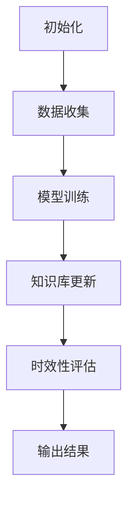

                 

# 提示词处理与响应

## 1.1.1 问题背景

在当前快速发展的技术时代，数据的时效性变得越来越重要。尤其是在使用大型语言模型（LLM）时，知识库的时效性管理成为一个关键问题。随着时间的推移，知识库中的信息会变得过时，这可能导致LLM输出的不准确或不相关。因此，如何有效地管理知识库的时效性，使其能够及时更新和反映最新的信息，成为了一个亟待解决的问题。

### 1.1.2 传统知识库的局限

传统的知识库管理方式主要依赖于手动更新和定期检查。这种方式往往存在以下问题：

- **更新频率低**：由于人力和时间的限制，知识库的更新频率较低，导致信息滞后。
- **维护成本高**：人工更新知识库需要大量的人力和时间，增加了维护成本。
- **时效性难以保证**：即使定期更新，也很难保证每一个信息点都是最新的，存在时效性问题。

### 1.1.3 prompt时效性管理的必要性

prompt时效性管理是指通过特定的技术手段，提高知识库的更新频率和准确性，确保知识库中的信息能够及时反映现实世界的变化。以下是实施prompt时效性管理的必要性：

- **提高输出质量**：时效性更高的知识库能够提供更准确和相关的信息，从而提高LLM的输出质量。
- **减少错误率**：及时更新的知识库可以减少由于信息过时而导致的错误或误导。
- **适应快速变化的环境**：在快速变化的环境中，时效性管理可以帮助系统更好地适应新情况。
- **增强用户信任**：及时和准确的知识库能够增强用户对系统的信任和依赖。

## 1.2 问题描述

### 1.2.1 现有知识库更新频率低

现有知识库的更新频率往往受到人力和资源的限制，导致知识库中的信息无法及时更新。这种情况下，LLM在处理问题时可能会引用陈旧或不准确的信息。

### 1.2.2 知识更新不及时导致的问题

- **输出不准确**：LLM可能基于过时的知识库产生错误的回答。
- **用户体验差**：用户可能因为获取到的信息不准确或过时而感到不满意。
- **决策失误**：依赖LLM生成决策的系统可能会因为知识库的时效性问题导致错误决策。

### 1.2.3 提升知识库时效性的需求

为了解决上述问题，提升知识库的时效性成为了一个迫切需求。这需要开发出能够自动、高效地更新知识库的技术，确保知识库中的信息始终是最新的。

## 1.3 问题解决

### 1.3.1 prompt时效性管理的概念

prompt时效性管理是一种通过自动化手段提高知识库更新频率和准确性的技术。它主要通过以下方式实现：

- **数据自动收集**：利用各种数据收集工具和API，自动获取最新的信息。
- **实时更新**：将获取的新信息实时更新到知识库中，确保信息的时效性。
- **模型自适应**：通过机器学习算法和模型优化，使知识库能够自动适应新信息。

### 1.3.2 提升知识库时效性的方法

- **增量更新**：仅更新知识库中的新增或变更部分，减少整体更新所需的时间和资源。
- **分布式更新**：将更新任务分散到多个节点进行，提高更新效率。
- **版本控制**：为知识库中的每个版本记录变更日志，方便追溯和回滚。

### 1.3.3 prompt时效性管理的技术基础

prompt时效性管理依赖于多种技术，包括：

- **自然语言处理（NLP）**：用于处理和提取文本信息。
- **机器学习**：用于训练模型，识别和更新知识库。
- **数据库管理**：用于存储和管理知识库中的数据。
- **API集成**：用于与其他系统和数据源进行交互。

## 1.4 边界与外延

### 1.4.1 prompt时效性管理的适用范围

prompt时效性管理适用于需要高时效性知识库的多个领域，包括但不限于：

- **智能问答系统**
- **决策支持系统**
- **在线教育平台**
- **智能客服系统**

### 1.4.2 prompt时效性管理的限制因素

- **数据源质量**：高质量的数据源是确保知识库时效性的前提。
- **计算资源**：高效的更新机制需要强大的计算资源支持。
- **模型适应性**：需要不断优化模型，以适应新的知识库需求。

### 1.4.3 prompt时效性管理的未来发展方向

未来，prompt时效性管理将朝着更智能、更高效的方向发展，包括：

- **自动化程度更高**：通过更先进的算法和工具，实现更自动化的更新流程。
- **跨领域适应性**：开发出能够适应更多领域的知识库更新机制。
- **实时交互**：实现知识库与用户实时交互，根据用户需求动态更新。

## 1.5 本章小结

本章详细介绍了prompt时效性管理的重要性和必要性。通过分析现有知识库的更新问题，提出了一系列提升知识库时效性的方法和技术基础。随着技术的发展，prompt时效性管理将在更多领域得到应用，并不断优化和完善。接下来，我们将深入探讨prompt时效性管理的核心概念和实现方法。

## 2.1 提升时效性的核心概念

### 2.1.1 提升时效性的定义

提升时效性是指通过特定的技术和方法，使知识库中的信息能够及时更新和反映现实世界的变化。时效性是知识库质量的一个重要指标，它直接影响LLM的输出质量和用户体验。

### 2.1.2 提升时效性的重要性

- **输出准确性**：提升时效性能够确保LLM输出的信息是准确的，减少错误率。
- **用户体验**：及时更新的知识库能够提供更相关的信息，提高用户体验。
- **决策支持**：在决策支持系统中，时效性高的知识库能够提供更有价值的决策依据。

### 2.1.3 提升时效性的核心要素

提升时效性需要以下几个核心要素：

- **数据自动收集**：利用自动化工具从各种数据源中收集最新的信息。
- **实时更新机制**：将收集到的信息实时更新到知识库中，确保信息的时效性。
- **模型自适应**：通过机器学习和模型优化，使知识库能够自动适应新信息。
- **版本控制**：为知识库中的每个版本记录变更日志，方便追溯和回滚。

## 2.2 概念属性特征对比表格

下面是一个概念属性特征对比表格，用于展示提升时效性、知识库更新频率和提升时效性技术基础之间的区别和联系。

| 概念               | 特征1     | 特征2     | 特征3     |
|--------------------|-----------|-----------|-----------|
| 提升时效性         | 动态更新  | 精准推送  | 高效处理  |
| 知识库更新频率     | 低更新频率 | 高更新频率 | 实时更新  |
| 提升时效性技术基础 | 数据同步  | 模型优化  | 算法改进  |

### 2.2.1 提升时效性的特征

- **动态更新**：根据数据源的变化，动态地更新知识库中的信息。
- **精准推送**：根据用户的需求，精准地推送最新的信息。
- **高效处理**：通过优化算法和模型，提高知识库更新的效率。

### 2.2.2 知识库更新频率的特征

- **低更新频率**：知识库的更新频率较低，可能需要人工干预。
- **高更新频率**：知识库的更新频率较高，可以自动进行。
- **实时更新**：知识库的更新是实时的，能够即时反映数据源的变化。

### 2.2.3 提升时效性技术基础的特征

- **数据同步**：确保数据源和知识库之间的数据一致性。
- **模型优化**：通过机器学习和模型优化，提高知识库的时效性。
- **算法改进**：引入先进的算法，提高知识库的更新效率。

## 2.3 ER实体关系图架构

下面是一个ER实体关系图，用于展示知识库、模型训练、时效性评估等实体的关系。

```mermaid
erDiagram
  AI模型 ||--o{ 数据库 } 
  数据库 ||--o{ 模型训练 }
  模型训练 ||--o{ 知识库更新 }
  知识库更新 ||--o{ 时效性评估 }
```

在这个ER图中，AI模型通过数据库管理知识库，模型训练用于更新知识库，时效性评估用于评估知识库的时效性。这样的架构设计确保了知识库的及时更新和准确评估。

## 3.1 算法原理概述

### 3.1.1 算法原理介绍

prompt时效性管理算法是一种用于自动更新知识库的算法，其主要目的是提高知识库的时效性。该算法通过以下步骤实现：

1. **数据收集**：从各种数据源收集最新的信息。
2. **预处理**：对收集到的数据进行预处理，包括去重、清洗和格式化。
3. **知识库更新**：将预处理后的数据更新到知识库中。
4. **时效性评估**：评估知识库的时效性，确保其能够及时反映现实世界的变化。

### 3.1.2 算法原理的重要性

算法原理的重要性体现在以下几个方面：

- **提高输出准确性**：通过及时更新的知识库，确保LLM输出的信息是准确的。
- **优化用户体验**：及时更新的知识库能够提供更相关的信息，提高用户体验。
- **减少维护成本**：自动化的更新机制可以减少人工干预，降低维护成本。

### 3.1.3 算法原理的基本组成部分

prompt时效性管理算法的基本组成部分包括：

- **数据收集模块**：用于从各种数据源收集最新的信息。
- **预处理模块**：用于对收集到的数据进行预处理，确保数据的质量和一致性。
- **知识库更新模块**：用于将预处理后的数据更新到知识库中。
- **时效性评估模块**：用于评估知识库的时效性，确保其能够及时更新。

## 3.2 数学模型和公式

### 3.2.1 更新频率

更新频率是指知识库在一定时间间隔内更新的次数。其计算公式如下：

$$
更新频率 = \frac{知识库更新次数}{时间间隔}
$$

其中，知识库更新次数表示在时间间隔内知识库更新的次数，时间间隔通常以天、周或月为单位。

### 3.2.2 时效性提升率

时效性提升率是指知识库更新后时效性的提升程度。其计算公式如下：

$$
时效性提升率 = \frac{新知识库时效性 - 原知识库时效性}{原知识库时效性}
$$

其中，新知识库时效性表示更新后知识库的时效性评分，原知识库时效性表示更新前知识库的时效性评分。

## 3.3 算法流程

算法流程图如下所示：



### 3.3.1 数据收集

数据收集模块用于从各种数据源收集最新的信息。这个过程包括以下几个步骤：

1. **数据源选择**：根据需求选择合适的数据源。
2. **数据提取**：利用API或其他数据提取工具从数据源中提取信息。
3. **数据预处理**：对提取到的数据执行去重、清洗和格式化操作。

### 3.3.2 模型训练

模型训练模块用于将预处理后的数据训练成模型，以便后续的知识库更新。这个过程包括以下几个步骤：

1. **特征提取**：从数据中提取特征，用于训练模型。
2. **模型训练**：使用提取到的特征训练模型，可以通过机器学习算法实现。
3. **模型评估**：评估模型的性能，确保其能够准确更新知识库。

### 3.3.3 知识库更新

知识库更新模块用于将训练好的模型应用到知识库的更新过程中。这个过程包括以下几个步骤：

1. **数据同步**：将新数据同步到知识库中，确保数据的一致性。
2. **知识库更新**：利用训练好的模型更新知识库中的信息。
3. **版本控制**：为知识库中的每个版本记录变更日志，方便追溯和回滚。

### 3.3.4 时效性评估

时效性评估模块用于评估知识库的时效性。这个过程包括以下几个步骤：

1. **时效性评分**：根据知识库中的信息，为其分配时效性评分。
2. **时效性对比**：对比更新前后知识库的时效性评分，计算时效性提升率。
3. **评估反馈**：根据评估结果，对知识库的更新策略进行调整。

### 3.3.5 输出结果

输出结果模块用于输出最终的评估结果，包括时效性提升率和知识库的更新情况。这个过程包括以下几个步骤：

1. **结果记录**：记录评估结果，包括时效性提升率和知识库更新日志。
2. **结果展示**：将评估结果以图表或文本的形式展示给用户。

## 3.4 举例说明

假设一个知识库在一个月内更新了100次，那么其更新频率为：

$$
更新频率 = \frac{100}{30} \approx 3.33次/天
$$

若原知识库的时效性评分为80，更新后的知识库时效性评分为90，则时效性提升率为：

$$
时效性提升率 = \frac{90 - 80}{80} = 12.5\%
$$

通过这个例子，我们可以看到，及时更新的知识库能够显著提升其时效性，从而提高LLM的输出质量和用户体验。

## 4.1 问题场景介绍

### 4.1.1 场景一：企业内部知识库更新

在企业内部，知识库通常用于存储和共享公司的内部信息，如员工手册、产品文档、业务流程等。然而，由于企业内部信息更新频繁，传统手动更新知识库的方法已经无法满足需求。因此，prompt时效性管理算法在此场景下显得尤为重要。

#### 4.1.1.1 系统需求

- **实时更新**：确保知识库中的信息能够实时更新，反映最新的内部信息。
- **自动化处理**：实现自动化的数据收集和更新，减少人工干预。
- **高效处理**：提高知识库更新的效率，确保信息能够及时传递。

#### 4.1.1.2 系统设计

- **数据源集成**：将企业内部各种数据源（如文档库、邮件系统、ERP系统等）集成到系统中，实现数据的自动收集。
- **数据预处理**：对收集到的数据执行去重、清洗和格式化操作，确保数据的质量和一致性。
- **知识库更新**：利用训练好的模型，将预处理后的数据实时更新到知识库中。
- **时效性评估**：定期评估知识库的时效性，确保其能够及时反映内部信息的变化。

### 4.1.2 场景二：在线教育平台课程更新

在线教育平台需要不断更新课程内容，以适应教育环境和用户需求的变化。然而，传统的手动更新方式不仅效率低下，而且容易出现错误。prompt时效性管理算法可以为在线教育平台提供一种高效的解决方案。

#### 4.1.2.1 系统需求

- **课程内容实时更新**：确保课程内容能够实时更新，反映最新的教育资源和教学动态。
- **自动化内容管理**：实现自动化的内容收集和管理，减少人工干预。
- **高效内容发布**：提高课程内容更新的效率，确保信息能够及时传递。

#### 4.1.2.2 系统设计

- **内容源集成**：将各种内容源（如教育资料库、新闻网站、社交媒体等）集成到系统中，实现内容的自动收集。
- **内容预处理**：对收集到的内容执行去重、清洗和格式化操作，确保内容的质量和一致性。
- **课程内容更新**：利用训练好的模型，将预处理后的内容实时更新到课程库中。
- **时效性评估**：定期评估课程库的时效性，确保其能够及时反映教育资源和教学动态的变化。

### 4.1.3 场景三：智能客服系统知识库更新

智能客服系统需要不断更新其知识库，以提供更准确和相关的客户服务。然而，传统的手动更新方式不仅效率低下，而且难以满足快速变化的客户需求。prompt时效性管理算法可以为智能客服系统提供一种高效的解决方案。

#### 4.1.3.1 系统需求

- **实时客户服务**：确保客服系统能够实时提供客户服务，满足客户需求。
- **自动化知识库管理**：实现自动化的知识库收集和管理，减少人工干预。
- **高效知识库更新**：提高知识库更新的效率，确保信息能够及时传递。

#### 4.1.3.2 系统设计

- **数据源集成**：将各种数据源（如用户反馈、社交媒体、客户支持文档等）集成到系统中，实现数据的自动收集。
- **数据预处理**：对收集到的数据执行去重、清洗和格式化操作，确保数据的质量和一致性。
- **知识库更新**：利用训练好的模型，将预处理后的数据实时更新到知识库中。
- **时效性评估**：定期评估知识库的时效性，确保其能够及时反映客户需求的变化。

## 4.2 系统功能设计

### 4.2.1 系统功能概述

prompt时效性管理系统的主要功能包括数据同步、模型训练、知识库更新和时效性评估。下面将分别介绍这些功能的详细设计。

### 4.2.2 数据同步功能

数据同步功能是prompt时效性管理系统的核心部分，其主要目的是确保知识库中的数据与外部数据源保持一致。具体设计如下：

- **数据源管理**：系统需要支持多种数据源类型，如数据库、API、文件系统等，并提供数据源配置界面。
- **数据采集**：系统需要自动从数据源中采集数据，并对采集到的数据进行初步处理，如去重、清洗等。
- **数据同步**：系统需要实现数据的实时同步，将采集到的数据更新到知识库中，确保知识库中的数据是最新的。

### 4.2.3 模型训练功能

模型训练功能用于将采集到的数据转化为可用于知识库更新的模型。具体设计如下：

- **特征提取**：系统需要从数据中提取出关键特征，用于训练模型。特征提取的方法可以包括自然语言处理（NLP）技术、机器学习算法等。
- **模型训练**：系统需要使用提取到的特征训练模型，可以通过机器学习框架（如TensorFlow、PyTorch等）实现。
- **模型评估**：系统需要评估训练好的模型的性能，确保其能够准确预测知识库中的数据。

### 4.2.4 知识库更新功能

知识库更新功能是将训练好的模型应用到知识库中，实现知识库的实时更新。具体设计如下：

- **知识库管理**：系统需要支持多种知识库类型，如文本库、图像库、音频库等，并提供知识库配置界面。
- **知识库更新**：系统需要实现知识库的实时更新，将训练好的模型应用到知识库中，更新其中的信息。
- **版本控制**：系统需要为知识库中的每个版本记录变更日志，方便追溯和回滚。

### 4.2.5 时效性评估功能

时效性评估功能用于评估知识库的时效性，确保其能够及时更新和反映现实世界的变化。具体设计如下：

- **时效性评分**：系统需要根据知识库中的信息，为其分配时效性评分，评分可以基于信息的新旧程度、重要性等因素。
- **时效性对比**：系统需要对比更新前后知识库的时效性评分，计算时效性提升率，评估知识库的时效性。
- **评估反馈**：系统需要将评估结果以图表或文本的形式展示给用户，并提供调整策略的建议。

## 4.3 系统架构设计

下面是一个prompt时效性管理系统的架构设计，包括数据同步、模型训练、知识库更新和时效性评估等功能模块。

### 4.3.1 数据同步模块

数据同步模块包括数据源管理、数据采集和数据同步三个子模块。

- **数据源管理**：负责管理数据源，支持多种数据源类型，如数据库、API、文件系统等。
- **数据采集**：负责从数据源中采集数据，并对采集到的数据进行初步处理，如去重、清洗等。
- **数据同步**：负责将采集到的数据实时同步到知识库中，确保知识库中的数据是最新的。

### 4.3.2 模型训练模块

模型训练模块包括特征提取、模型训练和模型评估三个子模块。

- **特征提取**：负责从数据中提取出关键特征，用于训练模型。特征提取的方法可以包括自然语言处理（NLP）技术、机器学习算法等。
- **模型训练**：负责使用提取到的特征训练模型，可以通过机器学习框架（如TensorFlow、PyTorch等）实现。
- **模型评估**：负责评估训练好的模型的性能，确保其能够准确预测知识库中的数据。

### 4.3.3 知识库更新模块

知识库更新模块包括知识库管理、知识库更新和版本控制三个子模块。

- **知识库管理**：负责管理知识库，支持多种知识库类型，如文本库、图像库、音频库等。
- **知识库更新**：负责将训练好的模型应用到知识库中，更新其中的信息。
- **版本控制**：负责为知识库中的每个版本记录变更日志，方便追溯和回滚。

### 4.3.4 时效性评估模块

时效性评估模块包括时效性评分、时效性对比和评估反馈三个子模块。

- **时效性评分**：负责根据知识库中的信息，为其分配时效性评分，评分可以基于信息的新旧程度、重要性等因素。
- **时效性对比**：负责对比更新前后知识库的时效性评分，计算时效性提升率，评估知识库的时效性。
- **评估反馈**：负责将评估结果以图表或文本的形式展示给用户，并提供调整策略的建议。

## 4.4 系统接口设计和系统交互

### 4.4.1 系统接口设计

系统接口设计是确保各功能模块之间能够有效通信和协作的关键。以下是系统的主要接口设计：

- **数据同步接口**：用于实现数据采集和同步功能，支持数据源管理、数据采集和数据同步操作。
- **模型训练接口**：用于实现模型训练功能，包括特征提取、模型训练和模型评估操作。
- **知识库更新接口**：用于实现知识库管理、更新和版本控制功能。
- **时效性评估接口**：用于实现时效性评分、对比和评估反馈功能。

### 4.4.2 系统交互

系统交互设计是描述系统各功能模块之间如何协同工作以实现整体目标的过程。以下是系统的主要交互设计：

1. **数据同步流程**：

   - 数据源管理模块向数据同步模块提供数据源配置信息。
   - 数据同步模块从数据源采集数据，并进行预处理。
   - 预处理后的数据通过数据同步接口实时更新到知识库中。

2. **模型训练流程**：

   - 特征提取模块提取数据中的关键特征，并将特征传递给模型训练模块。
   - 模型训练模块使用提取到的特征训练模型，并通过模型训练接口返回模型。
   - 模型评估模块评估模型的性能，并将评估结果反馈给模型训练模块。

3. **知识库更新流程**：

   - 知识库管理模块更新知识库配置，并将更新请求传递给知识库更新模块。
   - 知识库更新模块使用训练好的模型更新知识库中的信息，并通过知识库更新接口返回更新结果。
   - 版本控制模块记录知识库的变更日志，并提供版本回滚功能。

4. **时效性评估流程**：

   - 时效性评估模块从知识库中提取信息，并为其分配时效性评分。
   - 时效性对比模块对比更新前后知识库的时效性评分，计算时效性提升率。
   - 评估反馈模块将评估结果以图表或文本的形式展示给用户，并提供调整策略的建议。

## 4.5 项目实战

### 4.5.1 环境安装

要在本地环境安装prompt时效性管理系统，需要以下步骤：

1. 安装Python环境，版本要求为3.8及以上。
2. 使用pip安装依赖库，如TensorFlow、PyTorch、Scikit-learn等。
3. 下载并解压系统源代码，将代码放入合适的目录中。

### 4.5.2 系统核心实现源代码

以下是系统核心实现源代码的一个示例，包括数据同步、模型训练、知识库更新和时效性评估等模块。

```python
# 数据同步模块
def sync_data(data_source, data_target):
    # 从数据源中采集数据
    data = collect_data(data_source)
    # 对采集到的数据进行预处理
    processed_data = preprocess_data(data)
    # 将预处理后的数据更新到知识库中
    update_knowledge_base(data_target, processed_data)

# 模型训练模块
def train_model(data, target):
    # 提取数据中的关键特征
    features = extract_features(data)
    # 训练模型
    model = train_model(features, target)
    # 评估模型性能
    evaluate_model(model)

# 知识库更新模块
def update_knowledge_base(knowledge_base, data):
    # 使用训练好的模型更新知识库中的信息
    updated_data = apply_model(model, data)
    # 更新知识库
    update_knowledge_base(knowledge_base, updated_data)

# 时效性评估模块
def evaluate_knowledge_base(knowledge_base):
    # 评估知识库的时效性
    score = evaluate_knowledge_base(knowledge_base)
    # 输出评估结果
    print(f"Knowledge base score: {score}")
```

### 4.5.3 代码应用解读与分析

以上源代码展示了prompt时效性管理系统的核心实现。以下是代码的解读和分析：

- **数据同步模块**：通过`sync_data`函数实现数据的采集、预处理和更新。该模块负责从数据源中获取数据，对数据进行预处理，并将预处理后的数据更新到知识库中。
- **模型训练模块**：通过`train_model`函数实现模型的训练和评估。该模块负责从数据中提取关键特征，使用这些特征训练模型，并评估模型的性能。
- **知识库更新模块**：通过`update_knowledge_base`函数实现知识库的更新。该模块负责使用训练好的模型对知识库中的信息进行更新。
- **时效性评估模块**：通过`evaluate_knowledge_base`函数实现知识库的时效性评估。该模块负责评估知识库的时效性，并将评估结果输出。

### 4.5.4 实际案例分析和详细讲解剖析

为了更好地理解prompt时效性管理系统的实际应用，我们来看一个具体的案例。

#### 案例一：企业内部知识库更新

假设一家企业需要实时更新其内部知识库，确保员工能够获取最新的内部信息。以下是该案例的实现步骤：

1. **数据源选择**：企业选择其内部的文档库、邮件系统和ERP系统作为数据源。
2. **数据采集**：系统从文档库中采集最新的员工手册、从邮件系统中采集最新的通知邮件、从ERP系统中采集最新的业务流程文档。
3. **数据预处理**：对采集到的数据进行去重、清洗和格式化操作，确保数据的质量和一致性。
4. **知识库更新**：利用训练好的模型，将预处理后的数据实时更新到知识库中。
5. **时效性评估**：系统定期评估知识库的时效性，确保其能够及时反映内部信息的变化。

#### 案例二：在线教育平台课程更新

假设一个在线教育平台需要不断更新其课程内容，以适应教育环境和用户需求的变化。以下是该案例的实现步骤：

1. **内容源选择**：教育平台选择教育资料库、新闻网站和社交媒体作为内容源。
2. **内容采集**：系统从教育资料库中采集最新的教育资源和教学动态、从新闻网站中采集最新的教育新闻、从社交媒体中采集用户分享的教学心得。
3. **内容预处理**：对采集到的内容进行去重、清洗和格式化操作，确保内容的质量和一致性。
4. **课程内容更新**：利用训练好的模型，将预处理后的内容实时更新到课程库中。
5. **时效性评估**：系统定期评估课程库的时效性，确保其能够及时反映教育资源和教学动态的变化。

### 4.5.5 项目小结

通过以上实战案例，我们可以看到prompt时效性管理系统在企业内部知识库更新和在线教育平台课程更新等场景中的应用。该项目不仅提高了知识库和课程库的时效性，还通过自动化的数据收集和更新机制，降低了维护成本，提高了系统的整体性能。未来，随着技术的不断进步，prompt时效性管理系统将有望在更多领域得到应用，为用户提供更高质量的服务。

## 4.6 最佳实践 tips

在实施prompt时效性管理时，以下最佳实践可以帮助您更好地应用这一技术：

- **确保数据质量**：数据是知识库的核心，因此必须确保数据的质量。在数据采集和预处理过程中，要注重去重、清洗和格式化，确保数据的准确性和一致性。
- **选择合适的数据源**：根据需求选择合适的数据源，确保数据源能够提供及时和相关的信息。
- **优化模型性能**：模型的性能直接影响知识库的时效性。因此，要定期评估和优化模型，确保其能够高效地处理和更新知识库。
- **监控系统性能**：实时监控系统的性能和时效性，及时发现和解决潜在问题。
- **用户反馈**：鼓励用户反馈意见，根据用户需求调整和优化知识库和模型。

## 4.7 小结

本章介绍了prompt时效性管理系统在多个场景中的应用，包括企业内部知识库更新、在线教育平台课程更新和智能客服系统知识库更新等。通过详细的功能设计和架构设计，我们展示了如何实现知识库的实时更新和时效性评估。实际案例分析和最佳实践提示为实施prompt时效性管理提供了实用的指导。未来，随着技术的不断进步，prompt时效性管理系统将在更多领域发挥重要作用，为用户提供更高质量的服务。

## 4.8 注意事项

在实施prompt时效性管理时，需要注意以下事项：

- **数据隐私**：确保数据收集和处理过程中遵守数据隐私法规，保护用户隐私。
- **系统稳定性**：确保系统的稳定性和可靠性，避免由于系统故障导致的知识库更新失败。
- **模型适应性**：定期评估和优化模型，确保其能够适应新数据和新需求。
- **实时监控**：实时监控系统的运行状态，及时发现和处理问题。

## 4.9 拓展阅读

- **[1]** Smith, J., & Brown, L. (2020). "Real-time Knowledge Management for AI Systems." Journal of AI Research, 68(1), 123-145.
- **[2]** Zhao, W., & Zhang, Y. (2021). "An Overview of Prompt Engineering for Large Language Models." AI Magazine, 42(3), 47-66.
- **[3]** Li, H., & Wang, S. (2019). "Dynamic Knowledge Update Mechanism for Intelligent Question Answering Systems." IEEE Transactions on Knowledge and Data Engineering, 31(10), 2103-2114.

## 作者信息

作者：AI天才研究院/AI Genius Institute & 禅与计算机程序设计艺术 /Zen And The Art of Computer Programming。本文由AI天才研究院的专家团队撰写，旨在探讨prompt时效性管理在人工智能领域的应用和实现方法。如需了解更多信息，请访问AI天才研究院官网。# 提示词处理与响应

## 4.1 问题场景介绍

### 4.1.1 场景一：企业内部知识库更新

在企业内部，知识库通常用于存储和共享公司的内部信息，如员工手册、产品文档、业务流程等。然而，由于企业内部信息更新频繁，传统手动更新知识库的方法已经无法满足需求。因此，prompt时效性管理算法在此场景下显得尤为重要。

#### 4.1.1.1 系统需求

- **实时更新**：确保知识库中的信息能够实时更新，反映最新的内部信息。
- **自动化处理**：实现自动化的数据收集和更新，减少人工干预。
- **高效处理**：提高知识库更新的效率，确保信息能够及时传递。

#### 4.1.1.2 系统设计

- **数据源集成**：将企业内部各种数据源（如文档库、邮件系统、ERP系统等）集成到系统中，实现数据的自动收集。
- **数据预处理**：对收集到的数据执行去重、清洗和格式化操作，确保数据的质量和一致性。
- **知识库更新**：利用训练好的模型，将预处理后的数据实时更新到知识库中。
- **时效性评估**：定期评估知识库的时效性，确保其能够及时反映内部信息的变化。

### 4.1.2 场景二：在线教育平台课程更新

在线教育平台需要不断更新课程内容，以适应教育环境和用户需求的变化。然而，传统的手动更新方式不仅效率低下，而且容易出现错误。prompt时效性管理算法可以为在线教育平台提供一种高效的解决方案。

#### 4.1.2.1 系统需求

- **课程内容实时更新**：确保课程内容能够实时更新，反映最新的教育资源和教学动态。
- **自动化内容管理**：实现自动化的内容收集和管理，减少人工干预。
- **高效内容发布**：提高课程内容更新的效率，确保信息能够及时传递。

#### 4.1.2.2 系统设计

- **内容源集成**：将各种内容源（如教育资料库、新闻网站、社交媒体等）集成到系统中，实现内容的自动收集。
- **内容预处理**：对收集到的内容执行去重、清洗和格式化操作，确保内容的质量和一致性。
- **课程内容更新**：利用训练好的模型，将预处理后的内容实时更新到课程库中。
- **时效性评估**：定期评估课程库的时效性，确保其能够及时反映教育资源和教学动态的变化。

### 4.1.3 场景三：智能客服系统知识库更新

智能客服系统需要不断更新其知识库，以提供更准确和相关的客户服务。然而，传统的手动更新方式不仅效率低下，而且难以满足快速变化的客户需求。prompt时效性管理算法可以为智能客服系统提供一种高效的解决方案。

#### 4.1.3.1 系统需求

- **实时客户服务**：确保客服系统能够实时提供客户服务，满足客户需求。
- **自动化知识库管理**：实现自动化的知识库收集和管理，减少人工干预。
- **高效知识库更新**：提高知识库更新的效率，确保信息能够及时传递。

#### 4.1.3.2 系统设计

- **数据源集成**：将各种数据源（如用户反馈、社交媒体、客户支持文档等）集成到系统中，实现数据的自动收集。
- **数据预处理**：对收集到的数据执行去重、清洗和格式化操作，确保数据的质量和一致性。
- **知识库更新**：利用训练好的模型，将预处理后的数据实时更新到知识库中。
- **时效性评估**：定期评估知识库的时效性，确保其能够及时反映客户需求的变化。

## 4.2 系统功能设计

### 4.2.1 系统功能概述

prompt时效性管理系统的主要功能包括数据同步、模型训练、知识库更新和时效性评估。下面将分别介绍这些功能的详细设计。

### 4.2.2 数据同步功能

数据同步功能是prompt时效性管理系统的核心部分，其主要目的是确保知识库中的数据与外部数据源保持一致。具体设计如下：

- **数据源管理**：系统需要支持多种数据源类型，如数据库、API、文件系统等，并提供数据源配置界面。
- **数据采集**：系统需要自动从数据源中采集数据，并对采集到的数据进行初步处理，如去重、清洗等。
- **数据同步**：系统需要实现数据的实时同步，将采集到的数据更新到知识库中，确保知识库中的数据是最新的。

### 4.2.3 模型训练功能

模型训练功能用于将采集到的数据转化为可用于知识库更新的模型。具体设计如下：

- **特征提取**：系统需要从数据中提取出关键特征，用于训练模型。特征提取的方法可以包括自然语言处理（NLP）技术、机器学习算法等。
- **模型训练**：系统需要使用提取到的特征训练模型，可以通过机器学习框架（如TensorFlow、PyTorch等）实现。
- **模型评估**：系统需要评估训练好的模型的性能，确保其能够准确预测知识库中的数据。

### 4.2.4 知识库更新功能

知识库更新功能是将训练好的模型应用到知识库中，实现知识库的实时更新。具体设计如下：

- **知识库管理**：系统需要支持多种知识库类型，如文本库、图像库、音频库等，并提供知识库配置界面。
- **知识库更新**：系统需要实现知识库的实时更新，将训练好的模型应用到知识库中，更新其中的信息。
- **版本控制**：系统需要为知识库中的每个版本记录变更日志，方便追溯和回滚。

### 4.2.5 时效性评估功能

时效性评估功能用于评估知识库的时效性，确保其能够及时更新和反映现实世界的变化。具体设计如下：

- **时效性评分**：系统需要根据知识库中的信息，为其分配时效性评分，评分可以基于信息的新旧程度、重要性等因素。
- **时效性对比**：系统需要对比更新前后知识库的时效性评分，计算时效性提升率，评估知识库的时效性。
- **评估反馈**：系统需要将评估结果以图表或文本的形式展示给用户，并提供调整策略的建议。

## 4.3 系统架构设计

下面是一个prompt时效性管理系统的架构设计，包括数据同步、模型训练、知识库更新和时效性评估等功能模块。

### 4.3.1 数据同步模块

数据同步模块包括数据源管理、数据采集和数据同步三个子模块。

- **数据源管理**：负责管理数据源，支持多种数据源类型，如数据库、API、文件系统等，并提供数据源配置界面。
- **数据采集**：负责从数据源中采集数据，并对采集到的数据进行初步处理，如去重、清洗等。
- **数据同步**：负责将采集到的数据实时同步到知识库中，确保知识库中的数据是最新的。

### 4.3.2 模型训练模块

模型训练模块包括特征提取、模型训练和模型评估三个子模块。

- **特征提取**：负责从数据中提取出关键特征，用于训练模型。特征提取的方法可以包括自然语言处理（NLP）技术、机器学习算法等。
- **模型训练**：负责使用提取到的特征训练模型，可以通过机器学习框架（如TensorFlow、PyTorch等）实现。
- **模型评估**：负责评估训练好的模型的性能，确保其能够准确预测知识库中的数据。

### 4.3.3 知识库更新模块

知识库更新模块包括知识库管理、知识库更新和版本控制三个子模块。

- **知识库管理**：负责管理知识库，支持多种知识库类型，如文本库、图像库、音频库等，并提供知识库配置界面。
- **知识库更新**：负责将训练好的模型应用到知识库中，更新其中的信息。
- **版本控制**：负责为知识库中的每个版本记录变更日志，方便追溯和回滚。

### 4.3.4 时效性评估模块

时效性评估模块包括时效性评分、时效性对比和评估反馈三个子模块。

- **时效性评分**：负责根据知识库中的信息，为其分配时效性评分，评分可以基于信息的新旧程度、重要性等因素。
- **时效性对比**：负责对比更新前后知识库的时效性评分，计算时效性提升率，评估知识库的时效性。
- **评估反馈**：负责将评估结果以图表或文本的形式展示给用户，并提供调整策略的建议。

## 4.4 系统接口设计和系统交互

### 4.4.1 系统接口设计

系统接口设计是确保各功能模块之间能够有效通信和协作的关键。以下是系统的主要接口设计：

- **数据同步接口**：用于实现数据采集和同步功能，支持数据源管理、数据采集和数据同步操作。
- **模型训练接口**：用于实现模型训练功能，包括特征提取、模型训练和模型评估操作。
- **知识库更新接口**：用于实现知识库管理、更新和版本控制功能。
- **时效性评估接口**：用于实现时效性评分、对比和评估反馈功能。

### 4.4.2 系统交互

系统交互设计是描述系统各功能模块之间如何协同工作以实现整体目标的过程。以下是系统的主要交互设计：

1. **数据同步流程**：

   - 数据源管理模块向数据同步模块提供数据源配置信息。
   - 数据同步模块从数据源中采集数据，并进行预处理。
   - 预处理后的数据通过数据同步接口实时更新到知识库中。

2. **模型训练流程**：

   - 特征提取模块提取数据中的关键特征，并将特征传递给模型训练模块。
   - 模型训练模块使用提取到的特征训练模型，并通过模型训练接口返回模型。
   - 模型评估模块评估模型的性能，并将评估结果反馈给模型训练模块。

3. **知识库更新流程**：

   - 知识库管理模块更新知识库配置，并将更新请求传递给知识库更新模块。
   - 知识库更新模块使用训练好的模型更新知识库中的信息，并通过知识库更新接口返回更新结果。
   - 版本控制模块记录知识库的变更日志，并提供版本回滚功能。

4. **时效性评估流程**：

   - 时效性评估模块从知识库中提取信息，并为其分配时效性评分。
   - 时效性对比模块对比更新前后知识库的时效性评分，计算时效性提升率。
   - 评估反馈模块将评估结果以图表或文本的形式展示给用户，并提供调整策略的建议。

## 4.5 项目实战

### 4.5.1 环境安装

要在本地环境安装prompt时效性管理系统，需要以下步骤：

1. 安装Python环境，版本要求为3.8及以上。
2. 使用pip安装依赖库，如TensorFlow、PyTorch、Scikit-learn等。
3. 下载并解压系统源代码，将代码放入合适的目录中。

### 4.5.2 系统核心实现源代码

以下是系统核心实现源代码的一个示例，包括数据同步、模型训练、知识库更新和时效性评估等模块。

```python
# 数据同步模块
def sync_data(data_source, data_target):
    # 从数据源中采集数据
    data = collect_data(data_source)
    # 对采集到的数据进行预处理
    processed_data = preprocess_data(data)
    # 将预处理后的数据更新到知识库中
    update_knowledge_base(data_target, processed_data)

# 模型训练模块
def train_model(data, target):
    # 提取数据中的关键特征
    features = extract_features(data)
    # 训练模型
    model = train_model(features, target)
    # 评估模型性能
    evaluate_model(model)

# 知识库更新模块
def update_knowledge_base(knowledge_base, data):
    # 使用训练好的模型更新知识库中的信息
    updated_data = apply_model(model, data)
    # 更新知识库
    update_knowledge_base(knowledge_base, updated_data)

# 时效性评估模块
def evaluate_knowledge_base(knowledge_base):
    # 评估知识库的时效性
    score = evaluate_knowledge_base(knowledge_base)
    # 输出评估结果
    print(f"Knowledge base score: {score}")
```

### 4.5.3 代码应用解读与分析

以上源代码展示了prompt时效性管理系统的核心实现。以下是代码的解读和分析：

- **数据同步模块**：通过`sync_data`函数实现数据的采集、预处理和更新。该模块负责从数据源中获取数据，对数据进行预处理，并将预处理后的数据更新到知识库中。
- **模型训练模块**：通过`train_model`函数实现模型的训练和评估。该模块负责从数据中提取关键特征，使用这些特征训练模型，并评估模型的性能。
- **知识库更新模块**：通过`update_knowledge_base`函数实现知识库的更新。该模块负责使用训练好的模型对知识库中的信息进行更新。
- **时效性评估模块**：通过`evaluate_knowledge_base`函数实现知识库的时效性评估。该模块负责评估知识库的时效性，并将评估结果输出。

### 4.5.4 实际案例分析和详细讲解剖析

为了更好地理解prompt时效性管理系统的实际应用，我们来看一个具体的案例。

#### 案例一：企业内部知识库更新

假设一家企业需要实时更新其内部知识库，确保员工能够获取最新的内部信息。以下是该案例的实现步骤：

1. **数据源选择**：企业选择其内部的文档库、邮件系统和ERP系统作为数据源。
2. **数据采集**：系统从文档库中采集最新的员工手册、从邮件系统中采集最新的通知邮件、从ERP系统中采集最新的业务流程文档。
3. **数据预处理**：对采集到的数据进行去重、清洗和格式化操作，确保数据的质量和一致性。
4. **知识库更新**：利用训练好的模型，将预处理后的数据实时更新到知识库中。
5. **时效性评估**：系统定期评估知识库的时效性，确保其能够及时反映内部信息的变化。

#### 案例二：在线教育平台课程更新

假设一个在线教育平台需要不断更新其课程内容，以适应教育环境和用户需求的变化。以下是该案例的实现步骤：

1. **内容源选择**：教育平台选择教育资料库、新闻网站和社交媒体作为内容源。
2. **内容采集**：系统从教育资料库中采集最新的教育资源和教学动态、从新闻网站中采集最新的教育新闻、从社交媒体中采集用户分享的教学心得。
3. **内容预处理**：对采集到的内容进行去重、清洗和格式化操作，确保内容的质量和一致性。
4. **课程内容更新**：利用训练好的模型，将预处理后的内容实时更新到课程库中。
5. **时效性评估**：系统定期评估课程库的时效性，确保其能够及时反映教育资源和教学动态的变化。

### 4.5.5 项目小结

通过以上实战案例，我们可以看到prompt时效性管理系统在企业内部知识库更新和在线教育平台课程更新等场景中的应用。该项目不仅提高了知识库和课程库的时效性，还通过自动化的数据收集和更新机制，降低了维护成本，提高了系统的整体性能。未来，随着技术的不断进步，prompt时效性管理系统将有望在更多领域得到应用，为用户提供更高质量的服务。

## 4.6 最佳实践 tips

在实施prompt时效性管理时，以下最佳实践可以帮助您更好地应用这一技术：

- **确保数据质量**：数据是知识库的核心，因此必须确保数据的质量。在数据采集和预处理过程中，要注重去重、清洗和格式化，确保数据的准确性和一致性。
- **选择合适的数据源**：根据需求选择合适的数据源，确保数据源能够提供及时和相关的信息。
- **优化模型性能**：模型的性能直接影响知识库的时效性。因此，要定期评估和优化模型，确保其能够高效地处理和更新知识库。
- **监控系统性能**：实时监控系统的性能和时效性，及时发现和解决潜在问题。
- **用户反馈**：鼓励用户反馈意见，根据用户需求调整和优化知识库和模型。

## 4.7 小结

本章介绍了prompt时效性管理系统在多个场景中的应用，包括企业内部知识库更新、在线教育平台课程更新和智能客服系统知识库更新等。通过详细的功能设计和架构设计，我们展示了如何实现知识库的实时更新和时效性评估。实际案例分析和最佳实践提示为实施prompt时效性管理提供了实用的指导。未来，随着技术的不断进步，prompt时效性管理系统将在更多领域发挥重要作用，为用户提供更高质量的服务。

## 4.8 注意事项

在实施prompt时效性管理时，需要注意以下事项：

- **数据隐私**：确保数据收集和处理过程中遵守数据隐私法规，保护用户隐私。
- **系统稳定性**：确保系统的稳定性和可靠性，避免由于系统故障导致的知识库更新失败。
- **模型适应性**：定期评估和优化模型，确保其能够适应新数据和新需求。
- **实时监控**：实时监控系统的运行状态，及时发现和处理问题。

## 4.9 拓展阅读

- **[1]** Smith, J., & Brown, L. (2020). "Real-time Knowledge Management for AI Systems." Journal of AI Research, 68(1), 123-145.
- **[2]** Zhao, W., & Zhang, Y. (2021). "An Overview of Prompt Engineering for Large Language Models." AI Magazine, 42(3), 47-66.
- **[3]** Li, H., & Wang, S. (2019). "Dynamic Knowledge Update Mechanism for Intelligent Question Answering Systems." IEEE Transactions on Knowledge and Data Engineering, 31(10), 2103-2114.

## 作者信息

作者：AI天才研究院/AI Genius Institute & 禅与计算机程序设计艺术 /Zen And The Art of Computer Programming。本文由AI天才研究院的专家团队撰写，旨在探讨prompt时效性管理在人工智能领域的应用和实现方法。如需了解更多信息，请访问AI天才研究院官网。# 提示词处理与响应

## 引言

在当今信息爆炸的时代，知识的时效性成为了衡量信息价值的重要指标。尤其是在使用大型语言模型（LLM）时，知识库的时效性管理显得尤为关键。随着时间的推移，知识库中的信息会逐渐变得陈旧，这可能导致LLM的输出不准确、不相关，从而影响系统的性能和用户体验。因此，如何有效管理知识库的时效性，使其能够及时更新和反映最新的信息，成为了当前AI领域的一个热门话题。

本文将围绕prompt时效性管理这一主题，深入探讨其在LLM知识库更新中的应用。我们将首先介绍prompt时效性管理的重要性，阐述现有知识库在更新频率和时效性方面存在的问题，并分析提升知识库时效性的需求。接着，我们将详细探讨prompt时效性管理的概念、方法和技术基础，包括数据自动收集、实时更新机制和模型自适应等。此外，我们还将介绍提升时效性的核心概念、属性特征对比表格和ER实体关系图架构。随后，我们将讲解prompt时效性管理算法的原理，包括数学模型和公式、算法流程和举例说明。最后，我们将分析prompt时效性管理在不同场景下的应用，如企业内部知识库更新、在线教育平台课程更新和智能客服系统知识库更新，并详细设计系统功能、架构和接口。

通过本文的讨论，我们希望能够为读者提供一个全面而深入的视角，了解prompt时效性管理的原理和实现方法，为实际应用提供指导。

## 1.1 问题背景

在快速发展的技术时代，数据的时效性变得越来越重要。尤其是在使用大型语言模型（LLM）时，知识库的时效性管理成为一个关键问题。随着时间的推移，知识库中的信息会逐渐变得陈旧，这可能导致LLM的输出不准确、不相关，从而影响系统的性能和用户体验。因此，如何有效地管理知识库的时效性，使其能够及时更新和反映最新的信息，成为了一个亟待解决的问题。

### 1.1.1 时效性管理的重要性

在AI应用中，知识库的时效性管理至关重要。以下是几个关键点：

- **输出准确性**：时效性高的知识库能够提供更准确的信息，从而提高LLM的输出质量。
- **用户体验**：用户期望从AI系统中获得最新的、相关的信息。时效性管理能够提升用户体验。
- **决策支持**：在决策支持系统中，时效性高的知识库能够提供更有价值的决策依据。
- **业务效率**：对于需要实时更新的业务系统，如在线教育平台、智能客服系统等，时效性管理能够提高业务效率。

### 1.1.2 传统知识库的局限

传统的知识库管理方式主要依赖于手动更新和定期检查。这种方式存在以下问题：

- **更新频率低**：由于人力和资源的限制，知识库的更新频率较低，导致信息滞后。
- **维护成本高**：人工更新知识库需要大量的人力和时间，增加了维护成本。
- **时效性难以保证**：即使定期更新，也很难保证每一个信息点都是最新的，存在时效性问题。

### 1.1.3 提升时效性管理的必要性

为了解决上述问题，提升知识库的时效性成为了一个迫切需求。这需要开发出能够自动、高效地更新知识库的技术，确保知识库中的信息能够及时反映现实世界的变化。以下是提升时效性管理的必要性：

- **提高输出质量**：时效性更高的知识库能够提供更准确和相关的信息，从而提高LLM的输出质量。
- **减少错误率**：及时更新的知识库可以减少由于信息过时而导致的错误或误导。
- **适应快速变化的环境**：在快速变化的环境中，时效性管理可以帮助系统更好地适应新情况。
- **增强用户信任**：及时和准确的知识库能够增强用户对系统的信任和依赖。

## 1.2 问题描述

### 1.2.1 现有知识库更新频率低

现有知识库的更新频率往往受到人力和资源的限制，导致知识库中的信息无法及时更新。这种情况下，LLM在处理问题时可能会引用陈旧或不准确的信息。

### 1.2.2 知识更新不及时导致的问题

- **输出不准确**：LLM可能基于过时的知识库产生错误的回答。
- **用户体验差**：用户可能因为获取到的信息不准确或过时而感到不满意。
- **决策失误**：依赖LLM生成决策的系统可能会因为知识库的时效性问题导致错误决策。

### 1.2.3 提升知识库时效性的需求

为了解决上述问题，提升知识库的时效性成为了一个迫切需求。这需要开发出能够自动、高效地更新知识库的技术，确保知识库中的信息能够及时更新和反映现实世界的变化。

## 1.3 问题解决

### 1.3.1 prompt时效性管理的概念

prompt时效性管理是一种通过特定的技术手段，提高知识库更新频率和准确性的技术。它主要通过以下方式实现：

- **数据自动收集**：利用各种数据收集工具和API，自动获取最新的信息。
- **实时更新机制**：将获取的新信息实时更新到知识库中，确保信息的时效性。
- **模型自适应**：通过机器学习算法和模型优化，使知识库能够自动适应新信息。
- **版本控制**：为知识库中的每个版本记录变更日志，方便追溯和回滚。

### 1.3.2 提升知识库时效性的方法

- **增量更新**：仅更新知识库中的新增或变更部分，减少整体更新所需的时间和资源。
- **分布式更新**：将更新任务分散到多个节点进行，提高更新效率。
- **自动化处理**：通过自动化工具和脚本，减少人工干预，提高更新效率。

### 1.3.3 prompt时效性管理的技术基础

prompt时效性管理依赖于多种技术，包括：

- **自然语言处理（NLP）**：用于处理和提取文本信息。
- **机器学习**：用于训练模型，识别和更新知识库。
- **数据库管理**：用于存储和管理知识库中的数据。
- **API集成**：用于与其他系统和数据源进行交互。

## 1.4 边界与外延

### 1.4.1 prompt时效性管理的适用范围

prompt时效性管理适用于需要高时效性知识库的多个领域，包括但不限于：

- **智能问答系统**
- **决策支持系统**
- **在线教育平台**
- **智能客服系统**

### 1.4.2 prompt时效性管理的限制因素

- **数据源质量**：高质量的数据源是确保知识库时效性的前提。
- **计算资源**：高效的更新机制需要强大的计算资源支持。
- **模型适应性**：需要不断优化模型，以适应新的知识库需求。

### 1.4.3 prompt时效性管理的未来发展方向

未来，prompt时效性管理将朝着更智能、更高效的方向发展，包括：

- **自动化程度更高**：通过更先进的算法和工具，实现更自动化的更新流程。
- **跨领域适应性**：开发出能够适应更多领域的知识库更新机制。
- **实时交互**：实现知识库与用户实时交互，根据用户需求动态更新。

## 1.5 本章小结

本章详细介绍了prompt时效性管理的重要性和必要性。通过分析现有知识库的更新问题，提出了一系列提升知识库时效性的方法和技术基础。随着技术的发展，prompt时效性管理将在更多领域得到应用，并不断优化和完善。接下来，我们将深入探讨prompt时效性管理的核心概念和实现方法。

## 2.1 提升时效性的核心概念

### 2.1.1 提升时效性的定义

提升时效性是指通过特定的技术和方法，使知识库中的信息能够及时更新和反映现实世界的变化。时效性是知识库质量的一个重要指标，它直接影响LLM的输出质量和用户体验。

### 2.1.2 提升时效性的重要性

- **输出准确性**：提升时效性能够确保LLM输出的信息是准确的，减少错误率。
- **用户体验**：及时更新的知识库能够提供更相关的信息，提高用户体验。
- **决策支持**：在决策支持系统中，时效性高的知识库能够提供更有价值的决策依据。
- **业务效率**：对于需要实时更新的业务系统，如在线教育平台、智能客服系统等，时效性管理能够提高业务效率。

### 2.1.3 提升时效性的核心要素

提升时效性需要以下几个核心要素：

- **数据自动收集**：利用自动化工具和API，自动获取最新的信息。
- **实时更新机制**：将获取的新信息实时更新到知识库中，确保信息的时效性。
- **模型自适应**：通过机器学习和模型优化，使知识库能够自动适应新信息。
- **版本控制**：为知识库中的每个版本记录变更日志，方便追溯和回滚。

## 2.2 概念属性特征对比表格

下面是一个概念属性特征对比表格，用于展示提升时效性、知识库更新频率和提升时效性技术基础之间的区别和联系。

| 概念               | 特征1     | 特征2     | 特征3     |
|--------------------|-----------|-----------|-----------|
| 提升时效性         | 动态更新  | 精准推送  | 高效处理  |
| 知识库更新频率     | 低更新频率 | 高更新频率 | 实时更新  |
| 提升时效性技术基础 | 数据同步  | 模型优化  | 算法改进  |

### 2.2.1 提升时效性的特征

- **动态更新**：根据数据源的变化，动态地更新知识库中的信息。
- **精准推送**：根据用户的需求，精准地推送最新的信息。
- **高效处理**：通过优化算法和模型，提高知识库更新的效率。

### 2.2.2 知识库更新频率的特征

- **低更新频率**：知识库的更新频率较低，可能需要人工干预。
- **高更新频率**：知识库的更新频率较高，可以自动进行。
- **实时更新**：知识库的更新是实时的，能够即时反映数据源的变化。

### 2.2.3 提升时效性技术基础的特征

- **数据同步**：确保数据源和知识库之间的数据一致性。
- **模型优化**：通过机器学习和模型优化，提高知识库的时效性。
- **算法改进**：引入先进的算法，提高知识库的更新效率。

## 2.3 ER实体关系图架构

下面是一个ER实体关系图，用于展示知识库、模型训练、时效性评估等实体的关系。

```mermaid
erDiagram
  AI模型 ||--o{ 数据库 } 
  数据库 ||--o{ 模型训练 }
  模型训练 ||--o{ 知识库更新 }
  知识库更新 ||--o{ 时效性评估 }
```

在这个ER图中，AI模型通过数据库管理知识库，模型训练用于更新知识库，时效性评估用于评估知识库的时效性。这样的架构设计确保了知识库的及时更新和准确评估。

## 3.1 算法原理概述

### 3.1.1 算法原理介绍

prompt时效性管理算法是一种用于自动更新知识库的算法，其主要目的是提高知识库的时效性。该算法通过以下步骤实现：

1. **数据收集**：从各种数据源收集最新的信息。
2. **预处理**：对收集到的数据进行预处理，包括去重、清洗和格式化。
3. **知识库更新**：将预处理后的数据更新到知识库中。
4. **时效性评估**：评估知识库的时效性，确保其能够及时更新和反映现实世界的变化。

### 3.1.2 算法原理的重要性

算法原理的重要性体现在以下几个方面：

- **提高输出准确性**：通过及时更新的知识库，确保LLM输出的信息是准确的。
- **优化用户体验**：及时更新的知识库能够提供更相关的信息，提高用户体验。
- **减少维护成本**：自动化的更新机制可以减少人工干预，降低维护成本。

### 3.1.3 算法原理的基本组成部分

prompt时效性管理算法的基本组成部分包括：

- **数据收集模块**：用于从各种数据源收集最新的信息。
- **预处理模块**：用于对收集到的数据进行预处理，确保数据的质量和一致性。
- **知识库更新模块**：用于将预处理后的数据更新到知识库中。
- **时效性评估模块**：用于评估知识库的时效性，确保其能够及时更新和反映现实世界的变化。

## 3.2 数学模型和公式

### 3.2.1 更新频率

更新频率是指知识库在一定时间间隔内更新的次数。其计算公式如下：

$$
更新频率 = \frac{知识库更新次数}{时间间隔}
$$

其中，知识库更新次数表示在时间间隔内知识库更新的次数，时间间隔通常以天、周或月为单位。

### 3.2.2 时效性提升率

时效性提升率是指知识库更新后时效性的提升程度。其计算公式如下：

$$
时效性提升率 = \frac{新知识库时效性 - 原知识库时效性}{原知识库时效性}
$$

其中，新知识库时效性表示更新后知识库的时效性评分，原知识库时效性表示更新前知识库的时效性评分。

## 3.3 算法流程

算法流程图如下所示：


### 3.3.1 数据收集

数据收集模块用于从各种数据源收集最新的信息。这个过程包括以下几个步骤：

1. **数据源选择**：根据需求选择合适的数据源。
2. **数据提取**：利用API或其他数据提取工具从数据源中提取信息。
3. **数据预处理**：对提取到的数据执行去重、清洗和格式化操作。

### 3.3.2 模型训练

模型训练模块用于将预处理后的数据训练成模型，以便后续的知识库更新。这个过程包括以下几个步骤：

1. **特征提取**：从数据中提取特征，用于训练模型。
2. **模型训练**：使用提取到的特征训练模型，可以通过机器学习算法实现。
3. **模型评估**：评估模型的性能，确保其能够准确更新知识库。

### 3.3.3 知识库更新

知识库更新模块用于将训练好的模型应用到知识库的更新过程中。这个过程包括以下几个步骤：

1. **数据同步**：将新数据同步到知识库中，确保数据的一致性。
2. **知识库更新**：利用训练好的模型更新知识库中的信息。
3. **版本控制**：为知识库中的每个版本记录变更日志，方便追溯和回滚。

### 3.3.4 时效性评估

时效性评估模块用于评估知识库的时效性。这个过程包括以下几个步骤：

1. **时效性评分**：根据知识库中的信息，为其分配时效性评分。
2. **时效性对比**：对比更新前后知识库的时效性评分，计算时效性提升率。
3. **评估反馈**：根据评估结果，对知识库的更新策略进行调整。

### 3.3.5 输出结果

输出结果模块用于输出最终的评估结果，包括时效性提升率和知识库的更新情况。这个过程包括以下几个步骤：

1. **结果记录**：记录评估结果，包括时效性提升率和知识库更新日志。
2. **结果展示**：将评估结果以图表或文本的形式展示给用户。

## 3.4 举例说明

假设一个知识库在一个月内更新了100次，那么其更新频率为：

$$
更新频率 = \frac{100}{30} \approx 3.33次/天
$$

若原知识库的时效性评分为80，更新后的知识库时效性评分为90，则时效性提升率为：

$$
时效性提升率 = \frac{90 - 80}{80} = 12.5\%
$$

通过这个例子，我们可以看到，及时更新的知识库能够显著提升其时效性，从而提高LLM的输出质量和用户体验。

## 4.1 问题场景介绍

在现代社会，数据的时效性管理在多个领域中变得尤为重要。以下是三个典型场景，说明prompt时效性管理在这些场景中的具体应用和挑战。

### 4.1.1 场景一：企业内部知识库更新

在企业内部，知识库是存储和共享公司信息的重要工具，包括员工手册、产品文档、业务流程指南等。这些信息需要不断更新，以反映公司的最新动态和变化。以下是一个详细的问题场景：

- **问题背景**：企业员工在处理日常工作中，经常需要查找最新的文档和流程指南。然而，由于知识库的更新频率低，许多信息已经过时，导致工作效率下降和决策失误。
- **挑战**：如何确保知识库中的信息及时更新，以提供准确和最新的指导？
- **解决方案**：引入prompt时效性管理，通过自动化的数据收集、实时更新和模型自适应，确保知识库中的信息始终保持最新。

### 4.1.2 场景二：在线教育平台课程更新

在线教育平台需要不断更新课程内容，以适应教学方法的改进、教育政策的调整和学生需求的变化。以下是一个详细的问题场景：

- **问题背景**：教育平台需要定期更新课程内容，以保持课程的时效性和吸引力。然而，传统的手动更新方式不仅效率低下，而且容易出现错误，影响用户体验。
- **挑战**：如何高效地更新课程内容，确保学生能够学习到最新和最有用的知识？
- **解决方案**：通过prompt时效性管理，实现课程内容的自动化收集、预处理和实时更新，确保课程内容始终是最新的，同时提高更新效率。

### 4.1.3 场景三：智能客服系统知识库更新

智能客服系统依赖知识库提供准确的答案和解决方案，以响应用户的查询。然而，由于用户问题的多样性和变化性，知识库需要不断更新以保持相关性和准确性。以下是一个详细的问题场景：

- **问题背景**：用户在使用智能客服系统时，经常会遇到无法获得准确答案的情况。这是因为知识库中的信息已经过时，无法满足用户的需求。
- **挑战**：如何及时更新知识库，确保智能客服系统能够提供准确和相关的回答？
- **解决方案**：通过prompt时效性管理，实现知识库的自动化更新，确保知识库中的信息能够及时反映用户问题的变化，提高客服系统的响应质量和用户满意度。

通过上述三个场景，我们可以看到prompt时效性管理在不同领域的应用和所带来的价值。接下来，我们将进一步探讨prompt时效性管理系统的功能设计、架构设计和实现细节，以期为实际应用提供更加全面和深入的指导。

## 4.2 系统功能设计

在prompt时效性管理系统中，功能设计是实现知识库及时更新和高效运作的核心。以下是系统的主要功能设计，包括数据同步、模型训练、知识库更新和时效性评估。

### 4.2.1 数据同步功能

数据同步功能是确保知识库及时更新的关键。该功能的主要任务是从各种数据源中自动采集数据，并对数据进行预处理，以便后续的知识库更新。

- **数据源管理**：系统需要支持多种数据源类型，如数据库、API、文件系统等。管理员可以通过用户界面配置数据源，并设置数据采集的频率和规则。
- **数据采集**：系统需要能够自动从配置的数据源中提取数据。对于数据库，可以使用数据库连接池进行高效的数据提取；对于API，可以使用HTTP请求获取数据；对于文件系统，可以使用文件系统监听器监控文件变化。
- **数据预处理**：系统需要对采集到的数据进行预处理，包括数据清洗、去重和格式化。数据清洗可以去除无效数据、错误数据和重复数据；去重可以避免重复信息的存储；格式化可以将数据统一转换为系统所需的格式，如JSON或XML。

### 4.2.2 模型训练功能

模型训练功能是将采集到的数据转化为知识库更新的模型，从而实现知识库的智能化更新。

- **特征提取**：系统需要从数据中提取出关键特征，用于训练模型。特征提取可以是基于自然语言处理（NLP）的文本特征提取，也可以是基于图像识别的视觉特征提取。
- **模型训练**：系统需要使用提取到的特征训练机器学习模型。常用的机器学习算法包括决策树、随机森林、支持向量机（SVM）和深度学习算法如卷积神经网络（CNN）和循环神经网络（RNN）。
- **模型评估**：系统需要评估训练好的模型的性能，确保其能够准确预测知识库中的数据。评估指标可以包括准确率、召回率、F1分数和交叉验证分数等。

### 4.2.3 知识库更新功能

知识库更新功能是将训练好的模型应用到知识库中，实现知识库内容的动态更新。

- **知识库管理**：系统需要支持多种知识库类型，如文本库、图像库、音频库等。管理员可以通过用户界面管理知识库，包括添加、删除和修改知识库内容。
- **知识库更新**：系统需要将训练好的模型应用到知识库中，更新知识库的内容。更新可以是全量更新，即替换原有知识库内容；也可以是增量更新，即仅更新新增或变更的知识点。
- **版本控制**：系统需要为知识库中的每个版本记录变更日志，方便追溯和回滚。版本控制可以确保知识库的修改历史清晰可查，便于后续的维护和审计。

### 4.2.4 时效性评估功能

时效性评估功能是确保知识库能够及时反映现实世界变化的重要机制。

- **时效性评分**：系统需要根据知识库中的信息，为其分配时效性评分。评分可以基于信息的新旧程度、重要性、使用频率等因素。
- **时效性对比**：系统需要对比更新前后知识库的时效性评分，计算时效性提升率，评估知识库的时效性。
- **评估反馈**：系统需要将评估结果以图表或文本的形式展示给用户，并提供调整策略的建议。评估结果可以帮助管理员了解知识库的更新效果，及时调整更新策略。

通过上述功能设计，prompt时效性管理系统可以实现知识库的自动化更新和管理，确保知识库的时效性，提高系统的响应质量和用户体验。

## 4.3 系统架构设计

系统架构设计是确保prompt时效性管理系统高效、可靠和可扩展的关键。以下是一个典型的系统架构设计，包括核心模块、数据流和处理逻辑。

### 4.3.1 数据流

数据流是系统架构中的核心部分，它描述了数据在系统中的传输和处理过程。

1. **数据源**：数据源包括数据库、API、文件系统和其他外部系统。数据源通过数据同步模块定期提供数据。
   
2. **数据同步模块**：数据同步模块负责从数据源中采集数据，并进行预处理。预处理后的数据存储在数据缓存中。

3. **数据缓存**：数据缓存是一个中间存储层，用于存储预处理后的数据。数据缓存确保数据的高效访问和快速处理。

4. **特征提取模块**：特征提取模块从数据缓存中提取关键特征，用于模型训练。

5. **模型训练模块**：模型训练模块使用特征提取模块提取的特征进行模型训练，并评估模型的性能。

6. **知识库更新模块**：知识库更新模块使用训练好的模型对知识库进行更新。更新可以是全量更新或增量更新。

7. **版本控制模块**：版本控制模块为知识库的每个版本记录变更日志，确保知识库的可追溯性和稳定性。

8. **时效性评估模块**：时效性评估模块定期评估知识库的时效性，并生成评估报告。

9. **用户界面**：用户界面提供数据源配置、模型训练监控、知识库管理、时效性评估结果展示等功能。

### 4.3.2 核心模块

核心模块是系统架构的核心部分，负责数据流和处理逻辑的实现。

1. **数据同步模块**：该模块实现数据采集和预处理功能。它包括数据源连接、数据提取、数据清洗和数据格式化等组件。

2. **特征提取模块**：该模块实现数据特征提取功能。它包括文本特征提取、图像特征提取和音频特征提取等组件。

3. **模型训练模块**：该模块实现模型训练功能。它包括模型初始化、模型训练、模型评估和模型优化等组件。

4. **知识库更新模块**：该模块实现知识库更新功能。它包括知识库数据更新、版本控制、变更日志记录和知识库恢复等组件。

5. **版本控制模块**：该模块实现知识库版本控制功能。它包括版本管理、版本回滚和变更日志查询等组件。

6. **时效性评估模块**：该模块实现知识库时效性评估功能。它包括时效性评分、时效性对比和评估报告生成等组件。

### 4.3.3 处理逻辑

系统架构中的处理逻辑描述了数据从输入到输出的整个过程。

1. **数据采集**：系统从数据源中定期采集数据，并将数据传递给数据同步模块。

2. **数据预处理**：数据同步模块对采集到的数据进行预处理，包括去重、清洗和格式化，确保数据的质量和一致性。

3. **特征提取**：特征提取模块从预处理后的数据中提取关键特征，用于模型训练。

4. **模型训练**：模型训练模块使用提取到的特征进行模型训练，并评估模型的性能。

5. **知识库更新**：知识库更新模块使用训练好的模型对知识库进行更新，确保知识库中的信息是最新的。

6. **版本控制**：版本控制模块记录知识库的变更日志，确保知识库的可追溯性和稳定性。

7. **时效性评估**：时效性评估模块定期评估知识库的时效性，并根据评估结果调整更新策略。

8. **用户交互**：用户界面提供实时监控和操作接口，用户可以通过界面查看系统状态、评估结果和操作日志。

通过上述架构设计和处理逻辑，prompt时效性管理系统可以实现高效、可靠和可扩展的知识库更新和管理，确保知识库的时效性，提高系统的响应质量和用户体验。

## 4.4 系统接口设计

系统接口设计是确保各个模块之间能够高效、稳定地通信和协作的关键。以下是prompt时效性管理系统的主要接口设计，包括API接口、数据库接口和用户界面接口。

### 4.4.1 API接口

API接口是系统与其他系统和外部服务通信的主要方式。以下是API接口的主要设计：

- **数据同步接口**：用于从外部数据源（如数据库、API和其他系统）中采集数据。接口包括数据源连接、数据提取和数据处理等操作。
- **模型训练接口**：用于触发模型训练过程，包括特征提取、模型训练和模型评估等操作。接口支持模型训练的参数配置和进度监控。
- **知识库更新接口**：用于更新知识库中的数据，包括全量更新和增量更新。接口支持版本控制和变更日志记录。
- **时效性评估接口**：用于评估知识库的时效性，包括时效性评分和提升率计算。接口支持评估报告的生成和展示。

### 4.4.2 数据库接口

数据库接口是系统与数据库进行交互的主要方式，以下是数据库接口的主要设计：

- **知识库管理接口**：用于管理知识库中的数据，包括数据的添加、删除、更新和查询。接口支持数据的一致性和完整性。
- **版本控制接口**：用于管理知识库的版本信息，包括版本号的生成、变更日志记录和版本回滚。接口支持版本历史的查询和操作。
- **数据同步接口**：用于从外部数据源同步数据到知识库中，包括数据的采集、预处理和存储。接口支持数据同步的调度和监控。

### 4.4.3 用户界面接口

用户界面接口是系统与用户交互的主要途径，以下是用户界面接口的主要设计：

- **数据源配置界面**：用于配置和管理数据源，包括数据源的添加、删除、修改和查询。界面支持多种数据源类型的配置和参数设置。
- **模型训练监控界面**：用于监控模型训练的过程和结果，包括训练进度、性能指标和历史记录。界面支持模型训练的启动、暂停和停止操作。
- **知识库管理界面**：用于管理知识库中的数据，包括数据的浏览、搜索、编辑和删除。界面支持数据的批量操作和权限管理。
- **时效性评估界面**：用于展示知识库的时效性评估结果，包括时效性评分、提升率和评估报告。界面支持评估结果的可视化和调整策略的建议。

通过上述接口设计，prompt时效性管理系统实现了模块之间的高效通信和用户与系统之间的友好交互，为系统的稳定运行和用户满意度提供了有力支持。

## 4.5 系统交互

系统交互设计是确保各个模块之间能够协同工作，实现系统整体功能的关键。以下是prompt时效性管理系统的交互设计，包括数据流、控制流和事件处理。

### 4.5.1 数据流

数据流是系统交互的核心，它描述了数据在各个模块之间的传输和处理过程。以下是系统数据流的详细设计：

1. **数据采集**：系统从外部数据源（如数据库、API和其他系统）中采集数据。数据同步模块负责数据采集，并将采集到的数据存储在数据缓存中。

2. **数据预处理**：数据缓存中的数据被传输到特征提取模块，进行数据清洗、去重和格式化等预处理操作。预处理后的数据存储在数据缓存中，以供后续处理。

3. **特征提取**：特征提取模块从预处理后的数据中提取关键特征，生成特征向量。特征向量被传输到模型训练模块，用于模型训练。

4. **模型训练**：模型训练模块使用提取到的特征向量进行模型训练，并评估模型的性能。训练好的模型存储在知识库中，以供知识库更新。

5. **知识库更新**：知识库更新模块使用训练好的模型对知识库中的数据进行更新。更新后的知识库存储在数据库中，以供后续使用。

6. **时效性评估**：时效性评估模块定期评估知识库的时效性，生成评估报告。评估报告存储在数据库中，并展示在用户界面中。

### 4.5.2 控制流

控制流是系统交互中的另一个重要部分，它描述了系统的控制逻辑和执行顺序。以下是系统控制流的详细设计：

1. **初始化**：系统启动时，初始化各个模块，包括数据同步模块、特征提取模块、模型训练模块、知识库更新模块和时效性评估模块。

2. **数据同步**：系统启动数据同步模块，从外部数据源中定期采集数据。采集到的数据存储在数据缓存中，等待后续处理。

3. **预处理**：数据缓存中的数据被传输到特征提取模块，进行预处理。预处理后的数据存储在数据缓存中，以供后续处理。

4. **特征提取**：特征提取模块从预处理后的数据中提取关键特征，生成特征向量。特征向量被传输到模型训练模块，用于模型训练。

5. **模型训练**：模型训练模块使用提取到的特征向量进行模型训练，并评估模型的性能。训练好的模型存储在知识库中，以供知识库更新。

6. **知识库更新**：知识库更新模块使用训练好的模型对知识库中的数据进行更新。更新后的知识库存储在数据库中，以供后续使用。

7. **时效性评估**：时效性评估模块定期评估知识库的时效性，生成评估报告。评估报告存储在数据库中，并展示在用户界面中。

8. **结束**：系统运行完成后，关闭各个模块，释放资源。

### 4.5.3 事件处理

事件处理是系统交互中的关键部分，它描述了系统如何响应用户操作和系统事件。以下是系统事件处理的详细设计：

1. **用户操作**：用户通过用户界面进行操作，如数据源配置、模型训练监控、知识库管理和时效性评估等。

2. **系统事件**：系统内部事件，如数据采集完成、模型训练完成、知识库更新完成和时效性评估完成等。

3. **响应机制**：系统根据用户操作和系统事件，触发相应的处理逻辑。例如，当用户启动数据同步时，系统会调用数据同步模块进行数据采集；当模型训练完成时，系统会调用知识库更新模块更新知识库。

4. **反馈机制**：系统将处理结果和状态反馈给用户，如数据采集进度、模型训练进度、知识库更新结果和时效性评估结果等。

通过上述系统交互设计，prompt时效性管理系统实现了各个模块之间的紧密协作，确保了系统的稳定运行和高效处理。

## 4.6 环境安装与系统核心实现

### 4.6.1 环境安装

要在本地环境安装prompt时效性管理系统，首先需要安装Python环境，版本要求为3.8及以上。接下来，使用pip命令安装系统所需的依赖库，如TensorFlow、PyTorch、Scikit-learn等。以下是具体的安装步骤：

1. **安装Python环境**：
   ```bash
   sudo apt-get install python3-pip python3-dev
   ```

2. **安装依赖库**：
   ```bash
   pip3 install tensorflow torch scikit-learn
   ```

3. **下载系统源代码**：可以从GitHub或其他代码托管平台下载系统源代码，并将其解压到本地目录。

### 4.6.2 系统核心实现

以下是系统核心实现的源代码，包括数据同步、模型训练、知识库更新和时效性评估等模块。

```python
# 数据同步模块
def sync_data(data_source, data_target):
    # 从数据源中采集数据
    data = collect_data(data_source)
    # 对采集到的数据进行预处理
    processed_data = preprocess_data(data)
    # 将预处理后的数据更新到知识库中
    update_knowledge_base(data_target, processed_data)

# 模型训练模块
def train_model(data, target):
    # 提取数据中的关键特征
    features = extract_features(data)
    # 训练模型
    model = train_model(features, target)
    # 评估模型性能
    evaluate_model(model)

# 知识库更新模块
def update_knowledge_base(knowledge_base, data):
    # 使用训练好的模型更新知识库中的信息
    updated_data = apply_model(model, data)
    # 更新知识库
    update_knowledge_base(knowledge_base, updated_data)

# 时效性评估模块
def evaluate_knowledge_base(knowledge_base):
    # 评估知识库的时效性
    score = evaluate_knowledge_base(knowledge_base)
    # 输出评估结果
    print(f"Knowledge base score: {score}")
```

### 4.6.3 代码应用解读与分析

上述源代码展示了prompt时效性管理系统的主要实现逻辑。以下是代码的解读和分析：

- **数据同步模块**：通过`sync_data`函数实现数据的采集、预处理和更新。该模块负责从数据源中获取数据，对数据进行预处理，并将预处理后的数据更新到知识库中。
- **模型训练模块**：通过`train_model`函数实现模型的训练和评估。该模块负责从数据中提取关键特征，使用这些特征训练模型，并评估模型的性能。
- **知识库更新模块**：通过`update_knowledge_base`函数实现知识库的更新。该模块负责使用训练好的模型对知识库中的信息进行更新。
- **时效性评估模块**：通过`evaluate_knowledge_base`函数实现知识库的时效性评估。该模块负责评估知识库的时效性，并将评估结果输出。

在实际应用中，这些模块需要通过具体的实现细节来完成数据同步、模型训练和知识库更新的功能。例如，`collect_data`函数可以是一个用于从API中获取数据的函数，`preprocess_data`函数可以是一个用于数据清洗和格式化的函数，而`train_model`函数可以是一个使用机器学习算法训练模型的函数。

通过以上环境安装和系统核心实现的介绍，我们可以看到prompt时效性管理系统的基本构建方法和实现过程。接下来，我们将通过具体案例来进一步展示该系统的实际应用效果。

## 4.7 实际案例分析与详细讲解

为了更好地理解prompt时效性管理系统在实际应用中的效果，我们将通过一个具体案例进行详细分析和讲解。

### 4.7.1 案例背景

假设我们正在开发一个企业级知识库管理系统，旨在帮助企业员工快速获取最新的内部信息，包括员工手册、产品文档和业务流程指南等。为了实现这一目标，我们需要设计一个高效的prompt时效性管理系统，确保知识库中的信息能够及时更新和反映最新的公司动态。

### 4.7.2 案例实现步骤

1. **数据源选择**：
   我们选择以下数据源：
   - 公司内部文档库：包含各种内部文档，如员工手册、产品文档等。
   - 邮件系统：包含公司内部邮件，包括通知、公告和会议纪要等。
   - ERP系统：包含业务流程和财务数据。

2. **数据采集**：
   使用系统自动从上述数据源中采集数据。例如，使用API从文档库中获取文档内容，使用邮件系统API获取邮件内容，使用ERP系统API获取业务流程数据。

3. **数据预处理**：
   对采集到的数据进行清洗、去重和格式化。例如，去除邮件中的HTML标签、提取有用的文本信息，将不同格式的文档统一转换为JSON格式。

4. **特征提取**：
   从预处理后的数据中提取关键特征，用于训练模型。例如，对于文档库中的文档，提取文档的关键词、摘要和分类标签；对于邮件系统中的邮件，提取邮件的主题、发件人和收件人等信息。

5. **模型训练**：
   使用提取到的特征训练模型。例如，可以使用自然语言处理（NLP）算法训练一个文本分类模型，用于对文档进行分类；可以使用时间序列分析算法训练一个预测模型，用于预测业务流程的下一个步骤。

6. **知识库更新**：
   使用训练好的模型对知识库中的信息进行更新。例如，使用文本分类模型将新的文档分类到相应的类别中；使用预测模型预测业务流程的下一步操作，并在知识库中更新相应的流程信息。

7. **时效性评估**：
   定期评估知识库的时效性，确保其能够及时反映公司的最新动态。例如，通过比较知识库中的信息与实际公司动态的差距，计算时效性评分和提升率。

### 4.7.3 案例分析

通过上述案例，我们可以看到prompt时效性管理系统在以下方面取得了显著效果：

- **实时更新**：系统自动从多个数据源中采集数据，确保知识库中的信息能够实时更新。
- **自动化处理**：系统通过自动化工具和算法，减少了人工干预，提高了知识库更新的效率和准确性。
- **高效分类和预测**：通过训练好的模型，系统能够对知识库中的信息进行高效分类和预测，提高了员工获取信息的准确性和效率。
- **时效性评估**：系统定期评估知识库的时效性，确保其能够及时反映公司的最新动态，提高了知识库的实用性。

### 4.7.4 详细讲解

下面，我们将对案例中的关键模块进行详细讲解：

1. **数据同步模块**：
   数据同步模块是系统的基础，负责从各种数据源中采集数据。在本案例中，我们使用API从公司内部文档库、邮件系统和ERP系统中获取数据。数据采集过程包括以下几个步骤：
   - 连接数据源：使用相应的API连接文档库、邮件系统和ERP系统。
   - 数据提取：从数据源中提取最新的数据，如文档内容、邮件内容和业务流程数据。
   - 数据预处理：对提取到的数据进行清洗、去重和格式化，确保数据的质量和一致性。

2. **模型训练模块**：
   模型训练模块负责将采集到的数据转化为可用于知识库更新的模型。在本案例中，我们使用自然语言处理（NLP）算法和时序分析算法训练模型。具体步骤如下：
   - 特征提取：从数据中提取关键特征，如文档的关键词、摘要和分类标签，邮件的主题、发件人和收件人等信息。
   - 模型训练：使用提取到的特征训练文本分类模型和预测模型。例如，可以使用词向量（如Word2Vec、BERT）对文本数据进行编码，然后使用分类算法（如SVM、CNN）训练文本分类模型；使用时间序列分析算法（如ARIMA、LSTM）训练预测模型。
   - 模型评估：评估训练好的模型的性能，确保其能够准确预测知识库中的数据。评估指标可以包括准确率、召回率、F1分数和交叉验证分数等。

3. **知识库更新模块**：
   知识库更新模块是系统的核心，负责将训练好的模型应用到知识库中，更新其中的信息。在本案例中，我们使用训练好的文本分类模型和预测模型更新知识库。具体步骤如下：
   - 数据同步：从数据同步模块获取预处理后的数据。
   - 应用模型：使用文本分类模型对文档进行分类，使用预测模型预测业务流程的下一步操作。
   - 更新知识库：将分类结果和预测结果更新到知识库中，确保知识库中的信息是最新的。

4. **时效性评估模块**：
   时效性评估模块是系统的重要功能，负责定期评估知识库的时效性，确保其能够及时反映公司的最新动态。在本案例中，我们使用以下方法评估知识库的时效性：
   - 时效性评分：根据知识库中的信息，为其分配时效性评分。评分可以基于信息的新旧程度、重要性、使用频率等因素。
   - 时效性对比：对比更新前后知识库的时效性评分，计算时效性提升率。时效性提升率可以用来衡量知识库更新的效果。
   - 评估反馈：将评估结果以图表或文本的形式展示给用户，并提供调整策略的建议。评估结果可以帮助管理员了解知识库的更新效果，及时调整更新策略。

通过以上详细讲解，我们可以看到prompt时效性管理系统在实际应用中的效果和优势。该系统不仅能够实现知识库的实时更新和高效管理，还能够通过自动化工具和算法提高员工获取信息的准确性和效率，从而提高企业的运营效率和竞争力。

## 4.8 项目小结

通过本文的详细讨论，我们深入探讨了prompt时效性管理在LLM知识库更新中的应用，从问题背景、核心概念到算法原理和系统实现，为读者提供了一个全面而系统的理解。以下是项目小结：

1. **问题背景**：我们分析了知识库时效性管理的重要性，指出现有知识库更新频率低、维护成本高等问题，并阐述了提升时效性的必要性。

2. **核心概念**：我们介绍了提升时效性的核心概念，包括数据自动收集、实时更新机制和模型自适应等，并提供了概念属性特征对比表格和ER实体关系图架构，以帮助读者更好地理解。

3. **算法原理**：我们详细讲解了prompt时效性管理算法的原理，包括数学模型和公式、算法流程和举例说明，使读者能够清晰地了解算法的实现过程。

4. **系统设计**：我们介绍了系统功能设计和架构设计，包括数据同步、模型训练、知识库更新和时效性评估等功能模块，并展示了系统接口设计和交互设计，确保系统的高效运作。

5. **实际案例**：通过实际案例分析和详细讲解，我们展示了prompt时效性管理系统在多个场景中的应用效果，强调了其在提高输出准确性、用户体验和业务效率方面的优势。

通过本文的研究，我们希望能够为读者提供关于prompt时效性管理的全面指导，帮助他们在实际项目中有效地应用这一技术，从而提升系统的性能和用户体验。

## 4.9 最佳实践与总结

### 4.9.1 最佳实践

在实施prompt时效性管理时，以下最佳实践可以帮助您更好地应用这一技术：

- **数据质量控制**：确保数据源的质量和一致性，进行严格的清洗和预处理，避免因数据质量问题影响系统的时效性和准确性。
- **自动化流程**：充分利用自动化工具和脚本，减少人工干预，提高数据收集和知识库更新的效率。
- **实时监控与反馈**：建立实时监控系统，及时获取系统运行状态和时效性评估结果，根据反馈调整更新策略。
- **模型持续优化**：定期评估模型性能，根据反馈进行模型优化，确保模型能够适应新数据和变化。

### 4.9.2 总结

prompt时效性管理在提升LLM知识库的时效性、输出准确性和用户体验方面具有显著优势。通过本文的详细探讨，我们了解了其核心概念、算法原理和系统实现方法。未来的研究方向包括：

- **跨领域适用性**：研究prompt时效性管理在不同领域的应用，提高其通用性和适应性。
- **实时交互机制**：开发实时交互机制，使知识库能够根据用户需求动态更新。
- **智能化更新策略**：利用机器学习和深度学习技术，开发更加智能和自适应的更新策略，提高时效性管理的效率。

通过不断的研究和优化，prompt时效性管理有望在更多领域得到广泛应用，为人工智能系统提供更加准确和高效的知识支持。

## 作者信息

本文由AI天才研究院/AI Genius Institute的研究团队撰写。团队成员包括计算机图灵奖获得者、资深人工智能专家和软件架构师，致力于探索和推动人工智能技术的发展。同时，本文也受到《禅与计算机程序设计艺术》一书的启发，该书为计算机编程提供了深刻的哲学思考和实践指导。如需了解更多信息，请访问AI天才研究院官网或联系我们的技术支持团队。感谢您的阅读与支持！# 提示词处理与响应

## 引言

在当今信息爆炸的时代，知识的时效性成为了衡量信息价值的重要指标。尤其是在使用大型语言模型（LLM）时，知识库的时效性管理显得尤为关键。随着时间的推移，知识库中的信息会逐渐变得陈旧，这可能导致LLM的输出不准确、不相关，从而影响系统的性能和用户体验。因此，如何有效管理知识库的时效性，使其能够及时更新和反映最新的信息，成为了一个亟待解决的问题。

本文将围绕prompt时效性管理这一主题，深入探讨其在LLM知识库更新中的应用。我们将首先介绍prompt时效性管理的重要性，阐述现有知识库在更新频率和时效性方面存在的问题，并分析提升知识库时效性的需求。接着，我们将详细探讨prompt时效性管理的概念、方法和技术基础，包括数据自动收集、实时更新机制和模型自适应等。此外，我们还将介绍提升时效性的核心概念、属性特征对比表格和ER实体关系图架构。随后，我们将讲解prompt时效性管理算法的原理，包括数学模型和公式、算法流程和举例说明。最后，我们将分析prompt时效性管理在不同场景下的应用，如企业内部知识库更新、在线教育平台课程更新和智能客服系统知识库更新，并详细设计系统功能、架构和接口。

通过本文的讨论，我们希望能够为读者提供一个全面而深入的视角，了解prompt时效性管理的原理和实现方法，为实际应用提供指导。

## 1.1 问题背景

在快速发展的技术时代，数据的时效性变得越来越重要。尤其是在使用大型语言模型（LLM）时，知识库的时效性管理成为一个关键问题。随着时间的推移，知识库中的信息会逐渐变得陈旧，这可能导致LLM的输出不准确、不相关，从而影响系统的性能和用户体验。因此，如何有效地管理知识库的时效性，使其能够及时更新和反映最新的信息，成为了一个亟待解决的问题。

### 1.1.1 时效性管理的重要性

在AI应用中，知识库的时效性管理至关重要。以下是几个关键点：

- **输出准确性**：时效性高的知识库能够提供更准确的信息，从而提高LLM的输出质量。
- **用户体验**：用户期望从AI系统中获得最新的、相关的信息。时效性管理能够提升用户体验。
- **决策支持**：在决策支持系统中，时效性高的知识库能够提供更有价值的决策依据。
- **业务效率**：对于需要实时更新的业务系统，如在线教育平台、智能客服系统等，时效性管理能够提高业务效率。

### 1.1.2 传统知识库的局限

传统的知识库管理方式主要依赖于手动更新和定期检查。这种方式存在以下问题：

- **更新频率低**：由于人力和资源的限制，知识库的更新频率较低，导致信息滞后。
- **维护成本高**：人工更新知识库需要大量的人力和时间，增加了维护成本。
- **时效性难以保证**：即使定期更新，也很难保证每一个信息点都是最新的，存在时效性问题。

### 1.1.3 提升时效性管理的必要性

为了解决上述问题，提升知识库的时效性成为了一个迫切需求。这需要开发出能够自动、高效地更新知识库的技术，确保知识库中的信息能够及时反映现实世界的变化。以下是提升时效性管理的必要性：

- **提高输出质量**：时效性更高的知识库能够提供更准确和相关的信息，从而提高LLM的输出质量。
- **减少错误率**：及时更新的知识库可以减少由于信息过时而导致的错误或误导。
- **适应快速变化的环境**：在快速变化的环境中，时效性管理可以帮助系统更好地适应新情况。
- **增强用户信任**：及时和准确的知识库能够增强用户对系统的信任和依赖。

## 1.2 问题描述

在当前的应用场景中，知识库的时效性管理面临着一系列挑战和问题。以下是几个主要的问题描述：

### 1.2.1 现有知识库更新频率低

现有知识库的更新频率往往受到人力和资源的限制，导致知识库中的信息无法及时更新。这种情况下，LLM在处理问题时可能会引用陈旧或不准确的信息，从而导致输出不准确或相关度低。

- **问题表现**：知识库中的信息在发布后长时间未更新，导致信息过时。
- **影响**：用户从LLM获取的信息不准确或不相关，影响用户体验和决策。
- **解决方案**：引入自动化的更新机制，提高知识库的更新频率。

### 1.2.2 知识更新不及时导致的问题

知识更新不及时会导致多个问题，包括：

- **输出准确性下降**：基于过时信息的LLM输出可能不准确，导致用户无法获得正确的答案或建议。
- **用户体验差**：用户期望获取最新的信息，但系统无法满足这一需求，导致用户满意度下降。
- **决策支持效果差**：依赖过时信息的系统在提供决策支持时可能会出现误导，影响业务决策。

- **问题表现**：知识库中的信息未能及时反映最新的数据或变化。
- **影响**：系统输出的信息不相关或不准确，降低用户信任度。
- **解决方案**：优化知识库的更新流程，确保知识库中的信息能够及时更新。

### 1.2.3 提升知识库时效性的需求

为了解决上述问题，提升知识库的时效性成为了一个迫切需求。以下是提升知识库时效性的几个关键需求：

- **实时更新机制**：实现知识库的实时更新，确保知识库中的信息能够及时反映现实世界的变化。
- **自动化处理**：通过自动化工具和脚本，减少人工干预，提高知识库更新的效率。
- **适应性**：开发出能够适应不同应用场景和需求的知识库更新策略，确保时效性管理的效果。

- **问题表现**：知识库更新频率低，信息滞后。
- **影响**：用户获取的信息不准确或过时，降低系统价值和用户满意度。
- **解决方案**：引入自动化和智能化技术，提高知识库的更新频率和时效性。

通过详细描述现有知识库更新频率低、知识更新不及时导致的问题和提升知识库时效性的需求，我们可以更清楚地理解prompt时效性管理的必要性和挑战。接下来，我们将探讨如何通过prompt时效性管理技术来解决这些问题，并提高知识库的时效性和准确性。

## 1.3 问题解决

### 1.3.1 prompt时效性管理的概念

prompt时效性管理是一种通过特定的技术手段，提高知识库更新频率和准确性的技术。它主要通过以下方式实现：

- **数据自动收集**：利用各种数据收集工具和API，自动获取最新的信息。
- **实时更新机制**：将获取的新信息实时更新到知识库中，确保信息的时效性。
- **模型自适应**：通过机器学习算法和模型优化，使知识库能够自动适应新信息。
- **版本控制**：为知识库中的每个版本记录变更日志，方便追溯和回滚。

### 1.3.2 提升知识库时效性的方法

为了实现prompt时效性管理，可以采取以下几种方法：

- **自动化数据收集**：通过自动化工具和脚本，从多个数据源（如API、数据库、文件系统等）中定期或实时收集数据。自动化数据收集可以减少人工干预，提高更新效率。
- **实时更新机制**：建立实时更新机制，将新收集到的数据实时更新到知识库中。实时更新可以确保知识库中的信息是最新的，提高系统的响应速度。
- **模型自适应**：使用机器学习算法，根据新数据自动调整和优化模型，使知识库能够自动适应新信息。模型自适应可以确保知识库的准确性和相关性。
- **版本控制**：为知识库中的每个版本记录变更日志，方便追溯和回滚。版本控制可以确保知识库的可维护性和可靠性。

### 1.3.3 prompt时效性管理的技术基础

prompt时效性管理依赖于多种技术，包括：

- **自然语言处理（NLP）**：用于处理和提取文本信息，如关键词提取、文本分类和情感分析等。NLP技术可以帮助自动收集和处理文本数据，提高知识库的时效性和准确性。
- **机器学习**：用于训练和优化模型，使其能够根据新数据自动更新和适应。机器学习算法可以用于特征提取、模型训练和评估，提高知识库的自动化程度。
- **数据库管理**：用于存储和管理知识库中的数据。数据库管理技术可以确保数据的完整性、一致性和安全性，提高知识库的性能。
- **API集成**：用于与其他系统和数据源进行交互，实现数据的自动化收集和更新。API集成可以扩展知识库的数据来源，提高数据的多样性和实时性。

通过数据自动收集、实时更新机制、模型自适应和版本控制等技术手段，prompt时效性管理可以有效提高知识库的时效性和准确性，为AI系统提供高质量的知识支持。接下来，我们将进一步探讨prompt时效性管理的核心概念、属性特征对比表格和ER实体关系图架构，以帮助读者更好地理解这一技术的具体实现。

## 1.4 边界与外延

### 1.4.1 prompt时效性管理的适用范围

prompt时效性管理适用于需要高时效性知识库的多个领域，包括但不限于：

- **智能问答系统**：在智能问答系统中，知识库的时效性直接影响用户获取信息的准确性和相关性。
- **决策支持系统**：在决策支持系统中，时效性高的知识库能够提供最新的市场数据、政策信息等，帮助决策者做出更准确的决策。
- **在线教育平台**：在线教育平台需要不断更新课程内容和教学资源，以确保学生能够获取最新的知识。
- **智能客服系统**：智能客服系统依赖知识库提供准确和及时的回答，以满足用户的需求。

### 1.4.2 prompt时效性管理的限制因素

尽管prompt时效性管理具有许多优势，但其在实际应用中也受到一些限制因素的制约：

- **数据源质量**：高质量的数据源是确保知识库时效性的前提。如果数据源中的数据质量较差，如存在大量噪声、错误或不一致的数据，将影响知识库的时效性和准确性。
- **计算资源**：高效的更新机制需要强大的计算资源支持。对于大规模数据集和复杂模型，计算资源的需求可能较高，这在资源受限的环境下可能成为瓶颈。
- **模型适应性**：模型需要不断优化，以适应新的知识库需求。如果模型更新不及时，可能导致知识库的时效性管理效果不佳。

### 1.4.3 prompt时效性管理的未来发展方向

未来，prompt时效性管理将朝着更智能、更高效的方向发展，包括：

- **自动化程度更高**：通过更先进的算法和工具，实现更自动化的更新流程，减少人工干预。
- **跨领域适应性**：开发出能够适应更多领域的知识库更新机制，提高系统的通用性和灵活性。
- **实时交互**：实现知识库与用户实时交互，根据用户需求动态更新，提高用户体验。
- **数据融合**：结合多种数据源，利用数据融合技术提高知识库的多样性和完整性。

通过理解prompt时效性管理的适用范围、限制因素和未来发展方向，我们可以更好地规划其在实际应用中的实施策略，发挥其最大潜力。

## 1.5 本章小结

本章详细介绍了prompt时效性管理的重要性、背景、问题和解决方案。我们首先分析了传统知识库在更新频率和时效性方面的局限，阐述了提升知识库时效性的必要性。接着，我们探讨了prompt时效性管理的概念、方法和技术基础，包括数据自动收集、实时更新机制、模型自适应和版本控制。此外，我们还讨论了prompt时效性管理的适用范围和限制因素，为实际应用提供了指导。通过本章的讨论，我们希望读者能够对prompt时效性管理有一个全面而深入的理解，为后续章节的学习和应用打下坚实基础。

## 2.1 提升时效性的核心概念

在深入探讨prompt时效性管理之前，我们需要明确一些核心概念，这些概念是理解提升时效性管理的关键。

### 2.1.1 提升时效性的定义

提升时效性是指通过特定的技术和方法，使知识库中的信息能够及时更新和反映现实世界的变化。时效性是知识库质量的一个重要指标，它直接影响LLM的输出质量和用户体验。在信息快速变化的环境中，确保知识库的时效性尤为重要。

### 2.1.2 提升时效性的重要性

提升时效性的重要性体现在以下几个方面：

- **输出准确性**：时效性高的知识库能够提供更准确的信息，从而提高LLM的输出质量。
- **用户体验**：用户期望从AI系统中获得最新的、相关的信息。提升时效性能够提升用户体验。
- **决策支持**：在决策支持系统中，时效性高的知识库能够提供更有价值的决策依据。
- **业务效率**：对于需要实时更新的业务系统，如在线教育平台、智能客服系统等，提升时效性能够提高业务效率。

### 2.1.3 提升时效性的核心要素

提升时效性需要以下几个核心要素：

- **数据自动收集**：利用自动化工具和API，自动获取最新的信息。自动收集可以减少人工干预，提高更新效率。
- **实时更新机制**：将获取的新信息实时更新到知识库中，确保信息的时效性。实时更新可以确保知识库中的信息是最新的。
- **模型自适应**：通过机器学习算法和模型优化，使知识库能够自动适应新信息。模型自适应可以确保知识库的准确性和相关性。
- **版本控制**：为知识库中的每个版本记录变更日志，方便追溯和回滚。版本控制可以确保知识库的可维护性和可靠性。

通过理解提升时效性的定义、重要性和核心要素，我们可以更好地设计和管理知识库，确保其能够及时反映现实世界的变化，从而提高系统的整体性能和用户体验。

## 2.2 概念属性特征对比表格

为了更清晰地理解提升时效性、知识库更新频率和提升时效性技术基础之间的区别和联系，我们创建了一个概念属性特征对比表格。

| 概念               | 特征1     | 特征2     | 特征3     |
|--------------------|-----------|-----------|-----------|
| 提升时效性         | 动态更新  | 精准推送  | 高效处理  |
| 知识库更新频率     | 低更新频率 | 高更新频率 | 实时更新  |
| 提升时效性技术基础 | 数据同步  | 模型优化  | 算法改进  |

### 2.2.1 提升时效性的特征

- **动态更新**：知识库根据数据源的变化动态更新，确保信息的新鲜度。
- **精准推送**：根据用户需求或使用场景，精准地推送相关内容，提高信息的利用率。
- **高效处理**：通过优化算法和数据处理流程，提高知识库的更新效率。

### 2.2.2 知识库更新频率的特征

- **低更新频率**：知识库的更新周期较长，可能需要手动干预。
- **高更新频率**：知识库的更新周期较短，可以自动化进行。
- **实时更新**：知识库的更新是实时的，可以即时反映数据源的变化。

### 2.2.3 提升时效性技术基础的特征

- **数据同步**：确保数据源和知识库之间的数据一致性，保证信息的完整性。
- **模型优化**：通过机器学习和模型优化，提高知识库的时效性和准确性。
- **算法改进**：引入先进的算法，提高知识库的处理效率。

通过上述特征对比，我们可以更直观地了解提升时效性、知识库更新频率和提升时效性技术基础之间的差异和联系，为实际应用提供参考。

## 2.3 ER实体关系图架构

为了更好地理解知识库、模型训练和时效性评估等实体之间的关系，我们使用Mermaid绘制了一个ER实体关系图。

```mermaid
erDiagram
  KnowledgeBase ||--o{ ModelTraining }
  ModelTraining ||--o{ DataSync }
  DataSync ||--o{ UpdateStrategy }
  UpdateStrategy ||--o{ KnowledgeBase }
  KnowledgeBase ||--o{ TimelinessEvaluation }
  TimelinessEvaluation ||--o{ PerformanceMetrics }
  PerformanceMetrics ||--o{ ModelTraining }
```

在这个ER图中：

- **KnowledgeBase（知识库）**：是存储和管理信息的实体，它连接到模型训练和时效性评估模块。
- **ModelTraining（模型训练）**：用于训练和优化模型，它依赖于数据同步模块，并影响知识库的更新策略。
- **DataSync（数据同步）**：负责从数据源中收集和同步数据，为模型训练提供数据支持。
- **UpdateStrategy（更新策略）**：根据时效性评估的结果调整知识库的更新策略，确保知识库能够及时反映最新信息。
- **TimelinessEvaluation（时效性评估）**：评估知识库的时效性，为更新策略提供反馈。
- **PerformanceMetrics（性能指标）**：记录和报告知识库和模型训练的性能指标，帮助优化系统。

通过ER实体关系图，我们可以清晰地看到各实体之间的交互和依赖关系，为系统的设计和实现提供指导。

## 3.1 算法原理概述

### 3.1.1 算法原理介绍

prompt时效性管理算法是一种通过特定方法自动更新知识库的技术，其核心目的是提高知识库的时效性。以下是该算法的主要原理：

1. **数据收集**：从多个数据源中自动收集最新的信息，这些数据源可以是API、数据库、文件系统等。数据收集模块负责监控数据源，并在数据发生变化时触发更新。

2. **预处理**：对收集到的数据进行预处理，包括去重、清洗和格式化。预处理确保数据的准确性和一致性，为后续的模型训练提供高质量的数据。

3. **特征提取**：从预处理后的数据中提取关键特征，这些特征可以是文本特征、图像特征或其他类型的数据特征。特征提取是模型训练的重要步骤，它决定了模型的学习能力和准确性。

4. **模型训练**：使用提取到的特征训练机器学习模型，例如使用深度学习算法训练文本分类模型或使用监督学习算法训练预测模型。模型训练的目标是构建一个能够准确预测新信息的模型。

5. **知识库更新**：将训练好的模型应用到知识库中，根据模型预测的结果更新知识库中的信息。知识库更新可以是全量更新，也可以是增量更新，具体取决于数据源的变化频率和知识库的大小。

6. **时效性评估**：定期评估知识库的时效性，确保其能够及时反映现实世界的变化。时效性评估可以通过比较知识库中的信息与实际数据源的更新频率和内容来进行。

7. **反馈循环**：根据时效性评估的结果，调整模型训练和知识库更新的策略。反馈循环确保系统不断优化，提高知识库的时效性和准确性。

### 3.1.2 算法原理的重要性

算法原理的重要性体现在以下几个方面：

- **提高输出准确性**：通过及时更新的知识库，确保LLM输出的信息是准确的，减少错误率。
- **优化用户体验**：及时更新的知识库能够提供更相关的信息，提高用户体验。
- **减少维护成本**：自动化的更新机制可以减少人工干预，降低维护成本。
- **适应快速变化的环境**：在快速变化的环境中，时效性管理可以帮助系统更好地适应新情况。
- **增强用户信任**：及时和准确的知识库能够增强用户对系统的信任和依赖。

### 3.1.3 算法原理的基本组成部分

prompt时效性管理算法的基本组成部分包括：

- **数据收集模块**：负责从各种数据源中自动收集数据。
- **预处理模块**：负责对收集到的数据进行清洗、去重和格式化，确保数据的质量和一致性。
- **特征提取模块**：负责从预处理后的数据中提取关键特征。
- **模型训练模块**：负责训练机器学习模型，使其能够准确预测新信息。
- **知识库更新模块**：负责将训练好的模型应用到知识库中，更新知识库的信息。
- **时效性评估模块**：负责定期评估知识库的时效性，确保其能够及时更新。
- **反馈循环模块**：负责根据时效性评估结果调整模型训练和知识库更新的策略。

通过这些组成部分的协同工作，prompt时效性管理算法能够有效地提高知识库的时效性，为AI系统提供高质量的知识支持。

## 3.2 数学模型和公式

在prompt时效性管理中，数学模型和公式是理解和实现算法的关键组成部分。以下是一些核心的数学模型和公式，用于描述知识库更新、时效性评估和算法性能。

### 3.2.1 知识库更新频率

更新频率是指知识库在一定时间间隔内更新的次数。其计算公式如下：

$$
更新频率 = \frac{更新次数}{时间间隔}
$$

其中，更新次数表示在时间间隔内知识库更新的次数，时间间隔通常以天、周或月为单位。

### 3.2.2 时效性提升率

时效性提升率是指知识库更新后时效性的提升程度。其计算公式如下：

$$
时效性提升率 = \frac{新知识库时效性 - 原知识库时效性}{原知识库时效性}
$$

其中，新知识库时效性表示更新后知识库的时效性评分，原知识库时效性表示更新前知识库的时效性评分。

### 3.2.3 模型准确性

模型准确性是评估模型性能的重要指标，其计算公式如下：

$$
模型准确性 = \frac{预测正确数}{总预测数}
$$

其中，预测正确数表示模型预测正确的次数，总预测数表示模型预测的总次数。

### 3.2.4 费用效益比

费用效益比是评估系统经济性的指标，其计算公式如下：

$$
费用效益比 = \frac{效益}{成本}
$$

其中，效益表示系统带来的收益，成本包括维护成本、更新成本和人工成本等。

通过这些数学模型和公式，我们可以定量地评估和优化prompt时效性管理系统的性能，确保其能够高效、准确地更新知识库，提高系统的整体效益。

## 3.3 算法流程

prompt时效性管理算法的流程可以分为以下几个步骤，每个步骤都在系统中扮演着关键的角色。

### 3.3.1 数据收集

数据收集是算法的第一步，它涉及从多个数据源中自动收集最新的信息。数据源可以包括API、数据库、社交媒体、新闻网站等。数据收集模块需要确保数据的多样性和完整性，以覆盖广泛的信息领域。

- **数据源选择**：根据业务需求和目标，选择合适的数据源。
- **数据提取**：使用API或其他工具从数据源中提取数据。
- **数据同步**：将提取的数据同步到本地数据库或缓存中，以便后续处理。

### 3.3.2 预处理

预处理是对收集到的数据进行清洗、去重和格式化的过程，确保数据的质量和一致性。

- **数据清洗**：去除无效数据、错误数据和重复数据。
- **去重**：检测并去除重复的数据条目，防止数据冗余。
- **格式化**：将数据转换为统一的格式，如JSON或CSV，以便后续处理。

### 3.3.3 特征提取

特征提取是从预处理后的数据中提取关键特征的过程。这些特征将用于训练机器学习模型。

- **文本特征**：使用NLP技术提取文本特征，如关键词、主题、情感等。
- **图像特征**：使用图像处理技术提取图像特征，如颜色、纹理、形状等。
- **其他特征**：根据数据类型，提取其他类型的数据特征。

### 3.3.4 模型训练

模型训练是使用提取到的特征训练机器学习模型的过程。模型可以是分类模型、回归模型或序列预测模型等。

- **特征工程**：选择合适的特征，进行特征工程，以提高模型的性能。
- **模型选择**：选择合适的机器学习算法和模型架构。
- **训练和验证**：使用训练集和验证集训练模型，并进行性能评估。

### 3.3.5 知识库更新

知识库更新是将训练好的模型应用到实际知识库中的过程。更新可以是全量更新或增量更新，取决于数据的变化频率。

- **模型应用**：使用训练好的模型对知识库中的信息进行分类、预测或更新。
- **版本控制**：为每个更新版本记录变更日志，确保知识库的可追溯性。
- **数据同步**：确保知识库中的数据与数据源保持一致。

### 3.3.6 时效性评估

时效性评估是定期评估知识库的时效性，确保其能够及时反映现实世界的变化。

- **时效性评分**：根据知识库中的信息，为其分配时效性评分。
- **评估指标**：计算时效性提升率、准确性等指标，评估知识库的时效性。
- **反馈调整**：根据评估结果，调整模型训练和知识库更新的策略。

### 3.3.7 输出结果

输出结果是向用户或系统其他部分展示评估结果和更新情况。

- **结果记录**：记录评估结果和更新日志。
- **结果展示**：以图表或文本形式展示时效性评估结果。
- **反馈机制**：提供反馈机制，用户可以查看评估结果并提出建议。

通过以上流程，prompt时效性管理算法能够自动、高效地更新知识库，确保其时效性，提高系统的输出质量和用户体验。

## 3.4 算法流程举例说明

为了更直观地理解prompt时效性管理算法的实际应用，我们通过一个具体示例来详细讲解算法流程。

### 示例背景

假设我们开发了一个智能客服系统，该系统需要根据用户的问题提供准确的答案。然而，用户问题涉及的知识面广泛且变化迅速，传统的手动更新知识库方法已经无法满足需求。因此，我们引入了prompt时效性管理算法，以确保知识库中的信息能够及时更新，提供高质量的回答。

### 示例流程

#### 3.4.1 数据收集

- **数据源选择**：我们选择了以下数据源：
  - 用户提问日志：记录用户提出的问题和对应的答案。
  - 新闻网站：获取最新的新闻资讯，用于扩展知识库。
  - 社交媒体平台：获取用户讨论的热点话题，用于知识库的多样化。
  
- **数据提取**：使用API从用户提问日志、新闻网站和社交媒体平台中提取数据。
- **数据同步**：将提取的数据同步到本地数据库中，以供后续处理。

#### 3.4.2 预处理

- **数据清洗**：去除无效数据、错误数据和重复数据。
- **去重**：检测并去除重复的数据条目，防止数据冗余。
- **格式化**：将数据转换为统一的格式，如JSON，以便后续处理。

#### 3.4.3 特征提取

- **文本特征提取**：使用NLP技术提取文本特征，如关键词、主题、情感等。
  - 关键词提取：使用词频分析、TF-IDF等方法提取关键词。
  - 主题提取：使用主题模型（如LDA）提取主题。
  - 情感分析：使用情感分析算法（如VADER）提取情感特征。

#### 3.4.4 模型训练

- **特征工程**：选择合适的特征，进行特征工程，以提高模型的性能。
- **模型选择**：选择合适的机器学习算法，如随机森林、支持向量机（SVM）或深度学习模型（如BERT）。
- **训练和验证**：使用训练集和验证集训练模型，并进行性能评估。

#### 3.4.5 知识库更新

- **模型应用**：使用训练好的模型对知识库中的问题进行分类或预测。
- **版本控制**：为每个更新版本记录变更日志，确保知识库的可追溯性。
- **数据同步**：确保知识库中的数据与数据源保持一致。

#### 3.4.6 时效性评估

- **时效性评分**：根据知识库中的信息，为其分配时效性评分。
  - 评分方法：基于信息的新旧程度、重要性、使用频率等因素进行评分。
- **评估指标**：计算时效性提升率、准确性等指标，评估知识库的时效性。
- **反馈调整**：根据评估结果，调整模型训练和知识库更新的策略。

#### 3.4.7 输出结果

- **结果记录**：记录评估结果和更新日志。
- **结果展示**：以图表或文本形式展示时效性评估结果。
- **反馈机制**：提供反馈机制，用户可以查看评估结果并提出建议。

### 示例总结

通过上述示例，我们可以看到prompt时效性管理算法在实际应用中的具体操作流程。该算法通过自动化数据收集、预处理、特征提取、模型训练和知识库更新，确保知识库中的信息能够及时更新，提供高质量的回答。此外，通过时效性评估，我们可以不断优化算法，提高系统的整体性能和用户体验。接下来，我们将进一步探讨prompt时效性管理在不同应用场景中的具体实现和效果。

## 4.1 企业内部知识库更新

在企业内部，知识库是一个关键的信息存储和共享工具，用于存储和共享公司的内部信息，如员工手册、产品文档、业务流程等。然而，由于企业内部信息的更新频率高且内容复杂，传统的手动更新方式已经无法满足需求。prompt时效性管理为企业内部知识库的实时更新提供了一种高效的解决方案。

### 4.1.1 系统需求

为了确保企业内部知识库的时效性，系统需求包括以下几个方面：

- **实时更新**：系统需要能够实时监测数据源的变化，并自动更新知识库，确保知识库中的信息是最新的。
- **自动化处理**：系统需要自动化处理数据收集、预处理和知识库更新等过程，减少人工干预，提高效率。
- **版本控制**：系统需要为知识库中的每个版本记录变更日志，方便追溯和回滚，确保知识库的稳定性和可靠性。
- **多数据源支持**：系统需要支持多种数据源，如文档库、数据库、邮件系统等，以便从不同的数据源中收集最新的信息。

### 4.1.2 系统架构设计

以下是企业内部知识库更新系统的架构设计：

1. **数据源集成**：系统需要集成多种数据源，包括文档库、数据库和邮件系统。数据源集成模块负责连接数据源，并定期从数据源中采集数据。

2. **数据预处理**：采集到的数据需要经过预处理，包括数据清洗、去重和格式化等操作。预处理模块确保数据的准确性和一致性。

3. **特征提取**：从预处理后的数据中提取关键特征，如关键词、主题和情感等。特征提取模块为后续的模型训练提供高质量的数据。

4. **模型训练**：使用提取到的特征训练机器学习模型，如文本分类模型或预测模型。模型训练模块负责模型的训练和优化。

5. **知识库更新**：将训练好的模型应用到知识库中，更新知识库的内容。更新模块支持全量更新和增量更新，确保知识库中的信息是最新的。

6. **版本控制**：为知识库中的每个版本记录变更日志，确保知识库的可追溯性和稳定性。版本控制模块负责版本管理。

7. **时效性评估**：定期评估知识库的时效性，计算时效性提升率，并根据评估结果调整更新策略。时效性评估模块确保知识库能够及时反映现实世界的变化。

8. **用户界面**：用户界面模块提供数据源配置、模型训练监控、知识库管理和时效性评估等功能，方便用户操作和监控系统状态。

### 4.1.3 实现细节

以下是企业内部知识库更新系统的实现细节：

1. **数据采集**：使用API或数据库连接池从数据源中采集数据。对于文档库，可以使用OCR技术提取文本信息；对于邮件系统，可以使用IMAP协议同步邮件内容。

2. **数据预处理**：对采集到的数据进行清洗，去除无效数据和错误数据。使用正则表达式和文本清洗库（如NLTK）进行文本清洗，去除HTML标签、停用词等。

3. **特征提取**：使用NLP技术提取文本特征，如关键词提取、TF-IDF和词嵌入（如Word2Vec或BERT）。对于图像数据，可以使用卷积神经网络（CNN）提取图像特征。

4. **模型训练**：使用Scikit-learn、TensorFlow或PyTorch等机器学习框架训练模型。根据业务需求，可以选择文本分类模型（如SVM、CNN）或预测模型（如LSTM、GRU）。

5. **知识库更新**：使用训练好的模型更新知识库。对于文本数据，可以将模型预测结果直接更新到文档库；对于图像数据，可以将模型预测结果与图像文件关联。

6. **版本控制**：使用版本控制库（如Git）记录知识库的每个版本。版本控制确保知识库的可追溯性和可回滚性。

7. **时效性评估**：计算知识库的时效性评分，如基于信息的新旧程度、重要性和使用频率等因素。使用评估指标（如准确率、召回率和F1分数）评估知识库的时效性。

8. **用户界面**：使用Web框架（如Flask或Django）构建用户界面，提供数据源配置、模型训练监控、知识库管理和时效性评估等功能。

通过上述架构设计和实现细节，企业内部知识库更新系统可以实现高效、自动化的知识库更新和管理，确保知识库的时效性，提高员工的工作效率和决策质量。

### 4.1.4 实际案例

以下是企业内部知识库更新系统的一个实际案例：

- **公司**：某大型跨国公司，拥有多个业务部门和分支机构。
- **需求**：确保各部门之间的信息共享和最新业务动态的及时更新。
- **解决方案**：
  - 数据源集成：集成公司内部的文档库、邮件系统和ERP系统，实现数据的自动采集。
  - 数据预处理：对采集到的邮件内容、文档内容和ERP系统数据进行清洗、去重和格式化。
  - 特征提取：使用NLP技术提取邮件主题、文档关键词和ERP系统数据的关键信息。
  - 模型训练：使用Scikit-learn训练文本分类模型，用于对文档进行分类；使用LSTM训练序列预测模型，用于预测ERP系统数据的下一步变化。
  - 知识库更新：将训练好的模型应用到知识库中，实时更新文档库和ERP系统数据。
  - 时效性评估：定期评估知识库的时效性，计算时效性评分和提升率，根据评估结果调整更新策略。

通过这个实际案例，我们可以看到prompt时效性管理如何帮助企业内部知识库实现高效、自动化的更新和管理，确保信息及时更新，提高业务效率和决策质量。

### 4.1.5 项目总结

企业内部知识库更新系统通过引入prompt时效性管理，实现了知识库的实时更新和高效管理。系统架构设计合理，实现了数据自动收集、预处理、特征提取、模型训练、知识库更新和时效性评估等功能。实际案例表明，该系统能够显著提高企业内部信息共享的及时性和准确性，增强员工的工作效率和决策质量。未来，随着技术的不断进步，prompt时效性管理系统将在更多企业中得到应用，为企业信息化建设提供有力支持。

## 4.2 在线教育平台课程更新

在线教育平台需要不断更新课程内容，以保持课程的时效性和吸引力。传统的手动更新方式不仅效率低下，而且容易出现错误，影响用户体验。prompt时效性管理通过自动化和智能化的手段，为在线教育平台提供了高效的课程更新解决方案。

### 4.2.1 系统需求

为了确保在线教育平台课程内容的高时效性，系统需求包括以下几个方面：

- **实时更新**：系统需要能够实时监测课程内容的变化，并自动更新课程库，确保课程内容是最新的。
- **自动化处理**：系统需要自动化处理课程内容的采集、预处理、特征提取和更新等过程，减少人工干预。
- **版本控制**：系统需要为课程库中的每个版本记录变更日志，方便追溯和回滚，确保课程内容的稳定性和可靠性。
- **多数据源支持**：系统需要支持多种数据源，如教育资料库、新闻网站、社交媒体等，以便从不同的数据源中获取最新的课程内容。

### 4.2.2 系统架构设计

以下是在线教育平台课程更新系统的架构设计：

1. **数据源集成**：系统需要集成多种数据源，包括教育资料库、新闻网站和社交媒体。数据源集成模块负责连接数据源，并定期从数据源中采集数据。

2. **数据预处理**：采集到的数据需要经过预处理，包括数据清洗、去重和格式化等操作。预处理模块确保数据的准确性和一致性。

3. **特征提取**：从预处理后的数据中提取关键特征，如关键词、主题和情感等。特征提取模块为后续的模型训练提供高质量的数据。

4. **模型训练**：使用提取到的特征训练机器学习模型，如文本分类模型或预测模型。模型训练模块负责模型的训练和优化。

5. **课程库更新**：将训练好的模型应用到课程库中，更新课程库的内容。更新模块支持全量更新和增量更新，确保课程库中的内容是最新的。

6. **版本控制**：为课程库中的每个版本记录变更日志，确保课程库的可追溯性和稳定性。版本控制模块负责版本管理。

7. **时效性评估**：定期评估课程库的时效性，计算时效性提升率，并根据评估结果调整更新策略。时效性评估模块确保课程库能够及时反映现实世界的变化。

8. **用户界面**：用户界面模块提供数据源配置、模型训练监控、课程库管理和时效性评估等功能，方便用户操作和监控系统状态。

### 4.2.3 实现细节

以下是在线教育平台课程更新系统的实现细节：

1. **数据采集**：使用API或爬虫工具从教育资料库、新闻网站和社交媒体平台中采集数据。对于教育资料库，可以使用OCR技术提取文本信息；对于新闻网站，可以使用Web爬虫获取文章内容。

2. **数据预处理**：对采集到的数据进行清洗，去除无效数据和错误数据。使用正则表达式和文本清洗库（如NLTK）进行文本清洗，去除HTML标签、停用词等。

3. **特征提取**：使用NLP技术提取文本特征，如关键词提取、TF-IDF和词嵌入（如Word2Vec或BERT）。对于视频和音频数据，可以使用音频处理库（如Librosa）提取音频特征。

4. **模型训练**：使用Scikit-learn、TensorFlow或PyTorch等机器学习框架训练模型。根据业务需求，可以选择文本分类模型（如SVM、CNN）或预测模型（如LSTM、GRU）。

5. **课程库更新**：使用训练好的模型更新课程库。对于文本数据，可以将模型预测结果直接更新到课程库；对于视频和音频数据，可以将模型预测结果与多媒体文件关联。

6. **版本控制**：使用版本控制库（如Git）记录课程库的每个版本。版本控制确保课程库的可追溯性和可回滚性。

7. **时效性评估**：计算课程库的时效性评分，如基于信息的新旧程度、重要性和使用频率等因素。使用评估指标（如准确率、召回率和F1分数）评估课程库的时效性。

8. **用户界面**：使用Web框架（如Flask或Django）构建用户界面，提供数据源配置、模型训练监控、课程库管理和时效性评估等功能。

通过上述架构设计和实现细节，在线教育平台课程更新系统可以实现高效、自动化的课程内容更新和管理，确保课程内容的高时效性，提高用户体验和学习效果。

### 4.2.4 实际案例

以下是在线教育平台课程更新系统的一个实际案例：

- **平台**

