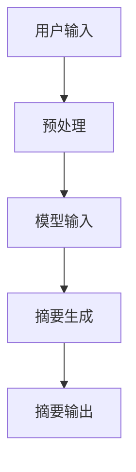
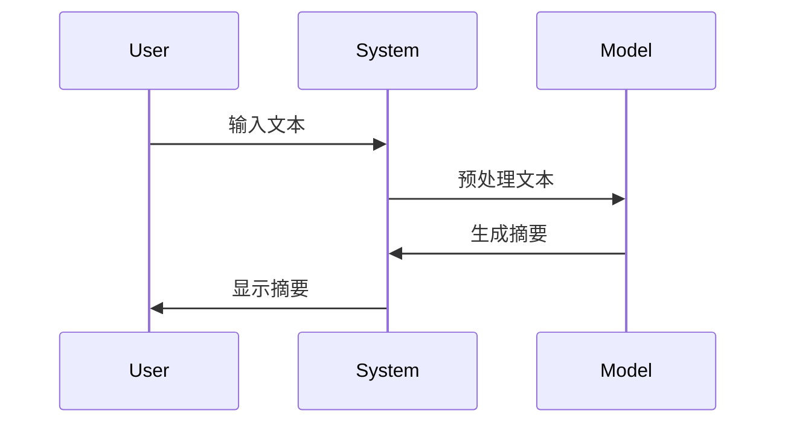
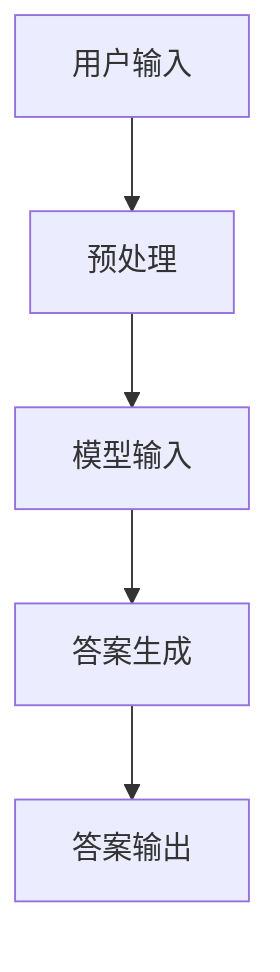
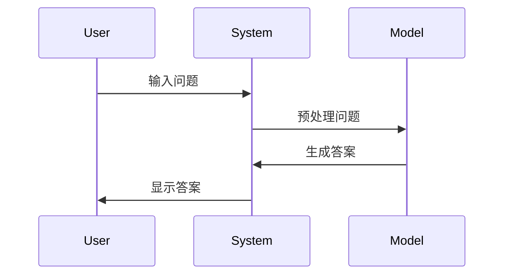
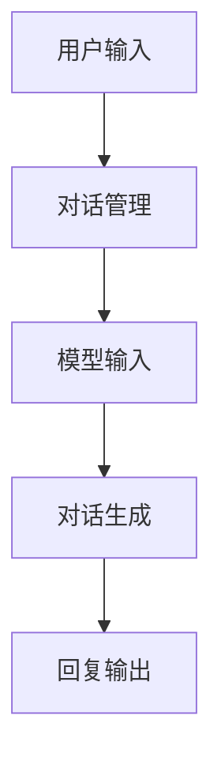
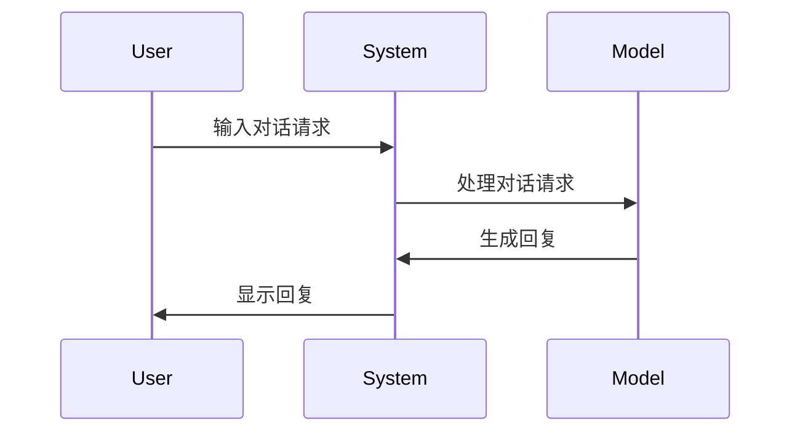

                 

### 第1章：版本控制概述

在软件工程和信息技术领域，版本控制是一种关键的实践，它确保了代码库的完整性、一致性和可追踪性。版本控制系统的核心功能是跟踪文件的变化，管理不同版本，并允许开发人员协同工作。首先，我们来理解什么是版本控制。

**版本控制的背景与重要性**

版本控制起源于软件开发领域，目的是解决多个开发人员在同一个代码库上协作时遇到的问题。在早期的编程实践中，开发人员会直接修改代码文件，这种做法不仅容易导致代码混淆，还难以追踪改动历史。为了解决这个问题，版本控制工具被引入，它们帮助开发者管理代码的变化，记录每次修改的详细信息，如谁在何时做了什么改动。

版本控制的重要性体现在以下几个方面：

1. **协同工作**：版本控制使多个开发人员可以同时工作在不同的功能模块上，而不必担心代码的冲突。
2. **回滚能力**：版本控制系统允许开发人员回滚到先前的版本，这对于解决紧急问题或错误非常有用。
3. **历史追踪**：版本控制系统提供了完整的历史记录，使开发人员可以了解每次更改的背景和原因。
4. **代码备份**：版本控制系统自动备份代码，防止数据丢失。

**版本控制的基本概念**

以下是版本控制中的几个基本概念：

- **版本**：每次对代码库进行的更改都被称为一个版本。版本通常通过一个递增的数字或时间戳来标识。
- **分支**：分支是代码库中的一个独立副本，允许开发人员在不同的环境中独立工作。
- **合并**：合并是将两个或多个分支的更改合并到一个共同分支的过程。
- **提交**：提交是将代码更改永久保存到版本控制系统的过程。
- **标签**：标签是给版本控制系统的某个特定版本打上的标记，通常用于标记里程碑或发布版本。

**版本控制系统的类型**

目前，市场上存在多种版本控制系统，其中最流行的是分布式版本控制系统（DVCS）和集中式版本控制系统（CVCS）。以下是它们的主要区别：

- **分布式版本控制系统（如Git）**：每个开发人员都有完整的代码库副本，可以离线工作，并独立进行提交和分支操作。
- **集中式版本控制系统（如SVN）**：所有代码库集中存储在一个中央服务器上，开发人员从服务器获取代码并提交更改。

分布式版本控制系统因其灵活性和高效性，已成为现代软件开发的首选。接下来，我们将进一步探讨Git这样的分布式版本控制系统的具体用法和优势。

### 第2章：LLM与prompt简介

在探讨版本控制与LLM（大型语言模型）的关系之前，我们需要先了解LLM和prompt的基本概念。LLM是自然语言处理领域的一种强大工具，而prompt则是引导模型生成预期输出的关键。

**LLM的基本原理**

LLM（Large Language Model）是一种基于深度学习技术的自然语言处理模型。它通过大量的文本数据进行预训练，以学习语言的结构和语义。这些模型通常包含数亿个参数，并使用复杂的神经网络架构，如Transformer，来捕捉语言中的长期依赖关系和细微差异。

LLM的核心原理在于其输入和输出过程。当给定一个文本输入时，LLM会生成一个概率分布，表示可能的后继文本序列。通过采样或 greedy search 等策略，LLM可以生成连贯且符合上下文的文本输出。

**prompt的作用与设计**

Prompt在LLM应用中起着至关重要的作用。它是指引导模型生成预期输出的提示或问题。一个好的prompt设计能够提高LLM的生成质量和准确性。

以下是一些设计prompt的关键原则：

1. **上下文相关性**：prompt应包含足够的信息，以确保生成的文本与上下文保持一致。
2. **明确性**：prompt应明确，避免模糊不清的指示，这有助于模型更好地理解任务目标。
3. **多样性**：多样性的prompt能够帮助模型生成更丰富的输出，避免重复或单一化的模式。
4. **简洁性**：简洁明了的prompt有助于模型更快地理解和生成输出。

在实际应用中，prompt的设计往往需要结合具体任务的需求。例如，在问答系统中，prompt通常是一个具体的问题；而在文本生成任务中，prompt可能是一个话题或一个简要的概述。

**示例**

让我们通过一个示例来具体说明LLM和prompt的应用。假设我们要使用LLM生成一篇关于人工智能技术的文章摘要。

- **prompt设计**：“请生成一篇关于人工智能技术的未来发展趋势的文章摘要。”

- **生成输出**：LLM会根据这个prompt生成一个摘要，例如：“人工智能技术正迅速发展，预计未来几年将出现更多突破，包括自动驾驶、智能家居和医疗诊断等领域的应用。然而，随之而来的挑战包括数据隐私和安全问题。因此，行业需要加强监管，确保人工智能技术的可持续发展。”

通过这个简单的示例，我们可以看到prompt在引导LLM生成特定输出方面的重要性。一个好的prompt设计不仅能够提高生成文本的质量，还能确保输出与预期目标一致。

### 第3章：prompt版本控制的方法

在了解了版本控制的基本概念和LLM与prompt的基本原理之后，我们接下来将深入探讨prompt版本控制的具体方法。prompt版本控制是确保LLM模型在迭代过程中保持一致性、可追溯性和可维护性的关键。

**prompt版本控制的基本流程**

prompt版本控制的基本流程包括以下几个关键步骤：

1. **初始化版本控制**：在开始任何prompt迭代之前，首先需要初始化版本控制系统，如Git。这包括创建一个代码库和配置版本控制工具。

2. **创建prompt文件**：将初始的prompt文件添加到版本控制系统中。这通常是一个文本文件，包含模型的训练数据和示例。

3. **提交prompt更改**：每次对prompt进行更改后，都需要将更改提交到版本控制系统。提交时，需要详细记录更改的内容和原因。

4. **分支管理**：在复杂的项目中，可能需要创建多个分支来管理不同的prompt版本。这有助于保持主分支的稳定性和可追踪性。

5. **合并分支**：当不同的分支准备好合并时，需要将它们合并到主分支。合并过程中需要仔细处理冲突，确保prompt的一致性。

6. **回滚和撤销**：如果发现错误的prompt更改，可以使用版本控制系统回滚到先前的版本，或者撤销特定的更改。

**prompt版本控制的最佳实践**

为了确保prompt版本控制的有效性，以下是一些最佳实践：

1. **详细的提交说明**：每次提交时，都应该提供详细的说明，包括更改的内容、原因和影响。

2. **代码审查**：在提交代码之前，进行代码审查可以减少错误和提高代码质量。

3. **定期备份**：定期备份代码库，以防万一出现数据丢失或损坏。

4. **使用分支策略**：合理使用分支策略，例如，Feature分支用于新功能的开发，Hotfix分支用于修复紧急问题。

5. **文档化**：确保所有版本控制操作都有文档记录，便于后续追踪和审查。

**prompt版本控制的挑战与解决方案**

尽管版本控制对于管理prompt非常有用，但在实际应用中仍会面临一些挑战：

1. **冲突管理**：多个开发人员同时对prompt进行更改时，可能会产生冲突。解决方法是使用合并工具和冲突解决策略，确保prompt的一致性。

2. **版本历史追踪**：维护一个清晰和可追踪的版本历史对于理解prompt的演变过程至关重要。使用版本控制系统可以轻松实现这一点。

3. **性能问题**：随着prompt和模型变得越来越大，版本控制系统的性能可能会受到影响。解决方法包括优化数据库性能、使用分布式存储方案等。

4. **权限管理**：确保只有授权的人员可以修改prompt，并跟踪谁做了哪些更改。权限管理可以帮助防止未经授权的更改。

通过遵循上述最佳实践和解决挑战，我们可以确保prompt版本控制的高效和可靠性，从而为LLM应用的迭代管理奠定坚实基础。

### 第4章：版本迭代管理策略

版本迭代管理是确保LLM应用在迭代过程中保持稳定性和可靠性的关键。有效的版本迭代管理策略有助于提高开发效率，减少错误，并确保最终产品的质量。

**版本迭代管理概述**

版本迭代管理是指对LLM应用的各个版本进行有序的开发、测试和部署过程。这个过程包括以下几个核心环节：

1. **需求分析**：明确每次迭代的目标和需求，确保开发团队和利益相关者对目标有一致的理解。

2. **功能设计**：基于需求分析，设计每个迭代的功能模块，确保每个功能模块都能够实现特定的业务需求。

3. **开发与测试**：开发团队根据功能设计进行代码编写，并开展单元测试、集成测试和系统测试，确保代码的质量和功能完整性。

4. **部署与上线**：将测试通过的功能模块部署到生产环境，并进行监控和运维，确保应用的稳定运行。

5. **反馈与优化**：收集用户反馈，对应用进行优化和改进，为下一次迭代做准备。

**版本迭代的生命周期管理**

版本迭代的生命周期可以分为以下几个阶段：

1. **规划阶段**：在这个阶段，开发团队会制定迭代计划，包括迭代周期、里程碑和任务分配。

2. **设计阶段**：功能设计和技术设计在此阶段完成，确保所有开发人员对迭代内容有清晰的认识。

3. **开发阶段**：开发人员根据设计文档进行编码实现，并开展单元测试，确保每个模块的功能正确。

4. **测试阶段**：集成测试和系统测试在此阶段进行，确保各个模块之间的交互和整体功能的稳定性。

5. **部署阶段**：通过自动化部署工具，将测试通过的功能模块部署到生产环境，并进行上线监控。

6. **维护阶段**：持续监控应用的运行状态，收集用户反馈，对应用进行优化和升级。

**版本迭代的优先级管理**

在版本迭代过程中，如何有效地管理优先级是确保项目成功的关键。以下是一些优先级管理策略：

1. **需求优先级**：根据业务价值和紧急程度，对需求进行优先级排序，确保重要和高频次需求优先开发。

2. **资源分配**：根据优先级分配开发资源，确保关键功能模块得到足够的关注和支持。

3. **风险评估**：对每个迭代的风险进行评估，识别潜在的问题和挑战，并制定相应的应对策略。

4. **反馈循环**：建立快速反馈机制，根据用户反馈和测试结果，及时调整优先级和开发计划。

通过科学的版本迭代管理策略，我们可以确保LLM应用在开发过程中保持有序、高效和可持续，从而实现持续改进和优化。

### 第5章：LLM应用案例剖析

为了更好地理解prompt版本控制在实际应用中的效果，我们将通过几个具体的LLM应用案例进行剖析。这些案例涵盖了文本生成、问答系统和对话生成等不同的应用场景，展示了如何通过prompt版本控制来管理迭代过程。

**案例一：文本生成应用**

在文本生成应用中，LLM被用来根据给定的提示生成文章、摘要或故事。这类应用的一个典型例子是生成新闻报道或科技文章摘要。

**场景介绍**：假设我们正在开发一个自动化新闻摘要系统，该系统能够根据原始新闻报道生成简短且准确的摘要。

**项目介绍**：项目团队使用了一个基于GPT-3的文本生成模型，并通过prompt来引导模型生成摘要。

**系统功能设计**：系统功能包括：
- 用户输入：提供原始新闻报道文本。
- 模型训练与部署：使用预训练的GPT-3模型，结合特定领域的训练数据进行微调。
- 摘要生成：根据输入文本生成摘要。

**系统架构设计**：系统架构图如下所示：



**系统接口设计**：接口设计如下：

- 用户接口：提供文本输入框和摘要输出框。
- 模型接口：接收预处理后的文本，生成摘要。

**系统交互序列图**：



**代码应用解读与分析**：

```python
# 文本预处理
def preprocess_text(text):
    # 进行文本清洗和格式化
    return cleaned_text

# 摘要生成
def generate_summary(text):
    cleaned_text = preprocess_text(text)
    summary = model.generate(cleaned_text)
    return summary

# 用户接口
def user_interface():
    text = input("请输入原始新闻报道文本：")
    summary = generate_summary(text)
    print("生成的摘要：", summary)
```

**实际案例分析**：

在实际应用中，通过版本控制管理，团队可以轻松地迭代和改进模型。例如，在某个版本中，团队发现摘要生成质量不稳定，因此他们通过以下步骤进行优化：

1. **创建分支**：在Git中创建一个新分支，用于进行摘要生成算法的改进。
2. **提交更改**：在分支中提交代码更改，包括改进的预处理步骤和模型调优。
3. **代码审查**：进行代码审查，确保更改的正确性和安全性。
4. **合并分支**：将改进后的分支合并到主分支，并部署到生产环境。

**项目小结**：

通过这个案例，我们可以看到prompt版本控制在文本生成应用中的重要作用。它不仅帮助团队管理迭代过程，还确保了模型的稳定性和生成质量的持续提升。

**案例二：问答系统应用**

问答系统是LLM应用的一个常见场景，它能够根据用户的问题生成详细的答案。

**场景介绍**：假设我们正在开发一个智能客服系统，该系统能够自动回答用户的问题。

**项目介绍**：项目团队使用了一个基于BERT的问答模型，并设计了多样化的prompt来提高问答质量。

**系统功能设计**：系统功能包括：
- 用户输入：接收用户的问题。
- 模型训练与部署：使用预训练的BERT模型，并结合大量问答数据进行微调。
- 答案生成：根据输入问题生成答案。

**系统架构设计**：系统架构图如下所示：



**系统接口设计**：接口设计如下：

- 用户接口：提供问题输入框和答案输出框。
- 模型接口：接收预处理后的问题，生成答案。

**系统交互序列图**：



**代码应用解读与分析**：

```python
# 问题预处理
def preprocess_question(question):
    # 进行文本清洗和格式化
    return cleaned_question

# 答案生成
def generate_answer(question):
    cleaned_question = preprocess_question(question)
    answer = model.generate(cleaned_question)
    return answer

# 用户接口
def user_interface():
    question = input("请输入您的问题：")
    answer = generate_answer(question)
    print("答案：", answer)
```

**实际案例分析**：

在实际应用中，团队通过版本控制来管理模型的迭代。例如，在一次迭代中，团队决定改进答案生成的准确性，他们采取了以下步骤：

1. **创建分支**：在Git中创建一个新分支，用于改进问答模型。
2. **提交更改**：在分支中提交改进的预处理步骤和模型调优。
3. **代码审查**：进行代码审查，确保更改的正确性和安全性。
4. **合并分支**：将改进后的分支合并到主分支，并部署到生产环境。

**项目小结**：

通过这个案例，我们可以看到prompt版本控制在问答系统中的应用效果。它帮助团队实现了模型的持续优化和迭代，提高了问答系统的用户体验。

**案例三：对话生成应用**

对话生成应用利用LLM生成与用户的自然对话，常见于聊天机器人或虚拟助手。

**场景介绍**：假设我们正在开发一个聊天机器人，能够与用户进行自然流畅的对话。

**项目介绍**：项目团队使用了一个基于ChatGPT的对话生成模型，并通过多样化的prompt来提升对话质量。

**系统功能设计**：系统功能包括：
- 用户输入：接收用户的对话请求。
- 模型训练与部署：使用预训练的ChatGPT模型，并结合对话数据进行微调。
- 对话生成：根据用户的输入生成相应的回复。

**系统架构设计**：系统架构图如下所示：



**系统接口设计**：接口设计如下：

- 用户接口：提供对话输入框和回复输出框。
- 模型接口：接收对话管理后的输入，生成回复。

**系统交互序列图**：



**代码应用解读与分析**：

```python
# 对话管理
def manage_conversation(user_input):
    # 进行对话管理和上下文处理
    return context

# 对话生成
def generate_response(context):
    response = model.generate(context)
    return response

# 用户接口
def user_interface():
    while True:
        user_input = input("您说：")
        if user_input == "退出":
            break
        context = manage_conversation(user_input)
        response = generate_response(context)
        print("机器人回复：", response)
```

**实际案例分析**：

在实际应用中，团队通过版本控制来管理对话生成模型的迭代。例如，在一次迭代中，团队决定改进对话的自然性和连贯性，他们采取了以下步骤：

1. **创建分支**：在Git中创建一个新分支，用于改进对话生成模型。
2. **提交更改**：在分支中提交改进的对话管理和模型调优。
3. **代码审查**：进行代码审查，确保更改的正确性和安全性。
4. **合并分支**：将改进后的分支合并到主分支，并部署到生产环境。

**项目小结**：

通过这个案例，我们可以看到prompt版本控制在对话生成应用中的重要性。它帮助团队实现了对话质量的持续提升和用户的良好体验。

综上所述，通过具体的文本生成、问答系统和对话生成应用案例，我们可以看到prompt版本控制在不同应用场景中的重要作用。它不仅帮助团队管理迭代过程，还确保了模型生成质量的持续提升。

### 第6章：prompt版本控制工具介绍

在LLM应用开发过程中，选择合适的版本控制工具至关重要。Git作为一种广泛使用的分布式版本控制系统，因其灵活性和高效性而成为开发者首选。以下我们将详细介绍Git的基本使用方法、分支管理以及其他常见的版本控制工具。

**Git的基本使用**

1. **安装Git**：首先，我们需要安装Git。在大多数操作系统上，Git可以通过包管理器轻松安装。例如，在Ubuntu上，可以使用以下命令：
   ```bash
   sudo apt-get install git
   ```

2. **初始化仓库**：创建一个新的Git仓库，进入目标目录，并运行以下命令：
   ```bash
   git init
   ```

3. **添加文件**：将文件添加到仓库，使用以下命令：
   ```bash
   git add <file>
   ```

4. **提交更改**：提交文件更改，并添加提交信息：
   ```bash
   git commit -m "Commit message"
   ```

5. **查看历史记录**：查看提交历史记录：
   ```bash
   git log
   ```

6. **克隆仓库**：克隆一个已有的Git仓库：
   ```bash
   git clone <repository-url>
   ```

**Git的分支管理**

1. **创建分支**：创建一个新的分支：
   ```bash
   git branch <branch-name>
   ```

2. **切换分支**：切换到指定的分支：
   ```bash
   git checkout <branch-name>
   ```

3. **合并分支**：将一个分支合并到另一个分支：
   ```bash
   git merge <branch-name>
   ```

4. **删除分支**：删除一个不用的分支：
   ```bash
   git branch -d <branch-name>
   ```

**其他版本控制工具介绍**

除了Git，还有其他一些流行的版本控制工具：

- **Mercurial（Hg）**：另一种分布式版本控制系统，与Git类似，但拥有一些不同的设计哲学。
- **Subversion（SVN）**：一种集中式版本控制系统，虽然不如Git流行，但仍然在一些组织中使用。
- **Bazaar**：另一种分布式版本控制系统，以其简单性和可扩展性而闻名。

**选择版本控制工具的考虑因素**

在选择版本控制工具时，需要考虑以下几个因素：

1. **团队规模**：对于大型团队，分布式版本控制系统（如Git）可能更合适，因为它提供了更好的协同工作和分支管理能力。
2. **项目复杂度**：对于复杂的跨平台项目，分布式版本控制系统可以提供更好的灵活性和分布式协作能力。
3. **社区支持和生态**：一个拥有强大社区和丰富插件的版本控制系统，可以提供更多的工具和资源来简化开发流程。
4. **性能和可靠性**：在关键业务场景中，选择一个性能稳定、可靠性高的版本控制系统至关重要。

通过了解和合理选择版本控制工具，我们可以更好地管理LLM应用的迭代过程，确保代码库的完整性和一致性。

### 第7章：prompt版本控制的高级技巧

在深入探讨prompt版本控制的高级技巧之前，我们需要认识到，随着LLM应用变得越来越复杂，版本控制的挑战也在增加。高级技巧能够帮助我们更高效地管理这些挑战，从而确保迭代过程的高效性和代码库的稳定性。

**高级版本合并技巧**

合并是版本控制中一个关键步骤，特别是在多个开发人员同时工作的情况下。以下是一些高级合并技巧：

1. **使用“cherry-pick”**：当需要将单个提交从一个分支合并到另一个分支时，可以使用cherry-pick。这比直接合并整个分支更加灵活。
   ```bash
   git cherry-pick <commit-hash>
   ```

2. **解决合并冲突**：当两个分支的更改冲突时，需要手动解决这些冲突。可以使用如下命令查看冲突文件：
   ```bash
   git status
   ```
   然后编辑冲突文件，手动解决冲突后，使用以下命令标记为已解决：
   ```bash
   git add <file>
   git commit -m "Resolved merge conflict"
   ```

3. **使用“rebase”**：rebase可以帮助保持提交历史的整洁。它将当前分支的更改应用到另一个分支的最新提交上。
   ```bash
   git rebase <branch-name>
   ```

**提交历史查看与修改**

查看和修改提交历史是版本控制中的重要功能，以下是一些相关技巧：

1. **查看提交历史**：使用如下命令可以查看提交历史：
   ```bash
   git log
   ```

2. **修改提交信息**：如果需要修改某个提交的日志信息，可以使用如下命令：
   ```bash
   git commit --amend -m "New commit message"
   ```

3. **删除提交**：如果某个提交有误，可以使用如下命令删除：
   ```bash
   git reset --hard <commit-hash>
   ```

4. **撤销更改**：使用如下命令可以撤销最近的一次更改：
   ```bash
   git revert <commit-hash>
   ```

**版本控制与持续集成**

持续集成（CI）是将代码自动化构建、测试和部署的过程。结合版本控制，CI可以确保每次代码提交都是可测试和可部署的。以下是一些与版本控制和CI相关的技巧：

1. **配置CI工具**：根据项目需求，配置CI工具（如Jenkins、Travis CI）以自动化构建和测试代码。
2. **触发构建**：设置触发构建的条件，例如，每次提交或每次合并请求。
3. **代码覆盖测试**：确保代码覆盖率达到预期，以便发现潜在的问题。
4. **部署**：将通过测试的代码部署到生产环境，可以使用自动化部署工具（如Ansible、Kubernetes）。

通过掌握这些高级技巧，我们可以更有效地管理LLM应用的迭代过程，确保代码库的完整性和一致性。这不仅有助于提高开发效率，还能减少潜在的错误和风险。

### 第8章：总结与展望

在本篇博客中，我们系统地探讨了prompt版本控制的核心概念、方法、应用案例以及高级技巧。通过详细的分析和具体案例，我们认识到prompt版本控制对于LLM应用的迭代管理至关重要。

**版本控制的重要性**

版本控制不仅确保了代码库的完整性和一致性，还提供了强大的协同工作和回滚能力。在LLM应用开发中，版本控制有助于管理模型的迭代过程，确保每次更改都能追溯和审查。通过详细的提交说明和分支管理，开发团队能够更好地协同工作，提高开发效率。

**LLM应用的发展趋势**

随着人工智能技术的不断进步，LLM应用正在各行各业中得到广泛应用。从文本生成、问答系统到对话生成，LLM的应用场景日益丰富。未来，LLM将继续推动自然语言处理的发展，带来更智能、更人性化的交互体验。

**未来版本的展望**

在未来的版本中，我们期待看到更多针对prompt版本控制的高级功能。例如，更智能的冲突解决算法、更高效的版本合并工具以及更紧密的与持续集成系统的集成。同时，随着LLM模型的不断增大和复杂化，版本控制工具也需要进行相应的优化，以应对更高的性能要求。

**拓展阅读**

对于希望深入了解版本控制与LLM应用的读者，以下是一些推荐的拓展阅读资源：

- 《版本控制指南：Git、SVN和Mercurial》
- 《深度学习自然语言处理：理论、算法与应用》
- 《Git权威指南：分布式版本控制工具》
- 《持续集成实践指南：构建可靠和高效的软件部署流程》

通过这些资源，读者可以进一步探索版本控制和LLM应用的深度知识，提升自己的技术能力。让我们共同期待版本控制与LLM应用在未来带来更多创新和突破。 

### 作者信息

作者：AI天才研究院/AI Genius Institute & 禅与计算机程序设计艺术 /Zen And The Art of Computer Programming

