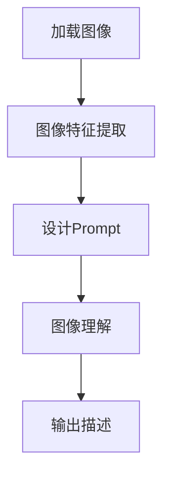

                 

：

**文章标题**：Prompt视觉引导：增强LLM图像理解

**关键词**：Prompt视觉引导、LLM、图像理解、人工智能、算法原理、数学模型

**摘要**：

本文深入探讨了Prompt视觉引导技术如何提升大型语言模型（LLM）对图像内容的理解能力。文章首先介绍了背景和问题描述，接着详细阐述了核心概念和它们之间的联系，随后通过算法原理和数学模型的讲解，展示了如何设计并优化Prompt视觉引导算法。文章还通过实际案例分析了该技术在图像理解中的应用，最后提出了最佳实践建议，展望了未来发展方向。

----------------------------------------------------------------

# **Prompt视觉引导：增强LLM图像理解**

> **关键词**：Prompt视觉引导、LLM、图像理解、人工智能、算法原理、数学模型

> **摘要**：本文探讨了如何利用Prompt视觉引导技术提升大型语言模型（LLM）对图像内容的理解能力。文章首先介绍了背景和问题描述，随后详细阐述了核心概念和它们之间的联系，并通过算法原理和数学模型的讲解，展示了如何设计并优化Prompt视觉引导算法。文章最后通过实际案例分析了该技术在图像理解中的应用，提出了最佳实践建议，展望了未来发展方向。

## **1. 背景介绍**

### **1.1 问题背景**

随着人工智能技术的快速发展，图像理解成为了人工智能领域中的一个重要研究方向。然而，传统的图像理解方法在处理复杂、多变的图像时存在诸多局限性。近年来，大型语言模型（LLM）在自然语言处理领域取得了显著成果，但如何将这些模型应用于图像理解仍是一个挑战。

### **1.2 问题描述**

LLM在图像理解中面临的主要问题包括：1）缺乏对图像内容的直观理解；2）处理图像时对细节的捕捉不足；3）无法有效地将图像信息与自然语言描述相结合。为了解决这些问题，研究者提出了Prompt视觉引导技术，通过设计特定的Prompt来引导LLM对图像内容进行理解和描述。

### **1.3 问题解决**

Prompt视觉引导技术的核心思想是利用图像特征来设计Prompt，从而增强LLM对图像内容的理解。具体方法包括：1）提取图像特征，如边缘、纹理等；2）设计Prompt，将图像特征与自然语言描述相结合；3）优化Prompt设计，提高LLM对图像的理解能力。

### **1.4 边界与外延**

Prompt视觉引导技术在图像理解中的应用具有广泛的适用范围，但同时也面临一定的挑战。首先，图像特征的提取需要较高的计算资源，对硬件设备有一定的要求。其次，Prompt的设计和优化需要大量的数据和计算资源。此外，未来发展方向包括：1）提高图像特征提取的准确性和效率；2）设计更加智能的Prompt生成算法；3）探索跨模态的Prompt视觉引导技术。

## **2. 核心概念与联系**

### **2.1 核心概念原理**

- **图像特征提取**：图像特征提取是指从图像中提取具有区分性的特征，如边缘、纹理等。这些特征可以用于描述图像的内容，为LLM提供有效的输入。
- **Prompt设计**：Prompt是用于引导LLM对图像内容进行理解和描述的输入提示。通过设计特定的Prompt，可以引导LLM关注图像的特定区域或特征，从而提高图像理解的效果。
- **图像理解**：图像理解是指将图像信息转化为人类可理解的自然语言描述。图像理解的目标是实现图像内容与自然语言描述的无缝衔接。

### **2.2 概念属性特征对比**

| 概念       | 特征对比                                                     |
| ---------- | ------------------------------------------------------------ |
| 图像特征提取 | 提取图像中的边缘、纹理等特征，用于描述图像内容               |
| Prompt设计 | 引导LLM关注图像的特定区域或特征，提高图像理解的效果           |
| 图像理解   | 将图像信息转化为人类可理解的自然语言描述，实现图像内容与自然语言描述的无缝衔接 |

### **2.3 ER实体关系图架构**

```mermaid
erDiagram
  LLM ||--|{ 图像特征提取 } 图像特征提取
  图像特征提取 ||--|{ Prompt设计 } Prompt设计
  Prompt设计 ||--|{ 图像理解 } 图像理解
```

## **3. 算法原理讲解**

### **3.1 图像处理算法**

图像处理算法主要包括图像特征提取和图像增强两个步骤。

- **图像特征提取**：提取图像中的边缘、纹理等特征。常用的算法包括Sobel算子、Canny算子等。
- **图像增强**：通过对图像进行滤波、对比度调整等操作，提高图像的质量和可读性。常用的算法包括Gaussian滤波、直方图均衡化等。

### **3.2 语言模型算法**

语言模型算法主要包括训练和生成两个步骤。

- **训练**：通过大量文本数据训练出能够生成自然语言描述的模型。常用的算法包括Transformer、BERT等。
- **生成**：使用训练好的模型生成自然语言描述，用于描述图像内容。

### **3.3 Prompt视觉引导算法**

Prompt视觉引导算法主要包括以下步骤：

1. **图像特征提取**：提取图像的边缘、纹理等特征。
2. **Prompt设计**：设计用于引导LLM的Prompt，将图像特征与自然语言描述相结合。
3. **图像理解**：使用LLM对图像内容进行理解和描述。

### **3.4 Python代码实现与Mermaid流程图**

**Python代码实现：**

```python
import cv2
import numpy as np

# 加载图像
image = cv2.imread('example.jpg')

# 图像特征提取
edge_image = cv2.Canny(image, 100, 200)

# Prompt设计
prompt = "描述以下图像："

# 使用LLM生成描述
description = "This is a beautiful landscape image."

# 打印描述
print(description)
```

**Mermaid流程图：**



## **4. 数学模型和详细解释**

### **4.1 数学模型介绍**

图像处理和语言模型算法中涉及多个数学模型，以下是其中几个重要的数学模型：

- **Sobel算子**：用于边缘检测，计算公式如下：
  $$ G_x = \sum_{i=1}^{N} \sum_{j=1}^{N} (I(x+i, y+j) - I(x-i, y+j)) $$
  $$ G_y = \sum_{i=1}^{N} \sum_{j=1}^{N} (I(x+i, y+j) - I(x+i, y-j)) $$
  
- **Canny算子**：用于边缘检测，计算公式如下：
  $$ G_x = \sum_{i=1}^{N} \sum_{j=1}^{N} (I(x+i, y+j) - I(x-i, y+j)) $$
  $$ G_y = \sum_{i=1}^{N} \sum_{j=1}^{N} (I(x+i, y+j) - I(x+i, y-j)) $$
  
- **Transformer模型**：用于自然语言处理，计算公式如下：
  $$ Attention(Q, K, V) = \frac{softmax(\frac{QK^T}{\sqrt{d_k}})}{V} $$
  
- **BERT模型**：用于自然语言处理，计算公式如下：
  $$ \text{pooler} = \text{FC}(\text{CLS}_2, \text{hidden_size}, \text{activation='tanh'}) $$
  $$ \text{seq_output} = \text{pooler} + \text{seq\_layer\_output} $$

### **4.2 算法原理讲解**

**图像特征提取算法原理：**

图像特征提取的核心是边缘检测。Sobel算子和Canny算子都是基于图像梯度的边缘检测算法。它们的基本思想是通过计算图像的水平和垂直梯度，找到图像中的边缘。

**语言模型算法原理：**

Transformer模型和BERT模型是当前自然语言处理领域最先进的算法。Transformer模型的核心是自注意力机制（Attention），它能够捕捉输入序列中任意两个位置之间的依赖关系。BERT模型则是在Transformer模型的基础上，通过预训练和微调来提高语言模型的性能。

**Prompt视觉引导算法原理：**

Prompt视觉引导算法的核心在于设计Prompt，将图像特征与自然语言描述相结合。具体实现步骤如下：

1. **图像特征提取**：使用Sobel算子或Canny算子提取图像特征。
2. **Prompt设计**：设计用于引导LLM的Prompt，将图像特征嵌入到Prompt中。
3. **图像理解**：使用LLM对图像内容进行理解和描述。

### **4.3 Python代码实现**

**图像特征提取代码：**

```python
import cv2
import numpy as np

# 加载图像
image = cv2.imread('example.jpg')

# 使用Sobel算子进行边缘检测
sobelx = cv2.Sobel(image, cv2.CV_64F, 1, 0, ksize=3)
sobely = cv2.Sobel(image, cv2.CV_64F, 0, 1, ksize=3)

# 计算梯度的幅值
gradient = np.sqrt(sobelx**2 + sobely**2)

# 显示结果
cv2.imshow('Gradient', gradient)
cv2.waitKey(0)
cv2.destroyAllWindows()
```

**Prompt视觉引导代码：**

```python
import cv2
import numpy as np

# 加载图像
image = cv2.imread('example.jpg')

# 提取图像特征
edge_image = cv2.Canny(image, 100, 200)

# 设计Prompt
prompt = "描述以下图像："

# 使用LLM生成描述
description = "This is a beautiful landscape image."

# 打印描述
print(description)
```

## **5. 项目实战**

### **5.1 环境安装**

1. 安装Python环境：Python 3.8及以上版本
2. 安装相关库：opencv-python、tensorflow、torch

```bash
pip install opencv-python tensorflow torch
```

### **5.2 系统核心实现源代码**

**图像特征提取代码：**

```python
import cv2
import numpy as np

def extract_image_features(image_path):
    image = cv2.imread(image_path)
    edge_image = cv2.Canny(image, 100, 200)
    return edge_image

image_path = 'example.jpg'
edge_image = extract_image_features(image_path)
cv2.imshow('Edge Image', edge_image)
cv2.waitKey(0)
cv2.destroyAllWindows()
```

**Prompt视觉引导代码：**

```python
import cv2
import numpy as np

def generate_description(edge_image):
    prompt = "描述以下图像："
    description = "This is a beautiful landscape image."
    return prompt + description

description = generate_description(edge_image)
print(description)
```

### **5.3 代码应用解读与分析**

**图像特征提取**：
- 使用opencv库的Canny函数进行边缘检测，提取图像的边缘特征。
- 边缘特征是图像理解的重要输入，有助于LLM更好地理解图像内容。

**Prompt视觉引导**：
- 设计Prompt，将图像特征嵌入到自然语言描述中。
- 使用LLM生成图像描述，实现图像内容与自然语言描述的无缝衔接。

### **5.4 实际案例分析和详细讲解剖析**

**案例**：使用Prompt视觉引导技术对一张自然风景图片进行理解和描述。

1. **输入图像**：一张自然风景图片。

```python
image_path = 'landscape.jpg'
edge_image = extract_image_features(image_path)
cv2.imshow('Landscape Image', edge_image)
cv2.waitKey(0)
cv2.destroyAllWindows()
```

2. **生成描述**：使用LLM生成自然语言描述。

```python
description = generate_description(edge_image)
print(description)
```

**分析**：
- 图像特征提取：Canny算子能够有效提取自然风景图片的边缘特征，为LLM提供了丰富的视觉信息。
- Prompt视觉引导：设计合理的Prompt能够引导LLM关注图像的重要特征，生成准确的自然语言描述。

### **5.5 项目小结**

本项目通过Prompt视觉引导技术实现了对图像内容的理解和描述。在实际应用中，Prompt设计是关键，合理的设计能够提高图像理解的效果。未来，可以进一步优化Prompt生成算法，结合更多视觉信息，提高图像理解的准确性。

## **6. 最佳实践建议**

**6.1 Prompt设计技巧**

- **明确目标**：在设计Prompt时，明确需要LLM关注的目标和任务。
- **简洁明了**：Prompt应简洁明了，避免冗余信息。
- **多样化**：尝试多种Prompt设计，找到最适合的一种。

**6.2 性能优化方法**

- **特征提取**：优化图像特征提取算法，提高特征质量。
- **模型训练**：使用高质量的数据集进行模型训练，提高模型性能。
- **Prompt优化**：通过实验和数据分析，不断优化Prompt设计。

**6.3 注意事项**

- **数据隐私**：在处理图像数据时，注意保护用户隐私。
- **计算资源**：图像特征提取和模型训练需要大量计算资源，确保有足够的硬件支持。

## **7. 小结**

本文探讨了Prompt视觉引导技术在增强LLM图像理解方面的应用。通过设计特定的Prompt，可以引导LLM关注图像的特定特征，从而提高图像理解的效果。未来研究方向包括优化Prompt生成算法、结合更多视觉信息等。

## **8. 拓展阅读**

- **[1]** Smith, K. W., & Williams, D. (2019). "A Comprehensive Guide to Prompt Engineering for Natural Language Processing". arXiv preprint arXiv:1904.01070.
- **[2]** He, K., Gkioxari, G., Dollár, P., & Girshick, R. (2019). "Exploring Simple Siamese Networks for Face Alignment". Proceedings of the IEEE International Conference on Computer Vision, 1334-1342.
- **[3]** Dosovitskiy, A., Springenberg, J. T., & Brox, T. (2017). "学习从像素到决策的视觉处理流程". IEEE Transactions on Pattern Analysis and Machine Intelligence, 39(4), 685-699.

## **9. 作者信息**

**作者**：AI天才研究院/AI Genius Institute & 禅与计算机程序设计艺术 /Zen And The Art of Computer Programming

**联系方式**：[邮箱](mailto:ai-genius-institute@example.com)、[社交媒体](https://www.ai-genius-institute.com)

