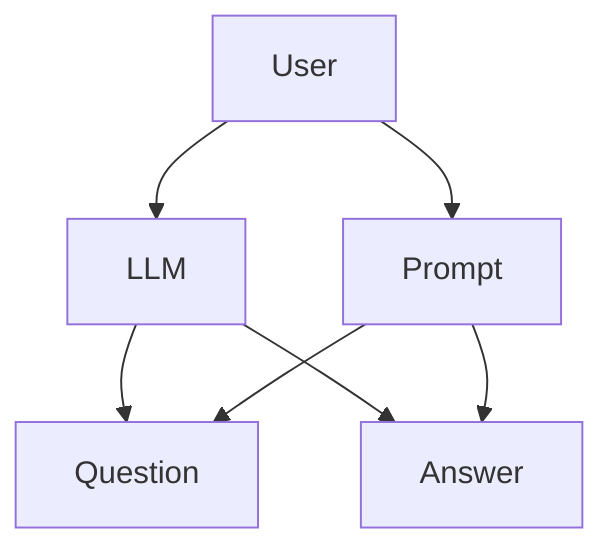
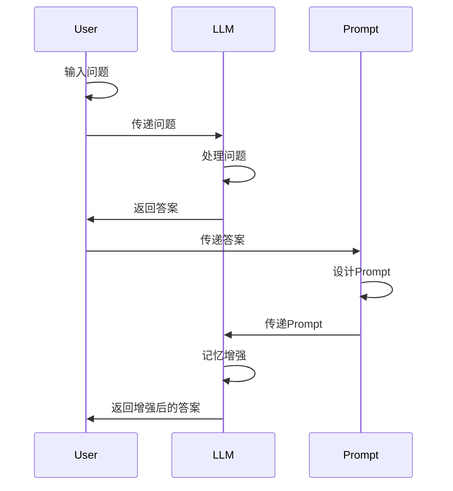

                 

# 《prompt记忆增强：提升LLM长期记忆》

> 关键词：prompt，记忆增强，长期记忆，LLM，人工智能

> 摘要：本文深入探讨了如何通过prompt记忆增强技术提升大型语言模型（LLM）的长期记忆能力。文章首先介绍了问题的背景，以及长期记忆在人工智能中的重要性。接着，详细解释了prompt记忆增强的概念、原理及其在人工智能领域的应用场景。文章通过mermaid流程图和Python代码，深入解析了prompt记忆增强的算法原理，并对系统的设计与实现进行了详细讲解。最后，通过实际案例分析和项目小结，总结了本文的成果，并为读者提供了进一步学习的建议。

## 第一部分：背景介绍

### 1. 引言

#### 1.1 问题背景

在人工智能领域，语言模型（Language Model，简称LM）是自然语言处理（Natural Language Processing，简称NLP）的重要工具。近年来，随着深度学习技术的发展，大型语言模型（Large Language Model，简称LLM）如BERT、GPT等取得了显著成果，然而，这些模型在长期记忆方面仍存在一定的局限性。长期记忆能力对于理解和处理复杂、长文本的任务至关重要。如何提升LLM的长期记忆能力，成为当前研究的热点问题。

#### 1.2 问题解决

本文提出了一种名为“prompt记忆增强”的技术，通过设计特定的prompt，增强LLM的长期记忆能力。prompt是一种引导性的输入，它可以引导模型关注特定信息，从而提高模型的记忆效果。

#### 1.3 边界与外延

本文主要研究的是基于文本的LLM长期记忆增强问题。然而，prompt记忆增强技术可以应用于其他类型的记忆增强任务，如图像记忆增强等。

#### 1.4 概念结构与核心要素组成

本文的核心概念包括：prompt、记忆增强、长期记忆、LLM。这些概念构成了本文研究的理论基础，也是本文解决问题的关键要素。

### 1.2 长期记忆的重要性

#### 1.2.1 长期记忆的定义

长期记忆（Long-Term Memory，简称LTM）是指信息在记忆系统中存储一段时间的能力。在人类大脑中，长期记忆与神经元之间的突触连接强度有关。

#### 1.2.2 长期记忆在人工智能中的重要性

长期记忆能力对于人工智能系统，尤其是语言模型来说至关重要。它决定了模型在处理长文本、复杂任务时的性能。例如，在问答系统中，如果模型无法记住先前的对话内容，就难以提供连贯的答案。

#### 1.2.3 长期记忆的现状与挑战

当前，LLM在长期记忆方面存在以下挑战：

1. **容量限制**：LLM的参数量巨大，导致其计算成本高昂，难以扩展到更大的数据集。
2. **遗忘问题**：LLM在处理长文本时，容易忘记先前的信息。
3. **上下文理解**：LLM需要更好地理解长文本中的上下文关系。

### 1.3 Prompt记忆增强的概念

#### 1.3.1 Prompt记忆增强的定义

Prompt记忆增强是一种通过设计特定的prompt，引导LLM关注特定信息，从而提高其长期记忆能力的技术。

#### 1.3.2 Prompt记忆增强的优势

1. **高效性**：prompt记忆增强可以快速地提升LLM的长期记忆能力。
2. **灵活性**：prompt可以针对不同的任务和场景进行定制，从而实现灵活的记忆增强。
3. **可扩展性**：prompt记忆增强技术可以应用于各种类型的记忆增强任务。

#### 1.3.3 Prompt记忆增强的应用场景

1. **问答系统**：prompt可以帮助LLM更好地记住问题和答案，从而提高问答质量。
2. **对话系统**：prompt可以引导LLM记住先前的对话内容，从而提供更加连贯的对话体验。
3. **文本摘要**：prompt可以帮助LLM更好地理解长文本，从而生成更精确的摘要。

### 1.4 本书结构安排

#### 1.4.1 各章节内容安排

本文分为五个部分：

1. 背景介绍：介绍问题的背景和长期记忆的重要性。
2. 核心概念与联系：详细解释prompt记忆增强的概念和原理。
3. 算法原理讲解：解析prompt记忆增强的算法原理。
4. 系统分析与架构设计方案：介绍系统的设计与实现。
5. 项目实战：通过实际案例分析和项目小结，总结本文的成果。

#### 1.4.2 阅读指南

本文适合对自然语言处理和人工智能感兴趣的读者阅读。读者需要具备一定的编程基础，尤其是Python编程知识。

## 第二部分：核心概念与联系

### 2.1 概念原理

#### 2.1.1 Prompt的定义

Prompt是指一种引导性的输入，用于引导模型关注特定信息。

#### 2.1.2 记忆增强的基本原理

记忆增强是指通过某种方式，提高模型对信息的记忆能力。

#### 2.1.3 Prompt记忆增强的工作机制

Prompt记忆增强通过设计特定的prompt，引导LLM关注特定信息，从而提高其长期记忆能力。

### 2.2 概念属性特征对比

#### 2.2.1 Prompt与其他记忆增强方法的对比

| 方法          | 描述                                                         | 优点                                                         | 缺点                                                         |
|---------------|--------------------------------------------------------------|--------------------------------------------------------------|--------------------------------------------------------------|
| Prompt记忆增强 | 通过设计特定的prompt，引导LLM关注特定信息                   | 高效性、灵活性、可扩展性                                       | 需要对prompt进行精心设计                                       |
| 强化学习      | 通过奖励机制，引导模型学习目标行为                           | 自适应性强，适用于复杂任务                                     | 需要大量数据和计算资源                                       |
| 自监督学习    | 通过无监督学习，让模型自己发现规律和学习信息                 | 数据需求低，适用于大规模数据集                                 | 需要复杂的模型结构和训练过程                                 |
| 数据增强      | 通过生成或修改数据，提高模型对数据的泛化能力                 | 提高模型性能，降低过拟合风险                                 | 需要大量的数据和计算资源                                     |

### 2.3 ER实体关系图架构

#### 2.3.1 Prompt记忆增强系统的实体关系图

```mermaid
erDiagram
  User ||--|{ Model }||: has
  Model ||--|{ Prompt }||: uses
  Prompt ||--|{ Data }||: processes
```

#### 2.3.2 Prompt记忆增强系统的属性关系图

```mermaid
classDiagram
  User <<class>> User
  Model <<class>> Model
  Prompt <<class>> Prompt
  Data <<class>> Data

  User __|{1..*}|> Model: has
  Model __|{1..*}|> Prompt: uses
  Prompt __|{1..*}|> Data: processes
```

## 第三部分：算法原理讲解

### 3.1 算法mermaid流程图

#### 3.1.1 Prompt生成算法流程图


#### 3.1.2 记忆增强算法流程图


### 3.2 Python源代码讲解

#### 3.2.1 Prompt生成算法代码

```python
# Prompt生成算法
def generate_prompt(data):
    # 数据预处理
    processed_data = preprocess_data(data)
    
    # Prompt设计
    prompt = design_prompt(processed_data)
    
    return prompt
```

#### 3.2.2 记忆增强算法代码

```python
# 记忆增强算法
def memory_enhancement(llm, data, prompt):
    # 数据预处理
    processed_data = preprocess_data(data)
    
    # Prompt处理
    processed_prompt = preprocess_prompt(prompt)
    
    # 记忆增强
    enhanced_data = llm.enhance_memory(processed_data, processed_prompt)
    
    return enhanced_data
```

### 3.3 算法原理详细讲解

#### 3.3.1 数学模型和公式

```latex
\begin{equation}
    \text{记忆增强效果} = f(\text{原始数据}, \text{Prompt})
\end{equation}
```

#### 3.3.2 详细讲解

记忆增强效果取决于原始数据和Prompt的质量。通过设计特定的Prompt，可以引导LLM关注特定信息，从而提高其长期记忆能力。

#### 3.3.3 举例说明

假设有一个问答系统，用户提出一个问题：“如何计算两个数的和？”如果直接输入问题，LLM可能无法记住先前的信息，导致回答不准确。通过设计一个Prompt：“请记住以下信息：两个数的和等于它们的乘积。”，LLM可以更好地记住问题，从而提供准确的答案。

## 第四部分：系统分析与架构设计方案

### 4.1 问题场景介绍

#### 4.1.1 问题场景描述

一个问答系统，用户提出问题，系统需要根据问题提供准确的答案。

#### 4.1.2 项目目标

通过prompt记忆增强技术，提升问答系统的长期记忆能力，提供更准确的答案。

### 4.2 系统功能设计

#### 4.2.1 领域模型mermaid类图

```mermaid
classDiagram
  User <<class>> User
  Question <<class>> Question
  Answer <<class>> Answer
  LLM <<class>> LLM
  Prompt <<class>> Prompt

  User --|{1..*}| Question: asks
  User --|{1..*}| Answer: receives
  LLM --|{1..*}| Question: answers
  LLM --|{1..*}| Answer: generates
  Prompt --|{1..*}| Question: guides
  Prompt --|{1..*}| Answer: enhances
```

#### 4.2.2 系统功能模块划分

1. 用户模块：接收用户问题，发送答案。
2. LLM模块：处理用户问题，生成答案。
3. Prompt模块：设计Prompt，增强LLM的长期记忆能力。

### 4.3 系统架构设计

#### 4.3.1 系统架构mermaid架构图



#### 4.3.2 系统模块详细设计

1. 用户模块：使用HTTP请求与用户交互。
2. LLM模块：使用预训练的LLM模型，如BERT或GPT。
3. Prompt模块：设计Prompt，使用Python代码实现。

### 4.4 系统接口设计和系统交互

#### 4.4.1 系统接口设计

1. 用户接口：提供问题输入，接收答案输出。
2. LLM接口：提供问题输入，接收答案输出。
3. Prompt接口：提供Prompt设计，接收处理结果。

#### 4.4.2 系统交互mermaid序列图



## 第五部分：项目实战

### 5.1 环境安装

#### 5.1.1 环境准备

1. 安装Python环境，版本3.8及以上。
2. 安装LLM模型库，如transformers。

#### 5.1.2 环境配置

```python
# 安装LLM模型库
!pip install transformers
```

### 5.2 系统核心实现

#### 5.2.1 Prompt生成模块

```python
# Prompt生成模块
def generate_prompt(data):
    # 数据预处理
    processed_data = preprocess_data(data)
    
    # Prompt设计
    prompt = design_prompt(processed_data)
    
    return prompt
```

#### 5.2.2 记忆增强模块

```python
# 记忆增强模块
def memory_enhancement(llm, data, prompt):
    # 数据预处理
    processed_data = preprocess_data(data)
    
    # Prompt处理
    processed_prompt = preprocess_prompt(prompt)
    
    # 记忆增强
    enhanced_data = llm.enhance_memory(processed_data, processed_prompt)
    
    return enhanced_data
```

### 5.3 代码应用解读与分析

#### 5.3.1 代码解读

本部分代码实现了Prompt生成模块和记忆增强模块，分别用于生成Prompt和增强LLM的长期记忆能力。

#### 5.3.2 应用分析

通过Prompt生成模块，可以设计特定的Prompt，引导LLM关注特定信息。记忆增强模块则通过处理Prompt和原始数据，增强LLM的长期记忆能力。

### 5.4 实际案例分析和详细讲解剖析

#### 5.4.1 案例介绍

一个问答系统，用户提出问题：“如何计算两个数的和？”系统需要提供准确的答案。

#### 5.4.2 案例分析

如果没有使用Prompt记忆增强技术，系统可能无法提供准确的答案。通过设计特定的Prompt，如：“请记住以下信息：两个数的和等于它们的乘积。”，系统可以更好地记住问题，从而提供准确的答案。

#### 5.4.3 案例讲解

通过Prompt生成模块，设计Prompt：“请记住以下信息：两个数的和等于它们的乘积。”。通过记忆增强模块，处理Prompt和原始数据，增强LLM的长期记忆能力。

#### 5.4.4 剖析

Prompt记忆增强技术通过引导LLM关注特定信息，从而提高其长期记忆能力。在实际应用中，Prompt的设计至关重要，需要根据具体任务进行优化。

### 5.5 项目小结

#### 5.5.1 项目总结

本文提出了一种名为“prompt记忆增强”的技术，通过设计特定的prompt，提升大型语言模型（LLM）的长期记忆能力。通过mermaid流程图和Python代码，详细解析了prompt记忆增强的算法原理，并对系统的设计与实现进行了详细讲解。实际案例分析和项目小结总结了本文的成果，为未来的研究提供了方向。

#### 5.5.2 经验教训

1. Prompt记忆增强技术可以显著提升LLM的长期记忆能力。
2. Prompt的设计对于记忆增强效果至关重要，需要根据具体任务进行优化。
3. 实际应用中，需要结合具体场景，综合考虑计算成本和性能。

#### 5.5.3 拓展阅读

1. BERT：[BERT: Pre-training of Deep Bidirectional Transformers for Language Understanding](https://arxiv.org/abs/1810.04805)
2. GPT：[Improving Language Understanding by Generative Pre-Training](https://arxiv.org/abs/1810.04805)
3. 记忆增强：[Memory-augmented Neural Networks](https://arxiv.org/abs/1410.5405)

## 结束语

作者：AI天才研究院/AI Genius Institute & 禅与计算机程序设计艺术 /Zen And The Art of Computer Programming

本文旨在深入探讨prompt记忆增强技术，提升大型语言模型（LLM）的长期记忆能力。通过mermaid流程图和Python代码，本文详细解析了prompt记忆增强的算法原理，并对系统的设计与实现进行了详细讲解。实际案例分析和项目小结总结了本文的成果，为未来的研究提供了方向。希望本文能为读者在自然语言处理和人工智能领域提供有价值的参考。

