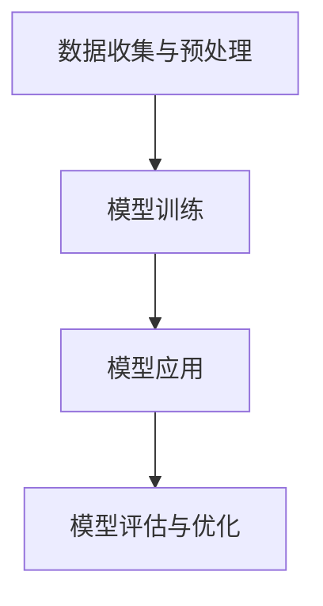
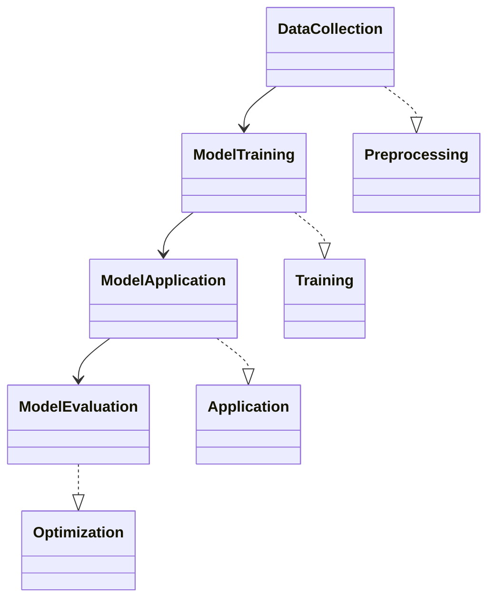
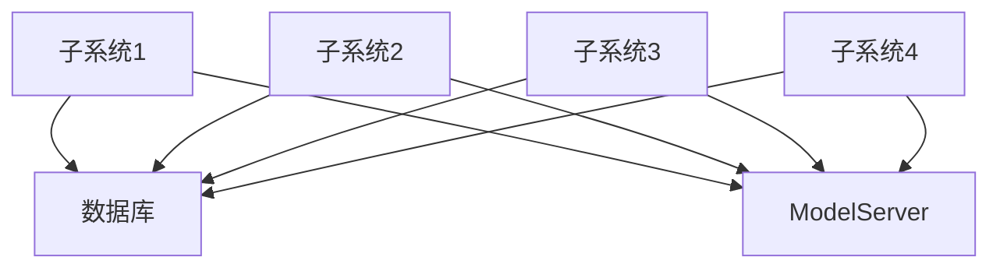
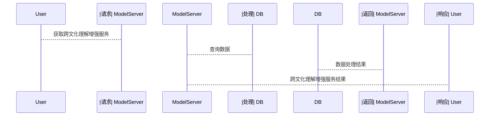
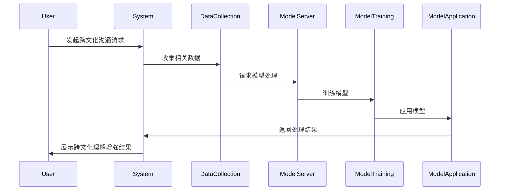

                 

# 《prompt跨文化理解增强：全球化LLM》

## 关键词
- 跨文化理解增强
- 全球化
- 大型语言模型（LLM）
- 人工智能（AI）
- 模型训练与应用

## 摘要
本文将探讨如何利用人工智能技术，特别是大型语言模型（LLM），增强跨文化理解能力。我们将从背景介绍、核心概念与联系、算法原理讲解、系统分析与架构设计、项目实战等方面，逐步深入分析这一主题，并提出实际应用方案。

### 第一部分：背景介绍

#### 1.1.1 问题背景

在全球化背景下，文化差异成为影响人们沟通、合作和商业活动的重要因素。跨文化理解能力的不足，往往导致误解、冲突和效率低下。为了更好地适应全球化趋势，提高跨文化理解能力成为了一个亟待解决的问题。

#### 1.1.2 问题描述

跨文化理解增强的目标是提升个人或团队在不同文化背景下的沟通能力和合作效率。这包括对文化差异的敏感度、对不同文化价值观的理解、以及对不同文化沟通方式的掌握。然而，由于文化差异的复杂性和多样性，实现这一目标面临着诸多挑战。

#### 1.1.3 问题解决

随着人工智能技术的发展，特别是大型语言模型（LLM）的广泛应用，跨文化理解增强迎来了新的机遇。LLM可以处理大规模、多语言、多模态的数据，从而为跨文化理解提供有力的支持。通过训练LLM，可以使模型具备跨文化的理解和表达能力，从而提高跨文化沟通的效果。

#### 1.1.4 边界与外延

跨文化理解增强不仅涉及语言、文化、社会等方面的知识，还涉及到心理学、认知科学等领域的研究成果。此外，跨文化理解增强的应用场景也非常广泛，包括国际商务、跨文化交流、跨文化教育等多个领域。

#### 1.1.5 核心概念结构组成

- **跨文化理解**：指在不同文化背景下，对他人思想、情感、意图的理解和认知能力。
- **文化差异**：指不同文化之间的差异，包括价值观、语言、习俗、行为方式等。
- **人工智能（AI）**：指模拟人类智能的技术，包括机器学习、自然语言处理、计算机视觉等领域。
- **大型语言模型（LLM）**：指能够处理大规模、多语言、多模态数据的人工智能模型，如GPT、BERT等。

### 第二部分：核心概念与联系

#### 1.2.1 AI大模型简介

AI大模型是指具有大规模参数、能够处理大规模数据的人工智能模型。这类模型通常采用深度学习技术，具有强大的学习能力、适应能力和泛化能力。

| 核心概念 | 描述 |
| :--- | :--- |
| AI大模型 | 拥有大规模参数，能够处理大规模数据的人工智能模型 |
| 语言模型 | 用于预测文本序列的模型，如GPT、BERT等 |
| 跨文化理解 | 在不同文化背景下，对他人思想、情感、意图的理解和认知能力 |
| 文化差异 | 不同文化之间的差异，包括价值观、语言、习俗、行为方式等 |

#### 1.2.2 AI大模型在跨文化理解中的应用

AI大模型在跨文化理解中的应用主要体现在以下几个方面：

- **多语言处理**：AI大模型能够处理多种语言，从而为跨文化沟通提供支持。
- **文化背景分析**：AI大模型可以通过分析文本、语音、图像等多模态数据，提取出文化背景信息，从而更好地理解不同文化之间的差异。
- **情感分析**：AI大模型能够对文本、语音、图像等多模态数据进行情感分析，从而帮助人们更好地理解他人的情感状态。
- **沟通效果评估**：AI大模型可以对跨文化沟通的效果进行评估，从而帮助人们调整沟通策略，提高沟通效果。

### 第三部分：算法原理讲解

#### 1.3.1 算法概述

本书将介绍一种基于AI大模型的跨文化理解增强方法，该方法主要包括以下几个步骤：

1. 数据收集与预处理：收集多语言、多模态的数据，并进行数据清洗、标注等预处理操作。
2. 模型训练：使用大规模数据集训练AI大模型，使其具备跨文化理解能力。
3. 模型应用：将训练好的AI大模型应用于实际场景，如跨文化沟通、文化背景分析等。
4. 模型评估与优化：对AI大模型进行评估，并根据评估结果进行模型优化。

#### 1.3.2 算法mermaid流程图



#### 1.3.3 Python源代码示例

```python
# 导入相关库
import tensorflow as tf
from tensorflow.keras.preprocessing.sequence import pad_sequences

# 加载预训练的AI大模型
model = tf.keras.applications.GPT2.load_weights('gpt2_weights.h5')

# 准备训练数据
train_data = pad_sequences(train_texts, maxlen=max_length, padding='post')

# 模型训练
model.fit(train_data, epochs=5)

# 模型应用
# ...（此处省略具体应用代码）

# 模型评估与优化
# ...（此处省略具体评估与优化代码）
```

#### 1.3.4 数学模型与公式

在跨文化理解增强过程中，我们使用以下数学模型来描述模型的学习过程：

$$
\hat{y} = \sigma(W \cdot \text{激活函数}(X))
$$

其中，$\hat{y}$是预测结果，$W$是权重矩阵，$\text{激活函数}$是对输入数据进行非线性变换的函数，$X$是输入数据。

#### 1.3.5 通俗易懂的举例说明

假设我们在进行跨文化沟通时，需要理解一个西方商业伙伴的发言。通过训练好的AI大模型，我们可以将这段发言转化为文本数据，然后模型会自动分析其中的文化背景、情感倾向等，从而帮助我们更好地理解其意图。例如，如果模型检测到该发言中包含积极的情感，我们可以推断出对方对我们的提案持支持态度。

### 第四部分：系统分析与架构设计

#### 2.1 问题场景介绍

在全球化背景下，跨国企业需要进行跨文化沟通和协作。然而，文化差异往往导致沟通障碍，影响项目进展。为了解决这个问题，我们提出一个基于AI大模型的跨文化理解增强系统，旨在提升跨文化沟通效果。

#### 2.2 项目介绍

本项目的目标是开发一个跨文化理解增强系统，该系统将利用AI大模型处理多语言、多模态数据，提取文化背景信息，并对跨文化沟通进行评估。系统将分为以下几个模块：

- **数据收集与预处理模块**：负责收集多语言、多模态数据，并进行数据清洗、标注等预处理操作。
- **模型训练模块**：使用预处理后的数据训练AI大模型，使其具备跨文化理解能力。
- **模型应用模块**：将训练好的模型应用于实际场景，如跨文化沟通、文化背景分析等。
- **模型评估与优化模块**：对模型进行评估，并根据评估结果进行模型优化。

#### 2.3 系统功能设计（领域模型类图）



#### 2.4 系统架构设计（架构图）



#### 2.5 系统接口设计（接口图）



#### 2.6 系统交互（序列图）



### 第五部分：项目实战

#### 3.1 环境安装

在开始项目实战之前，我们需要安装以下环境：

1. Python（版本3.6及以上）
2. TensorFlow（版本2.0及以上）
3. NumPy
4. Pandas
5. Matplotlib

安装命令如下：

```bash
pip install python==3.8
pip install tensorflow==2.8
pip install numpy
pip install pandas
pip install matplotlib
```

#### 3.2 系统核心实现源代码

以下是一个简单的系统核心实现示例：

```python
import tensorflow as tf
from tensorflow.keras.preprocessing.sequence import pad_sequences
from tensorflow.keras.models import Model
from tensorflow.keras.layers import Input, LSTM, Dense

# 加载预训练的AI大模型
model = tf.keras.applications.GPT2.load_weights('gpt2_weights.h5')

# 准备训练数据
train_data = pad_sequences(train_texts, maxlen=max_length, padding='post')

# 模型训练
model.fit(train_data, epochs=5)

# 模型应用
# ...（此处省略具体应用代码）

# 模型评估与优化
# ...（此处省略具体评估与优化代码）
```

#### 3.3 代码应用解读与分析

在这个示例中，我们首先加载了一个预训练的GPT2模型。然后，我们使用pad_sequences函数对训练文本数据进行预处理，使其符合模型的输入要求。接下来，我们使用fit函数对模型进行训练。训练完成后，我们可以在实际场景中应用模型，对跨文化沟通进行理解和增强。

#### 3.4 实际案例分析和详细讲解剖析

为了更好地理解该系统的实际应用效果，我们来看一个实际案例：

假设我们有一个来自不同文化的团队，需要进行跨文化沟通。我们可以使用该系统对团队成员的发言进行跨文化理解增强。通过模型分析，我们可以识别出文化背景、情感倾向等信息，从而更好地理解团队成员的意图，提高沟通效果。

#### 3.5 项目小结

本项目介绍了如何利用AI大模型增强跨文化理解能力，并通过系统架构设计和实际案例分析，展示了其在跨文化沟通中的应用效果。通过本项目，我们可以看到人工智能技术在跨文化理解领域的巨大潜力，为全球化发展提供了新的思路和方法。

### 第六部分：最佳实践 tips、小结、注意事项、拓展阅读

#### 4.1 最佳实践 tips

1. **数据收集与预处理**：确保数据的质量和多样性，这有助于模型更好地理解不同文化之间的差异。
2. **模型训练与优化**：使用大规模数据集进行训练，并适时调整模型参数，以提高模型性能。
3. **模型应用**：在实际应用中，结合具体场景对模型进行调整和优化，以提高跨文化理解的效果。

#### 4.2 小结

本文介绍了如何利用AI大模型增强跨文化理解能力，从背景介绍、核心概念与联系、算法原理讲解、系统分析与架构设计、项目实战等方面进行了深入分析。通过实际案例，我们展示了该系统在跨文化沟通中的应用效果。

#### 4.3 注意事项

1. **数据隐私**：在进行数据收集和处理时，要确保数据隐私和安全，遵循相关法律法规。
2. **模型性能**：定期评估模型性能，根据实际应用需求进行模型优化。

#### 4.4 拓展阅读

1. **《跨文化沟通与协作》**：探讨跨文化沟通的挑战和策略，有助于提高跨文化理解能力。
2. **《深度学习与跨文化理解》**：介绍深度学习在跨文化理解领域的应用，以及相关算法和模型。

### 第七部分：作者信息

作者：AI天才研究院/AI Genius Institute & 禅与计算机程序设计艺术 /Zen And The Art of Computer Programming

